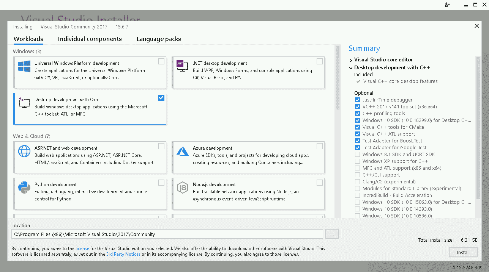
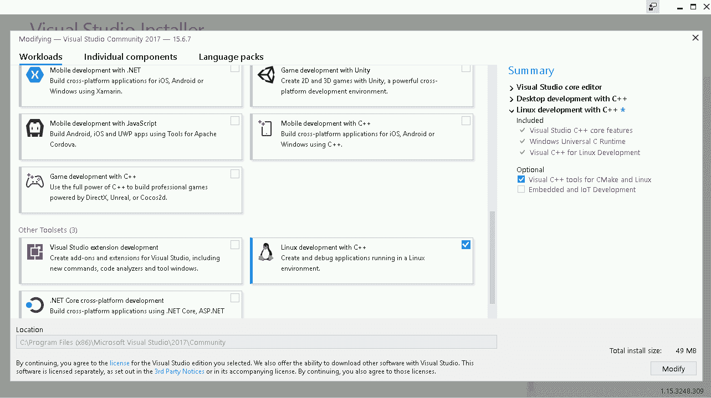
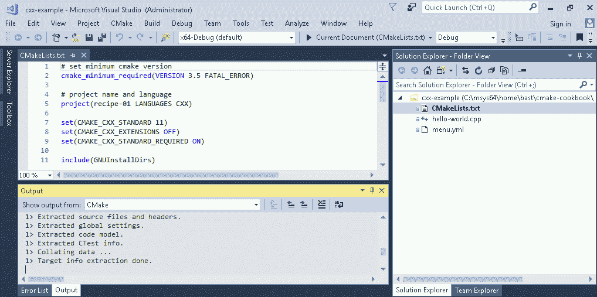
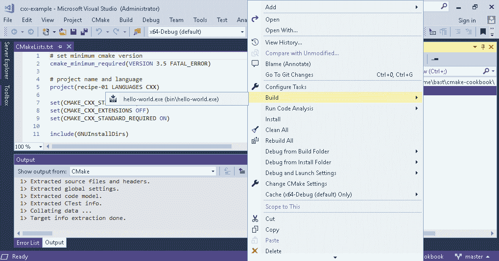
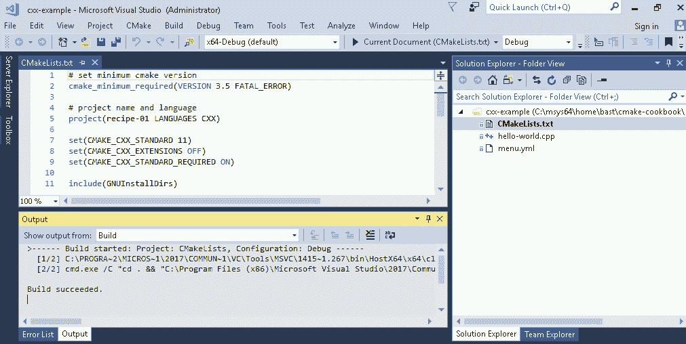
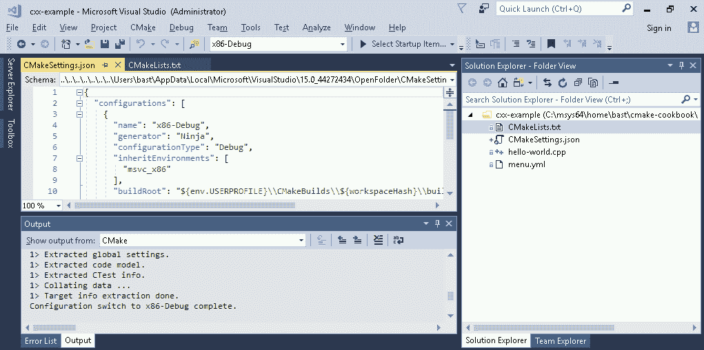

# 第十四章：替代生成器和跨编译

在本章中，我们将介绍以下内容：

+   在 Visual Studio 中构建 CMake 项目

+   跨编译一个 hello world 示例

+   使用 OpenMP 并行化跨编译 Windows 二进制文件

# 引言

CMake 本身并不构建可执行文件和库。相反，CMake 配置一个项目并*生成*由另一个构建工具或框架用来构建项目的文件。在 GNU/Linux 和 macOS 上，CMake 通常生成 Unix Makefiles，但存在许多替代方案。在 Windows 上，这些通常是 Visual Studio 项目文件或 MinGW 或 MSYS Makefiles。CMake 包含了一系列针对本地命令行构建工具或集成开发环境（IDEs）的生成器。您可以在以下链接了解更多信息：[`cmake.org/cmake/help/latest/manual/cmake-generators.7.html`](https://cmake.org/cmake/help/latest/manual/cmake-generators.7.html)。

这些生成器可以使用`cmake -G`来选择，例如：

```cpp
$ cmake -G "Visual Studio 15 2017"
```

并非所有生成器在每个平台上都可用，根据 CMake 运行的平台，通常只有一部分可用。要查看当前平台上所有可用的生成器列表，请输入以下内容：

```cpp
$ cmake -G
```

在本章中，我们不会遍历所有可用的生成器，但我们注意到本书中的大多数配方都使用`Unix Makefiles`、`MSYS Makefiles`、`Ninja`和`Visual Studio 15 2017`生成器进行了测试。在本章中，我们将专注于在 Windows 平台上进行开发。我们将演示如何直接使用 Visual Studio 15 2017 构建 CMake 项目，而不使用命令行。我们还将讨论如何在 Linux 或 macOS 系统上跨编译 Windows 可执行文件。

# 使用 Visual Studio 2017 构建 CMake 项目

本配方的代码可在[`github.com/dev-cafe/cmake-cookbook/tree/v1.0/chapter-13/recipe-01`](https://github.com/dev-cafe/cmake-cookbook/tree/v1.0/chapter-13/recipe-01)找到，并包含一个 C++示例。该配方适用于 CMake 版本 3.5（及以上），并在 Windows 上进行了测试。

虽然早期的 Visual Studio 版本要求开发者在不同的窗口中编辑源代码和运行 CMake 命令，但 Visual Studio 2017 引入了对 CMake 项目的内置支持（[`aka.ms/cmake`](https://aka.ms/cmake)），允许整个编码、配置、构建和测试工作流程在同一个 IDE 中发生。在本节中，我们将测试这一点，并直接使用 Visual Studio 2017 构建一个简单的“hello world”CMake 示例项目，而不求助于命令行。

# 准备工作

首先，我们将使用 Windows 平台，下载并安装 Visual Studio Community 2017（[`www.visualstudio.com/downloads/`](https://www.visualstudio.com/downloads/)）。在撰写本文时，该版本可免费使用 30 天试用期。我们将遵循的步骤也在此视频中得到了很好的解释：[`www.youtube.com/watch?v=_lKxJjV8r3Y`](https://www.youtube.com/watch?v=_lKxJjV8r3Y)。

在运行安装程序时，请确保在左侧面板中选择“使用 C++的桌面开发”，并验证“Visual C++工具用于 CMake”在右侧的摘要面板中被选中：



在 Visual Studio 2017 15.4 中，您还可以为 Linux 平台编译代码。为此，请在其他工具集中选择“Linux 开发与 C++”：



启用此选项后，您可以从 Visual Studio 内部为 Windows 和 Linux 机器编译代码，前提是您已配置了对 Linux 服务器的访问。但是，我们不会在本章中演示这种方法。

在本节中，我们将在 Windows 上构建 Windows 二进制文件，我们的目标是配置和构建以下示例代码（`hello-world.cpp`）：

```cpp
#include <cstdlib>
#include <iostream>
#include <string>

const std::string cmake_system_name = SYSTEM_NAME;

int main() {
  std::cout << "Hello from " << cmake_system_name << std::endl;

  return EXIT_SUCCESS;
}
```

# 操作方法

要创建相应的源代码，请按照以下步骤操作：

1.  创建一个目录并将`hello-world.cpp`文件放入新创建的目录中。

1.  在此目录中，创建一个`CMakeLists.txt`文件，其中包含以下内容：

```cpp
# set minimum cmake version
cmake_minimum_required(VERSION 3.5 FATAL_ERROR)

# project name and language
project(recipe-01 LANGUAGES CXX)

set(CMAKE_CXX_STANDARD 11)
set(CMAKE_CXX_EXTENSIONS OFF)
set(CMAKE_CXX_STANDARD_REQUIRED ON)

include(GNUInstallDirs)
set(CMAKE_ARCHIVE_OUTPUT_DIRECTORY
  ${CMAKE_BINARY_DIR}/${CMAKE_INSTALL_LIBDIR})
set(CMAKE_LIBRARY_OUTPUT_DIRECTORY
  ${CMAKE_BINARY_DIR}/${CMAKE_INSTALL_LIBDIR})
set(CMAKE_RUNTIME_OUTPUT_DIRECTORY
  ${CMAKE_BINARY_DIR}/${CMAKE_INSTALL_BINDIR})

# define executable and its source file
add_executable(hello-world hello-world.cpp)

# we will print the system name in the code
target_compile_definitions(hello-world
  PUBLIC
    "SYSTEM_NAME=\"${CMAKE_SYSTEM_NAME}\""
  )

install(
  TARGETS
    hello-world
  DESTINATION
    ${CMAKE_INSTALL_BINDIR}
  )
```

1.  打开 Visual Studio 2017，然后导航到包含源文件和`CMakeLists.txt`的新建文件夹，通过以下方式：文件 | 打开 | 文件夹。

1.  一旦文件夹打开，请注意 CMake 配置步骤是如何自动运行的（底部面板）：



1.  现在，我们可以右键单击`CMakeLists.txt`（右侧面板）并选择“构建”：



1.  这构建了项目（请参见底部面板的输出）：



1.  这样就成功编译了可执行文件。在下一个子节中，我们将学习如何定位可执行文件，并可能更改构建和安装路径。

# 工作原理

我们已经看到，Visual Studio 2017 很好地与 CMake 接口，并且我们已经能够从 IDE 内部配置和构建代码。除了构建步骤，我们还可以运行安装或测试步骤。这些可以通过右键单击`CMakeLists.txt`（右侧面板）来访问。

然而，配置步骤是自动运行的，我们可能更倾向于修改配置选项。我们还希望知道实际的构建和安装路径，以便我们可以测试我们的可执行文件。为此，我们可以选择 CMake | 更改 CMake 设置，然后我们到达以下屏幕：



在左上角的面板中，我们现在可以检查和修改生成器（在本例中为 Ninja）、设置、参数以及路径。构建路径在上面的截图中突出显示。设置被分组到构建类型（`x86-Debug`、`x86-Release`等）中，我们可以在顶部面板栏的中间在这些构建类型之间切换。

现在我们知道实际的构建路径，我们可以测试编译的可执行文件：

```cpp
$ ./hello-world.exe

Hello from Windows
```

当然，构建和安装路径可以进行调整。

# 另请参阅

+   Visual Studio 中的 CMake 支持：[`aka.ms/cmake`](https://aka.ms/cmake)

+   使用 CMake 进行 Linux 开发的 Visual C++：[`blogs.msdn.microsoft.com/vcblog/2017/08/25/visual-c-for-linux-development-with-cmake/`](https://blogs.msdn.microsoft.com/vcblog/2017/08/25/visual-c-for-linux-development-with-cmake/)

+   Visual Studio 的官方文档：[`www.visualstudio.com/vs/features/ide/`](https://www.visualstudio.com/vs/features/ide/)

# 交叉编译一个“Hello World”示例

本配方的代码可在[`github.com/dev-cafe/cmake-cookbook/tree/v1.0/chapter-13/recipe-01`](https://github.com/dev-cafe/cmake-cookbook/tree/v1.0/chapter-13/recipe-01)找到，并包含一个 C++示例。本配方适用于 CMake 版本 3.5（及以上），并在 GNU/Linux 和 macOS 上进行了测试。

在本配方中，我们将重用上一个配方中的“Hello World”示例，并从 Linux 或 macOS 交叉编译到 Windows。换句话说，我们将在 Linux 或 macOS 上配置和编译代码，并获得一个 Windows 平台的可执行文件。

# 准备工作

我们从一个简单的“Hello World”示例开始（`hello-world.cpp`）：

```cpp
#include <cstdlib>
#include <iostream>
#include <string>

const std::string cmake_system_name = SYSTEM_NAME;

int main() {
  std::cout << "Hello from " << cmake_system_name << std::endl;

  return EXIT_SUCCESS;
}
```

我们还将使用上一个配方中未更改的`CMakeLists.txt`：

```cpp
# set minimum cmake version
cmake_minimum_required(VERSION 3.5 FATAL_ERROR)

# project name and language
project(recipe-01 LANGUAGES CXX)

set(CMAKE_CXX_STANDARD 11)
set(CMAKE_CXX_EXTENSIONS OFF)
set(CMAKE_CXX_STANDARD_REQUIRED ON)

include(GNUInstallDirs)
set(CMAKE_ARCHIVE_OUTPUT_DIRECTORY
  ${CMAKE_BINARY_DIR}/${CMAKE_INSTALL_LIBDIR})
set(CMAKE_LIBRARY_OUTPUT_DIRECTORY
  ${CMAKE_BINARY_DIR}/${CMAKE_INSTALL_LIBDIR})
set(CMAKE_RUNTIME_OUTPUT_DIRECTORY
  ${CMAKE_BINARY_DIR}/${CMAKE_INSTALL_BINDIR})

# define executable and its source file
add_executable(hello-world hello-world.cpp)

# we will print the system name in the code
target_compile_definitions(hello-world
  PUBLIC
    "SYSTEM_NAME=\"${CMAKE_SYSTEM_NAME}\""
  )

install(
  TARGETS
    hello-world
  DESTINATION
    ${CMAKE_INSTALL_BINDIR}
  )
```

为了交叉编译源代码，我们需要安装一个 C++的交叉编译器，以及可选的 C 和 Fortran 编译器。一个选项是使用打包的 MinGW 编译器。作为打包的交叉编译器的替代方案，我们还可以使用 MXE（M 交叉环境）从源代码构建一套交叉编译器：[`mxe.cc`](http://mxe.cc)。

# 如何操作

我们将按照以下步骤在这个交叉编译的“Hello World”示例中创建三个文件：

1.  创建一个目录，其中包含`hello-world.cpp`和前面列出的`CMakeLists.txt`。

1.  创建一个`toolchain.cmake`文件，其中包含以下内容：

```cpp
# the name of the target operating system
set(CMAKE_SYSTEM_NAME Windows)

# which compilers to use
set(CMAKE_CXX_COMPILER i686-w64-mingw32-g++)

# adjust the default behaviour of the find commands:
# search headers and libraries in the target environment
set(CMAKE_FIND_ROOT_PATH_MODE_INCLUDE ONLY)
set(CMAKE_FIND_ROOT_PATH_MODE_LIBRARY ONLY)
# search programs in the host environment
set(CMAKE_FIND_ROOT_PATH_MODE_PROGRAM NEVER)
```

1.  将`CMAKE_CXX_COMPILER`调整为相应的编译器（路径）。

1.  然后，通过指向`CMAKE_TOOLCHAIN_FILE`到工具链文件来配置代码（在本例中，使用了从源代码构建的 MXE 编译器）：

```cpp
$ mkdir -p build
$ cd build
$ cmake -D CMAKE_TOOLCHAIN_FILE=toolchain.cmake .. 
-- The CXX compiler identification is GNU 5.4.0
-- Check for working CXX compiler: /home/user/mxe/usr/bin/i686-w64-mingw32.static-g++
-- Check for working CXX compiler: /home/user/mxe/usr/bin/i686-w64-mingw32.static-g++ -- works
-- Detecting CXX compiler ABI info
-- Detecting CXX compiler ABI info - done
-- Detecting CXX compile features
-- Detecting CXX compile features - done
-- Configuring done
-- Generating done
-- Build files have been written to: /home/user/cmake-recipes/chapter-13/recipe-01/cxx-example/build
```

1.  现在，让我们构建可执行文件：

```cpp
$ cmake --build .

Scanning dependencies of target hello-world
[ 50%] Building CXX object CMakeFiles/hello-world.dir/hello-world.cpp.obj
[100%] Linking CXX executable bin/hello-world.exe
[100%] Built target hello-world
```

1.  请注意，我们在 Linux 上获得了`hello-world.exe`。将二进制文件复制到 Windows 计算机。

1.  在 Windows 计算机上，我们可以观察到以下输出：

```cpp
Hello from Windows
```

1.  如您所见，该二进制文件在 Windows 上运行！

# 它是如何工作的

由于我们在与目标环境（Windows）不同的宿主环境（在这种情况下，GNU/Linux 或 macOS）上配置和构建代码，我们需要向 CMake 提供有关目标环境的信息，我们已经在`toolchain.cmake`文件中对其进行了编码（[`cmake.org/cmake/help/latest/manual/cmake-toolchains.7.html#cross-compiling`](https://cmake.org/cmake/help/latest/manual/cmake-toolchains.7.html#cross-compiling)）。

首先，我们提供目标操作系统的名称：

```cpp
set(CMAKE_SYSTEM_NAME Windows)
```

然后，我们指定编译器，例如：

```cpp
set(CMAKE_C_COMPILER i686-w64-mingw32-gcc)
set(CMAKE_CXX_COMPILER i686-w64-mingw32-g++)
set(CMAKE_Fortran_COMPILER i686-w64-mingw32-gfortran)
```

在这个简单的例子中，我们不需要检测任何库或头文件，但如果需要，我们将使用以下方式指定根路径：

```cpp
set(CMAKE_FIND_ROOT_PATH /path/to/target/environment)
```

目标环境可以是例如由 MXE 安装提供的环境。

最后，我们调整 find 命令的默认行为。我们指示 CMake 在目标环境中搜索头文件和库：

```cpp
set(CMAKE_FIND_ROOT_PATH_MODE_INCLUDE ONLY)
set(CMAKE_FIND_ROOT_PATH_MODE_LIBRARY ONLY)
```

并在宿主环境中搜索程序：

```cpp
set(CMAKE_FIND_ROOT_PATH_MODE_PROGRAM NEVER)
```

# 另请参阅

有关各种选项的更详细讨论，请参阅[`cmake.org/cmake/help/latest/manual/cmake-toolchains.7.html#cross-compiling`](https://cmake.org/cmake/help/latest/manual/cmake-toolchains.7.html#cross-compiling)。

# 使用 OpenMP 并行化交叉编译 Windows 二进制文件

本食谱的代码可在[`github.com/dev-cafe/cmake-cookbook/tree/v1.0/chapter-13/recipe-02`](https://github.com/dev-cafe/cmake-cookbook/tree/v1.0/chapter-13/recipe-02)找到，并包含 C++和 Fortran 示例。本食谱适用于 CMake 版本 3.9（及以上），并在 GNU/Linux 上进行了测试。

在本食谱中，我们将应用在前一个食谱中学到的知识，尽管是针对一个更有趣和更现实的例子：我们将交叉编译一个使用 OpenMP 并行化的 Windows 二进制文件。

# 准备工作

我们将使用第三章，*检测外部库和程序*，食谱 5，*检测 OpenMP 并行环境*中的未修改源代码。示例代码计算所有自然数到*N*的总和（`example.cpp`）：

```cpp
#include <iostream>
#include <omp.h>
#include <string>

int main(int argc, char *argv[]) {
  std::cout << "number of available processors: " << omp_get_num_procs()
            << std::endl;
  std::cout << "number of threads: " << omp_get_max_threads() << std::endl;

  auto n = std::stol(argv[1]);
  std::cout << "we will form sum of numbers from 1 to " << n << std::endl;

  // start timer
  auto t0 = omp_get_wtime();

  auto s = 0LL;
#pragma omp parallel for reduction(+ : s)
  for (auto i = 1; i <= n; i++) {
    s += i;
  }

  // stop timer
  auto t1 = omp_get_wtime();

  std::cout << "sum: " << s << std::endl;
  std::cout << "elapsed wall clock time: " << t1 - t0 << " seconds" << std::endl;

  return 0;
}
```

`CMakeLists.txt`文件与第三章，*检测外部库和程序*，食谱 5，*检测 OpenMP 并行环境*相比，基本上没有变化，除了增加了一个安装目标：

```cpp
# set minimum cmake version
cmake_minimum_required(VERSION 3.9 FATAL_ERROR)

# project name and language
project(recipe-02 LANGUAGES CXX)

set(CMAKE_CXX_STANDARD 11)
set(CMAKE_CXX_EXTENSIONS OFF)
set(CMAKE_CXX_STANDARD_REQUIRED ON)

include(GNUInstallDirs)
set(CMAKE_ARCHIVE_OUTPUT_DIRECTORY
  ${CMAKE_BINARY_DIR}/${CMAKE_INSTALL_LIBDIR})
set(CMAKE_LIBRARY_OUTPUT_DIRECTORY
  ${CMAKE_BINARY_DIR}/${CMAKE_INSTALL_LIBDIR})
set(CMAKE_RUNTIME_OUTPUT_DIRECTORY
  ${CMAKE_BINARY_DIR}/${CMAKE_INSTALL_BINDIR})

find_package(OpenMP REQUIRED)

add_executable(example example.cpp)

target_link_libraries(example
  PUBLIC
    OpenMP::OpenMP_CXX
  )

install(
  TARGETS
    example
  DESTINATION
    ${CMAKE_INSTALL_BINDIR}
  )
```

# 如何操作

通过以下步骤，我们将能够交叉编译一个使用 OpenMP 并行化的 Windows 可执行文件：

1.  创建一个目录，其中包含之前列出的`example.cpp`和`CMakeLists.txt`。

1.  我们将使用与前一个食谱相同的`toolchain.cmake`：

```cpp
# the name of the target operating system
set(CMAKE_SYSTEM_NAME Windows)

# which compilers to use
set(CMAKE_CXX_COMPILER i686-w64-mingw32-g++)

# adjust the default behaviour of the find commands:
# search headers and libraries in the target environment
set(CMAKE_FIND_ROOT_PATH_MODE_INCLUDE ONLY)
set(CMAKE_FIND_ROOT_PATH_MODE_LIBRARY ONLY)
# search programs in the host environment
set(CMAKE_FIND_ROOT_PATH_MODE_PROGRAM NEVER)
```

1.  将`CMAKE_CXX_COMPILER`调整为相应的编译器（路径）。

1.  然后，通过指向`CMAKE_TOOLCHAIN_FILE`到工具链文件来配置代码（在本例中，使用了从源代码构建的 MXE 编译器）：

```cpp
$ mkdir -p build
$ cd build
$ cmake -D CMAKE_TOOLCHAIN_FILE=toolchain.cmake .. 
-- The CXX compiler identification is GNU 5.4.0
-- Check for working CXX compiler: /home/user/mxe/usr/bin/i686-w64-mingw32.static-g++
-- Check for working CXX compiler: /home/user/mxe/usr/bin/i686-w64-mingw32.static-g++ -- works
-- Detecting CXX compiler ABI info
-- Detecting CXX compiler ABI info - done
-- Detecting CXX compile features
-- Detecting CXX compile features - done
-- Found OpenMP_CXX: -fopenmp (found version "4.0")
-- Found OpenMP: TRUE (found version "4.0")
-- Configuring done
-- Generating done
-- Build files have been written to: /home/user/cmake-recipes/chapter-13/recipe-02/cxx-example/build
```

1.  现在，让我们构建可执行文件：

```cpp
$ cmake --build .

Scanning dependencies of target example
[ 50%] Building CXX object CMakeFiles/example.dir/example.cpp.obj
[100%] Linking CXX executable bin/example.exe
[100%] Built target example
```

1.  将二进制文件`example.exe`复制到 Windows 计算机。

1.  在 Windows 计算机上，我们可以看到以下示例输出：

```cpp
$ set OMP_NUM_THREADS=1
$ example.exe 1000000000

number of available processors: 2
number of threads: 1
we will form sum of numbers from 1 to 1000000000
sum: 500000000500000000
elapsed wall clock time: 2.641 seconds

$ set OMP_NUM_THREADS=2
$ example.exe 1000000000

number of available processors: 2
number of threads: 2
we will form sum of numbers from 1 to 1000000000
sum: 500000000500000000
elapsed wall clock time: 1.328 seconds
```

1.  正如我们所见，二进制文件在 Windows 上运行，并且我们可以观察到由于 OpenMP 并行化带来的速度提升！

# 它是如何工作的

我们已成功使用简单的工具链进行交叉编译，在 Windows 平台上构建了用于并行执行的可执行文件。我们能够通过设置`OMP_NUM_THREADS`来指定 OpenMP 线程的数量。从 1 个线程增加到 2 个线程，我们观察到运行时间从 2.6 秒减少到 1.3 秒。有关工具链文件的讨论，请参阅之前的配方。

# 还有更多

可以为一组目标平台进行交叉编译，例如 Android。有关示例，我们请读者参考[`cmake.org/cmake/help/latest/manual/cmake-toolchains.7.html`](https://cmake.org/cmake/help/latest/manual/cmake-toolchains.7.html)。
