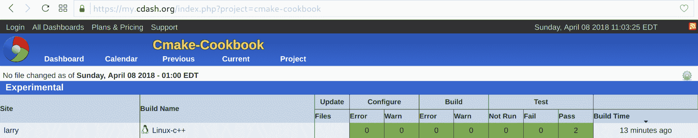
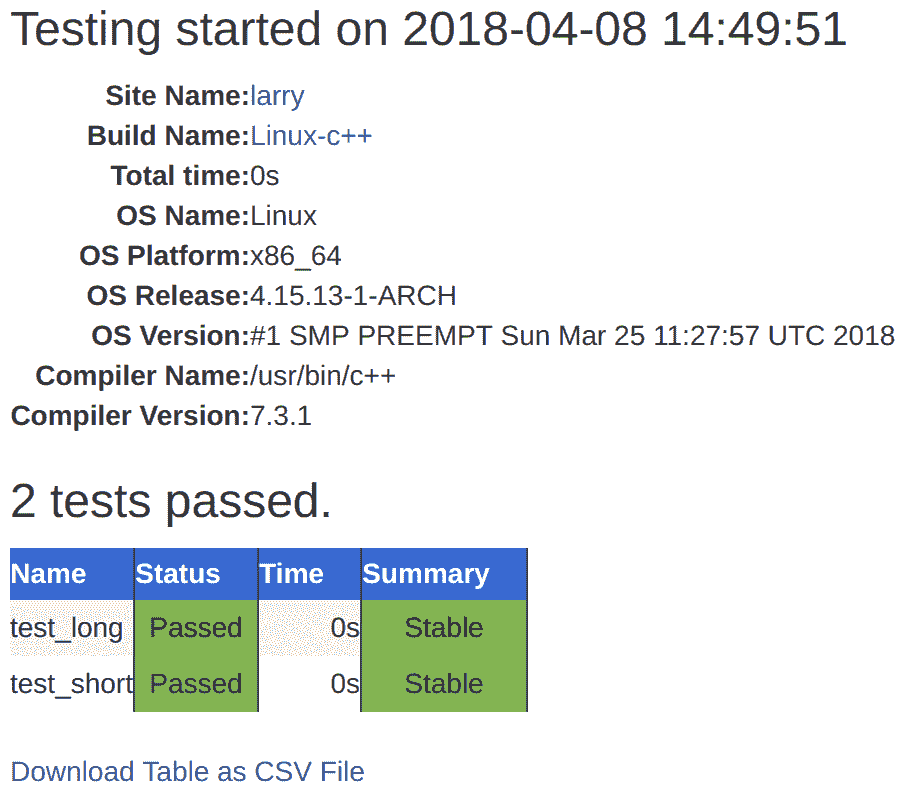
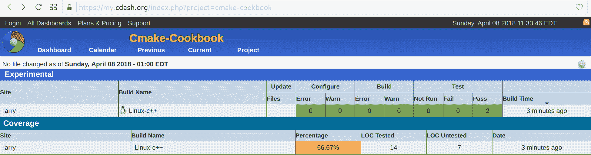
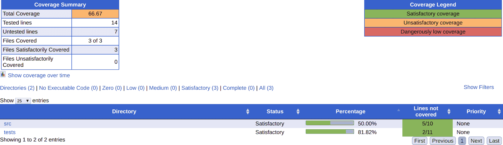
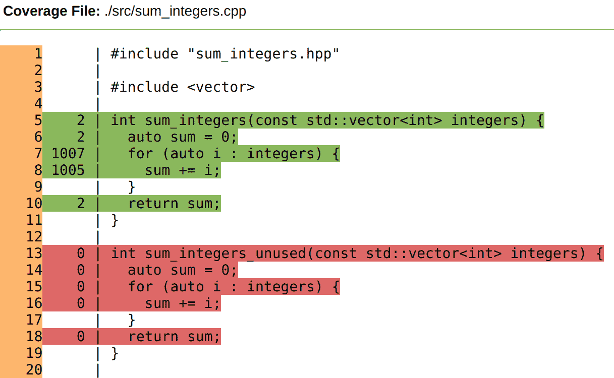
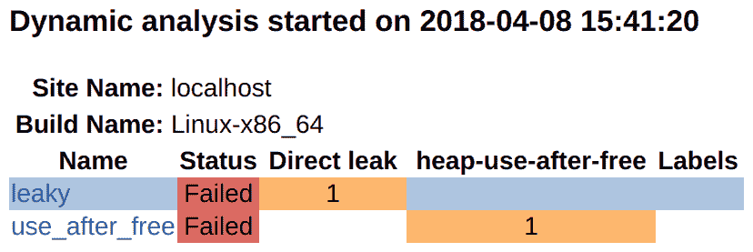
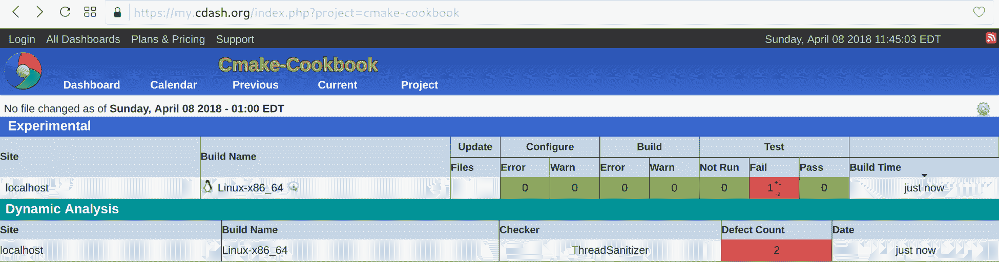
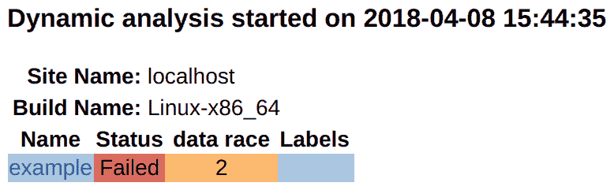

# 第十五章：测试仪表板

在本章中，我们将介绍以下内容：

+   将测试部署到 CDash 仪表板

+   向 CDash 仪表板报告测试覆盖率

+   使用 AddressSanitizer 并向 CDash 报告内存缺陷

+   使用 ThreadSanitizer 并向 CDash 报告数据竞争

# 引言

CDash 是一个 Web 服务，用于聚合 CTest 在测试运行、夜间测试或在持续集成设置中报告的测试结果。向仪表板报告就是我们所说的**CDash 时间**，如下图所示：


在本章中，我们将演示如何向 CDash 仪表板报告测试结果。我们将讨论报告测试覆盖率的策略，以及使用 AddressSanitizer 和 ThreadSanitizer 等工具收集的内存缺陷和数据竞争。

向 CDash 报告有两种方式：通过构建的测试目标或使用 CTest 脚本。我们将在前两个食谱中演示测试目标的方法，并在最后两个食谱中使用 CTest 脚本的方法。

# 设置 CDash 仪表板

CDash 的安装需要一个带有 PHP 和 SSL 启用的 Web 服务器（Apache、NGINX 或 IIS），以及访问 MySQL 或 PostgreSQL 数据库服务器的权限。本书不详细讨论 CDash Web 服务的设置；我们建议读者参考其官方文档，网址为[`public.kitware.com/Wiki/CDash:Installation`](https://public.kitware.com/Wiki/CDash:Installation)。

安装 CDash 实例不是本章食谱的必要条件，因为 Kitware 提供了两个公共仪表板（[`my.cdash.org`](https://my.cdash.org)和[`open.cdash.org`](https://open.cdash.org)）。我们将在食谱中引用前者。

对于决定自行安装 CDash 实例的读者，我们建议使用 MySQL 后端，因为这似乎是[`my.cdash.org`](https://my.cdash.org)和[`open.cdash.org`](https://open.cdash.org)所使用的配置，并且社区对其进行了更充分的测试。

也可以使用 Docker 来部署 CDash 实例，而无需太多努力。目前，在 CDash 问题跟踪器上有一个关于官方镜像的请求，网址为[`github.com/Kitware/CDash/issues/562`](https://github.com/Kitware/CDash/issues/562)。

# 将测试部署到 CDash 仪表板

本食谱的代码可在[`github.com/dev-cafe/cmake-cookbook/tree/v1.0/chapter-14/recipe-01`](https://github.com/dev-cafe/cmake-cookbook/tree/v1.0/chapter-14/recipe-01)找到，并包含一个 C++示例。该食谱适用于 CMake 版本 3.5（及以上），并在 GNU/Linux、macOS 和 Windows 上进行了测试。

在本食谱中，我们将扩展第 1 个食谱，即“创建一个简单的单元测试”，来自第四章，“创建和运行测试”，并将测试结果部署到[`my.cdash.org/index.php?project=cmake-cookbook`](https://my.cdash.org/index.php?project=cmake-cookbook)，这是我们在公共仪表板（[`my.cdash.org`](https://my.cdash.org)）上为本书创建的，由 Kitware 提供给社区。

# 准备工作

我们将从重用第 1 个食谱，即“创建一个简单的单元测试”，来自第四章，“创建和运行测试”的示例源代码开始，该示例对作为命令行参数给出的整数求和。示例由三个源文件组成：`main.cpp`、`sum_integers.cpp`和`sum_integers.hpp`。这些源文件保持不变。我们还将重用来自第四章，“创建和运行测试”的文件`test.cpp`，但将其重命名为`test_short.cpp`。我们将通过`test_long.cpp`扩展示例，其中包含以下代码：

```cpp
#include "sum_integers.hpp"

#include <numeric>
#include <vector>

int main() {
  // creates vector {1, 2, 3, ..., 999, 1000}
  std::vector<int> integers(1000);
  std::iota(integers.begin(), integers.end(), 1);

  if (sum_integers(integers) == 500500) {
    return 0;
  } else {
    return 1;
  }
}
```

然后，我们将这些文件组织成以下文件树：

```cpp
.
├── CMakeLists.txt
├── CTestConfig.cmake
├── src
│   ├── CMakeLists.txt
│   ├── main.cpp
│   ├── sum_integers.cpp
│   └── sum_integers.hpp
└── tests
    ├── CMakeLists.txt
    ├── test_long.cpp
    └── test_short.cpp
```

# 如何做到这一点

现在，我们将描述如何配置、构建、测试，最后，将我们示例项目的测试结果提交到仪表板：

1.  源目标在`src/CMakeLists.txt`中定义，如下所示：

```cpp
# example library
add_library(sum_integers "")

target_sources(sum_integers
  PRIVATE
    sum_integers.cpp
  PUBLIC
    ${CMAKE_CURRENT_LIST_DIR}/sum_integers.hpp
  )

target_include_directories(sum_integers
  PUBLIC
    ${CMAKE_CURRENT_LIST_DIR}
  )

# main code
add_executable(sum_up main.cpp)

target_link_libraries(sum_up sum_integers)
```

1.  测试在`tests/CMakeLists.txt`中定义：

```cpp
add_executable(test_short test_short.cpp)
target_link_libraries(test_short sum_integers)

add_executable(test_long test_long.cpp)
target_link_libraries(test_long sum_integers)

add_test(
  NAME
    test_short
  COMMAND
    $<TARGET_FILE:test_short>
  )

add_test(
  NAME
    test_long
  COMMAND
    $<TARGET_FILE:test_long>
  )
```

1.  顶级`CMakeLists.txt`文件引用了前面两个文件，本食谱中的新元素是包含`include(CTest)`的行，它允许我们向 CDash 仪表板报告：

```cpp
# set minimum cmake version
cmake_minimum_required(VERSION 3.5 FATAL_ERROR)

# project name and language
project(recipe-01 LANGUAGES CXX)

# require C++11
set(CMAKE_CXX_STANDARD 11)
set(CMAKE_CXX_EXTENSIONS OFF)
set(CMAKE_CXX_STANDARD_REQUIRED ON)

# process src/CMakeLists.txt
add_subdirectory(src)

enable_testing()

# allow to report to a cdash dashboard
include(CTest)

# process tests/CMakeLists.txt
add_subdirectory(tests)
```

1.  此外，我们在顶级`CMakeLists.txt`文件所在的同一目录中创建了文件`CTestConfig.cmake`。这个新文件包含以下行：

```cpp
set(CTEST_DROP_METHOD "http")
set(CTEST_DROP_SITE "my.cdash.org")
set(CTEST_DROP_LOCATION "/submit.php?project=cmake-cookbook")
set(CTEST_DROP_SITE_CDASH TRUE)
```

1.  我们现在准备配置并构建项目，如下所示：

```cpp
$ mkdir -p build
$ cd build
$ cmake ..
$ cmake --build .
```

1.  在构建代码之后，我们可以运行测试集并将测试结果报告给仪表板：

```cpp
$ ctest --dashboard Experimental

 Site: larry
 Build name: Linux-c++
Create new tag: 20180408-1449 - Experimental
Configure project
 Each . represents 1024 bytes of output
 . Size of output: 0K
Build project
 Each symbol represents 1024 bytes of output.
 '!' represents an error and '*' a warning.
 . Size of output: 0K
 0 Compiler errors
 0 Compiler warnings
Test project /home/user/cmake-recipes/chapter-15/recipe-01/cxx-example/build
 Start 1: test_short
1/2 Test #1: test_short ....................... Passed 0.00 sec
 Start 2: test_long
2/2 Test #2: test_long ........................ Passed 0.00 sec

100% tests passed, 0 tests failed out of 2

Total Test time (real) = 0.01 sec
Performing coverage
 Cannot find any coverage files. Ignoring Coverage request.
Submit files (using http)
 Using HTTP submit method
 Drop site:http://my.cdash.org/submit.php?project=cmake-cookbook
 Uploaded: /home/user/cmake-recipes/chapter-14/recipe-01/cxx-example/build/Testing/20180408-1449/Build.xml
 Uploaded: /home/user/cmake-recipes/chapter-14/recipe-01/cxx-example/build/Testing/20180408-1449/Configure.xml
 Uploaded: /home/user/cmake-recipes/chapter-14/recipe-01/cxx-example/build/Testing/20180408-1449/Test.xml
 Submission successful
```

1.  最后，我们可以在浏览器中浏览测试结果（在本例中，测试结果被报告给[`my.cdash.org/index.php?project=cmake-cookbook`](https://my.cdash.org/index.php?project=cmake-cookbook))[:](https://my.cdash.org/index.php?project=cmake-cookbook))



# 它是如何工作的

工作流程的高层次概览显示，CTest 运行测试并将结果记录在本地 XML 文件中。这些 XML 文件随后被发送到 CDash 服务器，在那里可以进行浏览和分析。通过点击前面截图中显示的“通过”下的 2，我们可以获得关于通过或失败的测试的更多细节（在本例中，没有失败的测试）。如后续截图所示，详细记录了运行测试的机器信息以及时间信息。同样，个别测试的输出可以在网上浏览。



CTest 支持三种不同的运行提交模式：实验性、夜间和连续性。我们使用了`ctest --dashboard Experimental`，因此测试结果出现在实验性下。实验模式适用于测试代码的当前状态，用于调试新的仪表板脚本（参见本章的第 3 和第 4 个食谱），或用于调试 CDash 服务器或项目。夜间模式将更新（或降级）代码到最接近最新夜间开始时间的仓库快照，这可以在`CTestConfig.cmake`中设置；它为接收频繁更新的项目中的所有夜间测试提供了一个定义良好的参考点。例如，可以将夜间开始时间设置为协调世界时午夜，如下所示：

```cpp
set(CTEST_NIGHTLY_START_TIME "00:00:00 UTC")
```

连续模式适用于持续集成工作流程，并将更新代码到最新版本。

使用单个命令即可完成构建、测试并提交到实验仪表板 - 即`cmake --build . --target Experimental`命令。

# 还有更多

在本食谱中，我们直接从测试目标部署到 CDash。也可以使用专门的 CTest 脚本，我们将在本章稍后的第 3 和第 4 个食谱中演示这种方法。

CDash 不仅允许您监控测试是否通过或失败，还允许您监控测试时间。您可以为测试时间配置边际：如果测试花费的时间超过分配的时间，它将被标记为失败。这对于基准测试很有用，可以自动检测在重构代码时测试时间性能下降的情况。

# 另请参见

有关 CDash 定义和配置设置的详细讨论，请参阅官方 CDash 文档，网址为[`public.kitware.com/Wiki/CDash:Documentation`](https://public.kitware.com/Wiki/CDash:Documentation)。

# 向 CDash 仪表板报告测试覆盖率

本食谱的代码可在[`github.com/dev-cafe/cmake-cookbook/tree/v1.0/chapter-14/recipe-02`](https://github.com/dev-cafe/cmake-cookbook/tree/v1.0/chapter-14/recipe-02)获取，并包含一个 C++示例。该食谱适用于 CMake 版本 3.5（及以上），并在 GNU/Linux、macOS 和 Windows 上进行了测试。

在本食谱中，我们将测量测试覆盖率并将其报告给 CDash 仪表板，以便我们能够逐行浏览测试覆盖率分析，以识别未测试或未使用的代码。

# 准备就绪

我们将在前一个食谱的源代码中添加一个微小的变化，在`src/sum_integers.cpp`中，我们将添加一个函数 - `sum_integers_unused`：

```cpp
#include "sum_integers.hpp"

#include <vector>

int sum_integers(const std::vector<int> integers) {
  auto sum = 0;
  for (auto i : integers) {
    sum += i;
  }
  return sum;
}

int sum_integers_unused(const std::vector<int> integers) {
  auto sum = 0;
  for (auto i : integers) {
    sum += i;
  }
  return sum;
}
```

我们的目标是使用测试覆盖率分析来检测这段未使用的代码，方法是使用 gcov（[`gcc.gnu.org/onlinedocs/gcc/Gcov.html`](https://gcc.gnu.org/onlinedocs/gcc/Gcov.html)）。除了上述修改外，我们将使用前一个食谱的未修改源代码。

# 如何操作

通过以下步骤，我们将启用覆盖率分析并将结果上传到仪表板：

1.  顶级`CMakeLists.txt`和`tests/CMakeLists.txt`文件与之前的配方保持不变。

1.  我们将在`src/CMakeLists.txt`中扩展，添加一个选项以添加代码覆盖率的编译标志。此选项默认启用，如下所示：

```cpp
option(ENABLE_COVERAGE "Enable coverage" ON)

if(ENABLE_COVERAGE)
  if(CMAKE_CXX_COMPILER_ID MATCHES GNU)
    message(STATUS "Coverage analysis with gcov enabled") 
    target_compile_options(sum_integers
      PUBLIC
        -fprofile-arcs -ftest-coverage -g
      )
    target_link_libraries(sum_integers
      PUBLIC
        gcov
      )
  else()
    message(WARNING "Coverage not supported for this compiler")
  endif()
endif()
```

1.  然后，我们将配置、构建并部署到 CDash：

```cpp
$ mkdir -p build
$ cd build
$ cmake ..
$ cmake --build . --target Experimental
```

1.  这将产生与之前配方类似的输出，但最后一步将执行测试覆盖率分析：

```cpp
Performing coverage
   Processing coverage (each . represents one file):
    ...
   Accumulating results (each . represents one file):
    ...
        Covered LOC: 14
        Not covered LOC: 7
        Total LOC: 21
        Percentage Coverage: 66.67%
Submit files (using http)
   Using HTTP submit method
   Drop site:http://my.cdash.org/submit.php?project=cmake-cookbook
   Uploaded: /home/user/cmake-recipes/chapter-14/recipe-02/cxx-example/build/Testing/20180408-1530/Build.xml
   Uploaded: /home/user/cmake-recipes/chapter-14/recipe-02/cxx-example/build/Testing/20180408-1530/Configure.xml
   Uploaded: /home/user/cmake-recipes/chapter-14/recipe-02/cxx-example/build/Testing/20180408-1530/Coverage.xml
   Uploaded: /home/user/cmake-recipes/chapter-14/recipe-02/cxx-example/build/Testing/20180408-1530/CoverageLog-0.xml
   Uploaded: /home/user/cmake-recipes/chapter-14/recipe-02/cxx-example/build/Testing/20180408-1530/Test.xml
   Submission successful
```

1.  最后，我们可以在浏览器中验证测试结果（在本例中，测试结果报告给[`my.cdash.org/index.php?project=cmake-cookbook`](https://my.cdash.org/index.php?project=cmake-cookbook)）。



# 工作原理

测试覆盖率分析以 66.67%的百分比进行总结。为了获得更深入的见解，我们可以点击该百分比，并获得两个子目录的覆盖率分析，如下所示：



通过浏览子目录链接，我们可以检查单个文件的测试覆盖率百分比，甚至可以浏览逐行的总结（例如，`src/sum_integers.cpp`）：



绿色线条在运行测试套件时已被遍历，而红色线条则没有。通过这一点，我们不仅可以识别未使用/未测试的代码（使用`sum_integers_unused`函数），还可以看到每行代码被遍历的频率。例如，代码行`sum += i`已被访问 1,005 次（`test_short`期间 5 次，`test_long`期间 1,000 次）。测试覆盖率分析是自动化测试不可或缺的伴侣，CDash 为我们提供了一个在浏览器中浏览和图形化分析结果的界面。

# 另请参阅

如需进一步阅读，我们推荐以下博客文章，该文章讨论了 CDash 中的额外覆盖功能：[`blog.kitware.com/additional-coverage-features-in-cdash/`](https://blog.kitware.com/additional-coverage-features-in-cdash/)。

# 使用 AddressSanitizer 并将内存缺陷报告给 CDash

本配方的代码可在[`github.com/dev-cafe/cmake-cookbook/tree/v1.0/chapter-14/recipe-03`](https://github.com/dev-cafe/cmake-cookbook/tree/v1.0/chapter-14/recipe-03)找到，包括一个 C++和一个 Fortran 示例。本配方适用于 CMake 版本 3.5（及更高版本），并在 GNU/Linux 和 macOS 上进行了测试。

AddressSanitizer（ASan）是 C++、C 和 Fortran 的内存错误检测器。它可以发现内存缺陷，如使用后释放、使用后返回、使用后作用域、缓冲区溢出、初始化顺序错误和内存泄漏（参见[`github.com/google/sanitizers/wiki/AddressSanitizer`](https://github.com/google/sanitizers/wiki/AddressSanitizer)）。AddressSanitizer 是 LLVM 的一部分，从版本 3.1 开始，也是 GCC 的一部分，从版本 4.8 开始。在本菜谱中，我们将在我们的代码中制造两个可能未在正常测试运行中检测到的错误。为了检测这些错误，我们将 CTest 与使用 AddressSanitizer 的动态分析相结合，并将缺陷报告给 CDash。

# 准备工作

在本例中，我们将使用两个源文件和两个测试，如下所示：

```cpp
.
├── CMakeLists.txt
├── CTestConfig.cmake
├── dashboard.cmake
├── src
│   ├── buggy.cpp
│   ├── buggy.hpp
│   └── CMakeLists.txt
└── tests
    ├── CMakeLists.txt
    ├── leaky.cpp
    └── use_after_free.cpp
```

文件`buggy.cpp`包含两个有问题的函数，如下所示：

```cpp
#include "buggy.hpp"

#include <iostream>

int function_leaky() {

  double *my_array = new double[1000];

  // do some work ...

  // we forget to deallocate the array
  // delete[] my_array;

  return 0;
}

int function_use_after_free() {

  double *another_array = new double[1000];

  // do some work ...

  // deallocate it, good!
  delete[] another_array;

  // however, we accidentally use the array
  // after it has been deallocated
  std::cout << "not sure what we get: " << another_array[123] << std::endl;

  return 0;
}
```

这些函数在相应的头文件（`buggy.hpp`）中公开：

```cpp
#pragma once

int function_leaky();
int function_use_after_free();
```

测试源码`leaky.cpp`验证`function_leaky`的返回码：

```cpp
#include "buggy.hpp"

int main() {
  int return_code = function_leaky();
  return return_code;
}
```

相应地，`use_after_free.cpp`检查`function_use_after_free`的返回值，如下所示：

```cpp
#include "buggy.hpp"

int main() {
  int return_code = function_use_after_free();
  return return_code;
}
```

# 如何操作

我们需要使用特定的标志编译我们的代码以利用 ASan。然后，我们将运行测试并将它们提交到仪表板。让我们看看如何做到这一点：

1.  有问题的库在`src/CMakeLists.txt`中定义：

```cpp
add_library(buggy "")

target_sources(buggy
  PRIVATE
    buggy.cpp
  PUBLIC
    ${CMAKE_CURRENT_LIST_DIR}/buggy.hpp
  )

target_include_directories(buggy
  PUBLIC
    ${CMAKE_CURRENT_LIST_DIR}
  )
```

1.  对于文件`src/CMakeLists.txt`，我们将添加一个选项和代码以使用 ASan 进行消毒：

```cpp
option(ENABLE_ASAN "Enable AddressSanitizer" OFF)

if(ENABLE_ASAN)
  if(CMAKE_CXX_COMPILER_ID MATCHES GNU)
    message(STATUS "AddressSanitizer enabled")
    target_compile_options(buggy
      PUBLIC
        -g -O1 -fsanitize=address -fno-omit-frame-pointer
      )
    target_link_libraries(buggy
      PUBLIC
        asan
      )
  else()
    message(WARNING "AddressSanitizer not supported for this compiler")
  endif()
endif()
```

1.  两个测试在`tests/CMakeLists.txt`中紧凑地定义，使用`foreach`循环：

```cpp
foreach(_test IN ITEMS leaky use_after_free)
  add_executable(${_test} ${_test}.cpp)
  target_link_libraries(${_test} buggy)

  add_test(
    NAME
      ${_test}
    COMMAND
      $<TARGET_FILE:${_test}>
    )
endforeach()
```

1.  顶级`CMakeLists.txt`基本上与之前的菜谱保持不变：

```cpp
# set minimum cmake version
cmake_minimum_required(VERSION 3.5 FATAL_ERROR)

# project name and language
project(recipe-03 LANGUAGES CXX)

# require C++11
set(CMAKE_CXX_STANDARD 11)
set(CMAKE_CXX_EXTENSIONS OFF)
set(CMAKE_CXX_STANDARD_REQUIRED ON)

# process src/CMakeLists.txt
add_subdirectory(src)

enable_testing()

# allow to report to a cdash dashboard
include(CTest)

# process tests/CMakeLists.txt
add_subdirectory(tests)
```

1.  同样，`CTestConfig.cmake`文件保持不变：

```cpp
set(CTEST_DROP_METHOD "http")
set(CTEST_DROP_SITE "my.cdash.org")
set(CTEST_DROP_LOCATION "/submit.php?project=cmake-cookbook")
set(CTEST_DROP_SITE_CDASH TRUE)
```

1.  在本菜谱中，我们将使用 CTest 脚本向 CDash 报告；为此，我们将创建一个文件，`dashboard.cmake`（与主`CMakeLists.txt`和`CTestConfig.cmake`在同一目录中），包含以下内容：

```cpp
set(CTEST_PROJECT_NAME "example")
cmake_host_system_information(RESULT _site QUERY HOSTNAME)
set(CTEST_SITE ${_site})
set(CTEST_BUILD_NAME "${CMAKE_SYSTEM_NAME}-${CMAKE_HOST_SYSTEM_PROCESSOR}")

set(CTEST_SOURCE_DIRECTORY "${CTEST_SCRIPT_DIRECTORY}")
set(CTEST_BINARY_DIRECTORY "${CTEST_SCRIPT_DIRECTORY}/build")

include(ProcessorCount)
ProcessorCount(N)
if(NOT N EQUAL 0)
  set(CTEST_BUILD_FLAGS -j${N})
  set(ctest_test_args ${ctest_test_args} PARALLEL_LEVEL ${N})
endif()

ctest_start(Experimental)

ctest_configure(
  OPTIONS
    -DENABLE_ASAN:BOOL=ON
  )

ctest_build()
ctest_test()

set(CTEST_MEMORYCHECK_TYPE "AddressSanitizer")
ctest_memcheck()

ctest_submit()
```

1.  我们将直接执行`dashboard.cmake`脚本。请注意我们如何使用`CTEST_CMAKE_GENERATOR`选项传递要使用的生成器，如下所示：

```cpp
$ ctest -S dashboard.cmake -D CTEST_CMAKE_GENERATOR="Unix Makefiles"

   Each . represents 1024 bytes of output
    . Size of output: 0K
   Each symbol represents 1024 bytes of output.
   '!' represents an error and '*' a warning.
    . Size of output: 1K
```

1.  结果将出现在 CDash 站点上，如下面的截图所示：


# 工作原理

在本菜谱中，我们成功地将内存错误报告到了仪表板的动态分析部分。我们可以通过浏览缺陷（在缺陷计数下）获得更深入的见解：



通过点击各个链接，可以浏览完整输出。

请注意，也可以在本地生成 AddressSanitizer 报告。在本例中，我们需要设置`ENABLE_ASAN`，如下所示：

```cpp
$ mkdir -p build
$ cd build
$ cmake -DENABLE_ASAN=ON ..
$ cmake --build .
$ cmake --build . --target test

    Start 1: leaky
1/2 Test #1: leaky ............................***Failed 0.07 sec
    Start 2: use_after_free
2/2 Test #2: use_after_free ...................***Failed 0.04 sec

0% tests passed, 2 tests failed out of 2
```

直接运行`leaky`测试可执行文件产生以下结果：

```cpp
$ ./build/tests/leaky

=================================================================
==18536==ERROR: LeakSanitizer: detected memory leaks

Direct leak of 8000 byte(s) in 1 object(s) allocated from:
    #0 0x7ff984da1669 in operator new[](unsigned long) /build/gcc/src/gcc/libsanitizer/asan/asan_new_delete.cc:82
    #1 0x564925c93fd2 in function_leaky() /home/user/cmake-recipes/chapter-14/recipe-03/cxx-example/src/buggy.cpp:7
    #2 0x564925c93fb2 in main /home/user/cmake-recipes/chapter-14/recipe-03/cxx-example/tests/leaky.cpp:4
    #3 0x7ff98403df49 in __libc_start_main (/usr/lib/libc.so.6+0x20f49)

SUMMARY: AddressSanitizer: 8000 byte(s) leaked in 1 allocation(s).
```

相应地，我们可以通过直接运行`use_after_free`可执行文件来获得详细的输出，如下所示：

```cpp
$ ./build/tests/use_after_free

=================================================================
==18571==ERROR: AddressSanitizer: heap-use-after-free on address 0x6250000004d8 at pc 0x557ffa8b0102 bp 0x7ffe8c560200 sp 0x7ffe8c5601f0
READ of size 8 at 0x6250000004d8 thread T0
 #0 0x557ffa8b0101 in function_use_after_free() /home/user/cmake-recipes/chapter-14/recipe-03/cxx-example/src/buggy.cpp:28
 #1 0x557ffa8affb2 in main /home/user/cmake-recipes/chapter-14/recipe-03/cxx-example/tests/use_after_free.cpp:4
 #2 0x7ff1d6088f49 in __libc_start_main (/usr/lib/libc.so.6+0x20f49)
 #3 0x557ffa8afec9 in _start (/home/user/cmake-recipes/chapter-14/recipe-03/cxx-example/build/tests/use_after_free+0xec9)

0x6250000004d8 is located 984 bytes inside of 8000-byte region 0x625000000100,0x625000002040)
freed by thread T0 here:
 #0 0x7ff1d6ded5a9 in operator delete[ /build/gcc/src/gcc/libsanitizer/asan/asan_new_delete.cc:128
 #1 0x557ffa8afffa in function_use_after_free() /home/user/cmake-recipes/chapter-14/recipe-03/cxx-example/src/buggy.cpp:24
 #2 0x557ffa8affb2 in main /home/user/cmake-recipes/chapter-14/recipe-03/cxx-example/tests/use_after_free.cpp:4
 #3 0x7ff1d6088f49 in __libc_start_main (/usr/lib/libc.so.6+0x20f49)

previously allocated by thread T0 here:
 #0 0x7ff1d6dec669 in operator new[](unsigned long) /build/gcc/src/gcc/libsanitizer/asan/asan_new_delete.cc:82
 #1 0x557ffa8affea in function_use_after_free() /home/user/cmake-recipes/chapter-14/recipe-03/cxx-example/src/buggy.cpp:19
 #2 0x557ffa8affb2 in main /home/user/cmake-recipes/chapter-14/recipe-03/cxx-example/tests/use_after_free.cpp:4
 #3 0x7ff1d6088f49 in __libc_start_main (/usr/lib/libc.so.6+0x20f49)

SUMMARY: AddressSanitizer: heap-use-after-free /home/user/cmake-recipes/chapter-14/recipe-03/cxx-example/src/buggy.cpp:28 in function_use_after_free()
Shadow bytes around the buggy address:
 0x0c4a7fff8040: fd fd fd fd fd fd fd fd fd fd fd fd fd fd fd fd
 0x0c4a7fff8050: fd fd fd fd fd fd fd fd fd fd fd fd fd fd fd fd
 0x0c4a7fff8060: fd fd fd fd fd fd fd fd fd fd fd fd fd fd fd fd
 0x0c4a7fff8070: fd fd fd fd fd fd fd fd fd fd fd fd fd fd fd fd
 0x0c4a7fff8080: fd fd fd fd fd fd fd fd fd fd fd fd fd fd fd fd
=>0x0c4a7fff8090: fd fd fd fd fd fd fd fd fd fd fd[fd]fd fd fd fd
 0x0c4a7fff80a0: fd fd fd fd fd fd fd fd fd fd fd fd fd fd fd fd
 0x0c4a7fff80b0: fd fd fd fd fd fd fd fd fd fd fd fd fd fd fd fd
 0x0c4a7fff80c0: fd fd fd fd fd fd fd fd fd fd fd fd fd fd fd fd
 0x0c4a7fff80d0: fd fd fd fd fd fd fd fd fd fd fd fd fd fd fd fd
 0x0c4a7fff80e0: fd fd fd fd fd fd fd fd fd fd fd fd fd fd fd fd
Shadow byte legend (one shadow byte represents 8 application bytes):
 Addressable: 00
 Partially addressable: 01 02 03 04 05 06 07
 Heap left redzone: fa
 Freed heap region: fd
 Stack left redzone: f1
 Stack mid redzone: f2
 Stack right redzone: f3
 Stack after return: f5
 Stack use after scope: f8
 Global redzone: f9
 Global init order: f6
 Poisoned by user: f7
 Container overflow: fc
 Array cookie: ac
 Intra object redzone: bb
 ASan internal: fe
 Left alloca redzone: ca
 Right alloca redzone: cb
==18571==ABORTING
```

如果我们不使用 AddressSanitizer 进行测试（默认情况下`ENABLE_ASAN`为`OFF`），则以下示例不会报告任何错误：

```cpp
$ mkdir -p build_no_asan
$ cd build_no_asan
$ cmake ..
$ cmake --build .
$ cmake --build . --target test

    Start 1: leaky
1/2 Test #1: leaky ............................ Passed 0.00 sec
    Start 2: use_after_free
2/2 Test #2: use_after_free ................... Passed 0.00 sec

100% tests passed, 0 tests failed out of 2
```

确实，`leaky`只会浪费内存，而`use_after_free`可能导致非确定性失败。调试这些失败的一种方法是使用 valgrind（[`valgrind.org`](http://valgrind.org/)）。

与前两个方案不同，我们使用了一个 CTest 脚本来配置、构建和测试代码，并将报告提交到仪表板。要了解这个方案的工作原理，请仔细查看`dashboard.cmake`脚本。首先，我们定义项目名称并设置主机报告和构建名称，如下所示：

```cpp
set(CTEST_PROJECT_NAME "example")
cmake_host_system_information(RESULT _site QUERY HOSTNAME)
set(CTEST_SITE ${_site})
set(CTEST_BUILD_NAME "${CMAKE_SYSTEM_NAME}-${CMAKE_HOST_SYSTEM_PROCESSOR}")
```

在我们的例子中，`CTEST_BUILD_NAME`评估为`Linux-x86_64`。在您的例子中，您可能会观察到不同的结果，这取决于您的操作系统。

接下来，我们为源代码和构建目录指定路径：

```cpp
set(CTEST_SOURCE_DIRECTORY "${CTEST_SCRIPT_DIRECTORY}")
set(CTEST_BINARY_DIRECTORY "${CTEST_SCRIPT_DIRECTORY}/build")
```

我们可以将生成器设置为`Unix Makefiles`：

```cpp
set(CTEST_CMAKE_GENERATOR "Unix Makefiles")
```

然而，为了编写更便携的测试脚本，我们更倾向于通过命令行提供生成器，如下所示：

```cpp
$ ctest -S dashboard.cmake -D CTEST_CMAKE_GENERATOR="Unix Makefiles"
```

`dashboard.cmake`中的下一个代码片段计算出机器上可用的核心数，并将测试步骤的并行级别设置为可用核心数，以最小化总测试时间：

```cpp
include(ProcessorCount)
ProcessorCount(N)
if(NOT N EQUAL 0)
  set(CTEST_BUILD_FLAGS -j${N})
  set(ctest_test_args ${ctest_test_args} PARALLEL_LEVEL ${N})
endif()
```

接下来，我们开始测试步骤并配置代码，设置`ENABLE_ASAN`为`ON`：

```cpp
ctest_start(Experimental)

ctest_configure(
  OPTIONS
    -DENABLE_ASAN:BOOL=ON
  )
```

剩余的`dashboard.cmake`中的命令对应于构建、测试、内存检查和提交步骤：

```cpp
ctest_build()
ctest_test()

set(CTEST_MEMORYCHECK_TYPE "AddressSanitizer")
ctest_memcheck()

ctest_submit()
```

# 还有更多

细心的读者会注意到，我们在链接目标之前并没有在我们的系统上搜索 AddressSanitizer。在现实世界的完整用例中，这样做是为了避免在链接阶段出现不愉快的意外。我们将提醒读者，我们在第 7 个方案中展示了一种方法来探测 sanitizers 的可用性，即“探测编译器标志”，在第五章“配置时间和构建时间操作”中。

更多关于 AddressSanitizer 的文档和示例，请参见[`github.com/google/sanitizers/wiki/AddressSanitizer`](https://github.com/google/sanitizers/wiki/AddressSanitizer)。AddressSanitizer 不仅限于 C 和 C++。对于 Fortran 示例，我们建议读者参考位于[`github.com/dev-cafe/cmake-cookbook/tree/v1.0/chapter-14/recipe-03/fortran-example`](https://github.com/dev-cafe/cmake-cookbook/tree/v1.0/chapter-14/recipe-03/fortran-example)的代码仓库。

在[`github.com/arsenm/sanitizers-cmake`](https://github.com/arsenm/sanitizers-cmake)上可以找到用于发现 sanitizers 并调整编译器标志的 CMake 工具。

# 另请参阅

以下博客文章讨论了如何添加对动态分析工具的支持的示例，并启发了当前的方案：[`blog.kitware.com/ctest-cdash-add-support-for-new-dynamic-analysis-tools/`](https://blog.kitware.com/ctest-cdash-add-support-for-new-dynamic-analysis-tools/)。

# 使用 ThreadSanitizer 并将数据竞争报告给 CDash

本食谱的代码可在[`github.com/dev-cafe/cmake-cookbook/tree/v1.0/chapter-14/recipe-04`](https://github.com/dev-cafe/cmake-cookbook/tree/v1.0/chapter-14/recipe-04)找到，并包含一个 C++示例。该食谱适用于 CMake 版本 3.5（及以上），并在 GNU/Linux 和 macOS 上进行了测试。

在本食谱中，我们将重用前一个示例的方法，但结合使用 ThreadSanitizer（或 TSan）与 CTest 和 CDash，以识别数据竞争并将这些信息报告给 CDash 仪表板。ThreadSanitizer 的文档可以在网上找到，网址为[`github.com/google/sanitizers/wiki/ThreadSanitizerCppManual`](https://github.com/google/sanitizers/wiki/ThreadSanitizerCppManual)。

# 准备就绪

在本食谱中，我们将使用以下示例代码（`example.cpp`）：

```cpp
#include <chrono>
#include <iostream>
#include <thread>

static const int num_threads = 16;

void increase(int i, int &s) {
  std::this_thread::sleep_for(std::chrono::seconds(1));
  std::cout << "thread " << i << " increases " << s++ << std::endl;
}

int main() {
  std::thread t[num_threads];

  int s = 0;

  // start threads
  for (auto i = 0; i < num_threads; i++) {
    t[i] = std::thread(increase, i, std::ref(s));
  }

  // join threads with main thread
  for (auto i = 0; i < num_threads; i++) {
    t[i].join();
  }

  std::cout << "final s: " << s << std::endl;

  return 0;
}
```

在这个示例代码中，我们启动了 16 个线程，每个线程都调用了`increase`函数。`increase`函数休眠一秒钟，然后打印并递增一个整数`s`。我们预计这段代码会表现出数据竞争，因为所有线程都在没有明确同步或协调的情况下读取和修改同一地址。换句话说，我们预计最终的`s`，即代码末尾打印的`s`，可能会在每次运行中有所不同。这段代码存在缺陷，我们将尝试借助 ThreadSanitizer 来识别数据竞争。如果不运行 ThreadSanitizer，我们可能不会发现代码中的任何问题：

```cpp
$ ./example

thread thread 0 increases 01 increases 1
thread 9 increases 2
thread 4 increases 3
thread 10 increases 4
thread 2 increases 5
thread 3 increases 6
thread 13 increases 7
thread thread 7 increases 8
thread 14 increases 9
thread 8 increases 10
thread 12 increases 11
thread 15 increases 12
thread 11 increases 13
```

```cpp
5 increases 14
thread 6 increases 15

final s: 16
```

# 如何操作

让我们详细地逐一介绍必要的步骤：

1.  `CMakeLists.txt`文件首先定义了最低支持版本、项目名称、支持的语言，以及在这种情况下，对 C++11 标准的要求：

```cpp
cmake_minimum_required(VERSION 3.5 FATAL_ERROR)

project(recipe-04 LANGUAGES CXX)

set(CMAKE_CXX_STANDARD 11)
set(CMAKE_CXX_EXTENSIONS OFF)
set(CMAKE_CXX_STANDARD_REQUIRED ON)
```

1.  接下来，我们定位 Threads 库，定义可执行文件，并将其与 Threads 库链接：

```cpp
find_package(Threads REQUIRED)

add_executable(example example.cpp)

target_link_libraries(example
  PUBLIC
    Threads::Threads
  )
```

1.  然后，我们提供选项和代码以支持 ThreadSanitizer 的编译和链接：

```cpp
option(ENABLE_TSAN "Enable ThreadSanitizer" OFF)

if(ENABLE_TSAN)
  if(CMAKE_CXX_COMPILER_ID MATCHES GNU)
    message(STATUS "ThreadSanitizer enabled")
    target_compile_options(example
      PUBLIC
        -g -O1 -fsanitize=thread -fno-omit-frame-pointer -fPIC
      )
    target_link_libraries(example
      PUBLIC
        tsan
      )
  else()
    message(WARNING "ThreadSanitizer not supported for this compiler")
  endif()
endif()
```

1.  最后，作为测试，我们执行编译后的示例本身：

```cpp
enable_testing()

# allow to report to a cdash dashboard
include(CTest)

add_test(
  NAME
    example
  COMMAND
    $<TARGET_FILE:example>
  )
```

1.  `CTestConfig.cmake`文件与前一个食谱相比没有变化：

```cpp
set(CTEST_DROP_METHOD "http")
set(CTEST_DROP_SITE "my.cdash.org")
set(CTEST_DROP_LOCATION "/submit.php?project=cmake-cookbook")
set(CTEST_DROP_SITE_CDASH TRUE)
```

1.  相应的`dashboard.cmake`脚本是对前一个食谱的简单改编，以适应 TSan：

```cpp
set(CTEST_PROJECT_NAME "example")
cmake_host_system_information(RESULT _site QUERY HOSTNAME)
set(CTEST_SITE ${_site})
set(CTEST_BUILD_NAME "${CMAKE_SYSTEM_NAME}-${CMAKE_HOST_SYSTEM_PROCESSOR}")

set(CTEST_SOURCE_DIRECTORY "${CTEST_SCRIPT_DIRECTORY}")
set(CTEST_BINARY_DIRECTORY "${CTEST_SCRIPT_DIRECTORY}/build")

include(ProcessorCount)
ProcessorCount(N)
if(NOT N EQUAL 0)
  set(CTEST_BUILD_FLAGS -j${N})
  set(ctest_test_args ${ctest_test_args} PARALLEL_LEVEL ${N})
endif()

ctest_start(Experimental)

ctest_configure(
  OPTIONS
    -DENABLE_TSAN:BOOL=ON
  )

ctest_build()
ctest_test()

set(CTEST_MEMORYCHECK_TYPE "ThreadSanitizer")
ctest_memcheck()

ctest_submit()
```

1.  让我们再次为这个示例设置生成器，通过传递`CTEST_CMAKE_GENERATOR`选项：

```cpp
$ ctest -S dashboard.cmake -D CTEST_CMAKE_GENERATOR="Unix Makefiles"

   Each . represents 1024 bytes of output
    . Size of output: 0K
   Each symbol represents 1024 bytes of output.
   '!' represents an error and '*' a warning.
    . Size of output: 0K
```

1.  在仪表板上，我们将看到以下内容：



1.  我们可以更详细地看到动态分析如下：



# 它是如何工作的

本食谱的核心成分位于以下部分的`CMakeLists.txt`中：

```cpp
option(ENABLE_TSAN "Enable ThreadSanitizer" OFF)

if(ENABLE_TSAN)
  if(CMAKE_CXX_COMPILER_ID MATCHES GNU)
    message(STATUS "ThreadSanitizer enabled")
    target_compile_options(example
      PUBLIC
        -g -O1 -fsanitize=thread -fno-omit-frame-pointer -fPIC
      )
    target_link_libraries(example
      PUBLIC
        tsan
      )
  else()
    message(WARNING "ThreadSanitizer not supported for this compiler")
  endif()
endif()
```

成分也包含在`dashboard.cmake`中更新的步骤中：

```cpp
# ...

ctest_start(Experimental)

ctest_configure(
  OPTIONS
    -DENABLE_TSAN:BOOL=ON
  )

ctest_build()
ctest_test()

set(CTEST_MEMORYCHECK_TYPE "ThreadSanitizer")
ctest_memcheck()

ctest_submit()
```

与前一个食谱一样，我们也可以在本地检查 ThreadSanitizer 的输出：

```cpp
$ mkdir -p build
$ cd build
$ cmake -DENABLE_TSAN=ON ..
$ cmake --build .
$ cmake --build . --target test

 Start 1: example
1/1 Test #1: example ..........................***Failed 1.07 sec

0% tests passed, 1 tests failed out of 1

$ ./build/example 

thread 0 increases 0
==================
WARNING: ThreadSanitizer: data race (pid=24563)

... lots of output ...

SUMMARY: ThreadSanitizer: data race /home/user/cmake-recipes/chapter-14/recipe-04/cxx-example/example.cpp:9 in increase(int, int&)
```

# 还有更多内容

对 OpenMP 代码应用 TSan 是一个自然的步骤，但请注意，在某些情况下，OpenMP 在 TSan 下会产生误报。对于 Clang 编译器，一个解决办法是重新编译编译器本身及其`libomp`，并使用`-DLIBOMP_TSAN_SUPPORT=TRUE`。通常，合理地使用检测器可能需要重新编译整个工具栈，以避免误报。对于使用 pybind11 的 C++项目，我们可能需要重新编译启用了检测器的 Python，以获得有意义的结果。或者，可以通过使用检测器抑制来将 Python 绑定排除在检测之外，如[`github.com/google/sanitizers/wiki/ThreadSanitizerSuppressions`](https://github.com/google/sanitizers/wiki/ThreadSanitizerSuppressions)所述。如果例如一个共享库被一个启用了检测的二进制文件和一个 Python 插件同时调用，这可能是不可能的。

# 另请参阅

以下博客文章讨论了如何为动态分析工具添加支持的示例，并激发了当前的方案：[`blog.kitware.com/ctest-cdash-add-support-for-new-dynamic-analysis-tools/`](https://blog.kitware.com/ctest-cdash-add-support-for-new-dynamic-analysis-tools/)。
