# 第一章：开始使用 Code::Blocks

在编写本书时，Code::Blocks—12.11 是最新的稳定版本。此版本配备了 Windows 的 GCC 4.7.1 编译器。我们将在本书中使用此版本进行 C++开发。在本章中，我们将下载 Code::Blocks，安装并了解更多信息。

# 为什么选择 Code::Blocks？

在我们继续了解**Code::Blocks**之前，让我们了解为什么我们应该使用 Code::Blocks 而不是其他 IDE。

+   这是一个跨平台集成开发环境（IDE）。它支持 Windows、Linux 和 Mac 操作系统。

+   它完全支持所有支持的平台上的 GCC 编译器和 GNU 调试器。

+   它支持多种其他编译器在多个平台上的各种程度。

+   它是可编写脚本和可扩展的。它带有几个插件，扩展了其核心功能。

+   它对资源要求较低，不需要强大的计算机来运行。

+   最后，它是免费和开源的。

# 在 Windows 上安装 Code::Blocks

本书的主要重点将放在 Windows 平台上。但是，我们将尽可能涉及其他平台。官方 Code::Blocks 二进制文件可从[www.codeblocks.org](http://www.codeblocks.org)下载。执行以下步骤以成功安装 Code::Blocks：

1.  在 Windows 平台上安装，从[`www.codeblocks.org/downloads/26`](http://www.codeblocks.org/downloads/26)下载`codeblocks-12.11mingw-setup.exe`文件，或从 sourceforge 镜像[`sourceforge.net/projects/codeblocks/files/Binaries/12.11/Windows/codeblocks-12.11mingw-setup.exe/download`](http://sourceforge.net/projects/codeblocks/files/Binaries/12.11/Windows/codeblocks-12.11mingw-setup.exe/download)下载，并将其保存在一个文件夹中。

1.  双击此文件并运行。您将看到以下屏幕：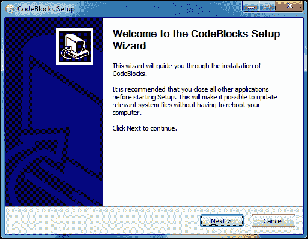

1.  如下截图所示，单击“**下一步**”按钮继续。将呈现许可证文本。Code::Blocks 应用程序根据 GNU GPLv3 许可证获得许可，而 Code::Blocks SDK 根据 GNU LGPLv3 获得许可。您可以在此网址了解有关这些许可证的更多信息-[`www.gnu.org/licenses/licenses.html`](https://www.gnu.org/licenses/licenses.html)。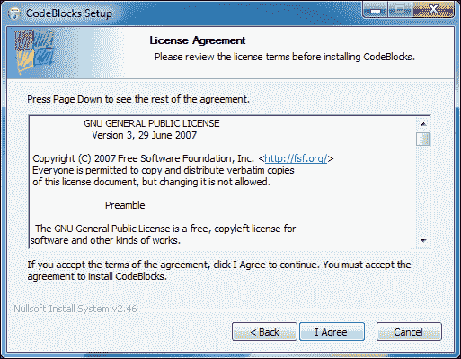

1.  单击**我同意**接受许可协议。在下面的截图中将呈现组件选择页面：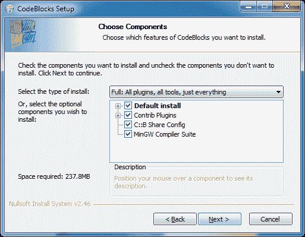

1.  您可以选择以下任何选项：

+   **默认安装**：这是默认安装选项。这将安装 Code::Block 的核心组件和核心插件。

+   **Contrib 插件**：插件是扩展 Code::Block 功能的小程序。选择此选项以安装由其他几个开发人员贡献的插件。

+   **C::B 共享配置**：此实用程序可以复制所有/部分配置文件。

+   **MinGW 编译器套件**：此选项将为 Windows 安装 GCC 4.7.1。

1.  选择**完整安装**，然后单击**下一步**按钮继续。如下截图所示，安装程序现在将提示选择安装目录：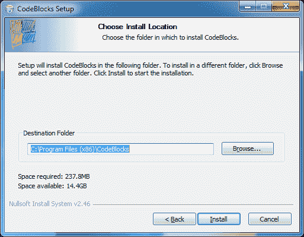

1.  您可以将其安装到默认安装目录。否则选择**目标文件夹**，然后单击**安装**按钮。安装程序现在将继续安装。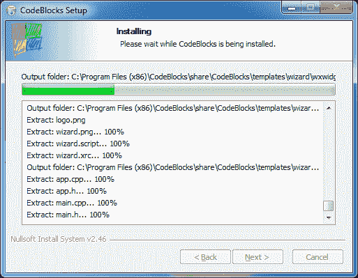

1.  如下截图所示，Code::Blocks 现在将提示我们在安装完成后运行它：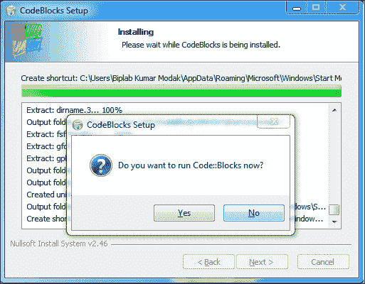

1.  在这里单击**否**按钮，然后单击**下一步**按钮。安装现在将完成：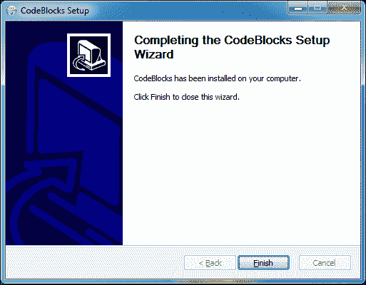

1.  单击**完成**按钮以完成安装。桌面上将创建一个快捷方式。

这完成了我们在 Windows 上的 Code::Blocks 安装。

# 在 Linux 上安装 Code::Blocks

Code::Blocks 可在众多 Linux 发行版上运行。在本节中，我们将学习在 CentOS Linux 上安装 Code::Blocks。CentOS 是一个基于 Red Hat Enterprise Linux 的 Linux 发行版，是一个免费提供的企业级 Linux 发行版。执行以下步骤在 Linux 操作系统上安装 Code::Blocks：

1.  导航到 **设置** | **管理** | **添加/删除软件** 菜单选项。在搜索框中输入 `wxGTK` 并按 *Enter* 键。截至目前，wxGTK-2.8.12 是最新的稳定版本的 wxWidgets。选择它，然后点击 **应用** 按钮来通过软件包管理器安装 `wxGTK` 软件包，如下截图所示。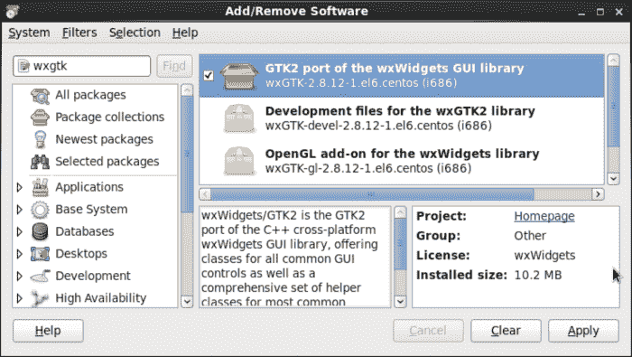

1.  从此 URL（[`www.codeblocks.org/downloads/26`](http://www.codeblocks.org/downloads/26)）下载 **CentOS 6** 的软件包。

通过在 shell 中输入以下命令来解压 `.tar.bz2` 文件：

```cpp
tar xvjf codeblocks-12.11-1.el6.i686.tar.bz2

```

1.  右键单击 `codeblocks-12.11-1.el6.i686.rpm` 文件，如下截图所示，选择 **使用软件包安装器打开** 选项。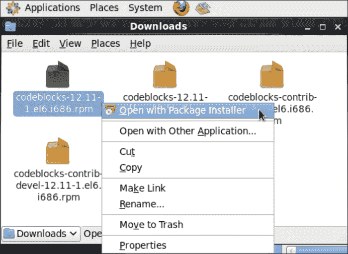

1.  将显示以下窗口。点击 **安装** 按钮开始安装，如下截图所示：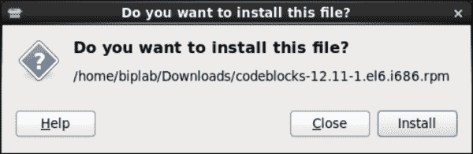

1.  如果您是从用户帐户安装的，可能会要求输入 root 密码。输入 root 密码，然后点击 **验证** 按钮。Code::Blocks 现在将被安装。

1.  重复步骤 4 到 6 来安装其他 rpm 文件。

我们现在已经学会在 Windows 和 Linux 平台上安装 Code::Blocks。我们现在准备进行 C++ 开发。在这之前，我们将学习 Code::Blocks 的用户界面。

# 首次运行

在 Windows 平台上，导航到 **开始** | **所有程序** | **CodeBlocks** | **CodeBlocks** 菜单选项来启动 Code::Blocks。或者，您也可以双击桌面上显示的快捷方式来启动 Code::Blocks，如下截图所示：

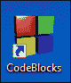

在 Linux 上，导航到 **应用程序** | **编程** | **Code::Blocks IDE** 菜单选项来运行 Code::Blocks。请注意，在本书的后续章节中，我们将主要限制讨论到 Windows 平台。然而，Code::Blocks 的使用和 C++ 开发（除了特定于平台的领域）在两个平台上保持一致。

Code::Blocks 现在会要求用户选择默认编译器。Code::Blocks 支持多个编译器，因此能够检测到其他编译器的存在。下面的截图显示了 Code::Blocks 已经检测到 GNU GCC 编译器（它是与安装程序捆绑在一起并已安装的）。点击它选择，然后点击 **设置为默认按钮**，如下截图所示：

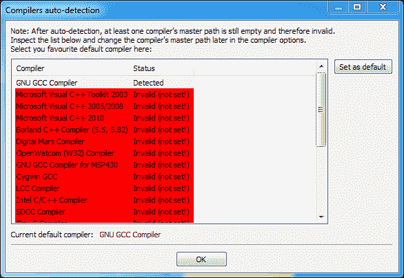

不要担心前面截图中标记为红色的项目。红色线条表示 Code::Blocks 无法检测到特定编译器的存在。

最后，点击 **确定** 按钮继续加载 Code::Blocks。加载完成后，Code::Blocks 窗口将显示出来。

下面的截图显示了 Code::Blocks 的主窗口。标注部分突出显示了不同的用户界面（UI）组件：

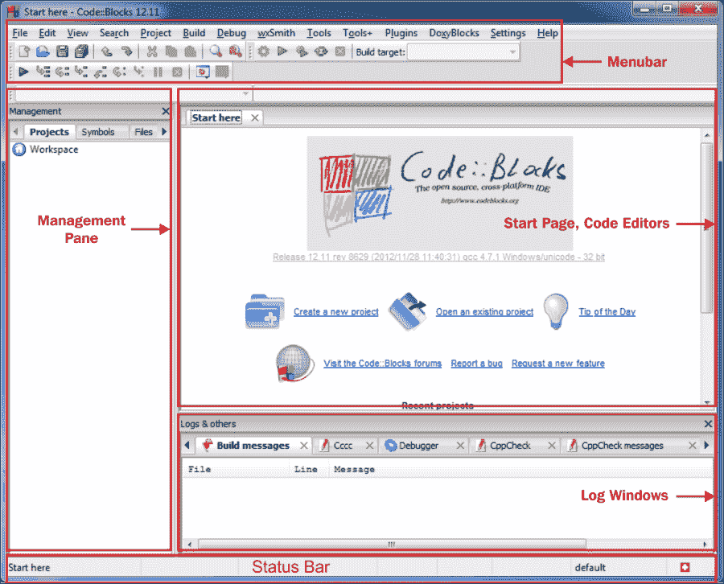

现在，让我们更多地了解不同的用户界面组件：

+   **菜单栏和工具栏**：所有 Code::Blocks 命令都可以通过菜单栏访问。另一方面，工具栏提供了对常用命令的快速访问。

+   **起始页和代码编辑器**：启动页是 Code::Blocks 启动时的默认页面。其中包含一些有用的链接和最近的项目和文件历史记录。代码编辑器是用于编辑 C++（和其他语言）源文件的文本容器。这些编辑器提供语法高亮功能，可以用不同颜色突出显示关键字。

+   **管理窗格**：此窗口显示所有打开的文件（包括源文件、项目文件和工作空间文件）。其他插件也使用此窗格提供额外功能。在前面的屏幕截图中，**文件管理器**插件提供类似 Windows 资源管理器的功能，**代码完成**插件提供当前打开源文件的详细信息。

+   **日志窗口**：显示来自不同工具（例如编译器、调试器、文档解析器等）的日志消息。其他插件也使用此组件。

+   **状态栏**：此组件显示 Code::Blocks 的各种状态信息，例如文件路径、文件编码、行号等。

# 重要工具栏简介

工具栏提供了对 Code::Blocks 不同功能的更便捷访问。在几个工具栏中，以下几个最重要。

## 主工具栏

主工具栏包含核心组件命令。从左到右依次为新建文件、打开文件、保存、全部保存、撤销、重做、剪切、复制、粘贴、查找和替换按钮。


## 编译器工具栏

编译器工具栏包含常用的与编译器相关的命令。从左到右依次为构建、运行、构建并运行、重新构建、停止构建、构建目标按钮。C++源代码的编译也称为构建，本书将沿用此术语。


## 调试器工具栏

调试器工具栏包含常用的与调试器相关的命令。从左到右依次为调试/继续、运行到光标、下一行、步入、步出、下一条指令、步入指令、中断调试器、停止调试器、调试窗口和各种信息按钮。


# 摘要

在本章中，我们学习了如何下载和安装 Code::Blocks。我们还了解了不同的界面元素。在下一章中，我们将开始使用 Code::Blocks 进行 C++编码。
