# 第二章：使用 Code::Blocks 进行应用程序开发

在本章中，我们将学习使用 Code::Blocks 进行 C++应用程序开发。我们将从一个简单的 Hello World 应用程序开始。随后将介绍项目和工作空间的概念。

# 使用 Code::Blocks 创建你的第一个应用程序

让我们编写一个简单的 Hello World 应用程序，它基本上会在控制台上打印出“Hello World”。启动 Code::Blocks 并如下屏幕截图所示，单击主工具栏中的新按钮，然后单击**文件**菜单选项。以下屏幕截图表示相同的内容：

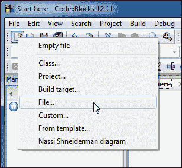

在下一个窗口中单击**C/C++源文件**选项，然后单击**Go**按钮。将会出现一个向导。在向导的第一页上单击**下一步**按钮。在下一个窗口中选择**C++**选项，然后单击**下一步**按钮。在下一个窗口中选择文件路径和名称，然后单击**完成**按钮以完成向导。

然后在编辑器中输入以下代码：

```cpp
#include <iostream>

int main() {
  std::cout << "Hello World!" << std::endl;
  return 0;
}
```

如果文件末尾没有空行，Code::Blocks 会自动添加一个空行，这是 Code::Blocks 的特性。GCC 期望源代码末尾有一个空行，如果缺少空行，它会发出警告。因此，你可能会注意到 Code::Blocks 会自动添加一个空行。

在编辑器窗口中输入代码后，Code::Blocks 将看起来类似于以下屏幕截图。

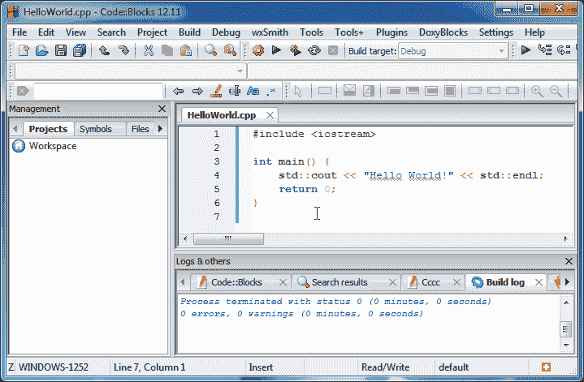

现在单击主工具栏中的保存按钮以保存此文件（转到**文件** | **保存**）。或者可以使用*Ctrl* + *S*组合键来保存文件。我们可以看到 Code::Blocks 已经对代码应用了语法高亮，并且使代码更易读。

现在单击编译器工具栏中的构建按钮，或者按下*Ctrl* + *F9*组合键进行编译。如果一切顺利，Code::Blocks 将看起来类似于之前的屏幕截图。现在单击编译器工具栏中的运行按钮。Code::Blocks 现在将运行程序。如下屏幕截图所示，我们的第一个程序已经成功运行：

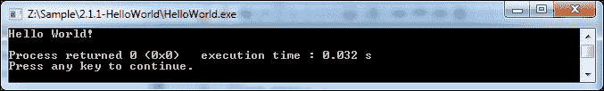

前一个屏幕截图显示程序执行已经完成，并且正在等待用户输入以关闭窗口。这是 Code::Blocks 的一个特性，它在执行完成后停止，以允许用户研究程序输出。

我们的第一个任务已经成功。然而，这种方法有几个缺点。

+   在编译单个文件时，Code::Blocks 会应用全局编译器/链接器标志。

+   Code::Blocks 纯粹作为文本编辑器（想象记事本）使用，大多数功能无法用于编译单个文件。

此外，管理由单独文件组成的大型项目是繁琐的。因此，**项目**的概念已经发展。在下一节中，我们将更多地了解 Code::Blocks 中的项目。

# Code::Blocks 中的项目

项目是 Code::Blocks 中的一个重要概念。项目可以被描述为一组源文件和构建目标。

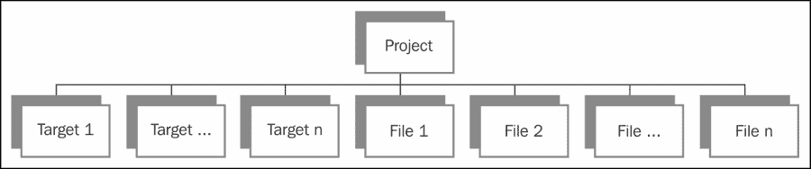

构建目标可以被定义为每个源文件的标签或标记，其中包含单独的构建（编译器、链接器和资源编译器）选项。每个构建目标包含一组构建选项，在项目编译时，Code::Blocks 会选择当前活动的目标。然后使用该构建目标的构建选项编译该目标的所有文件。

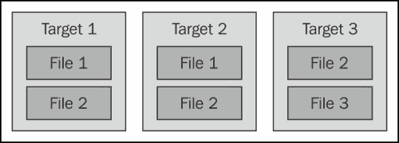

一个项目需要至少一个目标和一个源文件来进行编译。源文件可以是所有目标的一部分，也可以是没有目标的一部分。构建目标可以依赖于其他目标，这有助于维护不同源文件之间的关系。我们将在下一节中更详细地解释构建目标的重要性。

但在此之前，让我们创建一个项目并开发一个应用程序。执行以下步骤：

1.  单击主工具栏上的新按钮，然后单击**项目**菜单选项。将显示向导，如下截图所示。现在选择**控制台应用程序**，然后单击**Go**按钮：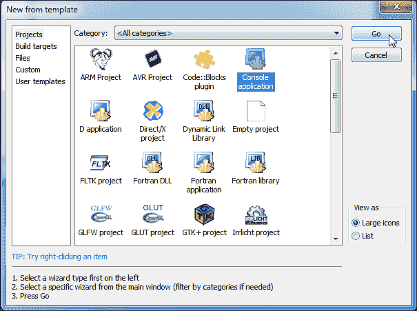

1.  在向导的第一页上单击**下一步**按钮。然后选择**C++**，并单击**下一步**按钮，如下截图所示：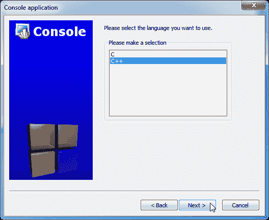

1.  如下截图所示，输入**项目标题**（应用程序名称）为`App1`，并选择一个文件夹来创建`App1`项目。现在，单击**下一步**按钮继续。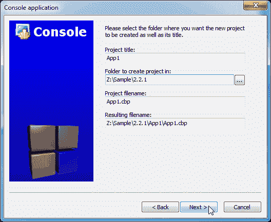

1.  单击**完成**按钮，如下截图所示，**控制台应用程序**窗口将生成默认代码：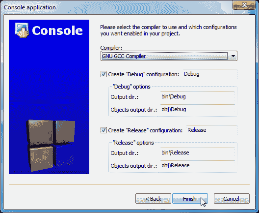

下面的截图显示了已填充新创建项目文件的**管理**窗口。双击树上的`main.cpp`项目以打开 Code::Blocks 编辑器。

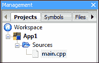

让我们用以下代码替换默认代码：

```cpp
#include <iostream>

class HelloWorld {
public:
  HelloWorld() {}
  ~HelloWorld() {}

  void Print() {
    std::cout << "Hello World!" << std::endl;
  }
};

int main()
{
  HelloWorld hello;
  hello.Print();
  return 0;
}
```

我们用 C++类替换了之前的`HelloWorld`代码，以实现打印“Hello World!”文本的相同目标。

C++类是特定的数据类型，可以定义为一组数据结构和操作这些数据结构的成员函数的集合。所有成员函数和基类默认为`private`。类可以包含重载运算符，允许与特定类相关的自定义操作。

类也可以使用`struct`关键字定义。但是，如果使用`struct`关键字定义类，则所有成员，即函数和基类，默认为`public`。

让我们分析我们的代码。我们定义了一个名为`HelloWorld`的类。我们还定义了一个`构造函数`函数`HelloWorld()`和一个`析构函数`函数`~HelloWorld()`。我们有一个名为`Print()`的公共可访问函数，用于打印出`"Hello World!"`文本。在`main()`函数中，我们创建了一个名为`hello`的`HelloWorld`类的对象，然后我们用它来调用`Print()`函数。

按下*F9*键构建并运行此项目。一个控制台窗口将弹出显示“Hello World!”文本。

# 多文件项目

在本节中，我们将学习由多个文件组成的 C++应用程序开发。我们将开发一个名为`Vector`的类，它实现了一个动态数组。这个类类似于**标准模板库**（**STL**）提供的`std::vector`类，并且与 STL 类相比具有非常有限的功能集。

创建一个新项目并命名为`App2`。转到**文件** | **新建** | **文件…**菜单选项，然后选择**C/C++头文件**选项，并按照向导将新文件添加到`App2`项目中。在`App2`下的新文件中添加以下代码，并将其命名为`vector.h`文件：

```cpp
#ifndef __VECTOR_H__
#define __VECTOR_H__

#ifndef DATA_TYPE
#define DATA_TYPE double
#endif

class Vector {
public:
    Vector(size_t size = 2);
    virtual ~Vector();

    size_t GetCount() const;

    bool Set(size_t id, DATA_TYPE data);
    DATA_TYPE operator[] (size_t id);

private:
    DATA_TYPE* m_data;
    size_t     m_size;
};

#endif //__VECTOR_H__
```

头文件`vector.h`声明了`Vector`类结构。我们有一个预处理器宏`DATA_TYPE`，定义了这个类所持有的数据类型。我们有一个构造函数（带有默认参数）和一个析构函数。这些函数将分配和释放一个指向元素数组的指针`m_data`。一个成员变量`m_size`将用于保存数组的大小，这将帮助我们进行边界检查。

有几个成员函数操作成员变量。`GetCount()`函数返回数组大小，`Set()`函数为数组中的元素赋值。运算符`[]`已被重载以访问数组数据。

`Vector`类已在`vector.cpp`文件中实现。创建并将此新文件添加到`App2`项目中，然后将以下代码复制到其中：

```cpp
#include <cstring>
#include "vector.h"

Vector::Vector(size_t size)
    : m_size(size)
{
    m_data = new DATA_TYPE[m_size];
    ::memset(m_data, 0, m_size * sizeof(DATA_TYPE));
}

Vector::~Vector() {
    if (m_data) {
        delete [] m_data;
        m_data = 0;
    }
}

size_t Vector::GetCount() const {
    return m_size;
}

bool Vector::Set(size_t id, DATA_TYPE data) {
    if (id < m_size) {
        m_data[id] = data;
        return true;
    }
    return false;
}

DATA_TYPE Vector::operator[](size_t id) {
    if (id < m_size) {
        return *(m_data + id);
    }

    return 0;
}
```

### 提示

**下载示例代码**

您可以从[`www.packtpub.com`](http://www.packtpub.com)的帐户中下载您购买的所有 Packt 图书的示例代码文件。如果您在其他地方购买了这本书，您可以访问[`www.packtpub.com/support`](http://www.packtpub.com/support)并注册，直接将文件发送到您的邮箱。

`m_size(size)`这一行定义了一个初始化列表，其中成员变量按照它们被声明的顺序进行初始化。我们使用 new 运算符来分配一个由用户给定大小的数组。`memset()`函数用零初始化该数组。在析构函数中，内部数组被检查是否为空指针，然后用`delete []`关键字进行解除分配，并分配一个空指针。

### 注意

空指针具有一个值（通常为`0`），用于指示它不指向任何有效对象。对空指针的任何操作都将导致分段错误或访问违例。在这种情况下，应用程序将立即崩溃。C++ 11 定义了一个单独的`nullptr`常量来定义空指针。

有两个成员函数`Set()`和`GetCount()`，它们操作内部数组。

最后，用以下代码替换`main.cpp`文件中的代码。它创建了一个`Vector`类的对象，并随后使用它：

```cpp
#include <iostream>
#include "vector.h"

int main() {
    Vector vec(4);
    vec.Set(0, 10); // Set first item = 10
    vec.Set(2, 55); // Set first item = 55
    std::cout << "Number of elements = " << vec.GetCount() << std::endl;
    std::cout << "vec[1] = " << vec[1] << std::endl;
    std::cout << "vec[2] = " << vec[2] << std::endl;
    return 0;
}
```

现在，**管理**窗口将类似于以下截图：

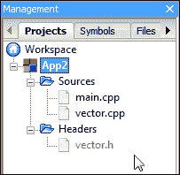

我们将定义一个预处理器定义，以确保**Vector**类被编译为整数数组。导航到**项目** | **构建选项...**菜单选项，将呈现**项目构建选项**窗口：

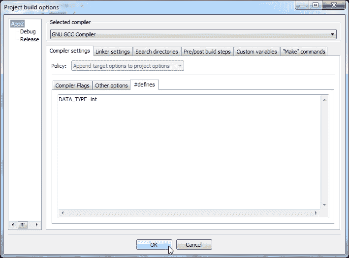

由于我们打算在整个项目中应用这些设置，因此在该窗口中单击项目树的根。现在，单击**编译器设置** | **#defines**选项卡，并根据前面的截图添加该行。然后，单击**确定**按钮关闭该对话框。现在编译并运行此项目。这将产生以下截图中的结果：

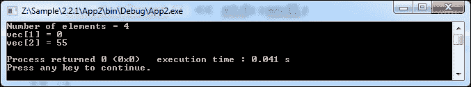

在我们的代码中，我们有一个预处理宏`DATA_TYPE`，它定义了这个类所持有的数据类型。如果我们打算将其用作`double`数组，我们必须重新编译此应用程序。

请注意，预处理宏通过简单的文本替换工作，替换过程中不执行任何类型检查。如果使用不正确，这可能会在程序中引入其他错误。

在本节中，我们学习了使用多个文件进行应用程序开发，调整编译器选项。

# 调试与发布目标

我们注意到在`App1`和`App2`中，每个项目中有两个构建目标，即**debug**和**release**。在本节中，我们将更多地了解它。

Code::Blocks 在项目创建时定义了两个默认构建目标——调试和发布。

正如其名称所示，调试目标适用于应用程序调试。适当的编译器选项被添加以在编译后生成调试符号。它还禁用了所有程序优化。

我们可以在以下截图中找到（导航到**项目** | **构建选项...**菜单选项）**Debug**目标具有一个编译器选项**生成调试符号**。这指示编译器生成调试符号，从而允许应用程序调试：

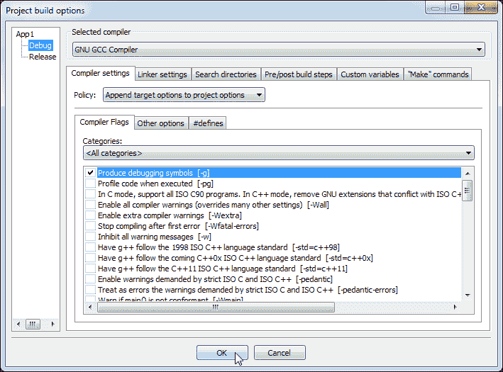

一个**发布**目标禁用了调试符号的生成。它还定义了适当的编译器选项来优化程序。因此，这适用于用于生产的代码。以下截图显示了发布目标中的典型编译器标志。

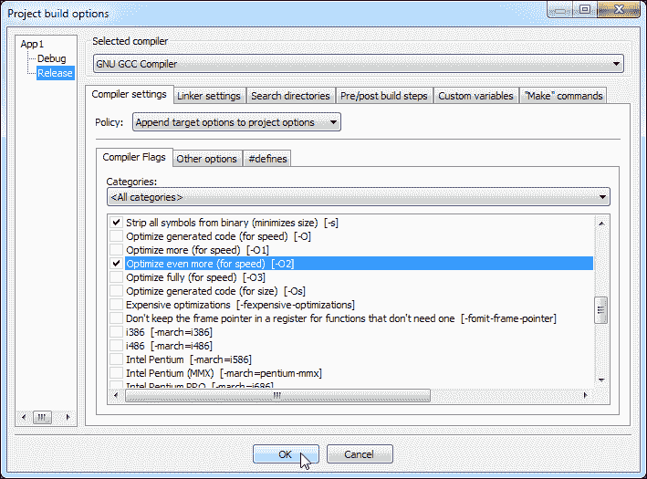

这两个目标非常重要，因为使用启用了编译器优化标志的程序进行调试是困难的。强烈建议在调试目标中编译程序时禁用所有优化。

为了理解这个问题，我们将使用以下代码片段，然后编译和调试它。请注意，我们将使用命令行工具来避免 Code::Blocks UI 对任何错误消息的抽象：

```cpp
#include <iostream>

int add (int a, int b) {
    return (a + b);
}

int main() {
    std::cout << "2 + 3 = " << add(2, 3) << std::endl;
    return 0;
}
```

现在以调试模式编译它：

```cpp
g++ -o app4.exe –g main.cpp

```

我们将使用 GNU 调试器`gdb`来调试和理解执行流程。启动`gdb`并按照以下步骤操作：

```cpp
gdb --quiet app4.exe
Reading symbols from Z:\app4.exe...done.
(gdb) b main.cpp:4
Breakpoint 1 at 0x401945: file main.cpp, line 4.
(gdb) b main.cpp:9
Breakpoint 2 at 0x4019ae: file main.cpp, line 9.
(gdb) r
Starting program: Z:\app4.exe
[New Thread 6036.0x6ac]

Breakpoint 1, add (a=2, b=3) at main.cpp:4
4      return (a + b);
(gdb) c
Continuing.
2 + 3 = 5

Breakpoint 2, _fu0___ZSt4cout () at main.cpp:9
9      return 0;
(gdb) c
Continuing.
[Inferior 1 (process 6036) exited normally]

```

我们要求`gdb`将`app4.exe`加载到内存中。然后我们要求`gdb`设置两个**断点**，通过发出命令`b`并指定行号。我们要求`gdb`运行程序。根据断点的指示，执行在每个断点处暂停。随后，程序在没有任何错误的情况下完成。

让我们看看在打开优化时会发生什么。我们将编译它为：

```cpp
g++ -o app4.exe –g –O2 main.cpp

```

现在再次按照之前的步骤调试此应用程序：

```cpp
gdb --quiet app4.exe
Reading symbols from Z:\app4.exe...done.
(gdb) b main.cpp:4
Breakpoint 1 at 0x401574: file main.cpp, line 4.
(gdb) b main.cpp:9
Breakpoint 2 at 0x402883: main.cpp:9\. (2 locations)
(gdb) r
Starting program: Z:\app4.exe
[New Thread 6084.0x1270]

Breakpoint 2, _GLOBAL__sub_I__Z3addii () at main.cpp:10
10   }
(gdb) c
Continuing.
2 + 3 = 5

Breakpoint 2, _fu0___ZSt4cout () at main.cpp:10
10   }
(gdb) c
Continuing.
[Inferior 1 (process 6084) exited normally]

```

从前面的输出可以看出，编译器优化了我们的源代码，并对代码进行了许多更改。函数`add()`似乎已经被内联扩展了。结果是，在执行过程中，`main.cpp`文件的`return (a + b)`行上的断点永远不会被触发。

这是优化对调试过程的一个副作用。Code::Blocks 创建了两个默认目标，以避免类似情况。强烈建议在项目开发中遵循这一点。

# 带有外部库的项目

在本节中，我们将开发一个使用外部库的应用程序。外部库几乎在任何语言编写的项目中都会被使用。它们允许代码重用，从而加快项目周期。我们将学习如何在 Code::Blocks 项目中配置外部库。

我们已经将`Hello World!`文本打印到控制台。如何在彩色打印文本？我们可以使用一个名为`conio2`的库（[`conio.sourceforge.net/`](http://conio.sourceforge.net/)）来打印彩色文本并进行其他文本操作。书中提供了`conio2`库的编译副本。考虑以下示例代码：

```cpp
#include <cstring>
#include "conio2.h"

int main() {
    int screenWidth = 0;
    const char* msg = "Hello World!\n\n";
    struct text_info textInfo;
    inittextinfo();
    gettextinfo(&textInfo);
    screenWidth  = textInfo.screenwidth;
    textcolor(YELLOW);
    textbackground(RED);
    cputsxy( (screenWidth - strlen(msg))/2 , textInfo.cury, const_cast<char*>(msg) );
    textcolor(WHITE); // Restore original colours
    textbackground(BLACK);
    return 0;
}
```

在这个例子中，我们在第二行包含了`conio2.h`文件。这将向我们的应用程序公开`conio2`库中的预定义函数。我们在`main()`函数内定义了几个变量，即`screenWidth`、`msg`和`textInfo`。然后，我们使用`gettextinfo()`函数检索了当前控制台文本设置。

在下一行中，我们将当前屏幕宽度保存到`screenWidth`变量中。随后，我们分配了`YELLOW`前景色和`RED`背景色。我们使用`cputsxy()`函数打印所需的文本。然后我们在随后的两行中恢复了文本颜色。

为了设置外部库，导航到**项目** | **构建选项...**菜单选项，并点击**搜索目录**选项卡，如下面的屏幕截图所示：

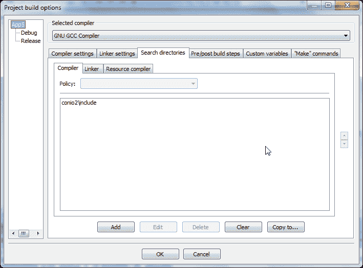

将`conio2\include`路径（相对于项目路径）添加到上一个屏幕截图中显示的位置。如果`conio2`库安装在其他位置，也可以使用完整路径。这将指示编译器在代码中引用的任何头文件中也搜索此目录。

接下来，点击**链接器**选项卡，如下面的屏幕截图所示，添加`conio2\lib`相对路径，如下面的屏幕截图所示。这将指示链接器在此路径中搜索静态库。

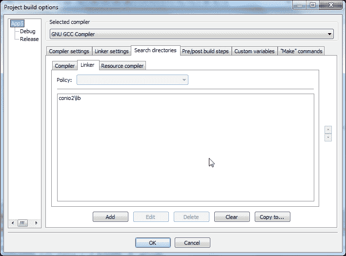

点击**链接器设置**选项卡，并按照下面的屏幕截图添加`libconio.a`：

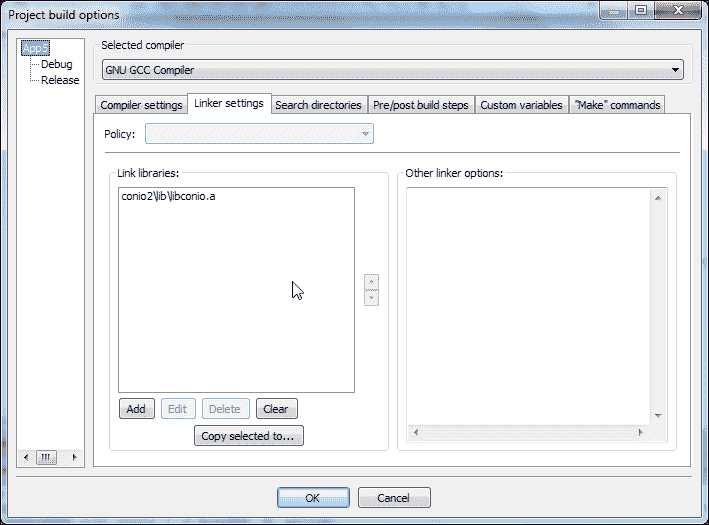

完成这一步后，我们的应用程序已准备好进行编译。现在编译并运行它。我们将看到以下输出：

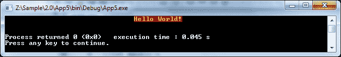

我们的应用程序现在正在使用外部 C/C++库。我们可以以类似的方式使用其他外部库来开发我们的应用程序。

# 工作区

在 Code::Blocks 中，工作区是项目的集合。工作区充当项目的容器，并且还维护项目之间的依赖关系。因此，如果项目 2 依赖于项目 1，那么在编译项目 1 之前将编译项目 2。

考虑以下片段。通过导航到**文件** | **新建** | **项目...**并选择**静态库**向导来创建一个名为`libcalc`的静态库项目。

然后用以下代码替换项目的`main.c`文件的代码：

```cpp
int mult(int a, int b)
{
    return (a * b);
}
```

接下来创建一个名为`App6`的控制台项目，然后用以下代码替换其`main.cpp`文件：

```cpp
#include <iostream>

extern "C" int mult(int a, int b);

int main() {
    std::cout << "2 * 3 = " << mult(2, 3);
    return 0;
}
```

**管理**窗口现在显示了一个工作区中的两个项目。工作区在以下截图中已重命名为`App6`：

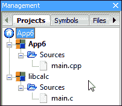

通过导航到**文件** | **另存工作区为...**菜单选项来保存此工作区。右键单击项目树中的**App6**项目，然后单击屏幕截图菜单选项。接下来单击**项目的依赖项**按钮。将呈现以下窗口：

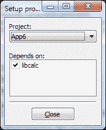

单击**关闭**按钮关闭此窗口，然后单击**确定**按钮关闭**项目/目标选项**窗口。现在`App6`依赖于`libcalc`项目。

现在导航到**项目** | **构建选项...**菜单选项，并在**链接器设置**选项卡的**链接库**中添加`..\libcalc\libcalc.a`。

要编译这两个项目，请导航到**构建** | **构建工作区**菜单选项。Code::Blocks 现在将构建`App6`，并处理其依赖项目。

现在很明显，我们可以使用工作区来管理大型项目中的子项目。

# 摘要

在本章中，我们学会了在 Code::Blocks 中创建项目。我们了解了构建目标的重要性。我们还学会了在我们的项目中使用外部库。最后，我们学会了创建和使用工作区。

通过这个，我们结束了对 Code::Blocks 中项目的介绍。我们将在下一章讨论调试。
