# 第四章：使用 Code::Blocks 进行 Windows 应用程序开发

在之前的章节中，我们的应用程序开发重点是基于控制台的应用程序。这也被称为纯文本应用程序，因为基于控制台的应用程序只能显示文本和 ASCII 艺术。然而，在本章中，我们的重点将放在 Windows 应用程序开发上。

Windows 是世界上使用最广泛的操作系统之一。Code::Blocks 可以用于开发 Windows、Linux 或 Mac 的应用程序。考虑到 Windows 平台的流行，我们将把重点限制在 Windows 平台上。

Windows 应用程序也被称为 GUI（图形用户界面）应用程序。用户与应用程序的交互是通过鼠标和键盘完成的。记事本应用程序是 Windows 操作系统捆绑的 GUI 应用程序的一个例子。以下截图显示了记事本应用程序：

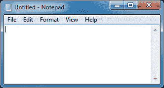

Code::Blocks 随附了所有用于 Windows 应用程序开发的工具。让我们开发一个应用程序并学习它。

# 第一个 Windows 应用程序

遵循 Hello World 应用程序的传统，我们将创建我们的第一个 Windows 应用程序。要做到这一点，请执行以下步骤：

1.  转到**文件** | **新建** | **项目...**菜单选项。选择**Win32 GUI 项目**选项，如下截图所示，然后单击**Go**按钮：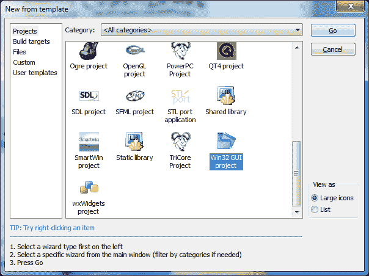

1.  在向导的第一页上单击**下一步**按钮，如下截图所示。选择**基于框架**选项，然后单击**下一步**按钮。基于对话框的应用程序不能包含菜单栏或工具栏。因此，我们选择了基于框架的应用程序。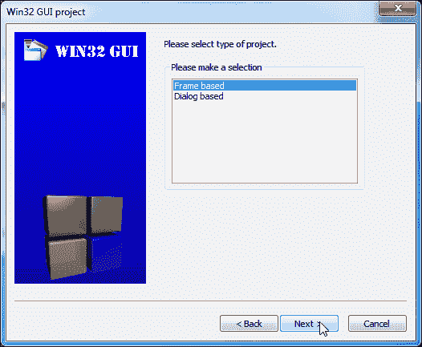

1.  将`App9`作为项目标题输入，并选择创建项目的文件夹。现在单击**下一步**按钮，然后单击**完成**按钮以完成向导。

1.  在`main.cpp`文件中用以下代码替换代码：

```cpp
#include <windows.h>

int WINAPI WinMain(HINSTANCE thisInstance,
                   HINSTANCE prevInstance,
                   LPSTR     commandLine,
                   int       cmdShow
                   )
{
    MessageBox(NULL, "Hello World!", "Title", MB_OK | MB_ICONINFORMATION);
    return 0;
}
```

1.  现在在编译器工具栏中单击构建图标。在编译器工具栏中单击运行按钮。我们的`App9`窗口将类似于以下截图：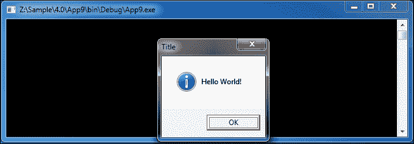

1.  恭喜！我们已成功编译了我们的第一个 Windows 应用程序。

让我们理解我们为这个应用程序编写的代码。我们在代码开头包含了`windows.h`文件。这个文件必须包含在所有 Windows 应用程序中，因为它包含了 Windows 的相关函数声明。随后我们有一个名为`WinMain()`的函数，这是 Windows 应用程序的**入口点**。入口点是在应用程序启动时调用的第一个函数。

`WinMain()`函数接受四个参数——当前实例的句柄，先前实例的句柄，命令行字符串指针，以及控制应用程序应如何显示的窗口显示状态。

我们调用`MessageBox()`函数来显示一个消息框。它接受四个参数——父窗口的句柄（在我们的情况下为`NULL`或没有），消息文本，对话框标题，以及控制要显示的按钮和图标的标志的组合。在我们的情况下，我们使用了`MB_OK`和`MB_ICONINFORMATION`的组合，这指示`MessageBox()`函数分别显示一个**OK**按钮和一个信息图标。

但为什么我们为 GUI 应用程序获取了一个控制台？答案是，默认情况下，Code::Blocks 将调试目标创建为控制台应用程序。我们可以通过导航到**项目** | **属性...**菜单选项，然后单击**构建目标**选项卡来确认这一点。参考以下截图：

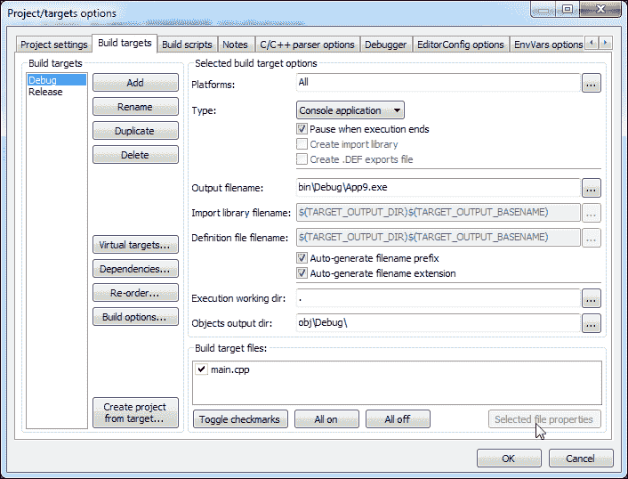

这种方法的优点是可以将调试输出打印到控制台，以便更容易进行调试。可以通过在**类型：**组合框中将应用程序类型更改为**GUI 应用程序**来禁用此功能，如下截图所示：

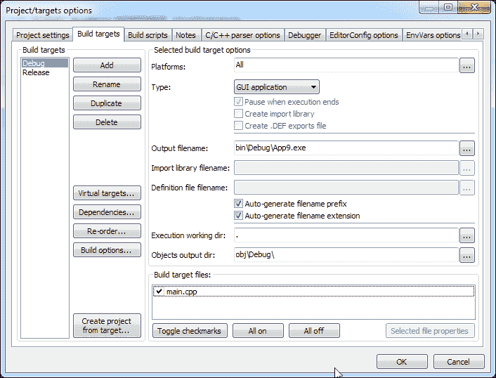

这将停止启动控制台窗口。

## Windows 应用和 Unicode

Unicode 是一种用于编码、存储和表示世界大多数语言文本的标准。C++的`char`数据类型大小为 1 字节。它只能表示英语中可用的文本。要在 Windows 应用程序中启用 Unicode 支持，我们必须使用一个称为`wchar_t`的特殊数据类型，其大小为 2 字节。让我们用印地语说 Hello World。为此，我们将用以下代码替换以前的`MessageBox（）`代码：

```cpp
MessageBox(NULL, TEXT("holaao valD-"), TEXT("Title"), MB_OK | MB_ICONINFORMATION);
```

Code::Blocks 编辑器窗口将类似于以下屏幕截图。编辑器字体大小已更改为 16 点，以便使用 Devnagiri 脚本：

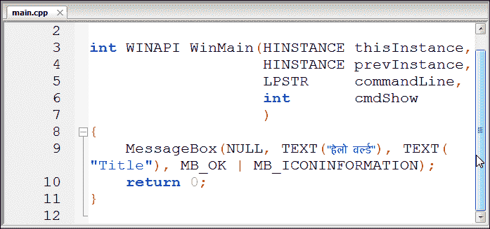

我们已经用`TEXT（）`宏装饰了印地语文本。当定义了`UNICODE`或`_UNICODE`预处理器定义时，此宏用于将 Unicode 字符串转换为`wchar_t*`。当未启用 Unicode 支持时，它返回`char*`。

接下来，我们将定义以下预处理器定义。转到**项目** | **构建选项…**菜单选项。然后在左侧的树中选择`App9`，然后单击**编译器设置**，然后单击**#defines**选项卡。

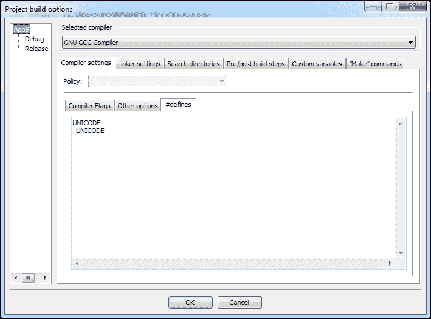

将`UNICODE`和`_UNICODE`添加到文本控件中，然后单击**确定**按钮。单击编译器工具栏中的构建按钮，然后单击运行按钮。现在`App9`将以印地语显示 Hello World，如下面的屏幕截图所示：

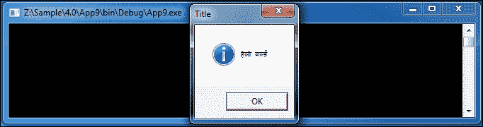

请注意，我们将在所有后续应用程序中启用 Unicode 支持。

# 事件驱动的 Windows 应用程序

Windows 应用程序是**事件驱动**应用程序。事件可以是应用程序的外部或内部输入。事件驱动应用程序运行一个消息循环，该循环解析传入的事件，然后调用与该事件对应的适当函数。由**Win32 GUI 项目**向导生成的 Code::Blocks 默认代码生成了一个事件驱动应用程序的样板代码。

为了理解事件驱动编程，我们将使用以下示例来学习和理解。我们将使用本示例的本机 Win32 API。Win32 API 是几个工具包的基础。因此，我们应该了解它以便了解其他工具包。

让我们创建另一个名为`App10`的 GUI 应用程序。用以下代码替换向导生成的代码。还要按照前面示例中的步骤启用 Unicode 支持。由于代码片段很大，我们将分步理解并粘贴到编辑器窗口中。

以下代码片段显示了头文件声明、全局变量声明和回调函数声明：

```cpp
#include <windows.h>
#define ID_BTN_CLICK_ME 100
// This function is called by the Windows function DispatchMessage()
LRESULT CALLBACK WindowProcedure (HWND hwnd, UINT message, WPARAM wParam, LPARAM lParam);

// Make the class name into a global variable
TCHAR szClassName[ ] = TEXT("CodeBlocksWindowsApp");
```

在以下代码片段中，我们将定义`WinMain（）`函数。我们将在`WinMain（）`函数内定义`WNDCLASSEX`结构的对象。此结构需要几个输入。通过`wincl.lpfnWndProc`，我们已经将回调函数`WindowProcedure（）`分配给了`wincl`对象。这指示应用程序调用该函数进行事件处理。最后，`wincl`对象将使用`RegisterClassEx（）`函数注册。一旦对象成功注册，我们就可以使用`CreateWindowEx（）`函数创建该类的窗口。

我们将使用`ShowWindow（）`函数显示新创建的窗口。窗口显示后，我们将使用`GetMessage（）`函数在`while`循环内运行事件处理循环。所有传入的事件都将通过`DispatchMessage（）`函数发送到`WindowProcedure（）`函数。

```cpp
int WINAPI WinMain (HINSTANCE hThisInstance,
                    HINSTANCE hPrevInstance,
                    LPSTR lpszArgument,
                    int nCmdShow)
{
    HWND hwnd;    // This is the handle for our window
    MSG messages; // Here messages to the application are saved
    WNDCLASSEX wincl; //Data structure for the windowclass

    // The Window structure
    wincl.hInstance = hThisInstance;
    wincl.lpszClassName = szClassName;
    wincl.lpfnWndProc = WindowProcedure;  // Callback function
    wincl.style = CS_DBLCLKS; // Catch double-clicks
    wincl.cbSize = sizeof (WNDCLASSEX);

    // Use default icon and mouse-pointer
    wincl.hIcon = LoadIcon (NULL, IDI_APPLICATION);
    wincl.hIconSm = LoadIcon (NULL, IDI_APPLICATION);
    wincl.hCursor = LoadCursor (NULL, IDC_ARROW);
    wincl.lpszMenuName = NULL;  /* No menu */
    wincl.cbClsExtra = 0;  // No extra bytes after the window class
    wincl.cbWndExtra = 0;  // structure or the window instance
    // Use Windows's default colour as the background of the window
    wincl.hbrBackground = (HBRUSH) COLOR_BACKGROUND;

    // Register the window class, and if it fails quit the program
    if (!RegisterClassEx (&wincl))
        return 0;

    // The class is registered, let's create the window
    hwnd = CreateWindowEx (
           0,            // Extended possibilites for variation
           szClassName,         // Classname
           TEXT("App for Windows"), // Title Text
           WS_OVERLAPPEDWINDOW, // default window
           CW_USEDEFAULT,  // Windows decides the position
           CW_USEDEFAULT,  // where the window ends up on the screen
           300,            // The programs width
           250,            // and height in pixels
           HWND_DESKTOP,   // The window is a child-window to desktop
           NULL,           // No menu
           hThisInstance,  // Program Instance handler
           NULL            // No Window Creation data
           );

    // Make the window visible on the screen
    ShowWindow (hwnd, nCmdShow);

    // Run the message loop. It will run until GetMessage() returns 0
    while (GetMessage (&messages, NULL, 0, 0))
    {
        // Translate virtual-key messages into character messages
        TranslateMessage(&messages);
        // Send message to WindowProcedure
        DispatchMessage(&messages);
    }

    // Return value of PostQuitMessage()
    return messages.wParam;
}
```

当窗口正在创建时，Windows 操作系统会发送`WM_CREATE`事件。然后，我们将使用`CreateWindow（）`函数创建一个按钮。

我们将通过在`WindowProcedure（）`函数中处理`WM_COMMAND`事件来处理按钮按下。然后，每当单击此按钮时，我们将显示一个消息框。

最后，我们将处理`WM_DESTROY`事件，每当窗口被销毁时都会发出该事件。`PostQuitMessage()`函数将发布值为`0`的返回值，发出`WM_QUIT`事件到消息队列。

```cpp
LRESULT CALLBACK WindowProcedure (HWND hwnd, UINT message, WPARAM wParam, LPARAM lParam)
{switch (message) // handle the messages
    {
        case WM_CREATE:
            CreateWindow(TEXT("button"), TEXT("Click Me!"),                     WS_VISIBLE | WS_CHILD, 20, 50, 80, 25, hwnd, (HMENU) ID_BTN_CLICK_ME, NULL, NULL);
            break;
        case WM_COMMAND:
            if (LOWORD(wParam) == ID_BTN_CLICK_ME) {
                MessageBox(hwnd, TEXT("Hello World!"),             TEXT("Information"), MB_OK | MB_ICONINFORMATION);
            }
            break;
        case WM_DESTROY:
            PostQuitMessage (0); // send a WM_QUIT to the message queue
            break;
        default:  // for messages that we don't deal with
            return DefWindowProc (hwnd, message, wParam, lParam);
    }

    return 0;
}
```

这完成了我们的 Windows 应用程序。按下*F9*键（构建和运行工具栏中的构建和运行图标的替代方法）来构建和运行此应用程序。将呈现以下截图：

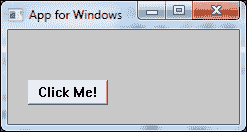

Win32 API 的优势：

+   生成的可执行文件大小更小

+   由于开销较少，生成的代码速度更快

Win32 API 的缺点：

+   由于需要编写更多的代码，开发时间更长

+   开发人员可以使用最小的一组 GUI 控件（例如文本框、按钮等）

为了解决这个问题，开发了 GUI 工具包。GUI 工具包简化了开发过程，允许代码重用和更小的代码库。它还包含复杂的 GUI 控件（例如，富文本控件、HTML 控件等）。

# wxWidgets GUI toolkit

GUI 工具包是一组头文件和库，使开发人员更容易开发 GUI。市场上有几种 GUI 工具包可用，以下是其中的一些：

+   **Microsoft Foundation Class**（**MFC**）：这是一组作为 Win32 API 包装器的类。它随商业版本的 Visual Studio 捆绑提供。MFC 是专有的，需要 Visual Studio 许可证才能使用。MFC 应用程序具有本地外观和感觉。

+   **Qt**（发音为“cute”）：这是由**Digia**开发的开源跨平台 GUI 工具包。Qt 根据商业和 GPL/LGPL 许可证提供。它可在包括 Windows、Linux、Mac 等在内的广泛平台上使用。Qt 绘制的 GUI 是自定义绘制的 UI，可能与平台上的标准应用程序不同。

+   **wxWidgets**：这是另一个开源的跨平台 GUI 工具包，根据 wxWindows 许可证（基于 LGPL 但限制较少）许可。它生成的 UI 具有本地外观和感觉，因为它使用平台标准的 UI 元素。

由于其更简单的许可模型、本地外观和感觉以及跨平台开发能力，本书将专注于 wxWidgets 工具包。本书假定读者已将编译后的 wxWidgets 提取到`Z:\wxWidgets`文件夹中。

为了理解 Win32 API 和 wxWidgets 之间的相似之处，我们将使用 wxWidgets 重新创建`App9`的功能。

1.  转到**文件** | **新建** | **项目…**菜单选项。然后选择**wxWidgets 项目**向导。

1.  接下来单击**Go**按钮，然后在下一个窗口中单击**下一步**按钮。在向导页面中选择**wxWidgets 2.9.x（SVN 版本）**选项，然后单击**下一步**按钮，如下截图所示：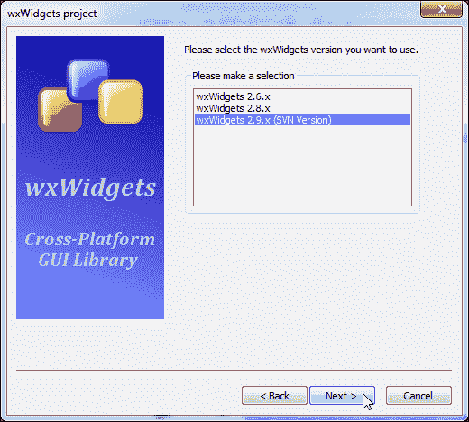

1.  将`App11`输入为项目标题，然后单击**下一步**按钮。单击**下一步**按钮跳过项目详细信息页面。

1.  选择**基于框架**的应用程序类型，如下截图所示。基于框架的应用程序可以拥有菜单、工具栏，适用于大型应用程序。将**首选 GUI 生成器**选项保留为**无**，因为我们将自己编写 GUI 代码。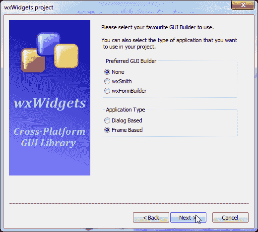

1.  在下面的窗口中，`$(#wx`)是一个全局变量，指向 wxWidgets 安装目录。或者，可以在此处输入我们的情况下的 wxWidgets 的完整路径，即`Z:\wxWidgets`：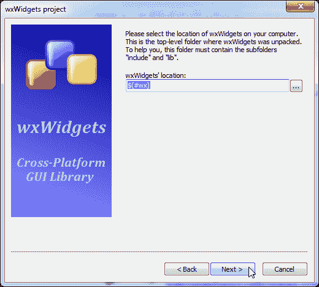

1.  如果此全局变量在此时未定义，将弹出以下窗口。如果全局变量已经定义，则不会弹出。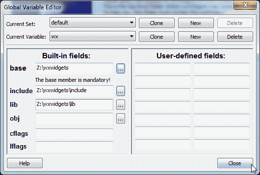

1.  根据上一个截图完成文本框的内容，然后单击**关闭**按钮。然后连续单击两次**下一步**按钮。

1.  在下面的截图中，勾选**启用 Unicode**选项以启用 Unicode 支持，然后单击**下一步**按钮。在下一页中单击**完成**按钮以关闭此向导。向导将生成必要的代码并设置一个使用 wxWidgets 工具包开发应用程序的项目。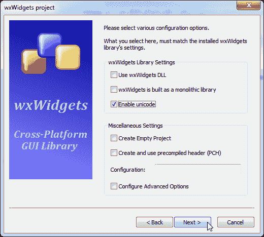

1.  用以下代码替换`App11Main.h`文件中的代码：

```cpp
#ifndef APP11MAIN_H
#define APP11MAIN_H

#include <wx/wx.h>
#include <wx/sizer.h>
#include <wx/button.h>

class App11Frame: public wxFrame {
    public:
        App11Frame(wxFrame *frame, const wxString& title);
        ~App11Frame();
    private:
        static const long idBtnClickMe;
        wxBoxSizer* m_boxSizerMain;
        wxButton* m_btnClickMe;
        void OnClickMe(wxCommandEvent& event);
        void OnClose(wxCloseEvent& event);
        DECLARE_EVENT_TABLE()
};
```

`App11Frame`类是从`wxFrame`类派生而来的。`wxFrame`类表示一个基本窗口。成员变量`m_btnClickMe`已经被定义用来创建和存储按钮，`idBtnClick`将存储它的 ID 以进行事件处理。我们放置了一个`DECLARE_EVENT_TABLE()`函数宏来创建与该类相关的事件处理的样板代码。

1.  接下来用以下代码替换`App11Main.cpp`文件中的代码：

```cpp
#include "App11Main.h"
const long App11Frame::idBtnClickMe = ::wxNewId();

BEGIN_EVENT_TABLE(App11Frame, wxFrame)
    EVT_BUTTON(idBtnClickMe, App11Frame::OnClickMe)
    EVT_CLOSE(App11Frame::OnClose)
END_EVENT_TABLE()

App11Frame::App11Frame(wxFrame *frame, const wxString& title)
    : wxFrame(frame, -1, title)
{
    this->SetSizeHints(wxDefaultSize, wxDefaultSize);
    m_boxSizerMain = new wxBoxSizer(wxHORIZONTAL);
    m_btnClickMe = new wxButton(this, idBtnClickMe, _T("Click Me!"),
                                wxDefaultPosition, wxDefaultSize, 0);
    m_boxSizerMain->Add(m_btnClickMe, 0, wxALL, 5);
    this->SetSizer(m_boxSizerMain);
    this->Layout();
}

App11Frame::~App11Frame() {
}

void App11Frame::OnClose(wxCloseEvent &event) {
    Destroy();
}

void App11Frame::OnClickMe(wxCommandEvent& event) {
    wxMessageBox(_T("Hello World!"), _T("Information"), wxOK | wxICON_INFORMATION, this);
}
```

使用`BEGIN_EVENT_TABLE()`和`END_EVENT_TABLE()`宏布置了一个事件表。这定义了回调函数与相应事件的关系。`OnClickMe()`函数已连接到按钮按下事件。每当用户按下**Click Me!**按钮时，它将显示一条消息。

当应用程序关闭时，`OnClose()`函数将被调用。它调用了一个`Destroy()`函数来启动应用程序关闭。

1.  现在用以下代码替换`App11App.h`文件中的代码：

```cpp
#ifndef APP11APP_H
#define APP11APP_H

#include <wx/app.h>

class App11App : public wxApp
{
    public:
        virtual bool OnInit();
};

#endif // APP11APP_H
```

在前面的文件中，我们从`wxApp`派生了一个`App11App`类。在这个类中实现了一个虚函数`OnInit()`。

1.  接下来在`App11App.cpp`文件中输入以下代码：

```cpp
#include "App11App.h"
#include "App11Main.h"

IMPLEMENT_APP(App11App);

bool App11App::OnInit() {
    App11Frame* frame = new App11Frame(0L, _("wxWidgets Application Template"));
    #ifdef __WXMSW__
    frame->SetIcon(wxICON(aaaa)); // To Set App Icon
    #endif
    frame->Show();

    return true;
}
```

在`OnInit()`函数的实现中，一个名为`frame`的对象是从`App11Frame`类派生出来的。资源文件仅在 Windows 平台上可用。因此，它已被包含在预处理器宏`__WXMSW__`中，并随后在第 12 行启动了应用程序。

1.  将`resource.rc`文件中的代码保持不变。

1.  按下*F9*按钮进行编译和运行。将启动以下窗口。我们发现我们的应用程序现在运行正常：

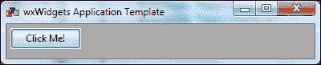

之前我们提到了 wxWidgets 的跨平台开发能力。让我们将这种能力付诸实践。我们将在 Linux 平台上编译`App11`源码而不做任何更改。在这个例子中，我们使用**CentOS 6** Linux。

为了在 Linux 平台上编译，我们将使用一个`Makefile`。请记住，我们也可以使用 Code::Blocks wxWidgets 项目向导来生成一个针对 Linux 平台的项目。但是在我看来，开发人员应该熟悉`Make`工具。

Make 是一个构建工具，可以根据一个名为`Makefile`的文本文件中的一组规则将任意数量的源文件编译成二进制文件。Make 有效地处理构建依赖关系，对于一个大型项目，Make 只会编译自上次构建以来发生变化的相关文件。这样可以节省时间，也可以消除整个构建过程中的任何人为错误。

执行以下步骤：

1.  将以下代码粘贴到一个文件中，并将其保存为文件名`Makefile`：

```cpp
CPP=g++
CXXFLAGS=-c $(shell wx-config --cflags)
LDFLAGS=$(shell wx-config --libs)
SOURCES=App11Main.cpp App11App.cpp

App11: App11Main.o App11App.o
  $(CPP) $(LDFLAGS) App11Main.o App11App.o -o App11

App11Main.o:
  $(CPP) $(CXXFLAGS) App11Main.cpp

App11App.o:
  $(CPP) $(CXXFLAGS) App11App.cpp

clean:
  rm -rf *.o App11
```

在这个文件中，前四行定义了几个变量。`CPP`变量定义了 C++编译器二进制文件，`CXXFLAGS`存储了通过运行脚本`wx-config`为`wxWidgets`项目提供的必要编译器标志。wxWidgets 项目提供了一个名为`wx-config`的 shell 脚本，可以用来确定编译器和链接器标志。

`LDFLAGS`存储了用于生成可执行二进制文件的必要链接器标志。`SOURCES`变量定义了要编译的源文件。请注意，我们不再使用`resource.rc`文件，因为在 Linux 平台上不存在资源编译器。

`App11：`行定义了一个名为`App11`的 make 目标，其中包括两个子目标`App11Main.o`和`App11App.o`。在接下来的一行中定义了一个 shell 命令，该命令指示在所有子目标成功构建后要执行的命令。随后，这两个目标也以类似的方式定义。

`clean`目标执行一个命令来删除所有对象文件和我们的可执行二进制文件。

1.  在 Linux shell 提示符下发出以下命令来编译我们的应用程序：

```cpp
[biplab@centos App11]$ make

```

1.  要运行我们的应用程序，请使用以下命令：

```cpp
[biplab@centos App11]$ ./App11

```

1.  将显示以下窗口：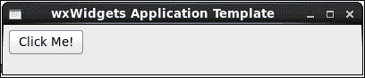

我们发现我们的应用程序现在在 Linux 平台上完美运行。它的行为与我们想要的完全一样。我们没有对我们为 Windows 平台编写的代码进行任何更改。但是我们的 GUI 工具包已经将我们的代码内部映射到适用于 Linux 平台的适当函数。这对开发人员来说是一个巨大的优势，因为面向多个平台变得更加容易。

# 使用 wxSmith 进行快速应用程序开发

在过去的几节中，我们已经了解了 Windows 平台的应用程序开发。但是我们所有的代码都是手写的。我们还注意到，即使对于一个简单的 GUI，我们也必须编写几行代码。

那么，我们能做些什么呢？自动生成 GUI 代码怎么样？听起来有趣！Code::Blocks 带有一个名为**wxSmith**的插件，它可以根据用户在可视化编辑器中生成的 GUI 生成基于 wxWidgets 工具包的 C++代码。我们将通过另一个示例来学习这个功能。

1.  创建一个新的 wxWidgets 项目。这次我们将给它取一个有意义的名字。在下面的窗口中，将项目标题输入为`MyNotePad`。

1.  在接下来的页面中，将**wxSmith**选择为**首选 GUI 生成器**。此选项配置 wxWidgets 项目以使用 wxSmith GUI 生成器。参考以下截图：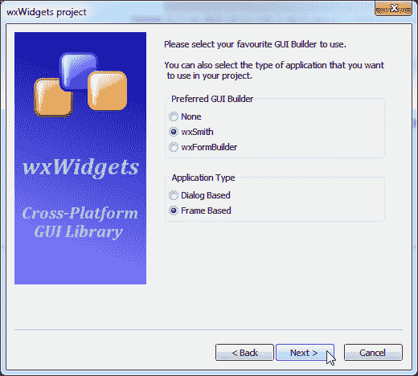

1.  项目生成完成后，将显示以下文件窗口：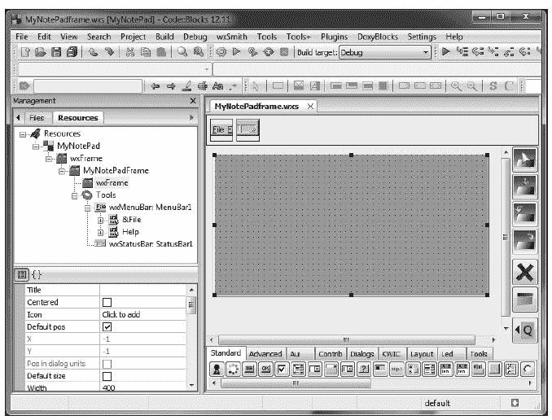

1.  前面的窗口有以下三个主要组件：

+   wxSmith 窗口：此窗口显示可编辑的 UI 元素

+   资源树：此窗口提供了项目的整体视图，显示了该特定项目的 GUI 元素的层次结构

+   属性窗口：此窗口显示了 wxSmith 窗口中当前选定对象的属性

1.  点击资源树中显示的`MyNotePadFrame`项目，然后点击属性窗口中的**Title**属性。在文本框中输入`MyNotePad`。这将把我们的应用程序标题设置为`MyNotePad`。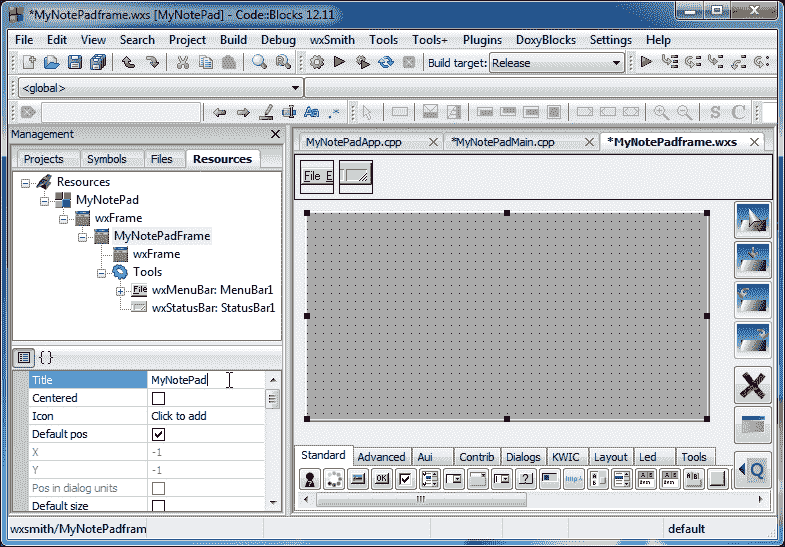

1.  现在我们将向我们的应用程序添加一个`wxTextCtrl`控件。这将向我们的应用程序添加一个文本框。在下方的工具栏上点击`wxTextCtrl`控件按钮。立即在 wxSmith 窗口内显示的**MyNotePadFrame**窗口将被选中。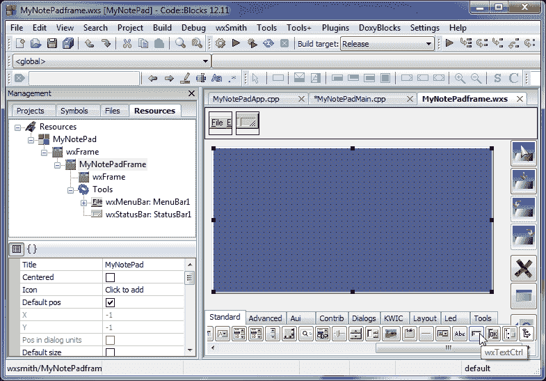

1.  点击它，这个文本控件将被添加到其中。wxSmith 窗口将看起来类似于以下截图：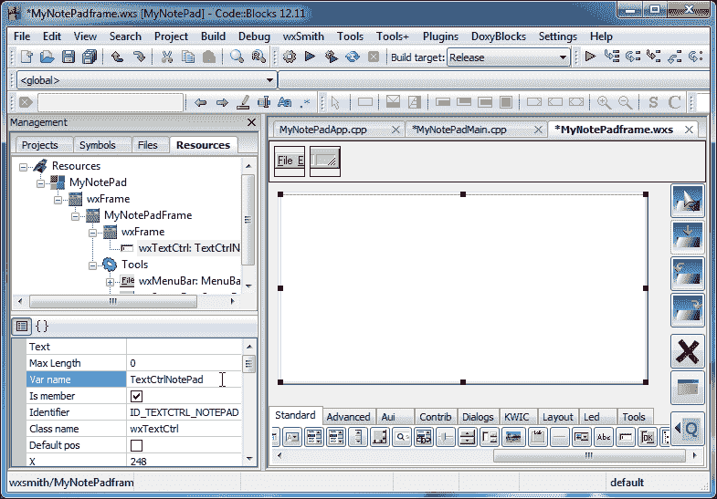

1.  在属性窗口中更改以下属性：

+   文本属性：它是一个空字符串。此属性存储文本控件中的文本

+   变量名属性：将其更改为`TextCtrlNotePad`。此属性将用于命名`wxTextCtrl`类的对象。

+   **标识符**属性`ID_TEXTCTRL_NOTEPAD`：它将被分配一个唯一的整数，然后将用于为其分配事件处理程序和事件类型。

1.  在属性窗口中向下滚动并点击**Style**属性。点击**wxTE_MULTILINE**属性进行选择。这将使文本控件显示多行文本。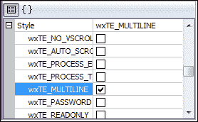

1.  在下一步中，我们将编辑菜单栏。双击菜单栏图标（如下截图所示）：

1.  菜单栏编辑器窗口将弹出。在左侧的菜单树中选择“退出”菜单选项，然后点击“新建”按钮：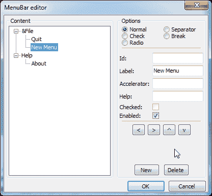

1.  单击**^**按钮将新菜单项移动到**退出**菜单选项之上。如下屏幕截图所示，可以使用以下四个按钮重新排列菜单树中的菜单项：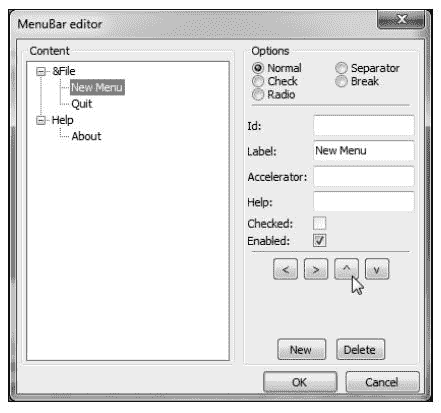

1.  现在在菜单树中选择新菜单选项，并在右侧更改以下属性：

+   ID 属性：将其更改为`idFileOpen`。此属性将被定义为一个唯一的整数，并将用于将其分配给事件处理程序和事件类型。

+   标签属性：将此属性更改为`&Open`。此文本定义了菜单标签，`&O`文本将定义加速键。只要此菜单选项可见，就可以通过按下*O*按钮选择并单击此菜单。

+   加速器属性：将此属性更改为`Ctrl+O`。此属性为此菜单选项定义了一个键盘加速器。键盘加速器是一组唯一的按键组合，无论菜单项的可见性如何，都将生成此菜单选项的单击事件。

+   帮助属性：将其更改为“打开文件...”文本。每当鼠标光标或键盘选择此选项时，将在状态栏中显示此文本。

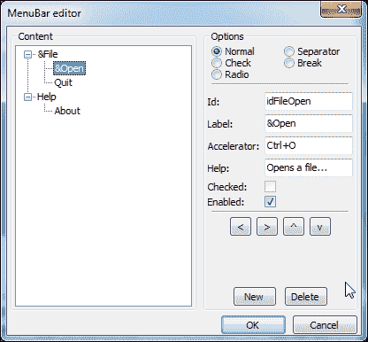

1.  单击**确定**按钮关闭此窗口。我们现在已经向现有菜单栏添加了一个菜单选项。在我们添加代码以使用此菜单选项打开文件之前，我们需要添加一个文件打开保存控件。

1.  单击**对话框**选项卡，然后单击**wxFileDialog**控件按钮。这将向`MyNotePadFrame`类添加一个标准的文件打开和保存对话框。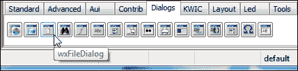

1.  在属性窗口中更改以下属性：

+   将**通配符**更改为`*.txt`。这将将过滤文本设置为具有`.txt`扩展名的文件。

+   将**变量名**更改为`NotePadFileDialog`。这将用于创建`wxFileDialog`类的对象，该对象表示标准的打开或保存对话框。

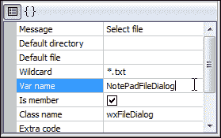

1.  现在我们准备添加代码到新添加的菜单选项。单击资源树中的**&Open**项目，然后单击属性窗口中的**{}**按钮。单击下拉框，选择如下屏幕截图中的**--添加新处理程序--**菜单选项：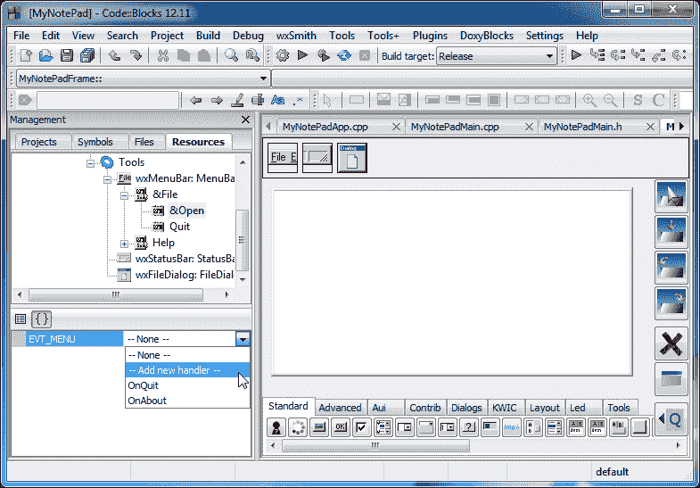

1.  在对话框中输入`OnFileOpen`文本，然后单击**确定**按钮，如下屏幕截图所示：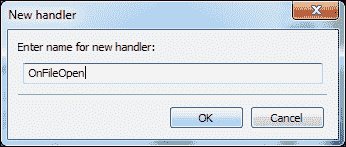

1.  代码编辑器窗口将打开。将以下代码添加到`MyNotePadFrame::OnFileOpen()`函数中。

```cpp
int result;
wxTextFile textFile;
wxString fileContent;

result = NotePadFileDialog->ShowModal();
if (result == wxID_OK) {
  if (textFile.Open(NotePadFileDialog->GetPath())) {
    for (size_t i = 0; i < textFile.GetLineCount(); i++) {
      fileContent << textFile.GetLine(i) << _T("\r\n");
    }
    textFile.Close();
    TextCtrlNotePad->SetLabel(fileContent);
  }
}
```

让我们解释前面的代码。我们在开头定义了一对变量。我们使用`ShowModal()`函数显示文件打开对话框，此对话框的结果将存储在`result`变量中。下一行检查我们是否收到了`wxID_OK`值，这表示用户已选择了一个文件。

我们使用`Open()`函数打开文本文件，并使用从对话框中接收的文件名。如果文件打开成功，那么我们将创建一个循环逐行读取所有行。`fileContent`变量附加从文件中读取的行，然后附加一个新行（在 Windows 上为`\r\n`）到此字符串。当我们完成读取所有行时，打开的文本文件将使用`Close()`函数关闭。

最后，我们将存储在`fileContent`变量中的文本存储到我们的主文本控件中。

我们还需要包含一个额外的头文件，以便使用`wxTextFile`类。在`MyNotePadMain.cpp`文件的`#include <wx/msgdlg.h>`行之后添加以下行：

```cpp
#include <wx/textfile.h>

```

1.  现在我们准备编译我们的小记事本应用程序。按下*F9*键进行构建和运行。我们的应用程序将类似于以下屏幕截图：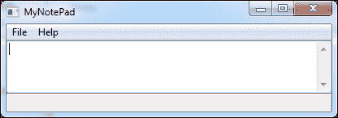

1.  转到**文件** | **打开**菜单选项，将打开以下对话框：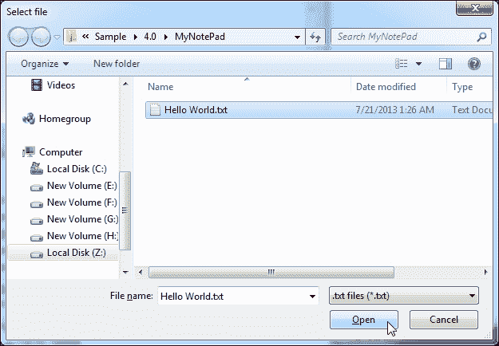

1.  单击**Open**按钮，我们的应用程序现在将打开所选的文本文件，如下面的屏幕截图所示：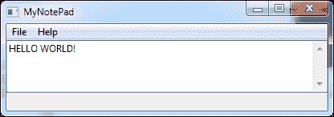

我们的应用程序现在可以工作了！我们在 Code::Blocks 的帮助下编写了大部分与 GUI 相关的代码。唯一手动编写的代码是我们插入的用于打开文本文件的代码。Code::Blocks 提供了一个出色的跨平台和快速应用程序开发平台。我们可以使用这种方法轻松地在 Code::Blocks 中开发 GUI 应用程序。

## 练习

在上一节中，我们学习并开发了我们自己的记事本应用程序。但是，我们的应用程序仅限于打开文件。在这个练习中，我们将扩展我们的应用程序以保存文本文件。

我们将执行以下步骤：

1.  在`&Open`菜单选项后的文件菜单中添加一个菜单项`&Save`，使用`Ctrl+S`作为键盘加速器，`idFileSave`作为 ID，`Saves a file...`作为帮助文本。

1.  为此菜单选项添加事件处理程序，并添加事件处理程序函数`OnFileSave()`。

1.  最后，将以下代码添加到`MyNotePadFrame::OnFileSave()`函数中：

```cpp
int result;

result = NotePadFileDialog->ShowModal();
if (result == wxID_OK) {
  if (!TextCtrlNotePad->SaveFile(NotePadFileDialog->GetPath())) {
    wxMessageBox(_T("Couldn't save ") + NotePadFileDialog->GetPath(),
        _T("Error"), wxOK | wxICON_ERROR);
  }
}
```

这段代码类似于我们为`OnFileOpen()`函数编写的代码。我们使用`wxTextCtrl::FileSave()`函数在第 5 行保存我们的文件。第 6 行的代码确保在无法写入文件时显示错误消息。

我把它留给你来按照之前的步骤并完成这个练习。您可以参考附带的 MyNotePad 应用程序源代码来完成此练习。

# 总结

在本章中，我们学习了使用 Win32 api 和 Code::Blocks 在 Windows 上开发应用程序。然后，我们专注于 GUI 工具包，并使用 wxWidgets 工具包在 Windows 和 Linux 上开发了我们的第一个应用程序。

Code::Blocks 还具有快速应用程序开发工具包，我们使用它来开发我们自己的记事本应用程序。

在下一章中，我们将选择一个应用程序，并学习如何从头开始规划和开发它。
