# 第五章：编程作业

我们在之前的章节中学习了 Code:Blocks 和 Windows 应用程序开发。在本章中，我们将运用这些知识，并作为练习从头开始开发一个应用程序。我们将首先查看最终的应用程序，然后从零开始开发它。我们将使用之前章节中学到的工具，您可以在需要时参考。

# 开发 MyPaint - 一个图像查看器

我们将在本章练习中开发一个图像查看器应用程序。我们的图像查看器应用程序应具有以下功能：

+   它应该能够打开`.jpeg`、`.png`和`.bmp`文件

+   它应该允许用户以 10%的间隔放大和缩小加载的图像

+   缩放范围应在 10%到 200%之间

+   大多数命令应该分配键盘快捷键

+   应该有工具栏以提供对常用功能的访问

+   应用程序应该使用 Code::Blocks 的 wxSmith 插件开发

+   应用程序将使用 wxWidgets 工具包

我们的应用程序应该看起来像下面的屏幕截图。下面的屏幕截图显示我们的图像查看器应用程序已经打开了`Koala.jpg`文件（Windows 7 标准壁纸集的一部分），并将缩放级别设置为 60%。

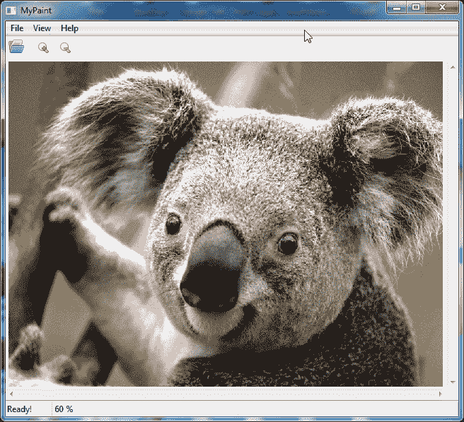

看起来很有趣，不是吗？让我们开始练习并解决它。我们将分两步进行。

1.  了解我们的图像查看器应用程序的结构。

1.  使用 Code::Blocks 开始应用程序开发。

# 练习应用程序的解剖结构

我们的图像查看器应用程序使用多个 C++类来打开、显示和控制图像的显示。以下屏幕截图突出显示了负责用户交互的主要类：

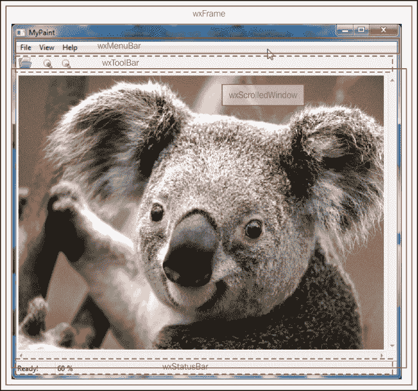

让我们更多地了解以下项目列表中列出的类：

+   `wxFrame`类：此类表示主窗口。所有其他可视元素都显示在此类内部。

+   `wxMenuBar`类：此类在我们的应用程序中显示菜单栏。

+   `wxToolBar`类：此类在我们的应用程序中显示工具栏。

+   `wxScrolledWindow`类：此类用于显示图像。此类创建一个可调整大小的窗口以匹配窗口大小。

+   `wxStatusBar`类：此类在应用程序底部显示状态栏。我们将使用它来显示菜单项帮助和其他信息。

下图显示了类的树形结构及其与`wxFrame`派生类的关系：

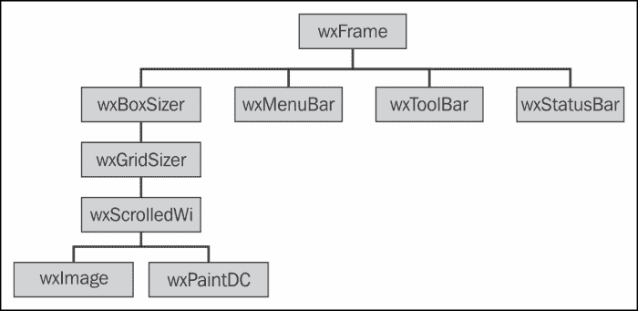

在上图中，`wxMenuBar`、`wxToolBar`和`wxStatusBar`是派生类，并直接添加到`wxFrame`派生类中。

而对于`wxScrolledWindow`派生类，我们需要几个额外的类。我们有两个中间类，`wxBoxSizer`和`wxGridSizer`，用于`wxScrolledWindow`派生类。这些类被称为布局类，帮助在父窗口内布局子窗口。请注意，布局类对用户不可见。

wxWidgets 提供了一个类来通过`wxImage`类加载、操作多种图像格式。这个类是我们应用程序的引擎。`wxScrolledWindow`类使用它来加载和操作图像文件。`wxPaintDC`是`wxScrolledWindow`用来将加载的图像文件绘制到自身上的类。

通过这个对我们应用程序结构的介绍，我们将继续开发我们的应用程序。

# 练习问题的解决方案

让我们通过以下步骤逐步解决它：

1.  创建一个新的`wxWidgets`项目，并将项目名称设置为`MyPaint`。选择**wxSmith**作为**首选 GUI 生成器**。

1.  在如下屏幕截图所示的**管理**窗格中单击**wxFrame**：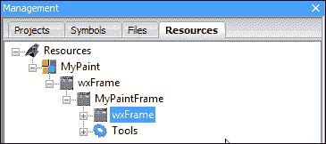

1.  将`Title`属性设置为`MyPaint`。

1.  单击**布局**选项卡，然后单击如下屏幕截图所示的 wxBoxSizer 按钮。然后单击 wxSmith 窗口内显示的框架：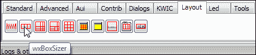

1.  接下来，以类似的方式将 wxGridSizer 添加到新添加的 wxBoxSizer 中。参考以下截图以获取 wxGridSizer 按钮。添加 wxGridSizer 后，将**Cols**属性设置为`1`。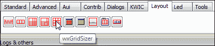

1.  单击**标准**选项卡，并根据以下截图将 wxScrolledWindow 添加到 wxGridSizer 中：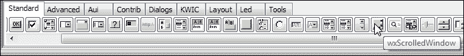

1.  为 wxScrolledWindow 设置以下属性：

+   **变量名**设置为`MyPaintWindow`

+   将最小宽度设置为`640`，最小高度设置为`480`

+   **边框宽度**设置为 5。

1.  在此步骤中，**管理**窗格应类似于以下截图：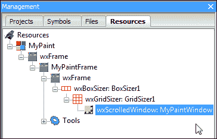

1.  单击**对话框**选项卡，然后单击 wxFileDialog 按钮。根据项目符号列表设置以下属性：

+   **消息**设置为`选择文件`

+   **通配符**设置为`*.bmp;*.jpg;*.png`

+   **变量名**设置为`MyPaintFileDialog`

1.  单击**管理**窗格中的**工具**，然后单击 wxStatusBar 项目。设置以下属性：

+   **变量名**设置为`StatusBarMain`

+   **字段**设置为`2`

+   在**字段 1**中，将**宽度**设置为`5`

+   在**字段 2**中，将**宽度**设置为`10`。

1.  接下来打开**菜单栏编辑器**，并根据下一个截图添加菜单项：

| 菜单项 | ID | 标签 | 加速键 | 帮助项目 |
| --- | --- | --- | --- | --- |
| **&文件** &#124; **&打开图像** | `idFileOpen` | `&打开图像` | `Ctrl + O` | `打开图像文件...` |
| **&查看** &#124; **放大** | `idViewZoomIn` | `放大` | `Ctrl++` | `放大 10%` |
| **&查看** &#124; **缩小** | `idViewZoomOut` | `缩小` | `Ctrl+-` | `缩小 10%` |

最终的菜单栏编辑器窗口应类似于以下截图：

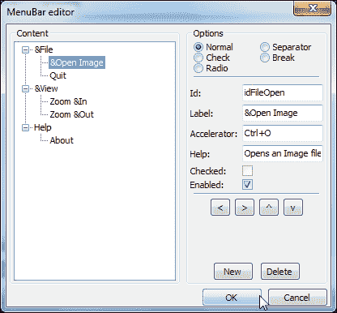

1.  现在我们将向我们的应用程序添加一个 wxToolBar。如下截图所示，单击**工具**选项卡，然后单击 wxToolBar 按钮，将 wxToolBar 添加到我们的应用程序中。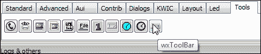

1.  双击 wxSmith 窗口中的 wxToolBar 图标，并添加以下项目。

| 标签 | 选项 | 位图 | 工具提示/帮助文本 |
| --- | --- | --- | --- |
| **打开图像...** | **正常** | 来自 wxArtProvider 的图像—wxART_FILE_OPEN | `打开图像文件` |
| – | 分隔符 | – | – |
| **放大** | **正常** | 项目文件夹中的`zoom_in.png`文件 | `放大 10%` |
| **缩小** | **正常** | 项目文件夹中的`zoom_out.png`文件 | `缩小 10%` |

最终的**ToolBar 编辑器**窗口将类似于以下截图。

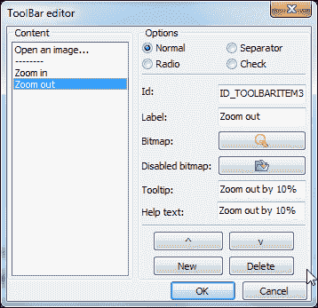

我们已经完成了大多数 GUI 元素的添加。我们需要编写代码来完成我们的应用程序。在这之前，请注意 wxSmith 生成的代码保留在匹配的`//(*`和`//*)`块内。不要在此块内编写代码，因为 wxSmith 将在重新生成代码时删除此块内的任何自定义代码。

1.  在`MyPaintFrame.h`文件中的`MyPaintFrame`类声明内添加以下代码作为私有成员变量和函数。

```cpp
    wxImage* m_Image; //  To store loaded image
    double m_zoomFactor; // To store current zoom factor
    void RefreshPaintWindow(void); // To paint image
```

1.  在`MyPaintFrame()`构造函数内添加以下代码。我们将创建一个新的图像类并将其分配给`m_Image`变量。我们将使用`SetScrollbars()`和`ShowScrollbars()`函数来分配与滚动条相关的属性。我们将分配初始缩放因子为 100%，并使用`wxInitAllImageHandlers()`函数来初始化我们应用程序的图像处理引擎。最后，我们将使用`SetStatusText()`函数来设置状态栏文本。

```cpp
    m_Image = new wxImage(640, 480);
    MyPaintWindow->SetScrollbars(10, 10, 10, 10);
    MyPaintWindow->ShowScrollbars(wxSHOW_SB_ALWAYS, wxSHOW_SB_ALWAYS);
    m_zoomFactor = 1.0;
    wxInitAllImageHandlers();
    StatusBarMain->SetStatusText(_T("Ready!"), 0);
    wxString msg;
    msg.Printf(_T("%d %%"), static_cast<int>(m_zoomFactor*100));
    StatusBarMain->SetStatusText(msg, 1);
```

1.  单击资源树，导航到**&文件** | **&打开图像**菜单选项。转到**事件**选项卡（由**{}**标识），单击**EVT_MENU**旁边的下拉菜单，然后选择**---添加新处理程序---**菜单选项。输入`OnFileOpen`作为事件处理程序的名称。然后在`MyPaintFrame::OnFileOpen()`函数内输入以下代码：

```cpp
    int result;

    result = MyPaintFileDialog->ShowModal();
    if (result == wxID_OK) {
        m_Image->LoadFile(MyPaintFileDialog->GetPath());
        m_zoomFactor = 1.0;
        RefreshPaintWindow();
    }
```

1.  接下来，通过导航到**&View** | **放大**和**&View** | **缩小**菜单选项，将`OnViewZoomIn`和`OnViewZoomOut`事件处理程序函数添加到**放大**和**缩小**。请参考已完成的练习，了解要添加到每个处理程序的代码。

1.  从资源树中选择**MyPaintWindow**，单击**事件**选项卡。将`OnMyPaintWindowPaint`事件处理程序添加到**EVT_PAINT**，并粘贴以下代码。此代码在`wxScrolledWindow`上绘制加载的图像：

```cpp
    wxPaintDC paintDC(MyPaintWindow);
    wxRect rect;
    const wxBitmap bitmap(m_Image->Scale(m_Image->GetWidth() * m_zoomFactor,
                                         m_Image->GetHeight()* m_zoomFactor));

    rect.SetSize(m_Image->GetSize() * m_zoomFactor);
    MyPaintWindow->SetVirtualSize(m_Image->GetSize() * m_zoomFactor);

    if ( (rect.GetWidth() < MyPaintWindow->GetVirtualSize().GetWidth()) ||
        (rect.GetHeight() < MyPaintWindow->GetVirtualSize().GetHeight()) ) {
        rect = rect.CenterIn(MyPaintWindow->GetVirtualSize());
    }

    MyPaintWindow->DoPrepareDC(paintDC);
    paintDC.DrawBitmap(bitmap, rect.GetTopLeft());
```

1.  将`OnResize`事件处理程序添加到**MyPaintWindow**，并添加以下代码行：

```cpp
    RefreshPaintWindow();
```

1.  接下来，将`RefreshPaintWindow()`函数添加到`MyPaintFrame`类中，并在该函数内添加以下代码：

```cpp
    wxString msg;

    MyPaintWindow->ClearBackground();
    MyPaintWindow->Refresh();
    msg.Printf(_T("%d %%"), static_cast<int>(m_zoomFactor*100));
    StatusBarMain->SetStatusText(msg, 1);
```

1.  现在我们将为工具栏按钮添加代码。在资源树中选择**项目：打开图像...**项目，转到**事件**选项卡。将现有的`OnFileOpen`事件处理程序添加到**EVT_TOOL**。这将把现有的`OnFileOpen()`函数连接到这个工具栏按钮。因此，单击此工具栏按钮将模拟导航到**文件** | **打开**菜单选项。

1.  按照以前的步骤，将**放大**和**缩小**工具栏按钮连接到分别的`OnViewZoomIn`和`OnViewZoomOut`事件处理程序。

1.  我们的应用程序现在已经完成。按下*F9*键进行构建和运行。成功构建后，应用程序将运行，并且我们将看到应用程序窗口。现在打开任何图像文件，并在您新编写的应用程序中享受查看它。我们的应用程序现在将如下截图所示：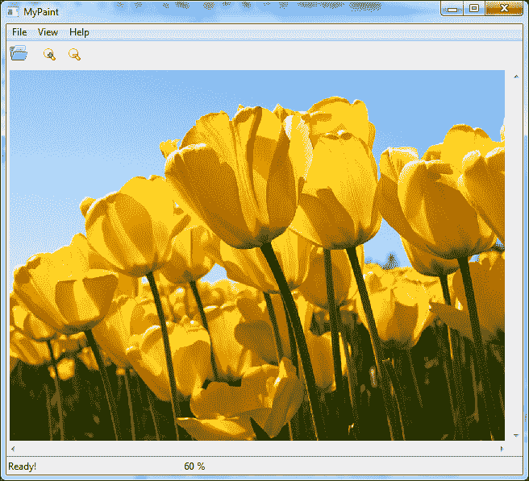

# 总结

在这个练习中，我们计划并编写了自己的图像查看器应用程序。我们使用了 Code::Blocks 的 RAD 功能来编写我们的应用程序，并发现我们可以在短时间内从头开始编写一个应用程序。

我们结束了关于使用 C++和 Code::Blocks 进行应用程序开发的书籍。C++是一个广阔的主题。Code::Blocks 也有许多功能。不可能突出它们的每一个方面。我希望通过这本书，我已经能够阐明使用 C++和 Code::Blocks 进行应用程序开发。我也相信这本书也表明了使用 C++和 Code::Blocks 进行应用程序开发可以是有趣和令人兴奋的。
