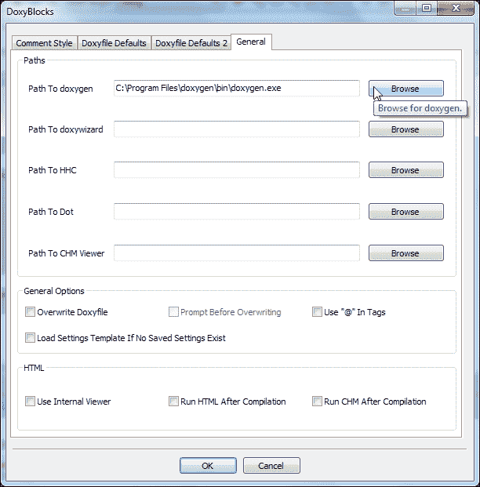
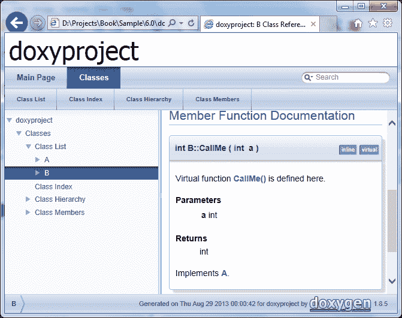
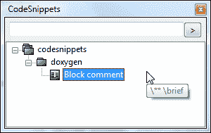
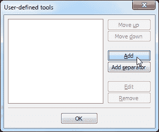
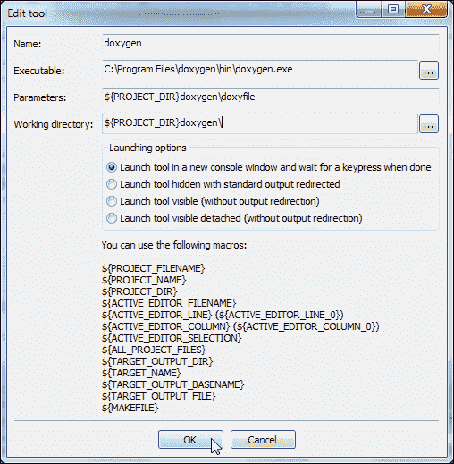

# 附录 A：附录

本附录侧重于 Code::Blocks 的功能集。除了代码编辑、管理和构建之外，Code::Blocks 还有许多其他功能。它可以被脚本化以扩展 Code::Blocks 的功能。它有插件可以生成代码文档。它还能够以不同格式导出代码，如富文本格式、便携式文档格式等。它还可以管理代码片段以简化开发过程。我们将在接下来的几节中讨论它们。

# 脚本化 Code::Blocks

Code::Blocks 使用**Squirrel**语言进行脚本编写。Squirrel 语言是一种高级、面向对象、轻量级的编程语言。Squirrel 语法类似于 C/C++编程语言。

Code::Blocks 通过脚本公开了大量 API。因此，Code::Blocks 的许多方面都可以通过脚本进行扩展。

有关脚本参考，请参考以下网址的文档：

+   **脚本命令**：[`wiki.codeblocks.org/index.php?title=Scripting_commands`](http://wiki.codeblocks.org/index.php?title=Scripting_commands)

+   **API 绑定**：[`wiki.codeblocks.org/index.php?title=Script_bindin`](http://wiki.codeblocks.org/index.php?title=Script_bindin)

# 文档生成

对于任何项目，代码文档都非常重要。它建立了编写的代码的概述，解释了其用法，并帮助开发人员理解代码。Code::Blocks 允许从 IDE 本身生成代码文档。

**Doxygen**是从带注释的 C++文件创建文档的标准工具。Code::Blocks 带有一个名为**DoxyBlocks**的插件，它与外部安装的 doxygen 工具创建了一个接口。

我们首先需要下载并安装 doxygen 工具。随后我们可以使用 DoxyBlocks 插件生成文档。执行以下步骤：

1.  从以下网址下载 doxygen - [`www.stack.nl/~dimitri/doxygen/download.html`](http://www.stack.nl/~dimitri/doxygen/download.html)。还要下载`doxygen-x.x.x-setup.exe`文件。双击该文件进行安装。

1.  我们需要将 DoxyBlocks 插件与 doxygen 工具连接起来。转到**DoxyBlocks** | **打开首选项...**菜单选项。将显示以下截图：

1.  单击**常规**选项卡。然后单击**Path To doxygen**选项旁边的**浏览**按钮，并设置路径为`C:\Program Files\doxygen\bin\doxygen.exe`。

1.  接下来创建一个新的 C++控制台项目，并将以下代码添加到向导生成的`main.cpp`文件中：

```cpp
class A {
    public:
        A() {};
        ~A() {};
        virtual int CallMe(int a) = 0;
};

class B : public A {
    public:
        B() {};
        ~B() {};
        int CallMe(int a) {
            return a;
        }
};

int main() {
    return 0;
}
```

1.  导航到**DoxyBlocks** | **提取文档**菜单选项，或按下*Ctrl* + *Alt* + *E*键组合。Code::Blocks 现在将在`doxygen`文件夹内生成项目文档。

1.  转到**DoxyBlocks** | **运行 HTML**菜单选项，或按下*Ctrl* + *Alt* + *H*键组合，以在 Web 浏览器中打开新创建的文档。

我们还可以添加有关函数、类等的详细描述，以创建详细的文档。

1.  将光标移动到`B::CallMe()`函数的开头，然后单击**DoxyBlocks | /** Block comment**菜单选项，或按下*Ctrl* + *Alt* + *B*键组合。Code::Blocks 将分析函数参数，并插入适合 doxygen 工具的默认注释块。调整注释块，我们的代码将类似于以下代码片段：

```cpp
        ~B() {};
        /** \brief Virtual function CallMe() is defined here
         *
         * \param a int
         * \return int
         *
         */
        int CallMe(int a) {
```

1.  按下*Ctrl* + *Alt* + *E*键组合重新生成文档，并使用*Ctrl* + *Alt* + *H*键组合在 Web 浏览器中打开它。`B::CallMe()`的文档将类似于以下截图：

我们还可以定制 DoxyBlocks 插件选项，以使用 doxygen 的高级功能。

# 代码片段管理

Code::Blocks 允许开发人员存储和检索经常使用的代码片段。在我们之前的示例中，我们使用了 DoxyBlocks 插件来注释适用于生成文档的块。但是我们也可以将空模板保存为代码片段，并在需要时重复使用它。

1.  转到**视图** | **代码片段**菜单选项，以显示**CodeSnippets**窗口。

1.  右键单击树中的`codesnippets`，然后选择**添加子类别**菜单选项。

1.  将其命名为`doxygen`。右键单击此**doxygen**类别，然后单击**添加片段**菜单选项。

1.  将`块注释`输入为**标签**，并将以下代码输入为片段文本：

```cpp
\** \brief
  *
  */
```

1.  单击**确定**按钮以保存此片段。**CodeSnippets**窗口将类似于以下屏幕截图：

1.  现在单击 Code::Blocks 编辑器窗口中的任何位置，右键单击此片段，然后选择**应用**菜单选项。此片段现在将粘贴到编辑器窗口中。

我们可以将代码、书签、文本文件添加为代码片段。代码片段不是特定于项目的，并且适用于所有项目。

# 项目使用外部工具

Code::Blocks 允许用户为任何项目使用外部工具。想象一下，我们想要使用 doxygen 工具来生成文档，而不使用 DoxyBlocks 插件。我们可以将 doxygen 添加为外部工具，然后根据需要使用它。

1.  转到**工具** | **配置工具…**菜单选项以添加新工具。将打开以下窗口：

1.  单击**添加**按钮以添加新工具。将打开以下窗口：

1.  输入以下详细信息：

+   将**名称**属性设置为`doxygen`。此值将用于在**工具**菜单下创建一个新的菜单项

+   将**可执行文件**属性设置为`C:\Program Files\doxygen\bin\doxygen.exe`

+   将**参数**属性设置为`${PROJECT_DIR}doxygen\doxyfile`

+   将**工作目录**属性设置为`${PROJECT_DIR}doxygen\`

1.  单击**确定**按钮关闭此窗口，然后单击**确定**按钮关闭**用户定义的工具**窗口。将在**工具**菜单选项下创建一个菜单项。

1.  导航到**工具** | **doxygen**菜单选项，doxygen 工具将在控制台窗口内启动。当完成后，按任意键关闭此控制台窗口。

我们可以以类似的方式使用任何其他工具。

# 以不同格式导出源代码

Code::Blocks 允许用户将源代码导出为 HTML、RTF、ODF 或 PDF 格式。执行以下步骤以以不同格式导出源代码：

1.  要将文件导出为 PDF 格式，请转到**文件** | **导出** | **作为 PDF…**菜单选项。

1.  在下一个对话框中输入文件名和路径。单击**保存**按钮继续。

1.  Code::Block 将提示确认在导出的源代码中包含行号。选择**是**或**否**选项，将导出特定的源文件。
