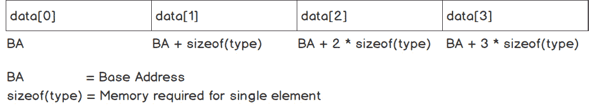
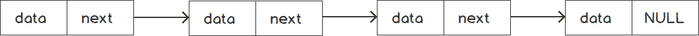
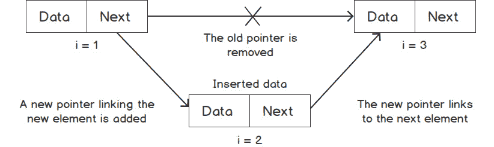
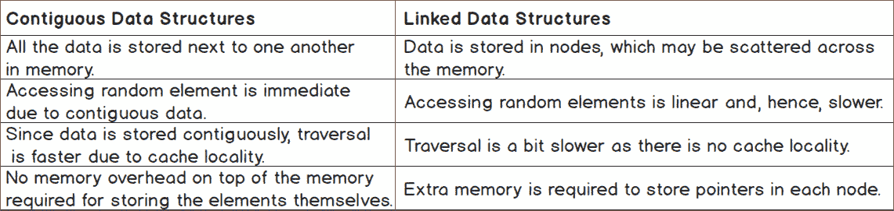
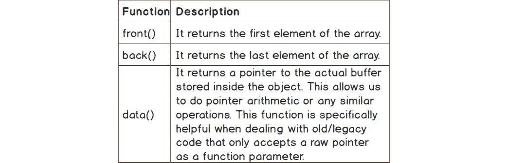
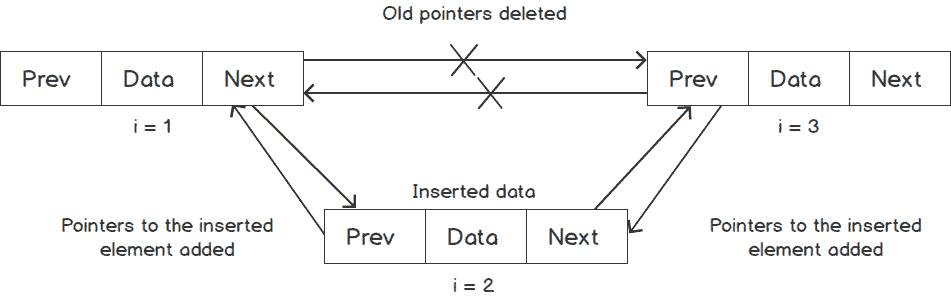

# 第一章：列表、栈和队列

## 学习目标

在本章结束时，您将能够：

+   描述在任何应用程序中使用正确数据结构的重要性

+   根据问题实现各种内置数据结构，以使应用程序开发更加简单

+   如果 C++提供的数据结构不适合用例，实现适合特定情况的自定义线性数据结构

+   分析现实生活中的问题，不同类型的线性数据结构如何有帮助，并决定哪种对于给定的用例最合适

本章描述了在任何应用程序中使用正确数据结构的重要性。我们将学习如何在 C++中使用一些最常见的数据结构，以及使用这些结构的内置和自定义容器。

## 介绍

在设计任何应用程序时，数据管理是需要牢记的最重要考虑因素之一。任何应用程序的目的都是获取一些数据作为输入，对其进行处理或操作，然后提供合适的数据作为输出。例如，让我们考虑一个医院管理系统。在这里，我们可能有关于不同医生、患者和档案记录等的数据。医院管理系统应该允许我们执行各种操作，比如接收患者，并更新不同专业医生的加入和离开情况。虽然用户界面会以对医院管理员相关的格式呈现信息，但在内部，系统会管理不同的记录和项目列表。

程序员可以使用多种结构来保存内存中的任何数据。选择正确的数据结构对于确保可靠性、性能和在应用程序中实现所需功能至关重要。除了正确的数据结构，还需要选择正确的算法来访问和操作数据，以实现应用程序的最佳行为。本书将使您能够为应用程序设计实现正确的数据结构和算法，从而使您能够开发出经过优化和可扩展的应用程序。

本章介绍了 C++中提供的基本和常用的线性数据结构。我们将研究它们的设计、优缺点。我们还将通过练习来实现这些结构。了解这些数据结构将帮助您以更高效、标准化、可读和可维护的方式管理任何应用程序中的数据。

线性数据结构可以广泛地分为连续或链式结构。让我们了解一下两者之间的区别。

## 连续与链式数据结构

在处理任何应用程序中的数据之前，我们必须决定如何存储数据。对这个问题的答案取决于我们想要对数据执行什么样的操作以及操作的频率。我们应该选择能够在延迟、内存或任何其他参数方面给我们最佳性能的实现，而不影响应用程序的正确性。

确定要使用的数据结构类型的一个有用的度量标准是算法复杂度，也称为时间复杂度。时间复杂度表示执行某个操作所需的时间相对于数据大小的比例。因此，时间复杂度显示了如果我们改变数据集的大小，时间将如何变化。对于任何数据类型上的不同操作的时间复杂度取决于数据在其中的存储方式。

数据结构可以分为两种类型：连续和链式数据结构。我们将在接下来的章节中更仔细地看看它们。

### 连续数据结构

如前所述，**连续数据结构**将所有元素存储在单个内存块中。下图显示了连续数据结构中数据的存储方式：



###### 图 1.1：连续数据结构的图示表示

在上图中，考虑较大的矩形是存储所有元素的单个内存块，而较小的矩形表示为每个元素分配的内存。这里需要注意的一点是，所有元素都是相同类型的。因此，它们都需要相同数量的内存，这由`sizeof(type)`表示。第一个元素的地址也被称为`BA + sizeof(type)`位置，其后的元素位于`BA + 2 * sizeof(type)`，依此类推。因此，要访问索引`i`处的任何元素，我们可以使用通用公式获取：`BA + i * sizeof(type)`。

在这种情况下，我们可以立即使用公式访问任何元素，而不管数组的大小如何。因此，访问时间始终是恒定的。这在大 O 符号中用*O(1)*表示。

数组的两种主要类型是静态和动态。静态数组仅在其声明块内存在，但动态数组提供了更好的灵活性，因为程序员可以确定何时应该分配它，何时应该释放它。根据需求，我们可以选择其中之一。对于不同的操作，它们的性能是相同的。由于这个数组是在 C 中引入的，它也被称为 C 风格数组。以下是这些数组的声明方式：

+   静态数组声明为`int arr[size];`。

+   C 中声明动态数组为`int* arr = (int*)malloc(size * sizeof(int));`。

+   C++中声明动态数组为`int* arr = new int[size];`。

静态数组是聚合的，这意味着它是在堆栈上分配的，因此在流程离开函数时被释放。另一方面，动态数组是在堆上分配的，并且会一直保留在那里，直到手动释放内存。

由于所有元素都是相邻的，当访问其中一个元素时，它旁边的几个元素也会被带入缓存。因此，如果要访问这些元素，这是一个非常快速的操作，因为数据已经存在于缓存中。这个属性也被称为缓存局部性。虽然它不会影响任何操作的渐近时间复杂度，但在遍历数组时，对于实际上连续的数据，它可以提供令人印象深刻的优势。由于遍历需要顺序地遍历所有元素，获取第一个元素后，接下来的几个元素可以直接从缓存中检索。因此，该数组被认为具有良好的缓存局部性。

### 链接数据结构

链接数据结构将数据存储在多个内存块中，也称为节点，这些节点可以放置在内存的不同位置。下图显示了链接数据结构中数据的存储方式：



###### 图 1.2：链接数据结构

在链表的基本结构中，每个节点包含要存储在该节点中的数据和指向下一个节点的指针。最后一个节点包含一个`NULL`指针，表示列表的结尾。要访问任何元素，我们必须从链表的开头，即头部开始，然后沿着下一个指针继续，直到达到预期的元素。因此，要到达索引`i`处的元素，我们需要遍历链表并迭代`i`次。因此，我们可以说访问元素的复杂度是*O(n)*；也就是说，时间与节点数成比例变化。

如果我们想要插入或删除任何元素，并且我们有指向该元素的指针，与数组相比，对于链表来说，这个操作是非常小且相当快的。让我们看看在链表中如何插入一个元素。下图说明了在链表中插入两个元素之间的情况：



###### 图 1.3：向链表中插入一个元素

对于插入，一旦我们构造了要插入的新节点，我们只需要重新排列链接，使得前一个元素的下一个指针*(i = 1)*指向新元素*(i = 2)*，而不是当前元素的当前元素*(i = 3)*，并且新元素*(i = 2)*的下一个指针指向当前元素的下一个元素*(i = 3)*。这样，新节点就成为链表的一部分。

同样，如果我们想要删除任何元素，我们只需要重新排列链接，使得要删除的元素不再连接到任何列表元素。然后，我们可以释放该元素或对其采取任何其他适当的操作。

由于链表中的元素不是连续存储在内存中的，所以链表根本无法提供缓存局部性。因此，没有办法将下一个元素带入缓存，而不是通过当前元素中存储的指针实际访问它。因此，尽管在理论上，它的遍历时间复杂度与数组相同，但在实践中，它的性能很差。

以下部分提供了关于连续和链式数据结构的比较总结。

### 比较

以下表格简要总结了链式和连续数据结构之间的重要区别：



###### 图 1.4：比较连续和链式数据结构的表

以下表格包含了关于数组和链表在各种参数方面的性能总结：


###### 图 1.5：显示数组和链表某些操作的时间复杂度的表

对于任何应用程序，我们可以根据要求和不同操作的频率选择数据结构或两者的组合。

数组和链表是非常常见的，广泛用于任何应用程序中存储数据。因此，这些数据结构的实现必须尽可能无缺陷和高效。为了避免重新编写代码，C++提供了各种结构，如`std::array`、`std::vector`和`std::list`。我们将在接下来的章节中更详细地看到其中一些。

### C 风格数组的限制

虽然 C 风格的数组可以完成任务，但它们并不常用。有许多限制表明需要更好的解决方案。其中一些主要限制如下：

+   内存分配和释放必须手动处理。未能释放可能导致内存泄漏，即内存地址变得不可访问。

+   `operator[]`函数不会检查参数是否大于数组的大小。如果使用不正确，这可能导致分段错误或内存损坏。

+   嵌套数组的语法变得非常复杂，导致代码难以阅读。

+   默认情况下不提供深拷贝功能，必须手动实现。

为了避免这些问题，C++提供了一个非常薄的包装器，称为`std::array`，覆盖了 C 风格数组。

## std::array

`std::array`自动分配和释放内存。`std::array`是一个带有两个参数的模板类——元素的类型和数组的大小。

在下面的例子中，我们将声明大小为`10`的`int`类型的`std::array`，设置任何一个元素的值，然后打印该值以确保它能正常工作：

```cpp
std::array<int, 10> arr;        // array of int of size 10
arr[0] = 1;                    // Sets the first element as 1
std::cout << "First element: " << arr[0] << std::endl;
std::array<int, 4> arr2 = {1, 2, 3, 4};
std::cout << "Elements in second array: ";
  for(int i = 0; i < arr.size(); i++)
    std::cout << arr2[i] << " ";
```

这个例子将产生以下输出：

```cpp
First element: 1
Elements in second array: 1 2 3 4 
```

正如我们所看到的，`std::array`提供了`operator[]`，与 C 风格数组相同，以避免检查索引是否小于数组的大小的成本。此外，它还提供了一个名为`at(index)`的函数，如果参数无效，则会抛出异常。通过这种方式，我们可以适当地处理异常。因此，如果我们有一段代码，其中将访问一个具有一定不确定性的元素，例如依赖于用户输入的数组索引，我们总是可以使用异常处理来捕获错误，就像以下示例中演示的那样。

```cpp
try
{
    std::cout << arr.at(4);    // No error
    std::cout << arr.at(5);    // Throws exception std::out_of_range
}
catch (const std::out_of_range& ex)
{
    std::cerr << ex.what();
}
```

除此之外，将`std::array`传递给另一个函数类似于传递任何内置数据类型。我们可以按值或引用传递它，可以使用`const`也可以不使用。此外，语法不涉及任何指针相关操作或引用和解引用操作。因此，与 C 风格数组相比，即使是多维数组，可读性要好得多。以下示例演示了如何按值传递数组：

```cpp
void print(std::array<int, 5> arr)
{
    for(auto ele: arr)
    {
        std::cout << ele << ", ";
    }
}
std::array<int, 5> arr = {1, 2, 3, 4, 5};
print(arr);
```

这个例子将产生以下输出：

```cpp
1, 2, 3, 4, 5
```

我们不能将任何其他大小的数组传递给这个函数，因为数组的大小是函数参数数据类型的一部分。因此，例如，如果我们传递`std::array<int, 10>`，编译器将返回一个错误，说它无法匹配函数参数，也无法从一个类型转换为另一个类型。然而，如果我们想要一个通用函数，可以处理任何大小的`std::array`，我们可以使该函数的数组大小成为模板化，并且它将为所需大小的数组生成代码。因此，签名将如下所示：

```cpp
template <size_t N>
void print(const std::array<int, N>& arr)
```

除了可读性之外，在传递`std::array`时，默认情况下会将所有元素复制到一个新数组中。因此，会执行自动深复制。如果我们不想要这个特性，我们总是可以使用其他类型，比如引用和`const`引用。因此，它为程序员提供了更大的灵活性。

在实践中，对于大多数操作，`std::array`提供与 C 风格数组类似的性能，因为它只是一个薄包装器，减少了程序员的工作量并使代码更安全。`std::array`提供两个不同的函数来访问数组元素——`operator[]`和`at()`。`operator[]`类似于 C 风格数组，并且不对索引进行任何检查。然而，`at()`函数对索引进行检查，如果索引超出范围，则抛出异常。因此，在实践中它会慢一些。

如前所述，迭代数组是一个非常常见的操作。`std::array`通过范围循环和迭代器提供了一个非常好的接口。因此，打印数组中所有元素的代码如下所示：

```cpp
std::array<int, 5> arr = {1, 2, 3, 4, 5};
for(auto element: arr)
{
    std::cout << element << ' ';
}
```

这个例子将显示以下输出：

```cpp
1 2 3 4 5 
```

在前面的示例中，当我们演示打印所有元素时，我们使用了一个索引变量进行迭代，我们必须确保它根据数组的大小正确使用。因此，与这个示例相比，它更容易出现人为错误。

我们可以使用范围循环迭代`std::array`是因为迭代器。`std::array`有名为`begin()`和`end()`的成员函数，返回访问第一个和最后一个元素的方法。为了从一个元素移动到下一个元素，它还提供了算术运算符，比如递增运算符(`++`)和加法运算符(`+`)。因此，范围循环从`begin()`开始，到`end()`结束，使用递增运算符(`++`)逐步前进。迭代器为所有动态可迭代的 STL 容器提供了统一的接口，比如`std::array`、`std::vector`、`std::map`、`std::set`和`std::list`。

除了迭代之外，所有需要在容器内指定位置的函数都基于迭代器；例如，在特定位置插入、在范围内或特定位置删除元素以及其他类似的函数。这使得代码更具可重用性、可维护性和可读性。

#### 注意

对于 C++中使用迭代器指定范围的所有函数，`start()`迭代器通常是包含的，而`end()`迭代器通常是排除的，除非另有说明。

因此，`array::begin()`函数返回一个指向第一个元素的迭代器，但`array::end()`返回一个指向最后一个元素之后的迭代器。因此，可以编写基于范围的循环如下：

```cpp
for(auto it = arr.begin(); it != arr.end(); it++)
{
    auto element = (*it);
    std::cout << element << ' ';
}
```

还有一些其他形式的迭代器，比如`const_iterator`和`reverse_iterator`，它们也非常有用。`const_iterator`是正常迭代器的`const`版本。如果数组被声明为`const`，与迭代器相关的函数（如`begin()`和`end()`）会返回`const_iterator`。

`reverse_iterator`允许我们以相反的方向遍历数组。因此，它的函数，如增量运算符（`++`）和`advance`，是正常迭代器的逆操作。

除了`operator[]`和`at()`函数外，`std::array`还提供了其他访问器，如下表所示：



###### 图 1.6：显示`std::array`的一些访问器

以下代码片段演示了这些函数的使用：

```cpp
std::array<int, 5> arr = {1, 2, 3, 4, 5};
std::cout << arr.front() << std::endl;       // Prints 1
std::cout << arr.back() << std::endl;        // Prints 5
std::cout << *(arr.data() + 1) << std::endl; // Prints 2
```

`std::array`提供的另一个有用功能是用于深度比较的关系运算符和用于深度复制的复制赋值运算符。所有大小运算符（`<`，`>`，`<=`，`>=`，`==`，`!=`）都被定义用于比较两个数组，前提是相同的运算符也被提供给`std::array`的基础类型。

C 风格数组也支持所有关系运算符，但这些运算符实际上并不比较数组内部的元素；事实上，它们只是比较指针。因此，只是将元素的地址作为整数进行比较，而不是对数组进行深度比较。这也被称为**浅比较**，并且并不太实用。同样，赋值也不会创建分配数据的副本。相反，它只是创建一个指向相同数据的新指针。

#### 注意

关系运算符仅适用于相同大小的`std::array`。这是因为数组的大小是数据类型本身的一部分，它不允许比较两种不同数据类型的值。

在下面的示例中，我们将看到如何包装由用户定义大小的 C 风格数组。

### 练习 1：实现动态大小数组

让我们编写一个小型应用程序来管理学校中学生的记录。班级中的学生数量和他们的详细信息将作为输入给出。编写一个类似数组的容器来管理数据，该容器还可以支持动态大小。我们还将实现一些实用函数来合并不同的班级。

执行以下步骤以完成练习：

1.  首先，包括所需的头文件：

```cpp
#include <iostream>
#include <sstream>
#include <algorithm>
```

1.  现在，让我们编写一个名为`dynamic_array`的基本模板结构，以及主要数据成员：

```cpp
template <typename T>
class dynamic_array
{
    T* data;
    size_t n;
```

1.  现在，让我们添加一个接受数组大小并复制它的构造函数：

```cpp
public:
dynamic_array(int n)
{
    this->n = n;
    data = new T[n];
}
    dynamic_array(const dynamic_array<T>& other)
  {
    n = other.n;
    data = new T[n];
    for(int i = 0; i < n; i++)
    data[i] = other[i];
  }
```

1.  现在，让我们在`public`访问器中添加`operator[]`和`function()`来支持直接访问数据，类似于`std::array`：

```cpp
T& operator[](int index)
{
    return data[index];
}
const T& operator[](int index) const
{
    return data[index];
}
T& at(int index)
{
    if(index < n)
    return data[index];
    throw "Index out of range";
}
```

1.  现在，让我们添加一个名为`size()`的函数来返回数组的大小，以及一个析构函数来避免内存泄漏：

```cpp
size_t size() const
{
    return n;
}
~dynamic_array()
{
    delete[] data;   // A destructor to prevent memory leak
}
```

1.  现在，让我们添加迭代器函数来支持基于范围的循环，以便遍历`dynamic_array`：

```cpp
T* begin()
{
    return data;
}
const T* begin() const
{
    return data;
}
T* end()
{
    return data + n;
}
const T* end() const
{
    return data + n;
}
```

1.  现在，让我们添加一个函数，使用`+`运算符将一个数组追加到另一个数组中。让我们将其保持为`friend`函数以提高可用性：

```cpp
friend dynamic_array<T> operator+(const dynamic_array<T>& arr1, dynamic_array<T>& arr2)
{
    dynamic_array<T> result(arr1.size() + arr2.size());
    std::copy(arr1.begin(), arr1.end(), result.begin());
    std::copy(arr2.begin(), arr2.end(), result.begin() + arr1.size());
    return result;
}
```

1.  现在，让我们添加一个名为`to_string`的函数，它接受一个分隔符作为参数，默认值为“`,`”：

```cpp
std::string to_string(const std::string& sep = ", ")
{
  if(n == 0)
    return "";
  std::ostringstream os;
  os << data[0];
  for(int i = 1; i < n; i++)
    os << sep << data[i];
  return os.str();
}
};
```

1.  现在，让我们为学生添加一个`struct`。我们将只保留姓名和标准（即学生所在的年级/班级）以简化，并添加`operator<<`以正确打印它：

```cpp
struct student
{
    std::string name;
    int standard;
};
std::ostream& operator<<(std::ostream& os, const student& s)
{
    return (os << "[Name: " << s.name << ", Standard: " << s.standard << "]");
}
```

1.  现在，让我们添加一个`main`函数来使用这个数组：

```cpp
int main()
{
    int nStudents;
    std::cout << "Enter number of students in class 1: ";
    std::cin >> nStudents;
dynamic_array<student> class1(nStudents);
for(int i = 0; i < nStudents; i++)
{
    std::cout << "Enter name and class of student " << i + 1 << ": ";
    std::string name;
    int standard;
    std::cin >> name >> standard;
    class1[i] = student{name, standard};
}
// Now, let's try to access the student out of range in the array
try
{
    class1[nStudents] = student{"John", 8};  // No exception, undefined behavior
    std::cout << "class1 student set out of range without exception" << std::endl;
    class1.at(nStudents) = student{"John", 8};  // Will throw exception
}
catch(...)
{
std::cout << "Exception caught" << std::endl;
}
auto class2 = class1;  // Deep copy
    std::cout << "Second class after initialized using first array: " << class2.to_string() << std::endl;
    auto class3 = class1 + class2;
    // Combines both classes and creates a bigger one
    std::cout << "Combined class: ";
    std::cout << class3.to_string() << std::endl;
    return 0;
}
```

1.  使用三个学生`Raj(8)`，`Rahul(10)`，和`Viraj(6)`作为输入执行上述代码。在控制台中输出如下：

```cpp
Enter number of students in class 1 : 3
Enter name and class of student 1: Raj 8
Enter name and class of student 2: Rahul 10
Enter name and class of student 3: Viraj 6
class1 student set out of range without exception
Exception caught
Second class after initialized using first array : [Name: Raj, Standard: 8], [Name: Rahul, Standard: 10], [Name: Viraj, Standard: 6]
Combined class : [Name: Raj, Standard: 8], [Name: Rahul, Standard: 10], [Name: Viraj, Standard: 6], [Name: Raj, Standard: 8], [Name: Rahul, Standard: 10], [Name: Viraj, Standard: 6]
```

这里提到的大多数函数都有类似于`std::array`的实现。

现在我们已经看到了各种容器，接下来我们将学习如何实现一个容器，它可以接受任何类型的数据并以通用形式存储在下一个练习中。

### 练习 2：通用且快速的数据存储容器构建器

在这个练习中，我们将编写一个函数，该函数接受任意数量的任意类型的元素，这些元素可以转换为一个通用类型。该函数还应返回一个包含所有元素转换为该通用类型的容器，并且遍历速度应该很快：

1.  让我们首先包括所需的库：

```cpp
#include <iostream>
#include <array>
#include <type_traits>
```

1.  首先，我们将尝试构建函数的签名。由于返回类型是一个快速遍历的容器，我们将使用`std::array`。为了允许任意数量的参数，我们将使用可变模板：

```cpp
template<typename ... Args>
std::array<?,?> build_array(Args&&... args)
```

考虑到返回类型的容器应该是快速遍历的要求，我们可以选择数组或向量。由于元素的数量在编译时基于函数的参数数量是已知的，我们可以继续使用`std::array`。

1.  现在，我们必须为`std::array`提供元素的类型和元素的数量。我们可以使用`std::common_type`模板来找出`std::array`内部元素的类型。由于这取决于参数，我们将函数的返回类型作为尾随类型提供：

```cpp
template<typename ... Args>
auto build_array(Args&&... args) -> std::array<typename std::common_type<Args...>::type, ?>
{
    using commonType = typename std::common_type<Args...>::type;
    // Create array
}
```

1.  如前面的代码所示，我们现在需要弄清楚两件事——元素的数量，以及如何使用`commonType`创建数组：

```cpp
template< typename ... Args>
auto build_array(Args&&... args) -> std::array<typename std::common_type<Args...>::type, sizeof...(args)>
{
    using commonType = typename std::common_type<Args...>::type;
    return {std::forward<commonType>(args)...};
}
```

1.  现在，让我们编写`main`函数来看看我们的函数如何工作：

```cpp
int main()
{
    auto data = build_array(1, 0u, 'a', 3.2f, false);
    for(auto i: data)
        std::cout << i << " ";
    std::cout << std::endl;
}
```

1.  运行代码应该得到以下输出：

```cpp
1 0 97 3.2 0
```

正如我们所看到的，所有最终输出都是浮点数形式，因为一切都可以转换为浮点数。

1.  为了进一步测试，我们可以在`main`函数中添加以下内容并测试输出：

```cpp
auto data2 = build_array(1, "Packt", 2.0);
```

通过这种修改，我们应该会得到一个错误，说所有类型都无法转换为通用类型。确切的错误消息应该提到模板推导失败。这是因为没有单一类型可以将字符串和数字都转换为。

构建器函数，比如我们在这个练习中创建的函数，可以在你不确定数据类型但需要优化效率时使用。

`std::array`没有提供许多有用的功能和实用函数。其中一个主要原因是为了保持与 C 风格数组相比类似或更好的性能和内存需求。

对于更高级的功能和灵活性，C++提供了另一个称为`std::vector`的结构。我们将在下一节中看看它是如何工作的。

## std::vector

正如我们之前看到的，`std::array`相对于 C 风格数组是一个真正的改进。但是`std::array`也有一些局限性，在某些常见的应用程序编写用例中缺乏函数。以下是`std::array`的一些主要缺点：

+   `std::array`的大小必须是常量且在编译时提供，并且是固定的。因此，我们无法在运行时更改它。

+   由于大小限制，我们无法向数组中插入或删除元素。

+   `std::array`不允许自定义分配。它总是使用堆栈内存。

在大多数现实生活应用中，数据是非常动态的，而不是固定大小的。例如，在我们之前的医院管理系统示例中，我们可能会有更多的医生加入医院，我们可能会有更多的急诊病人等。因此，提前知道数据的大小并不总是可能的。因此，`std::array`并不总是最佳选择，我们需要一些具有动态大小的东西。

现在，我们将看一下`std::vector`如何解决这些问题。

### std::vector - 变长数组

正如标题所示，`std::vector`解决了数组的一个最突出的问题 - 固定大小。在初始化时，`std::vector`不需要我们提供其长度。

以下是一些初始化向量的方法：

```cpp
std::vector<int> vec;
// Declares vector of size 0
std::vector<int> vec = {1, 2, 3, 4, 5};
// Declares vector of size 5 with provided elements
std::vector<int> vec(10);
// Declares vector of size 10
std::vector<int> vec(10, 5);
// Declares vector of size 10 with each element's value = 5
```

正如我们从第一个初始化中看到的，提供大小并不是强制的。如果我们没有明确指定大小，并且没有通过指定元素来推断大小，向量将根据编译器的实现初始化元素的容量。术语“大小”指的是向量中实际存在的元素数量，这可能与其容量不同。因此，对于第一次初始化，大小将为零，但容量可能是一些小数字或零。

我们可以使用`push_back`或`insert`函数在向量中插入元素。`push_back`会在末尾插入元素。`insert`以迭代器作为第一个参数表示位置，可以用来在任何位置插入元素。`push_back`是向量中非常常用的函数，因为它的性能很好。`push_back`的伪代码如下：

```cpp
push_back(val):
    if size < capacity
    // If vector has enough space to accommodate this element
    - Set element after the current last element = val
    - Increment size
    - return; 
    if vector is already full
    - Allocate memory of size 2*size
    - Copy/Move elements to newly allocated memory
    - Make original data point to new memory
    - Insert the element at the end
```

实际的实现可能会有所不同，但逻辑是相同的。正如我们所看到的，如果有足够的空间，向后插入元素只需要*O(1)*的时间。但是，如果没有足够的空间，它将不得不复制/移动所有元素，这将需要*O(n)*的时间。大多数实现在容量不足时会将向量的大小加倍。因此，*O(n)*的时间操作是在 n 个元素之后进行的。因此，平均而言，它只需要额外的一步，使其平均时间复杂度更接近*O(1)*。实际上，这提供了相当不错的性能，因此它是一个被广泛使用的容器。

对于`insert`函数，除了将给定迭代器后面的元素向右移动之外，没有其他选项。`insert`函数会为我们完成这些操作。它还会在需要时进行重新分配。由于需要移动元素，它的时间复杂度为*O(n)*。以下示例演示了如何实现向量插入函数。

考虑一个包含前五个自然数的向量：

```cpp
std::vector<int> vec = {1, 2, 3, 4, 5};
```

#### 注意

向量没有`push_front`函数。它有通用的`insert`函数，它以迭代器作为参数表示位置。

通用的`insert`函数可以用来在前面插入元素，如下所示：

```cpp
vec.insert(int.begin(), 0);
```

让我们看一些`push_back`和`insert`函数的更多示例：

```cpp
std::vector<int> vec;
// Empty vector {}
vec.push_back(1);
// Vector has one element {1}
vec.push_back(2);
// Vector has 2 elements {1, 2}
vec.insert(vec.begin(), 0);
// Vector has 3 elements {0, 1, 2}
vec.insert(find(vec.begin(), vec.end(), 1), 4);
// Vector has 4 elements {0, 4, 1, 2}
```

如前面的代码所示，`push_back`在末尾插入元素。此外，`insert`函数以插入位置作为参数。它以迭代器的形式接受。因此，`begin()`函数允许我们在开头插入元素。

现在我们已经了解了常规插入函数，让我们来看一些更好的替代方案，与`push_back`和`insert`函数相比，这些替代方案对于向量来说更好。`push_back`和`insert`的一个缺点是它们首先构造元素，然后将元素复制或移动到向量缓冲区内的新位置。这个操作可以通过在新位置本身调用构造函数来优化，这可以通过`emplace_back`和`emplace`函数来实现。建议您使用这些函数而不是普通的插入函数以获得更好的性能。由于我们是就地构造元素，我们只需要传递构造函数参数，而不是构造的值本身。然后，函数将负责将参数转发到适当位置的构造函数。

`std::vector`还提供了`pop_back`和`erase`函数来从中删除元素。`pop_back`从向量中删除最后一个元素，有效地减小了大小。`erase`有两种重载方式 - 通过指向单个元素的迭代器来删除该元素，以及通过迭代器提供的元素范围来删除元素，其中范围由定义要删除的第一个元素（包括）和要删除的最后一个元素（不包括）来定义。C++标准不要求这些函数减少向量的容量。这完全取决于编译器的实现。`pop_back`不需要对元素进行重新排列，因此可以非常快速地完成。它的复杂度是*O(1)*。然而，`erase`需要对元素进行移动，因此需要*O(n)*的时间。在接下来的练习中，我们将看到这些函数是如何实现的。

现在，让我们看一个关于不同方式从向量中删除元素的示例：

考虑一个有 10 个元素的向量 - `{0, 1, 2, 3, 4, 5, 6, 7, 8, 9}`:

```cpp
vec.pop_back();
// Vector has now 9 elements {0, 1, 2, 3, 4, 5, 6, 7, 8}
vec.erase(vec.begin());
// vector has now 7 elements {1, 2, 3, 4, 5, 6, 7, 8}
vec.erase(vec.begin() + 1, vec.begin() + 4);
// Now, vector has 4 elements {1, 5, 6, 7, 8}
```

现在，让我们来看一些其他有用的函数：

+   `clear()`: 这个函数通过删除所有元素来简单地清空向量。

+   `reserve(capacity)`: 这个函数用于指定向量的容量。如果指定的参数值大于当前容量，它将重新分配内存，新的容量将等于参数。然而，对于所有其他情况，它不会影响向量的容量。这个函数不会修改向量的大小。

+   `shrink_to_fit()`: 这个函数可以用来释放额外的空间。调用这个函数后，大小和容量变得相等。当我们不希望向量的大小进一步增加时，可以使用这个函数。

### std::vector 的分配器

`std::vector`通过允许我们在数据类型之后将分配器作为模板参数传递来解决了`std::array`关于自定义分配器的缺点。

为了使用自定义分配器，我们遵循一些概念和接口。由于向量使用分配器函数来处理与内存访问相关的大部分行为，我们需要将这些函数作为分配器的一部分提供 - `allocate`、`deallocate`、`construct`和`destroy`。这个分配器将负责内存分配、释放和处理，以免损坏任何数据。对于高级应用程序，其中依赖自动内存管理机制可能太昂贵，而应用程序拥有自己的内存池或类似资源必须使用而不是默认的堆内存时，自定义分配器非常方便。

因此，`std::vector`是`std::array`的一个非常好的替代品，并在大小、增长和其他方面提供了更多的灵活性。从渐近的角度来看，数组的所有类似函数的时间复杂度与向量相同。我们通常只为额外的功能付出额外的性能成本，这是相当合理的。在平均情况下，向量的性能与数组的性能相差不大。因此，在实践中，由于其灵活性和性能，`std::vector`是 C++中最常用的 STL 容器之一。

## std::forward_list

到目前为止，我们只看到了类似数组的结构，但是，正如我们所看到的，对于连续数据结构来说，在数据结构的中间进行插入和删除是非常低效的操作。这就是链表结构的作用所在。许多应用程序需要在数据结构的中间频繁进行插入和删除。例如，任何具有多个选项卡的浏览器都可以在任何时间点和任何位置添加额外的选项卡。同样，任何音乐播放器都会有一个可以循环播放的歌曲列表，并且您还可以在其中插入任何歌曲。在这种情况下，我们可以使用链表结构来获得良好的性能。我们将在*Activity 1*中看到音乐播放器的用例，*实现歌曲播放列表*。现在，让我们探索 C++为我们提供了哪些类型的容器。

链表的基本结构要求我们使用指针，并手动使用`new`和`delete`运算符来管理内存分配和释放。虽然这并不困难，但可能会导致难以追踪的错误。因此，就像`std::array`提供了对 C 风格数组的薄包装一样，`std::forward_list`提供了对基本链表的薄包装。

`std::forward_list`的目的是在不影响性能的情况下提供一些额外的功能，与基本链表相比。为了保持性能，它不提供获取列表大小或直接获取除第一个元素之外的任何元素的函数。因此，它有一个名为`front()`的函数，用于获取对第一个元素的引用，但没有像`back()`那样访问最后一个元素的函数。它确实提供了常见操作的函数，如插入、删除、反转和拼接。这些函数不会影响基本链表的内存需求或性能。

此外，就像`std::vector`一样，如果需要，`std::forward_list`也可以接受自定义分配器作为第二个模板参数。因此，我们可以轻松地将其用于受益于自定义内存管理的高级应用程序。

### 在`forward_list`中插入和删除元素

`std::forward_list`提供了`push_front`和`insert_after`函数，可用于在链表中插入元素。这两个函数与向量的插入函数略有不同。`push_front`用于在前面插入元素。由于`forward_list`无法直接访问最后一个元素，因此它不提供`push_back`函数。对于特定位置的插入，我们使用`insert_after`而不是`insert`。这是因为在链表中插入元素需要更新元素的下一个指针，然后我们想要插入一个新元素。如果我们只提供要插入新元素的迭代器，我们无法快速访问前一个元素，因为在`forward_list`中不允许向后遍历。

由于这是基于指针的机制，因此在插入期间我们实际上不需要移动元素。因此，这两个插入函数与任何基于数组的结构相比要快得多。这两个函数只是修改指针以在预期位置插入新元素。这个操作不依赖于列表的大小，因此时间复杂度为*O(1)*。我们将在接下来的练习中看一下这些函数的实现。

现在，让我们看看如何在链表中插入元素：

```cpp
std::forward_list<int> fwd_list = {1, 2, 3};
fwd_list.push_front(0);
// list becomes {0, 1, 2, 3}
auto it = fwd_list.begin();
fwd_list.insert_after(it, 5);
// list becomes {0, 5, 1, 2, 3}
fwd_list.insert_after(it, 6);
// list becomes {0, 6, 5, 1, 2, 3}
```

`forward_list`还提供了`emplace_front`和`emplace_after`，类似于向量的`emplace`。这两个函数都与插入函数做相同的事情，但通过避免额外的复制和移动来更有效地执行。

`forward_list`还具有`pop_front`和`erase_after`函数用于删除元素。`pop_front`如其名称所示，删除第一个元素。由于不需要任何移动，实际上操作非常快，时间复杂度为*O(1)*。`erase_after`有两个重载 - 通过取其前一个元素的迭代器来删除单个元素，以及通过取范围的第一个元素之前的迭代器和最后一个元素的另一个迭代器来删除多个元素。

`erase_after`函数的时间复杂度与被删除的元素数量成正比，因为无法通过释放单个内存块来删除元素。由于所有节点都分散在内存中的随机位置，函数需要分别释放每个节点。

现在，让我们看看如何从列表中删除元素：

```cpp
std::forward_list<int> fwd_list = {1, 2, 3, 4, 5};
fwd_list.pop_front();
// list becomes {2, 3, 4, 5}
auto it = fwd_list.begin();
fwd_list.erase_after(it);
// list becomes {2, 4, 5}
fwd_list.erase_after(it, fwd_list.end());
// list becomes {2}
```

让我们在下一节中探讨`forward_list`可以进行的其他操作。

### forward_list 上的其他操作

除了根据迭代器确定位置来删除元素的`erase`函数外，`forward_list`还提供了`remove`和`remove_if`函数来根据其值删除元素。`remove`函数接受一个参数 - 要删除的元素的值。它会删除所有与给定元素匹配的元素，基于该值类型定义的相等运算符。如果没有相等运算符，编译器将不允许我们调用该函数，并抛出编译错误。由于`remove`仅根据相等运算符删除元素，因此无法根据其他条件使用它进行删除，因为我们无法在定义一次后更改相等运算符。对于条件删除，`forward_list`提供了`remove_if`函数。它接受一个谓词作为参数，该谓词是一个接受值类型元素作为参数并返回布尔值的函数。因此，谓词返回 true 的所有元素都将从列表中删除。使用最新的 C++版本，我们也可以使用 lambda 轻松指定谓词。以下练习应该帮助你了解如何实现这些函数。

### 练习 3：使用 remove_if 条件删除链表中的元素

在这个练习中，我们将使用印度选民的样本信息，并根据他们的年龄从选民名单中删除不合格的公民。为简单起见，我们只存储公民的姓名和年龄。

我们将在链表中存储数据，并使用`remove_if`删除所需的元素，该函数提供了一种删除满足特定条件的元素的方法，而不是定义要删除的元素的位置：

1.  让我们首先包含所需的头文件并添加`struct citizen`：

```cpp
#include <iostream>
#include <forward_list>
struct citizen
{
    std::string name;
    int age;
};
std::ostream& operator<<(std::ostream& os, const citizen& c)
{
    return (os << "[Name: " << c.name << ", Age: " << c.age << "]");
}
```

1.  现在，让我们编写一个`main`函数，并在`std::forward_list`中初始化一些公民。我们还将对其进行复制，以避免再次初始化：

```cpp
int main()
{
  std::forward_list<citizen> citizens = {{"Raj", 22}, {"Rohit", 25}, {"Rohan", 17}, {"Sachin", 16}};
  auto citizens_copy = citizens;
  std::cout << "All the citizens: ";
  for (const auto &c : citizens)
      std::cout << c << " ";
  std::cout << std::endl;
```

1.  现在，让我们从列表中删除所有不合格的公民：

```cpp
citizens.remove_if(
    [](const citizen& c)
    {
        return (c.age < 18);
    });
std::cout << "Eligible citizens for voting: ";
for(const auto& c: citizens)
    std::cout << c << " ";
std::cout << std::endl;
```

`remove_if`函数会删除所有满足给定条件的元素。在这里，我们提供了一个 lambda，因为条件非常简单。如果条件很复杂，我们也可以编写一个接受链表底层类型的参数并返回布尔值的普通函数。

1.  现在，让我们找出明年有资格投票的人：

```cpp
citizens_copy.remove_if(
    [](const citizen& c)
    {
    // Returns true if age is less than 18
        return (c.age != 17);
    });
std::cout << "Citizens that will be eligible for voting next year: ";
for(const auto& c: citizens_copy)
    std::cout << c << " ";
std::cout << std::endl;
}
```

正如你所看到的，我们只保留那些年龄为 17 岁的公民。

1.  运行练习。你应该会得到这样的输出：

```cpp
All the citizens: [Name: Raj, Age: 22] [Name: Rohit, Age: 25] [Name: Rohan, Age: 17] [Name: Sachin, Age: 16] 
Eligible citizens for voting: [Name: Raj, Age: 22] [Name: Rohit, Age: 25] 
Citizens that will be eligible for voting next year: [Name: Rohan, Age: 17] 
```

`remove_if`函数的时间复杂度为*O(n)*，因为它只需遍历列表一次，同时根据需要删除所有元素。如果我们想要删除具有特定值的元素，我们可以使用`remove`的另一个版本，它只需要一个对象的参数，并删除列表中与给定值匹配的所有对象。它还要求我们为给定类型实现`==`运算符。

`forward_list`还提供了一个`sort`函数来对数据进行排序。所有与数组相关的结构都可以通过通用函数`std::sort(first iterator, last iterator)`进行排序。然而，它不能被链表结构使用，因为我们无法随机访问任何数据。这也使得`forward_list`提供的迭代器与数组或向量的迭代器不同。我们将在下一节中更详细地看一下这一点。`forward_list`提供的`sort`函数有两个重载版本 - 基于小于运算符（`<`）的`sort`，以及基于作为参数提供的比较器的`sort`。默认的`sort`函数使用`std::less<value_type>`进行比较。如果第一个参数小于第二个参数，则简单地返回`true`，因此，需要我们为自定义类型定义小于运算符（`<`）。

此外，如果我们想要基于其他参数进行比较，我们可以使用参数化重载，它接受一个二元谓词。这两个重载的时间复杂度都是线性对数级的 - *O(n × log n)*。以下示例演示了`sort`的两个重载：

```cpp
std::forward_list<int> list1 = {23, 0, 1, -3, 34, 32};
list1.sort();
// list becomes {-3, 0, 1, 23, 32, 34}
list1.sort(std::greater<int>());
// list becomes {34, 32, 23, 1, 0, -3}
```

在这里，`greater<int>`是标准库中提供的一个谓词，它是对大于运算符（`>`）的包装器，用于将元素按降序排序，正如我们从列表的值中所看到的。

`forward_list`中提供的其他函数包括`reverse`和`unique`。`reverse`函数简单地颠倒元素的顺序，其时间复杂度与列表中元素的数量成正比，即时间复杂度为*O(n)*。`unique`函数仅保留列表中的唯一元素，并删除除第一个元素外的所有重复值函数。由于它依赖于元素的相等性，它有两个重载版本 - 第一个不带参数，使用值类型的相等运算符，而第二个带有两个值类型参数的二元谓词。`unique`函数的时间复杂度是线性的。因此，它不会将每个元素与其他每个元素进行比较。相反，它只会比较连续的元素是否相等，并根据默认或自定义的二元谓词删除后一个元素。因此，要使用`unique`函数从列表中删除所有唯一元素，我们需要在调用函数之前对元素进行排序。借助给定的谓词，`unique`将比较所有元素与其相邻元素，并在谓词返回`true`时删除后一个元素。

现在让我们看看如何使用`reverse`、`sort`和`unique`函数来操作列表：

```cpp
std::forward_list<int> list1 = {2, 53, 1, 0, 4, 10};
list1.reverse();
// list becomes {2, 53, 1, 0, 4, 10}
list1 = {0, 1, 0, 1, -1, 10, 5, 10, 5, 0};
list1.sort();
// list becomes {-1, 0, 0, 0, 1, 1, 5, 5, 10, 10}
list1.unique();
// list becomes {-1, 0, 1, 5, 10}
list1 = {0, 1, 0, 1, -1, 10, 5, 10, 5, 0};
list1.sort();
// list becomes {-1, 0, 0, 0, 1, 1, 5, 5, 10, 10}
```

以下示例将删除元素，如果它们与之前的有效元素相比至少相差 2：

```cpp
list1.unique([](int a, int b) { return (b - a) < 2; });
// list becomes {-1, 1, 5, 10}
```

#### 注意

在调用`unique`函数之前，程序员必须确保数据已经排序。因此，在调用`unique`函数之前，我们会先调用`sort`函数。`unique`函数将元素与已满足条件的前一个元素进行比较。此外，它始终保留原始列表的第一个元素。因此，总是有一个元素可以进行比较。

在下一节中，我们将看一看`forward_list`迭代器与向量/数组迭代器的不同之处。

## 迭代器

正如您可能已经注意到的，在一些数组和向量的例子中，我们向迭代器添加数字。迭代器类似于指针，但它们还为 STL 容器提供了一个公共接口。这些迭代器上的操作严格基于迭代器的类型，这取决于容器。对于向量和数组的迭代器在功能上是最灵活的。我们可以根据位置直接访问容器中的任何元素，使用`operator[]`，因为数据的连续性。这个迭代器也被称为随机访问迭代器。然而，对于`forward_list`，没有直接的方法可以向后遍历，甚至从一个节点到其前一个节点，而不是从头开始。因此，这个迭代器允许的唯一算术运算符是增量。这个迭代器也被称为前向迭代器。

还有其他实用函数可以使用，比如`advance`、`next`和`prev`，取决于迭代器的类型。`next`和`prev`接受一个迭代器和一个距离值，然后返回指向距离给定迭代器给定距离的元素的迭代器。这在给定迭代器支持该操作的情况下可以正常工作。例如，如果我们尝试使用`prev`函数与`forward`迭代器，它将抛出编译错误，因为这个迭代器是一个前向迭代器，只能向前移动。这些函数所花费的时间取决于所使用的迭代器的类型。对于随机访问迭代器，所有这些都是常数时间函数，因为加法和减法都是常数时间操作。对于其余的迭代器，所有这些都是线性的，需要向前或向后遍历的距离。我们将在接下来的练习中使用这些迭代器。

### 练习 4：探索不同类型的迭代器

让我们假设我们有一份新加坡 F1 大奖赛近年来的获奖者名单。借助向量迭代器的帮助，我们将发现如何从这些数据中检索有用的信息。之后，我们将尝试使用`forward_list`做同样的事情，并看看它与向量迭代器有何不同：

1.  让我们首先包含头文件：

```cpp
#include <iostream>
#include <forward_list>
#include <vector>
int main()
{
```

1.  让我们写一个包含获奖者名单的向量：

```cpp
std::vector<std::string> vec = {"Lewis Hamilton", "Lewis Hamilton", "Nico Roseberg", "Sebastian Vettel", "Lewis Hamilton", "Sebastian Vettel", "Sebastian Vettel", "Sebastian Vettel", "Fernando Alonso"};
auto it = vec.begin();       // Constant time
std::cout << "Latest winner is: " << *it << std::endl;
it += 8;                    // Constant time
std::cout << "Winner before 8 years was: " << *it << std::endl;
advance(it, -3);            // Constant time
std::cout << "Winner before 3 years of that was: " << *it << std::endl;
```

1.  让我们尝试使用`forward_list`迭代器做同样的事情，并看看它们与向量迭代器有何不同：

```cpp
std::forward_list<std::string> fwd(vec.begin(), vec.end());
auto it1 = fwd.begin();
std::cout << "Latest winner is: " << *it << std::endl;
advance(it1, 5);   // Time taken is proportional to the number of elements
std::cout << "Winner before 5 years was: " << *it << std::endl;
// Going back will result in compile time error as forward_list only allows us to move towards the end.
// advance(it1, -2);      // Compiler error
}
```

1.  运行这个练习应该产生以下输出：

```cpp
Latest winner is : Lewis Hamilton
Winner before 8 years was : Fernando Alonso
Winner before 3 years of that was : Sebastian Vettel
Latest winner is : Sebastian Vettel
Winner before 5 years was : Sebastian Vettel
```

1.  现在，让我们看看如果我们在`main`函数的末尾放入以下行会发生什么：

```cpp
it1 += 2;
```

我们将得到类似于这样的错误消息：

```cpp
no match for 'operator+=' (operand types are std::_Fwd_list_iterator<int>' and 'int')
```

我们在这个练习中探索的各种迭代器对于轻松获取数据集中的任何数据非常有用。

正如我们所见，`std::array`是 C 风格数组的一个薄包装器，`std::forward_list`只是一个薄包装器，它提供了一个简单且不易出错的接口，而不会影响性能或内存。

除此之外，由于我们可以立即访问向量中的任何元素，因此向量迭代器的加法和减法操作为*O(1)*。另一方面，`forward_list`只支持通过遍历访问元素。因此，它的迭代器的加法操作为*O(n)*，其中 n 是我们正在前进的步数。

在接下来的练习中，我们将制作一个自定义容器，其工作方式类似于`std::forward_list`，但具有一些改进。我们将定义许多等效于`forward_list`函数的函数。这也应该帮助您了解这些函数在底层是如何工作的。

### 练习 5：构建基本自定义容器

在这个练习中，我们将实现一个带有一些改进的`std::forward_list`等效容器。我们将从一个名为`singly_ll`的基本实现开始，并逐渐不断改进：

1.  让我们添加所需的头文件，然后从一个单节点开始基本实现`singly_ll`：

```cpp
#include <iostream>
#include <algorithm>
struct singly_ll_node
{
    int data;
    singly_ll_node* next;
};
```

1.  现在，我们将实现实际的`singly_ll`类，它将节点包装起来以便更好地进行接口设计。

```cpp
class singly_ll
{
public:
    using node = singly_ll_node;
    using node_ptr = node*;
private:
    node_ptr head;
```

1.  现在，让我们添加`push_front`和`pop_front`，就像在`forward_list`中一样：

```cpp
public:
void push_front(int val)
{
    auto new_node = new node{val, NULL};
    if(head != NULL)
        new_node->next = head;
    head = new_node;
}
void pop_front()
{
    auto first = head;
    if(head)
    {
        head = head->next;
        delete first;
    }
    else
        throw "Empty ";
}
```

1.  现在让我们为我们的`singly_ll`类实现一个基本的迭代器，包括构造函数和访问器：

```cpp
struct singly_ll_iterator
{
private:
    node_ptr ptr;
public:
    singly_ll_iterator(node_ptr p) : ptr(p)
    {
}
int& operator*()
{
    return ptr->data;
}
node_ptr get()
{
    return ptr;
}
```

1.  让我们为前置和后置递增添加`operator++`函数：

```cpp
singly_ll_iterator& operator++()     // pre-increment
{
        ptr = ptr->next;
        return *this;
}
singly_ll_iterator operator++(int)    // post-increment
{
    singly_ll_iterator result = *this;
++(*this);
return result;
}
```

1.  让我们添加等式操作作为`friend`函数：

```cpp
    friend bool operator==(const singly_ll_iterator& left, const singly_ll_iterator& right)
    {
        return left.ptr == right.ptr;
    }
    friend bool operator!=(const singly_ll_iterator& left, const singly_ll_iterator& right)
    {
        return left.ptr != right.ptr;
    }
};
```

1.  让我们回到我们的链表类。现在我们已经有了迭代器类，让我们实现`begin`和`end`函数来方便遍历。我们还将为两者添加`const`版本：

```cpp
singly_ll_iterator begin()
{
    return singly_ll_iterator(head);
}
singly_ll_iterator end()
{
    return singly_ll_iterator(NULL);
}
singly_ll_iterator begin() const
{
    return singly_ll_iterator(head);
}
singly_ll_iterator end() const
{
    return singly_ll_iterator(NULL);
}
```

1.  让我们实现一个默认构造函数，一个用于深度复制的复制构造函数，以及一个带有`initializer_list`的构造函数：

```cpp
singly_ll() = default;
singly_ll(const singly_ll& other) : head(NULL)
{
    if(other.head)
        {
            head = new node;
            auto cur = head;
            auto it = other.begin();
            while(true)
            {
                cur->data = *it;
                auto tmp = it;
                ++tmp;
                if(tmp == other.end())
                    break;
                cur->next = new node;
                cur = cur->next;
                it = tmp;
            }
        }
}
singly_ll(const std::initializer_list<int>& ilist) : head(NULL)
{
    for(auto it = std::rbegin(ilist); it != std::rend(ilist); it++)
            push_front(*it);
}
};
```

1.  让我们编写一个`main`函数来使用前面的函数：

```cpp
int main()
{
    singly_ll sll = {1, 2, 3};
    sll.push_front(0);
    std::cout << "First list: ";
    for(auto i: sll)
        std::cout << i << " ";
    std::cout << std::endl;

    auto sll2 = sll;
    sll2.push_front(-1);
    std::cout << "Second list after copying from first list and inserting -1 in front: ";
    for(auto i: sll2)
        std::cout << i << ' ';  // Prints -1 0 1 2 3
    std::cout << std::endl;
    std::cout << "First list after copying - deep copy: ";
for(auto i: sll)
        std::cout << i << ' ';  // Prints 0 1 2 3
    std::cout << std::endl;
}
```

1.  运行这个练习应该产生以下输出：

```cpp
First list: 0 1 2 3
Second list after copying from first list and inserting -1 in front: -1 0 1 2 3 
First list after copying - deep copy: 0 1 2 3
```

正如我们在前面的例子中看到的，我们能够使用`std::initializer_list`初始化我们的列表。我们可以调用`push`、`pop_front`和`back`函数。正如我们所看到的，`sll2.pop_back`只从`sll2`中删除了元素，而不是`sll`。`sll`仍然保持完整，有五个元素。因此，我们也可以执行深度复制。

### 活动 1：实现歌曲播放列表

在这个活动中，我们将看一些双向链表不足或不方便的应用。我们将构建一个适合应用的调整版本。我们经常遇到需要自定义默认实现的情况，比如在音乐播放器中循环播放歌曲或者在游戏中多个玩家依次在圈内轮流。

这些应用有一个共同的特点——我们以循环方式遍历序列的元素。因此，在遍历列表时，最后一个节点之后的节点将是第一个节点。这就是所谓的循环链表。

我们将以音乐播放器的用例为例。它应该支持以下功能：

1.  使用多首歌曲创建一个播放列表。

1.  向播放列表添加歌曲。

1.  从播放列表中删除一首歌曲。

1.  循环播放歌曲（对于这个活动，我们将打印所有歌曲一次）。

#### 注意

您可以参考*练习 5*，*构建基本自定义容器*，我们在那里从头开始构建了一个支持类似功能的容器。

解决问题的步骤如下：

1.  首先，设计一个支持循环数据表示的基本结构。

1.  之后，在结构中实现`insert`和`erase`函数，以支持各种操作。

1.  我们必须编写一个自定义迭代器。这有点棘手。重要的是要确保我们能够使用基于范围的方法来遍历容器。因此，`begin()`和`end()`应该返回不同的地址，尽管结构是循环的。

1.  构建容器后，再构建一个包装器，它将在播放列表中存储不同的歌曲并执行相关操作，比如`next`、`previous`、`print all`、`insert`和`remove`。

#### 注意

这个活动的解决方案可以在第 476 页找到。

`std::forward_list`有一些限制。`std::list`提供了更灵活的列表实现，并帮助克服了`forward_list`的一些缺点。

## std::list

正如前面的部分所示，`std::forward_list`只是一个基本链表的简单包装。它不提供在末尾插入元素、向后遍历或获取列表大小等有用操作。功能受限是为了节省内存并保持快速性能。除此之外，`forward_list`的迭代器只支持很少的操作。在任何应用的实际情况中，像在容器末尾插入东西和获取容器大小这样的函数是非常有用且经常使用的。因此，当需要快速插入时，`std::forward_list`并不总是理想的容器。为了克服`std::forward_list`的这些限制，C++提供了`std::list`，它由于是双向链表，也被称为双向链表，因此具有几个额外的特性。但是，请注意，这是以额外的内存需求为代价的。

双向链表的普通版本看起来像这样：

```cpp
struct doubly_linked_list
{
    int data;
    doubly_linked_list *next, *prev;
};
```

正如你所看到的，它有一个额外的指针指向前一个元素。因此，它为我们提供了一种向后遍历的方式，我们还可以存储大小和最后一个元素以支持快速的`push_back`和`size`操作。而且，就像`forward_list`一样，它也可以支持客户分配器作为模板参数。

### `std::list`的常用函数

`std::list`的大多数函数要么与`std::forward_list`的函数相同，要么类似，只是有一些调整。其中一个调整是以`_after`结尾的函数有没有`_after`的等价函数。因此，`insert_after`和`emplace_after`变成了简单的`insert`和`emplace`。这是因为，使用`std::list`迭代器，我们也可以向后遍历，因此不需要提供前一个元素的迭代器。相反，我们可以提供我们想要执行操作的确切元素的迭代器。除此之外，`std::list`还提供了`push_back`、`emplace_back`和`pop_back`的快速操作。以下练习演示了`std::list`的插入和删除函数的使用。

### 练习 6：`std::list`的插入和删除函数

在这个练习中，我们将使用`std::list`创建一个简单的整数列表，并探索各种插入和删除元素的方法：

1.  首先，让我们包含所需的头文件：

```cpp
#include <iostream>
#include <list>
int main()
{
```

1.  然后，用一些元素初始化一个列表，并用各种插入函数进行实验：

```cpp
std::list<int> list1 = {1, 2, 3, 4, 5};
list1.push_back(6);
// list becomes {1, 2, 3, 4, 5, 6}
list1.insert(next(list1.begin()), 0);
// list becomes {1, 0, 2, 3, 4, 5, 6}
list1.insert(list1.end(), 7);
// list becomes {1, 0, 2, 3, 4, 5, 6, 7}
```

正如你所看到的，`push_back`函数在末尾插入一个元素。`insert`函数在第一个元素后插入`0`，这由`next(list1.begin())`表示。之后，我们在最后一个元素后插入`7`，这由`list1.end()`表示。

1.  现在，让我们来看看`pop_back`这个删除函数，它在`forward_list`中不存在：

```cpp
list1.pop_back();
// list becomes {1, 0, 2, 3, 4, 5, 6}
std::cout << "List after insertion & deletion functions: ";
for(auto i: list1)
    std::cout << i << " ";
}
```

1.  运行这个练习应该会得到以下输出：

```cpp
List after insertion & deletion functions: 1 0 2 3 4 5 6
```

在这里，我们正在删除刚刚插入的最后一个元素。

#### 注意

尽管`push_front`、`insert`、`pop_front`和`erase`的时间复杂度与`forward_list`的等价函数相同，但对于`std::list`来说，这些函数稍微昂贵一些。原因是列表中每个节点有两个指针，而不是`forward_list`中的一个。因此，我们需要维护这些指针的有效性。因此，在重新指向这些变量时，我们需要付出几乎是单向链表的两倍的努力。

之前，我们看到了单向链表的插入。现在让我们在下图中演示双向链表的指针操作是什么样子的：



###### 图 1.7：在双向链表中插入元素

正如您所看到的，即使在`std::list`的情况下，操作的数量也是恒定的；然而，与`forward_list`相比，为了维护双向链表，我们必须修复`prev`和`next`指针，这在内存和性能方面几乎是双倍的成本。其他函数也适用类似的想法。

其他函数，如`remove`、`remove_if`、`sort`、`unique`和`reverse`，提供了与它们在`std::forward_list`中等效函数相似的功能。

### 双向迭代器

在*迭代器*部分，我们看到了基于数组的随机访问迭代器和`forward_list`的前向迭代器之间的灵活性差异。`std::list::iterator`的灵活性介于两者之间。与前向迭代器相比，它更灵活，因为它允许我们向后遍历。因此，`std::list`还支持通过暴露反向迭代器来进行反向遍历的函数，其中操作是反转的。话虽如此，它不像随机访问迭代器那样灵活。虽然我们可以向任何方向移动任意数量的步骤，但由于这些步骤必须逐个遍历元素而不是直接跳转到所需的元素，因此时间复杂度仍然是线性的，而不是常数，就像随机访问迭代器的情况一样。由于这些迭代器可以向任何方向移动，它们被称为双向迭代器。

### 不同容器的迭代器失效

到目前为止，我们已经看到迭代器为我们提供了一种统一的方式来访问、遍历、插入和删除任何容器中的元素。但是在某些情况下，迭代器在修改容器后会变为无效，因为迭代器是基于指针实现的，而指针绑定到内存地址。因此，如果由于容器的修改而改变了任何节点或元素的内存地址，迭代器就会失效，而不管如何使用它都可能导致未定义的行为。

例如，一个非常基本的例子是`vector::push_back`，它只是在末尾添加一个新元素。然而，正如我们之前所看到的，在某些情况下，它也需要将所有元素移动到一个新的缓冲区。因此，所有迭代器、指针，甚至对任何现有元素的引用都将失效。同样，如果`vector::insert`函数导致重新分配，所有元素都将需要移动。因此，所有迭代器、指针和引用都将失效。如果不是这样，该函数将使指向插入位置右侧元素的所有迭代器失效，因为这些元素在过程中将被移动。

与向量不同，基于链表的迭代器对于插入和删除操作更安全，因为元素不会被移动或移位。因此，`std::list`或`forward_list`的所有插入函数都不会影响迭代器的有效性。一个例外是与删除相关的操作会使被删除的元素的迭代器失效，这是显而易见和合理的。它不会影响其余元素的迭代器的有效性。以下示例显示了不同迭代器的失效：

```cpp
std::vector<int> vec = {1, 2, 3, 4, 5};
auto it4 = vec.begin() + 4;
// it4 now points to vec[4]
vec.insert(vec.begin() + 2, 0);
// vec becomes {1, 2, 0, 3, 4, 5}
```

`it4`现在无效，因为它位于插入位置之后。访问它将导致未定义的行为：

```cpp
std::list<int> lst = {1, 2, 3, 4, 5};
auto l_it4 = next(lst.begin(), 4);
lst.insert(next(lst.begin(), 2), 0);
// l_it4 remains valid
```

正如我们所看到的，与`std::forward_list`相比，`std::list`更加灵活。许多操作，如`size`、`push_back`和`pop_back`，都具有*O(1)*的时间复杂度。因此，与`std::forward_list`相比，`std::list`更常用。如果我们对内存和性能有非常严格的限制，并且确定不需要向后遍历，那么`forward_list`是一个更好的选择。因此，在大多数情况下，`std::list`是一个更安全的选择。

### 活动 2：模拟一场纸牌游戏

在这个活动中，我们将分析一个给定的情况，并尝试找到最适合的数据结构，以实现最佳性能。

我们将尝试模拟一场纸牌游戏。游戏中有 4 名玩家，每个玩家从 13 张随机牌开始。然后，我们将尝试从每个玩家手中随机抽取一张牌。这样，我们将有 4 张牌进行比较。之后，我们将从这 4 张牌中移除匹配的牌。剩下的牌（如果有的话）将由放出的玩家重新抽取。如果有多个匹配对，但只能移除一个，我们可以选择任意一个。如果没有匹配对，玩家可以洗牌。

现在，我们需要一遍又一遍地继续这个过程，直到其中至少有一名玩家没有牌。第一个摆脱所有牌的人赢得比赛。然后，我们将在最后打印获胜者。

执行以下步骤来解决这个活动：

1.  首先确定哪种容器最适合存储每个玩家的牌。我们应该有四个包含一组牌的容器 - 每个玩家一个。

1.  编写一个函数来初始化和洗牌。

1.  编写一个函数，将所有的牌随机分配给四名玩家。

1.  编写一个匹配函数。这个函数将从每个玩家那里抽取一张牌，并按照游戏规则进行比较。然后，它将移除必要的牌。我们必须明智地选择牌，以便更快地移除它。在决定容器时，也应考虑这个参数。

1.  现在，让我们编写一个函数，看看是否有获胜者。

1.  最后，我们将编写游戏的核心逻辑。这将简单地调用匹配函数，直到根据上一步中编写的函数找到获胜者。

#### 注意

这个活动的解决方案可以在第 482 页找到。

## std::deque - std::vector 的特殊版本

到目前为止，我们已经看到了基于数组和链表的容器。`std::deque`将它们两者结合起来，并在一定程度上结合了它们各自的优点。正如我们所见，尽管向量是一个可变长度的数组，但它的一些函数，比如`push_front`和`pop_front`，是非常昂贵的操作。`std::deque`可以帮助我们克服这一点。Deque 是双端队列的缩写。

### Deque 的结构

C++标准只定义了容器的行为，而没有实现。到目前为止，我们所见过的容器对于我们来说足够简单，可以预测它们的实现。然而，deque 比这要复杂一些。因此，我们将首先看一下它的要求，然后再尝试深入一点的实现。

C++标准保证 deque 的不同操作的时间复杂度如下：

+   * O(1) * 对于`push_front`、`pop_front`、`push_back`和`pop_back`

+   * O(1) * 对于所有元素的随机访问

+   在插入或删除中，最多 * N/2 * 步骤，其中 * N * = deque 的大小

从要求来看，我们可以说这个容器应该能够快速地向任一方向扩展，并且仍然能够提供对所有元素的随机访问。因此，这个结构必须有点像一个向量，但仍然可以从前面和后面扩展。插入和删除的要求略微暗示了我们将移动元素，因为我们只能走 * N/2 * 步。这也验证了我们之前关于行为类似于向量的假设。由于容器可以快速向任一方向扩展，我们不一定每次都要将元素向右移动。相反，我们可以将元素移向最近的端点。这将给我们一个最多 * N/2 * 步的时间复杂度，因为最近的端点不能比容器内的任何插入点更远超过 * N/2 * 个节点。

现在，让我们专注于随机访问和在前端插入。这种结构无法存储在单个内存块中。相反，我们可以有多个相同大小的内存块。通过这种方式，根据块的索引和大小（或每块元素的数量），我们可以决定我们想要哪个块的索引元素。这有助于我们在*O(1)*时间内实现随机访问，只要我们将所有内存块的指针存储在连续的位置上。因此，该结构可以被假定为类似于数组的向量。

当我们想要在前面插入一些东西时，如果第一个内存块中没有足够的空间，我们必须分配另一个块，并将其地址插入到指针向量的前面。这可能需要重新分配指针向量，但实际数据不会被移动。为了优化该重新分配，我们可以从向量的中间块开始插入，而不是从第一个块开始。这样，我们可以在一定数量的前端插入中保持安全。在重新分配指针向量时，我们可以采取相同的方法。

#### 注意

由于 deque 不像本章讨论的其他容器那样简单，实际的实现可能会有所不同，或者可能有比我们讨论的更多的优化，但基本思想仍然是一样的。也就是说，我们需要多个连续内存块来实现这样一个容器。

deque 支持的函数和操作更多地是向量和列表支持的函数的组合；因此，我们有`push_front`，`push_back`，`insert`，`emplace_front`，`emplace_back`，`emplace`，`pop_front`，`pop_back`和`erase`等。我们还有向量的函数，比如`shrink_to_fit`，以优化容量，但我们没有一个叫做`capacity`的函数，因为这高度依赖于实现，因此不会被暴露。正如你所期望的，它提供了与向量一样的随机访问迭代器。

让我们看看如何在 deque 上使用不同的插入和删除操作：

```cpp
std::deque<int> deq = {1, 2, 3, 4, 5};
deq.push_front(0);
// deque becomes {0, 1, 2, 3, 4, 5}
deq.push_back(6);
// deque becomes {0, 1, 2, 3, 4, 5, 6}
deq.insert(deq.begin() + 2, 10);
// deque becomes {0, 1, 10, 2, 3, 4, 5, 6}
deq.pop_back();
// deque becomes {0, 1, 10, 2, 3, 4, 5}
deq.pop_front();
// deque becomes {1, 10, 2, 3, 4, 5}
deq.erase(deq.begin() + 1);
// deque becomes {1, 2, 3, 4, 5}
deq.erase(deq.begin() + 3, deq.end());
// deque becomes {1, 2, 3}
```

这样的结构可以用于飞行登机队列等情况。

容器之间唯一不同的是性能和内存需求。对于插入和删除，deque 在前端和末尾都提供非常好的性能。在中间插入和删除的速度也比向量平均快一点，尽管在渐近意义上，它与向量相同。

除此之外，deque 还允许我们像向量一样拥有自定义分配器。我们可以在初始化时将其指定为第二个模板参数。这里需要注意的一点是，分配器是类型的一部分，而不是对象的一部分。这意味着我们不能比较两个具有不同类型分配器的 deque 或两个向量的对象。同样，我们不能对具有不同类型分配器的对象进行其他操作，比如赋值或复制构造函数。

正如我们所看到的，`std::deque`与我们之前讨论过的其他容器相比具有稍微复杂的结构。事实上，它是唯一一个既提供高效的随机访问又提供快速的`push_front`和`push_back`函数的容器。Deque 被用作其他容器的底层容器，我们将在接下来的部分中看到。

## 容器适配器

到目前为止，我们看到的容器都是从头开始构建的。在本节中，我们将看看建立在其他容器之上的容器。提供对现有容器的包装有多种原因，比如为代码提供更多的语义含义，防止某人意外使用不期望的函数，以及提供特定的接口。

一个这样的特定用例是**栈**数据结构。栈遵循**LIFO**（后进先出）结构来访问和处理数据。在功能方面，它只能在容器的一端插入和删除，并且不能更新或甚至访问除了变异端之外的任何元素。这一端被称为栈顶。我们也可以轻松地使用任何其他容器，比如 vector 或 deque，因为它默认可以满足这些要求。然而，这样做会有一些根本性的问题。

以下示例展示了栈的两种实现：

```cpp
std::deque<int> stk;
stk.push_back(1);  // Pushes 1 on the stack = {1}
stk.push_back(2);  // Pushes 2 on the stack = {1, 2}
stk.pop_back();    // Pops the top element off the stack = {1}
stk.push_front(0); // This operation should not be allowed for a stack
std::stack<int> stk;
stk.push(1);       // Pushes 1 on the stack = {1}
stk.push(2);       // Pushes 2 on the stack = {1, 2}
stk.pop();         // Pops the top element off the stack = {1}
stk.push_front(0); // Compilation error
```

正如我们在这个例子中所看到的，使用 deque 的栈的第一个块仅通过变量的名称提供了语义上的含义。操作数据的函数仍然不会强迫程序员添加不应该被允许的代码，比如`push_front`。此外，`push_back`和`pop_back`函数暴露了不必要的细节，这些细节应该默认情况下就应该知道，因为它是一个栈。

与此相比，如果我们看第二个版本，它看起来更准确地指示了它的功能。而且，最重要的是，它不允许任何人做任何意外的事情。

栈的第二个版本只是通过为用户提供一个良好且受限的接口来包装前一个容器 deque。这被称为容器适配器。C++提供了三个容器适配器：`std::stack`、`std::queue`和`std::priority_queue`。现在让我们简要地看一下它们各自。

### std::stack

如前所述，适配器简单地重用其他容器，比如 deque、vector 或其他任何容器。`std::stack`默认适配`std::deque`作为其底层容器。它提供了一个仅与 stack 相关的接口——`empty`、`size`、`top`、`push`、`pop`和`emplace`。在这里，`push`只是调用底层容器的`push_back`函数，而`pop`只是调用`pop_back`函数。`top`调用底层容器的`back`函数来获取最后一个元素，也就是栈顶。因此，它限制了用户操作为 LIFO，因为它只允许我们在底层容器的一端更新值。

在这里，我们使用 deque 作为底层容器，而不是 vector。其背后的原因是 deque 在重新分配时不需要您移动所有元素，而 vector 需要。因此，与 vector 相比，使用 deque 更有效率。然而，如果在某种情况下，任何其他容器更可能提供更好的性能，stack 允许我们将容器作为模板参数提供。因此，我们可以使用 vector 或 list 构建一个 stack，就像这里所示：

```cpp
std::stack<int, std::vector<int>> stk;
std::stack<int, std::list<int>> stk;
```

栈的所有操作的时间复杂度都是*O(1)*。通常不会有将调用转发到底层容器的开销，因为编译器可以通过优化将所有内容内联化。

### std::queue

就像`std::stack`一样，我们还有另一个容器适配器来处理频繁的`std::queue`场景。它几乎具有与栈相同的一组函数，但意义和行为不同，以遵循 FIFO 而不是 LIFO。对于`std::queue`，`push`意味着`push_back`，就像栈一样，但`pop`是`pop_front`。而不是`pop`，因为队列应该暴露两端以供读取，它有`front`和`back`函数。

以下是`std::queue`的一个小例子：

```cpp
std::queue<int> q;
q.push(1);  // queue becomes {1}
q.push(2);  // queue becomes {1, 2}
q.push(3);  // queue becomes {1, 2, 3}
q.pop();    // queue becomes {2, 3}
q.push(4);  // queue becomes {2, 3, 4}
```

如本例所示，首先，我们按顺序插入`1`、`2`和`3`。然后，我们从队列中弹出一个元素。由于`1`被先推入，所以它首先从队列中移除。然后，下一个推入将`4`插入到队列的末尾。

`std::queue`也出于与 stack 相同的原因使用`std::deque`作为底层容器，它的所有方法的时间复杂度也都是*O(1)*。

### std::priority_queue

优先队列通过其接口提供了一个非常有用的结构称为**堆**。堆数据结构以快速访问容器中的最小（或最大）元素而闻名。获取最小/最大元素是一个时间复杂度为*O(1)*的操作。插入的时间复杂度为*O(log n)*，而删除只能针对最小/最大元素进行，它总是位于顶部。

这里需要注意的一点是，我们只能快速获得最小值或最大值函数中的一个，而不是两者都有。这是由提供给容器的比较器决定的。与栈和队列不同，优先队列默认基于向量，但如果需要，我们可以更改它。此外，默认情况下，比较器是`std::less`。由于这是一个堆，结果容器是一个最大堆。这意味着默认情况下最大元素将位于顶部。

在这里，由于插入需要确保我们可以立即访问顶部元素（根据比较器是最小值还是最大值），它不仅仅是将调用转发给底层容器。相反，它通过使用比较器实现了堆化数据的算法，根据需要将其冒泡到顶部。这个操作的时间复杂度与容器的大小成对数比例，因此时间复杂度为*O(log n)*。在初始化时也需要保持不变。然而，在这里，`priority_queue`构造函数不仅仅是为每个元素调用插入函数；相反，它应用不同的堆化算法以在*O(n)*的时间内更快地完成。

### 适配器的迭代器

到目前为止我们所见过的所有适配器都只暴露出满足其语义意义所需的功能。从逻辑上讲，遍历栈、队列和优先队列是没有意义的。在任何时候，我们只能看到前面的元素。因此，STL 不为此提供迭代器。

## 基准测试

正如我们所见，不同的容器有各种优缺点，没有一个容器是每种情况的完美选择。有时，多个容器可能在给定情况下平均表现出类似的性能。在这种情况下，基准测试是我们的朋友。这是一个根据统计数据确定更好方法的过程。

考虑这样一个情景，我们想要在连续的内存中存储数据，访问它，并使用各种函数对其进行操作。我们可以说我们应该使用`std::vector`或`std::deque`中的一个。但我们不确定其中哪一个是最好的。乍一看，它们两个似乎都对这种情况有良好的性能。在不同的操作中，比如访问、插入、`push_back`和修改特定元素，有些对`std::vector`有利，有些对`std::deque`有利。那么，我们应该如何继续？

这个想法是创建一个实际模型的小型原型，并使用`std::vector`和`std::deque`来实现它。然后，测量原型的性能。根据性能测试的结果，我们可以选择总体表现更好的那个。

最简单的方法是测量执行不同操作所需的时间，并比较它们。然而，同样的操作在不同运行时可能需要不同的时间，因为还有其他因素会影响，比如操作系统调度、缓存和中断等。这些参数可能会导致我们的结果相差很大，因为执行任何操作一次只需要几百纳秒。为了克服这一点，我们可以多次执行操作（也就是说，几百万次），直到我们在两次测量之间得到了相当大的时间差异。

有一些基准测试工具可以使用，比如[quic[k-bench.com](http://k-bench.com)]，它们为我们提供了一个简单的方法来运行基准测试。您可以尝试在向量和双端队列上快速比较性能差异。

### 活动 3：模拟办公室中共享打印机的队列

在这个活动中，我们将模拟办公室中共享打印机的队列。在任何公司办公室中，通常打印机是在打印机房间整个楼层共享的。这个房间里的所有计算机都连接到同一台打印机。但是一台打印机一次只能做一项打印工作，而且完成任何工作也需要一些时间。与此同时，其他用户可以发送另一个打印请求。在这种情况下，打印机需要将所有待处理的作业存储在某个地方，以便在当前任务完成后可以处理它们。

执行以下步骤来解决这个活动：

1.  创建一个名为`Job`的类（包括作业的 ID、提交作业的用户的名称和页数）。

1.  创建一个名为`Printer`的类。这将提供一个接口来添加新的作业并处理到目前为止添加的所有作业。

1.  要实现`printer`类，它将需要存储所有待处理的作业。我们将实现一个非常基本的策略 - 先来先服务。谁先提交作业，谁就会第一个完成作业。

1.  最后，模拟多人向打印机添加作业，并且打印机逐个处理它们的情景。

#### 注意

此活动的解决方案可在第 487 页找到。

## 总结

在本章中，我们学习了根据需求设计应用程序的方法，选择我们想要存储数据的方式。我们解释了可以对数据执行的不同类型的操作，这些操作可以用作多个数据结构之间比较的参数，基于这些操作的频率。我们了解到容器适配器为我们在代码中指示我们的意图提供了一种非常有用的方式。我们看到，使用更为限制的容器适配器，而不是使用提供更多功能的主要容器，从可维护性的角度来看更有效，并且还可以减少人为错误。我们详细解释了各种数据结构 - `std::array`、`std::vector`、`std::list`和`std::forward_list`，这些数据结构在任何应用程序开发过程中都非常频繁，并且它们的接口是由 C++默认提供的。这帮助我们编写高效的代码，而不需要重新发明整个周期，使整个过程更快。

在本章中，我们看到的所有结构在逻辑上都是线性的，也就是说，我们可以从任何元素向前或向后移动。在下一章中，我们将探讨无法轻松解决这些结构的问题，并实现新类型的结构来解决这些问题。
