# 第二章：2. 树、堆和图

## 学习目标

在本章结束时，您将能够：

+   分析和确定非线性数据结构可以使用的地方

+   实现和操作树结构来表示数据和解决问题

+   使用各种方法遍历树

+   实现图结构来表示数据和解决问题

+   根据给定的场景使用不同的方法表示图

在本章中，我们将看两种非线性数据结构，即树和图，以及它们如何用于表示现实世界的场景和解决各种问题。

## 介绍

在上一章中，我们实现了不同类型的线性数据结构，以线性方式存储和管理数据。在线性结构中，我们最多可以沿着两个方向遍历 - 向前或向后。然而，这些结构的范围非常有限，不能用来解决高级问题。在本章中，我们将探讨更高级的问题。我们将看到我们之前实现的解决方案不足以直接使用。因此，我们将扩展这些数据结构，以创建更复杂的结构，用于表示非线性数据。

在查看了这些问题之后，我们将讨论使用**树**数据结构的基本解决方案。我们将实现不同类型的树来解决不同类型的问题。之后，我们将看一种特殊类型的树，称为**堆**，以及它的可能实现和应用。接下来，我们将看另一种复杂结构 - **图**。我们将实现图的两种不同表示。这些结构有助于将现实世界的场景转化为数学形式。然后，我们将应用我们的编程技能和技术来解决与这些场景相关的问题。

对树和图有深刻的理解是理解更高级问题的基础。数据库（B 树）、数据编码/压缩（哈夫曼树）、图着色、分配问题、最小距离问题等许多问题都是使用树和图的某些变体来解决的。

现在，让我们看一些不能用线性数据结构表示的问题的例子。

## 非线性问题

无法使用线性数据结构表示的两种主要情况是分层问题和循环依赖。让我们更仔细地看看这些情况。

### 分层问题

让我们看一些固有分层属性的例子。以下是一个组织的结构：

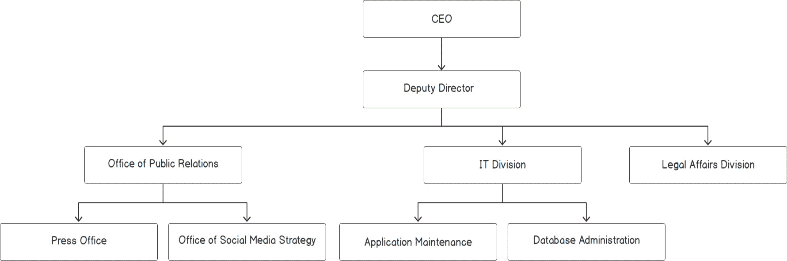

###### 图 2.1：组织结构

正如我们所看到的，CEO 是公司的负责人，管理副总监。副总监领导其他三名官员，依此类推。

数据本质上是分层的。使用简单的数组、向量或链表来管理这种类型的数据是困难的。为了巩固我们的理解，让我们看另一个用例；即，大学课程的结构，如下图所示：

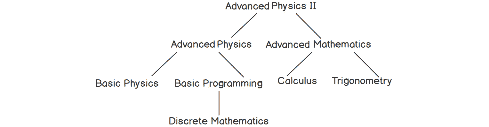

###### 图 2.2：大学课程结构中的课程层次结构

前面的图显示了一个假设大学中一些课程的课程依赖关系。正如我们所看到的，要学习高等物理 II，学生必须成功完成以下课程：高等物理和高等数学。同样，许多其他课程也有它们自己的先决条件。

有了这样的数据，我们可以有不同类型的查询。例如，我们可能想找出需要成功完成哪些课程，以便学习高等数学。

这些问题可以使用一种称为树的数据结构来解决。所有的对象都被称为树的节点，而从一个节点到另一个节点的路径被称为边。我们将在本章后面的*图*部分更深入地研究这一点。

### 循环依赖

让我们来看另一个可以用非线性结构更好地表示的复杂现实场景。以下图表示了几个人之间的友谊：


###### 图 2.3：朋友网络

这种结构称为图。人的名字，或元素，称为节点，它们之间的关系表示为边。各种社交网络通常使用这样的结构来表示他们的用户及其之间的连接。我们可以观察到 Alice 和 Charlie 是朋友，Charlie 和 Eddard 是朋友，Eddard 和 Grace 是朋友，依此类推。我们还可以推断 Alice、Bob 和 Charlie 彼此认识。我们还可以推断 Eddard 是 Grace 的一级连接，Charlie 是二级连接，Alice 和 Bob 是三级连接。

图表在*图表*部分中的另一个有用的领域是当我们想要表示城市之间的道路网络时，您将在本章后面的*图表*部分中看到。

## 树-它颠倒了！

正如我们在上一节中讨论的那样，树只是通过关系连接到其他节点的一些对象或节点，从而产生某种层次结构。如果我们要以图形方式显示这种层次结构，它看起来像一棵树，而不同的边缘看起来像它的分支。主节点，不依赖于任何其他节点，也被称为根节点，并通常表示在顶部。因此，与实际树不同，这棵树是颠倒的，根在顶部！

让我们尝试构建一个非常基本版本的组织层次结构的结构。

### 练习 7：创建组织结构

在这个练习中，我们将实现我们在本章开头看到的组织树的基本版本。让我们开始吧：

1.  首先，让我们包括所需的标头：

```cpp
#include <iostream>
#include <queue>
```

1.  为简单起见，我们假设任何人最多可以有两个下属。我们将看到这不难扩展以类似于现实生活中的情况。这种树也被称为**二叉树**。让我们为此编写一个基本结构：

```cpp
struct node
{
    std::string position;
    node *first, *second;
};
```

正如我们所看到的，任何节点都将有两个链接到其他节点-它们的下属。通过这样做，我们可以显示数据的递归结构。我们目前只存储位置，但我们可以轻松扩展此功能，以包括该位置的名称，甚至包括关于该位置的人的所有信息的整个结构。

1.  我们不希望最终用户处理这种原始数据结构。因此，让我们将其包装在一个名为`org_tree`的良好接口中：

```cpp
struct org_tree
{
    node *root;
```

1.  现在，让我们添加一个函数来创建根，从公司的最高指挥官开始：

```cpp
static org_tree create_org_structure(const std::string& pos)
{
    org_tree tree;
    tree.root = new node{pos, NULL, NULL};
    return tree;
}
```

这只是一个静态函数，用于创建树。现在，让我们看看如何扩展树。

1.  现在，我们想要添加一个员工的下属。该函数应该接受两个参数-树中已存在的员工的名字和要添加为下属的新员工的名字。但在此之前，让我们编写另一个函数，以便更容易地找到基于值的特定节点来帮助我们编写插入函数：

```cpp
static node* find(node* root, const std::string& value)
{
    if(root == NULL)
        return NULL;
    if(root->position == value)
        return root;
    auto firstFound = org_tree::find(root->first, value);
    if(firstFound != NULL)
        return firstFound;
    return org_tree::find(root->second, value);
}
```

当我们在搜索元素时遍历树时，要么元素将是我们所在的节点，要么它将在右子树或左子树中。

因此，我们需要首先检查根节点。如果不是所需的节点，我们将尝试在左子树中找到它。最后，如果我们没有成功做到这一点，我们将查看右子树。

1.  现在，让我们实现插入函数。我们将利用`find`函数以便重用代码：

```cpp
bool addSubordinate(const std::string& manager, const std::string& subordinate)
{
    auto managerNode = org_tree::find(root, manager);
    if(!managerNode)
    {
        std::cout << "No position named " << manager << std::endl;
        return false;
    }
    if(managerNode->first && managerNode->second)
    {
        std::cout << manager << " already has 2 subordinates." << std::endl;
        return false;
    }
    if(!managerNode->first)
        managerNode->first = new node{subordinate, NULL, NULL};
    else
        managerNode->second = new node{subordinate, NULL, NULL};
    return true;
}
};
```

正如我们所看到的，该函数返回一个布尔值，指示我们是否可以成功插入节点。

1.  现在，让我们使用此代码在`main`函数中创建一棵树：

```cpp
int main()
{
    auto tree = org_tree::create_org_structure("CEO");
    if(tree.addSubordinate("CEO", "Deputy Director"))
        std::cout << "Added Deputy Director in the tree." << std::endl;
    else
        std::cout << "Couldn't add Deputy Director in the tree" << std::endl;
    if(tree.addSubordinate("Deputy Director", "IT Head"))
        std::cout << "Added IT Head in the tree." << std::endl;
    else
        std::cout << "Couldn't add IT Head in the tree" << std::endl;
    if(tree.addSubordinate("Deputy Director", "Marketing Head"))
        std::cout << "Added Marketing Head in the tree." << std::endl;
    else
        std::cout << "Couldn't add Marketing Head in the tree" << std::endl;
    if(tree.addSubordinate("IT Head", "Security Head"))
        std::cout << "Added Security Head in the tree." << std::endl;
    else
        std::cout << "Couldn't add Security Head in the tree" << std::endl;
    if(tree.addSubordinate("IT Head", "App Development Head"))
        std::cout << "Added App Development Head in the tree." << std::endl;
    else
        std::cout << "Couldn't add App Development Head in the tree" << std::endl;
if(tree.addSubordinate("Marketing Head", "Logistics Head"))
        std::cout << "Added Logistics Head in the tree." << std::endl;
    else
        std::cout << "Couldn't add Logistics Head in the tree" << std::endl;
    if(tree.addSubordinate("Marketing Head", "Public Relations Head"))
        std::cout << "Added Public Relations Head in the tree." << std::endl;
    else
        std::cout << "Couldn't add Public Relations Head in the tree" << std::endl;
    if(tree.addSubordinate("Deputy Director", "Finance Head"))
        std::cout << "Added Finance Head in the tree." << std::endl;
    else
        std::cout << "Couldn't add Finance Head in the tree" << std::endl;
}
```

在执行上述代码后，您应该获得以下输出：

```cpp
Added Deputy Director in the tree.
Added IT Head in the tree.
Added Marketing Head in the tree.
Added Security Head in the tree.
Added App Development Head in the tree.
Added Logistics Head in the tree.
Added Public Relations Head in the tree.
Deputy Director already has 2 subordinates.
Couldn't add Finance Head in the tree
```

此输出在以下图表中说明：

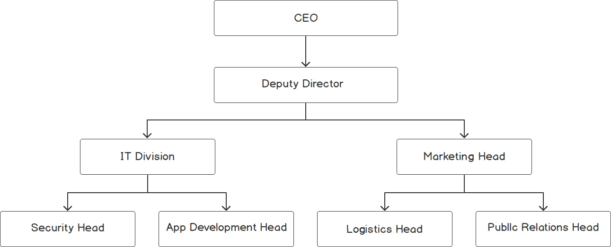

###### 图 2.4：基于组织层次结构的二叉树

到目前为止，我们只是插入了元素。现在，我们将看看如何遍历树。虽然我们已经看到了如何使用`find`函数进行遍历，但这只是我们可以做的其中一种方式。我们可以以许多其他方式遍历树，所有这些方式我们将在下一节中看到。

### 遍历树

一旦我们有了一棵树，就有各种方法可以遍历它并到达我们需要的节点。让我们简要看一下各种遍历方法：

+   先序遍历：在这种方法中，我们首先访问当前节点，然后是当前节点的左子节点，然后是当前节点的右子节点，以递归的方式。这里，前缀“pre”表示父节点在其子节点之前被访问。使用先序方法遍历*图 2.4*中显示的树如下：

```cpp
CEO, Deputy Director, IT Head, Security Head, App Development Head, Marketing Head, Logistics Head, Public Relations Head,
```

正如我们所看到的，我们总是先访问父节点，然后是左子节点，然后是右子节点。我们不仅对根节点是这样，对于任何节点都是这样。我们使用以下函数实现前序遍历：

```cpp
static void preOrder(node* start)
{
    if(!start)
        return;
    std::cout << start->position << ", ";
    preOrder(start->first);
    preOrder(start->second);
}
```

+   中序遍历：在这种遍历中，首先访问左节点，然后是父节点，最后是右节点。遍历*图 2.4*中显示的树如下：

```cpp
Security Head, IT Head, App Development Head, Deputy Director, Logistics Head, Marketing Head, Public Relations Head, CEO, 
```

我们可以这样实现一个函数：

```cpp
static void inOrder(node* start)
{
    if(!start)
        return;
    inOrder(start->first);
std::cout << start->position << ", ";
    inOrder(start->second);
}
```

+   后序遍历：在这种遍历中，我们首先访问两个子节点，然后是父节点。遍历*图 2.4*中显示的树如下：

```cpp
Security Head, App Development Head, IT Head, Logistics Head, Public Relations Head, Marketing Head, Deputy Director, CEO, 
```

我们可以这样实现一个函数：

```cpp
static void postOrder(node* start)
{
    if(!start)
        return;
    postOrder(start->first);
    postOrder(start->second);
    std::cout << start->position << ", ";
}
```

+   层次遍历：这要求我们逐层遍历树，从顶部到底部，从左到右。这类似于列出树的每个级别的元素，从根级别开始。这种遍历的结果通常表示为每个级别，如下所示：

```cpp
CEO, 
Deputy Director, 
IT Head, Marketing Head, 
Security Head, App Development Head, Logistics Head, Public Relations Head, 
```

这种遍历方法的实现在以下练习中演示。

### 练习 8：演示层次遍历

在这个练习中，我们将在*练习 7*中创建的组织结构中实现层次遍历。与先前的遍历方法不同，这里我们不是直接遍历到当前节点直接连接的节点。这意味着遍历更容易实现而不需要递归。我们将扩展*练习 7*中显示的代码来演示这种遍历。让我们开始吧：

1.  首先，我们将在*练习 7*中的`org_tree`结构中添加以下函数：

```cpp
static void levelOrder(node* start)
{
    if(!start)
        return;
    std::queue<node*> q;
    q.push(start);
    while(!q.empty())
    {
        int size = q.size();
        for(int i = 0; i < size; i++)
        {
            auto current = q.front();
            q.pop();
            std::cout << current->position << ", ";
            if(current->first)
                q.push(current->first);
            if(current->second)
                q.push(current->second);
        }
        std::cout << std::endl;
    }
}
```

如前面的代码所示，首先我们遍历根节点，然后是它的子节点。在访问子节点时，我们将它们的子节点推入队列中，以便在当前级别完成后处理。这个想法是从第一级开始队列，并将下一级的节点添加到队列中。我们将继续这样做，直到队列为空，表示下一级没有更多的节点。

1.  我们的输出应该是这样的：

```cpp
CEO, 
Deputy Director, 
IT Head, Marketing Head, 
Security Head, App Development Head, Logistics Head, Public Relations Head, 
```

## 树的变体

在以前的练习中，我们主要看了**二叉树**，这是最常见的树之一。在二叉树中，每个节点最多可以有两个子节点。然而，普通的二叉树并不总是满足这个目的。接下来，我们将看一下二叉树的更专业版本，称为二叉搜索树。

### 二叉搜索树

**二叉搜索树**（**BST**）是二叉树的一种流行版本。BST 只是具有以下属性的二叉树：

+   父节点的值≥左子节点的值

+   父节点的值≤右子节点的值

简而言之，左子节点≤父节点≤右子节点。

这带我们到一个有趣的特性。在任何时候，我们总是可以说小于或等于父节点的所有元素将在左侧，而大于或等于父节点的所有元素将在右侧。因此，搜索元素的问题在每一步中都会减少一半，就搜索空间而言。

如果 BST 构造成除了最后一级的所有元素都有两个子节点的方式，树的高度将为*log n*，其中*n*是元素的数量。由于这个原因，搜索和插入的时间复杂度将为*O(log n)*。这种二叉树也被称为**完全二叉树**。

**在 BST 中搜索**

让我们看看如何在二叉搜索树中搜索、插入和删除元素。考虑一个具有唯一正整数的 BST，如下图所示：


###### 图 2.5：在二叉搜索树中搜索元素

假设我们要搜索 7。从前面图中箭头表示的步骤中可以看出，我们在比较值与当前节点数据后选择侧边。正如我们已经提到的，左侧的所有节点始终小于当前节点，右侧的所有节点始终大于当前节点。

因此，我们首先将根节点与 7 进行比较。如果大于 7，则移动到左子树，因为那里的所有元素都小于父节点，反之亦然。我们比较每个子节点，直到我们遇到 7，或者小于 7 且没有右节点的节点。在这种情况下，来到节点 4 会导致我们的目标 7。

正如我们所看到的，我们并没有遍历整个树。相反，每次当前节点不是所需节点时，我们通过选择左侧或右侧来减少我们的范围一半。这类似于对线性结构进行二分搜索，我们将在第四章“分而治之”中学习。

**向 BST 中插入新元素**

现在，让我们看看插入是如何工作的。步骤如下图所示：

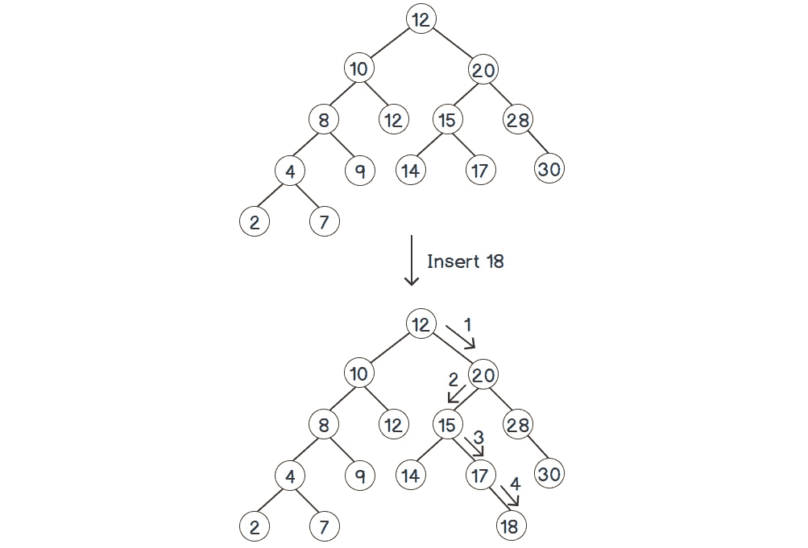

###### 图 2.6：向二叉搜索树插入元素

正如您所看到的，首先我们必须找到要插入新值的父节点。因此，我们必须采取与搜索相似的方法；也就是说，通过根据每个节点与我们的新元素进行比较的方向前进，从根节点开始。在最后一步，18 大于 17，但 17 没有右子节点。因此，我们在那个位置插入 18。

**从 BST 中删除元素**

现在，让我们看看删除是如何工作的。考虑以下 BST：


###### 图 2.7：根节点为 12 的二叉搜索树

我们将删除树中的根节点 12。让我们看看如何删除任何值。这比插入要棘手，因为我们需要找到已删除节点的替代品，以使 BST 的属性保持真实。

第一步是找到要删除的节点。之后，有三种可能性：

+   节点没有子节点：只需删除节点。

+   节点只有一个子节点：将父节点的相应指针指向唯一存在的子节点。

+   节点有两个子节点：在这种情况下，我们用它的后继替换当前节点。

后继是当前节点之后的下一个最大数。换句话说，后继是所有大于当前元素的所有元素中最小的元素。因此，我们首先转到右子树，其中包含所有大于当前元素的元素，并找到其中最小的元素。找到最小的节点意味着尽可能多地向子树的左侧移动，因为左子节点始终小于其父节点。在*图 2.7*中显示的树中，12 的右子树从 18 开始。因此，我们从那里开始查找，然后尝试向 15 的左子节点移动。但是 15 没有左子节点，另一个子节点 16 大于 15。因此，15 应该是这里的后继。

要用 15 替换 12，首先，我们将复制根节点处的后继的值，同时删除 12，如下图所示：

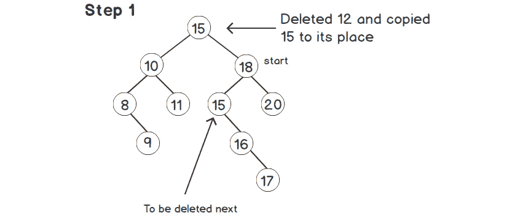

###### 图 2.8：后继复制到根节点

接下来，我们需要从右子树中删除后继 15，如下图所示：

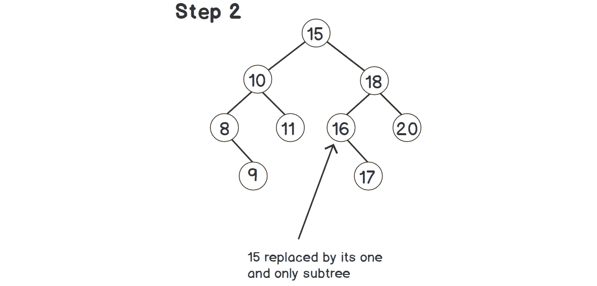

###### 图 2.9：从旧位置删除的后继

在最后一步中，我们正在删除节点 15。我们对此删除使用相同的过程。由于 15 只有一个子节点，我们将用 15 的子节点替换 18 的左子节点。因此，以 16 为根的整个子树成为 18 的左子节点。

#### 注意

后继节点最多只能有一个子节点。如果它有一个左子节点，我们将选择该子节点而不是当前节点作为后继。

### 树上操作的时间复杂度

现在，让我们看看这些函数的时间复杂度。理论上，我们可以说每次将搜索范围减半。因此，搜索具有*n*个节点的 BST 所需的时间为*T(n) = T(n / 2) + 1*。这个方程导致时间复杂度为*T(n) = O(log n)*。

但这里有一个问题。如果我们仔细看插入函数，插入的顺序实际上决定了树的形状。并不一定总是减半搜索范围，如前面公式中的*T(n/2)*所描述的那样。因此，复杂度*O(log n)*并不总是准确的。我们将在*平衡树*部分更深入地研究这个问题及其解决方案，我们将看到如何更准确地计算时间复杂度。

现在，让我们在 C++中实现我们刚刚看到的操作。

### 练习 9：实现二叉搜索树

在这个练习中，我们将实现*图 2.7*中显示的 BST，并添加一个“查找”函数来搜索元素。我们还将尝试在前面的子节中解释的插入和删除元素。让我们开始吧：

1.  首先，让我们包括所需的头文件：

```cpp
#include <iostream>
```

1.  现在，让我们写一个节点。这将类似于我们之前的练习，只是我们将有一个整数而不是一个字符串：

```cpp
struct node
{
    int data;
    node *left, *right;
};
```

1.  现在，让我们在节点上添加一个包装器，以提供一个清晰的接口：

```cpp
struct bst
{
    node* root = nullptr;
```

1.  在编写插入函数之前，我们需要编写“查找”函数：

```cpp
node* find(int value)
{
    return find_impl(root, value);
}
    private:
node* find_impl(node* current, int value)
{
    if(!current)
    {
        std::cout << std::endl;
        return NULL;
    }
    if(current->data == value)
    {
        std::cout << "Found " << value << std::endl;
        return current;
    }
    if(value < current->data)  // Value will be in the left subtree
    {
        std::cout << "Going left from " << current->data << ", ";
        return find_impl(current->left, value);
    }
    if(value > current->data) // Value will be in the right subtree
    {
        std::cout << "Going right from " << current->data << ", ";
        return find_impl(current->right, value);
    }
}
```

由于这是递归的，我们将实现放在一个单独的函数中，并将其设置为私有，以防止有人直接使用它。

1.  现在，让我们编写一个“插入”函数。它将类似于“查找”函数，但有一些小调整。首先，让我们找到父节点，这是我们想要插入新值的地方：

```cpp
public:
void insert(int value)
{
    if(!root)
        root = new node{value, NULL, NULL};
    else
        insert_impl(root, value);
}
private:
void insert_impl(node* current, int value)
{
    if(value < current->data)
    {
        if(!current->left)
            current->left = new node{value, NULL, NULL};
        else
            insert_impl(current->left, value);
    }
    else
    {
        if(!current->right)
            current->right = new node{value, NULL, NULL};
            else
                insert_impl(current->right, value);
    }
}
```

正如我们所看到的，我们正在检查值应该插入左侧还是右侧子树。如果所需侧面没有任何内容，我们直接在那里插入节点；否则，我们递归调用该侧的“插入”函数。

1.  现在，让我们编写一个“中序”遍历函数。中序遍历在应用于 BST 时提供了重要的优势，正如我们将在输出中看到的：

```cpp
public:
void inorder()
{
    inorder_impl(root);
}
private:
void inorder_impl(node* start)
{
    if(!start)
        return;
    inorder_impl(start->left);        // Visit the left sub-tree
    std::cout << start->data << " ";  // Print out the current node
    inorder_impl(start->right);       // Visit the right sub-tree
}
```

1.  现在，让我们实现一个实用函数来获取后继：

```cpp
public:
node* successor(node* start)
{
    auto current = start->right;
    while(current && current->left)
        current = current->left;
    return current;
}
```

这遵循了我们在*删除 BST 中的元素*子节中讨论的逻辑。

1.  现在，让我们看一下`delete`的实际实现。由于删除需要重新指向父节点，我们将通过每次返回新节点来执行此操作。我们将通过在其上放置更好的接口来隐藏这种复杂性。我们将命名接口为`deleteValue`，因为`delete`是 C++标准中的保留关键字：

```cpp
void deleteValue(int value)
{
    root = delete_impl(root, value);
}
private:
node* delete_impl(node* start, int value)
{
    if(!start)
        return NULL;
    if(value < start->data)
        start->left = delete_impl(start->left, value);
    else if(value > start->data)
        start->right = delete_impl(start->right, value);
    else
    {
        if(!start->left)  // Either both children are absent or only left child is absent
        {
            auto tmp = start->right;
            delete start;
            return tmp;
        }
        if(!start->right)  // Only right child is absent
        {
            auto tmp = start->left;
            delete start;
            return tmp;
        }
        auto succNode = successor(start);
        start->data = succNode->data;
        // Delete the successor from right subtree, since it will always be in the right subtree
        start->right = delete_impl(start->right, succNode->data);
    }
    return start;
}
};
```

1.  让我们编写`main`函数，以便我们可以使用 BST：

```cpp
int main()
{
    bst tree;
    tree.insert(12);
    tree.insert(10);
    tree.insert(20);
    tree.insert(8);
    tree.insert(11);
    tree.insert(15);
    tree.insert(28);
    tree.insert(4);
    tree.insert(2);
    std::cout << "Inorder: ";
    tree.inorder();  // This will print all the elements in ascending order
    std::cout << std::endl;
    tree.deleteValue(12);
    std::cout << "Inorder after deleting 12: ";
    tree.inorder();  // This will print all the elements in ascending order
    std::cout << std::endl;
    if(tree.find(12))
        std::cout << "Element 12 is present in the tree" << std::endl;
    else
        std::cout << "Element 12 is NOT present in the tree" << std::endl;
}
```

执行上述代码的输出应该如下所示：

```cpp
Inorder: 2 4 8 10 11 12 15 20 28 
Inorder after deleting 12: 2 4 8 10 11 15 20 28 
Going left from 15, Going right from 10, Going right from 11, 
Element 12 is NOT present in the tree
```

观察 BST 的中序遍历结果。中序遍历将首先访问左子树，然后是当前节点，然后是右子树，如代码片段中的注释所示。因此，根据 BST 的属性，我们将首先访问所有小于当前值的值，然后是当前值，然后我们将访问所有大于当前值的值。由于这是递归进行的，我们将按升序排序获取我们的数据。

### 平衡树

在我们理解平衡树之前，让我们从以下插入顺序的 BST 示例开始：

```cpp
bst tree;
tree.insert(10);
tree.insert(9);
tree.insert(11);
tree.insert(8);
tree.insert(7);
tree.insert(6);
tree.insert(5);
tree.insert(4);
```

可以使用以下图来可视化这个 BST：

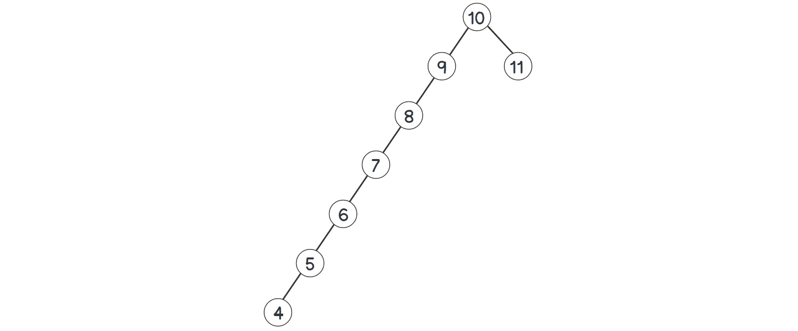

###### 图 2.10：倾斜的二叉搜索树

如前图所示，几乎整个树都向左倾斜。如果我们调用`find`函数，即`bst.find(4)`，步骤将如下所示：

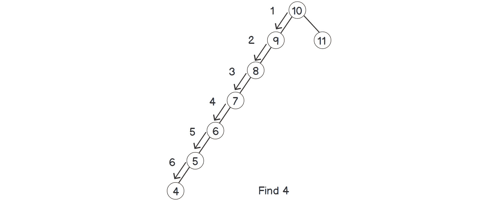

###### 图 2.11：在倾斜的二叉搜索树中查找元素

正如我们所看到的，步骤数几乎等于元素数。现在，让我们尝试以不同的插入顺序再次尝试相同的操作，如下所示：

```cpp
bst tree;
tree.insert(7);
tree.insert(5);
tree.insert(9);
tree.insert(4);
tree.insert(6);
tree.insert(10);
tree.insert(11);
tree.insert(8);
```

现在，查找元素 4 所需的 BST 和步骤如下：


###### 图 2.12：在平衡树中查找元素

正如我们所看到的，树不再倾斜。换句话说，树是平衡的。通过这种配置，查找 4 的步骤已经大大减少。因此，`find`的时间复杂度不仅取决于元素的数量，还取决于它们在树中的配置。如果我们仔细观察步骤，我们在搜索时总是朝树的底部前进一步。最后，我们将到达叶节点（没有任何子节点的节点）。在这里，我们根据元素的可用性返回所需的节点或 NULL。因此，我们可以说步骤数始终小于 BST 的最大级别数，也称为 BST 的高度。因此，查找元素的实际时间复杂度为 O(height)。

为了优化时间复杂度，我们需要优化树的高度。这也被称为*平衡树*。其思想是在插入/删除后重新组织节点以减少树的倾斜程度。结果树称为高度平衡 BST。

我们可以以各种方式执行此操作并获得不同类型的树，例如 AVL 树、红黑树等。AVL 树的思想是执行一些旋转以平衡树的高度，同时仍保持 BST 的属性。考虑下面图中显示的例子：

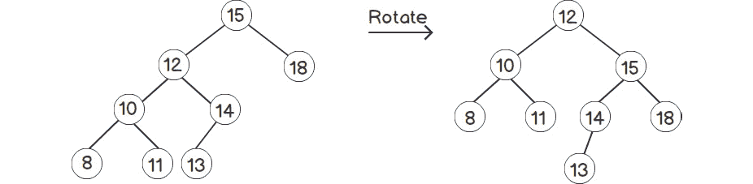

###### 图 2.13：旋转树

正如我们所看到的，右侧的树与左侧的树相比更加平衡。旋转超出了本书的范围，因此我们不会深入探讨这个例子的细节。

### N 叉树

到目前为止，我们主要看到了二叉树或其变体。对于 N 叉树，每个节点可以有*N*个子节点。由于*N*在这里是任意的，我们将其存储在一个向量中。因此，最终的结构看起来像这样：

```cpp
struct nTree
{
    int data;
    std::vector<nTree*> children;
};
```

正如我们所看到的，每个节点可以有任意数量的子节点。因此，整个树是完全任意的。然而，就像普通的二叉树一样，普通的 N 叉树也不是很有用。因此，我们必须为不同类型的应用构建不同的树，其中的层次结构比二叉树的度要高。*图 2.1*中所示的例子代表了一个组织的层次结构，是一个 N 叉树。

在计算机世界中，有两种非常好的、著名的 N 叉树实现，如下所示：

+   计算机中的文件系统结构：从 Linux 中的`root`（`/`）或 Windows 中的驱动器开始，我们可以在任何文件夹内拥有任意数量的文件（终端节点）和任意数量的文件夹。我们将在*活动 1，为文件系统创建数据结构*中更详细地讨论这一点。

+   编译器：大多数编译器根据源代码的语法构建抽象语法树（AST）。编译器通过解析 AST 生成低级别代码。

### 活动 4：为文件系统创建数据结构

使用 N 叉树创建一个文件系统的数据结构，支持以下操作：转到目录，查找文件/目录，添加文件/目录和列出文件/目录。我们的树将保存文件系统中所有元素（文件和文件夹）的信息和文件夹层次结构（路径）。

执行以下步骤来解决此活动：

1.  创建一个 N 叉树，其中一个节点中有两个数据元素-目录/文件的名称和指示它是目录还是文件的标志。

1.  添加一个数据成员来存储当前目录。

1.  用单个目录根（`/`）初始化树。

1.  添加查找目录/文件的函数，它接受一个参数-`path`。`path`可以是绝对的（以`/`开头）或相对的。

1.  添加函数以添加文件/目录并列出位于给定路径的文件/目录。

1.  同样，添加一个函数来更改当前目录。

#### 注意

此活动的解决方案可在第 490 页找到。

我们已经打印了带有`d`的目录，以区分它们与文件，文件是以"`-`"（连字符）开头打印的。您可以通过创建具有绝对或相对路径的更多目录和文件来进行实验。

到目前为止，我们还没有支持某些 Linux 约定，例如用单个点寻址任何目录和用双点寻址父目录。这可以通过扩展我们的节点来完成，以便还保存指向其父节点的指针。这样，我们可以非常容易地在两个方向上遍历。还有其他各种可能的扩展，例如添加符号链接，以及使用"`*`"扩展各种文件/目录名称的通配符操作符。这个练习为我们提供了一个基础，这样我们就可以根据自己的需求构建一些东西。

## 堆

在上一章中，我们简要介绍了堆以及 C++如何通过 STL 提供堆。在本章中，我们将更深入地了解堆。简而言之，以下是预期的时间复杂度：

+   *O(1)*：立即访问最大元素

+   *O(log n)*：插入任何元素

+   *O(log n)*：删除最大元素

为了实现*O(log n)*的插入/删除，我们将使用树来存储数据。但在这种情况下，我们将使用完全树。**完全树**被定义为一个树，其中除了最后一层以外的所有级别的节点都有两个子节点，并且最后一层尽可能多地在左侧具有元素。例如，考虑以下图中显示的两棵树：

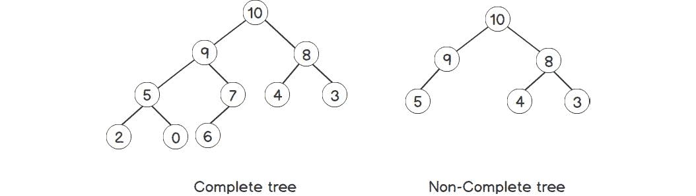

###### 图 2.14：完全树与非完全树

因此，可以通过在最后一级插入元素来构建完整的树，只要那里有足够的空间。如果没有，我们将在新级别的最左边位置插入它们。这给了我们一个很好的机会，可以使用数组逐级存储这棵树。因此，树的根将是数组/向量的第一个元素，其后是其左孩子，然后是右孩子，依此类推。与其他树不同，这是一种非常高效的内存结构，因为不需要额外的内存来存储指针。要从父节点到其子节点，我们可以轻松地使用数组的索引。如果父节点是第*i*个节点，其子节点将始终是*2*i + 1*和*2*i + 2*索引。同样，我们可以通过使用*(i – 1) / 2*来获取第*i*个子节点的父节点。我们也可以从前面的图中确认这一点。

现在，让我们看看我们需要在每次插入/删除时保持的不变量（或条件）。第一个要求是立即访问最大元素。为此，我们需要固定其位置，以便每次都可以立即访问。我们将始终将我们的最大元素保持在顶部 - 根位置。为了保持这一点，我们还需要保持另一个不变量 - 父节点必须大于其两个子节点。这样的堆也被称为**最大堆**。

正如你可能猜到的那样，为了快速访问最大元素所需的属性可以很容易地反转，以便快速访问最小元素。我们在执行堆操作时所需要做的就是反转我们的比较函数。这种堆被称为**最小堆**。

### 堆操作

在本节中，我们将看到如何在堆上执行不同的操作。

**向堆中插入元素**

作为插入的第一步，我们将保留最重要的不变量，这为我们提供了一种将此结构表示为数组的方式 - 完整树。这可以很容易地通过在末尾插入新元素来完成，因为它将代表最后一级的元素，就在所有现有元素之后，或者作为新级别中的第一个元素，如果当前的最后一级已满。

现在，我们需要保持另一个不变量 - 所有节点的值必须大于它们的两个子节点的值，如果有的话。假设我们当前的树已经遵循这个不变量，在最后位置插入新元素后，唯一可能违反不变量的元素将是最后一个元素。为了解决这个问题，如果父节点比元素小，我们将元素与其父节点交换。即使父节点已经有另一个元素，它也将小于新元素（新元素 > 父节点 > 子节点）。

因此，通过将新元素视为根创建的子树满足所有不变量。然而，新元素可能仍然大于其新父节点。因此，我们需要不断交换节点，直到整个树的不变量得到满足。由于完整树的高度最多为*O(log n)*，整个操作将最多需要*O(log n)*时间。下图说明了向树中插入元素的操作：


###### 图 2.15：向具有一个节点的堆中插入元素

如前图所示，在插入 11 后，树不再具有堆属性。因此，我们将交换 10 和 11 以使其再次成为堆。这个概念在下面的例子中更清晰，该例子有更多级别：

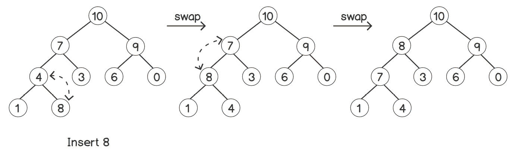

###### 图 2.16：向具有多个节点的堆中插入元素

**从堆中删除元素**

首先要注意的是，我们只能删除最大的元素。我们不能直接触摸任何其他元素。最大的元素始终存在于根部。因此，我们将删除根元素。但我们还需要决定谁将接替它的位置。为此，我们首先需要将根与最后一个元素交换，然后删除最后一个元素。这样，我们的根将被删除，但它将打破每个父节点都大于其子节点的不变性。为了解决这个问题，我们将根与它的两个子节点进行比较，并与较大的子节点交换。现在，不变性在一个子树中被破坏。我们继续在整个子树中递归地进行交换过程。这样，不变性的破坏点就会沿着树向下冒泡。就像插入一样，我们一直遵循这个过程，直到满足不变性。所需的最大步数将等于树的高度，即*O(log n)*。下图说明了这个过程：

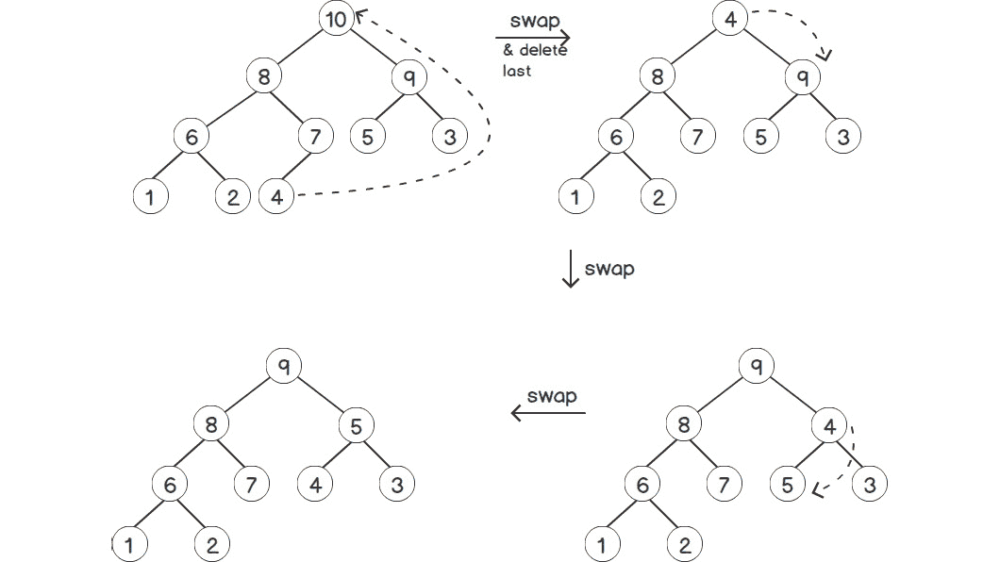

###### 图 2.17：删除堆中的一个元素

**初始化堆**

现在，让我们看看最重要的一步 - 初始化堆。与向量、列表、双端队列等不同，堆的初始化并不简单，因为我们需要维护堆的不变性。一个简单的解决方案是从一个空堆开始逐个插入所有元素。但是这样需要的时间是*O(n * log(n))*，这并不高效。

然而，有一个`std::make_heap`，它可以接受任何数组或向量迭代器，并将它们转换为堆。

### 练习 10：流式中位数

在这个练习中，我们将解决一个在数据分析相关应用中经常出现的有趣问题，包括机器学习。想象一下，某个来源不断地给我们提供数据（数据流）中的一个元素。我们需要在每次接收到每个元素后找到到目前为止已接收到的元素的中位数。一个简单的方法是每次有新元素进来时对数据进行排序并返回中间元素。但是由于排序的原因，这将具有*O(n log n)*的时间复杂度。根据输入元素的速率，这可能非常消耗资源。然而，我们将通过堆来优化这个问题。让我们开始吧：

1.  首先让我们包括所需的头文件：

```cpp
#include <iostream>
#include <queue>
#include <vector>
```

1.  现在，让我们编写一个容器来存储到目前为止收到的数据。我们将数据存储在两个堆中 - 一个最小堆和一个最大堆。我们将把较小的前半部分元素存储在最大堆中，将较大的或另一半存储在最小堆中。因此，在任何时候，中位数可以使用堆的顶部元素来计算，这些元素很容易访问：

```cpp
struct median
{
    std::priority_queue<int> maxHeap;
    std::priority_queue<int, std::vector<int>, std::greater<int>> minHeap;
```

1.  现在，让我们编写一个`insert`函数，以便我们可以插入新到达的数据：

```cpp
void insert(int data)
{
    // First element
    if(maxHeap.size() == 0)
    {
        maxHeap.push(data);
        return;
    }
    if(maxHeap.size() == minHeap.size())
    {
        if(data <= get())
            maxHeap.push(data);
        else
            minHeap.push(data);
        return;
    }
    if(maxHeap.size() < minHeap.size())
    {
        if(data > get())
        {
            maxHeap.push(minHeap.top());
            minHeap.pop();
            minHeap.push(data);
        }
        else
            maxHeap.push(data);
        return;
    }
    if(data < get())
    {
        minHeap.push(maxHeap.top());
        maxHeap.pop();
        maxHeap.push(data);
    }
    else
        minHeap.push(data);
}
```

1.  现在，让我们编写一个`get`函数，以便我们可以从容器中获取中位数：

```cpp
double get()
{
    if(maxHeap.size() == minHeap.size())
        return (maxHeap.top() + minHeap.top()) / 2.0;
    if(maxHeap.size() < minHeap.size())
        return minHeap.top();
    return maxHeap.top();
}
};
```

1.  现在，让我们编写一个`main`函数，以便我们可以使用这个类：

```cpp
int main()
{
    median med;
    med.insert(1);
    std::cout << "Median after insert 1: " << med.get() << std::endl;
    med.insert(5);
    std::cout << "Median after insert 5: " << med.get() << std::endl;
    med.insert(2);
    std::cout << "Median after insert 2: " << med.get() << std::endl;
    med.insert(10);
    std::cout << "Median after insert 10: " << med.get() << std::endl;
    med.insert(40);
    std::cout << "Median after insert 40: " << med.get() << std::endl;
    return 0;
}
```

上述程序的输出如下：

```cpp
Median after insert 1: 1
Median after insert 5: 3
Median after insert 2: 2
Median after insert 10: 3.5
Median after insert 40: 5
```

这样，我们只需要插入任何新到达的元素，这只需要*O(log n)*的时间复杂度，与如果我们每次有新元素就对元素进行排序的时间复杂度*O(n log n)*相比。

### 活动 5：使用堆进行 K 路合并

考虑一个与遗传学相关的生物医学应用，用于处理大型数据集。它需要对 DNA 的排名进行排序以计算相似性。但由于数据集很大，无法放在一台机器上。因此，它在分布式集群中处理和存储数据，每个节点都有一组排序的值。主处理引擎需要所有数据以排序方式和单个流的形式。因此，基本上，我们需要将多个排序数组合并成一个排序数组。借助向量模拟这种情况。

执行以下步骤来解决这个活动：

1.  最小的数字将出现在所有列表的第一个元素中，因为所有列表已经分别排序。为了更快地获取最小值，我们将构建这些元素的堆。

1.  从堆中获取最小元素后，我们需要将其移除并用它所属列表中的下一个元素替换。

1.  堆节点必须包含关于列表的信息，以便它可以从该列表中找到下一个数字。

#### 注意

此活动的解决方案可在第 495 页找到。

现在，让我们计算前面算法的时间复杂度。如果有*k*个列表可用，我们的堆大小将为*k*，我们所有的堆操作都将是*O(log k)*。构建堆将是*O(k log k)*。之后，我们将不得不为结果中的每个元素执行堆操作。总元素为*n × k*。因此，总复杂度将是*O(nk log k)*。

这个算法的奇妙之处在于，考虑到我们之前描述的现实场景，它实际上并不需要同时存储所有的*n × k*元素；它只需要在任何时刻存储*k*个元素，其中*k*是集群中列表或节点的数量。由于这个原因，*k*的值永远不会太大。借助堆，我们可以一次生成一个数字，然后立即处理该数字，或者将其流式传输到其他地方进行处理，而无需实际存储它。

## 图

尽管树是表示分层数据的一种很好的方式，但我们无法在树中表示循环依赖，因为我们总是有一条单一且唯一的路径可以从一个节点到另一个节点。然而，还有更复杂的情况具有固有的循环结构。例如，考虑一个道路网络。可以有多种方式从一个地点（地点可以表示为节点）到另一个地点。这样的一组情景可以更好地用图来表示。

与树不同，图必须存储节点的数据，以及节点之间的边的数据。例如，在任何道路网络中，对于每个节点（地点），我们都必须存储它连接到哪些其他节点（地点）的信息。这样，我们就可以形成一个包含所有所需节点和边的图。这被称为**无权图**。我们可以为每条边添加*权重*或更多信息。对于我们的道路网络示例，我们可以添加每条边（路径）从一个节点（地点）到另一个节点的距离。这种表示被称为**加权图**，它包含了解决诸如找到两个地点之间最小距离的路径等问题所需的道路网络的所有信息。

图有两种类型 - 无向图和有向图。**无向图**表示边是双向的。双向表示具有双边或可交换属性。对于道路网络示例，点 A 和点 B 之间的双向边意味着我们可以从 A 到 B，也可以从 B 到 A。但假设我们有一些有单向限制的道路 - 我们需要使用**有向图**来表示。在有向图中，每当我们需要指示可以双向行驶时，我们使用两条边 - 从点 A 到 B，以及从 B 到 A。我们主要关注双向图，但我们在这里学到的关于结构和遍历方法的知识对于有向图也是正确的。唯一的变化将是我们如何向图中添加边。

由于图可以具有循环边和从一个节点到另一个节点的多条路径，我们需要唯一标识每个节点。为此，我们可以为每个节点分配一个标识符。为了表示图的数据，我们实际上不需要像在树中那样以编程方式构建类似节点的结构。事实上，我们可以通过组合`std`容器来存储整个图。

### 将图表示为邻接矩阵

以下是理解图的最简单方法之一——考虑一组节点，其中任何节点都可以直接连接到该组中的任何其他节点。这意味着我们可以使用大小为*N×N*的二维数组来表示这一点，其中*N*为节点数。每个单元格中的值将根据单元格的索引指示相应节点之间的边的权重。因此，`data[1][2]`将指示节点 1 和节点 2 之间边的权重。这种方法称为**邻接矩阵**。我们可以使用-1 的权重表示边的缺失。

考虑下图中所示的加权图，它表示了一些主要国际城市之间的航空网络，带有假设的距离：


###### 图 2.18：一些城市之间的航空网络

如前面的图所示，我们可以通过伊斯坦布尔或直接从伦敦到迪拜。从一个地方到另一个地方有多种方式，这在树的情况下是不可能的。此外，我们可以从一个节点遍历到另一个节点，然后通过一些不同的边回到原始节点，这在树中也是不可能的。

让我们实现前面图中所示的图的矩阵表示方法。

### 练习 11：实现图并将其表示为邻接矩阵

在这个练习中，我们将实现一个代表前面图中所示的城市网络的图，并演示如何将其存储为邻接矩阵。让我们开始吧：

1.  首先，让我们包括所需的头文件：

```cpp
#include <iostream>
#include <vector>
```

1.  现在，让我们添加一个`enum`类，以便我们可以存储城市的名称：

```cpp
enum class city: int
{
    LONDON,
    MOSCOW,
    ISTANBUL,
    DUBAI,
    MUMBAI,
    SEATTLE,
    SINGAPORE
};
```

1.  让我们还为`city`枚举添加`<<`运算符：

```cpp
std::ostream& operator<<(std::ostream& os, const city c)
{
    switch(c)
    {
        case city::LONDON:
            os << "LONDON";
            return os;
        case city::MOSCOW:
            os << "MOSCOW";
            return os;
        case city::ISTANBUL:
            os << "ISTANBUL";
            return os;
        case city::DUBAI:
            os << "DUBAI";
            return os;
        case city::MUMBAI:
            os << "MUMBAI";
            return os;
        case city::SEATTLE:
            os << "SEATTLE";
            return os;
        case city::SINGAPORE:
            os << "SINGAPORE";
            return os;
        default:
            return os;
    }
}
```

1.  现在，让我们编写`struct graph`，它将封装我们的数据：

```cpp
struct graph
{
    std::vector<std::vector<int>> data;
```

1.  现在，让我们添加一个构造函数，它将创建一个空图（没有任何边的图）并给定节点数：

```cpp
graph(int n)
{
    data.reserve(n);
    std::vector<int> row(n);
    std::fill(row.begin(), row.end(), -1);
    for(int i = 0; i < n; i++)
    {
        data.push_back(row);
    }
}
```

1.  现在，让我们添加最重要的函数——`addEdge`。它将接受三个参数——要连接的两个城市和边的权重（距离）：

```cpp
void addEdge(const city c1, const city c2, int dis)
{
    std::cout << "ADD: " << c1 << "-" << c2 << "=" << dis << std::endl;
    auto n1 = static_cast<int>(c1);
    auto n2 = static_cast<int>(c2);
    data[n1][n2] = dis;
    data[n2][n1] = dis;
}
```

1.  现在，让我们添加一个函数，这样我们就可以从图中删除一条边：

```cpp
void removeEdge(const city c1, const city c2)
{
    std::cout << "REMOVE: " << c1 << "-" << c2 << std::endl;
    auto n1 = static_cast<int>(c1);
    auto n2 = static_cast<int>(c2);
    data[n1][n2] = -1;
    data[n2][n1] = -1;
}
};
```

1.  现在，让我们编写`main`函数，以便我们可以使用这些函数：

```cpp
int main()
{
    graph g(7);
    g.addEdge(city::LONDON, city::MOSCOW, 900);
    g.addEdge(city::LONDON, city::ISTANBUL, 500);
    g.addEdge(city::LONDON, city::DUBAI, 1000);
    g.addEdge(city::ISTANBUL, city::MOSCOW, 1000);
    g.addEdge(city::ISTANBUL, city::DUBAI, 500);
    g.addEdge(city::DUBAI, city::MUMBAI, 200);
    g.addEdge(city::ISTANBUL, city::SEATTLE, 1500);
    g.addEdge(city::DUBAI, city::SINGAPORE, 500);
    g.addEdge(city::MOSCOW, city::SEATTLE, 1000);
    g.addEdge(city::MUMBAI, city::SINGAPORE, 300);
    g.addEdge(city::SEATTLE, city::SINGAPORE, 700);
    g.addEdge(city::SEATTLE, city::LONDON, 1800);
    g.removeEdge(city::SEATTLE, city::LONDON);
    return 0;
}
```

1.  执行此程序后，我们应该得到以下输出：

```cpp
ADD: LONDON-MOSCOW=900
ADD: LONDON-ISTANBUL=500
ADD: LONDON-DUBAI=1000
ADD: ISTANBUL-MOSCOW=1000
ADD: ISTANBUL-DUBAI=500
ADD: DUBAI-MUMBAI=200
ADD: ISTANBUL-SEATTLE=1500
ADD: DUBAI-SINGAPORE=500
ADD: MOSCOW-SEATTLE=1000
ADD: MUMBAI-SINGAPORE=300
ADD: SEATTLE-SINGAPORE=700
ADD: SEATTLE-LONDON=1800
REMOVE: SEATTLE-LONDON
```

正如我们所看到的，我们正在将数据存储在一个向量的向量中，两个维度都等于节点数。因此，这种表示所需的总空间与*V2*成正比，其中*V*是节点数。

### 将图表示为邻接表

矩阵表示图的一个主要问题是所需的内存量与节点数的平方成正比。可以想象，随着节点数的增加，这会迅速增加。让我们看看如何改进这一点，以便使用更少的内存。

在任何图中，我们将有固定数量的节点，每个节点将有固定数量的连接节点，等于总节点数。在矩阵中，我们必须存储所有节点的所有边，即使两个节点不直接连接。相反，我们只会在每一行中存储节点的 ID，指示哪些节点直接连接到当前节点。这种表示也称为**邻接表**。

让我们看看实现与之前练习的不同之处。

### 练习 12：实现图并将其表示为邻接表

在这个练习中，我们将实现一个代表城市网络的图，如*图 2.18*所示，并演示如何将其存储为邻接表。让我们开始吧：

1.  在这个练习中，我们将实现邻接表表示。让我们像往常一样从头文件开始：

```cpp
#include <iostream>
#include <vector>
#include <algorithm>
```

1.  现在，让我们添加一个`enum`类，以便我们可以存储城市的名称：

```cpp
enum class city: int
{
    MOSCOW,
    LONDON,
    ISTANBUL,
    SEATTLE,
    DUBAI,
    MUMBAI,
    SINGAPORE
};
```

1.  让我们还为`city`枚举添加`<<`运算符：

```cpp
std::ostream& operator<<(std::ostream& os, const city c)
{
    switch(c)
    {
        case city::MOSCOW:
            os << "MOSCOW";
            return os;
        case city::LONDON:
            os << "LONDON";
            return os;
        case city::ISTANBUL:
            os << "ISTANBUL";
            return os;
        case city::SEATTLE:
            os << "SEATTLE";
            return os;
        case city::DUBAI:
            os << "DUBAI";
            return os;
        case city::MUMBAI:
            os << "MUMBAI";
            return os;
        case city::SINGAPORE:
            os << "SINGAPORE";
            return os;
        default:
            return os;
    }
}
```

1.  让我们编写`struct graph`，它将封装我们的数据：

```cpp
struct graph
{
    std::vector<std::vector<std::pair<int, int>>> data;
```

1.  让我们看看我们的构造函数与矩阵表示有何不同：

```cpp
graph(int n)
{
    data = std::vector<std::vector<std::pair<int, int>>>(n, std::vector<std::pair<int, int>>());
}
```

正如我们所看到的，我们正在用 2D 向量初始化数据，但所有行最初都是空的，因为开始时没有边。

1.  让我们为此实现`addEdge`函数：

```cpp
void addEdge(const city c1, const city c2, int dis)
{
    std::cout << "ADD: " << c1 << "-" << c2 << "=" << dis << std::endl;
    auto n1 = static_cast<int>(c1);
    auto n2 = static_cast<int>(c2);
    data[n1].push_back({n2, dis});
    data[n2].push_back({n1, dis});
}
```

1.  现在，让我们编写`removeEdge`，这样我们就可以从图中移除一条边：

```cpp
void removeEdge(const city c1, const city c2)
{
    std::cout << "REMOVE: " << c1 << "-" << c2 << std::endl;
    auto n1 = static_cast<int>(c1);
    auto n2 = static_cast<int>(c2);
    std::remove_if(data[n1].begin(), data[n1].end(), n2
        {
            return pair.first == n2;
        });
    std::remove_if(data[n2].begin(), data[n2].end(), n1
        {
            return pair.first == n1;
        });
}
};
```

1.  现在，让我们编写`main`函数，这样我们就可以使用这些函数：

```cpp
int main()
{
    graph g(7);
    g.addEdge(city::LONDON, city::MOSCOW, 900);
    g.addEdge(city::LONDON, city::ISTANBUL, 500);
    g.addEdge(city::LONDON, city::DUBAI, 1000);
    g.addEdge(city::ISTANBUL, city::MOSCOW, 1000);
    g.addEdge(city::ISTANBUL, city::DUBAI, 500);
    g.addEdge(city::DUBAI, city::MUMBAI, 200);
    g.addEdge(city::ISTANBUL, city::SEATTLE, 1500);
    g.addEdge(city::DUBAI, city::SINGAPORE, 500);
    g.addEdge(city::MOSCOW, city::SEATTLE, 1000);
    g.addEdge(city::MUMBAI, city::SINGAPORE, 300);
    g.addEdge(city::SEATTLE, city::SINGAPORE, 700);
    g.addEdge(city::SEATTLE, city::LONDON, 1800);
    g.removeEdge(city::SEATTLE, city::LONDON);
    return 0;
}
```

执行此程序后，我们应该得到以下输出：

```cpp
ADD: LONDON-MOSCOW=900
ADD: LONDON-ISTANBUL=500
ADD: LONDON-DUBAI=1000
ADD: ISTANBUL-MOSCOW=1000
ADD: ISTANBUL-DUBAI=500
ADD: DUBAI-MUMBAI=200
ADD: ISTANBUL-SEATTLE=1500
ADD: DUBAI-SINGAPORE=500
ADD: MOSCOW-SEATTLE=1000
ADD: MUMBAI-SINGAPORE=300
ADD: SEATTLE-SINGAPORE=700
ADD: SEATTLE-LONDON=1800
REMOVE: SEATTLE-LONDON
```

由于我们为每个节点存储了一个相邻节点的列表，这种方法被称为邻接表。这种方法也使用了一个向量的向量来存储数据，就像前一种方法一样。但内部向量的维度不等于节点的数量；相反，它取决于边的数量。对于图中的每条边，根据我们的`addEdge`函数，我们将有两个条目。这种表示所需的内存将与 E 成正比，其中 E 是边的数量。

到目前为止，我们只看到了如何构建图。我们需要遍历图才能执行任何操作。有两种广泛使用的方法可用——广度优先搜索（BFS）和深度优先搜索（DFS），我们将在*第六章*，*图算法 I*中看到这两种方法。

## 总结

在本章中，我们看了与上一章相比更高级的问题类别，这有助于我们描述更广泛的现实场景。我们看了并实现了两种主要的数据结构——树和图。我们还看了我们可以在不同情况下使用的各种类型的树。然后，我们看了不同的方式来以编程方式表示这些结构的数据。通过本章的帮助，您应该能够应用这些技术来解决类似种类的现实世界问题。

现在我们已经看过线性和非线性数据结构，在下一章中，我们将看一个非常特定但广泛使用的概念，称为查找，目标是将值存储在容器中，以便搜索非常快速。我们还将看一下哈希的基本思想以及如何实现这样的容器。
