# 第三章：3. 哈希表和布隆过滤器

## 学习目标

在本章结束时，您将能够：

+   在任何大型应用程序中轻松识别与查找相关的问题

+   评估问题是否适合确定性或非确定性查找解决方案

+   基于场景实现高效的查找解决方案

+   在大型应用程序中实现 C++ STL 提供的通用解决方案

在本章中，我们将研究快速查找的问题。我们将了解解决此问题的各种方法，并了解哪种方法可以用于特定情况。

## 介绍

查找只是检查元素是否存在于容器中或在容器中查找键的相应值。在我们在前几章中提到的学生数据库系统和医院管理系统示例中，一个常见的操作是从系统中存储的大量数据中获取特定记录。在从字典中获取单词的含义，根据一组记录（访问控制）检查某人是否被允许进入某个设施等许多应用程序中也会出现类似的问题。

对于大多数情况，线性遍历所有元素并匹配值将非常耗时，特别是考虑到存储的大量记录。让我们以在字典中查找单词为例。英语词典中大约有 17 万个单词。最简单的方法之一是线性遍历字典，并将给定的单词与字典中的所有单词进行比较，直到找到单词或者到达字典的末尾。但这太慢了，它的时间复杂度为*O(n)*，其中 n 是字典中的单词数，这不仅庞大而且每天都在增加。

因此，我们需要更高效的算法来实现更快的查找。在本章中，我们将看一些高效的结构，即哈希表和布隆过滤器。我们将实现它们并比较它们的优缺点。

## 哈希表

让我们来看看在字典中搜索的基本问题。牛津英语词典中大约有 17 万个单词。正如我们在介绍中提到的，线性搜索将花费*O(n)*的时间，其中*n*是单词的数量。存储数据的更好方法是将其存储在具有类似 BST 属性的高度平衡树中。这使得它比线性搜索快得多，因为它的时间复杂度仅为*O(log n)*。但对于需要大量此类查询的应用程序来说，这仍然不是足够好的改进。想想在包含数百万甚至数十亿条记录的数据中查找所需的时间，比如神经科学数据或遗传数据。在这些情况下，我们需要更快的东西，比如**哈希表**。

哈希表的一个重要部分是**哈希**。其背后的想法是用可能唯一的键表示每个值，然后稍后使用相同的键来检查键的存在或检索相应的值，具体取决于使用情况。从给定数据派生唯一键的函数称为哈希函数。让我们看看如何通过一些示例存储和检索数据，并让我们了解为什么我们需要这样的函数。

### 哈希

在跳入哈希之前，让我们举一个简单的例子。假设我们有一个存储整数的容器，并且我们想尽快知道特定整数是否是容器的一部分。最简单的方法是使用一个布尔数组，其中每个位表示与其索引相同的值。当我们想要插入一个元素时，我们将设置与该元素对应的布尔值为*0*。要插入*x*，我们只需设置*data[x] = true*。检查特定整数*x*是否在容器内同样简单——我们只需检查*data[x]*是否为*true*。因此，我们的插入、删除和搜索函数变为*O(1)*。存储从*0*到*9*编号的整数的简单哈希表如下所示：


###### 图 3.1：一个简单的哈希表

然而，这种方法存在一些问题：

+   如果数据是浮点数呢？

+   如果数据不仅仅是一个数字呢？

+   如果数据的范围太高怎么办？也就是说，如果我们有十亿个数字，那么我们需要一个大小为十亿的布尔数组，这并不总是可行的。

为了解决这个问题，我们可以实现一个函数，将任何数据类型的任何值映射到所需范围内的整数。我们可以选择范围，使其布尔数组的大小可行。这个函数被称为**哈希函数**，正如我们在前一节中提到的。它将一个数据元素作为输入，并在提供的范围内提供相应的输出整数。

对于大范围内的整数，最简单的哈希函数是模函数（用*%*表示），它将元素除以指定的整数（*n*）并返回余数。因此，我们将简单地有一个大小为*n*的数组。

如果我们想要插入一个给定的值*x*，我们可以对其应用模函数（*x % n*），并且我们将始终得到一个在*0*和（*n – 1*）之间的值，两者都包括在内。现在，*x*可以插入到位置*（x % n）*。这里，通过应用哈希函数获得的数字称为**哈希值**。

我们可能会遇到的一个主要问题是，两个元素可能具有相同的模函数输出。一个例子是（*9 % 7*）和（*16 % 7*），它们都得到哈希值*2*。因此，如果对应于*2*的槽位为*TRUE*（或布尔值为*1*），我们将不知道我们的容器中存在*2*、*9*、*16*或任何返回*x % 7 = 2*的其他整数。这个问题被称为冲突，因为多个键具有相同的值而不是唯一值，而不是应用哈希函数后的唯一值。

如果我们在哈希表中存储实际值而不是布尔整数，我们将知道我们有哪个值，但我们仍然无法存储具有相同哈希值的多个值。我们将在下一节中看看如何处理这个问题。但首先，让我们看看在下一个练习中为一堆整数实现基本字典的实现。

### 练习 13：整数的基本字典

在这个练习中，我们将实现一个无符号整数的基本版本的哈希映射。让我们开始吧：

1.  首先，让我们包括所需的头文件：

```cpp
#include <iostream>
#include <vector>
```

1.  现在，让我们添加`hash_map`类。我们将别名`unsigned int`以避免编写一个很长的名称：

```cpp
using uint = unsigned int;
class hash_map
{
    std::vector<int> data;
```

1.  现在，让我们为此添加一个构造函数，它将接受数据或哈希映射的大小：

```cpp
public:
hash_map(size_t n)
{
    data = std::vector<int>(n, -1);
}
```

如图所示，我们使用“-1”来表示元素的缺失。这是我们作为数据使用的唯一负值。

1.  让我们添加`insert`函数：

```cpp
void insert(uint value)
{
    int n = data.size();
    data[value % n] = value;
    std::cout << "Inserted " << value << std::endl;
}
```

正如我们所看到的，我们并没有真正检查是否已经存在具有相同哈希值的值。我们只是覆盖了已经存在的任何值。因此，对于给定的哈希值，只有最新插入的值将被存储。

1.  让我们编写一个查找函数，看看元素是否存在于映射中：

```cpp
bool find(uint value)
{
    int n = data.size();
    return (data[value % n] == value);
}
```

我们将简单地检查值是否存在于根据哈希值计算的索引处。

1.  让我们实现一个`remove`函数：

```cpp
void erase(uint value)
{
    int n = data.size();
    if(data[value % n] == value)
    {
data[value % n] = -1;
        std::cout << "Removed " << value << std::endl;
}
}
};
```

1.  让我们在`main`中编写一个小的 lambda 函数来打印查找的状态：

```cpp
int main()
{
    hash_map map(7);
    auto print = &
        {
            if(map.find(value))
                std::cout << value << " found in the hash map";
            else
                std::cout << value << " NOT found in the hash map";
            std::cout << std::endl;
        };
```

1.  让我们在地图上使用`insert`和`erase`函数：

```cpp
    map.insert(2);
    map.insert(25);
    map.insert(290);
    print(25);
    print(100);
    map.insert(100);
    print(100);
    map.erase(25);
}
```

1.  这是程序的输出：

```cpp
Inserted 2
Inserted 25
Inserted 290
25 found in the hash map
100 NOT found in the hash map
Inserted 100
100 found in the hash map
Removed 25
```

正如我们所看到的，我们能够找到我们之前插入的大多数值，如预期的那样，除了最后一种情况，其中`100`被`0`覆盖，因为它们具有相同的哈希值。这被称为碰撞，正如我们之前所描述的。在接下来的章节中，我们将看到如何避免这种问题，使我们的结果更准确。

以下图示说明了上一个练习中的不同函数，这应该更清楚：

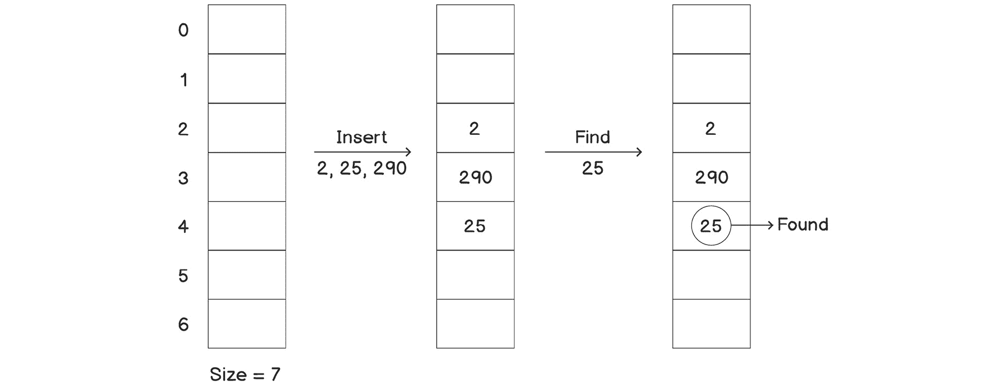

###### 图 3.2：哈希表中的基本操作

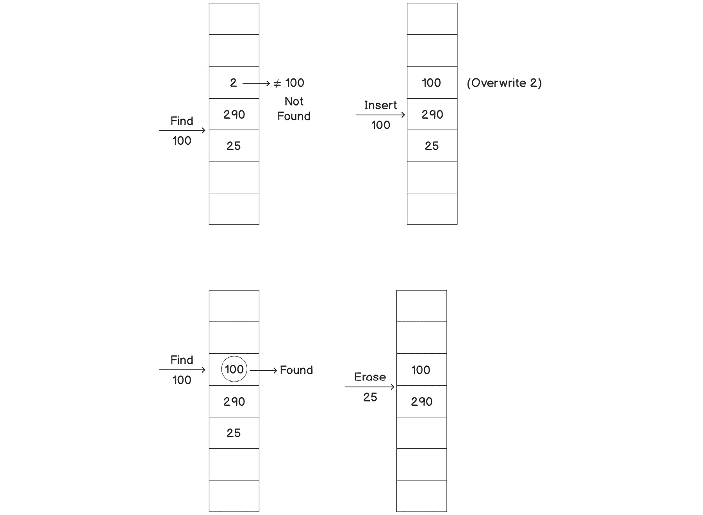

###### 图 3.3：哈希表中的基本操作（续）

正如前面的图所示，我们无法插入具有相同哈希值的两个元素；我们必须放弃其中一个。

现在，正如我们之前提到的，哈希表的一个主要用途是找到与键对应的值，而不仅仅是检查键是否存在。这可以通过存储键值对而不仅仅是数据中的键来简单实现。因此，我们的插入、删除和查找函数仍将根据我们的键计算哈希值，但一旦我们在数组中找到位置，我们的值将作为对的第二个参数。

## 哈希表中的碰撞

在前面的章节中，我们看到了哈希表如何帮助我们以一种便于查找任何所需键的方式存储大量键。然而，我们也遇到了一个问题，即多个键具有相同的哈希值，也称为**碰撞**。在*练习 13*中，*整数的基本字典*，我们通过简单地重写键并保留与给定哈希值对应的最新键来处理了这个问题。然而，这并不允许我们存储所有的键。在接下来的子主题中，我们将看一下几种方法，这些方法可以帮助我们克服这个问题，并允许我们在哈希表中保留所有的键值。

### 闭合寻址 - 链接

到目前为止，我们只为任何哈希值存储了一个单一元素。如果我们已经有一个特定哈希值的元素，我们除了丢弃新值或旧值之外别无选择。`push_back`方法（用于新元素）是为了能够快速从任何位置删除元素。让我们在下一个练习中实现这一点。

### 练习 14：使用链表的哈希表

在这个练习中，我们将实现一个哈希表，并使用链接来处理碰撞。让我们开始吧：

1.  首先，让我们包括所需的头文件：

```cpp
#include <iostream>
#include <vector>
#include <list>
#include <algorithm>
```

1.  现在，让我们添加`hash_map`类。我们将别名`unsigned int`以避免编写一个很长的名称：

```cpp
using uint = unsigned int;
class hash_map
{
    std::vector<std::list<int>> data;
```

1.  现在，让我们为`hash_map`添加一个构造函数，该构造函数将接受数据或哈希映射的大小：

```cpp
public:
hash_map(size_t n)
{
    data.resize(n);
}
```

1.  让我们添加一个`insert`函数：

```cpp
void insert(uint value)
{
    int n = data.size();
    data[value % n].push_back(value);
    std::cout << "Inserted " << value << std::endl;
}
```

正如我们所看到的，我们总是在数据中插入值。一个替代方法是搜索该值，并仅在该值不存在时插入。

1.  让我们编写查找函数，以查看地图中是否存在元素：

```cpp
bool find(uint value)
{
    int n = data.size();
    auto& entries = data[value % n];
    return std::find(entries.begin(), entries.end(), value) != entries.end();
}
```

正如我们所看到的，我们的查找似乎比传统方法更快，但不像之前那样快。这是因为现在它也依赖于数据，以及`n`的值。在这个练习之后，我们将再次回到这一点。

1.  让我们实现一个函数来删除元素：

```cpp
void erase(uint value)
{
    int n = data.size();
    auto& entries = data[value % n];
    auto iter = std::find(entries.begin(), entries.end(), value);

    if(iter != entries.end())
    {
entries.erase(iter);
        std::cout << "Removed " << value << std::endl;
}
}
};
```

1.  让我们编写与上一个练习中相同的`main`函数，并查看其中的区别：

```cpp
int main()
{
    hash_map map(7);
    auto print = &
        {
            if(map.find(value))
                std::cout << value << " found in the hash map";
            else
                std::cout << value << " NOT found in the hash map";
            std::cout << std::endl;
        };
```

1.  让我们在`map`上使用`insert`和`erase`函数：

```cpp
    map.insert(2);
    map.insert(25);
    map.insert(290);
    map.insert(100);
    map.insert(55);
    print(100);
    map.erase(2);
}
```

这是我们程序的输出：

```cpp
Inserted 2
Inserted 25
Inserted 290
Inserted 100
Inserted 55
100 found in the hash map
Removed 2
```

正如我们所看到的，值没有被覆盖，因为我们可以在列表中存储任意数量的值。因此，我们的输出是完全准确和可靠的。

以下图片说明了如何在数据集上执行不同的操作：

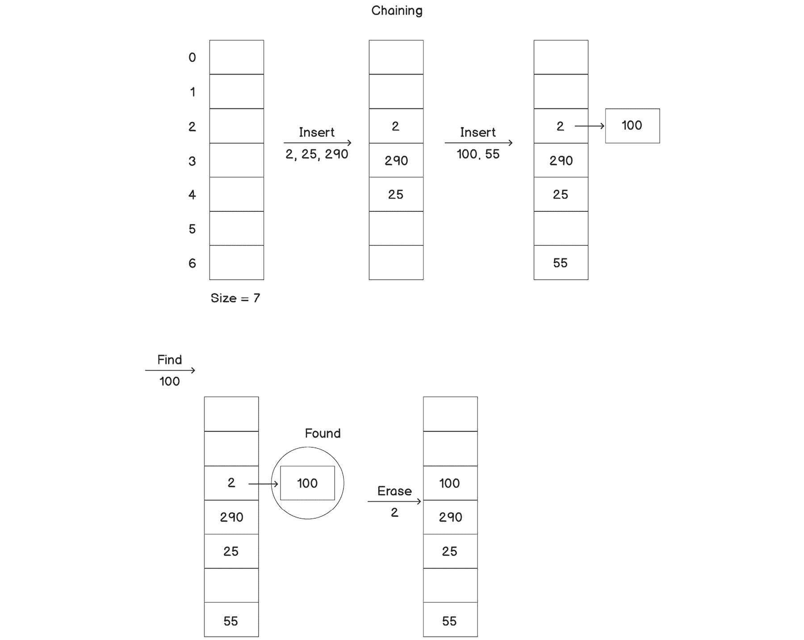

###### 图 3.4：使用链接的哈希表的基本操作

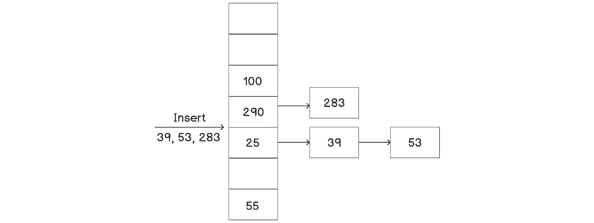

###### 图 3.5：使用链接的哈希表的基本操作（续）

正如我们所看到的，我们将具有相同哈希值的元素附加到节点中的列表中，而不是单个元素。

现在，让我们考虑这些操作的时间复杂度。正如我们所看到的，插入函数仍然是*O(1)*。虽然`push_back`可能比仅设置一个值慢一些，但并不显著慢。考虑到这种方法解决的问题，这是一个小代价。但查找和删除可能会显著慢一些，这取决于我们的哈希表大小和数据集。例如，如果所有的键都具有相同的哈希值，搜索所需的时间将是 O(n)，因为它将简单地成为链表中的线性搜索。

如果哈希表与要存储的键的数量相比非常小，将会有很多碰撞，并且平均而言列表会更长。另一方面，如果我们保留一个非常大的哈希表，可能会最终产生非常稀疏的数据，并最终浪费内存。因此，哈希表的大小应该根据应用程序的上下文和情景进行优化。我们也可以在数学上定义这些事情。

**负载因子**表示哈希表中每个列表中存在的平均键的数量。它可以使用以下公式计算：


###### 图 3.6：负载因子

如果键的数量等于我们的哈希表大小，负载因子将是*1*。这是一个理想的情况；我们将接近*O(1)*的所有操作，并且所有的空间将被充分利用。

如果值小于*1*，这意味着我们甚至没有在每个列表中存储一个键（假设我们希望在每个索引处都有一个列表），实际上浪费了一些空间。

如果值大于*1*，这意味着我们的列表的平均长度大于 1，因此我们的查找和删除函数在平均情况下会慢一些。

负载因子的值可以在任何时候以*O(1)*的时间计算。一些高级的哈希表实现利用这个值来修改哈希函数（也称为重新散列），如果该值跨过 1 的某些阈值。哈希函数被修改，以使负载因子更接近 1。然后，哈希表的大小可以根据我们的负载因子进行更新，并根据更新后的哈希函数重新分配值。重新散列是一个昂贵的操作，因此不应该太频繁地执行。但是，如果应用了适当的策略，我们可以在平均时间复杂度方面取得非常好的结果。

然而，负载因子并不是决定这种技术性能的唯一因素。考虑以下情景：我们有一个大小为*7*的哈希表，它有七个元素。然而，它们全部具有相同的哈希值，因此全部存在于一个单独的桶中。因此，搜索将始终需要*O(n)*的时间，而不是*O(1)*的时间。然而，负载因子将是 1，这是一个绝对理想的值。在这里，实际的问题是哈希函数。哈希函数应该被设计成以尽可能均匀地分布不同的键到所有可能的索引中。基本上，最小桶大小和最大桶大小之间的差异不应该太大（在这种情况下是七）。如果哈希函数被设计成所有七个元素都获得不同的哈希值，那么所有的搜索函数调用将导致*O(1)*的复杂度和即时结果。这是因为最小和最大桶大小之间的差异将为*0*。然而，这通常不是哈希表实现中所做的。它应该由哈希函数本身来处理，因为哈希表不依赖于哈希函数的实现。

### 开放寻址

解决碰撞的另一种方法是**开放寻址**。在这种方法中，我们将所有元素存储在哈希表中，而不是将元素链接到哈希表。因此，为了容纳所有元素，哈希表的大小必须大于元素的数量。其思想是探测特定哈希值对应的单元格是否已被占用。我们可以通过多种方式来探测值，我们将在以下子主题中看到。

**线性探测**

这是一种简单的探测技术。如果在特定哈希值处发生碰撞，我们可以简单地查看后续的哈希值，找到一个空单元并在找到空间后插入我们的元素。如果*hash(x)*处的单元格已满，则需要检查*hash(x + 1)*处的单元格是否为空。如果它也已满，再看*hash(x + 2)*，依此类推。

以下图示了线性探测的工作原理：

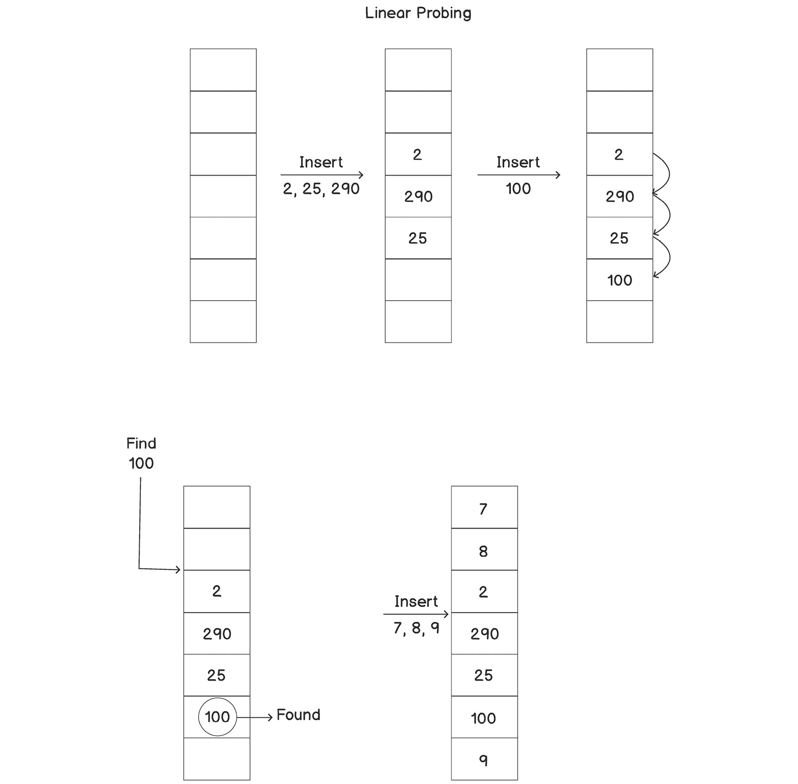

###### 图 3.7：使用线性探测的哈希表上的基本操作


###### 图 3.8：哈希表填满后无法插入元素

正如我们所看到的，如果与其哈希值对应的位置已被占用，我们会将元素插入到下一个可用的插槽中。在插入了前三个元素后，我们可以看到它们聚集在一起。如果在相同范围内插入更多元素，它们都将连续地放在聚集的末尾，从而使聚集增长。现在，当我们尝试搜索一个不在哈希函数计算的位置上，但在一个大聚集的末尾的值时，我们必须线性搜索整个聚集中的所有键。因此，搜索变得极其缓慢。

因此，如果数据密集聚集，我们会遇到一个主要问题。我们可以说数据密集聚集，如果数据分布方式是某些组围绕着非常高频率的值。例如，假设在大小为 100 的哈希表中有很多哈希值为 3 到 7 的键。所有键将在此范围内连续探测到一些值，这将极大地减慢我们的搜索速度。

**二次探测**

正如我们所看到的，线性探测的主要问题是聚集。其原因是在碰撞的情况下我们是线性探测的。这个问题可以通过使用二次方程而不是线性方程来解决。这就是二次探测提供的。

首先，我们尝试将值*x*插入到位置*hash(x)*。如果该位置已被占用，我们继续到位置*hash(x + 1**2**)*，然后*hash(x + 2**2**)*，依此类推。因此，我们以二次方式增加偏移量，从而降低了创建小数据集的概率。

这两种探测技术还有一个优势 - 元素的位置可能会受到没有相同哈希值的其他元素的影响。因此，即使只有一个具有特定哈希值的键，也可能会因为该位置存在其他元素而发生碰撞，而这在链接中是不会发生的。例如，在线性探测中，如果我们有两个哈希值为 4 的键，其中一个将被插入到位置 4，另一个将被插入到位置 5。接下来，如果我们需要插入一个哈希值为 5 的键，它将需要插入到 6。即使它与任何其他键的哈希值不同，这个键也受到了影响。

### 完美哈希 - 布谷鸟哈希

正如标题所示，**布谷鸟哈希**是完美哈希技术之一。我们之前提到的方法在最坏情况下不能保证*O(1)*的时间复杂度，但是如果正确实现，布谷鸟哈希可以实现这一点。

在布谷鸟哈希中，我们保持两个相同大小的哈希表，每个哈希表都有自己独特的哈希函数。任何元素都可以存在于任一哈希表中，并且其位置基于相应的哈希函数。

布谷鸟哈希与我们以前的哈希技术有两种主要不同之处：

+   任何元素都可以存在于两个哈希表中的任何一个。

+   任何元素都可以在将来移动到另一个位置，即使在插入后。

以前的哈希技术在插入后不允许元素移动，除非我们进行完全的重新哈希，但布谷鸟哈希不是这样，因为任何元素都可以有两个可能的位置。我们仍然可以通过增加任何元素的可能位置的数量来增加程度，以便获得更好的结果并减少频繁的重新哈希。然而，在本章中，我们只会看两个可能位置（哈希表）的版本，因为这样更容易理解。

对于查找，我们只需要查看两个位置来确定元素是否存在。因此，查找总是需要 *O(1)* 的时间。

然而，插入函数可能需要更长的时间。在这种情况下，插入函数首先检查是否可能将新元素（比如 *A*）插入第一个哈希表中。如果可以，它就在那里插入元素，然后完成。但是，如果该位置被现有元素（比如 *B*）占据，我们仍然继续插入 *A* 并将 *B* 移动到第二个哈希表中。如果第二个哈希表中的新位置也被占据（比如元素 *C*），我们再次在那里插入 *B* 并将 *C* 移动到第一个表中。我们可以递归地进行这个过程，直到我们能够为所有元素找到空槽。这个过程在下图中有所说明：


###### 图 3.9：布谷鸟哈希

一个主要问题是我们可能会陷入循环，递归可能导致无限循环。对于前面段落中的例子，考虑我们希望插入 *C* 的元素 *D*，但如果我们尝试移动 *D*，它会到达 *A* 的位置。因此，我们陷入了无限循环。下图应该帮助您可视化这一点：


###### 图 3.10：布谷鸟哈希中形成的循环

为了解决这个问题，一旦我们确定了循环，我们需要使用新的哈希函数重新对所有内容进行哈希。使用新哈希函数创建的哈希表可能仍然存在相同的问题，因此我们可能需要重新哈希并尝试不同的哈希函数。然而，通过聪明的策略和明智选择的哈希函数，我们可以以高概率实现摊销 *O(1)* 的性能。

就像开放寻址一样，我们不能存储比哈希表的总大小更多的元素。为了确保良好的性能，我们应该确保负载因子小于 50%，也就是说，元素的数量应该小于可用容量的一半。

我们将在下一个练习中看一下布谷鸟哈希的实现。

### 练习 15：布谷鸟哈希

在这个练习中，我们将实现布谷鸟哈希来创建一个哈希表，并在其中插入各种元素。我们还将获得操作进行的跟踪，这将允许我们查看插入是如何工作的。让我们开始吧：

1.  让我们像往常一样包括所需的头文件：

```cpp
#include <iostream>
#include <vector>
```

1.  让我们为哈希映射添加一个类。这次我们也将单独存储大小：

```cpp
class hash_map
{
    std::vector<int> data1;
    std::vector<int> data2;
    int size;
```

正如我们所看到的，我们使用了两个表。

1.  现在，让我们添加相应的哈希函数：

```cpp
int hash1(int key) const
{
    return key % size;
}
int hash2(int key) const
{
    return (key / size) % size;
}
```

在这里，我们将两个函数都保持得非常简单，但这些函数可以根据需求进行调整。

1.  现在，让我们添加一个构造函数，用于设置我们的数据进行初始化：

```cpp
public:
hash_map(int n) : size(n)
{
    data1 = std::vector<int>(size, -1);
    data2 = std::vector<int>(size, -1);
}
```

正如我们所看到的，我们只是将两个数据表都初始化为空（用 `–1` 表示）。

1.  让我们首先编写一个 `lookup` 函数：

```cpp
std::vector<int>::iterator lookup(int key)
{
    auto hash_value1 = hash1(key);
    if(data1[hash_value1] == key)
    {
        std::cout << "Found " << key << " in first table" << std::endl;
        return data1.begin() + hash_value1;
    }
    auto hash_value2 = hash2(key);
    if(data2[hash_value2] == key)
    {
        std::cout << "Found " << key << " in second table" << std::endl;
        return data2.begin() + hash_value2;
    }
    return data2.end();
}
```

我们试图在两个表中找到键，并在找到时返回相关的迭代器。我们并不总是需要迭代器，但我们将在删除函数中使用它以简化事情。如果未找到元素，我们将返回`data2`表的末尾。正如我们所看到的，查找将具有*O(1)*的时间复杂度，并且将被执行得非常快速。

1.  让我们实现一个删除函数：

```cpp
void erase(int key)
{
    auto position = lookup(key);
    if(position != data2.end())
    {
        *position = -1;
        std::cout << "Removed the element " << key << std::endl;
    }
    else
    {
        std::cout << "Key " << key << " not found." << std::endl;
    }
}
```

正如我们所看到的，大部分工作是通过调用`lookup`函数完成的。我们只需要验证结果并重置值以将其从表中移除。

1.  对于插入，我们将在不同的函数中实现实际逻辑，因为它将是递归的。我们还想要避免循环。然而，保留所有访问过的值的记录可能代价高昂。为了避免这种情况，我们将简单地在函数被调用超过 n 次时停止函数。由于递归深度 n 的阈值取决于我们的内存（或哈希表大小），这样可以获得良好的性能：

```cpp
void insert(int key)
{
    insert_impl(key, 0, 1);
}
void insert_impl(int key, int cnt, int table)
{
    if(cnt >= size)
    {
        std::cout << "Cycle detected, while inserting " << key << ". Rehashing required." << std::endl;
        return;
    }
    if(table == 1)
    {
int hash = hash1(key);
        if(data1[hash] == -1)
        {
            std::cout << "Inserted key " << key << " in table " << table << std::endl;
            data1[hash] = key;
        }
        else
        {
            int old = data1[hash];
            data1[hash] = key;
            std::cout << "Inserted key " << key << " in table " << table << " by replacing " << old << std::endl;
            insert_impl(old, cnt + 1, 2);
        }
    }
    else
    {
int hash = hash2(key);
        if(data2[hash] == -1)
        {
            std::cout << "Inserted key " << key << " in table " << table << std::endl;
            data2[hash] = key;
        }
        else
        {
            int old = data2[hash];
            data2[hash] = key;
            std::cout << "Inserted key " << key << " in table " << table << " by replacing " << old << std::endl;
            insert_impl(old, cnt + 1, 2);
        }
    }
}
```

正如我们所看到的，实现需要三个参数-键、我们要插入键的表以及递归调用堆栈的计数，以跟踪我们已经改变位置的元素数量。

1.  现在，让我们编写一个实用函数来打印哈希表中的数据。虽然这并不是真正必要的，也不应该暴露，但我们将这样做，以便更好地了解我们的插入函数如何在内部管理数据：

```cpp
void print()
{
    std::cout << "Index: ";
    for(int i = 0; i < size; i++)
        std::cout << i << '\t';
    std::cout << std::endl;
    std::cout << "Data1: ";
    for(auto i: data1)
        std::cout << i << '\t';
    std::cout << std::endl;
    std::cout << "Data2: ";
    for(auto i: data2)
        std::cout << i << '\t';
    std::cout << std::endl;
}
};
```

1.  现在，让我们编写`main`函数，以便我们可以使用这个哈希映射：

```cpp
int main()
{
    hash_map map(7);
    map.print();
    map.insert(10);
    map.insert(20);
    map.insert(30);
    std::cout << std::endl;
    map.insert(104);
    map.insert(2);
    map.insert(70);
    map.insert(9);
    map.insert(90);
    map.insert(2);
    map.insert(7);
    std::cout << std::endl;
    map.print();
    std::cout << std::endl;
    map.insert(14);  // This will cause cycle.
}
```

1.  您应该看到以下输出：

```cpp
Index: 0    1    2    3    4    5    6    
Data1: -1    -1    -1    -1    -1    -1    -1    
Data2: -1    -1    -1    -1    -1    -1    -1    
Inserted key 10 in table 1
Inserted key 20 in table 1
Inserted key 30 in table 1
Inserted key 104 in table 1 by replacing 20
Inserted key 20 in table 2
Inserted key 2 in table 1 by replacing 30
Inserted key 30 in table 2
Inserted key 70 in table 1
Inserted key 9 in table 1 by replacing 2
Inserted key 2 in table 2
Inserted key 90 in table 1 by replacing 104
Inserted key 104 in table 2 by replacing 2
Inserted key 2 in table 1 by replacing 9
Inserted key 9 in table 2
Inserted key 2 in table 1 by replacing 2
Inserted key 2 in table 2 by replacing 104
Inserted key 104 in table 1 by replacing 90
Inserted key 90 in table 2
Inserted key 7 in table 1 by replacing 70
Inserted key 70 in table 2
Index: 0    1    2    3    4    5     6
Data1: 7   -1    2    10  -1   -1     104
Data2: 2    9    20   70   30   90   -1
Inserted key 14 in table 1 by replacing 7
Inserted key 7 in table 2 by replacing 9
Inserted key 9 in table 1 by replacing 2
Inserted key 2 in table 2 by replacing 2
Inserted key 2 in table 1 by replacing 9
Inserted key 9 in table 2 by replacing 7
Inserted key 7 in table 1 by replacing 14
Cycle detected, while inserting 14\. Rehashing required.
```

正如我们所看到的，输出显示了内部维护两个表的完整跟踪。我们打印了内部步骤，因为一些值正在移动。我们可以从跟踪中看到，`14`的最后插入导致了一个循环。插入的深度已经超过了`7`。同时，我们还可以看到两个表几乎已经满了。我们已经填充了`14`中的`11`个元素，因此在每一步替换值的机会都在增加。我们还在循环之前打印了表。

此外，这里删除元素的时间复杂度为*O(1)*，因为它只是使用`lookup`函数并删除元素（如果找到）。因此，唯一昂贵的函数是插入。因此，如果在任何应用程序中插入的数量要比查找的数量少得多，这是一个理想的实现。

让我们使用以下视觉辅助工具，以便更好地理解这一点：

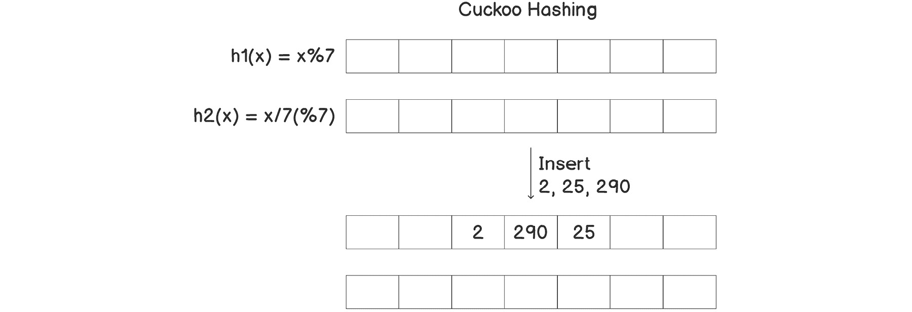

###### 图 3.11：在使用布谷鸟哈希的哈希表中插入元素

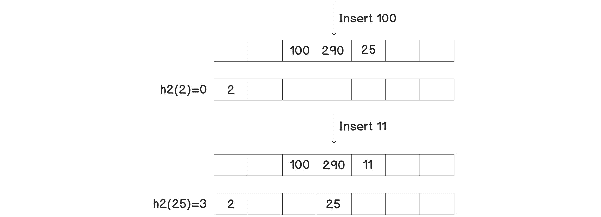

###### 图 3.12：使用布谷鸟哈希处理哈希表中的碰撞


###### 图 3.13：使用布谷鸟哈希处理哈希表中的碰撞（续）

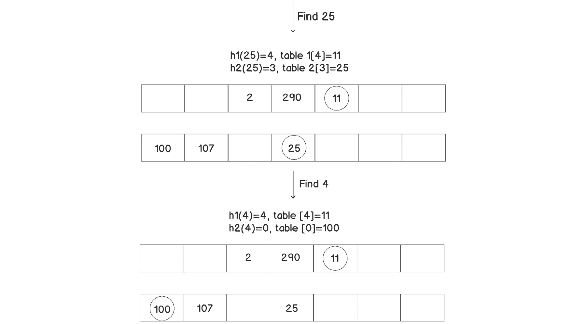

###### 图 3.14：在使用布谷鸟哈希的哈希表中查找值


###### 图 3.15：在使用布谷鸟哈希的哈希表中删除值

正如我们从前面一系列的图中所看到的，首先，我们尝试在第一个表中插入元素。如果已经有另一个元素，我们将覆盖它并将现有元素插入到另一个表中。我们重复这个过程，直到安全地插入最后一个元素。

## C++哈希表

正如我们之前提到的，查找操作在大多数应用程序中是非常频繁的。然而，我们可能并不总是遇到正整数，这些很容易进行哈希。大部分时间你可能会遇到字符串。考虑我们之前考虑过的英语词典的例子。我们可以使用单词作为键，单词定义作为值来存储词典数据。另一个例子是我们在*第一章*，*列表、栈和队列*中考虑过的医院记录数据库，患者的姓名可能被用作键，其他相关信息可以作为值存储。

我们之前使用的简单取模函数来计算整数的哈希值对于字符串不起作用。一个简单的选择是计算所有字符的 ASCII 值的总和的模。然而，字符串中字符的所有排列可能非常庞大，这将导致很多碰撞。

C++提供了一个名为`std::hash<std::string>(std::string)`的函数，我们可以用它来生成字符串的哈希值。它有一个内置算法来处理哈希函数。同样，C++为所有基本数据类型提供了这样的函数。

现在，看看我们在*练习 14*中实现的哈希表，*链式哈希表*，很明显我们可以根据数据类型简单地将其模板化，并提供一个通用解决方案来为任何给定类型的数据提供哈希函数。STL 为此提供了几种解决方案：`std::unordered_set<Key>`和`std::unordered_map<Key, Value>`。无序集合只能存储一组键，而无序映射可以存储键和它们的值。因此，容器中的每个唯一键都将有一个相应的值。

这两个容器都是以相同的方式实现的 - 使用链式哈希表。哈希表中的每一行都是一个存储键（和映射的值）的向量。这些行被称为**桶**。因此，在计算密钥的哈希值后，它将被放置到其中一个桶中。每个桶也是一个列表，以支持链式处理。

默认情况下，这些容器的最大负载因子为*1*。一旦元素数量超过哈希表的大小，哈希函数将被更改，哈希值将被重新计算（重新散列），并且将重新构建一个更大的哈希表以降低负载因子。我们也可以使用`rehash`函数手动执行此操作。使用`max_load_factor(float)`函数可以更改负载因子的默认最大限制为*1*。一旦负载因子超过定义的最大限制，值将被重新散列。

这些容器提供了常用的函数，如`find`，`insert`和`erase`。它们还提供迭代器来遍历所有元素，以及使用其他容器（如向量和数组）创建无序集合和映射的构造函数。无序映射还提供`operator[]`，以便它可以返回已知键的值。

我们将在下一个练习中看一下无序集合和映射的实现。

### 练习 16：STL 提供的哈希表

在这个练习中，我们将实现无序集合和映射，并对这些容器进行插入、删除和查找等操作。让我们开始吧：

1.  包括所需的头文件：

```cpp
#include <iostream>
#include <unordered_map>
#include <unordered_set>
```

1.  现在，让我们编写一些简单的`print`函数，以使我们的`main`函数更易读：

```cpp
void print(const std::unordered_set<int>& container)
{
    for(const auto& element: container)
        std::cout << element << " ";
    std::cout << std::endl;
}
void print(const std::unordered_map<int, int>& container)
{
    for(const auto& element: container)
        std::cout << element.first << ": " << element.second << ", ";
    std::cout << std::endl;
}
```

1.  同样，添加对`find`函数的包装器，以保持代码整洁：

```cpp
void find(const std::unordered_set<int>& container, const auto& element)
{
    if(container.find(element) == container.end())
        std::cout << element << " not found" << std::endl;
    else
        std::cout << element << " found" << std::endl;
}
void find(const std::unordered_map<int, int>& container, const auto& element)
{
    auto it = container.find(element);
    if(it == container.end())
        std::cout << element << " not found" << std::endl;
    else
        std::cout << element << " found with value=" << it->second << std::endl;
}
```

1.  现在，编写`main`函数，以便我们可以使用`unordered_set`和`unordered_map`，然后对其执行各种操作。我们将查找、插入和删除元素：

```cpp
int main()
{
    std::cout << "Set example: " << std::endl;
    std::unordered_set<int> set1 = {1, 2, 3, 4, 5};
    std::cout << "Initial set1: ";
    print(set1);
    set1.insert(2);
    std::cout << "After inserting 2: ";
    print(set1);
    set1.insert(10);
    set1.insert(351);
    std::cout << "After inserting 10 and 351: ";
    print(set1);
    find(set1, 4);
    find(set1, 100);
    set1.erase(2);
    std::cout << "Erased 2 from set1" << std::endl;
    find(set1, 2);
    std::cout << "Map example: " << std::endl;
    std::unordered_map<int, int> squareMap;
    squareMap.insert({2, 4});
    squareMap[3] = 9;
    std::cout << "After inserting squares of 2 and 3: ";
    print(squareMap);
    squareMap[30] = 900;
    squareMap[20] = 400;
    std::cout << "After inserting squares of 20 and 30: ";
    print(squareMap);
    find(squareMap, 10);
    find(squareMap, 20);
    std::cout << "Value of map[3]=" << squareMap[3] << std::endl;
    std::cout << "Value of map[100]=" << squareMap[100] << std::endl;
}
```

1.  这个程序的可能输出之一如下。集合和映射中元素的顺序可能不同，因此被称为*无序*集合/映射：

```cpp
Set example: 
Initial set1: 5 4 3 2 1 
After inserting 2: 5 4 3 2 1 
After inserting 10 and 351: 351 10 1 2 3 4 5 
4 found
100 not found
Erased 2 from set1
2 not found
Map example: 
After inserting squares of 2 and 3: 3: 9, 2: 4, 
After inserting squares of 20 and 30: 20: 400, 30: 900, 2: 4, 3: 9, 
10 not found
20 found with value=400
Value of map[3]=9
Value of map[100]=0
```

正如我们所看到的，我们可以向这两个容器插入、查找和删除元素。这些操作都按预期工作。如果我们将这些操作与其他容器（如 vector、list、array、deque 等）进行基准测试，性能会更快。

我们可以存储键值对，并使用`operator[]`访问任何给定键的值，就像本练习中所示的那样。它返回一个引用，因此还允许我们设置值，而不仅仅是检索它。

#### 注意

由于`operator[]`返回一个引用，如果找不到键，它将向条目添加默认值。

在最后一行，我们得到了`map[100] = 0`，即使`100`从未被插入到映射中。这是因为`operator[]`返回了默认值。

如果我们想要跟踪基于重新散列而更改的桶的数量，我们可以使用`bucket_count()`函数来实现。还有其他函数可以获取有关其他内部参数的详细信息，比如`load_factor`、`max_bucket_count`等等。我们还可以使用`rehash`函数手动重新散列。

由于这些容器是使用链接实现的，它们实际上将键/值对存储在不同的桶中。因此，在任何桶中搜索键时，我们需要比较它们是否相等。因此，我们需要为键类型定义相等运算符。或者，我们可以将其作为另一个模板参数传递。

在这个练习中，我们可以看到，无序集合和映射不允许重复的键。如果我们需要存储重复的值，我们可以使用`unordered_multiset`或`unordered_multimap`。为了支持多个值，插入函数不会检查键是否已经存在于容器中。此外，它支持一些额外的函数来检索具有特定键的所有项。我们不会再深入研究这些容器的细节，因为这超出了本书的范围。

STL 为 C++支持的所有基本数据类型提供了哈希函数。因此，如果我们想要将自定义类或结构作为前述容器中的键类型，我们需要在`std`命名空间内实现一个哈希函数。或者，我们可以将其作为模板参数传递。然而，每次都自己编写哈希函数并不是一个好主意，因为性能在很大程度上取决于它。设计哈希函数需要进行相当多的研究和对手头问题的理解，以及数学技能。因此，我们将其排除在本书的范围之外。对于我们的目的，我们可以简单地使用`boost`库中提供的`hash_combine`函数，就像下面的例子中所示的那样。

```cpp
#include <boost/functional/hash.hpp>
struct Car
{
    std::string model;
    std::string brand;
    int buildYear;
};
struct CarHasher
{
    std::size_t operator()(const Car& car) const
    {
        std::size_t seed = 0;
        boost::hash_combine(seed, car.model);
        boost::hash_combine(seed, car.brand);
        return seed;
    }
};
struct CarComparator
{
    bool operator()(const Car& car1, const Car& car2) const
    {
    return (car1.model == car2.model) && (car1.brand == car2.brand);
    }
};
// We can use the hasher as follows:
std::unordered_set<Car, CarHasher, CarComparator> carSet;
std::unordered_map<Car, std::string, CarHasher, CarComparator> carDescriptionMap;
```

正如我们所看到的，我们已经定义了一个具有`operator()`的哈希结构，它将被无序容器使用。我们还定义了一个具有`operator()`的比较器结构，以支持相关函数。我们将这些结构作为模板参数传递。这也允许我们为不同的对象使用不同类型的比较器和哈希器。

除了简单的哈希函数，如取模，还有一些复杂的哈希函数，称为加密哈希函数，如 MD5、SHA-1 和 SHA-256。这些算法非常复杂，它们可以接受任何类型的数据——甚至是文件——作为输入值。加密函数的一个重要特征是，很难从给定的哈希值确定实际数据（也称为逆哈希），因此它们被用于一些最安全的系统中。例如，比特币区块链使用 SHA-256 算法来存储交易记录的重要真实性证明。区块链中的每个*块*都包含其前一个链接块的 SHA-256 哈希值，并且当前块的哈希值包含在后续块中。非法修改任何块将使整个区块链从该块开始无效，因为现在修改后的块的哈希值将与下一个块中存储的值不匹配。即使使用世界上一些最快的超级计算机，也需要数百年才能打破这一点，并创建伪造的交易记录。

### 活动 6：将长 URL 映射到短 URL

在这个活动中，我们将创建一个程序来实现类似于[`tinyurl.com/`](https://tinyurl.com/)的服务。它可以将一个非常长的 URL 映射到一个易于分享的小 URL。每当我们输入短 URL 时，它应该检索原始 URL。

我们想要以下功能：

+   高效地存储用户提供的原始 URL 和相应的较小 URL

+   如果找到，基于给定的较小 URL 检索原始 URL；否则，返回错误

这些高层次的步骤应该帮助你解决这个活动：

1.  创建一个包含`unordered_map`作为主要数据成员的类。

1.  添加一个插入值的函数。这个函数应该接受两个参数：原始 URL 和它的较小版本。

1.  添加一个函数来查找基于给定小 URL 的实际 URL（如果存在）。

#### 注意

这个活动的解决方案可以在第 498 页找到。

## 布隆过滤器

与哈希表相比，布隆过滤器在空间上非常高效，但代价是确定性答案；也就是说，我们得到的答案是不确定的。它只保证不会有假阴性，但可能会有假阳性。换句话说，如果我们得到一个正面的命中，元素可能存在，也可能不存在；但如果我们得到一个负面的命中，那么元素肯定不存在。

就像布谷鸟哈希一样，我们将在这里使用多个哈希函数。然而，我们将保留三个函数，因为两个函数无法达到合理的准确性。基本思想是，我们不存储实际值，而是存储一个布尔数组，指示值是否（可能）存在。

要插入一个元素，我们计算所有哈希函数的值，并将数组中所有三个哈希值对应的位设置为*1*。对于查找，我们计算所有哈希函数的值，并检查所有相应的位是否都设置为*1*。如果是，我们返回*true*；否则，我们返回*false*（元素不存在）。

显而易见的问题是——为什么查找是不确定的？原因是任何位都可以被多个元素设置。因此，有相当大的概率，所有特定值（称为*x*）的相关位都设置为*1*，因为之前插入了一些其他元素，尽管*x*根本没有被插入。在这种情况下，查找函数仍然会返回*true*。因此，我们可以期望一些误报。我们插入的元素越多，误报的机会就越大。然而，如果*x*的某个位没有设置，那么我们可以确定地说元素不存在。因此，假阴性不可能发生。

数组中的所有位都设置为*1*时，数组将饱和。因此，查找函数将始终返回*true*，并且插入函数根本不会产生任何影响，因为所有位已经设置为*1*。

以下图表使这一点更清晰：

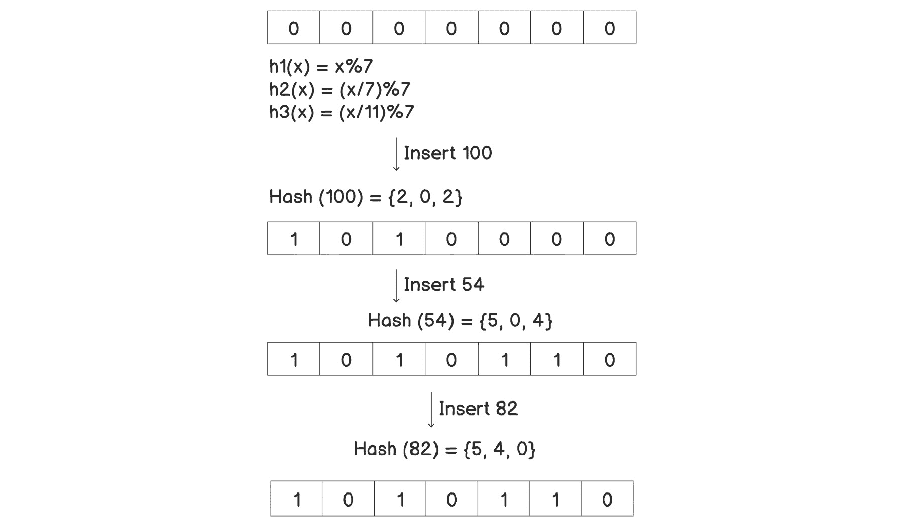

###### 图 3.16：在 Bloom 过滤器中插入元素

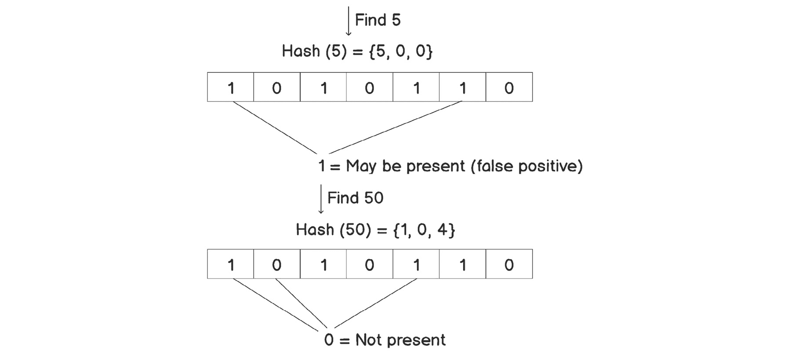

###### 图 3.17：在 Bloom 过滤器中查找元素

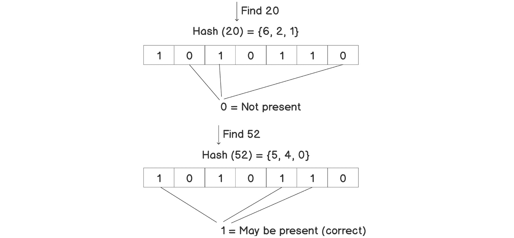

###### 图 3.18：在 Bloom 过滤器中查找元素（续）

如前面的图表所示，我们根据哈希函数设置相关位，并且对于插入，我们对元素进行位`AND`查找，就像我们之前解释的那样。

我们将在接下来的练习中用 C++实现一个 Bloom 过滤器。

### 练习 17：创建 Bloom 过滤器

在这个练习中，我们将创建一个 Bloom 过滤器并尝试一些基本操作。我们还将测试查找中的误报。让我们开始吧：

1.  让我们包括所需的头文件：

```cpp
#include <iostream>
#include <vector>
```

1.  现在，让我们为我们的 Bloom 过滤器创建一个类，并添加所需的数据成员：

```cpp
class bloom_filter
{
    std::vector<bool> data;
    int nBits;
```

1.  现在，让我们添加所需的哈希函数。同样，我们将使用非常基本的哈希函数：

```cpp
int hash(int num, int key)
{
    switch(num)
    {
    case 0:
        return key % nBits;
    case 1:
        return (key / 7) % nBits;
    case 2:
        return (key / 11) % nBits;
    }
    return 0;
}
```

如您所见，我们使用单个函数，参数称为`num`，确定哈希函数，以避免其他函数中不必要的`if`-`else`块。这也很容易扩展；我们只需要为每个哈希函数添加一个情况。

1.  让我们为 Bloom 过滤器添加一个构造函数：

```cpp
public:
bloom_filter(int n) : nBits(n)
{
    data = std::vector<bool>(nBits, false);
}
```

1.  现在，让我们添加一个`lookup`函数：

```cpp
void lookup(int key)
{
    bool result = data[hash(0, key)] & data[hash(1, key)] & data[hash(2, key)];
    if(result)
    {
        std::cout << key << " may be present." << std::endl;
    }
    else
    {
        std::cout << key << " is not present." << std::endl;
    }
}
```

如预期的那样，`lookup`函数非常简单。它检查所有必需的位是否都设置为`1`。如果有可变数量的哈希函数，我们总是可以循环遍历所有这些函数，以检查所有相应的位是否都设置为`1`。为了使我们的话更准确，我们还说由于误报的可能性，一个键*可能存在*。另一方面，如果`lookup`返回负数，我们完全确定一个键不存在。

1.  甚至插入函数同样简单：

```cpp
void insert(int key)
{
    data[hash(0, key)] = true;
    data[hash(1, key)] = true;
    data[hash(2, key)] = true;
    std::cout << key << " inserted." << std::endl;
}
};
```

1.  现在，让我们添加`main`函数，以便我们可以使用这个类：

```cpp
int main()
{
bloom_filter bf(11);
bf.insert(100);
bf.insert(54);
bf.insert(82);
bf.lookup(5);
bf.lookup(50);
bf.lookup(2);
bf.lookup(100);
bf.lookup(8);
bf.lookup(65);
}
```

1.  您应该看到以下输出：

```cpp
100 inserted.
54 inserted.
82 inserted.
5 may be present.
50 is not present.
2 is not present.
100 may be present.
8 is not present.
65 may be present.
```

正如我们所看到的，有一些误报，但没有错误的否定。

与以前的技术不同，这种结构只需要 11 位来存储这些信息，正如我们从 Bloom 过滤器的构造函数中所看到的。因此，我们可以轻松地增加过滤器的大小，并相应地更新哈希函数，以获得更好的结果。例如，我们可以将数组的大小增加到 1,000（1,023 经常被使用，因为它是一个质数），我们仍然将使用少于 130 字节，这比大多数其他技术要少得多。随着哈希表大小的增加，我们的哈希函数也将变为*%1023*或类似的，并且将提供更好的结果和更好的数字分布。

这里需要注意的一个重要点是，由于我们没有在容器中存储实际数据，我们可以将其用作异构结构；也就是说，只要我们的哈希函数足够好，我们可以同时在同一个 Bloom 过滤器中插入不同类型的数据，比如整数、字符串和双精度浮点数。

在现实生活中有一些非常好的用例，特别是当数据量太大，即使使用哈希表也无法搜索，一些误报也是可以接受的。例如，在创建像 Gmail 或 Outlook 这样的电子邮件提供商的新电子邮件地址时，会检查电子邮件地址是否已经存在。数据库中存在数十亿个电子邮件地址，对于这样一个基本且频繁的查询，进行准确的检查将非常昂贵。幸运的是，即使电子邮件地址尚未被占用，有时说它已被占用也没关系，因为这不会造成任何伤害。用户只需选择其他内容。在这种情况下，使用 Bloom 过滤器是一个可行的选择。我们将在*Activity 7*，*电子邮件地址验证器*中看到它的运作。

另一个例子是用于显示新广告的推荐算法，这些广告被 Facebook 等服务使用。每次查看动态时，它都会向您显示一个新广告。它可以简单地将您观看的广告的 ID 存储在 Bloom 过滤器中。然后，在显示广告之前，可以针对特定广告的 ID 进行检查。如果检查返回您观看了特定广告，即使您没有（误报），它也不会显示该广告。然而，这没关系，因为您根本不知道，毕竟您也没有看到那个广告。这样，您可以每次都以非常快的查找获得新广告。

### 活动 7：电子邮件地址验证器

在这个活动中，我们将创建一个类似于我们在许多电子邮件服务提供商（如 Gmail 和 Outlook）的注册过程中找到的电子邮件验证器。我们将使用 Bloom 过滤器来检查电子邮件地址是否已被他人占用。

这些高级步骤应该帮助您完成此活动：

1.  创建一个`BloomFilter`类，可以接受一定数量的哈希函数和 Bloom 的大小。

1.  对于哈希，使用 OpenSSL 库中的 MD5 算法生成给定电子邮件的哈希值。MD5 是一种 128 位的哈希算法。对于多个哈希函数，我们可以使用每个字节作为单独的哈希值。

1.  要在 Bloom 过滤器中添加电子邮件，我们需要将在*步骤 2*中计算的哈希值的每个字节的所有位设置为*true*。

1.  要查找任何电子邮件，我们需要检查基于*步骤 2*中计算的哈希值的所有相关位是否为*true*。

#### 注

此活动的解决方案可在第 503 页找到。

## 总结

正如我们在介绍中提到的，查找问题在大多数应用程序中以一种或另一种方式遇到。根据我们的需求，我们可以使用确定性和概率性解决方案。在本章中，我们实现并看到了如何使用它们。最后，我们还看了 C++中用于哈希的内置容器的示例。这些容器在编写应用程序时非常有用，因为我们不需要每次为每种类型都实现它们。一个简单的经验法则是：如果我们可以看到对容器的`find`函数的大量调用，我们应该选择基于查找的解决方案。

到目前为止，我们已经看到了如何将数据存储在各种数据结构中并执行一些基本操作。在接下来的章节中，我们将研究各种类型的算法设计技术，以便优化这些操作，从分而治之开始。
