# 第四章：分治

## 学习目标

在本章结束时，您将能够:

+   描述分治设计范式

+   实现标准的分治算法，如归并排序、快速排序和线性时间选择

+   使用 MapReduce 编程模型解决问题

+   学习如何使用多线程的 C++ MapReduce 实现

在本章中，我们将学习分治算法设计范式，并学习如何使用它来解决计算问题。

## 介绍

在上一章中，我们学习了一些常用的数据结构。数据结构是以不同形式组织数据的方式，数据结构使得控制和访问存储在其中的数据的成本成为可能。然而，使软件有用的不仅仅是存储和检索各种格式的数据的能力，而是能够对数据进行转换以解决计算问题的能力。对于给定的问题，对数据的精确定义和转换顺序由一系列称为**算法**的指令确定。

算法接受一组定义问题实例的输入，应用一系列变换，并输出一组结果。如果这些结果是手头计算问题的正确解决方案，我们称算法是*正确*的。算法的*好坏*由其效率决定，或者说算法需要执行多少指令才能产生正确的结果：

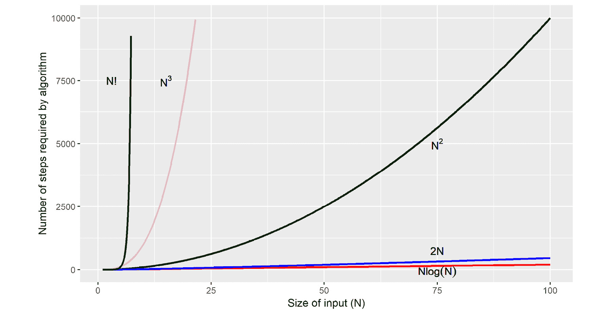

###### 图 4.1：算法所需步骤随输入大小的扩展

上图显示了算法所需步骤随输入大小的增长情况。复杂度更高的算法随着输入大小的增加而增长更快，对于足够大的输入，它们甚至在现代计算机系统上也可能无法运行。例如，假设我们有一台每秒可以执行一百万次操作的计算机。对于大小为 50 的输入，需要*N log(N)*步的算法将花费 283 微秒完成；需要*N**2*步的算法将花费 2.5 毫秒；需要*N!*（*N*的阶乘）步的算法将需要大约 9,637,644,561,599,544,267,027,654,516,581,964,749,586,575,812,734.82 **世纪**来运行！

*如果对于输入大小 N，算法以 N 的多项式步骤解决问题，则称算法是高效的。*

将**多项式时间算法**表达为解决方案的问题也被称为属于计算复杂性的类*P*（多项式）。问题可以分为几种其他计算复杂性，以下是一些示例：

+   **NP**（非确定性多项式时间）问题的解决方案可以在多项式时间内验证，但没有已知的多项式时间解决方案。

+   **EXPTIME**（指数时间）问题的解决方案运行时间与输入大小呈指数关系。

+   **PSPACE**（多项式空间）问题需要多项式数量的空间。

找出*P*中的问题集是否与*NP*中的问题集完全相同是著名的*P = NP*问题，经过数十年的努力仍未解决，甚至为任何能解决它的人提供了 100 万美元的奖金。我们将在*第九章* *动态规划 II*中再次研究*P*和*NP*类型的问题。

计算机科学家们几十年来一直将算法作为数学对象进行研究，并确定了一组通用的方法（或**范式**）来设计高效的算法，这些方法可以用来解决各种各样的问题。其中最广泛适用的算法设计范式之一被称为*分治*，将是我们在本章的研究对象。

**分而治之**类型的算法将给定的问题分解成较小的部分，尝试为每个部分解决问题，最后将每个部分的解决方案合并为整个问题的解决方案。几种广泛使用的算法属于这一类，例如二分搜索、快速排序、归并排序、矩阵乘法、快速傅里叶变换和天际线算法。这些算法几乎出现在今天使用的所有主要应用程序中，包括数据库、Web 浏览器，甚至语言运行时，如 Java 虚拟机和 V8 JavaScript 引擎。

在本章中，我们将向您展示使用分而治之的方法解决问题的含义，以及如何确定您的问题是否适合这样的解决方案。接下来，我们将练习递归思维，并向您展示现代 C++标准库提供的工具，以便您可以使用分而治之来解决问题。最后，我们将通过查看 MapReduce 来结束本章，包括讨论为什么以及如何扩展，以及如何使用相同的范例来扩展您的程序，包括 CPU 级别和机器级别的并行化。

让我们深入研究一种使用分而治之方法的基本算法-二分搜索。

## 二分搜索

让我们从标准搜索问题开始：假设我们有一个排序的正整数序列，并且需要找出一个数字*N*是否存在于序列中。搜索问题自然地出现在几个地方；例如，接待员在一组按客户 ID 排序的文件中寻找客户的文件，或者老师在学生注册表中寻找学生的成绩。他们实际上都在解决搜索问题。

现在，我们可以以两种不同的方式解决问题。在第一种方法中，我们遍历整个序列，检查每个元素是否等于*N*。这称为**线性搜索**，并在以下代码中显示：

```cpp
bool linear_search(int N, std::vector<int>& sequence)
{
    for (auto i : sequence)
    {
        if (i == N)
            return true;      // Element found!
    }

    return false;
}
```

这种方法的一个好处是它适用于所有数组，无论是排序还是未排序。但是，它效率低下，并且没有考虑到给定数组是排序的。在算法复杂度方面，它是一个*O(N)*算法。

利用序列已排序的事实的另一种解决方案如下：

1.  从`range`中开始整个序列。

1.  将当前`range`的中间元素与*N*进行比较。让这个中间元素为*M*。

1.  如果*M = N*，我们在序列中找到了*N*，因此搜索停止。

1.  否则，我们根据两条规则修改`range`：

- 如果*N < M*，这意味着如果*N*存在于`range`中，它将在*M*的左侧，因此我们可以安全地从`range`中删除*M*右侧的所有元素。

- 如果*N > M*，算法从`range`中删除所有左侧的*M*元素。

1.  如果`range`中仍有多于 1 个元素，则转到*步骤 2*。

1.  否则，*N*不存在于序列中，搜索停止。

为了说明这个算法，我们将展示二分搜索是如何工作的，其中*S*是从*1*到*9*的整数排序序列，*N = 2*：

1.  算法从将*S*的所有元素放入范围开始。在这一步中，中间元素被发现是*5*。我们比较*N*和*5*：

###### 图 4.2：二分搜索算法-步骤 1

1.  由于*N < 5*，如果*N*存在于序列中，它必须在*5*的左边。因此，我们可以安全地丢弃序列中位于*5*右侧的所有元素。现在我们的范围只有*1*到*5*之间的元素，中间元素现在是*3*。我们现在可以比较*N*和*3*：

###### 图 4.3：二分搜索算法-步骤 2

1.  我们发现当前的中间元素*3*仍然大于*N*，并且范围可以进一步修剪为仅包含*1*和*3*之间的元素。新的中间元素现在是*2*，它等于*N*，搜索终止：


###### 图 4.4：二分搜索算法-步骤 3

在下一个练习中，我们将看一下二分搜索算法的实现。

### 练习 18：二分搜索基准

在这个练习中，我们将编写并基准测试二分搜索实现。按照以下步骤完成这个练习：

1.  首先添加以下头文件：

```cpp
#include <iostream>
#include <vector>
#include <chrono>
#include <random>
#include <algorithm>
#include <numeric>
```

1.  添加线性搜索代码如下：

```cpp
bool linear_search(int N, std::vector<int>& S)
{
        for (auto i : S)
        {
            if (i == N)
                return true;       // Element found!
        }

        return false;
}
```

1.  添加此处显示的二分搜索代码：

```cpp
bool binary_search(int N, std::vector<int>& S)
{
    auto first = S.begin();
    auto last = S.end();
    while (true)
    {
        // Get the middle element of current range
        auto range_length = std::distance(first, last);
        auto mid_element_index = first + std::floor(range_length / 2);
        auto mid_element = *(first + mid_element_index);
        // Compare the middle element of current range with N
        if (mid_element == N)
            return true;
        else if (mid_element > N)
            std::advance(last, -mid_element_index);
        if (mid_element < N)
            std::advance(first, mid_element_index);
        // If only one element left in the current range
        if (range_length == 1)
            return false;
    }
}
```

1.  为了评估二分搜索的性能，我们将实现两个函数。首先，编写小测试：

```cpp
void run_small_search_test()
{
    auto N = 2;
    std::vector<int> S{ 1, 3, 2, 4, 5, 7, 9, 8, 6 };
    std::sort(S.begin(), S.end());
    if (linear_search(N, S))
        std::cout << "Element found in set by linear search!" << std::endl;
    else
        std::cout << "Element not found." << std::endl;
    if (binary_search(N, S))
        std::cout << "Element found in set by binary search!" << std::endl;
    else
        std::cout << "Element not found." << std::endl;
}
```

1.  现在，添加大型测试函数，如下所示：

```cpp
void run_large_search_test(int size, int N)
{
    std::vector<int> S;
    std::random_device rd;
    std::mt19937 rand(rd());
      // distribution in range [1, size]
    std::uniform_int_distribution<std::mt19937::result_type> uniform_dist(1, size); 
    // Insert random elements
    for (auto i=0;i<size;i++)
        S.push_back(uniform_dist(rand));
    std::sort(S.begin(), S.end());
    // To measure the time taken, start the clock
    std::chrono::steady_clock::time_point begin = std::chrono::steady_clock::now();

    bool search_result = binary_search(111, S);
    // Stop the clock
    std::chrono::steady_clock::time_point end = std::chrono::steady_clock::now();

    std::cout << "Time taken by binary search = " << 
std::chrono::duration_cast<std::chrono::microseconds>
(end - begin).count() << std::endl;

    if (search_result)
        std::cout << "Element found in set!" << std::endl;
    else
        std::cout << "Element not found." << std::endl;
}
```

1.  最后，添加以下驱动程序代码，用于在不同大小的随机生成向量中搜索数字`36543`：

```cpp
int main()
{
    run_small_search_test();
    run_large_search_test(100000, 36543);
    run_large_search_test(1000000, 36543);
    run_large_search_test(10000000, 36543);
    return 0;
}
```

1.  以 x64-Debug 模式编译程序并运行。输出应如下所示：

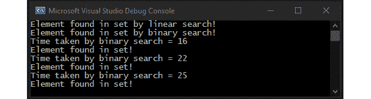

###### 图 4.5：启用调试的二分搜索

请注意，三个输入数组的大小都比前一个数组大 10 倍，因此第三个数组比第一个数组大 100 倍，它本身包含十万个元素。然而，使用二分搜索在数组中搜索所花费的时间仅增加了 10 微秒。

在上一个测试中，我们没有允许任何编译器优化，并且在运行时附加了调试器。现在，让我们看看当我们的编译器允许优化 C++代码而没有附加调试器时会发生什么。尝试以 x64-Release 模式编译*练习 18*中的*二分搜索基准*代码，并运行。输出应如下所示：

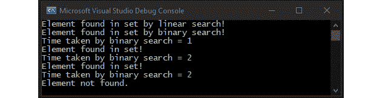

###### 图 4.6：打开编译器优化的二分搜索

无论向量大小如何，二分搜索在这三种情况下大致需要相同的时间！

请注意，我们的二分搜索实现使用迭代器和 C++标准库函数，如`std::distance()`和`std::advance()`。这在现代 C++中被认为是良好的实践，因为它有助于使我们的代码不依赖于基础数据类型，并且可以避免索引越界错误。

现在，假设我们想在一个浮点数向量上执行搜索。我们如何修改上一个练习中的函数？答案非常简单。我们可以修改函数签名如下：

```cpp
bool linear_search(float N, std::vector<float>& S)
bool binary_search(float N, std::vector<float>& S)
```

搜索函数内部的其余代码仍然可以保持完全相同，因为它完全独立于基础数据类型，仅取决于容器数据类型的行为。**在现代 C++中，将核心算法逻辑与算法操作的基础数据类型分离开来，是编写可重用代码的基石。**我们将在本书的过程中看到几个这样的分离示例，并深入研究标准库提供的更多函数，这些函数可以帮助我们编写可重用和健壮的代码。

### 活动 8：疫苗接种

想象一下，现在是流感季节，卫生部门官员计划访问一所学校，以确保所有入学的孩子都接种了流感疫苗。然而，出现了一个问题：一些孩子已经接种了流感疫苗，但不记得他们是否已经接种了卫生官员计划为所有学生接种的特定类别的流感疫苗。官方记录被寻找出来，部门能够找到已经接种疫苗的学生名单。这里显示了名单的一个小节：


###### 图 4.7：疫苗接种记录摘录

假设所有名称都是正整数，并且给定列表已排序。您的任务是编写一个程序，可以查找列表中给定学生的接种状况，并向官员输出学生是否需要接种疫苗。学生需要接种疫苗，如果满足以下两个条件：

+   如果它们不在列表中

+   如果他们在名单上但尚未接种流感疫苗。

由于列表中可能有大量学生，您的程序应尽可能快速和高效。程序的最终输出应如下所示：

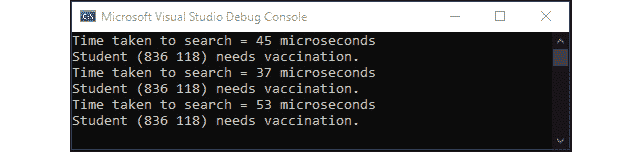

###### 图 4.8：活动 8 的示例输出

**高级步骤**

此活动的解决方案使用了稍微修改过的二分搜索算法。让我们开始吧：

1.  将每个学生表示为`Student`类的对象，可以定义如下：

```cpp
 class Student
{
    std::pair<int, int> name;
    bool vaccinated;
}
```

1.  重载`Student`类的必要运算符，以便可以使用标准库的`std::sort()`函数对学生向量进行排序。

1.  使用二分搜索查看学生是否在名单上。

1.  如果学生不在列表中，则您的函数应返回*true*，因为学生需要接种疫苗。

1.  否则，如果学生在名单上但尚未接种疫苗，则返回*true*。

1.  否则，返回*false*。

#### 注意

此活动的解决方案可在第 506 页找到。

## 理解分而治之方法

在分而治之方法的核心是一个简单直观的想法：如果您不知道如何解决问题的大实例，请找到一个小部分的问题，您可以解决，然后解决它。然后，迭代更多这样的部分，一旦解决了所有部分，将结果合并成原始问题的大一致解决方案。使用分而治之方法解决问题有三个步骤：

1.  **划分**：将原始问题划分为部分，以便为每个部分解决相同的问题。

1.  征服：解决每个部分的问题。

1.  **合并**：将不同部分的解决方案合并成原始问题的解决方案。

在前一节中，我们看了一个使用分而治之来在序列中搜索的示例。在每一步中，二分搜索尝试仅在标记为`range`的序列的一部分中搜索。当找到元素或不再能将`range`进一步分割为更小的部分时，搜索终止。然而，搜索问题与大多数分而治之算法有所不同：在搜索问题中，如果元素可以在序列的较小`range`中找到，则它也一定存在于完整序列中。换句话说，在序列的较小部分中的问题的解决方案给出了整个问题的解决方案。因此，解决方案不需要实现一般分而治之方法的组合步骤。遗憾的是，这种特性并不适用于绝大多数可以使用分而治之方法解决的计算问题。在接下来的部分中，我们将深入探讨并查看更多使用分而治之方法解决问题的示例。

## 使用分而治之进行排序

现在我们将探讨如何在解决另一个标准问题——排序时实现分治方法。拥有高效的排序算法的重要性不言而喻。在计算机发展的早期，即 20 世纪 60 年代，计算机制造商估计他们机器中 25%的 CPU 周期都用于对数组元素进行排序。尽管多年来计算机领域发生了重大变化，但排序仍然是当今广泛研究的内容，并且仍然是几个应用中的基本操作。例如，它是数据库索引背后的关键思想，然后允许使用对数时间搜索快速访问存储的数据，这类似于二分搜索。

排序算法的一般要求如下：

+   实现应该能够处理任何数据类型。它应该能够对整数、浮点小数甚至 C++结构或类进行排序，其中不同元素之间可以定义顺序。

+   排序算法应该能够处理大量数据，也就是说，相同的算法应该能够处理甚至大于计算机主存储器的数据大小。

+   排序算法应该在理论上和实践中都很快。

虽然所有三个列出的目标都是可取的，但在实践中，很难同时实现第二和第三个目标。第二个目标需要外部排序，即对不驻留在计算机主存储器上的数据进行排序。外部排序算法可以在执行期间仅持有整个数据的一个小子集时工作。

在本节中，我们将介绍两种排序算法：归并排序和快速排序。归并排序是一种外部排序算法，因此实现了我们的第二个目标，而快速排序，顾名思义，是实践中已知的最快的排序算法之一，并且作为 C++标准库的`std::sort()`函数的一部分出现。

### 归并排序

**归并排序**是已知的最古老的排序算法之一，出现在 20 世纪 40 年代末的报告中。当时的计算机只有几百字节的主存储器，通常用于复杂的数学分析。因此，对于排序算法来说，即使不能将所有要操作的数据都保存在主存储器中，也是至关重要的。归并排序通过利用一个简单的思想解决了这个问题——对一组大量元素进行排序与对一小部分元素进行排序，然后合并排序的子集，以保持元素的递增或递减顺序是相同的：

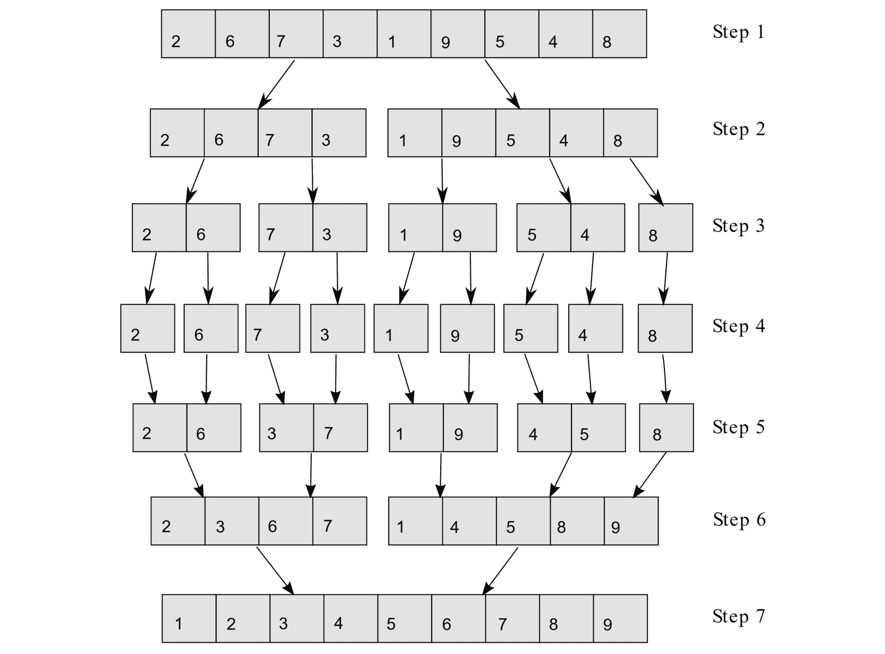

###### 图 4.9：归并排序

上图显示了使用归并排序对整数数组进行排序的示例。首先，算法将原始数组分成子数组，直到每个子数组只包含一个元素（*步骤 1*至*4*）。在随后的所有步骤中，算法将元素合并到更大的数组中，保持每个子数组中的元素按递增顺序排列。

### 练习 19：归并排序

在本练习中，我们将实现归并排序算法。步骤如下：

1.  导入以下头文件：

```cpp
#include <iostream>
#include <vector>
#include <chrono>
#include <random>
#include <algorithm>
#include <numeric>
```

1.  对两个向量进行合并操作的 C++代码如下。编写`merge()`函数如下：

```cpp
template <typename T>
std::vector<T> merge(std::vector<T>& arr1, std::vector<T>& arr2)
{
    std::vector<T> merged;
    auto iter1 = arr1.begin();
    auto iter2 = arr2.begin();
    while (iter1 != arr1.end() && iter2 != arr2.end())
    {
        if (*iter1 < *iter2)
        {
            merged.emplace_back(*iter1);
            iter1++;
        }
        else
        {
            merged.emplace_back(*iter2);
            iter2++;
        }
    }
    if (iter1 != arr1.end())
    {
        for (; iter1 != arr1.end(); iter1++)
            merged.emplace_back(*iter1);
    }
    else
    {
        for (; iter2 != arr2.end(); iter2++)
            merged.emplace_back(*iter2);
    }
    return merged;
}
```

模板化的`merge()`函数接受类型为`T`的两个向量的引用，并返回一个包含输入数组中元素的新向量，但按递增顺序排序。

1.  现在我们可以使用合并操作来编写递归的归并排序实现，如下所示：

```cpp
template <typename T>
std::vector<T> merge_sort(std::vector<T> arr)
{
    if (arr.size() > 1)
    {
        auto mid = size_t(arr.size() / 2);
        auto left_half = merge_sort<T>(std::vector<T>(arr.begin(), arr.begin() + mid));
        auto right_half = merge_sort<T>(std::vector<T>(arr.begin() + mid, arr.end()));
        return merge<T>(left_half, right_half);
    }

    return arr;
}
```

1.  添加以下函数以打印向量：

```cpp
template <typename T>
void print_vector(std::vector<T> arr)
{
    for (auto i : arr)
        std::cout << i << " ";

    std::cout << std::endl;
}
```

1.  以下函数允许我们测试归并排序算法的实现：

```cpp
void run_merge_sort_test()
{
    std::vector<int>    S1{ 45, 1, 3, 1, 2, 3, 45, 5, 1, 2, 44, 5, 7 };
    std::vector<float>  S2{ 45.6f, 1.0f, 3.8f, 1.01f, 2.2f, 3.9f, 45.3f, 5.5f, 1.0f, 2.0f, 44.0f, 5.0f, 7.0f };
    std::vector<double> S3{ 45.6, 1.0, 3.8, 1.01, 2.2, 3.9, 45.3, 5.5, 1.0, 2.0,  44.0, 5.0, 7.0 };
    std::vector<char>   C{ 'b','z','a','e','f','t','q','u','y' };
    std::cout << "Unsorted arrays:" << std::endl;
    print_vector<int>(S1);
    print_vector<float>(S2);
    print_vector<double>(S3);
    print_vector<char>(C);
    std::cout << std::endl;
    auto sorted_S1 = merge_sort<int>(S1);
    auto sorted_S2 = merge_sort<float>(S2);
    auto sorted_S3 = merge_sort<double>(S3);
    auto sorted_C = merge_sort<char>(C);
    std::cout << "Arrays sorted using merge sort:" 
                << std::endl;
    print_vector<int>(sorted_S1);
    print_vector<float>(sorted_S2);
    print_vector<double>(sorted_S3);
    print_vector<char>(sorted_C);
    std::cout << std::endl;
}
int main()
{
    run_merge_sort_test();
    return 0;
}
```

1.  编译并运行程序。输出应该如下所示：

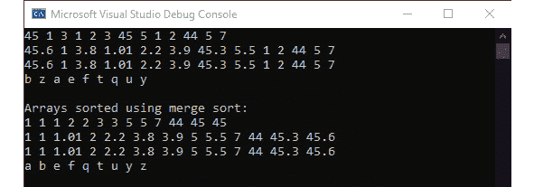

###### 图 4.10：归并排序

本练习中对归并排序的实现延续了我们不将算法实现与底层数据类型绑定并且仅依赖于容器公开的函数的主题。

### 快速排序

在归并排序的情况下，目标是对大量数据进行排序，而快速排序试图减少平均情况下的运行时间。快速排序中的基本思想与归并排序相同-将原始输入数组分成较小的子数组，对子数组进行排序，然后合并结果以获得排序后的数组。但是，快速排序使用的基本操作是**分区**而不是合并。

**分区操作的工作原理**

给定一个数组和数组中的**枢轴元素** *P*，**分区操作**执行两件事：

1.  它将原始数组分成两个子数组*L*和*R*，其中*L*包含给定数组中小于或等于*P*的所有元素，*R*包含给定数组中大于*P*的所有元素。

1.  它重新组织数组中的元素顺序*L*，*P*，*R*。

以下图表显示了对未排序数组应用的分区的结果，其中选择了第一个元素作为枢轴：

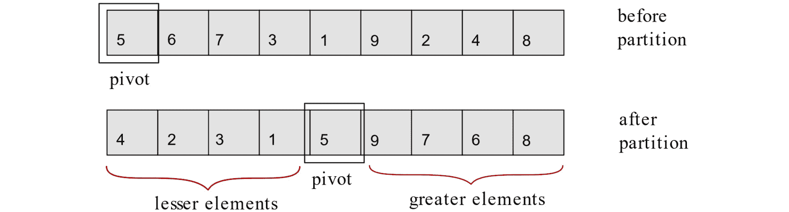

###### 图 4.11：选择一个枢轴并围绕它对向量进行分区

分区操作的一个有用属性是，在应用分区操作后，向量中枢轴*P*的新位置成为向量排序时*P*将具有的位置。例如，元素*5*在应用分区操作后出现在数组的第 5 个位置，这是元素*5*在数组按递增顺序排序时将出现的位置。

前面的属性也是快速排序算法的核心思想，其工作原理如下：

1.  如果输入数组*A*中有超过 1 个元素，则在*A*上应用分区操作。它将产生子数组*L*和*R*。

1.  使用*L*作为*步骤 1*的输入。

1.  使用*R*作为*步骤 1*的输入。

*步骤 2*和*3*是对由分区操作生成的数组进行递归调用，然后应用于原始输入数组。分区操作的简单递归应用导致元素按递增顺序排序。由于快速排序递归树可能会迅速变得很深，因此以下图表显示了在一个包含六个元素的小数组*{5, 6, 7, 3, 1, 9}*上应用快速排序的示例：

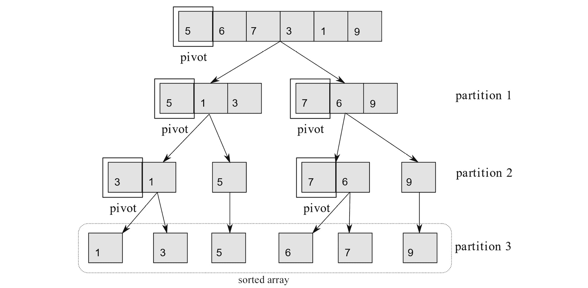

###### 图 4.12：快速排序算法的可视化

算法的每次迭代都显示了对先前步骤中使用突出显示的枢轴应用的分区操作的结果。应该注意，我们将数组的第一个元素作为枢轴的选择是任意的。数组的任何元素都可以被选择为枢轴，而不会影响快速排序算法的正确性。

### 练习 20：快速排序

在本练习中，我们将实现并测试快速排序的实现。让我们开始吧：

1.  导入以下标头：

```cpp
#include <iostream>
#include <vector>
#include <chrono>
#include <random>
#include <algorithm>
#include <numeric>
```

1.  分区操作的 C++代码如下。按照以下所示编写`partition()`函数：

```cpp
template <typename T>
auto partition(typename std::vector<T>::iterator begin,
            typename std::vector<T>::iterator last)
{
      // Create 3 iterators, 
      // one pointing to the pivot, one to the first element and 
      // one to the last element of the vector.
    auto pivot_val = *begin;
    auto left_iter = begin+1;
    auto right_iter = last;
    while (true)
    {
        // Starting from the first element of vector, find an element that is greater than pivot.
        while (*left_iter <= pivot_val && 
                   std::distance(left_iter, right_iter) > 0)
            left_iter++;
        // Starting from the end of vector moving to the beginning, find an element that is lesser than the pivot.
        while (*right_iter > pivot_val && 
                   std::distance(left_iter, right_iter) > 0)
            right_iter--;
        // If left and right iterators meet, there are no elements left to swap. Else, swap the elements pointed to by the left and right iterators
        if (left_iter == right_iter)
            break;
        else
            std::iter_swap(left_iter, right_iter);
    }
    if (pivot_val > *right_iter)
        std::iter_swap(begin, right_iter);

    return right_iter;
}
```

此处显示的实现仅接受底层容器对象上的迭代器，并返回指向数组中分区索引的另一个迭代器。这意味着向量的所有元素都大于右分区中的枢轴，而小于或等于枢轴的所有元素都在左分区中。

1.  快速排序算法递归使用分区操作，如下所示：

```cpp
template <typename T>
void quick_sort(typename std::vector<T>::iterator begin, 
        typename std::vector<T>::iterator last)
{
    // If there are more than 1 elements in the vector
    if (std::distance(begin, last) >= 1)
    {
        // Apply the partition operation
        auto partition_iter = partition<T>(begin, last);

        // Recursively sort the vectors created by the partition operation
        quick_sort<T>(begin, partition_iter-1);
        quick_sort<T>(partition_iter, last);
    }
}
```

1.  `print_vector()`用于将向量打印到控制台，并实现如下：

```cpp
template <typename T>
void print_vector(std::vector<T> arr)
{
    for (auto i : arr)
        std::cout << i << " ";

    std::cout << std::endl;
}
```

1.  根据*练习 19*，*归并排序*中的驱动程序代码进行调整：

```cpp
void run_quick_sort_test()
{
    std::vector<int> S1{ 45, 1, 3, 1, 2, 3, 45, 5, 1, 2, 44, 5, 7 };
    std::vector<float>  S2{ 45.6f, 1.0f, 3.8f, 1.01f, 2.2f, 3.9f, 45.3f, 5.5f, 1.0f, 2.0f, 44.0f, 5.0f, 7.0f };
    std::vector<double> S3{ 45.6, 1.0, 3.8, 1.01, 2.2, 3.9, 45.3, 5.5, 1.0, 2.0,  44.0, 5.0, 7.0 };
    std::vector<char> C{ 'b','z','a','e','f','t','q','u','y'};
    std::cout << "Unsorted arrays:" << std::endl;
    print_vector<int>(S1);
    print_vector<float>(S2);
    print_vector<double>(S3);
    print_vector<char>(C);
    std::cout << std::endl;
    quick_sort<int>(S1.begin(), S1.end() - 1);
    quick_sort<float>(S2.begin(), S2.end() - 1);
    quick_sort<double>(S3.begin(), S3.end() - 1);
    quick_sort<char>(C.begin(), C.end() - 1);
    std::cout << "Arrays sorted using quick sort:" << std::endl;
    print_vector<int>(S1);
    print_vector<float>(S2);
    print_vector<double>(S3);
    print_vector<char>(C);
    std::cout << std::endl;
}
```

1.  编写一个`main()`函数，调用`run_quick_sort_test()`：

```cpp
int main()
{
    run_quick_sort_test();
    return 0;
}
```

1.  您的最终输出应如下所示：

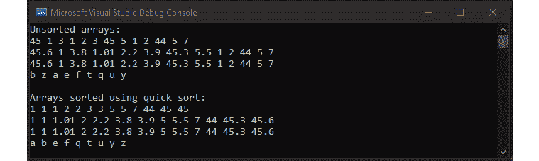

###### 图 4.13：快速排序排序

然而，快速排序的运行时间取决于我们选择的枢轴有多“好”。快速排序的最佳情况是在任何步骤中，枢轴都是当前数组的中位数元素；在这种情况下，快速排序能够将元素分成每一步相等大小的向量，因此，递归树的深度恰好是*log(n)*。如果不选择中位数作为枢轴，会导致分区大小不平衡，因此递归树更深，运行时间更长。

快速排序和归并排序的渐近复杂度如下所示：


###### 图 4.14：快速排序和归并排序的渐近复杂度

### 活动 9：部分排序

在最后两个练习中，我们实现了**总排序**算法，它按照递增（或递减）顺序对向量的所有元素进行排序。然而，在一些问题实例中，这可能是过度的。例如，想象一下，您得到一个包含地球上所有人的年龄的向量，并被要求找到人口最老的 10%的人的中位数年龄。

对这个问题的一个天真的解决方案是对年龄向量进行排序，从向量中提取最老的 10%人的年龄，然后找到提取向量的中位数。然而，这种解决方案是浪费的，因为它做的远远超出了计算解决方案所需的，也就是说，它对整个数组进行排序，最终只使用排序数组的 10%来计算所需的解决方案。

对这类问题的更好解决方案可以通过将归并排序和快速排序等总排序算法专门化为**部分排序算法**来得到。部分排序算法只对给定向量中的指定数量的元素进行排序，而将向量的其余部分保持未排序状态。

部分快速排序的描述如下：

1.  假设我们有一个向量*V*，我们需要创建一个有序的*k*元素的子向量。

1.  在*V*上应用分区操作，假设*V*的第一个元素作为枢轴（同样，这个选择完全是任意的）。分区操作的结果是两个向量，*L*和*R*，其中*L*包含所有小于枢轴的*V*的元素，*R*包含所有大于枢轴的元素。此外，枢轴的新位置是排序数组中枢轴的“正确”位置。

1.  使用*L*作为*步骤 1*的输入。

1.  如果*步骤 2*中枢轴的新位置小于*k*，则使用*R*作为*步骤 1*的输入。

您在本活动中的任务是实现部分快速排序算法，该算法使用随机生成的数组来测试算法的输出。大小为*100*且*k = 100*的向量的最终输出应如下所示：

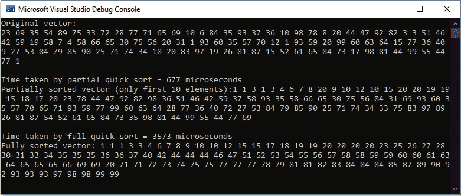

###### 图 4.15：活动 9 的示例输出

#### 注意

本活动的解决方案可在第 510 页找到。

### 线性时间选择

在前一节中，我们看了使用分治范式的简单算法示例，并介绍了分区和合并操作。到目前为止，我们对分治算法的看法局限于那些将每个中间步骤递归地分成两个子部分的算法。然而，有些问题在将每一步分成更多子部分时可以产生实质性的好处。在接下来的部分，我们将研究这样一个问题——线性时间选择。

想象一下，你负责为你的学校组织一场游行队伍。为了确保所有乐队成员看起来一致，学生的身高是相同的很重要。此外，要求所有年级的学生都参加。为了解决这些问题，你提出了以下解决方案——你将选择每个年级第 15 矮的学生参加游行。问题可以形式化如下：给定一个随机排序的元素集*S*，要求你找到*S*中第*i*小的元素。一个简单的解决方案可能是对输入进行排序，然后选择第*i*个元素。然而，这种解决方案的算法复杂度是*O(n log n)*。在本节中，我们将通过分治法解决这个问题，其复杂度为*O(n)*。

我们的解决方案依赖于正确使用分区操作。我们在上一小节介绍的分区操作接受一个向量和一个枢轴，然后将向量分成两部分，一部分包含所有小于枢轴的元素，另一部分包含所有大于枢轴的元素。最终算法的工作如下：

1.  假设我们有一个输入向量*V*，我们需要找到第*i*小的元素。

1.  将输入向量*V*分成向量*V**1*、*V**2*、*V**3*、*…*、*V**n/5*，每个向量包含五个元素（如果需要，最后一个向量可以少于五个元素）。

1.  接下来，我们对每个*V**i*进行排序。

1.  对于每个*V**i*，找到中位数*m**i*，并将所有中位数收集到一个集合*M*中，如下所示：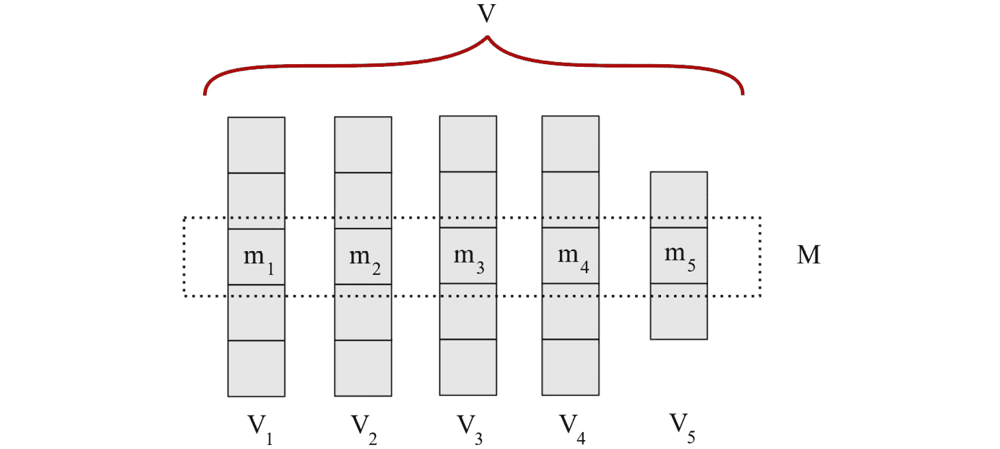

###### 图 4.16：找到每个子向量的中位数

1.  找到*M*的中位数元素*q*：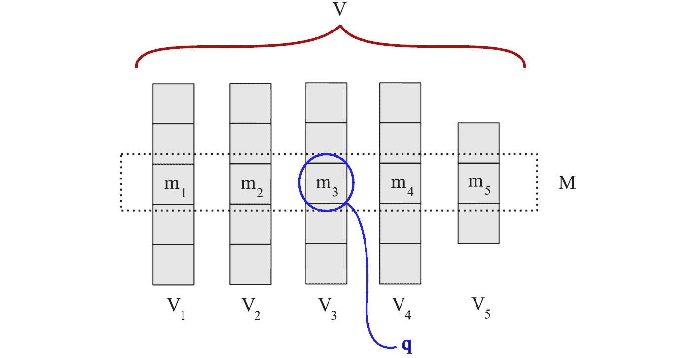

###### 图 4.17：找到一组中位数的中位数

1.  使用分区操作在*V*上使用*q*作为枢轴得到两个向量*L*和*R*：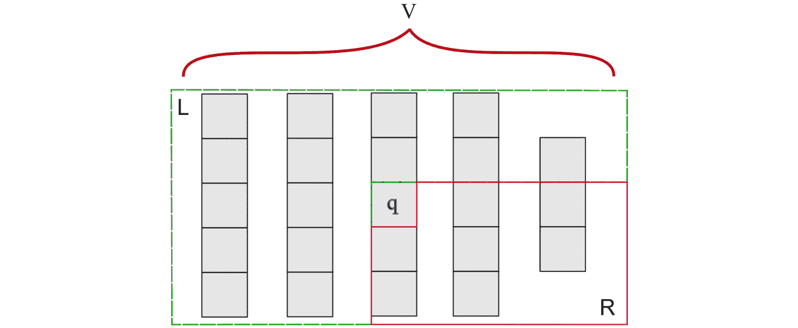

###### 图 4.18：对整个向量进行分区

1.  根据分区操作的定义，*L*包含所有小于*q*的元素，*R*包含所有大于*q*的元素。假设*L*有*(k-1)*个元素：

- 如果*i = k*，那么*q*就是*V*中的第*i*个元素。

- 如果*i < k*，则设置*V = L*并转到*步骤 1*。

- 如果*i > k*，则设置*V = R*并*i = i - k*，并转到*步骤 1*。

以下练习演示了在 C++中实现此算法。

### 练习 21：线性时间选择

在这个练习中，我们将实现线性时间选择算法。让我们开始吧：

1.  导入以下头文件：

```cpp
#include <iostream>
#include <vector>
#include <chrono>
#include <random>
#include <algorithm>
#include <numeric>
```

1.  编写如下所示的辅助函数：

```cpp
template<typename T>
auto find_median(typename std::vector<T>::iterator begin, typename std::vector<T>::iterator last)
{
    // Sort the array
    quick_sort<T>(begin, last);

    // Return the middle element, i.e. median
    return begin + (std::distance(begin, last)/2); 
}
```

1.  在*练习 20*中，*快速排序*，我们的分区函数假设给定向量中的第一个元素始终是要使用的枢轴。现在我们需要一个更一般的分区操作形式，可以与任何枢轴元素一起使用：

```cpp
template <typename T>
auto partition_using_given_pivot(
typename std::vector<T>::iterator begin, 
typename std::vector<T>::iterator end, 
typename std::vector<T>::iterator pivot)
{
        // Since the pivot is already given,
        // Create two iterators pointing to the first and last element of the vector respectively
    auto left_iter = begin;
    auto right_iter = end;
    while (true)
    {
        // Starting from the first element of vector, find an element that is greater than pivot.
        while (*left_iter < *pivot && left_iter != right_iter)
            left_iter++;
        // Starting from the end of vector moving to the beginning, find an element that is lesser than the pivot.
        while (*right_iter >= *pivot && 
                  left_iter != right_iter)
            right_iter--;
        // If left and right iterators meet, there are no elements left to swap. Else, swap the elements pointed to by the left and right iterators.
        if (left_iter == right_iter)
            break;
        else
            std::iter_swap(left_iter, right_iter);
    }
    if (*pivot > *right_iter)
        std::iter_swap(pivot, right_iter);
    return right_iter;
}
```

1.  使用以下代码来实现我们的线性时间搜索算法：

```cpp
// Finds ith smallest element in vector V
template<typename T>
typename std::vector<T>::iterator linear_time_select(
typename std::vector<T>::iterator begin,
typename std::vector<T>::iterator last, size_t i)
{
    auto size = std::distance(begin, last);
    if (size > 0 && i < size) {
        // Get the number of V_i groups of 5 elements each
        auto num_Vi = (size+4) / 5; 
        size_t j = 0;
        // For each V_i, find the median and store in vector M
        std::vector<T> M;
        for (; j < size/5; j++)
        {
            auto b = begin + (j * 5);
            auto l = begin + (j * 5) + 5;
            M.push_back(*find_median<T>(b, l));
        }
        if (j * 5 < size)
        {
            auto b = begin + (j * 5);
            auto l = begin + (j * 5) + (size % 5);
            M.push_back(*find_median<T>(b, l));
        }
        // Find the middle element ('q' as discussed)
           auto median_of_medians = (M.size() == 1)? M.begin():
      linear_time_select<T>(M.begin(), 
                            M.end()-1, M.size() / 2);

         // Apply the partition operation and find correct position 'k' of pivot 'q'.
        auto partition_iter = partition_using_given_pivot<T>(begin, last, median_of_medians);
        auto k = std::distance(begin, partition_iter)+1;
        if (i == k)
            return partition_iter;
        else if (i < k)
            return linear_time_select<T>(begin, partition_iter - 1, i);
        else if (i > k)
            return linear_time_select<T>(partition_iter + 1, last, i-k);
    }
    else {
        return begin;
    }
}
```

1.  添加合并排序实现，如下所示的代码。我们将使用排序算法来证明我们实现的正确性：

```cpp
template <typename T>
std::vector<T> merge(std::vector<T>& arr1, std::vector<T>& arr2)
{
    std::vector<T> merged;
    auto iter1 = arr1.begin();
    auto iter2 = arr2.begin();
    while (iter1 != arr1.end() && iter2 != arr2.end())
    {
        if (*iter1 < *iter2)
        {
            merged.emplace_back(*iter1);
            iter1++;
        }
        else
        {
            merged.emplace_back(*iter2);
            iter2++;
        }
    }
    if (iter1 != arr1.end())
    {
        for (; iter1 != arr1.end(); iter1++)
            merged.emplace_back(*iter1);
    }
    else
    {
        for (; iter2 != arr2.end(); iter2++)
            merged.emplace_back(*iter2);
    }
    return merged;
}
template <typename T>
std::vector<T> merge_sort(std::vector<T> arr)
{
    if (arr.size() > 1)
    {
        auto mid = size_t(arr.size() / 2);
        auto left_half = merge_sort(std::vector<T>(arr.begin(),
            arr.begin() + mid));
        auto right_half = merge_sort(std::vector<T>(arr.begin() + mid,
            arr.end()));
        return merge<T>(left_half, right_half);
    }
    return arr;
}
```

1.  最后，添加以下驱动程序和测试函数：

```cpp
void run_linear_select_test()
{
    std::vector<int> S1{ 45, 1, 3, 1, 2, 3, 45, 5, 1, 2, 44, 5, 7 };
    std::cout << "Original vector:" << std::endl;
    print_vector<int> (S1);
    std::cout << "Sorted vector:" << std::endl;
    print_vector<int>(merge_sort<int>(S1));
    std::cout << "3rd element: " 
                 << *linear_time_select<int>(S1.begin(), S1.end() - 1, 3) << std::endl;
    std::cout << "5th element: " 
                 << *linear_time_select<int>(S1.begin(), S1.end() - 1, 5) << std::endl;
    std::cout << "11th element: " 
                 << *linear_time_select<int>(S1.begin(), S1.end() - 1, 11) << std::endl;
}
int main()
{
    run_linear_select_test();
    return 0;
}
```

1.  编译并运行代码。你的最终输出应该如下所示：

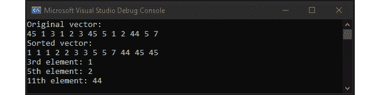

###### 图 4.19：使用线性时间选择找到第 3、第 5 和第 11 个元素

虽然对给定算法的详细理论分析超出了本章的范围，但算法的运行时间值得讨论。前面算法为什么有效的基本思想是，每次调用`linear_time_select()`时，都会应用分区操作，然后函数在其中一个分区上递归调用自身。在每个递归步骤中，问题的大小至少减少 30%。由于找到五个元素的中位数是一个常数时间操作，因此通过对前面算法得到的递归方程进行归纳，可以看到运行时间确实是*O(n)*。

#### 注意

线性时间选择算法的一个有趣特性是，当*V*被分成每个五个元素的子向量时，它的已知渐近复杂度（线性）被实现。找到导致更好渐近复杂度的子向量的恒定大小仍然是一个未解决的问题。

## C++标准库工具用于分治

在上一节中，我们手动实现了分治算法所需的函数。然而，C++标准库捆绑了一大批预定义函数，可以在编程时节省大量工作。以下表格提供了一个常用函数的便捷列表，这些函数在实现使用分治范例的算法时使用。我们简要描述了这些函数以供参考，但出于简洁起见，详细实现超出了本章的范围。请随意探索更多关于这些函数的信息；基于本章涵盖的概念，您应该能够理解它们。

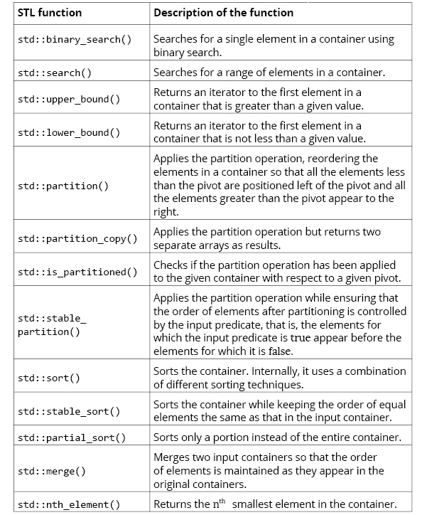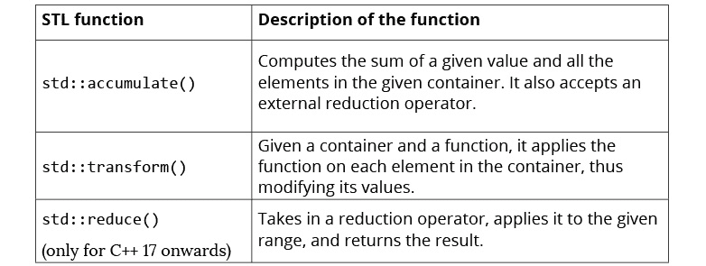

###### 图 4.20：一些用于算法的有用 STL 函数

## 在更高抽象级别上的分治-MapReduce

到目前为止，在本章中，我们已经将分治作为一种算法设计技术，并使用它来使用预定义的分治合并步骤集来解决我们的问题。在本节中，我们将稍微偏离一下，看看当我们需要将问题分解为较小部分并分别解决每个部分时，相同的分治原则如何在需要将软件扩展到单台计算机的计算能力之外并使用计算机集群来解决问题时特别有帮助。

原始**MapReduce**论文的开头如下：

“MapReduce 是一个用于处理和生成大型数据集的编程模型及其相关实现。用户指定一个映射函数，该函数处理键值对以生成一组中间键/值对，以及一个减少函数，该函数合并与相同中间键关联的所有中间值。”

#### 注意

您可以参考 Jeffrey Dean 和 Sanjay Ghemawat 于 2004 年发表的有关 MapReduce 模型的原始研究论文，链接在这里：[`static.googleusercontent.com/media/research.google.com/en/us/archive/mapreduce-osdi04.pdf`](https://static.googleusercontent.com/media/research.google.com/en/us/archive/mapreduce-osdi04.pdf)。

自从原始论文首次出现以来，MapReduce 编程模型的几个开源实现已经出现，其中最引人注目的是 Hadoop。Hadoop 为用户提供了一个编程工具包，用户可以编写映射和减少函数，这些函数可以应用于存储在名为 Hadoop 分布式文件系统（HDFS）中的数据。由于 HDFS 可以轻松扩展到通过网络连接的数千台机器的集群，因此 MapReduce 程序能够随着集群的规模而扩展。

然而，在这一部分，我们对 Hadoop 不感兴趣，而是对 MapReduce 作为一种编程范式以及它与手头的主题，即分治技术的关联感兴趣。我们将坚持使用一个使用多线程来模拟任务并行化的开源单机 MapReduce 实现，而不是 Hadoop。

### 映射和减少抽象

*map*和*reduce*这两个术语起源于诸如 Lisp 之类的函数式编程语言。

**映射**是一个操作，它接受一个容器*C*，并对*C*的每个元素应用给定的函数*f(x)*。下图显示了使用*f(x) = x**2*的示例：

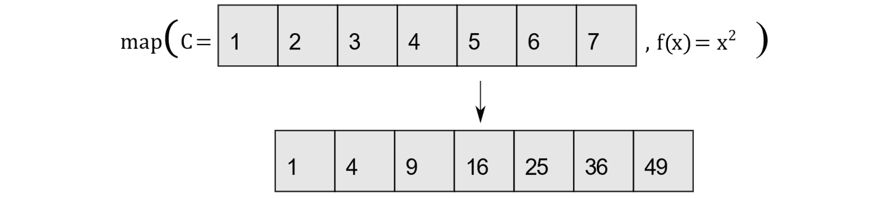

###### 图 4.21：映射容器的值

**减少**是一个操作，它通过将给定函数*f(acc, x)*应用于容器*C*的每个元素*x*来聚合值，并返回单个值。下图显示了这一点：

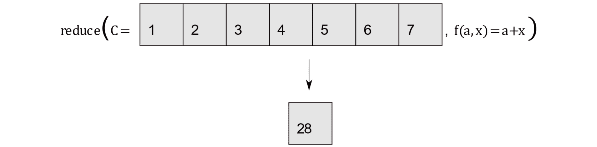

###### 图 4.22：减少容器的值

C++标准库包含映射和减少操作，即`std::transform()`和`std::accumulate()`，分别（`std::reduce()`也在 C++ 17 中可用）。

#### 注意

`std::accumulate()`是一种只使用加法函数的限制形式的减少操作。更新的编译器还提供了`std::reduce()`，它更通用并且可以并行化。

以下练习演示了使用 C++标准库实现 MapReduce。

### 练习 22：在 C++标准库中进行映射和减少

在这个练习中，我们将看到如何使用这些函数来进一步理解映射和减少操作。让我们开始吧：

1.  导入以下头文件：

```cpp
#include <iostream>
#include <vector>
#include <chrono>
#include <random>
#include <algorithm>
#include <numeric>
```

1.  首先创建一个具有随机元素的数组：

```cpp
void transform_test(size_t size)
{
    std::vector<int> S, Tr;
    std::random_device rd;
    std::mt19937 rand(rd());
    std::uniform_int_distribution<std::mt19937::result_type> uniform_dist(1, size);
    // Insert random elements
    for (auto i = 0; i < size; i++)
        S.push_back(uniform_dist(rand));
    std::cout << "Original array, S: ";
    for (auto i : S)
        std::cout << i << " ";
    std::cout << std::endl;
    std::transform(S.begin(), S.end(), std::back_inserter(Tr), 
                      [](int x) {return std::pow(x, 2.0); });
    std::cout << "Transformed array, Tr: ";
    for (auto i : Tr)
        std::cout << i << " ";
    std::cout << std::endl;
    // For_each
    std::for_each(S.begin(), S.end(), [](int &x) {x = std::pow(x, 2.0); });
    std::cout << "After applying for_each to S: ";
    for (auto i : S)
            std::cout << i << " ";
    std::cout << std::endl;
}
```

1.  `transform_test()`函数随机生成给定大小的向量，并将变换*f(x) = x**2*应用于向量。

#### 注意

```cpp
void reduce_test(size_t size)
{
    std::vector<int> S;
    std::random_device rd;
    std::mt19937 rand(rd());
    std::uniform_int_distribution<std::mt19937::result_type> uniform_dist(1, size);
    // Insert random elements
    for (auto i = 0; i < size; i++)
        S.push_back(uniform_dist(rand));
    std::cout << std::endl << "Reduce test== " << std::endl << "Original array, S: ";
    for (auto i : S)
        std::cout << i << " ";
    std::cout << std::endl;
    // Accumulate
    std::cout<<"std::accumulate() = " << std::accumulate(S.begin(), S.end(), 0, [](int acc, int x) {return acc+x; });
    std::cout << std::endl;
}
```

1.  添加以下驱动程序代码：

```cpp
int main() 
{
    transform_test(10);
    reduce_test(10);
    return 0;
}
```

1.  编译并运行代码。您的输出应该如下所示：

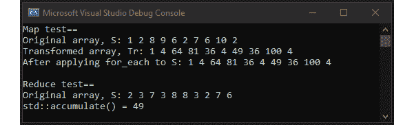

###### 图 4.23：映射和减少数组

### 整合部分-使用 MapReduce 框架

要使用 MapReduce 模型编写程序，我们必须能够将我们期望的计算表达为两个阶段的系列：**映射**（也称为**分区**），在这个阶段程序读取输入并创建一组中间*<key,value>*对，以及**减少**，在这个阶段中间*<key,value>*对以所需的方式组合以生成最终结果。以下图表说明了这个想法：

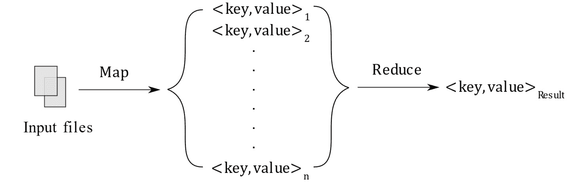

###### 图 4.24：通用 MapReduce 框架

像 Hadoop 这样的框架为 MapReduce 编程模型增加的主要价值在于，它们使映射和减少操作分布式和高度可扩展，从而使计算在一组机器上运行，并且总共所需的时间减少了。

我们将使用 MapReduce 框架来执行以下练习中的示例任务。

#### 注意

以下的练习和活动需要在您的系统上安装 Boost C++库。请按照以下链接获取 Boost 库：

Windows：[`www.boost.org/doc/libs/1_71_0/more/getting_started/windows.html`](https://www.boost.org/doc/libs/1_71_0/more/getting_started/windows.html)

Linux/macOS：[`www.boost.org/doc/libs/1_71_0/more/getting_started/unix-variants.html`](https://www.boost.org/doc/libs/1_71_0/more/getting_started/unix-variants.html)

### 练习 23：使用 MapReduce 检查质数

给定一个正整数*N*，我们希望找出*1*和*N*之间的质数。在这个练习中，我们将看到如何使用 MapReduce 编程模型来实现这一点，并使用多个线程解决这个问题。让我们开始吧：

1.  让我们首先包括所需的库，并定义一个使用质因数分解检查给定数字是否为质数的函数：

```cpp
#include <iostream>
#include "mapreduce.hpp"
namespace prime_calculator {
    bool const is_prime(long const number)
    {
        if (number > 2)
        {
            if (number % 2 == 0)
                return false;
            long const n = std::abs(number);
            long const sqrt_number = static_cast<long>(std::sqrt(
static_cast<double>(n)));
            for (long i = 3; i <= sqrt_number; i += 2)
            {
                if (n % i == 0)
                    return false;
            }
        }
        else if (number == 0 || number == 1)
            return false;
        return true;
    }
```

1.  以下类用于生成具有给定差值的一系列数字（也称为**步长**）：

```cpp
    template<typename MapTask>
    class number_source : mapreduce::detail::noncopyable
    {
    public:
        number_source(long first, long last, long step)
            : sequence_(0), first_(first), last_(last), step_(step)
        {
        }
        bool const setup_key(typename MapTask::key_type& key)
        {
            key = sequence_++;
            return (key * step_ <= last_);
        }
        bool const get_data(typename MapTask::key_type const& key, typename MapTask::value_type& value)
        {
            typename MapTask::value_type val;
            val.first = first_ + (key * step_);
            val.second = std::min(val.first + step_ - 1, last_);
            std::swap(val, value);
            return true;
        }
    private:
        long sequence_;
        long const step_;
        long const last_;
        long const first_;
    };
```

1.  以下函数定义了映射阶段要执行的步骤：

```cpp
    struct map_task : public mapreduce::map_task<long, std::pair<long, long> >
    {
        template<typename Runtime>
        void operator()(Runtime& runtime, key_type const& key, 
value_type const& value) const
        {
            for (key_type loop = value.first; 
                loop <= value.second; loop++)
            runtime.emit_intermediate(is_prime(loop), loop);
        }
    };
```

1.  现在，让我们实现减少阶段：

```cpp
    struct reduce_task : public mapreduce::reduce_task<bool, long>
    {
        template<typename Runtime, typename It>
        void operator()(Runtime& runtime, key_type const& key, It it, It ite) const
        {
            if (key)
                std::for_each(it, ite, std::bind(&Runtime::emit, 
&runtime, true, std::placeholders::_1));
        }
    };
    typedef
        mapreduce::job<
            prime_calculator::map_task,
            prime_calculator::reduce_task,
            mapreduce::null_combiner,
            prime_calculator::number_source<prime_calculator::map_task>> job;
} // namespace prime_calculator
```

前面的命名空间有三个函数：首先，它定义了一个检查给定数字是否为质数的函数；其次，它定义了一个在给定范围内生成一系列数字的函数；第三，它定义了映射和减少任务。如前所述，映射函数发出*< k, v >*对，其中*k*和*v*都是`long`类型，其中*k*如果*v*是质数，则为*1*，如果*v*不是质数，则为*0*。然后，减少函数充当过滤器，仅在*k = 1*时输出*< k, v >*对。

1.  接下来的驱动代码设置了相关参数并启动了 MapReduce 计算：

```cpp
int main()
{
    mapreduce::specification spec;
    int prime_limit = 1000;
    // Set number of threads to be used
    spec.map_tasks = std::max(1U, std::thread::hardware_concurrency());
    spec.reduce_tasks = std::max(1U, std::thread::hardware_concurrency());
    // Set the source of numbers in given range
    prime_calculator::job::datasource_type datasource(0, prime_limit, prime_limit / spec.reduce_tasks);
    std::cout << "\nCalculating Prime Numbers in the range 0 .. " << prime_limit << " ..." << std::endl;

std::cout << std::endl << "Using "
        << std::max(1U, std::thread::hardware_concurrency()) << " CPU cores";
    // Run mapreduce
    prime_calculator::job job(datasource, spec);
    mapreduce::results result;
    job.run<mapreduce::schedule_policy::cpu_parallel<prime_calculator::job> >(result);

    std::cout << "\nMapReduce finished in " 
<< result.job_runtime.count() << " with " 
<< std::distance(job.begin_results(), job.end_results()) 
<< " results" << std::endl;

// Print results
    for (auto it = job.begin_results(); it != job.end_results(); ++it)
        std::cout << it->second << " ";
    return 0;
}
```

驱动代码设置了 MapReduce 框架所需的参数，运行计算，从减少函数收集结果，最后输出结果。

1.  编译并运行上述代码。您的输出应如下所示：

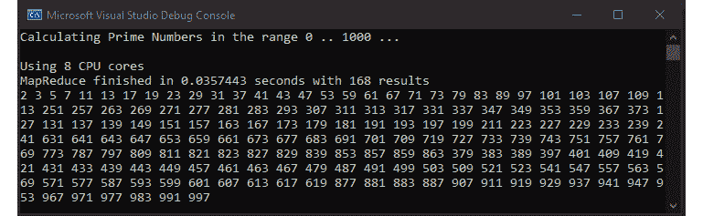

###### 图 4.25：使用 MapReduce 框架计算质数

使用 MapReduce 模型编程的主要好处是它产生了具有极大可扩展性的软件。我们在本练习中使用的 MapReduce 框架只在单台机器上使用多线程来实现并行化。但是，如果它能够支持分布式系统，我们在这里编写的相同代码可以在大型服务器集群上运行，使计算规模扩展到巨大。将前面的代码移植到 Hadoop 等系统是 Java 中的一个微不足道的练习，但超出了本书的范围。

### 活动 10：在 MapReduce 中实现 WordCount

在本章中，我们已经看到了分治技术背后的强大思想作为一种非常有用的算法设计技术，以及在处理大型和复杂计算时提供有用工具的能力。在这个活动中，我们将练习将一个大问题分解成小部分，解决小部分，并使用前一节中介绍的 MapReduce 模型合并后续结果。

我们的问题定义来自原始的 MapReduce 论文，如下所示：给定一组包含文本的文件，找到文件中出现的每个单词的频率。例如，假设您有两个文件，内容如下：

文件 1：

```cpp
The quick brown fox jumps over a rabbit
```

文件 2：

```cpp
The quick marathon runner won the race
```

考虑输入文件，我们的程序应该输出以下结果：

```cpp
The         2
quick       2
a           1
brown       1
fox         1
jumps       1
marathon    1
over        1
rabbit      1
race        1
runner      1
the         1
won         1
```

这类问题经常出现在索引工作负载中，也就是说，当您获得大量文本并需要对内容进行索引以便后续对文本的搜索可以更快地进行时。谷歌和必应等搜索引擎大量使用这样的索引。

在这个活动中，您需要实现单词计数问题的映射和减少阶段。由于这涉及到我们库特定的大部分代码，因此在`mapreduce_wordcount_skeleton.cpp`中为您提供了样板代码。

**活动指南：**

1.  阅读并理解`mapreduce_wordcount_skeleton.cpp`中给定的代码。您会注意到我们需要在头文件中导入 Boost 库。另一个需要注意的是，给定代码中的映射阶段创建了*< k, v >*对，其中*k*是一个字符串，*v*设置为*1*。例如，假设您的输入文件集包含一组随机组合的单词，*w**1*，*w**2*，*w**3*，…，*w**n*。如果是这样，映射阶段应该输出*k, 1*对，其中*k = {w**1**, w**2**, w**3**, …, w**n**}*，如下图所示：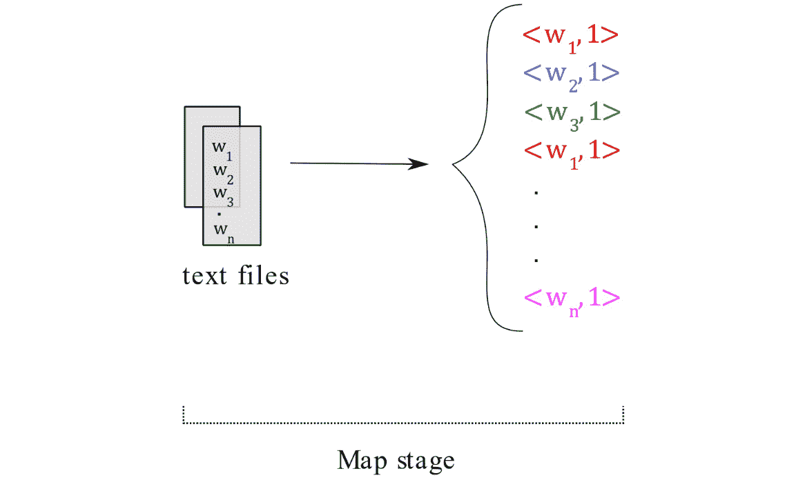

###### 图 4.26：映射阶段

1.  地图阶段的骨架代码如下：

```cpp
struct map_task : public mapreduce::map_task<
    std::string,                            // MapKey (filename)
    std::pair<char const*, std::uintmax_t>> // MapValue (memory mapped file               
                                               // contents)
{
template<typename Runtime>
    void operator()(Runtime& runtime, key_type const& key, 
                                         value_type& value) const
    {
        // Write your code here.
        // Use runtime.emit_intermediate() to emit <k,v> pairs
    }
};
```

1.  由于问题的地图阶段生成了*< k, 1 >*对，我们的程序的减少任务现在应该组合具有匹配*k*值的对，如下所示：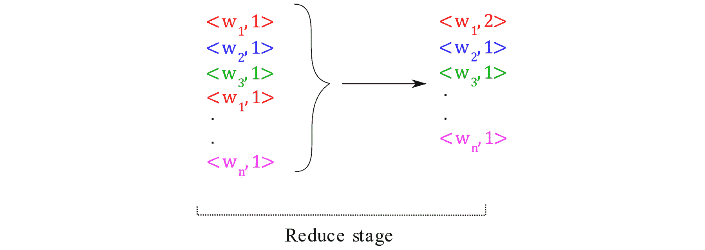

###### 图 4.27：减少阶段

1.  在给定的代码中，减少任务接受两个迭代器，这些迭代器可用于迭代具有相同键的元素，即，`it`和`ite`之间的所有元素都保证具有相同的键。然后，您的减少阶段应创建一个新的*< k, v >*对，其中*k*设置为输入对的键，*v*等于输入对的数量：

```cpp
template<typename KeyType>
struct reduce_task : public mapreduce::reduce_task<KeyType, unsigned>
{
    using typename mapreduce::reduce_task<KeyType, unsigned>::key_type;
    template<typename Runtime, typename It>
    void operator()(Runtime& runtime, key_type const& key, It it, It const ite) const
    {
        // Write your code here.
        // Use runtime.emit() to emit the resulting <k,v> pairs
    }
};
```

1.  您将在`testdata/`中获得一组测试数据。编译并运行您的代码。输出应如下所示：

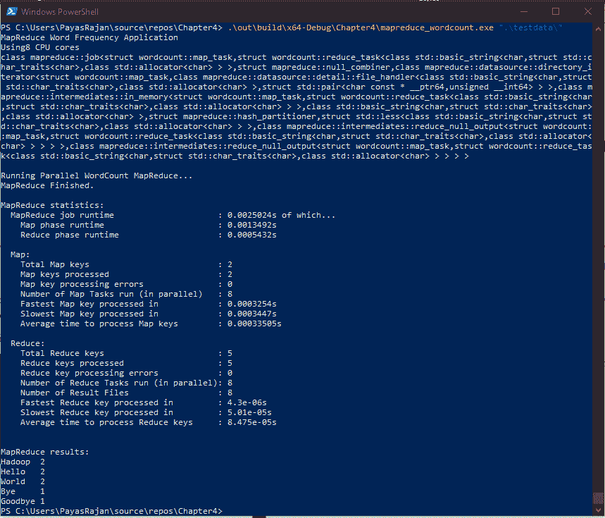

###### 图 4.28：获取给定输入文件中单词的频率

#### 注

此活动的解决方案可在第 514 页找到。

## 摘要

在本章中，我们以两种不同的方式讨论了分而治之：首先作为算法设计范式，然后在设计其他帮助我们扩展软件的工具中使用它。我们涵盖了一些标准的分而治之算法（归并排序和快速排序）。我们还看到了简单操作，如**分区**是不同问题的解决方案的基础，例如部分排序和线性时间选择。

在实践中实施这些算法时要牢记的一个重要思想是将保存数据的数据结构与算法本身的实现分开。使用 C++模板通常是实现这种分离的好方法。我们看到，C++标准库配备了一大套原语，可用于实现分而治之算法。

分而治之背后的基本思想的简单性使其成为解决问题的非常有用的工具，并允许创建诸如 MapReduce 之类的并行化框架。我们还看到了使用 MapReduce 编程模型在给定范围内找到质数的示例。

在下一章中，我们将介绍贪婪算法设计范式，这将导致诸如 Dijkstra 算法在图中找到最短路径的解决方案。
