# 第五章：5. 贪婪算法

## 学习目标

在本章结束时，您将能够：

+   描述算法设计的贪婪方法

+   识别问题的最优子结构和贪婪选择属性

+   实现贪婪算法，如分数背包和贪婪图着色

+   使用不相交集数据结构实现 Kruskal 的最小生成树算法

在本章中，我们将研究各种用于算法设计的“贪婪”方法，并看看它们如何应用于解决现实世界的问题。

## 介绍

在上一章中，我们讨论了分治算法设计技术，该技术通过将输入分解为较小的子问题，解决每个子问题，然后合并结果来解决给定问题。继续我们的算法设计范式主题，我们现在将看看我们的下一个主题：**贪婪方法**。

在每次迭代中，贪婪算法是选择“看似最佳”替代方案的算法。换句话说，问题的贪婪解决方案由一系列局部最优解组成，从而构成了给定问题的全局最优解。例如，以下屏幕截图显示了一辆汽车从华盛顿特区杜勒斯国际机场到东里弗代尔办公大楼的最短路径。自然地，所示路径也是任何不是起点和终点的路径上任意两点的最短路径：


###### 图 5.1：从机场到华盛顿特区办公室的路线（来源：project-osrm.org）

因此，我们可以推断整个最短路径 P 实际上是沿 P 的道路网络顶点之间的几条最短路径的连接。因此，如果我们被要求设计一个最短路径算法，一种可能的策略是：从起点顶点开始，绘制一条到尚未探索的最近顶点的路径，然后重复直到到达目标顶点。恭喜 - 您刚刚使用 Dijkstra 算法解决了最短路径问题，这也是商业软件如 Google Maps 和 Bing Maps 使用的算法！

可以预料到，贪婪算法采用的简单方法使它们只适用于算法问题的一小部分。然而，贪婪方法的简单性通常使它成为“第一攻击”的绝佳工具，通过它我们可以了解底层问题的属性和行为，然后可以使用其他更复杂的方法来解决问题。

在本章中，我们将研究给定问题适合贪婪解决方案的条件 - 最优子结构和贪婪选择属性。我们将看到，当问题可以证明具有这两个属性时，贪婪解决方案保证产生正确的结果。我们还将看到一些实际中使用贪婪解决方案的示例，最后我们将讨论最小生成树问题，这在电信和供水网络、电网和电路设计中常见。但首先，让我们从一些可以使用贪婪算法解决的更简单的问题开始。

## 基本贪婪算法

在本节中，我们将学习可以使用贪婪方法解决的两个标准问题：**最短作业优先调度**和**分数背包**问题。

### 最短作业优先调度

假设你站在银行的队列中。今天很忙，队列中有*N*个人，但银行只开了一个柜台（今天也是个糟糕的日子！）。假设一个人*p**i*在柜台上被服务需要*a**i*的时间。由于队列中的人都很理性，每个人都同意重新排队，以使得队列中每个人的*平均等待时间*最小化。你的任务是找到一种重新排队的方法。你会如何解决这个问题？

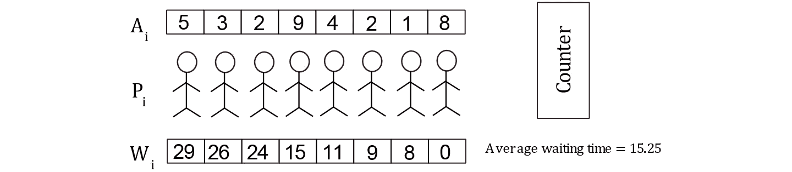

###### 图 5.2：原始队列

为了进一步分解这个问题，让我们看一个例子。前面的图示显示了原始队列的一个例子，其中*A**i*表示服务时间，*W**i*表示第*i*个人的等待时间。离柜台最近的人可以立即开始被服务，所以他们的等待时间为 0。队列中第二个人必须等到第一个人完成，所以他们必须等待*a**1* *= 8*单位时间才能被服务。以类似的方式继续，第*i*个人的等待时间等于队列中他们之前的*i – 1*个人的服务时间之和。

解决这个问题的线索如下：由于我们希望最小化*平均等待时间*，我们必须找到一种方法来尽可能减少最大可能的一组人的等待时间。减少所有人的等待时间的一种方法是完成时间最短的工作。通过对队列中的所有人重复这个想法，我们的解决方案导致了以下重新排序后的队列：

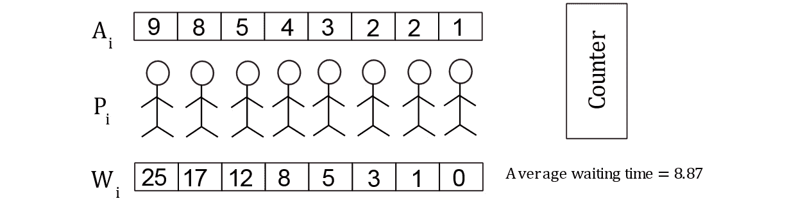

###### 图 5.3：重新排序后的队列，平均等待时间最短

注意，我们重新排序后的队列的平均等待时间为 8.87 单位，而原始排序的平均等待时间为 15.25 单位，这是一个大约 2 倍的改进。

### 练习 24：最短作业优先调度

在这个练习中，我们将通过一个类似于前面图示的示例来实现最短作业优先调度解决方案。我们将考虑队列中的 10 个人，并尝试最小化所有人的平均等待时间。让我们开始吧：

1.  首先添加所需的头文件并创建用于计算等待时间和输入/输出的函数：

```cpp
#include <iostream>
#include <algorithm>
#include <vector>
#include <random>
#include <numeric>
// Given a set of service times, computes the service times for all users
template<typename T>
auto compute_waiting_times(std::vector<T>& service_times)
{
    std::vector<T> W(service_times.size());
    W[0] = 0;

    for (auto i = 1; i < service_times.size(); i++)
        W[i] = W[i - 1] + service_times[i - 1];
    return W;
}
// Generic function to print a vector
template<typename T>
void print_vector(std::vector<T>& V)
{
    for (auto& i : V)
        std::cout << i << " ";
    std::cout << std::endl;
}
template<typename T>
void compute_and_print_waiting_times(std::vector<T>& service_times)
{
    auto waiting_times = compute_waiting_times<int>(service_times);

    std::cout << "Service times: " << std::endl;
    print_vector<T>(service_times);
    std::cout << "Waiting times: " << std::endl;
    print_vector<T>(waiting_times);
    std::cout << "Average waiting time = "
        << std::accumulate(waiting_times.begin(),            waiting_times.end(), 0.0) /
        waiting_times.size();
    std::cout<< std::endl;
}
```

1.  添加主求解器和驱动代码，如下所示：

```cpp
void shortest_job_first(size_t size)
{
    std::vector<int> service_times;
    std::random_device rd;
    std::mt19937 rand(rd());
    std::uniform_int_distribution<std::mt19937::result_type> uniform_dist(1, size);
    // Insert random elements as service times
    service_times.reserve(size);
    for (auto i = 0; i < size; i++)
        service_times.push_back(uniform_dist(rand));
    compute_and_print_waiting_times<int>(service_times);
    // Reorder the elements in the queue
    std::sort(service_times.begin(), service_times.end());
    compute_and_print_waiting_times<int>(service_times);
}
int main(int argc, char* argv[])
{
    shortest_job_first(10);
}
```

1.  编译并运行代码！你的输出应该如下所示：


###### 图 5.4：调度最短作业的程序输出

## 背包问题

在本节中，我们将讨论标准的**背包问题**，也称为 0-1 背包问题，它被认为是 NP 完全的，因此不允许我们有任何多项式时间的解决方案。然后，我们将把讨论转向背包问题的一个版本，称为**分数背包问题**，它可以使用贪婪方法来解决。本节的重点是演示问题定义方式的细微差别如何导致解决方案策略的巨大变化。

### 背包问题

假设你有一组物体，*O = {O**1**, O**2**, …, O**n**}*, 每个物体都有一个特定的重量 *W**i* 和价值 *V**i*。你还有一个只能携带总重量为 T 单位的袋子（或者背包）。现在，假设你的任务是找出一组物体放入你的袋子中，使得总重量小于或等于 T，并且物体的总价值尽可能最大。

如果想象一个旅行商人，他在所有交易中都能获得固定百分比的利润，就可以理解这个问题的现实世界例子。他想携带最大价值的商品以最大化利润，但他的车辆（或背包）最多只能承载 T 单位的重量。商人知道每个物品的确切重量和价值。他应该携带哪组物品，以便携带的物品的总价值是可能的最大值？

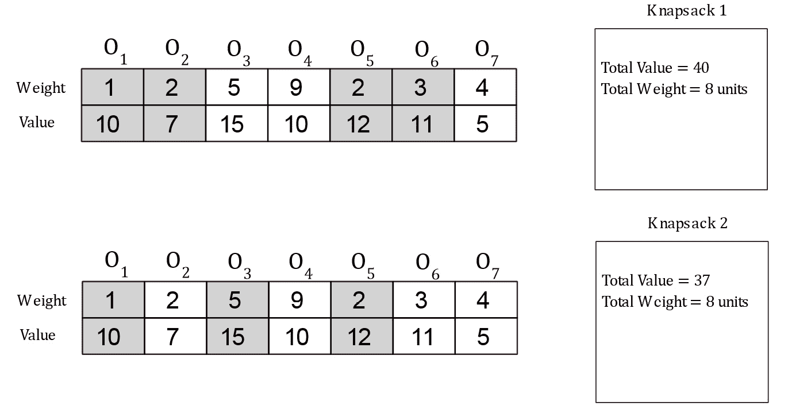

###### 图 5.5：背包问题

前面图中呈现的问题是著名的背包问题，已被证明是 NP 完全的。换句话说，目前没有已知的多项式时间解决方案。因此，我们必须查看所有可能的物品组合，以找到价值最大且总重量仅为*T*单位的组合。前面的图表显示了填充容量为 8 单位的背包的两种方式。灰色显示的物品是被选择放入背包的物品。我们可以看到第一组物品的总价值为 40，第二组物品的总价值为 37，而在两种情况下的总重量均为 8 单位。因此，第二组物品比第一组更好。为了找到最佳的物品组合，我们必须列出所有可能的组合，并选择具有最大价值的组合。

### 分数背包问题

现在，我们将对前面小节中给出的背包问题进行一点改动：假设我们现在可以将每个物品分成我们需要的任意部分，然后我们可以选择要在背包中保留每个物品的什么比例。

就现实世界的类比而言，假设我们之前的类比中的交易商正在交易石油、谷物和面粉等物品。交易商可以取任何较小的重量。

与标准背包问题的 NP 完全性相反，分数背包问题有一个简单的解决方案：根据它们的价值/重量比对元素进行排序，并“贪婪地”选择尽可能多的具有最大比率的物品。下图显示了在背包容量设置为 8 单位时给定一组物品的最佳选择。请注意，所选的物品是具有最高价值/重量比的物品。

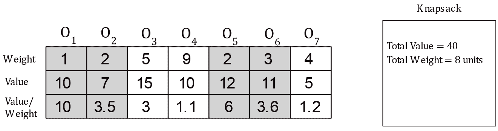

###### 图 5.6：分数背包问题

我们将在接下来的练习中实现这个解决方案。

### 练习 25：分数背包问题

在这个练习中，我们将考虑 10 个物品，并尝试最大化我们的背包中的价值，背包最大承重为 25 单位。让我们开始吧：

1.  首先，我们将添加所需的头文件并定义一个`Object`结构，它将代表我们解决方案中的一个物品：

```cpp
#include <iostream>
#include <algorithm>
#include <vector>
#include <random>
#include <numeric>
template <typename weight_type, 
    typename value_type, 
    typename fractional_type>
struct Object
{
    using Wtype = weight_type;
    using Vtype = value_type;
    using Ftype = fractional_type;
    Wtype weight;
    Vtype value;
    Ftype value_per_unit_weight;
    // NOTE: The following overloads are to be used for std::sort() and I/O
    inline bool operator< (const Object<Wtype,Vtype,Ftype>& obj) const
    {
        // An object is better or worse than another object only on the
        // basis of its value per unit weight
        return this->value_per_unit_weight < obj.value_per_unit_weight;
    }
    inline bool operator== (const Object<Wtype, Vtype, Ftype>& obj) const
    {
        // An object is equivalent to another object only if 
        // its value per unit weight is equal
        return this->value_per_unit_weight == obj.value_per_unit_weight;
    }
    // Overloads the << operator so an object can be written directly to a stream
    // e.g. Can be used as std::cout << obj << std::endl;
    template <typename Wtype,
        typename Vtype,
        typename Ftype>
    friend std::ostream& operator<<(std::ostream& os, 
                         const Object<Wtype,Vtype,Ftype>& obj);
};
template <typename Wtype,
    typename Vtype,
    typename Ftype>
std::ostream& operator<<(std::ostream& os, const Object<Wtype,Vtype,Ftype>& obj)
{
    os << "Value: "<<obj.value 
    << "\t Weight: " << obj.weight
        <<"\t Value/Unit Weight: " << obj.value_per_unit_weight;
    return os;
}
```

请注意，我们已经重载了`<`和`==`运算符，因为我们将在`objects`的向量上使用`std::sort()`。

1.  分数背包求解器的代码如下：

```cpp
template<typename weight_type, 
    typename value_type, 
    typename fractional_type>
auto fill_knapsack(std::vector<Object<weight_type, value_type,fractional_type>>& objects, 
                    weight_type knapsack_capacity)
{

    std::vector<Object<weight_type, value_type, fractional_type>> knapsack_contents;
    knapsack_contents.reserve(objects.size());

    // Sort objects in the decreasing order
    std::sort(objects.begin(), objects.end());
    std::reverse(objects.begin(), objects.end());
    // Add the 'best' objects to the knapsack
    auto current_object = objects.begin();
    weight_type current_total_weight = 0;
    while (current_total_weight <= knapsack_capacity && 
current_object != objects.end())
    {
        knapsack_contents.push_back(*current_object);

        current_total_weight += current_object->weight;
        current_object++;
    }
    // Since the last object overflows the knapsack, adjust weight
    auto weight_of_last_obj_to_remove = current_total_weight - knapsack_capacity;
    knapsack_contents.back().weight -= weight_of_last_obj_to_remove;
    knapsack_contents.back().value -= knapsack_contents.back().value_per_unit_weight * 
                        weight_of_last_obj_to_remove;
    return knapsack_contents;
}
```

前面的函数按照价值/重量比的递减顺序对物品进行排序，然后选择所有可以放入背包的物品的分数，直到背包装满为止。

1.  最后，为了测试我们的实现，添加以下测试和驱动代码：

```cpp
void test_fractional_knapsack(unsigned num_objects, unsigned knapsack_capacity)
{
    using weight_type = unsigned;
    using value_type = double;
    using fractional_type = double;
    // Initialize the Random Number Generator
    std::random_device rd;
    std::mt19937 rand(rd());
    std::uniform_int_distribution<std::mt19937::result_type> 
uniform_dist(1, num_objects);

    // Create a vector of objects
    std::vector<Object<weight_type, value_type, fractional_type>> objects;
    objects.reserve(num_objects);
    for (auto i = 0; i < num_objects; i++)
    {
        // Every object is initialized with a random weight and value
        auto weight = uniform_dist(rand);
        auto value = uniform_dist(rand);
        auto obj = Object<weight_type, value_type, fractional_type> { 
            static_cast<weight_type>(weight), 
            static_cast<value_type>(value), 
            static_cast<fractional_type>(value) / weight 
        };
        objects.push_back(obj);
    }
    // Display the set of objects
    std::cout << "Objects available: " << std::endl;
    for (auto& o : objects)
        std::cout << o << std::endl;
    std::cout << std::endl;
    // Arbitrarily assuming that the total knapsack capacity is 25 units
    auto solution = fill_knapsack(objects, knapsack_capacity);
    // Display items selected to be in the knapsack
    std::cout << "Objects selected to be in the knapsack (max capacity = "
        << knapsack_capacity<< "):" << std::endl;
    for (auto& o : solution)
        std::cout << o << std::endl;
    std::cout << std::endl;
}
int main(int argc, char* argv[])
{
    test_fractional_knapsack(10, 25);
}
```

前面的函数创建物品并使用 STL 随机数生成器中的随机数据对其进行初始化。接下来，它调用我们的分数背包求解器的实现，然后显示结果。

1.  编译并运行此代码！您的输出应如下所示：

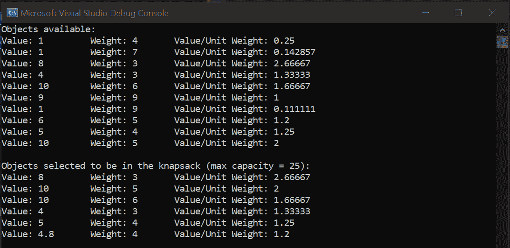

###### 图 5.7：练习 25 的输出

注意求解器如何取了一个分数，也就是说，只取了最后一个物体的 5 个单位中的 4 个单位。这是一个例子，说明在被选择放入背包之前，物体可以被分割，这使得分数背包问题与 0-1（标准）背包问题有所不同。

### 活动 11：区间调度问题

想象一下，你的待办事项清单上有一系列任务（洗碗、去超市买食品、做一个世界统治的秘密项目等类似的琐事）。每个任务都有一个 ID，并且只能在特定的开始和结束时间之间完成。假设你希望完成尽可能多的任务。你应该在哪个子集上，以及以什么顺序，来完成你的任务以实现你的目标？假设你一次只能完成一个任务。

例如，考虑下图中显示的问题实例。我们有四个不同的任务，可能花费我们的时间来完成（矩形框表示任务可以完成的时间间隔）：

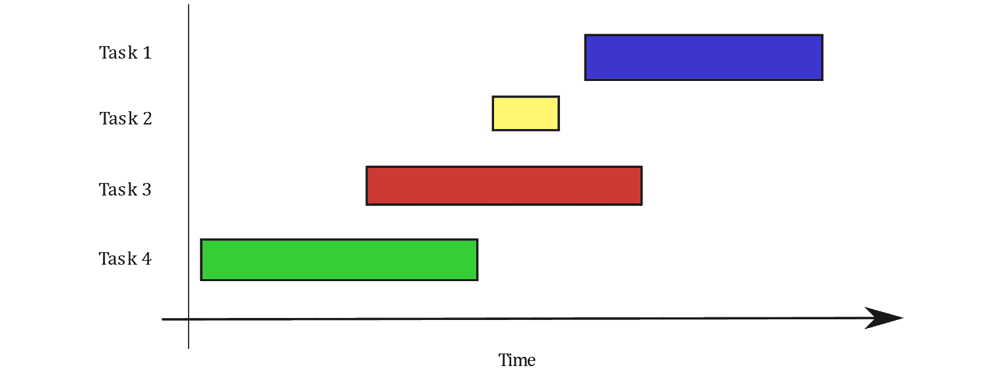

###### 图 5.8：给定任务安排

下图显示了任务的最佳调度，最大化完成的任务总数：

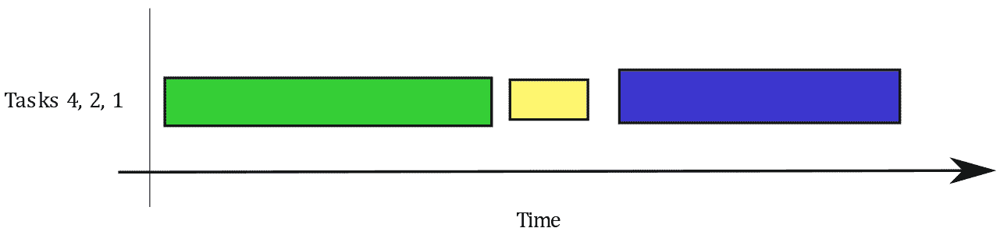

###### 图 5.9：任务的最佳选择

注意，不完成任务 3 使我们能够完成任务 1 和 2，增加了完成任务的总数。在这个活动中，你需要实现这个贪婪的区间调度解决方案。

解决这个活动的高层步骤如下：

1.  假设每个任务都有一个开始时间、一个结束时间和一个 ID。创建一个描述任务的结构体。我们将用这个结构体的不同实例表示不同的任务。

1.  实现一个函数，创建一个包含 N 个任务的`std::list`，将它们的 ID 从 1 到 N 依次设置，并使用随机数生成器的值作为开始和结束时间。

1.  按照以下方式实现调度函数：

a. 按照它们的结束时间递增的顺序对任务列表进行排序。

b. 贪婪地选择完成最早结束的任务。

c. 删除所有与当前选择的任务重叠的任务（所有在当前任务结束之前开始的任务）。

d. 如果任务列表中仍有任务，转到*步骤 b*。否则，返回所选的任务向量。

你的最终输出应该类似于以下内容：

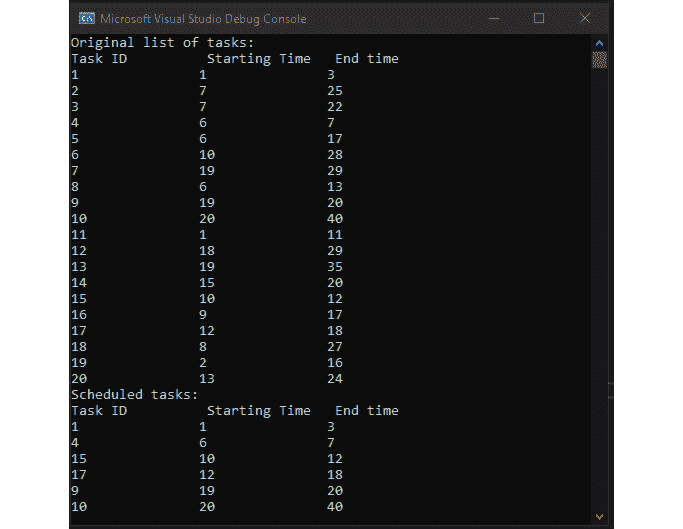

###### 图 5.10：活动 11 的预期输出

#### 注意

这个活动的解决方案可以在第 516 页找到。

### 贪婪算法的要求

在前一节中，我们看了一些问题的例子，贪婪方法给出了最优解。然而，只有当一个问题具有两个属性时，贪婪方法才能给出最优解：**最优子结构**属性和**贪婪选择**属性。在本节中，我们将尝试理解这些属性，并向你展示如何确定一个问题是否具有这些属性。

**最优子结构**：当给定问题 P 的最优解由其子问题的最优解组成时，P 被认为具有最优子结构。

**贪婪选择**：当给定问题 P 的最优解可以通过在每次迭代中选择局部最优解来达到时，P 被认为具有贪婪选择属性。

为了理解最优子结构和贪婪选择属性，我们将实现 Kruskal 的最小生成树算法。

### 最小生成树（MST）问题

最小生成树问题可以陈述如下：

“给定一个图 G = <V，E>，其中 V 是顶点集，E 是边集，每个边关联一个边权重，找到一棵树 T，它跨越 V 中的所有顶点，并且具有最小的总权重。”

MST 问题的一个现实应用是设计供水和交通网络，因为设计者通常希望最小化使用的管道总长度或创建的道路总长度，并确保服务能够到达所有指定的用户。让我们尝试通过以下示例来解决这个问题。

假设你被给定地图上 12 个村庄的位置，并被要求找到需要修建的道路的最小总长度，以便所有村庄彼此可达，并且道路不形成循环。假设每条道路都可以双向行驶。这个问题中村庄的自然表示是使用图数据结构。假设以下图 G 的顶点代表 12 个给定村庄的位置，图 G 的边代表顶点之间的距离：

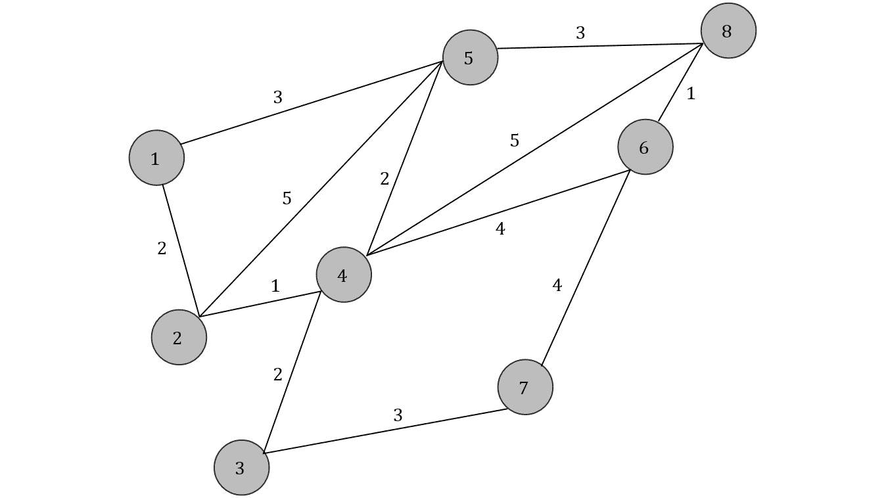

###### 图 5.11：代表村庄和它们之间距离的图 G

构建最小生成树 T 的一个简单贪婪算法可能如下：

1.  将图 G 的所有边添加到最小堆 H 中。

1.  从 H 中弹出一条边 e。显然，e 在 H 中的所有边中具有最小成本。

1.  如果 e 的两个顶点已经在 T 中，这意味着添加 e 会在 T 中创建一个循环。因此，丢弃 e 并转到步骤 2。否则，继续下一步。

1.  在最小生成树 T 中插入 e。

让我们花点时间思考为什么这个策略有效。在步骤 2 和 3 的循环的每次迭代中，我们选择具有最低成本的边，并检查它是否向我们的解决方案中添加了任何顶点。这存储在最小生成树 T 中。如果是，我们将边添加到 T；否则，我们丢弃该边并选择另一条具有最小值的边。我们的算法是贪婪的，因为在每次迭代中，它选择要添加到解决方案中的最小边权重。上述算法是在 1956 年发明的，称为**Kruskal 的最小生成树算法**。将该算法应用于图 5.11 中显示的图将得到以下结果：

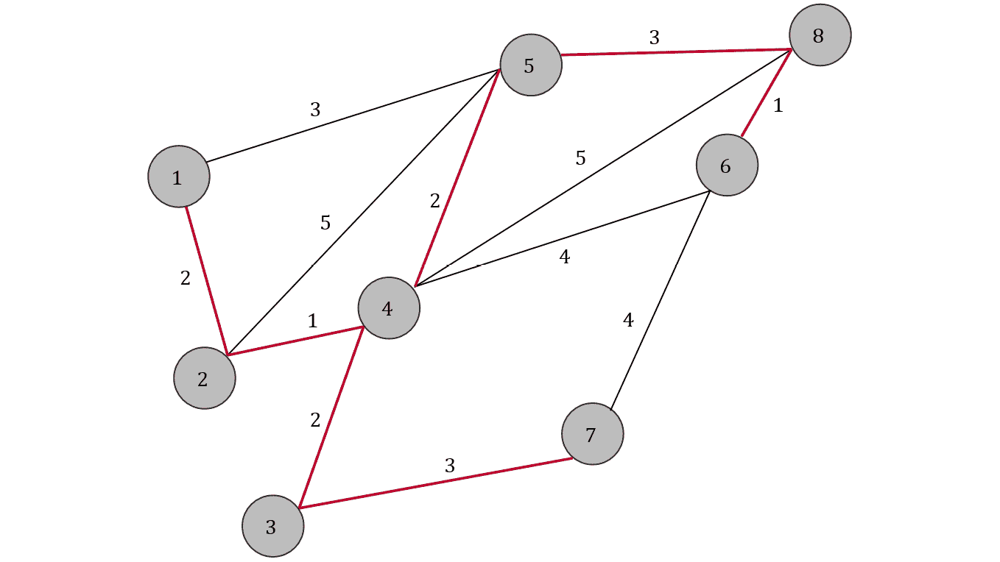

###### 图 5.12：显示最小生成树 T 的图 G（带有红色边）

最小生成树 T 中边的总权重为（2×1）+（3×2）+（2×3）= 14 个单位。因此，我们的问题的答案是至少需要修建 12 个单位的道路。

我们如何知道我们的算法确实是正确的？我们需要回到最优子结构和贪婪选择的定义，并展示 MST 问题具有这两个属性。虽然对这些属性的严格数学证明超出了本书的范围，但以下是证明背后的直观思想：

**最优子结构**：我们将通过反证法来证明这一点。假设 MST 问题没有最优子结构；也就是说，最小生成树不是由一组较小的最小生成树组成的：

1.  假设我们得到了图 G 的顶点上的最小生成树 T。让我们从 T 中移除任意边 e。移除 e 会将 T 分解成较小的树 T1 和 T2。

1.  由于我们假设 MST 问题没有最优子结构，因此必须存在一个跨越 T1 顶点的总权重更小的生成树。将这个生成树和边 e 和 T2 添加到一起。这个新树将是 T'。

1.  现在，由于 T'的总权重小于 T 的总权重，这与我们最初的假设相矛盾，即 T 是 MST。因此，MST 问题必须具有最优子结构性质。

**贪婪选择**：如果 MST 问题具有贪婪选择属性，则对于顶点*v*，连接*v*到图*G*的其余部分的最小权重边应始终是最小生成树*T*的一部分。我们可以通过反证法证明这个假设，如下所示：

1.  假设边*(u, v)*是连接*v*到*G*中任何其他顶点的最小权重边。假设*(u, v)*不是*T*的一部分。

1.  如果*(u, v)*不是*T*的一部分，则*T*必须由连接*v*到*G*的其他某条边组成。让这条边为*(x, v)*。由于*(u, v)*是最小权重边，根据定义，*(x, v)*的权重大于*(u, v)*的权重。

1.  如果在*T*中用*(u, v)*替换*(x, v)*，则可以获得总权重小于*T*的树。这与我们假设的*T*是最小生成树相矛盾。因此，MST 问题必须具有贪婪选择属性。

#### 注意

正如我们之前提到的，我们也可以采用严格的数学方法来证明 MST 问题具有最优子结构属性，并适用于贪婪选择属性。您可以在这里找到它：[`ocw.mit.edu/courses/electrical-engineering-and-computer-science/6-046j-design-and-analysis-of-algorithms-spring-2015/lecture-notes/MIT6_046JS15_lec12.pdf`](https://ocw.mit.edu/courses/electrical-engineering-and-computer-science/6-046j-design-and-analysis-of-algorithms-spring-2015/lecture-notes/MIT6_046JS15_lec12.pdf)。

让我们考虑如何实现 Kruskal 算法。我们在*第二章*“树、堆和图”中介绍了图和堆数据结构，因此我们知道如何实现步骤 1 和 2。第 3 步有点更复杂。我们需要一个数据结构来存储图的边，并告诉我们是否添加新边会与已存储的任何可能的边组合创建循环。这个问题可以使用不相交集数据结构来解决。

### 不相交集（或并查集）数据结构

不相交集数据结构由一个元素的森林（一组树）组成，其中每个元素由一个数字 ID 表示，具有“等级”，并包含指向其父元素的指针。当数据结构初始化时，它从等级为 0 的*N*个独立元素开始，每个元素都是树的一部分，该树只包含元素本身。数据结构支持另外两种操作：

+   对树进行`find`操作会返回该树的根元素

+   对两棵树进行`union`操作会将较小的树合并为较大的树，树的大小存储为其根的等级。

更准确地说，不相交集数据结构支持以下操作：

+   `Make-Set`：这将使用 N 个元素初始化数据结构，将每个元素的等级设置为 0，并将父指针设置为自身。下图显示了一个用五个元素初始化的不相交集*DS*的示例。圆圈内的数字显示元素 ID，括号中的数字显示等级，箭头表示指向根元素的指针：

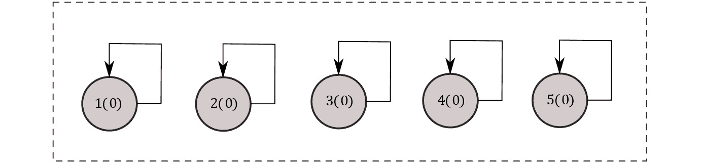

###### 图 5.13：用五个元素初始化不相交集

在这个阶段，数据结构由五棵树组成，每棵树都包含一个元素。

+   `Find`：从给定元素*x*开始，`find`操作遵循元素的父指针，直到到达树的根。根元素的父元素是根本身。在前面的示例中，每个元素都是树的根，因此此操作将返回树中的孤立元素。

+   `Union`：给定两个元素*x*和*y*，`union`操作找到*x*和*y*的根。如果两个根相同，这意味着*x*和*y*属于同一棵树。因此，它什么也不做。否则，它将具有较低秩的根设置为具有较高秩的根的父节点。下图显示了在*DS*上实现`Union(1,2)`和`Union(4,5)`操作的结果：

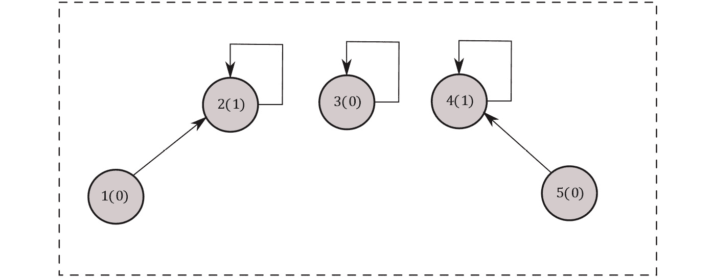

###### 图 5.14：合并 1,2 和 4,5

随着后续的并操作的应用，更多的树合并成了更少（但更大）的树。下图显示了在应用`Union(2, 3)`后*DS*中的树：

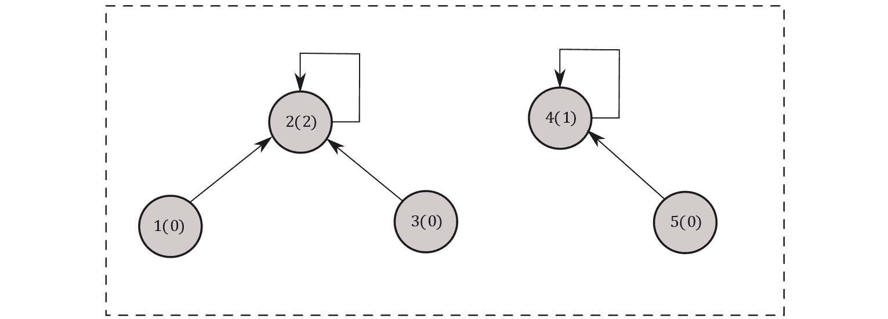

###### 图 5.15：合并 2,3

在应用`Union(2, 4)`后，*DS*中的树如下图所示：

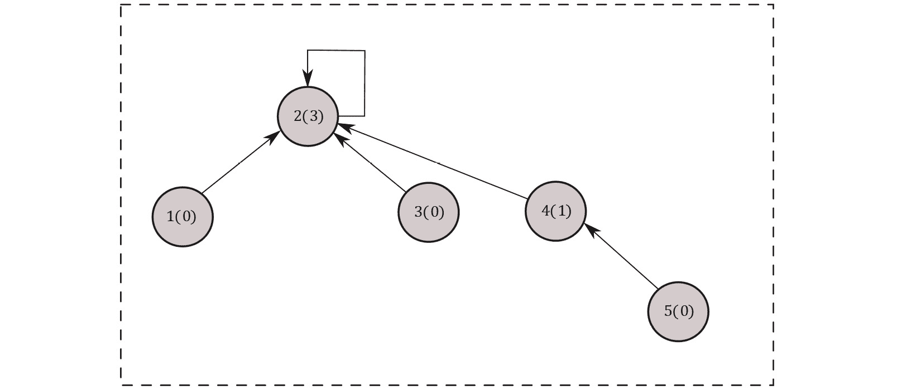

###### 图 5.16：合并 2,4

现在，让我们了解不相交集数据结构如何帮助我们实现 Kruskal 算法。在算法开始之前，在步骤 1 之前，我们使用*DS*初始化了一个包含图*G*中顶点数量*N*的不相交集数据结构。然后，步骤 2 从最小堆中取出一条边，步骤 3 检查正在考虑的边是否形成循环。请注意，可以使用在*DS*上的`union`操作来实现对循环的检查，该操作应用于边的两个顶点。如果`union`操作成功合并了两棵树，那么边将被添加到 MST；否则，边可以安全地丢弃，因为它会在 MST 中引入一个循环。以下详细说明了这个逻辑：

1.  首先，我们开始初始化一个包含图中所有给定顶点的不相交集数据结构*DS*：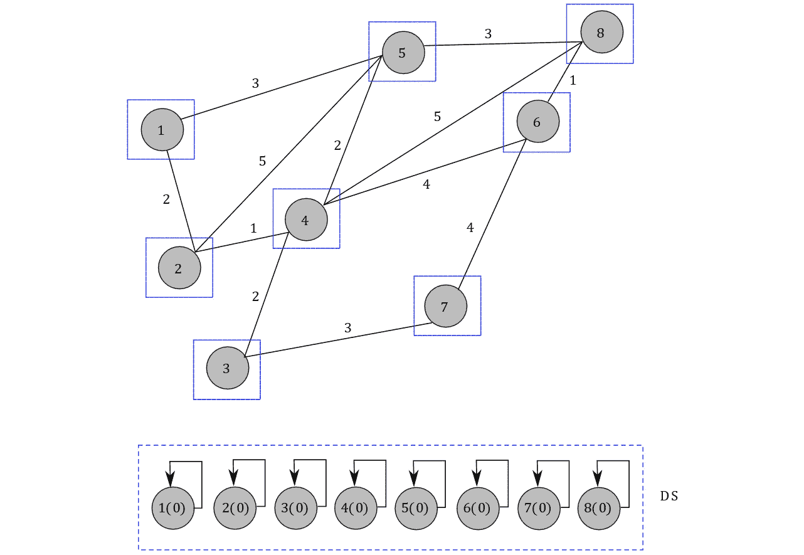

###### 图 5.17：Kruskal 算法的第 1 步-初始化

1.  让我们继续向我们的 MST 中添加权重最低的边。如下图所示，当我们添加*边(2,4)*时，我们也将`Union(2,4)`应用于*DS*中的元素：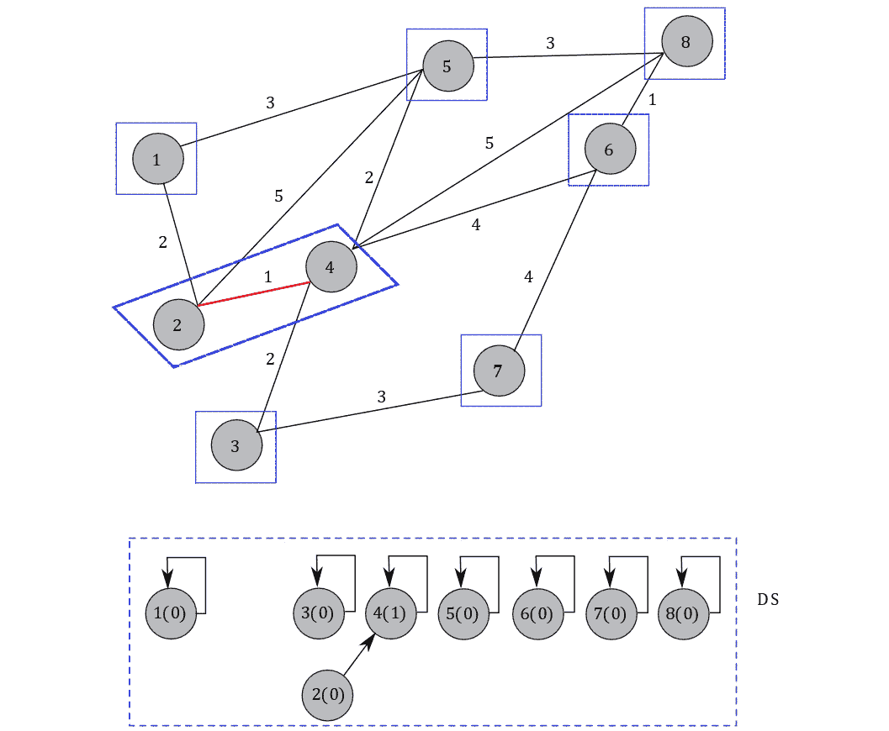

###### 图 5.18：在将 Union(2, 4)应用于不相交集之后，将边(2, 4)添加到 MST

1.  按照算法添加边的过程中，我们到达了*边(1,5)*。如您所见，在*DS*中，相应的元素在同一棵树中。因此，我们无法添加该边。如下图所示，添加该边将会创建一个循环：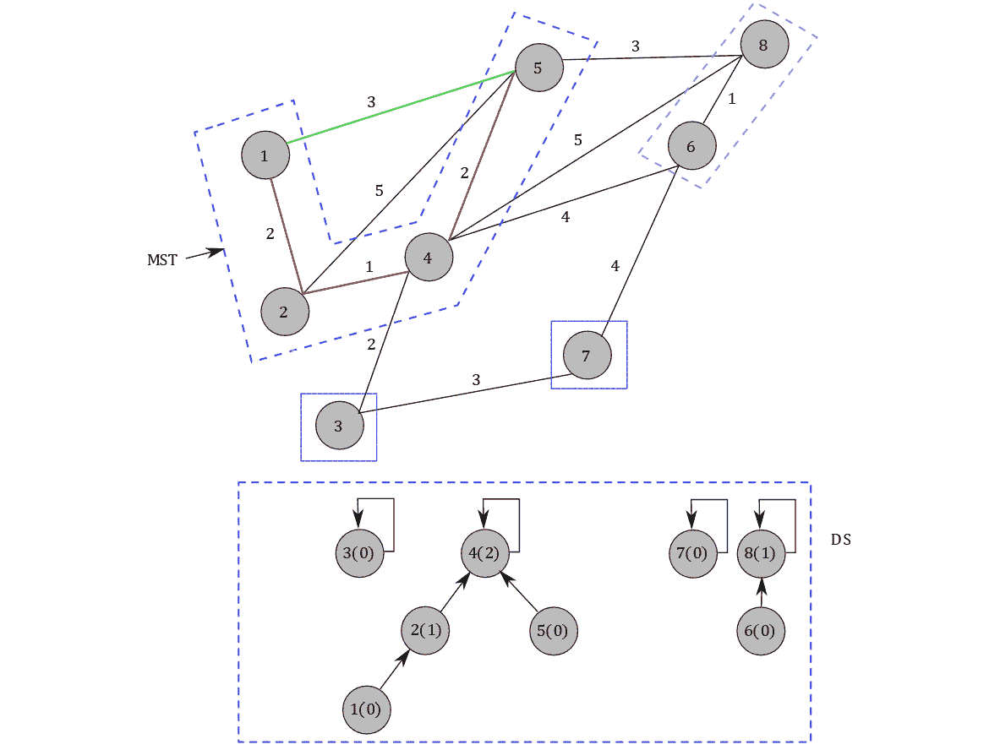

###### 图 5.19：尝试将边(1,5)添加到 MST 失败，因为顶点 1 和 5 在 DS 中的同一棵树中

在接下来的练习中，我们将使用不相交集数据结构实现 Kruskal 的最小生成树算法。

### 练习 26：Kruskal 的 MST 算法

在这个练习中，我们将实现不相交集数据结构和 Kruskal 算法来找到图中的最小生成树。让我们开始：

1.  开始添加以下头文件并声明`Graph`数据结构：

```cpp
#include<iostream>
#include<vector>
#include<algorithm>
#include<queue>
#include<map>
template <typename T> class Graph;
```

1.  首先，我们将实现不相交集：

```cpp
template<typename T>
class SimpleDisjointSet
{
private:
    struct Node
    {
        T data;
        Node(T _data) : data(_data)
        {}
        bool operator!=(const Node& n) const
        {
            return this->data != n.data;
        }
    };
    // Store the forest
    std::vector<Node> nodes;
    std::vector<size_t> parent;
    std::vector<size_t> rank;
```

1.  添加类的构造函数并实现`Make-set`和`Find`操作，如下所示：

```cpp
public:
    SimpleDisjointSet(size_t N)
    {
        nodes.reserve(N);
        parent.reserve(N);
        rank.reserve(N);
    }
    void add_set(const T& x)
    {
        nodes.emplace_back(x);
        parent.emplace_back(nodes.size() - 1);    // the parent is the node itself
        rank.emplace_back(0);        // the initial rank for all nodes is 0
    }
    auto find(T x)
    {
        // Find the node that contains element 'x'
        auto node_it = std::find_if(nodes.begin(), nodes.end(), 
            x 
            {return n.data == x; });
        auto node_idx = std::distance(nodes.begin(), node_it);
        auto parent_idx = parent[node_idx];
        // Traverse the tree till we reach the root
        while (parent_idx != node_idx)
        {
            node_idx = parent_idx;
            parent_idx = parent[node_idx];
        }
        return parent_idx;
    }
```

1.  接下来，我们将实现不相交集中两棵树之间的`Union`操作，如下所示：

```cpp
    // Union the sets X and Y belong to
    void union_sets(T x, T y)
    {
        auto root_x = find(x);
        auto root_y = find(y);
        // If both X and Y are in the same set, do nothing and return
        if (root_x == root_y)
        {
            return;
        }
        // If X and Y are in different sets, merge the set with lower rank 
        // into the set with higher rank
        else if (rank[root_x] > rank[root_y]) 
        {
            parent[root_y] = parent[root_x];
            rank[root_x]++;
        }
        else 
        {
            parent[root_x] = parent[root_y];
            rank[root_y]++;
        }
    }
};
```

1.  现在我们的不相交集的实现已经完成，让我们开始实现图。我们将使用边列表表示。`edge`结构定义如下：

```cpp
template<typename T>
struct Edge 
{
    size_t src;
    size_t dest;
    T weight;
    // To compare edges, only compare their weights,
    // and not the source/destination vertices
    inline bool operator< (const Edge<T>& e) const
    {
        return this->weight < e.weight;
    }
    inline bool operator> (const Edge<T>& e) const
    {
        return this->weight > e.weight;
    }
};
```

由于我们的边的实现是模板化的，边的权重允许是实现了`<`和`>`操作的任何数据类型。

1.  以下函数允许图被序列化并输出到流中：

```cpp
template <typename T>
std::ostream& operator<<(std::ostream& os, const Graph<T>& G)
{
    for (auto i = 1; i < G.vertices(); i++)
    {
        os << i <<":\t";
        auto edges = G.edges(i);
        for (auto& e : edges)
            os << "{" << e.dest << ": " << e.weight << "}, ";

        os << std::endl;
    }

    return os;
}
```

1.  现在可以使用以下代码实现图数据结构：

```cpp
template<typename T>
class Graph
{
public:
    // Initialize the graph with N vertices
    Graph(size_t N): V(N)
    {}
    // Return number of vertices in the graph
    auto vertices() const
    {
        return V;
    }
    // Return all edges in the graph
    auto& edges() const
    {
        return edge_list;
    }
    void add_edge(Edge<T>&& e)
    {
        // Check if the source and destination vertices are within range
        if (e.src >= 1 && e.src <= V && e.dest >= 1 && e.dest <= V)
            edge_list.emplace_back(e);
        else
            std::cerr << "Vertex out of bounds" << std::endl;
    }
    // Returns all outgoing edges from vertex v
    auto edges(size_t v) const
    {
        std::vector<Edge<T>> edges_from_v;
        for(auto& e:edge_list)
        {
            if (e.src == v)
                edges_from_v.emplace_back(e);
        }
        return edges_from_v;
    }
    // Overloads the << operator so a graph be written directly to a stream
    // Can be used as std::cout << obj << std::endl;
    template <typename T>
    friend std::ostream& operator<< <>(std::ostream& os, const Graph<T>& G);
private: 
    size_t V;        // Stores number of vertices in graph
    std::vector<Edge<T>> edge_list;
};
```

#### 注意

我们的图的实现在创建后不允许更改图中顶点的数量。此外，虽然我们可以添加任意数量的边，但是删除边没有实现，因为在这个练习中不需要。

1.  现在，我们可以这样实现 Kruskal 算法：

```cpp
// Since a tree is also a graph, we can reuse the Graph class
// However, the result graph should have no cycles
template<typename T>
Graph<T> minimum_spanning_tree(const Graph<T>& G)
{
    // Create a min-heap for the edges
    std::priority_queue<Edge<T>, 
        std::vector<Edge<T>>, 
        std::greater<Edge<T>>> edge_min_heap;
    // Add all edges in the min-heap
    for (auto& e : G.edges()) 
        edge_min_heap.push(e);
    // First step: add all elements to their own sets
    auto N = G.vertices();
    SimpleDisjointSet<size_t> dset(N);
    for (auto i = 0; i < N; i++)
        dset.add_set(i);

    // Second step: start merging sets
    Graph<T> MST(N);
    while (!edge_min_heap.empty())
    {
        auto e = edge_min_heap.top();
        edge_min_heap.pop();
// Merge the two trees and add edge to the MST only if the two vertices of the edge belong to different trees in the MST
        if (dset.find(e.src) != dset.find(e.dest))
        {
            MST.add_edge(Edge <T>{e.src, e.dest, e.weight});
            dset.union_sets(e.src, e.dest); 
        }
    }
    return MST;
}
```

1.  最后，添加以下驱动代码：

```cpp
 int main()
{
    using T = unsigned;
    Graph<T> G(9);
    std::map<unsigned, std::vector<std::pair<size_t, T>>> edges;
    edges[1] = { {2, 2}, {5, 3} };
    edges[2] = { {1, 2}, {5, 5}, {4, 1} };
    edges[3] = { {4, 2}, {7, 3} };
    edges[4] = { {2, 1}, {3, 2}, {5, 2}, {6, 4}, {8, 5} };
    edges[5] = { {1, 3}, {2, 5}, {4, 2}, {8, 3} };
    edges[6] = { {4, 4}, {7, 4}, {8, 1} };
    edges[7] = { {3, 3}, {6, 4} };
    edges[8] = { {4, 5}, {5, 3}, {6, 1} };

    for (auto& i : edges)
        for(auto& j: i.second)
            G.add_edge(Edge<T>{ i.first, j.first, j.second });

    std::cout << "Original Graph" << std::endl;
    std::cout << G;
    auto MST = minimum_spanning_tree(G);
    std::cout << std::endl << "Minimum Spanning Tree" << std::endl;
    std::cout << MST;
    return 0;
}
```

1.  最后，运行程序！您的输出应如下所示：

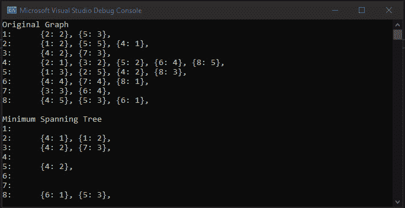

###### 图 5.20：从给定图中获取最小生成树

验证我们的算法的输出确实是*图 5.12*中显示的最小生成树。

Kruskal 算法的复杂度，如果不使用不相交集，为*O(E log E)*，其中 E 是图中的边数。然而，使用不相交集后，总复杂度降至*O(E**α**(V))*，其中*α**(v)*是 Ackermann 函数的倒数。由于倒数 Ackermann 函数增长速度远远慢于对数函数，因此对于顶点较少的图，两种实现的性能差异很小，但对于较大的图实例，性能差异可能显著。

## 顶点着色问题

顶点着色问题可以陈述如下：

“给定一个图 G，为图的每个顶点分配一个颜色，以便相邻的两个顶点没有相同的颜色。”

例如，下图显示了*图 5.11*中显示的图的有效着色：

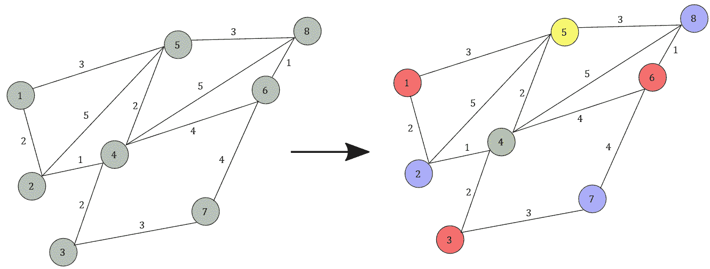

###### 图 5.21：给未着色的图着色

图着色在解决现实世界中的各种问题中有应用——为出租车制定时间表，解决数独谜题，为考试制定时间表都可以映射到找到问题的有效着色，建模为图。然而，找到产生有效顶点着色所需的最小颜色数量（也称为色数）被认为是一个 NP 完全问题。因此，问题性质的微小变化可能会对其复杂性产生巨大影响。

图着色问题的应用示例，让我们考虑数独求解器的情况。数独是一个数字放置谜题，其目标是用 1 到 9 的数字填充一个 9×9 的盒子，每行中没有重复的数字。每列是一个 3×3 的块。数独谜题的示例如下：

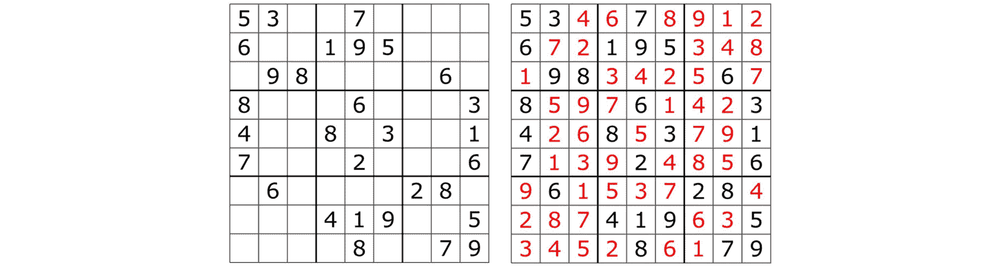

###### 图 5.22：（左）数独谜题，（右）它的解决方案

我们可以将谜题的一个实例建模为图着色问题：

+   用图*G*中的顶点来表示谜题中的每个单元格。

+   在相同列、行或相同的 3×3 块中的顶点之间添加边。

+   *G*的有效着色然后给出了原始数独谜题的解决方案。

我们将在下面的练习中看一下图着色的实现。

### 练习 27：贪婪图着色

在这个练习中，我们将实现一个贪婪算法，为图着色，当可以使用的最大颜色数为六时，如*图 5.21*所示。让我们开始吧：

1.  首先，包括所需的头文件并声明`Graph`数据结构，稍后我们将在本练习中实现：

```cpp
#include <unordered_map>
#include <set>
#include <map>
#include <string>
#include <vector>
#include <iostream>
template <typename T> class Graph;
```

1.  以下结构实现了我们图中的一条边：

```cpp
template<typename T>
struct Edge
{
    size_t src;
    size_t dest;
    T weight;
    // To compare edges, only compare their weights,
    // and not the source/destination vertices
    inline bool operator< (const Edge<T>& e) const
    {
        return this->weight < e.weight;
    }
    inline bool operator> (const Edge<T>& e) const
    {
        return this->weight > e.weight;
    }
};
```

1.  以下函数允许我们将图直接写入输出流：

```cpp
template <typename T>
std::ostream& operator<<(std::ostream& os, const Graph<T>& G)
{
    for (auto i = 1; i < G.vertices(); i++)
    {
        os << i << ":\t";
        auto edges = G.outgoing_edges(i);
        for (auto& e : edges)
            os << "{" << e.dest << ": " << e.weight << "}, ";
        os << std::endl;
    }
    return os;
}
```

1.  将图实现为边列表，如下所示：

```cpp
template<typename T>
class Graph
{
public:
    // Initialize the graph with N vertices
    Graph(size_t N) : V(N)
    {}
    // Return number of vertices in the graph
    auto vertices() const
    {
        return V;
    }
    // Return all edges in the graph
    auto& edges() const
    {
        return edge_list;
    }
    void add_edge(Edge<T>&& e)
    {
        // Check if the source and destination vertices are within range
        if (e.src >= 1 && e.src <= V &&
            e.dest >= 1 && e.dest <= V)
            edge_list.emplace_back(e);
        else
            std::cerr << "Vertex out of bounds" << std::endl;
    }
    // Returns all outgoing edges from vertex v
    auto outgoing_edges(size_t v) const
    {
        std::vector<Edge<T>> edges_from_v;
        for (auto& e : edge_list)
        {
            if (e.src == v)
                edges_from_v.emplace_back(e);
        }
        return edges_from_v;
    }
    // Overloads the << operator so a graph be written directly to a stream
    // Can be used as std::cout << obj << std::endl;
    template <typename T>
    friend std::ostream& operator<< <>(std::ostream& os, const Graph<T>& G);
private:
    size_t V;        // Stores number of vertices in graph
    std::vector<Edge<T>> edge_list;
};
```

1.  以下哈希映射存储了我们的着色算法将使用的颜色列表：

```cpp
// Initialize the colors that will be used to color the vertices
std::unordered_map<size_t, std::string> color_map = {
    {1, "Red"},
    {2, "Blue"},
    {3, "Green"},
    {4, "Yellow"},
    {5, "Black"},
    {6, "White"}
};
```

1.  接下来，让我们实现一个辅助函数，打印已分配给每个顶点的颜色：

```cpp
void print_colors(std::vector<size_t>& colors)
{
    for (auto i=1; i<colors.size(); i++)
    {
        std::cout << i << ": " << color_map[colors[i]] << std::endl;
    }
}
```

1.  以下函数实现了我们的着色算法：

```cpp
template<typename T>
auto greedy_coloring(const Graph<T>& G)
{
    auto size = G.vertices();
    std::vector<size_t> assigned_colors(size);
    // Let us start coloring with vertex number 1\. 
    // Note that this choice is arbirary.
    for (auto i = 1; i < size; i++)
    {
        auto outgoing_edges = G.outgoing_edges(i);
        std::set<size_t> neighbour_colors;
        for (auto e : outgoing_edges)
        {
            auto dest_color = assigned_colors[e.dest];
            neighbour_colors.insert(dest_color);
        }
        // Find the smallest unassigned color 
        // that is not currently used by any neighbor
        auto smallest_unassigned_color = 1;
        for (; 
            smallest_unassigned_color <= color_map.size();
            smallest_unassigned_color++)
        {
          if (neighbour_colors.find(smallest_unassigned_color) == 
              neighbour_colors.end())
              break;
        }
        assigned_colors[i] = smallest_unassigned_color;
    }
    return assigned_colors;
}
```

1.  最后，添加驱动代码，如下所示：

```cpp
int main()
{
    using T = size_t;
    Graph<T> G(9);
    std::map<unsigned, std::vector<std::pair<size_t, T>>> edges;
    edges[1] = { {2, 2}, {5, 3} };
    edges[2] = { {1, 2}, {5, 5}, {4, 1} };
    edges[3] = { {4, 2}, {7, 3} };
    edges[4] = { {2, 1}, {3, 2}, {5, 2}, {6, 4}, {8, 5} };
    edges[5] = { {1, 3}, {2, 5}, {4, 2}, {8, 3} };
    edges[6] = { {4, 4}, {7, 4}, {8, 1} };
    edges[7] = { {3, 3}, {6, 4} };
    edges[8] = { {4, 5}, {5, 3}, {6, 1} };
    for (auto& i : edges)
        for (auto& j : i.second)
            G.add_edge(Edge<T>{ i.first, j.first, j.second });
    std::cout << "Original Graph: " << std::endl;
    std::cout << G << std::endl;
    auto colors = greedy_coloring<T>(G);
    std::cout << "Vertex Colors: " << std::endl;
    print_colors(colors);
    return 0;
}
```

1.  运行实现！您的输出应如下所示：

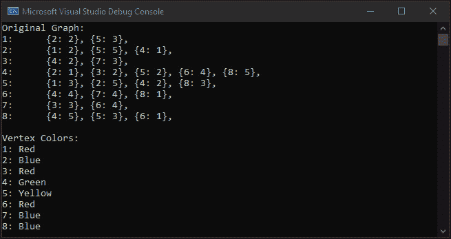

###### 图 5.23：图着色实现的输出

我们的实现总是从顶点 ID 1 开始着色顶点。但是，这个选择是任意的，即使在相同的图上，从不同的顶点开始贪婪着色算法很可能会导致需要不同颜色数量的不同图着色。

图的着色质量通常通过着色图所使用的颜色数量来衡量。虽然找到使用尽可能少的颜色的最佳图着色是 NP 完全的，但贪婪图着色通常作为有用的近似。例如，在设计编译器时，图着色用于将 CPU 寄存器分配给正在编译的程序的变量。贪婪着色算法与一组启发式方法一起使用，以得到问题的“足够好”的解决方案，在实践中这是可取的，因为我们需要编译器快速才能有用。

### 活动 12：威尔士-鲍威尔算法

改进简单方法的方法之一是按顶点的边数递减顺序着色顶点（或按顶点的度递减顺序）。

算法的工作方式如下：

1.  按度的递减顺序对所有顶点进行排序，并将它们存储在数组中。

1.  取排序后数组中的第一个未着色顶点，并将尚未分配给其任何邻居的第一个颜色分配给它。让这个颜色为*C*。

1.  遍历排序后的数组，并将颜色*C*分配给每个未着色的顶点，这些顶点没有被分配颜色*C*的邻居。

1.  如果数组中仍有未着色的顶点，则转到步骤 2。否则，结束程序。到目前为止已分配给顶点的颜色是最终输出。

以下是算法的四次迭代的图示示例，这些迭代需要找到*图 5.21*中所示图的有效着色：

1.  这是我们开始的图：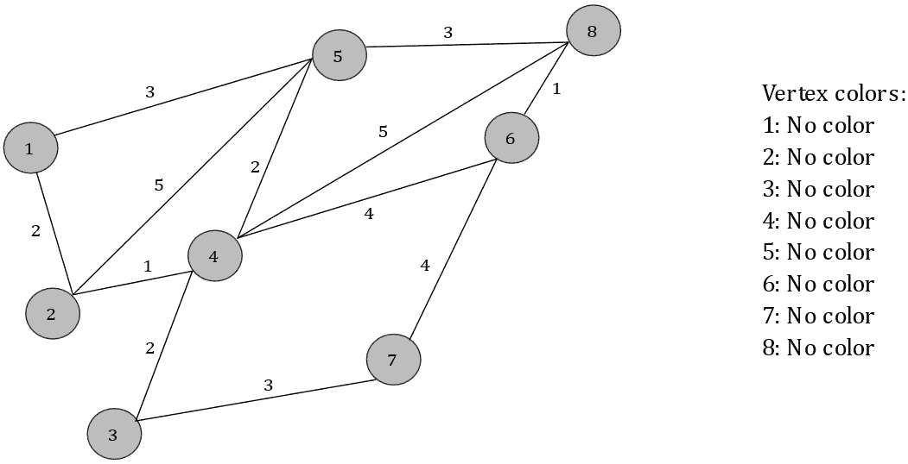

###### 图 5.24：从未着色的图开始

1.  接下来，按顶点的递减顺序排序，并从红色开始着色：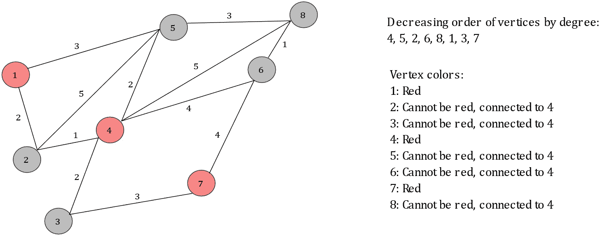

###### 图 5.25：红色着色

1.  在下一轮中，我们开始着蓝色：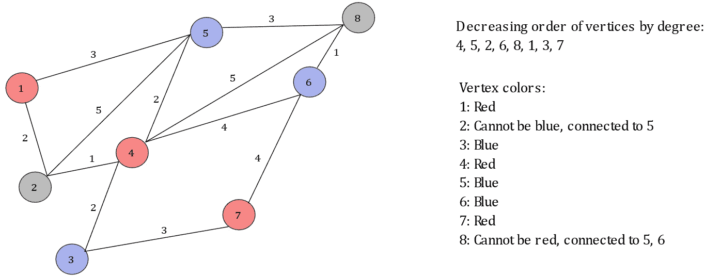

###### 图 5.26：蓝色着色

1.  在最后一轮中，我们着绿色：

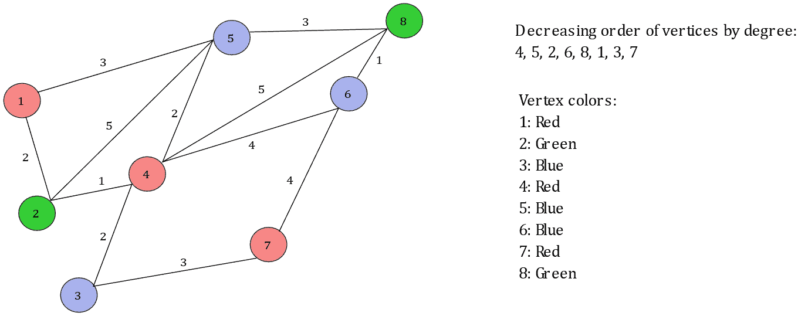

###### 图 5.27：绿色着色

完成此活动的高级步骤如下：

1.  假设图的每条边都保存源顶点 ID、目标顶点 ID 和边权重。实现一个表示图边的结构。我们将使用该结构的实例来创建图表示中的不同边。

1.  使用边列表表示实现图。

1.  实现一个实现威尔士-鲍威尔图着色并返回颜色向量的函数。向量中索引*i*处的颜色应该是分配给顶点 ID *i*的颜色。

1.  根据需要添加驱动程序和输入/输出代码以创建*图 5.24*中显示的图。假设着色始终从顶点 ID *1*开始是可以的。

您的输出应如下所示：

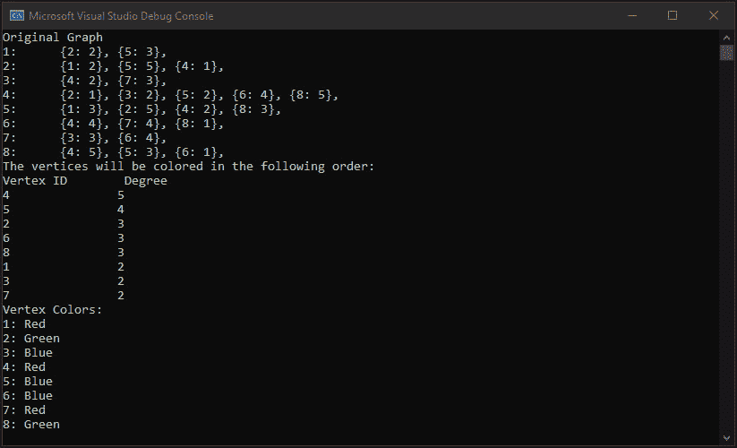

###### 图 5.28：活动 12 的预期输出

#### 注意

此活动的解决方案可在第 518 页找到。

## 摘要

贪婪方法很简单：在算法的每次迭代中，从所有可能的选择中选择看似最佳的选择。换句话说，当在每次迭代中选择局部“最佳”选择导致问题的全局最优解时，贪婪解决方案适用于问题。

在本章中，我们看了贪婪方法在问题中是最优的，并且可以导致给定问题的正确解决方案的示例；也就是说，最短作业优先调度。我们还讨论了稍微修改过的 NP 完全问题的例子，比如 0-1 背包和图着色问题，可以有简单的贪婪解决方案。这使得贪婪方法成为解决困难问题的重要算法设计工具。对于具有贪婪解决方案的问题，它很可能是解决它们的最简单方法；即使对于没有贪婪解决方案的问题，它通常也可以用来解决问题的放松版本，这在实践中可能是“足够好的”（例如，在编程语言编译器中分配寄存器给变量时使用贪婪图着色）。

接下来，我们讨论了贪婪选择和最优子结构属性，并看了一个给定问题展现这些属性的证明示例。我们用 Kruskal 算法和 Welsh-Powell 算法解决了最小生成树问题。我们对 Kruskal 算法的讨论还介绍了不相交集数据结构。

在下一章中，我们将专注于图算法，从广度优先和深度优先搜索开始，然后转向 Dijkstra 的最短路径算法。我们还将看看另一个解决最小生成树问题的方法：Prim 算法。
