# 6. 图算法 I

## 学习目标

到本章结束时，您将能够：

+   描述图在解决各种现实世界问题中的实用性

+   选择并实现正确的遍历方法来找到图中的元素

+   使用 Prim 算法解决最小生成树（MST）问题

+   确定何时使用 Prim 和 Kruskal 算法解决 MST 问题

+   使用 Dijkstra 算法在图中找到两个顶点/节点之间的最短路径

在本章中，我们将学习解决可以用图表示的问题的基本和最常用的算法，这将在下一章中进一步讨论。

## 介绍

在前两章中，我们讨论了两种算法设计范式：分治和贪婪方法，这使我们得到了广泛使用和重要的计算问题的众所周知的解决方案，如排序、搜索和在图上找到最小权重生成树。在本章中，我们将讨论一些专门适用于图数据结构的算法。

**图**被定义为一组连接一对顶点的**顶点**和**边**。在数学上，这经常被写为*G = < V, E >*，其中*V*表示顶点的集合，*E*表示构成图的边的集合。指向另一个节点的边称为*有向*，而没有方向的边称为*无向*。边也可以与*权重*相关联，也可以是*无权重*，正如我们在*第二章*，*树、堆和图*中看到的那样。

#### 注意

当我们谈论图时，“节点”和“顶点”可以互换使用。在本章中，我们将坚持使用“顶点”。

图是一些最通用的数据结构之一，以至于其他链接数据结构，如树和链表，被认为只是图的特殊情况。图的有用之处在于它们是*关系*（表示为**边**）和*对象*（表示为**节点**）的一般表示。图可以在同一对节点之间有多个边，甚至可以在单个边上有多个边权重，节点也可以从自身到自身有边（也称为自环）。下图显示了这些特征如何存在于图中。图的变体称为“超图”，允许有连接多个节点的边，另一组变体称为“混合图”，允许在同一图中既有有向边又有无向边：

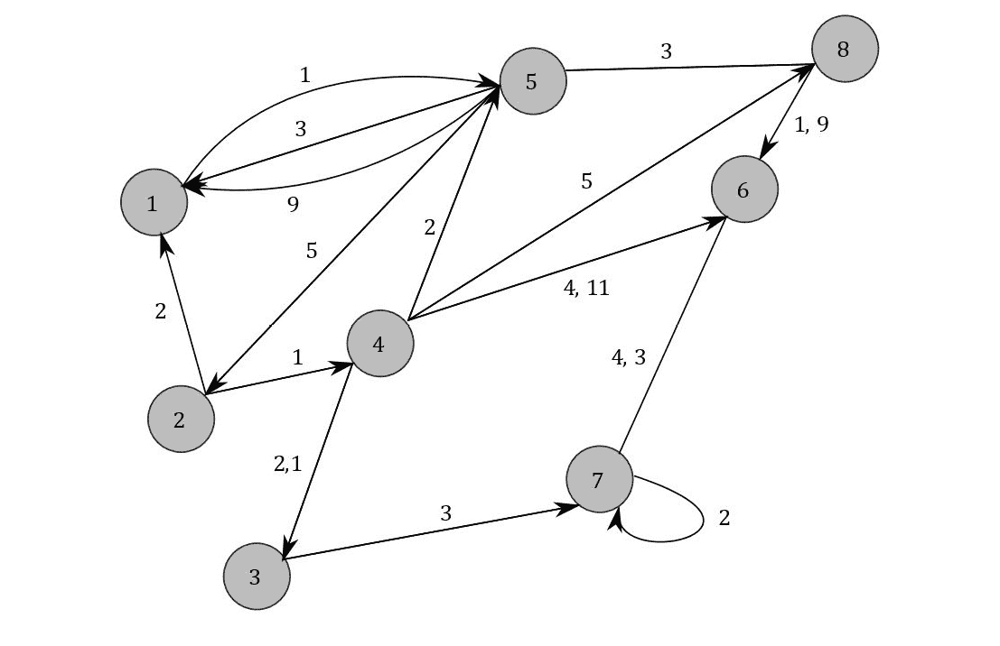

###### 图 6.1：具有多个边权重、自环（也称为循环）以及有向和无向边的图

由于图提供了高度的通用性，它们在多个应用中被使用。理论计算机科学家使用图来建模有限状态机和自动机，人工智能和机器学习专家使用图来从不同类型的网络结构随时间变化中提取信息，交通工程师使用图来研究交通通过道路网络的流动。

在本章中，我们将限制自己研究使用加权、有向图的算法，如果需要，还有正边权。我们将首先研究**图遍历问题**并提供两种解决方案：**广度优先搜索**（**BFS**）和**深度优先搜索**（**DFS**）。接下来，我们将回到前一章介绍的最小生成树问题，并提供一个称为 Prim 算法的不同解决方案。最后，我们将涵盖单源最短路径问题，该问题支持导航应用程序，如 Google 地图和 OSRM 路线规划器。

让我们首先看一下遍历图的基本问题。

## 图遍历问题

假设您最近搬进了一个新社区的公寓。当您遇到新邻居并交新朋友时，人们经常推荐附近的餐馆用餐。您希望访问所有推荐的餐馆，因此您拿出社区地图，在地图上标记所有餐馆和您的家，地图上已经标有所有道路。如果我们将每个餐馆和您的家表示为一个顶点，并将连接餐馆的道路表示为图中的边，则从给定顶点开始访问图中所有顶点的问题称为图遍历问题。

在下图中，蓝色数字表示假定的顶点 ID。顶点*1*是*Home*，餐馆从*R1*到*R7*标记。由于边被假定为双向的，因此没有边箭头，也就是说，可以沿着道路双向行驶：

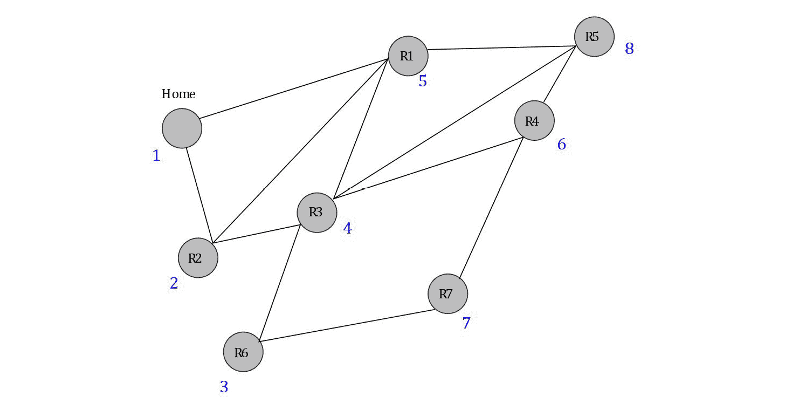

###### 图 6.2：将邻域地图表示为图

在数学表示中，给定一个图，*G = < V, E >*，图遍历问题是从给定顶点*s*开始访问所有*V*中的所有*v*。图遍历问题也称为**图搜索问题**，因为它可以用来在图中“找到”一个顶点。不同的图遍历算法给出了访问图中顶点的不同顺序。

### 广度优先搜索

图的“广度优先”搜索或广度优先遍历从将起始顶点添加到由先前访问的顶点组成的**前沿**开始，然后迭代地探索与当前前沿相邻的顶点。下面的示例步骤应该帮助您理解这个概念：

1.  首先访问*Home*顶点，即起点。*R1*和*R2*是当前前沿顶点的邻居，如下图中蓝色虚线所示：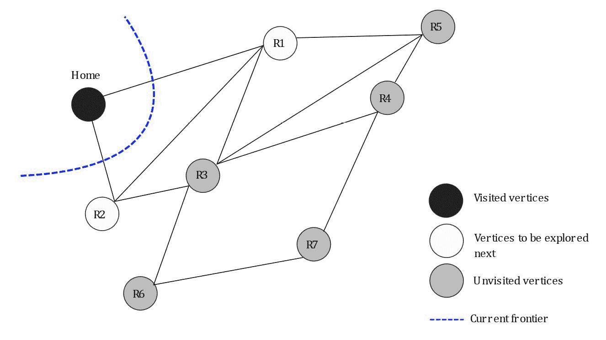

###### 图 6.3：BFS 前沿的初始化

1.  以下图显示了访问*R1*和*R1*后的 BFS，可以先访问其中任何一个。从源顶点距离相同的顶点的访问顺序是无关紧要的；但是，距离源顶点较近的顶点总是首先被访问：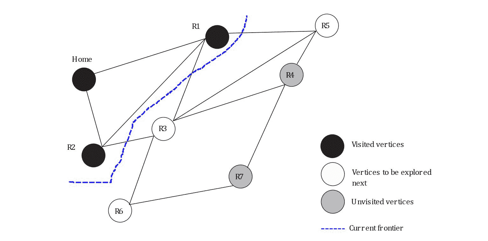

###### 图 6.4：访问 R1 和 R2 顶点后的 BFS 前沿

1.  下图显示了访问*R3*、*R5*和*R6*后 BFS 的状态。这基本上是整个图被遍历之前的倒数第二阶段：

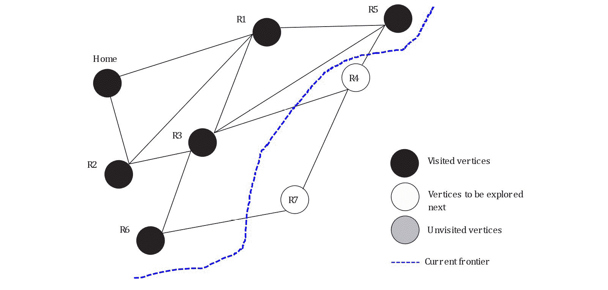

###### 图 6.5：访问 R3、R5 和 R6 后的 BFS 前沿

BFS 的一个有用特性是，对于每个被访问的顶点，所有子顶点都会在任何孙顶点之前被访问。然而，在实现 BFS 时，前沿通常不会在单独的数据结构中显式维护。相反，使用顶点 ID 的队列来确保比离源顶点更近的顶点总是在更远的顶点之前被访问。在下面的练习中，我们将在 C++中实现 BFS。

### 练习 28：实现 BFS

在这个练习中，我们将使用图的边缘列表表示来实现广度优先搜索算法。为此，请执行以下步骤：

1.  添加所需的头文件并声明图，如下所示：

```cpp
    #include <string>
    #include <vector>
    #include <iostream>
    #include <set>
    #include <map>
    #include <queue>
    template<typename T> class Graph;
    ```

1.  编写以下结构，表示图中的一条边：

```cpp
    template<typename T>
    struct Edge
    {
        size_t src;
        size_t dest;
        T weight;
        // To compare edges, only compare their weights,
        // and not the source/destination vertices
        inline bool operator< (const Edge<T>& e) const
        {
            return this->weight < e.weight;
        }
        inline bool operator> (const Edge<T>& e) const
        {
            return this->weight > e.weight;
        }
    };
    ```

由于我们对边的定义使用了模板，因此可以轻松地使边具有所需的任何数据类型的边权重。

1.  接下来，重载`<<`运算符，以便显示图的内容：

```cpp
    template <typename T>
    std::ostream& operator<<(std::ostream& os, const Graph<T>& G)
    {
        for (auto i = 1; i < G.vertices(); i++)
        {
            os << i << ":\t";
            auto edges = G.outgoing_edges(i);
            for (auto& e : edges)
                os << "{" << e.dest << ": " << e.weight << "}, ";
            os << std::endl;
        }
        return os;
    }
    ```

1.  编写一个类来定义我们的图数据结构，如下所示：

```cpp
    template<typename T>
    class Graph
    {
    public:
        // Initialize the graph with N vertices
        Graph(size_t N) : V(N)
        {}
        // Return number of vertices in the graph
        auto vertices() const
        {
            return V;
        }
        // Return all edges in the graph
        auto& edges() const
        {
            return edge_list;
        }
        void add_edge(Edge<T>&& e)
        {
            // Check if the source and destination vertices are within range
            if (e.src >= 1 && e.src <= V &&
                e.dest >= 1 && e.dest <= V)
                edge_list.emplace_back(e);
            else
                std::cerr << "Vertex out of bounds" << std::endl;
        }
        // Returns all outgoing edges from vertex v
        auto outgoing_edges(size_t v) const
        {
            std::vector<Edge<T>> edges_from_v;
            for (auto& e : edge_list)
            {
                if (e.src == v)
                    edges_from_v.emplace_back(e);
            }
            return edges_from_v;
        }
        // Overloads the << operator so a graph be written directly to a stream
        // Can be used as std::cout << obj << std::endl;
        template <typename T>
        friend std::ostream& operator<<(std::ostream& os, const Graph<T>& G);
    private:
        size_t V;        // Stores number of vertices in graph
        std::vector<Edge<T>> edge_list;
    };
    ```

1.  在这个练习中，我们将在以下图上测试我们的 BFS 实现：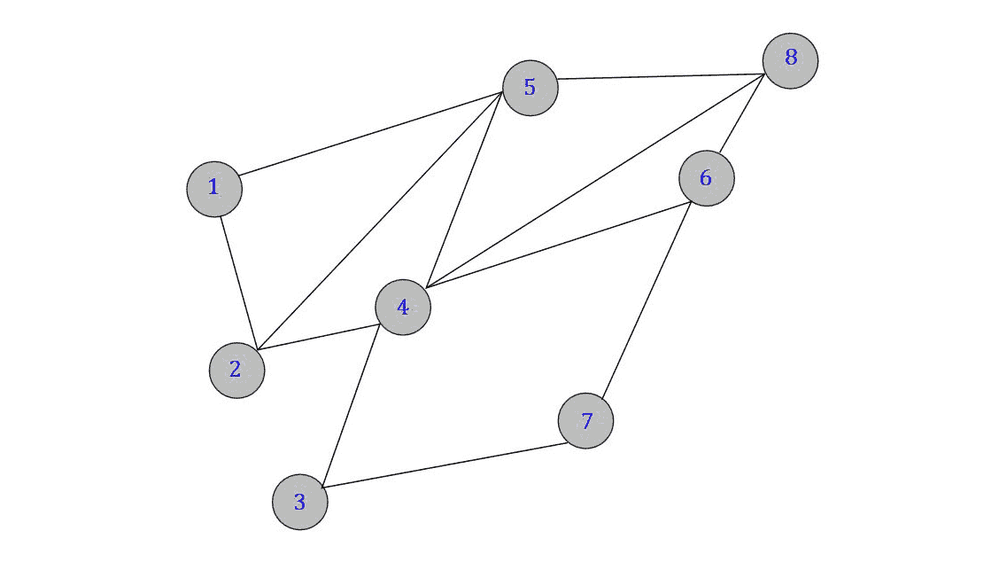

###### 图 6.6：在练习 28 中实现 BFS 遍历的图

我们需要一个函数来创建并返回所需的图。请注意，虽然图中为每条边分配了边权重，但这并不是必需的，因为 BFS 算法不需要使用边权重。实现函数如下：

```cpp
    template <typename T>
    auto create_reference_graph()
    {
        Graph<T> G(9);
        std::map<unsigned, std::vector<std::pair<size_t, T>>> edges;
        edges[1] = { {2, 2}, {5, 3} };
        edges[2] = { {1, 2}, {5, 5}, {4, 1} };
        edges[3] = { {4, 2}, {7, 3} };
        edges[4] = { {2, 1}, {3, 2}, {5, 2}, {6, 4}, {8, 5} };
        edges[5] = { {1, 3}, {2, 5}, {4, 2}, {8, 3} };
        edges[6] = { {4, 4}, {7, 4}, {8, 1} };
        edges[7] = { {3, 3}, {6, 4} };
        edges[8] = { {4, 5}, {5, 3}, {6, 1} };
        for (auto& i : edges)
            for (auto& j : i.second)
                G.add_edge(Edge<T>{ i.first, j.first, j.second });
        return G;
    }
    ```

1.  实施广度优先搜索如下：

```cpp
    template <typename T>
    auto breadth_first_search(const Graph<T>& G, size_t dest)
    {
        std::queue<size_t> queue;
        std::vector<size_t> visit_order;
        std::set<size_t> visited;
        queue.push(1); // Assume that BFS always starts from vertex ID 1
        while (!queue.empty())
        {
            auto current_vertex = queue.front();
            queue.pop();
            // If the current vertex hasn't been visited in the past
            if (visited.find(current_vertex) == visited.end())
            {
                visited.insert(current_vertex);
                visit_order.push_back(current_vertex);
                for (auto e : G.outgoing_edges(current_vertex))
                    queue.push(e.dest);
            }
        }
        return visit_order;
    }
    ```

1.  添加以下测试和驱动代码，创建参考图，从顶点*1*开始运行 BFS，并输出结果：

```cpp
    template <typename T>
    void test_BFS()
    {
        // Create an instance of and print the graph
        auto G = create_reference_graph<unsigned>();
        std::cout << G << std::endl;
        // Run BFS starting from vertex ID 1 and print the order
        // in which vertices are visited.
        std::cout << "BFS Order of vertices: " << std::endl;
        auto bfs_visit_order = breadth_first_search(G, 1);
        for (auto v : bfs_visit_order)
            std::cout << v << std::endl;
    }
    int main()
    {
        using T = unsigned;
        test_BFS<T>();
        return 0;
    }
    ```

1.  运行上述代码。您的输出应如下所示：

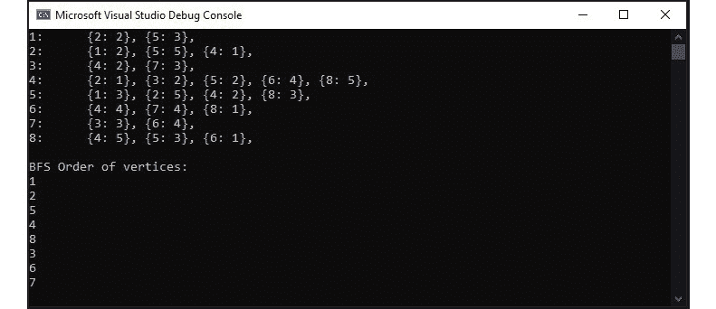

###### 图 6.7：练习 28 的预期输出

以下图显示了我们的 BFS 实现访问顶点的顺序。请注意，搜索从顶点*1*开始，然后逐渐访问离源顶点更远的顶点。在下图中，红色的整数显示了顺序，箭头显示了我们的 BFS 实现访问图的顶点的方向：

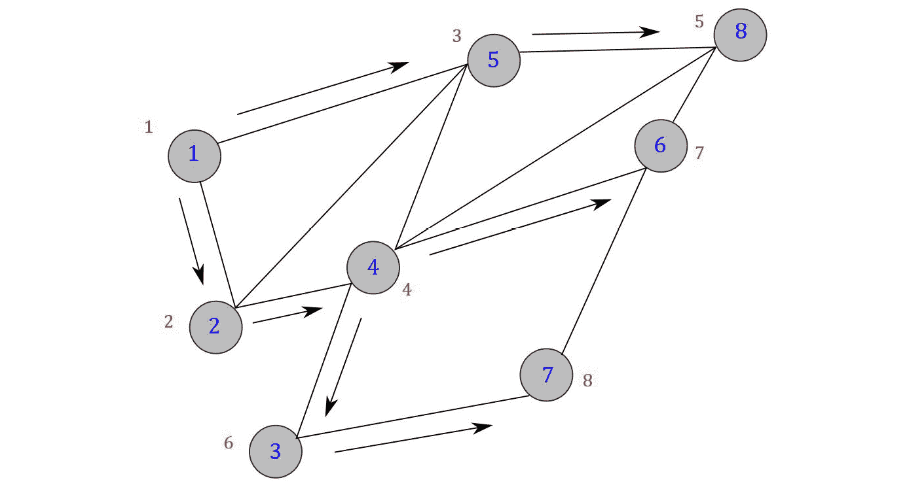

###### 图 6.8：练习 28 中的 BFS 实现

BFS 的时间复杂度为*O(V + E)*，其中*V*是顶点数，*E*是图中的边数。

### 深度优先搜索

虽然 BFS 从源顶点开始，逐渐向外扩展搜索到更远的顶点，DFS 从源顶点开始，迭代地访问尽可能远的顶点沿着某条路径，然后返回到先前的顶点，以探索图中另一条路径上的顶点。这种搜索图的方法也称为**回溯**。以下是说明 DFS 工作的步骤：

1.  自然地，我们开始遍历，访问*Home*顶点，如下图所示：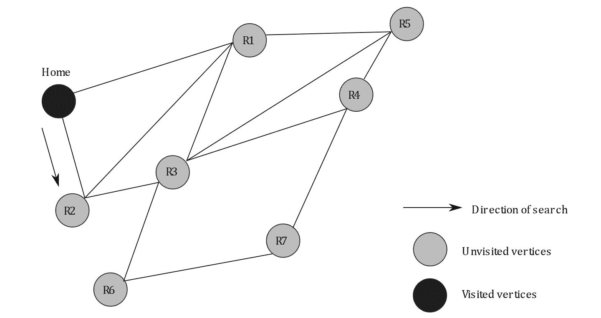

###### 图 6.9：DFS 初始化

1.  接下来，我们访问顶点*R2*。请注意，*R2*是任意选择的，因为*R2*和*R1*都与*Home*相邻，选择任何一个都不会影响算法的正确性：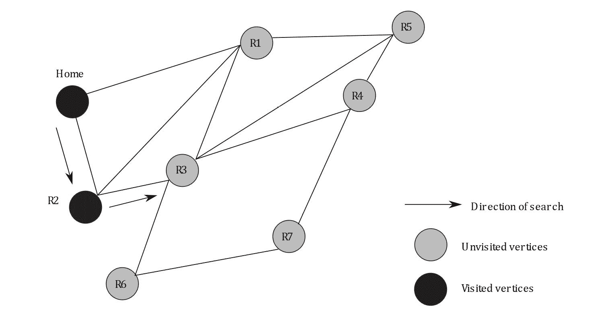

###### 图 6.10：访问 R2 后的 DFS

1.  接下来，我们访问顶点*R3*，如下图所示。同样，*R3*或*R1*都可以任意选择，因为它们都与*R2*相邻：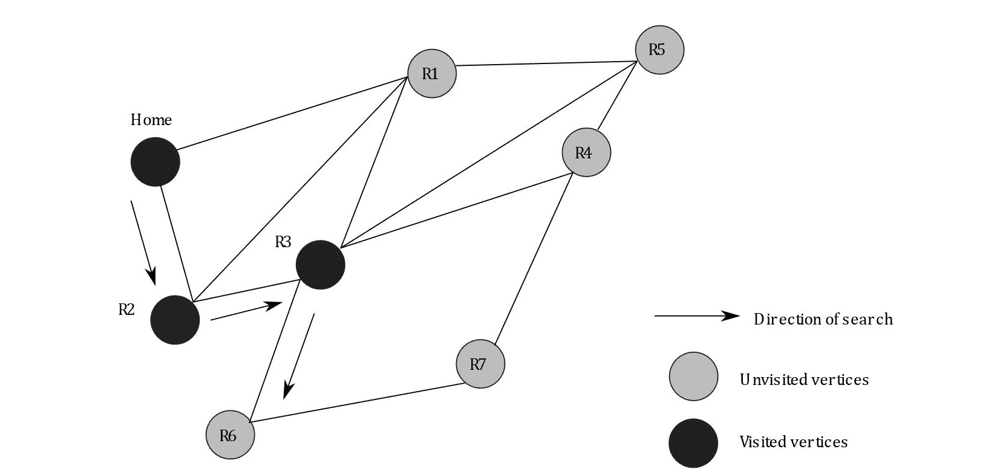

###### 图 6.11：访问 R3 后的 DFS

1.  搜索继续通过在每次迭代中访问任意未访问的相邻顶点来进行。访问了*R1*之后，搜索尝试寻找下一个未访问的顶点。由于没有剩下的顶点，搜索终止：

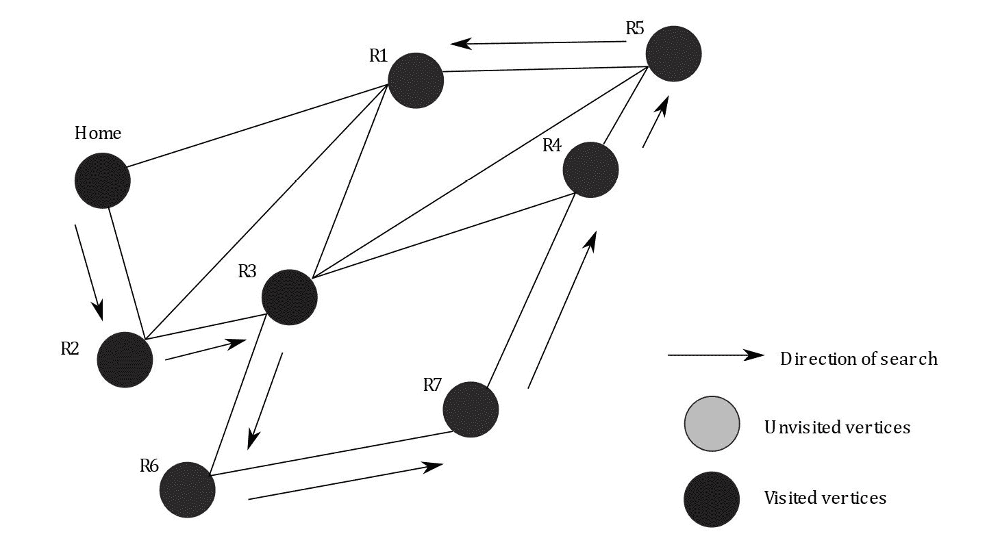

###### 图 6.12：访问图中所有顶点后的 DFS

在实现 BFS 时，我们使用队列来跟踪未访问的顶点。由于队列是**先进先出**（**FIFO**）数据结构，顶点被按照加入队列的顺序从队列中移除，因此 BFS 算法使用它来确保离起始顶点更近的顶点先被访问，然后才是离得更远的顶点。实现 DFS 与实现 BFS 非常相似，唯一的区别是：不再使用队列作为待访问顶点列表的容器，而是使用栈，而算法的其余部分保持不变。这种方法之所以有效，是因为在每次迭代中，DFS 访问当前顶点的未访问邻居，这可以很容易地通过栈来跟踪，栈是**后进先出**（**LIFO**）数据结构。

### 练习 29：实现 DFS

在这个练习中，我们将在 C++中实现 DFS 算法，并在*图 6.2*中显示的图上进行测试。步骤如下：

1.  包括所需的头文件，如下所示：

```cpp
    #include <string>
    #include <vector>
    #include <iostream>
    #include <set>
    #include <map>
    #include <stack>
    template<typename T> class Graph;
    ```

1.  编写以下结构以实现图中的边：

```cpp
    template<typename T>
    struct Edge
    {
        size_t src;
        size_t dest;
        T weight;
        // To compare edges, only compare their weights,
        // and not the source/destination vertices
        inline bool operator< (const Edge<T>& e) const
        {
            return this->weight < e.weight;
        }
        inline bool operator> (const Edge<T>& e) const
        {
            return this->weight > e.weight;
        }
    };
    ```

同样，由于我们的实现使用了结构的模板化版本，它允许我们分配任何所需的数据类型的边权重。然而，为了 DFS 的目的，我们将使用空值作为边权重的占位符。

1.  接下来，重载图的`<<`运算符，以便可以使用以下函数打印出来：

```cpp
     template <typename T>
    std::ostream& operator<<(std::ostream& os, const Graph<T>& G)
    {
        for (auto i = 1; i < G.vertices(); i++)
        {
            os << i << ":\t";
            auto edges = G.outgoing_edges(i);
            for (auto& e : edges)
                os << "{" << e.dest << ": " << e.weight << "}, ";
            os << std::endl;
        }
        return os;
    }
    ```

1.  实现使用边列表表示的图数据结构如下：

```cpp
    template<typename T>
    class Graph
    {
    public:
        // Initialize the graph with N vertices
        Graph(size_t N) : V(N)
        {}
        // Return number of vertices in the graph
        auto vertices() const
        {
            return V;
        }
        // Return all edges in the graph
        auto& edges() const
        {
            return edge_list;
        }
        void add_edge(Edge<T>&& e)
        {
            // Check if the source and destination vertices are within range
            if (e.src >= 1 && e.src <= V &&
                e.dest >= 1 && e.dest <= V)
                edge_list.emplace_back(e);
            else
                std::cerr << "Vertex out of bounds" << std::endl;
        }
        // Returns all outgoing edges from vertex v
        auto outgoing_edges(size_t v) const
        {
            std::vector<Edge<T>> edges_from_v;
            for (auto& e : edge_list)
            {
                if (e.src == v)
                    edges_from_v.emplace_back(e);
            }
            return edges_from_v;
        }
        // Overloads the << operator so a graph be written directly to a stream
        // Can be used as std::cout << obj << std::endl;
        template <typename T>
        friend std::ostream& operator<< <>(std::ostream& os, const Graph<T>& G);
    private:
        size_t V;        // Stores number of vertices in graph
        std::vector<Edge<T>> edge_list;
    };
    ```

1.  现在，我们需要一个函数来执行我们的图的 DFS。实现如下：

```cpp
     template <typename T>
    auto depth_first_search(const Graph<T>& G, size_t dest)
    {
        std::stack<size_t> stack;
        std::vector<size_t> visit_order;
        std::set<size_t> visited;
        stack.push(1); // Assume that DFS always starts from vertex ID 1
        while (!stack.empty())
        {
            auto current_vertex = stack.top();
            stack.pop();
            // If the current vertex hasn't been visited in the past
            if (visited.find(current_vertex) == visited.end())
            {
                visited.insert(current_vertex);
                visit_order.push_back(current_vertex);
                for (auto e : G.outgoing_edges(current_vertex))
                {    
                    // If the vertex hasn't been visited, insert it in the stack.
                    if (visited.find(e.dest) == visited.end())
                    {
                        stack.push(e.dest);
                    }
                }
            }
        }
        return visit_order;
    }
    ```

1.  我们将在这里显示的图上测试我们的 DFS 实现：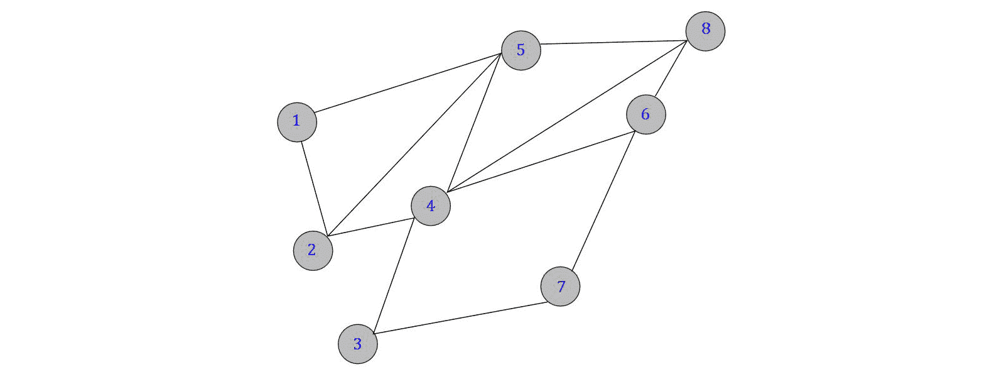

###### 图 6.13：用于实现练习 29 中 DFS 遍历的图

使用以下函数创建并返回图：

```cpp
    template <typename T>
    auto create_reference_graph()
    {
        Graph<T> G(9);
        std::map<unsigned, std::vector<std::pair<size_t, T>>> edges;
        edges[1] = { {2, 0}, {5, 0} };
        edges[2] = { {1, 0}, {5, 0}, {4, 0} };
        edges[3] = { {4, 0}, {7, 0} };
        edges[4] = { {2, 0}, {3, 0}, {5, 0}, {6, 0}, {8, 0} };
        edges[5] = { {1, 0}, {2, 0}, {4, 0}, {8, 0} };
        edges[6] = { {4, 0}, {7, 0}, {8, 0} };
        edges[7] = { {3, 0}, {6, 0} };
        edges[8] = { {4, 0}, {5, 0}, {6, 0} };
        for (auto& i : edges)
            for (auto& j : i.second)
                G.add_edge(Edge<T>{ i.first, j.first, j.second });
        return G;
    }
    ```

请注意，在 DFS 中使用空值表示边权重，因此 DFS 不需要边权重。图的更简单的实现可以完全省略边权重而不影响我们的 DFS 算法的行为。

1.  最后，添加以下测试和驱动代码，运行我们的 DFS 实现并打印输出：

```cpp
    template <typename T>
    void test_DFS()
    {
        // Create an instance of and print the graph
        auto G = create_reference_graph<unsigned>();
        std::cout << G << std::endl;
        // Run DFS starting from vertex ID 1 and print the order
        // in which vertices are visited.
        std::cout << "DFS Order of vertices: " << std::endl;
        auto dfs_visit_order = depth_first_search(G, 1);
        for (auto v : dfs_visit_order)
            std::cout << v << std::endl;
    }
    int main()
    {
        using T = unsigned;
        test_DFS<T>();
        return 0;
    }
    ```

1.  编译并运行上述代码。您的输出应如下所示：

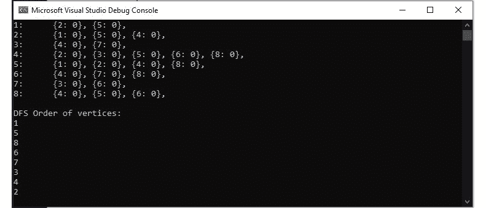

###### 图 6.14：练习 29 的预期输出

以下图显示了我们的 DFS 实现访问顶点的顺序：

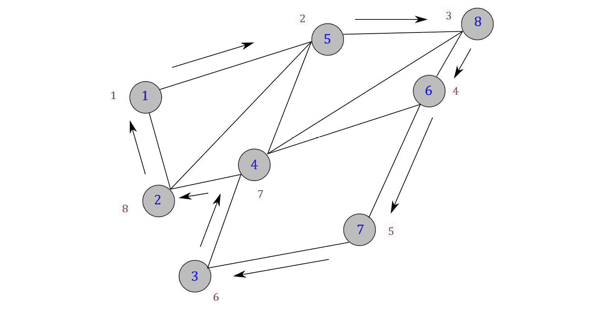

###### 图 6.15：访问顶点的顺序和 DFS 的方向

BFS 和 DFS 的时间复杂度均为*O(V + E)*。然而，这两种算法之间有几个重要的区别。以下列表总结了两者之间的区别，并指出了一些情况下应该优先选择其中一种：

+   BFS 更适合找到靠近源顶点的顶点，而 DFS 通常更适合找到远离源顶点的顶点。

+   一旦在 BFS 中访问了一个顶点，从源到该顶点找到的路径将保证是最短路径，而对于 DFS 则没有这样的保证。这就是为什么所有单源和多源最短路径算法都使用 BFS 的某种变体的原因。这将在本章的后续部分中探讨。

+   由于 BFS 访问当前前沿相邻的所有顶点，因此 BFS 创建的搜索树短而宽，需要相对更多的内存，而 DFS 创建的搜索树长而窄，需要相对较少的内存。

### 活动 13：使用 DFS 找出图是否为二部图

二部图是指顶点可以分为两组，使得图中的任何边必须连接一组中的顶点到另一组中的顶点。

二部图可用于模拟几种不同的实际用例。例如，如果我们有一个学生名单和一个课程名单，学生和课程之间的关系可以被建模为一个二部图，如果学生在该课程中注册，则包含学生和课程之间的边。正如您所想象的那样，从一个学生到另一个学生，或者从一个科目到另一个科目的边是没有意义的。因此，在二部图中不允许这样的边。以下图示例了这样一个模型：

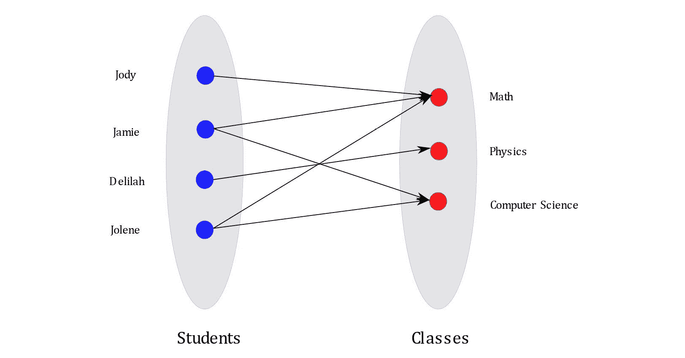

###### 图 6.16：代表不同班级学生注册情况的样本二部图

一旦像这里展示的模型准备好了，就可以用它来创建课程表，以便没有两个被同一学生选修的课程时间冲突。例如，如果 Jolene 选修了*数学*和*计算机科学*，这两门课就不应该在同一时间安排，以避免冲突。通过解决图中的最大流问题可以实现在时间表中最小化这种冲突。已知有几种标准算法用于最大流问题：Ford-Fulkerson 算法、Dinic 算法和推-重标记算法是其中的一些例子。然而，这些算法通常很复杂，因此超出了本书的范围。

建模实体之间关系的另一个用例是使用二部图在大型视频流媒体平台（如 Netflix 和 YouTube）的观众和电影列表之间建立关系。

二部图的一个有趣特性是，一些在一般图中是*NP 完全*的操作，如查找最大匹配和顶点覆盖，对于二部图可以在多项式时间内解决。因此，确定给定图是否是二部图是很有用的。在这个活动中，您需要实现一个检查给定图*G*是否是二部图的 C++程序。

二部图检查算法使用了 DFS 的略微修改版本，并按以下方式工作：

1.  假设 DFS 从顶点*1*开始。将顶点 ID *1*添加到堆栈。

1.  如果堆栈上仍有未访问的顶点，则弹出一个顶点并将其设置为当前顶点。

1.  如果分配给父顶点的颜色是蓝色，则将当前顶点分配为红色；否则，将当前顶点分配为蓝色。

1.  将当前顶点的所有未访问相邻顶点添加到堆栈，并将当前顶点标记为已访问。

1.  重复*步骤 2*、*3*和*4*，直到所有顶点都被赋予颜色。如果算法终止时所有顶点都被着色，则给定的图是二部图。

1.  如果在运行*步骤 2*时，搜索遇到一个已经被访问并且被赋予与在*步骤 3*中应该被赋予的颜色不同的颜色（与搜索树中其父顶点被赋予的颜色相反）的顶点，算法立即终止，给定的图就不是二部图。

以下图示说明了前述算法的工作方式：

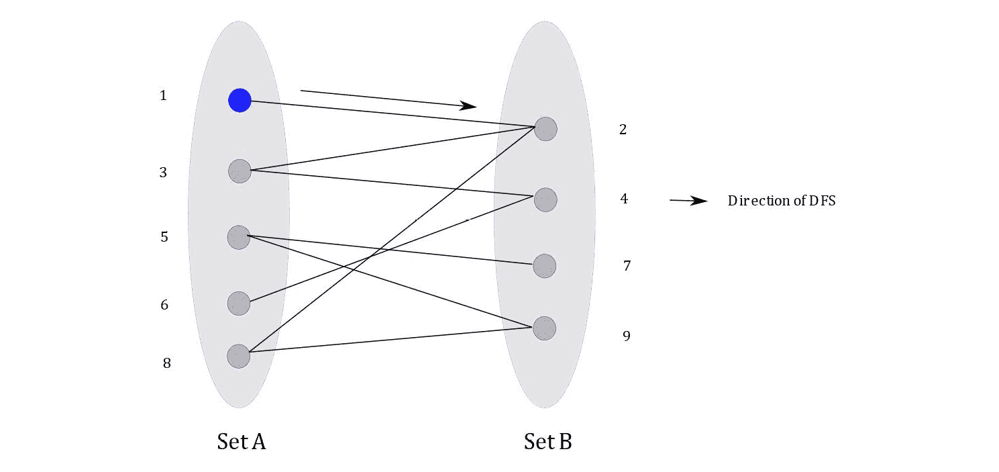

###### 图 6.17：初始化

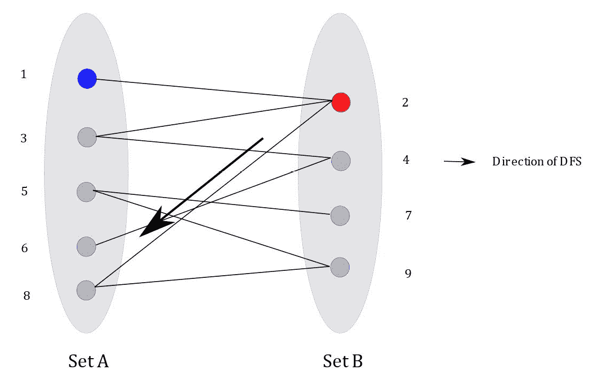

###### 图 6.18：由于顶点 1 被赋予蓝色，我们将顶点 2 涂成红色

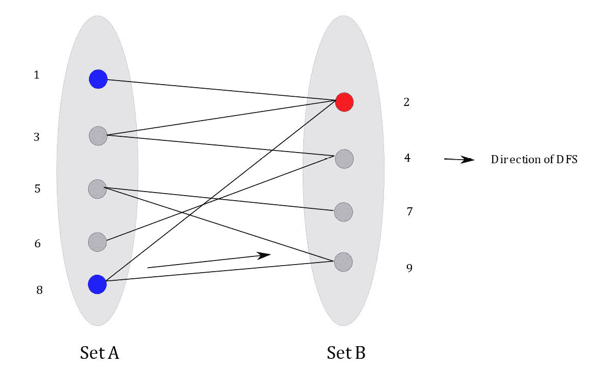

###### 图 6.19：由于顶点 2 被涂成红色，我们将顶点 8 涂成蓝色。

从前面一系列图中可以观察到，该算法在图中穿行，为每个访问的顶点分配交替的颜色。如果所有顶点都可以以这种方式着色，那么图就是二部图。如果 DFS 到达两个已经被分配相同颜色的顶点，那么可以安全地声明图不是二部图。

使用*图 6.17*中的图作为输入，最终输出应如下所示：

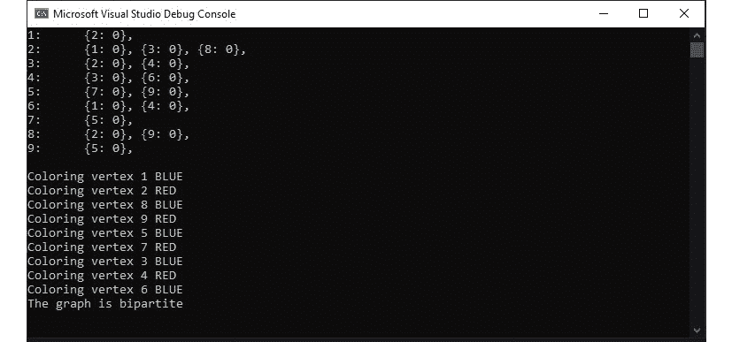

###### 图 6.20：活动 13 的预期输出

#### 注

此活动的解决方案可在第 524 页找到。

## Prim 的 MST 算法

MST 问题在*第五章*“贪婪算法”中介绍，并定义如下：

*“给定图 G = <V，E>，其中 V 是顶点集，E 是边集，每个边关联一个边权重，找到一棵树 T，它跨越 V 中的所有顶点并具有最小总权重。”*

在*第五章*，*贪婪算法*中，我们讨论了 MST 问题和 Kruskal 算法的实际应用，Kruskal 算法将图的所有边添加到最小堆中，并贪婪地将最小成本边添加到 MST 中，每次添加时检查树中是否形成了循环。

Prim 算法（也称为 Jarvik 算法）的思想与 BFS 类似。该算法首先将起始顶点添加到*frontier*中，*frontier*包括先前访问过的顶点集，然后迭代地探索与当前*frontier*相邻的顶点。然而，在每次迭代选择要访问的顶点时，会选择*frontier*中具有最低成本边的顶点。

在实现 Prim 算法时，我们为图的每个顶点附加一个*label*，用于存储其与起始顶点的距离。算法的工作方式如下：

1.  首先，初始化所有顶点的标签，并将所有距离设置为无穷大。由于从起始顶点到自身的距离为*0*，因此将起始顶点的标签设置为*0*。然后，将所有标签添加到最小堆*H*中。

在下图中，红色数字表示从起始顶点（假定为顶点*1*）的估计距离；黑色数字表示边权重：

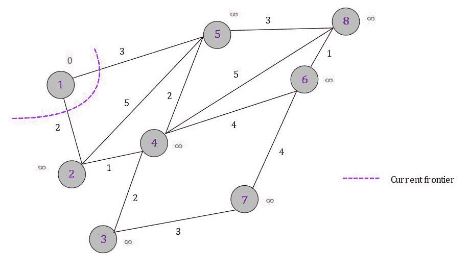

###### 图 6.21：初始化 Prim 的 MST 算法

1.  接下来，从*H*中弹出一个顶点*U*。显然，*U*是距离起始顶点最近的顶点。

1.  对于所有与*U*相邻的顶点*V*，如果*V*的标签 > *(U, V)*的边权重，则将*V*的标签设置为*(U, V)*的边权重。这一步骤称为*settling*或*visiting*顶点*U*：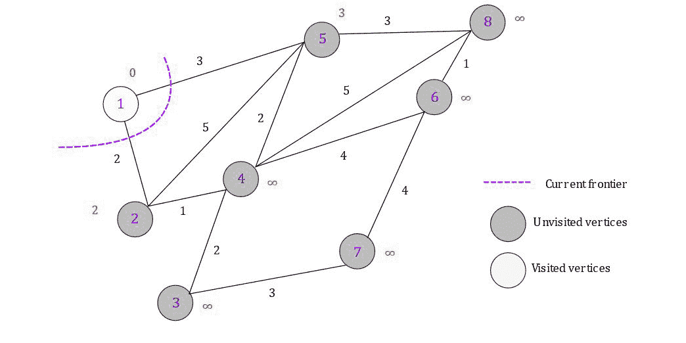

###### 图 6.22：访问顶点 1 后图的状态

1.  当图中仍有未访问的顶点时，转到*步骤 2*。下图显示了访问顶点*2*后图的状态，绿色边是迄今为止我们 MST 中的唯一边：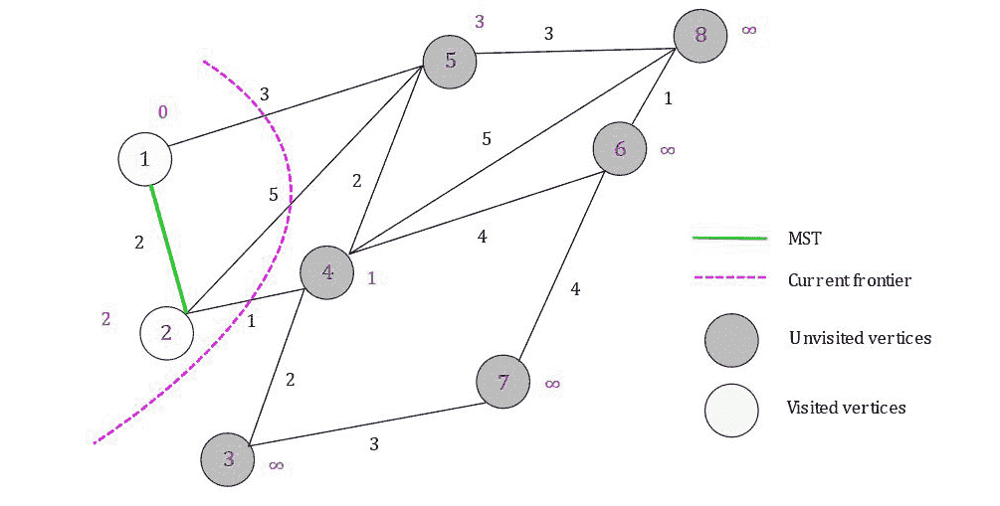

###### 图 6.23：访问顶点 2 后图的状态

1.  所有顶点都已经 settled 后的最终 MST 如下所示：

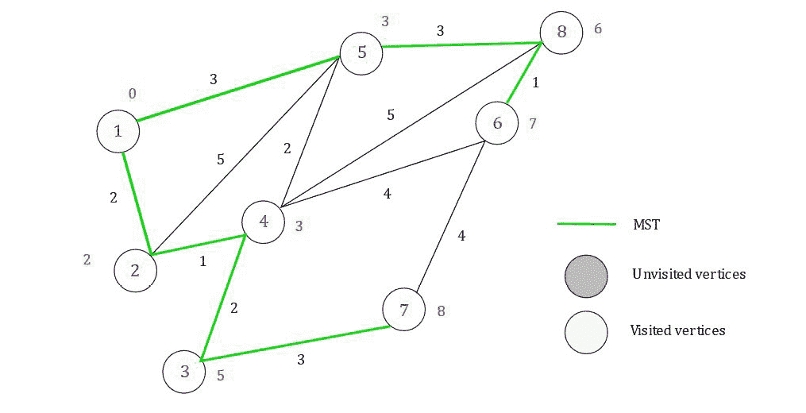

###### 图 6.24：我们的图的 MST

### 练习 30：Prim 算法

在这个练习中，我们将实现 Prim 算法来找到*图 6.22*中所示图中的 MST。按照以下步骤完成这个练习：

1.  添加所需的头文件，如下所示：

```cpp
    #include <set>
    #include <map>
    #include <queue>
    #include <limits>
    #include <string>
    #include <vector>
    #include <iostream>
    ```

1.  使用以下结构在图中实现一条边：

```cpp
    template<typename T> class Graph;
    template<typename T>
    struct Edge
    {
        size_t src;
        size_t dest;
        T weight;
        // To compare edges, only compare their weights,
        // and not the source/destination vertices
        inline bool operator< (const Edge<T>& e) const
        {
            return this->weight < e.weight;
        }
        inline bool operator> (const Edge<T>& e) const
        {
            return this->weight > e.weight;
        }
    };
    ```

1.  使用以下函数重载`Graph`类的`<<`运算符，以便我们可以将图输出到 C++流中：

```cpp
     template <typename T>
    std::ostream& operator<<(std::ostream& os, const Graph<T>& G)
    {
        for (auto i = 1; i < G.vertices(); i++)
        {
            os << i << ":\t";
            auto edges = G.outgoing_edges(i);
            for (auto& e : edges)
                os << "{" << e.dest << ": " << e.weight << "}, ";
            os << std::endl;
        }
        return os;
    }
    ```

1.  添加基于边列表的图实现，如下所示：

```cpp
    template<typename T>
    class Graph
    {
    public:
        // Initialize the graph with N vertices
        Graph(size_t N) : V(N)
        {}
        // Return number of vertices in the graph
        auto vertices() const
        {
            return V;
        }
        // Return all edges in the graph
        auto& edges() const
        {
            return edge_list;
        }
        void add_edge(Edge<T>&& e)
        {
            // Check if the source and destination vertices are within range
            if (e.src >= 1 && e.src <= V &&
                e.dest >= 1 && e.dest <= V)
                edge_list.emplace_back(e);
            else
                std::cerr << "Vertex out of bounds" << std::endl;
        }
        // Returns all outgoing edges from vertex v
        auto outgoing_edges(size_t v) const
        {
            std::vector<Edge<T>> edges_from_v;
            for (auto& e : edge_list)
            {
                if (e.src == v)
                    edges_from_v.emplace_back(e);
            }
            return edges_from_v;
        }
        // Overloads the << operator so a graph be written directly to a stream
        // Can be used as std::cout << obj << std::endl;
        template <typename T>
        friend std::ostream& operator<< <>(std::ostream& os, const Graph<T>& G);
    private:
        size_t V;        // Stores number of vertices in graph
        std::vector<Edge<T>> edge_list;
    };
    ```

1.  使用以下代码创建并返回*图 6.22*中所示的图的函数：

```cpp
     template <typename T>
    auto create_reference_graph()
    {
        Graph<T> G(9);
        std::map<unsigned, std::vector<std::pair<size_t, T>>> edges;
        edges[1] = { {2, 2}, {5, 3} };
        edges[2] = { {1, 2}, {5, 5}, {4, 1} };
        edges[3] = { {4, 2}, {7, 3} };
        edges[4] = { {2, 1}, {3, 2}, {5, 2}, {6, 4}, {8, 5} };
        edges[5] = { {1, 3}, {2, 5}, {4, 2}, {8, 3} };
        edges[6] = { {4, 4}, {7, 4}, {8, 1} };
        edges[7] = { {3, 3}, {6, 4} };
        edges[8] = { {4, 5}, {5, 3}, {6, 1} };
        for (auto& i : edges)
            for (auto& j : i.second)
                G.add_edge(Edge<T>{ i.first, j.first, j.second });
        return G;
    }
    ```

1.  接下来，我们将实现`Label`结构，为图中的每个顶点分配一个实例，以存储其与*frontier*的距离。使用以下代码来实现：

```cpp
    template<typename T>
    struct Label
    {
        size_t vertex_ID;
        T distance_from_frontier;
        Label(size_t _id, T _distance) :
            vertex_ID(_id),
            distance_from_frontier(_distance)
        {}
        // To compare labels, only compare their distances from source
        inline bool operator< (const Label<T>& l) const
        {
            return this->distance_from_frontier < l.distance_from_frontier;
        }
        inline bool operator> (const Label<T>& l) const
        {
            return this->distance_from_frontier > l.distance_from_frontier;
        }
        inline bool operator() (const Label<T>& l) const
        {
            return this > l;
        }
    };
    ```

1.  编写一个函数来实现 Prim 的 MST 算法，如下所示：

```cpp
    template <typename T>
    auto prim_MST(const Graph<T>& G, size_t src)
    {
        std::priority_queue<Label<T>, std::vector<Label<T>>, std::greater<Label<T>>> heap;
        std::set<int> visited;
        std::vector<T> distance(G.vertices(), std::numeric_limits<T>::max());
        std::vector<size_t> MST;
        heap.emplace(src, 0);
        // Search for the destination vertex in the graph
        while (!heap.empty())
        {
            auto current_vertex = heap.top();
            heap.pop();
            // If the current vertex hasn't been visited in the past
            if (visited.find(current_vertex.vertex_ID) == visited.end())
            {
                std::cout << "Settling vertex ID " 
    << current_vertex.vertex_ID << std::endl;
                MST.push_back(current_vertex.vertex_ID);
            // For each outgoing edge from the current vertex, 
            // create a label for the destination vertex and add it to the heap
                for (auto e : G.outgoing_edges(current_vertex.vertex_ID))
                {
                    auto neighbor_vertex_ID = e.dest;
                    auto new_distance_to_frontier = e.weight;
            // Check if the new path to the vertex is shorter
            // than the previously known best path. 
            // If yes, update the distance 
                    if (new_distance_to_frontier < distance[neighbor_vertex_ID])
                    {
    heap.emplace(neighbor_vertex_ID,  new_distance_to_frontier);
                        distance[e.dest] = new_distance_to_frontier;
                    }
                }
                visited.insert(current_vertex.vertex_ID);
            }
        }
        return MST;
    }
    ```

1.  最后，添加以下代码，运行我们的 Prim 算法实现并输出结果：

```cpp
    template<typename T>
    void test_prim_MST()
    {
        auto G = create_reference_graph<T>();
        std::cout << G << std::endl;
        auto MST = prim_MST<T>(G, 1);
        std::cout << "Minimum Spanning Tree:" << std::endl;
        for (auto v : MST)
            std::cout << v << std::endl;
        std::cout << std::endl;
    }
    int main()
    {
        using T = unsigned;
        test_prim_MST<T>();
        return 0;
    }
    ```

1.  运行程序。您的输出应如下所示：

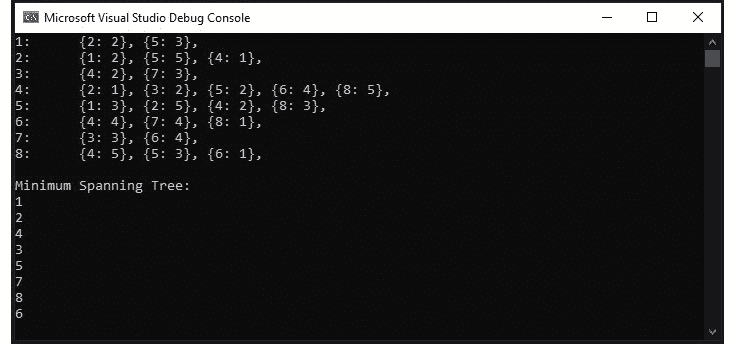

###### 图 6.25：练习 30 的输出

使用二进制最小堆和邻接表存储 MST 时，Prim 算法的时间复杂度为*O(E log V)*，当使用一种称为“Fibonacci 最小堆”的堆时，可以改进为*O(E + V log V)*。

虽然 Prim 和 Kruskal 都是贪婪算法的例子，但它们在一些重要方面有所不同，其中一些总结如下：

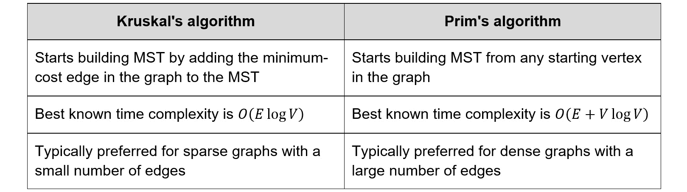

###### 图 6.26：比较 Kruskal 和 Prim 算法的表

## Dijkstra 的最短路径算法

每当用户在路线规划应用程序（如 Google 地图）或内置在汽车中的导航软件上请求路线时，都会解决图上的单源最短路径问题。该问题定义如下：

*“给定一个有向图 G - <V，E>，其中 V 是顶点集合，E 是边集合，每条边都与边权重、源顶点和目标顶点相关联，找到从源到目标的最小成本路径。”*

Dijkstra 算法适用于具有非负边权重的图，它只是 Prim 最小生成树算法的轻微修改，有两个主要变化：

+   Dijkstra 算法不是将每个顶点上的标签设置为从前沿到顶点的最小距离，而是将每个顶点上的标签设置为顶点到源的总距离。

+   Dijkstra 算法在从堆中弹出目的地顶点时终止，而 Prim 算法只有在没有更多顶点需要在堆上解决时才终止。

算法的工作如下步骤所示：

1.  首先，初始化所有顶点的标签，并将所有距离设置为无穷大。由于从起始顶点到自身的距离为 0，因此将起始顶点的标签设置为 0。然后，将所有标签添加到最小堆*H*中。

在下图中，红色数字表示从源顶点（顶点 2）和目标顶点（顶点 6）的当前已知最佳距离：

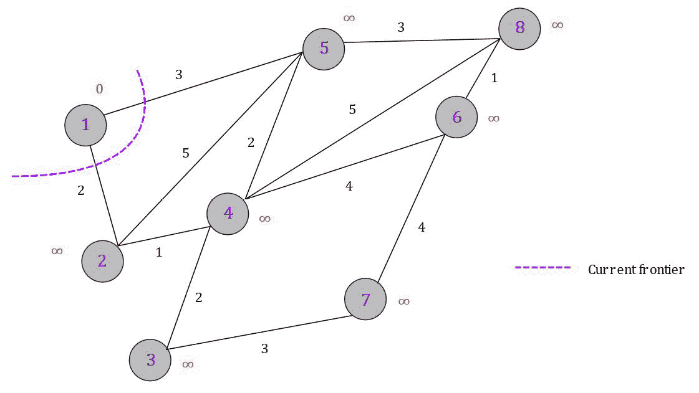

###### 图 6.27：初始化 Dijkstra 算法

1.  然后，从*H*中弹出顶点*U*。自然地，*U*是距离起始顶点最小的顶点。如果*U*是所需的目的地，则我们已经找到了最短路径，算法终止。

1.  对于所有邻接到*U*的顶点*V*，如果*V*的标签>(*U*的标签+ *(U，V)*的边权重)，则找到了一条到*V*的路径，其长度比先前已知的最小成本路径更短。因此，将*V*的标签设置为(*U*的标签+ *(U，V)*的边权重)。这一步称为**解决**或**访问**顶点*U*：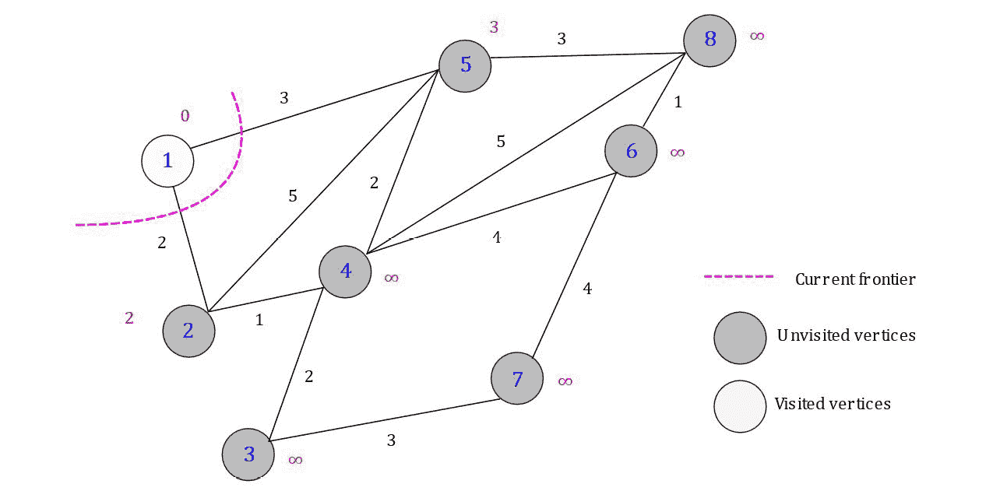

###### 图 6.28：解决顶点 1 后算法的状态

1.  当图中仍有未访问的顶点时，转到*步骤 2*。下图显示了在解决顶点 2 后图的状态：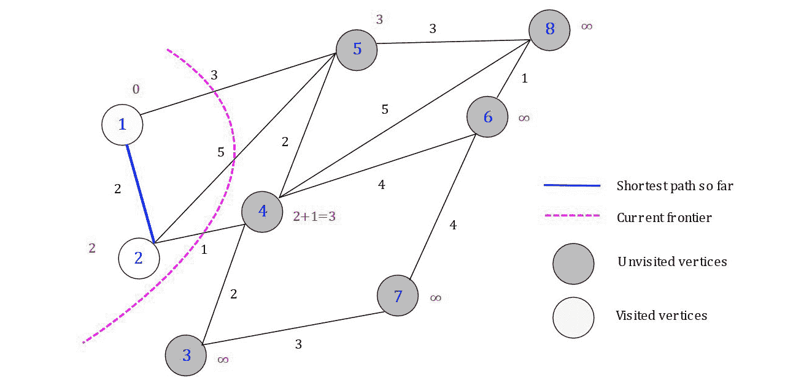

###### 图 6.29：解决顶点 2 后算法的状态

1.  当目标顶点（顶点 ID 为 6）从 H 中弹出时，算法终止。算法从 1 到 6 找到的最短路径如下图所示。此外，其他已解决顶点上的标签显示了从 1 到该顶点的最短距离：

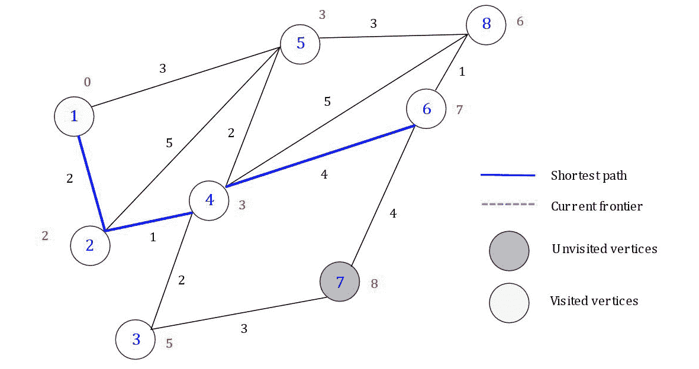

###### 图 6.30：从 1 到 6 的最短路径

### 练习 31：实现 Dijkstra 算法

在这个练习中，我们将实现 Dijkstra 算法来找到*图 6.28*中的图中的最短路径。按照以下步骤完成这个练习：

1.  包括所需的头文件并声明图数据结构，如下所示：

```cpp
    #include <string>
    #include <vector>
    #include <iostream>
    #include <set>
    #include <map>
    #include <limits>
    #include <queue>
    template<typename T> class Graph;
    ```

1.  编写以下结构来实现图中边的结构：

```cpp
    template<typename T>
    struct Edge
    {
        size_t src;
        size_t dest;
        T weight;
        // To compare edges, only compare their weights,
        // and not the source/destination vertices
        inline bool operator< (const Edge<T>& e) const
        {
            return this->weight < e.weight;
        }
        inline bool operator> (const Edge<T>& e) const
        {
            return this->weight > e.weight;
        }
    };
    ```

1.  重载`Graph`类的`<<`运算符，以便可以使用流输出，如下所示：

```cpp
     template <typename T>
    std::ostream& operator<<(std::ostream& os, const Graph<T>& G)
    {
        for (auto i = 1; i < G.vertices(); i++)
        {
            os << i << ":\t";
            auto edges = G.outgoing_edges(i);
            for (auto& e : edges)
                os << "{" << e.dest << ": " << e.weight << "}, ";
            os << std::endl;
        }
        return os;
    }
    ```

1.  实现图，如下所示：

```cpp
    template<typename T>
    class Graph
    {
    public:
        // Initialize the graph with N vertices
        Graph(size_t N) : V(N)
        {}
        // Return number of vertices in the graph
        auto vertices() const
        {
            return V;
        }
        // Return all edges in the graph
        auto& edges() const
        {
            return edge_list;
        }
        void add_edge(Edge<T>&& e)
        {
            // Check if the source and destination vertices are within range
            if (e.src >= 1 && e.src <= V &&
                e.dest >= 1 && e.dest <= V)
                edge_list.emplace_back(e);
            else
                std::cerr << "Vertex out of bounds" << std::endl;
        }
        // Returns all outgoing edges from vertex v
        auto outgoing_edges(size_t v) const
        {
            std::vector<Edge<T>> edges_from_v;
            for (auto& e : edge_list)
            {
                if (e.src == v)
                    edges_from_v.emplace_back(e);
            }
            return edges_from_v;
        }
        // Overloads the << operator so a graph be written directly to a stream
        // Can be used as std::cout << obj << std::endl;
        template <typename T>
        friend std::ostream& operator<< <>(std::ostream& os, const Graph<T>& G);
    private:
        size_t V;        // Stores number of vertices in graph
        std::vector<Edge<T>> edge_list;
    };
    ```

1.  编写一个函数，使用`Graph`类创建*图 6.28*中显示的参考图，如下所示：

```cpp
    template <typename T>
    auto create_reference_graph()
    {
        Graph<T> G(9);
        std::map<unsigned, std::vector<std::pair<size_t, T>>> edges;
        edges[1] = { {2, 2}, {5, 3} };
        edges[2] = { {1, 2}, {5, 5}, {4, 1} };
        edges[3] = { {4, 2}, {7, 3} };
        edges[4] = { {2, 1}, {3, 2}, {5, 2}, {6, 4}, {8, 5} };
        edges[5] = { {1, 3}, {2, 5}, {4, 2}, {8, 3} };
        edges[6] = { {4, 4}, {7, 4}, {8, 1} };
        edges[7] = { {3, 3}, {6, 4} };
        edges[8] = { {4, 5}, {5, 3}, {6, 1} };
        for (auto& i : edges)
            for (auto& j : i.second)
                G.add_edge(Edge<T>{ i.first, j.first, j.second });
        return G;
    }
    ```

1.  实现 Dijkstra 算法，如下所示：

```cpp
    template <typename T>
    auto dijkstra_shortest_path(const Graph<T>& G, size_t src, size_t dest)
    {
        std::priority_queue<Label<T>, std::vector<Label<T>>, std::greater<Label<T>>> heap;
        std::set<int> visited;
        std::vector<size_t> parent(G.vertices());
        std::vector<T> distance(G.vertices(), std::numeric_limits<T>::max());
        std::vector<size_t> shortest_path;
        heap.emplace(src, 0);
        parent[src] = src;
        // Search for the destination vertex in the graph
        while (!heap.empty()) {
            auto current_vertex = heap.top();
            heap.pop();
            // If the search has reached the destination vertex
            if (current_vertex.vertex_ID == dest) {
                std::cout << "Destination " << 
    current_vertex.vertex_ID << " reached." << std::endl;
                break;
            }
            if (visited.find(current_vertex.vertex_ID) == visited.end()) {
                std::cout << "Settling vertex " << 
    current_vertex.vertex_ID << std::endl;
                // For each outgoing edge from the current vertex, 
                // create a label for the destination vertex and add it to the heap
                for (auto e : G.outgoing_edges(current_vertex.vertex_ID)) {
                    auto neighbor_vertex_ID = e.dest;
                    auto new_distance_to_dest=current_vertex.distance_from_source 
    + e.weight;
                    // Check if the new path to the destination vertex 
    // has a lower cost than any previous paths found to it, if // yes, then this path should be preferred 
                    if (new_distance_to_dest < distance[neighbor_vertex_ID]) {
                        heap.emplace(neighbor_vertex_ID, new_distance_to_dest);
                        parent[e.dest] = current_vertex.vertex_ID;
                        distance[e.dest] = new_distance_to_dest;
                    }
                }
                visited.insert(current_vertex.vertex_ID);
            }
        }
        // Construct the path from source to the destination by backtracking 
        // using the parent indexes
        auto current_vertex = dest;
        while (current_vertex != src) {
            shortest_path.push_back(current_vertex);
            current_vertex = parent[current_vertex];
        }
        shortest_path.push_back(src);
        std::reverse(shortest_path.begin(), shortest_path.end());
        return shortest_path;
    }
    ```

我们的实现分为两个阶段——从源顶点开始搜索目标顶点，并使用回溯阶段，在这个阶段通过从目标顶点回溯到源顶点的父指针来找到最短路径。

1.  最后，添加以下代码来测试我们对 Dijkstra 算法的实现，以找到图中顶点 1 和 6 之间的最短路径：

```cpp
     template<typename T>
    void test_dijkstra()
    {
        auto G = create_reference_graph<T>();
        std::cout << "Reference graph:" << std::endl;
        std::cout << G << std::endl;
        auto shortest_path = dijkstra_shortest_path<T>(G, 1, 6);
        std::cout << "The shortest path between 1 and 6 is:" << std::endl;
        for (auto v : shortest_path)
            std::cout << v << " ";
        std::cout << std::endl;
    }
    int main()
    {
        using T = unsigned;
        test_dijkstra<T>();
        return 0;
    }
    ```

1.  运行程序。您的输出应如下所示：

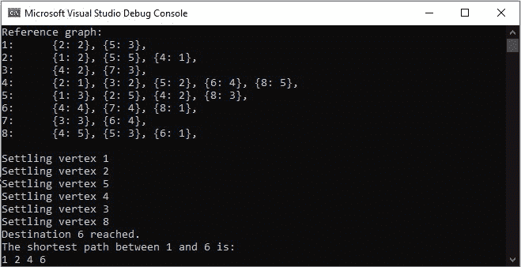

###### 图 6.31：练习 31 的输出

如前面的输出所示，我们的程序在顶点*1*和*6*之间的最短路径上跟踪了顶点。Dijkstra 算法的已知最佳运行时间是*O(E + V log V)*，当使用斐波那契最小堆时。

### 活动 14：纽约的最短路径

在此活动中，您需要在 C++中实现 Dijkstra 算法，以便在纽约给定的道路网络中找到最短路径。我们的道路图包括 264,326 个顶点和 733,846 个有向边，边的权重是顶点之间的欧几里德距离。此活动的步骤如下：

1.  从以下链接下载道路图文件：[`raw.githubusercontent.com/TrainingByPackt/CPP-Data-Structures-and-Algorithm-Design-Principles/master/Lesson6/Activity14/USA-road-d.NY.gr`](https://raw.githubusercontent.com/TrainingByPackt/CPP-Data-Structures-and-Algorithm-Design-Principles/master/Lesson6/Activity14/USA-road-d.NY.gr)。

#### 注意

如果文件没有自动下载，而是在浏览器中打开，请右键单击任何空白处并选择“**另存为…**”进行下载

1.  如果您正在运行 Windows，请将下载的文件移动到`<project directory>/out/x86-Debug/Chapter6`。

如果您正在运行 Linux，请将下载的文件移动到`<project directory>/build/Chapter6`。

#### 注意

目录结构可能会根据您的 IDE 而有所不同。文件需要放在与已编译二进制文件相同的目录中。或者，您可以调整实现以接受文件路径。

1.  道路图是一个文本文件，有三种不同类型的行：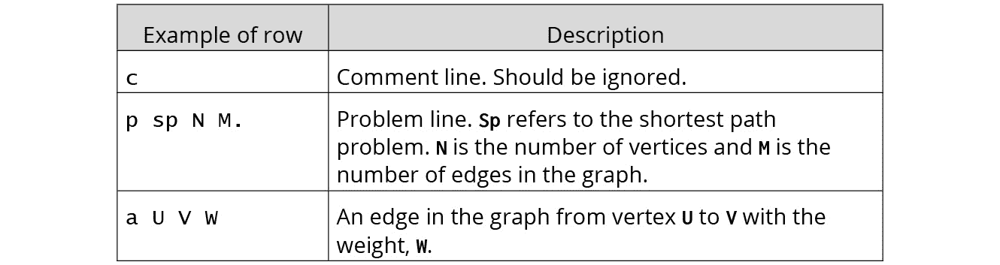

###### 图 6.32：描述纽约道路图文件的表

1.  实现加权边图。假设一旦创建了图，就不能从图中添加或删除顶点。

1.  实现一个函数来解析道路图文件并填充图。

1.  实现 Dijkstra 算法，并通过找到顶点`913`和`542`之间的最短路径来测试您的实现。您的输出应如下所示：

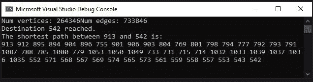

###### 图 6.33：活动 14 的预期输出

#### 注意

此活动的解决方案可在第 530 页找到。

## 总结

本章介绍了三个主要的图问题：首先是图遍历问题，介绍了两种解决方案，即广度优先搜索（BFS）和深度优先搜索（DFS）。其次，我们重新讨论了最小生成树（MST）问题，并使用 Prim 算法解决了该问题。我们还将其与 Kruskal 算法进行了比较，并讨论了应优先选择哪种算法的条件。最后，我们介绍了单源最短路径问题，该问题在图中寻找最小成本的最短路径，并介绍了 Dijkstra 的最短路径算法。

然而，Dijkstra 算法仅适用于具有正边权重的图。在下一章中，我们将寻求放宽此约束，并引入一种可以处理负边权重的最短路径算法。我们还将将最短路径问题概括为在图中找到所有顶点对之间的最短路径。
