# 第七章：图算法 II

## 学习目标

在本章结束时，你将能够：

+   描述 Dijkstra 算法的固有问题，并演示如何修改和/或与其他算法结合以规避这些问题

+   使用贝尔曼-福特和约翰逊算法在图中找到最短路径

+   描述图中强连通分量的重要性

+   使用 Kosaraju 算法在图中找到强连通分量

+   描述有向图和无向图中连通性的区别

+   实现复杂问题的深度优先搜索

+   评估图中的负权重循环

本章在上一章的基础上介绍了一些更高级的图算法。你还将学习如何处理负权重，并处理负权重循环的异常情况。

## 介绍

到目前为止，我们已经探讨了各种常见的编程结构和范式。现在，我们将深入探讨一些扩展我们之前讨论的主题的技术，首先是一系列高级图问题，然后转向动态规划这个广泛的主题。

在本章中，我们将讨论三种著名的算法，即贝尔曼-福特算法、约翰逊算法和 Kosaraju 算法。所有这些算法与我们在本书中已经涵盖的算法有明显的相似之处，但它们以各种方式扩展和组合这些算法，以比次优实现更高效地解决潜在复杂的问题。除了学习这些具体的技术，本章还应该增加你对基本图相关技术的一般熟悉度，并提供更深入的洞察力，了解这些基本技术如何应用于不同问题的各种不同范围。

## 重新审视最短路径问题

我们之前讨论了几种在图中找到两个节点之间最短路径的方法。我们首先探讨了最常见的图遍历形式，即深度优先搜索和广度优先搜索，最终讨论了如何处理包含加权边的图的更为棘手的情况。我们演示了如何使用 Dijkstra 算法来高效地找到加权图中的最短距离，通过贪婪地优先考虑遍历中的每一步，根据当前可用的最佳选项。然而，尽管 Dijkstra 算法提供了性能的改进，但它并不适用于每种情况。

考虑一个 Wi-Fi 信号通过网络进行广播；随着信号传播到原始传输点之外，其强度可能会受到许多因素的影响，比如传播距离和必须穿过的墙壁和其他障碍物的数量。如果你想确定信号到达每个目的地的路径，以最小化信号衰减，你可以创建一个加权图，网络中的每个点都由一个节点表示，任意两点之间的信号损失程度由加权边表示。然后，你可以使用 Dijkstra 算法计算图中的最短距离，以确定网络中成本最低的路径。

现在，假设网络中安装了中继器/增强器来增加特定点的信号强度-这种添加可能如何在你的图中表示？最明显的方法是将增强器节点的出边权重设置为负值（相当于它增加信号强度的程度），这将减少通过它的任何路径的总距离/衰减。如果我们在网络图上使用 Dijkstra 算法，这将如何影响我们的结果？

正如我们在上一章中讨论的，Dijkstra 算法在选择遍历中的每个顶点时采取了贪婪的方法。在每一步中，它找到最近的未访问的顶点，并将其添加到已访问的集合中，从而排除它不再考虑。Dijkstra 算法所做的假设是，到目前为止已经考虑的每个顶点的最短路径已经被找到，因此寻找更好的替代方案是没有意义的。然而，在包含负边权的图中，这种方法不会探索导致最佳解决方案的可能性，如果它们在遍历的早期阶段产生了更高的总和。

考虑一个带有负边权的图，如下图所示：

图 7.1：将 Dijkstra 算法应用于带有负权的图

](img/C14498_07_01.jpg)

###### 图 7.1：将 Dijkstra 算法应用于带有负权的图

在上图中，Dijkstra 算法遍历的路径用红色表示。假设我们从顶点 A 开始，第一次从节点*A*到节点*B*移动后，将有两个潜在的选择：*B —> C*，边权为*5*，和*B —> D*，边权为*10*。由于 Dijkstra 的贪婪方法，*C*将被选择为最短路径的下一个节点，但我们可以清楚地看到另一个选择（*B —> D —> C = 10 + -7 = 3*）实际上是最佳选择。

面对负边权时，Dijkstra 算法中固有的优化最终导致了它的失败。幸运的是，对于这样的图，我们可以采用一种类似于 Dijkstra 算法的替代方法，实现起来可能更简单。

## Bellman-Ford 算法

我们可以使用**Bellman-Ford 算法**来处理带有负权的图。它用图中每条边的替代方法替换了 Dijkstra 的贪婪选择方法，需要在图中迭代*V-1*次（其中*V*等于顶点的总数），并在每次迭代中找到从源节点到目的节点的逐渐最优距离值。这自然使其具有比 Dijkstra 算法更高的渐近复杂度，但也使其能够为 Dijkstra 算法会误解的图产生正确的结果。下面的练习展示了如何实现 Bellman-Ford 算法。

### 练习 32：实现 Bellman-Ford 算法（第一部分）

在这个练习中，我们将使用基本的 Bellman-Ford 算法来找到带有负权的图中的最短距离。让我们开始吧：

1.  首先，通过包括必要的库（以及为了方便起见，`namespace std`）来设置您的代码：

```cpp
#include <iostream>
#include <vector>
#include <climits>
using namespace std;
```

1.  让我们首先定义图中边的表示，这将需要三个变量：源节点的索引、目的节点的索引和它们之间的遍历成本：

```cpp
struct Edge
{
    int start;    // The starting vertex
    int end;      // The destination vertex
    int weight;   // The edge weight
    // Constructor
    Edge(int s, int e, int w) : start(s), end(e), weight(w) {}
};
```

1.  要实现 Bellman-Ford 算法，我们需要对图进行一些表示。为了简单起见，让我们假设我们的图可以用一个整数`V`来表示，表示图中顶点的总数，以及一个向量`edges`（指向定义图的邻接的'edge'对象的指针集合）。让我们还定义一个整数常量`UNKNOWN`，我们可以将其设置为某个始终大于图中任何边权子集的总和的任意高值（在`climits`中定义的`INT_MAX`常量很适合这个目的）：

```cpp
const int UNKNOWN = INT_MAX;
vector<Edge*> edges;   // Collection of edge pointers
int V;                 // Total number of vertices in the graph
int E;                 // Total number of edges in the graph
```

1.  让我们也编写一些代码来收集图的数据作为用户输入：

```cpp
int main()
{
    cin >> V >> E;
    for(int i = 0; i < E; i++)
    {
        int node_a, node_b, weight;
        cin >> node_a >> node_b >> weight;
        // Add a new edge using the defined constructor
        edges.push_back(new Edge(node_a, node_b, weight));
    }
    // Choose a starting node
    int start;
    cin >> start;
    // Run the Bellman-Ford algorithm on the graph for 
    // the chosen starting vertex 
    BellmanFord(start);
    return 0;
}
```

1.  现在，我们可以开始实现贝尔曼-福特算法本身。为了我们的目的，让我们创建一个名为`BellmanFord()`的函数，它接受一个参数`start`（我们要在图中找到最短路径的起始节点）并返回`void`。然后，我们将定义一个大小为`V`的距离数组，其中每个元素都初始化为`UNKNOWN`，除了起始节点，其索引初始化为`0`：

```cpp
    void BellmanFord(int start)
    {
        vector<int> distance(V, UNKNOWN);
        distance[start] = 0;
```

1.  大部分工作是在下一步完成的，在那里我们定义一个持续`V-1`次迭代并在每次重复中遍历整个边集的循环。对于每条边，我们检查其源节点的当前距离值是否不等于`UNKNOWN`（在第一次迭代中，这仅适用于起始节点）。假设这是真的，然后我们将其目标节点的当前距离值与边的权重与源节点的距离的总和进行比较。如果将边权重添加到当前节点的距离的结果小于目标节点的存储距离，则用新的总和替换距离数组中的值：

```cpp
// Perform V - 1 iterations
for(int i = 0; i < V; i++)
{
    // Iterate over entire set of edges
    for(auto edge : edges)
    {
        int u = edge->start;
        int v = edge->end;
        int w = edge->weight;
        // Skip nodes which have not yet been considered
        if(distance[u] == UNKNOWN)
        {
            continue;
        }
        // If the current distance value for the destination
        // node is greater than the sum of the source node's
        // distance and the edge's weight, change its distance
        // to the lesser value.
        if(distance[u] + w < distance[v])
        {
            distance[v] = distance[u] + w;
        }
    }
}
```

1.  在我们的函数结束时，我们现在可以遍历`distance`数组并输出从源到图中每个其他节点的最短距离：

```cpp
cout << "DISTANCE FROM VERTEX " << start << ":\n"
for(int i = 0; i < V; i++)
{
    cout << "\t" << i << ": ";
    if(distance[i] == UNKNOWN)
    {
        cout << "Unvisited" << endl;
        continue;
    }
    cout << distance[i] << endl;
}
```

1.  现在，我们可以返回到我们的`main()`方法，并调用我们新实现的`BellmanFord()`函数。让我们在*图 7.1*中的示例图上测试我们的实现。为此，我们应该运行我们的代码并输入以下输入：

```cpp
5 5
0 1 3
1 2 5
1 3 10
3 2 -7
2 4 2
0
```

1.  我们的程序应该输出以下内容：

```cpp
DISTANCE FROM VERTEX 0:
    0: 0
    1: 3
    2: 6
    3: 13
    4: 8
```

正如我们所看到的，贝尔曼-福特避免了导致狄克斯特拉算法错误评估最短路径的陷阱。然而，仍然存在另一个重要的问题需要解决，我们将在下一节中讨论。

## 贝尔曼-福特算法（第二部分）-负权重循环

考虑下图中显示的图形：

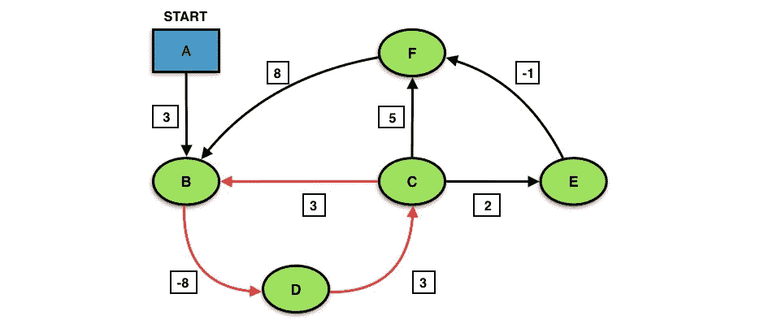

###### 图 7.2：带有负权重循环的图

用红色突出显示的边表示负权重循环或图中产生负和的组合边权重的循环。在这种情况下，将重复考虑此循环，并且最终结果将被扭曲。

为了进行比较，考虑一个仅具有正边权重的图。在这样的图中，循环永远不会被考虑在解决方案中，因为已经找到了到循环中第一个节点的最短距离。为了证明这一点，想象一下在前面的图中节点*B*和*D*之间的边权重是正的。从节点*A*开始，通过边的第一次迭代将确定到节点*B*的最短距离等于*3*。再经过两次迭代，我们还将知道从*A*到*C*的最短距离（*A—>B—>D—>C*），它等于*14*（*3+8+3*）。

显然，无法将任何正数添加到 14 中，以产生小于 3 的总和。在任何图遍历中最多可以有*| V-1 |*步骤，其中每个节点仅访问一次，我们可以确定*| V-1 |*次迭代足以确定每个可能的最短距离。通过推论，我们可以得出结论，在*| V-1 |*次迭代后，唯一可能存在更短路径的方式是如果重新访问节点并且导致它的边权重为负。因此，贝尔曼-福特算法的最后一步包括通过边执行一次迭代以检查是否存在这样的循环。

我们可以通过与找到最短路径时使用的相同逻辑来实现这一点：通过检查每条边的权重与其源节点的距离值的总和是否小于其目标节点的当前存储距离。如果在此步骤中找到了更短的路径，则终止算法并报告存在负循环。

我们将在下一个练习中探讨该算法的实现。

### 练习 33：实现贝尔曼-福特算法（第二部分）

在这个练习中，我们将修改*练习 32*中的实现，*实现贝尔曼-福特算法（第一部分）*，以处理具有负权重循环的图。让我们开始吧：

1.  我们基本上可以直接从上一步复制我们的代码。但是，这次，我们将用某种输出替换在确定是否找到了更短路径的条件下的代码，指示图包含负循环，从而使其无效：

```cpp
    // Iterate through edges one last time
    for(auto edge : edges)
    {
        int u = edge->start;
        int v = edge->end;
        int w = edge->weight;

        if(distance[u] == UNKNOWN)
        {
            continue;
        }
```

1.  如果我们仍然可以找到比我们已经找到的路径更短的路径，则图必须包含负循环。让我们用以下`if`语句检查负权重循环：

```cpp
        if(distance[u] + w < distance[v])
        {
            cout << "NEGATIVE CYCLE FOUND" << endl;
            return;
        }
    }
```

1.  现在，让我们将这段代码块插入到第一个`for`循环结束和第一行输出之间：

```cpp
void BellmanFord(int start)
{
    vector<int> distance(V, UNKNOWN);
    distance[start] = 0;
    for(int i = 1; i < V; i++)
    {
        for(auto edge : edges)
        {
            int u = edge->start;
            int v = edge->end;
            int w = edge->weight;
            if(distance[u] == UNKNOWN)
            {
                continue;
            } 
            if(distance[u] + w < distance[v])
            {
                distance[v] = distance[u] + w;
            }
        }
    }
    for(auto edge : edges)
    {
        int u = edge->start;
        int v = edge->end;
        int w = edge->weight;
        if(distance[u] == UNKNOWN)
        {
            continue;
        }
        if(distance[u] + w < distance[v])
        {
            cout << "NEGATIVE CYCLE FOUND" << endl;
            return;
        }
    }
    cout << "DISTANCE FROM VERTEX " << start << ":\n";
    for(int i = 0; i < V; i++)
    {
        cout << "\t" << i << ": ";
        if(distance[i] == UNKNOWN)
        {
            cout << "Unvisited" << endl;
            continue;
        }
        cout << distance[i] << endl;
    }
}
```

1.  为了测试我们添加的逻辑，让我们在以下输入上运行算法：

```cpp
6 8
0 1 3
1 3 -8
2 1 3
2 5 5
3 2 3
2 4 2
4 5 -1
5 1 8
0
```

1.  我们的程序应输出以下内容：

```cpp
NEGATIVE CYCLE FOUND
```

### 活动 15：贪婪机器人

您正在开发一款寻路机器人，必须找到通过障碍课程的最有效路径。为了测试目的，您设计了几个课程，每个课程都是一个方形网格。您的机器人能够穿越遇到的任何障碍，但这也需要更多的能量消耗。假设您的机器人从网格的左上角开始，并且可以沿着四个基本方向（北、南、东、西）移动，您必须实现一个算法，确定您的机器人可以以最大能量完成课程的数量。

由于执行此遍历所需的能量可能很高，您已经在整个网格中间插入了充电站，您的机器人有能力使用这些充电站来充电。不幸的是，您的机器人在能源消耗方面非常贪婪-如果它可以在不必回头的情况下多次到达一个能源站，它将不断返回到相同的位置，直到最终过度充电并爆炸！因此，您需要预测您的机器人是否会重新访问一个充电站，并在灾难发生之前中止遍历尝试。

**输入**

+   第一行包含一个整数`N`，即课程的高度和宽度。

+   接下来的`N``2` `- 1`行每行包含`directions`字符串和称为`power`的整数。每组`N`行对应于单行，从网格的顶部开始，每个单元格的数据从左到右定义（例如，在*3 x 3*网格中，*0 —> [0, 0], 1 —> [0, 1], 2 —> [0, 2], 3 —> [1, 0], 4 —> [1, 1]*，依此类推）。

+   `directions`包含来自集合{ '`N`'，'`S`'，'`E`'，'`W`' }的 0-3 个字符，它们代表您的机器人可以从每个点访问的单元格。因此，如果`directions`字符串是`SW`，则机器人可以从该点向南或向西移动。`power`表示穿过单元格所需的能量消耗。`power`的正值表示充电站位于单元格内。

**输出**

+   如果遍历课程导致机器人爆炸，请打印一行- `遍历中止`。

+   否则，打印出机器人在到达课程的右下角时可以拥有的最大能量，相对于它开始时的能量。例如，如果机器人可以比开始时多 10 个能量单位完成迷宫，则打印`10`；如果它完成迷宫时比开始时少 10 个能量单位，则打印`-10`。

**例子**

假设我们有以下输入：

```cpp
3
SE -10
SE -8
S -6
S 7
E -10
S 20
E -1
NE 5
```

网格的布局如下：

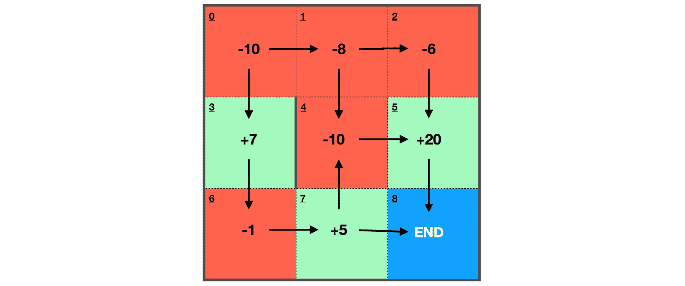

###### 图 7.3：机器人遍历的网格

达到右下角单元格的路径如下：

```cpp
0 —> 3 (-10)
3 —> 6 (+7)
6 —> 7 (-1)
7 —> 4 (+5)
4 —> 5 (-10)
5 —> 8 (+20)
(-10) + 7 + (-1) + 5 + (-10) + 20 
= 11 more units of energy
```

因此，您的程序应输出`11`。

**测试用例**

以下测试用例应帮助您更好地理解这个问题：

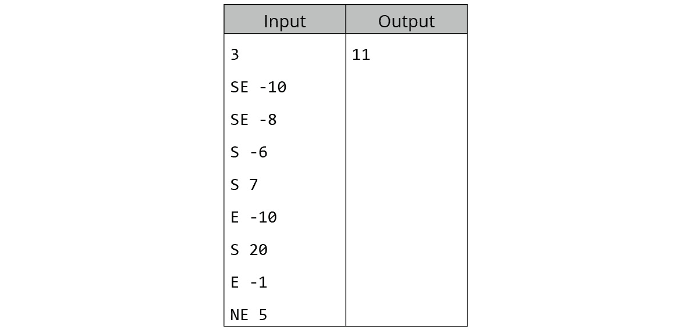

###### 图 7.4：活动 15 的测试案例 1

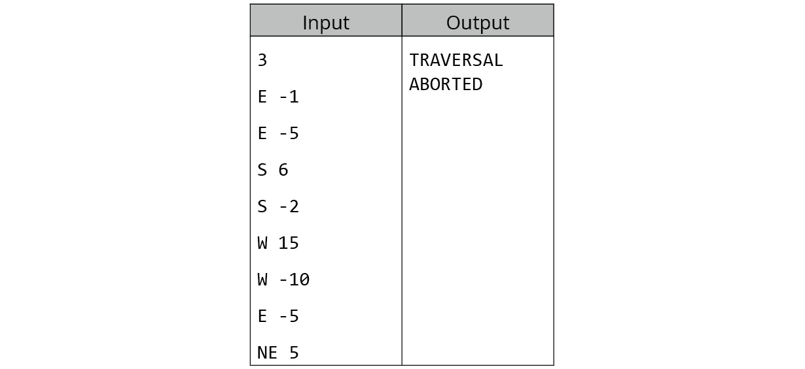

###### 图 7.5：活动 15 的测试案例 2

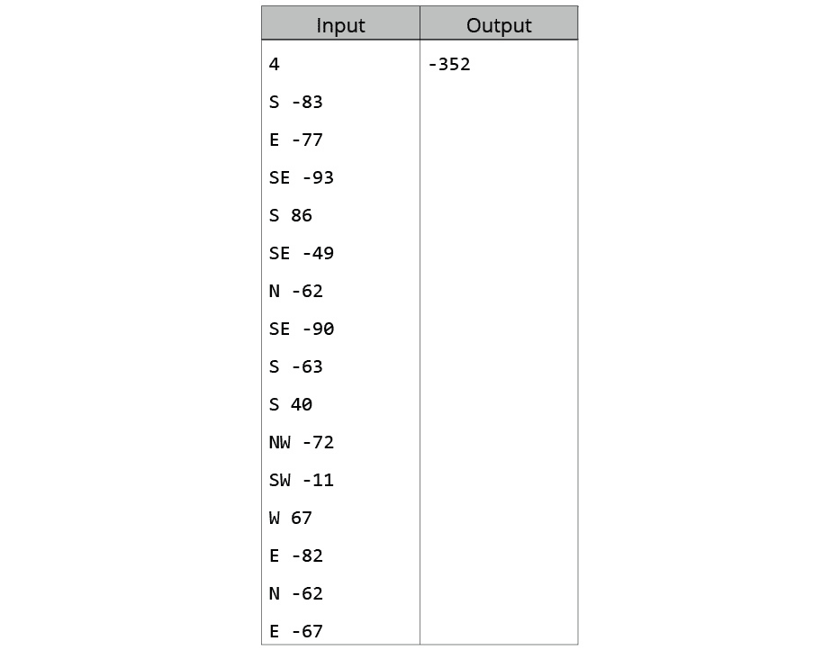

###### 图 7.6：活动 15 的测试案例 3

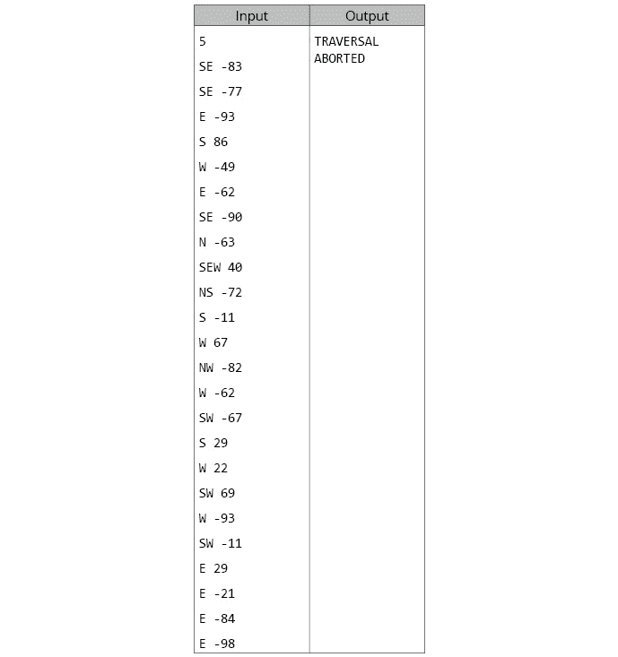

###### 图 7.7：活动 15 的测试案例 4

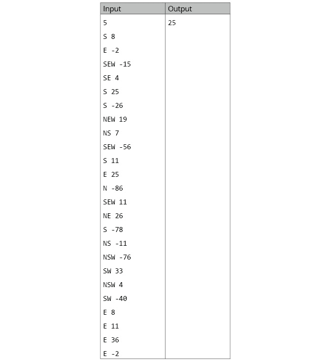

###### 图 7.8：活动 15 的测试案例 5

**活动指南**

+   不需要超出*练习 33*，*实现贝尔曼-福特算法（第二部分）*中涵盖的算法。

+   您可能需要重新解释一些输入，以使其与您试图解决的实际问题相对应。

+   无需将网格表示为二维。

#### 注意

此活动的解决方案可在第 537 页找到。

我们现在已经确定贝尔曼-福特比迪杰斯特拉算法更加灵活，因为它具有在迪杰斯特拉算法产生错误结果的情况下产生正确解决方案的能力。然而，如果我们考虑的图中不包含任何负边权，那么在这两者之间显然应选择迪杰斯特拉算法，因为其贪婪方法可能带来的潜在效率优势。现在，我们将探讨如何将贝尔曼-福特算法与迪杰斯特拉算法结合使用，以便用于具有负权重的图。

## 约翰逊算法

在比较了贝尔曼-福特算法和迪杰斯特拉算法的相对优点和缺点之后，我们现在将讨论一种将它们两者结合起来以检索图中每对顶点之间的最短路径的算法。**约翰逊算法**为我们提供了利用迪杰斯特拉算法的效率，同时为具有负边权的图产生正确结果的优势。

约翰逊算法的概念非常新颖 - 为了应对迪杰斯特拉处理负权重时的局限性，约翰逊算法简单地重新调整图中的边，使它们统一为非负数。这是通过贝尔曼-福特算法与一些特别优雅的数学逻辑相结合而实现的。

约翰逊算法的第一步是向图中添加一个新的“虚拟”顶点，然后通过权重为零的边将其连接到其他每个顶点。然后使用贝尔曼-福特算法找到新顶点与其余顶点之间的最短路径，并将距离存储以备后用。

考虑添加这个新顶点的影响：因为它与图中每个其他节点都有一条权重为 0 的边相连，所以它的最短路径距离永远不会是正数。此外，它与图中每个节点的连接确保了它的距离值在所有潜在遍历路径上保持恒定的关系，这导致这些值及其相应边权重形成的总和“望远镜”，换句话说，序列中的后续项互相抵消，使总和等同于第一项和最后一项的差。看一下下面的图：

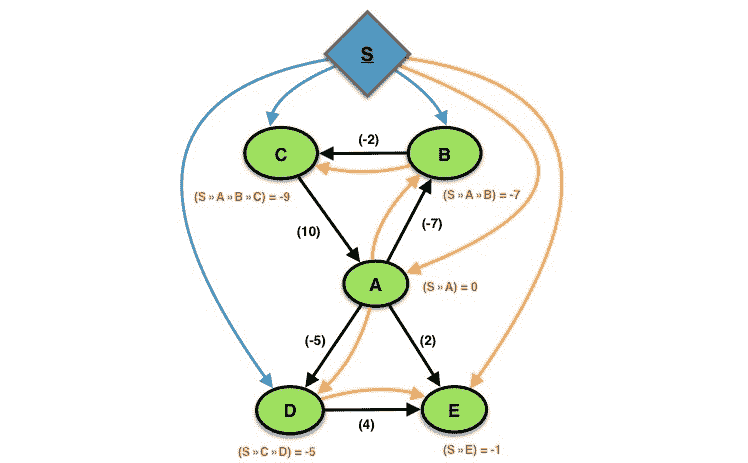

###### 图 7.9：在具有负权重的图上应用约翰逊算法

在前面的图中，标有`S`的菱形节点代表虚拟顶点，黑色括号中的数字代表边权重，红色文本代表从`S`到每个节点的最短路径，橙色箭头代表从`S`遍历的最佳路径，蓝色箭头代表从`S`分支出的权重为 0 的边，这些边不包括在任何`S`的最短路径中。

让我们将新的距离值按照它们在图的遍历中的出现顺序排列成一个序列 - `A --> B --> C --> A --> D --> E`：


###### 图 7.10：每个节点遍历的距离

如果我们将原始边权重插入到它们连接的节点的距离值之间，序列将如下所示：

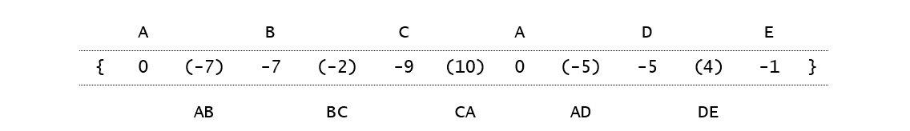

###### 图 7.11：计算已经遍历的距离

现在，让我们将以下公式应用于边值：

```cpp
W(uv) = w(uv) + d[s, u] - d[s, v]
```

这里，`w(uv)`表示节点`u`和`v`之间的原始边权重，`d[s, u]`和`d[s, v]`表示`S`和`u/v`之间的最短路径距离，`W(uv)`表示转换后的边权重值。应用这个公式得到以下结果：

```cpp
AB —> (-7) +   0  – (-7) = 0
BC —> (-2) + (-7) – (-9) = 0
CA —>  10  + (-9) –   0  = 1
AD —> (-5) +   0  – (-5) = 0
DE —>   4  + (-5) – (-1) = 0
```

请注意，表达式中的第三项总是在后续迭代中被中间项抵消；这展示了公式的“折叠”特性。由于这个特性，表示节点 A 和 E 之间距离的以下两个表达式是等价的：

```cpp
(w(AB) + d[s, A] - d[s, B]) + (w(BC) + d[s, B] - d[s, C]) + … + (w(DE) + d[s, D] - d[s, E])
(w(AB) + w(BC) + w(CA) + w(AD) + w(DE)) + d[s, A] - d[s, E]
```

这意味着在图中任何路径上添加的权重量等于添加到其子路径的权重量。我们知道，由于 Bellman-Ford 返回的距离数组确保对于任何一对`u,v`，我们有`d[s, u] + weight(u, v) >= d[s, v]`，因此这些值的相加结果总是非负的。因此，`w(u, v) + d[s, u] - d[s, v]`的值永远不会小于 0。

由于应用了转换，图中任何最短路径中将要遍历的每条边都将被重新加权为零，这使我们得到了非负的权重值，而且令人惊讶的是，它们仍然保留了原始的最短路径顺序！现在我们可以使用这些新的权重值在图上执行 Dijkstra 算法，以高效地检索每对节点的最短路径。

我们将在下一个练习中探讨 Johnson 的算法的实现。

### 练习 34：实现 Johnson 的算法

在这个练习中，我们将实现 Johnson 的算法，以找到具有负权重的图中每个节点到其他每个节点的最短距离。让我们开始吧：

1.  我们可以重用前一个练习中的大部分代码，包括我们的`Edge`结构，`UNKNOWN`常量和图数据：

```cpp
#include <iostream>
#include <vector>
#include <climits>
using namespace std;
struct Edge
{
    int start;
    int end;   
    int weight;
    Edge(int s, int e, int w) : start(s), end(e), weight(w) {}
};
const int UNKNOWN = INT_MAX;
vector<Edge*> edges;
int V;             
int E;             
```

1.  我们应该修改 Bellman-Ford 的函数声明，使其接受两个参数（一个整数`V`和一个`Edge`指针的向量`edges`），并返回一个整数向量。我们还可以删除`start`参数：

```cpp
vector<int> BellmanFord(int V, vector<Edge*> edges)
```

1.  我们将首先向图中添加虚拟顶点`S`。因为`S`实际上对图的其余部分没有影响，所以这只是简单地增加距离数组的大小到*| V + 1 |*并在`S`和每个其他节点之间添加一条边：

```cpp
vector<int> distance(V + 1, UNKNOWN);
int s = V;
for(int i = 0; i < V; i++)
{
    edges.push_back(new Edge(s, i, 0));
}
distance[s] = 0;
```

1.  我们继续将 Bellman-Ford 的标准实现应用于修改后的图，使用`S`作为源节点：

```cpp
for(int i = 1; i < V; i++)
{
    for(auto edge : edges)
    {
        int u = edge->start;
        int v = edge->end;
        int w = edge->weight;
        if(distance[u] == UNKNOWN)
        {
            continue;
        }
        if(distance[u] + w < distance[v])
        {
            distance[v] = distance[u] + w;
        }
    }
}
```

1.  这次，让我们将负循环的最终检查移到自己的函数中：

```cpp
bool HasNegativeCycle(vector<int> distance, vector<Edge*> edges)
{
    for(auto edge : edges)
    {
        int u = edge->start;
        int v = edge->end;
        int w = edge->weight;
        if(distance[u] == UNKNOWN) continue;
        if(distance[u] + w < distance[v])
        {
            return true;
        }
    }
    return false;
}
```

1.  现在，我们可以在原始函数的末尾调用它，如果发现负循环，则返回一个空数组：

```cpp
if(HasNegativeCycle(distance, edges))
{
    cout << "NEGATIVE CYCLE FOUND" << endl;
    return {};
}
```

1.  在确保图中没有负循环之后，我们可以将结果距离值集返回给调用函数，并对图中的每条边应用重新加权公式。但首先，让我们实现 Dijkstra 的算法：

```cpp
vector<int> Dijkstra(int V, int start, vector<Edge*> edges)
```

1.  现在，让我们声明一个整数向量`distance`和一个布尔向量`visited`。通常情况下，`distance`的每个索引都将初始化为`UNKNOWN`（除了起始顶点），`visited`的每个索引都将初始化为 false：

```cpp
vector<int> distance(V, UNKNOWN);
vector<bool> visited(V, false);
distance[start] = 0;
```

1.  我们的 Dijkstra 算法实现将利用一个简单的迭代方法，使用`for`循环。正如你可能还记得的，Dijkstra 算法需要在遍历的每一步中找到具有最小距离值的节点。虽然通常是通过优先队列来实现这一点，但我们将通过编写另一个短函数`GetMinDistance()`来实现这一点，该函数将以距离和访问数组作为参数，并返回具有最短路径值的节点的索引：

```cpp
// Find vertex with shortest distance from current position and
// return its index
int GetMinDistance(vector<int> &distance, vector<bool> &visited)
{
    int minDistance = UNKNOWN;
    int result;
    for(int v = 0; v < distance.size(); v++)
    {            
        if(!visited[v] && distance[v] <= minDistance)
        {
            minDistance = distance[v];
            result = v;
        }
    }
    return result;
}
```

1.  现在我们可以完成实现 Dijkstra 算法：

```cpp
for(int i = 0; i < V - 1; i++)
{
    // Find index of unvisited node with shortest distance
    int curr = GetMinDistance(distance, visited);
    visited[curr] = true;
    // Iterate through edges
    for(auto edge : edges)
    {
        // Only consider neighboring nodes
        if(edge->start != curr) continue;
        // Disregard if already visited
        if(visited[edge->end]) continue;
        if(distance[curr] != UNKNOWN && distance[curr] + edge->weight < distance[edge->end])
        {
        distance[edge->end] = distance[curr] + edge->weight;
        }
    }
}
return distance;
```

1.  现在我们已经有了执行 Johnson 算法所需的一切。让我们声明一个新函数`Johnson()`，它也将以`V`和`edges`作为参数：

```cpp
void Johnson(int V, vector<Edge*> edges)
```

1.  我们首先创建一个整数向量`h`，并将其设置为`BellmanFord()`的输出：

```cpp
// Get distance array from modified graph
vector<int> h = BellmanFord(V, edges);
```

1.  我们检查`h`是否为空。如果是，我们终止函数：

```cpp
if(h.empty()) return; 
```

1.  否则，我们应用重新加权公式：

```cpp
for(int i = 0; i < edges.size(); i++)
{
    edges[i]->weight += (h[edges[i]->start] - h[edges[i]->end]);
}
```

1.  为了存储每对节点的最短路径距离，我们初始化一个具有`V`行的矩阵（这样每对二维索引`[i, j]`表示顶点`i`和顶点`j`之间的最短路径）。然后我们对 Dijkstra 算法进行`V`次调用，它返回每个起始节点的`distance`数组：

```cpp
// Create a matrix for storing distance values
vector<vector<int>> shortest(V);
// Retrieve shortest distances for each vertex
for(int i = 0; i < V; i++)
{
    shortest[i] = Dijkstra(V, i, edges);
}
```

1.  毫不奇怪，我们在这一步积累的结果相当不准确。由于我们的重新加权操作，现在每个距离值都是正的。然而，这可以通过将相同的公式逆向应用于每个结果来很简单地纠正：

```cpp
// Reweight again in reverse to get original values
for(int i = 0; i < V; i++)
{
    cout << i << ":\n";
    for(int j = 0; j < V; j++)
    {
        if(shortest[i][j] != UNKNOWN)
        {
            shortest[i][j] += h[j] - h[i];
            cout << "\t" << j << ": " << shortest[i][j] << endl;
        }
    }
}
```

1.  现在，让我们回到我们的`main()`函数并实现处理输入的代码。在我们收集了输入图的边之后，我们只需要对`Johnson()`进行一次调用，我们的工作就完成了：

```cpp
int main()
{
    int V, E;
    cin >> V >> E;
    vector<Edge*> edges;
    for(int i = 0; i < E; i++)
    {
        int node_a, node_b, weight;
        cin >> node_a >> node_b >> weight;
        edges.push_back(new Edge(node_a, node_b, weight));
    }
    Johnson(V, edges);
    return 0;
}
```

1.  让我们使用以下输入来测试我们的算法：

```cpp
7 9
0 1 3
1 2 5
1 3 10
1 5 -4
2 4 2
3 2 -7
4 1 -3
5 6 -8
6 0 12
```

1.  输出应该如下：

```cpp
0:
    0: 0
    1: 3
    2: 6
    3: 13
    4: 8
    5: -1
    6: -9
1:
    0: 0
    1: 0
    2: 3
    3: 10
    4: 5
    5: -4
    6: -12
2:
    0: -1
    1: -1
    2: 0
    3: 9
    4: 2
    5: -5
    6: -13
4:
    0: -3
    1: -3
    2: 0
    3: 7
    4: 0
    5: -7
    6: -15
5:
    0: 4
    1: 7
    2: 10
    3: 17
    4: 12
    5: 0
    6: -8
6:
    0: 12
    1: 15
    2: 18
    3: 25
    4: 20
    5: 11
    6: 0
```

从前面的输出中可以看出，我们已成功打印了从每个节点到其他每个节点的最短距离。

### 活动 16：随机图统计

你是一家知名软件公司的开发人员，每年都会接收大量的新求职者。因此，每个员工都必须参与进行技术面试的过程。在每次面试之前，你会得到一组三个编程问题，每个问题包含一个简短的描述，以及两到三个不断增加难度的测试用例。

最近有人向你提出，一些面试者事先获得了某些面试问题的测试用例。因此，有关方面要求你每隔几周就创建新的测试用例集。对大多数问题产生合理的测试用例并不特别具有挑战性，除了涉及图论的问题。你已经注意到设计一个既有效又与问题相关的图的过程可能有点耗时，因此你已决定自动化这个过程。

你的公司最常见的与图相关的面试问题是全对最短路径问题，这要求面试者找到有向加权边图中每对顶点之间的最短距离。由于这个问题的性质，你希望生成的图对于评估面试者对问题的理解是有用的。你决定如果一个图符合以下标准，它将对技术面试有用：

+   这是一个有向图，可以包含正边权和负边权。

+   任何一对节点之间应该只有一条边，且没有节点应该有指向自身的边。

+   每个节点应至少有一条入边或出边。

+   任何边权的绝对值应小于 100。

该实用程序应接受以下输入：

+   `seed`：用于随机数生成的种子值

+   `iterations`：要生成的图的数量

+   `V`：顶点的数量

+   `E`：边的数量

该工具应该使用对`std::rand()`的调用来处理每条边的生成。如果它尝试在相同节点对之间创建第二条边，则应停止生成新的边，直到找到有效的节点对。

图的生成应按以下方式进行：

1. 接收输入（`seed`，`iterations`，`V`和`E`）

2. 设置随机数生成器的种子值

3. 对于每次迭代，执行以下操作：

+   将 i 设置为 0

- 尝试通过执行三次`rand()`调用来创建边，以生成源节点、目标节点和边权值（按顺序）的值。

- 检查`rand()`生成的下一个值是否能被`3`整除；如果可以，使边权值为负数。

+   如果源节点和目标节点之间已经存在一条边，请重试：

- 将`edge(source, destination, weight)`添加到边集合中并递增`i`。

- 如果创建了`E`条边后存在一个不属于任何边的节点，则认为图无效。

如果生成的图是有效的，您应该找到图中每对节点之间的最短路径，就像我们在面试中所期望的那样。对于图中的每个节点，您希望找到其所有路径的平均最短距离（即距离值之和除以可到达节点的数量）。图的平均距离将被定义为这些值的平均值。

您还对哪些值集合倾向于产生最多“有趣”的图感兴趣。当图的平均距离小于最高边权值的一半时，您认为图是有趣的。因此，您的算法应该输出有趣图与有效图的比率（以百分比显示并四舍五入到两位小数）。请注意，对于这个特定目的，您认为具有负权重环的连通图是有效但不是有趣的。

**输入格式**

包含四个整数的一行；即`seed`，`iterations`，`V`和`E`。

**输出格式**

两行，第一行包含`INVALID:`字符串，后面是无效图的数量，第二行包含`PERCENT INTERESTING:`字符串，后面是有趣图与有效图的比率，以百分比显示并四舍五入到两位小数。

**活动指南**

对`std::rand()`的调用在每个环境中不一定会产生相同的值。为了确保一致性，您可以将以下代码复制/粘贴到您的程序中（取自 C 标准）：

```cpp
static unsigned long int randNext = 1;
int rand(void) // RAND_MAX assumed to be 32767
{
    randNext = randNext * 1103515245 + 12345;
    return (unsigned int)(randNext/65536) % 32768
}
void srand(unsigned int seed)
{
    randNext = seed;
}
```

在实现图生成工具时，请确保按照问题描述中的确切顺序进行步骤。

**测试用例**

以下是一些示例输入和输出，应该帮助您更好地理解问题：

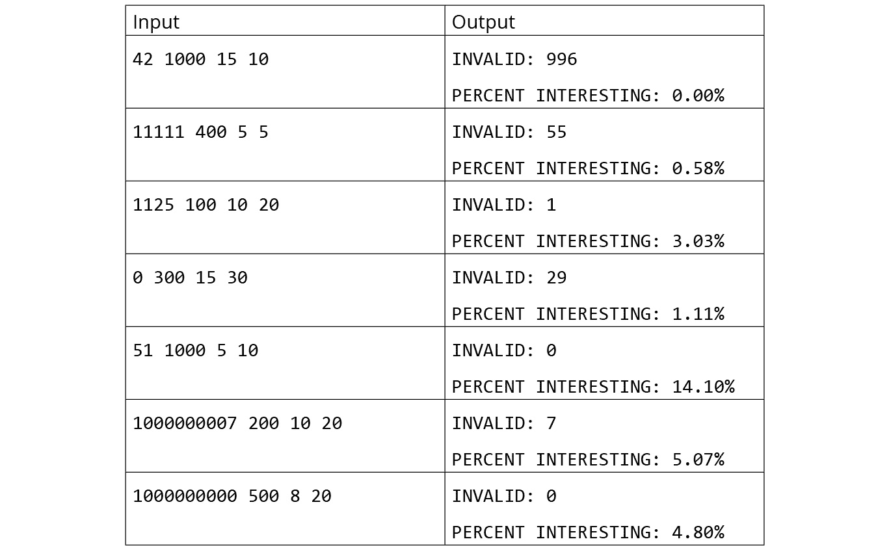

###### 图 7.12：活动 16 的测试用例

#### 注意

此活动的解决方案可在第 541 页找到。

## 强连通分量

在前几章中，我们讨论了图的几种分类。描述图特征的最常见方式之一是说明它是有向的还是无向的。后者定义了边默认是双向的图（如果节点 A 有一条连接到节点 B 的边，则节点 B 也有一条连接到节点 A 的边），而前者描述了具有定向边的图。

想象一下，你是一个视频托管网站的员工，负责制作关于各个频道订阅者之间共同点的统计数据。你的公司特别希望发现订阅某些频道的个人与频道所有者的订阅之间的模式，希望更深入地了解他们的定向广告服务应该如何定位。你的公司提供的服务最近变得相当广泛，因此你需要一种方法来以清晰的方式组织相关数据，以产生有用的统计信息。

让我们将网站每个用户的频道视为定向图中的节点，它们之间的邻接表示他们订阅的其他频道的所有者。我们可能会注意到，即使在订阅相同频道的大群用户中，所有个人订阅集合的多样性也会极大地复杂化我们找到它们之间的任何区别相似性的能力。理想情况下，我们希望解开图中庞大的连接混乱，并将数据放入明确的组中，其中每个用户的订阅与其他用户的订阅有某种关联。

我们可以通过观察定向图的某些共同特征来解开这个特定问题的复杂性。因为定向图的边不一定是双向的，我们可以逻辑推断出，取决于从哪个节点开始遍历，对图的某些部分的访问可能会受到限制。如果你将一个图分成不同的集合，使得同一集合中的任意一对顶点之间都有连接路径，那么得到的组将代表图的强连通分量。

### 定向图和无向图中的连通性

无向图的连通分量可以描述为主图中包括每个节点的最大子图的集合，其中同一组内的每个节点都与其他节点“连接”（即，单个分量内任意两个节点之间的访问是无限制的）。在一个连通图中，无论遍历从哪里开始，每个节点都可以被访问，因此我们可以推断出这样的图由单个连通分量（整个图）组成。相反，任何具有从一点到另一点受限制访问的图被描述为不连通。

另一方面，所谓的“强”连通性是定向图所特有的特征。为了相对地理解“强连通性”的定义上的差异，观察以下无向图的例子：

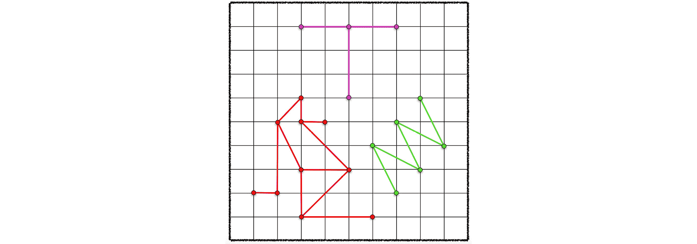

###### 图 7.13：具有不同连通分量的图

三个彩色子图分别代表一个独立的连通分量。正如我们之前所述，它们的连通性是由每个顶点都与同一组内的其他顶点有路径连接这一事实所定义的。此外，来自一个分量的任何顶点都没有与不同分量连接的路径。从前面的图中，我们可以看到无向图的连通分量被划分为完全独立的组，其中任何分量的节点和边都与其他分量完全隔离。

相比之下，强连通分量不需要完全与图中的其他分量隔离 - 也就是说，可以存在在分量之间重叠的路径：

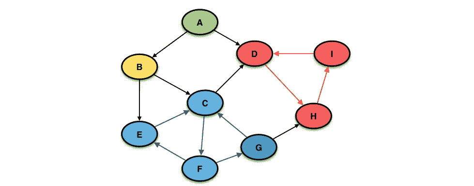

###### 图 7.14：具有不同强连通分量的图

在前面的图中，我们可以看到有四个强连通分量：*A*，*B*，*CEFG*和*DHI*。请注意，节点*A*和*B*是它们各自集合中唯一的成员。通过进一步研究节点*A*，我们可以看到，尽管*A*与*DHI*集合中的每个节点都有路径，但*DHI*集合中的节点没有任何通往节点*A*的路径。

回到我们的视频托管网站示例，我们可以将网络图的强连通分量定义为组，其中每个频道都可以通过在同一组内与其他用户频道的订阅路径中找到。以这种方式分解潜在的大量数据可能有助于从没有区别相似性的图关系中隔离出相关的图关系集：

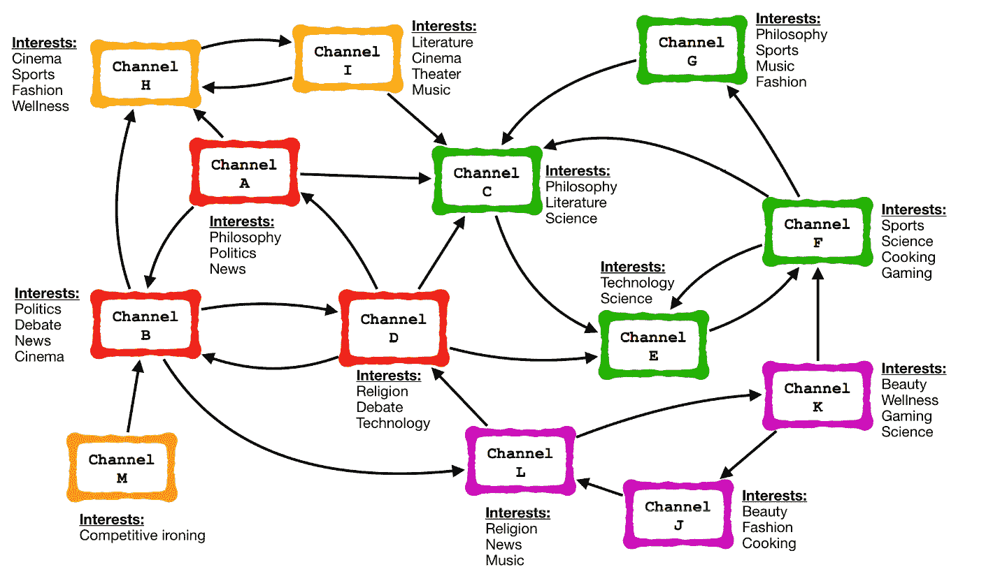

###### 图 7.15：将不同强连通分量表示为图的示例数据集

## Kosaraju's Algorithm

找到图的强连通分量最常见且概念上容易理解的方法之一是 Kosaraju 算法。Kosaraju 算法通过执行两组独立的 DFS 遍历来工作，首先探索原始形式的图，然后对其进行转置。

#### 注意

尽管 DFS 是 Kosaraju 算法中通常使用的遍历类型，但 BFS 也是一个可行的选择。然而，在本章中包括的解释和练习中，我们将坚持传统的基于 DFS 的方法。

图的转置与原始图本质上相同，只是其每条边中的源/目标顶点被交换（也就是说，如果原始图中有一条从节点*A*到节点*B*的边，转置图中将有一条从节点*B*到节点*A*的边）：

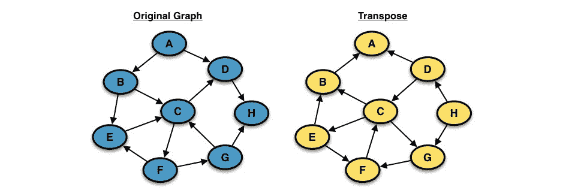

###### 图 7.16：图的转置

算法的第一步（初始化后）是遍历图的顶点并执行 DFS 遍历，从尚未在先前遍历中访问过的每个节点开始。在 DFS 的每个点开始时，当前节点被标记为已访问，然后探索其所有未访问的邻居。在调查完每个当前节点的邻接点之后，它被添加到栈的顶部，然后当前递归子树被终止。

在探索原始图中的每个顶点之后，从栈的顶部弹出的每个未访问节点也会在其转置中执行相同的操作。在这一点上，每次以唯一起点进行的后续 DFS 遍历遇到的节点集合代表了图的一个强连通分量。

Kosaraju 算法在直观上简化了一个潜在复杂的问题，将其简化为相当容易实现的东西，因此在效率上也是相当高效的，假设输入图具有邻接表表示，它的渐近复杂度也是线性的*O(V + E)*。

#### 注意

由于在遍历中需要大量额外的迭代来查找每个顶点的邻居，因此不建议使用此算法的邻接矩阵。

我们将在下面的练习中看一下 Kosarju 算法的实现。

### 练习 35：实现 Kosaraju 算法

在这个练习中，我们将使用 Kosaraju 算法找到图中的强连通分量。让我们开始吧：

1.  对于我们实现 Kosaraju 算法，我们需要包括以下头文件：

```cpp
#include <iostream>
#include <vector>
#include <stack>
```

1.  让我们定义一个名为`Kosaraju()`的函数，它接受两个参数 - 一个整数`V`（顶点的数量），一个整数向量的向量`adj`（图的邻接表表示） - 并返回一个整数向量的向量，表示输入图的每个强连通分量中的节点索引集合：

```cpp
vector<vector<int>> Kosaraju(int V, vector<vector<int>> adj)
```

1.  我们的第一步是声明我们的堆栈容器和访问数组（每个索引都初始化为`false`）。然后我们遍历图的每个节点，从尚未标记为`visited`的每个索引开始我们的 DFS 遍历：

```cpp
vector<bool> visited(V, false);
stack<int> stack;
for(int i = 0; i < V; i++)
{
    if(!visited[i])    
    {
        FillStack(i, visited, adj, stack);
    }
}
```

1.  我们的第一个 DFS 函数`FillStack()`接受四个参数：一个整数节点（遍历中当前点的顶点索引），一个名为`visited`的布尔向量（先前遍历的节点集），以及两个整数向量`adj`（图的邻接表）和`stack`（按照探索顺序排列的已访问节点索引列表）。最后三个参数将从调用函数中传递引用。DFS 是以标准方式实现的，除了在每个函数调用结束时将当前节点的索引推送到堆栈的附加步骤：

```cpp
void FillStack(int node, vector<bool> &visited,
vector<vector<int>> &adj, stack<int> &stack)
{
    visited[node] = true;
    for(auto next : adj[node])
    {
        if(!visited[next])
        {
            FillStack(next, visited, adj, stack);
        }
    }
    stack.push(node);
}
```

1.  现在，让我们定义另一个名为`Transpose()`的函数，它接受原始图的参数，并返回其转置的邻接表：

```cpp
vector<vector<int>> Transpose(int V, vector<vector<int>> adj)
{
    vector<vector<int>> transpose(V);
    for(int i = 0; i < V; i++)
    {
        for(auto next : adj[i])
        {
            transpose[next].push_back(i);
        }
    }
    return transpose;
}
```

1.  为了准备下一组遍历，我们声明了邻接表转置（初始化为我们的`Transpose()`函数的输出），并重新将我们的访问数组初始化为`false`：

```cpp
    vector<vector<int>> transpose = Transpose(V, adj);

    fill(visited.begin(), visited.end(), false);
```

1.  我们的算法的第二部分，我们需要定义我们的第二个 DFS 函数`CollectConnectedComponents()`，它与`FillStack()`接受相同的参数，除了第四个参数现在被替换为整数向量组件的引用。这个向量组件是我们将在图中存储每个强连通分量的节点索引的地方。遍历的实现也几乎与`FillStack()`函数相同，除了我们删除将节点推入堆栈的行。相反，我们在函数的开头包含一行，将遍历的节点收集到组件向量中：

```cpp
void CollectConnectedComponents(int node, vector<bool> &visited,
vector<vector<int>> &adj, vector<int> &component)
{
    visited[node] = true;
    component.push_back(node);
    for(auto next : adj[node])
    {
        if(!visited[next])
        {
            CollectConnectedComponents(next, visited, adj, component);
        }
    }
}
```

1.  回到我们的`Kosaraju()`函数，我们定义了一个称为`connectedComponents`的整数向量的向量，这是我们将存储在转置上执行的每次遍历的结果的地方。然后，我们在`while`循环中迭代地从堆栈中弹出元素，再次从未访问的节点开始每次 DFS 遍历。在每次调用 DFS 函数之前，我们声明由`CollectConnectedComponents()`引用的组件向量，然后在遍历完成后将其推送到`connectedComponents`。当堆栈为空时，算法完成，之后我们返回`connectedComponents`：

```cpp
vector<vector<int>> connectedComponents;
while(!stack.empty())
{
    int node = stack.top();
    stack.pop();
    if(!visited[node])
    {
        vector<int> component;
        CollectConnectedComponents(node, visited, transpose, component);
        connectedComponents.push_back(component);
    }
}
return connectedComponents;
```

1.  从我们的`main()`函数中，我们现在可以通过在单独的行上打印每个向量的值来输出每个强连通分量的结果：

```cpp
int main()
{
    int V;
    vector<vector<int>> adj;
    auto connectedComponents = Kosaraju(V, adj);
    cout << "Graph contains " << connectedComponents.size() << " strongly connected components." << endl;
    for(auto component : connectedComponents)
    {
        cout << "\t";
        for(auto node : component)
        {
            cout << node << " ";
        }
        cout << endl;
    }
}
```

1.  为了测试我们新实现的算法的功能，让我们基于以下图创建一个邻接表表示：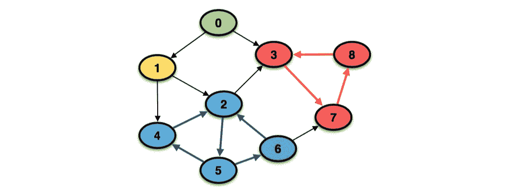

###### 图 7.17：示例输入数据的图形表示

1.  在`main()`中，`V`和`adj`将被定义如下：

```cpp
int V = 9;
vector<vector<int>> adj =
{
    { 1, 3 },
    { 2, 4 },
    { 3, 5 },
    { 7 },
    { 2 },
    { 4, 6 },
    { 7, 2 },
    { 8 },
    { 3 } 
};
```

1.  执行我们的程序后，应该显示以下输出：

```cpp
Graph contains 4 strongly connected components.
    0 
    1 
    2 4 5 6 
    3 8 7
```

### 活动 17：迷宫传送游戏

您正在设计一个游戏，其中多个玩家随机放置在一个迷宫的房间中。每个房间都包含一个或多个传送装置，玩家可以使用它们在迷宫的不同部分之间旅行。每个传送装置都有一个与之关联的值，这个值将被添加到使用它的任何玩家的得分中。玩家轮流穿越迷宫，直到每个房间至少被访问一次为止，然后回合结束，得分最低的玩家获胜。

您已经实施了一个系统，在每场比赛开始时会程序生成一个新的迷宫。不幸的是，您最近发现一些生成的迷宫包含了玩家可以使用的循环，无限降低他们的得分。您还注意到玩家经常根据他们所在的房间拥有不公平的优势。最糟糕的是，传送门经常分散在这样的方式，以至于玩家最终可能被隔离在迷宫的某个部分，持续一轮比赛。

您希望实施一个测试程序，以确保生成的迷宫是公平且平衡的。您的测试应该首先确定迷宫是否包含可用于无限降低玩家得分的路径。如果是，它应该输出`INVALID MAZE`。如果迷宫有效，您应该找到可以从每个起点获得的最低分数并报告它们（或在没有传送门的房间的情况下报告`DEAD END`）。

此外，您希望防止在迷宫的特定部分中被困住的可能性，因此您的测试还应输出玩家无法访问迷宫其他部分的任何房间组。

**预期输入**

每个测试应该接收以下输入：

+   迷宫中的房间数量

+   迷宫中的传送门数量

+   源房间、目标房间以及与每个传送门相关联的点数

**预期输出**

对于每个测试，程序应首先确定迷宫中是否存在可以用于无限降低玩家得分的路径。如果是，它应该打印一行：`INVALID MAZE`。

如果迷宫有效，您的程序应输出可以从每个房间开始实现的最低分数（或在房间没有传送门的情况下输出`DEAD END`），假设至少进行一次移动并且整个迷宫只能遍历一次。最后，您的程序应列出玩家可能被“困住”的房间组（即，他们完全无法访问迷宫的其他部分）；对于每个这样的组，您的程序应在单独的行上打印每个房间的索引。

**样本输入和输出**

以下是一些样本输入，应该帮助您更好地理解这个问题：

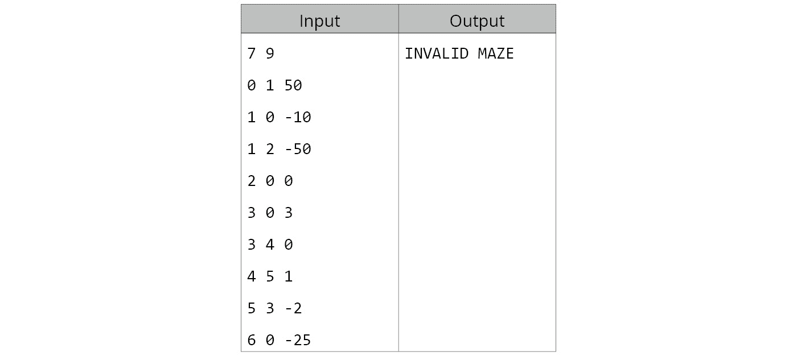

###### 图 7.18：活动 17 的测试用例 1

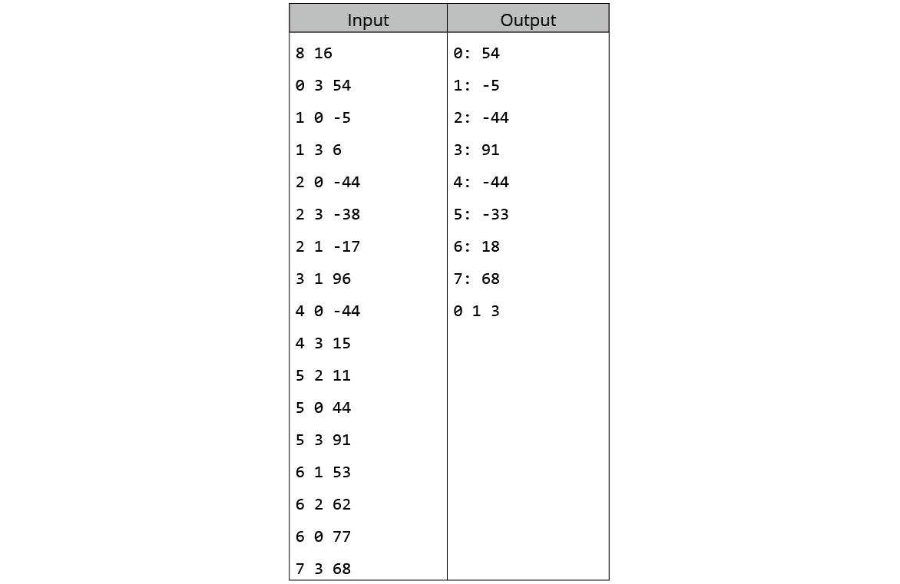

###### 图 7.19：活动 17 的测试用例 2

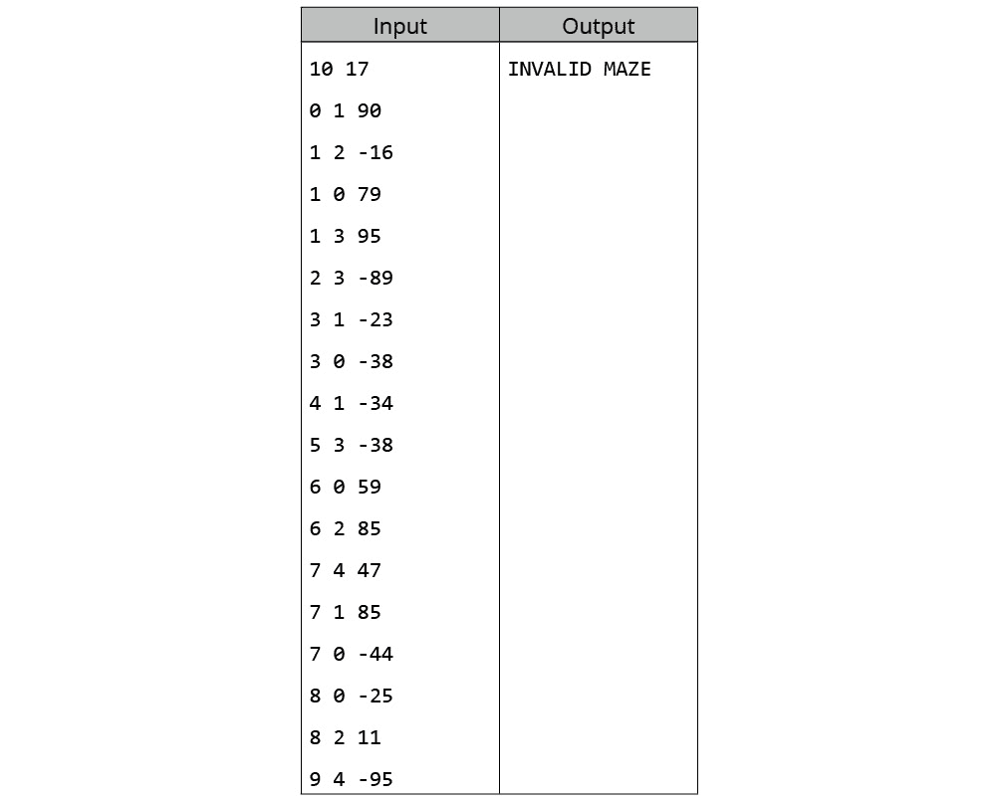

###### 图 7.20：活动 17 的测试用例 3

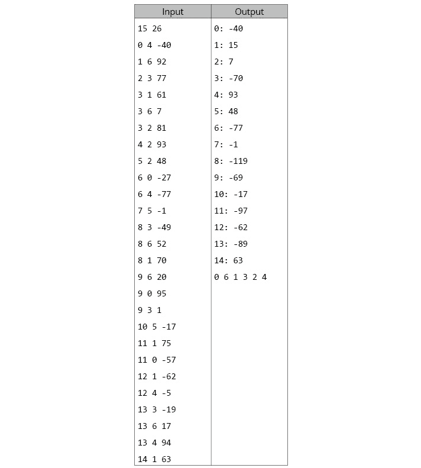

###### 图 7.21：活动 17 的测试用例 4

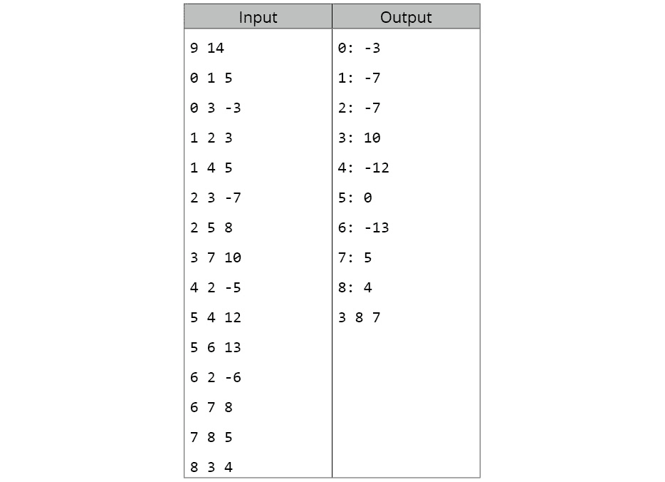

###### 图 7.22：活动 17 的测试用例 5

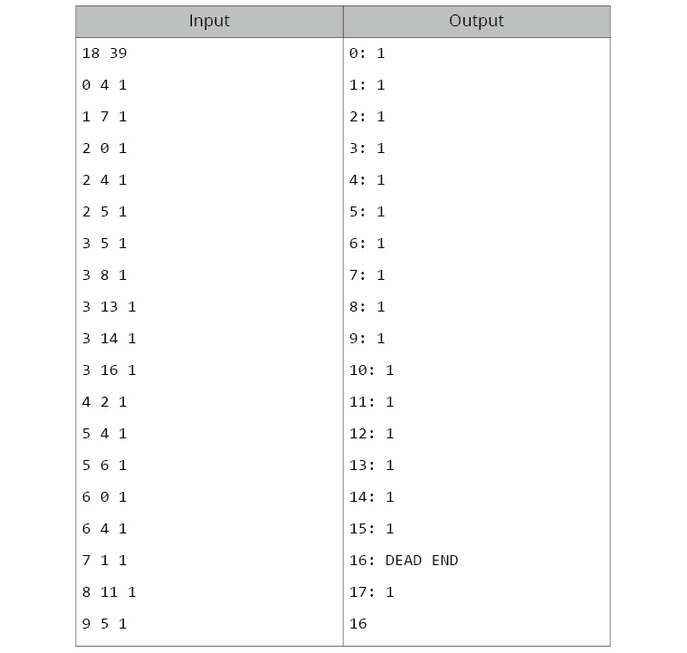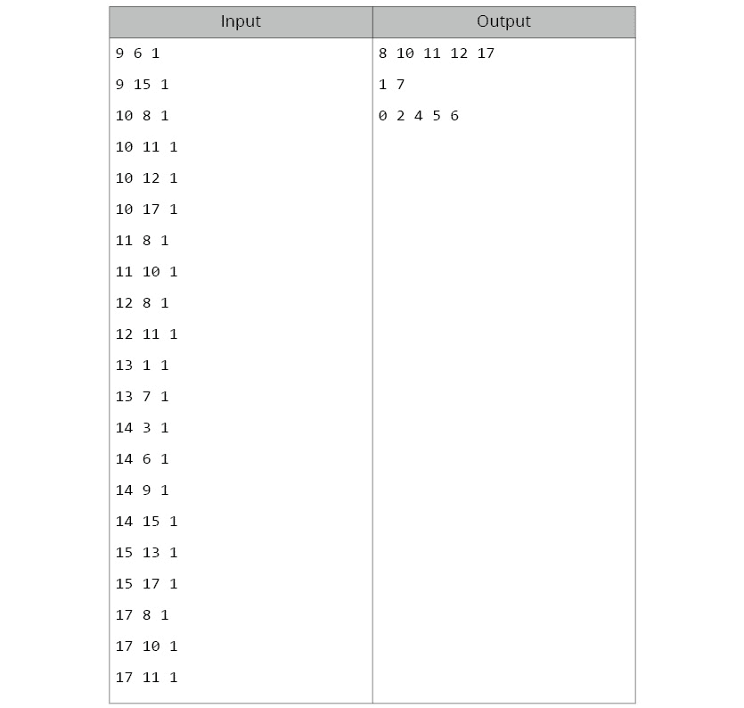

###### 图 7.23：活动 17 的测试用例 6

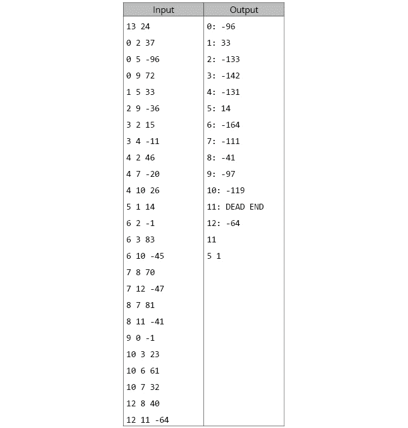

###### 图 7.24：活动 17 的测试用例 7

**活动指南**

+   不要被无关的信息分散注意力。问问自己需要完成什么具体任务。

+   问题的第一个条件（确定迷宫是否包含可以无限降低我们得分的路径）也可以表述为：如果将迷宫表示为加权图，是否存在任何产生负总和的路径上的循环？显然，这是我们有能力处理的问题！您可能还意识到第二个条件（找到可以从给定点开始获得的最低分数）与第一个条件密切相关。

+   最后一个条件有点更具挑战性。考虑如何根据我们在本章讨论过的图术语重新定义在迷宫的某个部分被“困住”的情况。具有这种属性的迷宫会是什么样子？

+   考虑在纸上绘制一个或多个输入图。什么特征表征了玩家可能被困的房间组？

#### 注

此活动的解决方案可在第 550 页找到。

## 选择正确的方法

到目前为止，很明显很少有单一的“完美”图结构实现方法。我们所代表的数据的特征，加上我们试图解决的问题的细节，可能会使某些方法在不同条件下变得不合理低效。

无论您试图确定是使用邻接表还是矩阵，类/结构还是简单数组，贝尔曼-福特还是约翰逊算法，BFS 还是 DFS 等，最终决定应主要取决于数据的具体情况以及您打算如何使用它。例如，如果您想要在图中的每对节点之间找到最短距离，约翰逊算法将是一个很好的选择。然而，如果您只需要偶尔为单个起始节点找到最短距离，约翰逊算法将执行相当多不必要的工作，而一次贝尔曼-福特的调用就足够了。

尝试使用不同形式的图表示来编写我们在本章讨论过的每个算法是一种有益的练习。例如，贝尔曼-福特可以通过用邻接表和边权重的二维矩阵替换我们在第一个练习中使用的`Edge`指针向量来轻松实现。在某些情况下，一个实现所提供的效率潜力可能只比另一个略好一些；而在其他时候，差异可能相当显著。有时，某种方法的价值更多地与简单性和可读性有关，而不是任何可衡量的性能基准。比较各种算法在不同数据集和场景中的性能扩展如何，通常是真实开发中的一个重要实践。

在努力发展对图论和实现的更好理解时，我们提供以下建议：

+   抵制使用“复制粘贴”方法来实现新算法的冲动。如果您不理解算法的工作原理，您很有可能会错误地使用它。此外，即使它能够按照您的意愿运行，重要的是要记住，图的实现高度特定于上下文。盲目使用任何算法意味着您将缺乏扩展解决方案功能所必需的理解。

+   在将新概念付诸实践时，避免完全依赖抽象的、非情境化的实现。在纯理论数据上使用某种算法后，尝试修改它以适应某种实际数据模型（即使该数据本身是假设的）。想象您可以在哪些真实场景中使用您新获得的算法知识，将增加您在工作中知道何时以及如何使用它的可能性。

在您真正考虑以下内容之前，避免实现您的图：

+   它的基本目的和实现该目的所需的基本功能（即它描述的数据，它需要执行的查询类型，它需要多动态等）

+   它需要表示有关问题的相关信息的最基本组件

未能评估这些关键思想可能导致混乱和过于冗长的代码，其中包含不必要的数据和函数，实质上对实际解决方案没有任何价值。在编写任何代码之前规划图的必要组件可能会节省您相当多的混乱和繁琐的重构。

最终，全面理解图形编程是一项技能，远远超出了简单学习所有正确算法的范围。与任何非平凡图形问题相关的简单网络搜索将导致大量深入分析的研究文章，对不同方法的比较评估，以及尚未发现合理实现的猜想解决方案。一如既往，持续的实践是掌握任何编程技能的最佳方法；而图形理论作为一个广阔而动态的研究领域，当然也不例外！

## 总结

到目前为止，我们已经相当全面地涵盖了图形。现在你应该对图形理论在软件开发中的一些基本用途有了扎实的理解，同时也能够欣赏到基于图形的解决方案如何能够以相对容易的方式封装复杂数据，使我们能够查询和操作它。在*第六章*中学习了图形结构和遍历的基础知识后，然后在本章中扩展了它们以解决更高级的问题，你现在应该已经准备好在未来探索更深入的图形实现，因为这些基本概念是它们所有的核心。

虽然本章并没有完全结束我们对本书中图形算法的讨论，但我们现在将暂时停止讨论图形，转而探讨现代开发人员技能库中最强大和具有挑战性的编程技术之一。与图形算法一样，我们接下来要讨论的主题是如此广泛和概念抽象，以至于它将跨越两个单独的章节。然而，由于它的实用性（和难度），它是许多软件公司在技术面试中喜欢的一个主题。
