# 8. 动态规划 I

## 学习目标

在本章结束时，您将能够：

+   分析动态规划方法是否适用于给定问题

+   比较并选择记忆化和表格法之间的正确方法

+   选择使用记忆化的适当缓存解决方案

+   使用朴素的蛮力方法分析问题

+   通过实现逐步优化的算法来开发动态规划解决方案

在本章中，您将介绍动态规划方法。本章将指导您实现这种方法来解决计算机科学中一些众所周知的问题。

## 介绍

许多程序员对**动态规划**（**DP**）既爱又恐惧，它是分治范例的概念扩展，适用于特定类别的问题。动态规划问题涉及的困难是多方面的，通常需要创造力、耐心和对抽象概念的可视化能力。然而，这些问题提出的挑战通常有优雅且令人惊讶地简单的解决方案，这些解决方案可以为程序员提供超出即时任务范围的见解。

在上一章中，我们讨论了几种技术，比如分治和贪婪方法。这些方法在适当的情况下非常有效，但在某些情况下不会产生最佳结果。例如，在上一章中，我们讨论了 Dijkstra 算法对于具有负边权重的图不会产生最佳结果，而 Bellman-Ford 算法会。对于可以递归解决但不能使用前述技术解决的问题，DP 解决方案通常是最佳方法。

DP 问题也出现在各种情况下。以下只是一些广泛的例子：

+   组合数学（计算符合特定条件的序列的组合/排列数）

+   字符串/数组（编辑距离、最长公共子序列、最长递增子序列等）

+   图（最短路径问题）

+   机器学习（语音/人脸识别）

让我们从理解动态规划的基本思想开始。

## 什么是动态规划？

回答这个问题的最佳方法是通过例子。为了说明动态规划的目的，让我们考虑斐波那契数列：

```cpp
{ 0, 1, 1, 2, 3, 5, 8, 13, 21, 34, 55, … }
```

通过观察前述序列，我们可以看到，从第三个元素开始，每个项都等于前两个项的和。这可以用以下公式简单表示：

```cpp
F(0) = 0
F(1) = 1
…
F(n) = F(n-1) + F(n-2)
```

正如我们可以清楚地看到，这个序列的项之间存在递归关系 - 当前项*F(n)*基于前面项*F(n-1)*和*F(n-2)*的结果，因此前述方程*F(n) = F(n-1) + F(n-2)*被描述为序列的**递归关系**。初始项*F(0)*和*F(1)*被描述为**基本情况**，或者在不需要进一步递归的情况下产生解决方案的点。这些操作如下图所示：

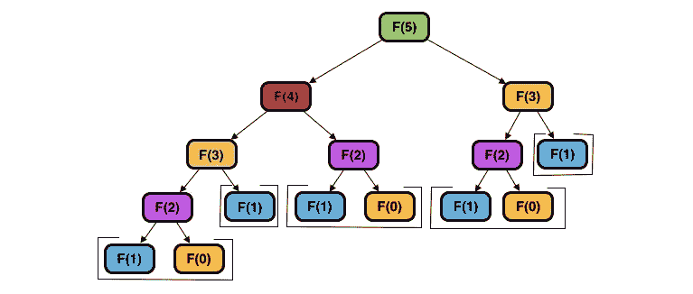

###### 图 8.1：计算斐波那契数列的第 n 项

用英语描述前述图可能是这样的：

```cpp
F5 is equal to: 
    F4 + F3, where F4 is equal to:
    .    F3 + F2, where F3 is equal to:
    .    .    F2 + F1, where F2 is equal to:
    .    .    .    F1 + F0, where F1 = 1 and F0 = 0.
    .    .    …and F1 = 1.
    .    …and F2 is equal to:
    .        F1 + F0, where F1 = 1 and F0 = 0.
    …and F3 is equal to:
        F2 + F1, where F2 is equal to:
        .    F1 + F0, where F1 = 1 and F0 = 0
        …and F1 = 1.
```

我们将前述方法描述为**自顶向下的解决方案**，因为它从递归树的顶部（即解决方案）开始，并沿着其分支向下遍历，直到达到基本情况。在 C++中，这可以使用以下递归函数来编写：

```cpp
    int Fibonacci(int n)
    {
        if(n < 2)
        {
            return n;
        }
        return Fibonacci(n – 1) + Fibonacci(n – 2);
    }
```

通过进一步观察树，我们可以看到几个必须多次解决的**子问题**，或者说必须解决以找到最终解决方案的中间问题。例如，必须找到*F(2)*的解决方案才能得到*F(4) [F(3) + F(2)]*和*F(3) [F(2) + F(1)]*的解决方案。因此，斐波那契数列被认为具有**重叠子问题**的特性。这是将标准的分治问题与动态规划问题区分开的定义特征之一；在前者中，子问题往往是唯一的，而在后者中，相同的子问题必须重复解决。

我们还可以看到几个解决方案分支彼此完全相同。例如，找到*F(2)*的解决方案将需要相同的一组计算，无论您需要它来解决*F(4)*还是*F(3)*。这展示了动态规划问题的第二个定义特征，即最优子结构。当问题的最优解可以通过其子问题的最优解的某种组合形成时，问题被认为具有**最优子结构**。

要使用动态规划解决问题，问题必须具备这两个特性。由于重叠子问题的特性，这些问题的复杂性随着输入的增加而呈指数级增长；然而，利用最优子结构的特性可以显著减少复杂性。因此，DP 的目的实质上是设计一种缓存先前解决方案的方法，以避免重复计算先前解决的子问题。

## 备忘录化 - 自顶向下的方法

不，这不是“记忆”，尽管这也可以相当准确地描述这种技术。使用备忘录化，我们可以重新制定我们之前描述的自顶向下解决方案，以利用斐波那契数列所展示的最优子结构特性。我们的程序逻辑基本上与以前一样，只是现在，在每一步找到解决方案后，我们将结果缓存到一个数组中，根据当前值*n*进行索引（在这个问题中，*n*代表定义当前递归分支的**状态**或参数集）。在每次函数调用的开始，我们将检查是否在缓存中有状态*F(n)*的解决方案可用。如果有，我们将简单地返回缓存的值：

```cpp
const int UNKNOWN = -1;
const int MAX_SIZE = 100000;
vector<int> memo(MAX_SIZE, UNKNOWN);
int Fibonacci(int n)
{
    if(n < 2)
    {
        return n;
    }
    if(memo[n] != UNKNOWN)
    {
        return memo[n];
    }
    int result = Fibonacci(n - 1) + Fibonacci(n - 2);
    memo[n] = result;
    return result;
}
```

递归树现在看起来是这样的：

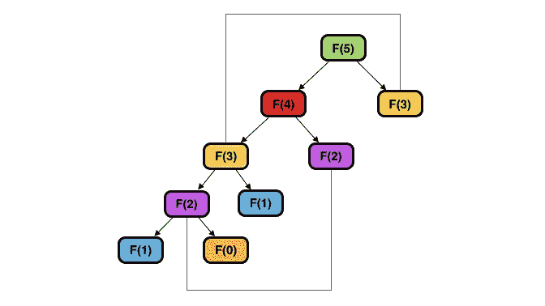

###### 图 8.2：使用缓存解决方案计算斐波那契数列中的第 n 个项

通过这样做，我们消除了相当多的冗余工作。这种以自顶向下递归地缓存解决方案的技术称为**备忘录化**，并且基本上可以用于任何 DP 问题，只要以下条件为真：

1.  您可以设计一个利用不同状态的相似性并保持其唯一性的缓存方案。

1.  在超出可用堆栈空间之前，您可以累积所需子问题的解决方案。

第一点意味着索引结果以供以后使用的方法应该既有效又有用。为了使缓存方案有效，它必须只被视为与其解决方案源自相同一系列子问题的状态匹配；为了使其有用，它必须不是那么特定于状态，以至于无法有效使用（例如，如果每个子问题在缓存中被分配一个唯一的索引，条件"`if(memo[KEY] != UNKNOWN)`"将永远不会成立）。

第二点指的是可能引起堆栈溢出错误的可能性，这是任何自顶向下方法的基本限制，如果递归调用的次数可能非常高。堆栈溢出发生在程序超出调用堆栈上可用的内存分配量时。根据给定问题的性质，可能需要的递归深度可能会阻止记忆化成为可行的选择；因此，在选择方法之前评估手头任务的潜在复杂性是非常有益的。

记忆化经常是动态规划问题的一个不错的优化方法。然而，在许多情况下，有更好的选择，我们将在下一节中学习。

## 制表 - 自底向上的方法

动态规划的核心是制表法，这是记忆化的逆向方法。事实上，尽管动态规划这个术语有时被应用于记忆化和制表，但通常认为它特指后者。

制表的标准实现包括存储基本情况的解决方案，然后迭代地填充一个表格，其中包含每个子问题的解决方案，然后可以重复使用这些解决方案来找到其他子问题的解决方案。制表解决方案通常被认为比记忆化的解决方案更难以理解，因为每个子问题的状态必须以可以迭代表示的方式来表示。

计算斐波那契数列的制表解决方案如下：

```cpp
int Fibonacci(int n)
{
        vector<int> DP(n + 1, 0);
        DP[1] = 1;
        for(int i = 2; i <= n; i++)
        {
            DP[i] = DP[i-1] + DP[i-2];
        }
        return DP[n];
} 
```

在斐波那契数列的例子中，状态非常简单，因为它是一维的和无条件的——对于任何大于 1 的 n，公式总是成立，即 F(n) = F(n-1) + F(n-2)。然而，动态规划问题通常包含定义给定状态的多个维度，并且可能有多个条件影响状态之间的转换。在这种情况下，确定如何表示当前状态可能需要相当多的创造力，以及对问题的全面理解。

然而，制表的优势是显著的。除了制表解决方案通常在内存方面更有效之外，它们还产生一个包含每个给定状态的完整查找表。因此，如果你可能会收到关于问题的任何状态的查询，制表很可能是你最好的选择。

有趣的是，任何可以通过记忆化解决的问题理论上都可以重新制定为制表解决方案，反之亦然。使用前者通常可以为如何处理后者提供巨大的见解。在接下来的几节中，我们将探讨动态规划问题的几个经典示例，并演示如何使用多种方法（从朴素的蛮力开始）可以使你达到制表解决方案所需的理解水平。

## 子集和问题

想象一下，你正在为一个数字现金注册逻辑。每当顾客需要找零时，你希望显示一条消息，告诉收银员当前注册处的钱是否可以以某种方式组合，使其总和等于所需的找零金额。例如，如果一个产品售价为 7.50 美元，顾客支付 10.00 美元，消息将报告注册处的钱是否可以用来产生精确的 2.50 美元的找零。

假设注册处当前包含十个 25 美分的硬币（10 x 0.25 美元），四个 10 美分的硬币（4 x 0.10 美元）和六个 5 美分的硬币（6 x 0.05 美元）。我们可以很容易地得出结论，2.50 美元的目标总额可以以下列方式形成：

```cpp
10 quarters                    -> $2.50
9 quarters, 2 dimes, 1 nickel  -> $2.25 + $0.20 + $0.05
9 quarters, 1 dime,  3 nickels -> $2.25 + $0.10 + $0.15
9 quarters, 5 nickels          -> $2.25 + $0.25
8 quarters, 4 dimes, 2 nickels -> $2.00 + $0.40 + $0.10
8 quarters, 3 dimes, 4 nickels -> $2.00 + $0.30 + $0.20
8 quarters, 2 dimes, 6 nickels -> $2.00 + $0.20 + $0.30
```

有了这些参数，问题就变得相当简单，可以通过简单地尝试所有可用的货币组合，直到找到与 2.50 美元相匹配的总和。但是，如果需要的找零是 337.81 美元，而收银机包含 100 张面额分别为 20.00 美元、10.00 美元、5.00 美元、1.00 美元、0.25 美元、0.10 美元、0.05 美元和 0.01 美元的纸币/硬币呢？我们可以清楚地看到，随着复杂度的增加，尝试每种可能的总和变得相当不切实际。这是一个被称为子集和问题的经典问题的例子。

在其最基本的形式中，对于集合`S`和整数`x`，是否存在`S`的元素的一个子集，其总和等于`x`？看下面的例子：

```cpp
S = { 13, 79, 45, 29 }
x = 42 —> True (13 + 29)
x = 25 —> False 
```

以前面的集合为例，我们可以找到以下 16 个子集：

```cpp
{ }
{ 13 }
{ 79 }
{ 45 }
{ 29 }
{ 13, 79 }
{ 13, 45 }
{ 13, 29 }
{ 79, 45 }
{ 79, 29 }
{ 45, 29 }
{ 13, 79, 45 }
{ 13, 79, 29 }
{ 13, 45, 29 }
{ 79, 45, 29 }
{ 13, 79, 45, 29 }
```

通过列出不同大小的集合可以产生的子集总数，我们得到以下数字：

```cpp
0: 1
1: 2
2: 4
3: 8
4: 16
5: 32
6: 64
7: 128
…
```

从这个列表中，我们可以推断出从大小为`n`的集合中可以形成的子集的总数等于*2**n*，这表明要考虑的子集数量随着*n*的大小呈指数增长。假设*S*中的元素数量较小，比如 10 个元素或更少，那么对这个问题的蛮力方法可能会很快找到解决方案；但是如果我们重新考虑一个包含 100 种不同纸币/硬币的收银机的例子，*S*的大小将等于 100，这将需要探索 1,267,650,600,228,229,401,496,703,205,376 个子集！

### 解决子集和问题-步骤 1：评估是否需要 DP

面对这样的问题，我们的第一步是确定它是否可以（和/或应该）用 DP 解决。重申一下，如果问题具有以下特性，则可以用 DP 解决：

+   **重叠子问题**：与标准的分治方法一样，最终解可以通过某种方式结合较小子问题的解来得出；与分治方法相反，某些子问题会被多次遇到。

+   **最优子结构**：给定问题的最优解可以由其子问题的最优解产生。

让我们根据是否具有这些特征来分析前面的例子：

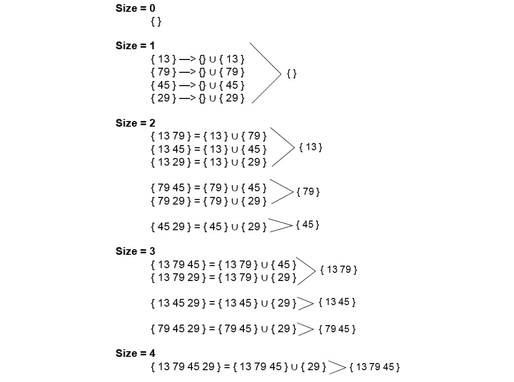

###### '

###### 图 8.3：最优子结构和重叠子问题

重新整理子集的集合，如图所示清楚地说明了每个大小为 n 的新子集是如何通过向大小为`n-1`的子集追加一个新元素来形成的。这是构建新子集的最佳方法，并且对于大于 0 的每个子集大小都成立。因此，子集和问题具有**最优子结构**。我们还可以看到，几个子集都是从相同的“子子集”派生出来的（例如，*{13 79 45}*和*{13 79 29}*都基于*{13 79}*）。因此，该问题还具有**重叠子问题**。

满足了我们的两个标准后，我们可以得出结论，这个问题可以用动态规划解决。

### 第 2 步-定义状态和基本情况

确定这是一个 DP 问题后，我们现在必须确定在这个问题的背景下什么构成了一个状态。换句话说，就我们试图回答的问题而言，什么使一个可能的解决方案与另一个不同？

虽然通常建议在过程的早期考虑问题的这些方面，但通常很难在没有清晰理解最终结果是如何形成的情况下定义 DP 问题的状态，因此最好从最直接的方式开始实施解决方案。因此，我们将通过两种更简单的方式解决子集和问题来发展我们对基本情况和状态的理解。

在我们探索动态规划的过程中，我们将考虑每个问题的四种不同方法：**蛮力**，**回溯**，**记忆化**和**表格化**。与任何 DP 问题一样，所有这些方法都能够产生正确的结果，但前三种方法在输入规模增加时很快显示出它们的局限性。然而，以这种方式逐渐实现优化的解决方案在解决任何动态规划问题时都可以产生很大的效果。

### 步骤 2.a：蛮力

尽管其效率低下，蛮力解决方案在开发对手头问题的理解方面可能非常有益。以蛮力方法实现可能是形成 DP 解决方案过程中的一个重要步骤，原因有几个：

+   **简单性**：在不考虑效率的情况下编写解决方案的简单性可以是开发对问题基本方面的理解的绝佳方式；它还可以带来关于问题性质的见解，否则可能会在尝试理解其复杂性时因缺乏足够的上下文而被忽略。

+   **解决方案正确性的确定性**：通常，特别复杂的 DP 解决方案在更好地理解问题时需要进行重新设计。因此，比较解决方案的输出与正确答案是至关重要的。

+   **可视化子问题的能力**：蛮力解决方案将生成每个潜在解决方案，然后选择符合问题标准的解决方案。这提供了一种有效的方式来可视化正确解决方案的形成方式，然后可以检查其中可以在后续方法中使用的基本模式。

以下练习演示了蛮力方法的实现。

### 练习 36：使用蛮力方法解决子集和问题

在这个练习中，我们将使用蛮力方法找到子集和问题的解决方案。让我们开始吧：

1.  让我们首先包括以下标头（以及`std`命名空间以方便起见）：

```cpp
    #include <iostream>
    #include <vector>
    #include <algorithm>
    using namespace std;
    ```

1.  此外，让我们定义一个名为`DEBUG`的预处理器常量和一个名为`PRINT`的宏，它将仅在`DEBUG`不为零时打印到`stderr`：

```cpp
    #define DEBUG 0
    #if DEBUG
    #define PRINT(x) cerr << x
    #else
    #define PRINT(x) 
    #endif
    ```

1.  现在，我们将声明一个新函数`SubsetSum_BruteForce（）`，它接受两个参数 - 一个整数数组`set`和一个整数`sum` - 并返回一个布尔值：

```cpp
    bool SubsetSum_BruteForce(vector<int> set, int sum)
    {
        ……
    }
    ```

1.  现在，让我们声明另一个函数`GetAllSubsets（）`，它接受四个参数 - 两个整数向量`set`和`subset`；一个整数`index`；和一个名为`allSubsets`的三维整数向量（通过引用传递）。我们将使用此函数递归地生成*S*的所有子集：

```cpp
    void GetAllSubsets(vector<int> set, vector<int> subset, int index, vector<vector<vector<int>>> &allSubsets)
    {    
        // Terminate if the end of the set is reached
        if(index == set.size()) 
        {
            // Add the accumulated subset to the results, indexed by size
            allSubsets[subset.size()].push_back(subset);
            return;
        }
        // Continue without adding element to subset
        GetAllSubsets(set, subset, index + 1, allSubsets);
        // Add element to subset
        subset.push_back(set[index]);
        GetAllSubsets(set, subset, index + 1, allSubsets);
    }
    ```

1.  回到我们的`SubsetSum_BruteForce（）`函数，我们现在可以声明`allSubsets`并调用该函数：

```cpp
    bool SubsetSum_BruteForce(vector<int> set, int target)
    {
        vector<vector<vector<int>>> allSubsets(set.size() + 1);

        GetAllSubsets(set, {}, 0, allSubsets);

        ……
    ```

1.  现在，我们可以遍历每个子集并将其总和与`target`进行比较，如果找到匹配，则返回`true`：

```cpp
    for(int size = 0; size <= set.size(); size++)
    {
        PRINT("SIZE = " << size << endl);
        for(auto subset : allSubsets[size])
        {
            int sum = 0;
            PRINT("\t{ ");
            for(auto number : subset)
            {
                    PRINT(number << " ");
                    sum += number;
            }
            PRINT("} = " << sum << endl);
            if(sum == target) return true;
        }
    }
    ```

1.  如果在检查每个子集后找不到匹配的和，我们返回`false`：

```cpp
        ……
        return false;
    }
    ```

1.  现在，在`main（）`函数中，让我们定义我们的集合和目标如下：

```cpp
    int main()
    {
        vector<int> set = { 13, 79, 45, 29 };
        int target = 58;
        ……
    }
    ```

1.  我们现在可以这样调用`SubsetSum_BruteForce（）`与这些输入：

```cpp
    bool found = SubsetSum_BruteForce(set, target);
    if(found)
    {
        cout << "Subset with sum " << target << " was found in the set." << endl;
    }
    else 
    {
        cout << "Subset with sum " << target << " was not found in the set." << endl;
    }
    ```

1.  运行上述代码后，您应该看到以下输出：

```cpp
    Subset with sum 58 was found in the set.
    ```

1.  现在，让我们将`target`设置为一个集合中找不到的和：

```cpp
    int target = 1000000;
    ```

1.  再次运行程序应该产生以下输出：

```cpp
    Subset with sum 1000000 was not found in the set.
    ```

1.  最后，让我们将我们的`DEBUG`常量重新定义为 1：

```cpp
    #define DEBUG 1
    ```

1.  现在运行程序将产生以下输出：

```cpp
    SIZE = 0
        { } = 0
    SIZE = 1
        { 29 } = 29
        { 45 } = 45
        { 79 } = 79
        { 13 } = 13
    SIZE = 2
        { 45 29 } = 74
        { 79 29 } = 108
        { 79 45 } = 124
        { 13 29 } = 42
        { 13 45 } = 58
        { 13 79 } = 92
    SIZE = 3
        { 79 45 29 } = 153
        { 13 45 29 } = 87
        { 13 79 29 } = 121
        { 13 79 45 } = 137
    SIZE = 4
        { 13 79 45 29 } = 166
    Subset with sum 1000000 was not found in the set.
    ```

因此，我们能够使用蛮力方法找到所需的子集。请注意，我们基本上是尝试找到解决方案的每种可能性。在下一节中，我们将对其进行一层优化。

### 步骤 2.b：优化我们的方法 - 回溯

显然，蛮力方法还有很多不足之处。在性能方面，它几乎是尽可能低效的。通过不加区分地检查每个可能的子集，我们在可以确定它们永远不会导致解决方案的点之后仍然考虑选项（例如，总和超过目标的子集）。为了改进我们的算法，我们可以利用**回溯法**来排除所有已经被保证无效的子问题的分支。

在尝试使用 DP 之前实现回溯解决方案的主要优势是，它要求我们确定问题的基本情况和中间递归状态。正如我们在本章前面定义的那样，基本情况是递归函数中的一个条件，它不依赖于进一步递归来产生答案。为了进一步澄清，考虑计算一个数字的阶乘的问题（一个数字*n*的阶乘等于*n * (n-1) * (n-2) * (n-3) … * 1*）。我们可以编写一个 C++函数来实现这个问题，如下所示：

```cpp
int Factorial(int n)
{
    // Base case — stop recursing
    if(n == 1)
    {
        return 1;
    }
    // Recurse until base case is reached
    return n * Factorial(n - 1);
}
```

这个递归函数的结构可以用下面的方式来说明：

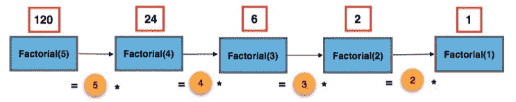

###### 图 8.4：递归计算第 N 个阶乘

`n = 1`的条件是基本情况，因为这是可以在不进一步递归的情况下返回解决方案的点。

在子集和问题中，定义我们的基本情况的一种方式是：

```cpp
If sum of a given subset is equal to target : TRUE

Otherwise:
    — If sum is greater than target : FALSE
    — If end of set is reached : FALSE
```

现在我们已经建立了基本情况，我们需要定义中间状态。使用我们的蛮力算法的输出作为参考，我们可以分析每个大小组的子集是如何形成的，以绘制出我们的状态转换：

```cpp
Base case —> { } [SUM = 0]
{ } —> { 13 } [0 + 13 = 13]
       { 79 } [0 + 79 = 79]
       { 45 } [0 + 45 = 45]
       { 29 } [0 + 29 = 29]
```

当然，大小为`0`和大小为`1`的状态是最容易理解的。我们从一个空集开始，我们可以添加任何元素到它，以创建所有大小为 1 的子集。

```cpp
{ 13 } —> { 13 79 } [13 + 79 = 92]
          { 13 45 } [13 + 45 = 58]
          { 13 29 } [13 + 29 = 42]
{ 79 } —> { 79 45 } [79 + 45 = 124]
          { 79 29 } [79 + 29 = 108]
{ 45 } —> { 45 29 } [45 + 29 = 74]
```

我们可以对大小为 2 的子集采用相同的逻辑。只需取每个大小为 1 的子集，并附加索引大于子集中已有的最高索引的每个元素。这本质上是我们在蛮力实现中采取的方法；然而，这一次，我们在处理它们时将考虑每个子集的总和，并在当前总和超过目标时终止它们。

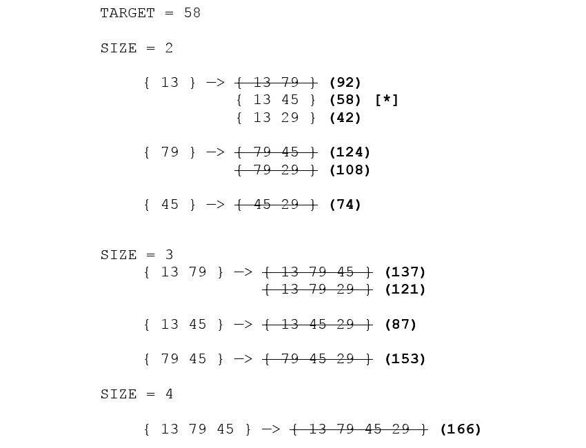

###### 图 8.5：消除超过目标值的值

当`target`等于`58`时，我们可以看到不需要考虑大小为 3 或 4 的子集。因此，我们可以描述我们的中间状态转换如下：

```cpp
for element of set at index i and subset ss:
    If sum of ss with set[i] is less than or equal to target: 
        1) Append set[i] to ss
        2) Increment i 
        Next state —> (i = i + 1, ss = ss ∪ set[i])
    In any case: 
        1) Do not append set[i] to ss
        2) Increment i
        Next state —> (i = i + 1, ss = ss)
```

现在，我们应该问以下问题：

+   表示这种状态所需的最少数据是什么？

+   我们如何重新构思前面的逻辑以去除不必要的信息？

考虑我们要解决的具体问题：找出是否存在一个子集的元素，其总和等于目标值。根据问题描述，我们的任务不需要产生实际的子集，而只需要它们的总和。因此，我们的伪代码可以更简洁地表示如下：

```cpp
for element of set at index i and its sum as sum:
    If sum plus set[i] is less than or equal to target: 
        1) Add value of set[i] to sum
        2) Increment i 
        Next state —> (i = i + 1, sum = sum + set[i])
    In any case: 
        1) Do not add value of set[i] to sum
        2) Increment i
        Next state —> (i = i + 1, sum = sum)
```

使用这种新方法，我们基本上可以用两个整数`sum`和`i`来表示每个状态转换，从而在最坏情况下消除了存储*2**n*子集数组的需要。此外，我们可以通过反转问题（即从`target`开始，并在每一步减去`set[i]`）来消除跟踪目标值的需要。最后，我们可以在调用函数之前对集合进行排序，这样我们就可以在总和超过目标时确定没有其他有效可能性。我们将在接下来的练习中用 C++来实现这一点。

### 练习 37：使用回溯法解决子集和问题

在这个练习中，我们将解决一个类似于*练习 36*中演示的问题，即*使用蛮力方法解决子集和问题*，但是使用回溯方法和更复杂的输入来突出差异。让我们开始吧：

1.  为了实现子集和问题的回溯解决方案，我们定义一个名为`SubsetSum_Backtracking()`的函数，如下所示：

```cpp
    bool SubsetSum_Backtracking(vector<int> &set, int sum, int i) 
    {
        ……
    }
    ```

1.  在递归函数中经常这样，我们在一开始就定义了基本情况：

```cpp
    // The sum has been found
    if(sum == 0)
    {
        return true;
    }
    // End of set is reached, or sum would be exceeded beyond this point
    if(i == set.size() || set[i] > sum)
    {
        return false;
    }
    ```

1.  在每一步，我们的选择是将当前元素的值加到总和中，或者保持总和不变。我们可以将这个逻辑压缩成一行，如下所示：

```cpp
    // Case 1: Add to sum
    // Case 2: Leave as-is 
    return SubsetSum_Backtracking(set, sum – set[i], i + 1) 
        || SubsetSum_Backtracking(set, sum, i + 1); 
    ```

1.  回到`main`，让我们对集合进行排序，并在调用`SubsetSum_BruteForce()`之后添加我们对`SubsetSum_Backtracking()`的调用：

```cpp
    sort(set.begin(), set.end());
    bool found;

    found = SubsetSum_BruteForce(set, target);
    found = SubsetSum_Backtracking(set, target, 0); 
    ```

1.  为了测试，我们将实现一个函数，它将显示每种方法找到解决方案所花费的时间。首先，我们需要包含`<time.h>`和`<iomanip>`头文件：

```cpp
    #include <iostream>
    #include <vector>
    #include <algorithm> 
    #include <time.h>
    #include <iomanip>
    ```

1.  我们还将定义一个名为`types`的字符串数组，我们将用它来标记每种方法的结果：

```cpp
    vector<string> types = 
    {
        "BRUTE FORCE",
        "BACKTRACKING",
        "MEMOIZATION",
        "TABULATION"
    };
    const int UNKNOWN = INT_MAX;
    ```

1.  现在，我们将编写另一个函数`GetTime()`，它接受一个名为`timer`的`clock_t`对象的引用和一个`string`类型，然后返回`void`：

```cpp
    void GetTime(clock_t &timer, string type)
    {
        // Subtract timer value from current time to get time elapsed
        timer = clock() - timer;
        // Display seconds elapsed
        cout << "TIME TAKEN USING " << type << ": " << fixed << setprecision(5) << (float)timer / CLOCKS_PER_SEC << endl; 

        timer = clock(); // Reset timer 
    }
    ```

1.  现在，让我们重写`main()`函数，以便我们可以依次执行每个函数调用并比较每种方法所花费的时间：

```cpp
    int main()
    {
        vector<int> set = { 13, 79, 45, 29 };
        int target = 58;
        int tests = 2;
        clock timer = clock();
        sort(set.begin(), set.end());
        for(int i = 0; i < tests; i++)
        {
            bool found;
            switch(i)
            {
                case 0: found = SubsetSum_BruteForce(set, target); break;
                case 1: found = SubsetSum_Backtracking(set, target, 0); break;
            }
            if(found)
            {
                cout << "Subset with sum " << target << " was found in the set." << endl;
            }
            else 
            {
                cout << "Subset with sum " << target << " was not found in the set." << endl;
            }    
            GetTime(timer, types[i]);
            cout << endl;
        }
        return 0;
    }
    ```

1.  最后，让我们重新定义我们的输入，以突出两种方法之间效率的差异：

```cpp
    vector<int> set = { 16, 1058, 22, 13, 46, 55, 3, 92, 47, 7, 98, 367, 807, 106, 333, 85, 577, 9, 3059 };
    int target = 6076;
    ```

1.  您的输出将产生类似以下内容的东西：

```cpp
    Subset with sum 6076 was found in the set.
    TIME TAKEN USING BRUTE FORCE: 0.89987
    Subset with sum 6076 was found in the set.
    TIME TAKEN USING BACKTRACKING: 0.00078
    ```

#### 注意

实际的时间取值会根据您的系统而有所不同。请注意数值上的差异。

正如您所看到的，在这种特殊情况下，使用回溯方法找到答案要快 1000 多倍。在接下来的部分中，我们将通过利用缓存来进一步优化这个解决方案。

### 步骤 3：记忆化

虽然比蛮力方法好得多，但回溯解决方案仍然远非理想。考虑一个目标和集合中没有的情况-如果目标大于或等于集合中每个元素的总和，我们可以通过预先计算总和并检查目标是否在有效范围内来轻松确定结果。然而，如果目标总和略低于这个数额，我们的算法仍然需要在完成之前探索几乎每种可能性。

为了展示这种差异，尝试使用`6799`作为目标来运行上一个练习中的代码（恰好比集合中所有元素的总和少 1）。在作者的机器上，回溯解决方案平均花费大约 0.268 秒来产生结果-几乎比练习中使用的目标值所花费的平均时间长了近 350 倍。

幸运的是，我们已经拥有了所有需要设计自顶向下解决方案并利用记忆化的信息。更好的是，我们几乎不需要修改我们以前的方法来实现它！

### 设计缓存方案

使用记忆化最重要的方面是定义一个缓存方案。对于记忆化解决方案的缓存结果可以通过多种方式来完成，但最常见的方式如下：

+   简单数组，状态由数字索引表示

+   哈希表/映射，状态由使用内置语言特性散列的描述性字符串表示

+   哈希表/映射，状态由使用原始哈希公式创建的哈希值表示

这里要做出的选择在很大程度上取决于上下文，但以下是一些一般性指导方针：

+   通过数字索引访问的数组/向量通常比必须在映射中定位给定键以确定是否已经被缓存的映射要快得多。

+   即使状态可以表示为整数，如果缓存键非常大，足以包含它们的数组的内存需求可能是不合理的。在这种情况下，映射是更好的选择。

+   哈希表（例如`std::unordered_map`）在定位和检索键时往往比标准的映射/字典结构快得多（但仍然比数组慢）。

+   `std::map`在可以用作键的数据类型方面比`std::unordered_map`更加灵活。尽管`std::unordered_map`在技术上可以提供相同的功能，但它要求程序员为默认情况下无法存储为键的数据类型创建自己的哈希函数。

正如您可能还记得本章节介绍的那样，缓存方案应该是这样的：

+   **有效**：缓存键必须以一种方式表示，以避免不用于解决相同子问题集的不同状态之间发生冲突。

+   **有价值/有用**：如果您的缓存方案如此特定，以至于实际上从未产生任何“命中”，那么它基本上什么也没做。

在子集和问题中，我们可能错误地认为，从具有给定`sum`值的状态中找不到目标意味着从具有相同和的任何其他状态中都不可能得到真正的结果。因此，我们可能决定仅基于`sum`的值缓存每个解决方案（即`if(memo[sum] != UNKNOWN) return memo[sum];`）。这是一个无效的缓存方案的例子，因为它未考虑到在同一组内可能有多种达到相同和的方式，如下所示：

```cpp
{ 1 5 6 2 3 9 } 
Sum of { 1 5 } = 6
Sum of { 6 } = 6
Sum of { 1 2 3 } = 6
```

假设在前面的例子中目标值为`8`。如果首先遇到第三种情况，`memo[6]`将被设置为`false`，这显然是不正确的，因为目标可以通过包括第 4 个元素（`2`）从其他两种情况中达到。

一个无用的记忆化方案的例子是，其中键等于子集的索引，因为每个可能的状态都将包含一个完全独特的键；因此，由相同子问题集形成的状态不会触发缓存命中。

如果您对自己的缓存方案的有效性不确定，可以有用的是存储一个在每次缓存命中时递增的计数器。如果这个计数器的最终值等于`0`，或者相对于您需要考虑的状态数量来说非常低，那么您可以得出结论，您的缓存方案需要修订。

我们将探讨使用向量进行缓存的记忆化实现。

### 练习 38：使用记忆化解决子集和问题

在这个练习中，我们将尝试实现与*练习 37*中实现的相同解决方案，即使用回溯法解决子集和问题，但增加了记忆化。让我们开始吧：

1.  我们现在将创建另一个名为`SubsetSum_Memoization()`的函数。这个函数的定义将与`SubsetSub_Backtracking()`完全相同，只是它将包括对名为`memo`的二维整数向量的引用：

```cpp
    bool SubsetSum_Memoization(vector<int> &set, int sum, int         i, vector<vector<int>> &memo)
    {
        ……
    }
    ```

1.  这个函数的大部分代码看起来与回溯法的方法非常相似。例如，我们的基本情况将与以前定义的完全相同：

```cpp
    if(sum == 0)
    {
        return true;
    }
    if(i == set.size() || set[i] > sum)
    {
        return false;
    }
    ```

1.  现在，关键的区别在于，在基本情况之后，我们不是立即调查下两种状态，而是检查`memo`表以获取缓存的结果：

```cpp
    // Is this state's solution cached?
    if(memo[i][sum] == UNKNOWN)
    {
        // If not, find the solution for this state and cache it
        bool append = SubsetSum_Memoization(set, sum - set[i], i + 1, memo);
        bool ignore = SubsetSum_Memoization(set, sum, i + 1, memo);
        memo[i][sum] = append || ignore;
    }
    // Return cached value
    return memo[i][sum];
    ```

1.  现在，我们应该在`main()`函数中插入对`SubsetSum_Memoization()`的调用：

```cpp
    int tests = 3;
    for(int i = 0; i < tests; i++)
    {
        bool found;
        switch(i)
        {
            case 0: found = SubsetSum_BruteForce(set, target); break;
            case 1: found = SubsetSum_Backtracking(set, target, 0); break;
            case 2:
            {
                // Initialize memoization table
                vector<vector<int>> memo(set.size(), vector<int>(7000, UNKNOWN));
                found = SubsetSum_Memoization(set, target, 0, memo);
                break;
            }
        }

        if(found)
        {
            cout << "Subset with sum " << target << " was found in the set." << endl;
        }
        else
        {
            cout << "Subset with sum " << target << " was not found in the set." << endl;
        }
        GetTime(timer, types[i]);
        cout << endl;
    }
    ```

1.  现在，让我们将`target`定义为`6799`并运行我们的代码。您应该看到类似于这样的输出：

```cpp
    Subset with sum 6799 was not found in the set.
    TIME TAKEN USING BRUTE FORCE: 1.00100
    Subset with sum 6799 was not found in the set.
    TIME TAKEN USING BACKTRACKING: 0.26454
    Subset with sum 6799 was not found in the set.
    TIME TAKEN USING MEMOIZATION: 0.00127
    ```

#### 注意

实际的时间值会根据您的系统而有所不同。请注意值的差异。

我们可以从输出中看到，缓存已经将我们的问题优化了指数倍。

### 第四步：制表

到目前为止，我们已经实现了三种不同的算法方法来解决子集和问题，每种方法都比前一种有了显著的改进。然而，假设我们想要得到给定集合中每个可能子集和的列表。我们将不得不针对每个和从 1 到整个集合的总和重复运行我们的算法。对于这类情况，表格化通常是唯一有效的选择。

实现迭代的表格化解决方案对于这样的问题通常很难概念化。虽然问题的递归公式很适合多维状态和分支条件，但表格化解决方案必须以某种方式将复杂性层次压缩成一组简单的迭代，使用标准的`for`/`while`循环：

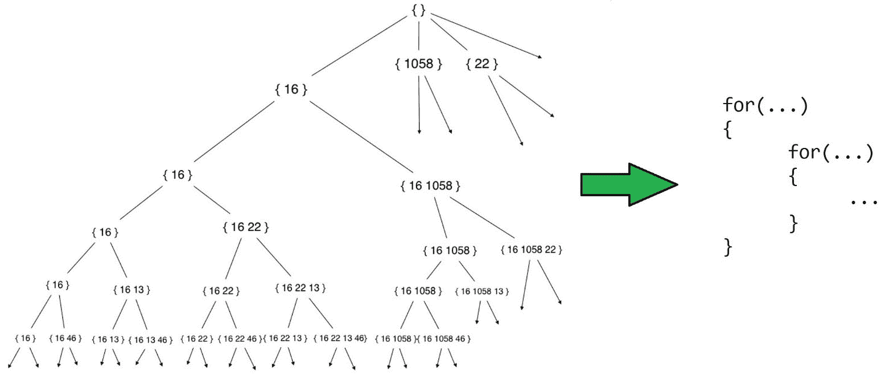

###### 图 8.6：展示了子集和问题的递归结构在表格化 DP 解决方案中是如何减少的

有几种方法可以解决这个问题，但最终归根结底是你是否足够理解问题，能够做出正确的概括。

与记忆化一样，在定义了问题的基本情况和状态之后，第一个目标是开发一种用于存储不同状态解的方案。通常，表格化方法使用简单的数组/向量来实现这一目的。我们已经看过一个非常简单的 DP 表的例子，即斐波那契数列的计算：

```cpp
F[n] = F[n – 1] + F[n – 2];
```

在本章的早些时候，我们还讨论了如何递归地计算阶乘。填充该问题的表格的自底向上方法将如下所示：

```cpp
factorial[n] = factorial[n – 1] * n;
```

这些都是非常简单的例子，因为它们只包含一个维度和没有条件逻辑。每个状态从头到尾都有一个一致、可预测的公式。

这些例子与子集和问题之间的主要区别在于，后者中唯一表示每个状态的最小方式需要两个维度——集合中的索引和当前总和。

让我们更深入地考虑一些关于这个问题的见解：

+   每个大小为`k`的可能子集都可以通过取新元素并将其附加到每个大小为`k-1`的子集上来形成。

+   如果在索引`i`处找到了和值为`x`的解，那么最终导致相同条件的任何状态转换序列都会产生相同的结果：

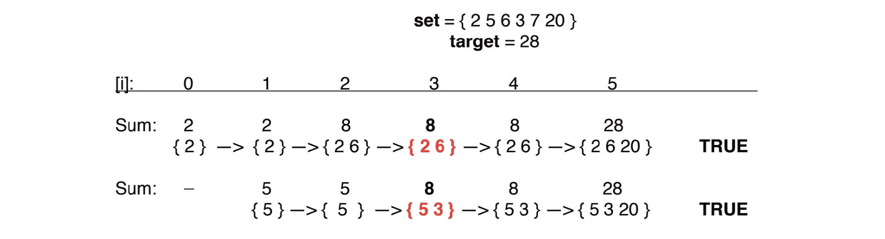

###### 图 8.7：相同索引值上具有相同和值的多条路径

这两条递归路径都在红色标记的状态处具有和值等于`8`和索引值等于`3`，由于子集和问题的最优子结构，这意味着该状态的解只需要找到一次——无论之前发生了什么，每次到达这些条件时，其结果都将是相同的。

有了这些事实，我们基本上可以颠倒我们的自顶向下方法，来发展自底向上的方法。

**自顶向下的逻辑：**

1.  从目标总和和集合的第一个索引开始。

1.  遍历集合：

- 如果总和减少到零，则结果为`TRUE`。

- 如果到达集合的末尾或超过目标，则结果为`FALSE`。

- 否则，您可以从总和中减去当前值或忽略它。

1.  如果可以从状态`S`找到目标，其中总和等于`x`，索引等于`i`，那么也可以从任何最终导致状态`S`的较早状态找到目标。

**自底向上的逻辑：**

1.  从和值和索引值等于`0`开始。

1.  遍历集合：

- 如果在索引`0`和`i`之间找到和为`x`的总和，则在索引`0`和`i+1`之间也可以找到和为`x`的总和。

- 如果可以在索引`0`和`i`之间找到总和等于`x`，则可以在索引`0`和`i+1`之间找到总和等于`x + set[i]`。

就填充表的方式而言，自顶向下的方法可以描述如下：

如果总和等于`x`且索引等于`i`在状态 S1 中，如果发生以下情况之一，则`memo(i, x) = true`：

- 目标可以从状态 S2 中找到（其中总和等于`x – set[i]`且索引等于`i + 1`），或者…

- 目标可以从状态 S3 中找到（其中总和等于`x`且索引等于`i + 1`）

- 否则，`memo(i, x) = false`。

这个逻辑的自底向上版本如下：

如果总和等于`x`且索引等于`i`，则如果发生以下情况之一，则`DP(i, x) = true`：

- `x`小于`set[i]`的值且`DP(i-1, x) = true`

- `x`大于或等于`set[i]`的值且`DP(i-1, sum) = true OR DP(i-1, sum – set[i]) = true`

- 否则，`DP(i, x) = false`。

换句话说，如果我们已经确定了可以在索引`0`和`i`（包括）之间形成总和`x`，那么很明显，可以在索引`0`和`i + 1`之间形成总和等于`x`和`x + set[i]`。我们将在下一个练习中看一下这个实现。

### 练习 39：使用表格法解决子集和问题

在这个练习中，我们将修改*练习 38*的解决方案，即使用备忘录解决子集和问题，以便我们可以通过将逻辑从自顶向下转换为自底向上来使用表格化。让我们开始吧：

1.  我们将定义一个名为`SubsetSum_Tabulation()`的新函数，该函数以整数向量`set`作为参数并返回一个二维布尔向量：

```cpp
    vector<vector<bool>> SubsetSum_Tabulation(vector<int> set)
    {
        ……
    }
    ```

1.  我们声明一个名为`DP`的二维布尔向量。第一维的大小应该等于`set`的长度，第二维的大小应该等于集合中可能的最高子集和（即所有元素的总和）加一。DP 的每个值都应初始化为`false`，除了基本情况（即总和等于零）：

```cpp
    int maxSum = 0;
    for(auto num : set) 
    {
        maxSum += num;
    }
    vector<vector<bool>> DP(set.size() + 1, vector<bool>(maxSum + 1, false));
    for(int i = 0; i < set.size(); i++)
    {
        // Base case — a subset sum of 0 can be found at any index
        DP[i][0] = true;
    }
    ```

1.  现在，我们遍历两个嵌套的`for`循环，对应于`DP`表的第一维和第二维：

```cpp
    for(int i = 1; i <= set.size(); i++)
    {
        for(int sum = 1; sum <= maxSum; sum++)
        {
            ……
        }
    }
    ```

1.  现在，使用以下代码填充表：

```cpp
    for(int i = 1; i <= set.size(); i++)
    {
        for(int sum = 1; sum <= maxSum; sum++)
        {
            if(sum < set[i-1])
            {
                DP[i][sum] = DP[i-1][sum];
            }
            else
            {
                DP[i][sum] = DP[i-1][sum]
                        || DP[i-1][sum – set[i-1]];
            }
        }
    }
    return DP;
    ```

1.  现在，我们再次修改`main()`函数以包括我们的表格化解决方案：

```cpp
    int main()
    {
        vector<int> set = { 16, 1058, 22, 13, 46, 55, 3, 92, 47, 7, 98, 367, 807, 106, 333, 85, 577, 9, 3059 };
        int target = 6076
        int tests = 4;
        clock_t timer = clock();
        sort(set.begin(), set.end());
        for(int i = 0; i < tests; i++)
        {
            bool found;
            switch(i)
            {
                ……
                case 3:
                {
                    vector<vector<bool>> DP = SubsetSum_Tabulation(set);
                    found = DP[set.size()][target];
                    break;
                }
            }
        }
        ……
    }
    ```

1.  您应该看到类似于这里显示的输出：

```cpp
    Subset with sum 6076 was found in the set.
    TIME TAKEN USING BRUTE FORCE: 0.95602
    Subset with sum 6076 was found in the set.
    TIME TAKEN USING BACKTRACKING: 0.00082
    Subset with sum 6076 was found in the set.
    TIME TAKEN USING MEMOIZATION: 0.00058
    Subset with sum 6076 was found in the set.
    TIME TAKEN USING TABULATION: 0.00605
    ```

#### 注意

实际的时间值将根据您的系统而有所不同。请注意值的差异。

1.  正如我们所看到的，表格化解决方案所花费的时间比备忘录和回溯解决方案都要长。然而，使用`SubsetSum_Tabulation()`返回的 DP 表，我们可以使用以下代码找到每个可能的子集和：

```cpp
    int total = 0;
    for(auto num : set) 
    {
        total += num;
    }
    vector<vector<bool>> DP = SubsetSum_Tabulation(set);
    vector<int> subsetSums;
    for(int sum = 1; sum <= total; sum++)
    {
        if(DP[set.size()][sum])
        {
            subsetSums.push_back(sum);
        }
    }
    cout << "The set contains the following " << subsetSums.size() << " subset sums: ";
    for(auto sum : subsetSums) 
    {
        cout << sum << " ";
    }
    cout << endl; 
    ```

1.  这个输出应该以这样开始和结束：

```cpp
    The set contains the following 6760 subset sums: 3 7 9 10 12 13 16 19 20 22 …… 6790 6791 6793 6797 6800
    ```

因此，我们已经优化了解决方案，并且还获得了所有状态的总和值。

在本章中，我们探讨了解决子集和问题的各种方法，这反过来证明了动态规划方法的明显优势；然而，尽管 DP 解决方案相对于其他方法具有比较优势，我们还演示了如何使用朴素和相对低效的方法来更好地理解问题，这极大地简化了使用 DP 设计解决方案的过程。

动态规划解决方案所需的一些逻辑可能最初看起来相当复杂且难以理解。强烈建议在继续之前充分理解我们在本节讨论的每种解决方案方法，因为这是一个可以通过使用不同的输入参数并比较结果来加速的过程。此外，绘制如何从给定输入形成不同解决方案的图表可能特别有帮助。

### 活动 18：旅行行程

您正在为一家旅行社设计一个网络应用程序，帮助客户规划他们的假期行程。这个软件的一个主要方面是路线规划，允许用户指定他们想要访问的多个位置，然后查看他们在最终目的地前经过的城市列表。

您的旅行社与每个主要城市的特定交通公司有合同，并且每家交通公司都对他们可以行驶的距离设定了限制。而飞机或火车可以穿越多个城市，甚至整个国家，但公共汽车或出租车服务可能只愿意在初始位置之外行驶一两个城市。当您的软件生成可能的中间停靠点列表时，它还会显示交通公司在该位置愿意行驶的最大城市数量，以便客户可以相应地规划他们的行程。 

您最近意识到您的应用程序需要一些方法，允许客户过滤呈现给他们的选项数量，因为许多热门旅游地点之间被密集的城镇分隔。为此，您希望确定从给定起始位置到最终目的地的可能方式的总数，以便在信息过多时减少显示的信息量。

您的应用程序已经具备计算出理想路线上的位置列表的能力。基于此，您得出了以下数据：

+   `N`：表示起点和目的地之间的城市数量的整数

+   `distance`：表示每个位置的交通公司愿意穿越的最大城市数量的整数数组

您的任务是实现一个算法，计算通过一系列中间位置旅行到达目的地的可能方式的总数。

**输入**

第一行包含一个整数`N`，表示起点和目的地之间的城市数量。

第二行包含`N`个空格分隔的整数，其中每个整数 di 表示从索引`i`的城市出发可以行驶的最大距离。

**输出**

您的程序应输出一个整数和从索引`0`开始到索引`N`结束的穿越城市的总方式数。因为随着`N`的增加，值会变得非常大，所以请将每个结果输出为`模 1000000007`。

**示例**

假设您获得了以下输入：

```cpp
6
1 2 3 2 2 1
```

这意味着在起点和目标位置之间总共有六个城市。从索引`i`的给定城市，您可以选择在`i + 1`到`i + distance[i]`（包括）的范围内前往任何其他城市。如果我们将城市序列视为图形，那么上面例子的相邻城市将如下所示：

```cpp
[0]: { 1 }
[1]: { 2, 3 }
[2]: { 3, 4, 5 }
[3]: { 4, 5 }
[4]: { 5, 6 }
[5]: { 6 }  
```

请参考以下图表以获得进一步的澄清：

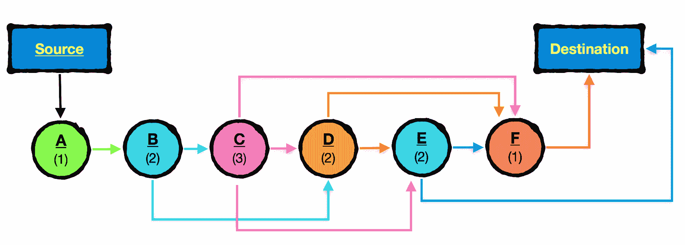

###### 图 8.8：城市相邻示例

在上面的例子中，可以通过以下方式到达目的地（其中`E`表示终点）：

```cpp
0 > 1 > 2 > 3 > 4 > 5 > E
0 > 1 > 2 > 3 > 4 > E
0 > 1 > 2 > 3 > 5 > E
0 > 1 > 2 > 4 > 5 > E
0 > 1 > 3 > 4 > 5 > E
0 > 1 > 2 > 4 > E
0 > 1 > 2 > 5 > E
0 > 1 > 3 > 4 > E
0 > 1 > 3 > 5 > E
```

这给我们一个答案为`9`。

一般来说，遍历总是从索引`0`开始，结束于索引`N`。可以保证城市索引`i`与`distance[i]`的和永远不会大于`N`，并且每个城市都将具有至少`1`的对应距离值。

**测试案例**

以下测试案例应该帮助您更好地理解这个问题：

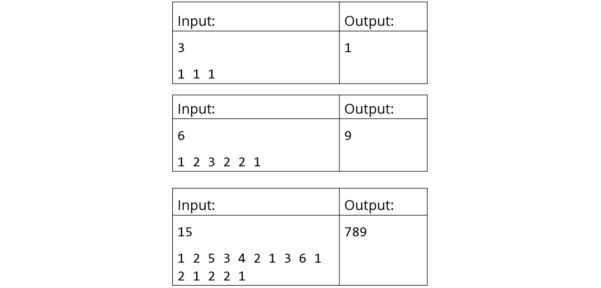

###### 图 8.9：活动 18 简单测试案例

以下是一些更复杂的测试案例：

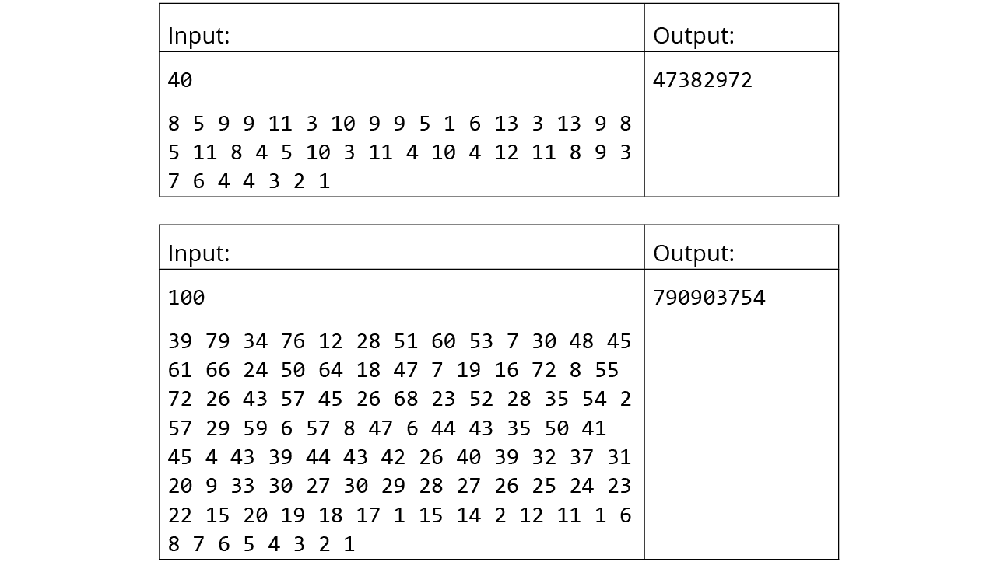

###### 图 8.10：活动 18 复杂测试案例

**额外学分**

假设您已找到了一个在合理时间限制内通过了前面的测试用例的方法，您可以使用一个最终的测试用例来真正测试算法的效率，其中`N`等于`10000000`。因为值的数量太多，打印出来会占用太多空间，您可以使用以下代码来以编程方式生成数组值：

```cpp
vector<int> Generate(int n)
{
    vector<int> A(n);

    ULL val = 1;

    for(int i = 0; i < n; i++)
    {
        val = (val * 1103515245 + 12345) / 65536;
        val %= 32768;

        A[i] = ((val % 10000) % (n – i)) + 1;
    }
    return A;
}
```

您的程序应该打印出`318948158`作为这个测试用例的结果。一个最佳算法应该能够在一秒内找到结果。

**活动指南**

+   最佳方法将在`O(n)`时间内运行，并且需要确切的`n`次迭代。

+   如果您完全不确定如何制定 DP 解决方案，请使用本章中描述的增量方法，即首先使用蛮力，然后逐渐优化解决方案。

+   要了解问题的状态是如何形成的，可以考虑斐波那契数列所展示的递推关系。

#### 注意

此活动的解决方案可以在第 556 页找到。

## 字符串和序列上的动态规划

到目前为止，我们对动态规划的探索主要集中在组合问题和计算具有定义公式的整数序列的项上。现在，我们将考虑 DP 的另一个最常见用途之一，即处理数据序列中的模式。程序员通常会使用 DP 来搜索、比较和构建字符串的最典型情况通常涉及到这个目的。

作为软件开发人员，我们经常与几个人合作，他们都有能力对同一个项目进行贡献和修改。由于程序员可能会无意中引入代码错误，或者团队可能尝试不同的方法来实现某个功能，然后决定返回到原始方法，因此拥有某种版本控制系统变得非常重要。如果最近工作正常的功能突然出现故障，那么有能力查看对代码所做的更改是至关重要的，特别是在它们与早期版本的不同之处。因此，所有版本控制系统都有一个“差异”功能，它分析同一代码的两个版本之间的相似性，然后以某种方式向用户显示这一点。

例如，假设您已将以下代码添加到存储库中：

```cpp
bool doSomething = true;
void DoStuff()
{
    DoSomething();
    DoSomethingElse();
    DoAnotherThing();
}
```

第二天，您做了一些更改：

```cpp
bool doSomething = false;
void DoStuff()
{
    if(doSomething == true)
    { 
        DoSomething();
    }
    else 
    {
        DoSomethingElse();
    }
}
```

然后，差异实用程序会显示类似于以下内容：

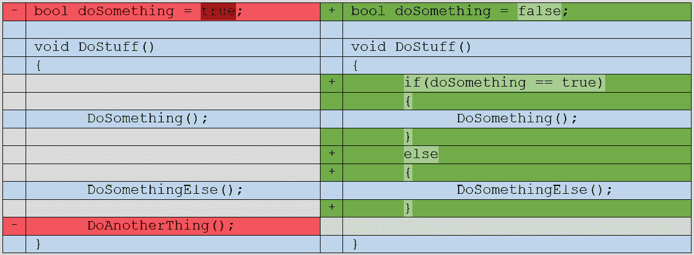

###### 图 8.11：差异实用程序输出

为了实现这一点，实用程序需要计算两个代码文件的相似性，考虑到两个版本中共同的文本序列可能不一定在字符串中是连续的。此外，原始文本的部分可能已被删除或出现在新版本的其他位置。这展示了**近似**（或**模糊**）**字符串匹配**的需求，这种技术通常使用动态规划。

### 最长公共子序列问题

**最长公共子序列问题**（通常缩写为**LCS**）是动态规划最著名的经典例子之一。它回答了以下问题：给定两个数据序列，它们的最长公共子序列是什么？

例如，考虑两个字符串，`A`和`B`：


###### 图 8.12：用于查找最长公共子序列的两个给定字符串

最长公共子序列将是"`LONGEST`"：


###### 图 8.13：给定字符串中的最长公共子序列

有了我们从子集和问题实现的一系列方法中获得的见解，让我们对如何提前攻击这个问题的结构有一些聪明的想法。我们将从基本情况开始制定一些关于问题结构的想法。

由于很难理解大输入的 DP 问题的性质，而没有先考虑微不足道的问题，让我们使用小输入字符串创建一些不同情景的例子，并尝试找到最长公共子序列（LCS）的长度：

```cpp
Case 1): A or B is empty
A   = ""
B   = ""
LCS = 0
A   = "A"
B   = ""
LCS = 0
A   = ""
B   = "PNEUMONOULTRAMICROSCOPICSILICOVOLCANOCONIOSIS"
LCS = 0
```

在其中一个或两个字符串为空的情况下，很明显最长公共子序列的长度总是等于零：

```cpp
Case 2) Both A and B contain a single character
A   = "A"
B   = "A"
LCS = 1
A   = "A"
B   = "B"
LCS = 0
Case 3) A has one character, B has two characters
A   = "A"
B   = "AB"
LCS = 1
A   = "A"
B   = "BB"
LCS = 0
```

这两种情况有一个简单的二进制定义 - 要么它们有一个共同的字符，要么没有：

```cpp
Case 4) Both A and B contain two characters
A:  = "AA"
B:  = "AA"
LCS = 2
A   = "BA"
B   = "AB"
LCS = 1
A   = "AA"
B   = "BB"
LCS = 0
```

对于长度为 2 的字符串，情况变得更有趣，但逻辑仍然相当简单。给定长度为 2 的两个字符串，它们要么相同，要么有一个共同的字符，要么没有共同的字符：

```cpp
Case 5) A and B both contain 3 characters
A   = "ABA"
B   = "AAB"
LCS = 2    
A   = "ABC"
B   = "BZC"
LCS = 2
```

现在，问题的复杂性开始显现。这种情况表明，比较逐渐变得更加不那么直接：

```cpp
Case 6: A and B both contain 4 characters
A   = AAAB
B   = AAAA
{ "AAA_", "AAA_" }
{ "AAA_", "AA_A" }
{ "AAA_", "A_AA" }
{ "AAA_", "_AAA" }
LCS = 3
A   = AZYB
B   = YZBA    
{ "_Z_B", "_ZB_" }
{ "__YB", "Y_B_" }
LCS = 2
```

到现在为止，很明显 LCS 问题确实包含有重叠子问题。与之前的问题类似，我们可以观察到给定字符串有 2n 个可能的子集，其中`n`等于字符串的长度，只是现在我们有两个序列要处理。更糟糕的是，我们不仅仅考虑每个序列的子集，还必须在它们之间进行比较：

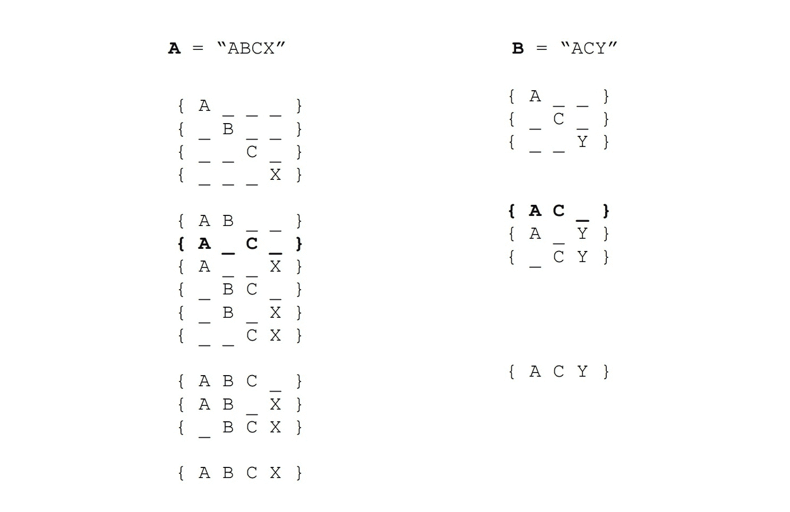

###### 图 8.14：两个字符串 ABCX 和 ACY 的所有可能字符子序列

事实上，我们不仅仅是在寻找连续的字符组，这有一些含义：首先，相同的字符序列可以在整个字符串中多次出现，并且可以跨越任一字符串以任何可能的排列方式分布，假设字符的顺序是相同的。其次，从任一给定索引开始，可能有许多共同的子序列。

在实施我们的蛮力方法之前，让我们也定义一下这个问题的状态。假设我们维护两个指针，`i`和`j`，它们分别表示`A`和`B`中的字符索引，以及我们找到的共同字符的子序列的记录：

```cpp
if i exceeds length of A, or j exceeds length of B:
— Terminate recursion and return length of subsequence
```

如果我们已经到达了任一字符串的末尾，那么没有其他可比较的了，因为子序列的索引是有序的：

```cpp
if A[i] = B[j]:
— Increase length of subsequence by 1
— Increment both i and j by 1 
```

如果字符相等，将其包含在我们找到的子序列中并没有优势。我们增加两个指针，因为任何给定字符在子序列中只能考虑一次：

```cpp
Otherwise:
    Option 1) Explore further possibilities with i + 1, and j
    Option 2) Explore further possibilities with i, and j + 1
    LCS from this state is equal to maximum value of Option 1 and Option 2
```

如果我们没有找到匹配，我们可以选择要么探索 A 的字符的下一个子集，要么探索 B 的字符的下一个子集。我们不包括同时从这个状态递增两个索引的情况，因为那样会是多余的。这种情况将在下一个函数调用中探索。这个递归的结构如下所示：

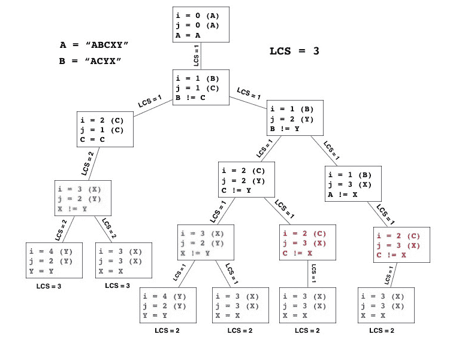

###### 图 8.15：最长子序列问题的子问题树

在前面的图中，重叠子问题已经被着色。这个问题的最优子结构还不太清楚，但我们仍然可以做一些基本的概括：

+   我们只需要比较相等长度的子集。

+   从给定的状态开始，可以通过增加`i`、`j`或两者来探索下一个状态的可能性。

+   我们的搜索总是在到达任一字符串的末尾时结束。

希望我们的初步蛮力实现可以提供额外的见解。让我们在下一个练习中立即开始。

### 练习 40：使用蛮力方法找到最长公共子序列

在这个练习中，我们将使用蛮力方法来解决这个问题，就像我们在*练习 36*中解决子集和问题时所做的那样，使用蛮力方法。让我们开始吧：

1.  首先包括以下头文件，并定义我们在上一章中使用的`DEBUG`和`PRINT`宏：

```cpp
    #include <iostream>
    #include <time.h>
    #include <iomanip>
    #include <algorithm>
    #include <utility>
    #include <vector>
    #include <strings.h>
    #define DEBUG 1
    #if DEBUG
    #define PRINT(x) cerr << x
    #else 
    #define PRINT(x)
    #endif
    using namespace std;
    ```

1.  定义一个名为`LCS_BruteForce()`的函数，该函数接受以下参数 - 两个字符串`A`和`B`，两个整数`i`和`j`，以及一个整数对的向量`subsequence` - 并返回一个整数。在这个函数之上，我们还将声明一个具有全局范围的二维整数对向量，即`found`：

```cpp
    vector<vector<pair<int, int>>> found;
    int LCS_BruteForce(string A, string B, int i, int j, vector<pair<int, int>> subsequence)
    {
        ……
    }
    ```

1.  `A`和`B`当然是我们要比较的字符串，`i`和`j`分别表示我们在`A`和`B`中的当前位置，`subsequence`是形成每个公共子序列的索引对的集合，它将在`found`中收集以进行输出。

由于我们已经有了伪代码可以使用，我们可以通过简单地将伪代码的每一行插入到我们的函数中作为注释，并在其下面将其翻译成 C++代码来相对容易地实现我们的函数：

```cpp
    // If i exceeds length of A, or j exceeds length of B:
    if(i >= A.size() || j >= B.size())
    {
        found.push_back(subsequence);
        //Terminate recursion and return length of subsequence
        return subsequence.size();
    }
    // if A[i] = B[j]:
    if(A[i] == B[j])
    {
        // Increase length of subsequence by 1
        subsequence.push_back({ i, j });
        // Increment both i and j by 1 
        return LCS_BruteForce(A, B, i + 1, j + 1, subsequence);
    }    
    /*
        Option 1) Explore further possibilities with i + 1, and j        
        Option 2) Explore further possibilities with i, and j + 1
        LCS from this state is equal to maximum value of Option 1 and Option 2
    */
    return max(LCS_BruteForce(A, B, i + 1, j, subsequence),
             LCS_BruteForce(A, B, i, j + 1, subsequence));
    ```

1.  在`main()`中，我们将以两个字符串的形式接收输入，然后调用我们的函数：

```cpp
    int main() 
    {
        string A, B;
        cin >> A >> B;
        int LCS = LCS_BruteForce(A, B, 0, 0, {}); 
        cout << "Length of the longest common subsequence of " << A << " and " << B << " is: " << LCS << endl;
        …    
    }
    ```

1.  就像我们在上一章中所做的那样，如果`DEBUG`没有设置为`0`，我们还将输出找到的子序列到`stderr`。然而，由于这个问题的复杂性更大，我们将把这个输出放在一个单独的函数`PrintSubsequences()`中：

```cpp
    void PrintSubsequences(string A, string B)
    {
        // Lambda function for custom sorting logic
        sort(found.begin(), found.end(), [](auto a, auto b)
        {
            // First sort subsequences by length
            if(a.size() != b.size())
            {
                return a.size() < b.size();
            }
            // Sort subsequences of same size by lexicographical order of index
            return a < b;
        });
        // Remove duplicates 
        found.erase(unique(found.begin(), found.end()), found.end());
        int previousSize = 0;
        for(auto subsequence : found)
        {
            if(subsequence.size() != previousSize)
            {
                previousSize = subsequence.size();
                PRINT("SIZE = " << previousSize << endl);
            }
            // Fill with underscores as placeholder characters
            string a_seq(A.size(), '_');
            string b_seq(B.size(), '_');
            for(auto pair : subsequence)
            {
                // Fill in the blanks with the characters of each string that are part of the subsequence
                a_seq[pair.first] = A[pair.first];
                b_seq[pair.second] = B[pair.second];
            }
            PRINT("\t" << a_seq << " | " << b_seq << endl);
        }
    }
    ```

1.  然后我们可以在`main()`中调用这个函数，指定只有在`DEBUG`设置为`1`时才应该被忽略：

```cpp
    int main()
    {
        ……
    #if DEBUG
        PrintSubsequences();
    #endif
        return 0;
    }
    ```

1.  将`DEBUG`设置为`1`，并使用`ABCX`和`ACYXB`作为输入应该产生以下输出：

```cpp
    Length of the longest common subsequence of ABCX and ACYXB is: 3
    SIZE = 1
        A___ A____
    SIZE = 2
        AB__ A___B
        A_C_ AC___
        A__X A__X_
    SIZE = 3
        A_CX AC_X_
    ```

这个输出显示了所有可能的子序列对的组合。让我们在下一节中分析这个输出，并努力优化我们的解决方案。

### 优化的第一步 - 寻找最优子结构

让我们再次回顾我们先前的方法的逻辑，看看如何进行优化。使用上一个练习中的输入字符串`ABCX`和`ACYXB`，如果我们当前的状态是`i = 0`和`j = 0`，我们可以清楚地看到我们下一个状态的唯一可能性如下：

```cpp
LCS(A, B, 0, 0) = 1 + LCS(A, B, 1, 1)
```

正如您可能记得的那样，我们最初的一个见解是，如果一个或两个字符串为空，LCS 等于`0`。我们还可以推广，`A`的给定前缀和`B`的给定前缀的 LCS 等于 A 的前缀减少一个字符与`B`的最大 LCS，以及`B`的前缀减少一个字符与`A`的最大 LCS：

```cpp
A = "ABC"
B = "AXB"
LCS of "ABC", "AXB" 
= max(LCS of "AB" and "AXB", LCS of "ABC" and "AX") 
= LCS of "AB" and "AXB"
= "AB"
```

利用两个字符串的 LCS 基于它们的前缀的 LCS 的概念，我们可以重新定义我们的逻辑如下：

```cpp
If prefix for either string is empty:
   LCS = 0
Otherwise:
   If character in last position of A's prefix is equal to character in last position of B's prefix:
         LCS is equal to 1 + LCS of prefix of A with last character removed and prefix of B with last character removed
   Otherwise:
          LCS is equal to maximum of:
            1) LCS of A's current prefix and B's prefix with last character removed 
            2) LCS of B's current prefix and A's prefix with last character removed 
```

使用记忆化，我们可以在一个二维表中的每一步存储我们的结果，第一维等于`A`的大小，第二维等于`B`的大小。假设我们还没有达到基本情况，我们可以检查我们是否在`memo[i - 1][j - 1]`中存储了一个缓存的结果。如果有，我们返回结果；如果没有，我们以与之前相同的方式递归地探索可能性，并相应地存储结果。我们将在下一个活动中实现这一点。

### 活动 19：使用记忆化找到最长公共子序列

在解决子集和问题时，我们实现了各种方法，包括蛮力、回溯、记忆化和表格法。在这个活动中，您的任务是独立使用记忆化来实现最长公共子序列问题的解决方案。

**输入**

两个字符串*A*和*B*。

**输出**

*A*和*B*的最长公共子序列的长度。

**测试案例**

以下测试案例应该帮助您更好地理解这个问题：

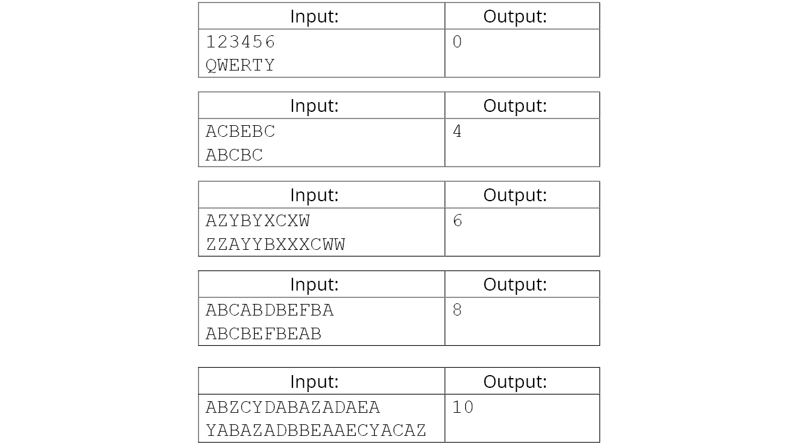

###### 图 8.16：活动 19 测试案例

**活动指南：**

+   您可以用两个维度表示状态，第一个维度受*A*的长度限制，第二个维度受*B*的长度限制。

+   几乎没有什么需要改变来将蛮力算法转换为记忆化算法。

+   确保您的方法有办法区分已经被缓存和尚未被缓存的子问题。

#### 注意

这个活动的解决方案可以在第 563 页找到。

### 从自顶向下到自底向上——将记忆化方法转换为表格法

如果我们打印出对字符串`ABCABDBEFBA`和`ABCBEFBEAB`的记忆表的值，它会是这样的（请注意，值为`-1`的是未知的）：

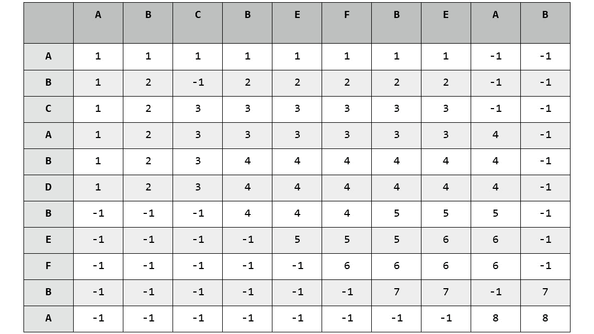

###### 图 8.17：ABCABDBEFBA 和 ABCBEFBE 的记忆表

查找任何字符相等的行/列组合（比如第 7 行和第 7 列），我们注意到一个模式：`memo[i][j]`的值等于`memo[i - 1][j - 1] + 1`。

现在，让我们看看另一种情况（即字符不相等）；我们看到的模式是`memo[i][j]`等于`memo[i - 1][j]`和`memo[i][j - 1]`的最大值。

假设我们已经找到了问题的最优子结构，使用记忆化解决方案形成解决方案通常是一个非常简单的任务，只需简单地采用由记忆化解决方案产生的表，并设计一种方案从底部构建它。我们需要以稍微不同的方式制定一些逻辑，但总体思路基本相同。需要处理的第一个不同之处是记忆表的值被初始化为`UNKNOWN`（`-1`）。记住，表格解决方案将用适当的结果填充*整个*表，因此在算法完成时不应该有任何*未知*的值。

让我们来看看第二行和第三列的未知值；这个值应该等于多少？假设我们在那一点考虑的前缀是`AB_________`和`ABC_______`，很明显，在这一点上 LCS 的值等于`2`。现在，让我们考虑第 10 行和第 9 列的未知值：我们在这一点考虑的前缀是`ABCABDBEFB_`和`ABCBEFBEA_`，在这一点找到的 LCS 是`ABC_B__EFB_` —> `ABCBEFB___`，长度为七个字符。我们可以逻辑推断，在给定状态下 LCS 的值要么等于先前找到的 LCS，要么比先前找到的 LCS 多一个，如果字符相等的话。当然，最低可能的 LCS 值应该等于 0。因此，我们迭代地填充 DP 表的逻辑看起来应该是这样的：

```cpp
If i = 0 or j = 0 (empty prefix):
  LCS(i, j) = 0
Otherwise:
  If the last characters of both prefixes are equal:
    LCS(i, j) = LCS(i - 1, j - 1) + 1
  Otherwise:
    LCS(i, j) = Maximum of:
        LCS(i - 1, j)  LCS for A's current prefix and B's prefix with the last character removed 
        LCS(i, j - 1)  LCS for B's current prefix and A's prefix with the last character removed
```

我们的逻辑本质上与记忆化解决方案相同，只是我们不是递归地找到未探索状态的值来填充表中当前状态的值，而是首先填充这些状态的值，然后根据需要简单地重用它们。我们将在以下活动中将这种逻辑转化为代码。

### 活动 20：使用表格法找到最长公共子序列

在这个活动中，您的任务是使用表格法实现最长公共子序列问题的自底向上解决方案。

**输入**

两个字符串，*A*和*B*。

**输出**

*A*和*B*的最长公共子序列的长度。

**额外学分**

除了 LCS 的长度之外，还输出它包含的实际字符。

**测试用例**

以下测试用例应该有助于您更好地理解这个问题：

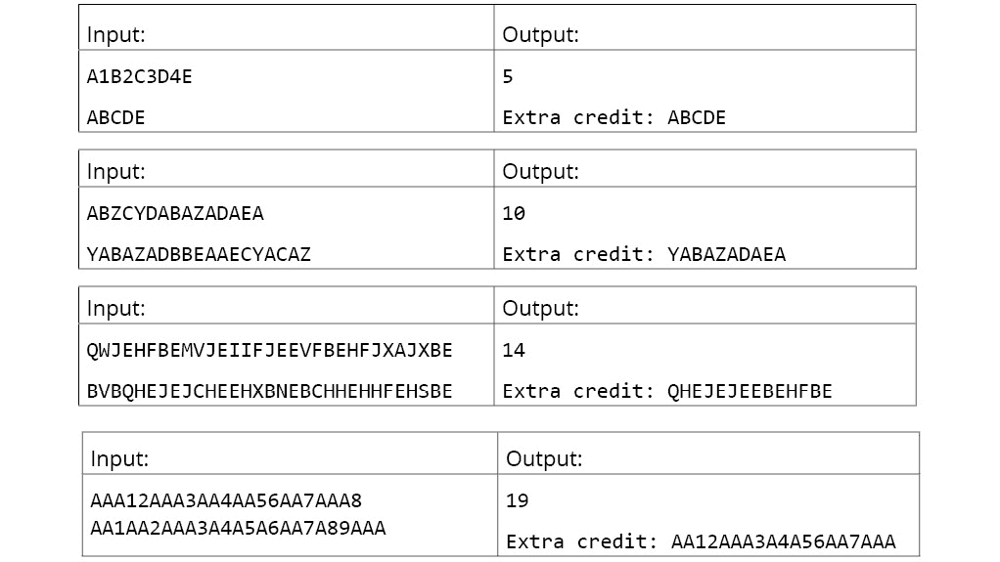

###### 图 8.18：活动 20 测试用例

**活动指南**

+   与子集和问题一样，表格解决方案需要迭代两个嵌套的`for`循环。

+   对于给定状态`LCS(I, j)`，有三种可能需要处理——要么字符串的前缀为空，要么*A*和*B*的前缀的最后一个字符相等，要么*A*和*B*的前缀的最后一个字符不相等。

+   通过回溯 DP 表格可以找到 LCS 的字符。

#### 注

这个活动的解决方案可以在 568 页找到。

## 活动 21：旋律排列

#### 注

这个活动是基于传统的西方 8 音符均匀音阶，尽管学生不需要了解任何音乐理论来进行这个活动。所有关于音乐方面的必要信息都在这里提供了。

音乐集合理论是一种根据音符的间隔关系对音乐和旋律进行分类的形式。在音乐术语中，间隔可以被定义为音符在音乐符号中的相对位置之间的距离：

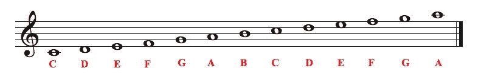

###### 图 8.19：音乐符号

下图展示了用音乐符号表示不同音符之间的距离：

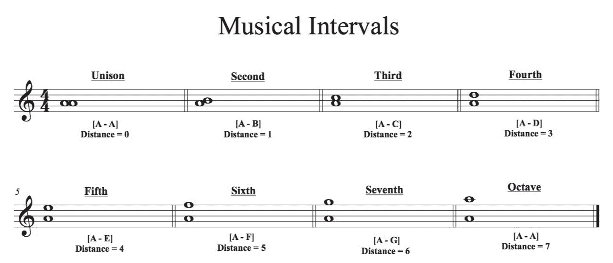

###### 图 8.20：音乐间隔

你是一个对各种作曲家的旋律中特定音符集的排列出现了多少次感到好奇的音乐理论家。给定完整旋律的音符和一组音符，计算音符集的任何[排列](http://www.apple.com)在旋律中出现的次数。对于任何有效的排列，音符可以重复任意次数，并且可以以任何顺序出现：

```cpp
               0    1    2    3    4    5   6
Melody:     { "A", "B", "C", "C", "E", "C, "A" }
Note set:     { "A", "C", "E" }
Subsets:
    { 0, 2, 4 }    —>    { "A", "C", "E" }
    { 0, 3, 4 }    —>    { "A", "C", "E" }
    { 0, 4, 5 }    —>    { "A", "E", "C" }
    { 2, 4, 6 }    —>    { "C", "E", "A" }
    { 3, 4, 6 }    —>    { "C", "E", "A" }
    { 4, 5, 6 }    —>    { "E", "C", "A" }

    { 0, 2, 3, 4 }    —>    { "A", "C", "C", "E" }
    { 0, 2, 4, 5 }    —>    { "A", "C", "E", "C" }
    { 0, 2, 4, 6 }    —>    { "A", "C", "E", "A" }
    { 0, 3, 4, 5 }    —>    { "A", "C", "E", "C" }
    { 0, 3, 4, 6 }    —>    { "A", "C", "E", "A" }
    { 0, 4, 5, 6 }    —>    { "A", "E", "C", "A" }  
    { 2, 3, 4, 6 }    —>    { "C", "C", "E", "A" }
    { 2, 4, 5, 6 }    —>    { "C", "E", "C", "A" }
    { 3, 4, 5, 6 }    —>    { "C", "E", "C", "A" }
    { 0, 2, 3, 4, 5 }       —>    { "A", "C", "C", "E", "C" }
    { 0, 2, 3, 4, 6 }       —>    { "A", "C", "C", "E", "A" }
    { 0, 2, 4, 5, 6 }       —>    { "A", "C", "E", "C", "A" }
    { 0, 3, 4, 5, 6 }       —>    { "A", "C", "E", "C", "A" }
    { 2, 3, 4, 5, 6 }       —>    { "C", "C", "E", "C", "A" }

    { 0, 2, 3, 4, 5, 6 }    —>    { "A", "C", "C", "E", "C", "A" }
Total Permutations = 21
```

下面的注释被描述为*同音异名*，应被视为相同的：

```cpp
C  — B# (B# is pronounced as "B sharp")
C# — Db (Db is pronounced as "D flat")
D# — Eb
E  — Fb
E# — F
F# — Gb
G# — Ab
A# — Bb
B  — Cb
```

下图说明了钢琴上的这种等价关系：

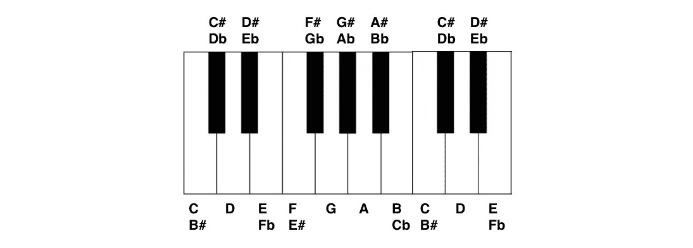

###### 图 8.21：钢琴上表示的同音异名音符

因此，以下音符组合将被视为等价的：

```cpp
{ A#, B#, C# }   = { Bb, C, Db },
{ Fb, Db, Eb }   = { E, C#, D# },
{ C, B#, E#, F } = { C, C, F, F }
And so on…
```

以下是一些示例输入和相应的输出：

输入：

```cpp
Melody:    { "A", "B", "C", "C", "E", "C, "A" }
Note Set:    { "A", "C", "E" }
```

输出：`21`

输入：

```cpp
Melody:    { "A", "B", "D", "C#", "E", "A", "F#", "B", "C", "C#", "D", "E" }
Note Set:    { "B", "D", "F#", "E" }
```

输出：`27`

输入：

```cpp
Melody:    { "Bb", "Db", "Ab", "G", "Fb", "Eb", "G", "G", "Ab", "A", "Bb", "Cb", "Gb", "G", "E", "A", "G#" }
Note Set:    { "Ab", "E", "G" }
```

输出：`315`

输入：

```cpp
Melody:    { "C", "C#", "D", "Bb", "E#", "F#", "D", "C#", "A#", "B#", "C#", "Eb", "Gb", "A", "A#", "Db", "B", "D#" }
Note Set:    { "Bb", "C#", "D#", "B#" }
```

输出：`945`

输入：

```cpp
Melody:    { "A#", "B", "D#", "F#", "Bb", "A", "C", "C#", "Db", "Fb", "G#", "D", "Gb", "B", "Ab", "G", "C", "Ab", "F", "F#", "E#", "G", "Db" }
Note Set:    { "A", "Db", "Gb", "A#", "B", "F#", "E#" }
```

输出：`1323`

这个活动的指导方针如下：

+   实际上，你解决这个问题并不需要了解音乐理论之外的东西，除了描述中解释的内容。

+   有没有更好的方法来表示这些音符？它们能否被转换成更适合表格 DP 解决方案的格式？

+   *n*元素的子集的总数是多少？这个信息对解决这个问题有用吗？

#### 注

这个活动的解决方案可以在 574 页找到。

## 总结

在本章中，我们分析并实施了动态规划的两个典型例子，并学习了几种不同 DP 问题可能被解决的方法。我们还学习了如何识别可以用 DP 解决的问题的特征，DP 算法应该如何在概念上考虑，以及状态、基本情况和递归关系的概念如何被用来将一个复杂的问题分解成更简单的组成部分。

我们只是刚刚触及了动态规划技术的表面。事实上，我们深入探讨的两个问题在概念上和解决方案的实现方式上实际上是非常相似的。然而，这些相似之处中的许多都用来展示几乎每个 DP 问题中遇到的一些共同点，因此，它们作为对一个明显相当复杂和难以掌握的主题的绝佳介绍。 

使用动态规划是一种技能，你不太可能仅通过阅读或观察来提高。真正提高这种技术的唯一方法是尽可能多地解决问题，最好是不受指导地解决。起初，某些困难的 DP 问题可能需要多次尝试才能找到最佳解决方案，但通过这种常常艰难的过程获得的经验，可能比你仅仅通过研究任意数量的 DP 问题的解决方案所获得的要大得多。

本章展示的解决 DP 问题的渐进方法在未来会对你有所帮助，但这绝不是到达最终解决方案的唯一方法。在解决了许多 DP 问题之后，你无疑会开始注意到某些模式，这将使得从一开始就能设计出表格化的解决方案成为可能。然而，这些模式可能直到你遇到各种不同的 DP 问题之后才会被发现。请记住，使用 DP，就像任何具有挑战性的技能一样，持续的练习会让它变得更容易，而且不久之后，最初看起来极其艰巨的事情最终会变得非常容易处理，甚至相当有趣！

在最后一章中，我们将学习如何将动态规划应用于更高级的情况，并深入了解一开始看起来完全不同的 DP 问题通常只是相同概念的变体。最后，我们将通过重新讨论图的主题来结束这本书，以展示 DP 范式如何有效地应用于最短路径问题。
