# 9\. 动态规划 II

## 学习目标

通过本章结束时，你将能够：

+   描述如何在多项式与非确定性多项式时间内解决问题，以及这对我们开发高效算法的影响

+   实现 0-1 和无界变体的背包问题的解决方案

+   将状态空间缩减的概念应用于动态规划问题

+   使用动态规划范式优化的方法确定加权图中的每条最短路径

在本章中，我们将建立在对动态规划方法的理解之上，并研究如何优化我们在上一章中讨论的问题。

## 介绍

从上一章，你应该对动态规划有一个基本的理解，以及一套有效的策略，用于找到一个陌生问题的动态规划（DP）解决方案。在本章中，我们将通过探讨问题之间的关系来进一步发展这一理解，特别是在基本 DP 逻辑如何被修改以找到另一个问题的解决方案方面。我们还将讨论状态空间缩减的概念，这使我们能够利用问题的某些方面来进一步优化工作的 DP 解决方案，减少找到结果所需的维度和/或操作的数量。我们将通过重新讨论图的主题来结束本章，以展示 DP 方法如何应用于最短路径问题。

## P 与 NP 的概述

在*第八章*，*动态规划 I*中，我们展示了动态规划相对于其他方法所能提供的显著效率提升，但可能还不清楚差异有多大。重要的是要意识到某些问题的复杂性将随着输入边界的增加而扩展，因为这样我们就能理解 DP 不仅仅是可取而且是必要的情况。

考虑以下问题：

*"给定布尔公式的术语和运算符，确定它是否求值为 TRUE。"*

看看以下例子：

```cpp
(0 OR 1)  —> TRUE
(1 AND 0) —> FALSE
(1 NOT 1) —> FALSE
(1 NOT 0) AND (0 NOT 1) —> TRUE
```

这个问题在概念上非常简单解决。只需要对给定的公式进行线性评估即可得到正确的结果。然而，想象一下，问题是这样陈述的：

给定布尔公式的变量和运算符，确定是否存在对每个变量的 TRUE/FALSE 赋值，使得公式求值为 TRUE。

看看以下例子：

```cpp
(a1 OR a2) —> TRUE 
        (0 ∨ 0) = FALSE
        (0 ∨ 1) = TRUE
        (1 ∨ 0) = TRUE
        (1 ∨ 1) = TRUE
(a1 AND a2) —> TRUE
        (0 ∧ 0) = FALSE
        (0 ∧ 1) = FALSE
        (1 ∧ 0) = FALSE
        (1 ∧ 1) = TRUE
(a1 NOT a1) —> FALSE 
        (0 ¬ 0) = FALSE
        (1 ¬ 1) = FALSE
(a1 NOT a2) AND (a1 AND a2) —> FALSE 
        (0 ¬ 0) ∧ (0 ∧ 0) = FALSE
        (0 ¬ 1) ∧ (0 ∧ 1) = FALSE
        (1 ¬ 0) ∧ (1 ∧ 0) = FALSE
        (1 ¬ 1) ∧ (1 ∧ 1) = FALSE
```

#### 注意：

如果你不熟悉逻辑符号，`¬`表示`NOT`，因此`(1 ¬ 1) = FALSE`，`(1 ¬ 0) = TRUE`。另外，`∧`表示`AND`，而`∨`表示`OR`。

基本的概念仍然是相同的，但这两个问题之间的差异是巨大的。在原始问题中，找到结果的复杂性仅取决于一个因素——公式的长度——但是以这种方式陈述，似乎没有明显的方法来解决它，而不需要搜索每个可能的变量赋值的二进制子集，直到找到解决方案。

现在，让我们考虑另一个问题：

*"给定一个图，其中每个顶点被分配了三种可能的颜色，确定相邻的两个顶点是否是相同的颜色。"*

像我们的第一个例子一样，这个问题实现起来非常简单——遍历图的每个顶点，将其颜色与每个邻居的颜色进行比较，只有在找到相邻颜色匹配对时才返回 false。但现在，想象一下问题是这样的：

*"给定一个图，其中每个顶点被分配了三种可能的颜色之一，确定是否可能对其顶点进行着色，以便没有两个相邻的顶点共享相同的颜色。"*

同样，这是一个非常不同的情景。

这些问题的第一个版本通常被归类为**P**，这意味着有一种方法可以在**多项式时间**内解决它们。当我们将问题描述为*O(n)*、*O(n**2**)*、*O(log n)*等时间复杂度时，我们描述的是*P*类中的问题。然而，重新表述的形式——至少目前为止据证明——没有现有的方法可以在其最坏情况下找到解决方案，因此我们将它们的复杂性分类为**NP**，或**非确定性多项式时间**。

这些问题类别之间的关系是一个备受争议的话题。特别感兴趣的问题是，*验证*它们的解决方案所需的计算复杂度是“简单”的，而*生成*解决方案的复杂度是“困难”的。这展示了编程中最广泛讨论的未解决问题之一：验证解决方案在*P*类中是否意味着也存在一种方法可以在多项式时间内生成解决方案？换句话说，*P = NP*吗？虽然对这个问题的普遍假设答案是否定的（*P ≠ NP*），但这还没有被证明，而且无论实际答案是什么，证明它都将是算法和计算研究中真正革命性的进展。

可以说，NP 中最有趣的一组问题被称为**NP-complete**，因为它们共享一个显著的特征：如果发现了一个有效地解决任何一个这些问题的解决方案（即在多项式时间内），实际上可以修改该解决方案以有效地解决*NP*中的所有其他问题。换句话说，如果第一个示例（称为**布尔可满足性问题**或**SAT**）的多项式解决方案被找到，同样的逻辑的某个变体也可以用来解决第二个示例（称为**图着色问题**），反之亦然。

请记住，并非每个指数级复杂的问题都符合这个分类。考虑一下在国际象棋游戏中确定下一步最佳移动的问题。您可以将递归逻辑描述如下：

```cpp
    For each piece, a, belonging to the current player:
        Consider every possible move, m_a, that a can make:

            For each piece, b, belonging to the opponent:
                Consider each possible move m_b that b can make
                in response to m_a.
                    for each piece, a, belonging to the 
                    current player…
                    (etc.)
        Count number of ways player_1 can win after this move
Next best move is the one where the probability that player_1 wins is maximized.
```

寻找解决方案的复杂度无疑是指数级的。然而，这个问题不符合*NP*-完全性的标准，因为验证某个移动是否是最佳移动的基本行为需要相同程度的复杂性。

将此示例与解决数独难题的问题进行比较：

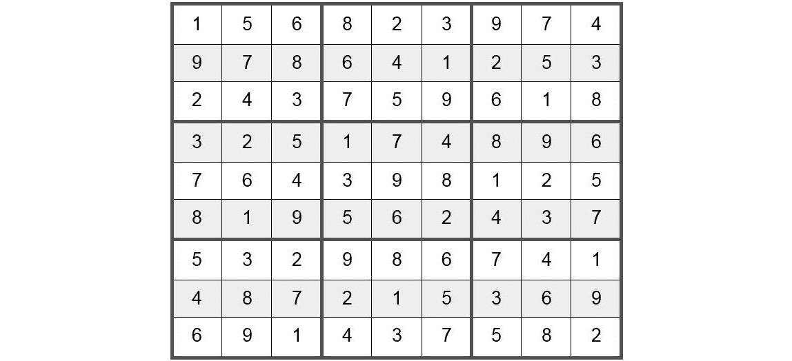

###### 图 9.1：一个解决的数独难题

验证需要扫描矩阵的每一行和每一列，并确定每个九个 3 x 3 方格中都包含 1-9 的每个数字，且没有行或列包含相同的数字超过一次。这个问题的一个直接实现可以使用三个包含`{1, 2, 3, 4, 5, 6, 7, 8, 9}`的集合，第一个集合表示每行中的数字，第二个表示每列中的数字，第三个表示每个 3 x 3 方格中的数字。当扫描每个单元格时，我们将检查它包含的数字是否在对应的集合中；如果是，就从集合中移除。否则，结果为*FALSE*。一旦每个单元格都被考虑过，如果每个集合都为空，则结果为*TRUE*。由于这种方法只需要我们遍历矩阵一次，我们可以得出结论，它可以在多项式时间内解决。然而，假设提供的难题是不完整的，任务是确定是否存在解决方案，我们将不得不递归地考虑原始网格中每个空单元格的每个数字组合，直到找到有效的解决方案，导致最坏情况下的复杂度为*O(9**n**)*，其中*n*等于原始网格中的空单元格数；因此，我们可以得出结论，解决数独难题属于*NP*。

## 重新考虑子集和问题

在上一章中，我们讨论了子集和问题，我们发现在最坏的情况下具有指数复杂度。让我们考虑这个问题可以用两种方式来表达-在找到解决方案的相对困难和验证解决方案的有效性方面。

让我们考虑验证解决方案的问题：

```cpp
Set    —> { 2 6 4 15 3 9 }
Target —> 24
Subset —> { 2 6 4 }
Sum = 2 + 6 + 4 = 12 
FALSE
Subset —> { 2 6 15 3 }
Sum = 2 + 6 + 15 + 3 = 24
TRUE
Subset —> { 15 9 }
Sum = 15 + 9 = 24
TRUE
Subset —> { 6 4 3 9 }
Sum = 6 + 4 + 3 + 9 = 22
FALSE
```

毫无疑问，验证的复杂性与每个子集的长度成正比-将所有数字相加并将总和与目标进行比较-这使得它完全属于 P 类。我们找到了一些看似有效的处理解决方案复杂性的方法，我们可以假设它们具有*O(N×M)*的多项式时间复杂度，其中*N*是集合的大小，*M*是目标总和。这似乎排除了这个问题是*NP*完全的。然而，实际情况并非如此，因为*M*不是输入的大小，而是它的大小。请记住，计算机用二进制表示整数，需要更多位来表示的整数也需要更多时间来处理。因此，每当 M 的最大值加倍时，计算它实际上需要两倍的时间。

因此，不幸的是，我们的 DP 解决方案不符合多项式复杂性。因此，我们将我们对这个问题的方法定义为运行在“伪多项式时间”中，并且我们可以得出结论，子集和问题实际上是*NP*完全的。

## 背包问题

现在，让我们重新考虑我们在*第五章*“贪婪算法”中看到的背包问题，我们可以将其描述为子集和问题的“大哥”。它提出了以下问题：

“给定一个容量有限的背包和一系列不同价值的加权物品，可以在背包中包含哪些物品，以产生最大的组合价值而不超过容量？”

这个问题也是*NP*完全性的一个典型例子，因此它与这个类中的其他问题有许多紧密联系。

考虑以下例子：

```cpp
Capacity —> 10 
Number of items —> 5
Weights —> { 2, 3, 1, 4, 6 } 
Values —>  { 4, 2, 7, 3, 9 }
```

有了这些数据，我们可以产生以下子集：

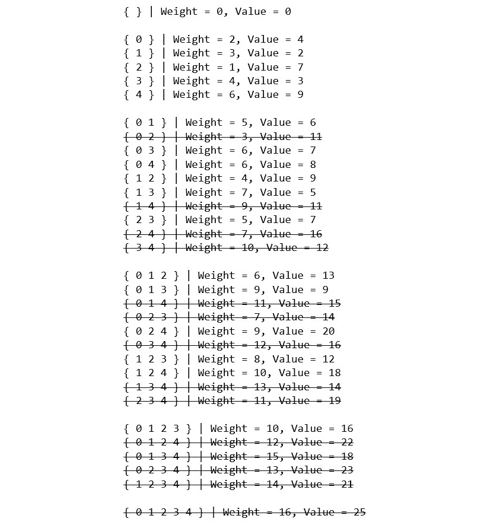

###### 图 9.2：给定 0-1 背包问题的所有可能子集

这绝对看起来很熟悉。这是否需要对子集和算法进行轻微修改？

### 0-1 背包-扩展子集和算法

您可能还记得我们在*第六章*“图算法 I”中的讨论，先前的例子就是 0-1 背包问题。在这里，我们注意到当前算法与我们用来解决子集和问题的状态逻辑之间存在另一个明显的并行。

在子集和问题中，我们得出结论，对于集合中索引为 i 的每个元素`x`，我们可以执行以下操作：

1.  将`x`的值添加到先前找到的子集和中。

1.  将子集和保持不变。

这意味着可以将新总和`y`的 DP 表条目标记为`TRUE`，如果它如下所示：

1.  表中上一行中的现有总和`x`，即`DP(i, x)`

1.  将`x`与集合[i]中的当前元素的组合和，即`DP(i, x + set[i])`

换句话说，是否可以使用跨越集合中前 i 个元素的子集来形成总和取决于它是否已经被找到，或者是否可以通过将当前元素的值添加到先前找到的总和中找到。

在当前问题中，我们可以观察到对于集合中索引为 i 的每个项目`x`和权重`w`，我们可以执行以下操作之一：

1.  将`x`的值添加到先前找到的项目值的子集和中，只要相应项目的权重与`w`的组合总和小于或等于最大容量。

1.  将子集和保持不变。

这反过来意味着可以在具有组合重量`W`的物品集合的索引`i+1`处找到的最大值和`y`可以是以下两者之一：

1.  先前`i`个物品中找到的现有最大值和`x`，并且组合重量为`w`

1.  `x`的组合和与索引`i`处的物品的值，假设将物品的重量添加到`w`时不超过容量

换句话说，可以用前`i`个物品的子集形成的最大值和，且组合重量为`w`，要么等于前`i-1`个物品的重量`w`对应的最大和，要么等于将当前物品的值添加到先前找到的子集的总值中产生的和。

在伪代码中，我们表达了子集和问题的填表方案如下：

```cpp
for sum (1 <= sum <= max_sum) found at index i of the set: 
   if sum < set[i-1]: 
    DP(i, sum) = DP(i-1, sum)
   if sum >= set[i-1]:
    DP(i, sum) = DP(i-1, sum) OR DP(i-1, sum - set[i-1])
```

0-1 背包问题的等效逻辑将如下所示：

```cpp
for total_weight (1 <= total_weight <= max_capacity) found at index i of the set:
  if total_weight < weight[i]:
     maximum_value(i, total_weight) = maximum_value(i-1, total_weight)
  if total_weight >= weight[i]:
     maximum_value(i, total_weight) = maximum of:
        1) maximum_value(i-1, total_weight)
        2) maximum_value(i-1, total_weight – weight[i]) + value[i]
```

在这里，我们可以看到一般的算法概念实际上是基本相同的：我们正在遍历一个二维搜索空间，其边界由集合的大小和集合元素的最大和确定，并确定是否可以找到新的子集和。不同之处在于，我们不仅仅记录某个子集和是否存在，而是收集与每个物品子集相关的最大对应值和，并根据它们的总组合重量进行组织。我们将在下一个练习中看一下它的实现。

### 练习 41：0-1 背包问题

现在，我们将使用表格化的自底向上方法实现前面的逻辑。让我们开始吧：

1.  我们将首先包括以下标题：

```cpp
#include <iostream>
#include <vector>
#include <algorithm>
using namespace std;
```

1.  我们的第一步将是处理输入。我们需要声明两个整数`items`和`capacity`，它们分别表示可供选择的物品总数和背包的重量限制。我们还需要两个数组`value`和`weight`，我们将在其中存储与每个物品对应的数据：

```cpp
int main()
{
    int items, capacity;
    cin >> items >> capacity;
    vector<int> values(items), weight(items);
    for(auto &v : values) cin >> v;
    for(auto &w : weight) cin >> w;
    ……
}
```

1.  现在，我们将定义函数`Knapsack_01()`，它具有与输入对应的参数，并返回一个整数：

```cpp
int Knapsack_01(int items, int capacity, vector<int> value, vector<int> weight)
{
    ……
}
```

1.  我们的 DP 表将是二维的，并且将与我们在子集和问题中使用的表非常接近。在子集和表中，第一维的大小初始化为比集合的长度大一，而第二维的大小初始化为比集合中所有元素的最大和大一。在这里，我们的第一维的大小将等效地初始化为`items + 1`；同样，第二维的大小将初始化为`capacity + 1`：

```cpp
vector<vector<int>> DP(items + 1, vector<int>(capacity + 1, 0));
```

1.  我们需要从`1`开始迭代两个维度的长度。在外部循环的每次迭代开始时，我们将定义两个变量`currentWeight`和`currentValue`，它们分别对应于`weight[i-1]`和`values[i-1]`中的元素：

```cpp
for(int i = 1; i <= items; i++)
{
    int currentWeight = weight[i-1];
    int currentValue = values[i-1];
    for(int totalWeight = 1; totalWeight <= capacity; totalWeight++)
    {
        ……
    }
}
```

1.  现在，我们将实现我们的表格化方案：

```cpp
if(totalWeight < currentWeight)
{
    DP[i][totalWeight] = DP[i-1][totalWeight];
}
else 
{
    DP[i][totalWeight] = max(DP[i-1][totalWeight], DP[i-1][totalWeight - currentWeight] + currentValue);
}
```

1.  在我们的函数结束时，我们返回表的最后一个元素：

```cpp
return DP[items][capacity];
```

1.  现在，我们添加一个对`main()`的调用并打印输出：

```cpp
int result = Knapsack_01(items, capacity, values, weight);
cout << "The highest-valued subset of items that can fit in the knapsack is: " << result << endl;
return 0;
```

1.  让我们尝试使用以下输入运行我们的程序：

```cpp
8 66
20 4 89 12 5 50 8 13
5 23 9 72 16 14 32 4
```

输出应该如下：

```cpp
The highest-valued subset of items that can fit in the knapsack is: 180
```

正如我们所看到的，相对高效的 DP 解决方案对于背包问题而言只是对解决子集和问题所使用的相同算法的轻微修改。

### 无界背包

我们探讨的背包问题的实现是最传统的版本，但正如我们在本章前面提到的，实际上有许多种类的问题可以适用于不同的场景。现在，我们将考虑我们拥有每个物品无限数量的情况。

让我们考虑一个通过蛮力找到解决方案的例子：

```cpp
Capacity = 25
Values —> { 5, 13, 4, 3, 8  }
Weight —> { 9, 12, 3, 7, 19 }
{ 0 } —> Weight = 9, Value = 5
{ 1 } —> Weight = 12, Value = 13
{ 2 } —> Weight = 3, Value = 4
{ 3 } —> Weight = 7, Value = 3
{ 4 } —> Weight = 32, Value = 8
{ 0, 0 } —> Weight = 18, Value = 10
{ 0, 1 } —> Weight = 21, Value = 18
{ 0, 2 } —> Weight = 12, Value = 9
{ 0, 3 } —> Weight = 16, Value = 8
{ 0, 4 } —> Weight = 28, Value = 13
{ 1, 1 } —> Weight = 24, Value = 26
{ 1, 2 } —> Weight = 15, Value = 17
{ 1, 3 } —> Weight = 19, Value = 16
{ 1, 4 } —> Weight = 31, Value = 21
{ 2, 2 } —> Weight = 6, Value = 8
{ 2, 3 } —> Weight = 10, Value = 7
{ 2, 4 } —> Weight = 22, Value = 12
{ 3, 3 } —> Weight = 14, Value = 6
{ 3, 4 } —> Weight = 26, Value = 11
{ 4, 4 } —> Weight = 38, Value = 16
{ 0, 0, 0 } —> Weight = 27, Value = 15
{ 0, 0, 1 } —> Weight = 30, Value = 26
{ 0, 0, 2 } —> Weight = 21, Value = 14
{ 0, 0, 3 } —> Weight = 25, Value = 13
{ 0, 0, 4 } —> Weight = 37, Value = 18
{ 0, 1, 1 } —> Weight = 33, Value = 31
……
```

从蛮力的角度来看，这个问题似乎要复杂得多。让我们重新陈述我们从 0-1 背包实现中的伪代码逻辑，以处理这个额外的规定。

可以在集合的项目索引`i`处找到的具有组合重量`total_weight`的最大值总和`y`可以是以下之一：

1.  在先前`i-1`个项目中找到的现有最大值总和`x`，并且还具有等于`total_weight`的组合重量

1.  假设`total_weight`可以通过将`current_weight`添加到前`i-1`个项目中找到的某个其他子集的总重量来形成：

a) 当前项目值与跨越前`i-1`个项目的子集的最大值总和，且组合重量为`total_weight - current_weight`

b) 当前项目值与最近迭代中找到的某个先前`y`的总重量为`total_weight - current_weight`的组合

在 DP 表方面，我们可以将新逻辑表示如下：

```cpp
for total_weight (1 <= total_weight <= max_capacity) found at index i of the set:
    if total_weight < set[i-1]:
      maximum_value(i, total_weight) = maximum_value(i-1, total_weight)

    if total_weight >= set[i-1]:
      maximum_value(i, total_weight) = maximum of:
        1) maximum_value(i-1, total_weight)
        2) maximum_value(i-1, total_weight - current_weight) + current_value
        3) maximum_value(i, total_weight - current_weight) + current_value
```

我们可以这样实现：

```cpp
auto max = [](int a, int b, int c) { return std::max(a, std::max(b, c)); };
for(int i = 1; i <= items; i++)
{
    int current_weight = weight[i—1];
    int value = values[i-1];
    for(int total_weight = 0; total_weight <= capacity; w++)
    {
        if(total_weight < current_weight)
        {
            DP[i][total_weight] = DP[i-1][total_weight];
        }
        else 
        {
            DP[i][total_weight] = max
            (
                DP[i-1][total_weight], 
                DP[i-1][total_weight – current_weight] + value, 
                DP[i][total_weight – current_weight] + value
            );
        }
    }
}
```

从逻辑上讲，这种方法是可行的，但事实证明这实际上并不是最有效的实现。让我们在下一节中了解它的局限性以及如何克服它们。

### 状态空间缩减

有效使用 DP 的一个相当棘手的方面是**状态空间缩减**的概念，即重新构建工作的 DP 算法以使用表示状态所需的最小空间。这通常归结为利用问题本质中固有的某种模式或对称性。

为了演示这个概念，让我们考虑寻找**Pascal 三角形**第*n*行和第*m*列中的值的问题，可以表示如下：

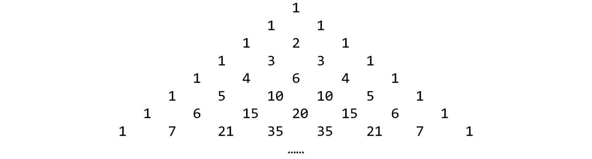

###### 图 9.3：Pascal 三角形

Pascal 三角形是根据以下逻辑构建的：

```cpp
For m <= n:
        Base case:
            m = 1, m = n —> triangle(n, m) = 1
        Recurrence: 
            triangle(n, m) = triangle(n-1, m-1) + triangle(n-1, m)
```

换句话说，每一行的第一个值是`1`，每个后续列的值都等于前一行的当前列和前一列的和。正如您从下图中看到的，在第二行的第二列中，通过将前一行的第二列（`1`）和第一列（`1`）的元素相加，我们得到`2`：


###### 图 9.4：获取 Pascal 三角形中的下一个值

使用制表法解决寻找**Pascal 三角形**第*n*行和第*m*列中的值的问题可以如下进行：

```cpp
vector<vector<int>> DP(N + 1, vector<int>(N + 1, 0));
DP[1][1] = 1;
for(int row = 2; row <= N; row++)
{
    for(int col = 1; col <= row; col++)
    {
        DP[row][col] = DP[row-1][col-1] + DP[row-1][col];
    }
}
```

在先前的代码中构建的 DP 表对于`N = 7`将如下所示：

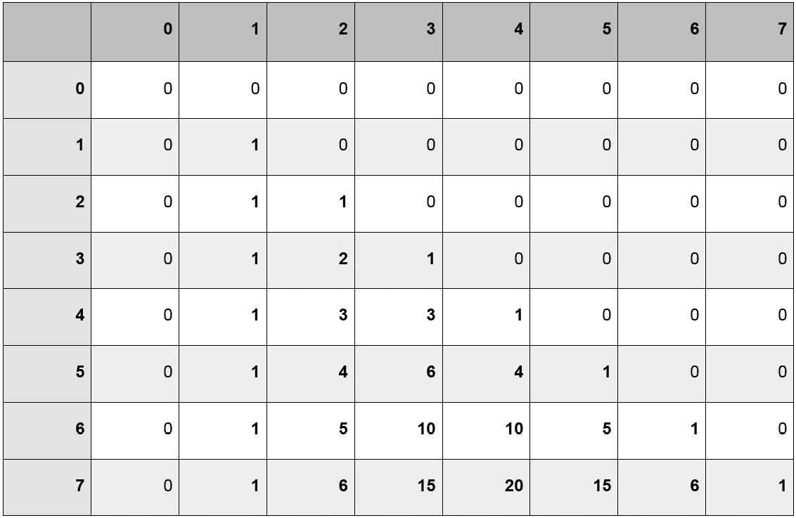

###### 图 9.5：将 Pascal 三角形表示为 N×N DP 表

正如我们所看到的，这个算法在内存使用和冗余计算方面都是相当浪费的。显而易见的问题是，尽管只有一行包含那么多的值，但表格却有*N + 1*列。我们可以通过根据所需的元素数量初始化每行，从而将空间复杂度降低，从*N**2*减少到*N × (N + 1) / 2*。让我们修改我们的实现如下：

```cpp
vector<vector<int>> DP(N + 1);
DP[1] = { 0, 1 };
for(int row = 2; row <= N; row++)
{
    DP[row].resize(row + 1);
    for(int col = 1; col <= row; col++)
    {            
        int a = DP[row-1][col-1];
        int b = DP[row-1][min(col, DP[row-1].size()-1)];
        DP[row][col] = a + b;
    }
}
```

我们还可以观察到每一行的前半部分和后半部分之间存在对称关系，这意味着我们实际上只需要计算前（n/2）列的值。因此，我们有以下内容：

```cpp
DP(7, 7) ≡ DP(7, 1)
DP(7, 6) ≡ DP(7, 2)
DP(7, 5) ≡ DP(7, 3)
```

我们可以以一般化的方式陈述如下：

```cpp
DP(N, M) ≡ DP(N, N - M + 1)
```

考虑到这一点，我们可以修改我们的实现如下：

```cpp
vector<vector<int>> DP(N + 1);
DP[0] = { 0, 1 };
for(int row = 1; row <= N; row++)
{
    int width = (row / 2) + (row % 2);
    DP[row].resize(width + 2);
    for(int col = 1; col <= width; col++)
    {
        DP[row][col] = DP[row-1][col-1] + DP[row-1][col];
    }
    if(row % 2 == 0) 
    {
        DP[row][width+1] = DP[row][width];
    }
}
……
for(int i = 0; i < queries; i++)
{
    int N, M;
    cin >> N >> M;
    if(M * 2 > N)
    {
        M = N - M + 1;
    } 
    cout << DP[N][M] << endl;
}
```

最后，假设我们能够提前接收输入查询并预先计算结果，我们可以完全放弃存储完整的表，因为只需要前一行来生成当前行的结果。因此，我们可以进一步修改我们的实现如下：

```cpp
map<pair<int, int>, int> results;
vector<pair<int, int>> queries;
int q;
cin >> q;
int maxRow = 0;
for(int i = 0; i < q; i++)
{
    int N, M;
    cin >> N >> M;
    queries.push_back({N, M});

    if(M * 2 > N) M = N - M + 1;
    results[{N, M}] = -1; 
    maxRow = max(maxRow, N);
}
vector<int> prev = { 0, 1 };
for(int row = 1; row <= maxRow; row++)
{
    int width = (row / 2) + (row % 2);
    vector<int> curr(width + 2);
    for(int col = 1; col <= width; col++)
    {
        curr[col] = prev[col-1] + prev[col];
        if(results.find({row, col}) != results.end())
        {
            queries[{row, col}] = curr[col];
        }
    }
    if(row % 2 == 0)
    {
        curr[width + 1] = curr[width];
    }
    prev = move(curr);
}
for(auto query : queries)
{
    int N = query.first, M = query.second;
    if(M * 2 > N) M = N - M + 1;

    cout << results[{N, M}] << endl;
}
```

现在，让我们回到无界背包问题：

```cpp
Capacity     —>   12
Values       —> { 5, 1, 6, 3, 4 }
Weight       —> { 3, 2, 4, 5, 2 }
```

我们提出的解决方案在前一节中构建的 DP 表将如下所示：

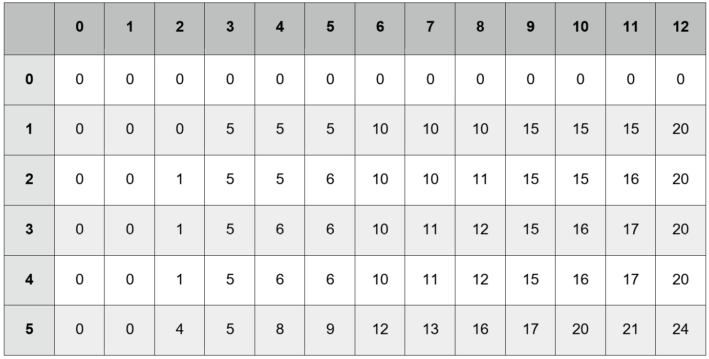

###### 图 9.6：由提议的算法构建的二维 DP 表

我们用来生成上表的逻辑是基于解决 0-1 背包问题的方法，因此，我们假设给定`weight`和`i`种物品的最大值之和，即`DP(i, weight)`，可以如下：

1.  相同重量和`i-1`种物品的最大值之和，不包括当前物品，即`DP(i-1, weight)`

1.  当前物品的`value`与`i-1`种物品的最大和的总和，即`DP(i-1, weight-w) + value`

1.  当前物品的`value`与`i`种物品的最大和的总和，如果要多次包括该物品，即`DP(i, weight-w) + value`

前两个条件对应于 0-1 背包问题的逻辑。然而，在无界背包的情况下考虑它们，并根据我们的算法生成的表进行检查，我们实际上可以得出前两个条件基本上是无关紧要的结论。

在原始问题中，我们关心`i-1`个物品的值，因为我们需要决定是否包括或排除物品`i`，但在这个问题中，只要它们的重量不超过背包的容量，我们就没有理由排除任何物品。换句话说，规定每个状态转换的条件仅由`weight`限制，因此可以用一维表示！

这导致必须进行重要的区分：*模拟*状态所需的维度不一定与*描述*状态所需的维度相同。到目前为止，我们研究的每个 DP 问题，在缓存时，结果都基本上等同于状态本身。然而，在无界背包问题中，我们可以描述每个状态如下：

“对于每个重量 w 和价值 v 的物品，容量为 C 的背包的最大价值等于 v 加上容量为 C-w 的背包的最大价值。”

考虑以下输入数据：

```cpp
Capacity —> 12
Values   —> { 5, 1, 6, 3, 4 }
Weight   —> { 3, 2, 4, 5, 2 }
```

在下表中，每一行代表一个重量`w`，从`0`到最大容量，每一列代表一个物品的索引`i`。每个单元格中的数字表示考虑了索引`i`的物品后每个重量的最大值之和：

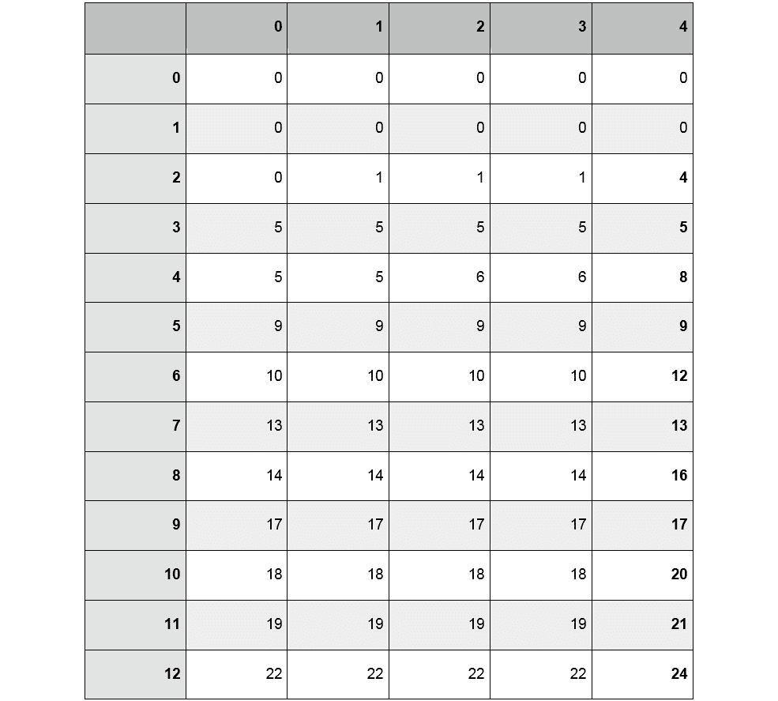

###### 图 9.7：每个重量-索引对的子问题结果

正如前表所示，允许重复意味着只要包含在最大容量内，就不需要排除任何物品。因此，无论重量总和是否可以在集合的索引*0*或索引*1,000*处找到都是无关紧要的，因为我们永远不会保留先前找到的子集总和，除非添加到它超出了背包的定义边界。这意味着维护物品索引的记录没有任何优势，这使我们能够在一维中缓存我们的子问题-任意数量的物品的组合重量。我们将在下一个练习中看到它的实现。

### 练习 42：无界背包

在这个练习中，我们将应用状态空间缩减的概念来将无界背包问题表示为一维的 DP 表。让我们开始：

1.  让我们使用与上一个练习中相同的标题和输入：

```cpp
#include <iostream>
#include <vector>
#include <algorithm>
using namespace std;
……
int main()
{
    int items, capacity;
    cin >> items >> capacity;
    vector<int> values(items), weight(items);
    for(auto &v : values) cin >> v;
    for(auto &w : weight) cin >> w;
    ……
}
```

1.  现在，我们将实现一个名为`UnboundedKnapsack()`的函数，它返回一个整数。它的参数将与输入相同：

```cpp
int UnboundedKnapsack(int items, int capacity, vector<int> values, vector<int> weight)
{
    ……
}
```

1.  我们的 DP 表将表示为一个整数向量，大小为`capacity + 1`，每个索引初始化为`0`：

```cpp
vector<int> DP(capacity + 1, 0);
```

1.  与 0-1 背包问题一样，我们的状态逻辑将包含在两个嵌套循环中；但是，在这个问题的变体中，我们将颠倒循环的嵌套，使得外部循环从`0`到`capacity`（包括），内部循环遍历项目索引：

```cpp
for(int w = 0; w <= capacity; w++)
{
    for(int i = 0; i < items; i++)
    {
        ……
    }
} 
```

1.  现在，我们必须决定如何缓存我们的状态。我们唯一关心的是容量不被选择物品的重量超过。由于我们的表只足够大，可以表示从`0`到`capacity`的重量值，我们只需要确保`w`和`weight[i]`之间的差值是非负的。因此，所有的赋值逻辑都可以包含在一个`if`语句中：

```cpp
for(int w = 0; w <= capacity; w++)
{
    for(int i = 0; i < items; i++)
    {
        if(weight[i] <= w)
        {
            DP[w] = max(DP[w], DP[w - weight[i]] + values[i]);
        }
    }
}
return DP[capacity];
```

1.  现在，让我们返回到`main()`，添加一个调用`UnboundedKnapsack()`，并输出结果：

```cpp
int main()
{
        ……
    int result = UnboundedKnapsack(items, capacity, values, weight);
    cout << "Maximum value of items that can be contained in the knapsack: " << result << endl;
    return 0;
}
```

1.  尝试使用以下输入运行您的程序：

```cpp
30 335
91 81 86 64 24 61 13 57 60 25 94 54 39 62 5 34 95 12 53 33 53 3 42 75 56 1 84 38 46 62 
40 13 4 17 16 35 5 33 35 16 25 29 6 28 12 37 26 27 32 27 7 24 5 28 39 15 38 37 15 40 
```

您的输出应该如下：

```cpp
Maximum value of items that can be contained in the knapsack: 7138
```

正如前面的实现所示，通常值得考虑在 DP 算法中缓存解决方案的更便宜的方法。看起来需要复杂状态表示的问题经过仔细检查后通常可以显著简化。

### 活动 22：最大化利润

您正在为一家大型连锁百货商店工作。像任何零售业务一样，您的公司以大量购买商品从批发分销商那里，然后以更高的价格出售以获得利润。您商店销售的某些类型的产品可以从多个不同的分销商那里购买，但产品的质量和价格可能有很大的差异，这自然会影响其相应的零售价值。一旦考虑到汇率和公众需求等因素，某些分销商的产品通常可以以比最终销售价格低得多的价格每单位购买。您的任务是设计一个系统，计算您可以在分配的预算中获得的最大利润。

您已经提供了一份类似产品的目录。列出的每个产品都有以下信息：

+   产品的批发价格

+   通过销售相同产品后的标记，可以获得的利润金额

+   分销商每单位销售的产品数量

鉴于分销商只会按照指定的确切数量出售产品，您的任务是确定通过购买列出的一些产品的子集可以获得的最大金额。为了确保商店提供多种选择，列出的每个物品只能购买一次。

由于您只有有限的仓库空间，并且不想过度库存某种类型的物品，因此您还受到可以购买的单个单位的最大数量的限制。因此，您的程序还应确保购买的产品的总数不超过此限制。

**例子**

假设目录中列出了五种产品，具有以下信息：

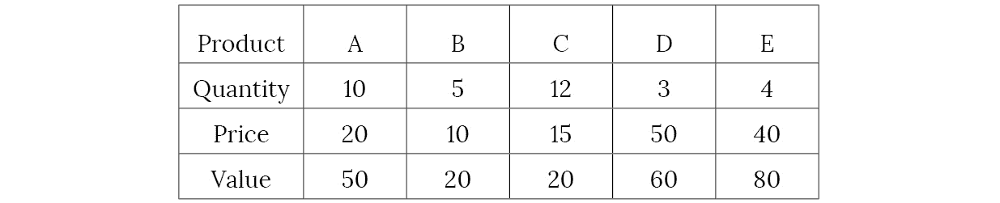

###### 图 9.8：利润优化的示例值

您有 100 美元的预算和 20 个单位的仓库容量。以下一组购买将是有效的：

```cpp
{ A B }    Cost: 30     | Quantity: 15    | Value: 70
{ A D }    Cost: 70     | Quantity: 13    | Value: 110
{ A E }    Cost: 60     | Quantity: 14    | Value: 130
{ B C }    Cost: 25     | Quantity: 17    | Value: 40
{ C D }    Cost: 65     | Quantity: 15    | Value: 80
{ C E }    Cost: 55     | Quantity: 16    | Value: 100
{ D E }    Cost: 90     | Quantity: 7     | Value: 140
{ A B D }  Cost: 80     | Quantity: 18    | Value: 130
{ A B E }  Cost: 70     | Quantity: 19    | Value: 150
{ B C D }  Cost: 75     | Quantity: 20    | Value: 100
{ B D E }  Cost: 100    | Quantity: 12    | Value: 160
```

因此，程序应该输出`160`。

**输入**

第一行包含三个整数，`N`作为分销商的数量，`budget`作为可以花费的最大金额，`capacity`作为可以购买的最大单位数的限制。

接下来的`N`行应包含三个以空格分隔的整数：

+   `quantity`：分销商提供的每单位数量

+   `cost`：物品的价格

+   `value`：销售产品后可以获得的利润金额

**输出**

表示从目录中选择一些子项可以获得的最大利润的单个整数。

**测试用例**

以下一组测试用例应该帮助您更好地理解这个问题：

图 9.9：活动 22 测试用例 1

](img/C14498_09_09.jpg)

###### 图 9.9：活动 22 测试用例 1

图 9.10：活动 22 测试用例 2

](img/C14498_09_10.jpg)

###### 图 9.10：活动 22 测试案例 2


###### 图 9.11：活动 22 测试案例 3

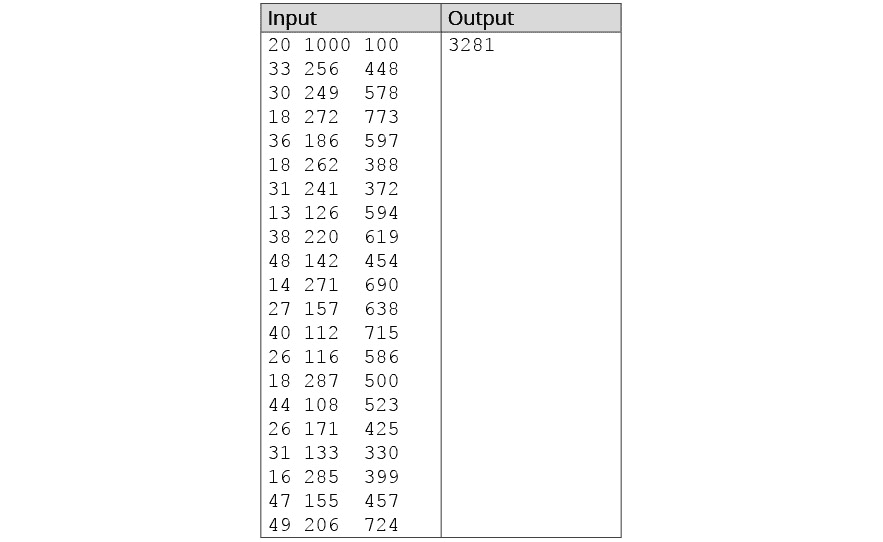

###### 图 9.12：活动 22 测试案例 4

**活动指南**

+   所需的实现与 0-1 背包问题非常相似。

+   由于存在两个约束（容量和预算），DP 表将需要三个维度。

#### 注意

此活动的解决方案可在第 581 页找到。

## 图和动态规划

在本节中，我们已经讨论了高级图算法和 DP 作为截然不同的主题，但通常情况下，它们可以根据我们试图解决的问题类型和图的性质同时使用。与图相关的几个常见问题被确定为*NP*完全问题（图着色和顶点覆盖问题，这只是两个例子），在适当的情况下，可以用动态规划来解决。然而，大多数这些主题都超出了本书的范围（实际上，它们值得专门撰写整本书来进行分析）。 

然而，图论中的一个问题非常适合 DP 方法，而且幸运的是，这是我们已经非常熟悉的问题：最短路径问题。实际上，在*第七章*，*图算法 II*中，我们实际上讨论了一个通常归类为 DP 范畴的算法，尽管我们从未将其标识为这样。

### 重新考虑贝尔曼-福特算法

在我们探讨贝尔曼-福特算法时，我们是根据之前讨论的迪杰斯特拉算法来看待它的，它确实与迪杰斯特拉算法有一些相似之处。但是现在我们对动态规划范式的概念有了牢固的理解，让我们根据新的理解重新考虑贝尔曼-福特算法。

简而言之，贝尔曼-福特使用的方法可以描述如下：

给定一个名为`start`的源节点，图的顶点数`V`和边`E`，执行以下操作：

1.  将每个节点从`0`到“V – 1”（包括）的距离标记为`UNKNOWN`，除了`start`为`0`。

1.  从`1`迭代到“V – 1”（包括）。

1.  在每次迭代中，考虑图中的每条边，并检查源节点的相应距离值是否为`UNKNOWN`。如果不是，则将相邻节点当前存储的距离与源节点的距离与它们之间的边权重的和进行比较。

1.  如果源节点的距离与边权重的和小于目标节点的距离，则将目标节点的距离更新为较小值。

1.  经过“V – 1”次迭代后，要么找到了最短路径，要么图中存在负权重循环，可以通过对边进行额外迭代来确定。

该算法的成功显然取决于问题具有最优子结构的事实。我们可以将这个概念背后的递归逻辑描述如下：

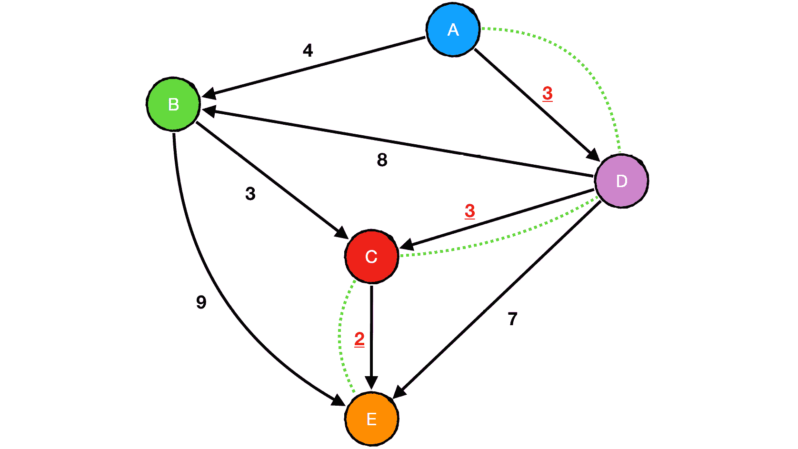

###### 图 9.13：可视化贝尔曼-福特算法

将此表示为伪代码将看起来类似于以下内容：

```cpp
Source —> A
Destination —> E
The shortest path from A to E is equal to:
    …the edge weight from A to B (4), plus…
        …the shortest path from B to E, which is:
            …the edge weight from B to C (3), plus:
                …the edge weight from C to E (2).
            …or the edge weight from B to E (9).
    …or the edge weight from A to D (3), plus:
        …the shortest path from D to E, which is:
            …the edge weight from D to B (8), plus:
                …the shortest path from B to E (9), which is:
                    …the edge weight from B to C (3), plus:
                        …the edge weight from C to E (2).
                    …or the edge weight from B to E (9).
            …the edge weight from D to C (3), plus:
                …the edge weight from C to E (2).
            …or the edge weight from D to E (7).
```

显然，最短路径问题也具有重叠子问题属性。贝尔曼-福特算法有效地避免了由于两个关键观察而导致的重复计算：

+   在图中任意两个节点之间进行非循环遍历的最大移动次数为“| V – 1 |”（即图中的每个节点减去起始节点）。

+   经过 N 次迭代后，源节点与每个可达节点之间的最短路径等于在“| N – 1 |”次迭代后可达的每个节点的最短路径，加上到它们各自邻居的边权重。

以下一组图表应该能帮助你更好地可视化贝尔曼-福特算法中的步骤：

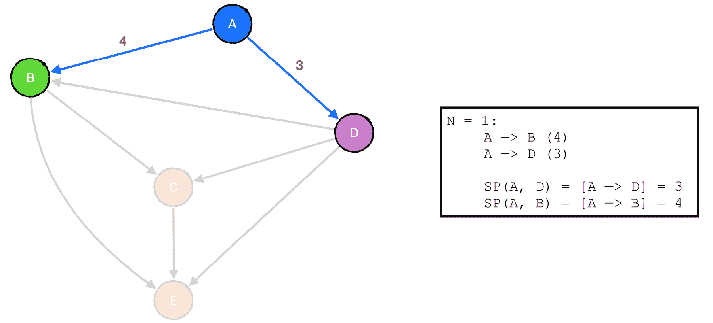

###### 图 9.14：贝尔曼-福特算法第 1 步

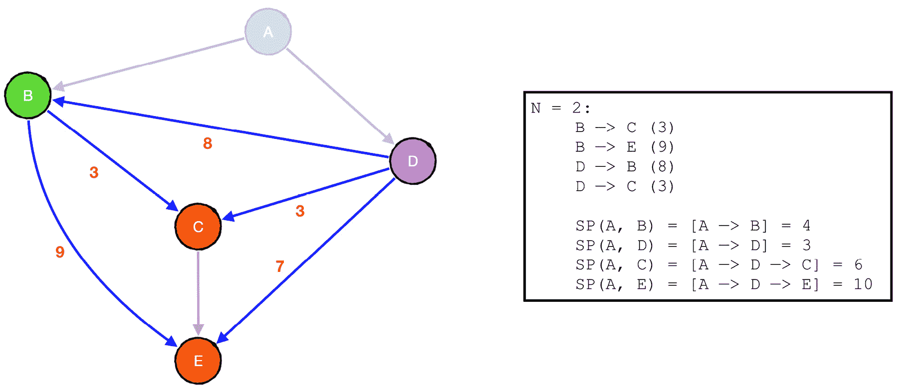

###### 图 9.15：贝尔曼-福特算法第 2 步

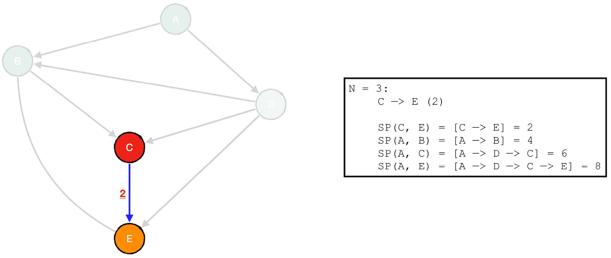

###### 图 9.16：贝尔曼-福特算法第 3 步

贝尔曼-福特算法被认为解决的具体问题被称为**单源最短路径问题**，因为它用于找到单个节点的最短路径。在*第七章*，*图算法 II*中，我们讨论了约翰逊算法，它解决了被称为**全对最短路径问题**的问题，因为它找到了图中每对顶点之间的最短路径。

约翰逊算法将贝尔曼-福特算法中看到的 DP 方法与狄克斯特拉算法中看到的贪婪方法相结合。在本节中，我们将探讨全对最短路径问题的完整 DP 实现。然而，让我们通过实现一个自顶向下的解决方案来更深入地考虑问题的性质。

### 将最短路径问题作为 DP 问题来解决

更好地理解贝尔曼-福特背后的逻辑的一种方法是将其转化为自顶向下的解决方案。为此，让我们从考虑我们的基本情况开始。

贝尔曼-福特算法通过图的边执行`V - 1`次迭代，通常通过`for`循环。由于我们先前的实现已经从`1`迭代到`V - 1`，让我们的自顶向下解决方案从`V - 1`开始，并递减到`0`。就我们的递归结构而言，让我们说每个状态可以描述如下：

```cpp
ShortestPath(node, depth)
node —> the node being considered
depth —> the current iteration in the traversal
```

因此，我们的第一个基本情况可以定义如下：

```cpp
if depth = 0:
        ShortestPath(node, depth) —> UNKNOWN
```

换句话说，如果`depth`已经减少到`0`，我们可以得出结论，没有路径存在，并终止我们的搜索。

我们需要处理的第二个基本情况当然是我们找到从源到目标的路径的情况。在这种情况下，搜索的深度是无关紧要的；从目标到自身的最短距离总是`0`：

```cpp
if node = target: 

        ShortestPath(node, depth) —> 0
```

现在，让我们定义我们的中间状态。让我们回顾一下贝尔曼-福特算法使用的迭代方法：

```cpp
for i = 1 to V - 1:
        for each edge in graph:
            edge —> u, v, weight 
            if distance(u) is not UNKNOWN and distance(u) + weight < distance(v):
                distance(v) = distance(u) + weight
```

就递归遍历而言，可以重新表述如下：

```cpp
for each edge adjacent to node:

        edge —> neighbor, weight
    if ShortestPath(neighbor, depth - 1) + weight < ShortestPath(node, depth):
            ShortestPath(node, depth) = ShortestPath(neighbor, depth - 1) + weight
```

由于每个状态可以根据这两个维度和可能存在循环的存在而唯一描述，并且可能会多次遇到相同的状态，我们可以得出结论，根据节点深度对缓存进行缓存既有效又有用于记忆化目的：

```cpp
Depth = 7:
    SP(0, 7): 0
    SP(1, 7): 6
    SP(2, 7): UNKNOWN
    SP(3, 7): 12
    SP(4, 7): UNKNOWN
    SP(5, 7): UNKNOWN
    SP(6, 7): 13
    SP(7, 7): UNKNOWN
Depth = 6:
    SP(0, 6): 0
    SP(1, 6): 6
    SP(2, 6): 14
    SP(3, 6): 12
    SP(4, 6): UNKNOWN
    SP(5, 6): UNKNOWN
    SP(6, 6): 12
    SP(7, 6): 15
Depth = 5:
    SP(0, 5): 0
    SP(1, 5): 6
    SP(2, 5): 14
```

这些状态在下图中说明：

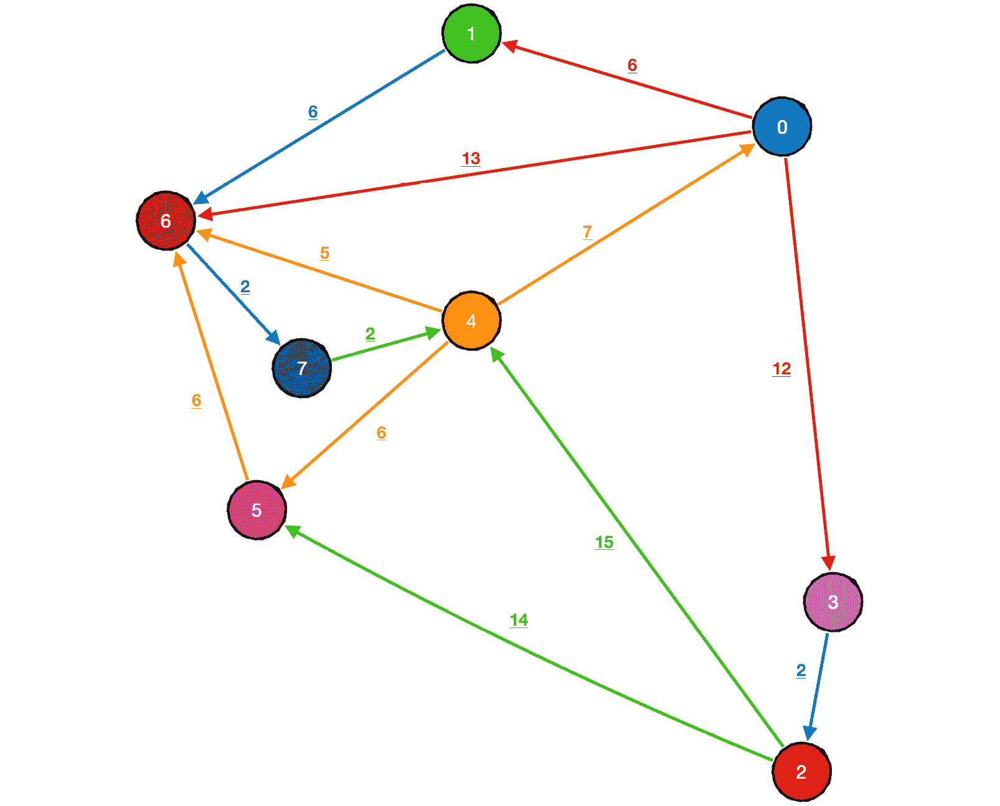

###### 图 9.17：最短路径问题的所有状态

我们将在下一个练习中看看这种方法的实现。

### 练习 43：单源最短路径（记忆化）

在这个练习中，我们将采用自顶向下的动态规划方法来解决单源最短路径问题。让我们开始吧：

1.  让我们从包括以下标头和`std`命名空间开始，并定义一个`UNKNOWN`常量：

```cpp
#include <iostream>
#include <vector>
#include <utility>
#include <map>
using namespace std;
const int UNKNOWN = 1e9;
```

1.  让我们还声明`V`和`E`（顶点数和边数），以及两个二维整数向量，`adj`（图的邻接表）和`weight`（边权重值的矩阵）。最后，我们将定义一个名为`memo`的记忆化表。这次，我们将使用`std::map`来简化区分检查缓存中的键是否存在与其值是否未知：

```cpp
int V, E;
vector<vector<int>> adj;
vector<vector<int>> weight;
map<pair<int, int>, int> memo;
```

1.  在`main()`函数中，我们应该处理输入，以便接收我们希望应用算法的图。输入的第一行将包含`V`和`E`，接下来的`E`行将包含三个整数：`u`、`v`和`w`（每条边的源、目的地和权重）：

```cpp
int main()
{
        int V, E;
        cin >> V >> E;
        weight.resize(V, vector<int>(V, UNKNOWN));
        adj.resize(V);
        for(int i = 0; i < E; i++)
        {
            int u, v, w;
            cin >> u >> v >> w;
            adj[u].push_back(v);
            weight[u][v] = w;
        }
        …
}
```

1.  我们现在将定义一个名为`SingleSourceShortestPaths()`的函数，它将接受一个参数——`source`，即源顶点的索引，并将返回一个整数向量：

```cpp
vector<int> SingleSourceShortestPaths(int source)
{
        ……
}
```

1.  现在，我们需要对我们的图进行一些初步的修改。与其从源节点遍历图中的所有其他节点，我们将从其他节点开始每次遍历，并计算从源到目标的最短路径。由于我们的图是有向的，我们将不得不使用其转置来实现这一点：

```cpp
// Clear table
vector<vector<int>> adj_t(V);
vector<vector<int>> weight_t(V, vector<int>(V, UNKNOWN));
for(int i = 0; i < V; i++)
{
        // Create transpose of graph
        for(auto j : adj[i])
        {
            adj_t[j].push_back(i);
            weight_t[j][i] = weight[i][j];
        }
        // Base case — shortest distance from source to itself is zero at any depth
        memo[{source, i}] = 0;
        if(i != source) 
        {
            // If any node other than the source has been reached 
            // after V - 1 iterations, no path exists.
            memo[{i, 0}] = UNKNOWN;
        }
}
```

在这里，我们定义了两个新的二维整数向量，`adj_t`和`weight_t`，它们将对应于转置图的邻接表和权重矩阵。然后，我们使用嵌套循环来创建我们的修改后的图，并初始化了我们`memo`表中的值。

1.  现在，我们应该定义`ShortestPath_Memoization()`函数，它有四个参数：两个整数，`depth`和`node`，以及`adj`和`weight`（在这种情况下，它们将是对转置图的引用）：

```cpp
    int ShortestPath_Memoization(int depth, int node, vector<vector<int>> &adj, vector<vector<int>> &weight)
{
        ……
    }
```

1.  我们的算法本质上是标准的深度优先搜索，除了我们将在每次函数调用结束时缓存每个`{节点，深度}`对的结果。在函数顶部，我们将检查缓存的结果，如果键存在于映射中，则返回它：

```cpp
// Check if key exists in map
if(memo.find({node, depth}) != memo.end())
{
    return memo[{node, depth}];
}
memo[{node, depth}] = UNKNOWN;
// Iterate through adjacent edges
for(auto next : adj[node])
{
    int w = weight[node][next];
    int dist = ShortestPath_Memoization(depth - 1, next, adj, weight) + w;
    memo[{node, depth}] = min(memo[{node, depth}], dist);
}
return memo[{node, depth}];
```

1.  回到`SingleSourceShortestPaths()`函数，我们将定义一个名为`distance`的整数向量，大小为`V`，并通过对`ShortestPath_Memoization()`的连续调用来填充它：

```cpp
vector<int> distance;

for(int i = 0; i < V; i++)
{
    distance[i] = ShortestPath_Memoization(V - 1, i, adj_t, weight_t);
}
return distance;
```

1.  回到`main()`，我们将定义一个名为`paths`的二维整数矩阵，它将存储从`0`到`V`的每个节点索引返回的`SingleSourceShortestPaths()`的距离：

```cpp
vector<vector<int>> paths(V);
for(int i = 0; i < V; i++)
{
    paths[i] = SingleSourceShortestPaths(i);
}
```

1.  现在，我们可以使用`paths`表来打印图中每对节点的距离值：

```cpp
cout << "The shortest distances between each pair of vertices are:" << endl;
for(int i = 0; i < V; i++)
{
        for(int j = 0; j < V; j++)
        {
          cout << "\t" << j << ": ";
          (paths[i][j] == UNKNOWN) ? cout << "- ";
                                   : cout << paths[i][j] << " ";
        }
        cout << endl;
}
```

1.  现在，使用以下输入运行您的代码：

```cpp
8 20
0 1 387
0 3 38
0 5 471
1 0 183
1 4 796
2 5 715
3 0 902
3 1 712
3 2 154
3 6 425
4 3 834
4 6 214
5 0 537
5 3 926
5 4 125
5 6 297
6 1 863
6 7 248
7 0 73
7 3 874
```

输出应该如下所示：

```cpp
The shortest distances between each pair of vertices are:
0: 0 387 192 38 596 471 463 711 
1: 183 0 375 221 779 654 646 894 
2: 1252 1639 0 1290 840 715 1012 1260 
3: 746 712 154 0 994 869 425 673 
4: 535 922 727 573 0 1006 214 462 
5: 537 924 729 575 125 0 297 545 
6: 321 708 513 359 917 792 0 248 
7: 73 460 265 111 669 544 536 0  
```

毫不奇怪，这并不是处理这个特定问题的首选方式，但是和之前的练习一样，我们可以通过实现像这样的递归解决方案来学习到很多关于最优子结构是如何形成的。有了这些见解，我们现在可以完全理解如何使用制表法同时找到每对节点之间的最短距离。

### 所有对最短路径

我们之前的程序确实打印了每对顶点的最短路径，但它的效率大致相当于执行`V`次贝尔曼-福特算法，同时还有与递归算法相关的内存缺点。

幸运的是，对于这个问题有一个非常有用的自底向上算法，它能够在*O(V**3**)*时间和*O(V**2**)*空间内处理其他算法所能处理的一切。特别是在实现了本书中其他最短路径算法之后，这种算法也是相当直观的。

### 弗洛伊德-沃舍尔算法

到目前为止，我们应该已经相当清楚地掌握了贝尔曼-福特算法如何利用最短路径问题中所表现出的最优子结构。关键是，两个图顶点之间的任何最短路径都将是从源开始的某些其他最短路径和连接路径终点到目标顶点的边的组合。

**弗洛伊德-沃舍尔算法**通过使用相同的概念取得了很大的效果：

*"如果节点 A 和节点 B 之间的最短距离是 AB，节点 B 和节点 C 之间的最短距离是 BC，那么节点 A 和节点 C 之间的最短距离是 AB + BC。"*

这个逻辑本身当然并不是突破性的；然而，结合贝尔曼-福特所展示的洞察力——图的边上的*V*次迭代足以确定从源节点到图中每个其他节点的最短路径——我们可以使用这个想法来逐步生成以`节点 A`为源的节点对之间的最短路径，然后使用这些结果来生成`节点 B`、`C`、`D`等的潜在最短路径。

Floyd-Warshall 通过在顶点之间执行*V**3*次迭代来实现这一点。第一维表示潜在的中点*B*，在每对顶点*A*和*C*之间。然后算法检查从*A*到*C*的当前已知距离值是否大于从*A*到*B*和从*B*到*C*的最短已知距离之和。如果是，它确定该和至少更接近*A*和*C*的最优最短距离值，并将其缓存到表中。Floyd-Warshall 使用图中的每个节点作为中点进行这些比较，不断提高其结果的准确性。在每个可能的起点和终点对被测试过每个可能的中点之后，表中的结果包含每对顶点的正确最短距离值。

与任何与图相关的算法一样，Floyd-Warshall 并不保证在每种情况下都是最佳选择，应始终考虑 Floyd-Warshall 和其他替代方案之间的比较复杂性。一个很好的经验法则是在稠密图（即包含大量边的图）中使用 Floyd-Warshall。例如，假设你有一个包含 100 个顶点和 500 条边的图。在每个起始顶点上连续运行 Bellman-Ford 算法（最坏情况下的复杂度为*O(V×E)*)可能导致总复杂度为 500×100×100（或 5,000,000）次操作，而 Floyd-Warshall 只需要 100×100×100（或 1,000,000）次操作。Dijkstra 算法通常比 Bellman-Ford 更有效，也可能是一个可行的替代方案。然而，Floyd-Warshall 的一个明显优势是算法的总体复杂度始终是*O(V**3**)*，不需要知道输入图的其他属性，就能确定 Floyd-Warshall 的效率（或低效性）。

最后要考虑的一点是，与 Bellman-Ford（不同于 Dijkstra 算法），Floyd-Warshall 能够处理具有负边权重的图，但也会受到负边权重循环的阻碍，除非有明确的处理。

我们将在以下练习中实现 Floyd-Warshall 算法。

### 练习 44：实现 Floyd-Warshall 算法

在这个练习中，我们将使用 Floyd-Warshall 算法找到每对顶点之间的最短距离。让我们开始吧：

1.  我们将首先包括以下标头并定义一个`UNKNOWN`常量：

```cpp
#include <iostream>
#include <vector>
using namespace std;
const int UNKNOWN = 1e9;
```

1.  让我们首先处理输入，几乎与我们在上一个练习中所做的完全相同。然而，这一次，我们不需要图的邻接表表示：

```cpp
int main()
{
        int V, E;
        cin >> V >> E;
        vector<vector<int>> weight(V, vector<int>(V, UNKNOWN));
        for(int i = 0; i < E; i++)
        {
            int u, v, w;
            cin >> u >> v >> w;
            weight[u][v] = w;
        }
        ……
        return 0;
}
```

1.  我们的`FloydWarshall()`函数将接受两个参数——`V`和`weight`——并返回一个二维整数向量，表示最短路径距离：

```cpp
vector<vector<int>> FloydWarshall(int V, vector<vector<int>> weight)
{
        ……
}
```

1.  让我们定义一个名为`distance`的二维 DP 表，并将每个值初始化为`UNKNOWN`。然后，我们需要为每对节点分配最初已知的最短距离“估计”（即`weight`矩阵中的值），以及基本情况值（即从每个节点到自身的最短距离`0`）：

```cpp
    vector<vector<int>> distance(V, vector<int>(V, UNKNOWN));
for(int i = 0; i < V; i++)
{
    for(int j = 0; j < V; j++)
    {
        distance[i][j] = weight[i][j];
    }
    distance[i][i] = 0;
}
```

1.  现在，我们将从`0`到`V – 1`（包括）执行三个嵌套的`for`循环，外部循环表示当前中间顶点`mid`，中间循环表示源顶点`start`，最内部循环表示目标顶点`end`。然后我们将比较每对顶点之间的距离值，并在找到更短的路径时重新分配从起点到终点的距离值：

```cpp
for(int mid = 0; mid < V; mid++)
{
    for(int start = 0; start < V; start++)
    {
        for(int end = 0; end < V; end++)
        {
            if(distance[start][mid] + distance[mid][end] < distance[start][end])
            {
                distance[start][end] = distance[start][mid] + distance[mid][end];
            }
        }
    }
}
```

1.  类似于 Bellman-Ford，如果我们的输入预计包含负边权重，我们需要检查负循环。值得庆幸的是，使用距离表可以很容易地实现这一点。

考虑到图中的循环是一条长度大于零的路径，起点和终点顶点相同。在表示每对节点之间的距离的表中，节点和自身之间的最短路径将包含在`distance[node][node]`中。在只包含正边权的图中，`distance[node][node]`中包含的值显然只能等于`0`；然而，如果图中包含负权重循环，`distance[node][node]`将为负。因此，我们可以这样测试负循环：

```cpp
for(int i = 0; i < V; i++)
{
        // If distance from a node to itself is negative, there must be a negative cycle
        if(distance[i][i] < 0)
        {
            return {};
        }
} 
return distance;
```

1.  现在我们已经完成了算法的编写，可以在`main()`中调用`FloydWarshall()`并输出结果：

```cpp
int main()
{
    ……
    vector<vector<int>> distance = FloydWarshall(V, weight);
    // Graphs with negative cycles will return an empty vector
    if(distance.empty())
    {
        cout << "NEGATIVE CYCLE FOUND" << endl;
        return 0;
    }
    for(int i = 0; i < V; i++)
    {
        cout << i << endl;
        for(int j = 0; j < V; j++)
        {
            cout << "\t" << j << ": ";

            (distance[i][j] == UNKNOWN) 
                ? cout << "_" << endl 
                : cout << distance[i][j] << endl;
        }
    }
    return 0;
}
```

1.  让我们在以下输入集上运行我们的程序：

```cpp
Input:
7 9
0 1 3
1 2 5
1 3 10
1 5 -4
2 4 2
3 2 -7
4 1 -3
5 6 -8
6 0 12
Output:
0:
        0: 0
        1: 3
        2: 6
        3: 13
        4: 8
        5: -1
        6: -9
1:
        0: 0
        1: 0
        2: 3
        3: 10
        4: 5
        5: -4
        6: -12
2:
        0: -1
        1: -1
        2: 0
        3: 9
        4: 2
        5: -5
        6: -13
3:
        0: -8
        1: -8
        2: -7
        3: 0
        4: -5
        5: -12
        6: -20
4:
        0: -3
        1: -3
        2: 0
        3: 7
        4: 0
        5: -7
        6: -15
5:
        0: 4
        1: 7
        2: 10
        3: 17
        4: 12
        5: 0
        6: -8
6:
        0: 12
        1: 15
        2: 18
        3: 25
        4: 20
        5: 11
        6: 0
```

1.  现在，让我们尝试另一组输入：

```cpp
Input:
6 8
0 1 3
1 3 -8
2 1 3
2 4 2
2 5 5
3 2 3
4 5 -1
5 1 8
Output:
NEGATIVE CYCLE FOUND
```

正如你所看到的，Floyd-Warshall 是一种非常有用的算法，不仅有效而且相当容易实现。在效率方面，我们应该选择 Floyd-Warshall 还是 Johnson 算法完全取决于图的结构。但严格从实现的角度来看，Floyd-Warshall 是明显的赢家。

### 活动 23：住宅道路

你是一个房地产开发项目的负责人，计划建造一些高端住宅社区。你已经收到了关于将要建造的各种属性的各种信息，目前的任务是尽可能便宜地设计一套道路系统。

许多社区计划建在湖泊、森林和山区。在这些地区，地形通常非常崎岖，这可能会使建筑变得更加复杂。你已经被警告，建筑成本会根据地形的崎岖程度而增加。在初稿中，你被告知要考虑成本的增加是与可以建造道路的每个坐标的崎岖值成正比的。

你已经收到了以下信息：

+   属性地图

+   可以建造属性的坐标

+   每个坐标的地形崎岖程度

你还收到了确定如何建造道路的以下准则：

+   地图上可以建造道路的位置将用“。”字符标记。

+   只能在两个房屋之间建造道路，这两个房屋之间有直接的垂直、水平或对角线路径。

+   社区中的所有房屋都应该可以从其他房屋到达。

+   道路不能建在水域、山区、森林等地方。

+   两个房屋之间建造道路的成本等于它们之间路径上的地形崎岖值之和。

+   只有在建造的道路是通往指定入口的最低成本路径上时，两个房屋之间才应该建造一条道路。

+   入口点始终是输入中索引最高的房屋。

确定了房屋和道路的位置后，应根据以下图例生成原始地图的新版本：

+   房屋应该用大写字母标记，对应于它们在输入中给出的顺序（即 0=`A`，1=`B`，2=`C`等）。

+   道路应该用字符`|`、`-`、`\`和`/`表示，取决于它们的方向。如果两条具有不同方向的道路相交，应该用`+`字符表示。

+   地图上的其他所有内容应该显示为输入中原始给出的样子。

**输入格式**

程序应按以下格式接受输入：

+   第一行包含两个以空格分隔的整数`H`和`W`，表示地图的高度和宽度。

+   第二行包含一个整数`N`，表示要建造的房屋数量。

+   接下来的`H`行每行包含一个长度为`W`的字符串，表示网格上的一行。可以建造道路的有效位置将用“。”字符标记。

+   接下来的`N`行包含两个整数`x`和`y`，它们是房屋的坐标。最后一个索引（即`N-1`）始终代表社区的入口点。

**输出格式**

程序应输出与输入中给出的相同地图，并添加以下内容：

+   每个房屋的位置应标有大写字母，对应它们的从零开始的索引，原点在左上角，相对于`N`（即 0 = `A`，1 = `B`，2 = `C`，依此类推）。

+   连接每对房屋的道路应如下所示：

`-` 如果道路的方向是水平的

`|` 如果道路的方向是垂直的

`/` 或 `\` 如果道路的方向是对角线的

`+` 如果任意数量的具有不同方向的道路在同一点相交

**提示/指导**

+   要得出最终结果，需要一些不同的步骤。建议您在实施之前概述必要的步骤。

+   为每个程序的各个部分设计一些调试和生成测试输出的方案可能非常有帮助。在过程的早期出现错误可能会导致后续步骤失败。

+   如果您在理解需要完成的任务方面有困难，请研究更简单的输入和输出示例。

+   首先实施您知道需要的算法，特别是我们在上一章讨论过的算法。完成此任务的每个部分可能有多种方法-要有创造力！

**测试案例**

这些测试案例应该帮助您了解如何继续。让我们从一个简单的例子开始：

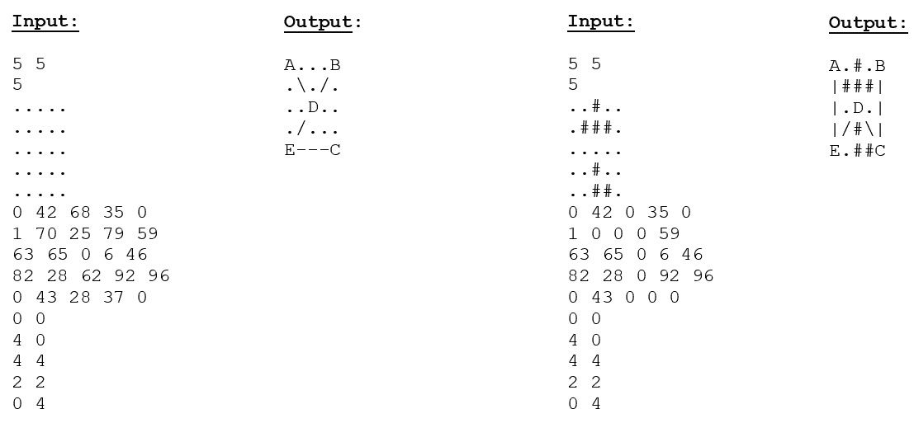

###### 图 9.18：活动 23，测试案例 1（左）和 2（右）

让我们考虑前一图中右侧的示例输出。在该示例中，从`E（0,4）`到`C（5,4）`的路径无法建立，因为存在不可通过的障碍物`#`。让我们考虑一些更复杂的示例： 

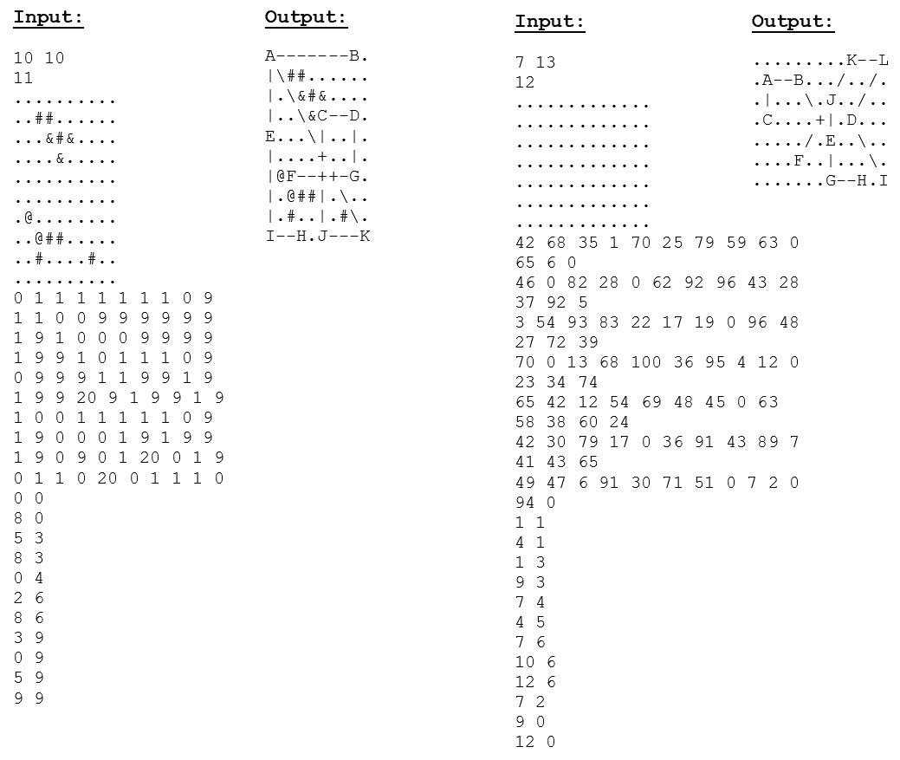

###### 图 9.19：活动 23，测试案例 3（左）和 4（右）

请注意，不同的符号用于表示不同类型的障碍物。尽管任何障碍物的影响都是相同的，但我们不能在那里建造道路。最后，让我们在以下示例中增加复杂性：

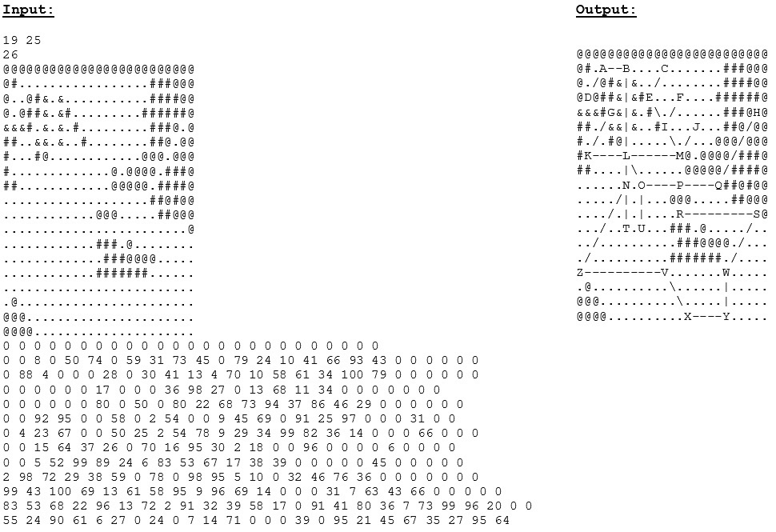

###### 图 9.20：活动 23，测试案例 5

#### 注意

此活动的解决方案可在第 585 页找到。

## 摘要

现在您已经完成了本章，您应该对动态规划的价值有相当高的欣赏。如果您最初发现这个主题有些焦虑，希望您已经意识到它并不像最初看起来那么复杂。像我们在本章中所做的那样，通过动态规划的视角来看待熟悉的问题，肯定可以帮助我们理解需要达到工作动态规划解决方案所需的核心思想。为此，我们鼓励您调查背包问题的其他变体，并尝试使用提供的策略来实现它们。

有了这一点，您在 C++中算法和数据结构的广阔世界中的旅程已经结束。到达本书的末尾，您应该对何时以及如何使用我们行业中最有用的工具有了明显加深的理解。希望您对本书中涵盖的结构和技术的实际应用有了更好的认识，以及对 C++语言及其丰富的功能集有了更广泛的了解。

值得注意的是，实践中使用许多这些技术的适当场合并不一定明显，这就是为什么将所学知识应用于各种不同的情境中是非常有益的。我们努力提供了一系列有趣的活动来练习本书中的概念，但强烈建议您也尝试在其他情况下使用这些技能。有大量在线资源提供独特而引人入胜的编程挑战，适合各个级别的开发人员，如果您希望训练自己认识到某些技术如何在各种情况下被利用，这些资源将是非常宝贵的。

当然，我们在本书中讨论的每个主题都值得进行比任何一本书所能涵盖的更深入的研究，我们希望我们提供的信息足够使这些主题变得易于访问，以鼓励您深入探索它们。无论您是学生，正在寻找发展工作，还是已经在专业领域工作，您可能会遇到本书涵盖的至少一个（很可能是许多）主题的用途；并且幸运的话，当那个时机来临时，您将会知道该怎么做！
