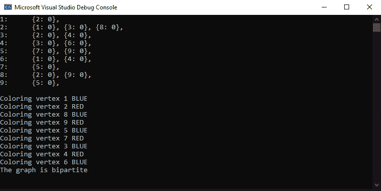
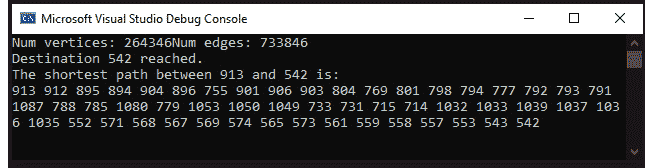
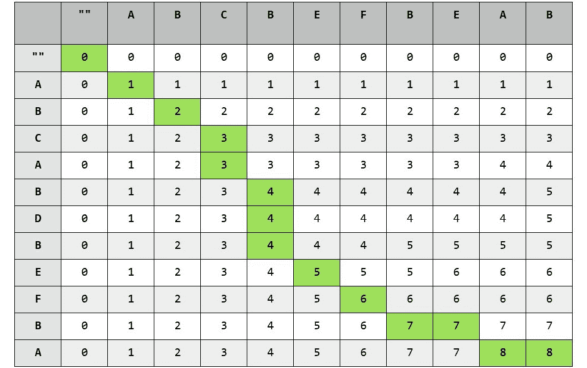

# 附录

## 关于

本节包括帮助学生完成书中活动的内容。它包括学生需要执行的详细步骤，以实现活动的目标。

## 第一章：列表、栈和队列

### 活动 1：实现歌曲播放列表

在这个活动中，我们将实现一个稍加改进的双向链表的版本，它可以用来存储歌曲播放列表，并支持必要的功能。按照以下步骤完成这个活动：

1.  让我们首先包括头文件，并编写具有所需数据成员的节点结构：

```cpp
    #include <iostream>
    template <typename T>
    struct cir_list_node
    {
        T* data;
        cir_list_node *next, *prev;

    ~cir_list_node()
        {
            delete data;
        }
    };
    template <typename T>
    struct cir_list
    {
        public:
            using node = cir_list_node<T>;
            using node_ptr = node*;
        private:
            node_ptr head;
            size_t n;
    ```

1.  现在，让我们编写一个基本的构造函数和 size 函数：

```cpp
    public:
    cir_list(): n(0)
    {
        head = new node{NULL, NULL, NULL};  // Dummy node – having NULL data
        head->next = head;
        head->prev = head;
    }
    size_t size() const
    {
        return n;
    }
    ```

稍后，在使用迭代器进行迭代时，我们将讨论为什么需要在第一个节点和最后一个节点之间有一个虚拟节点。

1.  现在，让我们编写`insert`和`erase`函数。两者都将接受一个要插入或删除的值：

```cpp
    void insert(const T& value)
    {
        node_ptr newNode = new node{new T(value), NULL, NULL};
        n++;
    auto dummy = head->prev;
    dummy->next = newNode;
    newNode->prev = dummy;
        if(head == dummy)
        {
            dummy->prev = newNode;
            newNode->next = dummy;
            head = newNode;
            return;
        }
        newNode->next = head;
        head->prev = newNode;
        head = newNode;
    }
    void erase(const T& value)
    {
        auto cur = head, dummy = head->prev;
        while(cur != dummy)
        {
            if(*(cur->data) == value)
            {
                cur->prev->next = cur->next;
                cur->next->prev = cur->prev;
                if(cur == head)
                    head = head->next;
                delete cur;
                n--;
                return;
            }
            cur = cur->next;
        }
    }
    ```

1.  现在，让我们为所需的迭代器编写一个基本结构，并添加成员来访问实际数据：

```cpp
    struct cir_list_it
    {
    private:
        node_ptr ptr;
    public:
        cir_list_it(node_ptr p) : ptr(p)
        {}

        T& operator*()
        {
            return *(ptr->data);
        }
        node_ptr get()
        {
            return ptr;
        }
    ```

1.  现在，让我们实现迭代器的核心函数——前增量和后增量：

```cpp
    cir_list_it& operator++()
    {
        ptr = ptr->next;
        return *this;
    }
    cir_list_it operator++(int)
    {
        cir_list_it it = *this;
        ++(*this);
        return it;    
    }
    ```

1.  让我们添加与递减相关的操作，使其双向：

```cpp
    cir_list_it& operator--()
    {
        ptr = ptr->prev;
        return *this;
    }
    cir_list_it operator--(int)
    {
        cir_list_it it = *this;
        --(*this);
        return it;
    }
    ```

1.  让我们为迭代器实现与相等相关的运算符，这对于基于范围的循环是必不可少的：

```cpp
    friend bool operator==(const cir_list_it& it1, const cir_list_it& it2)
    {
        return it1.ptr == it2.ptr;
    }
    friend bool operator!=(const cir_list_it& it1, const cir_list_it& it2)
    {
        return it1.ptr != it2.ptr;
    }
    };
    ```

1.  现在，让我们编写`begin`和`end`函数，以及它们的`const`版本：

```cpp
    cir_list_it begin()
    {
        return cir_list_it{head};
    }
    cir_list_it begin() const
    {
        return cir_list_it{head};
    }
    cir_list_it end()
    {
        return cir_list_it{head->prev};
    }
    cir_list_it end() const
    {
        return cir_list_it{head->prev};
    }
    ```

1.  让我们编写一个复制构造函数、初始化列表构造函数和析构函数：

```cpp
    cir_list(const cir_list<T>& other): cir_list()
    {
    // Although, the following will insert the elements in a reverse order, it won't matter in a logical sense since this is a circular list.
        for(const auto& i: other)
            insert(i);
    }
    cir_list(const std::initializer_list<T>& il): head(NULL), n(0)
    {

    // Although, the following will insert the elements in a reverse order, it won't matter in a logical sense since this is a circular list.
        for(const auto& i: il)
            insert(i);
    }
    ~cir_list()
    {
        while(size())
        {
            erase(head->data);
        }
    }
    };
    ```

1.  现在，让我们为音乐播放器的播放列表添加一个类，用于我们实际的应用程序。我们将直接存储表示歌曲 ID 的整数，而不是存储歌曲：

```cpp
    struct playlist
    {
        cir_list<int> list;
    ```

1.  现在，让我们实现添加和删除歌曲的函数：

```cpp
    void insert(int song)
    {
        list.insert(song);
    }
    void erase(int song)
    {
        list.erase(song);
    }
    ```

1.  现在，让我们实现打印所有歌曲的函数：

```cpp
    void loopOnce()
    {
        for(auto& song: list)
            std::cout << song << " ";
        std::cout << std::endl;
    }
    };
    ```

1.  让我们编写一个`main`函数来使用我们音乐播放器的播放列表：

```cpp
    int main()
    {
        playlist pl;
        pl.insert(1);
        pl.insert(2);
        std::cout << "Playlist: ";
        pl.loopOnce();
        playlist pl2 = pl;
        pl2.erase(2);
        pl2.insert(3);
        std::cout << "Second playlist: ";
        pl2.loopOnce();
    }
    ```

1.  执行此操作后，您应该得到如下输出：

```cpp
    Playlist: 2 1 
    Second playlist: 3 1
    ```

### 活动 2：模拟一场纸牌游戏

在这个活动中，我们将模拟一场纸牌游戏，并实现一个高效的数据结构来存储每个玩家的卡牌信息。按照以下步骤完成这个活动：

1.  首先，让我们包括必要的头文件：

```cpp
    #include <iostream>
    #include <vector>
    #include <array>
    #include <sstream>
    #include <algorithm>
    #include <random>
    #include <chrono>
    ```

1.  现在，让我们创建一个类来存储卡牌，并编写一个实用方法来正确打印它们：

```cpp
    struct card
    {
        int number;
        enum suit
        {
            HEART,
            SPADE,
            CLUB,
            DIAMOND
        } suit;
        std::string to_string() const
        {
            std::ostringstream os;
            if(number > 0 && number <= 10)
                os << number;
            else
    {
    switch(number)
    {
    case 1:
        os << "Ace";
        break;
        case 11:
            os << "Jack";
            break;
        case 12:
            os << "Queen";
            break;
        case 13:
            os << "King";
            break;
        default:
            return "Invalid card";
    }
            }
            os << " of ";
            switch(suit)
            {
                case HEART:
                    os << "hearts";
                    break;
                case SPADE:
                    os << "spades";
                    break;
                case CLUB:
                    os << "clubs";
                    break;
                case DIAMOND:
                    os << "diamonds";
                    break;            
            }
            return os.str();
        }
    };
    ```

1.  现在，我们可以创建一副牌，并洗牌以将牌随机分发给四名玩家。我们将在一个`game`类中编写这个逻辑，并在`main`函数中稍后调用这些函数：

```cpp
    struct game
    {
        std::array<card, 52> deck;
        std::vector<card> player1, player2, player3, player4;
        void buildDeck()
        {
            for(int i = 0; i < 13; i++)
                deck[i] = card{i + 1, card::HEART};
            for(int i = 0; i < 13; i++)
                deck[i + 13] = card{i + 1, card::SPADE};
            for(int i = 0; i < 13; i++)
                deck[i + 26] = card{i + 1, card::CLUB};
            for(int i = 0; i < 13; i++)
                deck[i + 39] = card{i + 1, card::DIAMOND};
        }
        void dealCards()
        {
            unsigned seed = std::chrono::system_clock::now().time_since_epoch().count();
            std::shuffle(deck.begin(), deck.end(), std::default_random_engine(seed));
            player1 = {deck.begin(), deck.begin() + 13};
    player2 = {deck.begin() + 13, deck.begin() + 26};
    player3 = {deck.begin() + 26, deck.begin() + 39};
    player4 = {deck.begin() + 39, deck.end()};
        }
    ```

1.  让我们编写核心逻辑来进行一轮游戏。为了避免重复代码，我们将编写一个实用函数，用于比较两个玩家的手牌，并在需要时移除两张卡：

```cpp
    bool compareAndRemove(std::vector<card>& p1, std::vector<card>& p2)
    {
        if(p1.back().number == p2.back().number)
        {
            p1.pop_back();
            p2.pop_back();
            return true;
        }
        return false;
    }
    void playOneRound()
    {
            if(compareAndRemove(player1, player2))
            {
                compareAndRemove(player3, player4);
                return;
            }
            else if(compareAndRemove(player1, player3))
            {
                compareAndRemove(player2, player4);
                return;
            }
            else if(compareAndRemove(player1, player4))
            {
                compareAndRemove(player2, player3);
                return;
            }
            else if(compareAndRemove(player2, player3))
            {
                return;
            }
            else if(compareAndRemove(player2, player4))
            {
                return;
            }
            else if(compareAndRemove(player3, player4))
            {
    return;
            }
            unsigned seed = std::chrono::system_clock::now().time_since_epoch().count();
            std::shuffle(player1.begin(), player1.end(), std::default_random_engine(seed));
            std::shuffle(player2.begin(), player2.end(), std::default_random_engine(seed));
            std::shuffle(player3.begin(), player3.end(), std::default_random_engine(seed));
            std::shuffle(player4.begin(), player4.end(), std::default_random_engine(seed));
    }
    ```

1.  现在，让我们编写主要逻辑来找出谁是赢家。我们将在循环中调用前面的函数，直到其中一个玩家能够摆脱所有的卡牌。为了使代码更易读，我们将编写另一个实用函数来检查游戏是否已经完成：

```cpp
    bool isGameComplete() const
    {
        return player1.empty() || player2.empty() || player3.empty() || player4.empty();
    }
    void playGame()
    {
            while(not isGameComplete())
            {
                playOneRound();    
            }
    }
    ```

1.  为了找出谁是赢家，让我们在开始`main`函数之前编写一个实用函数：

```cpp
    int getWinner() const
    {
        if(player1.empty())
            return 1;
        if(player2.empty())
            return 2;
        if(player3.empty())
            return 3;
        if(player4.empty())
            return 4;
    }
    };
    ```

1.  最后，让我们编写`main`函数来执行游戏：

```cpp
    int main()
    {
        game newGame;
        newGame.buildDeck();
        newGame.dealCards();
        newGame.playGame();
        auto winner = newGame.getWinner();
        std::cout << "Player " << winner << " won the game." << std::endl;
    }
    ```

1.  可能的输出之一如下：

```cpp
    Player 4 won the game.
    ```

#### 注意

赢家可能是 1 到 4 号玩家中的任何一个。由于游戏是基于执行期间的时间种子随机性的，任何玩家都有可能获胜。多次运行代码可能会产生不同的输出。

### 活动 3：模拟办公室共享打印机的队列

在这个活动中，我们将实现一个队列，用于处理办公室中共享打印机的打印请求。按照以下步骤完成这个活动：

1.  让我们包括所需的头文件：

```cpp
    #include <iostream>
    #include <queue>
    ```

1.  让我们实现一个`Job`类：

```cpp
    class Job
    {
        int id;
        std::string user;
        int time;
        static int count;
    public:
        Job(const std::string& u, int t) : user(u), time(t), id(++count)
        {}
        friend std::ostream& operator<<(std::ostream& os, const Job& j)
         {
        os << "id: " << id << ", user: " << user << ", time: " << time << " seconds" << std::endl;    return os;
         }
    };
    int Job::count = 0;
    ```

1.  现在，让我们实现`Printer`类。我们将使用`std::queue`来实现先到先服务的`jobs`策略。我们将基于内存中可以存储的最大作业数来模板化类：

```cpp
    template <size_t N>
    class Printer
    {
        std::queue<Job> jobs;
    public:
        bool addNewJob(const Job& job)
        {
            if(jobs.size() == N)
                return false;
            std::cout << "Added job in the queue: " << job;
            jobs.push(job);
            return true;
        }
    ```

1.  现在，让我们实现另一个重要功能——打印作业：

```cpp
        void startPrinting()
        {
            while(not jobs.empty())
            {
                std::cout << "Processing job: " << jobs.front();
                jobs.pop();
            }
        }
    };
    ```

1.  现在，让我们使用这些类来模拟这种情景：

```cpp
    int main()
    {
        Printer<5> printer;
        Job j1("John", 10);
        Job j2("Jerry", 4);
        Job j3("Jimmy", 5);
        Job j4("George", 7);
        Job j5("Bill", 8);
        Job j6("Kenny", 10);
        printer.addNewJob(j1);
        printer.addNewJob(j2);
        printer.addNewJob(j3);
        printer.addNewJob(j4);
        printer.addNewJob(j5);
        if(not printer.addNewJob(j6))  // Can't add as queue is full.
        {
            std::cout << "Couldn't add 6th job" << std::endl;
        }
        printer.startPrinting();

        printer.addNewJob(j6);  // Can add now, as queue got emptied
        printer.startPrinting();
    }
    ```

1.  以下是前述代码的输出：

```cpp
    Added job in the queue: id: 1, user: John, time: 10 seconds
    Added job in the queue: id: 2, user: Jerry, time: 4 seconds
    Added job in the queue: id: 3, user: Jimmy, time: 5 seconds
    Added job in the queue: id: 4, user: George, time: 7 seconds
    Added job in the queue: id: 5, user: Bill, time: 8 seconds
    Couldn't add 6th job
    Processing job: id: 1, user: John, time: 10 seconds
    Processing job: id: 2, user: Jerry, time: 4 seconds
    Processing job: id: 3, user: Jimmy, time: 5 seconds
    Processing job: id: 4, user: George, time: 7 seconds
    Processing job: id: 5, user: Bill, time: 8 seconds
    Added job in the queue: id: 6, user: Kenny, time: 10 seconds
    Processing job: id: 6, user: Kenny, time: 10 seconds
    ```

## 第二章：树、堆和图

### 活动 4：为文件系统创建数据结构

在这个活动中，我们将使用 N 叉树创建一个文件系统的数据结构。按照以下步骤完成这个活动：

1.  首先，让我们包括所需的头文件：

```cpp
    #include <iostream>
    #include <vector>
    #include <algorithm>
    ```

1.  现在，让我们编写一个节点来存储目录/文件的数据：

```cpp
    struct n_ary_node
    {
        std::string name;
        bool is_dir;
        std::vector<n_ary_node*> children;
    };
    ```

1.  现在，让我们将这个节点包装在一个树结构中，以获得良好的接口，并添加一个静态成员，以便我们可以存储当前目录：

```cpp
    struct file_system
    {
        using node = n_ary_node;
        using node_ptr = node*;
    private:
        node_ptr root;
        node_ptr cwd;
    ```

1.  现在，让我们添加一个构造函数，以便我们可以创建一个带有根目录的树：

```cpp
    public:
        file_system()
        {
            root = new node{"/", true, {}};
            cwd = root;  // We'll keep the current directory as root in the beginning
        }
    ```

1.  现在，让我们添加一个函数来查找目录/文件：

```cpp
    node_ptr find(const std::string& path)
    {
        if(path[0] == '/')  // Absolute path
        {
            return find_impl(root, path.substr(1));
        }
        else
        {
            return find_impl(cwd, path);
        }
    }
    private:
    node_ptr find_impl(node_ptr directory, const std::string& path)
    {
        if(path.empty())
            return directory;
        auto sep = path.find('/');
        std::string current_path = sep == std::string::npos ? path : path.substr(0, sep);
        std::string rest_path = sep == std::string::npos ? "" : path.substr(sep + 1);
        auto found = std::find_if(directory->children.begin(), directory->children.end(), &
    {
        return child->name == current_path;
    });
            if(found != directory->children.end())
            {
                return find_impl(*found, rest_path);
            }
        return NULL;
    }
    ```

1.  现在，让我们添加一个函数来添加一个目录：

```cpp
    public:
    bool add(const std::string& path, bool is_dir)
    {
        if(path[0] == '/')
        {
            return add_impl(root, path.substr(1), is_dir);
        }
        else
        {
            return add_impl(cwd, path, is_dir);
        }
    }
    private:
    bool add_impl(node_ptr directory, const std::string& path, bool is_dir)
    {
        if(not directory->is_dir)
        {
            std::cout << directory->name << " is a file." << std::endl;
            return false;
        }

    auto sep = path.find('/');
    // This is the last part of the path for adding directory. It's a base condition of the recursion
        if(sep == std::string::npos)
        {
            auto found = std::find_if(directory->children.begin(), directory->children.end(), &
    {
        return child->name == path;
    });
    if(found != directory->children.end())
    {
        std::cout << "There's already a file/directory named " << path << " inside " << directory->name << "." << std::endl;
        return false;
    }
    directory->children.push_back(new node{path, is_dir, {}});
    return true;
        }

        // If the next segment of the path is still a directory
        std::string next_dir = path.substr(0, sep);
        auto found = std::find_if(directory->children.begin(), directory->children.end(), &
    {
        return child->name == next_dir && child->is_dir;
    });
            if(found != directory->children.end())
            {
                return add_impl(*found, path.substr(sep + 1), is_dir);
            }

    std::cout << "There's no directory named " << next_dir << " inside " << directory->name << "." << std::endl;
        return false;
    }
    ```

1.  现在，让我们添加一个函数来更改当前目录。这将非常简单，因为我们已经有一个函数来查找路径：

```cpp
    public:
    bool change_dir(const std::string& path)
    {
        auto found = find(path);
        if(found && found->is_dir)
        {
            cwd = found;
            std::cout << "Current working directory changed to " << cwd->name << "." << std::endl;
            return true;
        }
        std::cout << "Path not found." << std::endl;
        return false;
    }
    ```

1.  现在，让我们添加一个函数来打印目录或文件。对于文件，我们只会打印文件的名称。对于目录，我们将打印所有子目录的名称，就像 Linux 中的`ls`命令一样：

```cpp
    public:
    void show_path(const std::string& path)
    {
        auto found = find(path);
        if(not found)
        {
            std::cout << "No such path: " << path << "." << std::endl;
            return;
        }
        if(found->is_dir)
        {
            for(auto child: found->children)
            {
    std::cout << (child->is_dir ? "d " : "- ") << child->name << std::endl;}
        }
        else
        {
            std::cout << "- " << found->name << std::endl;
        }
    }
    };
    ```

1.  让我们编写一个主函数，以便我们可以使用上述函数：

```cpp
    int main()
    {
        file_system fs;
        fs.add("usr", true);  // Add directory usr in "/"
        fs.add("etc", true);  // Add directory etc in "/"
        fs.add("var", true);  // Add directory var in "/"
        fs.add("tmp_file", false);  // Add file tmp_file in "/"
        std::cout << "Files/Directories under \"/\"" << std::endl;
        fs.show_path("/");  // List files/directories in "/"
        std::cout << std::endl;
        fs.change_dir("usr");
        fs.add("Packt", true);
        fs.add("Packt/Downloads", true);
        fs.add("Packt/Downloads/newFile.cpp", false);
        std::cout << "Let's see the contents of dir usr: " << std::endl;
        fs.show_path("usr");  // This will not print the path successfully, since we're already inside the dir usr. And there's no directory named usr inside it.
        std::cout << "Let's see the contents of \"/usr\"" << std::endl;
        fs.show_path("/usr");
        std::cout << "Let's see the contents of \"/usr/Packt/Downloads\"" << std::endl;
        fs.show_path("/usr/Packt/Downloads");

    }
    ```

前面代码的输出如下：

```cpp
    Files/Directories under "/"
    d usr
    d etc
    d var
    - tmp_file
    Current working directory changed to usr.
    Let's try to print the contents of usr: 
    No such path: usr.
    Let's see the contents of "/usr"
    d Packt
    Contents of "/usr/Packt/Downloads"
    - newFile.cpp
    ```

### 活动 5：使用堆进行 K 路合并

在这个活动中，我们将把多个排序的数组合并成一个排序的数组。以下步骤将帮助您完成这个活动：

1.  从所需的头文件开始：

```cpp
    #include <iostream>
    #include <algorithm>
    #include <vector>
    ```

1.  现在，实现合并的主要算法。它将以一个 int 向量的向量作为输入，并包含所有排序向量的向量。然后，它将返回合并的 int 向量。首先，让我们构建堆节点：

```cpp
    struct node
    {
        int data;
        int listPosition;
        int dataPosition;
    };
    std::vector<int> merge(const std::vector<std::vector<int>>& input)
    {
        auto comparator = [] (const node& left, const node& right)
            {
                if(left.data == right.data)
                    return left.listPosition > right.listPosition;
                return left.data > right.data;
            };
    ```

正如我们所看到的，堆节点将包含三个东西——数据、输入列表中的位置和该列表中数据项的位置。

1.  让我们构建堆。想法是创建一个最小堆，其中包含所有列表中的最小元素。因此，当我们从堆中弹出时，我们保证得到最小的元素。删除该元素后，如果可用，我们需要插入相同列表中的下一个元素：

```cpp
    std::vector<node> heap;
    for(int i = 0; i < input.size(); i++)
    {
        heap.push_back({input[i][0], i, 0});
        std::push_heap(heap.begin(), heap.end(), comparator);
    }
    ```

1.  现在，我们将构建结果向量。我们将简单地从堆中删除元素，直到它为空，并用相同列表中的下一个元素（如果可用）替换它：

```cpp
    std::vector<int> result;
    while(!heap.empty())
    {
        std::pop_heap(heap.begin(), heap.end(), comparator);
        auto min = heap.back();
        heap.pop_back();
        result.push_back(min.data);
        int nextIndex = min.dataPosition + 1;
        if(nextIndex < input[min.listPosition].size())
        {
            heap.push_back({input[min.listPosition][nextIndex], min.listPosition, nextIndex});
            std::push_heap(heap.begin(), heap.end(), comparator);
        }
    }
    return result;
    }
    ```

1.  让我们编写一个`main`函数，以便我们可以使用前面的函数：

```cpp
    int main()
    {
        std::vector<int> v1 = {1, 3, 8, 15, 105};
        std::vector<int> v2 = {2, 3, 10, 11, 16, 20, 25};
        std::vector<int> v3 = {-2, 100, 1000};
        std::vector<int> v4 = {-1, 0, 14, 18};
        auto result = merge({v1, v2, v3, v4});
        for(auto i: result)
        std::cout << i << ' ';
        return 0;
    }
    ```

您应该看到以下输出：

```cpp
    -2 -1 0 1 2 3 3 8 10 11 14 15 16 18 20 25 100 105 1000 
    ```

## 第三章：哈希表和布隆过滤器

### 活动 6：将长 URL 映射到短 URL

在这个活动中，我们将创建一个程序，将较短的 URL 映射到相应的较长 URL。按照以下步骤完成这个活动：

1.  让我们包括所需的头文件：

```cpp
    #include <iostream>
    #include <unordered_map>
    ```

1.  让我们编写一个名为`URLService`的结构，它将提供所需服务的接口：

```cpp
    struct URLService
    {
        using ActualURL = std::string;
        using TinyURL = std::string;
    private:
        std::unordered_map<TinyURL, ActualURL> data;
    ```

正如我们所看到的，我们已经创建了一个从小 URL 到原始 URL 的映射。这是因为我们使用小 URL 进行查找。我们希望将其转换为原始 URL。正如我们之前看到的，映射可以根据键进行快速查找。因此，我们将较小的 URL 保留为映射的键，将原始 URL 保留为映射的值。我们已经创建了别名，以避免混淆，不清楚我们在谈论哪个字符串。

1.  让我们添加一个“查找”函数：

```cpp
    public:
        std::pair<bool, ActualURL> lookup(const TinyURL& url) const
        {
            auto it = data.find(url);
            if(it == data.end())  // If small URL is not registered.
            {
                return std::make_pair(false, std::string());
            }
            else
            {
                return std::make_pair(true, it->second);
            }
        }
    ```

1.  现在，让我们编写一个函数，为给定的实际 URL 注册较小的 URL：

```cpp
    bool registerURL(const ActualURL& actualURL, const TinyURL& tinyURL)
    {
        auto found = lookup(tinyURL).first;
        if(found)
        {
            return false;
        }
        data[tinyURL] = actualURL;
        return true;
    }
    ```

`registerURL`函数返回数据中是否已经存在条目。如果是，它将不会触及该条目。否则，它将注册该条目并返回`true`以指示注册成功。

1.  现在，让我们编写一个删除条目的函数：

```cpp
    bool deregisterURL(const TinyURL& tinyURL)
    {
        auto found = lookup(tinyURL).first;
        if(found)
        {
            data.erase(tinyURL);
            return true;
        }
        return false;
    }
    ```

正如我们所看到的，我们使用了“查找”函数，而不是重新编写查找逻辑。现在这个函数更易读了。

1.  现在，让我们编写一个函数来打印所有映射以进行日志记录：

```cpp
    void printURLs() const
    {
        for(const auto& entry: data)
        {
            std::cout << entry.first << " -> " << entry.second << std::endl;
        }
        std::cout << std::endl;
    }
    };
    ```

1.  现在，编写`main`函数，以便我们可以使用这个服务：

```cpp
    int main()
    {
        URLService service;
        if(service.registerURL("https://www.packtpub.com/eu/big-data-and-business-intelligence/machine-learning-r-third-edition", "https://ml-r-v3"))
        {
            std::cout << "Registered https://ml-r-v3" << std::endl;
        }
        else
        {
            std::cout << "Couldn't register https://ml-r-v3" << std::endl;
        }
        if(service.registerURL("https://www.packtpub.com/eu/virtualization-and-cloud/hands-aws-penetration-testing-kali-linux", "https://aws-test-kali"))
        {
            std::cout << "Registered https://aws-test-kali" << std::endl;
        }
        else
        {
            std::cout << "Couldn't register https://aws-test-kali" << std::endl;
        }
        if(service.registerURL("https://www.packtpub.com/eu/application-development/hands-qt-python-developers", "https://qt-python"))
        {
            std::cout << "Registered https://qt-python" << std::endl;
        }
        else
        {
            std::cout << "Couldn't register https://qt-python" << std::endl;
        }

        auto findMLBook = service.lookup("https://ml-r-v3");
        if(findMLBook.first)
        {
            std::cout << "Actual URL: " << findMLBook.second << std::endl;
        }
        else
        {
            std::cout << "Couldn't find URL for book for ML." << std::endl;
        }
        auto findReactBook = service.lookup("https://react-cookbook");
        if(findReactBook.first)
        {
            std::cout << "Actual URL: " << findReactBook.second << std::endl;
        }
        else
        {
            std::cout << "Couldn't find URL for book for React." << std::endl;
        }
        if(service.deregisterURL("https://qt-python"))
        {
            std::cout << "Deregistered qt python link" << std::endl;
        }
        else
        {
            std::cout << "Couldn't deregister qt python link" << std::endl;
        }
        auto findQtBook = service.lookup("https://qt-python");
        if(findQtBook.first)
        {
            std::cout << "Actual URL: " << findQtBook.second << std::endl;
        }
        else
        {
            std::cout << "Couldn't find Qt Python book" << std::endl;
        }
        std::cout << "List of registered URLs: " << std::endl;
        service.printURLs();
    }
    ```

1.  让我们看看前面代码的输出：

```cpp
    Registered https://ml-r-v3
    Registered https://aws-test-kali
    Registered https://qt-python
    Actual URL: https://www.packtpub.com/eu/big-data-and-business-intelligence/machine-learning-r-third-edition
    Couldn't find URL for book for React.
    Deregistered qt python link
    Couldn't find Qt Python book
    List of registered URLs: 
    https://ml-r-v3 -> https://www.packtpub.com/eu/big-data-and-business-intelligence/machine-learning-r-third-edition
    https://aws-test-kali -> https://www.packtpub.com/eu/virtualization-and-cloud/hands-aws-penetration-testing-kali-linux
    ```

正如我们所看到的，最后得到的是两个有效的 URL，而不是我们成功注销的 URL。

### 活动 7：电子邮件地址验证器

在这个活动中，我们将创建一个验证器来检查用户请求的电子邮件地址是否已经被使用。按照以下步骤完成活动：

1.  让我们包括所需的头文件：

```cpp
    #include <iostream>
    #include <vector>
    #include <openssl/md5.h>
    ```

1.  让我们为 Bloom 过滤器添加一个类：

```cpp
    class BloomFilter
    {
        int nHashes;
        std::vector<bool> bits;
        static constexpr int hashSize = 128/8;
        unsigned char hashValue[hashSize];
    ```

1.  让我们为此添加一个构造函数：

```cpp
    BloomFilter(int size, int hashes) : bits(size), nHashes(hashes)
    {
        if(nHashes > hashSize)
        {
            throw ("Number of hash functions too high");
        }
        if(size > 255)
        {
            throw ("Size of bloom filter can't be >255");
        }
    }
    ```

由于我们将使用哈希值缓冲区中的每个字节作为不同的哈希函数值，并且哈希值缓冲区的大小为 16 字节（128 位），我们不能有比这更多的哈希函数。由于每个哈希值只是 1 个字节，它的可能值是`0`到`255`。因此，Bloom 过滤器的大小不能超过`255`。因此，我们在构造函数中抛出错误。

1.  现在，让我们编写一个哈希函数。它简单地使用 MD5 函数来计算哈希：

```cpp
    void hash(const std::string& key)
    {
        MD5(reinterpret_cast<const unsigned char*>(key.data()), key.length(), hashValue);
    }
    ```

1.  让我们添加一个函数，以便我们可以插入一个电子邮件：

```cpp
    void add(const std::string& key)
    {
        hash(key);
        for(auto it = &hashValue[0]; it < &hashValue[nHashes]; it++)
        {
            bits[*it] = true;
        }
        std::cout << key << " added in bloom filter." << std::endl;
    }
    ```

正如我们所看到的，我们正在从哈希值缓冲区中的字节`0`迭代到`nHashes`，并将每个位设置为`1`。

1.  同样地，让我们添加一个查找电子邮件地址的函数：

```cpp
    bool mayContain(const std::string &key)
        {
            hash(key);
            for (auto it = &hashValue[0]; it < &hashValue[nHashes]; it++)
            {
                if (!bits[*it])
                {
                    std::cout << key << " email can by used." << std::endl;
                    return false;
                }
            }
            std::cout << key << " email is used by someone else." << std::endl;
            return true;
        }
    };
    ```

1.  让我们添加`main`函数：

```cpp
    int main()
    {
        BloomFilter bloom(10, 15);
        bloom.add("abc@packt.com");
        bloom.add("xyz@packt.com");
        bloom.mayContain("abc");
        bloom.mayContain("xyz@packt.com");
        bloom.mayContain("xyz");
        bloom.add("abcd@packt.com");
        bloom.add("ab@packt.com");
        bloom.mayContain("abc");
        bloom.mayContain("ab@packt.com");
    }
    ```

以下是前面代码的可能输出之一：

```cpp
    abc@packt.com added in bloom filter.
    xyz@packt.com added in bloom filter.
    abc email can by used.
    xyz@packt.com email is used by someone else.
    xyz email can by used.
    abcd@packt.com added in bloom filter.
    ab@packt.com added in bloom filter.
    abcd email can by used.
    ab@packt.com email is used by someone else.
    ```

这是可能的输出之一，因为 MD5 是一个随机算法。如果我们以周到的方式选择函数的数量和 Bloom 过滤器的大小，我们应该能够通过 MD5 算法获得非常好的准确性。

## 第四章：分而治之

### 活动 8：疫苗接种

在这个活动中，我们将存储和查找学生的疫苗接种状态，以确定他们是否需要接种疫苗。这些步骤应该帮助您完成这个活动：

1.  首先包括以下头文件：

```cpp
    #include <iostream>
    #include <vector>
    #include <chrono>
    #include <random>
    #include <algorithm>
    #include <numeric>
    ```

1.  按照以下方式定义`Student`类：

```cpp
    class Student
    {
    private:
        std::pair<int, int> name;
        bool vaccinated;
    public:
        // Constructor
        Student(std::pair<int, int> n, bool v) :
            name(n), vaccinated(v)
        {}
        // Getters
        auto get_name() { return name; }
        auto is_vaccinated() { return vaccinated; }
        // Two people are same if they have the same name
        bool operator ==(const Student& p) const
        {
            return this->name == p.name;
        }
        // The ordering of a set of people is defined by their name
        bool operator< (const Student& p) const
        {
            return this->name < p.name;
        }
        bool operator> (const Student& p) const
        {
            return this->name > p.name;
        }
    };
    ```

1.  以下函数让我们从随机数据生成一个学生：

```cpp
    auto generate_random_Student(int max)
    {
        std::random_device rd;
        std::mt19937 rand(rd());
        // the IDs of Student should be in range [1, max]
        std::uniform_int_distribution<std::mt19937::result_type> uniform_dist(1, max);
        // Generate random credentials
        auto random_name = std::make_pair(uniform_dist(rand), uniform_dist(rand));
        bool is_vaccinated = uniform_dist(rand) % 2 ? true : false;
        return Student(random_name, is_vaccinated);
    }
    ```

1.  以下代码用于运行和测试我们实现的输出：

```cpp
     void search_test(int size, Student p)
    {
        std::vector<Student> people;
        // Create a list of random people
        for (auto i = 0; i < size; i++)
            people.push_back(generate_random_Student(size));
        std::sort(people.begin(), people.end());
        // To measure the time taken, start the clock
        std::chrono::steady_clock::time_point begin = std::chrono::steady_clock::now();
        bool search_result = needs_vaccination(p, people);
        // Stop the clock
        std::chrono::steady_clock::time_point end = std::chrono::steady_clock::now();
        std::cout << "Time taken to search = " <<
            std::chrono::duration_cast<std::chrono::microseconds>
            (end - begin).count() << " microseconds" << std::endl;
        if (search_result)
            std::cout << "Student (" << p.get_name().first 
    << " " << p.get_name().second << ") "
                << "needs vaccination." << std::endl;
        else
            std::cout << "Student (" << p.get_name().first 
    << " " << p.get_name().second << ") "
                << "does not need vaccination." << std::endl;
    }
    ```

1.  以下函数实现了我们是否需要接种疫苗的逻辑：

```cpp
    bool needs_vaccination(Student P, std::vector<Student>& people)
    {
        auto first = people.begin();
        auto last = people.end();
        while (true)
        {
            auto range_length = std::distance(first, last);
            auto mid_element_index = std::floor(range_length / 2);
            auto mid_element = *(first + mid_element_index);
            // Return true if the Student is found in the sequence and 
    // he/she's not vaccinated 
            if (mid_element == P && mid_element.is_vaccinated() == false)
                return true;
            else if (mid_element == P && mid_element.is_vaccinated() == true)
                return false;
            else if (mid_element > P)
                std::advance(last, -mid_element_index);
            if (mid_element < P)
                std::advance(first, mid_element_index);
            // Student not found in the sequence and therefore should be vaccinated
            if (range_length == 1)
                return true;
        }
    }
    ```

1.  最后，驱动代码的实现如下：

```cpp
    int main()
    {
        // Generate a Student to search
        auto p = generate_random_Student(1000);
        search_test(1000, p);
        search_test(10000, p);
        search_test(100000, p);
        return 0;
    }
    ```

#### 注意

由于我们在*步骤 3*中随机化值，因此您的输出可能与此活动所示的预期输出不同。

### 活动 9：部分排序

部分快速排序只是原始快速排序算法的轻微修改，该算法在*练习 20*，*快速排序*中有所展示。与该练习相比，只有*步骤 4*不同。以下是一个参考实现：

1.  添加以下头文件：

```cpp
    #include <iostream>
    #include <vector>
    #include <chrono>
    #include <random>
    #include <algorithm>
    ```

1.  接下来，我们将按照以下方式实现分区操作：

```cpp
     template <typename T>
    auto partition(typename std::vector<T>::iterator begin,
        typename std::vector<T>::iterator end)
    {
        auto pivot_val = *begin;
        auto left_iter = begin + 1;
        auto right_iter = end;
        while (true)
        {
            // Starting from the first element of vector, 
            // find an element that is greater than pivot.
            while (*left_iter <= pivot_val && std::distance(left_iter, right_iter) > 0)
                left_iter++;
            // Starting from the end of vector moving to the beginning, 
            // find an element that is lesser than the pivot.
            while (*right_iter > pivot_val && std::distance(left_iter, right_iter) > 0)
                right_iter--;
            // If left and right iterators meet, there are no elements left to swap. 
            // Else, swap the elements pointed to by the left and right iterators
            if (left_iter == right_iter)
                break;
            else
                std::iter_swap(left_iter, right_iter);
        }
        if (pivot_val > *right_iter)
            std::iter_swap(begin, right_iter);
        return right_iter;
    }
    ```

1.  由于期望的输出还需要快速排序算法的实现，我们将按以下方式实现一个：

```cpp
     template <typename T>
    void quick_sort(typename std::vector<T>::iterator begin,
        typename std::vector<T>::iterator last)
    {
        // If there are more than 1 elements in the vector
        if (std::distance(begin, last) >= 1)
        {
            // Apply the partition operation
            auto partition_iter = partition<T>(begin, last);
            // Recursively sort the vectors created by the partition operation
            quick_sort<T>(begin, partition_iter-1);
            quick_sort<T>(partition_iter, last);
        }
    }
    ```

1.  按照以下方式实现部分快速排序函数：

```cpp
     template <typename T>
    void partial_quick_sort(typename std::vector<T>::iterator begin,
        typename std::vector<T>::iterator last,
        size_t k)
    {
        // If there are more than 1 elements in the vector
        if (std::distance(begin, last) >= 1)
        {
            // Apply the partition operation
            auto partition_iter = partition<T>(begin, last);
            // Recursively sort the vectors created by the partition operation
            partial_quick_sort<T>(begin, partition_iter-1, k);

            // Sort the right subvector only if the final position of pivot < k 
            if(std::distance(begin, partition_iter) < k)
                partial_quick_sort<T>(partition_iter, last, k);
        }
    }
    ```

1.  接下来的辅助函数可以用来打印向量的内容和生成一个随机向量：

```cpp
     template <typename T>
    void print_vector(std::vector<T> arr)
    {
        for (auto i : arr)
            std::cout << i << " ";
        std::cout << std::endl;
    }
    // Generates random vector of a given size with integers [1, size]
    template <typename T>
    auto generate_random_vector(T size)
    {
        std::vector<T> V;
        V.reserve(size);
        std::random_device rd;
        std::mt19937 rand(rd());
        // the IDs of Student should be in range [1, max]
        std::uniform_int_distribution<std::mt19937::result_type> uniform_dist(1, size);
        for (T i = 0; i < size; i++)
            V.push_back(uniform_dist(rand));
        return std::move(V);
    }
    ```

1.  以下函数实现了我们排序函数的测试逻辑：

```cpp
    // Sort the first K elements of a random vector of a given 'size'
    template <typename T>
    void test_partial_quicksort(size_t size, size_t k)
    {
            // Create two copies of a random vector to use for the two algorithms
            auto random_vec = generate_random_vector<T>(size);
            auto random_vec_copy(random_vec);
            std::cout << "Original vector: "<<std::endl;
            print_vector<T>(random_vec); 

            // Measure the time taken by partial quick sort
            std::chrono::steady_clock::time_point 
    begin_qsort = std::chrono::steady_clock::now();
            partial_quick_sort<T>(random_vec.begin(), random_vec.end()-1, k);
            std::chrono::steady_clock::time_point 
    end_qsort = std::chrono::steady_clock::now();

            std::cout << std::endl << "Time taken by partial quick sort = " 
                << 'std::chrono::duration_cast<std::chrono::microseconds>
                (end_qsort - begin_qsort).count() 
                << " microseconds" << std::endl;

            std::cout << "Partially sorted vector (only first "<< k <<" elements):";
            print_vector<T>(random_vec);
            // Measure the time taken by partial quick sort
            begin_qsort = std::chrono::steady_clock::now();
            quick_sort<T>(random_vec_copy.begin(), random_vec_copy.end()-1);
            end_qsort = std::chrono::steady_clock::now();
            std::cout << std::endl <<"Time taken by full quick sort = " 
                << std::chrono::duration_cast<std::chrono::microseconds>
                (end_qsort - begin_qsort).count() 
                << " microseconds" << std::endl;

            std::cout << "Fully sorted vector: ";
            print_vector<T>(random_vec_copy);
    }
    ```

1.  最后，按照以下方式添加驱动代码：

```cpp
     int main()
    {
        test_partial_quicksort<unsigned>(100, 10);
        return 0;
    }
    ```

### 活动 10：在 MapReduce 中实现 WordCount

在这个活动中，我们将实现 MapReduce 模型来解决 WordCount 问题。以下是这个活动的解决方案：

1.  按照以下方式实现映射任务：

```cpp
    struct map_task : public mapreduce::map_task<
        std::string,                             // MapKey (filename)
        std::pair<char const*, std::uintmax_t>>  // MapValue (memory mapped file contents)
    {
        template<typename Runtime>
        void operator()(Runtime& runtime, key_type const& key, value_type& value) const
        {
            bool in_word = false;
            char const* ptr = value.first;
            char const* end = ptr + value.second;
            char const* word = ptr;
            // Iterate over the contents of the file, extract words and emit a <word,1> pair.
            for (; ptr != end; ++ptr)
            {
                // Convert the character to upper case.
                char const ch = std::toupper(*ptr, std::locale::classic());
                if (in_word)
                {
                    if ((ch < 'A' || ch > 'Z') && ch != '\'')
                    {
    runtime.emit_intermediate(std::pair<char const*,
                  std::uintmax_t> (word, ptr - word), 1);
                        in_word = false;
                    }
                }
                else if (ch >= 'A' && ch <= 'Z')
                {
                    word = ptr;
                    in_word = true;
                }
            }
            // Handle the last word.
            if (in_word)
            {
                assert(ptr > word);
                runtime.emit_intermediate(std::pair<char const*,
                              std::uintmax_t>(word, ptr - word), 1);
            }
        }
    };
    ```

前面的映射函数分别应用于输入目录中的每个文件。输入文件的内容被接受为`*`字符中的`value`。然后内部循环遍历文件的内容，提取不同的单词并发出*< key, value >*对，其中*key*是一个单词，*value*设置为*1*。

1.  按照以下方式实现减少任务：

```cpp
    template<typename KeyType>
    struct reduce_task : public mapreduce::reduce_task<KeyType, unsigned>
    {
        using typename mapreduce::reduce_task<KeyType, unsigned>::key_type;
        template<typename Runtime, typename It>
        void operator()(Runtime& runtime, key_type const& key, It it, It const ite) const
        {
            runtime.emit(key, std::accumulate(it, ite, 0));    
    }
    }; 
    ```

然后可以将减少操作应用于映射函数发出的所有< key, value >对。由于在上一步中值被设置为`1`，我们现在可以使用`std::accumulate()`来获得减少操作的输入对中键出现的总次数。

## 第五章：贪婪算法

### 活动 11：区间调度问题

在这个活动中，我们将找到任务的最佳调度，以最大化可以完成的任务数量。按照以下步骤完成这个活动：

1.  添加所需的头文件并按以下方式定义`Task`结构：

```cpp
    #include <list>
    #include <algorithm>
    #include <iostream>
    #include <random>
    // Every task is represented as a pair <start_time, end_time>
    struct Task
    {
        unsigned ID;
        unsigned start_time;
        unsigned end_time;
    };
    ```

1.  以下函数可用于生成具有随机数据的*N*个任务列表：

```cpp
    auto initialize_tasks(size_t num_tasks)
    {
        std::random_device rd;
        std::mt19937 rand(rd());
        std::uniform_int_distribution<std::mt19937::result_type> 
    uniform_dist(1, num_tasks);
        // Create and initialize a set of tasks
        std::list<Task> tasks;
        for (unsigned i = 1; i <= num_tasks; i++)
        {
            auto start_time = uniform_dist(rand);
            auto duration = uniform_dist(rand);
            tasks.push_back({i, start_time, start_time + duration });
        }
        return tasks;
    }
    ```

1.  实现调度算法如下：

```cpp
    auto schedule(std::list<Task> tasks)
    {
        // Sort the list of tasks by their end times
        tasks.sort([](const auto& lhs, const auto& rhs)
            { return lhs.end_time < rhs.end_time; });
        // Remove the tasks that interfere with one another
        for (auto curr_task = tasks.begin(); curr_task != tasks.end(); curr_task++)
        {
            // Point to the next task
            auto next_task = std::next(curr_task, 1);
            // While subsequent tasks interfere with the current task in iter
            while (next_task != tasks.end() &&
                next_task->start_time < curr_task->end_time)
            {
                next_task = tasks.erase(next_task);
            }
        }
        return tasks;
    }
    ```

1.  以下实用函数用于打印任务列表，测试我们的实现，并包括程序的驱动代码：

```cpp
    void print(std::list<Task>& tasks)
    {
        std::cout << "Task ID \t Starting Time \t End time" << std::endl;
        for (auto t : tasks)
            std::cout << t.ID << "\t\t" << t.start_time << "\t\t" << t.end_time << std::endl;
    }
    void test_interval_scheduling(unsigned num_tasks)
    {
        auto tasks = initialize_tasks(num_tasks);
        std::cout << "Original list of tasks: " << std::endl;
        print(tasks);
        std::cout << "Scheduled tasks: " << std::endl;
        auto scheduled_tasks = schedule(tasks);
        print(scheduled_tasks);
    }
    int main()
    {
        test_interval_scheduling(20);
        return 0;
    }
    ```

### 活动 12：Welsh-Powell 算法

我们将在这个活动中实现 Welsh-Powell 算法。这里提供了一个参考实现：

1.  添加所需的头文件并声明稍后将实现的图：

```cpp
    #include <unordered_map>
    #include <set>
    #include <map>
    #include <string>
    #include <vector>
    #include <algorithm>
    #include <iostream>
    template <typename T> class Graph;
    ```

1.  实现表示边的结构如下：

```cpp
    template<typename T>
    struct Edge
    {
        size_t src;
        size_t dest;
        T weight;
        // To compare edges, only compare their weights,
        // and not the source/destination vertices
        inline bool operator< (const Edge<T>& e) const
        {
            return this->weight < e.weight;
        }
        inline bool operator> (const Edge<T>& e) const
        {
            return this->weight > e.weight;
        }
    };
    ```

1.  以下函数允许我们通过重载图数据类型的`<<`运算符来序列化和打印图：

```cpp
    template <typename T>
    std::ostream& operator<<(std::ostream& os, const Graph<T>& G)
    {
        for (auto i = 1; i < G.vertices(); i++)
        {
            os << i << ":\t";
            auto edges = G.outgoing_edges(i);
            for (auto& e : edges)
                os << "{" << e.dest << ": " << e.weight << "}, ";
            os << std::endl;
        }
        return os;
    }
    ```

1.  实现边缘列表表示的图，如下所示：

```cpp
    template<typename T>
    class Graph
    {
    public:
        // Initialize the graph with N vertices
        Graph(size_t N) : V(N)
        {}
        // Return number of vertices in the graph
        auto vertices() const
        {
            return V;
        }
        // Return all edges in the graph
        auto& edges() const
        {
            return edge_list;
        }
        void add_edge(Edge<T>&& e)
        {
            // Check if the source and destination vertices are within range
            if (e.src >= 1 && e.src <= V &&
                e.dest >= 1 && e.dest <= V)
                edge_list.emplace_back(e);
            else
                std::cerr << "Vertex out of bounds" << std::endl;
        }
        // Returns all outgoing edges from vertex v
        auto outgoing_edges(size_t v) const
        {
            std::vector<Edge<T>> edges_from_v;
            for (auto& e : edge_list)
            {
                if (e.src == v)
                    edges_from_v.emplace_back(e);
            }
            return edges_from_v;
        }
        // Overloads the << operator so a graph be written directly to a stream
        // Can be used as std::cout << obj << std::endl;
        template <typename T>
        friend std::ostream& operator<< <>(std::ostream& os, const Graph<T>& G);
    private:
        size_t V;        // Stores number of vertices in graph
        std::vector<Edge<T>> edge_list;
    };
    ```

1.  初始化我们将在 Welsh-Powell 算法实现中使用的颜色集。让颜色数为`6`，如下`unordered_map`中实现的那样：

```cpp
    // Initialize the colors that will be used to color the vertices
    std::unordered_map<size_t, std::string> color_map = {
        {1, "Red"},
        {2, "Blue"},
        {3, "Green"},
        {4, "Yellow"},
        {5, "Black"},
        {6, "White"}
    };
    ```

1.  实现 Welsh-Powell 图着色算法如下：

```cpp
    template<typename T>
    auto welsh_powell_coloring(const Graph<T>& G)
    {
        auto size = G.vertices();
        std::vector<std::pair<size_t, size_t>> degrees;
        // Collect the degrees of vertices as <vertex_ID, degree> pairs
        for (auto i = 1; i < size; i++)
            degrees.push_back(std::make_pair(i, G.outgoing_edges(i).size()));
        // Sort the vertices in decreasing order of degree
        std::sort(degrees.begin(),
            degrees.end(),
            [](const auto& a, const auto& b)
            { return a.second > b.second; });
        std::cout << "The vertices will be colored in the following order: " << std::endl;
        std::cout << "Vertex ID \t Degree" << std::endl;
        for (auto const i : degrees)
            std::cout << i.first << "\t\t" << i.second << std::endl;
        std::vector<size_t> assigned_colors(size);
        auto color_to_be_assigned = 1;
        while (true)
        {
            for (auto const i : degrees)
            {
                if (assigned_colors[i.first] != 0)
                    continue;
                auto outgoing_edges = G.outgoing_edges(i.first);
                std::set<size_t> neighbour_colors;
                // We assume that the graph is bidirectional
                for (auto e : outgoing_edges)
                {
                    auto dest_color = assigned_colors[e.dest];
                    neighbour_colors.insert(dest_color);
                }
    if (neighbour_colors.find(color_to_be_assigned) == neighbour_colors.end())
                    assigned_colors[i.first] = color_to_be_assigned;
            }
            color_to_be_assigned++;
            // If there are no uncolored vertices left, exit
            if (std::find(assigned_colors.begin() + 1, assigned_colors.end(), 0) ==
                assigned_colors.end())
                break;
        }
        return assigned_colors;
    }
    ```

1.  以下函数输出颜色向量：

```cpp
    void print_colors(std::vector<size_t>& colors)
    {
        for (auto i = 1; i < colors.size(); i++)
        {
            std::cout << i << ": " << color_map[colors[i]] << std::endl;
        }
    }
    ```

1.  最后，以下驱动代码创建所需的图，运行顶点着色算法，并输出结果：

```cpp
    int main()
    {
        using T = unsigned;
        Graph<T> G(9);
        std::map<unsigned, std::vector<std::pair<size_t, T>>> edges;
        edges[1] = { {2, 2}, {5, 3} };
        edges[2] = { {1, 2}, {5, 5}, {4, 1} };
        edges[3] = { {4, 2}, {7, 3} };
        edges[4] = { {2, 1}, {3, 2}, {5, 2}, {6, 4}, {8, 5} };
        edges[5] = { {1, 3}, {2, 5}, {4, 2}, {8, 3} };
        edges[6] = { {4, 4}, {7, 4}, {8, 1} };
        edges[7] = { {3, 3}, {6, 4} };
        edges[8] = { {4, 5}, {5, 3}, {6, 1} };
        for (auto& i : edges)
            for (auto& j : i.second)
                G.add_edge(Edge<T>{ i.first, j.first, j.second });
        std::cout << "Original Graph" << std::endl;
        std::cout << G;
        auto colors = welsh_powell_coloring<T>(G);
        std::cout << "Vertex Colors: " << std::endl;
        print_colors(colors);
        return 0;
    }
    ```

## 第六章：图算法 I

### 活动 13：使用 DFS 找出图是否为二分图

在这个活动中，我们将使用深度优先搜索遍历来检查图是否是二分图。按照以下步骤完成活动：

1.  添加所需的头文件并声明要使用的图：

```cpp
    #include <string>
    #include <vector>
    #include <iostream>
    #include <set>
    #include <map>
    #include <stack>
    template<typename T> class Graph;
    ```

1.  编写以下结构以定义图中的边：

```cpp
    template<typename T>
    struct Edge
    {
        size_t src;
        size_t dest;
        T weight;
        // To compare edges, only compare their weights,
        // and not the source/destination vertices
        inline bool operator< (const Edge<T>& e) const
        {
            return this->weight < e.weight;
        }
        inline bool operator> (const Edge<T>& e) const
        {
            return this->weight > e.weight;
        }
    };
    ```

1.  使用以下函数重载图的`<<`运算符，以便将其写入标准输出：

```cpp
    template <typename T>
    std::ostream& operator<<(std::ostream& os, const Graph<T>& G)
    {
        for (auto i = 1; i < G.vertices(); i++)
        {
            os << i << ":\t";
            auto edges = G.outgoing_edges(i);
            for (auto& e : edges)
                os << "{" << e.dest << ": " << e.weight << "}, ";
            os << std::endl;
        }
        return os;
    }
    ```

1.  如下所示实现边缘列表图：

```cpp
    template<typename T>
    class Graph
    {
    public:
        // Initialize the graph with N vertices
        Graph(size_t N) : V(N)
        {}
        // Return number of vertices in the graph
        auto vertices() const
        {
            return V;
        }
        // Return all edges in the graph
        auto& edges() const
        {
            return edge_list;
        }
        void add_edge(Edge<T>&& e)
        {
            // Check if the source and destination vertices are within range
            if (e.src >= 1 && e.src <= V &&
                e.dest >= 1 && e.dest <= V)
                edge_list.emplace_back(e);
            else
                std::cerr << "Vertex out of bounds" << std::endl;
        }
        // Returns all outgoing edges from vertex v
        auto outgoing_edges(size_t v) const
        {
            std::vector<Edge<T>> edges_from_v;
            for (auto& e : edge_list)
            {
                if (e.src == v)
                    edges_from_v.emplace_back(e);
            }
            return edges_from_v;
        }
        // Overloads the << operator so a graph be written directly to a stream
        // Can be used as std::cout << obj << std::endl;
        template <typename T>
        friend std::ostream& operator<< <>(std::ostream& os, const Graph<T>& G);
    private:
        size_t V;        // Stores number of vertices in graph
        std::vector<Edge<T>> edge_list;
    };
    ```

1.  创建*图 6.17*中显示的图，如下所示：

```cpp
    template <typename T>
    auto create_bipartite_reference_graph()
    {
        Graph<T> G(10);
        std::map<unsigned, std::vector<std::pair<size_t, T>>> edges;
        edges[1] = { {2, 0} };
        edges[2] = { {1, 0}, {3, 0} , {8, 0} };
        edges[3] = { {2, 0}, {4, 0} };
        edges[4] = { {3, 0}, {6, 0} };
        edges[5] = { {7, 0}, {9, 0} };
        edges[6] = { {1, 0}, {4, 0} };
        edges[7] = { {5, 0} };
        edges[8] = { {2,0}, {9, 0} };
        edges[9] = { {5, 0} };
        for (auto& i : edges)
            for (auto& j : i.second)
                G.add_edge(Edge<T>{ i.first, j.first, j.second });
        return G;
    }
    ```

1.  现在，我们需要一个函数，以便我们可以实现我们的算法并检查图是否是二分图。编写以下函数：

```cpp
    template <typename T>
    auto bipartite_check(const Graph<T>& G)
    {
        std::stack<size_t> stack;
        std::set<size_t> visited;
        stack.push(1); // Assume that BFS always starts from vertex ID 1
        enum class colors {NONE, RED, BLUE};
        colors current_color{colors::BLUE}; // This variable tracks the color to be assigned to the next vertex that is visited.
        std::vector<colors> vertex_colors(G.vertices(), colors::NONE);
        while (!stack.empty())
        {
            auto current_vertex = stack.top();
            stack.pop();
            // If the current vertex hasn't been visited in the past
            if (visited.find(current_vertex) == visited.end())
            {
                visited.insert(current_vertex);
                vertex_colors[current_vertex] = current_color;
                if (current_color == colors::RED)
                {
    std::cout << "Coloring vertex " << current_vertex << " RED" << std::endl;
                    current_color = colors::BLUE;
                }
                else
                {
                    std::cout << "Coloring vertex " 
    << current_vertex << " BLUE" << std::endl;
                    current_color = colors::RED;
                }
                // Add unvisited adjacent vertices to the stack.
                for (auto e : G.outgoing_edges(current_vertex))
                    if (visited.find(e.dest) == visited.end())
                        stack.push(e.dest);
            }
            // If the found vertex is already colored and 
            // has a color same as its parent's color, the graph is not bipartite
            else if (visited.find(current_vertex) != visited.end() && 
                ((vertex_colors[current_vertex] == colors::BLUE && 
                    current_color == colors::RED) ||
                (vertex_colors[current_vertex] == colors::RED && 
                    current_color == colors::BLUE)))
                return false;
        }
        // If all vertices have been colored, the graph is bipartite
        return true;
    }
    ```

1.  使用以下函数来实现测试和驱动代码，测试我们对二分图检查算法的实现：

```cpp
    template <typename T>
    void test_bipartite()
    {
        // Create an instance of and print the graph
        auto BG = create_bipartite_reference_graph<T>();
        std::cout << BG << std::endl;
        if (bipartite_check<T>(BG))
            std::cout << "The graph is bipartite" << std::endl;
        else
            std::cout << "The graph is not bipartite" << std::endl;
    }
    int main()
    {
        using T = unsigned;
        test_bipartite<T>();
        return 0;
    }
    ```

1.  运行程序。您应该看到以下输出：

###### 图 6.34：活动 13 的输出

### 活动 14：纽约的最短路径

在这个活动中，我们将使用纽约市各个地点的图，并找到两个给定顶点之间的最短距离。按照以下步骤完成活动：

1.  添加所需的头文件并声明图，如下所示：

```cpp
    #include <string>
    #include <vector>
    #include <iostream>
    #include <set>
    #include <map>
    #include <limits>
    #include <queue>
    #include <fstream>
    #include <sstream>
    template<typename T> class Graph;
    ```

1.  实现将在图中使用的加权边：

```cpp
    template<typename T>
    struct Edge
    {
        size_t src;
        size_t dest;
        T weight;
        // To compare edges, only compare their weights,
        // and not the source/destination vertices
        inline bool operator< (const Edge<T>& e) const
        {
            return this->weight < e.weight;
        }
        inline bool operator> (const Edge<T>& e) const
        {
            return this->weight > e.weight;
        }
    };
    ```

1.  重载`Graph`类的`<<`运算符，以便将其输出到 C++流中：

```cpp
    template <typename T>
    std::ostream& operator<<(std::ostream& os, const Graph<T>& G)
    {
        for (auto i = 1; i < G.vertices(); i++)
        {
            os << i << ":\t";
            auto edges = G.outgoing_edges(i);
            for (auto& e : edges)
                os << "{" << e.dest << ": " << e.weight << "}, ";
            os << std::endl;
        }
        return os;
    }
    ```

1.  实现边缘列表图，如下所示：

```cpp
    template<typename T>
    class Graph
    {
    public:
        // Initialize the graph with N vertices
        Graph(size_t N) : V(N)
        {}
        // Return number of vertices in the graph
        auto vertices() const
        {
            return V;
        }
        // Return all edges in the graph
        auto& edges() const
        {
            return edge_list;
        }
        void add_edge(Edge<T>&& e)
        {
            // Check if the source and destination vertices are within range
            if (e.src >= 1 && e.src <= V &&
                e.dest >= 1 && e.dest <= V)
                edge_list.emplace_back(e);
            else
                std::cerr << "Vertex out of bounds" << std::endl;
        }
        // Returns all outgoing edges from vertex v
        auto outgoing_edges(size_t v) const
        {
            std::vector<Edge<T>> edges_from_v;
            for (auto& e : edge_list)
            {
                if (e.src == v)
                    edges_from_v.emplace_back(e);
            }
            return edges_from_v;
        }
        // Overloads the << operator so a graph be written directly to a stream
        // Can be used as std::cout << obj << std::endl;
        template <typename T>
        friend std::ostream& operator<< <>(std::ostream& os, const Graph<T>& G);
    private:
        size_t V;        // Stores number of vertices in graph
        std::vector<Edge<T>> edge_list;
    };
    ```

1.  编写以下函数，以便您可以解析图文件并准备图：

```cpp
    template <typename T>
    auto read_graph_from_file()
    {
        std::ifstream infile("USA-road-d.NY.gr");
        size_t num_vertices, num_edges;
        std::string line;

        // Read the problem description line that starts with 'p' and looks like:
        // p <num_vertices> <num_edges>
        while (std::getline(infile, line))
        {
            if (line[0] == 'p')
            {
                std::istringstream iss(line);
                char p;
                std::string sp;
                iss >> p >>sp >> num_vertices >> num_edges; 
                std::cout << "Num vertices: " << num_vertices 
    << " Num edges: " << num_edges <<std::endl;
                break;
            }
        }
        Graph<T> G(num_vertices + 1);
        // Read the edges and edge weights, which look like:
        // a <source_vertex> <destination_vertex> <weight>
        while (std::getline(infile, line))
        {
            if (line[0] == 'a')
            {
                std::istringstream iss(line);
                char p;
                size_t source_vertex, dest_vertex;
                T weight;
                iss >> p >> source_vertex >> dest_vertex >> weight;
                G.add_edge(Edge<T>{source_vertex, dest_vertex, weight});
            }
        }
        infile.close();
        return G;
    }
    ```

1.  现在，我们需要一个实现`Label`结构的结构，该结构将分配给 Dijkstra 算法运行时的每个顶点。实现如下：

```cpp
    template<typename T>
    struct Label
    {
        size_t vertex_ID;
        T distance_from_source;
        Label(size_t _id, T _distance) :
            vertex_ID(_id),
            distance_from_source(_distance)
        {}
        // To compare labels, only compare their distances from source
        inline bool operator< (const Label<T>& l) const
        {
            return this->distance_from_source < l.distance_from_source;
        }
        inline bool operator> (const Label<T>& l) const
        {
            return this->distance_from_source > l.distance_from_source;
        }
        inline bool operator() (const Label<T>& l) const
        {
            return this > l;
        }
    };
    ```

1.  Dijkstra 算法可以实现如下：

```cpp
    template <typename T>
    auto dijkstra_shortest_path(const Graph<T>& G, size_t src, size_t dest)
    {
        std::priority_queue<Label<T>, std::vector<Label<T>>, std::greater<Label<T>>> heap;
        std::set<int> visited;
        std::vector<size_t> parent(G.vertices());
        std::vector<T> distance(G.vertices(), std::numeric_limits<T>::max());
        std::vector<size_t> shortest_path;
        heap.emplace(src, 0);
        parent[src] = src;
        // Search for the destination vertex in the graph
        while (!heap.empty()) {
            auto current_vertex = heap.top();
            heap.pop();
            // If the search has reached the destination vertex
            if (current_vertex.vertex_ID == dest) {
                std::cout << "Destination " << 
    current_vertex.vertex_ID << " reached." << std::endl;
                break;
            }
            if (visited.find(current_vertex.vertex_ID) == visited.end()) {
                std::cout << "Settling vertex " << 
    current_vertex.vertex_ID << std::endl;
                // For each outgoing edge from the current vertex, 
                // create a label for the destination vertex and add it to the heap
                for (auto e : G.outgoing_edges(current_vertex.vertex_ID)) {
                    auto neighbor_vertex_ID = e.dest;
                    auto new_distance_to_dest=current_vertex.distance_from_source 
    + e.weight;
                    // Check if the new path to the destination vertex 
    // has a lower cost than any previous paths found to it, if // yes, then this path should be preferred 
                    if (new_distance_to_dest < distance[neighbor_vertex_ID]) {
                        heap.emplace(neighbor_vertex_ID, new_distance_to_dest);
                        parent[e.dest] = current_vertex.vertex_ID;
                        distance[e.dest] = new_distance_to_dest;
                    }
                }
                visited.insert(current_vertex.vertex_ID);
            }
        }
        // Construct the path from source to the destination by backtracking 
        // using the parent indexes
        auto current_vertex = dest;
        while (current_vertex != src) {
            shortest_path.push_back(current_vertex);
            current_vertex = parent[current_vertex];
        }
        shortest_path.push_back(src);
        std::reverse(shortest_path.begin(), shortest_path.end());
        return shortest_path;
    }
    ```

1.  最后，实现测试和驱动代码，如下所示：

```cpp
    template<typename T>
    void test_dijkstra()
    {
        auto G = read_graph_from_file<T>();
        //std::cout << G << std::endl;
        auto shortest_path = dijkstra_shortest_path<T>(G, 913, 542);
        std::cout << "The shortest path between 913 and 542 is:" << std::endl;
        for (auto v : shortest_path)
            std::cout << v << " ";
        std::cout << std::endl;
    }
    int main()
    {
        using T = unsigned;
        test_dijkstra<T>();
        return 0;
    }
    ```

1.  运行程序。您的输出应如下所示：



###### 图 6.35：活动 14 的输出

## 第七章：图算法 II

### 活动 15：贪婪机器人

我们可以使用*练习 33*中的确切算法来解决这个活动，*实现贝尔曼-福特算法（第二部分）*。这里潜在的陷阱与正确解释所需任务和在实际尝试解决的问题的上下文中表示图有关。让我们开始吧：

1.  第一步将与练习相同。我们将包括相同的头文件并定义一个`Edge`结构和一个`UNKNOWN`常量：

```cpp
    #include <iostream>
    #include <vector>
    #include <climits>
    using namespace std;
    struct Edge
    {
            int start;
            int end;   
            int weight;
            Edge(int s, int e, int w) : start(s), end(e), weight(w) {}
    };
    const int UNKNOWN = INT_MAX;
    vector<Edge*> edges;
    ```

1.  在`main()`中，我们将声明一个整数`N`，它确定网格的高度/宽度。然后我们将在`for`循环中从 0 到 N * N - 1 进行迭代，并读取输入中给定的邻接数据：

```cpp
    int main()
    {
        int N;
        cin >> N;
        for(int i = 0; i < N * N - 1; i++)
        {
            string directions;
            int power;

            cin >> directions >> power;

            ……
        }
        return 0;
    }
    ```

1.  现在，我们必须面对第一个潜在的问题——准确表示邻接关系。通常，我们会倾向于将二维网格表示为一个网格，虽然这种方式当然可以解决问题，但对于这个特定的问题来说并不是最佳的方法。为了重新解释一维中的网格和邻接关系，我们只需观察一维索引`i`与相应的二维网格坐标之间的关系：

```cpp
    CURRENT CELL: (x, y) —> i
    NORTH: (x, y - 1) —> i - N
    SOUTH: (x, y + 1) —> i + N
    EAST: (x + 1, y) —> i + 1
    WEST: (x - 1, y) —> i - 1 
    ```

1.  我们可以通过迭代`directions`的字符并在`switch`语句中包含逻辑来处理这些关系：

```cpp
    for(int i = 0; i < N * N - 1; i++)
    {
        string directions;
        int power;
        cin >> directions >> power;
        int next;
        for(auto d : directions)
        {
            switch(d)
            {
                case 'N': next = i - N; break;
                case 'S': next = i + N; break;
                case 'E': next = i + 1; break;
                case 'W': next = i - 1; break;
            }
            ……
        }
    }
    ```

1.  这导致了这个活动的第二个问题方面；即`power`值的解释。当然，这些值将是定义相邻单元格之间边权重的值，但在这个问题的背景下，输入可能会相当误导。根据问题的描述，我们希望找到达到最大能量的路径与基线相比。对问题陈述的粗心阅读可能会导致我们得出`power`值确切对应边权重的结论，但这实际上会产生与我们意图相反的结果。"最大化能量"可以被视为等同于"最小化能量损失"，由于负值实际上代表每个单元格的能量消耗，正值代表获得的能量，我们必须颠倒每个`power`值的符号：

```cpp
    for(auto d : directions)
    {
        switch(d)
        {
            ……
        }
        // Add edge with power variable's sign reversed 
        edges.push_back(new Edge(i, next, -power));
    }
    ```

1.  现在，我们可以实现`BellmanFord()`。这次，我们的函数将以`N`和`edges`作为参数，并返回一个等于最大相对能量的整数。为了简化我们的代码，我们将`N`作为网格中单元格的总数传递（即`N * N`）：

```cpp
    int BellmanFord(int N, vector<Edge*> edges)
    {
        vector<int> distance(N, UNKNOWN);

        // Starting node is always index 0
        distance[0] = 0;
        for(int i = 0; i < N - 1; i++)
        {
            for(auto edge : edges)
            {
                if(distance[edge->start] == UNKNOWN)
                {
                    continue;
                }
                if(distance[edge->start] + edge->weight < distance[edge->end])
                {
                    distance[edge->end] = distance[edge->start] + edge->weight;
                }
            }
        }
        ……
    }
    ```

1.  根据标准实现，我们还将检查负循环以处理与机器人贪婪能量消耗相关的条件。如果找到负循环，我们将返回`UNKNOWN`：

```cpp
    // Check for negative cycles
    for(auto edge : edges)
    {
        if(distance[edge->start] == UNKNOWN)
        {
            continue;
        }
        if(distance[edge->start] + edge->weight < distance[edge->end])
        {
            return UNKNOWN;
        }
    }
    return distance[N];
    ```

1.  现在，我们可以在`main()`中调用`BellmanFord()`并相应地处理输出：

```cpp
    int result = BellmanFord(N * N, edges);
    (result == UNKNOWN) ? cout << "ABORT TRAVERSAL" << endl 
                   : cout << -1 * result << endl;
    return 0;
    ```

### 活动 16：随机图形统计

在这个活动中，我们将按照活动简介中描述的方式生成随机图形进行面试测试。按照以下步骤完成活动：

1.  首先包括以下标头，并定义`UNKNOWN`常量和`Edge`结构：

```cpp
    #include <iostream>
    #include <vector>
    #include <iomanip>
    #include <algorithm>
    #include <queue>
    #include <utility>
    using namespace std;
    const int UNKNOWN = 1e9;
    struct Edge 
    {
        int u;
        int v;
        int w;
        Edge(int u, int v, int w) 
            : u(u), v(v), w(w) {}
    };
    ```

1.  我们的第一个任务是处理每个图的生成。对于这个活动，我们将在一个结构体中封装我们的图形数据：

```cpp
    struct Graph
    {
        int V, E;
        int maxWeight = -1e9;
        vector<Edge> edges;
        vector<vector<int>> adj;
        vector<vector<int>> weight;
        Graph(int v, int e) : V(v), E(e) 
        {
            ...
        }
    };
    ```

1.  为了确保生成的边和生成的图是有效的，我们将创建一个邻接矩阵，并在每次尝试创建另一个边时进行检查。如果两个节点之间已经存在一条边，我们将开始另一个迭代。为了确保每个节点至少有一个入边或出边，我们还将为矩阵中的对角线单元格设置每个节点的值为 true。如果在创建`E`条边后，任何对角线单元格为 false，则图将无效。我们可以通过将`V`设置为`-1`来表示图无效：

```cpp
    Graph(int v, int e) : V(v), E(e)
    {
        vector<vector<bool>> used(V, vector<bool>(V, false));
        adj.resize(V);
        weight.resize(V, vector<int>(V, UNKNOWN));
        while(e)
        {
            // Generate edge values
            int u = rand() % V;
            int v = rand() % V;
            int w = rand() % 100;
            if(rand() % 3 == 0)
            {
                w = -w;
            }
            // Check if the edge is valid
            if(u == v || used[u][v])
            {
                continue;
            }
            // Add to edges and mark as used
            edges.push_back(Edge(u, v, w));
            adj[u].push_back(v);
            weight[u][v] = w;
            maxWeight = max(maxWeight, w);
            used[u][u] = used[v][v] = used[u][v] = used[v][u] = true;
            e--;
        }
        for(int i = 0; i < V; i++)
        {
            // Set V to -1 to indicate the graph is invalid
            if(!used[i][i])
            {
                V = -1;
                break;
            }
        }
    }
    ```

1.  让我们还定义一个名为`RESULT`的枚举，其中包含我们需要考虑的每种图形的相应值：

```cpp
    enum RESULT
    {
        VALID,
        INVALID,
        INTERESTING
    };
    ```

1.  在`main()`中，我们将接收输入，并声明每种图形的计数器。然后，我们将循环给定的迭代次数，创建一个新图形，并调用一个以`Graph`对象为输入并返回`RESULT`的`TestGraph()`函数。根据返回的值，我们将相应地递增每个计数器：

```cpp
    int main()
    {
        unsigned int seed;
        int iterations, V, E;

        cin >> seed;
        cin >> iterations;
        cin >> V >> E;
        int invalid = 0;
        int valid = 0;
        int interesting = 0;
        srand(seed);
        while(iterations--)
        {
            Graph G(V, E);

            switch(TestGraph(G))
            {
                case INVALID: invalid++; break;
                case VALID: valid++; break;
                case INTERESTING: 
                {
                    valid++;
                    interesting++;
                    break;
                }
            }
        }

        return 0;
    }
    ```

1.  `TestGraph()`首先会检查每个图的`V`值是否等于`-1`，如果是，则返回`INVALID`。否则，它将执行 Johnson 算法来检索最短距离。第一步是使用 Bellman-Ford 算法检索重新加权数组：

```cpp
    RESULT TestGraph(Graph G)
    {
        if(G.V == -1)
        {
            return INVALID;
        }

        vector<int> distance = BellmanFord(G);
        ……
    }
    ```

1.  在这个解决方案中使用的 Bellman-Ford 的实现与练习中的实现完全相同，只是它接收一个`Graph`结构作为参数：

```cpp
    vector<int> BellmanFord(Graph G)
    {
        vector<int> distance(G.V + 1, UNKNOWN);
        int s = G.V;
        for(int i = 0; i < G.V; i++)
        {
            G.edges.push_back(Edge(s, i, 0));
        }

        distance[s] = 0;
        for(int i = 0; i < G.V; i++)
        {
            for(auto edge : G.edges)
            {
                if(distance[edge.u] == UNKNOWN)
                {
                    continue;
                }
                if(distance[edge.u] + edge.w < distance[edge.v])
                {
                    distance[edge.v] = distance[edge.u] + edge.w;
                }
            }
        }
        for(auto edge : G.edges)
        {
            if(distance[edge.u] == UNKNOWN)
            {
                continue;
            }
            if(distance[edge.u] + edge.w < distance[edge.v])
            {
                return {};
            }
        }
    return distance;
    }
    ```

1.  与练习中一样，我们将检查`BellmanFord()`返回的向量是否为空。如果是，我们返回`VALID`（图是有效的但无趣的）。否则，我们将通过重新加权边缘并为每个顶点执行 Dijkstra 算法来跟随约翰逊算法的其余部分：

```cpp
    RESULT TestGraph(Graph G)
    {
        if(G.V == -1)
        {
            return INVALID;
        }

        vector<int> distance = BellmanFord(G);
        if(distance.empty())
        {
            return VALID;
        }
        for(auto edge : G.edges)
        {
            G.weight[edge.u][edge.v] += (distance[edge.u] – distance[edge.v]);
        }
        double result = 0;
        for(int i = 0; i < G.V; i++)
        {
            vector<int> shortest = Dijkstra(i, G);
        }
    }
    ```

1.  对于这个解决方案，让我们使用更高效的 Dijkstra 算法形式，它使用最小优先队列来确定遍历顺序。为了做到这一点，添加到队列中的每个值必须由两个值组成：节点的索引和其距离值。我们将使用`std::pair<int, int>`来实现这一点，这里已经重新定义为`State`。当将元素推送到队列时，第一个值必须对应于距离，因为这将是优先队列内部排序逻辑考虑的第一个值。所有这些都可以由`std::priority_queue`处理，但我们需要提供三个模板参数，分别对应于数据类型、容器和比较谓词：

```cpp
    vector<int> Dijkstra(int source, Graph G)
    {
        typedef pair<int, int> State;
        priority_queue<State, vector<State>, greater<State>> Q;
        vector<bool> visited(G.V, false);
        vector<int> distance(G.V, UNKNOWN);
        Q.push({0, source});
        distance[source] = 0;
        while(!Q.empty())
        {
            State top = Q.top();
            Q.pop();
            int node = top.second;
            int dist = top.first;
            visited[node] = true;
            for(auto next : G.adj[node])
            {
                if(visited[next])
                {
                    continue;
                }
                if(dist != UNKNOWN && distance[next] > dist + G.weight[node][next])
                {
                    distance[next] = distance[node] + G.weight[node][next];

                    Q.push({distance[next], next});
                }

            }
        }
        return distance;
    }
    ```

1.  现在，我们将计算`TestGraph()`中每组路径的平均值。我们通过迭代`Dijkstra()`返回的数组，并保持距离的总和，其中索引不等于起始节点的索引。相应的值不等于`UNKNOWN`。每次找到有效距离时，计数器也会递增，以便我们可以通过将总和除以计数来获得最终平均值。然后将这些平均值中的每一个添加到总结果中，然后将其除以图中顶点的总数。记住，我们必须重新加权距离，以获得正确的值：

```cpp
    double result = 0;
    for(int i = 0; i < G.V; i++)
    {
        vector<int> shortest = Dijkstra(i, G);
        double average = 0;
        int count = 0;
        for(int j = 0; j < G.V; j++)
        {
            if(i == j || shortest[j] == UNKNOWN)
            {
                continue;
            }
            shortest[j] += (distance[j] – distance[i]);
            average += shortest[j];
            count++;
        }
        average = average / count;
        result += average;
    }
    result = result / G.V;
    ```

1.  最后一步是计算结果与图中最大权重之间的比率。如果值小于`0.5`，我们返回`INTERESTING`；否则，我们返回`VALID`。

```cpp
    double ratio = result / G.maxWeight;
    return (ratio < 0.5) ? INTERESTING : VALID;
    ```

1.  现在我们可以返回`main()`并打印输出。第一行将等于`invalid`的值。第二行将等于`interesting / valid`，乘以`100`，以便显示为百分比。根据您的操作方式，您可能需要将变量转换为浮点数，以防止值被四舍五入为整数。在打印输出时，您可以通过使用`cout << fixed << setprecision(2)`轻松确保它四舍五入到两位小数：

```cpp
    double percentInteresting = (double)interesting / valid * 100;
    cout << "INVALID GRAPHS: " << invalid << endl;
    cout << "PERCENT INTERESTING: " << fixed << setprecision(2) << percentInteresting << endl;
    return 0;
    ```

### 活动 17：迷宫传送游戏

整个活动与本章讨论的算法的标准实现非常接近，但有一些细微的修改。

在问题描述中使用的术语，即*maze*、*rooms*、*teleporters*和*points*，当然也可以被称为*graph*、*vertices*、*edges*和*edge weights*。玩家能够无限减少他们的分数的条件可以被重新定义为*负权重循环*。按照以下步骤完成活动：

1.  让我们首先包括必要的头文件，并设置变量和输入以进行活动：

```cpp
    #include <iostream>
    #include <vector>
    #include <stack>
    #include <climits>
    struct Edge
    {
        int start;
        int end;
        int weight;
        Edge(int s, int e, int w) : start(s), end(e), weight(w) {}
    }
    const int UNKNOWN = INT_MAX;
    vector<Edge*> edges; // Collection of edge pointers
    ```

1.  我们将以与我们原始的 Bellman-Ford 实现相同的形式接收输入，但我们还将为我们的图构建一个邻接表（在这里表示为整数向量的向量，`adj`）：

```cpp
    int main()
    {
        int V, E;
        cin >> V >> E;
        vector<Edge*> edges;
        vector<vector<int>> adj(V + 1);
        for(int i = 0; i < E; i++)
        {
            int u, v, w;
            cin >> u >> v >> w;
            edges.push_back(new Edge(u, v, w));
            adj[u].push_back(v);
        }
        vector<int> results;
    ```

1.  问题的第一部分可以通过使用 Bellman-Ford 以与*练习 32*中概述的完全相同的方式来解决。但是，我们将其返回类型设置为`int`，并包括一些额外的代码行，以便它仅返回从源顶点到最短距离（或如果检测到负循环，则返回`UNKNOWN`）：

```cpp
    int BellmanFord(int V, int start, vector<Edge*> edges)
    {
        // Standard Bellman-Ford implementation
        vector<int> distance(V, UNKNOWN);

        distance[start] = 0;
        for(int i = 0; i < V - 1; i++)
        {
            for(auto edge : edges)
            {
                if(distance[edge->start] == UNKNOWN)
                {
                    continue;
                }
                if(distance[edge->start] + edge->weight < distance[edge->end])
                {
                    distance[edge->end] = distance[edge->start] + edge->weight;
                }
            }
        }
        // Return UNKNOWN if a negative cycle is found
        if(HasNegativeCycle(distance, edges))
        {
            return UNKNOWN;
        }
        int result = UNKNOWN;
        for(int i = 0; i < V; i++)
        {
            if(i == start) continue;
            result = min(result, distance[i]);
        }
        return result;
    }
    ```

1.  我们现在可以在`main()`中调用这个函数，并为输出填充一个结果向量。如果`BellmanFord()`返回`UNKNOWN`，我们输出`INVALID MAZE`并终止程序（根据第一个条件）。如果某个起始节点没有出边，我们可以完全跳过对`BellmanFord`的调用，并简单地将`UNKNOWN`附加到向量中。如果我们通过了每个顶点，我们可以输出结果中的值（或者如果值是`UNKNOWN`，则输出`DEAD END`）：

```cpp
    vector<int> results;
    for(int i = 0; i < V; i++)
    {
        if(adj[i].empty())
        {
            results.push_back(UNKNOWN);
            continue;
        }
        int shortest = BellmanFord(V, i, edges);
        if(shortest == UNKNOWN)
        {
            cout << "INVALID MAZE" << endl;
            return 0;
        }
        results.push_back(shortest);
    }
    for(int i = 0; i < V; i++)
    {
        cout << i << ": ";
        (results[i] == INVALID) ? cout << "DEAD END" << endl : cout << results[i] << endl;
    }
    ```

1.  现在，我们来到了最后一个条件——找到玩家可能会“卡住”的房间。从图的连通性角度考虑这种情况，我们可以重新定义它如下：找到没有出边通往其他组件的强连通分量。一旦获得了所有强连通分量，就有许多简单的方法来做到这一点，但让我们尝试最大化我们程序的效率，并直接将必要的逻辑添加到我们现有的 Kosaraju 实现中。

为了实现这一点，我们将声明两个新向量：一个名为`isStuck`的`bool`类型，另一个名为`inComponent`的`int`类型。`inComponent`将存储每个节点所属的组件的索引，而`isStuck`将告诉我们组件索引`i`的组件是否与图的其余部分隔离。

为了简单起见，让我们在全局声明新变量：

```cpp
    vector<bool> isStuck;
    vector<int> inComponent;
    int componentIndex;
    ```

在这里，我们真的可以开始欣赏封装和面向对象的图结构实现的好处。在我们的函数之间传递如此大量的数据不仅在心理上难以跟踪，而且大大复杂化了我们可能希望在将来进行的任何修改（更不用说像`GetComponent(node, adj, visited, component, isStuck, inComponent, componentIndex)`这样的函数调用看起来令人头疼）。出于示例和可读性的考虑，我们选择在全局声明这些数据，但在实际的大型应用程序环境中，强烈建议不要采用这种方法。

1.  在我们的`Kosaraju`函数中，我们初始化新数据如下：

```cpp
    isStuck.resize(V, true);
    inComponent.resize(V, UNKNOWN);
    componentIndex = 0;
    ```

1.  现在，我们将开始我们的`while`循环，通过在栈上执行每次 DFS 遍历来递增`componentIndex`：

```cpp
    while(!stack.empty())
    {
        int node = stack.top();
        stack.pop();
        if(!visited[node])
        {
            vector<int> component;
            GetComponent(node, transpose, visited, component);
            components.push_back(component);
            componentIndex++;
        }
    }
    ```

1.  现在，我们可以在`GetComponent()`中编写处理这种情况的逻辑。我们将从将每个节点的索引值设置为`componentIndex`开始。现在，当我们遍历每个节点的邻居时，我们将包括另一个条件，即当节点已经被访问时发生：

```cpp
    component.push_back(node);
    visited[node] = true;
    inComponent[node] = componentIndex;
    for(auto next : adj[node])
    {
        if(!visited[next])
        {
            GetComponent(next, visited, adj, component);
        }
        else if(inComponent[node] != inComponent[next])
        {
            isStuck[inComponent[next]] = false;
        }
    }
    ```

基本上，我们正在检查每个先前访问的邻居的组件是否与当前节点的组件匹配。如果它们各自的组件 ID 不同，我们可以得出结论，即邻居的组件具有延伸到图的其他部分的路径。

你可能会想知道为什么在有向图中，当前节点存在一条边意味着相邻节点具有通往其自身组件之外的出边。这种逻辑之所以看起来“反向”，是因为它确实如此。请记住，我们正在遍历原始图的转置，因此邻接之间的方向都是相反的！

1.  完成 DFS 遍历后，我们现在可以返回`components`向量并打印结果：

```cpp
    auto components = Kosaraju(V, adj);
    for(int i = 0; i < components.size(); i++)
    {
        if(isStuck[i])
        {
            for(auto node : components[i])
            {
                cout << node << " ";
            }
            cout << endl;
        }
    }
    return 0;
    ```

## 第八章：动态规划 I

### 活动 18：旅行行程

让我们首先考虑这个问题的基本情况和递归关系。与本章讨论过的其他一些例子不同，这个特定的问题只有一个基本情况——到达目的地的点。中间状态也很简单：给定一个具有距离限制`x`的索引`i`的位置，我们可以前往索引`i + 1`和`i + x`（包括）之间的任何位置。例如，让我们考虑以下两个城市：

+   城市 1：`distance[1] = 2`

+   城市 2：`distance[2] = 1`

假设我们想要计算到达索引为`3`的城市的方式数量。因为我们可以从*城市 1*和*城市 2*到达*城市 3*，所以到达*城市 3*的方式数量等于到达城市 1 的方式数量和到达*城市 2*的方式数量的总和。这种递归与斐波那契数列非常相似，只是当前状态的子结构形成的前一个状态的数量根据`distance`的值是可变的。

所以，假设我们有以下四个城市：

```cpp
[1]: distance = 5
[2]: distance = 3
[3]: distance = 1
[4]: distance = 2
```

从这里，我们想计算到达城市 5 的方式数量。为此，我们可以将子结构公式化如下：

```cpp
Cities reachable from index [1] -> { 2 3 4 5 6 }
Cities reachable from index [2] -> { 3 4 5 }
Cities reachable from index [3] -> { 4 }
Cities reachable from index [4] -> { 5 6 }
```

现在我们可以反转这种逻辑，找到我们可以通过旅行到达给定位置的城市：

```cpp
Cities that connect to index [1] -> START
Cities that connect to index [2] -> { 1 }
Cities that connect to index [3] -> { 1 2 }
Cities that connect to index [4] -> { 1 2 3 }
Cities that connect to index [5] -> { 1 2 }
```

更进一步，我们现在可以设计状态逻辑的大纲：

```cpp
Ways to reach City 1 = 1 (START)
Ways to reach City 2 = 1 
    1 " 2
Ways to reach City 3 = 2
    1 " 2 " 3
    1 " 3
Ways to reach City 4 = 4
    1 " 2 " 3 " 4
    1 " 2 " 4
    1 " 3 " 4
    1 " 4
Ways to reach City 5 = 6
    1 " 2 " 3 " 4 " 5
    1 " 2 " 4 " 5
    1 " 2 " 5
    1 " 3 " 4 " 5
    1 " 4 " 5
    1 " 5
```

因此，我们可以将递归定义如下：

+   基本情况：

*F(1) = 1*（我们已经到达目的地）

+   递归：


###### 图 8.22：定义递归的公式

换句话说，到达给定位置的方式数量等于到达连接到它的每个位置的方式数量的总和。使用这种逻辑，解决这个问题的递归函数可能看起来像这样：

```cpp
F(n) -> number of ways to reach n'th location
F(i) = 
    if i = N: 
         return 1 
        Otherwise:
            result = 0
            for j = 1 to distance[i]:
                result = result + F(i + j)
            return result
```

现在我们已经有了问题状态的功能性定义，让我们开始在代码中实现它。

1.  对于这个问题，我们将包括以下头文件和`std`命名空间：

```cpp
    #include <iostream>
    #include <vector>
    #include <algorithm>
    using namespace std;
    ```

1.  因为这个问题的输出需要计算超过 32 位的数字，我们将使用`long long int`作为结果。为了避免重复编写这个，我们将使用`typedef`语句来缩写它：

```cpp
    typedef long long LL;
    ```

1.  最后，我们将定义输出结果的模数值：

```cpp
    const LL MOD = 1000000007;
    ```

在这个问题中处理输入和输出可以非常简单地实现：

```cpp
    int main()
    {
        int n;
        cin >> n;

    vector<int> distance(n);
        for(int i = 0; i < n; i++)
        {
            cin >> distance[i];
        }
        LL result = TravelItinerary(n, distance);
        cout << result << endl;
        return 0;
    }
    ```

1.  现在，我们将定义一个名为`TravelItinerary()`的函数，它以`n`和`distance`作为参数，并返回一个长整数：

```cpp
    LL TravelItinerary(int n, vector<int> distance)
    {
        ...
    }
    ```

1.  现在，我们必须将我们之前提出的递归算法转换为自底向上的方法。在伪代码中，这可能如下所示：

```cpp
    DP -> Array of size N + 1
    DP[0] = 1 (There is one way to reach the starting location)
    for i = 0 to N-1:
        for j = 1 to distance[i]: 

            DP[i + j] += DP[i]
    return DP[N]
    ```

1.  要在 C++中编写这个代码，我们将首先声明一个大小为`n + 1`的一维 DP 表，并将其所有元素初始化为`0`。然后，我们将将其第一个元素设置为`1`，以表示基本情况：

```cpp
    vector<LL> DP(n + 1, 0);
    DP[0] = 1;
    ```

1.  为了实现我们之前描述的递归，我们将首先反转距离数组，这样我们基本上是从目的地索引开始计算。这样做有几个原因，但主要原因是我们的算法处理当前状态，通过组合先前状态的结果，而不是根据当前状态的结果计算未来状态。虽然伪代码中描述的逻辑会产生正确的结果，但通常更倾向于以底向上的逻辑来表述前一个状态的解如何形成立即状态的结果：

```cpp
    reverse(distance.begin(), distance.end());
    DP[0] = 1;
    for(int i = 1; i <= n; i++)
    {
        int dist = distance[i-1];
        for(int j = 1; j <= dist; j++)
        {
            DP[i] = (DP[i] + DP[i – j]) % MOD;
        }
    }
    return DP[n];
    ```

这当然是问题的一个可行解决方案，在绝大多数情况下都会完全令人满意。然而，由于动态规划首先是一种优化技术，我们仍然应该问自己是否存在更好的方法。

`n`和最大`distance`值增加，即使先前的算法最终也会变得相当低效。如果`n = 10000000`，距离值可以在 1 到 10000 之间变化，那么内部`for`循环在最坏的情况下将不得不执行近 100000000000 次迭代。幸运的是，有一种非常简单的技术可以完全消除内部循环，这意味着我们对任何输入都只需要执行`n`次迭代。

为了处理这种缩减，我们将创建一个`前缀和数组`，这将允许我们以常数时间计算我们之前通过内循环处理的范围和。如果您对这种技术不熟悉，基本概念如下：

+   创建一个名为`sums`的数组，其长度等于要求和的值的总数加一，所有元素都初始化为`0`。

+   对于每个从`0`到`n`的索引`i`，使用`sum[i + 1] = sum[i] + distance[i]`。

+   在计算出和之后，任何范围`[L，R]`内所有元素的和将等于`sum[R+1] – sum[L]`。

看下面的例子：

```cpp
        0 1  2  3  4
A    =   { 3 1 10  2  5 } 
           0 1 2  3  4  5
sums  =  { 0 3 4 14 16 21 }
range(1, 3) = A[1] + A[2] + A[3]
         = 1 + 10 + 2
         = 13
sums[4]  – sums[1] = 13
range(3, 4) = A[3] + A[4]
        = 2 + 5
        = 7
sums[5] – sums[3] = 7
```

1.  我们可以在我们的函数中实现这种方法如下：

```cpp
    LL TravelItinerary(int n, vector<int> distance)
    {
        vector<LL> DP(n + 1, 0);
        vector<LL> sums(n + 2, 0);
        DP[0] = sums[1] = 1;
        reverse(distance.begin(), distance.end());
        for(int i = 1; i <= n; i++)
        {
            int dist = distance[i-1];
            LL sum = sums[i] – sums[i – dist];
            DP[i] = (DP[i] + sum) % MOD;
            sums[i + 1] = (sums[i] + DP[i]) % MOD;
        }
        return DP[n];
    }
    ```

1.  现在，你可能会遇到另一个问题，那就是前面函数返回的结果可能是负数。这是因为模运算导致`sums`中的高索引值小于低索引值，这导致减法结果为负数。在需要频繁对非常大的数字进行模运算的问题中，这种问题可能非常常见，但可以通过稍微修改返回语句来轻松解决：

```cpp
    return (DP[n] < 0) ? DP[n] + MOD : DP[n];
    ```

通过这些轻微的修改，我们现在有了一个优雅而高效的解决方案，可以在几秒钟内处理大量输入数组！

### 活动 19：使用记忆化找到最长公共子序列

1.  与子集和问题一样，我们将在同一个代码文件中包含每种新方法，以便比较它们的相对性能。为此，让我们以与之前相同的方式定义我们的`GetTime()`函数：

```cpp
    vector<string> types =
    {
        "BRUTE FORCE",
        "MEMOIZATION",
        "TABULATION"
    };
    const int UNKNOWN = INT_MAX;
    void GetTime(clock_t &timer, string type)
    {
        timer = clock() - timer;
        cout << "TIME TAKEN USING " << type << ": " << fixed << setprecision(5) << (float)timer / CLOCKS_PER_SEC << " SECONDS" << endl;
        timer = clock();
    }
    ```

1.  现在，让我们定义我们的新函数`LCS_Memoization()`，它将接受与`LCS_BruteForce()`相同的参数，只是`subsequence`将被替换为对二维整数向量`memo`的引用：

```cpp
    int LCS_Memoization(string A, string B, int i, int j, vector<vector<int>> &memo)
    {
        ……
    }
    ```

1.  我们的这个函数的代码也将与`LCS_BruteForce()`非常相似，只是我们将通过递归遍历两个字符串的前缀（从完整字符串开始）并在每一步将结果存储在我们的`memo`表中来颠倒逻辑：

```cpp
    // Base case — LCS is always zero for empty strings
    if(i == 0 || j == 0)
    {
        return 0;
    }
    // Have we found a result for the prefixes of the two strings?
    if(memo[i - 1][j - 1] != UNKNOWN)
    {
        // If so, return it
        return memo[i - 1][j - 1];
    }
    // Are the last characters of A's prefix and B's prefix equal?
    if(A[i-1] == B[j-1])
    {
        // LCS for this state is equal to 1 plus the LCS of the prefixes of A and B, both reduced by one character
        memo[i-1][j-1] = 1 + LCS_Memoization(A, B, i-1, j-1, memo);
        // Return the cached result
        return memo[i-1][j-1];
    }
    // If the last characters are not equal, LCS for this state is equal to the maximum LCS of A's prefix reduced by one character and B's prefix, and B's prefix reduced by one character and A's prefix
    memo[i-1][j-1] = max(LCS_Memoization(A, B, i-1, j, memo), 
                     LCS_Memoization(A, B, i, j-1, memo));
    return memo[i-1][j-1];
    ```

1.  现在，让我们重新定义我们的`main()`函数，执行两种方法并显示每种方法所花费的时间：

```cpp
    int main()
    {
        string A, B;
        cin >> A >> B;
        int tests = 2;
        clock_t timer = clock();
        for(int i = 0; i < tests; i++)
        {
            int LCS;
            switch(i)
            {
                case 0:
                {
                    LCS = LCS_BruteForce(A, B, 0, 0, {});
                #if DEBUG
                    PrintSubsequences(A, B);
                #endif
                    break;
                }
                case 1:
                {
                    vector<vector<int>> memo(A.size(), vector<int>(B.size(), UNKNOWN));
                    LCS = LCS_Memoization(A, B, A.size(), B.size(), memo);
                    break;
                }
            }
            cout << "Length of the longest common subsequence of " << A << " and " << B << " is: " << LCS << ends;
            GetTime(timer, types[i]);
            cout << endl;
        }
        return 0;
    }
    ```

1.  现在，让我们尝试在两个新字符串`ABCABDBEFBA`和`ABCBEFBEAB`上执行我们的两种算法。你的程序输出应该类似于以下内容：

```cpp
    SIZE = 3
        ABC________ ABC_______
    SIZE = 4
        ABC_B______ ABCB______
        ABC_B______ ABC___B___
        ABC_B______ ABC______B
        ABC___B____ ABC______B
        ABC____E___ ABC____E__
        ABC______B_ ABC___B___
        ABC______B_ ABC______B
        ABC_______A ABC_____A_
    SIZE = 5
        ABCAB______ ABC_____AB
        ABC_B_B____ ABCB_____B
        ABC_B__E___ ABCB___E__
        ABC_B____B_ ABCB__B___
        ABC_B____B_ ABCB_____B
        ABC_B_____A ABCB____A_
        ABC_B_B____ ABC___B__B
        ABC_B__E___ ABC___BE__
        ABC_B____B_ ABC___B__B
        ABC_B_____A ABC___B_A_
        ABC___BE___ ABC___BE__
        ABC____E_B_ ABC____E_B
        ABC____E__A ABC____EA_
        ABC_____FB_ ABC__FB___
        ABC______BA ABC___B_A_
    SIZE = 6
        ABC_B_BE___ ABCB__BE__
        ABC_B__E_B_ ABCB___E_B
        ABC_B__E__A ABCB___EA_
        ABC_B___FB_ ABCB_FB___
        ABC_B____BA ABCB__B_A_
        ABC_B__E_B_ ABC___BE_B
        ABC_B__E__A ABC___BEA_
        ABC___BE_B_ ABC___BE_B
        ABC___BE__A ABC___BEA_
        ABC____EFB_ ABC_EFB___
        ABC_____FBA ABC__FB_A_
    SIZE = 7
        ABC_B_BE_B_ ABCB__BE_B
        ABC_B_BE__A ABCB__BEA_
        ABC_B__EFB_ ABCBEFB___
        ABC_B___FBA ABCB_FB_A_
        ABC____EFBA ABC_EFB_A_
    SIZE = 8
        ABC_B__EFBA ABCBEFB_A_
    Length of the longest common subsequence of ABCABDBEFBA and ABCBEFBEAB is: 8
    TIME TAKEN USING BRUTE FORCE: 0.00242 SECONDS
    Length of the longest common subsequence of ABCABDBEFBA and ABCBEFBEAB is: 8
    TIME TAKEN USING MEMOIZATION: 0.00003 SECONDS
    ```

1.  当然，蛮力方法所花费的时间将受到打印子序列的额外步骤的影响。将`DEBUG`常量设置为`0`后再次运行我们的代码，输出现在如下所示：

```cpp
    Length of the longest common subsequence of ABCABDBEFBA and ABCBEFBEAB is: 8
    TIME TAKEN USING BRUTE FORCE: 0.00055 SECONDS
    Length of the longest common subsequence of ABCABDBEFBA and ABCBEFBEAB is: 8
    TIME TAKEN USING MEMOIZATION: 0.00002 SECONDS
    ```

1.  现在，让我们尝试推动我们的算法极限，使用两个更大的字符串`ABZCYDABAZADAEA`和`YABAZADBBEAAECYACAZ`。你应该得到类似于以下的输出：

```cpp
    Length of the longest common subsequence of ABZCYDABAZADAEA and YABAZADBBEAAECYACAZ is: 10
    TIME TAKEN USING BRUTE FORCE: 8.47842 SECONDS
    Length of the longest common subsequence of ABZCYDABAZADAEA and YABAZADBBEAAECYACAZ is: 10
    TIME TAKEN USING MEMOIZATION: 0.00008 SECONDS
    ```

#### 注意

实际的时间值将根据您的系统而有所不同。请注意数值上的差异。

正如我们可以清楚地看到的那样，记忆化提供的性能增益非常显著！

### 活动 20：使用制表法找到最长公共子序列

与之前一样，我们将在包含蛮力和记忆化解决方案的同一代码文件中添加一个新函数`LCS_Tabulation()`。

1.  我们的`LCS_Tabulation()`函数接收两个参数——字符串`A`和`B`——并返回一个字符串：

```cpp
    string LCS_Tabulation(string A, string B)
    {
        ……
    } 
    ```

1.  我们的第一步是定义 DP 表，我们将其表示为一个整数的二维向量，第一维的大小等于字符串`A`的大小加一，第二维的大小等于字符串`B`的大小加一：

```cpp
    vector<vector<int>> DP(A.size() + 1, vector<int>(B.size() + 1));
    ```

1.  与子集和问题一样，我们算法的所有逻辑都可以包含在两个嵌套循环中，第一个循环从`0`到`A`的大小，第二个循环从`0`到`B`的大小：

```cpp
    for(int i = 0; i <= A.size(); i++)
    {
        for(int j = 0; j <= B.size(); j++)
        {
            ……
        }
    }
    ```

1.  与子集和问题不同，我们的基本情况不会在循环执行之前处理，而是在每个循环开始时处理。这是因为我们的基本情况将在任何时候发生，即`A`或`B`的前缀为空（即`i = 0`或`j = 0`）。在我们的代码中表示如下：

```cpp
    if(i == 0 || j == 0)
    {
        DP[i][j] = 0;
    }
    ```

1.  现在，我们必须处理*A*前缀和*B*前缀末尾的字符相等的情况。请记住，这种状态的 LCS 值总是等于`1`，加上两个前缀比它们当前小一个字符的状态的 LCS 值。这可以表示如下：

```cpp
    else if(A[i-1] == B[j-1])
    {
        DP[i][j] = DP[i-1][j-1] + 1;
    }
    ```

1.  对于最后一种情况，结束字符*不*相等。对于这种状态，我们知道 LCS 等于*A*的前缀的 LCS 和*B*的当前前缀的最大值，以及 B 的前缀的 LCS 和 A 的当前前缀的最大值。就我们表的结构而言，这相当于说 LCS 等于表中相同列和前一行的值的最大值，以及表中相同行和前一列的值：

```cpp
    else
    {
        DP[i][j] = max(DP[i-1][j], DP[i][j-1]);
    }
    ```

1.  当我们完成时，最长公共子序列的长度将包含在`DP[A.size()][B.size()]`中 —— 当`A`和`B`的前缀等于整个字符串时的 LCS 的值。因此，我们完整的 DP 逻辑写成如下：

```cpp
    string LCS_Tabulation(string A, string B)
    {
        vector<vector<int>> DP(A.size() + 1, vector<int>(B.size() + 1));
        for(int i = 0; i <= A.size(); i++)
        {
            for(int j = 0; j <= B.size(); j++)
            {
                if(i == 0 || j == 0)
                {
                    DP[i][j] = 0;
                }
                else if(A[i-1] == B[j-1])
                {
                    DP[i][j] = DP[i-1][j-1] + 1;
                }
                else
                {
                    DP[i][j] = max(DP[i-1][j], DP[i][j-1]);
                }
            }
        }
        int length = DP[A.size()][B.size()];
        ……
    }
    ```

到目前为止，我们已经讨论了几种找到最长公共子序列长度的方法，但如果我们还想输出其实际字符呢？当然，我们的蛮力解决方案可以做到这一点，但效率非常低；然而，使用前面 DP 表中包含的结果，我们可以使用回溯来相当容易地重建 LCS。让我们突出显示我们需要在表中遵循的路径：



###### 图 8.23：活动 20 DP 表

通过收集与路径中值增加相关的每列的字符，我们得到 LCS `ABCBEFBA`。

1.  让我们定义一个名为`ReconstructLCS()`的函数，它接受`A`、`B`、`i`、`j`和`DP`作为参数。我们的回溯逻辑可以定义如下：

```cpp
    if i = 0 or j = 0:
        Return an empty string
    If the characters at the end of A's prefix and B's prefix are equal:
        Return the LCS of the next smaller prefix of both A and B, plus the equal character
    Otherwise:
        If the value of DP(i - 1, j) is greater than the value of DP(i, j - 1):
          – Return the LCS of A's next smaller prefix with B's current prefix
          – Otherwise:
              Return the LCS of B's next smaller prefix with A's current prefix
    ```

在 C++中，这可以编码如下：

```cpp
    string ReconstructLCS(vector<vector<int>> &DP, string &A, string &B, int i, int j)
    {
        if(i == 0 || j == 0)
        {
            return "";
        }
        if(A[i-1] == B[j-1])
        {
            return ReconstructLCS(DP, A, B, i-1, j-1) + A[i-1];
        }
        else if(DP[i-1][j] > DP[i][j-1])
        {
            return ReconstructLCS(DP, A, B, i-1, j);
        }
        else
        {
            return ReconstructLCS(DP, A, B, i, j-1);
        }
    }
    ```

1.  现在，我们可以在`LCS_Tabulation()`的最后一行返回`ReconstructLCS()`的结果：

```cpp
    string LCS_Tabulation(string A, string B)
    {
        ……
        string lcs = ReconstructLCS(DP, A, B, A.size(), B.size());
        return lcs; 
    }
    ```

1.  我们的`main()`中的代码现在应该被修改以适应`LCS_Tabulation()`的添加：

```cpp
    int main()
    {
        string A, B;
        cin >> A >> B;
        int tests = 3;
        clock_t timer = clock();
        for(int i = 0; i < tests; i++)
        {
            int LCS;
            switch(i)
            {
                ……
                case 2:
                {
                    string lcs = LCS_Tabulation(A, B);
                    LCS = lcs.size();
                    cout << "The longest common subsequence of " << A << " and " << B << " is: " << lcs << endl;
                    break; 
                }
            }
            cout << "Length of the longest common subsequence of " << A << " and " << B << " is: " << LCS << endl;
            GetTime(timer, types[i]);
        }
        return 0;
    }
    ```

1.  使用字符串`ABCABDBEFBA`和`ABCBEFBEAB`，您程序的输出应该类似于这样：

```cpp
    Length of the longest common subsequence of ABCABDBEFBA and ABCBEFBEAB is: 8
    TIME TAKEN USING BRUTE FORCE: 0.00060 SECONDS
    Length of the longest common subsequence of ABCABDBEFBA and ABCBEFBEAB is: 8
    TIME TAKEN USING MEMOIZATION: 0.00005 SECONDS
    The longest common subsequence of ABCABDBEFBA and ABCBEFBEAB is: ABCBEFBA
    Length of the longest common subsequence of ABCABDBEFBA and ABCBEFBEAB is: 8
    TIME TAKEN USING TABULATION: 0.00009 SECONDS
    ```

#### 注意

实际的时间值将根据您的系统而异。请注意值的差异。

现在，我们已经看了另一个详细的例子，说明了相同的逻辑如何可以应用于同一个问题，使用不同的技术以及这对算法的执行时间产生的相应影响。

### 活动 21：旋律排列

我们要问自己的第一个问题是：在这个问题中，什么构成一个单一状态？

基本情况 --> 空集：

1.  考虑旋律中的每个音符。

1.  对于先前遇到的每个音符子集，要么附加当前音符，要么不做任何操作。

1.  如果子集与目标匹配，则将其添加到解决方案中。

考虑到我们的选择是要么将一个音符附加到先前的子集，要么保持不变，我们可以将逻辑重新表述如下：

对于旋律中的给定音符，包含该音符的大小为| n |的子集的计数等于不包含该音符的大小为| n - 1 |的所有子集的总计数。

因此，每个状态可以用两个维度表示：

+   **维度 1**：到目前为止考虑的旋律的长度。

+   `[length - 1]`的旋律，或者什么都不做。

在伪代码中，逻辑可以表达如下：

```cpp
for i = 1 to length of melody (inclusive):
    for each subset previously found:
    DP(i, subset) = DP(i, subset) + DP(i - 1, subset)
    DP(i, subset ∪ melody[i - 1]) = DP(i, subset ∪ melody[i - 1]) + DP(i - 1, subset)
```

因此，现在的主要问题是，我们如何表示这些状态？

请记住，对于一个*n*元素的集合，它包含的子集总数为*2**n* —— 例如，一个包含 4 个元素的集合可以被划分为*2**4*（或 16）个子集：

```cpp
S = { A, B, C, D }
{ }            —>        { _ _ _ _ }
{ A }          —>        { # _ _ _ }
{ B }          —>        { _ # _ _ }
{ C }          —>        { _ _ #_  }
{ D }          —>        { _ _ _ # }
{ A, B }       —>        { # # _ _ }
{ A, C }       —>        { # _ #_  }
{ A, D }       —>        { # _ _ # }
{ B, C }       —>        { _ # #_  }
{ B, D }       —>        { _ # _ # }
{ C, D }       —>        { _ _ # # }
{ A, B, C }    —>        { # # # _ }
{ A, B, D }    —>        { # # _ # }
{ A, C, D }    —>        { # _ # # }
{ B, C, D }    —>        { _ # # # }
{ A, B, C, D } —>        { # # # # }
```

如果我们在二进制中从*0*迭代到*(2**4* *- 1)*，我们得到以下数字：

```cpp
0     —>    0000    —>    { _ _ _ _ }
1     —>    0001    —>    { # _ _ _ }
2     —>    0010    —>    { _ # _ _ }
3     —>    0011    —>    { # # _ _ }
4     —>    0100    —>    { _ _ # _ }
5     —>    0101    —>    { # _ # _ }
6     —>    0110    —>    { _ # # _ }
7     —>    0111    —>    { # # # _ }
8     —>    1000    —>    { _ _ _ # }
9     —>    1001    —>    { # _ _ # }
10    —>    1010    —>    { _ # _ # }
11    —>    1011    —>    { # # _ # }
12    —>    1100    —>    { _ _ # # }
13    —>    1101    —>    { # _ # # }
14    —>    1110    —>    { _ # # # }
15    —>    1111    —>    { # # # # }
```

正如我们所看到的，从*0*到*2**n*的每个二进制数的数字恰好对应于 n 个元素的一个可能子集的索引。由于音阶中有 12 个音符，这意味着一共有*2**12*（或 4,096）个可能的音符子集。通过将音阶中的每个音符映射到 2 的幂，我们可以使用位运算来表示在每个状态下遇到的子集。

以下是解决此活动的步骤：

1.  继续编码，我们应该从包括以下标题开始：

```cpp
    #include <iostream>
    #include <vector>
    #include <string>
    #include <map>
    using namespace std;
    ```

1.  让我们从在我们的`main()`函数中处理输入开始：

```cpp
    int main()
    {
        int melodyLength;
        int setLength;
        cin >> melodyLength;
        vector<string> melody(melodyLength);
        for(int i = 0; i < melodyLength; i++)
        {
            cin >> melody[i];
        }
        cin >> setLength;
        vector<string> set(setLength);
        for(int i = 0; i < setLength; i++)
        {
            cin >> set[i];
        }
        ……
    }
    ```

1.  现在，让我们编写一个名为`ConvertNotes()`的函数，它接收一个音符字符串向量作为输入，并返回它们对应的整数值向量。音阶中的 12 个音符中的每一个都需要映射到特定的位（从`A`开始），与增值等价音符分配给相同的值。我们将使用`std::map`来处理转换：

```cpp
    vector<int> ConvertNotes(vector<string> notes)
    {
        map<string, int> M = 
        {
            { "A",  0 }, 
            { "A#", 1 },
            { "Bb", 1 },
            { "B",  2 },
            { "Cb", 2 },
            { "B#", 3 },
            { "C",  3 },
            { "C#", 4 },
            { "Db", 4 },
            { "D",  5 },
            { "D#", 6 },
            { "Eb", 6 },
            { "E",  7 },
            { "Fb", 7 },
            { "E#", 8 },
            { "F",  8 },
            { "F#", 9 },
            { "Gb", 9 },
            { "G",  10 },
            { "G#", 11 },
            { "Ab", 11 }
        };
        vector<int> converted;
        for(auto note : notes)
        {
            // Map to powers of 2
            converted.push_back(1 << M[note]); 
        }
        return converted;
    }
    ```

1.  现在，我们将定义一个名为`CountMelodicPermutations()`的函数，它以两个整数向量`melody`和`set`作为参数，并返回一个整数：

```cpp
    int CountMelodicPermutations(vector<int> melody, vector<int> set)
    {
        ……
    }
    ```

1.  我们的第一步是定义我们的目标子集。我们将使用按位或运算符来实现这一点：

```cpp
    unsigned int target = 0;
    for(auto note : set)
    {
        target |= note;
    }
    ```

1.  例如，如果我们的目标集是`{C, F#, A}`，映射将如下所示：

```cpp
    C  = 3
    F# = 9
    A  = 0
    converted = { 23, 29, 20 } = { 8, 512, 1 }
    target = (8 | 512 | 1) = 521
        0000001000
      + 0000000001
      + 1000000000
      = 1000001001
    ```

1.  我们现在将定义一个二维 DP 表，第一维初始化为`melodyLength + 1`，第二维初始化为最大子集值的一个更大的值（即`111111111111 = 2``12` `- 1`，因此第二维将包含*2**12*，或 4,096 个元素）：

```cpp
    vector<vector<int>> DP(melody.size() + 1, vector<int>(4096, 0));
    ```

1.  我们的 DP 公式可以定义如下：

```cpp
    Base case:
        DP(0, 0) —> 1 
    Recurrence:
        DP(i, subset) —> DP(i, subset) + DP(i - 1, subset)
        DP(i, subset ∪ note[i-1]) —> DP(i, subset ∪ note[i]) + DP(i - 1, subset)
    ```

在这里，`i`的范围是从旋律的长度为`1`到。我们可以用 C++来写前面的逻辑：

```cpp
    // Base case —> empty set
    DP[0][0] = 1;
    for(int i = 1; i <= melody.size(); i++)
    {
        for(unsigned int subset = 0; subset < 4096; subset++)
        {
            // Keep results for previous values of i
            DP[i][subset] += DP[i-1][subset];
            // Add results for union of subset with melody[i-1]
            DP[i][subset | melody[i-1]] += DP[i-1][subset];
        }
    }
    // Solution
    return DP[melody.size()][target];
    ```

1.  现在，我们可以通过调用`CountMelodicPermutations`并输出结果来完成我们的`main()`函数：

```cpp
    int count = CountMelodicPermutations(ConvertNotes(melody), ConvertNotes(set));
    cout << count << endl;
    ```

## 第九章：动态规划 II

### 活动 22：最大化利润

在这个活动中，我们将优化我们的库存以最大化利润。按照以下步骤完成活动：

1.  让我们首先包括以下标题：

```cpp
    #include <iostream>
    #include <vector>
    using namespace std;
    ```

1.  首先，我们将定义一个结构`Product`，它封装了与每个项目相关的数据：

```cpp
    struct Product 
    {
        int quantity;
        int price;
        int value;
        Product(int q, int p, int v) 
            : quantity(q), price(p), value(v) {}
    };
    ```

1.  接下来，我们将在`main()`函数中处理输入，并填充一个`Product`类型的数组：

```cpp
    int main()
    {
        int N, budget, capacity;
        cin >> N >> budget >> capacity;
        vector<Product> products;
        for(int i = 0; i < N; i++)
        {
            int quantity, cost, value;
            cin >> quantity >> cost >> value;
            products.push_back(Product(quantity, cost, value));
        }
    ...
    return 0;
    }
    ```

1.  与任何 DP 算法一样，我们现在必须定义状态和基本情况。我们知道形成最终结果的项目子集必须符合以下标准：

- 子集中所有产品的`cost`之和不能超过`budget`。

- 子集中所有产品的`quantity`之和不能超过`capacity`。

- 子集中所有产品的`value`之和必须最大化。

鉴于这些标准，我们可以看到每个状态可以由以下参数定义：

- 正在考虑的当前项目

- 先前购买的单位数

- 购买项目的总成本

- 以零售价出售产品后获得的总利润

我们还可以得出结论，搜索将在以下情况下终止：

- 所有项目都已考虑过

- 总成本超出预算

- 总单位数超过容量

与传统的 0-1 背包问题一样，我们将线性地考虑从`0`到`N-1`的每个项目。对于索引为`i`的每个项目，我们的状态可以以两种方式之一转换：包括当前项目或留下它。用伪代码编写递归逻辑可能是这样的：

```cpp
    F(i, count, cost, total): 
    I        –> The index of the current item 
    Cost     –> The total money spent 
    count    –> The number of units purchased
    total    –> The total profit value of the chosen items
    Base cases: 
        if i = N: return total
        if cost > budget: return 0
        if count > capacity: return 0
    Recurrence:
    F(i, count, cost, total) = maximum of:
    F(i + 1, count + quantity[i], cost + price[i], 
          total + value[i]) – Include the item
            AND
        F(i + 1, count, cost, total) – Leave as-is
    ```

如前面的代码所示，递归关系根据`i`、`count`、`cost`和`total`的值来定义。将这种逻辑从自顶向下转换为自底向上可以这样做：

```cpp
    Base case:
        DP(0, 0, 0) = 0 [Nothing has been chosen yet]
    For i = 1 to N:
        Product -> quantity, price, value
        For cost = 0 to budget:
            For count = 0 to capacity:
                If price is greater than cost OR 
               quantity is greater than count:
                    DP(i, cost, count) = DP(i-1, cost, count)
                Otherwise:
                    DP(i, cost, count) = maximum of:
                        DP(i-1, cost, count)
                            AND
                        DP(i-1, cost – price, count – quantity) + value
    ```

换句话说，每个状态都根据当前索引、总成本和总计数来描述。对于每对有效的`cost`和`count`值，对于相同的`cost`和`count`值在索引`i – 1`处找到的最大子集和（即`DP[i – 1][cost][count]`），当前项目在索引`i`处的当前结果将等于当前项目的`value`与在索引`i – 1`处的最大和的`cost`和`count`值相等的和（即`DP[i - 1][cost – price][count – quantity] + value`）。

1.  我们可以将前面的逻辑编码如下：

```cpp
    vector<vector<vector<int>>> DP(N + 1, vector<vector<int>>(budget + 1, vector<int>(capacity + 1, 0)));
    for(int i = 1; i <= N; i++)
    {
        Product product = products[i-1];

    for(int cost = 0; cost <= budget; cost++)
    {
            for(int count = 0; count <= capacity; count++)
            {
                if(cost < product.price || count < product.quantity)
                {
                    DP[i][cost][count] = DP[i-1][cost][count];
                }
                else
                {
                    DP[i][cost][count] = max
                    (
                        DP[i-1][cost][count],
                        DP[i-1][cost – product.price][count – product.quantity] + product.value
                    );
                }
            }
    }
    cout << DP[N][budget][capacity] << endl;
    }  
    ```

正如你所看到的，该实现等同于具有额外维度的 0-1 背包解决方案。

### 活动 23：住宅道路

如果你不事先考虑，这个活动可能会有一些潜在的陷阱。它最困难的一点是，它需要许多不同的步骤，而在任何时候的疏忽错误都可能导致整个程序失败。因此，建议逐步实现。所需的主要步骤如下：

1.  处理输入

1.  构建图（找到邻接和权值）

1.  查找图节点之间的最短距离

1.  重建最短路径中的边

1.  重绘输入网格

由于这比本章中的其他活动要长得多，让我们分别处理这些步骤。

**步骤 0：初步设置**

在编写与输入相关的任何代码之前，我们应该提前决定如何表示我们的数据。我们将收到的输入如下：

+   两个整数`H`和`W`，表示网格的高度和宽度。

+   一个整数`N`，表示属性上包含的房屋数量。

+   `H`个宽度为`W`的字符串，表示属性的地图。我们可以将这些数据存储为一个包含字符串的`H`元素向量。

+   `H`行`W`个整数，表示地形的崎岖程度。我们可以将这些值存储在一个整数矩阵中。

+   `N`行，包含两个整数`x`和`y`，表示每个房屋的坐标。为此，我们可以创建一个简单的结构称为`Point`，包含两个整数`x`和`y`。

现在，让我们看看实现：

1.  包括所需的头文件，并定义一些全局常量和变量，我们将在问题后面需要。出于方便起见，我们将大部分数据声明为全局数据，但值得重申的是，在全面应用的情况下，这通常被认为是不良实践：

```cpp
    #include <iostream>
    #include <vector>
    using namespace std;
    const int UNKNOWN = 1e9;
    const char EMPTY_SPACE = '.';
    const string roads = "-|/\\";
    struct Point
    {
        int x;
        int y;
        Point(){}
        Point(int x, int y) : x(x), y(y) {}
    };
    int N;
    int H, W;
    vector<string> grid;
    vector<vector<int>> terrain;
    vector<vector<int>> cost;
    vector<Point> houses;
    ```

**步骤 1：处理输入**

1.  由于这个问题需要相当多的输入，让我们将它们都包含在自己的函数`Input()`中，该函数将返回`void`：

```cpp
    void Input()
    {
        cin >> H >> W;
        cin >> N;
        grid.resize(H);
        houses.resize(N);
        terrain.resize(H, vector<int>(W, UNKNOWN));    cost.resize(H, vector<int>(W, UNKNOWN));
        // Map of property
        for(auto &row : grid) cin >> row;
        // Terrain ruggedness
        for(int I = 0; i < H; i++)
        {
            for(int j = 0; j < W; j++)
            {
                cin >> terrain[i][j];
            }
        }
        // House coordinates
        for(int i = 0; i < N; i++)
        {
            cin >> houses[i].x >> house[i].y;
            // Set house labels in grid
            grid[houses[i].y][houses[i].x] = char(i + 'A');
        }
    }
    ```

**步骤 2：构建图**

问题描述如下：

+   只有在它们之间存在直接的水平、垂直或对角路径时，才能在两个房屋之间修建道路。

+   道路不能修建在水域、山脉、森林等地方。

+   在两个房屋之间修建道路的成本等于它们之间路径上的崎岖值之和。

要测试第一个条件，我们只需要比较两点的坐标，并确定以下三个条件中是否有任何一个为真：

+   `A.x = B.x`（它们之间有一条水平线）

+   `A.y = B.y`（它们之间有一条垂直线）

+   `| A.x – B.x | = | A.y – B.y |`（它们之间有一条对角线）

现在，让我们回到我们的代码。

1.  为此，让我们编写一个名为`DirectLine()`的函数，它以两个点`a`和`b`作为参数，并返回一个布尔值：

```cpp
    bool DirectLine(Point a, Point b)
    {
        return a.x == b.x || a.y == b.y || abs(a.x – b.x) == abs(a.y – b.y);
    }
    ```

1.  为了处理第二和第三种情况，我们可以简单地在网格中从点`a`到点`b`执行线性遍历。当我们考虑网格中的每个点时，我们可以累积包含在地形矩阵中的值的总和。在这样做的同时，我们可以同时检查`grid[a.y][a.x]`中的字符，并在我们遇到一个不等于`EMPTY_SPACE`（即'`.`'）的字符时终止它。如果在遍历结束时点`a`等于点`b`，我们将在`cost`矩阵中存储我们获得的总和；否则，我们已经确定`a`和`b`之间没有邻接关系，在这种情况下，我们返回`UNKNOWN`。我们可以使用`GetCost()`函数来做到这一点，它接受两个整数`start`和`end`作为参数。这些代表`a`和`b`的索引，分别返回一个整数：

```cpp
    int GetCost(int start, int end)
    {
        Point a = houses[start];
        Point b = houses[end];
        // The values by which the coordinates change on each iteration
        int x_dir = 0;
        int y_dir = 0;
        if(a.x != b.x)
        {
            x_dir = (a.x < b.x) ? 1 : -1;
        }
        if(a.y != b.y)
        {
            y_dir = (a.y < b.y) ? 1 : -1;
        }
        int cost = 0;

        do
        {
            a.x += x_dir;
            a.y += y_dir;
            cost += terrain[a.y][a.x];
        }
        while(grid[a.y][a.x] == '.');
        return (a != b) ? UNKNOWN : res;
    }
    ```

1.  最后一行要求我们在`Point`结构中定义`operator !=`：

```cpp
    struct Point
    {
        ......
        bool operator !=(const Point &other) const { return x != other.x || y != other.y; }
    }
    ```

1.  现在，让我们创建以下`GetAdjacencies()`函数：

```cpp
    void GetAdjacencies()
    {
        for(int i = 0; i < N; i++)
        {
            for(int j = 0; j < N; j++)
            {
                if(DirectLine(houses[i], houses[j])
                {
                    cost[i][j] = cost[j][i] = GetCost(i, j);
                }
            }
        }
    }
    ```

**步骤 3：查找节点之间的最短距离**

问题说明两个房屋应该由一条道路连接，该道路位于最小化到达出口点的成本路径上。对于这个实现，我们将使用 Floyd-Warshall 算法。让我们回到我们的代码：

1.  让我们定义一个名为`GetShortestPaths()`的函数，它将处理 Floyd-Warshall 的实现以及路径的重建。为了处理后一种情况，我们将维护一个名为`next`的*N x N*整数矩阵，它将存储从节点`a`和`b`到最短路径上下一个点的索引。最初，它的值将设置为图中现有边的值：

```cpp
    void GetShortestPaths()
    {
        vector<vector<int>> dist(N, vector<int>(N, UNKNOWN));
        vector<vector<int>> next(N, vector<int>(N, UNKNOWN));
    for(int i = 0; i < N; i++)
    {
        for(int j = 0; j < N; j++)
        {
            dist[i][j] = cost[i][j]
            if(dist[i][j] != UNKNOWN)
            {
                next[i][j] = j;
            }
        }
        dist[i][j] = 0;
        next[i][i] = i;
    }
    ...
    }
    ```

1.  然后，我们将执行 Floyd-Warshall 的标准实现，在最内层循环中的一个额外行将`next[start][end]`设置为`next[start][mid]`，每当我们发现`start`和`end`之间的距离更短时：

```cpp
    for(int mid = 0; mid < N; mid++)
    {
        for(int start = 0; start < N; start++)
        {
            for(int end = 0; end < N; end++)
            {
                if(dist[start][end] > dist[start][mid] + dist[mid][end])
                {
                    dist[start][end] = dist[start][mid] + dist[mid][end];
                    next[start][end] = next[start][mid];
                }
            }
        }
    }
    ```

`next`矩阵，我们可以轻松地以与 LCS 或 0-1 背包问题的重建方法类似的方式重建每条路径上的点。为此，我们将定义另一个名为`GetPath()`的函数，它具有三个参数——两个整数`start`和`end`，以及对`next`矩阵的引用，并返回一个整数向量，其中包含路径的节点索引：

```cpp
    vector<int> GetPath(int start, int end, vector<vector<int>> &next)
    {
        vector<int> path = { start };
        do
        {
            start = next[start][end];
            path.push_back(start);
        }
        while(next[start][end] != end);
        return path;
    }
    ```

1.  回到`GetShortestPaths()`，我们现在将在 Floyd-Warshall 的实现下面添加一个循环，调用`GetPath()`，然后在网格中为路径中的每一对点绘制线条：

```cpp
    for(int i = 0; i < N; i++)
    {
        auto path = GetPath(i, N – 1, next);

        int curr = i;
        for(auto neighbor : path)
        {
            DrawPath(curr, neighbor);
            curr = neighbor;
        }
    }
    ```

**步骤 5：重绘网格**

1.  现在，我们必须在网格中绘制道路。我们将在另一个名为`DrawPath()`的函数中执行此操作，该函数具有`start`和`end`参数：

```cpp
    void DrawPath(int start, int end)
    {
        Point a = houses[start];
        Point b = houses[end];
        int x_dir = 0;
        int y_dir = 0;
        if(a.x != b.x)
        {
            x_dir = (a.x < b.x) 1 : -1;
        }
        if(a.y != b.y)
        {
            y_dir = (a.y < b.y) 1 : -1;
        }

        ……
    }
    ```

1.  我们需要选择与每条道路方向相对应的正确字符。为此，我们将定义一个名为`GetDirection()`的函数，它返回一个整数，对应于我们在开始时定义的`roads`字符串中的索引（"`-|/\`"）：

```cpp
    int GetDirection(int x_dir, int y_dir)
    {
        if(y_dir == 0) return 0;
        if(x_dir == 0) return 1;
        if(x_dir == -1)
        {
            return (y_dir == 1) ? 2 : 3;
        }
        return (y_dir == 1) ? 3 : 2;
    }
    void DrawPath(int start, int end)
    {
        ……
        int direction = GetDirection(x_dir, y_dir);
        char mark = roads[direction];
            ……
    }
    ```

1.  现在，我们可以从`a`到`b`进行线性遍历，如果其值为`EMPTY_SPACE`，则将网格中的每个单元格设置为`mark`。否则，我们必须检查单元格中的字符是否是不同方向的道路字符，如果是，则将其设置为`+`：

```cpp
    do
    {
        a.x += x_dir;
        a.y += y_dir;

        if(grid[a.y][a.x] == EMPTY_SPACE)
        {
            grid[a.y][a.x] = mark;
        }
        else if(!isalpha(grid[a.y][a.x]))
        {
                // If two roads of differing orientations intersect, replace symbol with '+'
                grid[a.y][a.x] = (mark != grid[a.y][a.x]) ? '+' : mark;
        }
    }
    while(a != b);
    ```

1.  现在，唯一剩下的就是在`main()`中调用我们的函数并打印输出：

```cpp
    int main()
    {
            Input();
            BuildGraph();
            GetShortestPaths();

            for(auto it : grid)
            {
                cout << it << endl;
            }
            return 0;
    }
    ```
