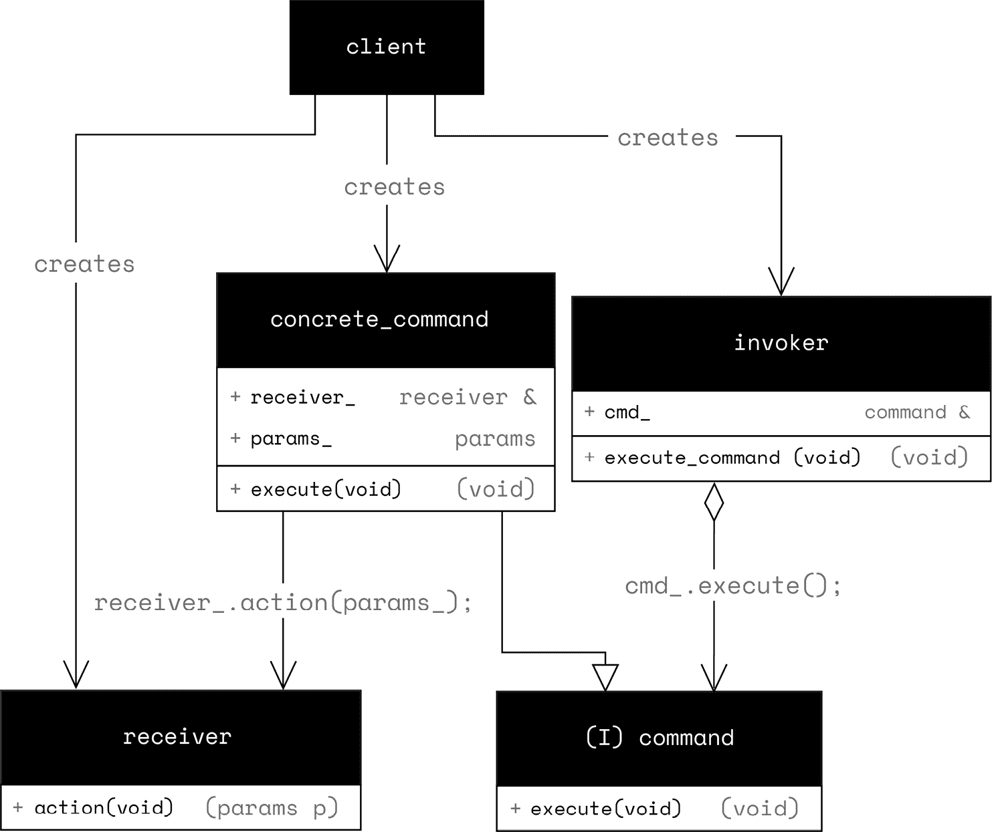

# 第十章：使用 Lambda 表达式编写表达性代码

C++ 中的 Lambda 表达式允许我们编写封装功能并将周围状态捕获到可调用对象中的短代码块。我们可以在可调用对象上使用 `operator()` 来执行其中实现的功能。

Lambda 表达式的常见用途包括将函数对象（也称为函数对象 – 一个覆盖 `operator()` 的类的对象）传递给标准库算法，或任何期望函数对象的代码，封装通常仅在单个函数中使用的代码块，以及变量初始化。它们能够局部化功能而不需要单独的函数或类方法，使 C++ 能够编写更干净、更具有表达性的代码。

在嵌入式开发中，Lambda 表达式特别适用于定义对定时器或外部中断的反应动作、调度任务以及类似的事件驱动机制。本章的目标是学习如何使用 Lambda 表达式编写具有表达性的 C++ 代码。在本章中，我们将涵盖以下主要主题：

+   Lambda 表达式基础

+   使用 `std::function` 存储 Lambda 表达式

+   `std::function` 和动态内存分配

# 技术要求

为了充分利用本章内容，我强烈建议在阅读示例时使用 Compiler Explorer ([`godbolt.org/`](https://godbolt.org/))。选择 GCC 作为您的编译器，并选择 x86 架构。这将允许您看到标准输出（stdio）结果，并更好地观察代码的行为。由于我们使用了大量的现代 C++ 功能，请确保通过在编译器选项框中添加 `-std=c++23` 来选择 C++23 标准。

Compiler Explorer 使得尝试代码、调整代码并立即看到它如何影响输出和生成的汇编变得容易。大多数示例也可以在 ARM Cortex-M0 目标的 Renode 模拟器上运行，并在 GitHub 上提供（[`github.com/PacktPublishing/Cpp-in-Embedded-Systems/tree/main/Chapter10`](https://github.com/PacktPublishing/Cpp-in-Embedded-Systems/tree/main/Chapter10)）。

# Lambda 表达式基础

**Lambda 表达式**，或称为 Lambda，是在 C++11 中引入的。它们用于在 C++ 中创建未命名的闭包类型的实例。闭包存储一个未命名的函数，并且可以通过值或引用捕获其作用域中的变量。我们可以在 Lambda 实例上调用 `operator ()`，并指定 Lambda 定义中的参数，从而有效地调用底层未命名的函数。为了与 C 语言进行比较，Lambda 可以像函数指针一样调用。

现在，我们将深入一个示例来展示如何在 C++ 中使用 Lambda 表达式，并解释有关 Lambda 捕获的细节。让我们处理以下示例：

```cpp
#include <cstdio>
#include <array>
#include <algorithm>
int main() {
    std::array<int, 4> arr{5, 3, 4, 1};
    const auto print_arr = &arr {
        printf("%s\r\n", message);
        for(auto elem : arr) {
            printf("%d, ", elem);
        }
        printf("\r\n");
    };
    print_arr("Unsorted array:");
    std::sort(arr.begin(), arr.end(), [](int a, int b) {
       return a < b;});
    print_arr("Sorted in ascending order:");
    std::sort(arr.begin(), arr.end(), [](int a, int b) {
       return a > b;});
    print_arr("Sorted in descending order:");
    return 0;
} 
```

运行上述示例，我们将得到以下输出：

```cpp
Unsorted array:
5, 3, 4, 1,
Sorted in ascending order:
1, 3, 4, 5,
Sorted in descending order:
5, 4, 3, 1, 
```

我们看到的是 Lambda `print_arr` 的输出，该 Lambda 用于打印在主函数中定义的数组 `arr`。让我们详细分析 `print_arr` Lambda：

+   `[&arr]` 语法通过引用从周围作用域捕获变量 arr。这意味着 lambda 可以在其主体中直接访问和使用 arr。

+   我们可以通过值捕获变量，或者通过引用捕获，如果我们像 `print_arr` lambda 那样在变量名前加上 `&`。

+   通过引用捕获 `[&arr]` 允许 lambda 在其定义之后看到对 `arr` 在 lambda 外部所做的任何更改。如果我们通过值捕获，lambda 将有自己的 `arr` 副本。

+   在 `main` 中定义 `print_arr` 为 lambda，我们封装了打印数组的函数功能，而不需要创建一个单独的函数。这使相关代码放在一起，并提高了可读性。

在相同的示例中，我们使用了 lambda 作为 `std::sort` 算法的谓词函数，首先按升序排序数组 `arr`，然后按降序排序。我们将更详细地介绍 lambda 的这个用例：

+   `std::sort` 算法根据提供的比较器重新排列 `arr` 的元素。

+   lambda `[](int a, int b) { return a < b; }` 作为 `std::sort` 的比较函数。它接受两个整数，如果第一个小于第二个则返回 `true`，从而实现升序排序。

+   lambda `[](int a, int b) { return a > b; }` 如果第一个整数大于第二个则返回 `true`，从而实现降序排序。

在 `std::sort` 的调用位置直接定义比较器使代码更加简洁。无需查看代码的其他部分，就可以立即清楚地了解数组是如何排序的。

在使用 lambda 与 `std::sort` 算法的情况下，lambda 都很小且简单，这使得推断它们返回的内容变得容易。保持 lambda 短小直接被视为一种良好的实践，因为它提高了可读性，并使代码意图对他人来说一目了然。我们还可以在以下示例中显式指定 lambda 的返回类型：

```cpp
 auto greater_than = [](int a, int b) -> bool {
        return a > b;
    }; 
```

在这里，我们显式地定义了返回类型。这是可选的，可以在我们想要明确 lambda 返回的类型时使用。此外，请注意，这个 lambda 的捕获子句是空方括号 `[]`。这表示 lambda 没有从周围作用域捕获任何变量。

当 lambda 通过引用捕获变量时，需要注意的是，这引入了生命周期依赖性——这意味着引用所绑定到的对象必须在调用 lambda 时存在——否则，我们将使用所谓的悬垂引用，这是未定义的行为。这在异步操作中尤其是一个问题——也就是说，当 lambda 被传递给函数并在稍后调用时。接下来，我们将学习如何使用 `std::function` 存储 lambda 以异步使用它们。

# 使用 std::function 存储 lambda

`std::function` 是一个类模板，允许我们存储、复制和调用可调用对象，如函数指针和 lambda。我们将通过一个简单的代码示例来演示这一点：

```cpp
#include <cstdio>
#include <cstdint>
#include <functional>
int main() {
    std::function<void()> fun;
    fun = []() {
        printf("This is a lambda!\r\n");
    }; 
    fun();
    std::uint32_t reg = 0x12345678;
    fun = [reg]() {
        printf("Reg content 0x%8X\r\n", reg);
    };
    reg = 0;
    fun();
    return 0;
} 
```

让我们通过一个例子来了解：

+   在 `main` 函数中，我们首先创建一个类型为 `std::function<void()>` 的对象 fun。这指定了 `fun` 可以存储任何返回 `void` 且不带参数的可调用对象。这包括函数指针、lambda 表达式或任何具有匹配签名的 `operator()` 的对象。

+   然后我们将一个 lambda 表达式赋值给 `fun` 并调用它，它将消息“这是一个 lambda！”打印到控制台。

+   接下来，我们将另一个 lambda 表达式赋值给 `fun` 对象。这次 lambda 表达式通过值捕获周围作用域中的 `uint32_t reg` 并打印它。通过值捕获意味着 lambda 表达式在定义时创建了 `reg` 的副本。

+   在调用存储在 `fun` 中的可调用对象之前，我们将 `reg` 的值更改为 `0`，以显示它是通过值捕获的。调用 `fun` 打印 `Reg content 0x12345678`。

让我们用一个更有趣的例子来使用 `std::function`，我们将使用它来存储一个 GPIO 中断的回调。以下是代码：

```cpp
#include <cstdio>
#include <cstdint>
#include <functional>
namespace hal
{
class gpio
{
public:
    gpio(const std::function<void()> & on_press) {
        if(on_press) {
            on_press_ = on_press;
        }
    }
    void execute_interrupt_handler () const {
        if(on_press_) {
            on_press_();
        }
    }
private:
    std::function<void()> on_press_ = nullptr;
};
}; // namespace hal
int main () {
    hal::gpio button1([]() {
        printf("Button1 pressed!\r\n");
    });
    // invoke stored lambda
    button1.execute_interrupt_handler();
    return 0;
} 
```

在上面的代码中，我们创建了一个 `hal::gpio` 类来表示 GPIO：

该类存储 `std::function<void()> on_press_`，它可以持有任何可调用对象，如 lambda 函数。它被初始化为 nullptr，以表示它不持有任何可调用对象。

+   它提供了 `execute_interrupt_handler` 方法，该方法检查 `on_press_` 是否评估为 true，即它存储了一个可调用对象，并在必要时执行它。

在 `main` 函数中，我们创建 `button1`，一个 `hal::button` 类的对象：

+   我们向构造函数提供一个简单的 lambda 表达式，它会打印 Button1 pressed!。

+   接下来，我们调用 `execute_interrupt_handler` 方法，它调用存储的 lambda 表达式，程序打印 `Button1 pressed!`。

在实际的固件中，我们会在中断服务中调用方法 `execute_interrupt_handler`。

上述代码是命令模式应用的示例，它在 C++ 中通过 `std::function` 和 lambda 表达式以简单和表达的方式实现。

## 命令模式

**命令模式**是一种行为设计模式，用于捕获一个函数调用及其所需参数 – 允许我们延迟执行这些函数。

我们将讨论命令模式的经典定义。让我们从模式的 UML 图开始，然后进行解释：



图 10.1 – 命令模式 – UML 图

*图 10**.1* 描述了命令模式的 UML 图。我们在上述图中注意到以下实体。

具有虚拟 `execute` 方法的 `command` 接口和 `concrete_command` 接口的具体实现。

+   `receiver`，在 `concrete_command` 实现中通过引用存储。它执行一个带 `params` 参数的 `action`。

+   `invoker`，它存储对 `command` 接口的引用并执行一个 `command`。

+   `client` 创建一个 `receiver` 并将其传递给 `concrete_command` 的构造函数。它将创建的 `concrete_command` 的引用传递给 `invoker`。

通过使用命令接口，我们能够创建不同的具体命令并将它们提供给调用者。而不是使用命令接口和具体命令，我们可以使用类模板 `std::function` 和 lambda 表达式来实现相同的目的。

在我们之前的例子中，我们创建了 `hal::gpio` 类作为命令模式的调用者。它有一个 `std::function<void()>` 成员 – 等同于命令接口。具体命令是我们存储在 `std::function<void()>` 中的 lambda 表达式。

`receiver` 是 lambda 体 – 在我们的例子中是 `printf` 函数 – 而 `client` 是 `main` 函数。客户端创建一个接收器（`hal::gpio button1`）并向它提供一个具体的命令（lambda 表达式）。我们直接从 `main` 函数中调用 `execute_interrupt_handler`。

接下来，我们将扩展这个例子，从 STM32 平台的中断处理程序中调用 `execute_interrupt_handler`。该设计将支持来自多个引脚的中断。我们将引入 `gpio_interrupt_manager` 实体，它将负责注册调用者并在它们上调用 `execute_interrupt_handler` 方法。

## GPIO 中断管理器

我们希望利用 `std::function` 类模板和 lambda 表达式来在固件中实现创建 GPIO 中断处理程序的表达式方式，如下面的代码所示：

```cpp
const hal::gpio_stm32<hal::port_a> button1(hal::pin::p4, [](){
 printf("Button1 pressed!\r\n");
}); 
```

在上面的代码中，我们从一个由 `hal::port_a` 参数化的类模板 `hal::gpio_stm32` 中创建了一个 `button1` 对象。我们提供了一个带有 `hal::pin::p4` 和 lambda 表达式的构造函数，该 lambda 表达式将在中断上执行。这是一个目标，一个用于编写中断处理程序的表达式接口，同时也允许我们通过 lambda 表达式捕获所需的周围变量。

从上面的代码中，我们可以看到我们正在配置的引脚和端口以及将在中断上执行的回调。我们将创建的机制将处理将中断处理程序注册到我们将命名为 `gpio_interrupt_manager` 的中央实体。在我们继续设计之前，请按照以下说明在 Renode 中运行完整示例。

1.  启动 Visual Studio Code，将其附加到正在运行的容器，按照 *第四章* 中所述打开 `Chapter10/lambdas` 项目，并在 Visual Studio Code 终端中运行以下命令，或者在容器终端中直接运行它们：

    ```cpp
    $ cd Chapter10/lambdas
    $ cmake -B build -DCMAKE_BUILD_TYPE=Debug -DMAIN_CPP_FILE_NAME=main_std_function_command_pattern.cpp
    $ cmake --build build --target run_in_renode 
    ```

1.  在 Renode 中，我们可以使用以下命令来模拟 `button1` 和 `button2` 的按键和释放：

    ```cpp
    gpioPortA.button1 PressAndRelease
    gpioPortA.button2 PressAndRelease 
    ```

1.  输入上述命令应在 Renode 控制台中产生以下输出：

    ```cpp
    Button1 pressed!
    Button2 pressed! 
    ```

如您所见，在 lambda 中提供的操作是由按钮生成的中断调用的。让我们通过这个例子的 UML 图来了解它是如何工作的：


图 10.2 – GPIO 中断管理器 UML 图

在 *图 10**.2 中，我们看到 GPIO 中断管理器的 UML 图。它基于命令模式。我们使用 `std::function<void()>` 代替命令接口和 lambda 表达式作为具体命令。调用者是 `hal::gpio` 抽象类，它在成员 `on_press` 中存储 lambda。它如以下代码所示在构造函数中将自己注册到 `gpio_interrupt_manager`：

```cpp
gpio::gpio(const std::function<void()> & on_press) {
   on_press_ = on_press;
   gpio_interrupt_manager::register_interrupt_handler(this)
} 
```

`gpio_interrupt_manager` 是一个简单的结构体。它作为中断处理机制的中央实体，具有以下特性：

+   它包含一个 `hal::gpio` 指针数组 – `std::array<gpio*, c_gpio_handlers_num> gpio_handlers`。

+   它提供了一个静态方法来注册一个 `hal::gpio` 指针 – `void register_interrupt_handler(gpio * pin)`。

+   它提供了一个静态方法，用于执行存储在数组中的中断处理程序 – `void execute_interrupt_handlers()`。

方法 `execute_interrupt_handlers` 如下所示从中断服务例程中调用：

```cpp
extern "C" void EXTI4_15_IRQHandler(void) {
    gpio_interrupt_manager::execute_interrupt_handlers();
} 
```

`EXTI4_15_IRQHandler` 是在向量表中定义的中断服务例程（在 `platform/startup_stm32f072xb.s` 中定义）。这就是为什么我们使用了 `"C"` 语言链接并将其实现为一个全局函数。`execute_interrupt_handlers` 方法遍历 `hal::gpio` 指针数组，并在它们上调用 `execute_interrupt_handler` 方法，如下所示：

```cpp
void gpio_interrupt_manager::execute_interrupt_handlers() {
    for(std::size_t i = 0; i < w_idx; i++) {
        gpio_handlers[i]->execute_interrupt_handler();
    }
} 
```

`hal::gpio` 是一个具有以下特性的抽象类：

+   它实现了之前看到的 `gpio_interrupt_manager` 所使用的 `execute_interrupt_handler` 方法。

+   它定义了一个纯虚方法 `[[nodiscard]] virtual bool is_interrupt_generated() const = 0`。此方法需要由实现特定平台功能的派生类重写。

+   它定义了一个虚拟方法 `virtual void clear_interrupt_flag() const = 0`。此方法需要由实现特定平台功能的派生类重写。

下面展示了 `execute_interrupt_handler` 的代码：

```cpp
void gpio::execute_interrupt_handler () const {
    if(is_interrupt_generated()){
        clear_interrupt_flag();
        if(on_press_) {
            on_press_();
        }
    }
} 
```

`execute_interrupt_handler` 方法实现了以下功能：

+   它使用虚拟方法 `is_interrupt_generated` 检查中断是否应由当前对象处理。此方法必须由派生类重写。派生类具有确定生成中断是否需要由当前对象处理所需的数据。

+   如果中断应由当前对象处理，则使用虚拟方法 `clear_interrupt_flag` 清除中断标志，如果它存储了一个可调用对象，则调用 `on_press_`。

`hal::gpio_stm32` 是从 `hal::gpio` 派生出的类模板。我们用端口作为参数实例化它，并实现了平台特定的操作，例如使用供应商提供的 C HAL 库进行 GPIO 初始化。

在此示例中，我们使用 `port_a` 结构体实例化了 `hal::gpio_stm32`，其中包含 `void init_clock()` 静态函数。这允许我们在模板参数上调用静态方法，而不是将端口定义为 `enum`，在运行时进行检查，并调用特定端口的时钟初始化函数。

`hal::gpio_stm32` 类模板使用 `hal::gpio` 作为基类：

+   构造函数接受一个枚举引脚和一个对 `std::function<void()>` 对象的 const 引用，我们使用它来在初始化列表中初始化基类。

+   `[[nodiscard]] bool is_interrupt_generated() const` – 重写的方法使用供应商提供的 C HAL 来确定是否由构造函数通过的对象提供的引脚生成了中断。

+   `void clear_interrupt_flag() const` – 重写的方法实现了用于清除中断标志的平台特定代码。

这总结了 GPIO 中断管理器的实现，并解释了其设计。您可以在书籍 GitHub 仓库的 `Chapter10/lambdas` 文件夹中找到提供的源代码中的其他实现细节。

接下来，我们将讨论使用 `std::function` 对动态内存分配的影响。

# `std::function` 和动态内存分配

`std::function` 需要存储 lambda 所捕获的所有变量和引用。这种行为是实现定义的，并且实现通常使用堆，即动态内存分配来存储大量变量。如果捕获的数据量小（在某些平台上，16 字节），它将被存储在栈上。这被称为小对象优化。为了演示 `std::function` 类模板在捕获数据时的行为，我们将通过以下示例进行说明：

```cpp
#include <cstdio>
#include <cstdint>
#include <cstdlib>
#include <functional>
void *operator new(std::size_t count) {
  printf("%s, size = %ld\r\n", __PRETTY_FUNCTION__, count);
  return std::malloc(count);
}
void operator delete(void *ptr) noexcept {
  printf("%s\r\n", __PRETTY_FUNCTION__);
  std::free(ptr);
}
int main () {
    std::function<void()> func;
    auto arr = []() {
        constexpr std::size_t c_array_size = 6;
        std::array<int, c_array_size> ar{};
        for(int i = 0; i < ar.size(); i++) {
            ar[i] = i;
        }
        return ar;
    }();
    auto array_printer = [arr]() {
        for(int elem: arr) {
            printf("%d, ", elem);
        }
        printf("\r\n");
    };
    func = array_printer;
    // invoke stored lambda
func();
    return 0;
} 
```

在上述示例中，我们已经重写了 `new` 和 `delete` 操作符，以显示存储捕获了 6 个整数的 lambda 将会调用动态内存分配。如果您使用 `x86-64 GCC 14.2` 在 Compiler Explorer 中运行上述示例，您将看到以下输出：

```cpp
void* operator new(std::size_t), size = 24
0, 1, 2, 3, 4,
void operator delete(void*) 
```

此示例还演示了通过 lambda 生成数组成员来初始化变量 `arr`。如果您将 `constexpr std::size_t c_array_size` 改为 4，您将注意到 `new` 和 `delete` 操作符不再被调用，这意味着在这种情况下，捕获的数据存储在栈上。

为了解决这个问题，我们可以将 lambda 对象的 `std::reference_wrapper` 赋值给 `std::function<void()> fun`，而不是像以下代码行中那样赋值给对象本身：

```cpp
 func = std::ref(array_printer); 
```

这将使 `std::function` 对象使用对 lambda 对象的引用包装器，而不是复制它并存储 lambda 所捕获的所有变量。使用这种方法，我们必须注意 lambda 对象的生存期，这意味着如果它超出作用域，并且我们尝试通过 `std::function` 对象调用它，程序将出现未定义的行为。

我们也可以使用普通的函数指针来存储 lambda 表达式，但前提是它们不捕获周围作用域中的任何内容，如下面的示例所示：

```cpp
#include <cstdio>
#include <functional>
int main () {
    void(*fun)(void);
    fun = []() {
        printf("Lambda!\r\n");
    };
    fun();
    return 0;
} 
```

在上述示例中，我们将 lambda 表达式赋值给函数指针，使其在某些应用中成为将 lambda 表达式存储到`std::function`类模板的可行替代方案。这也使得将非捕获 lambda 表达式传递给期望函数指针的 C 函数成为可能。

# 摘要

Lambda 表达式和`std::function`是强大的现代 C++工具，允许我们编写表达性代码并以优雅的方式实现设计模式，例如命令模式。我们学习了从周围作用域捕获数据的不同方法——通过值或引用。我们还探讨了命令模式设计模式，并学习了如何将其应用于 GPIO 中断管理器。

在下一章中，我们将介绍 C++中的编译时计算。
