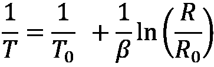
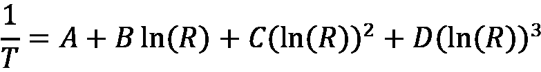
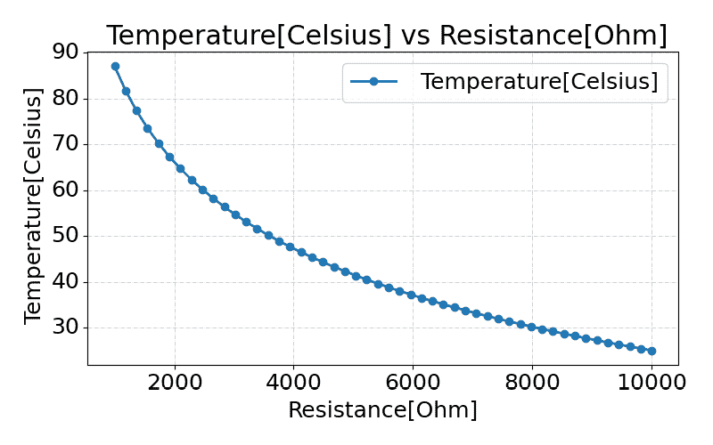
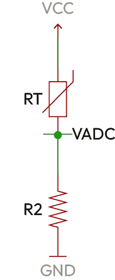
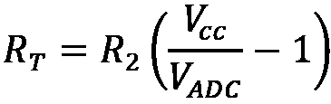

# 第十一章：编译时计算

**编译时计算**指的是编译器在编译时执行函数的能力，而不是将它们转换为机器代码。这意味着复杂运算的结果可以由编译器计算并存储在运行时使用的变量中。编译器只能在函数的所有参数在编译时已知的情况下在编译时执行函数。

我们可以在 C++固件中使用编译时计算来计算复杂的数学运算，生成查找表和数组，并在运行时使用生成的值。在编译时执行这些操作将节省宝贵的内存和处理器（空间和时间）资源，并将它们用于其他更重要的操作。

本章的目标是学习如何使用 C++中的编译时计算将复杂操作移至编译时，并节省宝贵的资源。在本章中，我们将涵盖以下主要主题：

+   模板

+   `constexpr`指定符

+   `consteval`指定符

# 技术要求

为了充分利用本章内容，我强烈建议你在阅读示例时使用编译器探索器([`godbolt.org/`](https://godbolt.org/))。选择 GCC 作为你的 x86 架构编译器。这将允许你看到标准输出（stdio）结果，并更好地观察代码的行为。由于我们使用了大量的现代 C++特性，请确保通过在编译器选项框中添加`-std=c++23`来选择 C++23 标准。

编译器探索器使得尝试代码、调整它并立即看到它如何影响输出和生成的汇编代码变得容易。大多数示例也可以在 ARM Cortex-M0 目标上的 Renode 模拟器中运行，并在 GitHub 上提供([`github.com/PacktPublishing/Cpp-in-Embedded-Systems/tree/main/Chapter11`](https://github.com/PacktPublishing/Cpp-in-Embedded-Systems/tree/main/Chapter11))。

# 模板

C++中编译时计算的第一个可用机制是**模板元编程（TMP）**。使用 TMP，我们可以将操作的结果存储在类型中，如下面的计算阶乘的示例所示：

```cpp
template <unsigned int N>
`struct` factorial {
    static const unsigned int value = N * factorial<N-1>::value;
};
template <>
`struct` factorial<0> {
    static const unsigned int value = 1;
};
int main () {
    const int fact = factorial<5>::value;
    return fact;
} 
```

如果你在这个示例中运行编译器探索器（即使没有优化），你会看到它返回 120。生成的汇编代码很短，不包含任何函数调用。它只是在`main`函数中将值 120 放入返回寄存器中，这意味着阶乘计算是在编译时完成的。你可以在这里看到生成的汇编代码：

```cpp
main:
push rbp
mov rbp, rsp
mov DWORD PTR [rbp-4], 120
mov eax, 120
pop rbp
ret 
```

在前面的示例中，我们执行了以下步骤：

+   我们定义了一个类模板`factorial`。它有一个无符号整型`N`作为参数，并且只有一个成员：`static const unsigned int value = N * factorial<N-1>::value`。

+   在成员`value`的赋值表达式中，我们在模板级别使用递归，因为我们通过将`N`乘以使用`N – 1`实例化的阶乘的`value`来计算它。

+   我们为 `0` 定义了阶乘模板特化，使其成为一个停止递归的基本类型，这意味着 `factorial<0>::value` 将包含 `1`。

为了更好地理解模板级别的递归，我们将为前面的示例写下整个递归链：

+   `factorial<5>::value = 5 * factorial<4>::value;`

+   `factorial<4>::value = 4 * factorial<3>::value;`

+   `factorial<3>::value = 3 * factorial<2>::value;`

+   `factorial<2>::value = 2 * factorial<1>::value;`

+   `factorial<1>::value = 1 * factorial<0>::value;`

+   `factorial<0>::value = 1;`

如果我们将 `factorial<0>` 的基本值替换为 `1`，向上回溯，我们有以下内容：

+   `factorial<1>::value = 1 * 1 = 1`

+   `factorial<2>::value = 2 * 1 = 2`

+   `factorial<3>::value = 3 * 2 = 6`

+   `factorial<4>::value = 4 * 6 = 24`

+   `factorial<5>::value = 5 * 24 = 120`

`main` 函数通过访问 `factorial<5>::value` 来计算 `5` 的阶乘，并将其返回。递归通过为 `factorial<0>` 定制的模板终止，该模板提供了基本情况。最终结果是程序返回 `120`，即 `5` 的阶乘。

虽然 TMP 允许编译时计算，但它通常涉及复杂的递归模式，这些模式可能难以阅读和维护。为了解决这些挑战，C++11 引入了 `constexpr` 指示符，它已成为编译时计算的优选机制。

# `constexpr` 指示符

使用 `constexpr` **指示符**，我们声明可以在编译时评估变量和函数。在编译时可以评估的内容有限。一个 `constexpr` 变量必须满足以下要求：

+   它需要是 `literal` 类型，以下之一：

    +   标量类型，如算术类型、枚举和指针

    +   引用类型

    +   `literal` 类型的数组

+   满足特定要求的类（例如，一个平凡的 `constexpr` 析构函数，其所有非静态数据成员都是 `literal` 类型，或者至少有一个 `constexpr` 构造函数）。

+   它必须立即初始化。

+   其初始化的整个表达式需要是一个常量表达式。

让我们通过以下示例更好地理解对 `constexpr` 变量的要求：

```cpp
#include <cmath>
int main () {
    `constexpr` int ret = round(sin(3.14));
    return ret;
} 
```

如果你使用 `x86-64 GCC 14.2` 编译器在 Compiler Explorer 中运行此示例，并且没有启用优化，我们可以观察到以下内容：

+   程序返回 `0`。

+   生成的汇编代码很小，它只是将 `0` 移动到返回寄存器。

+   如果你更改 `ret` 变量的初始化，使正弦函数以 `3.14/2` 作为参数，程序将返回 `1`。

现在，如果我们尝试在 Compiler Explorer 中将编译器更改为 `x86-64 clang 18.1.0`，我们将得到以下编译器错误：

```cpp
<source>:4:19: error: constexpr variable 'ret' must be initialized by a constant expression
    4 |     constexpr int ret = round(sin(3.14));
      |                   ^     ~~~~~~~~~~~~~~~~
<source>:4:31: note: non-constexpr function 'sin' cannot be used in a constant expression
    4 |     constexpr int ret = round(sin(3.14)); 
```

编译器报告说我们违反了规则，即其初始化的整个表达式需要是一个常量表达式，因为在表达式`round(sin(3.14))`中的函数`sin`不是`constexpr`。这是因为 Clang 对数学函数的实现不是`constexpr`，而 GCC 将其实现为`constexpr`函数。在新的 C++26 标准中，许多数学函数都将被实现为`constexpr`函数。

尽管即将到来的 C++26 标准强制要求数学函数应该是`constexpr`，但我们将利用当前的 GCC 实现，因为我们在这本书的例子中使用的编译器是用于我们的 STM32 目标。所有`constexpr`函数都必须满足以下要求：

+   它的`return`类型必须是`literal`类型。

+   它的每个参数都必须是`literal`类型。

+   如果一个函数不是构造函数，它必须只有一个`return`语句。

为了更好地理解`constexpr`函数，让我们在下面的例子中将阶乘算法实现为一个`constexpr`函数：

```cpp
constexpr unsigned int factorial(unsigned int n) {
    unsigned int prod = 1;
    while(n > 0) {
        prod *= n;
        n--;
    }
    return prod;
}
int main () {
    constexpr int calc_val = 5;
    constexpr unsigned int ret = factorial(calc_val);
    return ret;
} 
```

在这个例子中，我们将阶乘算法实现为一个简单的`constexpr`函数。与基于 TMP 的解决方案相比，这个代码对许多有 C 背景的开发者来说看起来很熟悉。在模板级别没有递归和奇怪的语法。C++11 的`constexpr`函数仍然依赖于递归，但 C++14 放宽了对`constexpr`函数的限制，并允许使用局部变量和循环。

如果我们在编译器探索器中使用`x86-64 GCC 14.2`编译器运行前面的例子，并且没有启用优化，我们可以观察到以下情况：

+   程序返回 120。

+   生成的汇编代码很小，它只是将 120 移动到返回寄存器。

+   生成的汇编代码中没有`factorial`函数，这意味着编译器在编译时执行了这个函数。我们提供了一个带有常量表达式参数的阶乘函数，编译器在编译时评估了这个函数。

+   如果我们从`calc_val`和`ret`变量的声明中移除`constexpr`指定符，我们将在生成的汇编调用中看到`factorial`函数，在`main`函数中，我们将看到对这个函数的调用，这意味着在这种情况下，`factorial`函数是在运行时执行的，在固件的情况下，它将是二进制的一部分。

如我们从本例中可以看到，`constexpr`函数可以在编译时和运行时执行，具体取决于我们提供给它的参数。接下来，我们将通过实际例子来了解如何在固件开发中应用`constexpr`指定符。

## 示例 1 – MAC 地址解析器

**介质访问控制**（**MAC**）地址用于不同通信栈的 MAC 层，包括以太网、Wi-Fi 和蓝牙。在这里，我们将创建一个 48 位 MAC 地址编译时解析器，它将帮助我们将常见的以冒号分隔的十六进制数字格式的 MAC 地址转换为 `uint8_t` 数组，这在软件栈中通常使用。代码如下所示：

```cpp
#include <array>
#include <cstdint>
#include <string_view>
#include <charconv>
`struct` mac_address {
    static constexpr std::size_t c_bytes_num = 6;
    static constexpr std::size_t c_mac_addr_str_size = 17;

    std::array<uint8_t, c_bytes_num> bytes{};
    bool is_valid = false;
    constexpr mac_address(std::string_view str) {
        if (str.size() != c_mac_addr_str_size) {
            return;
        }
        for (size_t i = 0; i < c_bytes_num; ++i) {
            const std::string_view byte_str = str.substr(i * 3, 2);
            uint8_t value = 0;
            auto result = std::from_chars(byte_str.data(), byte_str.data() 
 + byte_str.size(), value, 16);
            if (result.ec != std::errc()) {
                return;
            }
            bytes[i] = value;
        }
        is_valid = true;
    }
};
int main () {
    constexpr mac_address addr("00:11:22:33:44:55");
    static_assert(addr.is_valid);
    return addr.bytes.at(5);
} 
```

在 `main` 函数中，我们通过提供一个构造函数 `"00:11:22:33:44:55"` 来创建 `struct` `mac_address` 的实例。如果我们使用 x86-64 GCC 14.2 编译器，在 Compiler Explorer 中运行前面的示例，并且没有启用优化，我们可以观察到以下内容：

+   程序以十进制数 `85` 返回。将其转换为十六进制格式，我们将得到 0x55，这对应于 MAC 地址 `00:11:22:33:44:55` 的最后一个字节。

+   生成的汇编代码很小。它使用我们在构造函数中使用的 MAC 地址的字节填充栈。没有对构造函数的调用，这意味着它在编译时执行。

+   如果我们将构造函数中提供的 MAC 地址更改为 `"000:11:22:33:44:55"` 或 `"G0:11:22:33:44:55"`，编译器将由于 `static_assert(addr.is_valid)` 失败而生成错误。

让我们现在更详细地解释 `struct` `mac_address`：

+   该 `struct` 包含成员 `std::array<uint8_t, c_bytes_num> bytes` 和 `bool is_valid`。它不包含任何方法，除了构造函数。

+   构造函数接受 `std::string_view` 类模板，它封装了对提供的字符串字面量第一个元素的指针及其大小。

+   构造函数使用 `string_view` 对象上的 `susbstr` 方法创建子串视图，并使用 `std::from_char` 将它们转换为 `uint8_t` 值，这些值存储在 `bytes` 数组中。

+   如果没有错误，构造函数将 bool `is_valid` 设置为 true。使用 `static_assert`，我们可以在编译时验证提供的 MAC 地址字符串字面量是否成功转换。我们无法在 `constexpr` 函数中使用断言。另一种选择是抛出异常，这将导致编译时错误，但我们决定不为我们的嵌入式目标使用异常。

您也可以在 STM32 目标的 Renode 模拟器中运行前面的示例。启动 Visual Studio Code，将其附加到正在运行的容器，并打开如*第四章*所述的 `Chapter11/compile_time` 项目，然后在 Visual Studio Code 终端中运行以下命令，或者在容器终端中直接运行：

```cpp
$ cd Chapter11/compile_time
$ cmake -B build -DCMAKE_BUILD_TYPE=MinSizeRel -DMAIN_CPP_FILE_NAME=main_constexpr_mac_address.cpp
$ cmake --build build --target run_in_renode 
```

这里是来自 `main_constexpr_mac_address.cpp` 文件的 `main` 函数的一部分：

```cpp
constexpr mac_address addr("00:11:22:33:44:55");
static_assert(addr.is_valid);
const std::array<uint8_t, 6> addr_arr{0x00, 0x11, 0x22, 0x33, 0x44, 0x55};
const auto & mac_ref = addr.bytes;
//const auto & mac_ref = addr_arr;
printf("%02X:%02X:%02X:%02X:%02X:%02X\r\n", mac_ref[0], mac_ref[1], mac_ref[2], mac_ref[3], mac_ref[4], mac_ref[5]); 
```

为了确认将字符串字面量转换为数组的所有工作都是在编译时完成的，您可以绑定引用`mac_ref`到`addr_arr`，并比较两种情况下的二进制大小。它们都是 6,564 字节，这意味着`constexpr`构造函数没有包含在二进制文件中，因为它实际上是在编译时由编译器执行的。

接下来，我们将通过一个示例来展示如何使用 C++中的`constexpr`函数创建温度热敏电阻的查找表。

## 示例 2 – 生成查找表

热敏电阻是电阻随温度变化的电阻器。它们在嵌入式系统中被广泛使用。它们通常具有非线性曲线。有不同方法来近似将热敏电阻的模拟-数字转换器（**ADC**）读数转换为温度。最常用的方法之一是**贝塔系数**。它是通过测量热敏电阻在两个温度点的电阻来计算的。它用于使用以下方程计算温度：



在此方程中，*T*[0]是 25°C（298.15K）的室温，*R*[0]是室温下热敏电阻的电阻。使用贝塔系数（由制造商提供的常数）是对热敏电阻曲线的简化，因为它只依赖于在两个点测量曲线。

Steinhart-Hart 方程提供了一种更精确的曲线拟合方法，因为它依赖于通过在四个温度点测量热敏电阻计算出的四个系数。方程如下所示：



系数*A*、*B*、*C*和*D*是在测量热敏电阻在四个不同温度点的温度后计算的——这意味着这些是制造商为热敏电阻提供的常数。使用 Steinhart-Hart 方程计算的温度是以开尔文为单位的。Steinhart-Hart 方程的缺点是它在小型嵌入式目标中计算量较大。

在本例中，我们将使用 Steinhart-Hart 方程创建一个查找表，并依靠它通过读取我们嵌入式目标中的 ADC 值来确定温度。从方程中我们可以看出，温度是电阻和给定常数的函数。对于选定的电阻范围和选定的分辨率，我们将生成一个温度值的查找表。然后，我们将模拟读取热敏电阻的电阻值，并在查找表中搜索以确定温度。

我们将选择一个电阻范围，这是我们想要基于查找表的基础，以及我们想要使用的点的数量。为此，我们需要一个功能，它将生成给定范围内的均匀分布的数字数组，也称为线性空间。接下来，我们将使用这个线性空间作为信号发生器的参数。让我们从以下实现开始：

1.  下面是展示线性空间生成器的代码：

    ```cpp
    #include <array>
    #include <cstdio>
    template <typename T, std::size_t N>
    `struct` signal : public std::array<T, N> {
      constexpr signal() {}
      constexpr signal(T begin, T end) {
        static_assert(N > 1, "N must be bigger than 1"); 
        float step = (end - begin) / (N - 1);
        for (std::size_t i = 0; i < N; i++) {
          this->at(i) = begin + i * step;
        }
      }
    };
    int main() {
        constexpr signal<float, 10> x_axis(0, 9);
        for(auto elem: x_axis) {
            printf("%.2f, ", elem);
        }
        printf("\r\n");
        return 0;
    } 
    ```

如果我们运行此程序，它将打印 0 到 10 范围内的 10 个数字，如下所示：

```cpp
0.00, 1.00, 2.00, 3.00, 4.00, 5.00, 6.00, 7.00, 8.00, 9.00, 
```

打印的数字是在编译时由`signal` `struct`生成的。为了将此与我们的示例联系起来，想象这些是我们想要使用 Steinhart-Hart 方程计算温度的电阻值。让我们详细了解一下实现过程：

+   `signal`是一个类模板。模板参数是`typename T`和`std::size_t N`。它们决定了`struct`所基于的数组类型。

+   `struct`从`std::array<T, N>`派生。我们基于`std::array`来能够轻松使用基于范围的 for 循环和标准库算法。

+   在`constexpr`构造函数中，我们使用`static_assert`确保`N`大于 1，并在`begin`和`end`之间填充底层数组的等间距点。

+   在`main`函数中，我们为`struct signal`提供`float`和`10`作为模板参数，并将`0`和`9`作为构造函数的`begin`和`end`点，用于线性空间。我们使用基于范围的 for 循环遍历编译时生成的对象`x_axis`的元素并打印它们。

1.  接下来，我们将使用一个额外的构造函数扩展信号`struct`，这个构造函数允许我们根据另一个信号和一个 lambda 表达式创建一个信号。下面是创建新构造函数的代码示例：

    ```cpp
    template <typename T, std::size_t N>
    `struct` signal : public std::array<T, N> {
    // ...
    constexpr signal(const signal &sig, auto fun) {
        for (std::size_t i = 0; i < N; i++) {
          this->at(i) = fun(sig.at(i));
        }
      }
    }; 
    ```

在此构造函数中，我们通过调用传递的`fun`函数来初始化新信号中的元素，该函数是传递的信号`sig`的元素。

1.  现在，我们可以创建一个新的信号，如下所示：

    ```cpp
    int main() {
        const auto print_signal = [](auto sig) {
            for(auto elem: sig) {
                printf("%.2f, ", elem);
            }
            printf("\r\n");
        };
        constexpr signal<float, 10> x_axis(0, 9);
        print_signal(x_axis);
        auto sine = signal(x_axis, [](float x){ return std::sin(x);});
        print_signal(sine);
        return 0;
    } 
    ```

如果你正在使用编译器探索器跟随示例，请确保包含`<cmath>`头文件，因为我们使用了`std::sin`函数。运行它将给出以下输出：

```cpp
0.00, 1.00, 2.00, 3.00, 4.00, 5.00, 6.00, 7.00, 8.00, 9.00,
0.00, 0.84, 0.91, 0.14, -0.76, -0.96, -0.28, 0.66, 0.99, 0.41, 
```

在此代码中，我们通过传递`x_axis`和 lambda 表达式`[](int x){return std::sin(x);}`到新创建的构造函数，创建了一个名为`sine`的新信号。

为了将此与示例联系起来，现在我们可以使用简单的数学函数（如`std::sin`）和从步骤 1 生成的信号构造函数生成的线性空间生成查找表。

### 生成查找表

要生成更复杂的功能，我们需要使用更多功能扩展`signal`类：

1.  首先，我们将重载运算符`*`和`/`，以便将信号乘以常数，并将常数除以信号的元素。代码如下所示：

    ```cpp
    template <typename T, std::size_t N>
    `struct` signal : public std::array<T, N> {
    // ...
    constexpr signal operator*(const T &t) const {
        return signal(*this, &
                      { return elem * t; });
      };
      constexpr signal operator/(const T &t) const {
        return signal(*this, &
                      { return elem / t; });
      };
     }; 
    ```

在此代码中，我们重载了运算符`*`和`/`，使得信号可以与标量进行乘法和除法，如下所示：

```cpp
auto result = sig * 2.0f; 
```

上述代码将创建一个名为`result`的新信号，它将是信号`sig`的每个元素与标量`2.0`相乘的结果。

1.  同样，我们可以通过除以标量来创建一个新的信号，如下所示：

    ```cpp
    auto result = sig / 2.0f; 
    ```

此代码将创建一个名为`result`的新信号，它将是信号`sig`的每个元素除以标量`2.0`的结果。

1.  为了支持运算符 `*` 和 `/` 左侧的标量，我们需要实现全局运算符 `operator*` 和 `operator/`。我们将通过将它们声明为 `struct signal` 的友元来实现，如下所示：

    ```cpp
    template <typename T, std::size_t N>
    struct signal : public std::array<T, N> {
    // ...
    friend constexpr signal operator*(const T &t, const signal &sig)
      {
        return sig * t;
      }
      friend constexpr signal operator/(const T &t, const signal &sig)
      {
        signal ret;
        for (std::size_t i = 0; i < N; i++) {
          ret.at(i) = t / sig.at(i);
        }
        return ret;
      }
    }; 
    ```

此代码中的友元函数 `operator*` 允许当标量位于左侧时进行标量乘法（标量 * 信号），这是仅使用成员函数无法实现的。由于乘法具有交换性（*a * b = b * a*），我们只需调用成员函数 `operator*` 并返回结果（`return sig * t`）。

1.  在友元函数 `operator/` 中，我们执行以下步骤：

    1.  创建一个新的信号，`ret`。

    1.  遍历信号 `sig` 的元素，并对每个元素，将标量 `t` 除以该元素。

    1.  我们返回信号 `ret`。

1.  通过将运算符 `*` 和 `/` 都作为全局函数和成员函数重载，我们现在可以创建如下示例中的信号：

    ```cpp
    int main() {
        // ...
    constexpr signal<float, 10> x_axis(0, 9);
        print_signal(x_axis);
        auto linear_fun = 2.f * x_axis;
        print_signal(linear_fun);
        auto linear_fun2 = linear_fun / 2.f;
        print_signal(linear_fun2);
        return 0;
    } 
    ```

此代码将产生以下输出：

```cpp
0.00, 1.00, 2.00, 3.00, 4.00, 5.00, 6.00, 7.00, 8.00, 9.00,
0.00, 2.00, 4.00, 6.00, 8.00, 10.00, 12.00, 14.00, 16.00, 18.00,
0.00, 1.00, 2.00, 3.00, 4.00, 5.00, 6.00, 7.00, 8.00, 9.00, 
```

如我们从输出中看到的，最初创建的 `x_axis`，表示从 0 到 9.00 的线性空间，有 10 个点，被乘以 2.0 以创建 `linear_fun`。然后我们将 `linear_fun` 除以 2.0 以创建 `linear_fun2`，它与 `x_axis` 匹配。

1.  为了能够写出完整的 Steinhart-Hart 方程，我们还需要重载运算符 `+` 和 `-`，如下所示：

    ```cpp
    template <typename T, std::size_t N>
    struct signal : public std::array<T, N> {
    // ...
    constexpr signal operator+(const T &t) const {
        return signal(*this, &
                      { return elem + t; });
      };
      constexpr signal operator-(const T &t) const {
        return signal(*this, &
                      { return elem - t; });
      };
      constexpr signal operator+(const signal &sig) const {
        signal ret;
        for (std::size_t i = 0; i < N; i++)
        {
          ret.at(i) = this->at(i) + sig.at(i);
        }
        return ret;
      };
      friend constexpr signal operator+(const T &t, const signal &sig)
      {
        return sig + t;
      }
    }; 
    ```

在此代码中，我们重载了以下运算符：

+   成员 `constexpr signal operator+(const T &t)`，允许我们将标量添加到信号（信号 + 标量）

+   成员 `constexpr signal operator-(const T &t)`，允许我们从信号中减去标量（信号 - 标量）

+   成员 `constexpr signal operator+(const signal &sig)`，允许我们逐元素相加两个信号（signal1 + signal2）

+   全局 `constexpr signal operator+(const T &t, const signal &sig)`，允许我们将信号添加到标量（标量 + 信号）

### 编写表示 Steinhart-Hart 方程的信号

现在我们已经拥有了编写表示 Steinhart-Hart 方程的信号的所需所有元素，如下所示：

```cpp
int main()
{
  constexpr float A = 1.18090254918130e-3;
  constexpr float B = 2.16884014794388e-4;
  constexpr float C = 1.90058756197216e-6;
  constexpr float D = 1.83161892641824e-8;
  constexpr int c_lut_points = 50;
  constexpr signal<float, c_lut_points> resistance(1e3, 10e3);
  constexpr auto temperature_k =
  1 / (A +
  B * signal(resistance, [](float x)
                    { return std::log(x); }) +
  C * signal(resistance, [](float x)
                    { return std::pow(std::log(x), 2); }) +
  D * signal(resistance, [](float x)
                    { return std::pow(std::log(x), 3); }));
  constexpr auto temperature_celsius = temperature_k - 273.15f;
  std::ofstream file("out.csv");
  file << "Resistance[Ohm], Temperature[Celsius]\n";
  for (int i = 0; i < c_lut_points; i++) {
    file << resistance[i] << ", " << temperature_celsius[i] << "\n";
  }
  return 0;
} 
```

此代码通过以下步骤生成 Steinhart-Hart 方程的点：

1.  定义 *A*、*B*、*C* 和 *D* 系数。

1.  在 50 个点之间创建 1 到 10 kOhms 的电阻值。

1.  使用生成的电阻信号的点计算开尔文温度值。我们将温度转换为摄氏度，通过减去 273.15。

1.  将生成的电阻和温度信号的值保存到 CSV 文件中（文件操作需要包含 `<fstream>` 头文件）。

你可以在 Docker 容器中运行完整的示例。启动 Visual Studio Code，将其附加到正在运行的容器，并打开如*第四章*所述的 `Chapter11/signal_generator` 项目，然后在 Visual Studio Code 终端中运行以下命令，或者在容器终端中直接运行它们：

```cpp
$ cd Chapter11/signal_generator
$ cmake -B build
$ cmake --build build
$ ./build/signal_gen 
```

运行示例将生成一个 CSV 文件（`out.csv`）。我们可以使用以下终端命令从创建的 CSV 文件生成图像：

```cpp
$ graph out.csv -o curve.png 
```

我们可以使用 `docker cp` 命令从主机机器传输生成的图像：

```cpp
$ docker cp dev_env:/workspace/Cpp-in-Embedded-Systems/Chapter11/signal_generator/curve.png 
```

此命令将生成的图像 `curve.png` 传输到主机机器。我们也可以在这里看到相同的图像：



图 11.1 – Steinhart-Hart 曲线

*图 11**.1* 展示了计算出的 Steinhart-Hart 曲线。使用 `signal` `struct` 在编译时生成了电阻和温度的值。接下来，我们将使用生成的曲线在 Renode 中读取模拟热敏电阻的 ADC 电压。以下是显示热敏电阻如何连接到微控制器的电路图像：



图 11.2 – 热敏电阻电路

*图 11**.2* 展示了一个带有热敏电阻的分压器。如果我们测量 ADC 引脚上的电压，我们可以使用以下方程计算热敏电阻的电阻：



在前面的方程中：

+   *R*[T] 是热敏电阻的计算电阻。

+   *R*[2] 是已知值的电阻的电阻。

+   *V*[CC] 是电源电压。

+   *V*[ADC] 是 ADC 测量的电压。

我们可以使用 C++ 中的简单 `struct` 来模拟分压器，如下所示：

```cpp
struct voltage_divider {
        units::resistance r2;
        units::voltage vcc;
        units::resistance get_r1(units::voltage vadc) {
            return r2 * (vcc/vadc - 1);
        }
    };
voltage_divider divider{10e3_Ohm, 3.3_V}; 
```

此代码展示了 `struct` `voltage_divider`。我们将详细探讨其细节：

+   它使用在 `units` 命名空间中定义的强类型电阻和电压。您可以在项目文件夹 `Chapter11/compile_time/util` 中检查这些强类型的实现细节。

+   我们使用列表初始化创建 `voltage_divider` 对象，如 `voltage_divider divider{10e3_Ohm, 3.3_V}`。`10e3_Ohm` 和 `3.3_V` 是 `resistance` 和 `voltage` 类型的用户定义文字。

+   `struct` 有一个单独的方法，`units::resistance get_r1(units::voltage vadc)`。它根据提供的 ADC 电压从分压器电路计算 R1 值。在我们的例子中，这是热敏电阻的电阻。

### 分析使用示例固件代码

接下来，我们将从 `Chapter11/compile_time/app/src/main_lookup_table.cpp` 中的 `main` 函数的循环中查看固件代码。如下所示：

```cpp
auto adc_val = adc.get_reading();
if(adc_val) {
  auto adc_val_voltage = *adc_val;
  auto thermistor_r = divider.get_r1(adc_val_voltage);
  auto it = std::lower_bound(resistance.begin(),    
                resistance.end(), thermistor_r.get());
  if(it != resistance.end()) {
     std::size_t pos = std::distance(resistance.begin(), it);
     float temperature = temperature_celsius.at(pos);
     printf("%d mV, %d Ohm, %d.%d C\r\n",
           static_cast<int>(adc_val_voltage.get_mili()),
           static_cast<int>(thermistor_r.get()),
           static_cast<int>(temperature),
           static_cast<int>(10*(temperature-std::floor(temperature))) );
    }
  }
hal::time::delay_ms(200); 
```

让我们详细分析此代码：

1.  我们在对象 `adc` 上调用 `get_reading` 方法。它属于 `hal::adc_stm32` 类型，并返回 `std::expected<units::voltage, adc::error>`。这是一种错误处理技术，我们在 *第七章* 中讨论过。您可以在项目文件夹 `Chapter11/compile_time/hal/adc` 中检查 `adc_stm32` 类的实现细节。

1.  如果 `get_reading` 调用成功，我们将返回的对象解引用以获取电压，并将其传递给 `voltage_divider` 的 `get_r1` 方法来计算热敏电阻的值。

1.  接下来，我们使用算法`std::lower_bound`来获取在计算热敏电阻值之前，`resistance`信号中第一个未排序元素的迭代器。如果我们找到这样的元素，我们使用`std::distance`计算其位置，并使用索引`temperature_celsius`获取温度值。

1.  最后，我们打印出 ADC 的电压、热敏电阻的阻值和温度值。请注意，我们使用`ints`打印温度的浮点值，因为打印浮点值会增加固件的二进制大小。

要在 STM32 目标上的 Renode 模拟器中运行固件，请启动 Visual Studio Code，将其附加到正在运行的容器，并打开如*第四章*中所述的`Chapter11/compile_time`项目，然后在 Visual Studio Code 终端中运行以下命令，或者在容器终端中直接运行它们：

```cpp
$ cd Chapter11/compile_time
$ cmake -B build -DCMAKE_BUILD_TYPE=MinSizeRel -DMAIN_CPP_FILE_NAME=main_lookup_table.cpp
$ cmake --build build --target run_in_renode 
```

要在 Renode 终端模拟 ADC 上的电压，请输入以下命令：

```cpp
$ adc FeedVoltageSampleToChannel 0 1700 3 
```

上述命令将连续三次读取向 ADC 提供 1700 mV 的电压。这将产生以下输出：

```cpp
1699 mV, 9412 Ohm, 26.2 C 
```

此命令显示，当 ADC 上的值为 1700 mV 时，我们计算出的热敏电阻值为 9412 欧姆，从而得出温度为 26.2⁰C。作为一个练习，向模拟中输入不同的 ADC 电压值，并将结果与之前步骤中的曲线图进行比较。

`constexpr`指定符是 C++中的一个灵活工具，允许我们在编译时和运行时运行函数。如果我们想确保函数仅在编译时评估，我们可以使用 consteval 指定符。

# consteval 指定符

**consteval 指定符**只能应用于函数。它指定了一个函数是一个所谓的即时函数，并且对它的每次调用都必须在编译时产生一个常量。让我们通过以下简单的例子来了解：

```cpp
constexpr int square(int x) {
    return x*x;
}
int main() {
    constexpr int arg = 2;
    int ret = square(arg);
    return ret;
} 
```

如果你使用`x86-64 GCC 14.2`编译器在编译器探索器中运行此示例，并且没有启用优化，我们可以观察到以下内容：

+   程序返回 4。

+   生成的汇编代码很小，它只是将 4 移动到返回寄存器。

+   从变量`arg`中移除`constexpr`指定符将导致生成函数 square 并在`main`函数中调用它。

现在，让我们将函数`square`的`constexpr`指定符更改为`consteval`，如下所示：

```cpp
consteval int square(int x) {
    return x*x;
}
int main() {
    constexpr int arg = 2;
    int ret = square(arg);
    return ret;
} 
```

如果你在编译器探索器中运行程序，它将返回`4`并生成小的汇编代码。然而，如果我们现在从变量`arg`中移除`constexpr`指定符，编译将失败，并出现以下错误：

```cpp
<source>: In function 'int main()':
<source>:7:21: error: call to consteval function 'square(arg)' is not a constant expression
    7 |     int ret = square(arg);
      |               ~~~~~~^~~~~
<source>:7:21: error: the value of 'arg' is not usable in a constant expression
<source>:6:9: note: 'int arg' is not const
    6 |     int arg = 2;
      |         ^~~ 
```

consteval 指定符确保函数仅在编译时评估。这防止了函数在运行时意外运行，这可能会发生在`constexpr`函数中。

# 摘要

在本章中，我们探讨了 C++ 中的编译时计算技术。我们介绍了 TMP 的基础知识，并深入解释了 `constexpr` 指示符，通过嵌入式系统相关的示例进行说明。

通过本章的知识，你可以生成查找表，并将可读地址、UUID 以及类似数据转换为通信栈使用的数组，这一切都在编译时完成。这允许你编写生成复杂数学信号的代码，而不会消耗额外的内存或处理时间。

接下来，我们将介绍在 C++ 中编写 HAL 所使用的技巧。

# 加入我们的 Discord 社区

加入我们社区的 Discord 空间，与作者和其他读者进行讨论：

[`packt.link/embeddedsystems`](https://packt.link/embeddedsystems)


