# 第六章：*第五章*

# 标准库容器和算法

## 本章目标

到本章结束时，你将能够：

+   解释迭代器是什么

+   展示使用顺序容器、容器适配器和关联容器

+   理解和使用非传统容器

+   解释迭代器失效的情况

+   发现标准库中实现的自定义算法

+   使用 lambda 表达式在算法中执行用户定义的操作

## 简介

C++ 的核心是其 **标准模板库**（**STL**），它代表了一组重要的数据结构和算法，有助于简化程序员的任务并提高代码效率。

STL 的组件是参数化的，因此它们可以被以不同的方式重用和组合。STL 主要由容器类、迭代器和算法组成。

容器用于存储特定类型的元素集合。通常，容器的类型是一个模板参数，它允许相同的容器类支持任意元素。有几个容器类，每个类都有不同的特性和功能。

迭代器用于遍历容器中的元素。迭代器为程序员提供了一个简单且通用的接口来访问不同类型的容器。

迭代器类似于原始指针，它们可以使用增量或减量运算符遍历元素，或者使用解引用（`*`）运算符访问特定元素。

算法用于在容器中执行标准操作。它们使用迭代器遍历集合，因为它们的接口对所有容器都是通用的，这样算法就可以对它操作的容器一无所知。

算法将函数作为参数处理，这些参数由程序员提供，以便在执行操作时更加灵活。通常，算法应用于用户定义类型的对象容器。为了正确执行，该算法需要知道如何详细处理对象。因此，程序员向算法提供一个函数，以指定对对象要执行的操作。

## 顺序容器

**顺序容器**，有时也称为 **顺序容器**，是一类特定的容器，其中元素的存储顺序由 *程序员* 决定，而不是由元素值决定。每个元素都有一个特定的位置，与其值无关。

STL 包含五个序列容器类：

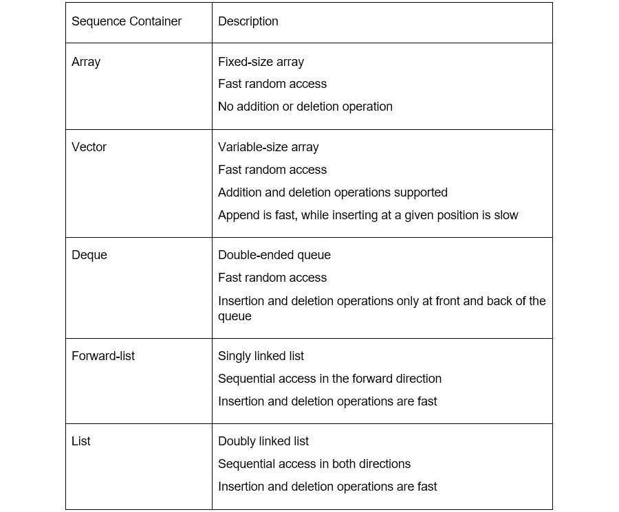

###### 图 5.1：展示序列容器类及其描述的表格

### 数组

数组容器是一个固定大小的连续元素数据结构。它使我们想起了在 *第一章*，*入门* 中看到的静态数组：


###### 图 5.2：数组元素存储在连续内存中

数组的大小需要在编译时指定。一旦定义，数组的大小*不能更改*。

当数组被创建时，它包含的`size`个元素在内存中相邻初始化。虽然不能添加或删除元素，但可以修改它们的值。

可以使用访问运算符和相应元素的索引随机访问数组。要访问给定位置的元素，我们可以使用运算符`[]`或`at()`成员函数。前者不执行任何范围检查，而后者如果索引超出范围，则抛出异常。此外，可以使用`front()`和`back()`成员函数访问第一个和最后一个元素。

这些操作很快：由于元素是连续的，我们可以根据数组中的位置计算出元素的内存位置，并直接访问它。

可以使用`size()`成员函数获取数组的大小。是否为空容器可以使用`empty()`函数检查，如果`size()`为零，则返回*true*。

数组类在`<array>`头文件中定义，在使用之前必须包含。

### 向量

向量容器是一个可以动态修改大小的连续元素数据结构：在创建时不需要指定其大小：


###### 图 5.3：向量元素是连续的，并且其大小可以动态增长

`vector`类在`<vector>`头文件中定义。

向量将包含的元素存储在内存的单个部分中。通常，这个内存部分有足够的空间来存储比向量中存储的元素数量更多的元素。当向向量中添加新元素时，如果内存部分中有足够的空间，则该元素将被添加到向量的最后一个元素之后。如果没有足够的空间，向量将获得一个新的、更大的内存部分，并将所有现有元素复制到新的内存部分中，然后删除旧的内存部分。对我们来说，这会给人一种内存部分大小增加的印象：

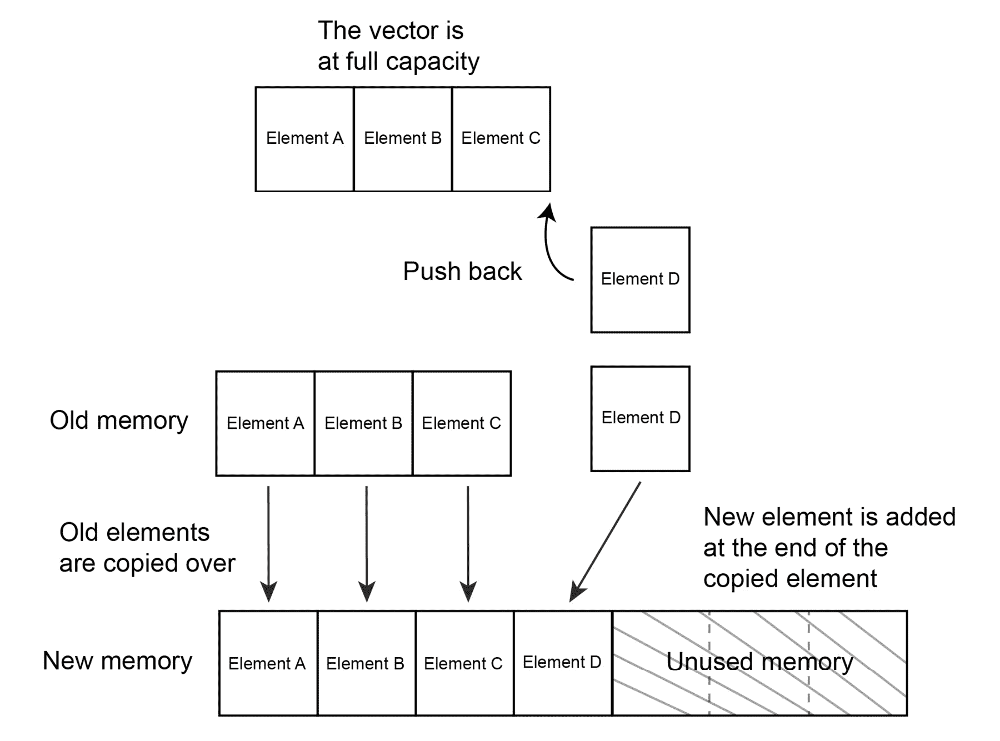

###### 图 5.4：向量的内存分配

当向量被创建时，它是空的。

大多数接口与数组类似，但有一些差异。

可以使用`push_back()`函数追加元素，或使用`insert()`函数在通用位置插入元素。可以使用`pop_back()`移除最后一个元素，或使用`erase()`函数在通用位置移除元素。

添加或删除最后一个元素是快速的，而插入或删除 vector 的其他元素被认为是慢的，因为这需要移动所有元素来为新元素腾出空间或保持所有元素连续：

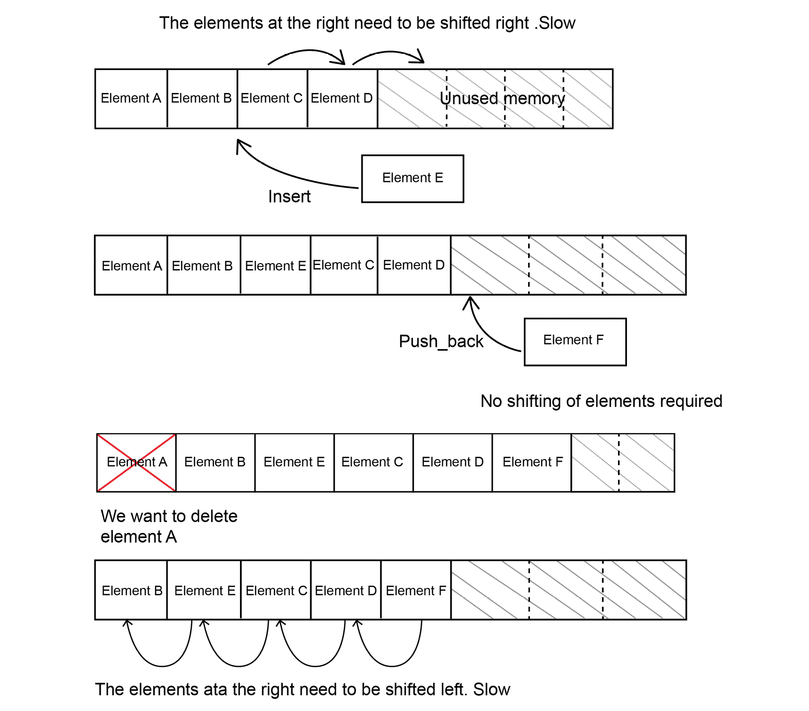

###### 图 5.5：在 vector 中插入或删除元素时正在移动的元素

向量，就像数组一样，允许高效地访问随机位置的元素。向量的大小也可以通过 `size()` 成员函数检索，但不应与 `capacity()` 混淆。前者是向量中实际元素的数量，后者返回当前内存区域可以插入的最大元素数量。

例如，在先前的图中，最初数组的大小为 4，容量为 8。因此，即使需要将元素移动到右侧，vector 的容量也不会改变，因为我们从未需要获取一个更大的内存区域来存储元素。

获取新内存区域的操作称为重新分配。由于重新分配被认为是一项昂贵的操作，因此可以通过使用 `reserve()` 成员函数扩大 vector 的容量来为给定数量的元素预留足够的内存。还可以使用 `shrink_to_fit()` 函数来减少 vector 的容量以适应元素数量，从而释放不再需要的内存。

#### 注意

向量是最常用的元素序列容器，并且在性能方面通常是最佳选择。

让我们通过以下示例来了解 C++ 中的 `vector::front()` 和 `vector::back()` 是如何工作的：

```cpp
#include <iostream>
#include <vector>
// Import the vector library
int main()
{
  std::vector<int> myvector;
  myvector.push_back(100);
  // Both front and back of vector contains a value 100
  myvector.push_back(10);
  // Now, the back of the vector holds 10 as a value, the front holds 100
  myvector.front() -= myvector.back();
  // We subtracted front value with back
std::cout << "Front of the vector: " << myvector.front() << std::endl;
std::cout << "Back of the vector: " << myvector.back() << std::endl;
}
Output:
Front of the vector: 90
Back of the vector: 10
```

### 双端队列

*deque* 容器（发音为 *deck*）代表“双端队列”。与 *vector* 类似，它允许快速直接访问 deque 元素，并在两端快速插入和删除。与 *vector* 不同，它还允许在 deque 的前端快速插入和删除：

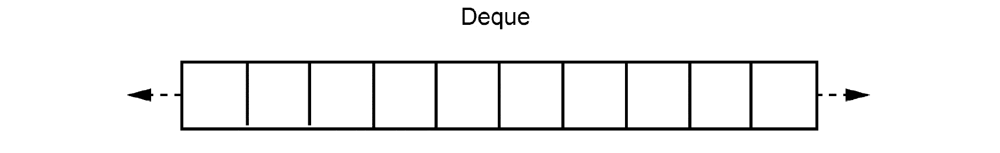

###### 图 5.6：双端队列元素可以在开始和结束处添加和删除

`deque` 类定义在 `<deque>` 头文件中。

*deque* 通常比 *vector* 需要更多的内存，而 *vector* 在访问元素和 `push_back` 操作方面性能更优，因此除非需要在前端插入，否则通常更倾向于使用 *vector*。

### 列表

列表容器是一种非相邻元素的数据结构，可以动态增长：


###### 图 5.7：列表元素存储在内存的不同部分，并且有连接的链接

`list` 类定义在 `<list>` 头文件中。

列表中的每个元素都有其内存段以及指向其前驱和后继的链接。包含元素的结构，即指向其前驱和后继的链接，称为 **节点**。

当在列表中插入元素时，需要更新前驱节点，以便其后继链接指向新元素。同样，后继节点也需要更新，以便其前驱链接指向新元素：

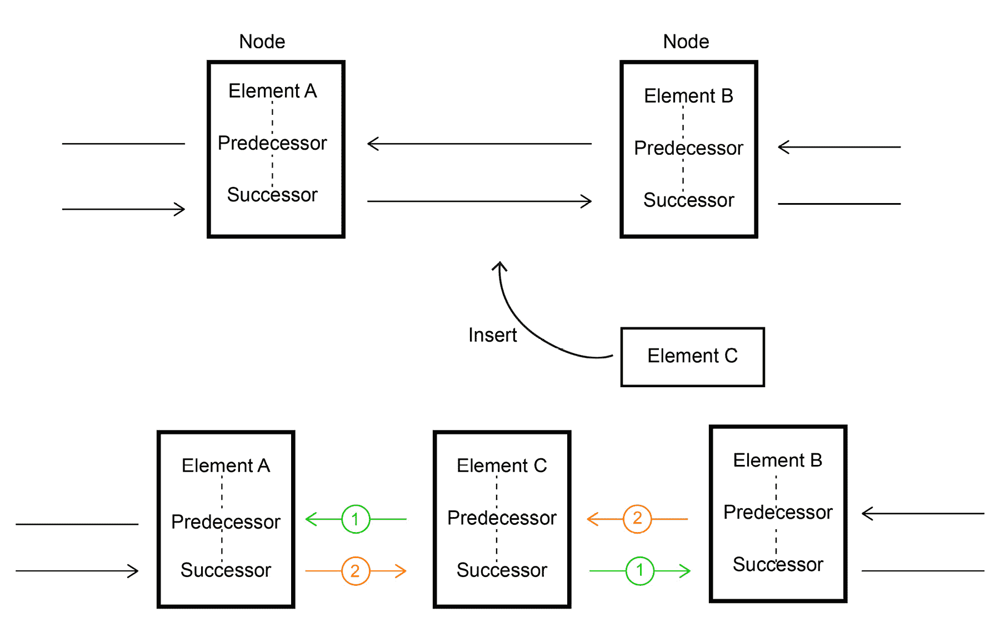

###### 图 5.8：C 应插入到 A 和 B 之间。A 的后继节点和 B 的前驱链接必须更新以指向 C（橙色）。C 的前驱和后继链接更新为指向 A 和 B（绿色）

当从列表中删除元素时，需要更新前驱节点的前驱链接，使其指向被删除节点的后继。同样，后继节点的前驱链接需要更新，使其指向被删除节点的前驱。

在前面的图中，如果我们删除 **C**，我们必须更新 **A** 的后继以指向 **C** 的后继（**B**），以及 **B** 的前驱以指向 **C** 的前驱（**A**）。

与向量不同，列表不提供随机访问。元素通过线性遍历元素链来访问：从第一个开始，我们可以跟随后继链接找到下一个节点，或者从最后一个节点开始，我们可以跟随前驱链接找到前一个节点，直到我们达到感兴趣的元素。

`list` 的优点是，如果我们已经知道想要插入或删除的节点，则插入和删除操作在任何位置都很快。缺点是到达特定节点较慢。

接口类似于向量，除了列表不提供 `operator[]`。

### 前向链表

`forward_list` 容器类似于列表容器，不同之处在于其节点只有指向后继的链接。因此，无法以反向顺序遍历 `forward_list`：


###### 图 5.9：前向链表元素类似于链表元素，但只有单向连接链接

如常，`forward_list` 类在 `<forward_list>` 头文件中定义。

`forward_list` 类甚至不提供 `push_back()` 或 `size()`。插入元素是通过 `insert_after()` 完成的，它是 `insert()` 函数的一种变体，其中新元素被插入到提供的位置之后。同样的原理也适用于元素删除，通过 `erase_after()` 完成删除，它删除提供的位置之后的元素。

### 向序列容器提供初始值

我们查看的所有序列容器在首次创建时都是空的。

当我们想要创建包含一些元素的容器时，对于每个元素重复调用`push_back()`或`insert()`函数可能会很繁琐。

幸运的是，所有容器在创建时都可以使用一系列元素进行初始化。

必须在花括号内提供序列，并且元素需要用逗号分隔。这被称为初始化列表：

```cpp
#include <vector>
int main()
{
    // initialize the vector with 3 numbers
    std::vector<int> numbers = {1, 2, 3};
}
```

这适用于本章中我们看到的任何容器。

### 活动第 19 项：存储用户账户

我们想要存储 10 个用户的账户余额，存储为`int`实例，初始值为 0。然后我们想要将第一个和最后一个用户的余额增加 100。

这些步骤将帮助您完成活动：

1.  包含`array`类的头文件。

1.  声明一个包含十个元素的整数数组。

1.  使用`for`循环初始化数组。使用`size()`运算符来评估数组的大小，以及使用`operator[]`来访问数组的每个位置。

1.  更新第一个和最后一个用户的值。

    #### 注意

    本活动的解决方案可以在第 304 页找到。

现在让我们使用 vector 来做同样的事情：

1.  包含**vector**头文件。

1.  声明一个整数类型的`vector`并预留内存以存储 100 个用户，并能够调整大小以容纳 10 个用户。

1.  使用 for 循环初始化 vector。

通过这个活动，我们学习了如何存储任意数量的账户。

## 关联容器

`operator<`，尽管用户可以提供一个`Functor`（函数对象）作为参数来指定元素应该如何比较。《<functional>`头文件包含许多这样的对象，可以用于排序关联容器，如`std::less`或`std::less`。

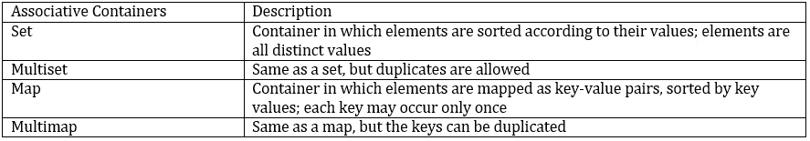

###### 图 5.10：展示关联容器及其描述的表格

通常，关联容器被实现为二叉树的变体，通过利用底层结构的对数复杂度提供快速的元素查找。

### Set 和 Multiset

**Set**是一个包含一组排序元素的容器。**Multiset**与*Set*类似，但它允许重复元素：

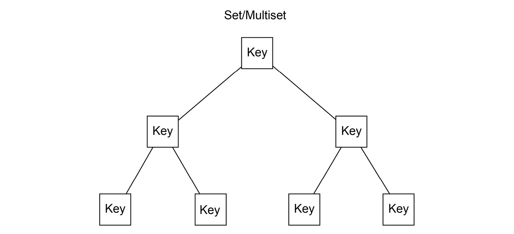

###### 图 5.11：Set 和 Multiset 存储一组排序后的元素

`set`和`multiset`有`size()`和`empty()`成员函数来检查包含了多少个元素以及是否包含任何元素。

插入和删除操作通过`insert()`和`erase()`函数完成。由于元素的顺序由*比较器*决定，它们不需要像顺序容器那样提供一个位置参数。插入和删除操作都很快速。

由于集合优化了元素查找，它们提供了特殊的搜索函数。`find()` 函数返回与提供的值相等的第一个元素的位置，如果找不到元素，则返回集合末尾之后的位置。当我们使用 `find` 查找元素时，我们应该始终将其与容器上调用 `end()` 的结果进行比较，以检查元素是否被找到。

让我们检查以下代码：

```cpp
#include <iostream>
#include <set>
int main() {
    std::set<int> numbers;
    numbers.insert(10);
    if (numbers.find(10) != numbers.end()) {
        std::cout << "10 is in numbers" << std::endl;
    }
}
```

最后，`count()` 返回与提供的值相等的元素数量。

`set` 和 `multiset` 类定义在 `<set>` 头文件中。

自定义比较器的集合示例：

```cpp
#include <iostream>
#include <set>
#include <functional>
int main() {
    std::set<int> ascending = {5,3,4,2,1};
    std::cout << "Ascending numbers:";
    for(int number : ascending) {
        std::cout << " " << number;
    }
    std::cout << std::endl;

    std::set<int, std::greater<int>> descending = {5,3,4,2,1};
    std::cout << "Descending numbers:";
    for(int number : descending) {
        std::cout << " " << number;
    }
    std::cout << std::endl;
}
```

输出：

递增数字：1 2 3 4 5

递减数字：5 4 3 2 1

### Map 和 Multimap

**Map** 和 **multimap** 是管理 **键/值** 对作为元素的容器。元素根据提供的比较器自动排序并应用于 *键*：*值* 不影响元素的顺序：

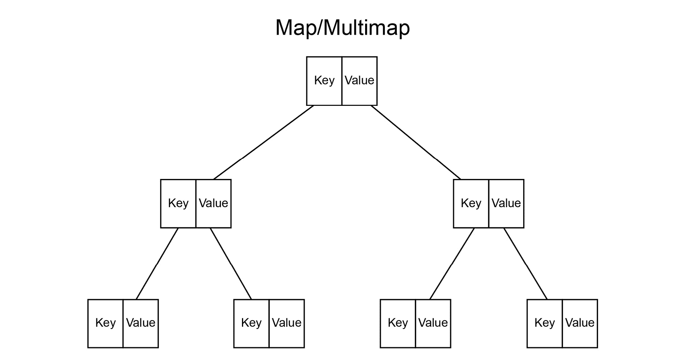

###### 图 5.12：Map 和 multimap 存储一组排序后的键，这些键与值相关联

Map 允许您将单个值与键关联，而 multimap 允许您将多个值与相同的键关联。

`map` 和 `multimap` 类定义在 `<map>` 头文件中。

要将值插入到映射中，我们可以调用 `insert()`，如果元素被插入，则提供 `true`，如果已存在具有相同键的元素，则提供 `false`。

一旦将值插入到映射中，就有几种方法可以在映射中查找键/值对。

与集合类似，map 提供了一个 `find()` 函数，该函数在映射中查找一个键，如果存在，则返回键/值对的位置，如果找不到元素，则返回调用 `end()` 的相同结果。

从位置，我们可以使用 `position->first` 访问键，使用 `position->second` 访问值：

```cpp
#include <iostream>
#include <string>
#include <map>
int main()
{
    std::map<int, std::string> map;
    map.insert(std::make_pair(1, "some text"));
    auto position = map.find(1);
    if (position != map.end() ) {
        std::cout << "Found! The key is " << position->first << ", the value is " << position->second << std::endl;
    }
}
```

从键访问值的一个替代方法是使用 `at()`，它接受一个键并返回关联的值。

如果没有关联的值，`at()` 将抛出异常。

获取与键关联的值的最后一个替代方法是使用 `operator[]`。

`operator[]` 返回与键关联的值，如果键不存在，则使用提供的键插入一个新的键/值对，并为值提供一个默认值。因为 `operator[]` 可能会通过插入来修改映射，所以它不能用于 `*const*` 映射：

```cpp
#include <iostream>
#include <map>
int main()
{
    std::map<int, int> map;
    std::cout << "We ask for a key which does not exists: it is default inserted: " << map[10] << std::endl;
    map.at(10) += 100;
    std::cout << "Now the value is present: " << map.find(10)->second << std::endl;
}
```

### 活动 20：从给定的用户名中检索用户的余额

我们希望能够快速检索给定用户名的用户余额。

为了快速从用户名中检索余额，我们使用用户名作为键，将余额存储在一个映射中。

用户名是 `std::string` 类型，而余额是 `int` 类型。为用户 `Alice`、`Bob` 和 `Charlie` 每人添加 50 的余额。然后，检查用户 `Donald` 是否有余额。

最后，打印 `Alice` 的账户余额：

1.  包含 `map` 类的头部文件和 `string` 的头部文件：

    ```cpp
    #include <string>
    #include <map>
    #include <string>
    ```

1.  创建一个键为 `std::string`，值为 `int` 的映射。

1.  使用 `insert` 和 `std::make_pair` 将用户的余额插入到映射中。第一个参数是 `key`，而第二个参数是 `value`：

    ```cpp
    balances.insert(std::make_pair("Alice",50));
    ```

1.  使用 `find` 函数，提供要查找的用户名以找到账户在映射中的位置。将其与 `end()` 进行比较以检查是否找到了位置。

1.  现在，查找爱丽丝的账户。我们知道爱丽丝有一个账户，因此没有必要检查我们是否找到了一个有效的位置。我们可以使用 `->second` 打印账户的值：

    ```cpp
    auto alicePosition = balances.find("Alice");
    std::cout << "Alice balance is: " << alicePosition->second << std::endl;
    ```

    #### 注意

    这个活动的解决方案可以在第 305 页找到。

## 无序容器

**无序关联容器**与关联容器不同，其元素没有定义的顺序。直观上，无序容器通常被想象成元素的袋子。因为元素没有排序，无序容器不接受比较器对象来为元素提供顺序。另一方面，所有无序容器都依赖于哈希函数。

用户可以将 `Functor`（函数对象）作为参数提供，以指定如何对键进行哈希：

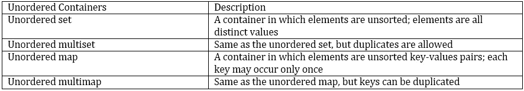

###### 图 5.13：展示无序容器及其描述的表

通常，无序容器被实现为 **哈希表**。数组的定位是通过哈希函数确定的，该函数给定一个值返回它应该存储的位置。理想情况下，大多数元素将被映射到不同的位置，但哈希函数可能会为不同的元素返回相同的位置。这被称为 *碰撞*。这个问题通过使用链表将映射到相同位置的元素链接起来来解决，这样就可以在同一个位置存储多个元素。因为可能在同一个位置有多个元素，所以这个位置通常被称为 **桶**。

使用哈希表实现无序容器允许我们在常数时间内找到具有特定值的元素，这比关联容器更快：

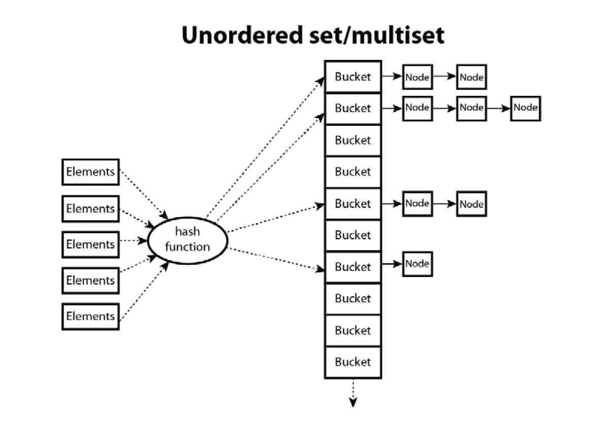

###### 图 5.14：当元素被添加到集合中时，计算其哈希值以决定元素应该添加到哪个桶中。桶内的元素存储为列表的节点。

当将键/值对添加到映射中时，计算键的哈希值以决定键/值对应该添加到哪个桶中：

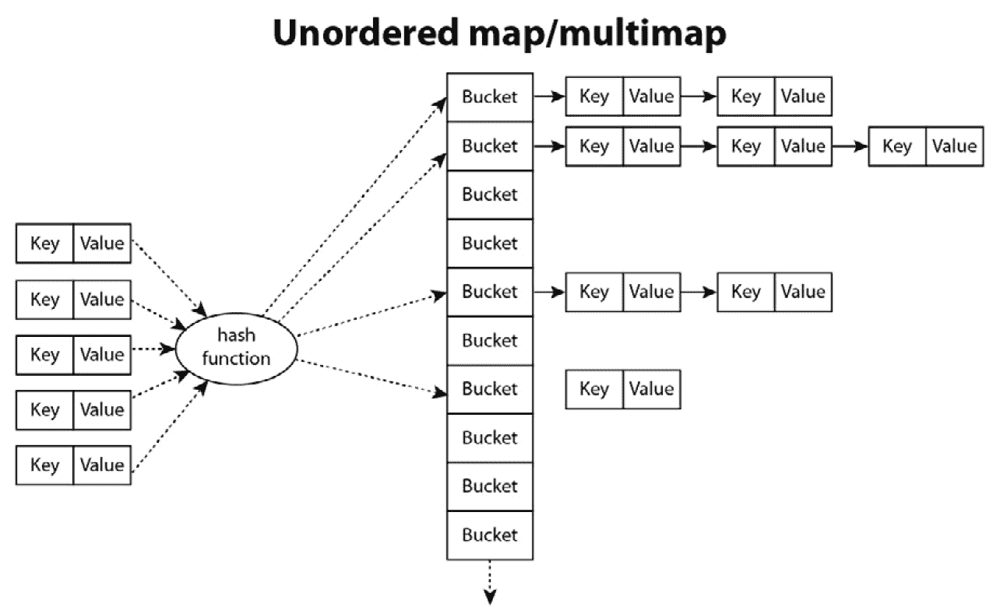

###### 图 5.15：从键计算元素桶的表示，并将键/值对作为列表中的节点存储。

无序关联容器和有序关联容器提供相同的功能，前一小节中的解释也适用于无序关联容器。无序关联容器可以在元素顺序不重要时提供更好的性能。

## 容器适配器

STL 库提供的附加容器类是容器适配器。容器适配器在我们在本章中查看的容器之上提供了受限的访问策略。

容器适配器有一个模板参数，用户可以提供以指定要包装的容器类型：

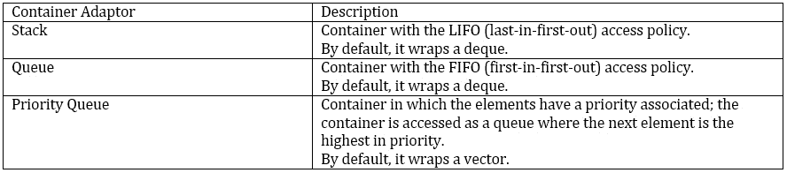

###### 图 5.16：展示容器适配器和其描述的表格

### 栈

栈容器实现了 LIFO 访问策略，其中元素虚拟地堆叠在彼此之上，使得最后插入的元素始终位于顶部。元素只能从顶部读取或移除，因此最后插入的元素是第一个被移除的。栈是通过内部使用序列容器类实现的，用于存储所有元素并模拟栈行为。

栈数据结构的访问模式主要通过三个核心成员函数：`push()`、`top()` 和 `pop()`。`push()` 函数用于将元素插入栈中，`top()` 用于访问栈顶元素，而 `pop()` 用于移除栈顶元素。

`stack` 类在 `<stack>` 头文件中定义。

### 队列

`queue` 类实现了 FIFO 访问策略，其中元素依次入队，因此先插入的元素位于后插入的元素之前。元素在队列末尾插入，在队列开头移除。

队列数据结构的接口由 `push()`、`front()`、`back()` 和 `pop()` 成员函数组成。

`push()` 函数用于将一个元素插入到 `queue()` 中；`front()` 和 `back()` 分别返回队列的下一个和最后一个元素；`pop()` 用于从队列中移除下一个元素。

`queue` 类在 `<queue>` 头文件中定义。

### 优先队列

最后，优先队列是一个根据元素的优先级进行访问的队列，按降序排列（优先级最高者先访问）。

接口类似于正常队列，其中 `push()` 插入新元素，`top()` 和 `pop()` 访问和移除下一个元素。不同之处在于确定下一个元素的方式。它不是第一个插入的元素，而是具有最高优先级的元素。

默认情况下，元素的优先级是通过比较元素与`operator<`来计算的，因此小于另一个元素的元素会跟在其后。可以提供一个用户定义的排序标准来指定如何根据优先级对队列中的元素进行排序。

优先队列类也在`<queue>`头文件中定义。

### 活动 21：按顺序处理用户注册

当用户注册到我们的网站时，我们需要在当天结束时处理注册表单。

我们希望按注册顺序的相反顺序处理注册：

1.  假设注册表单的类已经提供：

    ```cpp
    struct RegistrationForm {
        std::string userName;
    };
    ```

1.  创建一个`stack`来存储用户。

1.  我们希望在用户注册时存储用户注册表单，并在当天结束时处理注册。处理表单的函数已提供：

    ```cpp
    void processRegistration(RegistrationForm form) {
        std::cout << "Processing form for user: " << form.userName << std::endl;
    }
    ```

1.  此外，当用户注册时，已经有两个函数被调用。

1.  在以下两个函数中填写代码以存储用户表单并处理它：

    ```cpp
    void storeRegistrationForm(std::stack<RegistrationForm>& stack, RegistrationForm form) {
    }
    void endOfDayRegistrationProcessing(std::stack<RegistrationForm>& stack) {
    }
    ```

我们将看到，由于用户注册，注册表单是按注册顺序的相反顺序处理的。

#### 注意

此活动的解决方案可以在第 306 页找到。

## 非常规容器

到目前为止，我们看到了用于存储相同类型元素组的容器。

C++标准定义了一些其他类型，可以包含类型，但它们提供的功能集与之前看到的容器不同。

这些类型如下：

1.  字符串

1.  对和元组

1.  可选

1.  变体

### 字符串

字符串是一种用于操作连续字符的可变序列的数据结构。C++字符串类是 STL 容器：它们的行为类似于*向量*，但提供了额外的功能，使程序员能够轻松地执行字符序列的常见操作。

标准库中存在几种字符串实现，适用于不同长度的字符集，例如`string`、`wstring`、`u16string`和`u32string`。所有这些都是`basic_string`基类的特化，并且它们都具有相同的接口。

最常用的类型是`std::string`。

所有字符串类型和函数都在`<string>`头文件中定义。

字符串可以被转换为*空终止字符串*，这是一个以特殊空字符（用`'\0'`表示）终止的字符数组，通过使用`data()`或`c_str()`函数实现。空终止字符串，也称为*C-字符串*，是在 C 语言中表示字符序列的方式，它们在程序需要与 C 库交互时经常被使用；它们以`const char *`类型表示，并且是我们程序中*字面字符串*的类型。

### 练习 12：演示`c_str()`函数的工作机制

让我们检查以下代码以了解`c_str()`函数的工作原理：

1.  首先按照以下示例包含所需的头文件：

    ```cpp
    #include <iostream>
    #include <string>
    ```

1.  现在，在 `main` 函数中添加一个名为 `charString` 的常量字符变量，其容量为 `8` 个字符：

    ```cpp
    int main()
    {
      // Construct a C-string being explicit about the null terminator
      const char charString[8] = {'C', '+', '+', ' ', '1', '0', '1', '\0'};
      // Construct a C-string from a literal string. The compiler automatically adds the \0 at the end
      const char * literalString = "C++ Fundamentals";
      // Strings can be constructed from literal strings.
      std::string strString = literalString;
    ```

1.  使用 `c_str()` 函数并将 `strString` 的值赋给 `charString2`：

    ```cpp
      const char *charString2 = strString.c_str();
    ```

1.  使用打印函数打印 `charString` 和 `charString2`：

    ```cpp
      std::cout << charString << std::endl;
      std::cout << charString2 << std::endl;
    }
    ```

    输出如下：

    ```cpp
    Output:
    C++ 101
    C++ Fundamentals
    ```

对于向量而言，字符串有 `size()`、`empty()` 和 `capacity()` 成员函数，但还有一个额外的函数称为 `length()`，它只是 `size()` 的别名。

可以使用 `operator[]` 或 `at()`、`front()` 和 `back()` 成员函数逐字符访问字符串：

```cpp
std::string chapter = "We are learning about strings";
std::cout << "Length: " << chapter.length() << ", the second character is " << chapter[1] << std::endl;
```

字符串提供了通常的比较运算符，从而简化了两个字符串对象之间的比较方式。

由于字符串类似于向量，我们可以向它们添加和删除字符。

可以通过分配一个空字符串、调用 `clear()` 或 `erase()` 函数来使字符串为空。

让我们看看以下代码，以了解 `clear()` 和 `erase()` 函数的用法：

```cpp
#include <iostream>
#include <string>
int main()
{
  std::string str = "C++ Fundamentals.";
  std::cout << str << std::endl;
  str.erase(5,10);
  std::cout << "Erased: " << str << std::endl;
  str.clear();
  std::cout << "Cleared: " << str << std::endl;
}
Output:
C++ Fundamentals.
Erased: C++ Fs.
Cleared: 
```

C++ 还提供了许多便利函数，可以将字符串转换为数值或将数值转换为字符串。例如，`stoi()` 和 `stod()` 函数（分别代表 *string-to-int* 和 *string-to-double*）用于将 `string` 转换为 `int` 和 `double`，相反，要将值转换为字符串，可以使用重载函数 `to_string()`。

让我们使用以下代码来揭示这些函数的神秘之处：

```cpp
#include <iostream>
#include <string>
using namespace std;
int main()
{
  std::string str = "55";
  std::int strInt = std::stoi(str);
  double strDou = std::stod(str);
  std::string valToString = std::to_string(strInt);

  std::cout << str << std::endl;
  std::cout << strInt << std::endl;
  std::cout << strDou << std::endl;
  std::cout << valToString << std::endl;
}
Output:
55
55
55
55
```

### 对象对和元组

**pair** 和 **tuple** 类在某种程度上是相似的，因为它们可以存储异构元素集合。

**pair** 类可以存储两种类型的值，而 **tuple** 类扩展了这个概念，使其可以存储任意长度的值。

对象对（Pair）定义在 `<utility>` 头文件中，而元组（tuple）定义在 `<tuple>` 头文件中。

对象对构造函数接受两个模板参数，用于指定第一个和第二个值的类型。这些元素可以直接使用 `first` 和 `second` 数据访问。等效地，这些成员也可以通过 `get<0>()` 和 `get<1>()` 函数访问。

便利函数 `make_pair()` 用于创建一个值对，无需显式指定类型：

```cpp
std::pair<std::string, int> nameAndAge = std::make_pair("John", 32);
std::cout << "Name: " << nameAndAge.first << ", age: " << nameAndAge.second << std::endl;
```

第二行等同于以下一行：

```cpp
std::cout << "Name: " << std::get<0>(nameAndAge) << ", age: " << std::get<1>(nameAndAge) << std::endl;
```

对象对（Pairs）被无序映射（unordered map）、无序多重映射（unordered multimap）、映射（map）和多重映射（multimap）容器用来管理它们的键/值元素。

元组与对象对类似。构造函数允许你提供可变数量的模板参数。元素只能通过 `get<N>()` 函数访问，该函数返回元组内的第 n 个元素，并且有一个类似于对象对的便利函数来创建它们，名为 `make_tuple()`。

此外，元组还有一个用于从它们中提取值的便利函数。`tie()` 函数允许创建一个引用元组，这在将元组中的选定元素赋给特定变量时很有用。

让我们了解如何使用`make_tuple()`和`get()`函数从元组中检索数据：

```cpp
#include <iostream>
#include <tuple>
#include <string>
int main()
{
  std::tuple<std::string, int, float> james = std::make_tuple("James", 7, 1.90f);
  std::cout << "Name: " << std::get<0>(james) << ". Agent number: " << std::get<1>(james) << ". Height: " << std::get<2>(james) << std::endl;
}
Output:
Name: James. Agent number: 7\. Height: 1.9
```

## `std::optional`

`optional<T>`是一个用于包含可能存在或不存在值的模板。

该类接受一个模板参数`T`，它表示`std::optional`模板类可能包含的类型。值类型表示类的实例包含值。复制`optional`将创建包含数据的新的副本。

在程序执行的任何时刻，`optional<T>`要么为空，要么包含类型为`T`的值。

`Optional`定义在`<optional>`头文件中。

让我们假设我们的应用程序正在使用名为`User`的类来管理注册用户。我们希望有一个函数可以从用户的电子邮件中获取用户信息：`User getUserByEmail(Email email);`。

但当用户未注册时会发生什么？也就是说，当我们确定我们的系统没有关联的`User`实例时？

有些人会建议抛出异常。在 C++中，异常用于*异常*情况，这些情况几乎永远不会发生。用户未在我们的网站上注册是一个完全正常的情况。

在这些情况下，我们可以使用`optional`模板类来表示我们可能没有数据的事实：

```cpp
std::optional<User> tryGetUserByEmail(Email email);
```

`optional`模板类提供了两种简单的方法来处理：

+   `has_value()`: 如果`optional`当前持有值，则返回`true`，如果变体为空，则返回`false`。

+   `value()`: 此函数返回`optional`当前持有的值，如果不存在则抛出异常。

+   此外，`optional`可以用作`if`语句中的条件：如果它包含值，则评估为`true`，否则为`false`。

让我们通过以下示例来了解`has_value()`和`value()`函数是如何工作的：

```cpp
#include <iostream>
#include <optional>
int main()
{
  // We might not know the hour. But if we know it, it's an integer
  std::optional<int> currentHour;
  if (not currentHour.has_value()) {
    std::cout << "We don't know the time" << std::endl;   
  }
  currentHour = 18;
  if (currentHour) {
    std::cout << "Current hour is: " << currentHour.value() << std::endl;
  }
}
Output:
We don't know the time
Current hour is: 18
```

`optional`模板类附带了一些额外的便利特性。我们可以将`std::nullopt`值赋给`optional`，以便在需要使其为空时明确表示，并且可以使用`make_optional`值从值创建一个可选对象。此外，我们可以使用解引用运算符`*`来访问`optional`的值，而无需抛出异常，如果值不存在。在这种情况下，我们将访问无效数据，因此我们需要确保在使用`*`时`optional`包含一个值：

```cpp
std::optional<std::string> maybeUser = std::nullopt;
if (not maybeUser) {
  std::cout << "The user is not present" << std::endl;
}
maybeUser = std::make_optional<std::string>("email@example.com");
if (maybeUser) {
  std::cout << "The user is: " << *maybeUser  << std::endl;
}
```

另一个方便的方法是`value_or(defaultValue)`。此函数接受一个默认值，如果`optional`当前持有值，则返回`optional`包含的值，否则返回默认值。让我们探索以下示例：

```cpp
#include <iostream>
#include <optional>
int main()
{
  std::optional<int> x;
  std::cout << x.value_or(10) << std::endl;
  //Will return value of x as 10
  x = 15;
  std::cout << x.value_or(10)<< std::endl;
  //Will return value of x as 15
}
Output:
10
15
```

除了返回值外，`optional`在作为参数接受时也很有用，可以表示可能存在或不存在的数据。

让我们回顾一下由电子邮件地址、电话号码和物理地址组成的 `User` 类。有时，用户没有电话号码，也不希望提供物理地址，因此 `User` 中唯一必需的字段是电子邮件地址：

```cpp
User::User(Email email, std::optional<PhoneNumber> phoneNumber = std::nullopt, std::optional<Address> address = std::nullopt){
...
}
```

此构造函数允许我们传入我们拥有的所有用户信息。如果我们不使用 `optional`，而是使用多个重载，我们将有四个重载：

1.  仅电子邮件

1.  电子邮件和电话号码

1.  电子邮件和地址

1.  电子邮件、电话号码和地址

你可以看到，当有更多我们可能不想传递的参数时，重载的数量会迅速增加。

## std::variant

`variant` 是一个用于表示 *类型选择* 的值类型。该类接受一个类型列表，并且 `variant` 将能够包含这些类型中的任何一个值。

它通常被称为 **标签联合体**，因为与联合体类似，它可以存储多个类型，但一次只有一个。它还跟踪当前存储的是哪种类型。

在程序执行过程中，`variant` 将一次只包含可能类型中的一个。

与 `optional` 类似，`variant` 是一个值类型：当我们创建 `variant` 的副本时，当前存储的元素将被复制到新的 `variant` 中。

要与 `std::variant` 交互，C++ 标准库为我们提供了两个主要函数：

+   `holds_alternative<Type>(variant)`: 如果 `variant` 当前持有提供的类型，则返回 `true`，否则返回 `false`。

+   `get(variant)`: 有两种版本：`get<Type>(variant)` 和 `get<Index>(variant)`。

`get<Type>(variant)` 获取 `variant` 内当前存储的类型值。在调用此函数之前，调用者需要确保 `holds_alternative<Type>(variant)` 返回 `true`。

`get<Index>(variant)` 获取 `variant` 内当前存储的索引类型值。像之前一样，调用者需要确保 `variant` 持有正确的类型。

例如，对于 `std::variant<string, float> variant`，调用 `get<0>(variant)` 将给出 `string` 值，但我们需要确保 `variant` 当前存储的是字符串。通常，最好使用 `get<Type>()` 来访问元素，这样我们可以明确地指出我们期望的类型，并且如果 `variant` 中类型的顺序发生变化，我们仍然会得到相同的结果：

### 练习 13：在程序中使用 Variant

让我们执行以下步骤来了解如何在程序中使用 `variant`：

1.  包含所需的头文件：

    ```cpp
    #include <iostream>
    #include <variant>
    ```

1.  在主函数中，添加具有字符串和整数值类型的 `variant`：

    ```cpp
    int main()
    {
      std::variant<std::string, int> variant = 42;
    ```

1.  现在通过两个打印语句以不同的方式调用 `variant`：

    ```cpp
      std::cout << get<1>(variant) << std::endl;
      std::cout << get<int>(variant) << std::endl;
    ```

输出如下：

```cpp
Output:
42
42
```

获取`variant`内容的一种替代方法是使用`std::visit(visitor, variant)`，它接受`variant`和一个可调用对象。可调用对象需要支持`operator()`的重载，该重载接受`variant`内部可能存储的每种类型的类型。然后，`visit`将确保调用接受`variant`内部当前存储类型的函数：

### 练习 14：访问者变体

让我们执行以下步骤来了解如何在程序中使用`std::visit(visitor, variant)`：

1.  在程序开始处添加以下头文件：

    ```cpp
    #include <iostream>
    #include <string>
    #include <variant>
    ```

1.  现在，添加如所示的结构体`Visitor`：

    ```cpp
    struct Visitor {
        void operator()(const std::string& value){
            std::cout << "a string: " << value << std::endl;
        }
        void operator()(const int& value){
            std::cout << "an int: " << value << std::endl;
        }
    };
    ```

1.  现在，在主函数中，调用结构体`Visitor`并按如下所示传递值：

    ```cpp
    int main()
    {
        std::variant<std::string, int> variant = 42;
        Visitor visitor;
        std::cout << "The variant contains ";
        std::visit(visitor, variant);
        variant = std::string("Hello world");
        std::cout << "The variant contains ";
        std::visit(visitor, variant);
    }
    ```

输出如下：

```cpp
The variant contains an int: 42
The variant contains a string: Hello world
```

当我们想要表示一组不同类型的数据时，`variant`非常有用。以下是一些典型示例：

+   根据程序当前状态返回不同类型的函数

+   表示多个状态的一个类

让我们想象我们之前描述的`std::optional<User> tryGetUserByEmail()`函数。

多亏了`optional`，我们现在可以以清晰的方式编写函数，表明有时我们可能不会检索到用户。如果用户未注册，我们可能会询问他们是否想要注册。

让我们想象我们有一个`struct UserRegistrationForm`，它包含让用户注册所需的信息。

我们的功能现在可以返回`std::variant<User, UserRegistrationForm> tryGetUserByEmail()`。当用户已注册时，我们返回`User`，但如果用户未注册，我们可以返回注册表单。

此外，当出现错误时，我们应该怎么做？使用`variant`，我们可以有`struct GetUserError`存储所有信息，以便我们的应用程序能够从错误中恢复并添加到返回类型：`std::variant<User, UserRegistrationForm, GetUserError>`或`tryGetUserByEmail()`。

现在，我们只需查看函数签名，就可以看到调用`getUserByEmail()`时将要发生的事情的完整情况，编译器将帮助我们确保处理所有情况。

或者，`variant`也可以用来表示一个类可能处于的各种状态。每个状态包含该状态所需的数据，而类只管理从一个状态到另一个状态的转换。

### 活动 22：机场系统管理

让我们编写一个程序来创建机场系统管理：

1.  我们想在机场系统中表示飞机的状态。飞机可以在三种状态中：`at_gate`、`taxi`或`flying`。三种状态存储不同的信息。

1.  使用`at_gate`，飞机存储其所在的登机口编号。使用`taxi`，我们存储分配给飞机的航站楼车道以及机上的乘客数量。使用`flying`，我们存储速度：

    ```cpp
    struct AtGate {
        int gate;
    };
    struct Taxi {
        int lane;
        int numPassengers;
    };
    struct Flying {
        float speed;
    };
    ```

1.  飞机应该有三个方法：

    +   `startTaxi()`: 此方法接受飞机应行驶的航向和机上的乘客数量。飞机只有在位于登机口时才能开始滑行。

    +   `takeOff()`: 此方法接受飞机应飞行的速度。飞机只有在处于滑行状态时才能开始飞行。

    +   `currentStatus()`: 此方法打印飞机的当前状态。

        #### 注意

        此活动的解决方案可以在第 306 页找到。

## 迭代器

在本章中，我们多次提到元素在容器中有一个位置：例如，我们说我们可以在列表的特定位置插入一个元素。

迭代器是表示容器中元素位置的方式。

它们提供了一种一致的方式来操作容器中的元素，抽象出元素所属容器的细节。

迭代器始终属于一个范围。表示范围开始的迭代器可以通过`begin()`函数访问，而表示范围结束的迭代器（非包含），可以通过`end()`函数获得。第一个元素包含但最后一个元素排除的范围被称为半开区间。

迭代器必须提供接口由四个函数组成：

1.  `*`运算符提供了访问迭代器当前引用位置的元素的方法。

1.  `++`运算符用于向前移动到下一个元素。

1.  然后，使用`==`运算符来比较两个迭代器，以检查它们是否指向相同的位置。

    注意，只有当两个迭代器属于同一范围时，它们才能进行比较：它们必须代表同一容器中元素的位置。

1.  最后，使用`=`运算符来分配迭代器。

在 C++中，每个容器类都必须指定它提供的迭代器类型，作为名为`iterator`的成员类型别名。例如，对于整数向量，类型将是`std::vector<int>::iterator`。

让我们看看我们如何可以使用迭代器遍历容器（在这种情况下是向量）的所有元素：

```cpp
#include <iostream>
#include <vector>
int main()
{
    std::vector<int> numbers = {1, 2, 3};
    for(std::vector<int>::iterator it = numbers.begin(); it != numbers.end(); ++it) {
        std::cout << "The number is: " << *it << std::endl;    
    }
}
```

对于这样的操作，这看起来很复杂，我们在*第一章，入门*中看到了我们如何使用*基于范围的 for 循环*：

```cpp
for(int number: numbers) {
    std::cout << "The number is: " << number << std::endl;    
}
```

基于范围的 for 循环之所以能够工作，是因为迭代器：编译器将我们的*基于范围的 for 循环*重写为看起来像我们使用迭代器编写的那样。这使得*基于范围的 for 循环*可以与任何提供`begin()`和`end()`函数并返回迭代器的类型一起工作。

迭代器提供的操作符的实现方式取决于迭代器操作的容器。

迭代器可以分为四类。每一类都是基于前一类构建的，从而提供额外的功能：

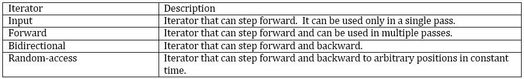

###### 图 5.17：展示迭代器和其描述的表格

以下图表提供了关于 C++迭代器的更多详细信息：

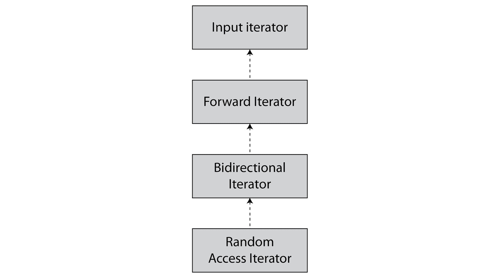

###### 图 5.18：C++ 中迭代器层次结构的表示

让我们更详细地了解这些迭代器：

+   使用 `==` 和 `!=` 运算符来检查迭代器是否等于 `end()` 值。

    通常，输入迭代器用于从元素流中访问元素，其中整个序列没有存储在内存中，但我们一次获取一个元素。

+   **前向迭代器**与输入迭代器非常相似，但提供了额外的保证。

    同一个迭代器可以被多次解引用以访问它指向的元素。

    此外，当我们递增或解引用前向迭代器时，其他副本不会被无效化：如果我们复制了一个前向迭代器，我们可以前进第一个，第二个仍然可以用来访问前一个元素。

    指向相同元素的两个迭代器保证是相等的。

+   `operator--`（位置减量）成员函数。

+   使用 `operator[]` 成员函数来访问泛型索引处的元素，以及使用二进制 `operator+` 和 `operator-` 来前进和后退任何数量。

### 练习 15：探索迭代器

执行以下步骤来探索上一节中讨论的四个类别，并将值写入它指向的元素，它也是一个输出迭代器：

1.  在程序开始处添加以下头文件：

    ```cpp
    #include <iostream>
    #include <vector>
    ```

1.  在主函数中声明名为 number 的向量：

    ```cpp
    int main()
    {
        std::vector<int> numbers = {1, 2, 3, 4, 5};
        auto it = numbers.begin();
    ```

1.  执行如图所示的各项算术运算：

    ```cpp
        std::cout << *it << std::endl; // dereference: points to 1
        it++; // increment: now it points to 2
        std::cout << *it << std::endl;
        // random access: access the 2th element after the current one
        std::cout << it[2] << std::endl;
        --it; // decrement: now it points to 1 again
        std::cout << *it << std::endl;
        it += 4; // advance the iterator by 4 positions: now it points to 5
        std::cout << *it << std::endl;
        it++; // advance past the last element;
        std::cout << "'it' is after the past element: " << (it == numbers.end()) << std::endl;
    }
    ```

输出如下：

```cpp
1
2
4
1
5
'it' is after the past element: 1
```

我们将要讨论的许多迭代器都定义在 `<iterator>` 头文件中。

### 反向迭代器

有时候，我们需要以相反的顺序遍历元素集合。

C++ 提供了一个迭代器，允许我们这样做：*反向迭代器*。

一个 *反向迭代器* 包装一个 *双向迭代器*，并交换增量操作与减量操作，反之亦然。

由于这个原因，当我们正向迭代反向迭代器时，我们是在反向顺序访问范围内的元素。

我们可以通过在容器上调用以下方法来反转容器的范围：

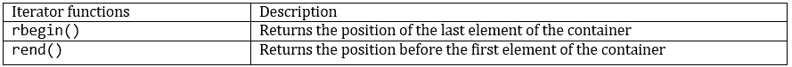

###### 图 5.19：表示迭代器函数及其描述的表格

在正常迭代器上工作的代码，也可以与反向迭代器一起工作。

例如，我们可以看到代码如何与反向顺序迭代相似。

### 练习 16：探索反向迭代器的功能

让我们执行以下步骤来了解反向迭代器中函数的工作方式：

1.  在程序开始处添加以下头文件：

    ```cpp
    #include <iostream>
    #include <vector>
    ```

1.  在主函数中，如图所示添加名为 numbers 的向量：

    ```cpp
    int main()
    {
        std::vector<int> numbers = {1, 2, 3, 4, 5};
    ```

1.  现在如图所示遍历 number 向量：

    ```cpp
        for(auto rit = numbers.rbegin(); rit != numbers.rend(); ++rit) {
            std::cout << "The number is: " << *rit << std::endl;    
        }
    }
    ```

输出如下：

```cpp
The number is: 5
The number is: 4
The number is: 3
The number is: 2
The number is: 1
```

### 插入迭代器

**插入迭代器**，也称为**插入器**，用于将新值插入到容器中而不是覆盖它们。

存在三种类型的插入器，它们在容器中插入元素的位置上有所不同。

下表总结了不同的类别：

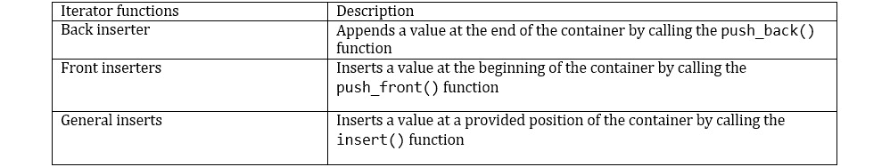

###### 图 5.20：表示迭代器函数及其描述的表格

一些算法，我们将在本章后面看到，需要迭代器来存储数据。插入迭代器通常与这些算法一起使用。

### 流迭代器

`Stream iterators` 允许我们将流用作读取元素的源或写入元素的目的地：

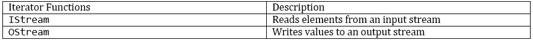

###### 图 5.21：表示迭代器函数及其描述的表格

由于在这种情况下我们没有容器，我们无法调用 `end()` 方法来获取 `end` 迭代器。默认构造的流迭代器被视为任何流范围的末尾。

让我们看看一个从标准输入读取空格分隔整数的程序。

### 练习 17：流迭代器

让我们执行以下步骤来了解反向流函数的工作原理：

1.  添加如图所示的所需头文件：

    ```cpp
    #include <iostream>
    #include <iterator>
    ```

1.  现在，在主函数中，添加如图所示的 istream 迭代器：

    ```cpp
    int main()
    {
        std::istream_iterator<int> it = std::istream_iterator<int>(std::cin);
        std::istream_iterator<int> end;
        for(; it != end; ++it) {
            std::cout << "The number is: " << *it << std::endl;
        }
    }
    ```

输出如下（输入：10）：

```cpp
The number is: 10
```

### 迭代器无效化

正如我们所说的，迭代器表示容器中元素的位置。

这意味着它们与容器紧密相关，对容器的更改可能会移动元素：这意味着指向此类元素的迭代器将无法再使用——它们被**无效化**了。

在使用容器和迭代器时，始终检查无效化合同非常重要，因为未指定使用无效迭代器时会发生什么。更常见的是，访问无效数据或程序崩溃，导致难以找到的 bug。

如果我们记住容器是如何实现的，就像我们在本章前面看到的，我们就可以更容易地记住何时迭代器被无效化。

例如，我们说过，当我们向向量中插入一个元素时，我们可能需要更多的内存来存储该元素，在这种情况下，所有前面的元素都需要移动到新获得的内存中。这意味着所有指向元素的迭代器现在都指向了元素的老位置：它们被无效化了。

另一方面，我们看到了当我们向列表中插入一个元素时，我们只需要更新前驱和后继节点，但元素本身并不移动。这意味着指向元素的迭代器仍然有效：

```cpp
#include <iostream>
#include <vector>
#include <list>
int main()
{
    std::vector<int> vector = {1};
    auto first_in_vec = vector.begin();
    std::cout << "Before vector insert: " << *first_in_vec << std::endl;
    vector.push_back(2);
    // first_number is invalidated! We can no longer use it!
    std::list<int> list = {1};
    auto first_in_list = list.begin();
    list.push_back(2);
    // first_in_list is not invalidated, we can use it.
    std::cout << "After list insert: " << *first_in_list << std::endl;
}
Output:
Before vector insert: 1
After list insert: 1
```

当需要存储指向元素的迭代器时，在决定使用哪个容器时，迭代器无效化是一个重要的考虑因素。

### 练习 18：打印所有客户的余额

我们希望打印我们应用程序中所有客户的余额。余额已经以整数的形式存储在向量中。

我们想使用迭代器遍历余额向量。按照以下步骤进行：

1.  初始时，我们包含`vector`类的头文件，并声明一个包含 10 个`int`类型元素的向量：

    ```cpp
    #include <vector>
    std::vector<int> balances = {10, 34, 64, 97, 56, 43, 50, 89, 32, 5};
    ```

1.  `for`循环已被修改为使用向量的迭代器迭代，从`begin()`返回的位置开始，直到它达到`end()`返回的位置：

    ```cpp
    for (auto pos = numbers.begin(); pos != numbers.end(); ++pos)
    {
        // to be filled
    }
    ```

1.  使用迭代器的解引用运算符（`*`）访问数组元素：

    ```cpp
    for (auto pos = numbers.begin(); pos != numbers.end(); ++pos)
    {
        std::cout << "Balance: " << *pos << std::endl;
    }
    ```

## C++标准模板库提供的算法

算法是以抽象方式操作容器的一种方式。

C++标准库为可以在元素范围上执行的所有常见操作提供了一组广泛的算法。

因为算法接受迭代器，所以它们可以操作任何容器，甚至是用户定义的容器，只要它们提供迭代器。

这允许我们拥有大量算法，这些算法可以与大量容器一起工作，而无需算法知道容器是如何实现的。

以下是一些由 STL 提供的最重要和最常用的算法。

#### 注意

算法操作范围，因此它们通常接受一对迭代器：*first*和*last*。

正如我们在本章前面所说的，*last*迭代器表示范围结束之后的元素——它不是范围的一部分。

这意味着当我们想要操作一个完整的容器时，我们可以将`begin()`和`end()`作为参数传递给算法，但如果我们想要操作一个较短的序列，我们必须确保我们的最后一个迭代器已经超过了我们想要包含在范围内的最后一个项目。

### Lambda

大多数算法接受一个一元或二元谓词：一个`Functor`（函数对象），它接受一个或两个参数。这些谓词允许用户指定算法所需的一些操作。这些操作因算法而异。

正如我们在*第三章，类*的结尾所看到的，要编写一个函数对象，我们必须创建一个类并重载`operator()`。

这可能非常冗长，尤其是当函数对象应该执行简单操作时。

为了用 C++克服这个问题，用户必须编写一个**lambda 表达式**，也称为*lambda*。

一个*lambda 表达式*创建了一个特殊的函数对象，其类型只有编译器知道，它表现得像一个函数，但可以访问它创建的作用域中的变量。

它使用与函数非常相似的语法定义：

```cpp
[captured variables] (arguments) { body }
```

这创建了一个新对象，当使用 lambda 表达式中指定的参数调用时，执行函数体。

*参数*是函数接受的参数列表，*主体*是当函数被调用时要执行的语句序列。它们与函数具有相同的含义，并且适用于函数的相同规则我们在*第二章，函数*中看到。

例如，让我们创建一个接受两个整数并返回它们的和的 lambda：

```cpp
#include <iostream>
int main()
{
    auto sum_numbers = [] (int a, int b) { return a + b; };
    std::cout << sum_numbers(10, 20) << std::endl;
}
Output:
30
```

默认情况下，lambda 函数体的作用域只能引用在参数列表和函数体内部定义的变量，就像函数一样。

此外，*lambda*可以捕获局部作用域中的变量，并在其函数体中使用它。

*捕获的变量*包含可以在 lambda 函数体中引用的变量名列表。

当一个变量被捕获时，它被存储在创建的函数对象内部，并且可以在函数体中引用。

默认情况下，变量是通过值捕获的，因此它们被复制到函数对象内部：

```cpp
#include <iostream>
int main()
{
    int addend = 1;
    auto sum_numbers = addend { return addend + b; };
    addend = 2;
    std::cout << sum_numbers(3) << std::endl;
}
Output:
4
```

当我们创建 lambda 时，我们通过值捕获了`addend`：它被复制到`sum_numbers`对象中。即使我们修改了`addend`的值，我们也没有改变存储在`sum_numbers`内部的副本，所以当`sum_numbers`执行时，它将 1 加到`b`上。

在某些情况下，我们希望能够在创建 lambda 的作用域中修改变量的值，或者我们希望访问实际的值，而不是 lambda 创建时变量的值。

在那种情况下，我们可以通过在变量名前加上`&`来通过引用捕获。

#### 注意

当我们通过引用捕获时，我们需要确保在 lambda 被调用时，被引用捕获的变量仍然有效，否则函数体的作用域访问了一个无效的对象，导致错误。如果可能，最好通过值捕获。

让我们看看一个例子：

```cpp
#include <iostream>
int main()
{
    int multiplier = 1;
    auto multiply_numbers = &multiplier { return multiplier * b; };
    multiplier = 2;
    std::cout << multiply_numbers(3) << std::endl;
}
Output:
6
```

这里，我们通过引用捕获了`multiplier`变量：只有它的引用被存储到`multiply_numbers`中。

当我们调用`multiply_numbers`时，函数体访问`multiplier`的当前值，由于`multiplier`被改为 2，这就是*lambda*使用的值。

lambda 可以捕获多个变量，每个变量可以是独立于其他变量的值捕获或引用捕获。

### 只读算法

只读算法是检查容器内存储的元素但不修改容器元素顺序的算法。

以下是最常见的检查范围元素的操作：

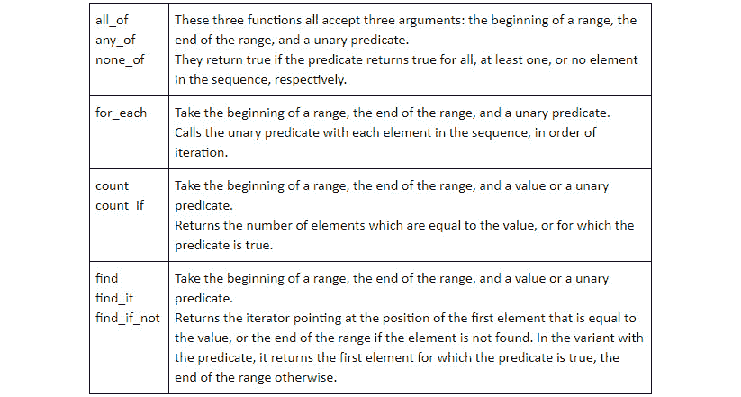

###### 图 5.22：展示检查范围元素操作的表格

让我们看看我们如何使用这些函数：

```cpp
#include <iostream>
#include <vector>
#include <algorithm>
int main()
{
    std::vector<int> vector = {1, 2, 3, 4};
    bool allLessThen10 = std::all_of(vector.begin(), vector.end(), [](int value) { return value < 10; });
    std::cout << "All are less than 10: " << allLessThen10 << std::endl;
    bool someAreEven = std::any_of(vector.begin(), vector.end(), [](int value) { return value % 2 == 0; });
    std::cout << "Some are even: " << someAreEven << std::endl;
    bool noneIsNegative = std::none_of(vector.begin(), vector.end(), [](int value) { return value < 0; });
    std::cout << "None is negative: " << noneIsNegative << std::endl;

    std::cout << "Odd numbers: " << std::count_if(vector.begin(), vector.end(), [](int value) { return value % 2 == 1; }) << std::endl;

    auto position = std::find(vector.begin(), vector.end(), 6);
    std::cout << "6 was found: " << (position != vector.end()) << std::endl;
}
Output:
All are less than 10: 1
Some are even: 1
None is negative: 1
Odd numbers: 2
6 was found: 0
```

### 修改算法

修改算法是修改它们迭代的集合的算法：

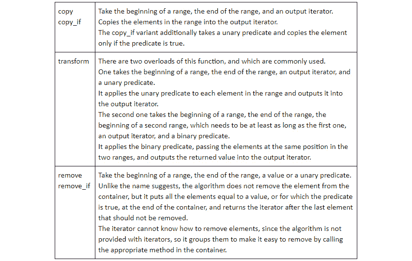

###### 图 5.23：展示修改算法的表格

让我们看看这些算法的实际应用：

```cpp
#include <iostream>
#include <vector>
#include <algorithm>
#include <iterator>
int main()
{
    std::vector<std::string> vector = {"Hello", "C++", "Morning", "Learning"};
    std::vector<std::string> longWords;

    std::copy_if(vector.begin(), vector.end(), std::back_inserter(longWords), [](const std::string& s) { return s.length() > 3; });
    std::cout << "Number of longWords: " << longWords.size() << std::endl;

    std::vector<int> lengths;
    std::transform(longWords.begin(), longWords.end(), std::back_inserter(lengths), [](const std::string& s) { return s.length(); });

    std::cout << "Lengths: ";
    std::for_each(lengths.begin(), lengths.end(), [](int length) { std::cout << length << " "; });
    std::cout << std::endl;

    auto newLast = std::remove_if(lengths.begin(), lengths.end(), [](int length) { return length < 7; });
    std::cout << "No element removed yet: " << lengths.size() << std::endl;

    // erase all the elements between the two iterators
    lengths.erase(newLast, lengths.end());
    std::cout << "Elements are removed now. Content: ";
    std::for_each(lengths.begin(), lengths.end(), [](int length) { std::cout << length << " "; });
    std::cout << std::endl;
}
Output:
Number of longWords: 3
Lengths: 5 7 8 
No element removed yet: 3
Elements are removed now. Content: 7 8
```

### 修改算法

修改算法是改变元素顺序的算法：

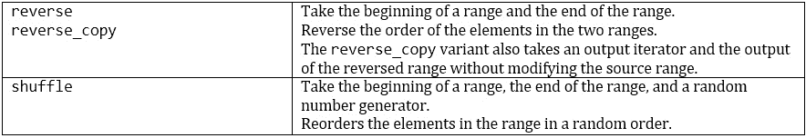

###### 图 5.24：展示修改算法的表格

让我们看看我们如何使用它们：

```cpp
#include <iostream>
#include <random>
#include <vector>
#include <algorithm>
#include <iterator>
int main()
{
    std::vector<int> vector = {1, 2, 3, 4, 5, 6};

    std::random_device randomDevice;
    std::mt19937 randomNumberGenerator(randomDevice());
    std::shuffle(vector.begin(), vector.end(), randomNumberGenerator);
    std::cout << "Values: ";
    std::for_each(vector.begin(), vector.end(), [](int value) { std::cout << value << " "; });
    std::cout << std::endl;
}
Output:
Values: 5 2 6 4 3 1
```

### 排序算法

这类算法以特定顺序重新排列容器内元素的顺序：

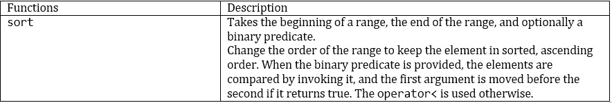

###### 图 5.25：展示排序算法的表格

下面是如何对向量进行排序的方法：

```cpp
#include <iostream>
#include <vector>
#include <algorithm>
int main()
{
    std::vector<int> vector = {5, 2, 6, 4, 3, 1};

    std::sort(vector.begin(), vector.end());
    std::cout << "Values: ";
    std::for_each(vector.begin(), vector.end(), [](int value) { std::cout << value << " "; });
    std::cout << std::endl;
}
Output:
Values: 1 2 3 4 5 6
```

### 二分搜索算法

以下表格解释了`binary_search`的使用：

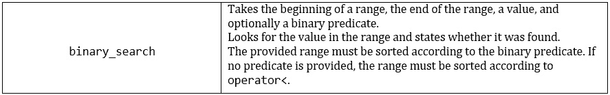

###### 图 5.26：展示`binary_search`使用的表格

这就是如何利用二分搜索算法的方法：

```cpp
#include <iostream>
#include <vector>
#include <algorithm>
int main()
{
    std::vector<int> vector = {1, 2, 3, 4, 5, 6};

    bool found = std::binary_search(vector.begin(), vector.end(), 2);
    std::cout << "Found: " << found << std::endl;
}
Output:
Found: 1
```

### 数值算法

这类算法以不同的方式使用线性运算组合数值元素：

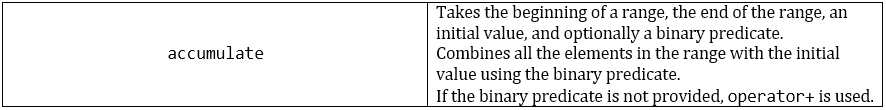

###### 图 5.27：展示数值算法的表格

让我们看看我们如何在以下程序中使用`accumulate`：

```cpp
#include <iostream>
#include <vector>
#include <algorithm>
int main()
{
    std::vector<int> costs = {1, 2, 3};

    int budget = 10;
    int margin = std::accumulate(costs.begin(), costs.end(), budget, [](int a, int b) { return a - b; });
    std::cout << "Margin: " << margin << std::endl;
}
Output:
Margin: 4
```

### 练习 19：客户分析

我们有我们应用程序许多客户的详细信息，并希望计算这些信息上的分析数据。

给定一个以用户名作为键和用户账户作为值的映射，我们希望按降序打印新用户的余额。

如果用户在 15 天内注册，则被视为新用户。提供表示用户账户的结构如下：

```cpp
struct UserAccount {
    int balance;
    int daysSinceRegistered;
};
```

编写`void computeAnalytics(std::map<std::string, UserAccount>& accounts)`函数，该函数打印所需的余额。

1.  确保包含解决方案所需的全部标题：

    ```cpp
    #include <iostream>
    #include <vector>
    #include <iterator>
    #include <map>
    #include <algorithm>
    ```

1.  首先，我们需要从映射中提取`UserAccount`。记住，映射存储的元素是包含键和值的`pair`。由于我们需要将类型转换为`UserAccount`，我们可以使用`std::transform`，通过传递一个只返回用户账户的`lambda`。为了将其插入到`vector`中，我们可以使用`std::back_inserter`。确保在 lambda 中接受`pair`时使用`const`引用：

    ```cpp
    void computeAnalytics(std::map<std::string, UserAccount>& accounts) {
        // Balance of accounts newer than 15 days, in descending order
        std::vector<UserAccount> newAccounts;
        std::transform(accounts.begin(), accounts.end(), std::back_inserter(newAccounts),
                     [](const std::pair<std::string, UserAccount>& user) { return user.second; });
        }   
    ```

1.  在我们从`vector`中提取账户后，我们可以使用`remove_if`来移除所有超过 15 天的账户：

    ```cpp
        auto newEnd = std::remove_if(newAccounts.begin(), newAccounts.end(), [](const UserAccount& account) { return account.daysSinceRegistered > 15; } );
        newAccounts.erase(newEnd, newAccounts.end());
    ```

1.  在移除旧账户后，我们需要按降序排序余额。默认情况下，`std::sort`使用升序，因此我们需要提供一个`lambda`来改变顺序：

    ```cpp
        std::sort(newAccounts.begin(), newAccounts.end(), [](const UserAccount& lhs, const UserAccount& rhs) { return lhs.balance > rhs.balance; } );
    Now that the data is sorted, we can print it:
        for(const UserAccount& account : newAccounts) {
            std::cout << account.balance << std::endl;
        }   
    }
    ```

1.  我们现在可以使用以下测试数据调用我们的函数：

    ```cpp
    int main()
    {
        std::map<std::string, UserAccount> users = {
            {"Alice", UserAccount{500, 15}},
            {"Bob", UserAccount{1000, 50}},
            {"Charlie", UserAccount{600, 17}},
            {"Donald", UserAccount{1500, 4}}
        };
        computeAnalytics(users);
    }
    ```

## 概述

在本章中，我们介绍了顺序容器——其元素可以按顺序访问的容器。我们研究了`array`、`vector`、`deque`、`list`和`forward_list`顺序容器。

我们看到了它们提供的功能以及如何操作它们，我们还看到了它们的实现以及 vector 和 list 的存储方式。

我们接着介绍了关联容器，这些容器允许快速查找其元素，并且始终保持有序。`Set`、`multiset`、`map`和`multimap`属于这一类别。

我们研究了它们支持的操作以及如何使用 map 和 multimap 将值关联到键。我们还看到了它们的无序版本，它不保持元素顺序但提供更高的性能。`Unordered_set`和`unordered_map`属于这一类别。

最后，我们探讨了非传统的容器。`String` 用于操作字符序列，`pair` 和 `tuple` 用于存储不同类型的不同元素，`optional` 用于向类型添加可选性，而 `variant` 用于存储可能属于几种类型的值。

然后，我们探讨了迭代器，并学习了它们是如何用于抽象容器概念并提供一组通用功能的。

我们研究了各种迭代器的类型，并了解了迭代器失效的概念及其重要性。

在解释了 `lambda` 是定义一个可以访问其创建作用域中变量的函数的便捷方式之后，我们最终转向了 C++ 标准中的算法。

我们将最常见的算法分为各种类别，并研究了这些类别中最重要的算法，包括 `find`、`remove` 和 `sort`。

在下一章中，你将学习如何使用 C++ 的高级特性来创建动态程序。
