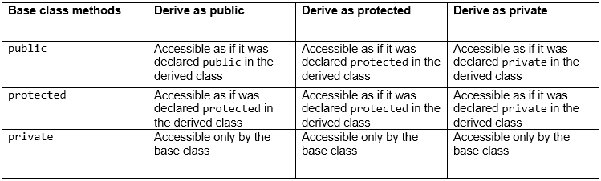
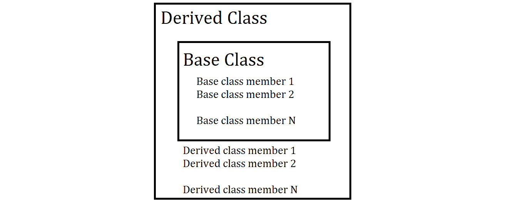

# 第七章：*第六章*

# 面向对象编程

## 课程目标

到本章结束时，你将能够：

+   组合继承其他类属性的其他类

+   在 C++ 程序中实现多态。

+   实现接口

+   使用最佳实践来管理动态内存

在本章中，你将学习如何使用 C++ 的高级特性来创建动态程序。

## 简介

在前面的章节中，我们学习了模板，它用于创建与任意类型一起工作的函数和类。这避免了工作重复。然而，在所有情况下使用模板并不适用，或者可能不是最佳方法。模板的限制是它们的类型需要在代码编译时已知。

在现实世界的案例中，这并不总是可能的。一个典型的例子是程序根据配置文件中的值确定要使用什么日志基础设施。

考虑以下问题：

+   在开发和执行测试应用程序时，应用程序会使用一个打印详细信息的记录器。

+   另一方面，当应用程序部署到用户的 PC 上时，应用程序会使用一个打印**错误摘要**并通知开发者的记录器，如果有任何错误。

我们可以使用 C++ 继承的概念来解决这些问题。

## 继承

继承允许组合一个或多个类。让我们看看继承的一个例子：

```cpp
class Vehicle {
  public:
    TankLevel getTankLevel() const;
    void turnOn();
};
class Car : public Vehicle {
  public:
    bool isTrunkOpen();
};
```

在这个例子中，`Car` 类继承自 `Vehicle` 类，或者说 `Car` 从 `Vehicle` 继承。在 C++ 术语中，`Vehicle` 是*基*类，而 `Car` 是*派生*类。

当定义一个类时，我们可以通过在后面跟一个冒号 `:`，然后跟一个或多个用逗号分隔的类来指定它继承的类：

```cpp
class Car : public Vehicle, public Transport {
}
```

当指定要继承的类列表时，我们还可以指定继承的可见性 – `private`、`protected` 或 `public`。

可见性修饰符指定谁可以了解类之间的继承关系。

基类的方法可以根据以下规则作为派生类的方法访问：

```cpp
Car car;
car.turnOn();
```

当继承是 `public` 时，类外部的代码知道 `Car` 继承自 `Vehicle`。基类的所有公共方法都可以作为派生类的*公共*方法被程序中的代码访问。基类的受保护方法可以通过派生类的方法作为*受保护*访问。当继承是 `protected` 时，所有公共和受保护成员都可以作为派生类的*受保护*访问。只有派生类及其从它派生的类知道关于继承的信息；外部代码看到这两个类是无关的。

最后，当使用 `private` 修饰符进行继承时，基类的所有 `public` 和 `protected` 方法字段都可以由派生类作为 `private` 访问。

一个类的私有方法和字段在该类外部*永远不可访问*。

访问基类的字段遵循相同的规则。

让我们看看一个总结：



###### 图 6.1：基类方法和它们提供的访问级别

继承创建了一个派生类和基类的层次结构。

`Orange` 类可以从 `Citrus` 类派生，而 `Citrus` 类又从 `Fruit` 类派生。以下是它的写法：

```cpp
class Fruit {
};
class Citrus: public Fruit {
};
class Orange: public Citrus {
};
```

类 `Citrus` 可以访问类 `Fruit` 的公共和受保护方法，而类 `Orange` 将能够访问 `Citrus` 和 `Fruit` 的公共和受保护方法（`Fruit` 的公共方法可以通过 `Citrus` 访问）。

### 练习 20：创建一个演示 C++ 继承的程序

让我们进行以下练习，创建一个从多个基类继承的派生类：

1.  在程序开始处添加头文件：

    ```cpp
    #include <iostream>
    ```

1.  添加第一个基类，命名为 `Vehicle`：

    ```cpp
    // first base class 
    class Vehicle { 
      public: 
        int getTankCapacity(){
          const int tankLiters = 10;
          std::cout << "The current tank capacity for your car is " << tankLiters << " Liters."<<std::endl;
          return tankLiters;
        }
    };
    ```

1.  现在添加第二个基类，命名为 `CollectorItem`：

    ```cpp
    // second base class 
    class CollectorItem { 
      public: 
        float getValue() {
          return 100;
        }
    }; 
    ```

1.  添加名为 `Ferrari250GT` 的派生类，如图所示：

    ```cpp
    // Subclass derived from two base classes
    class Ferrari250GT: protected Vehicle, public CollectorItem { 
      public:
        Ferrari250GT() {
          std::cout << "Thank you for buying the Ferrari 250 GT with tank capacity " << getTankCapacity() << std::endl;
          return 0;
        }
    }; 
    ```

1.  现在，在 `main` 函数中，实例化 `Ferrari250GT` 类并调用 `getValue()` 方法：

    ```cpp
    int main()
    {
      Ferrari250GT ferrari;
      std::cout << "The value of the Ferrari is " << ferrari.getValue() << std::endl;
      /* Cannot call ferrari.getTankCapacity() because Ferrari250GT inherits from Vehicle with the protected specifier */
      return 0;
    }
    ```

    输出将如下所示：

    ```cpp
    Output:
    The current tank capacity for your car is 10 Liters.
    Thank you for buying the Ferrari 250 GT with tank capacity 10
    The value of the Ferrari is 100
    ```

指定符不是强制的。如果省略，则对于结构体默认为 *public*，对于类默认为 *private*。

#### 注意

如果你使用继承来在实现类时组合一些功能，通常正确的是使用**私有继承**，因为这是你实现类的细节，并且它不是类的一部分**公共接口**。相反，如果你想编写一个可以作为基类使用的派生类，请使用公共继承。

当从类继承时，基类会被**嵌入**到派生类中。这意味着基类的所有数据也成为了派生类在它的**内存表示**中的一部分：



###### 图 6.2：派生类和基类的表示

在这一点上可能会出现一个问题——我们在派生类中嵌入基类。这意味着我们需要在初始化派生类时初始化基类，否则类的一部分将保持未初始化状态。我们何时初始化基类？

在编写派生类的构造函数时，编译器会在任何初始化之前隐式调用基类的默认构造函数。

如果基类没有默认构造函数，但有一个接受参数的构造函数，那么派生类的构造函数可以在初始化列表中显式调用它。否则，将出现错误。

与编译器在构造派生类时调用基类的构造函数类似，编译器会在派生类的析构函数运行后始终调用基类的析构函数：

```cpp
class A {
  public:
    A(const std::string& name);
};
class B: public A {
  public:
    B(int number) : A("A's name"), d_number(number) {}
  private:
    int d_number;
};

}
```

当调用`B`类的构造函数时，需要初始化`A`。由于`A`没有默认构造函数，编译器无法为我们初始化它：我们必须显式调用`A`类的构造函数。

编译器生成的**复制构造函数**和**赋值运算符**负责调用基类的构造函数和运算符。

当我们编写自己的复制构造函数和赋值运算符的实现时，我们需要注意调用复制构造函数和赋值运算符。

#### 注意

在许多编译器中，你可以启用额外的警告，这些警告会在你忘记添加对基构造函数的调用时通知你。

重要的是要理解，继承需要模型一个`A`从另一个类`B`继承，你是在说`A`是`B`。

为了理解这一点，一个车辆是一个很好的例子：汽车是一种车辆，公共汽车是一种车辆，卡车也是一种车辆。一个不好的例子是汽车继承自发动机。虽然发动机可能具有与汽车相似的功能，例如`start`方法，但说汽车是发动机是不正确的。在这种情况下，关系是**has a**：汽车有一个发动机；这种关系表示组合。

#### 注意

使用**is a**测试来理解是否可以使用继承来表示关系在某些情况下可能会失败：例如，一个**正方形**继承自一个**矩形**。当矩形的宽度加倍时，矩形的面积加倍，但正方形的面积会四倍增加。这意味着当使用正方形时，预期与矩形交互的代码可能会得到令人惊讶的结果，即使从数学上讲，正方形是一个矩形。

一个更一般的规则是，如果`A`类继承自`B`类，我们可以在`B`类被使用的地方替换`A`类，代码仍然可以正确运行。

到目前为止，我们已经看到了单重继承的例子：派生类有一个基类。C++支持多重继承：一个类可以继承自多个类。让我们看看一个例子：

```cpp
struct A {
};
struct B {
};
struct C : A, B {
};
```

在这个例子中，`C`结构体同时从`A`和`B`继承。

继承如何工作的规则对单重继承和多重继承是相同的：所有派生类的所有方法都基于指定的可见性访问权限可见，我们需要确保为所有基类调用适当的构造函数和赋值运算符。

#### 注意

通常最好有一个浅层继承层次结构：不应该有太多的派生类层次。

当使用多层继承层次结构或多重继承时，你可能会遇到一些问题，例如**模糊调用**。

当编译器无法清楚地理解要调用哪个方法时，调用是模糊的。让我们看看以下示例：

```cpp
struct A {
  void foo() {}
};
struct B {
  void foo() {}
};
struct C: A, B {
  void bar() { foo(); }
};
```

在这个例子中，不清楚要调用哪个`foo()`，是`A`类的还是`B`类的。我们可以通过在类名前加上两个冒号来消除歧义：`A::foo()`。

### 练习 21：使用多重继承创建“欢迎加入社区”消息应用程序

让我们使用多重继承来创建一个打印“欢迎加入社区”消息的应用程序：

1.  首先，在程序中添加所需的头文件，如图所示：

    ```cpp
    #include <iostream>
    ```

1.  现在，添加所需的类`DataScienceDev`和`FutureCppDev`以及所需的打印语句：

    ```cpp
    class DataScienceDev {
    public:
        DataScienceDev(){
            std::cout << "Welcome to the Data Science Developer Community." << std::endl;
        }
    };
    class FutureCppDev {
    public:
        FutureCppDev(){
            std::cout << "Welcome to the C++ Developer Community." << std::endl;
          }
    };
    ```

1.  现在，添加如上图所示的`Student`类：

    ```cpp
    class Student : public DataScienceDev, public FutureCppDev {
        public:
        Student(){
            std::cout << "Student is a Data Developer and C++ Developer." << std::endl;
        }
    };
    ```

1.  现在，在`main`函数中调用`Student`类：

    ```cpp
    int main(){
        Student S1;
        return 0;
    }
    ```

    输出将如下所示：

    ```cpp
    Welcome to the Data Science Developer Community.
    Welcome to the C++ Developer Community.
    Student is a Data Developer and C++ Developer.
    ```

### 活动 23：创建游戏角色

我们想编写一个新游戏，并在该游戏中创建两种类型的角色——英雄和敌人。敌人可以挥舞剑，而英雄可以施展法术。

下面是如何完成任务的方法：

1.  创建一个具有公共方法`moveTo`的`Character`类，该方法打印`Moved to position`。

1.  创建一个`Position`结构体：

    ```cpp
    struct Position {
        std::string positionIdentifier;
    };
    ```

1.  创建两个类，`Hero`和`Enemy`，它们从`Character`类派生：

    ```cpp
    class Hero : public Character {
    };
    class Enemy : public Character {
    };
    ```

1.  创建一个具有接受法术名称构造函数的`Spell`类：

    ```cpp
    class Spell {
    public:
        Spell(std::string name) : d_name(name) {}
        std::string name() const {
            return d_name;
        }
    private:
        std::string d_name;
    }
    ```

1.  `Hero`类应该有一个`public`方法来施展法术。使用`Spell`类的值。

1.  `Enemy`类应该有一个`public`方法来挥舞剑，这将打印`Swinging sword`。

1.  实现主方法，该方法在各个类中调用这些方法：

    ```cpp
    int main()
    {
        Position position{"Enemy castle"};
        Hero hero;
        Enemy enemy;
    }
    ```

    输出将如下所示：

    ```cpp
    Moved to position Enemy castle
    Moved to position Enemy castle
    Casting spell fireball
    Swinging sword
    ```

    #### 注意

    这个活动的解决方案可以在第 309 页找到。

## 多态性

在前面的章节中，我们提到继承是一种允许你在程序运行时更改代码行为的解决方案。这是因为继承使 C++具有多态性。

**多态性**意味着*多种形式*，表示对象能够以不同的方式行为。

我们之前提到，模板是在编译时与许多不同类型一起工作的代码的方式，并且根据用于实例化模板的类型，行为将发生变化。

这种模式被称为**静态多态性**——静态是因为它在编译时已知。C++也支持**动态多态性**——在程序运行时方法的行为可以改变。这很强大，因为我们可以在编译程序之后仅对获得的信息做出反应，例如用户输入、配置中的值或代码运行的硬件类型。这要归功于两个特性——**动态绑定**和**动态分派**。

### 动态绑定

**动态绑定**是指基类型引用或指针在运行时指向派生类型对象的能力。让我们探索以下示例：

```cpp
struct A {
};
struct B: A{
};
struct C: A {
};
//We can write
B b;
C c;
A& ref1 = b;
A& ref2 = c;
A* ptr = nullptr;
if (runtime_condition()) {
  ptr = &b;
} else {
  ptr = &c;
}
```

#### 注意

为了允许动态绑定，代码必须*知道*派生类从基类派生。

如果继承的可见性是`private`，则只有派生类中的代码能够将对象绑定到基类的*指针*或*引用*。

如果继承是`protected`，那么派生类以及从它派生的所有类都将能够执行动态绑定。最后，如果继承是`public`，动态绑定将始终被*允许*。

这在`static`类型和`dynamic`（或运行时）类型之间创建了区别。静态类型是我们可以在源代码中看到的类型。在这种情况下，我们可以看到`ref1`的静态类型是`A`结构的引用。

动态类型是对象的实际类型：在运行时在对象的内存位置上构建的类型。例如，`ref1`和`ref2`的静态类型都是`A`结构的引用，但`ref1`的动态类型是`B`，因为`ref1`指向一个在内存位置上创建了类型为`B`的对象的内存位置，而`ref2`的动态类型是`C`，原因相同。

正如所说，动态类型可以在运行时改变。虽然变量的静态类型始终相同，但其动态类型可以改变：`ptr`有一个静态类型，即指向`A`的指针，但它的动态类型在程序执行过程中可能会改变：

```cpp
A* ptr = &b; // ptr dynamic type is B
ptr = &c; // ptr dynamic type is now C
```

重要的是要理解，只有引用和指针可以从派生类安全地赋值。如果我们将对象赋值给值类型，我们会得到一个令人惊讶的结果 - 对象会被切割。

我们之前说过，基类是**嵌入**在派生类中的。比如说，如果我们尝试赋值，就像这样：

```cpp
B b;
A a = b;
```

代码将编译，但只有`B`中嵌入的`A`的部分将被复制 - 当我们声明一个类型为`A`的变量时，编译器分配一个足够大的内存区域来容纳类型为`A`的对象，因此没有足够的空间来容纳`B`。当这种情况发生时，我们说我们切割了对象，因为我们赋值或复制时只取了对象的一部分。

#### 注意

切割对象不是预期的行为。请注意这种交互，并尽量避免它。

这种行为发生是因为 C++默认使用*静态调度*进行函数和方法调用：当编译器看到方法调用时，它会检查被调用方法变量的静态类型，并且它将执行`A`被调用，并且它只复制`A`中`B`内部的这部分，忽略剩余的字段。

如前所述，C++支持动态调度。这是通过使用特殊关键字标记方法来完成的：**virtual**。

如果一个方法被标记为`virtual`关键字，当在*引用*或*指针*上调用该方法时，编译器将执行动态类型的实现而不是静态类型。

这两个特性实现了*多态性* - 我们可以编写一个接受基类引用的函数，调用这个基类的方法，并且派生类的方法将被执行：

```cpp
void safeTurnOn(Vehicle& vehicle) {
  if (vehicle.getFuelInTank() > 0.1 && vehicle.batteryHasEnergy()) {
    vehicle.turnOn();
  }
}
```

然后，我们可以用许多不同类型的车辆调用该函数，并且将执行适当的方法：

```cpp
Car myCar;
Truck truck;
safeTurnOn(myCar);
safeTurnOn(truck);
```

一个典型的模式是创建一个接口，它只指定了实现某些功能所需的方法。

需要使用这种功能的功能类必须继承接口并实现所有必需的方法。

## 虚拟方法

我们已经学习了 C++中动态分发的优势以及它是如何使我们能够通过在基类的引用或指针上调用方法来执行派生类的方法。

在本节中，我们将深入了解如何告诉编译器在方法上执行动态分发。指定我们想要为方法使用动态分发的方式是使用`virtual`关键字。

在声明方法时，在方法前使用`virtual`关键字：

```cpp
class Vehicle {
  public:
    virtual void turnOn();
};
```

我们需要记住，编译器根据调用方法时使用的变量的静态类型来决定如何执行方法分发。

这意味着我们需要将虚拟关键字应用于代码中使用的类型。让我们检查以下练习来探索虚拟关键字。

### 练习 22：探索虚拟方法

让我们创建一个使用虚拟关键字的继承概念的程序：

1.  首先，确保添加所需的头文件和命名空间以编译程序。

1.  现在，如所示添加`Vehicle`类：

    ```cpp
    class Vehicle {
      public:
        void turnOn() {
          std::cout << "Vehicle: turn on" << std::endl;
        }
    };
    ```

1.  在`Car`类中，如所示添加`virtual`关键字：

    ```cpp
    class Car : public Vehicle {
      public:
        virtual void turnOn()  {
          std::cout << "Car: turn on" << std::endl;
        }
    };
    void myTurnOn(Vehicle& vehicle) {
      std::cout << "Calling turnOn() on the vehicle reference" << std::endl;
      vehicle.turnOn();
    }
    ```

1.  现在，在主函数中，调用`Car`类并在`myTurnOn()`函数中传递`car`对象：

    ```cpp
    int main() {
      Car car;
      myTurnOn(car);
    }
    ```

    输出将如下所示：

    ```cpp
    Calling turnOn() on the vehicle reference
    Vehicle: turn on
    ```

这里，调用不会进行动态分发，而是会执行`Vehicle::turnOn()`的实现。原因是变量的静态类型是`Vehicle`，我们没有将方法标记为`virtual`，所以编译器使用静态分发。

我们编写了一个声明方法为虚拟的`Car`类的事实并不重要，因为编译器只看到了在`myTurnOn()`中使用`Vehicle`类。当方法被声明为`virtual`时，我们可以在派生类中重写它。

要重写方法，我们需要使用与父类相同的签名声明它：相同的返回类型、名称、参数（包括`const`-性、`ref`-性），`const`限定符和其他属性。

如果签名不匹配，我们将为函数创建一个重载。重载可以从派生类中调用，但它永远不会从基类进行动态分发，例如：

```cpp
struct Base {
  virtual void foo(int) = 0;
};
struct Derived: Base {
  /* This is an override: we are redefining a virtual method of the base class, using the same signature. */
  void foo(int) { }
  /* This is an overload: we are defining a method with the same name of a method of the base class, but the signature is different. The rules regarding virtual do not apply between Base::foo(int) and Derived:foo(float). */
  void foo(float) {}
};
```

当一个类重写基类的虚拟方法时，当在基类上调用该方法时，将执行*最派生类*的方法。即使该方法是从基类内部调用的，这也是`true`，例如：

```cpp
struct A {
  virtual void foo() {
    std::cout << "A's foo" << std::endl;
  }
};
struct B: A {
  virtual void foo() override {
    std::cout << "B's foo" << std::endl;
  }
};
struct C: B {
  virtual void foo() override {
    std::cout << "C's foo" << std::endl;
  }
};
int main() {
  B b;
  C c;
  A* a = &b;
  a->foo();  // B::foo() is executed
  a = &c;
  a->foo();
  /* C::foo() is executed, because it's the most derived Class overriding foo(). */
}
```

在前面的示例中，我们可以看到一个新关键字：`override`关键字。

C++11 引入了这个关键字，使我们能够显式地指定我们正在重写一个方法。这允许编译器在我们使用`override`关键字但签名与基类的任何虚拟方法不匹配时给出错误信息。

#### 注意

当你重写一个方法时，始终使用`override`关键字。很容易更改基类的签名并忘记更新我们重写方法的所有位置。如果我们不更新它们，它们将变成一个新的重载而不是重写！

在示例中，我们也为每个函数使用了`virtual`关键字。这并非必要，因为基类上的虚拟方法会使派生类中具有相同签名的每个方法也变为虚拟方法。

明确使用`virtual`关键字是好的，但如果我们已经使用了`override`关键字，它可能就多余了——在这些情况下，最好的方式是遵循你正在工作的项目的编码标准。

`virtual`关键字可以应用于任何方法。由于构造函数不是方法，因此构造函数不能被标记为虚拟。此外，在构造函数和析构函数内部禁用动态分派。

原因在于，当构建派生类的层次结构时，基类的构造函数会在派生类的构造函数之前执行。这意味着如果我们试图在构建基类时调用派生类的虚拟方法，派生类尚未初始化。

类似地，当调用析构函数时，整个层次结构的析构函数会按相反的顺序执行；首先调用派生类，然后是基类。在析构函数中调用虚拟方法将调用已经析构的派生类的该方法，这是错误的。

虽然构造函数不能被标记为虚拟，但析构函数可以。如果一个类定义了一个虚拟方法，那么它也应该声明一个虚拟析构函数。

当在动态内存或堆上创建类时，声明析构函数为虚拟非常重要。我们将在本章后面看到如何使用类管理动态内存，但到目前为止，重要的是要知道，如果析构函数没有被声明为虚拟，那么一个对象可能只被部分析构。

#### 注意

如果一个方法被标记为虚拟，那么析构函数也应该被标记为虚拟。

### 活动 24：计算员工工资

我们正在编写一个系统来计算一家公司员工的工资。每位员工都有一个基本工资加上奖金。

对于不是经理的员工，奖金是根据部门的业绩计算的：如果部门达到了目标，他们将获得基本工资的 10%。

该公司还有经理，他们的奖金计算方式不同：如果部门达到了目标，他们将获得基本工资的 20%，加上部门实际成果与预期成果之间差异的 1%。

我们想要创建一个函数，它接受一个员工并计算他们的总工资，将基本工资和奖金相加，无论他们是否是经理。

执行以下步骤：

1.  当构造`Department`类时，它接受预期的收入和实际收入，并将它们存储在两个字段中：

    ```cpp
    class Department {
    public:
        Department(int expectedEarning, int effectiveEarning)
        : d_expectedEarning(expectedEarning), d_effectiveEarning(effectiveEarning)
        {}
        bool hasReachedTarget() const {return d_effectiveEarning >= d_expectedEarning;}
        int expectedEarning() const {return d_expectedEarning;}
        int effectiveEarning() const {return d_effectiveEarning;}
    private:
        int d_expectedEarning;
        int d_effectiveEarning;
    };
    ```

1.  定义一个具有两个`virtual`函数`getBaseSalary()`和`getBonus()`的`Employee`类。在其中，实现如果部门目标达成，员工奖金计算的逻辑：

    ```cpp
    class Employee {
    public:
        virtual int getBaseSalary() const { return 100; }
        virtual int getBonus(const Department& dep) const {
            if (dep.hasReachedTarget()) {
                return int(0.1 * getBaseSalary());
            }
            return 0;
        }
    };
    ```

1.  创建另一个提供总补偿的函数：

    ```cpp
        int getTotalComp(const Department& dep) {
                return getBaseSalary() + getBonus(dep);
        }
    ```

1.  创建一个从`Employee`派生的`Manager`类。再次，创建相同的虚函数`getBaseSalary()`和`getBonus()`。在其中，实现如果部门目标达成，`Manager`奖金计算的逻辑：

    ```cpp
    class Manager : public Employee {
    public:
        virtual int getBaseSalary() const override { return 150; }
        virtual int getBonus(const Department& dep) const override {
            if (dep.hasReachedTarget()) {
                int additionalDeparmentEarnings = dep.effectiveEarning() - dep.expectedEarning();
                return int(0.2 * getBaseSalary() + 0.01 * additionalDeparmentEarnings);
            }
            return 0;
        }
    };
    ```

1.  实现主程序，并运行程序：

    输出将如下所示：

    ```cpp
    Employee: 110\. Manager: 181
    ```

    #### 注意

    该活动的解决方案可以在第 311 页找到。

## C++中的接口

在前面的章节中，我们看到了如何定义一个虚方法，以及编译器在调用它时将如何进行动态分派。

我们在本章中也讨论了接口，但我们从未指定接口是什么。

接口是代码指定调用者需要提供以能够调用某些功能的一种方式。我们在讨论模板及其对使用它们的类型所施加的要求时看到了一个非正式的定义。

接受参数作为接口的函数和方法是一种说法：为了执行我的操作，我需要这些功能；这取决于你提供它们。

要在 C++中指定接口，我们可以使用**抽象基类**（**ABC**）。

让我们深入探讨一下这个名字；这个类是：

+   **抽象**：这意味着它不能被实例化

+   **基类**：这意味着它被设计为可以从中派生的

任何定义了纯虚方法的类都是`抽象`的。纯虚方法是一个以`= 0`结尾的虚方法，例如：

```cpp
class Vehicle {
  public:
    virtual void turnOn() = 0;
};
```

纯虚方法是一个不需要定义的方法。在前面的代码中，我们没有任何地方指定`Vehicle::turnOn()`的实现。正因为如此，`Vehicle`类不能被实例化，因为我们没有为其纯虚方法提供任何可调用的代码。

我们还可以从类中派生并覆盖纯虚方法。如果一个类从抽象基类派生，它可以是以下两种情况之一：

+   如果它声明了额外的纯虚方法，或者如果没有覆盖基类的所有纯虚方法，则另一个抽象基类

+   如果它覆盖了基类的所有纯虚方法，则是一个常规类

让我们继续上一个例子：

```cpp
class GasolineVehicle: public Vehicle {
  public:
    virtual void fillTank() = 0;
};
class Car : public GasolineVehicle {
  virtual void turnOn() override {}
  virtual void fillTank() override {}
};
```

在这个例子中，`Vehicle`是一个抽象基类，`GasolineVehicle`也是，因为它没有覆盖`Vehicle`的所有纯虚方法。它还定义了一个额外的虚拟方法，`Car`类与`Vehicle::turnOn()`方法一起覆盖了这个方法。这使得`Car`成为唯一的具体类，一个可以实例化的类。

当一个类从多个抽象基类派生时，同样的概念也适用：所有需要覆盖以使类具体并因此可实例化的类的纯虚方法。

虽然抽象基类不能被实例化，但我们可以定义它们的引用和指针。

#### 注意

如果你尝试实例化一个抽象基类，编译器将给出错误，指定哪些方法仍然是纯虚的，从而使该类成为抽象的。

需要特定方法的功能的函数和方法可以接受抽象基类的引用和指针，以及从它们派生的具体类的实例可以被绑定到这样的引用上。

#### 注意

对于接口的消费者来说，定义接口是一种良好的实践。

需要某些功能来执行其操作的函数、方法或类应该定义接口。应该与这些实体一起使用的类应该实现该接口。

由于 C++没有提供专门的关键字来定义接口，而接口仅仅是抽象基类，因此在 C++中设计接口时，有一些最佳实践指南需要遵循：

+   抽象基类**不应**有任何数据成员或字段。

    这种情况的原因在于，一个接口指定了行为，这些行为应该独立于数据表示。由此得出结论，抽象基类应该只包含默认构造函数。

+   抽象基类应该始终定义一个`virtual ~Interface() = default`。我们将在稍后看到为什么析构函数是虚拟的很重要。

+   抽象基类中的所有方法应该是纯虚的。

    接口代表需要实现的可预期功能；一个非纯方法是一个实现。实现应该与接口分开。

+   抽象基类中的所有方法都应该声明为`public`。

    与前一点类似，我们正在定义一组我们期望调用的方法。我们不应该仅将可以调用该方法的功能限制为从接口派生的类。

+   抽象基类中的所有方法都应该针对单一功能。

    如果我们的代码需要多个功能，可以创建单独的接口，并且类可以从中派生所有这些接口。这使得我们更容易组合接口。

考虑禁用接口上的复制构造函数和移动构造函数以及赋值运算符。允许接口被复制可能会导致我们之前描述的切片问题：

```cpp
Car redCar;
Car blueCar;
Vehicle& redVehicle = redCar;
Vehicle& redVehicle = blueCar;
redVehicle = blueVehicle;
// Problem: object slicing!
```

在最后一个赋值操作中，我们只复制了 `Vehicle` 部分，因为已经调用了 `Vehicle` 类的拷贝构造函数。拷贝构造函数不是虚拟的，所以调用的是 `Vehicle` 中的实现，并且因为它只知道 `Vehicle` 类的数据成员（应该是没有的），所以 `Car` 中定义的成员没有被复制！这导致了一些非常难以识别的问题。

一种可能的解决方案是禁用接口的拷贝和移动构造函数以及赋值运算符：`Interface(const Interface&) = delete` 以及类似的。这的缺点是阻止编译器为派生类创建拷贝构造函数和赋值运算符。

另一种方法是声明拷贝/移动构造函数/赋值运算符为受保护的，这样只有派生类可以调用它们，我们使用它们时不会冒分配接口的风险。

### 活动 25：检索用户信息

我们正在编写一个应用程序，允许用户购买和出售物品。当用户登录时，我们需要检索一些信息来填充他们的个人资料，例如个人资料的 URL 和全名。

我们的服务在全球许多数据中心运行，以便始终靠近其客户。因此，有时我们想从缓存中检索用户信息，但有时我们想从我们的主数据库中检索。

执行以下操作：

1.  让我们编写代码，使其可以独立于数据来源，因此我们创建一个抽象的 `UserProfileStorage` 类来从 `UserId` 获取 `CustomerProfile`：

    ```cpp
    struct UserProfile {};
    struct UserId {};
    class UserProfileStorage {
      public:
        virtual UserProfile getUserProfile(const UserId& id) const = 0;

        virtual ~UserProfileStorage() = default;
      protected:
        UserProfileStorage() = default;
        UserProfileStorage(const UserProfileStorage&) = default;
        UserProfileStorage& operator=(const UserProfileStorage&) = default;
    };
    ```

1.  现在，编写继承自 `UserProfileStorage` 的 `UserProfileCache` 类：

    ```cpp
    class UserProfileCache : public UserProfileStorage {
    public:
        UserProfile getUserProfile(const UserId& id) const override {
            std::cout << "Getting the user profile from the cache" << std::endl;
            return UserProfile();
        }
    };
    void exampleOfUsage(const UserProfileStorage& storage) {
        UserId user;
        std::cout << "About to retrieve the user profile from the storage" << std::endl;
        UserProfile userProfile = storage.getUserProfile(user);
    }
    ```

1.  在 `main` 函数中，实例化 `UserProfileCache` 类并调用 `exampleOfUsage` 函数，如图所示：

    ```cpp
    int main()
    {
      UserProfileCache cache;
      exampleOfUsage (cache);
    }
    ```

输出如下：

```cpp
About to retrieve the user profile from the storage
Getting the user profile from the cache
```

#### 注意

该活动的解决方案可以在第 312 页找到。

## 动态内存

在本章中，我们遇到了动态内存这个术语。现在让我们更详细地了解什么是动态内存，它解决了什么问题，以及何时使用它。

**动态内存**是程序可以用来存储对象的内存部分，程序负责维护其正确的生命周期。

它通常也被称为 **堆**，并且通常是栈的替代品，而栈则由程序自动处理。动态内存通常可以存储比栈大得多的对象，而栈通常有一个限制。

程序可以与操作系统交互以获取动态内存块，这些内存块可以用来存储对象，之后程序必须注意将其归还给操作系统。

从历史上看，开发者会确保调用适当的函数来获取和归还内存，但现代 C++ 自动化了大部分这个过程，因此现在编写正确的程序要容易得多。

在本节中，我们将展示何时以及如何推荐在程序中使用动态内存。

让我们从例子开始：我们想要编写一个创建记录器的函数。当我们执行测试时，我们创建一个名为`TestLogger`的特定于测试的记录器，当我们为用户运行程序时，我们想要使用不同的记录器，称为`ReleaseLogger`。

我们在这里可以看到接口的一个很好的匹配点——我们可以编写一个定义所有所需日志方法的记录器抽象基类，并且`TestLogger`和`ReleaseLogger`从它派生。

然后，我们所有的代码在日志时都会使用记录器的引用。

我们如何编写这样的函数？

正如我们在*第二章*，*函数*中学到的，我们不能在函数内部创建记录器，然后返回对其的引用，因为它将是一个自动变量，它将在返回后立即被销毁，留下一个悬垂引用。

我们不能在调用函数之前创建记录器，也不能让函数初始化它，因为类型不同，函数知道应该创建哪种类型。

我们需要一些存储，直到我们需要记录器时才有效，以便将记录器放入其中。

只给出一个接口，我们无法知道实现它的类的尺寸，因为可能有多个类实现它，并且它们可能有不同的大小。这阻止了我们为内存中预留一些空间并将指向该空间的指针传递给函数，以便它可以在其中存储记录器。

由于类可以有不同的大小，存储不仅需要比函数保持有效的时间更长，还需要是可变的。这就是**动态内存**！

在 C++中，有两个关键字用于与动态内存交互——**new**和**free**。

`new`表达式用于在动态内存中创建新对象——它由`new`关键字组成，后跟要创建的对象的类型以及传递给构造函数的参数，并返回指向请求类型的指针：

```cpp
Car* myCar = new myCar();
```

`new`表达式请求足够大的动态内存来容纳创建的对象，并在该内存中实例化一个对象。然后它返回指向该实例的指针。

程序现在可以使用`myCar`指向的对象，直到它决定删除它。要删除指针，我们可以使用`delete`表达式：它由`delete`关键字后跟一个变量组成，该变量是一个指针：

```cpp
delete myCar;
```

`delete`关键字调用由其提供的指针指向的对象的析构函数，然后将其最初请求的内存返回给操作系统。

删除指向自动变量的指针会导致以下错误：

```cpp
Car myCar; // automatic variable
delete &myCar; // This is an error and will likely crash the program
```

对于每个`new`表达式，绝对重要的是，我们只调用一次`delete`表达式，并且使用相同的返回指针。

如果我们忘记调用`new`函数返回的对象的`delete`函数，我们将有两个主要问题：

+   当我们不再需要内存时，不会将其返回给操作系统。这被称为**内存泄漏**。如果在程序执行期间反复发生，我们的程序将消耗越来越多的内存，直到消耗掉它能获取的所有内存。

+   对象的析构函数不会被调用。

我们在前面章节中看到，在 C++ 中，我们应该利用 RAII（资源获取即初始化）在构造函数中获取所需的资源，并在析构函数中返回它们。

如果我们不调用析构函数，我们可能不会返回一些资源。例如，数据库连接将保持打开状态，即使我们只使用一个连接，我们的数据库也会因为打开的连接太多而挣扎。

如果我们对同一个指针多次调用 `delete`，会出现的问题是在第一次调用之后的所有调用都将访问它们不应访问的内存。

结果可能从我们的程序崩溃到删除我们程序当前正在使用的其他资源，导致行为不正确。

现在我们可以看到，如果我们从基类派生，定义基类中的虚拟析构函数为什么非常重要：我们需要确保在调用基对象的 `delete` 函数时调用运行时类型的析构函数。如果我们对基类指针调用 `delete`，而运行时类型是派生类，我们只会调用基类的析构函数，而不会完全析构派生类。

将基类的析构函数设置为虚函数将确保我们将调用派生类的析构函数，因为我们调用它时使用了动态分派。

#### 注意

对于每次调用 `new` 操作符，必须有且只有一个调用 `delete`，使用 `new` 返回的指针！

这个错误非常常见，并导致许多错误。

就像单个对象一样，我们也可以使用动态内存来创建对象的数组。对于此类用例，我们可以使用 `new[]` 和 `delete[]` 表达式：

```cpp
int n = 15;
Car* cars = new Car[n];
delete[] cars;
```

`new[]` 表达式将为 `n Car` 实例创建足够的空间并将它们初始化，返回指向创建的第一个元素的指针。在这里，我们没有提供构造函数的参数，因此类必须有一个默认构造函数。

使用 `new[]`，我们可以指定我们想要初始化多少个元素。这与 `std::array` 和我们之前看到的内置数组不同，因为 `n` 可以在运行时决定。

当我们不再需要对象时，我们需要在 `new[]` 返回的指针上调用 `delete[]`。

#### 注意

对于每次调用 `new[]`，必须有且只有一个调用 `delete[]`，使用 `new[]` 返回的指针。

`new` 操作符和 `new[]` 函数调用，以及 `delete` 和 `delete[]` 函数调用，不能混合使用。始终为数组或单个元素配对！

现在我们已经看到了如何使用动态内存，我们可以编写创建我们日志记录器的函数。

函数将在其主体中调用 `new` 表达式来创建正确类的实例，然后返回基类指针，这样调用它的代码就不需要知道创建的 logger 类型：

```cpp
Logger* createLogger() {
  if (are_tests_running()) {
    TestLogger* logger = new TestLogger();
    return logger;
  } else {
    ReleaseLogger logger = new ReleaseLogger("Release logger");
    return logger;
  }
}
```

在这个函数中有两点需要注意：

+   即使我们将 `new` 表达式写了两遍，每次函数调用中 `new` 也只会被调用一次。

    这表明仅仅确保我们输入 `new` 和 `delete` 的次数相等是不够的；我们需要理解我们的代码是如何执行的。

+   没有调用 `delete`！这意味着调用 `createLogger` 函数的代码需要确保调用 `delete`。

从这两点来看，我们可以看到手动管理内存为什么容易出错，以及为什么应该尽可能避免这样做。

让我们看看如何正确调用函数的例子：

```cpp
Logger* logger = createLogger();
myOperation(logger, argument1, argument2);
delete logger;
```

如果 `myOperation` 没有在 logger 上调用 `delete`，这是动态内存的**正确**使用。动态内存是一个强大的工具，但手动操作是危险的，容易出错，并且容易出错。

幸运的是，现代 C++ 提供了一些工具，使得所有这些操作都变得容易得多。可以编写整个程序而不直接使用 `new` 和 `delete`。

我们将在下一节中看到这一点。

## 安全且易于使用的动态内存

在上一节中，我们学习了在处理接口时动态内存如何有用，尤其是在创建派生类的新实例时。

我们还看到了如何处理动态内存可能会很困难——我们需要确保成对地调用 `new` 和 `delete`，否则总是会对我们的程序产生负面影响。幸运的是，自从 C++11 以来，标准库中有工具可以帮助我们克服这些限制——**智能指针**。

智能指针是类似指针的类型，在此语境中称为**原始指针**，但具有额外的功能。

我们将探讨标准库中的两个智能指针：`std::unique_ptr` 和 `std::shared_ptr`（适当地读作 `delete`）。

它们代表了不同的所有权模型。对象的所有者是确定对象生存期的代码——决定何时创建和销毁对象的代码部分。

通常，所有权与函数或方法的作用域相关联，因为自动变量的生存期由它控制：

```cpp
void foo() {
  int number;
  do_action(number);
}
```

在这种情况下，`foo()` 函数的作用域拥有 `number` 对象，并且它将确保在作用域退出时销毁它。

或者，当类被声明为值类型，位于类的数据成员之间时，类可能拥有对象。在这种情况下，对象的生存期将与类的生存期相同：

```cpp
class A {
  int number;
};
```

`number` 将在 `A` 类构造时构造，并在 `A` 类销毁时销毁。这是自动完成的，因为字段 `number` 嵌入在类中，类的构造函数和析构函数将自动初始化 `number`。

当管理动态内存中的对象时，编译器不再强制执行所有权，但将所有权概念应用于动态内存也是有帮助的——所有者是决定何时删除对象的人。

当对象在函数内部使用`new`调用分配时，函数可以是对象的所有者，如下面的示例所示：

```cpp
void foo() {
  int* number = new number();
  do_action(number);
  delete number;
}
```

或者，一个类可能通过在构造函数中调用`new`并将指针存储在其字段中，并在析构函数中调用`delete`来拥有它：

```cpp
class A {
    A() : number(new int(0)) {
    }
    ~A() {
        delete number;
    }
    int* number;
};
```

但动态对象的所有权也可以传递。

我们之前已经通过`createLogger`函数的示例进行了查看。该函数创建了一个`Logger`实例，然后将所有权传递给父作用域。现在，父作用域负责确保对象在程序中被访问直到删除。

智能指针允许我们在指针的类型中指定所有权，并确保它得到尊重，这样我们就不必再手动跟踪它了。

#### 注意

总是使用智能指针来表示对象的所有权。

在代码库中，智能指针应该是控制对象生命周期的指针，而原始指针或常规指针仅用于引用对象。

### 使用 std::unique_ptr 的单个所有者

`unique_ptr`是默认使用的指针类型。唯一指针指向一个只有一个所有者的对象；程序中只有一个地方决定何时删除该对象。

例如，之前的日志记录器：程序中只有一个地方决定何时删除对象。由于我们希望日志记录器在程序运行期间始终可用，以便始终能够记录信息，我们将在程序结束时销毁日志记录器。

唯一指针保证了所有权的唯一性：唯一指针不能被复制。这意味着一旦我们为对象创建了一个唯一指针，就只能有一个。

此外，当唯一指针被销毁时，它会删除它拥有的对象。这样，我们就有一个具体的对象，它告诉我们创建的对象的所有权，我们不必手动确保只有一个地方调用`delete`来删除对象。

唯一指针是一个模板，它可以接受一个参数：*对象的类型*。

我们可以将前面的示例重写如下：

```cpp
std::unique_ptr<Logger> logger = createLogger();
```

虽然这段代码可以编译，但我们不会遵守之前提到的始终使用智能指针进行所有权的指南：`createLogger`返回一个原始指针，但它将所有权传递给父作用域。

我们可以将`createLogger`函数的签名更新为返回智能指针：

```cpp
std::unique_ptr<Logger>createLogger();
```

现在，签名表达了我们的意图，我们可以更新实现以使用智能指针。

正如我们之前提到的，随着智能指针的使用，代码库不应在任何地方使用`new`和`delete`。这是可能的，因为自 C++14 以来，标准库提供了一个方便的函数：`std::make_unique`。`make_unique`是一个模板函数，它接受要创建的对象的类型，并在动态内存中创建它，将参数传递给对象的构造函数，并返回一个指向它的唯一指针：

```cpp
std::unique_ptr<Logger>createLogger() {
  if (are_tests_running()) {
    std::unique_ptr<TestLogger> logger = std::make_unique<TestLogger>();
     return logger; // logger is implicitly moved
  } else {
    std::unique_ptr<ReleaseLogger> logger = std::make_unique<ReleaseLogger>("Release logger");
    return logger; // logger is implicitly moved
  }
}
```

关于此功能有三个重要点：

+   在函数体中不再有新的表达式；它已经被`make_unique`所取代。`make_unique`函数调用简单，因为我们可以提供所有传递给类型构造函数的参数，并自动创建它。

+   我们正在创建一个指向派生类的`unique_ptr`，但我们返回一个指向基类的`unique_ptr`。

    事实上，`unique_ptr`模拟了原始指针将派生类指针转换为基类指针的能力。这使得使用`unique_ptr`与使用**原始指针**一样简单。

+   我们正在使用`unique_ptr`的移动操作。正如我们之前所说的，我们不能复制`unique_ptr`，但我们需要从函数返回一个值；否则，在函数返回后，引用将变得无效，就像我们在*第二章*，*函数*中看到的那样。

    虽然`unique_ptr`不能被复制，但它可以被移动。当我们移动`unique_ptr`时，我们将指向的对象的所有权转移到值的接收者。在这种情况下，我们返回值，因此我们将所有权转移到函数的调用者。

让我们现在看看我们如何重写之前展示的拥有数字的类：

```cpp
class A {
  A(): number(std::make_unique<int>()) {}
  std::unique_ptr<int> number;
};
```

由于`unique_ptr`在销毁时自动删除对象，我们不必为类编写析构函数，这使得我们的代码更加简单。

如果我们需要传递对象的指针，而不转移所有权，我们可以使用原始指针上的`get()`方法。记住，原始指针不应用于所有权，接受原始指针的代码永远不应该调用`delete`。

多亏了这些特性，`unique_ptr`应该是跟踪对象所有权的默认选择。

### 使用`std::shared_ptr`实现共享所有权

`shared_ptr`表示一个有多个所有者的对象：几个对象中的一个将删除拥有的对象。

一个例子可以建立一个 TCP 连接，该连接由多个线程建立以发送数据。每个线程使用 TCP 连接发送数据然后终止。

我们希望在最后一个线程执行完毕时删除 TCP 连接，但最后一个终止的线程不一定是同一个；它可能是任何线程。

或者，如果我们正在模拟一个连接节点的图，我们可能希望在从图中删除所有连接后删除一个节点。`unique_ptr`不能解决这些情况，因为对象没有单一的所有者。

`shared_ptr`可以用于这种情况：`shared_ptr`可以被复制多次，并且指针所指向的对象将保持活跃，直到最后一个`shared_ptr`被销毁。我们保证只要至少有一个`shared_ptr`实例指向它，对象就保持有效。

让我们看看一个利用它的例子：

```cpp
class Node {
  public:
    void addConnectedNode(std::shared_ptr<Node> node);
    void removeConnectedNode(std::shared_ptr<Node> node);
  private:
    std::vector<std::shared_ptr<Node>>d_connections;
};
```

在这里，我们可以看到我们持有许多指向节点的`shared_ptr`实例。如果我们有一个指向节点的`shared_ptr`实例，我们想要确保节点存在，但当我们移除共享指针时，我们不再关心节点：它可能被删除，或者如果另一个节点与之连接，它可能仍然保持活跃。

与`unique_ptr`的对应物类似，当我们想要创建一个新的节点时，我们可以使用`std::make_shared`函数，它将构造对象的类型作为模板参数，并将传递给对象构造函数的参数作为参数，并返回指向对象的`shared_ptr`。

你可能会注意到，在我们展示的例子中可能存在一个问题：如果节点`A`连接到节点`B`，而节点`B`又连接到节点`A`，会发生什么？

两个节点都有一个指向对方的`shared_ptr`实例，即使没有其他节点与它们连接，它们也会保持活跃，因为存在指向它们的`shared_ptr`实例。这是一个循环依赖的例子。

当使用共享指针时，我们必须注意这些情况。标准库提供了一种不同类型的指针来处理这些情况：`std::weak_ptr`（读作**弱指针**）。

`weak_ptr`是一种智能指针，可以与`shared_ptr`一起使用，以解决我们程序中可能出现的循环依赖问题。

通常情况下，`shared_ptr`足以模拟大多数`unique_ptr`无法处理的情况，并且它们共同覆盖了代码库中动态内存的大部分使用。

最后，如果我们想在运行时才知道大小的数组中使用动态内存，我们并不无助。`unique_ptr`可以与数组类型一起使用，从 C++17 开始，`shared_ptr`也可以与数组类型一起使用：

```cpp
std::unique_ptr<int[]>ints = std::make_unique<int[]>();
std::shared_ptr<float[]>floats = std::make_shared<float[]>();
```

### 活动 26：为 UserProfileStorage 创建工厂

我们的代码需要创建我们在*活动 25：检索用户信息*期间编写的`UserProfileStorage`接口的新实例：

1.  编写一个新的`UserProfileStorageFactory`类。现在创建一个新的`create`方法，它返回一个`UserProfileStorage`：

1.  在`UserProfileStorageFactory`类中，返回`unique_ptr`以便它管理接口的生存期：

    ```cpp
    class UserProfileStorageFactory {
    public:
        std::unique_ptr<UserProfileStorage> create() const {
            // Create the storage and return it
        }
    };
    ```

1.  现在，在`main`函数中，调用`UserProfileStorageFactory`类。

    #### 注意

    解决这个活动的方案可以在第 313 页找到。

### 活动 27：使用数据库连接进行多项操作

在我们的在线商店中，用户支付购买后，我们想要更新他们的订单列表，以便在他们的个人资料中显示。同时，我们还需要安排订单的处理。

要这样做，我们需要更新我们数据库中的记录。

我们不希望等待一个操作完成后再执行另一个操作，因此我们并行处理更新：

1.  让我们创建一个`DatabaseConnection`类，它可以并行使用。我们希望尽可能多地重用它，我们知道我们可以使用`std::async`来启动一个新的并行任务。

1.  假设有两个函数，`updateOrderList(DatabaseConnection&)`和`scheduleOrderProcessing(DatabaseConnection&)`，编写两个函数`updateWithConnection()`和`scheduleWithConnection()`，它们接受指向`DatabaseConnection`的共享指针并调用上面定义的相应函数：

    ```cpp
    void updateWithConnection(std::shared_ptr<DatabaseConnection> connection) {
        updateOrderList(*connection);
    }
    void scheduleWithConnection(std::shared_ptr<DatabaseConnection> connection) {
        scheduleOrderProcessing(*connection);
    }
    ```

1.  使用`shared_ptr`并保留`shared_ptr`的副本，以确保连接保持有效。

1.  现在让我们编写`main`函数，其中我们创建一个指向连接的共享指针，然后我们调用上面定义的两个函数`std::async`，如下所示：

    ```cpp
    int main()
    {
        std::shared_ptr<DatabaseConnection> connection = std::make_shared<DatabaseConnection>();
        std::async(std::launch::async, updateWithConnection, connection);
        std::async(std::launch::async, scheduleWithConnection, connection);
    }
    ```

    输出如下：

    ```cpp
    Updating order and scheduling order processing in parallel
    Schedule order processing
    Updating order list
    ```

    #### 注意

    解决这个活动的方案可以在第 314 页找到。

## 摘要

在本章中，我们看到了如何在 C++中使用继承来组合类。我们看到了基类是什么，派生类是什么，如何编写从另一个类派生的类，以及如何控制可见性修饰符。我们讨论了如何在派生类中通过调用基类构造函数来初始化基类。

然后，我们解释了多态以及 C++动态绑定派生类指针或引用到基类指针或引用的能力。我们解释了函数调用的分派是什么，默认情况下它是如何静态工作的，以及如何使用虚关键字使其动态化。随后，我们探讨了如何正确编写虚函数以及如何覆盖它们，确保用`override`关键字标记这样的覆盖函数。

接下来，我们展示了如何使用抽象基类定义接口以及如何使用纯虚方法。我们还提供了如何正确定义接口的指南。

最后，我们深入探讨了动态内存及其解决的问题，但也看到了如何容易地错误使用它。

我们通过展示现代 C++如何通过提供智能指针来简化动态内存的使用，从而结束了本章的内容，这些智能指针为我们处理复杂的细节：`unique_ptr`用于管理单个所有者的对象，`shared_ptr`用于多个所有者的对象。

所有这些工具都可以有效地编写出既能够有效进化又能够维护的稳固程序，同时保留 C++所著名的性能。
