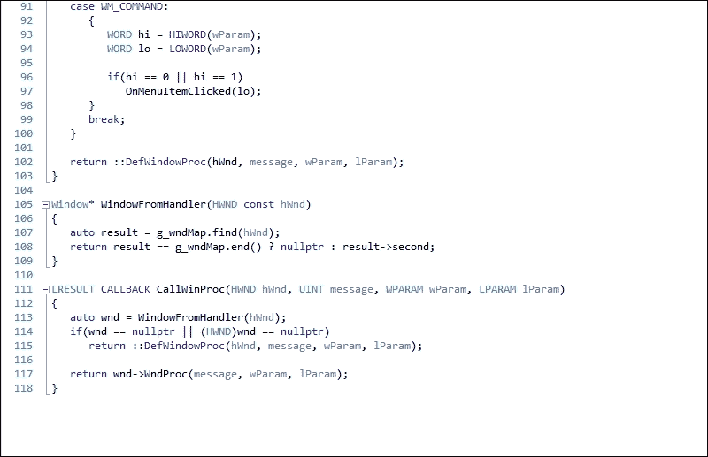
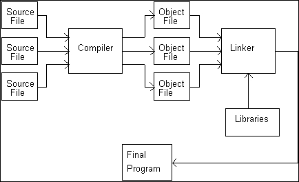
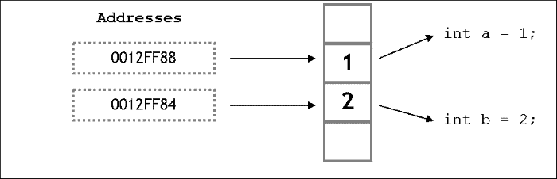
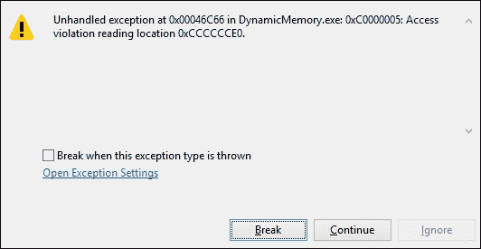
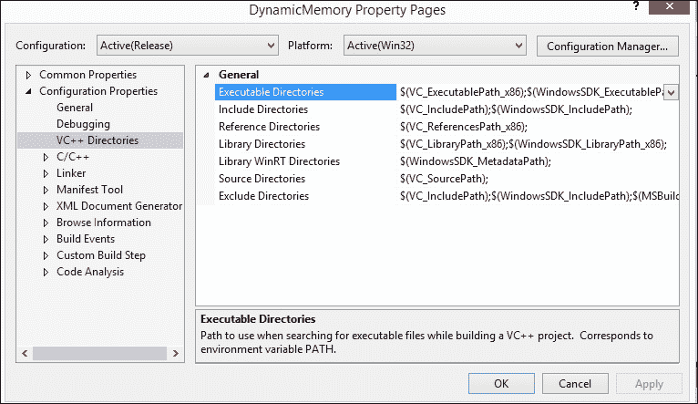

# 第一章：游戏开发基础

在本章中，将涵盖以下食谱：

+   在 Windows 上安装一个 IDE

+   选择合适的源代码控制工具

+   使用调用堆栈进行内存存储

+   谨慎使用递归

+   使用指针存储内存地址

+   在各种数据类型之间进行转换

+   使用动态分配更有效地管理内存

+   使用位操作进行高级检查和优化

# 介绍

在本章中，我们将介绍你在游戏开发中需要了解的基本概念。

在一个人开始编码之前的第一步是安装一个**集成开发环境**（**IDE**）。现在有一些在线 IDE 可用，但我们将使用离线独立的 IDE，**Visual Studio**。许多程序员在早期阶段没有开始使用的下一个最重要的事情是**修订控制软件**。

修订控制软件有助于将代码备份到一个中心位置；它有对所做更改的历史概述，您可以访问并在需要时恢复，它还有助于解决不同程序员同时对同一文件进行的工作之间的冲突。

在我看来，C++最有用的特性是**内存处理**。它让开发人员对内存分配方式有很大的控制，这取决于程序的当前使用和需求。因此，我们可以在需要时分配内存，并相应地释放它。

如果我们不释放内存，我们可能很快就会用完内存，特别是如果我们使用递归。有时需要将一种数据类型转换为另一种，以防止数据丢失，在函数中传递正确的数据类型等。C++提供了一些方法，我们可以通过这些方法进行转换。

本章的食谱主要关注这些主题，并处理实现它们的实际方法。

# 在 Windows 上安装一个 IDE

在这个步骤中，我们将发现在 Windows 机器上安装 Visual Studio 有多么容易。

## 准备工作

要完成这个步骤，你需要一台运行 Windows 的机器。不需要其他先决条件。

## 操作步骤

Visual Studio 是一个强大的 IDE，大多数专业软件都是用它编写的。它有很多功能和插件，帮助我们写出更好的代码：

1.  转到[`www.visualstudio.com`](https://www.visualstudio.com)。

1.  点击**下载 Visual Studio Community**。

下载 Visual Studio Community

1.  这应该下载一个`.exe`文件。

1.  下载完成后，双击安装文件开始安装。

1.  确保你的 Windows 机器上有必要的所有更新。

1.  你也可以下载任何版本的 Visual Studio 或 Visual C++ Express。

1.  如果应用程序要求开始环境设置，请从可用选项中选择**C++**。

### 注意

以下是需要注意的几点：

+   你需要一个 Microsoft 账户来安装它。

+   还有其他免费的 C++ IDE，比如**NetBeans**、**Eclipse**和**Code::Blocks**。

+   虽然 Visual Studio 只适用于 Windows，但 Code::Blocks 和其他跨平台的 IDE 也可以在 Mac 和 Linux 上运行。

在本章的其余部分，所有的代码示例和片段都将使用 Visual Studio 提供。

## 工作原理

IDE 是一个编程环境。IDE 包括各种功能，这些功能在一个 IDE 到另一个 IDE 可能会有所不同。然而，在所有 IDE 中都存在的最基本的功能是代码编辑器、编译器、调试器、链接器和 GUI 构建器。

代码编辑器，或者另一种称呼为源代码编辑器，对程序员编写的代码进行编辑非常有用。它们提供诸如自动校正、语法高亮、括号补全和缩进等功能。下面是 Visual Studio 代码编辑器的示例快照：



**编译器**是一个将您的 C++代码转换为目标代码的计算机程序。这是为了创建可执行文件所必需的。如果您有一个名为`main.cpp`的文件，它将生成一个名为`main.o`的目标代码。

**链接器**是一个将编译器生成的目标代码转换为可执行文件或库文件的计算机程序：



编译器和链接器

**调试器**是一个帮助测试和调试计算机程序的计算机程序。

**GUI 构建器**帮助设计师和程序员轻松创建 GUI 内容或小部件。它使用拖放**所见即所得**工具编辑器。

# 选择正确的源代码控制工具

在这个步骤中，我们将看到使用正确的版本控制来备份我们的代码是多么容易。将备份到中央服务器的优势是您永远不会丢失工作，可以在任何计算机上下载代码，还可以回到过去的任何更改。想象一下，就像我们在游戏中有一个检查点，如果遇到问题，可以回到那个检查点。

## 准备工作

要完成这个步骤，您需要一台运行 Windows 的计算机。不需要其他先决条件。

## 如何做…

选择正确的版本控制工具非常重要，因为它将节省大量时间来组织数据。有几种版本控制工具可用，因此非常重要的是我们应该了解所有这些工具，这样我们就可以根据自己的需求选择正确的工具。

首先分析一下你可以选择的选项。选择主要包括**Concurrent Versions System**（**CVS**），**Apache** **Subversion**（**SVN**），**Mercurial**和**GIT**。

## 工作原理...

CVS 已经存在很长时间了，因此有大量的文档和帮助可用。然而，缺乏原子操作经常导致源代码损坏，不太适合长期分支操作。

SVN 是作为对 CVS 的改进而制作的，它解决了许多与原子操作和源代码损坏有关的问题。它是免费和开源的。它有许多不同 IDE 的插件。然而，这个工具的一个主要缺点是它在操作中相对非常慢。

GIT 主要是为 Linux 开发的，但它大大提高了操作速度。它也适用于 UNIX 系统。它具有廉价的分支操作，但与 Linux 相比，它对单个开发人员的支持有限。然而，GIT 非常受欢迎，许多人更喜欢 GIT 而不是 SVN 或 CVS。

Mercurial 在 GIT 之后不久出现。它具有基于节点的操作，但不允许合并两个父分支。

因此，总之，如果您想要一个其他人可以推送和拉取的中央存储库，请使用 SVN。尽管它有局限性，但很容易学习。如果您想要一个分布式模型，请使用 Mercurial 或 GIT。在这种情况下，每台计算机上都有一个存储库，并且通常有一个被视为*官方*的存储库。如果团队规模相对较小，通常更喜欢 Mercurial，并且比 GIT 更容易学习。

我们将在另一章节中更详细地研究这些内容。

### 提示

有关下载代码包的详细步骤在本书的前言中有提及。请查看。

该书的代码包也托管在 GitHub 上，网址为[`github.com/PacktPublishing/C++Game-Development-Cookbook`](https://github.com/PacktPublishing/C++Game-Development-Cookbook)。我们还有来自丰富书籍和视频目录的其他代码包，可在[`github.com/PacktPublishing/`](https://github.com/PacktPublishing/)上找到。去看看吧！

# 使用调用堆栈进行内存存储

C++仍然是大多数游戏开发者首选的语言的主要原因是你可以自己处理内存并且在很大程度上控制内存的分配和释放。因此，我们需要了解为我们提供的不同内存空间。当数据被“推”到堆栈上时，堆栈增长。当数据被“弹”出堆栈时，堆栈缩小。不可能在不先弹出放在其上面的所有数据的情况下弹出堆栈上的特定数据。把这想象成一系列从上到下排列的隔间。堆栈的顶部是堆栈指针指向的任何隔间（这是一个寄存器）。

每个隔间都有一个顺序地址。其中一个地址被保存在堆栈指针中。在那个神奇的地址下面的所有东西，被称为堆栈的顶部，被认为是在堆栈上。在堆栈顶部以上的所有东西被认为是堆栈之外的。当数据被推送到堆栈上时，它被放入堆栈指针上面的一个隔间中，然后堆栈指针被移动到新的数据上。当数据从堆栈上弹出时，堆栈指针的地址通过向下移动来改变。

## 准备工作

你需要在你的 Windows 机器上安装一个可用的 Visual Studio 副本。

## 如何做…

C++可能是目前最好的编程语言之一，而其中一个主要原因是它也是一种低级语言，因为我们可以操纵内存。要理解内存处理，了解内存堆栈的工作方式非常重要：

1.  打开 Visual Studio。

1.  创建一个新的 C++项目。

1.  选择**Win32 控制台应用程序**。

1.  添加一个名为`main.cpp`的源文件，或者任何你想要命名的源文件。

1.  添加以下代码行：

```cpp
#include <iostream>
#include <conio.h>

using namespace std;

int countTotalBullets(int iGun1Ammo, int iGun2Ammo)
{
    return iGun1Ammo + iGun2Ammo;
}

int main()
{
    int iGun1Ammo = 3;
    int iGun2Ammo = 2;
    int iTotalAmmo = CountTotalBullets(iGun1Ammo, iGun2Ammo);

    cout << "Total ammunition currently with you is"<<iTotalAmmo;

    _getch();
}
```

## 它是如何工作的…

当你调用函数`CountTotalBullets`时，代码会分支到被调用的函数。参数被传递进来，函数体被执行。当函数完成时，一个值被返回，控制返回到调用函数。

但从编译器的角度来看，它是如何真正工作的呢？当你开始你的程序时，编译器创建一个堆栈。**堆栈**是为了在你的程序中保存每个函数的数据而分配的内存的一个特殊区域。堆栈是一个**后进先出**（**LIFO**）的数据结构。想象一副牌；放在牌堆上的最后一张牌将是最先拿出的。

当你的程序调用`CountTotalBullets`时，一个堆栈帧被建立。**堆栈帧**是堆栈中专门留出来管理该函数的区域。这在不同的平台上非常复杂和不同，但这些是基本步骤：

1.  `CountTotalBullets`的返回地址被放在堆栈上。当函数返回时，它将在这个地址继续执行。

1.  为你声明的返回类型在堆栈上留出空间。

1.  所有函数参数都被放在堆栈上。

1.  程序分支到你的函数。

1.  局部变量在定义时被推送到堆栈上。

# 谨慎使用递归

递归是一种编程设计形式，函数多次调用自身以通过将大型解决方案集拆分为多个小解决方案集来解决问题。代码大小肯定会缩短。然而，如果不正确使用，递归可能会非常快地填满调用堆栈，导致内存耗尽。

## 准备工作

要开始使用这个方法，你应该对调用堆栈和函数调用期间内存分配有一些先验知识。你需要一台装有 Visual Studio 的 Windows 机器。

## 如何做…

在这个方法中，你将看到使用递归是多么容易。递归编程非常聪明，但也可能导致一些严重的问题：

1.  打开 Visual Studio。

1.  创建一个新的 C++项目。

1.  选择**Win32 控制台应用程序**。

1.  添加一个名为`main.cpp`的源文件，或者任何你想要命名的源文件。

1.  添加以下代码行：

```cpp
#include <iostream>
#include <conio.h>

using namespace std;
int RecursiveFactorial(int number);
int Factorial(int number);
int main()
{
    long iNumber;
    cout << "Enter the number whose factorial you want to find";
    cin >> iNumber;

    cout << RecursiveFactorial(iNumber) << endl;
    cout << Factorial(iNumber);

    _getch();
    return 0;
}

int Factorial(int number)
{
    int iCounter = 1;
    if (number < 2)
    {
        return 1;
    }
    else
    {
        while (number>0)
        {
            iCounter = iCounter*number;
            number -= 1;
        }

    }
    return iCounter;
}

int RecursiveFactorial(int number)
{
    if (number < 2)
    {
        return 1;
    }
    else
    {
        while (number>0)
    {
            return number*Factorial(number - 1);
        }
    }

}
```

## 工作原理...

从前面的代码中可以看出，这两个函数都可以找到一个数字的阶乘。然而，使用递归时，每次函数调用时堆栈大小都会急剧增长；堆栈指针必须在每次调用时更新，并且数据被推送到堆栈上。使用递归时，由于函数调用自身，每次从内部调用函数时，堆栈大小都会不断增加，直到内存耗尽并创建死锁或崩溃。

想象一下找到 1000 的阶乘。该函数将在自身内部被调用很多次。这是一种导致灾难的方法，我们应该尽量避免这种编码实践。

## 还有更多...

如果要找到大于 15 的数字的阶乘，可以使用比 int 更大的数据类型，因为得到的阶乘将太大而无法存储在 int 中。

# 使用指针存储内存地址

在前两个示例中，我们已经看到内存不足可能会成为我们的问题。然而，直到现在，我们对分配多少内存以及分配给每个内存地址的内容没有任何控制。使用指针，我们可以解决这个问题。在我看来，指针是 C++中最重要的主题。如果你对 C++的概念必须清晰，并且如果你要成为一个优秀的 C++开发人员，你必须擅长使用指针。指针一开始可能看起来很可怕，但一旦你掌握了它，指针就很容易使用。

## 准备就绪

对于这个示例，你需要一台装有 Visual Studio 的 Windows 机器。

## 如何做...

在这个示例中，我们将看到使用指针有多么容易。一旦你熟悉使用指针，我们就可以很容易地操纵内存并在内存中存储引用：

1.  打开 Visual Studio。

1.  创建一个新的 C++项目。

1.  选择**Win32 控制台应用程序**。

1.  添加一个名为`main.cpp`的源文件，或者任何你想要命名源文件。

1.  添加以下代码行：

```cpp
#include <iostream>
#include <conio.h>

using namespace std;

int main()
{
    float fCurrentHealth = 10.0f;

    cout << "Address where the float value is stored: " << &fCurrentHealth << endl;
    cout << "Value at that address: " << *(&fCurrentHealth) << endl;

    float* pfLocalCurrentHealth = &fCurrentHealth;
    cout << "Value at Local pointer variable: "<<pfLocalCurrentHealth << endl;
    cout << "Address of the Local pointer variable: "<<&pfLocalCurrentHealth << endl;
    cout << "Value at the address of the Local pointer variable: "<<*pfLocalCurrentHealth << endl;

    _getch();
    return 0;
}
```

## 工作原理...

C++程序员最强大的工具之一是直接操作计算机内存。**指针**是一个保存内存地址的变量。C++程序中使用的每个变量和对象都存储在内存的特定位置。每个内存位置都有一个唯一的地址。内存地址将根据所使用的操作系统而变化。所占用的字节数取决于变量类型：*float = 4 字节*，*short = 2 字节*：



指针和内存存储

内存中的每个位置都是 1 字节。指针`pfLocalCurrentHealth`保存了存储`fCurrentHealth`的内存位置的地址。因此，当我们显示指针的内容时，我们得到的是与包含`fCurrentHealth`变量的地址相同的地址。我们使用`&`运算符来获取`pfLocalCurrentHealth`变量的地址。当我们使用`*`运算符引用指针时，我们得到存储在该地址的值。由于存储的地址与存储`fCurrentHealth`的地址相同，我们得到值`10`。

## 还有更多...

让我们考虑以下声明：

+   `const float* pfNumber1`

+   `float* const pfNumber2`

+   `const float* const pfNumber3`

所有这些声明都是有效的。但是它们的含义是什么？第一个声明说明`pfNumber1`是一个指向常量浮点数的指针。第二个声明说明`pfNumber2`是一个指向浮点数的常量指针。第三个声明说明`pfNumber3`是一个指向常量整数的常量指针。引用和这三种 const 指针之间的关键区别如下：

+   `const`指针可以是 NULL

+   引用没有自己的地址，而指针有

引用的地址是实际对象的地址

+   指针有自己的地址，并且它的值是它指向的值的地址

### 注意

有关指针和引用的更多信息，请访问以下链接：

[`stackoverflow.com/questions/57483/what-are-the-differences-between-a-pointer-variable-and-a-reference-variable-in/57492#57492`](http://stackoverflow.com/questions/57483/what-are-the-differences-between-a-pointer-variable-and-a-reference-variable-in/57492#57492)

# 在不同数据类型之间进行转换

转换是一种将一些数据转换为不同类型数据的转换过程。我们可以在内置类型或我们自己的数据类型之间进行转换。一些转换是由编译器自动完成的，程序员不必干预。这种转换称为**隐式转换**。其他转换必须由程序员直接指定，称为显式转换。有时我们可能会收到关于*数据丢失*的警告。我们应该注意这些警告，并考虑这可能会对我们的代码产生不利影响。当接口期望特定类型的数据，但我们想要提供不同类型的数据时，通常会使用转换。在 C 中，我们可以将任何东西转换为任何东西。然而，C++为我们提供了更精细的控制。

## 准备工作

对于这个教程，你需要一台装有 Visual Studio 的 Windows 机器。

## 如何做…

在这个教程中，我们将看到如何在各种数据类型之间轻松转换或转换。通常，程序员即使在 C++中也使用 C 风格的转换，但这是不推荐的。C++为不同情况提供了自己的转换风格，我们应该使用它：

1.  打开 Visual Studio。

1.  创建一个新的 C++项目。

1.  选择**Win32 控制台应用程序**。

1.  添加一个名为`main.cpp`的源文件，或者任何你想要命名的源文件。

1.  添加以下代码行：

```cpp
#include <iostream>
#include <conio.h>

using namespace std;

int main()
{
    int iNumber = 5;
    int iOurNumber;
    float fNumber;

    //No casting. C++ implicitly converts the result into an int and saves 
    //into a float
    fNumber = iNumber/2;
    cout << "Number is " << fNumber<<endl;

    //C-style casting. Not recommended as this is not type safe
    fNumber = (float)iNumber / 2;
    cout << "Number is " << fNumber<<endl;

    //C++ style casting. This has valid constructors to make the casting a safe one
    iOurNumber = static_cast<int>(fNumber);
    cout << "Number is " << iOurNumber << endl;

    _getch();
    return 0;
}
```

## 它是如何工作的…

在 C++中有四种类型的转换操作符，取决于我们要转换的内容：`static_cast`、`const_cast`、`reinterpret_cast`和`dynamic_cast`。现在，我们将看看`static_cast`。在讨论动态内存和类之后，我们将看看剩下的三种转换技术。从较小的数据类型转换为较大的类型称为提升，保证不会丢失数据。然而，从较大的数据类型转换为较小的数据类型称为降级，可能会导致数据丢失。当发生这种情况时，编译器通常会给出警告，你应该注意这一点。

让我们看看之前的例子。我们已经用值`5`初始化了一个整数。接下来，我们初始化了一个浮点变量，并存储了`5`除以`2`的结果，即`2.5`。然而，当我们显示变量`fNumber`时，我们看到显示的值是`2`。原因是 C++编译器隐式地将`5/2`的结果转换为整数并存储它。因此，它类似于计算 int(`5/2`)，即 int(`2.5`)，计算结果为`2`。因此，为了实现我们想要的结果，我们有两个选项。第一种方法是 C 风格的显式转换，这是不推荐的，因为它没有类型安全检查。C 风格转换的格式是(`resultant_data_type`) (`expression`)，在这种情况下类似于 float (`5/2`)。我们明确告诉编译器将表达式的结果存储为浮点数。第二种方法，更符合 C++风格的转换方法，是使用`static_cast`操作。这种方法有适当的构造函数来指示转换是类型安全的。`static_cast`操作的格式是`static_cast<resultant_data_type> (expression)`。编译器会检查转换是否安全，然后执行类型转换操作。

# 更有效地管理内存，使用动态分配

程序员通常处理内存的五个领域：全局命名空间，寄存器，代码空间，堆栈和自由存储区。当数组被初始化时，必须定义元素的数量。这导致了许多内存问题。大多数情况下，我们分配的元素并没有全部被使用，有时我们需要更多的元素。为了帮助解决这个问题，C++通过使用自由存储区在`.exe`文件运行时进行内存分配。

自由存储区是一个可以用来存储数据的大内存区域，有时被称为*堆*。我们可以请求一些自由存储区的空间，它会给我们一个地址，我们可以用来存储数据。我们需要将该地址保存在一个指针中。自由存储区直到程序结束才会被清理。程序员有责任释放程序使用的任何自由存储区内存。

自由存储区的优势在于不需要预先分配所有变量。我们可以在运行时决定何时需要更多内存。内存被保留并保持可用，直到显式释放为止。如果在函数中保留内存，当控制从该函数返回时，仍然可用。这比全局变量编码要好得多。只有可以访问指针的函数才能访问存储在内存中的数据，并且它为该数据提供了一个严格控制的接口。

## 准备工作

对于这个配方，你需要一台装有 Visual Studio 的 Windows 机器。

## 如何做...

在这个配方中，我们将看到动态分配是多么容易。在游戏中，大部分内存都是在运行时动态分配的，因为我们从来不确定应该分配多少内存。分配任意数量的内存可能导致内存不足或内存浪费：

1.  打开 Visual Studio。

1.  创建一个新的 C++项目。

1.  添加一个名为`main.cpp`的源文件，或者任何你想要命名的源文件。

1.  添加以下代码行：

```cpp
#include <iostream>
#include <conio.h>
#include <string>

using namespace std;

int main()
{

  int iNumberofGuns, iCounter;
  string * sNameOfGuns;
  cout << "How many guns would you like to purchase? ";
  cin >> iNumberofGuns;
  sNameOfGuns = new string[iNumberofGuns];
  if (sNameOfGuns == nullptr)
    cout << "Error: memory could not be allocated";
  else
  {
    for (iCounter = 0; iCounter<iNumberofGuns; iCounter++)
    {
      cout << "Enter name of the gun: ";
      cin >> sNameOfGuns[iCounter];
    }
    cout << "You have purchased: ";
    for (iCounter = 0; iCounter<iNumberofGuns; iCounter++)
      cout << sNameOfGuns[iCounter] << ", ";
    delete[] sNameOfGuns;
  }

  _getch();
  return 0;
}
```

## 它是如何工作的...

您可以使用`new`关键字将内存分配给自由存储区；`new`后面跟着您想要分配的变量的类型。这允许编译器知道需要分配多少内存。在我们的示例中，我们使用了 string。`new`关键字返回一个内存地址。这个内存地址被分配给一个指针`sNameOfGuns`。我们必须将地址分配给一个指针，否则地址将丢失。使用`new`运算符的格式是`datatype * pointer = new datatype`。所以在我们的示例中，我们使用了`sNameOfGuns = new string[iNumberofGuns]`。如果新的分配失败，它将返回一个空指针。我们应该始终检查指针分配是否成功；否则我们将尝试访问未分配的内存的一部分，并且可能会收到编译器的错误，如下面的屏幕截图所示，您的应用程序将崩溃：



当你完成内存的使用后，必须在指针上调用 delete。Delete 将内存返回给自由存储区。请记住，指针是一个局部变量。指针声明所在的函数作用域结束时，自由存储区上的内存不会自动释放。静态内存和动态内存的主要区别在于，静态内存的创建/删除是自动处理的，而动态内存必须由程序员创建和销毁。

`delete[]`运算符向编译器发出需要释放数组的信号。如果你不加括号，只有数组中的第一个元素会被删除。这将导致内存泄漏。内存泄漏真的很糟糕，因为这意味着有未被释放的内存空间。请记住，内存是有限的空间，所以最终你会遇到麻烦。

当我们使用`delete[]`时，编译器如何知道它必须从内存中释放*n*个字符串？运行时系统将项目数存储在某个位置，只有当你知道指针`sNameOfGuns`时才能检索到。有两种流行的技术可以做到这一点。这两种技术都被商业编译器使用，都有权衡，都不是完美的：

+   技术 1：

过度分配数组，并将项目数放在第一个元素的左侧。这是两种技术中较快的一种，但对于程序员错误地使用`delete sNameOfGuns`而不是`delete[] sNameOfGuns`更敏感。

+   技术 2：

使用关联数组，以指针作为键，项目数作为值。这是两种技术中较慢的一种，但对于程序员错误地使用`delete sNameOfGuns`而不是`delete[] sNameOfGuns`不太敏感。

## 更多内容...

我们还可以使用一个名为**VLD**的工具来检查内存泄漏。

### 注意

从[`vld.codeplex.com/`](https://vld.codeplex.com/)下载 VLD。

设置完成后，安装 VLD 到你的系统上。这可能会或可能不会正确设置 VC++目录。如果没有，可以通过右键单击项目页面并将 VLD 目录添加到名为**包含目录**的字段中手动设置，如下图所示：



设置目录后，在源文件中添加头文件`<vld.h>`。执行应用程序并退出后，输出窗口将显示应用程序中是否存在任何内存泄漏。

### 理解错误消息

在调试构建时，你可能会在调试期间在内存中看到以下值：

+   `0xCCCCCCCC`：这指的是在堆栈上分配的值，但尚未初始化。

+   `0xCDCDCDCD`：这意味着内存已经在堆中分配，但尚未初始化（干净内存）。

+   `0xDDDDDDDD`：这意味着内存已经从堆中释放（死内存）。

+   `0xFEEEFEEE`：这指的是值被从自由存储中释放。

+   `0xFDFDFDFD`："无人之地"栅栏，它们被放置在调试模式下堆内存的边界上。它们不应该被覆盖，如果被覆盖了，这可能意味着程序正在尝试访问数组最大大小之外的索引处的内存。

# 使用位操作进行高级检查和优化

在大多数情况下，程序员不需要过多地担心位，除非有必要编写一些压缩算法，当我们制作游戏时，我们永远不知道是否会出现这样的情况。为了以这种方式压缩和解压文件，你需要实际上在位级别提取数据。最后，你可以使用位操作来加速你的程序或执行巧妙的技巧。但这并不总是推荐的。

## 准备就绪

对于这个示例，你需要一台装有 Visual Studio 的 Windows 机器。

## 如何做...

在这个示例中，我们将看到使用位操作通过操作内存执行操作是多么容易。位操作也是通过直接与内存交互来优化代码的好方法：

1.  打开 Visual Studio。

1.  创建一个新的 C++项目。

1.  添加一个名为`main.cpp`的源文件，或者任何你想要命名的源文件。

1.  添加以下代码行：

```cpp
#include <iostream>
#include <conio.h>

using namespace std;

void Multi_By_Power_2(int iNumber, int iPower);
void BitwiseAnd(int iNumber, int iNumber2);
void BitwiseOr(int iNumber, int iNumber2);
void Complement(int iNumber4);
void BitwiseXOR(int iNumber,int iNumber2);

int main()
{
  int iNumber = 4, iNumber2 = 3;
  int iPower = 2;
  unsigned int iNumber4 = 8;

  Multi_By_Power_2(iNumber, iPower);
  BitwiseAnd(iNumber,iNumber2);
  BitwiseOr(iNumber, iNumber2);
  BitwiseXOR(iNumber,iNumber2);
  Complement(iNumber4);

  _getch();
  return 0;
}

void Multi_By_Power_2(int iNumber, int iPower)
{
  cout << "Result is :" << (iNumber << iPower)<<endl;
}
void BitwiseAnd(int iNumber, int iNumber2)
{
  cout << "Result is :" << (iNumber & iNumber2) << endl;
}
void BitwiseOr(int iNumber, int iNumber2)
{
  cout << "Result is :" << (iNumber | iNumber2) << endl;
}
void Complement(int iNumber4)
{
  cout << "Result is :" << ~iNumber4 << endl;
}
void BitwiseXOR(int iNumber,int iNumber2)
{
  cout << "Result is :" << (iNumber^iNumber2) << endl;
}
```

## 工作原理...

左移操作符相当于将数字的所有位向左移动指定的位数。在我们的例子中，我们发送给函数`Multi_By_Power_2`的数字是`4`和`3`。数字`4`的二进制表示是`100`，所以如果我们将最高有效位（1）向左移动三位，我们得到`10000`，这是`16`的二进制。因此，左移等同于整数除以`2^shift_arg`，即`4*2³`，这又是`16`。类似地，右移操作等同于整数除以`2^shift_arg`。

现在让我们考虑我们想要打包数据，以便压缩数据。考虑以下示例：

```cpp
int totalammo,type,rounds;
```

我们正在存储枪支的总子弹数；枪支的类型，但只能是步枪或手枪；以及它可以发射的每轮总子弹数。目前我们使用三个整数值来存储数据。然而，我们可以将所有前述数据压缩成一个单一整数，从而压缩数据：

```cpp
int packaged_data;
packaged_data = (totalammo << 8) | (type << 7) | rounds;
```

如果我们假设以下符号：

+   总弹药数：`A`

+   类型：`T`

+   轮数：`R`

数据的最终表示将类似于这样：

```cpp
AAAAAAATRRRRRRR
```
