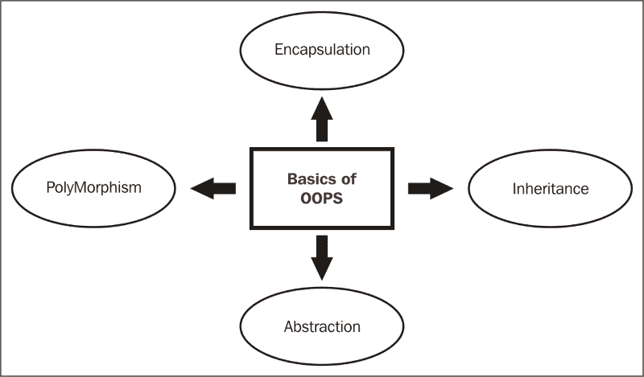
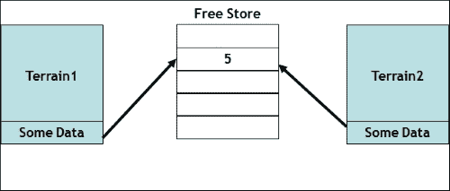
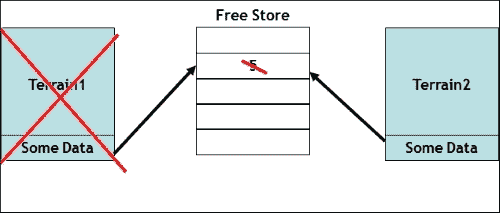
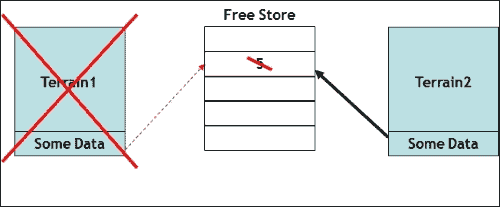

# 第二章：游戏中的面向对象方法和设计

在本章中，我们将介绍以下教程：

+   使用类进行数据封装和抽象

+   使用多态性来重用代码

+   使用复制构造函数

+   使用运算符重载来重用运算符

+   使用函数重载来重用函数

+   使用文件进行输入和输出

+   创建您的第一个简单的基于文本的游戏

+   模板 - 何时使用它们

# 介绍

以下图表显示了**OOP**（**面向对象编程**）的主要概念。让我们假设我们需要制作一款赛车游戏。因此，汽车由发动机、车轮、底盘等组成。所有这些部分都可以被视为单独的组件，也可以用于其他汽车。同样，每辆汽车的发动机都可以是不同的，因此我们可以为每个单独的组件添加不同的功能、状态和属性。

所有这些都可以通过面向对象编程实现：



我们需要在任何包含状态和行为的设计中使用面向对象的系统。让我们考虑一个像*Space Invaders*的游戏。游戏由两个主要角色组成，玩家飞船和敌人。还有一个 boss，但那只是敌人的高级版本。玩家飞船可以有不同的状态，如存活、空闲、移动、攻击和死亡。它还有一些行为，比如左/右移动，单发/连发/导弹。同样，敌人也有状态和行为。这是使用面向对象设计的理想条件。boss 只是敌人的高级形式，因此我们可以使用多态性和继承的概念来实现结果。

# 使用类进行数据封装和抽象

类用于将信息组织成有意义的状态和行为。在游戏中，我们处理许多不同类型的武器、玩家、敌人和地形，每种都有自己的状态和行为类型，因此必须使用具有类的面向对象设计。

## 准备就绪

要完成本教程，您需要一台运行 Windows 的计算机。您需要在 Windows 计算机上安装 Visual Studio 的工作副本。不需要其他先决条件。

## 如何做…

在本教程中，我们将看到使用 C++中的面向对象编程轻松创建游戏框架有多容易：

1.  打开 Visual Studio。

1.  创建一个新的 C++项目。

1.  选择**Win32 控制台应用程序**。

1.  添加名为`Source.cpp`、`CEnemy.h`和`CEnemy.cpp`的源文件。

1.  将以下代码添加到`Souce.cpp`：

```cpp
#include "CEnemy.h"
#include <iostream>
#include <string>
#include <conio.h>
#include "vld.h"

using namespace std;

int main()
{
  CEnemy* pEnemy = new CEnemy(10,100,"DrEvil","GOLD");

  int iAge;
  int iHealth;
  string sName;
  string sArmour;

  iAge = pEnemy->GetAge();
  iHealth = pEnemy->TotalHealth();
  sArmour = pEnemy->GetArmourName();
  sName = pEnemy->GetName();

  cout << "Name of the enemy is :" << sName << endl;
  cout << "Name of " << sName << "'s armour is :" << sArmour << endl;
  cout << "Health of " << sName << " is :" << iHealth << endl;
  cout << sName << "'s age is :" << iAge;

delete pEnemy;
  _getch();
}
```

1.  将以下代码添加到`CEnemy.h`：

```cpp
#ifndef _CENEMY_H
#define _CENEMY_H

#include <string>
using namespace std;

class CEnemy
{
public:
  string GetName()const;
  int GetAge()const;
  string GetArmourName()const;
  int TotalHealth()const;

  //ctors
  CEnemy(int,int,string,string);
//dtors
  ~CEnemy();
private:
  int m_iAge;
  int m_iHealth;
  string m_sName;
  string m_sArmour;
};

#endif
```

1.  将以下代码添加到`CEnemy.cpp`：

```cpp
#include <iostream>
#include <string>
#include "CEnemy.h"

using namespace std;

CEnemy::CEnemy(int Age,int Health,int Armour,int Name)
{
  m_iAge = Age;
  m_iHealth = Health;
  m_sArmour = Armour;
  m_sName = Name;
}

int CEnemy::GetAge()const
{
  return m_iAge;
}

int CEnemy::TotalHealth()const
{
  return m_iHealth;
}

string CEnemy::GetArmourName()const
{
  return m_sArmour;
}

string CEnemy::GetName()const
{
  return m_sName;
}
```

## 它是如何工作的…

创建一个面向对象的程序，我们需要创建类和对象。虽然我们可以在同一个文件中编写类的定义和声明，但建议将定义和声明分开为两个单独的文件。声明类文件称为头文件，而定义类文件称为源文件。

在`CEnemy`头文件中，我们定义了我们需要的成员变量和函数。在一个类中，我们可以选择将变量分为公共、受保护或私有。公共状态表示它们可以从类外部访问，受保护状态表示只有从当前基类继承的子类可以访问它，而私有状态表示它们可以被类的任何实例访问。在 C++类中，默认情况下，一切都是私有的。因此，我们将所有成员函数都创建为公共的，以便我们可以从驱动程序中访问它们，例如本例中的`Source.cpp`。头文件中的成员变量都是私有的，因为它们不应该直接从类外部访问。这就是我们所说的抽象。我们为名称和护甲定义了一个字符串类型的变量，为健康和年龄定义了一个整数类型的变量。即使我们目前没有为它们创建任何功能，也建议创建构造函数和析构函数。最好还使用一个复制构造函数。稍后在本章中会解释这个原因。

在`CEnemy`源文件中，我们对成员变量进行了初始化，并声明了函数。我们在每个函数的末尾使用了`const`关键字，因为我们不希望函数改变成员变量的内容。我们只希望它们返回已经分配的值。作为一个经验法则，除非有必要不使用它，我们应该总是使用它。这使得代码更安全、有组织和可读。我们在构造函数中初始化了变量；我们也可以创建参数化构造函数，并从驱动程序中分配值给它们。或者，我们也可以创建设置函数来分配值。

从驱动程序中，我们创建一个`CEnemy`类型的指针对象。当对象被初始化时，它调用适当的构造函数并将值分配给它们。然后我们通过使用`->`运算符对指针进行解引用来调用函数。因此，当我们调用`p->`函数时，它与(`*p`).function 相同。由于我们是动态分配内存，我们还应该删除对象，否则会出现内存泄漏。我们已经使用`vld`来检查内存泄漏。这个程序没有任何内存泄漏，因为我们使用了`delete`关键字。只需注释掉`delete pEnemy;`这一行，你会注意到程序在退出时有一些内存泄漏。

# 使用多态来重用代码

多态意味着具有多种形式。通常，当类的层次结构存在某种关联时，我们使用多态。我们通常通过使用继承来实现这种关联。

## 准备工作

你需要在 Windows 机器上安装 Visual Studio 的工作副本。

## 如何做…

在这个示例中，我们将看到如何使用相同的函数并根据需要覆盖它们的不同功能。此外，我们还将看到如何在基类和派生类之间共享值：

1.  打开 Visual Studio。

1.  创建一个新的 C++项目。

1.  选择**Win32 控制台应用程序**。

1.  添加一个名为 Source.cpp 的源文件和三个名为`Enemy.h`、`Dragon.h`和`Soldier.h`的头文件。

1.  将以下代码行添加到`Enemy.h`中：

```cpp
#ifndef _ENEMY_H
#define _ENEMY_H

#include <iostream>

using namespace std;

class CEnemy {
protected:
  int m_ihealth,m_iarmourValue;
public:
  CEnemy(int ihealth, int iarmourValue) : m_ihealth(ihealth), m_iarmourValue(iarmourValue) {}
  virtual int TotalHP(void) = 0;
  void PrintHealth()
  {
    cout << "Total health is " << this->TotalHP() << '\n';
  }
};

   #endif
```

1.  将以下代码行添加到`Dragon.h`中：

```cpp
#ifndef _DRAGON_H
#define _DRAGON_H

#include "Enemy.h"
#include <iostream>

using namespace std;

class CDragon : public CEnemy {
public:
  CDragon(int m_ihealth, int m_iarmourValue) : CEnemy(m_ihealth, m_iarmourValue)
  {
  }
  int TotalHP()
  {
    cout << "Dragon's ";
    return m_ihealth*2+3*m_iarmourValue;
  }
};

  #endif
```

1.  将以下代码行添加到`Soldier.h`中：

```cpp
#ifndef _SOLDIER_H
#define _SOLDIER_H

#include "Enemy.h"
#include <iostream>

using namespace std;

class CSoldier : public CEnemy {
public:
  CSoldier(int m_ihealth, int m_iarmourValue) : CEnemy(m_ihealth, m_iarmourValue) {}
  int TotalHP()
  {
    cout << "Soldier's ";
    return m_ihealth+m_iarmourValue;
  }
};

#endif
```

1.  将以下代码行添加到`Source.cpp`中：

```cpp
// dynamic allocation and polymorphism
#include <iostream>
#include <conio.h>
#include "vld.h"
#include "Enemy.h"
#include "Dragon.h"
#include "Soldier.h"

int main()
 {
  CEnemy* penemy1 = new CDragon(100, 50);
  CEnemy* penemy2 = new CSoldier(100, 100);

  penemy1->PrintHealth();
  penemy2->PrintHealth();

  delete penemy1;
  delete penemy2;

  _getch();
  return 0;

}
```

## 它是如何工作的…

多态是具有不同形式的能力。因此，在这个例子中，我们有一个`Enemy`接口，它没有任何用于计算总体健康的功能。然而，我们知道所有类型的敌人都应该有一个计算总体健康的功能。因此，我们通过将基类中的函数设置为纯虚函数（通过将其分配为`0`）来实现这个功能。

这使得所有子类都必须有自己的实现来计算总健康值。因此，`CSoldier`类和`CDragon`类都有自己的`TotalHP`实现。这种结构的优势在于，我们可以从基类创建子类的指针对象，并且在解析时，它调用子类的正确函数。

如果我们不创建虚函数，那么子类中的函数将隐藏基类的函数。然而，使用纯虚函数，这是不正确的，因为这将创建一个编译器错误。编译器在运行时解析函数的方式是通过一种称为动态分派的技术。大多数语言使用动态分派。C++使用单一转发动态分派。它借助虚拟表来实现。当`CEnemy`类定义虚函数`TotalHP`时，编译器向类添加一个隐藏的成员变量，该成员变量指向一个名为虚方法表（VMT）或 Vtable 的函数指针数组。在运行时，这些指针将被设置为指向正确的函数，因为在编译时还不知道是调用基函数还是由`CDragon`和`CSoldier`实现的派生函数。

基类中的成员变量是受保护的。这意味着派生类也可以访问成员变量。从驱动程序中，因为我们动态分配了内存，我们也应该删除，否则我们将会有内存泄漏。当析构函数标记为虚函数时，我们确保调用正确的析构函数。

# 使用复制构造函数

复制构造函数用于将一个对象复制到另一个对象。C++为我们提供了一个默认的复制构造函数，但不建议使用。我们应该为更好的编码和组织实践编写自己的复制构造函数。它还可以最小化使用 C++提供的默认复制构造函数可能引起的崩溃和错误。

## 准备工作

您需要在 Windows 机器上安装 Visual Studio 的工作副本。

## 如何做...

在这个示例中，我们将看到编写复制构造函数有多么容易：

1.  打开 Visual Studio。

1.  创建一个新的 C++项目。

1.  选择**Win32 控制台应用程序**。

1.  添加名为`Source.cpp`和`Terrain.h`的源文件。

1.  在`Terrain.h`中添加以下代码行：

```cpp
#pragma once
#include <iostream>

using namespace std;
class CTerrain
{
public:
  CTerrainCTerrain();
  ~CTerrain();

  CTerrain(const CTerrain &T)
  {
    cout << "\n Copy Constructor";
  }
  CTerrain& operator =(const CTerrain &T)
  {
    cout << "\n Assignment Operator";
    return *this;
  }
};
```

1.  在`Source.cpp`中添加以下代码行：

```cpp
#include <conio.h>
#include "Terrain.h"

using namespace std;

int main()
{
  CTerrain Terrain1,Terrain2;

  Terrain1 = Terrain2;

  CTerrain Terrain3 = Terrain1;

  _getch();
  return 0;
}
```

## 它是如何工作的...

在这个例子中，我们创建了自己的复制构造函数和赋值运算符。当我们给已经初始化的两个对象赋值时，赋值运算符被调用。当我们初始化一个对象并将其设置为另一个对象时，复制构造函数被调用。如果我们不创建自己的复制构造函数，新创建的对象只是持有被赋值对象的浅层引用。如果对象被销毁，那么浅层对象也会丢失，因为内存也会丢失。如果我们创建自己的复制构造函数，就会创建一个深层复制，即使第一个对象被删除，第二个对象仍然在不同的内存位置中保存信息。



因此，浅层复制（或成员逐一复制）将一个对象的成员变量的确切值复制到另一个对象中。两个对象中的指针最终指向相同的内存。深层复制将在自由存储器上分配的值复制到新分配的内存中。因此，在浅层删除中，浅层复制中的对象是灾难性的：



然而，深层复制为我们解决了这个问题：



# 使用运算符重载来重用运算符

C++为我们提供了许多运算符。但是，有时我们需要重载这些运算符，以便我们可以在自己创建的数据结构上使用它们。当然，我们也可以重载运算符以改变其含义。例如，我们可以将+（加号）改为行为像-（减号），但这并不推荐，因为这通常没有任何意义或帮助我们。此外，这可能会让使用相同代码库的其他程序员感到困惑。

## 准备工作

您需要在 Windows 机器上安装 Visual Studio 的工作副本。

## 如何做…

在这个示例中，我们将看到如何重载运算符以及在 C++中允许重载哪些运算符。

1.  打开 Visual Studio。

1.  创建一个新的 C++项目。

1.  选择**Win32 控制台应用程序**。

1.  添加名为`Source.cpp`、`vector3.h`和`vector3.cpp`的源文件。

1.  将以下代码添加到`Source.cpp`：

```cpp
#include "vector3.h"
#include <conio.h>
#include "vld.h"

int main()
{
  // Vector tests:

  // Create two vectors.
  CVector3 a(1.0f, 2.0f, 3.0f);
  CVector3 b(1.0f, 2.0f, 3.0f);

  CVector3 c;

  // Zero Vector.
  c.Zero();

  // Addition.
  CVector3 d = a + b;

  // Subtraction.
  CVector3 e = a - b;

  //Scalar Multiplication.
  CVector3 f1 = a * 10;

  //Scalar Multiplication.
  CVector3 f2 = 10 * a;

  //Scalar Division.
  CVector3 g = a / 10;

  // Unary minus.
  CVector3 h = -a;

  // Relational Operators.
  bool bAEqualsB = (a == b);
  bool bANotEqualsB = (a != b);

  // Combined operations +=.
  c = a;
  c += a;

  // Combined operations -=.
  c = a;
  c -= a;

  // Combined operations /=.
  c = a;
  c /= 10;

  // Combined operations *=.
  c = a;
  c *= 10;

  // Normalization.
  c.Normalize();

  // Dot Product.
  float fADotB = a * b;

  // Magnitude.
  float fMag1 = CVector3::Magnitude(a);
  float fMag2 = CVector3::Magnitude(c);

  // Cross product.
  CVector3 crossProduct = CVector3::CrossProduct(a, c);

  // Distance.
  float distance = CVector3::Distance(a, c);

  _getch();
  return (0);

}
```

1.  将以下代码添加到`vector3.h`：

```cpp
#ifndef __VECTOR3_H__
#define __VECTOR3_H__

#include <cmath>

class CVector3
{
public:
  // Public representation: Not many options here.
  float x;
  float y;
  float z;

  CVector3();
  CVector3(const CVector3& _kr);
  CVector3(float _fx, float _fy, float _fz);

  // Assignment operator.
  CVector3& operator =(const CVector3& _kr);

  // Relational operators.
  bool operator ==(const CVector3& _kr) const;
  bool operator !=(const CVector3& _kr) const;

  // Vector operations
  void Zero();

  CVector3 operator -() const;
  CVector3 operator +(const CVector3& _kr) const;
  CVector3 operator -(const CVector3& _kr) const;

  // Multiplication and division by scalar.
  CVector3 operator *(float _f) const;
  CVector3 operator /(float _f) const;

  // Combined assignment operators to conform to C notation convention.
  CVector3& operator +=(const CVector3& _kr);
  CVector3& operator -=(const CVector3& _kr);
  CVector3& operator *=(float _f);
  CVector3& operator /=(float _f);

  // Normalize the vector
  void Normalize();
  // Vector dot product.
  // We overload the standard multiplication symbol to do this.
  float operator *(const CVector3& _kr) const;

  // Static member functions.

  // Compute the magnitude of a vector.
  static inline float Magnitude(const CVector3& _kr)
  {
    return (sqrt(_kr.x * _kr.x + _kr.y * _kr.y + _kr.z * _kr.z));
  }

  // Compute the cross product of two vectors.
  static inline CVector3 CrossProduct(const CVector3& _krA,
    const CVector3& _krB)
  {
    return
      (
      CVector3(_krA.y * _krB.z - _krA.z * _krB.y,
      _krA.z * _krB.x - _krA.x * _krB.z,
      _krA.x * _krB.y - _krA.y * _krB.x)
      );
  }

  // Compute the distance between two points.
  static inline float Distance(const CVector3& _krA, const CVector3& _krB)
  {
    float fdx = _krA.x - _krB.x;
    float fdy = _krA.y - _krB.y;
    float fdz = _krA.z - _krB.z;

    return sqrt(fdx * fdx + fdy * fdy + fdz * fdz);
  }
};

// Scalar on the left multiplication, for symmetry.
inline CVector3 operator *(float _f, const CVector3& _kr)
{
  return (CVector3(_f * _kr.x, _f * _kr.y, _f * _kr.z));
}

#endif // __VECTOR3_H__
```

1.  将以下代码添加到`vector3.cpp`：

```cpp
#include "vector3.h"

// Default constructor leaves vector in an indeterminate state.
CVector3::CVector3()
{

}

// Copy constructor.
CVector3::CVector3(const CVector3& _kr)
: x(_kr.x)
, y(_kr.y)
, z(_kr.z)
{

}

// Construct given three values.
CVector3::CVector3(float _fx, float _fy, float _fz)
: x(_fx)
, y(_fy)
, z(_fz)
{

}

// Assignment operator, we adhere to C convention and return reference to the lvalue.
CVector3&
CVector3::operator =(const CVector3& _kr)
{
  x = _kr.x;
  y = _kr.y;
  z = _kr.z;

  return (*this);
}

// Equality operator.
bool
CVector3::operator ==(const CVector3&_kr) const
{
  return (x == _kr.x && y == _kr.y && z == _kr.z);
}

// Inequality operator.
bool
CVector3::operator !=(const CVector3& _kr) const
{
  return (x != _kr.x || y != _kr.y || z != _kr.z);
}

// Set the vector to zero.
void
CVector3::Zero()
{
  x = 0.0f;
  y = 0.0f;
  z = 0.0f;
}

// Unary minus returns the negative of the vector.
CVector3
CVector3::operator -() const
{
  return (CVector3(-x, -y, -z));
}

// Binary +, add vectors.
CVector3
CVector3::operator +(const CVector3& _kr) const
{
  return (CVector3(x + _kr.x, y + _kr.y, z + _kr.z));
}

// Binary –, subtract vectors.
CVector3
CVector3::operator -(const CVector3& _kr) const
{
  return (CVector3(x - _kr.x, y - _kr.y, z - _kr.z));
}

// Multiplication by scalar.
CVector3
CVector3::operator *(float _f) const
{
  return (CVector3(x * _f, y * _f, z * _f));
}

// Division by scalar.
// Precondition: _f must not be zero.
CVector3
CVector3::operator /(float _f) const
{
  // Warning: no check for divide by zero here.
  ASSERT(float fOneOverA = 1.0f / _f);

  return (CVector3(x * fOneOverA, y * fOneOverA, z * fOneOverA));
}

CVector3&
CVector3::operator +=(const CVector3& _kr)
{
  x += _kr.x;
  y += _kr.y;
  z += _kr.z;

  return (*this);
}

CVector3&
CVector3::operator -=(const CVector3& _kr)
{
  x -= _kr.x;
  y -= _kr.y;
  z -= _kr.z;

  return (*this);
}

CVector3&
CVector3::operator *=(float _f)
{
  x *= _f;
  y *= _f;
  z *= _f;

  return (*this);
}

CVector3&
CVector3::operator /=(float _f)
{
  float fOneOverA = ASSERT(1.0f / _f);

  x *= fOneOverA;
  y *= fOneOverA;
  z *= fOneOverA;

  return (*this);
}

void
CVector3::Normalize()
{
  float fMagSq = x * x + y * y + z * z;

  if (fMagSq > 0.0f)
  {
    // Check for divide-by-zero.
    float fOneOverMag = 1.0f / sqrt(fMagSq);

    x *= fOneOverMag;
    y *= fOneOverMag;
    z *= fOneOverMag;
  }
}

// Vector dot product.
//    We overload the standard multiplication symbol to do this.
float
CVector3::operator *(const CVector3& _kr) const
{
  return (x * _kr.x + y * _kr.y + z * _kr.z);
}
```

## 工作原理…

C++具有内置类型：int、char 和 float。每种类型都有许多内置运算符，如加法（+）和乘法（*）。C++还允许您将这些运算符添加到自己的类中。内置类型（int、float）上的运算符不能被重载。优先级顺序不能被改变。在重载运算符时要谨慎的原因有很多。目标是增加可用性和理解。在我们的示例中，我们已经重载了基本的乘法运算符，以便我们可以对我们创建的`vector3`对象进行加法、减法等操作。这非常方便，因为如果我们知道两个对象的位置向量，我们就可以在游戏中找到对象的距离。我们尽可能使用 const 函数。编译器将强制执行不修改对象的承诺。这可以是确保您的代码没有意外副作用的好方法。

所有接受向量的函数都接受向量的常量引用。我们必须记住，将参数按值传递给函数会调用构造函数。继承对于向量类并不是非常有用，因为我们知道`CVector3`是速度关键的。虚函数表会使类大小增加 25%，因此不建议使用。

此外，数据隐藏并没有太多意义，因为我们需要向量类的值。在 C++中可以重载一些运算符。C++不允许我们重载的运算符是：

```cpp
(Member Access or Dot operator),?: (Ternary or Conditional Operator),:: (Scope Resolution Operator),.* (Pointer-to-member Operator),sizeof (Object size Operator) and typeid (Object type Operator)
```

# 使用函数重载来重用函数

函数重载是 C++中的一个重要概念。有时，我们希望使用相同的函数名称，但有不同的函数来处理不同的数据类型或不同数量的类型。这是有用的，因为客户端可以根据自己的需求选择正确的函数。C++允许我们通过函数重载来实现这一点。

## 准备工作

对于这个示例，您需要一台安装有 Visual Studio 工作副本的 Windows 机器。

## 如何做…

在这个示例中，我们将学习如何重载函数：

1.  打开 Visual Studio。

1.  创建一个新的 C++项目。

1.  选择**Win32 控制台应用程序**。

1.  添加名为`main.cpp`、`Cspeed.h`和`Cspeed.cpp`的源文件。

1.  将以下代码添加到`main.cpp`：

```cpp
#include <iostream>
#include <conio.h>
#include "CSpeed.h"

using namespace std;

//This is not overloading as the function differs only
//in return type
/*int Add(float x, float y)
{
  return x + y;
}*/

int main()
{
  CSpeed speed;

  cout<<speed.AddSpeed(2.4f, 7.9f)<<endl;
  cout << speed.AddSpeed(4, 5)<<endl;
  cout << speed.AddSpeed(4, 9, 12)<<endl;

  _getch();
  return 0;
}
```

1.  将以下代码添加到`CSpeed.cpp`：

```cpp
#include "CSpeed.h"

CSpeed::CSpeed()
{

}

CSpeed::~CSpeed()
{

}
int CSpeed::AddSpeed(int x, int y, int z)
{
  return x + y + z;
}
int CSpeed::AddSpeed(int x, int y)
{
  return x + y;
}
float CSpeed::AddSpeed(float x, float y)
{
  return x + y;
}
```

1.  将以下代码添加到`CSpeed.h`：

```cpp
#ifndef _VELOCITY_H
#define _VELOCITY_H

class CSpeed
{
public:
  int AddSpeed(int x, int y, int z);
  int AddSpeed(int x, int y);
  float AddSpeed(float x, float y);

  CSpeed();
  ~CSpeed();
private:

};

#endif
```

## 工作原理…

函数重载是一种函数多态的类型。函数只能通过参数列表中的参数数量和参数类型进行重载。函数不能仅通过返回类型进行重载。

我们已经创建了一个类来计算速度的总和。我们可以使用该函数来添加两个速度、三个速度或不同数据类型的速度。编译器将根据签名解析要调用的函数。有人可能会认为我们可以创建不同速度的不同对象，然后使用运算符重载来添加它们，或者使用模板编写一个模板函数。然而，我们必须记住，在简单的模板中，实现将保持不变，但在函数重载中，我们也可以更改每个函数的实现。

# 使用文件进行输入和输出

文件对于保存本地数据非常有用，这样我们可以在程序下次运行时检索数据，或者在程序退出后分析数据。对于我们在代码中创建并填充值的所有数据结构，除非我们将它们保存在本地或服务器/云端，否则这些值在应用程序退出后将丢失。文件用于包含保存的数据。我们可以创建文本文件、二进制文件，甚至具有我们自己加密的文件。当我们想要记录错误或生成崩溃报告时，文件非常方便。

## 准备就绪

对于这个食谱，您需要一台装有 Visual Studio 的 Windows 机器。

## 如何做...

在这个食谱中，我们将了解如何在 C++中使用文件处理操作来读取或写入文本文件。我们甚至可以使用 C++操作来创建二进制文件。

1.  打开 Visual Studio。

1.  创建一个新的 C++项目。

1.  选择**Win32 控制台应用程序**。

1.  添加名为`Source.cpp`、`File.h`和`File.cpp`的源文件。

1.  将以下代码添加到`Source.cpp`中：

```cpp
#include <conio.h>
#include "File.h"

int main() {

  CFile file;

  file.WriteNewFile("Example.txt");
  file.WriteNewFile("Example.txt", "Logging text1");
  file.AppendFile("Example.txt", "Logging text2");
  file.ReadFile("Example.txt");

  _getch();
  return 0;
}
```

1.  将以下代码添加到`File.cpp`中：

```cpp
#include "File.h"
#include <string>
#include <fstream>
#include <iostream>

using namespace std;

CFile::CFile()
{
  Text = "This is the initial data";
}
CFile::~CFile()
{

}
void CFile::WriteNewFile(string Filename)const
{
  ofstream myfile(Filename);
  if (myfile.is_open())
  {
    myfile << Text;

    myfile.close();
  }
  else cout << "Unable to open file";
}
void CFile::WriteNewFile(string Filename,string Text)const
{
  ofstream myfile(Filename);
  if (myfile.is_open())
  {
    myfile << Text;

    myfile.close();
  }
  else cout << "Unable to open file";
}

void CFile::AppendFile(string Filename, string Text)const
{
  ofstream outfile;

  outfile.open(Filename, ios_base::app);
  outfile << Text;
       outfile.close();

}
void CFile::ReadFile(string Filename)const
{
  string line;
  ifstream myfile(Filename);
  if (myfile.is_open())
  {
    while (getline(myfile, line))
    {
      cout << line << '\n';
    }
    myfile.close();
  }

  else cout << "Unable to open file";
}
```

1.  将以下代码添加到`File.h`中：

```cpp
#ifndef _FILE_H
#define _FILE_H

#include <iostream>
#include <string.h>
using namespace std;

class CFile
{
public:
  CFile();
  ~CFile();

  void WriteNewFile(string Filename)const;
  void WriteNewFile(string Filename, string Text)const;
  void AppendFile(string Filename, string Text)const;
  void ReadFile(string Filename)const;
private:

  string Text;
};
#endif
```

## 它是如何工作的...

我们使用文件处理有各种原因。其中一些最重要的原因是在游戏运行时记录数据、从文本文件中加载数据以在游戏中使用，或者加密保存数据或加载游戏数据。

我们已经创建了一个名为`CFile`的类。这个类帮助我们向新文件写入数据，向文件追加数据，并从文件中读取数据。我们使用`fstream`头文件来加载所有文件处理操作。

文件中的所有内容都是以流的形式写入和读取的。在进行 C++编程时，我们必须使用流插入运算符(`<<`)从程序中向文件写入信息，就像我们使用该运算符向屏幕输出信息一样。唯一的区别是，您使用`ofstream`或`fstream`对象，而不是`cout`对象。

我们已经创建了一个构造函数，用于在没有任何数据的情况下创建文件时包含初始数据。如果我们只是创建或写入文件，每次都会创建一个新文件，并带有新数据。如果我们只想写入最近更新或最新的数据，这有时是有用的。但是，如果我们想向现有文件添加数据，我们可以使用`append`函数。追加函数从最后的文件位置指针位置开始向现有文件写入。

读取函数开始从文件中读取数据，直到达到最后一行写入的数据。我们可以将结果显示到屏幕上，或者如果需要，然后将内容写入另一个文件。我们还必须记住在每次操作后关闭文件，否则可能会导致代码的歧义。我们还可以使用`seekp`和`seekg`函数来重新定位文件位置指针。

# 创建你的第一个简单游戏

创建一个简单的基于文本的游戏非常容易。我们所需要做的就是创建一些规则和逻辑，我们就会有一个游戏。当然，随着游戏变得更加复杂，我们需要添加更多的函数。当游戏达到一个点，其中有多个对象和敌人的行为和状态时，我们应该使用类和继承来实现所需的结果。

## 准备就绪

要完成这个示例，您需要一台运行 Windows 的机器。您还需要在 Windows 机器上安装一个可用的 Visual Studio 副本。不需要其他先决条件。

## 如何做...

在这个示例中，我们将学习如何创建一个简单的基于运气的抽奖游戏：

1.  打开 Visual Studio。

1.  创建一个新的 C++项目。

1.  选择**Win32 控制台应用程序**。

1.  添加一个`Source.cpp`文件。

1.  将以下代码添加到其中：

```cpp
#include <iostream>
#include <cstdlib>
#include <ctime>

int main(void) {
  srand(time(NULL)); // To not have the same numbers over and over again.

  while (true) { // Main loop.
    // Initialize and allocate.
    int inumber = rand() % 100 + 1 // System number is stored in here.
    int iguess; // User guess is stored in here.
    int itries = 0; // Number of tries is stored here.
    char canswer; // User answer to question is stored here.

    while (true) { // Get user number loop.
      // Get number.
      std::cout << "Enter a number between 1 and 100 (" << 20 - itries << " tries left): ";
      std::cin >> iguess;
      std::cin.ignore();

      // Check is tries are taken up.
      if (itries >= 20) {
        break;
      }

      // Check number.
      if (iguess > inumber) {
        std::cout << "Too high! Try again.\n";
      }
      else if (iguess < inumber) {
        std::cout << "Too low! Try again.\n";
      }
      else {
        break;
      }

      // If not number, increment tries.
      itries++;
    }

    // Check for tries.
    if (itries >= 20) {
      std::cout << "You ran out of tries!\n\n";
    }
    else {
      // Or, user won.
      std::cout << "Congratulations!! " << std::endl;
      std::cout << "You got the right number in " << itries << " tries!\n";
    }

    while (true) { // Loop to ask user is he/she would like to play again.
      // Get user response.
      std::cout << "Would you like to play again (Y/N)? ";
      std::cin >> canswer;
      std::cin.ignore();

      // Check if proper response.
      if (canswer == 'n' || canswer == 'N' || canswer == 'y' || canswer == 'Y') {
        break;
      }
      else {
        std::cout << "Please enter \'Y\' or \'N\'...\n";
      }
    }

    // Check user's input and run again or exit;
    if (canswer == 'n' || canswer == 'N') {
      std::cout << "Thank you for playing!";
      break;
    }
    else {
      std::cout << "\n\n\n";
    }
  }

  // Safely exit.
  std::cout << "\n\nEnter anything to exit. . . ";
  std::cin.ignore();
  return 0;
}
```

## 它是如何工作的...

游戏的工作原理是创建一个从 1 到 100 的随机数，并要求用户猜测该数字。会提供提示，告诉用户猜测的数字是高于还是低于实际数字。用户只有 20 次机会来猜测数字。我们首先需要一个伪随机数生成器，基于它我们将生成一个随机数。在这种情况下，伪随机数生成器是`srand`。我们选择了时间作为生成随机范围的值。

我们需要在一个无限循环中执行程序，这样程序只有在所有尝试用完或用户正确猜出数字时才会中断。我们可以为尝试设置一个变量，并为用户每次猜测增加一个。随机数由 rand 函数生成。我们使用`rand%100+1`，这样随机数就在 1 到 100 的范围内。我们要求用户输入猜测的数字，然后我们检查该数字是小于、大于还是等于随机生成的数字。然后显示正确的消息。如果用户猜对了，或者所有尝试都已经用完，程序应该跳出主循环。在这一点上，我们询问用户是否想再玩一次游戏。

然后，根据答案，我们重新进入主循环，并开始选择一个随机数的过程。

# 模板-何时使用它们

模板是 C++编程的一种方式，为编写泛型程序奠定基础。使用模板，我们可以以独立于任何特定数据类型的方式编写代码。我们可以使用函数模板或类模板。

## 准备工作

对于这个示例，您需要一台安装有 Visual Studio 的 Windows 机器。

## 如何做...

在这个示例中，我们将了解模板的重要性，如何使用它们以及使用它们提供给我们的优势。

1.  打开 Visual Studio。

1.  创建一个新的 C++项目。

1.  添加名为`Source.cpp`和`Stack.h`的源文件。

1.  将以下代码添加到`Source.cpp`中：

```cpp
#include <iostream>
#include <conio.h>
#include <string>
#include "Stack.h"

using namespace std;

template<class T>
void Print(T array[], int array_size)
{
  for (int nIndex = 0; nIndex < array_size; ++nIndex)
  {  
    cout << array[nIndex] << "\t";
  }
  cout << endl;
}

int main()
{
  int iArray[5] = { 4, 5, 6, 6, 7 };
  char cArray[3] = { 's', 's', 'b' };
  string sArray[3] = { "Kratos", "Dr.Evil", "Mario" };

  //Printing any type of elements
  Print(iArray, sizeof(iArray) / sizeof(*iArray));
  Print(cArray, sizeof(cArray) / sizeof(*cArray));
  Print(sArray, sizeof(sArray) / sizeof(*sArray));

  Stack<int> iStack;

  //Pushes an element to the bottom of the stack
  iStack.push(7);

  cout << iStack.top() << endl;

  for (int i = 0; i < 10; i++)
  {
    iStack.push(i);
  }

  //Removes an element from the top of the stack
  iStack.pop();

  //Prints the top of stack
  cout << iStack.top() << endl;

  _getch();
}
```

1.  将以下代码添加到`Stack.h`中：

```cpp
#include <vector>

using namespace std;

template <class T>
class Stack {
private:
  vector<T> elements;     // elements

public:
  void push(T const&);  // push element
  void pop();               // pop element
  T top() const;            // return top element
  bool empty() const{       // return true if empty.
    return elements.empty();
  }
};

template <class T>
void Stack<T>::push(T const& elem)
{
  // append copy of passed element
  elements.push_back(elem);
}

template <class T>
void Stack<T>::pop()
{
  if (elements.empty()) {
    throw out_of_range("Stack<>::pop(): empty stack");
  }
  // remove last element
  elements.pop_back();
}

template <class T>
T Stack<T>::top() const
{
  if (elements.empty()) {
    throw out_of_range("Stack<>::top(): empty stack");
  }
  // return copy of last element
  return elements.back();
}
```

## 它是如何工作的...

模板是 C++中泛型编程的基础。如果函数或类的实现相同，但我们需要它们操作不同的数据类型，建议使用模板而不是编写新的类或函数。有人可能会说我们可以重载一个函数来实现相同的功能，但请记住，当重载一个函数时，我们可以根据数据类型改变实现，而且我们仍然在编写一个新的函数。使用模板，实现必须对所有数据类型都相同。这就是模板的优势：编写一个函数就足够了。使用高级模板和 C++11 特性，我们甚至可以改变实现，但我们将把这个讨论留到以后。

在这个示例中，我们使用了函数模板和类模板。函数模板是在`Source.cpp`中定义的。在`print`函数的顶部，我们添加了模板`<class T>`。`关键字`类也可以被`typename`替换。两个关键字的原因是历史性的，我们不需要在这里讨论。函数定义的其余部分是正常的，只是我们使用了`T`代替了特定的数据类型。所以当我们从主函数调用函数时，`T`会被正确的数据类型替换。通过这种方式，只需使用一个函数，我们就可以打印所有数据类型。我们甚至可以创建自己的数据类型并将其传递给函数。

`Stack.h` 是一个类模板的示例，因为类使用的数据类型是通用的。我们选择了堆栈，因为它是游戏编程中非常流行的数据结构。它是一个**LIFO**（**后进先出**）结构，因此我们可以根据我们的需求显示堆栈中的最新内容。push 函数将一个元素推入堆栈，而 pop 函数将一个元素从堆栈中移除。top 函数显示堆栈中的顶部元素，empty 函数清空堆栈。通过使用这个通用的堆栈类，我们可以存储和显示我们选择的数据类型。

在使用模板时需要记住的一件事是，编译器必须在编译时知道模板的正确实现，因此通常模板的定义和声明都在头文件中完成。然而，如果你想将两者分开，可以使用两种流行的方法。一种方法是使用另一个头文件，并在其末尾列出实现。另一种方法是创建一个`.ipp`或`.tpp`文件扩展名，并在这些文件中进行实现。
