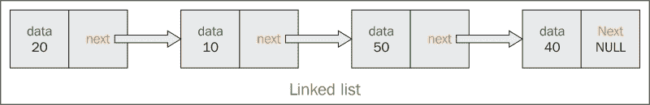
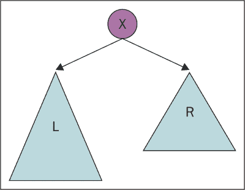
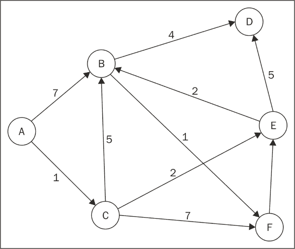

# 第三章：游戏开发中的数据结构

在本章中，将涵盖以下示例：

+   使用更高级的数据结构

+   使用链表存储数据

+   使用栈存储数据

+   使用队列存储数据

+   使用树存储数据

+   使用图形存储数据

+   使用 STL 列表存储数据

+   使用 STL 映射存储数据

+   使用 STL 哈希表存储数据

# 介绍

数据结构在视频游戏行业中用于将代码组织得更加清晰和易于管理。一个普通的视频游戏至少会有大约 2 万行代码。如果我们不使用有效的存储系统和结构来管理这些代码，调试将变得非常困难。此外，我们可能会多次编写相同的代码。

如果我们有一个大型数据集，数据结构对于搜索元素也非常有用。假设我们正在制作一个大型多人在线游戏。从成千上万在线玩游戏的玩家中，我们需要找出在某一天得分最高的玩家。如果我们没有将用户数据组织成有意义的数据结构，这可能需要很长时间。另一方面，使用合适的数据结构可以帮助我们在几秒钟内实现这一目标。

# 使用更高级的数据结构

在这个示例中，我们将看到如何使用更高级的数据结构。程序员的主要任务是根据需要选择正确的数据结构，以便最大限度地减少存储和解析数据所需的时间。有时，选择正确的数据结构比选择适当的算法更重要。

## 准备工作

要完成这个示例，您需要一台运行 Windows 的计算机。您还需要在 Windows 计算机上安装一个可用的 Visual Studio 副本。不需要其他先决条件。

## 操作步骤...

在这个示例中，我们将看到使用高级数据结构是多么容易，以及为什么我们应该使用它们。如果我们将数据组织成合适的结构，访问数据会更快，也更容易对其应用复杂的算法。

1.  打开 Visual Studio。

1.  创建一个新的 C++项目。

1.  选择**Win32 控制台应用程序**。

1.  添加名为`Source.cpp`、`LinkedList.h`/`LinkedList.cpp`和`HashTables.h`/`HashTables.cpp`的源文件。

1.  将以下代码添加到`Source.cpp`中：

```cpp
#include "HashTable.h"
#include <conio.h>

int main()
{
  // Create 26 Items to store in the Hash Table.
  Item * A = new Item{ "Enemy1", NULL };
  Item * B = new Item{ "Enemy2", NULL };
  Item * C = new Item{ "Enemy3", NULL };
  Item * D = new Item{ "Enemy4", NULL };
  Item * E = new Item{ "Enemy5", NULL };
  Item * F = new Item{ "Enemy6", NULL };
  Item * G = new Item{ "Enemy7", NULL };
  Item * H = new Item{ "Enemy8", NULL };
  Item * I = new Item{ "Enemy9", NULL };
  Item * J = new Item{ "Enemy10", NULL };
  Item * K = new Item{ "Enemy11", NULL };
  Item * L = new Item{ "Enemy12", NULL };
  Item * M = new Item{ "Enemy13", NULL };
  Item * N = new Item{ "Enemy14", NULL };
  Item * O = new Item{ "Enemy15", NULL };
  Item * P = new Item{ "Enemy16", NULL };
  Item * Q = new Item{ "Enemy17", NULL };
  Item * R = new Item{ "Enemy18", NULL };
  Item * S = new Item{ "Enemy19", NULL };
  Item * T = new Item{ "Enemy20", NULL };
  Item * U = new Item{ "Enemy21", NULL };
  Item * V = new Item{ "Enemy22", NULL };
  Item * W = new Item{ "Enemy23", NULL };
  Item * X = new Item{ "Enemy24", NULL };
  Item * Y = new Item{ "Enemy25", NULL };
  Item * Z = new Item{ "Enemy26", NULL };

  // Create a Hash Table of 13 Linked List elements.
  HashTable table;

  // Add 3 Items to Hash Table.
  table.insertItem(A);
  table.insertItem(B);
  table.insertItem(C);
  table.printTable();

  // Remove one item from Hash Table.
  table.removeItem("Enemy3");
  table.printTable();

  // Add 23 items to Hash Table.
  table.insertItem(D);
  table.insertItem(E);
  table.insertItem(F);
  table.insertItem(G);
  table.insertItem(H);
  table.insertItem(I);
  table.insertItem(J);
  table.insertItem(K);
  table.insertItem(L);
  table.insertItem(M);
  table.insertItem(N);
  table.insertItem(O);
  table.insertItem(P);
  table.insertItem(Q);
  table.insertItem(R);
  table.insertItem(S);
  table.insertItem(T);
  table.insertItem(U);
  table.insertItem(V);
  table.insertItem(W);
  table.insertItem(X);
  table.insertItem(Y);
  table.insertItem(Z);
  table.printTable();

  // Look up an item in the hash table
  Item * result = table.getItemByKey("Enemy4");
  if (result!=nullptr)
  cout << endl<<"The next key is "<<result->next->key << endl;

  _getch();
  return 0;
}
```

1.  将以下代码添加到`LinkedList.h`中：

```cpp
#ifndef LinkedList_h
#define LinkedList_h

#include <iostream>
#include <string>
using namespace std;

//*****************************************************************
// List items are keys with pointers to the next item.
//*****************************************************************
struct Item
{
  string key;
  Item * next;
};

//*****************************************************************
// Linked lists store a variable number of items.
//*****************************************************************
class LinkedList
{
private:
  // Head is a reference to a list of data nodes.
  Item * head;

  // Length is the number of data nodes.
  int length;

public:
  // Constructs the empty linked list object.
  // Creates the head node and sets length to zero.
  LinkedList();

  // Inserts an item at the end of the list.
  void insertItem(Item * newItem);

  // Removes an item from the list by item key.
  // Returns true if the operation is successful.
  bool removeItem(string itemKey);

  // Searches for an item by its key.
  // Returns a reference to first match.
  // Returns a NULL pointer if no match is found.
  Item * getItem(string itemKey);

  // Displays list contents to the console window.
  void printList();

  // Returns the length of the list.
  int getLength();

  // De-allocates list memory when the program terminates.
  ~LinkedList();
};

#endif
```

1.  将以下代码添加到`LinkedList.cpp`中：

```cpp
#include "LinkedList.h"

// Constructs the empty linked list object.
// Creates the head node and sets length to zero.
LinkedList::LinkedList()
{
  head = new Item;
  head->next = NULL;
  length = 0;
}

// Inserts an item at the end of the list.
void LinkedList::insertItem(Item * newItem)
{
  if (!head->next)
  {
    head->next = newItem;
newItem->next=NULL;
    length++;
    return;
  }
//Can be reduced to fewer lines of codes.
//Using 2 variables p and q to make it more clear
  Item * p = head->next;
  Item * q = p->next;
  while (q)
  {
    p = q;
    q = p->next;
  }
  p->next = newItem;
  newItem->next = NULL;
  length++;
}

// Removes an item from the list by item key.
// Returns true if the operation is successful.
bool LinkedList::removeItem(string itemKey)
{
  if (!head->next) return false;
  Item * p = head;
  Item * q = head->next;
  while (q)
  {
    if (q->key == itemKey)
    {
      p->next = q->next;
      delete q;
      length--;
      return true;
    }
    p = q;
    q = p->next;
  }
  return false;
}

// Searches for an item by its key.
// Returns a reference to first match.
// Returns a NULL pointer if no match is found.
Item * LinkedList::getItem(string itemKey)
{
  Item * p = head;
  Item * q = p->next;
  while (q)
  {

if (q->key == itemKey))
  {  
return p;
  }
p = q;  
q = p->next;
  }
  return NULL;
}

// Displays list contents to the console window.
void LinkedList::printList()
{
  if (length == 0)
  {
    cout << "\n{ }\n";
    return;
  }
  Item * p = head;
  Item * q = p->next;
  cout << "\n{ ";
  while (q)
  {
    p = q;
    if (p != head)
    {
      cout << p->key;
      if (q->next) cout << ", ";
      else cout << " ";
    }
    q = p->next;
  }
  cout << "}\n";
}

// Returns the length of the list.
int LinkedList::getLength()
{
  return length;
}

// De-allocates list memory when the program terminates.
LinkedList::~LinkedList()
{
  Item * p = head;
  Item * q = head;
  while (q)
  {
    p = q;
    q = p->next;
    if (q) 
  }
delete p;
}
```

1.  将以下代码添加到`HashTable.cpp`中：

```cpp
#include "HashTable.h"

// Constructs the empty Hash Table object.
// Array length is set to 13 by default.
HashTable::HashTable(int tableLength)
{
  if (tableLength <= 0) tableLength = 13;
  array = new LinkedList[tableLength];
  length = tableLength;
}

// Returns an array location for a given item key.
int HashTable::hash(string itemKey)
{
  int value = 0;
  for (int i = 0; i < itemKey.length(); i++)
    value += itemKey[i];
  return (value * itemKey.length()) % length;
}

// Adds an item to the Hash Table.
void HashTable::insertItem(Item * newItem)
{
If(newItem)
{
  int index = hash(newItem->key);
  array[index].insertItem(newItem);
}
}

// Deletes an Item by key from the Hash Table.
// Returns true if the operation is successful.
bool HashTable::removeItem(string itemKey)
{
  int index = hash(itemKey);
  return array[index].removeItem(itemKey);
}

// Returns an item from the Hash Table by key.
// If the item isn't found, a null pointer is returned.
Item * HashTable::getItemByKey(string itemKey)
{
  int index = hash(itemKey);
  return array[index].getItem(itemKey);
}

// Display the contents of the Hash Table to console window.
void HashTable::printTable()
{
  cout << "\n\nHash Table:\n";
  for (int i = 0; i < length; i++)
  {
    cout << "Bucket " << i + 1 << ": ";
    array[i].printList();
  }
}

// Returns the number of locations in the Hash Table.
int HashTable::getLength()
{
  return length;
}

// Returns the number of Items in the Hash Table.
int HashTable::getNumberOfItems()
{
  int itemCount = 0;
  for (int i = 0; i < length; i++)
  {
    itemCount += array[i].getLength();
  }
  return itemCount;
}

// De-allocates all memory used for the Hash Table.
HashTable::~HashTable()
{
  delete[] array;
}
```

1.  将以下代码添加到`HashTables.h`中：

```cpp
#ifndef HashTable_h
#define HashTable_h

#include "LinkedList.h"

//*****************************************************************
// Hash Table objects store a fixed number of Linked Lists.
//*****************************************************************
class HashTable
{
private:

  // Array is a reference to an array of Linked Lists.
  LinkedList * array;

  // Length is the size of the Hash Table array.
  int length;

  // Returns an array location for a given item key.
  int hash(string itemKey);

public:

  // Constructs the empty Hash Table object.
  // Array length is set to 13 by default.
  HashTable(int tableLength = 13);

  // Adds an item to the Hash Table.
  void insertItem(Item * newItem);

  // Deletes an Item by key from the Hash Table.
  // Returns true if the operation is successful.
  bool removeItem(string itemKey);

  // Returns an item from the Hash Table by key.
  // If the item isn't found, a null pointer is returned.
  Item * getItemByKey(string itemKey);

  // Display the contents of the Hash Table to console window.
  void printTable();

  // Returns the number of locations in the Hash Table.
  int getLength();

  // Returns the number of Items in the Hash Table.
  int getNumberOfItems();

  // De-allocates all memory used for the Hash Table.
  ~HashTable();
};

#endif
```

## 它是如何工作的...

我们创建了这个类来使用哈希表存储不同的敌人，然后使用键从哈希表中搜索特定的敌人。而哈希表则是使用链表创建的。

在`LINKEDLIST`文件中，我们定义了一个结构来存储哈希表中的键和指向下一个值的指针。主类包含了一个名为`ITEM`的结构的指针引用。除此之外，该类还包含了数据的长度和用于插入项、删除项、查找元素、显示整个列表以及查找列表长度的成员函数。

在`HASHTABLE`文件中，使用链表创建了一个哈希表。创建了一个链表的引用，以及哈希表数组的长度和一个返回哈希表数组中特定项的数组位置的私有函数。除此之外，哈希表具有与链表类似的功能，如插入项、删除项和显示哈希表。

从驱动程序中，创建一个结构的对象来初始化要推送到哈希表中的项。然后创建一个哈希表的对象，并将项推送到表中并显示。还可以从表中删除一个项。最后，搜索一个名为`Enemy4`的特定项并显示下一个键。

# 使用链表存储数据

在这个示例中，我们将看到如何使用链表来存储和组织数据。链表在游戏行业的主要优势是它是一种动态数据结构。然而，它不适合搜索和插入元素，因为您需要找到信息。搜索是*O(n)*。这意味着我们可以在运行时为这种数据结构分配内存。在游戏中，大多数东西都是在运行时创建、销毁和更新的，因此使用链表非常合适。链表还可以用于创建堆栈和队列等线性数据结构，在游戏编程中同样重要。

## 准备工作

您需要在 Windows 机器上安装一个可用的 Visual Studio 副本。

## 如何做到...

在这个示例中，我们将看到使用链表是多么容易。链表是存储数据的好方法，并且被用作其他数据结构的基本机制：

1.  打开 Visual Studio。

1.  创建一个新的 C++项目。

1.  选择**Win32 控制台应用程序**。

1.  添加一个名为`Source.cpp`的源文件。

1.  将以下代码添加到其中：

```cpp
#include <iostream>
#include <conio.h>

using namespace std;

typedef struct LinkedList {
  int LevelNumber;
  LinkedList * next;
} LinkedList;

int main() {
  LinkedList * head = NULL;
  int i;
  for (i = 1; i <= 10; i++) {
    LinkedList * currentNode = new LinkedList;
    currentNode->LevelNumber = i;
    currentNode->next = head;
    head = currentNode;
  }
  while (head) {
    cout << head->LevelNumber << " ";
    head = head->next;
  }
delete head;
  _getch();
  return 0;
}
```

## 它是如何工作的...

链表用于创建存储数据和包含下一个节点地址的字段的数据结构。链表由节点组成。



在我们的例子中，我们使用结构创建了一个链表，并使用迭代来填充链表。如前所述，链表的主要概念是它包含某种数据，并包含下一个节点的地址信息。在我们的例子中，我们创建了一个链表来存储当前级别的编号和下一个要加载的级别的地址。这种结构对于存储我们想要加载的级别非常重要。通过遍历链表，我们可以按正确的顺序加载级别。甚至游戏中的检查点也可以以类似的方式编程。

# 使用堆栈存储数据

堆栈是 C++中线性数据结构的一个例子。在这种类型的数据结构中，数据输入的顺序非常重要。最后输入的数据是要删除的第一条数据。这就是为什么有时也称为**后进先出**（**LIFO**）数据结构。将数据输入堆栈的过程称为**push**，删除数据的过程称为**pop**。有时我们只想打印堆栈顶部的值，而不删除或弹出。堆栈在游戏行业的各个领域都有用，尤其是在为游戏创建 UI 系统时。

## 准备工作

您需要在 Windows 机器上安装一个可用的 Visual Studio 副本。

## 如何做到...

在这个示例中，我们将发现使用堆栈数据结构是多么容易。堆栈是最容易实现的数据结构之一，并且在多个领域中使用：

1.  打开 Visual Studio。

1.  创建一个新的 C++项目。

1.  选择**Win32 控制台应用程序**。

1.  添加一个名为`Source.cpp`的源文件。

1.  将以下代码添加到其中：

```cpp
#include <iostream>
#include <conio.h>
#include <string>

using namespace std;

class Stack
{
private:
  string UI_Elements[10];
  int top;
public:
  Stack()
  {
    top = -1;
  }

  void Push(string element)
  {
    if (top >= 10)
    {
      cout << "Some error occurred";
    }
    UI_Elements[++top] = element;
  }

  string Pop()
  {
    if (top == -1)
    {
      cout << "Some error occurred";
    }
    return UI_Elements[top--];
  }

  string Top()
  {
    return UI_Elements[top];
  }

  int Size()
  {
    return top + 1;
  }

  bool isEmpty()
  {
    return (top == -1) ? true : false;
  }
};

int main()
{
    Stack _stack;

    if (_stack.isEmpty())
    {
      cout << "Stack is empty" << endl;
    }
    // Push elements    
    _stack.Push("UI_Element1");
    _stack.Push("UI_Element2");
    // Size of stack
    cout << "Size of stack = " << _stack.Size() << endl;
    // Top element    
    cout << _stack.Top() << endl;
    // Pop element    
    cout << _stack.Pop() << endl;
    // Top element    
    cout << _stack.Top() << endl;

    _getch();
    return 0;
  }
```

## 它是如何工作的...

在这个例子中，我们使用`STACK`数据结构将各种 UI 元素推入堆栈。`STACK`本身是通过数组创建的。在推入元素时，我们需要检查堆栈是否为空或已经存在一些元素。在弹出元素时，我们需要删除堆栈顶部的元素，并相应地更改指针地址。在打印堆栈的 UI 元素时，我们遍历整个堆栈，并从顶部显示它们。让我们考虑一个具有以下级别的游戏：主菜单、章节选择、级别选择和游戏开始。当我们想退出游戏时，我们希望用户以相反的顺序选择级别。因此，第一个级别应该是游戏开始（暂停状态），然后是级别选择、章节选择，最后是主菜单。这可以很容易地通过堆栈来实现，就像前面的例子中所解释的那样。

# 使用队列存储数据

队列是动态数据结构的一个例子。这意味着队列的大小可以在运行时改变。这在编程游戏时是一个巨大的优势。队列从数据结构的后面进行入队/插入操作，从数据结构的前面进行出队/删除/推出操作。这使它成为一个**先进先出**（**FIFO**）的数据结构。想象一下，在游戏中，我们有一个库存，但我们希望玩家使用他拿起的第一个物品，除非他手动切换到另一个物品。这可以很容易地通过队列实现。如果我们想设计成当前物品切换到库存中最强大的物品，我们可以使用优先队列来实现这个目的。

## 准备工作

对于这个教程，你需要一台装有 Visual Studio 的 Windows 机器。

## 如何做…

在这个教程中，我们将使用链表来实现队列数据结构。实现队列非常容易，它是一个非常健壮的数据结构：

1.  打开 Visual Studio。

1.  创建一个新的 C++项目。

1.  选择**Win32 控制台应用程序**。

1.  添加一个名为`Source.cpp`的源文件。

1.  向其中添加以下代码行：

```cpp
#include <iostream>
#include <queue>
#include <string>
#include <conio.h>

using namespace std;

int main()
{
  queue <string> gunInventory;
  gunInventory.push("AK-47");
  gunInventory.push("BullPup");
  gunInventory.push("Carbine");

  cout << "This is your weapons inventory" << endl << endl;
  cout << "The first gun that you are using is "
    << gunInventory.front() << endl << endl;
  gunInventory.pop();
  cout << "There are currently " << gunInventory.size()
    << " more guns in your inventory. " << endl << endl
    << "The next gun in the inventory is "
    << gunInventory.front() << "." << endl << endl

    << gunInventory.back() << " is the last gun in the inventory."
    << endl;

  _getch();
  return 0;

}
```

## 它是如何工作的…

我们使用 STL 队列来创建队列结构，或者说使用队列结构。队列结构，正如我们所知，是在需要使用 FIFO 数据结构时非常重要的。就像在第一人称射击游戏中，我们可能希望用户使用他拿起的第一把枪，剩下的枪放在库存中。这是队列的一个理想案例，就像例子中解释的那样。队列结构的前端保存了拿起的第一把枪，或者当前的枪，剩下的枪按照拿起的顺序存储在库存中。有时候，在游戏中，我们希望如果拿起的枪比正在使用的更强大，它应该自动切换到那个枪。在这种情况下，我们可以使用一个更专门的队列形式，称为优先队列，我们只需要指定队列按照什么参数进行排序。

# 使用树来存储数据

树是非线性数据结构的一个例子，不像数组和链表是线性的。树经常用在需要层次结构的游戏中。想象一辆汽车有很多部件，所有部件都是功能的，可升级的，并且可以互动。在这种情况下，我们将使用树数据结构为汽车创建整个类。树使用父子关系在所有节点之间进行遍历。

## 准备工作

对于这个教程，你需要一台装有 Visual Studio 的 Windows 机器。

## 如何做…

在这个教程中，我们将实现一个二叉树。二叉树有很多变种。我们将创建最基本的二叉树。很容易向二叉树添加新的逻辑来实现平衡二叉树，AVL 树等等：

1.  打开 Visual Studio。

1.  创建一个新的 C++项目。

1.  选择**Win32 控制台应用程序**。

1.  添加一个名为`CTree.cpp`的源文件。

1.  向其中添加以下代码行：

```cpp
// Initialize the node with a value and pointers
// to left child
// and right child
struct node
{
  string data_value;
  node *left;
  node *right;
};

class Binary_Tree
{
public:
  Binary_Tree();
  ~Binary_Tree();

  void insert(string key);
  node *search(string key);
  void destroy_tree();

private:
  void destroy_tree(node *leaf);
  void insert(string key, node *leaf);
  node *search(string key, node *leaf);

  node *root;
};

Binary_Tree::Binary_Tree()
{
  root = NULL;
}

Binary_Tree::~Binary_Tree()
{
  destroy_tree();
}

void Binary_Tree::destroy_tree(node *leaf)
{
  if (leaf != NULL)
  {
    destroy_tree(leaf->left);
    destroy_tree(leaf->right);
    delete leaf;
  }
}

void Binary_Tree::insert(string key, node *leaf)
{
  if (key< leaf->key_value)
  {
    if (leaf->left != NULL)
      insert(key, leaf->left);
    else
    {
      leaf->left = new node;
      leaf->left->key_value = key;
      leaf->left->left = NULL;  
      leaf->left->right = NULL;  
    }
  }
  else if (key >= leaf->key_value)
  {
    if (leaf->right != NULL)
      insert(key, leaf->right);
    else
    {
      leaf->right = new node;
      leaf->right->key_value = key;
      leaf->right->left = NULL;
      leaf->right->right = NULL;
    }
  }
}

node *Binary_Tree::search(string key, node *leaf)
{
  if (leaf != NULL)
  {
    if (key == leaf->key_value)
      return leaf;
    if (key<leaf->key_value)
      return search(key, leaf->left);
    else
      return search(key, leaf->right);
  }
  else return NULL;
}

void Binary_Tree::insert(string key)
{
  if (root != NULL)
    insert(key, root);
  else
  {
    root = new node;
    root->key_value = key;
    root->left = NULL;
    root->right = NULL;
  }
}
node *Binary_Tree::search(string key)
{
  return search(key, root);
}

void Binary_Tree::destroy_tree()
{
  destroy_tree(root);
}
```

## 它是如何工作的…

我们使用一个结构来存储值和左孩子和右孩子的指针。没有特定的规则来决定哪些元素应该是左孩子，哪些元素应该是右孩子。如果我们愿意，我们可以决定所有低于根元素的元素都在左边，所有高于根元素的元素都在右边。



树数据结构中的插入和删除都是以递归方式完成的。要插入元素，我们遍历树并检查它是否为空。如果为空，我们创建一个新节点，并通过递归方式添加所有相应的节点，通过检查新节点的值是大于还是小于根节点。搜索元素的方式也类似。如果要搜索的元素的值小于根节点，则我们可以忽略树的整个右侧部分，正如我们在`search`函数中所看到的，并继续递归搜索。这大大减少了搜索空间并优化了我们的算法。这意味着在运行时搜索项目将更快。假设我们正在创建一个需要实现程序化地形的游戏。在场景加载后，我们可以使用二叉树根据它们出现在左侧还是右侧来将整个级别划分为部分。如果这些信息在树中正确存储，那么游戏摄像机可以使用这些信息来决定哪个部分被渲染，哪个部分不被渲染。这也创建了一个很好的剔除优化级别。如果父级没有被渲染，我们可以忽略检查树的其余部分进行渲染。

# 使用图来存储数据

在这个教程中，我们将看到使用图数据结构存储数据是多么容易。如果我们必须创建一个像 Facebook 一样的系统来与朋友和朋友的朋友分享我们的游戏，图数据结构非常有用。图可以以几种方式实现。最常用的方法是使用边和节点。

## 准备工作

要完成这个教程，您需要一台运行 Windows 的机器。您还需要在 Windows 机器上安装一个可用的 Visual Studio 副本。不需要其他先决条件。

## 如何做…

在这个教程中，我们将看到如何实现图。图是一个非常好的数据结构，用于将各种状态和数据与边缘条件相互连接。任何社交网络算法都以某种方式使用图数据结构：

1.  打开 Visual Studio。

1.  创建一个新的 C++项目。

1.  选择**Win32 控制台应用程序**。

1.  添加`CGraph.h`/`CGraph.cpp`文件。

1.  将以下代码添加到`CGraph.h`：

```cpp
#include <iostream>
#include <vector>
#include <map>
#include <string>

using namespace std;

struct vertex
{
  typedef pair<int, vertex*> ve;
  vector<ve> adj; //cost of edge, destination vertex
  string name;
  vertex(string s)
  {
    name = s;
  }
};

class graph
{
public:
  typedef map<string, vertex *> vmap;
  vmap work;
  void addvertex(const string&);
  void addedge(const string& from, const string& to, double cost);
};
```

1.  将以下代码添加到`CGraph.cpp`：

```cpp
void graph::addvertex(const string &name)
{
  vmap::iterator itr = work.begin();
  itr = work.find(name);
  if (itr == work.end())
  {
    vertex *v;
    v = new vertex(name);
    work[name] = v;
    return;
  }
  cout << "\nVertex already exists!";
}

void graph::addedge(const string& from, const string& to, double cost)
{
  vertex *f = (work.find(from)->second);
  vertex *t = (work.find(to)->second);
  pair<int, vertex *> edge = make_pair(cost, t);
  f->adj.push_back(edge);
}
```

## 它是如何工作的…

图由边和节点组成。因此，在实现图数据结构时，首先要做的是创建一个结构来存储节点和顶点信息。下图有六个节点和七条边。要实现一个图，我们需要了解从一个节点到另一个节点的每条边的成本。这些被称为邻接成本。要插入一个节点，我们创建一个节点。要向节点添加边，我们需要提供有关需要连接的两个节点和边的成本的信息。

获取信息后，我们使用边的成本和其中一个节点创建一对，并将该边的信息推送到另一个节点：



# 使用 STL 列表来存储数据

STL 是一个标准模板库，其中包含许多基本数据结构的实现，这意味着我们可以直接用它们来实现我们的目的。列表在内部实现为双向链表，这意味着插入和删除可以在两端进行。

## 准备工作

对于这个教程，您需要一台安装有 Visual Studio 的 Windows 机器。

## 如何做…

在这个教程中，我们将看到如何使用 C++为我们提供的内置模板库来轻松创建复杂的数据结构。创建复杂的数据结构后，我们可以轻松地使用它来存储数据和访问数据：

1.  打开 Visual Studio。

1.  创建一个新的 C++项目。

1.  添加一个名为`Source.cpp`的源文件。

1.  将以下代码添加到其中：

```cpp
#include <iostream>
#include <list>
#include <conio.h>

using namespace std;

int main()
{
  list<int> possible_paths;
  possible_paths.push_back(1);
  possible_paths.push_back(1);
  possible_paths.push_back(8);
  possible_paths.push_back(9);
  possible_paths.push_back(7);
  possible_paths.push_back(8);
  possible_paths.push_back(2);
  possible_paths.push_back(3);
  possible_paths.push_back(3);

  possible_paths.sort();
  possible_paths.unique();

  for (list<int>::iterator list_iter = possible_paths.begin();
    list_iter != possible_paths.end(); list_iter++)
  {
    cout << *list_iter << endl;
  }

  _getch();
  return 0;

}
```

## 它是如何工作的…

我们已经使用列表将可能的路径成本值推送到某个 AI 玩家到达目的地的值中。我们使用了 STL 列表，它带有一些内置的函数，我们可以在容器上应用这些函数。我们使用`sort`函数按升序对列表进行排序。我们还有`unique`函数来删除列表中的所有重复值。在对列表进行排序后，我们得到了最小的路径成本，因此我们可以将该路径应用于 AI 玩家。尽管代码大小大大减小，编写起来更容易，但我们应该谨慎使用 STL，因为我们从来不确定内置函数背后的算法。例如，`sort`函数很可能使用快速排序，但我们不知道。

# 使用 STL 地图来存储数据

地图是 STL 的关联容器之一，它存储由键值和映射值组成的元素，遵循特定的顺序。地图是 C++为我们提供的 STL 的一部分。

## 准备就绪

对于这个示例，您需要一台安装有 Visual Studio 的 Windows 机器。

## 如何做…

在这个示例中，我们将看到如何使用 C++提供的内置模板库来创建复杂的数据结构。创建复杂的数据结构后，我们可以轻松地使用它来存储数据和访问数据：

1.  打开 Visual Studio。

1.  创建一个新的 C++项目。

1.  添加名为`Source.cpp`的源文件。

1.  将以下代码行添加到其中：

```cpp
#include <iostream>
#include <map>
#include <conio.h>

using namespace std;

int main()
{
  map <string, int> score_list;

  score_list["John"] = 242;
  score_list["Tim"] = 768;
  score_list["Sam"] = 34;

  if (score_list.find("Samuel") == score_list.end())
  {
    cout << "Samuel is not in the map!" << endl;
  }

  cout << score_list.begin()->second << endl;

  _getch();
  return 0;

}
```

## 它是如何工作的…

我们已经使用 STL 地图创建了一个键/值对，用于存储玩我们游戏的玩家的姓名和他们的高分。我们可以在地图中使用任何数据类型。在我们的示例中，我们使用了一个字符串和一个整数。创建数据结构后，非常容易找到玩家是否存在于数据库中，我们还可以对地图进行排序并显示与玩家关联的分数。第二个字段给出了值，而第一个字段给出了键。

# 使用 STL 哈希表来存储数据

地图和哈希表之间最大的区别在于，地图数据结构是有序的，而哈希表是无序的。两者都使用键/值对的相同原则。无序地图的最坏情况搜索复杂度为*O(N)*，因为它不像地图那样有序，地图的复杂度为*O(log N)*。

## 准备就绪

对于这个示例，您需要一台安装有 Visual Studio 的 Windows 机器。

## 如何做…

在这个示例中，我们将看到如何使用 C++为我们提供的内置模板库来创建复杂的数据结构。创建复杂的数据结构后，我们可以轻松地使用它来存储数据和访问数据：

1.  打开 Visual Studio。

1.  创建一个新的 C++项目。

1.  添加名为`Source.cpp`的源文件。

1.  将以下代码行添加到其中：

```cpp
#include <unordered_map>
#include <string>
#include <iostream>
#include <conio.h>

using namespace std;

int main()
{
  unordered_map<string, string> hashtable;
  hashtable.emplace("Alexander", "23ms");
  hashtable.emplace("Christopher", "21ms");
  hashtable.emplace("Steve", "55ms");
  hashtable.emplace("Amy", "17ms");
  hashtable.emplace("Declan", "999ms");

  cout << "Ping time in milliseconds: " << hashtable["Amy"] << endl<<endl;
  cout << "----------------------------------" << endl << endl;

  hashtable.insert(make_pair("Fawad", "67ms"));

  cout << endl<<"Ping time of all player is the server" << endl;
  cout << "------------------------------------" << endl << endl;
  for (auto &itr : hashtable)
  {
    cout << itr.first << ": " << itr.second << endl;
  }

  _getch();
  return 0;
}
```

## 它是如何工作的…

该程序计算当前在服务器上玩我们游戏的所有玩家的 ping 时间。我们创建一个哈希表，并使用`emplace`关键字存储所有玩家的姓名和 ping 时间。我们还可以使用`make_pair`关键字稍后插入新玩家及其 ping 时间。创建哈希表后，我们可以轻松地显示特定玩家的 ping 时间，或者服务器上所有玩家的 ping 时间。我们使用迭代器来遍历哈希表。第一个参数给出了键，第二个参数给出了值。
