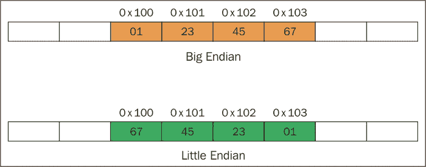

# 第四章：游戏开发算法

在本章中，将涵盖以下示例：

+   使用排序技术来排列项目

+   使用搜索技术查找项目

+   找到算法的复杂性

+   查找设备的字节顺序

+   使用动态规划来解决复杂问题

+   使用贪婪算法解决问题

+   使用分治算法解决问题

# 介绍

算法是指应用于执行任务的一系列步骤。搜索和排序算法是我们可以在容器中搜索或排序元素的技术。一个容器本身将没有任何优势，除非我们可以在该容器中搜索项目。根据某些容器，某些算法对某些容器比其他容器更强大。由于算法在较慢的系统上运行速度较慢，在较快的系统上运行速度较快，计算时间并不是衡量算法有效性的有效方法。算法通常是以步骤来衡量的。游戏是实时应用程序，因此将应用的算法必须对游戏至少以每秒 30 帧的速度执行有效。理想的帧速率是每秒 60 帧。

# 使用排序技术来排列项目

排序是一种排列容器中的项目的方法。我们可以按升序或降序排列它们。如果我们必须实现游戏的最高分系统和排行榜，排序就变得必要了。在游戏中，当用户获得比以前的最高分更高的分数时，我们应该将该值更新为当前最高分，并将其推送到本地或在线排行榜。如果是本地的，我们应该按降序排列所有用户以前的最高分，并显示前 10 个分数。如果是在线排行榜，我们需要对所有用户的最新最高分进行排序并显示结果。

## 做好准备

要完成本示例，您需要一台运行 Windows 的计算机。您还需要在 Windows 计算机上安装一个可用的 Visual Studio 副本。不需要其他先决条件。

## 如何做...

在这个示例中，我们将发现使用不同的排序技术来排列容器中的项目是多么容易：

1.  打开 Visual Studio。

1.  创建一个新的 C++项目。

1.  选择**Win32 控制台应用程序**。

1.  添加一个名为`Sorting.h`的头文件。

1.  将以下代码添加到其中：

```cpp
// Bubble Sort
template <class T>
void bubble_sort(T a[], int n)
{
  T temp;
  for (int i = 0; i<n; i++)
  {
    for (int j = 0; j<n - i - 1; j++)
    {
      if (a[j]>a[j + 1])
      {
        temp = a[j];
        a[j] = a[j + 1];
        a[j + 1] = temp;
      }
    }
  }
}

//Insertion Sort
template <class T>
void insertion_sort(T a[], int n)
{
  T key;
  for (int i = 1; i<n; i++)
  {
    key = a[i];
    int j = i - 1;
    while (j >= 0 && a[j]>key)
    {
      a[j + 1] = a[j];
      j = j - 1;
    }
    a[j + 1] = key;
  }
}

//Selection Sort
template <class T>
int minimum_element(T a, int low, int up)
{
  int min = low;
  while (low<up)
  {
    if (a[low]<a[min])
      min = low;
    low++;
  }
  return min;
}

template <class T>

void selection_sort(T a[], int n)
{
  int i = 0;
  int loc = 0;
  T temp;
  for (i = 0; i<n; i++)
  {
    loc = minimum_element(a, i, n);
    temp = a[loc];
    a[loc] = a[i];
    a[i] = temp;
  }
}

//Quick Sort
template <class T>
int partition(T a[], int p, int r)
{
  T x;
  int i;
  x = a[r];
  i = p - 1;
  for (int j = p; j <= r - 1; j++)
  {
    if (a[j] <= x)
    {
      i = i + 1;
      swap(a[i], a[j]);
    }
  }
  swap(a[i + 1], a[r]);
  return i + 1;
}
template <class T>
void quick_sort(T a[], int p, int r)
{
  int q;
  if (p<r)
  {
    q = partition(a, p, r);
    quick_sort(a, p, q - 1);
    quick_sort(a, q + 1, r);
  }
}
```

## 它是如何工作的...

在这个例子中，使用了四种排序技术。这四种技术是**冒泡** **排序**，**选择** **排序**，**插入** **排序**和**快速** **排序**。

**冒泡排序**是一种排序算法，通过不断遍历要排序的容器，比较相邻的每一对项目，并在它们的顺序错误时交换它们。这个过程一直持续到不再需要交换为止。平均、最好和最坏情况的顺序为*O(n²)*。

**插入排序**是一种简单的排序算法，是一种比较排序，其中排序的容器是一次构建一个条目。这是一种非常简单的算法来实现。然而，在大型数据集上它并不那么有效。最坏和平均情况的顺序为*O(n²)*，最好的情况是，当容器排序时，顺序为*O(n)*。

**选择排序**是一种算法，它试图在每次通过时将项目放在排序列表中的正确位置。最好、最坏和平均情况的顺序为*O(n²)*。

**快速排序**是一种算法，它创建一个枢轴，然后根据枢轴对容器进行排序。然后移动枢轴并继续该过程。快速排序是一种非常有效的算法，适用于几乎所有的现实世界数据和大多数现代架构。它很好地利用了内存层次结构。甚至内置的标准模板库使用了快速排序的修改版本作为其排序算法。该算法的最佳和平均情况是*O(n*log n)*，最坏情况是*O(n²)*。

# 使用搜索技术查找项目

搜索技术是一组涉及在容器中查找项目的算法过程。搜索和排序是相辅相成的。排序的容器将更容易搜索。在容器排序或排序后，我们可以应用适当的搜索算法来查找元素。假设我们需要找到已用于杀死超过 25 名敌人的枪支的名称。如果容器存储了枪支名称和与该枪支相关的总击杀数的值，我们只需要首先按击杀数升序对该容器进行排序。然后我们可以进行线性搜索，找到第一支击杀数超过 25 的枪支。相应地，容器中该枪支之后的项目将具有超过 25 次击杀，因为容器已排序。但是，我们可以应用更好的搜索技术。

## 准备工作

您需要在 Windows 计算机上安装 Visual Studio 的工作副本。

## 如何做...

在这个教程中，我们将发现如何轻松地将搜索算法应用到我们的程序中：

1.  打开 Visual Studio。

1.  创建一个新的 C++项目。

1.  选择**Win32 控制台应用程序**。

1.  添加名为`Source.cpp`的源文件。

1.  将以下代码行添加到其中：

```cpp
#include <iostream>
#include <conio.h>

using namespace std;

bool Linear_Search(int list[], int size, int key)
{
  // Basic sequential search
  bool found = false;
  int i;

  for (i = 0; i < size; i++)
  {
    if (key == list[i])
      found = true;
    break;
  }

  return found;
}
bool Binary_Search(int *list, int size, int key)
{
  // Binary search
  bool found = false;
  int low = 0, high = size - 1;

  while (high >= low)
  {
    int mid = (low + high) / 2;
    if (key < list[mid])
      high = mid - 1;
    else if (key > list[mid])
      low = mid + 1;
    else
    {
      found = true;
      break;
    }
  }

  return found;
}
```

## 它是如何工作的...

在容器中搜索项目可以通过多种方式完成。但是，容器是否已排序很重要。让我们假设容器已排序。搜索项目的最糟糕方式是遍历整个容器并搜索项目。对于大数据集，这将花费大量时间，并且在游戏编程中绝对不可取。搜索项目的更好方式是使用二分搜索。二分搜索通过将容器分成两半来工作。它在中点检查要搜索的值是否小于或大于中点值。如果大于中点值，我们可以忽略容器的第一半，并继续仅在第二半中搜索。然后再将第二半进一步分成两半，重复这个过程。因此，通过这样做，我们可以极大地减少算法的搜索空间。这个算法的顺序是 O(log n)。

# 查找算法的复杂性

我们需要一种有效的方法来衡量算法。这样我们将发现我们的算法是否有效。算法在较慢的机器上运行得更慢，在较快的机器上运行得更快，因此计算时间不是衡量算法的有效方法。算法应该被衡量为步骤数。我们称之为算法的顺序。我们还需要找出算法顺序的最佳情况、最坏情况和平均情况。这将给我们一个更清晰的图片，我们的算法将如何应用于小数据集和大数据集。应避免复杂算法或高阶算法，因为这将增加设备执行任务所需的步骤数，从而减慢应用程序的速度。此外，使用这样的算法进行调试变得困难。

## 准备工作

您需要在 Windows 计算机上安装 Visual Studio 的工作副本。

## 如何做...

在这个教程中，我们将发现找到算法的复杂性是多么容易。

1.  打开 Visual Studio。

1.  创建一个新的 C++项目。

1.  选择**Win32 控制台应用程序**。

1.  添加名为`Source.cpp`的源文件。

1.  将以下代码行添加到其中：

```cpp
#include <iostream>
#include <conio.h>

using namespace std;

void Cubic_Order()
{
  int n = 100;
  for (int i = 0; i < n; i++)
  {
    for (int j=0; j < n; j++)
    {
      for (int k = 0; k < n; k++)
      {
        //Some implementation
      }
    }
  }
}
void Sqaure_Order()
{
  int n = 100;
  for (int i = 0; i < n; i++)
  {
    for (int j = 0; j < n; j++)
    {
      //Some implementation
    }
  }
}

int main()
{
  Cubic_Order();
  Sqaure_Order();

  return 0;
}
```

## 它是如何工作的...

在这个例子中，我们可以看到算法的顺序，或者“大 O”符号，随着实现的不同而变化。如果我们采用第一个函数`Cubic_Order`，最内部的实现将需要*n*n*n*步来找到答案。因此它的顺序是 n 的三次方，*O(n³)*。这真的很糟糕。想象一下，如果 n 是一个非常大的数据集，例如让我们说*n=1000*，它将需要 1,000,000,000 步来找到解决方案。尽量避免立方阶算法。第二个函数`square_order`具有平方阶。最内部的实现将需要*n*n*步来找到解决方案，因此该算法的顺序是*O(n²)*。这也是不好的做法。

我们应该尝试至少达到*O(log N)*的复杂度。如果我们不断将搜索空间减半，例如使用二分搜索，我们可以实现对数*N*的复杂度。有一些算法可以实现*O(log N)*的顺序，这是非常优化的。

一般规则是，所有遵循*分而治之*的算法都将具有*O(log N)*的复杂度。

# 查找设备的字节顺序

平台的字节顺序是指最重要的字节在该设备上的存储方式。这些信息非常重要，因为许多算法可以根据这些信息进行优化。值得注意的是，两种最流行的渲染 SDK，DirectX 和 OpenGL，在它们的字节顺序上有所不同。两种不同类型的字节顺序称为大端和小端。

## 做好准备

对于这个配方，您需要一台安装有 Visual Studio 的 Windows 机器。

## 如何做…

在这个配方中，我们将发现查找设备的字节顺序是多么容易。

1.  打开 Visual Studio。

1.  创建一个新的 C++项目。

1.  选择**Win32 控制台应用程序**。

1.  添加名为`Source.cpp`的源文件。

1.  将以下代码添加到其中：

```cpp
Source.cpp

#include <stdio.h>
#include <iostream>
#include <conio.h>

using namespace std;

bool isBigEndian()
{
  unsigned int i = 1;
  char *c = (char*)&i;
  if (*c)
    return false;
  else
    return true;
}
int main()
{
  if (isBigEndian())
  {
    cout << "This is a Big Endian machine" << endl;
  }
  else
  {
    cout << "This is a Little Endian machine" << endl;
  }

  _getch();
  return 0;
}
```

## 它是如何工作的…

小端和大端是不同的多字节数据类型在不同机器上存储的方式。在小端机器上，多字节数据类型的最不重要的字节首先存储。另一方面，在大端机器上，多字节数据类型的二进制表示的最重要的字节首先存储。

在前面的程序中，一个字符指针`c`指向一个整数`i`。由于字符的大小是 1 个字节，当解引用字符指针时，它将只包含整数的第一个字节。如果机器是小端的，那么`*c`将是`1`（因为最后一个字节是先存储的），如果机器是大端的，那么`*c`将是 0。

假设整数存储为 4 个字节；那么，一个值为 0x01234567 的变量`x`将存储如下：



大多数情况下，编译器会处理字节顺序；但是，如果我们从小端机器发送数据到大端机器，字节顺序在网络编程中会成为一个问题。此外，如果我们将渲染管线从 DirectX 切换到 OpenGL，也会成为一个问题。

# 使用动态规划来解决复杂问题

动态规划是解决问题的一种非常现代的方法。这个过程涉及将一个大问题分解成更小的问题块，找到这些问题块的解决方案，并重复这个过程来解决整个复杂问题。一开始很难掌握这种技术，但通过足够的练习，任何问题都可以用动态规划解决。我们在编程视频游戏时遇到的大多数问题都会很复杂。因此，掌握这种技术将非常有用。

## 做好准备

对于这个配方，您需要一台安装有 Visual Studio 的 Windows 机器。

## 如何做…

在这个配方中，我们将发现使用动态规划解决问题是多么容易：

1.  打开 Visual Studio。

1.  创建一个新的 C++项目。

1.  选择**Win32 控制台应用程序**。

1.  添加名为`Source.cpp`的源文件。

1.  将以下代码添加到其中：

```cpp
#include<iostream>
#include <conio.h>

using namespace std;

int max(int a, int b) { return (a > b) ? a : b; }

int knapSack(int TotalWeight, int individual_weight[], int individual_value[], int size)
{

  if (size == 0 || TotalWeight == 0)
    return 0;
  if (individual_weight[size - 1] > TotalWeight)
    return knapSack(TotalWeight, individual_weight, individual_value, size - 1);
  else return max(individual_value[size - 1] + knapSack(TotalWeight - individual_weight[size - 1], individual_weight, individual_value, size - 1),
    knapSack(TotalWeight, individual_weight, individual_value, size - 1)
    );
}

int main()
{
  int individual_value[] = { 60, 100, 120 };
  int individual_weight[] = { 10, 25, 40 };
  int  TotalWeight = 60;
  int size = sizeof(individual_value) / sizeof(individual_weight[0]);
  cout << "Total value of sack "<<knapSack(TotalWeight, individual_weight, individual_value, size);

  _getch();
  return 0;
}
```

## 它是如何工作的…

这是一个经典的*背包*问题的例子。这可以应用于游戏编程中的许多场景，特别是用于 AI 资源管理。让我们假设 AI 可以携带的总重量（袋子）是一个常数。在我们的例子中，这是背包的总重量。游戏中 AI 收集的每个物品都有重量和价值。现在 AI 需要决定如何填满他的库存/袋子，以便他可以以最大价值出售总袋子并获得硬币。

我们通过递归来解决问题，通过解决每个小组合的物品（重量和价值）并检查两个组合的最大值，并重复这个过程直到达到背包的总重量。

# 使用贪婪算法解决问题

贪婪算法通过在每个阶段找到最优解来工作。因此，在处理下一步之前，它将根据先前的结果和应用程序当前的需求决定下一步。这样，它比动态规划更好。然而，我们不能将这个原则应用到所有问题上，因此贪婪算法不能用于所有情况。

## 准备工作

要完成这个配方，你需要一台运行 Windows 的机器。你还需要在 Windows 机器上安装一个可用的 Visual Studio 副本。不需要其他先决条件。

## 如何做…

在这个配方中，我们将发现使用贪婪算法解决问题有多么容易：

1.  打开 Visual Studio。

1.  创建一个新的 C++项目。

1.  选择**Win32 控制台应用程序**。

1.  添加`Source.cpp`文件。

1.  将以下代码添加到其中：

```cpp
#include <iostream>
#include <conio.h>

using namespace std;

void printMaxActivities(int start_Time[], int finish_Time[], int n)
{
  int i, j;  
  i = 0;
  cout << i;
  for (j = 1; j < n; j++)
  {    
    if (start_Time[j] >= finish_Time[i])
    {
      cout << j;
      i = j;
    }
  }
}

int main()
{
  int start_Time[] = { 0, 2, 4, 7, 8, 11 };
  int finish_Time[] = { 2, 4, 6, 8, 9, 15 };
  int n = sizeof(start_Time) / sizeof(start_Time[0]);
  printMaxActivities(start_Time, finish_Time, n);

  _getch();
  return 0;
}
```

## 它是如何工作的…

在这个例子中，我们有一组不同活动的开始时间和结束时间。我们需要找出哪些活动可以由一个人完成。我们可以假设容器已经根据结束时间排序。因此，在每次通过时，我们检查当前开始时间是否大于或等于前一个结束时间。只有在这种情况下我们才能接受任务。我们遍历容器并不断检查相同的条件。因为我们在每一步都在检查，所以这个算法非常优化。

# 使用分治算法解决问题

一般来说，分治算法基于以下思想。我们想要解决的整个问题可能太大，无法一次理解或解决。我们将它分解成较小的部分，分别解决这些部分，然后将这些独立的部分组合起来。

## 准备工作

对于这个配方，你需要一台运行 Windows 的机器，并且安装了一个可用的 Visual Studio 副本。

## 如何做…

在这个配方中，我们将发现使用贪婪算法解决问题有多么容易：

1.  打开 Visual Studio。

1.  创建一个新的 C++项目。

1.  添加一个名为`Source.cpp`的源文件。

1.  将以下代码添加到其中：

```cpp
#include <iostream>
#include <conio.h>

using namespace std;

const int MAX = 10;

class rray
{
private:
  int arr[MAX];
  int count;
public:
  array();
  void add(int num);
  void makeheap(int);
  void heapsort();
  void display();
};
array ::array()
{
  count = 0;
  for (int i = 0; i < MAX; i++)
    arr[MAX] = 0;
}
void array ::add(int num)
{
  if (count < MAX)
  {
    arr[count] = num;
    count++;
  }
  else
    cout << "\nArray is full" << endl;
}
void array ::makeheap(int c)
{

  for (int i = 1; i < c; i++)
  {
    int val = arr[i];
    int s = i;
    int f = (s - 1) / 2;
    while (s > 0 && arr[f] < val)
    {
      arr[s] = arr[f];
      s = f;
      f = (s - 1) / 2;
    }
    arr[s] = val;
  }
}
void array ::heapsort()
{
  for (int i = count - 1; i > 0; i--)
  {
    int ivalue = arr[i];
    arr[i] = arr[0];
    arr[0] = ivalue;
    makeheap(i);

  }
}
void array ::display()
{
  for (int i = 0; i < count; i++)
    cout << arr[i] << "\t";
  cout << endl;
}
void main()
{
  array a;

  a.add(11);
  a.add(2);
  a.add(9);
  a.add(13);
  a.add(57);
  a.add(25);
  a.add(17);
  a.add(1);
  a.add(90);
  a.add(3);
  a.makeheap(10);
  cout << "\nHeap Sort.\n";
  cout << "\nBefore Sorting:\n";
  a.display();
  a.heapsort();
  cout << "\nAfter Sorting:\n";
  a.display();

  _getch();
}
```

## 它是如何工作的…

**堆排序** **算法**的工作原理是首先将要排序的数据组织成一种特殊类型的二叉树，称为**堆**。堆本身在定义上具有树顶部的最大值，因此堆排序算法也必须颠倒顺序。它通过以下步骤实现：

1.  删除最顶部的物品（最大的）并用最右边的叶子替换它。最顶部的物品存储在一个数组中。

1.  重新建立堆。

1.  重复步骤 1 和 2，直到堆中没有更多的物品。排序后的元素现在存储在一个数组中。
