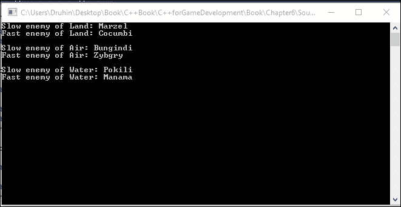
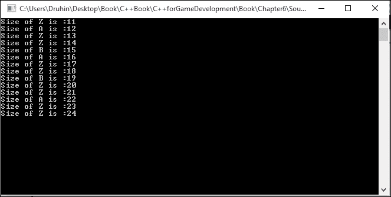
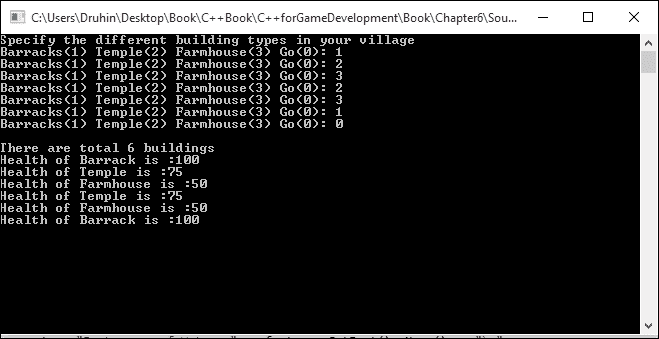
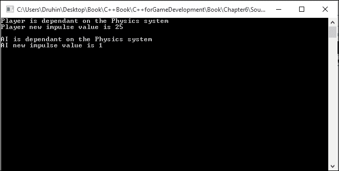

# 第六章：游戏开发的设计模式

在本章中，将涵盖以下示例：

+   使用单例设计模式

+   使用工厂方法

+   使用抽象工厂方法

+   使用观察者模式

+   使用享元模式

+   使用策略模式

+   使用命令设计模式

+   使用设计模式创建高级游戏

# 介绍

让我们假设我们面临某个问题。过了一段时间，我们找到了解决这个问题的方法。现在，如果问题再次发生，或者类似的问题模式再次发生，我们将知道如何通过应用解决先前问题的相同原则来解决问题。设计模式就类似于这个。已经有 23 种这样的解决方案被记录下来，它们为处理与已记录的问题具有相似模式的问题提供了微妙的解决方案。这些解决方案由作者描述，更常被称为*四人帮*。它们不是完整的解决方案，而是可以应用于类似情况的模板或框架。然而，设计模式最大的缺点之一是，如果它们没有被正确应用，它们可能会证明是灾难性的。设计模式可以被分类为结构型、行为型或创建型。我们将只研究其中一些，在游戏开发中经常使用的。

# 使用单例设计模式

单例设计模式是游戏中最常用的设计模式。不幸的是，它也是游戏中最常被滥用和错误应用的设计模式。单例设计模式有一些优点，我们将讨论。然而，它也有很多严重的后果。

## 准备工作

要完成本示例，您需要一台运行 Windows 的计算机。您还需要在 Windows 计算机上安装一个可用的 Visual Studio 副本。不需要其他先决条件。

## 如何做…

在这个示例中，我们将看到创建单例设计模式有多么容易。我们还将看到这种设计模式的常见陷阱：

1.  打开 Visual Studio。

1.  创建一个新的 C++项目。

1.  选择一个 Win32 控制台应用程序。

1.  添加一个名为`Source.cpp`的源文件。

1.  将以下代码添加到其中：

```cpp
#include <iostream>
#include <conio.h>

using namespace std;

class PhysicsManager
{
private:
  static bool bCheckFlag;
  static PhysicsManager *s_singleInstance;
  PhysicsManager()
  {
    //private constructor
  }
public:
  static PhysicsManager* getInstance();
  void GetCurrentGravity()const;

  ~PhysicsManager()
  {
    bCheckFlag = false;
  }
};

bool PhysicsManager::bCheckFlag = false;

PhysicsManager* PhysicsManager::s_singleInstance = NULL;

PhysicsManager* PhysicsManager::getInstance()
{
  if (!bCheckFlag)
  {
    s_singleInstance = new PhysicsManager();
    bCheckFlag = true;
    return s_singleInstance;
  }
  else
  {
    return s_singleInstance;
  }
}

void PhysicsManager::GetCurrentGravity() const
{
  //Some calculations for finding the current gravity
  //Probably a base variable which constantly gets updated with value
  //based on the environment
  cout << "Current gravity of the system is: " <<9.8<< endl;
}

int main()
{
  PhysicsManager *sc1, *sc2;
  sc1 = PhysicsManager::getInstance();
  sc1->GetCurrentGravity();
  sc2 = PhysicsManager::getInstance();
  sc2->GetCurrentGravity();

  _getch();
  return 0;
}
```

## 它是如何工作的…

开发人员希望使用单例类的主要原因是他们希望限制类的实例只有一个。在我们的示例中，我们使用了`PhysicsManager`类。我们将构造函数设为私有，然后分配一个静态函数来获取类的实例和其方法的句柄。我们还使用一个布尔值来检查是否已经创建了一个实例。如果是，我们不分配新实例。如果没有，我们分配一个新实例并调用相应的方法。

尽管这种设计模式看起来很聪明，但它有很多缺陷，因此在游戏设计中应尽量避免使用。首先，它是一个全局变量。这本身就是不好的。全局变量保存在全局池中，可以从任何地方访问。其次，这鼓励了糟糕的耦合，可能会出现在代码中。第三，它不友好并发。想象一下有多个线程，每个线程都可以访问这个全局变量。这是灾难的开始，死锁会发生。最后，新程序员最常犯的一个错误是为所有事物创建管理器，然后将管理器设为单例。事实上，我们可以通过有效地使用面向对象编程和引用来避免创建管理器。

上述代码显示了一种懒惰初始化单例的值，因此可以改进。然而，本示例中描述的所有基本问题仍将存在。

# 使用工厂方法

工厂本质上是创建其他类型对象的仓库。在工厂方法设计模式中，创建新类型的对象，比如敌人或建筑，是通过接口和子类决定需要实例化哪个类来实现的。这也是游戏中常用的模式，非常有用。

## 准备工作

您需要在 Windows 机器上安装一个可用的 Visual Studio 副本。

## 如何做…

在这个示例中，我们将发现实现工厂方法设计模式是多么容易：

1.  打开 Visual Studio。

1.  创建一个新的 C++项目。

1.  选择一个 Win32 控制台应用程序。

1.  添加一个名为`Source.cpp`的源文件。

1.  添加以下代码行：

```cpp
#include <iostream>
#include <conio.h>
#include <vector>

using namespace std;

class IBuilding
{
public:
  virtual void TotalHealth() = 0;
};

class Barracks : public IBuilding
{
public:
  void TotalHealth()
  {
    cout << "Health of Barrack is :" << 100;
  }
};
class Temple : public IBuilding
{
public:
  void TotalHealth()
  {
    cout << "Health of Temple is :" << 75;
  }
};
class Farmhouse : public IBuilding
{
public:
  void TotalHealth()
  {
    cout << "Health of Farmhouse is :" << 50;
  }
};

int main()
{
  vector<IBuilding*> BuildingTypes;
  int choice;

  cout << "Specify the different building types in your village" << endl;
  while (true)
  {

    cout << "Barracks(1) Temple(2) Farmhouse(3) Go(0): ";
    cin >> choice;
    if (choice == 0)
      break;
    else if (choice == 1)
      BuildingTypes.push_back(new Barracks);
    else if (choice == 2)
      BuildingTypes.push_back(new Temple);
    else
      BuildingTypes.push_back(new Farmhouse);
  }
  cout << endl;
  cout << "There are total " << BuildingTypes.size() << " buildings" << endl;
  for (int i = 0; i < BuildingTypes.size(); i++)
  {
    BuildingTypes[i]->TotalHealth();
    cout << endl;
  }

  for (int i = 0; i < BuildingTypes.size(); i++)
    delete BuildingTypes[i];

  _getch();
}
```

## 工作原理…

在这个例子中，我们创建了一个`Building`接口，其中有一个纯虚函数`TotalHealth`。这意味着所有派生类必须重写这个函数。因此，我们可以保证所有的建筑都有这个属性。我们可以通过添加更多的属性来扩展这个结构，比如生命值、总存储容量、村民生产速度等，根据游戏的性质和设计。派生类有它们自己的`TotalHealth`实现。它们也被命名为反映它们是什么类型的建筑。这种设计模式的最大优势是，客户端只需要一个对基础接口的引用。之后，我们可以在运行时创建我们需要的建筑类型。我们将这些建筑类型存储在一个向量列表中，最后使用循环来显示内容。由于我们有引用`IBuilding*`，我们可以在运行时分配任何新的派生类。无需为所有派生类创建引用，比如`Temple*`等等。下面的屏幕截图显示了用户定义村庄的输出：



# 使用抽象工厂方法

抽象工厂是创建设计模式的一部分。这是创建对象的最佳方式之一，也是游戏中常见的重复设计模式之一。它就像是一个工厂的工厂。它使用一个接口来创建一个工厂。工厂负责创建对象，而不指定它们的类类型。工厂基于工厂方法设计模式生成这些对象。然而，有人认为抽象工厂方法也可以使用原型设计模式来实现。

## 准备工作

您需要在 Windows 机器上安装一个可用的 Visual Studio 副本。

## 如何做…

在这个示例中，我们将发现实现抽象工厂模式是多么容易：

1.  打开 Visual Studio。

1.  创建一个新的 C++项目。

1.  选择一个 Win32 控制台应用程序。

1.  添加一个名为`Source.cpp`的源文件。

1.  添加以下代码行：

```cpp
#include <iostream>
#include <conio.h>
#include <string>

using namespace std;

//IFast interface
class IFast
{
public:
  virtual std::string Name() = 0;
};

//ISlow interface
class ISlow
{
public:
  virtual std::string Name() = 0;
};
class Rapter : public ISlow
{
public:
  std::string Name()
  {
    return "Rapter";
  }
};

class Cocumbi : public IFast
{
public:
  std::string Name()
  {
    return "Cocumbi";
  }
};
   . . . . .// Similar classes can be written here
class AEnemyFactory
{
public:
  enum Enemy_Factories
  {
    Land,
    Air,
    Water
  };

  virtual IFast* GetFast() = 0;
  virtual ISlow* GetSlow() = 0;

  static AEnemyFactory* CreateFactory(Enemy_Factories factory);
};

class LandFactory : public AEnemyFactory
{
public:
  IFast* GetFast()
  {
    return new Cocumbi();
  }

  ISlow* GetSlow()
  {
    return new Marzel();
  }
};

class AirFactory : public AEnemyFactory
{
public:
  IFast* GetFast()
  {
    return new Zybgry();
  }

  ISlow* GetSlow()
  {
    return new Bungindi();
  }
};

class WaterFactory : public AEnemyFactory
{
public:
  IFast* GetFast()
  {
    return new Manama();
  }

  ISlow* GetSlow()
  {
    return new Pokili();
  }
};

//CPP File
AEnemyFactory* AEnemyFactory::CreateFactory(Enemy_Factories factory)
{
  if (factory == Enemy_Factories::Land)
  {
    return new LandFactory();
  }
  else if (factory == Enemy_Factories::Air)
  {
    return new AirFactory();
  }
  else if (factory == Enemy_Factories::Water)
  {
    return new WaterFactory();
  }
}

int main(int argc, char* argv[])
{
  AEnemyFactory *factory = AEnemyFactory::CreateFactory
    (AEnemyFactory::Enemy_Factories::Land);

  cout << "Slow enemy of Land: " << factory->GetSlow()->Name() << "\n";
  delete factory->GetSlow();
  cout << "Fast enemy of Land: " << factory->GetFast()->Name() << "\n";
  delete factory->GetFast();
  delete factory;
  getchar();

  factory = AEnemyFactory::CreateFactory(AEnemyFactory::Enemy_Factories::Air);
  cout << "Slow enemy of Air: " << factory->GetSlow()->Name() << "\n";
  delete factory->GetSlow();
  cout << "Fast enemy of Air: " << factory->GetFast()->Name() << "\n";
  delete factory->GetFast();
  delete factory;
  getchar();

  factory = AEnemyFactory::CreateFactory(AEnemyFactory::Enemy_Factories::Water);
  cout << "Slow enemy of Water: " << factory->GetSlow()->Name() << "\n";
  delete factory->GetSlow();
  cout << "Fast enemy of Water: " << factory->GetFast()->Name() << "\n";
  delete factory->GetFast();
  getchar();

  return 0;
}
```

## 工作原理…

在这个例子中，我们创建了两个接口，分别是`IFast`和`ISlow`。之后，我们创建了几个敌人，并决定它们是快还是慢。最后，我们创建了一个抽象类，其中有两个虚函数来获取快速敌人和慢速敌人。这意味着所有的派生类必须重写并有自己的实现这些函数。因此，实际上我们创建了一个工厂的工厂。我们从抽象类创建的陆地、空中和水中敌人工厂都引用了慢和快的两个接口。因此，陆地、水域和空中本身也是工厂。

因此，从客户端，我们可以请求一个快速的陆地敌人或一个慢速的水域敌人，然后我们可以得到适当的敌人显示给我们。如下面的屏幕截图所示，我们可以得到如下显示的输出：


# 使用观察者模式

观察者设计模式在游戏中并不常用，但游戏开发人员应该更经常地使用它，因为这是处理通知的一种非常聪明的方式。在观察者设计模式中，一个组件与其他组件维护一对多的关系。这意味着当主要组件发生变化时，所有依赖组件也会更新。想象一个物理系统。我们希望`enemy1`和`enemy2`在物理系统更新时立即更新，所以我们应该使用这种模式。

## 准备工作

为此食谱，您需要一台装有 Visual Studio 的 Windows 机器。

## 如何做…

在这个食谱中，我们将找出实现观察者模式有多容易：

1.  打开 Visual Studio。

1.  创建一个新的 C++项目。

1.  选择一个 Win32 Windows 应用程序。

1.  添加一个名为`Source.cpp`的源文件。

1.  向其添加以下代码行：

```cpp
#include <iostream>
#include <vector>
#include <conio.h>

using namespace std;

class PhysicsSystem {

  vector < class Observer * > views;
  int value;
public:
  void attach(Observer *obs) {
    views.push_back(obs);
  }
  void setVal(int val) {
    value = val;
    notify();
  }
  int getVal() {
    return value;
  }
  void notify();
};

class Observer {

  PhysicsSystem *_attribute;
  int iScalarMultiplier;
public:
  Observer(PhysicsSystem *attribute, int value)
  {
    If(attribute)
{

_attribute = attribute;
}
    iScalarMultiplier = value;

    _attribute->attach(this);
  }
  virtual void update() = 0;
protected:
  PhysicsSystem *getPhysicsSystem() {
    return _attribute;
  }
  int getvalue()
  {
    return iScalarMultiplier;
  }
};

void PhysicsSystem::notify() {

  for (int i = 0; i < views.size(); i++)
    views[i]->update();
}

class PlayerObserver : public Observer {
public:
  PlayerObserver(PhysicsSystem *attribute, int value) : Observer(attribute, value){}
  void update() {

    int v = getPhysicsSystem()->getVal(), d = getvalue();
    cout << "Player is dependent on the Physics system" << endl;
    cout << "Player new impulse value is " << v / d << endl << endl;
  }
};

class AIObserver : public Observer {
public:
  AIObserver(PhysicsSystem *attribute, int value) : Observer(attribute, value){}
  void update() {
    int v = getPhysicsSystem()->getVal(), d = getvalue();
    cout << "AI is dependent on the Physics system" << endl;
    cout << "AI new impulse value is " << v % d << endl << endl;
  }
};

int main() {
  PhysicsSystem subj;

  PlayerObserver valueObs1(&subj, 4);
  AIObserver attributeObs3(&subj, 3);
  subj.setVal(100);

  _getch();
}
```

## 它是如何工作的…

在这个例子中，我们创建了一个不断更新其值的物理系统。依赖于物理系统的其他组件必须附加到它，这样它们就会在物理系统更新时得到通知。

我们创建的物理系统持有一个向量列表，其中包含所有正在观察的组件。除此之外，它包含了获取当前值或为其设置值的方法。它还包含一个方法，一旦物理系统中的值发生变化，就通知所有依赖组件。`Observer`类包含对物理系统的引用，以及一个纯虚函数用于更新，派生类必须覆盖这个函数。`PlayerObserver`和`AIObserver`类可以从这个类派生，并根据物理系统中的变化实现它们自己的冲量。除非它们从中分离出来，否则 AI 和玩家系统将不断地从物理系统接收更新。

这是一个非常有用的模式，在游戏中有很多实现。下面的屏幕截图显示了典型输出的样子：



# 使用飞行权重模式

飞行权重设计模式在我们想要减少用于创建对象的内存量时大多被使用。当我们想要创建数百次或数千次的东西时，通常会使用这种模式。具有森林结构的游戏经常使用这种设计模式。这种设计模式属于结构设计类别。在这种模式中，对象，比如树对象，被分成两部分，一部分取决于对象的状态，一部分是独立的。独立部分存储在飞行权重对象中，而依赖部分由客户端处理，并在调用时发送到飞行权重对象。

## 准备工作

为此食谱，您需要一台装有 Visual Studio 的 Windows 机器。

## 如何做…

在这个食谱中，我们将找出实现飞行权重模式有多容易：

1.  打开 Visual Studio。

1.  创建一个新的 C++项目。

1.  选择一个 Win32 控制台应用程序。

1.  添加一个名为`Source.cpp`的源文件。

1.  向其添加以下代码行：

```cpp
#include <iostream>
#include <string>
#include <map>
#include <conio.h>

using namespace std;

class TreeType
{
public:
  virtual void Display(int size) = 0;

protected:
  //Some Model we need to assign. For relevance we are substituting this with a character symbol
  char symbol_;
  int width_;
  int height_;
  float color_;

  int Size_;
};

class TreeTypeA : public TreeType
{
public:
  TreeTypeA()
  {
    symbol_ = 'A';
    width_ = 94;
    height_ = 135;
    color_ = 0;

    Size_ = 0;
  }
  void Display(int size)
  {
    Size_ = size;
    cout << "Size of " << symbol_ << " is :" << Size_ << endl;
  }
};

class TreeTypeB : public TreeType
{
public:
  TreeTypeB()
  {
    symbol_ = 'B';
    width_ = 70;
    height_ = 25;
    color_ = 0;

    Size_ = 0;
  }
  void Display(int size)
  {
    Size_ = size;
    cout << "Size of " << symbol_ << " is :" << Size_ << endl;
  }
};

class TreeTypeZ : public TreeType
{
public:
  TreeTypeZ()
  {
    symbol_ = 'Z';
    width_ = 20;
    height_ = 40;
    color_ = 1;

    Size_ = 0;
  }
  void Display(int size)
  {
    Size_ = size;
    cout <<"Size of " << symbol_ << " is :" << Size_ << endl;
  }
};

// The 'FlyweightFactory' class
class TreeTypeFactory
{
public:
  virtual ~TreeTypeFactory()
  {
    while (!TreeTypes_.empty())
    {
      map<char, TreeType*>::iterator it = TreeTypes_.begin();
      delete it->second;
      TreeTypes_.erase(it);
    }
  }
  TreeType* GetTreeType(char key)
  {
    TreeType* TreeType = NULL;
    if (TreeTypes_.find(key) != TreeTypes_.end())
    {
      TreeType = TreeTypes_[key];
    }
    else
    {
      switch (key)
      {
      case 'A':
        TreeType = new TreeTypeA();
        break;
      case 'B':
        TreeType = new TreeTypeB();
        break;
        //…
      case 'Z':
        TreeType = new TreeTypeZ();
        break;
      default:
        cout << "Not Implemented" << endl;
        throw("Not Implemented");
      }
      TreeTypes_[key] = TreeType;
    }
    return TreeType;
  }
private:
  map<char, TreeType*> TreeTypes_;
};

//The Main method
int main()
{
  string forestType = "ZAZZBAZZBZZAZZ";
  const char* chars = forestType.c_str();

  TreeTypeFactory* factory = new TreeTypeFactory;

  // extrinsic state
  int size = 10;

  // For each TreeType use a flyweight object
  for (size_t i = 0; i < forestType.length(); i++)
  {
    size++;
    TreeType* TreeType = factory->GetTreeType(chars[i]);
    TreeType->Display(size);
  }

  //Clean memory
  delete factory;

  _getch();
  return 0;
}
```

## 它是如何工作的…

在这个例子中，我们创建了一个森林。飞行权重模式的基本原则被应用，其中结构的一部分是共享的，而另一部分由客户端决定。在这个例子中，除了大小（这可以是任何东西，大小只是选择作为一个例子），每个其他属性都被选择为共享。我们创建一个包含所有属性的树型接口。然后我们有派生类，它们有它们的属性被覆盖和一个方法来设置`size`属性。我们可以有多个这样的树。一般来说，树的种类越多，森林看起来就越详细。假设我们有 10 种不同类型的树，所以我们需要有 10 个不同的类从接口派生，并有一个方法从客户端大小分配`size`属性。

最后，我们有了树工厂，它在运行时为每棵树分配。我们创建一个对接口的引用，就像任何工厂模式一样。但是，我们不是直接实例化一个新对象，而是首先检查地图，看看树的属性是否已经存在。如果没有，我们分配一个新对象，并将属性推送到地图中。因此，下次请求类似已经分配的树结构的树时，我们可以从地图中共享属性。最后，从客户端，我们创建一个森林类型的文档，然后将其提供给工厂，它使用文档中列出的树为我们生成森林。由于大多数属性是共享的，内存占用非常低。以下屏幕截图显示了森林是如何创建的：



# 使用策略模式

策略设计模式是设计代码的一种非常聪明的方式。在游戏中，这主要用于 AI 组件。在这种模式中，我们定义了大量的算法，并且所有这些算法都具有一个共同的接口签名。然后在运行时，我们可以更改算法的客户端。因此，实际上，这些算法是独立于客户端的。

## 准备工作

要完成这个示例，您需要一台运行 Windows 的机器。您还需要在 Windows 机器上安装一个可用的 Visual Studio 副本。不需要其他先决条件。

## 如何做…

在这个示例中，我们将发现实现策略模式是多么容易：

1.  打开 Visual Studio。

1.  创建一个新的 C++项目。

1.  选择一个 Win32 控制台应用程序。

1.  添加一个`Source.cpp`文件。

1.  将以下代码行添加到其中：

```cpp
#include <iostream>
#include <conio.h>

using namespace std;

class SpecialPower
{
public:
  virtual void power() = 0;
};

class Fire : public SpecialPower
{
public:
  void power()
  {
    cout << "My power is fire" << endl;
  }
};

class Invisibility : public SpecialPower
{
public:
  void power()
  {
    cout << "My power is invisibility" << endl;
  }
};

class FlyBehaviour
{
public:
  virtual void fly() = 0; 
};

class FlyWithWings : public FlyBehaviour
{
public:
  void fly()
  {
    cout << "I can fly" << endl;
  }
};

class FlyNoWay : public FlyBehaviour
{
public:
  void fly()
  {
    cout << "I can't fly!" << endl;
  }
};

class FlyWithRocket : public FlyBehaviour
{
public:
  void fly()
  {
    cout << "I have a jetpack" << endl;
  }
};

class Enemy
{

public:

  SpecialPower *specialPower;
  FlyBehaviour   *flyBehaviour;

  void performPower()
  {
    specialPower->power();
  }

  void setSpecialPower(SpecialPower *qb)
  {
    cout << "Changing special power..." << endl;
    specialPower = qb;
  }

  void performFly()
  {
    flyBehaviour->fly();
  }

  void setFlyBehaviour(FlyBehaviour *fb)
  {
    cout << "Changing fly behaviour..." << endl;
    flyBehaviour = fb;
  }

  void floatAround()
  {
    cout << "I can float." << endl;
  }

  virtual void display() = 0; // Make this an abstract class by having a pure virtual function

};

class Dragon : public Enemy
{
public:
  Dragon()
  {
    specialPower = new Fire();
    flyBehaviour = new FlyWithWings();
  }

  void display()
  {
    cout << "I'm a dragon" << endl;
  }

};

class Soldier : public Enemy
{
public:
  Soldier()
  {
    specialPower = new Invisibility();
    flyBehaviour = new FlyNoWay();
  }

  void display()
  {
    cout << "I'm a soldier" << endl;
  }
};

int main()
{
  Enemy *dragon = new Dragon();
  dragon->display();
  dragon->floatAround();
  dragon->performFly();
  dragon->performPower();

  cout << endl << endl;

  Enemy *soldier = new Soldier();
  soldier->display();
  soldier->floatAround();
  soldier->performFly();
  soldier->setFlyBehaviour(new FlyWithRocket);
  soldier->performFly();
  soldier->performPower();
  soldier->setSpecialPower(new Fire);
  soldier->performPower();

  _getch();
  return 0;
}
```

## 它是如何工作的…

在这个例子中，我们为敌人可能具有的不同属性创建了不同的接口。因此，由于我们知道特殊能力是每种敌人类型都会具有的属性，我们创建了一个名为`SpecialPower`的接口，然后从中派生了两个类，分别是`Fire`和`Invisibility`。我们可以添加任意多的特殊能力，我们只需要创建一个新的类，并从特殊能力接口派生。同样，所有的敌人类型都应该有一个飞行属性。它们要么飞行，要么不飞行，要么借助喷气背包飞行。

因此，我们创建了一个`FlyBehaviour`接口，并让不同的飞行类型类从中派生。之后，我们创建了一个敌人类型的抽象类，其中包含了这两个接口作为引用。因此，任何派生类都可以决定需要什么飞行类型和特殊能力。这也使我们能够在运行时更改特殊能力和飞行能力。下面的屏幕截图显示了这种设计模式的简要示例：


# 使用命令设计模式

命令设计模式通常涉及将命令封装为对象。这在游戏网络中被广泛使用，其中玩家的移动被发送为作为命令运行的对象。命令设计模式中要记住的四个主要点是客户端、调用者、接收者和命令。命令对象了解接收者对象。接收者在接收到命令后执行工作。调用者执行命令，而不知道是谁发送了命令。客户端控制调用者，并决定在哪个阶段执行哪些命令。

## 准备工作

对于这个示例，您需要一台安装有 Visual Studio 的 Windows 机器。

## 如何做…

在这个示例中，我们将发现实现命令模式是多么容易：

1.  打开 Visual Studio。

1.  创建一个新的 C++项目控制台应用程序。

1.  添加以下代码行：

```cpp
#include <iostream>
#include <conio.h>

using namespace std;
class NetworkProtocolCommand
{
public:
  virtual void PerformAction() = 0;
};
class ServerReceiver
{
public:
  void Action()
  {
    cout << "Network Protocol Command received" <<endl;

  }
};
class ClientInvoker
{
  NetworkProtocolCommand *m_NetworkProtocolCommand;

public:
  ClientInvoker(NetworkProtocolCommand *cmd = 0) : m_NetworkProtocolCommand(cmd)
  {
  }

  void SetCommad(NetworkProtocolCommand *cmd)
  {
    m_NetworkProtocolCommand = cmd;
  }

  void Invoke()
  {
    if (0 != m_NetworkProtocolCommand)
    {
      m_NetworkProtocolCommand->PerformAction();
    }
  }
};

class MyNetworkProtocolCommand : public NetworkProtocolCommand
{
  ServerReceiver *m_ServerReceiver;

public:
  MyNetworkProtocolCommand(ServerReceiver *rcv = 0) : m_ServerReceiver(rcv)
  {
  }

  void SetServerReceiver(ServerReceiver *rcv)
  {
    m_ServerReceiver = rcv;
  }

  virtual void PerformAction()
  {
    if (0 != m_ServerReceiver)
    {
      m_ServerReceiver->Action();
    }
  }
};

int main()
{
  ServerReceiver r;
  MyNetworkProtocolCommand cmd(&r);
  ClientInvoker caller(&cmd);
  caller.Invoke();

  _getch();
  return 0;
}
```

## 它是如何工作的…

正如我们在这个例子中所看到的，我们已经设置了一个接口，通过网络协议命令发送信息。从该接口，我们可以派生多个子实例用于客户端。然后我们需要创建一个服务器接收器，用于接收来自客户端的命令。我们还需要创建一个客户端调用者，用于调用命令。该类中还应该有对网络协议命令的引用。最后，从客户端，我们需要创建一个服务器实例，并将该实例附加到我们创建的网络协议命令的子对象上。然后我们使用客户端调用者来调用命令，并通过网络协议命令将其发送到接收器。这确保了抽象的维护，并且整个消息都是通过数据包发送的。以下截图显示了部分过程：



# 使用设计模式创建高级游戏

在了解基本设计模式之后，将它们结合起来创建一个好的游戏是很重要的。需要多年的实践才能最终理解哪种架构适合游戏结构。我们经常不得不同时使用几种设计模式来编写可以应用于游戏的清晰代码。工厂模式可能是您最常用的设计模式，但这纯粹是我个人经验的一个轶事参考。

## 准备工作

对于这个示例，您需要一台安装了 Visual Studio 的 Windows 机器。

## 如何做…

在这个示例中，我们将发现如何轻松地结合设计模式来创建一个游戏：

1.  打开 Visual Studio。

1.  创建一个新的 C++项目控制台应用程序。

1.  添加以下代码行：

```cpp
#ifndef _ISPEED_H
#define _SPEED_H

class ISpeed
{
  public:
    virtual void speed() = 0;

};

#end
#ifndef _ISPECIALPOWER
#define _ISPECIALPOWER
class ISpecialPower
{
public:
  virtual void power() = 0;
};
#endif

#ifndef _IENEMY_H
#define _IENEMY_H

#include "ISpecialPower.h"
#include "ISpeed.h"

class IEnemy
{

public:

  ISpecialPower *specialPower;
  ISpeed   *speed;

  void performPower()
  {
    specialPower->power();
  }

  void setSpecialPower(ISpecialPower *qb)
  {

  }

};
#endif
#include <iostream>
#include "ISpeed.h"

#pragma once
class HighSpeed :public ISpeed
{
public:
  HighSpeed();
  ~HighSpeed();
};

#include "IEnemy.h"

class Invisibility;
class HighSpeed;

class Soldier : public IEnemy
{
public:
  Soldier()
  {

  }

};
```

## 工作原理…

上面的代码只是代码的一小部分。假设我们需要制作一个游戏，其中有不同类的敌人，以及不同类型的能力，以及一些特殊的增益或增强。对此的一种方法是将所有能力和特殊增益视为从接口派生的单独类。因此，我们需要为速度创建一个接口，它可以从`HighSpeed`类派生，依此类推。同样，我们可以创建一个`SpecialPower`接口，它可以由`Fire`类等派生。我们需要为角色可能具有的所有属性组创建接口。最后，我们需要创建一个角色（`IEnemy`）的接口，它由`Soldier`、`Archer`和`Grenadier`类等派生。`IEnemy`接口还应该持有对所有其他接口的引用，比如`ISpecialPower`和`ISpeed`。通过这种方式，`IEnemy`的子类可以决定他们想要拥有什么能力和速度。这类似于策略设计模式。如果我们想要将敌人分组到类型中，比如陆地敌人和空中敌人，我们可以进一步改进这个结构。在这种情况下，我们要么为`IType`创建一个接口，并让`Land`和`Air`类从中派生，要么我们可以创建一个工厂，根据客户端请求的类型为我们创建敌人类型。创建的每种敌人类型也将是从`IEnemy`派生的类，因此它也将具有对先前接口的引用。随着游戏的复杂性增加，我们可以添加更多的设计模式来帮助我们。
