# 第八章：游戏开发中的人工智能

在本章中，将涵盖以下食谱：

+   向游戏添加人工智能

+   在游戏中使用启发式

+   使用二进制空间分区树

+   创建决策制定 AI

+   添加行为动作

+   使用神经网络

+   使用遗传算法

+   使用其他航路点系统

# 介绍

**人工智能**（**AI**）可以用许多方式来定义。人工智能处理在不同情况下找到相似之处和在相似情况下找到差异。AI 可以帮助游戏变得更加真实。玩游戏的用户应该感觉到他们正在与另一个人竞争。实现这一点非常困难，可能会消耗大量的处理周期。事实上，每年都会举行*图灵测试*来确定 AI 是否能愚弄其他人相信它是人类。现在，如果我们为 AI 使用了大量的处理周期，那么以超过 40 FPS 的速度执行游戏可能会变得非常困难。因此，我们需要编写高效的算法来实现这一点。

# 向游戏添加人工智能

向游戏添加人工智能可能很容易，也可能非常困难，这取决于我们试图实现的现实水平或复杂性。在这个食谱中，我们将从添加人工智能的基础开始。

## 准备工作

要完成本食谱，您需要一台运行 Windows 的机器和一个版本的 Visual Studio。不需要其他先决条件。

## 如何做到这一点…

在这个食谱中，我们将看到向游戏添加基本人工智能有多么容易。添加一个名为`Source.cpp`的源文件。将以下代码添加到其中：

```cpp
// Basic AI : Keyword identification

#include <iostream>
#include <string>
#include <string.h>

std::string arr[] = { "Hello, what is your name ?", "My name is Siri" };

int main()
{

  std::string UserResponse;

  std::cout << "Enter your question? ";
  std::cin >> UserResponse;

  if (UserResponse == "Hi")
  {
    std::cout << arr[0] << std::endl;
    std::cout << arr[1];
  }

  int a;
  std::cin >> a;
  return 0;

}
```

## 它是如何工作的…

在上一个示例中，我们使用字符串数组来存储响应。软件的想法是创建一个智能聊天机器人，可以回答用户提出的问题并与他们交互，就像它是人类一样。因此，第一项任务是创建一个响应数组。接下来要做的事情是询问用户问题。在这个例子中，我们正在搜索一个名为`Hi`的基本关键字，并根据此显示适当的答案。当然，这是一个非常基本的实现。理想情况下，我们会有一个关键字和响应的列表，当触发任何关键字时。我们甚至可以通过询问用户的名字来个性化这一点，然后每次都将其附加到答案中。

用户还可以要求搜索某些内容。这实际上是一件非常容易的事情。如果我们正确检测到用户渴望搜索的单词，我们只需要将其输入到搜索引擎中。页面显示任何结果，我们都可以向用户报告。我们还可以使用语音命令输入问题并给出回应。在这种情况下，我们还需要实现某种**NLP**（**自然语言** **处理**）。在正确识别语音命令之后，所有其他流程都是完全相同的。

# 在游戏中使用启发式

在游戏中添加启发式意味着定义规则。我们需要为 AI 代理定义一组规则，以便它以最佳方式移动到目的地。例如，如果我们想编写一个路径规划算法，并且只定义其起始和结束位置，它可能以许多不同的方式到达那里。然而，如果我们希望代理以特定方式达到目标，我们需要为其建立一个启发式函数。

## 准备工作

您需要一台 Windows 机器和一个运行 Visual Studio 的工作副本。不需要其他先决条件。

## 如何做到这一点…

在这个食谱中，我们将发现为我们的游戏添加启发式函数进行路径规划有多么容易。添加一个名为`Source.cpp`的源文件，并将以下代码添加到其中：

```cpp
    for (auto next : graph.neighbors(current)) {
      int new_cost = cost_so_far[current] + graph.cost(current, next);
      if (!cost_so_far.count(next) || new_cost < cost_so_far[next]) {
        cost_so_far[next] = new_cost;
        int priority = new_cost + heuristic(next, goal);
        frontier.put(next, priority);
        came_from[next] = current;
      }
```

## 它是如何工作的…

定义启发式的方法有很多种。然而，最简单的思考方法是它是一个为 AI 提供提示和方向以达到指定目标的函数。假设我们的 AI 需要从点`A`到点`D`。现在，地图上还有点`B`和`C`。AI 应该如何决定要走哪条路径？这就是启发式函数提供的内容。在这个例子中，我们在称为`A*`的路径查找算法中使用了启发式。在特殊情况下，启发式函数为`0`，我们得到一个称为**Dijkstra**的算法。

让我们先考虑 Dijkstra。稍后理解`A*`会更容易。

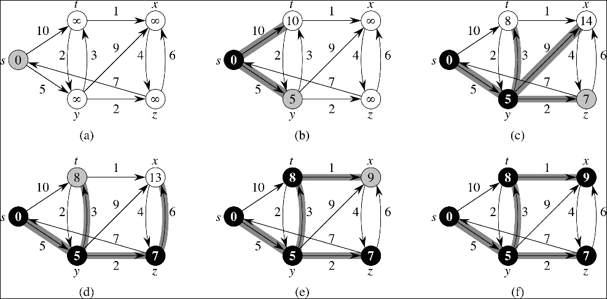

让我们考虑我们需要找到**s**和**x**之间的最短路径，至少遍历所有节点一次。**s**、**t**、**y**、**x**和**z**是不同的节点或不同的子目的地。从一个节点到另一个节点的数字是从一个节点到另一个节点的成本。该算法规定我们从**s**开始，值为**0**，并认为所有其他节点都是无限的。接下来要考虑的是与**s**相邻的节点。与**s**相邻的节点是**t**和**y**。到达它们的成本分别为**5**和**10**。我们注意到这一点，然后用**5**和**10**替换这些节点的无限值。现在让我们考虑节点**y**。相邻的节点是**t**、**x**和**z**。到达**x**的成本是**5**（它的当前节点值）加上**9**（路径成本值）等于*14*。同样，到达**z**的成本是*5 + 2 = 7*。因此，我们分别用**14**和**7**替换**x**和**z**的无限值。现在，到达**t**的成本是*5 + 3 = 8*。然而，它已经有一个节点值。它的值是**10**。由于*8<10*，我们将**t**替换为**8**。我们继续对所有节点进行这样的操作。之后，我们将得到遍历所有节点的最小成本。

`A*`有两个成本函数：

+   `g(x)`: 这与 Dijkstra 相同。这是到达节点**x**的实际成本。

+   `h(x)`: 这是从节点**x**到目标节点的近似成本。这是一个启发式函数。这个启发式函数不应该高估成本。这意味着从节点**x**到达目标节点的实际成本应该大于或等于`h(x)`。这被称为可接受的启发式。

每个节点的总成本使用*f(x) = g(x)+h(x)*计算。

在`A*`中，我们不需要遍历所有节点，我们只需要找到从起点到目的地的最短路径。A*搜索只会扩展一个节点，如果它看起来很有前途。它只关注从当前节点到达目标节点，而不是到达其他每个节点。如果启发式函数是可接受的，它是最优的。因此，编写启发式函数是检查是否扩展到节点的关键。在前面的例子中，我们使用相邻节点并形成一个优先列表来决定。

# 使用二进制空间分区树

有时在游戏中，我们需要处理大量的几何图形和庞大的 3D 世界。如果我们的游戏摄像头一直渲染所有内容，那么成本将非常昂贵，游戏将无法以更高的帧率平稳运行。因此，我们需要编写智能算法，以便将世界划分为更易管理的块，可以使用树结构轻松遍历。

## 准备就绪

你需要有一台运行良好的 Windows 机器和一个运行良好的 Visual Studio 副本。

## 如何做...

添加一个名为`Source.cpp`的源文件。然后将以下代码添加到其中：

```cpp
sNode(elemVec& toProcess, const T_treeAdaptor& adap)
      : m_pFront(NULL)
      , m_pBack(NULL)
    {
      // Setup
      elemVec frontVec, backVec;
      frontVec.reserve(toProcess.size());
      backVec.reserve(toProcess.size());

      // Choose which node we're going to use.
      adap.ChooseHyperplane(toProcess, &m_hp);

      // Iterate across the rest of the polygons
      elemVec::iterator iter = toProcess.begin();
      for (; iter != toProcess.end(); ++iter)
      {
        T_element front, back;
        switch (adap.Classify(m_hp, *iter))
        {
        case BSP_RELAT_IN_FRONT:
          frontVec.push_back(*iter);
          break;
       <...> 
      }

      // Now recurse if necessary
      if (!frontVec.empty())
        m_pFront = new sNode(frontVec, adap);
      if (!backVec.empty())
        m_pBack = new sNode(backVec, adap);
    }

    sNode(std::istream& in)
    {
      // First char is the child state
      // (0x1 means front child, 0x2 means back child)
      int childState;
      in >> childState;

      // Next is the hyperplane for the node
      in >> m_hp;

      // Next is the number of elements in the node
      unsigned int nElem;
      in >> nElem;
      m_contents.reserve(nElem);

      while (nElem--)
      {
        T_element elem;
        in >> elem;
        m_contents.push_back(elem);
      }

      // recurse if we have children.
      if (childState & 0x1)
        m_pFront = new sNode(in);
      else
        m_pFront = NULL;
      if (childState & 0x2)
        m_pBack = new sNode(in);
      else
        m_pBack = NULL;
    }
```

## 它是如何工作的...

**二进制空间分区**（**BSP**）树，顾名思义，是一个树结构，其中一个几何空间被分割。更准确地说，在 BSP 中，一个平面被分割成更多的超平面。一个平面是这样的，它的维度比它所在的环境空间少一个。因此，一个 3D 平面将有 2D 超平面，而一个 2D 平面将有 1D 线。这背后的想法是一旦我们以逻辑方式将平面分割成这些超平面，我们可以将形成保存到树结构中。最后，我们可以实时遍历树结构，为整个游戏提供更好的帧率。

让我们考虑一个例子，世界看起来像下面的图表。摄像机必须决定应该渲染哪些区域，哪些不应该。因此，使用逻辑算法进行划分是必要的：

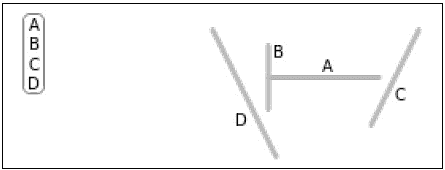

应用算法后，树结构应该如下所示：

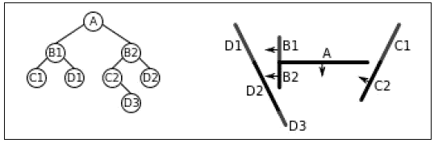

最后，我们像处理任何其他树结构一样遍历这个算法，使用父节点和子节点的概念，得到摄像机应该渲染的所需部分。

# 创建决策制定 AI

**决策树**是机器学习中最有用的东西之一。在大量的情景中，基于某些参数，决策是必不可少的。如果我们能够编写一个能够做出这些决定的系统，那么我们不仅可以拥有一个写得很好的算法，而且在游戏玩法方面也会有很多的不可预测性。这将为游戏增加很多变化，并有助于整体游戏的可重复性。

## 准备工作

对于这个食谱，你需要一台 Windows 机器和 Visual Studio。不需要其他先决条件。

## 如何做…

在这个食谱中，我们将发现添加源代码控制是多么容易：

```cpp
/* Decision Making AI*/

#include <iostream>
#include <ctime>

using namespace std;

class TreeNodes
{
public:
  //tree node functions
  TreeNodes(int nodeID/*, string QA*/);
  TreeNodes();

  virtual ~TreeNodes();

  int m_NodeID;

  TreeNodes* PrimaryBranch;
  TreeNodes* SecondaryBranch;
};

//constructor
TreeNodes::TreeNodes()
{
  PrimaryBranch = NULL;
  SecondaryBranch = NULL;

  m_NodeID = 0;
}

//deconstructor
TreeNodes::~TreeNodes()
{ }

//Step 3! Also step 7 hah!
TreeNodes::TreeNodes(int nodeID/*, string NQA*/)
{
  //create tree node with a specific node ID
  m_NodeID = nodeID;

  //reset nodes/make sure! that they are null. I wont have any funny business #s -_-
  PrimaryBranch = NULL;
  SecondaryBranch = NULL;
}

//the decision tree class
class DecisionTree
{
public:
  //functions
  void RemoveNode(TreeNodes* node);
  void DisplayTree(TreeNodes* CurrentNode);
  void Output();
  void Query();
  void QueryTree(TreeNodes* rootNode);
  void PrimaryNode(int ExistingNodeID, int NewNodeID);
  void SecondaryNode(int ExistingNodeID, int NewNodeID);
  void CreateRootNode(int NodeID);
  void MakeDecision(TreeNodes* node);

  bool SearchPrimaryNode(TreeNodes* CurrentNode, int ExistingNodeID, int NewNodeID);
  bool SearchSecondaryNode(TreeNodes* CurrentNode, int ExistingNodeID, int NewNodeID);

  TreeNodes* m_RootNode;

  DecisionTree();

  virtual ~DecisionTree();
};

int random(int upperLimit);

//for random variables that will effect decisions/node values/weights
int random(int upperLimit)
{
  int randNum = rand() % upperLimit;
  return randNum;
}

//constructor
//Step 1!
DecisionTree::DecisionTree()
{
  //set root node to null on tree creation
  //beginning of tree creation
  m_RootNode = NULL;
}

//destructor
//Final Step in a sense
DecisionTree::~DecisionTree()
{
  RemoveNode(m_RootNode);
}

//Step 2!
void DecisionTree::CreateRootNode(int NodeID)
{
  //create root node with specific ID
  // In MO, you may want to use thestatic creation of IDs like with entities. depends on how many nodes you plan to have
  //or have instantaneously created nodes/changing nodes
  m_RootNode = new TreeNodes(NodeID);
}

//Step 5.1!~
void DecisionTree::PrimaryNode(int ExistingNodeID, int NewNodeID)
{
  //check to make sure you have a root node. can't add another node without a root node
  if (m_RootNode == NULL)
  {
    cout << "ERROR - No Root Node";
    return;
  }

  if (SearchPrimaryNode(m_RootNode, ExistingNodeID, NewNodeID))
  {
    cout << "Added Node Type1 With ID " << NewNodeID << " onto Branch Level " << ExistingNodeID << endl;
  }
  else
  {
    //check
    cout << "Node: " << ExistingNodeID << " Not Found.";
  }
}

//Step 6.1!~ search and add new node to current node
bool DecisionTree::SearchPrimaryNode(TreeNodes *CurrentNode, int ExistingNodeID, int NewNodeID)
{
  //if there is a node
  if (CurrentNode->m_NodeID == ExistingNodeID)
  {
    //create the node
    if (CurrentNode->PrimaryBranch == NULL)
    {
      CurrentNode->PrimaryBranch = new TreeNodes(NewNodeID);
    }
    else
    {
      CurrentNode->PrimaryBranch = new TreeNodes(NewNodeID);
    }
    return true;
  }
  else
  {
    //try branch if it exists
    //for a third, add another one of these too!
    if (CurrentNode->PrimaryBranch != NULL)
    {
      if (SearchPrimaryNode(CurrentNode->PrimaryBranch, ExistingNodeID, NewNodeID))
      {
        return true;
      }
      else
      {
        //try second branch if it exists
        if (CurrentNode->SecondaryBranch != NULL)
        {
          return(SearchSecondaryNode(CurrentNode->SecondaryBranch, ExistingNodeID, NewNodeID));
        }
        else
        {
          return false;
        }
      }
    }
    return false;
  }
}

//Step 5.2!~    does same thing as node 1\.  if you wanted to have more decisions, 
//create a node 3 which would be the same as this maybe with small differences
void DecisionTree::SecondaryNode(int ExistingNodeID, int NewNodeID)
{
  if (m_RootNode == NULL)
  {
    cout << "ERROR - No Root Node";
  }

  if (SearchSecondaryNode(m_RootNode, ExistingNodeID, NewNodeID))
  {
    cout << "Added Node Type2 With ID " << NewNodeID << " onto Branch Level " << ExistingNodeID << endl;
  }
  else
  {
    cout << "Node: " << ExistingNodeID << " Not Found.";
  }
}

//Step 6.2!~ search and add new node to current node
//as stated earlier, make one for 3rd node if there was meant to be one
bool DecisionTree::SearchSecondaryNode(TreeNodes *CurrentNode, int ExistingNodeID, int NewNodeID)
{
  if (CurrentNode->m_NodeID == ExistingNodeID)
  {
    //create the node
    if (CurrentNode->SecondaryBranch == NULL)
    {
      CurrentNode->SecondaryBranch = new TreeNodes(NewNodeID);
    }
    else
    {
      CurrentNode->SecondaryBranch = new TreeNodes(NewNodeID);
    }
    return true;
  }
  else
  {
    //try branch if it exists
    if (CurrentNode->PrimaryBranch != NULL)
    {
      if (SearchSecondaryNode(CurrentNode->PrimaryBranch, ExistingNodeID, NewNodeID))
      {
        return true;
      }
      else
      {
        //try second branch if it exists
        if (CurrentNode->SecondaryBranch != NULL)
        {
          return(SearchSecondaryNode(CurrentNode->SecondaryBranch, ExistingNodeID, NewNodeID));
        }
        else
        {
          return false;
        }
      }
    }
    return false;
  }
}

//Step 11
void DecisionTree::QueryTree(TreeNodes* CurrentNode)
{
  if (CurrentNode->PrimaryBranch == NULL)
  {
    //if both branches are null, tree is at a decision outcome state
    if (CurrentNode->SecondaryBranch == NULL)
    {
      //output decision 'question'
      ///////////////////////////////////////////////////////////////////////////////////////
    }
    else
    {
      cout << "Missing Branch 1";
    }
    return;
  }
  if (CurrentNode->SecondaryBranch == NULL)
  {
    cout << "Missing Branch 2";
    return;
  }

  //otherwise test decisions at current node
  MakeDecision(CurrentNode);
}

//Step 10
void DecisionTree::Query()
{
  QueryTree(m_RootNode);
}

////////////////////////////////////////////////////////////
//debate decisions   create new function for decision logic

// cout << node->stringforquestion;

//Step 12
void DecisionTree::MakeDecision(TreeNodes *node)
{
  //should I declare variables here or inside of decisions.h
  int PHealth;
  int MHealth;
  int PStrength;
  int MStrength;
  int DistanceFBase;
  int DistanceFMonster;

  ////sets random!
  srand(time(NULL));

  //randomly create the numbers for health, strength and distance for each variable
  PHealth = random(60);
  MHealth = random(60);
  PStrength = random(50);
  MStrength = random(50);
  DistanceFBase = random(75);
  DistanceFMonster = random(75);

  //the decision to be made string example: Player health: Monster Health:  player health is lower/higher
  cout << "Player Health: " << PHealth << endl;
  cout << "Monster Health: " << MHealth << endl;
  cout << "Player Strength: " << PStrength << endl;
  cout << "Monster Strength: " << MStrength << endl;
  cout << "Distance Player is From Base: " << DistanceFBase << endl;
  cout << "Distance Player is From Monster: " << DistanceFMonster << endl;

  if (PHealth > MHealth)
  {
    std::cout << "Player health is greater than monster health";
    //Do some logic here
  }
  else
  {
    std::cout << "Monster health is greater than player health";
    //Do some logic here
  }

  if (PStrength > MStrength)
  {
    //Do some logic here
  }
  else
  {
  }

  //recursive question for next branch. Player distance from base/monster. 
  if (DistanceFBase > DistanceFMonster)
  {
  }
  else
  {
  }

}

void DecisionTree::Output()
{
  //take respective node
  DisplayTree(m_RootNode);
}

//Step 9
void DecisionTree::DisplayTree(TreeNodes* CurrentNode)
{
  //if it doesn't exist, don't display of course
  if (CurrentNode == NULL)
  {
    return;
  }

  //////////////////////////////////////////////////////////////////////////////////////////////////
  //need to make a string to display for each branch
  cout << "Node ID " << CurrentNode->m_NodeID << "Decision Display: " << endl;

  //go down branch 1
  DisplayTree(CurrentNode->PrimaryBranch);

  //go down branch 2
  DisplayTree(CurrentNode->SecondaryBranch);
}

void DecisionTree::RemoveNode(TreeNodes *node)
{

  if (node != NULL)
  {
    if (node->PrimaryBranch != NULL)
    {
      RemoveNode(node->PrimaryBranch);
    }

    if (node->SecondaryBranch != NULL)
    {
      RemoveNode(node->SecondaryBranch);
    }

    cout << "Deleting Node" << node->m_NodeID << endl;

    //delete node from memory
    delete node;
    //reset node
    node = NULL;
  }
}

int main()
{
  //create the new decision tree object
  DecisionTree* NewTree = new DecisionTree();

  //add root node   the very first 'Question' or decision to be made
  //is monster health greater than player health?
  NewTree->CreateRootNode(1);

  //add nodes depending on decisions
  //2nd decision to be made
  //is monster strength greater than player strength?
  NewTree->PrimaryNode(1, 2);

  //3rd decision
  //is the monster closer than home base?
  NewTree->SecondaryNode(1, 3);

  //depending on the weights of all three decisions, will return certain node result
  //results!
  //Run, Attack, 
  NewTree->PrimaryNode(2, 4);
  NewTree->SecondaryNode(2, 5);
  NewTree->PrimaryNode(3, 6);
  NewTree->SecondaryNode(3, 7);

  NewTree->Output();

  //ask/answer question decision making process
  NewTree->Query();

  cout << "Decision Made. Press Any Key To Quit." << endl;

  int a;
  cin >> a;

  //release memory!
  delete NewTree;

  //return random value
  //return 1;

}
```

## 它是如何工作的…

正如其名称所示，决策树是树数据结构的一个子集。因此，有一个根节点和两个子节点。根节点表示一个条件，子节点将有可能的解决方案。在下一个级别，这些解决方案节点将成为条件的一部分，这将导致另外两个解决方案节点。因此，正如前面的例子所示，整个结构是基于树结构建模的。我们有一个根节点，然后是主节点和次级节点。我们需要遍历树来不断地找到基于根节点和子节点的情况的答案。

我们还编写了一个`Query`函数，它将查询树结构，找出情况的最可能场景。这将得到一个决策函数的帮助，它将添加自己的启发式水平，结合查询的结果，生成解决方案的输出。

决策树非常快，因为对于每种情况，我们只检查了树的一半。因此，实际上我们将搜索空间减少了一半。树结构也使其更加健壮，因此我们也可以随时添加和删除节点。这给了我们很大的灵活性，游戏的整体架构也得到了改进。

# 添加行为动作

当我们谈论游戏中的人工智能时，寻路之后需要考虑的下一个最重要的事情就是移动。AI 何时决定走路、跑步、跳跃或滑行？能够快速而正确地做出这些决定将使 AI 在游戏中变得非常有竞争力，极其难以击败。我们可以通过行为动作来实现所有这些。

## 准备工作

对于这个食谱，你需要一台 Windows 机器和 Visual Studio。不需要其他先决条件。

## 如何做…

在这个例子中，你将发现创建决策树是多么容易。添加一个名为`Source.cpp`的源文件，并将以下代码添加到其中：

```cpp
/* Adding Behavorial Movements*/

#include <iostream>
using namespace std;
class Machine
{
  class State *current;
public:
  Machine();
  void setCurrent(State *s)
  {
    current = s;
  }
  void Run();
  void Walk();
};

class State
{
public:
  virtual void Run(Machine *m)
  {
    cout << "   Already Running\n";
  }
  virtual void Walk(Machine *m)
  {
    cout << "   Already Walking\n";
  }
};

void Machine::Run()
{
  current->Run(this);
}

void Machine::Walk()
{
  current->Walk(this);
}

class RUN : public State
{
public:
  RUN()
  {
    cout << "   RUN-ctor ";
  };
  ~RUN()
  {
    cout << "   dtor-RUN\n";
  };
  void Walk(Machine *m);
};

class WALK : public State
{
public:
  WALK()
  {
    cout << "   WALK-ctor ";
  };
  ~WALK()
  {
    cout << "   dtor-WALK\n";
  };
  void Run(Machine *m)
  {
    cout << " Changing behaviour from WALK to RUN";
    m->setCurrent(new RUN());
    delete this;
  }
};

void RUN::Walk(Machine *m)
{
  cout << "   Changing behaviour RUN to WALK";
  m->setCurrent(new WALK());
  delete this;
}

Machine::Machine()
{
  current = new WALK();
  cout << '\n';
}

int main()
{
  Machine m;
  m.Run();
  m.Walk();
  m.Walk();

  int a;
  cin >> a;

  return 0;
}
```

## 它是如何工作的…

在这个例子中，我们实现了一个简单的状态机。状态机是根据**状态机**设计模式创建的。因此，在这种情况下，状态是行走和奔跑。目标是，如果 AI 正在行走，然后需要切换到奔跑，它可以在运行时这样做。同样，如果它正在奔跑，它可以在运行时切换到行走。但是，如果它已经在行走，而请求来了要求行走，它应该通知自己不需要改变状态。

所有这些状态的变化都由一个名为 machine 的类处理，因此得名状态机模式。为什么这种结构被许多人优先于传统的状态机设计，是因为所有状态不需要在一个类中定义，然后使用 switch case 语句来改变状态。虽然这种方法是正确的，但是每增加一个步骤都需要改变和添加到相同的类结构中。这是未来可能出现错误和灾难的风险。相反，我们采用更面向对象的方法，其中每个状态都是一个独立的类。

`machine`类持有指向`StateTo`类的指针，然后将请求推送到状态的适当子类。如果我们需要添加跳跃状态，我们不需要在代码中做太多改动。我们只需要编写一个新的`jump`类并添加相应的功能。因为机器持有指向基类（状态）的指针，它将相应地将跳跃请求推送到正确的派生类。

# 使用神经网络

**人工神经网络**（**ANNs**）是一种高级的人工智能形式，用于一些游戏中。它们可能不会直接在游戏中使用；然而，在生产阶段可能会用于训练 AI 代理人。神经网络主要用作预测算法。基于某些参数和历史数据，它们计算 AI 代理人最可能的决策或属性。ANNs 不仅限于游戏；它们被用于多个不同的领域来预测可能的结果。

## 准备工作

要完成这个示例，您需要一台运行 Windows 和 Visual Studio 的计算机。

## 如何做…

看一下以下代码片段：

```cpp
class neuralNetworkTrainer
{

private:

  //network to be trained
  neuralNetwork* NN;

  //learning parameters
  double learningRate;          // adjusts the step size of the weight update  
  double momentum;            // improves performance of stochastic learning (don't use for batch)

  //epoch counter
  long epoch;
  long maxEpochs;

  //accuracy/MSE required
  double desiredAccuracy;

  //change to weights
  double** deltaInputHidden;
  double** deltaHiddenOutput;

  //error gradients
  double* hiddenErrorGradients;
  double* outputErrorGradients;

  //accuracy stats per epoch
  double trainingSetAccuracy;
  double validationSetAccuracy;
  double generalizationSetAccuracy;
  double trainingSetMSE;
  double validationSetMSE;
  double generalizationSetMSE;

  //batch learning flag
  bool useBatch;

  //log file handle
  bool loggingEnabled;
  std::fstream logFile;
  int logResolution;
  int lastEpochLogged;

public:  

  neuralNetworkTrainer( neuralNetwork* untrainedNetwork );
  void setTrainingParameters( double lR, double m, bool batch );
  void setStoppingConditions( int mEpochs, double dAccuracy);
  void useBatchLearning( bool flag ){ useBatch = flag; }
  void enableLogging( const char* filename, int resolution );

  void trainNetwork( trainingDataSet* tSet );

private:
  inline double getOutputErrorGradient( double desiredValue, double outputValue );
  double getHiddenErrorGradient( int j );
  void runTrainingEpoch( std::vector<dataEntry*> trainingSet );
  void backpropagate(double* desiredOutputs);
  void updateWeights();
};

class neuralNetwork
{

private:

  //number of neurons
  int nInput, nHidden, nOutput;

  //neurons
  double* inputNeurons;
  double* hiddenNeurons;
  double* outputNeurons;

  //weights
  double** wInputHidden;
  double** wHiddenOutput;
  friend neuralNetworkTrainer;

public:

  //constructor & destructor
  neuralNetwork(int numInput, int numHidden, int numOutput);
  ~neuralNetwork();

  //weight operations
  bool loadWeights(char* inputFilename);
  bool saveWeights(char* outputFilename);
  int* feedForwardPattern( double* pattern );
  double getSetAccuracy( std::vector<dataEntry*>& set );
  double getSetMSE( std::vector<dataEntry*>& set );

private:

  void initializeWeights();
  inline double activationFunction( double x );
  inline int clampOutput( double x );
  void feedForward( double* pattern );

};
```

## 工作原理

在这个示例片段中，我们创建了一个骨干来编写一个可以预测屏幕上绘制的字母的神经网络。许多设备和触摸屏平板电脑都具有检测您在屏幕上绘制的字母的能力。让我们以游戏设计的方式来思考这个问题。如果我们想创建一个游戏，在游戏中我们绘制形状，然后会给我们相应的武器，我们可以在战斗中使用，我们可以使用这个作为模板来训练代理人在游戏发布到市场之前识别形状。通常，这些游戏只能检测基本形状。这些可以很容易地被检测到，不需要神经网络来训练代理人。

在游戏中，ANNs 主要用于创建良好的 AI 行为。然而，在游戏进行时使用 ANNs 是不明智的，因为它们成本高，训练代理人需要很长时间。让我们看下面的例子：

| 类别 | 速度 | HP |
| --- | --- | --- |
| 近战 | 速度（4） | 25（HP） |
| 弓箭手 | 速度（7） | 22（HP） |
| 魔法 | 速度（6.4） | 20（HP） |
| ? | 速度（6.6） | 21（HP） |

根据数据，未知的最可能的类是什么？参数的数量（**类别**，**速度**和**HP**）只有三个，但实际上将超过 10 个。仅仅通过观察这些数字来预测类别将是困难的。这就是 ANN 的用武之地。它可以根据其他列的数据和以前的历史数据预测任何缺失的列数据。这对设计师来说是一个非常方便的工具，可以用来平衡游戏。

我们实现的 ANN 的一些概念是必要的。

ANN 通常由三种类型的参数定义：

+   神经元不同层之间的互连模式。

+   更新相互连接权重的学习过程。

+   将神经元加权输入转换为其输出激活的激活函数。

让我们看一下下面解释层的图表：

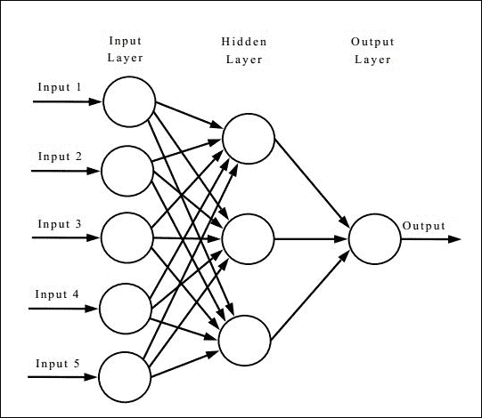

**输入层**是我们提供所有已知的列数据的层，包括历史数据和新数据。该过程首先涉及提供我们已经知道输出的数据。这个阶段被称为学习阶段。有两种类型的学习算法，监督和非监督。这些的解释超出了本书的范围。之后，有一个训练算法，用于最小化期望输出中的错误。反向传播是一种这样的技术，通过调整计算神经网络函数的权重，直到我们接近期望的结果。在网络设置并为已知输出提供正确结果后，我们可以提供新数据并找到未知列数据的结果。

# 使用遗传算法

**遗传算法**（**GA**）是一种**进化算法**（**EA**）的方法。当我们想要编写预测算法时，它们特别有用，其中只选择最强的，其余的被拒绝。这就是它得名的原因。因此，在每次迭代中，它会发生突变，进行交叉，并且只选择最好的进入下一代种群。遗传算法背后的想法是经过多次迭代后，只有最佳的候选者留下。

## 准备就绪

要完成这个配方，您需要一台安装了 Visual Studio 的 Windows 机器。

## 如何做...

在这个配方中，我们将发现编写遗传算法有多么容易：

```cpp
void crossover(int &seed);
void elitist();
void evaluate();
int i4_uniform_ab(int a, int b, int &seed);
void initialize(string filename, int &seed);
void keep_the_best();
void mutate(int &seed);
double r8_uniform_ab(double a, double b, int &seed);
void report(int generation);
void selector(int &seed);
void timestamp();
void Xover(int one, int two, int &seed);
```

## 它是如何工作的...

起初，遗传算法可能看起来非常难以理解或毫无意义。然而，遗传算法非常简单。让我们想象一种情况，我们有一片充满了具有不同属性的龙的土地。龙的目标是击败具有某些属性的人类玩家。

**龙（AI）**

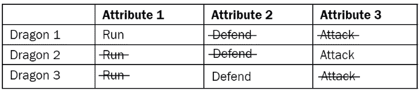

**人类（玩家）**

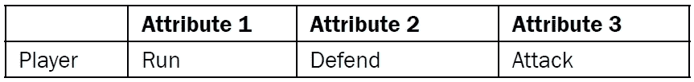

因此，为了使龙对抗人类具有竞争力，它必须学会奔跑，防御和攻击。让我们看看遗传算法如何帮助我们做到这一点：

### 步骤 1（初始种群）

**龙（AI）：**

这是我们的初始种群。每个都有自己的属性集。我们只考虑三条龙。实际上，会有更多。

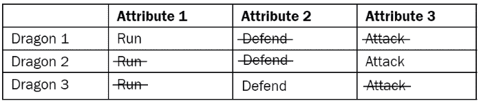

### 步骤 2（适应函数）

适应度函数（%）确定种群中特定龙的适应程度。100%是完美适应度。


### 步骤 3 交叉

基于适应函数和缺失的属性，将进行交叉或繁殖阶段，以创建具有两种属性的新龙：

**表 1**

| 适应度 | 龙 | 属性 1 | 属性 2 | 属性 3 |
| --- | --- | --- | --- | --- |
| 60% | 龙 1 | 奔跑 | 防御 | 攻击 |
| 75% | 龙 2 | 奔跑 | 防御 | 攻击 |
| 20% | 龙 3 | 奔跑 | 防御 | 攻击 |

**表 2**

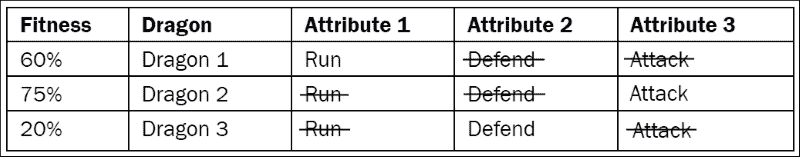

适应度函数最低的龙将从种群中移除。（适者生存）。

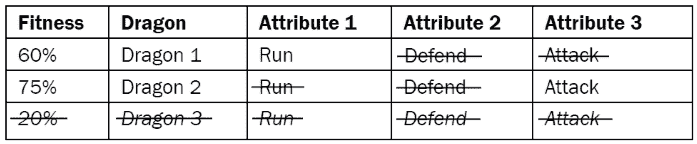

### 步骤 4 突变

因此，我们现在有了一条新的龙，它既可以奔跑又可以攻击，并且适应度函数为*67%*：

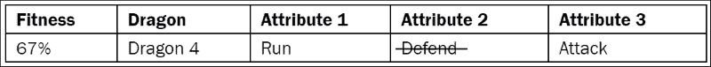

现在，我们必须重复这个过程（新一代）与种群中的其他龙，直到我们对结果满意为止。理想的种群将是当所有龙都具有以下能力时：

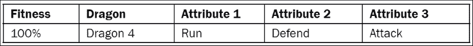

然而，这并不总是可能的。我们需要确保它更接近目标。这里描述的所有阶段都被实现为函数，并且可以根据 AI 代理的要求进行扩展。

现在你可能会问，为什么我们不一开始就创建具有所有属性的龙呢？这就是自适应 AI 发挥作用的地方。如果我们在用户玩游戏之前就定义了龙的所有属性，随着游戏的进行，可能会很容易击败龙。然而，如果 AI 龙可以根据玩家如何击败它们来适应，那么击败 AI 可能会变得越来越困难。当玩家击败 AI 时，我们需要记录参数，并将该参数作为龙的目标属性添加，它可以在几次交叉和突变后实现。

# 使用其他航点系统

航点是编写路径规划算法的一种方式。它们非常容易编写。然而，如果没有正确考虑，它们可能会非常有 bug，AI 看起来可能非常愚蠢。许多旧游戏经常出现这种 bug，这导致了航点系统实现的革命。

## 准备工作

要完成这个配方，你需要一台运行 Windows 的机器，并安装了 Visual Studio 的版本。不需要其他先决条件。

## 如何做到...

在这个配方中，我们将发现创建航点系统有多么容易：

```cpp
#include <iostream>

using namespace std;

int main()
{
  float positionA = 4.0f; float positionB = 2.0f; float positionC = -1.0f; float positionD = 10.0f; float positionE = 0.0f;

  //Sort the points according to Djisktra's
  //A* can be used on top of this to minimise the points for traversal
  //Transform the  objects over these new points.
  return 0;
}
```

## 它是如何工作的...

在这个例子中，我们将讨论航点系统的基本实现。顾名思义，航点只是我们希望 AI 代理跟随的世界空间中的 2D/3D 点。代理所要做的就是从点**A**移动到点**B**。然而，这有复杂性。例如，让我们考虑以下图表：

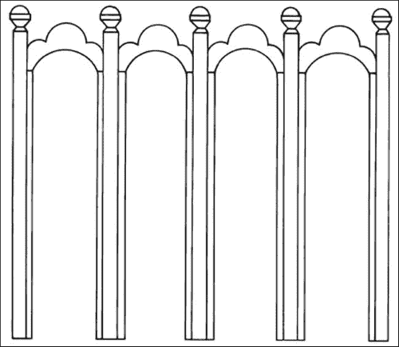

从**A**到**B**很容易。现在，要从**B**到**C**，它必须遵循 A*或 Djikstra 的算法。在这种情况下，它将避开中心的障碍物，向**C**移动。现在假设它突然在旅途中看到了用户在点**A**。它应该如何反应？如果我们只提供航点，它将查看允许移动到的点的字典，并找到最接近它的点。答案将是**A**。然而，如果它开始朝**A**走去，它将被墙挡住，可能会陷入循环，不断撞墙。你可能在旧游戏中经常看到这种行为。在这种情况下，AI 必须做出决定，返回**B**，然后再到**A**。因此，我们不能单独使用航点算法。为了更好的性能和效率，我们需要编写一个决策算法和一个路径规划算法。这是大多数现代游戏中使用的技术，还有**NavMesh**等技术。
