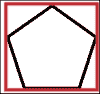

# 第九章：游戏开发中的物理

在本章中，将介绍以下食谱：

+   在游戏中使用物理规则

+   使物体发生碰撞

+   安装和集成 Box2D

+   制作基本的 2D 游戏

+   制作 3D 游戏

+   创建一个粒子系统

+   在游戏中使用布娃娃

# 介绍

在现代游戏和过去的游戏中，总是添加了某种类型的物理以增加现实感。尽管游戏中的大多数物理是对实际物理规则的近似或优化，但它确实很好地实现了期望的结果。游戏中的物理基本上是牛顿运动定律的粗略实现，结合了基本的碰撞检测原理。

游戏开发者的诀窍是以这样一种方式编写代码，使其不会成为 CPU 的瓶颈，游戏仍然以期望的框架运行。我们将讨论一些我们需要引入物理到游戏中的基本概念。为了简单起见，我们已经将**Box2D**集成到我们的引擎中，并且与渲染器（**OpenGL**）一起，我们将输出物体之间的一些物理交互。对于 3D 物理，我们将从**Bullet Physics** SDK 获得帮助，并显示期望的结果。

# 在游戏中使用物理规则

在游戏中引入物理的第一步是准备好环境，以便可以对物体应用适当的计算，并且物理模拟可以对其进行操作。

## 做好准备

要完成这个食谱，您需要一台运行 Windows 和 Visual Studio 的计算机。不需要其他先决条件。

## 如何做...

在这个食谱中，我们将看到向游戏中添加物理规则是多么容易：

1.  首先，在游戏场景中设置所有物体。

1.  给它们属性，使它们具有矢量点和速度。

1.  根据物体的形状分配边界框或边界圆。

1.  对每个物体施加力。

1.  根据形状检测它们之间的碰撞。

1.  解决约束。

1.  输出结果。

看一下以下代码片段：

```cpp
#include <Box2D/Collision/b2Collision.h>
#include <Box2D/Collision/Shapes/b2CircleShape.h>
#include <Box2D/Collision/Shapes/b2PolygonShape.h>

void b2CollideCircles(
  b2Manifold* manifold,
  const b2CircleShape* circleA, const b2Transform& xfA,
  const b2CircleShape* circleB, const b2Transform& xfB)
{
  manifold->pointCount = 0;

  b2Vec2 pA = b2Mul(xfA, circleA->m_p);
  b2Vec2 pB = b2Mul(xfB, circleB->m_p);

  b2Vec2 d = pB - pA;
  float32 distSqr = b2Dot(d, d);
  float32 rA = circleA->m_radius, rB = circleB->m_radius;
  float32 radius = rA + rB;
  if (distSqr > radius * radius)
  {
    return;
  }

  manifold->type = b2Manifold::e_circles;
  manifold->localPoint = circleA->m_p;
  manifold->localNormal.SetZero();
  manifold->pointCount = 1;

  manifold->points[0].localPoint = circleB->m_p;
  manifold->points[0].id.key = 0;
}

void b2CollidePolygonAndCircle(
  b2Manifold* manifold,
  const b2PolygonShape* polygonA, const b2Transform& xfA,
  const b2CircleShape* circleB, const b2Transform& xfB)
{
  manifold->pointCount = 0;

  // Compute circle position in the frame of the polygon.
  b2Vec2 c = b2Mul(xfB, circleB->m_p);
  b2Vec2 cLocal = b2MulT(xfA, c);

  // Find the min separating edge.
  int32 normalIndex = 0;
  float32 separation = -b2_maxFloat;
  float32 radius = polygonA->m_radius + circleB->m_radius;
  int32 vertexCount = polygonA->m_count;
  const b2Vec2* vertices = polygonA->m_vertices;
  const b2Vec2* normals = polygonA->m_normals;

  for (int32 i = 0; i < vertexCount; ++i)
  {
    float32 s = b2Dot(normals[i], cLocal - vertices[i]);

    if (s > radius)
    {
      // Early out.
      return;
    }

    if (s > separation)
    {
      separation = s;
      normalIndex = i;
    }
  }

  // Vertices that subtend the incident face.
  int32 vertIndex1 = normalIndex;
  int32 vertIndex2 = vertIndex1 + 1 < vertexCount ? vertIndex1 + 1 : 0;
  b2Vec2 v1 = vertices[vertIndex1];
  b2Vec2 v2 = vertices[vertIndex2];

  // If the center is inside the polygon ...
  if (separation < b2_epsilon)
  {
    manifold->pointCount = 1;
    manifold->type = b2Manifold::e_faceA;
    manifold->localNormal = normals[normalIndex];
    manifold->localPoint = 0.5f * (v1 + v2);
    manifold->points[0].localPoint = circleB->m_p;
    manifold->points[0].id.key = 0;
    return;
  }

  // Compute barycentric coordinates
  float32 u1 = b2Dot(cLocal - v1, v2 - v1);
  float32 u2 = b2Dot(cLocal - v2, v1 - v2);
  if (u1 <= 0.0f)
  {
    if (b2DistanceSquared(cLocal, v1) > radius * radius)
    {
      return;
    }

    manifold->pointCount = 1;
    manifold->type = b2Manifold::e_faceA;
    manifold->localNormal = cLocal - v1;
    manifold->localNormal.Normalize();
    manifold->localPoint = v1;
    manifold->points[0].localPoint = circleB->m_p;
    manifold->points[0].id.key = 0;
  }
  else if (u2 <= 0.0f)
  {
    if (b2DistanceSquared(cLocal, v2) > radius * radius)
    {
      return;
    }

    manifold->pointCount = 1;
    manifold->type = b2Manifold::e_faceA;
    manifold->localNormal = cLocal - v2;
    manifold->localNormal.Normalize();
    manifold->localPoint = v2;
    manifold->points[0].localPoint = circleB->m_p;
    manifold->points[0].id.key = 0;
  }
  else
  {
    b2Vec2 faceCenter = 0.5f * (v1 + v2);
    float32 separation = b2Dot(cLocal - faceCenter, normals[vertIndex1]);
    if (separation > radius)
    {
      return;
    }

    manifold->pointCount = 1;
    manifold->type = b2Manifold::e_faceA;
    manifold->localNormal = normals[vertIndex1];
    manifold->localPoint = faceCenter;
    manifold->points[0].localPoint = circleB->m_p;
    manifold->points[0].id.key = 0;
  }
}
```

## 它是如何工作的...

身体展现物理属性的第一步是成为刚体。然而，如果您的身体应该具有某种流体物理特性，比如塑料或其他软体，这就不成立了。在这种情况下，我们将不得不以不同的方式设置世界，因为这是一个更加复杂的问题。简而言之，刚体是世界空间中的任何物体，即使外部力作用于它，它也不会变形。即使在 Unity 或 UE4 等游戏引擎中，如果将一个物体分配为刚体，它也会根据引擎的物理模拟属性自动反应。设置好刚体后，我们需要确定物体是静态的还是动态的。这一步很重要，因为如果我们知道物体是静态的，我们可以大大减少计算量。动态物体必须分配速度和矢量位置。

在完成上一步之后，下一步是添加碰撞器或边界对象。这些实际上将用于计算碰撞点。例如，如果我们有一个人的 3D 模型，有时使用精确的身体网格进行碰撞并不明智。相反，我们可以使用一个胶囊，它是一个在身体两端各有两个半球的圆柱体，手部也有类似的结构。对于 2D 物体，我们可以在圆形边界对象或矩形边界对象之间做出选择。以下图表显示了物体为黑色，边界框为红色。现在我们可以对物体施加力或冲量：



管道中的下一步是实际检测两个物体何时发生碰撞。我们将在下一个步骤中进一步讨论这个问题。但是假设我们需要检测`圆 A`是否与`圆 B`发生了碰撞；在大多数情况下，我们只需要知道它们是否发生了碰撞，而不需要知道具体的接触点。在这种情况下，我们需要编写一些数学函数来检测。然后我们返回输出，并根据此编写我们的碰撞逻辑，最后显示结果。

在前面的例子中，有一个名为`b2CollidePolygonAndCircle`的函数，用于计算多边形和圆之间的碰撞。我们定义了两个形状，然后尝试计算确定多边形和圆的点是否相交的各种细节。我们需要找到边缘列表点，然后计算这些点是否在另一个形状内部，依此类推。

# 使物体发生碰撞

物理系统的一个重要部分是使物体发生碰撞。我们需要弄清楚物体是否发生了碰撞，并传递相关信息。在这个步骤中，我们将看看不同的技术来做到这一点。

## 准备工作

你需要一台运行正常的 Windows 机器和一个可用的 Visual Studio 副本。不需要其他先决条件。

## 如何做…

在这个步骤中，我们将找出检测碰撞有多容易：

```cpp
#include <Box2D/Collision/b2Collision.h>
#include <Box2D/Collision/Shapes/b2PolygonShape.h>

// Find the max separation between poly1 and poly2 using edge normals from poly1.
static float32 b2FindMaxSeparation(int32* edgeIndex,
             const b2PolygonShape* poly1, const b2Transform& xf1,
             const b2PolygonShape* poly2, const b2Transform& xf2)
{
  int32 count1 = poly1->m_count;
  int32 count2 = poly2->m_count;
  const b2Vec2* n1s = poly1->m_normals;
  const b2Vec2* v1s = poly1->m_vertices;
  const b2Vec2* v2s = poly2->m_vertices;
  b2Transform xf = b2MulT(xf2, xf1);

  int32 bestIndex = 0;
  float32 maxSeparation = -b2_maxFloat;
  for (int32 i = 0; i < count1; ++i)
  {
    // Get poly1 normal in frame2.
    b2Vec2 n = b2Mul(xf.q, n1s[i]);
    b2Vec2 v1 = b2Mul(xf, v1s[i]);

    // Find deepest point for normal i.
    float32 si = b2_maxFloat;
    for (int32 j = 0; j < count2; ++j)
    {
      float32 sij = b2Dot(n, v2s[j] - v1);
      if (sij < si)
      {
        si = sij;
      }
    }

    if (si > maxSeparation)
    {
      maxSeparation = si;
      bestIndex = i;
    }
  }

  *edgeIndex = bestIndex;
  return maxSeparation;
}

static void b2FindIncidentEdge(b2ClipVertex c[2],
           const b2PolygonShape* poly1, const b2Transform& xf1, int32 edge1,
           const b2PolygonShape* poly2, const b2Transform& xf2)
{
  const b2Vec2* normals1 = poly1->m_normals;

  int32 count2 = poly2->m_count;
  const b2Vec2* vertices2 = poly2->m_vertices;
  const b2Vec2* normals2 = poly2->m_normals;

  b2Assert(0 <= edge1 && edge1 < poly1->m_count);

  // Get the normal of the reference edge in poly2's frame.
  b2Vec2 normal1 = b2MulT(xf2.q, b2Mul(xf1.q, normals1[edge1]));

  // Find the incident edge on poly2.
  int32 index = 0;
  float32 minDot = b2_maxFloat;
  for (int32 i = 0; i < count2; ++i)
  {
    float32 dot = b2Dot(normal1, normals2[i]);
    if (dot < minDot)
    {
      minDot = dot;
      index = i;
    }
  }

  // Build the clip vertices for the incident edge.
  int32 i1 = index;
  int32 i2 = i1 + 1 < count2 ? i1 + 1 : 0;

  c[0].v = b2Mul(xf2, vertices2[i1]);
  c[0].id.cf.indexA = (uint8)edge1;
  c[0].id.cf.indexB = (uint8)i1;
  c[0].id.cf.typeA = b2ContactFeature::e_face;
  c[0].id.cf.typeB = b2ContactFeature::e_vertex;

  c[1].v = b2Mul(xf2, vertices2[i2]);
  c[1].id.cf.indexA = (uint8)edge1;
  c[1].id.cf.indexB = (uint8)i2;
  c[1].id.cf.typeA = b2ContactFeature::e_face;
  c[1].id.cf.typeB = b2ContactFeature::e_vertex;
}

// Find edge normal of max separation on A - return if separating axis is found
// Find edge normal of max separation on B - return if separation axis is found
// Choose reference edge as min(minA, minB)
// Find incident edge
// Clip

// The normal points from 1 to 2
void b2CollidePolygons(b2Manifold* manifold,
            const b2PolygonShape* polyA, const b2Transform& xfA,
            const b2PolygonShape* polyB, const b2Transform& xfB)
{
  manifold->pointCount = 0;
  float32 totalRadius = polyA->m_radius + polyB->m_radius;

  int32 edgeA = 0;
  float32 separationA = b2FindMaxSeparation(&edgeA, polyA, xfA, polyB, xfB);
  if (separationA > totalRadius)
    return;

  int32 edgeB = 0;
  float32 separationB = b2FindMaxSeparation(&edgeB, polyB, xfB, polyA, xfA);
  if (separationB > totalRadius)
    return;

  const b2PolygonShape* poly1;  // reference polygon
  const b2PolygonShape* poly2;  // incident polygon
  b2Transform xf1, xf2;
  int32 edge1;          // reference edge
  uint8 flip;
  const float32 k_tol = 0.1f * b2_linearSlop;

  if (separationB > separationA + k_tol)
  {
    poly1 = polyB;
    poly2 = polyA;
    xf1 = xfB;
    xf2 = xfA;
    edge1 = edgeB;
    manifold->type = b2Manifold::e_faceB;
    flip = 1;
  }
  else
  {
    poly1 = polyA;
    poly2 = polyB;
    xf1 = xfA;
    xf2 = xfB;
    edge1 = edgeA;
    manifold->type = b2Manifold::e_faceA;
    flip = 0;
  }

  b2ClipVertex incidentEdge[2];
  b2FindIncidentEdge(incidentEdge, poly1, xf1, edge1, poly2, xf2);

  int32 count1 = poly1->m_count;
  const b2Vec2* vertices1 = poly1->m_vertices;

  int32 iv1 = edge1;
  int32 iv2 = edge1 + 1 < count1 ? edge1 + 1 : 0;

  b2Vec2 v11 = vertices1[iv1];
  b2Vec2 v12 = vertices1[iv2];

  b2Vec2 localTangent = v12 - v11;
  localTangent.Normalize();

  b2Vec2 localNormal = b2Cross(localTangent, 1.0f);
  b2Vec2 planePoint = 0.5f * (v11 + v12);

  b2Vec2 tangent = b2Mul(xf1.q, localTangent);
  b2Vec2 normal = b2Cross(tangent, 1.0f);

  v11 = b2Mul(xf1, v11);
  v12 = b2Mul(xf1, v12);

  // Face offset.
  float32 frontOffset = b2Dot(normal, v11);

  // Side offsets, extended by polytope skin thickness.
  float32 sideOffset1 = -b2Dot(tangent, v11) + totalRadius;
  float32 sideOffset2 = b2Dot(tangent, v12) + totalRadius;

  // Clip incident edge against extruded edge1 side edges.
  b2ClipVertex clipPoints1[2];
  b2ClipVertex clipPoints2[2];
  int np;

  // Clip to box side 1
  np = b2ClipSegmentToLine(clipPoints1, incidentEdge, -tangent, sideOffset1, iv1);

  if (np < 2)
    return;

  // Clip to negative box side 1
  np = b2ClipSegmentToLine(clipPoints2, clipPoints1,  tangent, sideOffset2, iv2);

  if (np < 2)
  {
    return;
  }

  // Now clipPoints2 contains the clipped points.
  manifold->localNormal = localNormal;
  manifold->localPoint = planePoint;

  int32 pointCount = 0;
  for (int32 i = 0; i < b2_maxManifoldPoints; ++i)
  {
    float32 separation = b2Dot(normal, clipPoints2[i].v) - frontOffset;

    if (separation <= totalRadius)
    {
      b2ManifoldPoint* cp = manifold->points + pointCount;
      cp->localPoint = b2MulT(xf2, clipPoints2[i].v);
      cp->id = clipPoints2[i].id;
      if (flip)
      {
        // Swap features
        b2ContactFeature cf = cp->id.cf;
        cp->id.cf.indexA = cf.indexB;
        cp->id.cf.indexB = cf.indexA;
        cp->id.cf.typeA = cf.typeB;
        cp->id.cf.typeB = cf.typeA;
      }
      ++pointCount;
    }
  }

  manifold->pointCount = pointCount;
}
```

## 工作原理…

假设场景中的物体已经设置为刚体，并且为每个物体添加了适当的冲量，下一步是检测碰撞。冲量是作用在物体上的力。这种力短暂地作用在物体上，并导致动量的一些变化。

在游戏中，碰撞检测通常分为两个阶段。第一阶段称为**广相碰撞**，下一阶段称为**窄相碰撞**。广相阶段成本较低，因为它处理的是哪些物体最有可能发生碰撞的概念。窄相阶段成本更高，因为它实际上比较了每个物体是否发生碰撞。在游戏环境中，不可能将所有内容都放在窄相阶段。因此，大部分工作都是在广相阶段完成的。广相算法使用扫描和修剪（排序和修剪）或空间分区树。在扫描和修剪技术中，对实体的边界框的所有下端和上端进行排序并检查是否相交。之后，它被发送到窄相阶段进行更详细的检查。因此，在这种方法中，我们需要在实体改变方向时更新其边界框。另一种使用的技术是**BSP**。我们已经在之前的章节中讨论过 BSP。我们需要将场景分割成这样的方式，使得在每个子分区中，只有一定数量的物体可以发生碰撞。在窄相碰撞中，会应用更像素完美的碰撞检测算法。

有各种方法来检查碰撞。这完全取决于充当边界框的形状。此外，了解边界框的对齐方式也很重要。在正常情况下，边界框将是轴对齐的，并且将被称为`AABB`。要检测两个 Box2D 边界框是否发生碰撞，我们需要执行以下操作：

```cpp
bool BoxesIntersect(const Box2D &a, const Box2D &b)
{
    if (a.max.x < b.min.x) return false; // a is left of b
    if (a.min.x > b.max.x) return false; // a is right of b
    if (a.max.y < b.min.y) return false; // a is above b
    if (a.min.y > b.max.y) return false; // a is below b
    return true; // boxes overlap
}
```

然后我们可以扩展这一点，以检测更复杂的形状，如矩形、圆形、线条和其他多边形。如果我们正在编写自己的 2D 物理引擎，那么我们将不得不为每种形状相互交叉编写一个函数。如果我们使用诸如 Box2D 或 PhysX 之类的物理引擎，这些函数已经被写好，我们只需要正确和一致地使用它们。

# 安装和集成 Box2D

要能够使用 2D 物理，一个很好的开源物理引擎是 Box2D。这个引擎带有许多对于任何 2D 游戏都常见的函数，因此我们不必重新发明轮子并重新编写它们。

## 准备工作

你需要有一台运行正常的 Windows 机器。

## 如何做…

按照以下步骤进行：

1.  转到[`box2d.org/`](http://box2d.org/)。

1.  浏览到[`box2d.org/downloads/`](http://box2d.org/downloads/)。

1.  从 GitHub 下载或克隆最新版本。

1.  在您的 Visual Studio 版本中构建解决方案。一些项目可能无法工作，因为它们是在不同版本的 Visual Studio 中构建的。

1.  如果出现错误，请清理解决方案，删除`bin`文件夹，然后重新构建它。

1.  解决方案成功重建后，运行`TestBed`项目。

1.  如果您能成功运行应用程序，Box2D 已经集成。

## 工作原理…

Box2D 是一个完全由 C++构建的物理引擎。由于它给了我们访问源代码的权限，这意味着我们也可以从头开始构建它，并检查每个函数是如何编写的。由于该项目托管在 GitHub 上，每次进行新开发时，我们都可以克隆它并更新所有最新的代码。

在解决方案中，Box2D 已经有一个名为`TestBed`的项目，其中包含许多可以运行的示例应用程序。实际上，这是许多不同类型应用程序的集合。`Test Entries`是所有应用程序的入口点。它是一个包含我们想要在`TestBed`项目中呈现的不同应用程序的长数组。该数组包含应用程序的名称和初始化世界的静态函数。

最后，物理模拟的输出被馈送到渲染器，这种情况下是 OpenGL，并为我们绘制场景。

# 制作基本的 2D 游戏

每个 2D 游戏都是不同的。然而，我们可以概括将在大多数 2D 游戏中使用的物理函数。在这个教程中，我们将使用 Box2D 的内置函数和`TestBed`项目创建一个基本场景。该场景将模仿我们这个时代最流行的 2D 游戏之一，*愤怒的小鸟*TM。

## 准备工作

对于这个教程，您需要一台 Windows 机器和安装了 Visual Studio 的版本。不需要其他先决条件。

## 操作步骤…

在这个教程中，我们将发现使用 Box2D 为 2D 游戏添加一个简单的架构是多么容易：

```cpp
class Tiles : public Test
{
public:
  enum
  {
    e_count = 10
  };

  Tiles()
  {
    m_fixtureCount = 0;
    b2Timer timer;

    {
      float32 a = 1.0f;
      b2BodyDef bd;
      bd.position.y = -a;
      b2Body* ground = m_world->CreateBody(&bd);

#if 1
      int32 N = 200;
      int32 M = 10;
      b2Vec2 position;
      position.y = 0.0f;
      for (int32 j = 0; j < M; ++j)
      {
        position.x = -N * a;
        for (int32 i = 0; i < N; ++i)
        {
          b2PolygonShape shape;
          shape.SetAsBox(a, a, position, 0.0f);
          ground->CreateFixture(&shape, 0.0f);
          ++m_fixtureCount;
          position.x += 2.0f * a;
        }
        position.y -= 2.0f * a;
      }
#else
      int32 N = 200;
      int32 M = 10;
      b2Vec2 position;
      position.x = -N * a;
      for (int32 i = 0; i < N; ++i)
      {
        position.y = 0.0f;
        for (int32 j = 0; j < M; ++j)
        {
          b2PolygonShape shape;
          shape.SetAsBox(a, a, position, 0.0f);
          ground->CreateFixture(&shape, 0.0f);
          position.y -= 2.0f * a;
        }
        position.x += 2.0f * a;
      }
#endif
    }

    {
      float32 a = 1.0f;
      b2PolygonShape shape;
      shape.SetAsBox(a, a);

      b2Vec2 x(-7.0f, 0.75f);
      b2Vec2 y;
      b2Vec2 deltaX(1.125f, 2.5f);
      b2Vec2 deltaY(2.25f, 0.0f);

      for (int32 i = 0; i < e_count; ++i)
      {
        y = x;

        for (int32 j = i; j < e_count; ++j)
        {
          b2BodyDef bd;
          bd.type = b2_dynamicBody;
          bd.position = y;

          b2Body* body = m_world->CreateBody(&bd);
          body->CreateFixture(&shape, 5.0f);
          ++m_fixtureCount;
          y += deltaY;
        }

        x += deltaX;
      }
    }

    m_createTime = timer.GetMilliseconds();
  }

  void Step(Settings* settings)
  {
    const b2ContactManager& cm = m_world->GetContactManager();
    int32 height = cm.m_broadPhase.GetTreeHeight();
    int32 leafCount = cm.m_broadPhase.GetProxyCount();
    int32 minimumNodeCount = 2 * leafCount - 1;
    float32 minimumHeight = ceilf(logf(float32(minimumNodeCount)) / logf(2.0f));
    g_debugDraw.DrawString(5, m_textLine, "dynamic tree height = %d, min = %d", height, int32(minimumHeight));
    m_textLine += DRAW_STRING_NEW_LINE;

    Test::Step(settings);

    g_debugDraw.DrawString(5, m_textLine, "create time = %6.2f ms, fixture count = %d",
      m_createTime, m_fixtureCount);
    m_textLine += DRAW_STRING_NEW_LINE;

  }

  static Test* Create()
  {
    return new Tiles;
  }

  int32 m_fixtureCount;
  float32 m_createTime;
};

#endif
```

## 工作原理…

在这个示例中，我们使用 Box2D 引擎来计算物理。如前所述，`Test Entries`的主类用于存储应用程序的名称和静态创建方法。在这种情况下，应用程序的名称是`Tiles`。在瓷砖应用程序中，我们使用 Box2D 形状和函数创建了一个物理世界。瓷砖金字塔是用方块创建的。这些方块是动态的，这意味着它们会根据施加在它们身上的力而做出反应和移动。基座或地面也由瓷砖制成。但是，这些瓷砖是静止的，不会移动。我们为构成地面和金字塔的所有瓷砖分配位置和速度。逐个为每个瓷砖分配位置和速度是不切实际的，因此我们使用迭代循环来实现这一点。

场景构建完成后，我们可以通过鼠标点击与金字塔进行交互。从 GUI 中，还可以打开或关闭其他属性。按下空格键还会在随机位置触发一个球，它将摧毁瓷砖的形成，就像*愤怒的小鸟*一样。我们还可以编写逻辑，使所有与地面碰撞的瓷砖消失，并在每次发生碰撞时为得分加分，然后我们就有了一个小型的 2D *愤怒的小鸟*克隆。

# 制作 3D 游戏

当我们把注意力从 2D 物理转移到 3D 物理时，变化不大。现在我们需要担心另一个维度。如前面的教程中所述，我们仍然需要维护环境，使其遵循牛顿规则并解决约束。在 3D 空间中旋转物体时可能会出现很多问题。在这个教程中，我们将使用 Bullet Engine SDK 来查看 3D 物理的一个非常基本的实现。

## 准备工作

对于这个教程，您需要一台 Windows 机器和安装了 Visual Studio 的版本。

## 操作步骤…

在这个示例中，我们将看到在 3D 中编写物理世界是多么容易。

对于广相碰撞，请查看以下代码片段：

```cpp
void  b3DynamicBvhBroadphase::getAabb(int objectId,b3Vector3& aabbMin, b3Vector3& aabbMax ) const
{
  const b3DbvtProxy*            proxy=&m_proxies[objectId];
  aabbMin = proxy->m_aabbMin;
  aabbMax = proxy->m_aabbMax;
}
```

对于窄相碰撞，请参阅以下代码：

```cpp
void b3CpuNarrowPhase::computeContacts(b3AlignedObjectArray<b3Int4>& pairs, b3AlignedObjectArray<b3Aabb>& aabbsWorldSpace, b3AlignedObjectArray<b3RigidBodyData>& bodies)
{
  int nPairs = pairs.size();
  int numContacts = 0;
  int maxContactCapacity = m_data->m_config.m_maxContactCapacity;
  m_data->m_contacts.resize(maxContactCapacity);

  for (int i=0;i<nPairs;i++)
  {
    int bodyIndexA = pairs[i].x;
    int bodyIndexB = pairs[i].y;
    int collidableIndexA = bodies[bodyIndexA].m_collidableIdx;
    int collidableIndexB = bodies[bodyIndexB].m_collidableIdx;

    if (m_data->m_collidablesCPU[collidableIndexA].m_shapeType == SHAPE_SPHERE &&
      m_data->m_collidablesCPU[collidableIndexB].m_shapeType == SHAPE_CONVEX_HULL)
    {
//     computeContactSphereConvex(i,bodyIndexA,bodyIndexB,collidableIndexA,collidableIndexB,&bodies[0],
//     &m_data->m_collidablesCPU[0],&hostConvexData[0],&hostVertices[0],&hostIndices[0],&hostFaces[0],&hostContacts[0],nContacts,maxContactCapacity);
    }

    if (m_data->m_collidablesCPU[collidableIndexA].m_shapeType == SHAPE_

  m_data->m_contacts.resize(numContacts);

<. . . . . . .  More code to follow . . . . . . . .>
}
```

## 工作原理…

正如我们从上面的示例中看到的，即使在 3D 中，物理碰撞系统也必须分为阶段：广相和窄相。在广相碰撞中，我们现在考虑 Vector3，而不仅仅是两个浮点数，因为现在我们有三个轴（*x*，*y*和*z*）。我们需要输入对象 ID，然后检查边界框的范围。同样，对于窄相碰撞，我们的问题域和计算保持不变。我们现在将其更改为支持 3D。先前的示例显示了在窄相碰撞中需要找到接触点的问题的一部分。我们创建一个数组，并根据碰撞回调保存所有接触点。稍后，我们可以编写其他方法来检查这些点是否重叠。

# 创建一个粒子系统

粒子系统在游戏中非常重要，可以增加游戏整体感觉的视觉表现。粒子系统很容易编写，只是一个或多个粒子的集合。因此，我们需要创建一个具有一些属性的单个粒子，然后让粒子系统决定需要多少粒子。

## 准备工作

对于这个示例，您需要一台 Windows 机器和安装了 Visual Studio 的版本。

## 如何做…

添加一个名为`Source.cpp`的源文件。然后将以下代码添加到其中：

```cpp
class Particle

{
  Vector3 location;
  Vector3 velocity;
  Vector3 acceleration;
  float lifespan;

  Particle(Vector3 vec)
  {

    acceleration = new Vector3(.05, 0.05);
    velocity = new Vector3(random(-3, 3), random(-4, 0));
    location = vec.get();
    lifespan = 125.0;
  }

    void run()
    {
    update();
    display();
    }

  void update() {
    velocity.add(acceleration);
    location.add(velocity);
    lifespan -= 2.0;
  }

  void display()
  {
    stroke(0, lifespan);
    fill(0, lifespan);
    trapezoid(location.x, location.y, 8, 8);
  }

    boolean isDead()
    {
    if (lifespan < 0.0) {
      return true;
    }
    else {
      return false;
    }
  }
};

Particle p;

void setup()
{
  size(800, 600);
  p = new Particle(new Vector3(width / 2, 10));
}

void draw()
{
  for (int i = 0; i < particles.size(); i++) {
    Particle p = particles.get(i);
    p.run();

      if (p.isDead()) {
        particles.remove(i);
      }
  }
}
```

## 工作原理…

正如我们在示例中看到的，我们的第一个任务是创建一个`particle`类。`particle`类将具有诸如`velocity`、`acceleration`、`position`和`lifespan`之类的属性。因为我们在 3D 空间中制作粒子，所以我们使用 Vector3 来表示粒子的属性。如果我们要在 2D 空间中创建粒子，我们将使用 Vector2 来做到这一点。在构造函数中，我们分配属性的起始值。然后我们有两个主要函数，`update`和`display`。`update`函数在每一帧更新`velocity`和`position`，并减少寿命，以便在寿命结束时消失。在`display`函数中，我们需要指定我们希望如何查看粒子：它是否应该有描边或填充等。在这里，我们还必须指定粒子的形状。最常见的形状是球体或圆锥体。我们使用了梯形只是为了表示我们可以指定任何形状。最后，从客户程序中，我们需要调用这个对象，然后访问各种函数来显示粒子。

然而，所有这些只会在屏幕上显示一个粒子。当然，我们可以创建一个包含 100 个对象的数组，这样就可以在屏幕上显示 100 个粒子。更好的方法是创建一个粒子系统，它可以创建一个粒子数组。要绘制的粒子数量由客户程序指定。根据请求，粒子系统绘制所需数量的粒子。此外，必须有一个函数来确定哪些粒子需要从屏幕上移除。这取决于每个粒子的寿命。

# 在游戏中使用布娃娃

**布娃娃物理**是一种特殊的程序动画，通常用作游戏中传统静态死亡动画的替代品。布娃娃动画的整个理念是，角色死亡后，身体的骨骼就像布娃娃一样行为。因此得名。这与现实主义无关，但为游戏增添了特别的乐趣元素。

## 准备工作

对于这个示例，您需要一台 Windows 机器和安装了 Visual Studio 的版本。还需要 DirectX SDK；最好使用 DirectX 2010 年 6 月版。

## 如何做…

让我们看一下以下代码：

```cpp
#include "RagDoll.h"
#include "C3DETransform.h"
#include "PhysicsFactory.h"
#include "Physics.h"
#include "DebugMemory.h"

RagDoll::RagDoll(C3DESkinnedMesh * a_skinnedMesh, C3DESkinnedMeshContainer * a_skinnedMeshContainer, int totalParts, int totalConstraints)
{
  m_skinnedMesh = a_skinnedMesh;
  m_skinnedMeshContainer = a_skinnedMeshContainer;
  m_totalParts = totalParts;
  m_totalConstraints = totalConstraints;

  m_ragdollBodies = (btRigidBody**)malloc(sizeof(btRigidBody) * totalParts);
  m_ragdollShapes = (btCollisionShape**)malloc(sizeof(btCollisionShape) * totalParts);
  m_ragdollConstraints = (btTypedConstraint**)malloc(sizeof(btTypedConstraint) * totalConstraints);

  m_boneIndicesToFollow = (int*) malloc(sizeof(int) * m_skinnedMesh->GetTotalBones());

  m_totalBones = m_skinnedMesh->GetTotalBones();

  m_bonesCurrentWorldPosition = (D3DXMATRIX**)malloc(sizeof(D3DXMATRIX) * m_totalBones);

  m_boneToPartTransforms = (D3DXMATRIX**)malloc(sizeof(D3DXMATRIX) * m_totalBones);

  for(int i = 0; i < totalConstraints; i++)
  {
    m_ragdollConstraints[i] = NULL;
  }

  for(int i = 0; i < totalParts; i++)
  {
    m_ragdollBodies[i] = NULL;
    m_ragdollShapes[i] = NULL;

  }

  for(int i = 0; i < m_totalBones; i++)
  {    
    m_boneToPartTransforms[i] = NULL;
    m_boneToPartTransforms[i] = new D3DXMATRIX();

    m_bonesCurrentWorldPosition[i] = NULL;
    m_bonesCurrentWorldPosition[i] = new D3DXMATRIX();
  }

  m_constraintCount = 0;
}

RagDoll::~RagDoll()
{
  free(m_ragdollConstraints);  
  free(m_ragdollBodies);
  free(m_ragdollShapes);  

  for(int i = 0; i < m_totalBones; i++)
  {

    delete m_boneToPartTransforms[i];
    m_boneToPartTransforms[i] = NULL;

    delete m_bonesCurrentWorldPosition[i];
    m_bonesCurrentWorldPosition[i] = NULL;
  }

  free(m_bonesCurrentWorldPosition);
  free(m_boneToPartTransforms);    
  free(m_boneIndicesToFollow);    

}

int RagDoll::GetTotalParts()
{
  return m_totalParts;
}

int RagDoll::GetTotalConstraints()
{
  return m_totalConstraints;
}

C3DESkinnedMesh *RagDoll::GetSkinnedMesh()
{
  return m_skinnedMesh;
}

//sets up a part of the ragdoll
//int index = the index number of the part
//int setMeshBoneTransformIndex = the bone index that this part is linked to,
//float offsetX, float offsetY, float offsetZ = translatin offset for the part in bone local space
//float mass = part's mass,
//btCollisionShape * a_shape = part's collision shape
void RagDoll::SetPart(int index, int setMeshBoneTransformIndex, float offsetX, float offsetY, float offsetZ,float mass, btCollisionShape * a_shape)
{  
  m_boneIndicesToFollow[setMeshBoneTransformIndex] = index;

  //we set the parts position according to the skinned mesh current position

  D3DXMATRIX t_poseMatrix = m_skinnedMeshContainer->GetPoseMatrix()[setMeshBoneTransformIndex];
  D3DXMATRIX *t_boneWorldRestMatrix = m_skinnedMesh->GetBoneWorldRestMatrix(setMeshBoneTransformIndex);

  D3DXMATRIX t_boneWorldPosition;
  D3DXMatrixMultiply(&t_boneWorldPosition, t_boneWorldRestMatrix, &t_poseMatrix);

  D3DXVECTOR3 * t_head = m_skinnedMesh->GetBoneHead(setMeshBoneTransformIndex);
  D3DXVECTOR3 * t_tail = m_skinnedMesh->GetBoneTail(setMeshBoneTransformIndex);        

  float tx = t_tail->x - t_head->x;
  float ty = t_tail->y - t_head->y;
  float tz = t_tail->z - t_head->z;

  //part's world matrix
  D3DXMATRIX *t_partMatrix = new D3DXMATRIX();
  *t_partMatrix = t_boneWorldPosition;

  D3DXMATRIX *t_centerOffset = new D3DXMATRIX();
  D3DXMatrixIdentity(t_centerOffset);
  D3DXMatrixTranslation(t_centerOffset, (tx / 2.0f) + offsetX, (ty / 2.0f) + offsetY, (tz/2.0f) + offsetZ);
  D3DXMatrixMultiply(t_partMatrix, t_partMatrix, t_centerOffset);

  D3DXVECTOR3 t_pos;
  D3DXVECTOR3 t_scale;
  D3DXQUATERNION t_rot;

  D3DXMatrixDecompose(&t_scale, &t_rot, &t_pos, t_partMatrix);

  btRigidBody* body = PhysicsFactory::GetInstance()->CreateRigidBody(mass,t_pos.x, t_pos.y, t_pos.z, t_rot.x, t_rot.y, t_rot.z, t_rot.w, a_shape);

  D3DXMATRIX t_partInverse;
  D3DXMatrixInverse(&t_partInverse, NULL, t_partMatrix);

  //puts the bone's matrix in part's local space, and store it in m_boneToPartTransforms
  D3DXMatrixMultiply(m_boneToPartTransforms[setMeshBoneTransformIndex], &t_boneWorldPosition, &t_partInverse);

  m_ragdollBodies[index] = body;

  delete t_partMatrix;
  t_partMatrix = NULL;

  delete t_centerOffset;
  t_centerOffset = NULL;

}

//when a bone is not going to have a part directly linked to it, it needs to follow a bone that has
//a part linked to
//int realBoneIndex = the bone that has no part linked
//int followBoneIndex = the bone that has a part linked
void RagDoll::SetBoneRelation(int realBoneIndex, int followBoneIndex)
{
  //it is going to the same thing the setPart method does, but the bone it is going to take
  //as a reference is the one passed as followBoneIndex and the the part's matrix is below
  //by calling GetPartForBoneIndex. Still there is going to be a new entry in m_boneToPartTransforms
  //which is the bone transform in the part's local space
  int partToFollowIndex = GetPartForBoneIndex(followBoneIndex);

  m_boneIndicesToFollow[realBoneIndex] = partToFollowIndex;

  D3DXMATRIX t_poseMatrix = m_skinnedMeshContainer->GetPoseMatrix()[realBoneIndex];
  D3DXMATRIX *t_boneWorldRestMatrix = m_skinnedMesh->GetBoneWorldRestMatrix(realBoneIndex);

  D3DXMATRIX t_boneWorldPosition;
  D3DXMatrixMultiply(&t_boneWorldPosition, t_boneWorldRestMatrix, &t_poseMatrix);

  D3DXMATRIX *t_partMatrix = new D3DXMATRIX();
  btTransform t_partTransform = m_ragdollBodies[partToFollowIndex]->getWorldTransform();
  *t_partMatrix = BT2DX_MATRIX(t_partTransform);

  D3DXMATRIX t_partInverse;
  D3DXMatrixInverse(&t_partInverse, NULL, t_partMatrix);

  D3DXMatrixMultiply(m_boneToPartTransforms[realBoneIndex], &t_boneWorldPosition, &t_partInverse);    

  delete t_partMatrix;
  t_partMatrix = NULL;  

}

btRigidBody ** RagDoll::GetRadollParts()
{
  return m_ragdollBodies;
}

btTypedConstraint **RagDoll::GetConstraints()
{
  return m_ragdollConstraints;
}

void RagDoll::AddConstraint(btTypedConstraint *a_constraint)
{
  m_ragdollConstraints[m_constraintCount] = a_constraint;
  m_constraintCount++;
}

//This method will return the world position that the given bone should have
D3DXMATRIX * RagDoll::GetBoneWorldTransform(int boneIndex)
{
  //the part world matrix is fetched, and then we apply the bone transform offset to obtain
  //the bone's world position
  int t_partIndex = GetPartForBoneIndex(boneIndex);

  btTransform  t_transform = m_ragdollBodies[t_partIndex]->getWorldTransform();    
  D3DXMATRIX t_partMatrix = BT2DX_MATRIX(t_transform);

  D3DXMatrixIdentity(m_bonesCurrentWorldPosition[boneIndex]);
  D3DXMatrixMultiply(m_bonesCurrentWorldPosition[boneIndex], m_boneToPartTransforms[boneIndex], &t_partMatrix);

  return m_bonesCurrentWorldPosition[boneIndex];
}

int RagDoll::GetPartForBoneIndex(int boneIndex)
{
  for(int i = 0; i < m_totalBones;i ++)
  {
    if(i == boneIndex)
    {
      return m_boneIndicesToFollow[i];
    }
  }

  return -1;
}
```

## 工作原理…

从上面的例子中可以看出，对于这个例子，你需要一个蒙皮网格模型。网格模型可以从一些免版税的网站下载，也可以通过 Blender 或任何其他 3D 软件包（如 Maya 或 Max）制作。由于布娃娃的整个概念是基于网格的骨骼，我们必须确保 3D 模型的骨骼设置正确。

之后，代码中有很多小部分。问题的第一部分是编写一个骨骼容器类，用于存储所有骨骼信息。接下来，我们需要使用骨骼容器类，并使用 Bullet 物理 SDK，为每个骨骼分配一个刚体。在设置好刚体之后，我们需要再次遍历骨骼，并创建骨骼之间的关系，这样当一个骨骼移动时，相邻的骨骼也会移动。最后，我们还需要添加约束，以便当物理引擎模拟布娃娃时，可以正确解决约束并将结果输出到骨骼。
