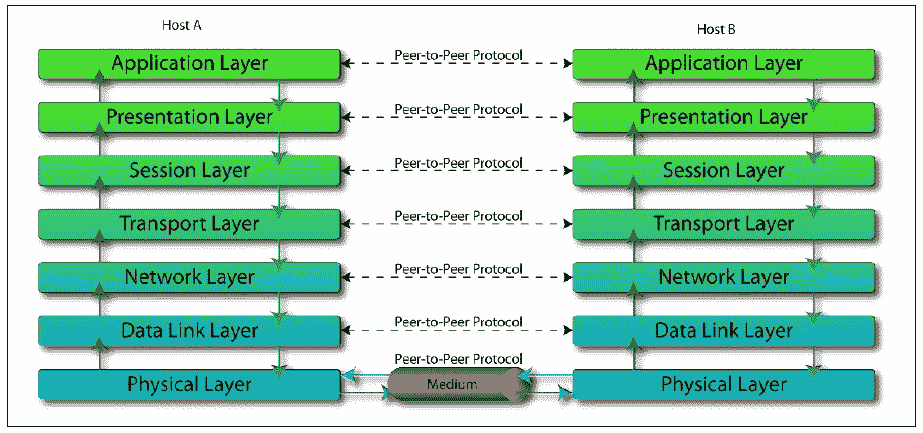
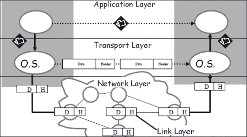
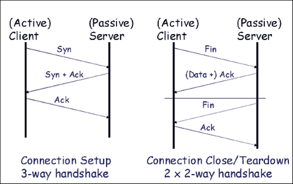
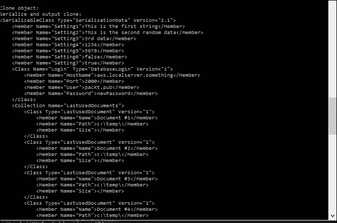
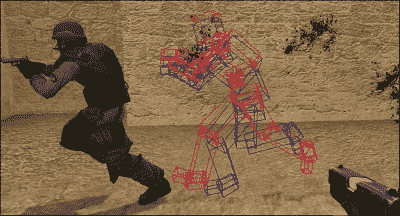
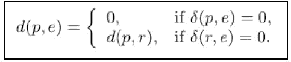
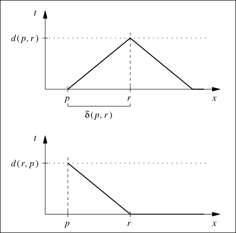
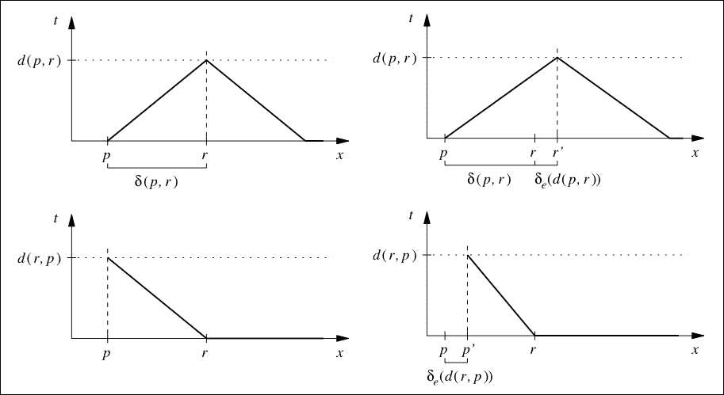

# 第十一章：游戏开发中的网络

本章将涵盖以下配方：

+   理解不同的层

+   选择适当的协议

+   序列化数据包

+   在游戏中使用套接字编程

+   发送数据

+   接收数据

+   处理延迟

+   使用同步模拟

+   使用感兴趣区域过滤

+   使用本地感知过滤

# 介绍

在现代视频游戏时代，网络在游戏的整体可玩性中扮演着重要角色。单人游戏提供平均约 15-20 小时的游戏时间。然而，通过多人游戏（联网）功能，游戏时间呈指数增长，因为现在用户必须与其他人类对手进行游戏并改进他们的战术。无论是 PC 游戏、游戏机还是移动游戏，具有多人游戏功能如今已成为一种常见特性。对于游戏的免费模式，其中货币化和收入模式基于应用内购买和广告，游戏必须每天拥有数千或数百万活跃用户。这是游戏赚钱的唯一途径。当我们谈论多人游戏时，我们不应该自欺欺人地认为这仅限于实时**PvP**（玩家对玩家）。它也可以是异步多人游戏，玩家与活跃玩家的数据竞争，而不是与玩家本身竞争。它给人一种错觉，即玩家正在与真实玩家竞争。此外，随着社交媒体的出现，网络也在帮助你与朋友竞争。例如，在*Candy Crush*中，完成一个关卡后，你会看到你的朋友在同一关卡中的表现以及下一个要击败的朋友是谁。所有这些增加了游戏的热度，并迫使你继续玩下去。

# 理解不同的层

从技术角度看，整个网络模型被划分为多个层。这个模型也被称为**OSI**（**开放系统互连**）模型。每一层都有特殊的意义，必须正确理解才能与拓扑的其他层进行交互。

## 准备就绪

要完成这个配方，您需要一台运行 Windows 的机器。

## 如何做…

在这个配方中，我们将看到理解网络拓扑的不同层有多容易。看看下面的图表：



## 工作原理…

要理解 OSI 模型，我们必须从堆栈的底部向上查看模型。OSI 模型的层包括：

+   **物理层**：这建立了与网络的实际物理连接。这取决于我们是使用铜线还是光纤。它定义了所使用的网络拓扑结构，环形或总线等。它还定义了传输模式：是单工、半双工还是全双工。

+   **数据链路层**：这提供了两个连接节点之间的实际链接。数据链路层有两个子层：**MAC**层（**媒体访问控制**）和**LLC**层（**逻辑链路控制**）。

+   **网络层**：这一层提供了传输可变长度数据（称为**数据报**）的功能手段。传输发生在同一网络上的一个连接节点到另一个连接节点。这形成了 IP。

+   **传输层**：这一层还提供了传输数据的功能手段。数据从源传输到目的地，经过一个或多个网络。这里使用的一些协议是 TCP 和 UDP。**TCP**是**传输控制协议**，是一个安全连接。**UDP**是**用户数据报协议**，是不太安全的。在视频游戏中，我们同时使用 TCP 和 UDP 协议。当用户需要登录服务器时，我们使用 TCP，因为它更安全，因为除非服务器对先前的数据做出确认，否则不会发送来自客户端的下一个信息。然而，它可能会比较慢，所以如果安全性比速度更重要，我们使用 TCP。用户登录后，游戏在其他玩家加入后开始。现在我们在大多数情况下使用 UDP，因为速度比安全性更重要，而少量丢失的数据包可能会产生巨大影响。UDP 数据包并不总是被接收，因为没有确认。

+   **会话层**：这一层控制网络和远程计算机之间的连接。这一层负责建立、管理和终止连接。

+   **表示层**：这一层控制需要在连接之间建立的不同语义。所有加密逻辑都写在这一层。

+   **应用层**：这一层处理与软件应用程序本身的通信。这是离最终用户最近的一层。

# 选择适当的协议

在游戏中，大部分时间都需要做一个重要的决定：使用 TCP 还是 UDP。决定往往会偏向 UDP，但了解两者之间的区别仍然很重要。

## 准备工作

你需要一台 Windows 机器。不需要其他先决条件。

## 如何做…

在这个示例中，我们将发现决定使用 TCP 还是 UDP 有多么容易。

问以下问题：

+   系统是否需要可靠交付？

+   是否需要重传的要求？

+   系统是否需要任何握手机制？

+   它需要什么样的拥塞控制？

+   速度是否是系统考虑的因素？

## 它是如何工作的…

TCP 和 UDP 建立在 IP 层之上：



TCP 连接被认为是可靠的，因为启用了双向握手系统。一旦消息传递到终点，就会发送一个确认消息。它还支持各种其他服务，如拥塞控制和多路复用。TCP 也是全双工的，使其成为一个相当强大的连接。它通过字节序列号来处理数据的可靠传输。它设置了一个超时函数，并根据超时来决定包是否已经被传递。下图显示了握手协议是如何建立的：



TCP 的另一个机制是滑动窗口机制，它保证了数据的可靠传递。它确保数据包按顺序传递，并在发送方和接收方之间建立了流量控制。

当我们不太关心数据包的顺序交付时，就会使用 UDP。主要关注的是数据包的快速交付。没有可靠性，也没有保证数据包会被交付。

需要有序交付的应用程序必须自行恢复数据报的顺序。数据报可以被写入目标地址，而不知道它是否存在或正在监听。消息也可以广播到特定子网上的所有主机。*DOOM*就是这样做的。有时，如果我们需要最小的可靠性，UDP 可以添加该功能。在那时，它也被称为可靠 UDP。

# 序列化数据包

序列化是网络系统中必须具备的一个关键特性。序列化的过程涉及将消息或数据转换为可以在网络上传输的格式，然后进行解码。有各种各样的序列化和反序列化数据的方式，最终取决于个人选择。

## 准备工作

你需要一个工作的 Windows 机器和 Visual Studio。不需要其他要求。

## 如何做…

在这个示例中，我们将看到序列化数据是多么容易。创建一个源文件，并从序列化类派生它：

```cpp
using namespace xmls;

class LastUsedDocument: public Serializable
{
public:
  LastUsedDocument();
  xString Name;
  xString Path;
  xInt Size;
};

class DatabaseLogin: public Serializable
{
public:
  DatabaseLogin();
  xString HostName;
  xInt Port;
  xString User;
  xString Password;
};

class SerialisationData: public Serializable
{
public:
  SerialisationData();
  xString Data1;
  xString Data2;
  xString Data3;
  xInt Data4;
  xInt Data5;
  xBool Data6;
  xBool Data7;
  DatabaseLogin Login;
  Collection<LastUsedDocument> LastUsedDocuments;
};

LastUsedDocument::LastUsedDocument()
{
  setClassName("LastUsedDocument");
  Register("Name", &Name);
  Register("Path", &Path);
  Register("Size", &Size);
};

DatabaseLogin::DatabaseLogin()
{
  setClassName("DatabaseLogin");
  Register("HostName", &HostName);
  Register("Port", &Port);
  Register("User", &User);
  Register("Password", &Password);
};

SerialisationData::SerialisationData()
{
  setClassName("SerialisationData");
  Register("Data1", &Data1);
  Register("Data2", &Data2);
  Register("Data3", &Data3);
  Register("Data4", &Data4);
  Register("Data5", &Data5);
  Register("Data6", &Data6);
  Register("Data7", &Data7);
  Register("Login", &Login);
  Register("LastUsedDocuments", &LastUsedDocuments);
  setVersion("2.1");
};

int main()
{
  // Creating the Datas object
  cout << "Creating object..." << endl;
  SerialisationData *Datas=new SerialisationData;
  Datas->Data1="This is the first string";
  Datas->Data2="This is the second random data";
  Datas->Data3="3rd data";
  Datas->Data4=1234;
  Datas->Data5=5678;
  Datas->Data6=false;
  Datas->Data7=true;
  Datas->Login.HostName="aws.localserver.something";
  Datas->Login.Port=2000;
  Datas->Login.User="packt.pub";
  Datas->Login.Password="PacktPassword";

  for (int docNum=1; docNum<=10; docNum++)
  {
    LastUsedDocument *doc = Datas->LastUsedDocuments.newElement();
    std::stringstream docName;
    docName << "Document #" << docNum;
    doc->Name = docName.str();
    doc->Path = "{FILEPATH}"; // Set Placeholder for search/replace
    doc->setVersion("1.1");
  }

  cout << "OK" << endl;

  // Serialize the Datas object
  cout << "Serializing object... " << endl;
  string xmlData = Datas->toXML();
  cout << "OK" << endl << endl;
  cout << "Result:" << endl;
  cout << xmlData << endl << endl;

  cout << "Login, URL:" << endl;
  cout << "Hostname: " << Datas->Login.HostName.value();
  cout << ":" << Datas->Login.Port.toString() << endl << endl;
  cout << "Show all collection items" << endl;
  for (size_t i=0; i<Datas->LastUsedDocuments.size(); i++)
  {
    LastUsedDocument* doc = Datas->LastUsedDocuments.getItem(i);
    cout << "Item " << i << ": " << doc->Name.value() << endl;
  }
  cout << endl;

  cout << "Deserialization:" << endl;
  cout << "Class version: " << Serializable::IdentifyClassVersion(xmlData) << endl;
  cout << "Performing deserialization..." << endl;

  // Deserialize the XML text
  SerialisationData* dser_Datas=new SerialisationData;
  if (Serializable::fromXML(xmlData, dser_Datas))
  {
    cout << "OK" << endl << endl;

    // compare both objects
    cout << "Compareing objects: ";
    if (dser_Datas->Compare(Datas))
      cout << "equal" << endl << endl; 
else
      cout << "net equal" << endl << endl;

    // now set value
    cout << "Set new value for field >password<..." << endl;
    dser_Datas->Login.Password = "newPassword";
    cout << "OK" << endl << endl;

    cout << "compare objects again: ";
    if (dser_Datas->Compare(Datas))
      cout << "equal" << endl << endl; else
      cout << "net equal" << endl << endl;

    cout << "search and replace placeholders: ";
    dser_Datas->Replace("{FILEPATH}", "c:\\temp\\");
    cout << "OK" << endl << endl;

    //output xml-data
    cout << "Serialize and output xml data: " << endl;
    cout << dser_Datas->toXML() << endl << endl;

    cout << "Clone object:" << endl;
    SerialisationData *clone1(new SerialisationData);
    Serializable::Clone(dser_Datas, clone1);
    cout << "Serialize and output clone: " << endl;
    cout << clone1->toXML() << endl << endl;
    delete (clone1);
  }
  delete(Datas);
  delete(dser_Datas);
  getchar();
  return 0;
}
```

## 它是如何工作的…

如前所述，序列化是将数据转换为可以传输的格式。我们可以使用 Google API，或者使用 JSON 格式或 YAML 来实现。在这个示例中，我们使用了最初由 Lothar Perr 编写的 XML 序列化器。原始源代码可以在[`www.codeproject.com/Tips/725375/Tiny-XML-Serialization-for-Cplusplus`](http://www.codeproject.com/Tips/725375/Tiny-XML-Serialization-for-Cplusplus)找到。程序的整个思想是将数据转换为 XML 格式。在可序列化数据类中，我们公开地从可序列化类派生它。我们创建一个构造函数来注册所有的数据元素，并创建我们想要序列化的不同数据元素。数据元素是`xString`类的类型。在构造函数中，我们注册每个数据元素。最后，从客户端，我们分配正确的数据进行发送，并使用 XML 序列化器类和 tinyxml 生成所需的 XML。最后，这个 XML 将被发送到网络上，并在接收时，将使用相同的逻辑进行解码。XML 有时被认为对游戏来说相当沉重和繁琐。

在这些情况下，建议使用 JSON。一些现代引擎，如 Unity3D 和虚幻引擎，已经内置了可以用来序列化数据的 JSON 解析器。然而，XML 仍然是一个重要的格式。我们的代码可能产生的一个可能的输出示例如下：



# 在游戏中使用套接字编程

套接字编程是最早用于在端到端连接之间传输数据的机制之一。即使现在，如果你习惯于编写套接字编程，它对于相对较小的游戏来说比使用第三方解决方案要好得多，因为它们会增加很多额外的空间。

## 准备工作

对于这个示例，你需要一个 Windows 机器和安装了 Visual Studio 的版本。

## 如何做…

在这个示例中，我们将发现编写套接字是多么容易：

```cpp
struct sockaddr_in
{
      short      sin_family;
      u_short      sin_port;
      struct      in_addr sin_addr;
      char      sin_zero[8];
};

int PASCAL connect(SOCKET,const struct sockaddr*,int);
    target.sin_family = AF_INET; // address family Internet
    target.sin_port = htons (PortNo); //Port to connect on
    target.sin_addr.s_addr = inet_addr (IPAddress); //Target IP

    s = socket (AF_INET, SOCK_STREAM, IPPROTO_TCP); //Create socket
    if (s == INVALID_SOCKET)
    {
        return false; //Couldn't create the socket
    }
```

## 它是如何工作的…

当两个应用程序在不同的机器上进行通信时，通信通道的一端通常被描述为套接字。它是 IP 地址和端口的组合。当我们在不同的机器上使用信号或管道进行进程间通信时，就需要套接字。

**伯克利套接字**（**BSD**）是第一个开发的互联网套接字 API。它是在加利福尼亚大学伯克利分校开发的，并免费提供给 UNIX 的所有伯克利系统发行版，它存在于所有现代操作系统中，包括 UNIX 变体，如 OS X 和 Linux。Windows 套接字基于 BSD 套接字，并提供额外的功能以符合常规的 Windows 编程模型。Winsock2 是最新的 API。

常见的域有：

+   **AF UNIX**：这个地址格式是 UNIX 路径名

+   **AF INET**：这个地址格式是主机和端口号

各种协议可以以以下方式使用：

+   TCP/IP（虚拟电路）：SOCK_STREAM

+   UDP（数据报）：SOCK_DGRAM

这些是建立简单套接字连接的步骤：

1.  创建一个套接字。

1.  将套接字绑定到一个地址。

1.  等待套接字准备好进行输入/输出。

1.  从套接字读取和写入。

1.  重复从步骤 3 直到完成。

1.  关闭套接字。

这些步骤在这里通过示例进行了解释：

+   `int socket(domain, type, protocol)`：

参数`domain`应设置为`PF_INET`（协议族），而`type`是应该使用的连接类型。对于字节流套接字，使用`SOCK_STREAM`，而对于数据报（数据包）套接字，使用`SOCK_DGRAM`。`protocol`是正在使用的 Internet 协议。`SOCK_STREAM`通常会给出`IPPROTO_TCP`，而`SOCK_DGRAM`通常会给出`IPPROTO_UDP`。

+   `int sockfd;`

```cpp
sockfd = socket (PF_INET, SOCK_STREAM, 0):
```

`socket()`函数返回一个套接字描述符，供以后的系统调用使用，或者返回`-1`。当协议设置为`0`时，套接字会根据指定的类型选择正确的协议。

+   `int bind(int Socket, struct sockaddr *myAddress, int AddressLen )`

`bind()`函数将套接字绑定到本地地址。套接字是套接字描述符。`myAddress`是本地 IP 地址和端口。`AddressSize`参数给出地址的大小（以字节为单位），`bind()`在错误时返回`-1`。

+   `struct sockaddr_in {`

```cpp
  short int sin_family;     // set to AF_INET
  unsigned short int sin_port;   // Port number
  struct in_addr sin_addr;   // Internet address
  unsigned char sin_zero[8];   //set to all zeros
}
```

`struct sockaddr_in`是一个并行结构，它使得引用套接字地址的元素变得容易。`sin_port`和`sin_addr`必须以网络字节顺序表示。

# 发送数据

在正确设置了套接字之后，下一步是创建正确的服务器和客户端架构。发送数据非常简单，只涉及几行代码。

## 准备工作

要完成这个教程，你需要一台安装了 Visual Studio 的 Windows 机器。

## 如何做…

在这个教程中，我们将看到发送数据是多么容易：

```cpp
// Using the SendTo Function
#ifndef UNICODE
#define UNICODE
#endif

#define WIN32_LEAN_AND_MEAN

#include <winsock2.h>
#include <Ws2tcpip.h>
#include <stdio.h>
#include <conio.h>

// Link with ws2_32.lib
#pragma comment(lib, "Ws2_32.lib")

int main()
{

  int iResult;
  WSADATA wsaData;

  SOCKET SenderSocket = INVALID_SOCKET;
  sockaddr_in ReceiverAddress;

  unsigned short Port = 27015;

  char SendBuf[1024];
  int BufLen = 1024;

  //----------------------
  // Initialize Winsock
  iResult = WSAStartup(MAKEWORD(2, 2), &wsaData);
  if (iResult != NO_ERROR) {
    wprintf(L"WSAStartup failed with error: %d\n", iResult);
    return 1;

  }

  //---------------------------------------------
  // Create a socket for sending data
  SenderSocket = socket(AF_INET, SOCK_DGRAM, IPPROTO_UDP);
  if (SenderSocket == INVALID_SOCKET) {
    wprintf(L"socket failed with error: %ld\n", WSAGetLastError());
    WSACleanup();
    return 1;
  }
  //---------------------------------------------
  // Set up the ReceiverAddress structure with the IP address of
  // the receiver (in this example case "192.168.1.1")
  // and the specified port number.
  ReceiverAddress.sin_family = AF_INET;
  ReceiverAddress.sin_port = htons(Port);
  ReceiverAddress.sin_addr.s_addr = inet_addr("192.168.1.1");

  //---------------------------------------------
  // Send a datagram to the receiver
  wprintf(L"Sending a datagram to the receiver...\n");
  iResult = sendto(SenderSocket,
    SendBuf, BufLen, 0, (SOCKADDR *)& ReceiverAddress, sizeof(ReceiverAddress));
  if (iResult == SOCKET_ERROR) {
    wprintf(L"sendto failed with error: %d\n", WSAGetLastError());
    closesocket(SenderSocket);
    WSACleanup();
    return 1;
  }
  //---------------------------------------------
  // When the application is finished sending, close the socket.
  wprintf(L"Finished sending. Closing socket.\n");
  iResult = closesocket(SenderSocket);
  if (iResult == SOCKET_ERROR) {
    wprintf(L"closesocket failed with error: %d\n", WSAGetLastError());
    WSACleanup();
    return 1;
  }
  //---------------------------------------------
  // Clean up and quit.
  wprintf(L"Exiting.\n");
  WSACleanup();

  getch();
  return 0;
}

//Using the Send Function
#ifndef UNICODE
#define UNICODE
#endif

#define WIN32_LEAN_AND_MEAN

#include <winsock2.h>
#include <Ws2tcpip.h>
#include <stdio.h>

// Link with ws2_32.lib
#pragma comment(lib, "Ws2_32.lib")

#define DEFAULT_BUFLEN 512
#define DEFAULT_PORT 27015

int main() {

  //----------------------
  // Declare and initialize variables.
  int iResult;
  WSADATA wsaData;

  SOCKET ConnectSocket = INVALID_SOCKET;
  struct sockaddr_in clientService;

  int recvbuflen = DEFAULT_BUFLEN;
  char *sendbuf = "Client: sending data test";
  char recvbuf[DEFAULT_BUFLEN] = "";

  //----------------------
  // Initialize Winsock
  iResult = WSAStartup(MAKEWORD(2, 2), &wsaData);
  if (iResult != NO_ERROR) {
    wprintf(L"WSAStartup failed with error: %d\n", iResult);
    return 1;
  }

  //----------------------
  // Create a SOCKET for connecting to server
  ConnectSocket = socket(AF_INET, SOCK_STREAM, IPPROTO_TCP);
  if (ConnectSocket == INVALID_SOCKET) {
    wprintf(L"socket failed with error: %ld\n", WSAGetLastError());
    WSACleanup();
    return 1;
  }

  //----------------------
  // The sockaddr_in structure specifies the address family,
  // IP address, and port of the server to be connected to.
  clientService.sin_family = AF_INET;
  clientService.sin_addr.s_addr = inet_addr("127.0.0.1");
  clientService.sin_port = htons(DEFAULT_PORT);

  //----------------------
  // Connect to server.
  iResult = connect(ConnectSocket, (SOCKADDR*)&clientService, sizeof(clientService));
  if (iResult == SOCKET_ERROR) {
    wprintf(L"connect failed with error: %d\n", WSAGetLastError());
    closesocket(ConnectSocket);
    WSACleanup();
    return 1;
  }

  //----------------------
  // Send an initial buffer
  iResult = send(ConnectSocket, sendbuf, (int)strlen(sendbuf), 0);
  if (iResult == SOCKET_ERROR) {
    wprintf(L"send failed with error: %d\n", WSAGetLastError());
    closesocket(ConnectSocket);
    WSACleanup();
    return 1;
  }

  printf("Bytes Sent: %d\n", iResult);

  // shutdown the connection since no more data will be sent
  iResult = shutdown(ConnectSocket, SD_SEND);
  if (iResult == SOCKET_ERROR) {
    wprintf(L"shutdown failed with error: %d\n", WSAGetLastError());
    closesocket(ConnectSocket);
    WSACleanup();
    return 1;
  }

  // Receive until the peer closes the connection
  do {

    iResult = recv(ConnectSocket, recvbuf, recvbuflen, 0);
    if (iResult > 0)
      wprintf(L"Bytes received: %d\n", iResult);
    else if (iResult == 0)
      wprintf(L"Connection closed\n");
    else
      wprintf(L"recv failed with error: %d\n", WSAGetLastError());

  } while (iResult > 0);

  // close the socket
  iResult = closesocket(ConnectSocket);
  if (iResult == SOCKET_ERROR) {
    wprintf(L"close failed with error: %d\n", WSAGetLastError());
    WSACleanup();
    return 1;
  }

  WSACleanup();
  return 0;
}
```

## 工作原理…

用于在网络上通信的函数称为`sendto`。它声明为`int sendto(int sockfd, const void *msg, int len, int flags);`。

`sockfd`是你想要发送数据的套接字描述符（由`socket()`返回或从`accept()`获得），而`msg`是指向你想要发送的数据的指针。`len`是数据的长度（以字节为单位）。为了简单起见，我们现在可以将`flag`设置为`0`。`sendto()`返回实际发送的字节数（可能少于你告诉它发送的数量），或者在错误时返回`-1`。通过使用这个函数，你可以从一个连接点发送消息或数据到另一个连接点。这个函数可以用于使用内置的 Winsock 功能在网络上发送数据。`send`函数用于数据流，因此用于 TCP。如果我们要使用数据报和无连接协议，那么我们需要使用`sendto`函数。

# 接收数据

在正确设置了套接字并发送了数据之后，下一步是接收数据。接收数据非常简单，只涉及几行代码。

## 准备工作

要完成这个教程，你需要一台安装了 Visual Studio 的 Windows 机器。

## 如何做…

在这个教程中，我们将看到如何在网络上接收数据是多么容易。有两种方法可以做到这一点，一种是使用`recv`函数，另一种是使用`recvfrom`函数：

```cpp
#define WIN32_LEAN_AND_MEAN

#include <winsock2.h>
#include <Ws2tcpip.h>
#include <stdio.h>

// Link with ws2_32.lib
#pragma comment(lib, "Ws2_32.lib")

#define DEFAULT_BUFLEN 512

#define DEFAULT_PORT "27015"

int __cdecl main() {

  //----------------------
  // Declare and initialize variables.
  WSADATA wsaData;
  int iResult;

  SOCKET ConnectSocket = INVALID_SOCKET;
  struct sockaddr_in clientService;

  char *sendbuf = "this is a test";
  char recvbuf[DEFAULT_BUFLEN];
  int recvbuflen = DEFAULT_BUFLEN;

  //----------------------
  // Initialize Winsock
  iResult = WSAStartup(MAKEWORD(2, 2), &wsaData);
  if (iResult != NO_ERROR) {
    printf("WSAStartup failed: %d\n", iResult);
    return 1;
  }

  //----------------------
  // Create a SOCKET for connecting to server
  ConnectSocket = socket(AF_INET, SOCK_STREAM, IPPROTO_TCP);
  if (ConnectSocket == INVALID_SOCKET) {
    printf("Error at socket(): %ld\n", WSAGetLastError());
    WSACleanup();
    return 1;
  }

  //----------------------
  // The sockaddr_in structure specifies the address family,
  // IP address, and port of the server to be connected to.
  clientService.sin_family = AF_INET;
  clientService.sin_addr.s_addr = inet_addr("127.0.0.1");
  clientService.sin_port = htons(27015);

  //----------------------
  // Connect to server.
  iResult = connect(ConnectSocket, (SOCKADDR*)&clientService, sizeof(clientService));
  if (iResult == SOCKET_ERROR) {
    closesocket(ConnectSocket);
    printf("Unable to connect to server: %ld\n", WSAGetLastError());
    WSACleanup();
    return 1;
  }

  // Send an initial buffer
  iResult = send(ConnectSocket, sendbuf, (int)strlen(sendbuf), 0);
  if (iResult == SOCKET_ERROR) {
    printf("send failed: %d\n", WSAGetLastError());
    closesocket(ConnectSocket);
    WSACleanup();
    return 1;
  }

  printf("Bytes Sent: %ld\n", iResult);

  // shutdown the connection since no more data will be sent
  iResult = shutdown(ConnectSocket, SD_SEND);
  if (iResult == SOCKET_ERROR) {
    printf("shutdown failed: %d\n", WSAGetLastError());
    closesocket(ConnectSocket);
    WSACleanup();
    return 1;
  }

  // Receive until the peer closes the connection
  do {

    iResult = recv(ConnectSocket, recvbuf, recvbuflen, 0);
    if (iResult > 0)
      printf("Bytes received: %d\n", iResult);
    else if (iResult == 0)
      printf("Connection closed\n");
    else
      printf("recv failed: %d\n", WSAGetLastError());

  } while (iResult > 0);

  // cleanup
  closesocket(ConnectSocket);
  WSACleanup();

  return 0;
}
```

## 工作原理…

就像`send`函数一样，只有一个函数用于在网络上接收数据，可以声明如下：

```cpp
int recv(int sockfd, void *buf,  int len, int flags);
```

`sockfd`是要从中读取的套接字描述符。下一个参数`buf`是要将信息读入的缓冲区，而`len`是缓冲区的最大长度。下一个参数`recv()`返回实际读入缓冲区的字节数，或者在错误时返回`-1`。如果`recv()`返回`0`，远程端已经关闭了连接。

使用这行代码，我们可以在网络上接收数据。如果数据在发送时被序列化，那么我们需要在这一点上对数据进行反序列化。这个过程将根据用于序列化数据的方法而有所不同。

# 处理延迟

网络游戏中经常出现的一个主要问题是延迟或卡顿。当两名玩家互相对战时，一方连接在高速网络上，另一方连接在非常低速的网络上，我们该如何更新数据呢？我们需要以一种方式更新数据，使得对两名玩家来说都看起来正常。没有玩家应该因为这种情况而获得不应有的优势。

## 准备工作

要完成这个配方，您需要一台运行 Windows 和 Visual Studio 的机器。

## 如何做到这一点…

在这个配方中，您将看到一些对抗延迟的技术。

通常，一个网络游戏会有以下更新循环。我们需要从循环结构中找出对抗延迟的最佳方法：

```cpp
read_network_messages()
    read_local_input()
    update_world()
    send_network_updates()
    render_world()
```

## 它是如何工作的…

在大多数电脑游戏中，当实施网络功能时，通常会选择特定类型的客户端-服务器架构。通常会选择一个有权威的服务器。这意味着服务器决定时间、结果和其他因素。客户端基本上是“愚蠢”的，它所做的一切都是基于来自服务器的数据进行模拟。现在让我们考虑两名玩家正在玩一款多人 FPS 游戏。其中一名玩家连接在高速网络上，另一名连接在低速网络上。因此，如果客户端依赖服务器进行更新，准确地在客户端渲染玩家的位置将会非常困难。假设`UserA`连接在高速网络上，而`UserB`连接在低速网络上。`UserA`向`UserB`开火。请注意，`UserA`和`UserB`也在世界空间中移动。我们如何计算子弹的位置和每个玩家的位置呢？如果我们准确地渲染来自服务器的信息，那将不准确，因为`UserA`在`UserB`收到更新之前可能已经移动到了新的位置。为了解决这个问题，通常有两种常用的解决方案。一种称为客户端预测。另一种方法进一步分为两种技术：插值和外推。请注意，如果计算机通过局域网连接，往返时间将是可以接受的。所有讨论的问题都集中在互联网上的网络连接。

在客户端预测中，客户端不再是“愚蠢”的，而是开始根据先前的移动输入来预测下一个位置和动画状态。最后，当它从服务器收到更新时，服务器将纠正错误，位置将被转换为当前接收到的位置。这种系统存在很多问题。如果预测错误，位置被更改为正确位置时会出现大的抖动。此外，让我们考虑声音和 VFX 效果。如果客户端`UserA`预测`UserB`正在行走并播放了脚步声音，后来服务器通知它`UserB`实际上在水中，我们该如何突然纠正这个错误呢？VFX 效果和状态也是如此。这种系统在许多*Quake*世界中被使用。

第二个系统有两个部分：外推和插值。在外推中，我们提前渲染。这在某种程度上类似于预测。它获取来自服务器的最后已知更新，然后在时间上向前模拟。因此，如果您落后 500 毫秒，并且您收到的最后更新是另一名玩家以每秒 300 个单位垂直于您的视图方向奔跑，那么客户端可以假设在“实时”中，玩家已经从他们最后已知的位置向前移动了 150 个单位。然后客户端可以在那个外推位置绘制玩家，本地玩家仍然可以更多或更少地瞄准另一名玩家。然而，这种系统的问题在于它很少会发生这样的情况。玩家的移动可能会改变，状态可能会改变，因此在大多数情况下应该避免使用这种系统。

在插值中，我们总是渲染过去的对象。例如，如果服务器每秒发送 25 次世界状态更新（确切地说），那么我们可能会在渲染中施加 40 毫秒的插值延迟。然后，当我们渲染帧时，我们在最后更新的位置和该位置之后的一个更新之间插值对象的位置。插值可以通过使用 C++中的内置 lerp 函数来完成。当对象到达最后更新的位置时，我们从服务器接收到新的更新（因为每秒 25 次更新意味着每 40 毫秒就会有更新），然后我们可以在接下来的 40 毫秒内开始朝着这个新位置移动。下图显示了来自服务器和客户端的碰撞箱位置的差异。



如果数据包在 40 毫秒后没有到达，也就是说，发生了数据包丢失，那么我们有两个选择。第一个选择是使用上面描述的方法进行外推。另一个选择是使玩家进入空闲状态，直到从服务器接收到下一个数据包。

# 使用同步模拟。

在多人游戏中，可能会有数百或数千台计算机同时连接。所有计算机的配置都不同。所有这些计算机的速度也会有所不同。因此，问题是，我们如何同步所有这些系统上的时钟，使它们都同步？

## 准备工作

要完成这个配方，你需要一台运行 Windows 和 Visual Studio 的机器。

## 如何做…

在这个配方中，我们将从理论角度看一下同步时钟的两种方法。

看一下以下伪代码：

+   方法 1

1.  向 `UserA` 发送一条消息。记录时间，直到他收到消息。

1.  向 `UserB` 发送一条消息。再次记录时间。

1.  基于值计算中位数，以决定更新时钟的时间，用于更新两台计算机的时钟。

+   方法 2

1.  让服务器进行大部分计算。

1.  让客户端进行一些本地计算。

1.  当客户端从服务器接收更新时，要么纠正错误，要么根据结果进行插值。

## 它是如何工作的…

当我们尝试同步时钟时，有两种方法。一种方法是服务器尝试找到一个中位时间来同步所有时钟。为了做到这一点，我们可以在游戏设计本身中包含机制。服务器需要找出每台客户机的响应时间，因此必须发送消息。这些消息可以是在准备好时按 *R*，或者在客户机上加载地图并且服务器记录时间。最后，当它从所有机器中获得了时间，它计算一个中位数，然后在那个时间更新所有机器的时钟。服务器发送给机器计算这个中位数的消息越多，它就会越准确。然而，这并不保证同步。

因此，一个更好的方法是服务器进行所有计算，客户端也进行一些本地计算，使用之前配方中描述的技术。最后，当服务器向客户端发送更新时，客户端可以纠正自己或进行插值以获得期望的结果。这是一个更好的结果，也是一个更好的系统。

# 使用兴趣区域过滤

当我们编写网络算法时，我们需要决定需要向服务器更新或从服务器更新的各种对象或状态。对象的数量越多，序列化和发送数据所需的时间就越长。因此，有必要对每帧需要更新的内容进行优先级排序，以及哪些对象可以等待更多周期进行更新。

## 准备工作

要完成这个配方，你需要一台运行 Windows 的机器。

## 如何做…

在这个配方中，我们将看到创建兴趣区域过滤有多么容易：

1.  创建场景中所有对象的列表。

1.  为每个对象添加一个表示其优先级的参数。

1.  基于优先级数字，将其传递给游戏的更新逻辑。

## 它是如何工作的...

在游戏中，我们需要按一定的优先级顺序定义对象。优先级顺序决定它们现在是否应该更新或稍后更新。需要优先处理的对象在很大程度上取决于游戏设计和一些研究。例如，在 FPS 游戏中，具有高优先级的对象将是用户当前瞄准的人物，附近的弹药，当然还有附近的敌人及其位置。在 RPG 或 RTS 的情况下可能会有所不同，因此它在不同游戏中肯定是不同的。

在为每个对象标记了优先级数字之后，我们可以告诉更新循环仅使用优先级为 1 和 2 的对象进行每帧更新，并使用优先级为 3 和 4 的对象进行延迟更新。这种结构也可以通过创建某种优先级队列来进行修改。从队列中，对象根据不同的更新逻辑弹出。较低优先级的对象也会同步，但在稍后的时间，而不是在当前帧中。

# 使用本地感知滤波器

这是网络游戏中对抗延迟的另一种方法。整个概念在数学上基于感知的概念。其基础是，如果对象在本地玩家的视图中正确更新和渲染，那么我们可以创造出一种逼真的幻觉，因此称为本地感知滤波器。

## 准备工作

要完成本教程，您需要一台运行 Windows 的计算机。

## 如何做到这一点...

在这个配方中，我们将了解实现子弹时间有多容易的理论概念。看一下以下伪代码：

1.  计算相对于玩家的本地速度。

1.  当子弹开始时加速它，并在它到达远程玩家时减速。

1.  从远程玩家的角度来看，子弹应该看起来以比正常速度更快的速度射出，然后减速到正常速度。

## 它是如何工作的...

本地感知滤波器也称为子弹时间，首次在电影《黑客帝国》中使用。从那时起，它们已经在各种游戏中使用。在单人模式中很容易实现；然而，在多人模式中，由于涉及减慢渲染，它变得更加复杂。基本上，该过程是在本地和远程玩家附近时增加和减少被动实体的速度。这是一种用于隐藏网络虚拟环境中的通信延迟的方法，并在《分布式虚拟环境的本地感知滤波器》中介绍，*P.M. Sharkey*，（第 242-249 页）。为简单起见，我们将本地玩家称为*p*，远程玩家称为*r*，而被动实体，如子弹，称为*e*。假设*d(i,j)*是延迟，*delta(i,j)*是距离，我们得到以下方程：



以图形格式，可以通过查看以下图表来解释这一点。因此，就*p*而言，它在上坡时速度较慢，然后在下坡时速度较快。就*r*而言，它在顶部速度更快。

### 注意

该方法的一个主要限制是不能用于*瞬间命中*武器。



问题在于当*e*到达*r*时，*p*对*e*的视图还没有到位，但是在*p*的视图中*e*会加速。为了解决这个问题，我们引入一个影子*r*，它缓冲了*p*对加速过程的视图。

添加缓冲后，我们将得到以下修订后的图表：



所以在顶部，直到达到*r*之前不会加速，而在底部，它开始在位置*p*显示*e*。这也可以在以下网址查看演示：[`mikolalysenko.github.io/local-perception-filter-demo/`](http://mikolalysenko.github.io/local-perception-filter-demo/)。
