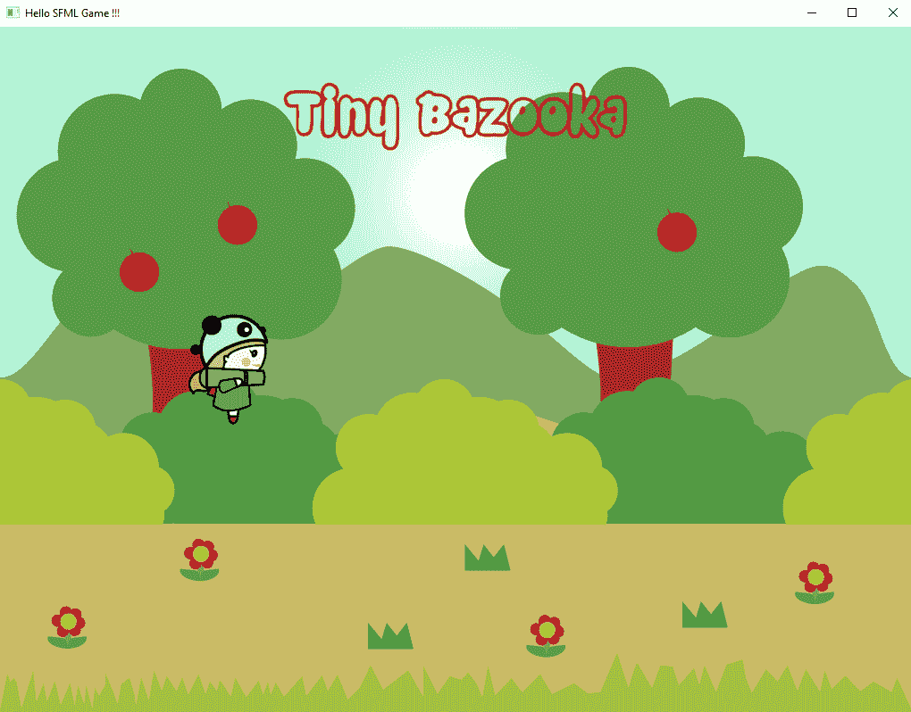
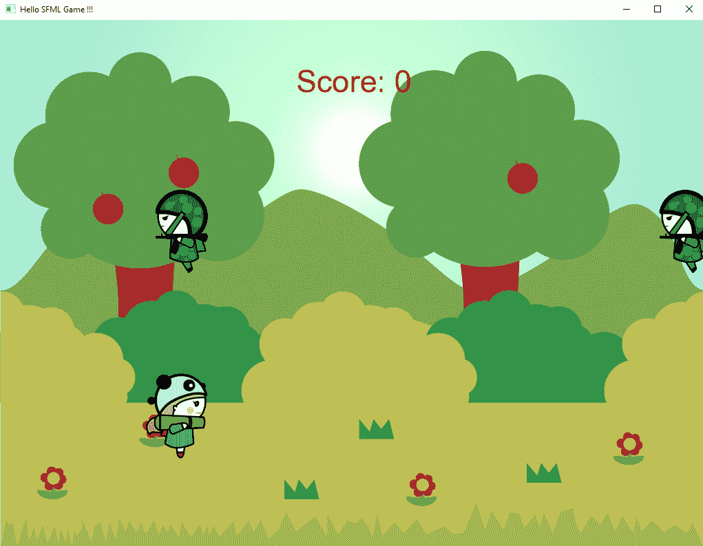
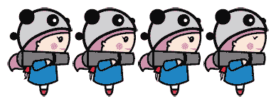
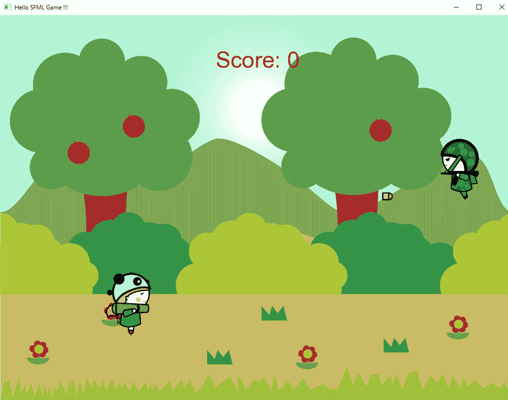

# 第五章：完成您的游戏

在上一章中，我们探讨了如何创建游戏；在本章中，我们将完成**Gameloop**，以便您可以玩游戏。游戏的目标是确保没有敌人能够到达屏幕的左侧。如果他们做到了，游戏就结束了。

我们将添加一个计分系统，以便玩家知道他们在回合中获得了多少分数。对于每个被击落的敌人，玩家将获得一分。我们还将向游戏中添加文本，以显示游戏的标题、玩家的分数以及一个小教程，展示如何玩游戏。

在本章结束时，我们将装饰游戏。我们将添加用作背景音乐的音频，以及玩家射击火箭和玩家火箭击中敌人的音效。我们还将为玩家添加一些动画，使角色看起来更加生动。

在本章中，我们将介绍以下主题：

+   完成 Gameloop 并添加计分

+   添加文本

+   添加音频

+   添加玩家动画

那么，让我们开始吧！

# 完成 Gameloop 并添加计分

以下步骤将向您展示如何完成 Gameloop 并添加计分到游戏代码中：

1.  在`source.cpp`文件中添加两个新变量：一个`int`类型的，命名为`score`，另一个`bool`类型的，命名为`gameover`。将`score`初始化为`0`，将`gameover`初始化为`true`：

```cpp
std::vector<Enemy*> enemies; 
std::vector<Rocket*> rockets; 

float currentTime; 
float prevTime = 0.0f; 

int score = 0; 
bool gameover = true; 
```

1.  创建一个名为`reset()`的新函数。我们将使用它来重置变量。在`source.cpp`文件顶部创建重置函数的原型：

```cpp
bool checkCollision(sf::Sprite sprite1, sf::Sprite sprite2); 
void reset(); 
```

在`source.cpp`文件的底部，在我们创建了`checkCollision`函数之后，添加重置函数本身，以便在游戏重置时，所有值也会重置。为此，使用以下代码：

```cpp
void reset() { 

   score = 0; 
   currentTime = 0.0f; 
   prevTime = 0.0; 

   for (Enemy *enemy : enemies) { 
         delete(enemy); 
   } 
   for (Rocket *rocket : rockets) { 
         delete(rocket); 
   } 

   enemies.clear(); 
   rockets.clear(); 
}
```

如果游戏结束，按下向下箭头键一次将重新启动游戏。游戏再次开始后，将调用`reset()`函数。在`reset()`函数中，我们需要将`score`、`currentTime`和`prevTime`设置为`0`。

当游戏重置时，通过删除并释放内存来移除任何已实例化的敌人和火箭对象。这也清除了持有现在已删除对象引用的向量。现在我们已经设置了变量和重置函数，让我们在游戏中使用它们来在重新启动游戏时重置值。

在`UpdateInput`函数中，在`while`循环中，检查键盘上的向下箭头键是否被按下，我们将添加一个`if`条件来检查游戏是否结束。如果游戏结束，我们将`gameover`布尔值设置为`false`，以便游戏可以开始，并且我们将通过调用`reset`函数重置变量，如下所示：

```cpp
           if (event.key.code == sf::Keyboard::Down) { 

             if (gameover) {
                gameover = false;
                reset();
              } 
            else { 
                 shoot(); 
                  }                
            } 
```

在这里，`shoot()`被移动到`else`语句中，以便玩家只能在游戏运行时射击。

接下来，当敌人超出屏幕的左侧时，我们将设置`gameover`条件为`true`。

当我们更新敌人时，敌人从屏幕消失时将被删除，并且我们将游戏结束条件设置为`true`。

将以下更新敌人的代码添加到`update()`函数中：

```cpp
// Update Enemies 
   for (int i = 0; i < enemies.size(); i++) { 

         Enemy* enemy = enemies[i]; 

         enemy->update(dt); 

         if (enemy->getSprite().getPosition().x < 0) { 

               enemies.erase(enemies.begin() + i); 
               delete(enemy); 
               gameover = true;
         } 
   } 
```

1.  在这里，我们希望在`gameover`为`false`时更新游戏。在`main`函数中，在我们更新游戏之前，我们将添加一个检查以确定游戏是否结束。如果游戏结束，我们不会更新游戏。为此，使用以下代码：

```cpp
   while (window.isOpen()) { 

         ////update input 
         updateInput(); 

         //// +++ Update Game Here +++ 
         sf::Time dt = clock.restart(); 
         if(!gameover)
             update(dt.asSeconds());
         //// +++ Draw Game Here ++ 

         window.clear(sf::Color::Red); 

         draw(); 

         // Show everything we just drew 
         window.display(); 

   } 
```

当火箭与敌人碰撞时，我们将增加分数。这意味着在`update()`函数中，当我们删除交叉后的火箭和敌人时，我们还将更新分数：

```cpp
   // Check collision between Rocket and Enemies 

   for (int i = 0; i < rockets.size(); i++) { 
         for (int j = 0; j < enemies.size(); j++) { 

               Rocket* rocket = rockets[i]; 
               Enemy* enemy = enemies[j]; 

               if (checkCollision(rocket->getSprite(), enemy-
                   >getSprite())) { 

                     score++; 

                     rockets.erase(rockets.begin() + i); 
                     enemies.erase(enemies.begin() + j); 

                     delete(rocket); 
                     delete(enemy); 

                     printf(" rocket intersects enemy \n"); 
               } 

         } 
   } 
```

当你运行游戏时，通过按下向下箭头键开始游戏。当其中一个敌人穿过屏幕的左侧时，游戏将结束。当你再次按下向下箭头键时，游戏将重新开始。

游戏循环现在已完成，但我们仍然看不到分数。为此，让我们向游戏中添加一些文本。

# 添加文本

这些步骤将指导你如何向游戏中添加文本：

1.  创建一个名为`headingFont`的`sf::Font`，以便我们可以加载字体然后使用它来显示游戏名称。在屏幕顶部创建所有变量的地方，创建`headingFont`变量，如下所示：

```cpp
int score = 0; 
bool gameover = true; 

// Text 
sf::Font headingFont;   
```

1.  在`init()`函数中，在我们加载`bgSprite`之后，我们将使用`loadFromFile`函数加载字体：

```cpp
   // Create Sprite and Attach a Texture 
   bgSprite.setTexture(bgTexture); 

   // Load font 

   headingFont.loadFromFile("Assets/fonts/SnackerComic.ttf"); 
```

由于我们需要从系统中加载字体，我们必须将字体放在`fonts`目录中，该目录位于`Assets`目录下。确保你将字体文件放在那里。我们将用于标题的字体是`SnackerComic.ttf`文件。我还包括了`arial.ttf`文件，我们将使用它来显示分数，所以请确保你也添加它。

1.  使用`sf::Text`类型创建`headingText`变量，以便我们可以显示游戏的标题。在代码的开始处执行此操作：

```cpp
sf::Text headingText;   
```

1.  在`init()`函数中，在加载`headingFont`之后，我们将添加创建游戏标题的代码：

```cpp
   // Set Heading Text 
   headingText.setFont(headingFont); 
   headingText.setString("Tiny Bazooka"); 
   headingText.setCharacterSize(84); 
   headingText.setFillColor(sf::Color::Red); 
```

我们需要使用`setFont`函数设置标题文本的字体。在`setFont`中传入我们刚刚创建的`headingFont`变量。

我们需要告诉`headingText`需要显示的内容。为此，我们将使用`setString`函数并传入`TinyBazooka`字符串，因为这是我们刚刚制作的游戏的名称。名字很酷，不是吗？

让我们设置字体本身的大小。为此，我们将使用`setCharacterSize`函数并传入`84`作为像素大小，以便它清晰可见。现在，我们可以使用`setFillColor`函数将颜色设置为红色。

1.  我们希望标题在视口中居中，因此我们将获取文本的边界并将它的原点设置在视口的`center`位置，在*x*和*y*方向上。设置文本的位置，使其位于 x 方向的中心以及沿*y-*方向从顶部起`0.10`的高度处：

```cpp
   sf::FloatRect headingbounds = headingText.getLocalBounds(); 
   headingText.setOrigin(headingbounds.width/2, 
      headingbounds.height / 2); 
   headingText.setPosition(sf::Vector2f(viewSize.x * 0.5f, 
      viewSize.y * 0.10f));
```

1.  要显示文本，调用 `window.draw` 并将 `headingText` 传递给它。我们还想在游戏结束时绘制文本。为此，添加一个 `if` 语句，检查游戏是否结束：

```cpp
   if (gameover) { 
         window.draw(headingText); 
   }
```

1.  运行游戏。你将看到游戏名称显示在顶部：



1.  我们仍然看不到分数，所以让我们添加一个 `Font` 变量和一个 `Text` 变量，分别命名为 `scoreFont` 和 `scoreText`。在 `scoreFont` 变量中，加载 `arial.ttf` 字体，并使用 `scoreText` 变量设置分数的文本：

```cpp
sf::Font headingFont; 
sf::Text headingText; 

sf::Font scoreFont; 
sf::Text scoreText;
```

1.  加载 `ScoreFont` 字符串，然后设置 `ScoreText` 字符串：

```cpp
   scoreFont.loadFromFile("Assets/fonts/arial.ttf"); 

   // Set Score Text 

   scoreText.setFont(scoreFont); 
   scoreText.setString("Score: 0"); 
   scoreText.setCharacterSize(45); 
   scoreText.setFillColor(sf::Color::Red); 

   sf::FloatRect scorebounds = scoreText.getLocalBounds(); 
   scoreText.setOrigin(scorebounds.width / 2,
      scorebounds.height / 2); 
   scoreText.setPosition(sf::Vector2f(viewSize.x * 0.5f, 
      viewSize.y * 0.10f)); 
```

在这里，我们将 `scoreText` 字符串设置为 `0` 分，一旦分数增加，我们将更改它。设置字体大小为 `45`。

将分数设置为与 `headingText` 相同的位置，因为它只会在游戏结束时显示。当游戏运行时，`scoreText` 将显示。

1.  在 `update` 函数中，更新分数时更新 `scoreText`：

```cpp
   score++; 
   std::string finalScore = "Score: " + std::to_string(score); 
   scoreText.setString(finalScore); 
   sf::FloatRect scorebounds = scoreText.getLocalBounds(); 
   scoreText.setOrigin(scorebounds.width / 2, 
     scorebounds.height / 2); 
   scoreText.setPosition(sf::Vector2f(viewSize.x * 0.5f, viewSize.y
     * 0.10f));
```

为了方便，我们创建了一个新的字符串，名为 `finalScore`。在这里，我们将 `"Score: "` 字符串与分数连接起来，分数是一个通过字符串类的 `toString` 属性转换为字符串的 int。然后，我们使用 `sf::Text` 的 `setString` 函数设置字符串。由于文本会发生变化，我们必须获取新的文本边界。设置更新文本的原点、中心和位置。

1.  在 `draw` 函数中，创建一个新的 `else` 语句。如果游戏没有结束，绘制 `scoreText`：

```cpp
   if (gameover) { 
         window.draw(headingText); 
   } else { 
        window.draw(scoreText);
    } 
```

1.  在 `reset()` 函数中重置 `scoreText`：

```cpp
   prevTime = 0.0; 
   scoreText.setString("Score: 0"); 
```

当你运行游戏时，分数将不断更新。当你重新启动游戏时，值将重置。

得分系统如下所示：



1.  添加一个教程，让玩家知道游戏开始时该做什么。创建一个新的 `sf::Text`，名为 `tutorialText`：

```cpp
sf::Text tutorialText; 

```

1.  在 `init()` 函数中初始化 `scoreText` 后面的文本：

```cpp
   // Tutorial Text 

   tutorialText.setFont(scoreFont); 
   tutorialText.setString("Press Down Arrow to Fire and Start Game, 
   Up Arrow to Jump"); 
   tutorialText.setCharacterSize(35); 
   tutorialText.setFillColor(sf::Color::Red); 

   sf::FloatRect tutorialbounds = tutorialText.getLocalBounds(); 
   tutorialText.setOrigin(tutorialbounds.width / 2, tutorialbounds.height / 2); 
   tutorialText.setPosition(sf::Vector2f(viewSize.x * 0.5f, viewSize.y * 0.20f)); 
```

1.  我们只想在游戏开始时显示教程，以及标题文本。将以下代码添加到 `draw` 函数中：

```cpp
if (gameover) { 
         window.draw(headingText); 
window.draw(tutorialText);
  } 
   else { 
         window.draw(scoreText); 
   } 
```

现在，当你开始游戏时，玩家将看到如果他们按下向下箭头键，游戏将开始。他们也会知道，当游戏运行时，他们可以按下向下箭头键发射火箭，并使用向上箭头键跳跃。以下屏幕截图显示了屏幕上的文本：


# 添加音频

让我们添加一些音频到游戏中，使其更有趣。这也会为玩家提供音频反馈，告诉他们火箭是否被发射或敌人是否被击中。

SFML 支持`.wav`或`.ogg`文件，但它不支持`.mp3`文件。对于这个项目，所有文件都将使用`.ogg`文件格式，因为它适合压缩，并且也是跨平台兼容的。首先，将音频文件放置在系统`Assets`文件夹中的`Audio`目录下。音频文件就绪后，我们可以开始播放音频文件。

音频文件有两种类型：

+   背景音乐，其持续时间比游戏中的其他文件长得多，质量也高得多。这些文件使用`sf::Music`类播放。

+   其他声音文件，如音效——通常体积较小，有时质量较低——使用`sf::Sound`类播放。要播放文件，你还需要一个`sf::SoundBuffer`类，它用于存储文件并在以后播放。

要将音频添加到游戏中，请按照以下步骤操作：

1.  让我们播放背景音乐文件`bgMusic.ogg`。音频文件使用`Audio.hpp`头文件，需要在`main.cpp`文件的顶部包含它。可以这样做：

```cpp
 #include "SFML-2.5.1\include\SFML\Audio.hpp" 
```

1.  在`main.cpp`文件的顶部创建一个新的`sf::Music`实例，并将其命名为`bgMusic`：

```cpp
sf::Music bgMusic;  
```

1.  在`init()`函数中，添加以下行以打开`bgMusic.ogg`文件并播放`bgMusic`文件：

```cpp
   // Audio  

   bgMusic.openFromFile("Assets/audio/bgMusic.ogg"); 
   bgMusic.play();
```

1.  运行游戏。游戏开始时，你会立即听到背景音乐播放。

1.  要添加发射火箭和敌人被击中的声音文件，我们需要两个声音缓冲区来存储这两种效果，以及两个声音文件来播放声音。创建两个名为`fireBuffer`和`hitBuffer`的`sf::SoundBuffer`类型的变量：

```cpp
sf::SoundBuffer fireBuffer; 
sf::SoundBuffer hitBuffer;
```

1.  现在，创建两个名为`fireSound`和`hitSound`的`sf::Sound`变量。它们可以通过传递给各自的缓冲区来初始化，如下所示：

```cpp
sf::Sound fireSound(fireBuffer); 
sf::Sound hitSound(hitBuffer); 
```

1.  在`init`函数中，首先初始化缓冲区，如下所示：

```cpp
bgMusic.openFromFile("Assets/audio/bgMusic.ogg"); 
   bgMusic.play(); 

   hitBuffer.loadFromFile("Assets/audio/hit.ogg"); 
   fireBuffer.loadFromFile("Assets/audio/fire.ogg"); 
```

1.  当火箭与敌人相交时，我们将播放`hitSound`效果：

```cpp
hitSound.play(); 
         score++; 

         std::string finalScore = "Score: " + 
                                  std::to_string(score); 

         scoreText.setString(finalScore); 

         sf::FloatRect scorebounds = scoreText.getLocalBounds(); 
         scoreText.setOrigin(scorebounds.width / 2,
         scorebounds.height / 2); 
         scoreText.setPosition(sf::Vector2f(viewSize.x * 0.5f,
         viewSize.y * 0.10f)); 
```

1.  在`shoot`函数中，我们将播放`fireSound`文件，如下所示：

```cpp
void shoot() { 
   Rocket* rocket = new Rocket(); 

   rocket->init("Assets/graphics/rocket.png", hero.getSprite().getPosition(), 400.0f); 

   rockets.push_back(rocket); 
 fireSound.play();
} 
```

现在，当你玩游戏时，你会在发射火箭和火箭击中敌人时听到声音效果。

# 添加玩家动画

游戏现在已经进入开发阶段的最后阶段。让我们给游戏添加一些动画，让它真正活跃起来。要动画化 2D 精灵，我们需要一个精灵表。我们可以使用其他技术来添加 2D 动画，例如骨骼动画，但基于精灵表的 2D 动画制作起来更快。因此，我们将使用精灵表来为主角添加动画。

精灵表是一张图像文件；然而，它包含的不是单个图像，而是一系列图像的集合，这样我们就可以循环播放它们来创建动画。序列中的每一张图像被称为帧。

这里是我们将要用来动画化玩家的精灵表：



从左到右看，我们可以看到每个帧都与上一个略有不同。这里正在动画化的主要事物是玩家角色的喷气背包和玩家角色的眼睛（这样角色看起来就像是在眨眼）。当游戏运行时，每张图片将作为动画帧显示，就像在翻页动画中，一张图片迅速被另一张图片替换，以产生动画效果。

SFML 使得动画 2D 角色变得非常简单，因为我们可以在 `update` 函数中选择要显示的帧。让我们开始动画角色：

1.  将精灵图集文件添加到 `Assets/graphics` 文件夹。我们需要对 `Hero.h` 和 `Hero.cpp` 文件进行一些修改。让我们首先看看 `Hero.h` 文件的修改：

```cpp
class Hero{ 

public: 
   Hero(); 
   ~Hero(); 

   void init(std::string textureName, int frameCount, 
      float animDuration, sf::Vector2f position, float mass); 

void update(float dt); 
   void jump(float velocity); 
   sf::Sprite getSprite(); 

private: 

   int jumpCount = 0; 
   sf::Texture m_texture; 
   sf::Sprite m_sprite; 
   sf::Vector2f m_position; 
   float m_mass; 
   float m_velocity; 
   const float m_gravity = 9.81f; 
   bool m_grounded; 

   int m_frameCount; 
   float m_animDuration; 
   float m_elapsedTime;; 
   sf::Vector2i m_spriteSize; 

}; 
```

我们需要向 `init` 函数添加两个额外的参数。第一个是一个名为 `frameCount` 的整数，它是动画中的帧数。在我们的例子中，英雄精灵图集中有四帧。另一个参数是一个浮点数，称为 `animDuration`，它基本上设置了动画播放的时长。这将决定动画的速度。

我们还将创建一些变量。我们将创建的前两个变量，`m_frameCount` 和 `m_animDuration`，将用于在本地存储 `frameCount` 和 `animDuration`。我们还将创建一个名为 `m_elapsedTime` 的浮点数，它将跟踪游戏运行了多长时间，以及一个名为 `m_spriteSize` 的 `vector2` 整数，它将存储每个帧的大小。

1.  让我们继续到 `Hero.cpp` 文件，看看需要哪些修改。以下是修改后的 `init` 函数：

```cpp
void Hero::init(std::string textureName, int frameCount, 
  float animDuration, sf::Vector2f position, float mass){ 

   m_position = position; 
   m_mass = mass; 
   m_grounded = false; 

   m_frameCount = frameCount;
   m_animDuration = animDuration;

   // Load a Texture 
   m_texture.loadFromFile(textureName.c_str()); 

   m_spriteSize = sf::Vector2i(92, 126);

   // Create Sprite and Attach a Texture 
   m_sprite.setTexture(m_texture); 
   m_sprite.setTextureRect(sf::IntRect(0, 0, m_spriteSize.x, 
     m_spriteSize.y));

   m_sprite.setPosition(m_position); 
   m_sprite.setOrigin(m_spriteSize.x / 2, m_spriteSize.y / 2);

} 
```

在 `init` 函数中，我们设置 `m_frameCount` 和 `m_animationDuration` 本地。我们需要将每个帧的宽度（作为 `92`）和高度（作为 `126`）的值硬编码。如果您正在加载自己的图像，这些值将不同。

在调用 `setTexture` 之后，我们将调用 `Sprite` 类的 `setTextureRect` 函数来设置我们想要显示的精灵图集部分。从精灵的原点开始，通过传递 `spriteSheet` 的宽度和高度来获取精灵图集的第一帧。我们传递了新的 heroAnim.png 文件而不是 `size`。

设置位置和原点，等于 `spriteSize` 的宽度和高度的中间。

1.  让我们对 `update` 函数进行一些修改，这是主要魔法发生的地方：

```cpp
void Hero::update(float dt){ 
   // Animate Sprite 
   M_elapsedTime += dt; 
   int animFrame = static_cast<int> ((m_elapsedTime / 
                   m_animDuration) * m_frameCount) % m_frameCount; 

   m_sprite.setTextureRect(sf::IntRect(animFrame * m_spriteSize.x, 
      0, m_spriteSize.x, m_spriteSize.y)); 

   // Update Position 

   m_velocity -= m_mass * m_gravity * dt; 

   m_position.y -= m_velocity * dt; 

   m_sprite.setPosition(m_position); 

   if (m_position.y >= 768 * 0.75) { 

         m_position.y = 768 * 0.75; 
         m_velocity = 0; 
         m_grounded = true; 
         jumpCount = 0; 
   } 

} 
```

在 `update` 函数中，通过 delta 时间增加已过时间。然后，计算当前动画帧号。

通过调用 `setTextureRect` 更新要显示的精灵图集部分，并将帧的原点移动到 `x` 轴上，这取决于 `animFrame`，通过乘以帧的宽度来实现。新帧的高度不变，所以我们将其设置为 0。帧的宽度和高度保持不变，因此我们传递帧本身的尺寸。

`Hero.cpp`中的其余功能保持不变，不需要对它们进行任何更改。

1.  返回`main.cpp`，以便我们可以更改调用`hero.init`的方式。在`init`函数中，进行必要的更改：

```cpp
hero.init("Assets/graphics/heroAnim.png", 4, 1.0f, sf::Vector2f(viewSize.x * 0.25f, viewSize.y * 0.5f), 200); 
```

在这里，我们传递了新的`heroAnim.png`文件，而不是之前加载的单帧`.png`文件。将帧数设置为`4`并将`animDuration`设置为`1.0f`。

1.  运行游戏。你会看到玩家角色现在被动画化，每四帧闪烁一次：



# 摘要

在本章中，我们完成了游戏循环并添加了`gameover`条件。我们添加了得分，以便玩家知道他们获得了多少分。我们还添加了文本，以便显示游戏名称、玩家的得分以及一个教程，告诉用户如何玩游戏。然后，我们学习了如何将这些元素放置在视口的中心。最后，我们添加了音效和动画，使我们的游戏栩栩如生。

在下一章中，我们将探讨如何在场景中渲染 3D 和 2D 对象。我们将不使用框架，而是开始创建一个基本引擎，并开始了解渲染基础之旅。
