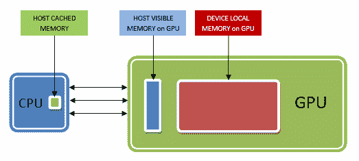
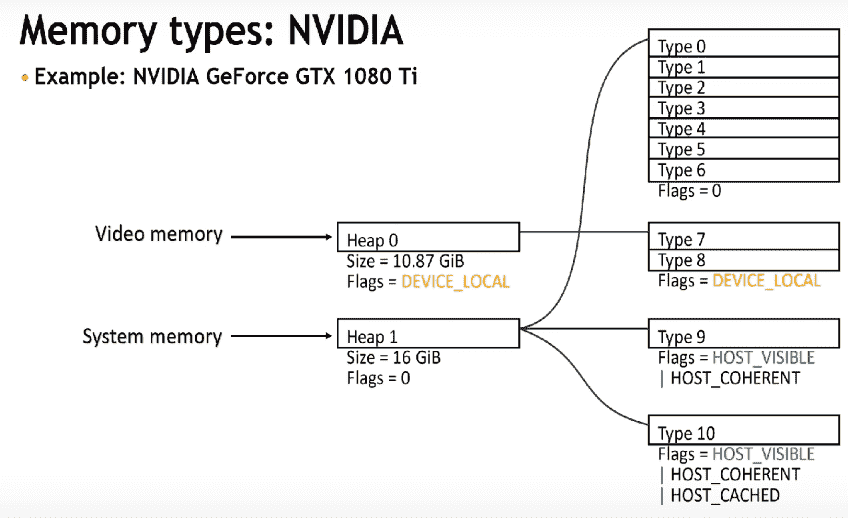
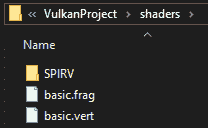
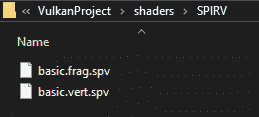

# 第十一章：创建对象资源

在上一章中，我们使清除屏幕功能正常工作并创建了 Vulkan 实例。我们还创建了逻辑设备、交换链、渲染目标和视图，以及绘制命令缓冲区，以记录和提交命令到 GPU。使用它，我们能够得到一个紫色的清除屏幕。我们还没有绘制任何几何形状，但现在我们已准备好这样做。

在本章中，我们将准备好渲染几何形状所需的大部分内容。我们必须创建顶点、索引和统一缓冲区。顶点、索引和统一缓冲区将包含有关顶点属性的信息，例如位置、颜色、法线和纹理坐标；索引信息将包含我们想要绘制的顶点的索引，统一缓冲区将包含如新的视图投影矩阵等信息。

我们需要创建一个描述符集和布局，这将指定统一缓冲区绑定到哪个着色器阶段。

我们还必须生成用于绘制几何形状的着色器。

为了创建对象缓冲区和描述符集以及布局，我们将创建新的类，以便它们被分离开来，我们可以理解它们是如何相关的。在我们跳到对象缓冲区类之前，我们将添加在 OpenGL 项目中创建的 `Mesh` 类，并且我们将使用相同的类并对它进行一些小的修改。`Mesh` 类包含有关我们想要绘制的不同几何形状的顶点和索引信息。

本章我们将涵盖以下主题：

+   更新 `Mesh` 类以支持 Vulkan

+   创建 `ObjectBuffers` 类

+   创建 `Descriptor` 类

+   创建 SPIR-V 着色器二进制文件

# 更新 Mesh 类以支持 Vulkan

在 `Mesh.h` 文件中，我们只需添加几行代码来指定 `InputBindingDescription` 和 `InputAttributeDescription`。在 `InputBindingDesciption` 中，我们指定绑定位置、数据本身的步长以及输入速率，它指定数据是按顶点还是按实例。在 OpenGL 项目的 `Mesh.h` 文件中，我们只需向 `Vertex` 结构体添加函数：

```cpp
 struct Vertex { 

   glm::vec3 pos; 
   glm::vec3 normal; 
   glm::vec3 color; 
glm::vec2 texCoords; 

}; 
```

因此，在`Vertex`结构体中，添加一个用于检索`AttributeDescription`的函数：

```cpp
   static VkVertexInputBindingDescription getBindingDescription() { 

         VkVertexInputBindingDescription bindingDescription = {}; 

         bindingDescription.binding = 0;  
         bindingDescription.stride = sizeof(Vertex); 
         bindingDescription.inputRate = VK_VERTEX_INPUT_RATE_VERTEX; 

         return bindingDescription; 
} 

```

在函数 `VertexInputBindingDescriptor` 中，指定绑定位于第 0 个索引，步长等于 `Vertex` 结构体本身的大小，输入速率是 `VK_VERTEX_INPUT_RATE_VERTEX`，即按顶点。该函数仅返回创建的绑定描述。

由于我们在顶点结构体中有四个属性，我们必须为每个属性创建一个属性描述符。将以下函数添加到 `Vertex` 结构体中，该函数返回一个包含四个输入属性描述符的数组。对于每个属性描述符，我们必须指定绑定位置，即绑定描述中指定的 `0`，每个属性的布局位置，数据类型的格式，以及从 `Vertex` 结构体开始的偏移量：

```cpp
static std::array<VkVertexInputAttributeDescription, 4> getAttributeDescriptions() { 

   std::array<VkVertexInputAttributeDescription, 4> 
   attributeDescriptions = {}; 

   attributeDescriptions[0].binding = 0; // binding index, it is 0 as 
                                            specified above 
   attributeDescriptions[0].location = 0; // location layout

   // data format
   attributeDescriptions[0].format = VK_FORMAT_R32G32B32_SFLOAT; 
   attributeDescriptions[0].offset = offsetof(Vertex, pos); // bytes             
      since the start of the per vertex data 

   attributeDescriptions[1].binding = 0; 
   attributeDescriptions[1].location = 1; 
   attributeDescriptions[1].format = VK_FORMAT_R32G32B32_SFLOAT; 
   attributeDescriptions[1].offset = offsetof(Vertex, normal); 

   attributeDescriptions[2].binding = 0; 
   attributeDescriptions[2].location = 2; 
   attributeDescriptions[2].format = VK_FORMAT_R32G32B32_SFLOAT; 
   attributeDescriptions[2].offset = offsetof(Vertex, color); 

   attributeDescriptions[3].binding = 0; 
   attributeDescriptions[3].location = 3; 
   attributeDescriptions[3].format = VK_FORMAT_R32G32_SFLOAT; 
   attributeDescriptions[3].offset = offsetof(Vertex, texCoords); 

   return attributeDescriptions; 
}   
```

我们还将在 `Mesh.h` 文件中创建一个新的结构体来组织统一数据信息。因此，创建一个名为 `UniformBufferObject` 的新结构体：

```cpp
struct UniformBufferObject { 

   glm::mat4 model; 
   glm::mat4 view; 
   glm::mat4 proj; 

}; 
```

在 `Mesh.h` 文件顶部，我们还将包含两个 `define` 语句来告诉 `GLM` 使用弧度而不是度数，并使用归一化深度值：

```cpp
#define GLM_FORCE_RADIAN 
#define GLM_FORCE_DEPTH_ZERO_TO_ONE 
```

对于 `Mesh.h` 文件来说，这就结束了。`Mesh.cpp` 文件完全没有被修改。

# 创建 `ObjectBuffers` 类

为了创建与对象相关的缓冲区，例如顶点、索引和统一缓冲区，我们将创建一个新的类，称为 `ObjectBuffers`。在 `ObjectBuffers.h` 文件中，我们将添加所需的 `include` 语句：

```cpp
#include <vulkan\vulkan.h> 
#include <vector> 

#include "Mesh.h"  
```

然后，我们将创建类本身。在公共部分，我们将添加构造函数和析构函数，并添加创建顶点、索引和统一缓冲区所需的数据类型。我们添加一个数据顶点的向量来设置几何体的顶点信息，创建一个名为 `vertexBuffer` 的 `VkBuffer` 实例来存储顶点缓冲区，并创建一个名为 `vertexBufferMemory` 的 `VkDeviceMemory` 实例：

+   `VkBuffer`：这是对象缓冲区的句柄。

+   `VkDeviceMemory`：Vulkan 通过 `DeviceMemory` 对象在设备的内存中操作内存数据。

类似地，我们创建一个向量来存储索引，并创建一个 `indexBuffer` 和 `indexBufferMemory` 对象，就像我们为顶点所做的那样。

对于统一缓冲区，我们只创建 `uniformBuffer` 和 `uniformBuffer` 内存，因为不需要向量。

我们添加了一个 `createVertexIndexUniformBuffers` 函数，它接受一个 `Mesh` 类型，并且顶点和索引将根据它设置。

我们还添加了一个销毁函数来销毁我们创建的 Vulkan 对象。

在私有部分，我们添加了三个函数，`createVertexIndexUniformBuffers` 将会调用这些函数来创建缓冲区。这就是 `ObjectBuffers.h` 文件的全部内容。因此，`ObjectBuffers` 类应该如下所示：

```cpp
class ObjectBuffers 
{ 
public: 
   ObjectBuffers(); 
   ~ObjectBuffers(); 

   std::vector<Vertex> vertices; 
   VkBuffer vertexBuffer; 
   VkDeviceMemory vertexBufferMemory; 

   std::vector<uint32_t> indices; 
   VkBuffer indexBuffer; 
   VkDeviceMemory indexBufferMemory; 

   VkBuffer uniformBuffers; 
   VkDeviceMemory uniformBuffersMemory; 

   void createVertexIndexUniformsBuffers(MeshType modelType); 
   void destroy(); 

private: 

   void createVertexBuffer(); 
   void createIndexBuffer(); 
   void createUniformBuffers(); 

}; 

```

接下来，让我们继续转到 `ObjectBuffers.cpp` 文件。在这个文件中，我们包含头文件并创建构造函数和析构函数：

```cpp
#include "ObjectBuffers.h" 
#include "Tools.h" 
#include "VulkanContext.h" 

ObjectBuffers::ObjectBuffers(){} 

ObjectBuffers::~ObjectBuffers(){} 
```

`Tools.h` 被包含进来，因为我们将会向其中添加一些我们将要使用的功能。接下来，我们将创建 `createVertexIndexUniformBuffers` 函数：

```cpp
void ObjectBuffers::createVertexIndexUniformsBuffers(MeshType modelType){ 

   switch (modelType) { 

         case kTriangle: Mesh::setTriData(vertices, indices); break; 
         case kQuad: Mesh::setQuadData(vertices, indices); break; 
         case kCube: Mesh::setCubeData(vertices, indices); break; 
         case kSphere: Mesh::setSphereData(vertices, indices); break; 

   } 

    createVertexBuffer(); 
    createIndexBuffer(); 
    createUniformBuffers(); 

}
```

与 OpenGL 项目类似，我们将添加一个 `switch` 语句来根据网格类型设置顶点和索引数据。然后我们调用 `createVertexBuffer`，

`createIndexBuffer` 和 `createUniformBuffers` 函数来设置相应的缓冲区。我们首先创建 `createVertexBuffer` 函数。

为了创建顶点缓冲区，最好在**GPU**本身上的设备上创建缓冲区。现在，**GPU**有两种类型的内存：**HOST VISIBLE**和**DEVICE LOCAL**。**HOST VISIBLE**是 CPU 可以访问的 GPU 内存的一部分。这种内存不是很大，因此用于存储最多 250 MB 的数据。

对于较大的数据块，例如顶点和索引数据，最好使用**DEVICE LOCAL**内存，CPU 无法访问这部分内存。

那么，如何将数据传输到`DEVICE LOCAL`内存呢？首先，我们必须将数据复制到**GPU**上的**HOST VISIBLE**部分，然后将其复制到**DEVICE LOCAL**内存。因此，我们首先创建一个称为阶段缓冲区的东西，将顶点数据复制进去，然后将阶段缓冲区复制到实际的顶点缓冲区：



（来源：[`www.youtube.com/watch?v=rXSdDE7NWmA`](https://www.youtube.com/watch?v=rXSdDE7NWmA)）

让我们在`VkTool`文件中添加创建不同类型缓冲区的功能。这样，我们就可以创建阶段缓冲区和顶点缓冲区本身。因此，在`VkTools.h`文件中的`vkTools`命名空间中，添加一个名为`createBuffer`的新函数。此函数接受五个参数：

+   第一项是`VkDeviceSize`，这是要创建的缓冲区数据的大小。

+   第二项是`usage`标志，它告诉我们缓冲区将要用于什么。

+   第三点是内存属性，这是我们想要创建缓冲区的地方；这里我们将指定我们希望它在 HOST VISIBLE 部分还是 DEVICE LOCAL 区域。

+   第四点是缓冲区本身。

+   第五点是缓冲区内存，用于将缓冲区绑定到以下内容：

```cpp
namespace vkTools { 

   VkImageView createImageView(VkImage image, 
         VkFormat format, 
         VkImageAspectFlags aspectFlags); 

   void createBuffer(VkDeviceSize size, 
         VkBufferUsageFlags usage, 
         VkMemoryPropertyFlags properties, 
         VkBuffer &buffer, 
         VkDeviceMemory& bufferMemory); 
} 
```

在`VKTools.cpp`文件中，我们添加了创建缓冲区并将其绑定到`bufferMemory`的功能。在命名空间中添加新的函数：

```cpp
   void createBuffer(VkDeviceSize size, 
         VkBufferUsageFlags usage, 
         VkMemoryPropertyFlags properties, 
         VkBuffer &buffer, // output 
         VkDeviceMemory& bufferMemory) { 

// code  
} 
```

在绑定缓冲区之前，我们首先创建缓冲区本身。因此，我们按照以下方式填充`VkBufferCreateInfo`结构体：

```cpp
   VkBufferCreateInfo bufferInfo = {}; 
   bufferInfo.sType = VK_STRUCTURE_TYPE_BUFFER_CREATE_INFO; 
   bufferInfo.size = size; 
   bufferInfo.usage = usage; 
   bufferInfo.sharingMode = VK_SHARING_MODE_EXCLUSIVE; 

   if (vkCreateBuffer(VulkanContext::getInstance()->
      getDevice()->logicalDevice, &bufferInfo, 
      nullptr, &buffer) != VK_SUCCESS) { 

         throw std::runtime_error(" failed to create 
           vertex buffer "); 
   }
```

结构体首先采用通常的类型，然后我们设置缓冲区大小和用途。我们还需要指定缓冲区共享模式，因为缓冲区可以在队列之间共享，例如图形和计算，或者可能仅限于一个队列。因此，在这里我们指定缓冲区仅限于当前队列。

然后，通过调用`vkCreateBuffer`并传入`logicalDevice`和`bufferInfo`来创建缓冲区。接下来，为了绑定缓冲区，我们必须获取适合我们特定缓冲区用途的合适内存类型。因此，首先我们必须获取我们正在创建的缓冲区类型的内存需求。必需的内存需求是通过调用`vkGetBufferMemoryRequirements`函数接收的，该函数接受逻辑设备、缓冲区和内存需求存储在一个名为`VkMemoryRequirements`的变量类型中。

我们按照以下方式获取内存需求：

```cpp
   VkMemoryRequirements memrequirements; 
   vkGetBufferMemoryRequirements(VulkanContext::getInstance()->getDevice()->
     logicalDevice, buffer, &memrequirements);  
```

要绑定内存，我们必须填充 `VkMemoryAllocateInfo` 结构体。它需要分配大小和所需内存类型的内存索引。每个 GPU 都有不同的内存类型索引，具有不同的堆索引和内存类型。以下是 1080Ti 的对应值：



我们现在将在 `VkTools` 中添加一个新函数来获取适合我们缓冲区使用的正确类型的内存索引。因此，在 `VkTool.h` 中的 `vkTools` 命名空间下添加一个新函数，称为 `findMemoryTypeIndex`：

```cpp
uint32_t findMemoryTypeIndex(uint32_t typeFilter, VkMemoryPropertyFlags 
    properties); 
```

它接受两个参数，即可用的内存类型位和所需的内存属性。将 `findMemoryTypeIndex` 函数的实现添加到 `VkTools.cpp` 文件中。在命名空间下，添加以下函数：

```cpp
uint32_t findMemoryTypeIndex(uint32_t typeFilter, VkMemoryPropertyFlags properties) { 

   //-- Properties has two arrays -- memory types and memory heaps 
   VkPhysicalDeviceMemoryProperties memProperties; 
     vkGetPhysicalDeviceMemoryProperties(VulkanContext::
     getInstance()->getDevice()->physicalDevice, 
     &memProperties); 

   for (uint32_t i = 0; i < memProperties.memoryTypeCount; i++) { 

         if ((typeFilter & (1 << i)) &&  
             (memProperties.memoryTypes[i].propertyFlags &                                 
              properties) == properties) { 

                     return i; 
               } 
         } 

         throw std::runtime_error("failed to find 
            suitable memory type!"); 
   } 
```

此函数使用 `vkGetPhysicalDeviceMemoryProperties` 函数获取设备的内存属性，并填充物理设备的内存属性。

内存属性获取每个索引的内存堆和内存类型的信息。从所有可用索引中，我们选择我们所需的内容并返回值。一旦函数创建完成，我们就可以回到绑定缓冲区。因此，继续我们的 `createBuffer` 函数，向其中添加以下内容以绑定缓冲区到内存：

```cpp
   VkMemoryAllocateInfo allocInfo = {}; 
   allocInfo.sType = VK_STRUCTURE_TYPE_MEMORY_ALLOCATE_INFO; 
   allocInfo.allocationSize = memrequirements.size; 
   allocInfo.memoryTypeIndex = findMemoryTypeIndex(memrequirements.
                               memoryTypeBits, properties); 

   if (vkAllocateMemory(VulkanContext::getInstance()->
      getDevice()->logicalDevice, &allocInfo, nullptr, 
      &bufferMemory) != VK_SUCCESS) { 

         throw std::runtime_error("failed to allocate 
            vertex buffer memory"); 
   } 

   vkBindBufferMemory(VulkanContext::getInstance()->
      getDevice()->logicalDevice, buffer, 
      bufferMemory, 0); 
```

在所有这些之后，我们可以回到 `ObjectBuffers` 实际创建 `createVertexBuffers` 函数。因此，创建函数如下：

```cpp
void ObjectBuffers::createVertexBuffer() { 
// code 
} 

```

在其中，我们首先创建阶段缓冲区，将顶点数据复制到其中，然后将阶段缓冲区复制到顶点缓冲区。在函数中，我们首先获取总缓冲区大小，这是顶点数和每个顶点存储的数据大小：

```cpp
VkDeviceSize bufferSize = sizeof(vertices[0]) * vertices.size(); 
```

接下来，我们创建阶段缓冲区和 `stagingBufferMemory` 以将阶段缓冲区绑定到它：

```cpp
VkBuffer stagingBuffer; 
VkDeviceMemory stagingBufferMemory; 
```

然后我们调用新创建的 `createBuffer` 在 `vkTools` 中创建缓冲区：

```cpp
vkTools::createBuffer(bufferSize, 
   VK_BUFFER_USAGE_TRANSFER_SRC_BIT,  
   VK_MEMORY_PROPERTY_HOST_VISIBLE_BIT | 
   VK_MEMORY_PROPERTY_HOST_COHERENT_BIT, 
   stagingBuffer, stagingBufferMemory);
```

在其中，我们传入我们想要的尺寸、使用方式和内存类型，以及缓冲区和缓冲区内存。`VK_BUFFER_USAGE_TRANSFER_SRC_BIT` 表示该缓冲区将在数据传输时作为源传输命令的一部分使用。

`VK_MEMORY_PROPERTY_HOST_VISIBLE_BIT` 表示我们希望它在 GPU 上的主机可见（CPU）内存空间中分配。

`VK_MEMORY_PROPERTY_HOST_COHERENT_BIT` 表示 CPU 缓存管理不是由我们完成，而是由系统完成。这将确保映射内存与分配的内存匹配。接下来，我们使用 `vkMapMemory` 获取阶段缓冲区的宿主指针并创建一个 void 指针称为 data。然后调用 `vkMapMemory` 获取映射内存的指针：

```cpp
   void* data; 

   vkMapMemory(VulkanContext::getInstance()->getDevice()->
      logicalDevice, stagingBufferMemory, 
         0, // offet 
         bufferSize,// size 
         0,// flag 
         &data);  
```

`VkMapMemory` 接收逻辑设备、阶段缓冲区绑定，我们指定 0 作为偏移量，并传递缓冲区大小。没有特殊标志，因此我们传递 `0` 并获取映射内存的指针。我们使用 `memcpy` 将顶点数据复制到数据指针：

```cpp
memcpy(data, vertices.data(), (size_t)bufferSize);  
```

当不再需要主机对它的访问时，我们取消映射阶段内存：

```cpp
vkUnmapMemory(VulkanContext::getInstance()->getDevice()->logicalDevice, 
   stagingBufferMemory); 
```

现在数据已存储在阶段缓冲区中，接下来创建顶点缓冲区并将其绑定到`vertexBufferMemory`：

```cpp
// Create Vertex Buffer 
   vkTools::createBuffer(bufferSize, 
         VK_BUFFER_USAGE_TRANSFER_DST_BIT | 
         VK_BUFFER_USAGE_VERTEX_BUFFER_BIT, 
         VK_MEMORY_PROPERTY_DEVICE_LOCAL_BIT,  
         vertexBuffer, 
         vertexBufferMemory);
```

我们使用`createBuffer`函数来创建顶点缓冲区。我们传入缓冲区大小。对于缓冲区用途，我们指定当我们将阶段缓冲区传输到它时，它用作传输命令的目标，并且它将用作顶点缓冲区。对于内存属性，我们希望它在`DEVICE_LOCAL`中创建以获得最佳性能。传递顶点缓冲区和顶点缓冲区内存以绑定缓冲区到内存。现在，我们必须将阶段缓冲区复制到顶点缓冲区。

在 GPU 上复制缓冲区必须使用传输队列和命令缓冲区。我们可以像检索图形和显示队列一样获取传输队列来完成传输。好消息是，我们不需要这样做，因为所有图形和计算队列也支持传输功能，所以我们将使用图形队列来完成。

我们将在`vkTools`命名空间中创建两个辅助函数来创建和销毁临时命令缓冲区。因此，在`VkTools.h`文件中，在命名空间中添加两个函数用于开始和结束单次命令：

```cpp
VkCommandBuffer beginSingleTimeCommands(VkCommandPool commandPool); 
   void endSingleTimeCommands(VkCommandBuffer commandBuffer, 
   VkCommandPool commandPool);  
```

基本上，`beginSingleTimeCommands`为我们返回一个命令缓冲区以供使用，而`endSingleTimeCommands`销毁命令缓冲区。在`VkTools.cpp`文件中，在命名空间下添加这两个函数：

```cpp
   VkCommandBuffer beginSingleTimeCommands(VkCommandPool commandPool) { 

         //-- Alloc Command buffer   
         VkCommandBufferAllocateInfo allocInfo = {}; 

         allocInfo.sType = VK_STRUCTURE_TYPE_COMMAND*BUFFER
*                           ALLOCATE_INFO; 
         allocInfo.level = VK_COMMAND_BUFFER_LEVEL_PRIMARY; 
         allocInfo.commandPool = commandPool; 
         allocInfo.commandBufferCount = 1; 

         VkCommandBuffer commandBuffer; 
         vkAllocateCommandBuffers(VulkanContext::getInstance()->
           getDevice()->logicalDevice, 
           &allocInfo, &commandBuffer); 

         //-- Record command buffer 

         VkCommandBufferBeginInfo beginInfo = {}; 
         beginInfo.sType = VK_STRUCTURE_TYPE_COMMAND_BUFFER_BEGIN_INFO; 
         beginInfo.flags = VK_COMMAND_BUFFER_USAGE_ONE_TIME_SUBMIT_BIT; 

         //start recording 
         vkBeginCommandBuffer(commandBuffer, &beginInfo); 

         return commandBuffer; 

   } 

   void endSingleTimeCommands(VkCommandBuffer commandBuffer, 
      VkCommandPool commandPool) { 

         //-- End recording 
         vkEndCommandBuffer(commandBuffer); 

         //-- Execute the Command Buffer to complete the transfer 
         VkSubmitInfo submitInfo = {}; 
         submitInfo.sType = VK_STRUCTURE_TYPE_SUBMIT_INFO; 
         submitInfo.commandBufferCount = 1; 
         submitInfo.pCommandBuffers = &commandBuffer; 

         vkQueueSubmit(VulkanContext::getInstance()->
            getDevice()->graphicsQueue, 1, &submitInfo, 
            VK_NULL_HANDLE); 

         vkQueueWaitIdle(VulkanContext::getInstance()->
            getDevice()->graphicsQueue); 

         vkFreeCommandBuffers(VulkanContext::getInstance()->
            getDevice()->logicalDevice, commandPool, 1, 
            &commandBuffer); 

   } 
```

我们已经探讨了如何创建和销毁命令缓冲区。如果您有任何疑问，可以参考第十一章，*准备清屏*。接下来，在`Vktools.h`文件中，我们将添加复制缓冲区的功能。在命名空间下添加一个新函数：

```cpp
   VkCommandBuffer beginSingleTimeCommands(VkCommandPool commandPool); 
   void endSingleTimeCommands(VkCommandBuffer commandBuffer, 
      VkCommandPool commandPool); 

   void copyBuffer(VkBuffer srcBuffer, 
         VkBuffer dstBuffer, 
         VkDeviceSize size);
```

`copyBuffer`函数接受源缓冲区、目标缓冲区和缓冲区大小作为输入。现在，将此新函数添加到`VkTools.cpp`文件中：

```cpp
void copyBuffer(VkBuffer srcBuffer, 
         VkBuffer dstBuffer, 
         VkDeviceSize size) { 

QueueFamilyIndices qFamilyIndices = VulkanContext::getInstance()->
   getDevice()->getQueueFamiliesIndicesOfCurrentDevice(); 

   // Create Command Pool 
   VkCommandPool commandPool; 

   VkCommandPoolCreateInfo cpInfo = {}; 

   cpInfo.sType = VK_STRUCTURE_TYPE_COMMAND_POOL_CREATE_INFO; 
   cpInfo.queueFamilyIndex = qFamilyIndices.graphicsFamily; 
   cpInfo.flags = 0; 

if (vkCreateCommandPool(VulkanContext::getInstance()->
   getDevice()->logicalDevice, &cpInfo, nullptr, &commandPool) != 
   VK_SUCCESS) { 
         throw std::runtime_error(" failed to create 
            command pool !!"); 
   } 

   // Allocate command buffer and start recording 
   VkCommandBuffer commandBuffer = beginSingleTimeCommands(commandPool); 

   //-- Copy the buffer 
   VkBufferCopy copyregion = {}; 
   copyregion.srcOffset = 0; 
   copyregion.dstOffset = 0; 
   copyregion.size = size; 
   vkCmdCopyBuffer(commandBuffer, srcBuffer, dstBuffer,
      1, &copyregion); 

   // End recording and Execute command buffer and free command buffer 
   endSingleTimeCommands(commandBuffer, commandPool); 

   vkDestroyCommandPool(VulkanContext::getInstance()->
      getDevice()->logicalDevice, commandPool, 
      nullptr); 

} 

```

在该函数中，我们首先从设备获取队列家族索引。然后我们创建一个新的命令池，然后使用`beginSingleTimeCommands`函数创建一个新的命令缓冲区。为了复制缓冲区，我们创建`VkBufferCopy`结构。我们将源和目标偏移量设置为`0`并设置缓冲区大小。

要实际复制缓冲区，我们调用`vlCmdCopyBuffer`函数，它接受一个命令缓冲区、源命令缓冲区、目标命令缓冲区、复制区域数量（在这种情况下为`1`）和复制区域结构。一旦缓冲区被复制，我们调用`endSingleTimeCommands`来销毁命令缓冲区，并调用`vkDestroyCommandPool`来销毁命令池本身。

现在，我们可以回到`ObjectsBuffers`中的`createVertexBuffers`函数，并将阶段缓冲区复制到顶点缓冲区。我们还会销毁阶段缓冲区和缓冲区内存：

```cpp
   vkTools::copyBuffer(stagingBuffer, 
         vertexBuffer, 
         bufferSize); 

   vkDestroyBuffer(VulkanContext::getInstance()->
      getDevice()->logicalDevice, stagingBuffer, nullptr); 
   vkFreeMemory(VulkanContext::getInstance()->
      getDevice()->logicalDevice, stagingBufferMemory, nullptr); 
```

索引缓冲区的创建方式相同，使用`createIndexBuffer`函数：

```cpp

void ObjectBuffers::createIndexBuffer() { 

   VkDeviceSize bufferSize = sizeof(indices[0]) * indices.size(); 

   VkBuffer stagingBuffer; 
   VkDeviceMemory stagingBufferMemory; 

   vkTools::createBuffer(bufferSize, 
       VK_BUFFER_USAGE_TRANSFER_SRC_BIT, 
       VK_MEMORY_PROPERTY_HOST_VISIBLE_BIT | 
       VK_MEMORY_PROPERTY_HOST_COHERENT_BIT, 
       stagingBuffer, stagingBufferMemory); 

   void* data; 
   vkMapMemory(VulkanContext::getInstance()->
     getDevice()->logicalDevice, stagingBufferMemory, 
     0, bufferSize, 0, &data); 
   memcpy(data, indices.data(), (size_t)bufferSize); 
   vkUnmapMemory(VulkanContext::getInstance()->
     getDevice()->logicalDevice, stagingBufferMemory); 

   vkTools::createBuffer(bufferSize, 
        VK_BUFFER_USAGE_TRANSFER_DST_BIT |    
        VK_BUFFER_USAGE_INDEX_BUFFER_BIT, 
        VK_MEMORY_PROPERTY_DEVICE_LOCAL_BIT, 
        indexBuffer,  
        indexBufferMemory); 

   vkTools::copyBuffer(stagingBuffer, 
         indexBuffer, 
         bufferSize); 

   vkDestroyBuffer(VulkanContext::getInstance()->
     getDevice()->logicalDevice, 
     stagingBuffer, nullptr); 
   vkFreeMemory(VulkanContext::getInstance()->
      getDevice()->logicalDevice, 
      stagingBufferMemory, nullptr); 

}    
```

创建`UniformBuffer`比较简单，因为我们只需使用`HOST_VISIBLE` GPU 内存，因此不需要阶段缓冲区：

```cpp
void ObjectBuffers::createUniformBuffers() { 

   VkDeviceSize bufferSize = sizeof(UniformBufferObject); 

   vkTools::createBuffer(bufferSize, 
               VK_BUFFER_USAGE_UNIFORM_BUFFER_BIT, 
               VK_MEMORY_PROPERTY_HOST_VISIBLE_BIT | 
               VK_MEMORY_PROPERTY_HOST_COHERENT_BIT, 
               uniformBuffers, uniformBuffersMemory); 

} 
```

最后，我们在`destroy`函数中销毁缓冲区和内存：

```cpp
void ObjectBuffers::destroy(){ 

   vkDestroyBuffer(VulkanContext::getInstance()->
     getDevice()->logicalDevice, uniformBuffers, nullptr); 
   vkFreeMemory(VulkanContext::getInstance()->
      getDevice()->logicalDevice, uniformBuffersMemory, 
      nullptr); 

   vkDestroyBuffer(VulkanContext::getInstance()->
     getDevice()->logicalDevice, indexBuffer, nullptr); 
   vkFreeMemory(VulkanContext::getInstance()->
      getDevice()->logicalDevice, indexBufferMemory, 
      nullptr); 

   vkDestroyBuffer(VulkanContext::getInstance()->
     getDevice()->logicalDevice, vertexBuffer, nullptr); 
   vkFreeMemory(VulkanContext::getInstance()->
     getDevice()->logicalDevice, vertexBufferMemory, nullptr); 

} 

```

# 创建描述符类

与 OpenGL 不同，在 OpenGL 中我们使用统一缓冲区来传递模型、视图、投影和其他类型的数据，而 Vulkan 使用描述符。在描述符中，我们必须首先指定缓冲区的布局，以及绑定位置、计数、描述符类型以及与之关联的着色器阶段。

一旦使用不同类型的描述符创建了描述符布局，我们必须为数字交换链图像计数创建一个描述符池，因为统一缓冲区将每帧设置一次。

之后，我们可以为两个帧分配和填充描述符集。数据分配将从池中完成。

我们将创建一个新的类来创建描述符集、布局绑定、池以及分配和填充描述符集。创建一个名为`Descriptor`的新类。在`Descriptor.h`文件中，添加以下代码：

```cpp
#pragma once 
#include <vulkan\vulkan.h> 
#include <vector> 

class Descriptor 
{ 
public: 
   Descriptor(); 
   ~Descriptor(); 

   // all the descriptor bindings are combined into a single layout 

   VkDescriptorSetLayout descriptorSetLayout;  
   VkDescriptorPool descriptorPool; 
   VkDescriptorSet descriptorSet; 

   void createDescriptorLayoutSetPoolAndAllocate(uint32_t 
      _swapChainImageCount); 
   void populateDescriptorSets(uint32_t _swapChainImageCount, 
      VkBuffer uniformBuffers); 

   void destroy(); 

private: 

   void createDescriptorSetLayout(); 
   void createDescriptorPoolAndAllocateSets(uint32_t 
      _swapChainImageCount); 

};  

```

我们包含常用的`Vulkan.h`和 vector。在公共部分，我们使用构造函数和析构函数创建类。我们还创建了三个变量，分别称为`descriptorSetLayout`、`descriptorPool`和`descriptorSets`，它们分别对应于`VkDescriptorSetLayout`、`VkDescriptorPool`和`VkDescriptorSet`类型，以便于访问集合。`createDescriptorLayoutSetPoolAndAllocate`函数将调用私有的`createDescriptorSetLayout`和`createDescriptorPoolAndAllocateSets`函数，这些函数将创建布局集，然后创建描述符池并将其分配。当我们将统一缓冲区设置为填充集合中的数据时，将调用`populateDescriptorSets`函数。

我们还有一个`destroy`函数来销毁已创建的 Vulkan 对象。在`Descriptor.cpp`文件中，我们将添加函数的实现。首先添加必要的包含，然后添加构造函数、析构函数和`createDescriptorLayoutAndPool`函数：

```cpp
#include "Descriptor.h" 

#include<array> 
#include "VulkanContext.h" 

#include "Mesh.h" 

Descriptor::Descriptor(){ 

} 
Descriptor::~Descriptor(){ 

} 

void Descriptor::createDescriptorLayoutSetPoolAndAllocate(uint32_t 
    _swapChainImageCount){ 

   createDescriptorSetLayout(); 
   createDescriptorPoolAndAllocateSets(_swapChainImageCount); 

} 

```

`createDescriptorLayoutSetPoolAndAllocate`函数调用`createDescriptorSetLayout`和`createDescriptorPoolAndAllocateSets`函数。现在让我们添加`createDescriptorSetLayout`函数：

```cpp
void Descriptor::createDescriptorSetLayout() { 

   VkDescriptorSetLayoutBinding uboLayoutBinding = {}; 
   uboLayoutBinding.binding = 0;// binding location 
   uboLayoutBinding.descriptorCount = 1; 
   uboLayoutBinding.descriptorType = VK_DESCRIPTOR_TYPE_UNIFORM_BUFFER;  
   uboLayoutBinding.stageFlags = VK_SHADER_STAGE_VERTEX_BIT;  

   std::array<VkDescriptorSetLayoutBinding, 1> 
      layoutBindings = { uboLayoutBinding }; 

   VkDescriptorSetLayoutCreateInfo layoutCreateInfo = {}; 
   layoutCreateInfo.sType = VK_STRUCTURE_TYPE_DESCRIPTOR*SET
*                            LAYOUT_CREATE_INFO; 
   layoutCreateInfo.bindingCount = static_cast<uint32_t> 
                                   (layoutBindings.size()); 
   layoutCreateInfo.pBindings = layoutBindings.data();  

   if (vkCreateDescriptorSetLayout(VulkanContext::getInstance()->
     getDevice()->logicalDevice, &layoutCreateInfo, nullptr, 
     &descriptorSetLayout) != VK_SUCCESS) { 

         throw std::runtime_error("failed to create 
           descriptor set layout"); 
   } 
} 
```

对于我们的项目，布局集将只有一个布局绑定，即包含模型、视图和投影矩阵信息的那个结构体。

我们必须填充`VkDescriptorSetLayout`结构体，并指定绑定位置索引、计数、我们将传递的信息类型以及统一缓冲区将被发送到的着色器阶段。在创建集合布局后，我们填充`VkDescriptorSetLayoutCreateInfo`，在其中指定绑定计数和绑定本身。

然后，我们调用`vkCreateDescriptorSetLayout`函数，通过传递逻辑设备和布局创建信息来创建描述符集布局。接下来，我们添加`createDescriptorPoolAndAllocateSets`函数：

```cpp
void Descriptor::createDescriptorPoolAndAllocateSets(uint32_t 
    _swapChainImageCount) { 

   // create pool 
   std::array<VkDescriptorPoolSize, 1> poolSizes = {}; 

   poolSizes[0].type = VK_DESCRIPTOR_TYPE_UNIFORM_BUFFER; 
   poolSizes[0].descriptorCount = _swapChainImageCount; 

   VkDescriptorPoolCreateInfo poolInfo = {}; 
   poolInfo.sType = VK_STRUCTURE_TYPE_DESCRIPTOR_POOL_CREATE_INFO; 
   poolInfo.poolSizeCount = static_cast<uint32_t>(poolSizes.size());  
   poolInfo.pPoolSizes = poolSizes.data(); 

   poolInfo.maxSets = _swapChainImageCount;  

   if (vkCreateDescriptorPool(VulkanContext::getInstance()->
      getDevice()->logicalDevice, &poolInfo, nullptr, 
      &descriptorPool) != VK_SUCCESS) { 

         throw std::runtime_error("failed to create descriptor pool "); 
   } 

   // allocate 
   std::vector<VkDescriptorSetLayout> layouts(_swapChainImageCount, 
       descriptorSetLayout); 

   VkDescriptorSetAllocateInfo allocInfo = {}; 
   allocInfo.sType = VK_STRUCTURE_TYPE_DESCRIPTOR_SET_ALLOCATE_INFO; 
   allocInfo.descriptorPool = descriptorPool; 
   allocInfo.descriptorSetCount = _swapChainImageCount; 
   allocInfo.pSetLayouts = layouts.data(); 

   if (vkAllocateDescriptorSets(VulkanContext::getInstance()->
      getDevice()->logicalDevice, &allocInfo, &descriptorSet) 
      != VK_SUCCESS) { 

         throw std::runtime_error("failed to allocate descriptor
            sets ! "); 
   }  
}
```

要创建描述符池，我们必须使用`VkDescriptorPoolSize`指定池大小。我们创建一个数组并命名为`poolSizes`。由于在布局集中我们只有统一缓冲区，我们设置其类型并将计数设置为与交换链图像计数相等。要创建描述符池，我们必须指定类型、池大小计数和池大小数据。我们还需要设置`maxsets`，即可以从池中分配的最大集合数，它等于交换链图像计数。我们通过调用`vkCreateDescriptorPool`并传递逻辑设备和池创建信息来创建描述符池。接下来，我们必须指定描述符集的分配参数。

我们创建一个描述符集布局的向量。然后，我们创建`VkDescriptionAllocationInfo`结构体来填充它。我们传递描述符池、描述符集计数（等于交换链图像计数）和布局数据。然后，通过调用`vkAllocateDescriptorSets`并传递逻辑设备和创建信息结构体来分配描述符集。

最后，我们将添加`populateDescriptorSets`函数，如下所示：

```cpp
void Descriptor::populateDescriptorSets(uint32_t _swapChainImageCount, 
   VkBuffer uniformBuffers) { 

   for (size_t i = 0; i < _swapChainImageCount; i++) { 

         // Uniform buffer info 

         VkDescriptorBufferInfo uboBufferDescInfo = {}; 
         uboBufferDescInfo.buffer = uniformBuffers; 
         uboBufferDescInfo.offset = 0; 
         uboBufferDescInfo.range = sizeof(UniformBufferObject); 

         VkWriteDescriptorSet uboDescWrites; 
         uboDescWrites.sType = VK_STRUCTURE_TYPE_WRITE_DESCRIPTOR_SET; 
         uboDescWrites.pNext = NULL; 
         uboDescWrites.dstSet = descriptorSet; 
         uboDescWrites.dstBinding = 0; // binding index of 0  
         uboDescWrites.dstArrayElement = 0;  
         uboDescWrites.descriptorType = VK_DESCRIPTOR_TYPE_UNIFORM_BUFFER; 
         uboDescWrites.descriptorCount = 1;  
         uboDescWrites.pBufferInfo = &uboBufferDescInfo; // uniforms 
                                                            buffers 
         uboDescWrites.pImageInfo = nullptr; 
         uboDescWrites.pTexelBufferView = nullptr; 

         std::array<VkWriteDescriptorSet, 1> descWrites = { uboDescWrites}; 

         vkUpdateDescriptorSets(VulkanContext::getInstance()->
           getDevice()->logicalDevice, static_cast<uint32_t>
           (descWrites.size()), descWrites.data(), 0, 
           nullptr); 
   } 

} 
```

此函数接收交换链图像计数和统一缓冲区作为参数。对于交换链的两个图像，需要通过调用`vkUpdateDescriptorSets`来更新描述符的配置。此函数接收一个`VkWriteDescriptorSet`数组。现在，`VkWriteDescriptorSet`接收一个缓冲区、图像结构体或`texelBufferView`作为参数。由于我们将使用统一缓冲区，我们必须创建它并传递它。`VkdescriptorBufferInfo`接收一个缓冲区（将是创建的统一缓冲区），接收一个偏移量（在这种情况下为无），然后接收范围（即缓冲区本身的大小）。

创建完成后，我们可以开始指定`VkWriteDescriptorSet`。这个函数接收类型、`descriptorSet`和绑定位置（即第 0 个索引）。它没有数组元素，并接收描述符类型（即统一缓冲区类型）；描述符计数为`1`，我们传递缓冲区信息结构体。对于图像信息和纹理缓冲区视图，我们指定为无，因为它没有被使用。

然后，我们创建一个`VkWriteDescriptorSet`数组，并将我们创建的统一缓冲区描述符写入信息`uboDescWrites`添加到其中。通过调用`vkUpdateDescriptorSets`并传递逻辑设备、描述符写入大小和数据来更新描述符集。这就是`populateDescriptorSets`函数的全部内容。我们最后添加一个销毁函数，该函数销毁描述符池和描述符集布局。添加函数如下：

```cpp
void Descriptor::destroy(){ 

   vkDestroyDescriptorPool(VulkanContext::getInstance()->
      getDevice()->logicalDevice, descriptorPool, nullptr); 
   vkDestroyDescriptorSetLayout(VulkanContext::getInstance()->
      getDevice()->logicalDevice, descriptorSetLayout, nullptr); 
} 
```

# 创建 SPIR-V 着色器二进制文件

与 OpenGL 不同，OpenGL 接收可读的 GLSL（OpenGL 着色语言）文件作为着色器，而 Vulkan 接收二进制或字节码格式的着色器。所有着色器，无论是顶点、片段还是计算着色器，都必须是字节码格式。

SPIR-V 也非常适合交叉编译，这使得移植着色器文件变得容易得多。如果你有 Direct3D HLSL 着色器代码，它可以编译成 SPIR-V 格式，并可以在 Vulkan 应用程序中使用，这使得将 Direct3D 游戏移植到 Vulkan 变得非常容易。着色器最初是用 GLSL 编写的，我们对 OpenGL 编写它的方式做了一些小的改动。提供了一个编译器，可以将代码从 GLSL 编译成 SPIR-V 格式。编译器包含在 Vulkan SDK 安装中。基本的顶点着色器 GLSL 代码如下：

```cpp
#version 450 
#extension GL_ARB_separate_shader_objects : enable 

layout (binding = 0) uniform UniformBufferOBject{ 

mat4 model; 
mat4 view; 
mat4 proj; 

} ubo; 

layout(location = 0) in vec3 inPosition; 
layout(location = 1) in vec3 inNormal; 
layout(location = 2) in vec3 inColor; 
layout(location = 3) in vec2 inTexCoord; 

layout(location = 0) out vec3 fragColor; 

void main() { 

    gl_Position = ubo.proj * ubo.view * ubo.model * vec4(inPosition, 1.0); 
    fragColor = inColor; 

}
```

着色器看起来应该非常熟悉，有一些小的改动。例如，GLSL 版本仍然在顶部指定。在这种情况下，它是 `#version 450`。但我们还看到了一些新事物，例如 `#extension GL_ARB_seperate_shader_objects: enable`。这指定了着色器使用的扩展。在这种情况下，需要一个旧的扩展，它基本上允许我们将顶点着色器和片段着色器作为单独的文件使用。扩展需要由**架构评审委员会（ARB）**批准。

除了包含扩展之外，你可能还注意到为所有数据类型指定了位置布局。你可能还注意到，在创建顶点和统一缓冲区时，我们必须指定缓冲区的绑定索引。在 Vulkan 中，没有与 `GLgetUniformLocation` 相当的函数来获取统一缓冲区的位置索引。这是因为获取位置需要相当多的系统资源。相反，我们指定并硬编码索引的值。统一缓冲区以及输入和输出缓冲区都可以分配一个索引 0，因为它们是不同数据类型。由于统一缓冲区将作为包含模型、视图和投影矩阵的结构体发送，所以在着色器中创建了一个类似的结构体，并将其分配给统一布局的 0^(th) 索引。

所有四个属性也被分配了一个布局索引 `0`、`1`、`2` 和 `3`，正如在 `Mesh.h` 文件下的 `Vertex` 结构体中设置 `VkVertexInputAttributeDescription` 为四个属性时所指定的。输出也被分配了一个布局位置索引 `0`，并且数据类型被指定为 `vec3`。然后，在着色器的主函数中，我们通过将对象的局部坐标乘以从统一缓冲区结构体接收到的模型、视图和投影矩阵来设置 `gl_Position` 值。此外，`outColor` 被设置为接收到的 `inColor`。

片段着色器如下：打开一个 `.txt` 文件，将着色器代码添加到其中，并将文件命名为 `basic.` 然后，将扩展名从 `*.txt` 改为 `*.vert`：

```cpp
#version 450 
#extension GL_ARB_separate_shader_objects : enable 

layout(location = 0) in vec3 fragColor; 

layout(location = 0) out vec4 outColor; 

void main() { 

   outColor = vec4(fragColor, 1.0f); 

}
```

在这里，我们指定了 GLSL 版本和要使用的扩展。有 `in` 和 `out`，它们都有一个位置布局为 `0`。请注意，`in` 是一个名为 `fragColor` 的 `vec3`，这是我们从顶点着色器发送出来的，而 `outColor` 是一个 `vec4`。在着色器文件的 main 函数中，我们将 `vec3` 转换为 `vec4`，并将结果颜色设置为 `outColor`。将片段着色器添加到名为 `basic.frag` 的文件中。在 `VulkanProject` 根目录下，创建一个名为 `shaders` 的新文件夹，并将两个着色器文件添加到其中：



创建一个名为 `SPIRV` 的新文件夹，因为这是我们放置编译好的 SPIRV 字节码文件的地方。要编译 `.glsl` 文件，我们将使用安装 Vulkan SDK 时安装的 `glslValidator.exe` 文件。现在，要编译代码，我们可以使用以下命令：

```cpp
glslangValidator.exe -V basic.frag -o basic.frag.spv 
```

按住键盘上的 *Shift* 键，在 `shaders` 文件夹中右键单击，然后点击在此处打开 PowerShell 窗口：


在 PowerShell 中，输入以下命令：


确保将 *V* 大写，将 *o* 小写，否则将会出现编译错误。这将在文件夹中创建一个新的 `spirv` 文件。将 `frag` 改为 `vert` 以编译 SPIRV 顶点着色器：


这将在文件夹中创建顶点和片段着色器 SPIRV 二进制文件：


而不是每次都手动编译代码，我们可以创建一个 `.bat` 文件来自动完成这项工作，并将编译好的 SPIRV 二进制文件放在 `SPIRV` 文件夹中。在 `shaders` 文件夹中，创建一个新的 `.txt` 文件，并将其命名为 `glsl_spirv_compiler.bat`。

在 `.bat` 文件中，添加以下内容：

```cpp
@echo off 
echo compiling glsl shaders to spirv  
for /r %%i in (*.vert;*.frag) do %VULKAN_SDK%\Bin32\glslangValidator.exe -V "%%i" -o  "%%~dpiSPIRV\%%~nxi".spv 
```

保存并关闭文件。现在双击 `.bat` 文件以执行它。这将编译着色器并将编译好的二进制文件放置在 SPIRV 着色器文件中：



您可以使用控制台命令删除 `shaders` 文件夹中我们之前编译的 SPIRV 文件，因为我们将会使用 `SPIRV` 子文件夹中的着色器文件。

# 摘要

在本章中，我们创建了渲染几何形状所需的所有资源。首先，我们添加了 `Mesh` 类，它包含了所有网格类型（包括三角形、四边形、立方体和球体）的顶点和索引信息。然后，我们创建了 `ObjectBuffers` 类，它用于存储并将缓冲区绑定到 GPU 内存，使用的是 `VkTool` 文件。我们还创建了一个单独的描述符类，其中包含我们的描述符集布局和池。此外，我们还创建了描述符集。最后，我们创建了从 GLSL 着色器编译的 SPIRV 字节码着色器文件。

在下一章中，我们将使用这里创建的资源来绘制我们的第一个彩色几何形状。
