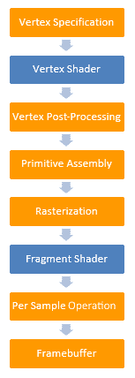
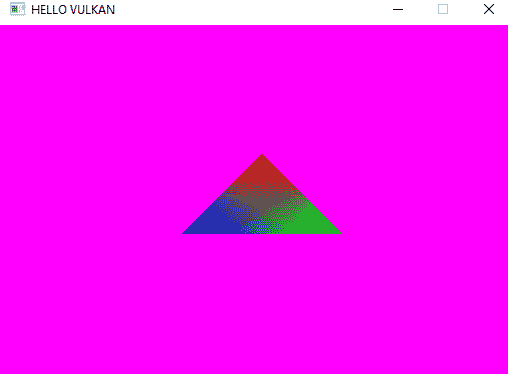
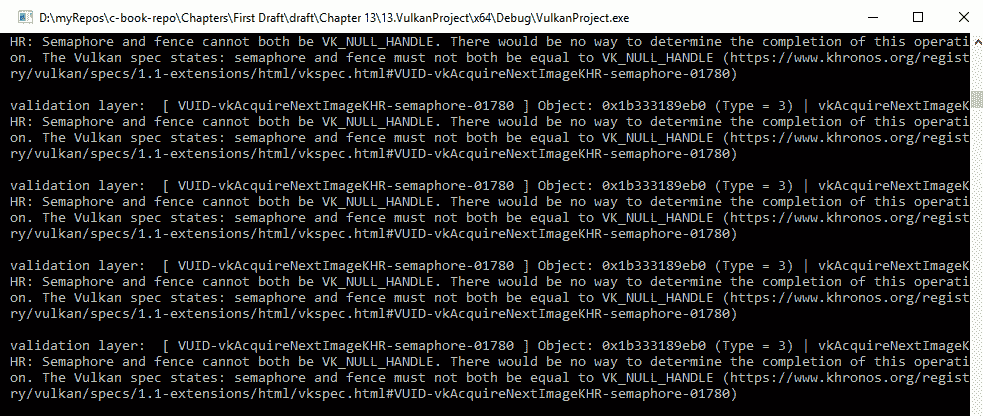
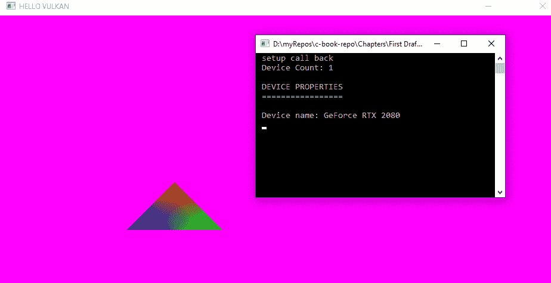
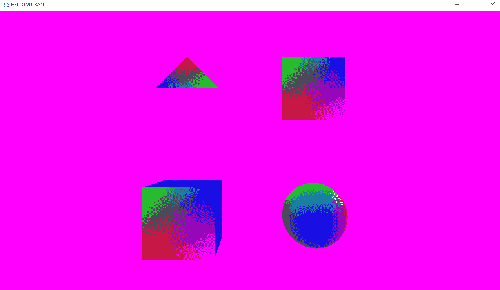
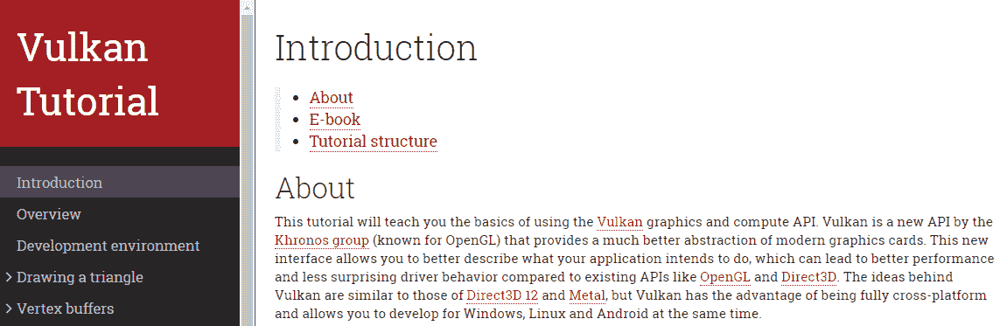
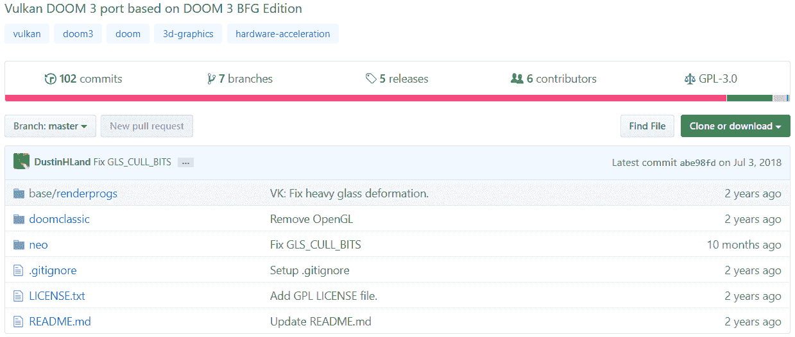

# 第十二章：绘制 Vulkan 对象

在上一章中，我们创建了绘制对象所需的所有资源。在本章中，我们将创建 `ObjectRenderer` 类，该类将在视口中绘制对象。这个类被用来确保我们有一个实际的几何对象来绘制和查看，与我们的紫色视口一起。

我们还将学习如何在章节末尾同步 CPU 和 GPU 操作，这将消除我们在第十一章，*创建对象资源*中遇到的验证错误。

在我们为渲染设置场景之前，我们必须为几何渲染准备最后一件事；那就是图形管线。我们将在下一节开始设置它。

在本章中，我们将涵盖以下主题：

+   准备 `GraphicsPipeline` 类

+   `ObjectRenderer` 类

+   `VulkanContext` 类的更改

+   `Camera` 类

+   绘制一个对象

+   同步一个对象

# 准备 GraphicsPipeline 类

图形管线定义了对象绘制时应遵循的管线。正如我们在第二章，*数学和图形概念*中发现的，我们需要遵循一系列步骤来绘制对象：



在 OpenGL 中，管线状态可以在任何时候更改，就像我们在第八章，*通过碰撞、循环和光照增强你的游戏*中绘制文本时启用和禁用混合一样。然而，更改状态会占用大量系统资源，这就是为什么 Vulkan 鼓励你不要随意更改状态。因此，你必须为每个对象预先设置管线状态。在你创建管线状态之前，你还需要创建一个管线布局，该布局将使用我们在上一章中创建的描述符集布局。所以，我们首先创建管线布局。

然后，我们还需要提供着色器 SPIR-V 文件，这些文件必须被读取以了解如何创建着色器模块。因此，向类中添加功能。然后我们填充图形管线信息，它将使用我们创建的不同着色器模块。我们还指定了顶点输入状态，它将包含有关我们之前在定义顶点结构时创建的缓冲区绑定和属性的信息。

输入装配状态也需要指定，它描述了将使用顶点绘制的几何类型。请注意，我们可以使用给定的顶点集绘制点、线或三角形。

此外，我们还需要指定视图状态，它描述了将要渲染的帧缓冲区区域，因为如果需要，我们可以将帧缓冲区的一部分显示到视口中。在我们的情况下，我们将显示整个区域到视口中。我们指定了光栅化状态，它将执行深度测试和背面剔除，并将几何形状转换为光栅化线条——这些线条将按照片段着色器中指定的颜色进行着色。

多采样状态将指定是否要启用多采样以启用抗锯齿。深度和模板状态指定是否启用深度和模板测试，并且要在对象上执行。颜色混合状态指定是否启用混合。最后，动态状态使我们能够在不重新创建管线的情况下动态地更改一些管线状态。在我们的实现中，我们不会使用动态状态。设置好所有这些后，我们可以为对象创建图形管线。

让我们先创建一个新的类来处理图形管线。在`GraphicsPipeline.h`文件中，添加以下内容：

```cpp
#include <vulkan\vulkan.h> 
#include <vector> 

#include <fstream> 

class GraphicsPipeline 
{ 
public: 
   GraphicsPipeline(); 
   ~GraphicsPipeline(); 

   VkPipelineLayout pipelineLayout; 
   VkPipeline graphicsPipeline; 

   void createGraphicsPipelineLayoutAndPipeline(VkExtent2D 
     swapChainImageExtent, VkDescriptorSetLayout descriptorSetLayout, 
     VkRenderPass renderPass); 

   void destroy(); 

private: 

   std::vector<char> readfile(const std::string& filename); 
   VkShaderModule createShaderModule(const std::vector<char> & code); 

   void createGraphicsPipelineLayout(VkDescriptorSetLayout 
      descriptorSetLayout); 
   void createGraphicsPipeline(VkExtent2D swapChainImageExtent, 
      VkRenderPass renderPass); 

}; 
```

我们包含了常用的头文件，还包含了`fstream`，因为我们需要它来读取着色器文件。然后我们创建类本身。在`public`部分，我们将添加构造函数和析构函数。我们创建了用于存储`VkPipelineLayout`和`VkPipeline`类型的`pipelineLayout`和`graphicsPipeline`对象的实例。

我们创建了一个名为`createGraphicsPipelineLayoutAndPipeline`的新函数，它接受`VkExtent2D`、`VkDescriptorSetLayout`和`VkRenderPass`作为参数，因为这是创建布局和实际管线本身所必需的。该函数将内部调用`createGraphicsPipelineLayout`和`createGraphicsPipeline`，分别创建布局和管线。这些函数被添加到`private`部分。

在`public`部分，我们还有一个名为`destroy`的函数，它将销毁所有创建的资源。在`private`部分，我们还有另外两个函数。第一个是`readFile`函数，它读取 SPIR-V 文件，第二个是`createShaderModule`函数，它将从读取的着色器文件创建着色器模块。现在让我们转到`GraphicsPipeline.cpp`文件：

```cpp
#include "GraphicsPipeline.h" 

#include "VulkanContext.h" 
#include "Mesh.h" 

GraphicsPipeline::GraphicsPipeline(){} 

GraphicsPipeline::~GraphicsPipeline(){} 
```

在前面的代码块中，我们包含了`GraphicsPipeline.h`、`VulkanContext.h`和`Mesh.h`文件，因为它们是必需的。我们还添加了构造函数和析构函数的实现。

然后我们添加了`createGraphicsPipelineLayoutAndPipeline`函数，如下所示：

```cpp
void GraphicsPipeline::createGraphicsPipelineLayoutAndPipeline(VkExtent2D 
  swapChainImageExtent, VkDescriptorSetLayout descriptorSetLayout, 
  VkRenderPass renderPass){ 

   createGraphicsPipelineLayout(descriptorSetLayout); 
   createGraphicsPipeline(swapChainImageExtent, renderPass); 

} 
```

`createPipelineLayout`函数的创建如下。我们必须创建一个`createInfo`结构体，设置结构类型，设置`descriptorLayout`和计数，然后使用`vkCreatePipelineLayout`函数创建管线布局：

```cpp
void GraphicsPipeline::createGraphicsPipelineLayout(VkDescriptorSetLayout 
  descriptorSetLayout){ 

   VkPipelineLayoutCreateInfo pipelineLayoutInfo = {}; 
   pipelineLayoutInfo.sType = VK_STRUCTURE_TYPEPIPELINE_                              LAYOUT_CREATE_INFO; 

// used for passing uniform objects and images to the shader 

pipelineLayoutInfo.setLayoutCount = 1; 
   pipelineLayoutInfo.pSetLayouts = &descriptorSetLayout; 

   if (vkCreatePipelineLayout(VulkanContext::getInstance()->
      getDevice()->logicalDevice, &pipelineLayoutInfo, nullptr, 
      &pipelineLayout) != VK_SUCCESS) { 

         throw std::runtime_error(" failed to create pieline 
            layout !"); 
   } 

} 
```

在我们添加创建管线函数之前，我们将添加`readFile`和`createShaderModule`函数：

```cpp
std::vector<char> GraphicsPipeline::readfile(const std::string& filename) { 

   std::ifstream file(filename, std::ios::ate | std::ios::binary); 

   if (!file.is_open()) { 
         throw std::runtime_error(" failed to open shader file"); 
   } 
   size_t filesize = (size_t)file.tellg(); 

   std::vector<char> buffer(filesize); 

   file.seekg(0); 
   file.read(buffer.data(), filesize); 

   file.close(); 

   return buffer; 

}  
```

`readFile` 函数接收一个 SPIR-V 代码文件，打开并读取它，将文件内容保存到名为 `buffer` 的字符向量中，然后返回它。然后我们添加 `createShaderModule` 函数，如下所示：

```cpp
VkShaderModule GraphicsPipeline::createShaderModule(const std::vector<char> & code) { 

   VkShaderModuleCreateInfo cInfo = {}; 

   cInfo.sType = VK_STRUCTURE_TYPE_SHADER_MODULE_CREATE_INFO; 
   cInfo.codeSize = code.size(); 
   cInfo.pCode = reinterpret_cast<const uint32_t*>(code.data()); 

   VkShaderModule shaderModule; 
   if (vkCreateShaderModule(VulkanContext::getInstance()->getDevice()->
     logicalDevice, &cInfo, nullptr, &shaderModule) != VK_SUCCESS) { 
     throw std::runtime_error(" failed to create shader module !"); 
   } 

   return shaderModule; 
} 
```

要创建所需的 `ShaderStageCreateInfo` 来创建管线，我们需要填充 `ShaderModuleCreateInfo`，它从缓冲区中获取代码和大小以创建着色器模块。着色器模块是通过 `vkCreateShaderModule` 函数创建的，它接收设备和 `CreateInfo`。一旦创建了着色器模块，它就会被返回。要创建管线，我们必须创建以下信息结构体：着色器阶段信息、顶点输入信息、输入装配结构体、视口信息结构体、光栅化信息结构体、多重采样状态结构体、深度模板结构体（如果需要）、颜色混合结构体和动态状态结构体。

因此，让我们依次创建每个结构体，从着色器阶段结构体开始。添加 `createGraphicsPipeline` 函数，并在其中创建管线：

```cpp
void GraphicsPipeline::createGraphicsPipeline(VkExtent2D swapChainImageExtent,  VkRenderPass renderPass) { 

... 

} 
```

在这个函数中，我们现在将添加以下内容，这将创建图形管线。

# ShaderStageCreateInfo

要创建顶点着色器 `ShaderStageCreateInfo`，我们需要首先读取着色器代码并为其创建着色器模块：

```cpp
   auto vertexShaderCode = readfile("shaders/SPIRV/basic.vert.spv"); 

   VkShaderModule vertexShadeModule = createShaderModule(vertexShaderCode); 
```

为了读取着色器文件，我们传递着色器文件的路径。然后，我们将读取的代码传递给 `createShaderModule` 函数，这将给我们 `vertexShaderModule`。我们为顶点着色器创建着色器阶段信息结构体，并传递阶段、着色器模块以及要在着色器中使用的函数名称，在我们的例子中是 `main`：

```cpp
   VkPipelineShaderStageCreateInfo vertShaderStageCreateInfo = {}; 
   vertShaderStageCreateInfo.sType = VK_STRUCTURE_TYPE_PIPELINE_SHADER
                                     _STAGE_CREATE_INFO; 
   vertShaderStageCreateInfo.stage = VK_SHADER_STAGE_VERTEX_BIT; 
   vertShaderStageCreateInfo.module = vertexShadeModule; 
   vertShaderStageCreateInfo.pName = "main";  
```

同样，我们将为片段着色器创建 `ShaderStageCreateInfo` 结构体：

```cpp
   auto fragmentShaderCode = readfile("shaders/SPIRV/basic.frag.spv"); 
   VkShaderModule fragShaderModule = createShaderModule
                                     (fragmentShaderCode); 

   VkPipelineShaderStageCreateInfo fragShaderStageCreateInfo = {}; 

   fragShaderStageCreateInfo.sType = VK_STRUCTURE_TYPE_PIPELINESHADER_                                      STAGE_CREATE_INFO; 
   fragShaderStageCreateInfo.stage = VK_SHADER_STAGE_FRAGMENT_BIT; 
   fragShaderStageCreateInfo.module = fragShaderModule; 
   fragShaderStageCreateInfo.pName = "main";
```

注意，着色器阶段被设置为 `VK_SHADER_STAGE_FRAGMENT_BIT` 以表明这是一个片段着色器，我们还传递了 `basic.frag.spv` 作为要读取的文件，这是片段着色器文件。然后我们创建一个 `shaderStageCreateInfo` 数组，并将两个着色器添加到其中以方便使用：

```cpp
VkPipelineShaderStageCreateInfo shaderStages[] = {    
    vertShaderStageCreateInfo, fragShaderStageCreateInfo }; 
```

# VertexInputStateCreateInfo

在这个信息中，我们指定了输入缓冲区绑定和属性描述：

```cpp
auto bindingDescription = Vertex::getBindingDescription(); 
auto attribiteDescriptions = Vertex::getAttributeDescriptions(); 

VkPipelineVertexInputStateCreateInfo vertexInputInfo = {}; 
vertexInputInfo.sType = VK_STRUCTURE_TYPE*PIPELINE
*                           VERTEX_INPUT_STATE_CREATE_INFO;
// initially was 0 as vertex data was hardcoded in the shader 
vertexInputInfo.vertexBindingDescriptionCount = 1; 
vertexInputInfo.pVertexBindingDescriptions = &bindingDescription; 

vertexInputInfo.vertexAttributeDescriptionCount = static_cast<uint32_t> 
                                                  (attribiteDescriptions.size());    
vertexInputInfo.pVertexAttributeDescriptions = attribiteDescriptions
                                               .data();
```

这在 `Mesh.h` 文件下的顶点结构体中指定。

# InputAssemblyStateCreateInfo

在这里，我们指定我们想要创建的几何形状，即三角形列表。添加如下：

```cpp
   VkPipelineInputAssemblyStateCreateInfo inputAssemblyInfo = {}; 
   inputAssemblyInfo.sType = VK_STRUCTURE_TYPE_PIPELINE*INPUT
*                             ASSEMBLY_STATE_CREATE_INFO; 
   inputAssemblyInfo.topology =  VK_PRIMITIVE_TOPOLOGY_TRIANGLE_LIST; 
   inputAssemblyInfo.primitiveRestartEnable = VK_FALSE; 
```

# RasterizationStateCreateInfo

在这个结构体中，我们指定启用深度裁剪，这意味着如果片段超出了近平面和远平面，不会丢弃这些片段，而是仍然保留该片段的值，并将其设置为近平面或远平面的值，即使该像素超出了这两个平面中的任何一个。

通过将 `rasterizerDiscardEnable` 的值设置为 true 或 false 来在光栅化阶段丢弃像素。将多边形模式设置为 `VK_POLYGON_MODE_FILL` 或 `VK_POLYGON_MODE_LINE`。如果设置为线，则只绘制线框；否则，内部也会被光栅化。

我们可以使用`lineWidth`参数设置线宽。此外，我们可以启用或禁用背面剔除，然后通过设置`cullMode`和`frontFace`参数来设置前向面 winding 的顺序。

我们可以通过启用它并添加一个常数到深度，夹断它，或添加一个斜率因子来改变深度值。深度偏差在阴影图中使用，我们不会使用，所以不会启用深度偏差。添加结构体并按如下方式填充它：

```cpp
   VkPipelineRasterizationStateCreateInfo rastStateCreateInfo = {}; 
   rastStateCreateInfo.sType = VK_STRUCTURE_TYPE_PIPELINE*RASTERIZATION
*                               STATE_CREATE_INFO; 
   rastStateCreateInfo.depthClampEnable = VK_FALSE; 
   rastStateCreateInfo.rasterizerDiscardEnable = VK_FALSE;  
   rastStateCreateInfo.polygonMode = VK_POLYGON_MODE_FILL; 
   rastStateCreateInfo.lineWidth = 1.0f; 
   rastStateCreateInfo.cullMode = VK_CULL_MODE_BACK_BIT; 
   rastStateCreateInfo.frontFace = VK_FRONT_FACE_CLOCKWISE; 
   rastStateCreateInfo.depthBiasEnable = VK_FALSE; 
   rastStateCreateInfo.depthBiasConstantFactor = 0.0f; 
   rastStateCreateInfo.depthBiasClamp = 0.0f; 
   rastStateCreateInfo.depthBiasSlopeFactor = 0.0f; 

```

# MultisampleStateCreateInfo

对于我们的项目，我们不会启用多采样来抗锯齿。然而，我们仍然需要创建以下结构体：

```cpp
   VkPipelineMultisampleStateCreateInfo msStateInfo = {}; 
   msStateInfo.sType = VK_STRUCTURE_TYPE_PIPELINE*MULTISAMPLE
*                       STATE_CREATE_INFO; 
   msStateInfo.sampleShadingEnable = VK_FALSE; 
   msStateInfo.rasterizationSamples = VK_SAMPLE_COUNT_1_BIT;
```

我们通过将`sampleShadingEnable`设置为 false 并将样本计数设置为`1`来禁用它。

# 深度和模板创建信息

由于我们没有深度或模板缓冲区，我们不需要创建它。但是，当你有一个深度缓冲区时，你需要将其添加到使用深度纹理。

# ColorBlendStateCreateInfo

我们将颜色混合设置为 false，因为我们的项目不需要。为了填充它，我们必须首先创建`ColorBlend`附加状态，它包含每个附加中每个`ColorBlend`的配置。然后，我们创建`ColorBlendStateInfo`，它包含整体混合状态。

创建`ColorBlendAttachment`状态如下。在这里，我们仍然指定颜色写入掩码，即红色、绿色、蓝色和 alpha 位，并将附加状态设置为 false，以禁用帧缓冲区附加的混合：

```cpp
   VkPipelineColorBlendAttachmentState  cbAttach = {}; 
   cbAttach.colorWriteMask = VK_COLOR_COMPONENT_R_BIT | 
                             VK_COLOR_COMPONENT_G_BIT | 
                             VK_COLOR_COMPONENT_B_BIT | 
                             VK_COLOR_COMPONENT_A_BIT; 
   cbAttach.blendEnable = VK_FALSE; 
```

我们创建实际的混合结构体，它接受创建的混合附加信息，并将附加计数设置为`1`，因为我们有一个单独的附加：

```cpp
   cbCreateInfo.sType = VK_STRUCTURE_TYPE_PIPELINE_COLORBLEND_                        STATE_CREATE_INFO; 
   cbCreateInfo.attachmentCount = 1; 
   cbCreateInfo.pAttachments = &cbAttach;  
```

# 动态状态信息

由于我们没有任何动态状态，所以没有创建。

# ViewportStateCreateInfo

在`ViewportStateCreateInfo`中，我们可以指定输出将被渲染到视口的帧缓冲区区域。因此，我们可以渲染场景，但只显示其中的一部分到视口。我们还可以指定一个裁剪矩形，这将丢弃渲染到视口的像素。

然而，我们不会做任何花哨的事情，因为我们将会以原样渲染整个场景到视口。为了定义视口大小和裁剪大小，我们必须创建相应的结构体，如下所示：

```cpp
   VkViewport viewport = {}; 
   viewport.x = 0; 
   viewport.y = 0; 
   viewport.width = (float)swapChainImageExtent.width; 
   viewport.height = (float)swapChainImageExtent.height; 
   viewport.minDepth = 0.0f; 
   viewport.maxDepth = 1.0f; 

   VkRect2D scissor = {}; 
   scissor.offset = { 0,0 }; 
   scissor.extent = swapChainImageExtent; 
```

对于视口大小和范围，我们将它们设置为`swapChain`图像大小的宽度和高度，从`(0, 0)`开始。我们还设置了最小和最大深度，通常在`0`和`1`之间。

对于裁剪，由于我们想显示整个视口，我们将偏移设置为`(0, 0)`，这表示我们不想从视口开始的地方开始偏移。相应地，我们将`scissor.extent`设置为`swapChain`图像的大小。

现在我们可以创建`ViewportStateCreateInfo`函数，如下所示：

```cpp
   VkPipelineViewportStateCreateInfo vpStateInfo = {}; 
   vpStateInfo.sType = VK_STRUCTURE_TYPE_PIPELINE*VIEWPORT
*                       STATE_CREATE_INFO; 
   vpStateInfo.viewportCount = 1; 
   vpStateInfo.pViewports = &viewport; 
   vpStateInfo.scissorCount = 1; 
   vpStateInfo.pScissors = &scissor;  
```

# GraphicsPipelineCreateInfo

要创建图形管线，我们必须创建最终的`Info`结构体，我们将使用迄今为止创建的`Info`结构体来填充它。所以，添加如下结构体：

```cpp
   VkGraphicsPipelineCreateInfo gpInfo = {}; 
   gpInfo.sType = VK_STRUCTURE_TYPE_GRAPHICS_PIPELINE_CREATE_INFO; 

   gpInfo.stageCount = 2; 
   gpInfo.pStages = shaderStages; 

   gpInfo.pVertexInputState = &vertexInputInfo; 
   gpInfo.pInputAssemblyState = &inputAssemblyInfo; 
   gpInfo.pRasterizationState = &rastStateCreateInfo; 
   gpInfo.pMultisampleState = &msStateInfo; 
   gpInfo.pDepthStencilState = nullptr; 
   gpInfo.pColorBlendState = &cbCreateInfo; 
   gpInfo.pDynamicState = nullptr; 

gpInfo.pViewportState = &vpStateInfo; 
```

我们还需要传递管线布局，渲染通道，并指定是否有任何子通道：

```cpp
   gpInfo.layout = pipelineLayout; 
   gpInfo.renderPass = renderPass; 
   gpInfo.subpass = 0; 
```

现在，我们可以创建管线，如下所示：

```cpp
  if (vkCreateGraphicsPipelines(VulkanContext::getInstance()->
    getDevice()->logicalDevice, VK_NULL_HANDLE, 1, &gpInfo, nullptr, 
    &graphicsPipeline) != VK_SUCCESS) { 
         throw std::runtime_error("failed to create graphics pipeline !!"); 
   } 
```

此外，请确保销毁着色器模块，因为它们不再需要：

```cpp
   vkDestroyShaderModule(VulkanContext::getInstance()->
      getDevice()->logicalDevice, vertexShadeModule, nullptr); 
   vkDestroyShaderModule(VulkanContext::getInstance()->
      getDevice()->logicalDevice, fragShaderModule, nullptr); 
```

`createGraphicsPipeline`函数的所有内容到此为止。最后，添加`destroy`函数，该函数将销毁管线和布局：

```cpp
 void GraphicsPipeline::destroy(){ 

   vkDestroyPipeline(VulkanContext::getInstance()->
      getDevice()->logicalDevice, graphicsPipeline, nullptr); 
   vkDestroyPipelineLayout(VulkanContext::getInstance()->
      getDevice()->logicalDevice, pipelineLayout, nullptr); 

} 
```

# 对象渲染器类

在创建了所有必要的类之后，我们最终可以创建我们的`ObjectRenderer`类，该类将渲染网格对象到场景中。

让我们创建一个新的类，称为`ObjectRenderer`。在`ObjectRenderer.h`中添加以下内容：

```cpp
#include "GraphicsPipeline.h" 
#include "ObjectBuffers.h" 
#include "Descriptor.h" 

#include "Camera.h" 

class ObjectRenderer 
{ 
public: 
  void createObjectRenderer(MeshType modelType, glm::vec3 _position, 
     glm::vec3 _scale); 

   void updateUniformBuffer(Camera camera); 

   void draw(); 

   void destroy(); 

private: 

   GraphicsPipeline gPipeline; 
   ObjectBuffers objBuffers; 
   Descriptor descriptor; 

   glm::vec3 position; 
   glm::vec3 scale; 

};
```

我们将包含描述符、管线和对象缓冲区头文件，因为它们对于类是必需的。在类的`public`部分，我们将添加三个类的对象来定义管线、对象缓冲区和描述符。我们添加四个函数：

+   第一个函数是`createObjectRenderer`函数，它接受模型类型、对象需要创建的位置以及对象的比例。

+   然后，我们有了`updateUniformBuffer`函数，它将在每一帧更新统一缓冲区并将其传递给着色器。这个函数以相机作为参数，因为它需要获取视图和透视矩阵。因此，还需要包含相机头文件。

+   然后我们有`draw`函数，它将被用来绑定管线、顶点、索引和描述符以进行绘制调用。

+   我们还有一个`destroy`函数来调用管线、描述符和对象缓冲区的`destroy`函数。

在对象的`Renderer.cpp`文件中，添加以下`include`和`createObjectRenderer`函数：

```cpp
#include "ObjectRenderer.h" 
#include "VulkanContext.h" 
void ObjectRenderer::createObjectRenderer(MeshType modelType, glm::vec3 _position, glm::vec3 _scale){ 

uint32_t swapChainImageCount = VulkanContext::getInstance()->
                               getSwapChain()->swapChainImages.size(); 

VkExtent2D swapChainImageExtent = VulkanContext::getInstance()->
                                  getSwapChain()->swapChainImageExtent; 

   // Create Vertex, Index and Uniforms Buffer; 
   objBuffers.createVertexIndexUniformsBuffers(modelType); 

   // CreateDescriptorSetLayout 
     descriptor.createDescriptorLayoutSetPoolAndAllocate
     (swapChainImageCount); 
     descriptor.populateDescriptorSets(swapChainImageCount,
     objBuffers.uniformBuffers); 

   // CreateGraphicsPipeline 
   gPipeline.createGraphicsPipelineLayoutAndPipeline( 
       swapChainImageExtent, 
       descriptor.descriptorSetLayout, 
       VulkanContext::getInstance()->getRenderpass()->renderPass); 

   position = _position; 
   scale = _scale; 

 } 
```

我们获取交换缓冲区图像的数量及其范围。然后，我们创建顶点索引和统一缓冲区，创建并填充描述符集布局和集，然后创建图形管线本身。最后，我们设置当前对象的位置和缩放。然后，我们添加`updateUniformBuffer`函数。为了访问`SwapChain`和`RenderPass`，我们将对`VulkanContext`类进行一些修改：

```cpp
void ObjectRenderer::updateUniformBuffer(Camera camera){ 

   UniformBufferObject ubo = {}; 

   glm::mat4 scaleMatrix = glm::mat4(1.0f); 
   glm::mat4 rotMatrix = glm::mat4(1.0f); 
   glm::mat4 transMatrix = glm::mat4(1.0f); 

   scaleMatrix = glm::scale(glm::mat4(1.0f), scale); 
   transMatrix = glm::translate(glm::mat4(1.0f), position); 

   ubo.model = transMatrix * rotMatrix * scaleMatrix; 

   ubo.view = camera.viewMatrix 

   ubo.proj = camera.getprojectionMatrix 

   ubo.proj[1][1] *= -1; // invert Y, in Opengl it is inverted to
                            begin with 

   void* data; 
   vkMapMemory(VulkanContext::getInstance()->getDevice()->
     logicalDevice, objBuffers.uniformBuffersMemory, 0, 
     sizeof(ubo), 0, &data); 

   memcpy(data, &ubo, sizeof(ubo)); 

   vkUnmapMemory(VulkanContext::getInstance()->getDevice()->
     logicalDevice, objBuffers.uniformBuffersMemory); 

}
```

在这里，我们创建一个新的`UniformBufferObject`结构体，称为`ubo`。为此，初始化平移、旋转和缩放矩阵。然后，我们为缩放和旋转矩阵分配值。然后，我们将缩放、旋转和平移矩阵相乘的结果分配给模型矩阵。从`camera`类中，我们将视图和投影矩阵分配给`ubo.view`和`ubo.proj`。然后，我们必须在投影空间中反转*y*轴，因为在 OpenGL 中，*y*轴已经反转了。现在，我们将更新的`ubo`结构体复制到统一缓冲区内存中。

接下来是`draw`函数：

```cpp
void ObjectRenderer::draw(){ 

   VkCommandBuffer cBuffer = VulkanContext::getInstance()->
                             getCurrentCommandBuffer(); 

   // Bind the pipeline 
   vkCmdBindPipeline(cBuffer, VK_PIPELINE_BIND_POINT_GRAPHICS, 
     gPipeline.graphicsPipeline); 

   // Bind vertex buffer to command buffer 
   VkBuffer vertexBuffers[] = { objBuffers.vertexBuffer }; 
   VkDeviceSize offsets[] = { 0 }; 

   vkCmdBindVertexBuffers(cBuffer, 
         0, // first binding index 
         1, // binding count 
         vertexBuffers, 
         offsets); 

   // Bind index buffer to the command buffer 
   vkCmdBindIndexBuffer(cBuffer, 
         objBuffers.indexBuffer, 
         0, 
         VK_INDEX_TYPE_UINT32); 

   //    Bind uniform buffer using descriptorSets 
   vkCmdBindDescriptorSets(cBuffer, 
         VK_PIPELINE_BIND_POINT_GRAPHICS, 
         gPipeline.pipelineLayout, 
         0, 
         1, 
         &descriptor.descriptorSet, 0, nullptr); 

   vkCmdDrawIndexed(cBuffer, 
         static_cast<uint32_t>(objBuffers.indices.size()), // no of indices 
         1, // instance count -- just the 1 
         0, // first index -- start at 0th index 
         0, // vertex offset -- any offsets to add 
         0);// first instance -- since no instancing, is set to 0  

} 
```

在我们实际进行绘制调用之前，我们必须绑定图形管道，并通过命令缓冲区传入顶点、索引和描述符。为此，我们获取当前命令缓冲区并通过它传递命令。我们还将修改`VulkanContext`类以获取对它的访问权限。

我们使用`vkCmdDrawIndexed`进行绘制调用，其中我们传入当前命令缓冲区、索引大小、实例计数、索引的起始位置（为`0`）、顶点偏移（再次为`0`）和第一个索引的位置（为`0`）。然后，我们添加`destroy`函数，该函数基本上只是调用管道、描述符和对象缓冲区的`destroy`函数：

```cpp
 void ObjectRenderer::destroy() { 

   gPipeline.destroy(); 
   descriptor.destroy(); 
   objBuffers.destroy(); 

} 
```

# VulkanContext 类的更改

为了获取对`SwapChain`、`RenderPass`和当前命令缓冲区的访问权限，我们将在`VulkanContext.h`文件中`VulkanContext`类的`public`部分添加以下函数：

```cpp
   void drawBegin(); 
   void drawEnd(); 
   void cleanup(); 

   SwapChain* getSwapChain(); 
   Renderpass* getRenderpass(); 
   VkCommandBuffer getCurrentCommandBuffer();  
```

然后，在`VulkanContext.cpp`文件中，添加访问值的实现：

```cpp
SwapChain * VulkanContext::getSwapChain() { 

   return swapChain; 
} 

Renderpass * VulkanContext::getRenderpass() { 

   return renderPass; 
} 

VkCommandBuffer VulkanContext::getCurrentCommandBuffer() { 

   return curentCommandBuffer; 
} 
```

# 摄像机类

我们将创建一个基本的摄像机类，以便我们可以设置摄像机的位置并设置视图和投影矩阵。这个类将与为 OpenGL 项目创建的摄像机类非常相似。`camera.h`文件如下：

```cpp
#pragma once 

#define GLM_FORCE_RADIAN 
#include <glm\glm.hpp> 
#include <glm\gtc\matrix_transform.hpp> 

class Camera 
{ 
public: 

   void init(float FOV, float width, float height, float nearplane, 
      float farPlane); 

void setCameraPosition(glm::vec3 position); 
   glm::mat4 getViewMatrix(); 
   glm::mat4 getprojectionMatrix(); 

private: 

   glm::mat4 projectionMatrix; 
   glm::mat4 viewMatrix; 
   glm::vec3 cameraPos; 

};
```

它有一个`init`函数，该函数接受视口的`FOV`、宽度和高度以及近平面和远平面来构建投影矩阵。我们有一个`setCameraPosition`函数，用于设置摄像机的位置，以及两个`getter`函数来获取摄像机视图和投影矩阵。在`private`部分，我们有三个局部变量：两个用于存储投影和视图矩阵，第三个是一个`vec3`用于存储摄像机的位置。

`Camera.cpp`文件如下：

```cpp
#include "Camera.h" 

void Camera::init(float FOV, float width, float height, float nearplane, 
   float farPlane) { 

   cameraPos = glm::vec3(0.0f, 0.0f, 4.0f); 
   glm::vec3 cameraFront = glm::vec3(0.0f, 0.0f, 0.0f); 
   glm::vec3 cameraUp = glm::vec3(0.0f, 1.0f, 0.0f); 

   viewMatrix = glm::mat4(1.0f); 
   projectionMatrix = glm::mat4(1.0f); 

   projectionMatrix = glm::perspective(FOV, width / height, nearplane, 
                      farPlane); 
   viewMatrix = glm::lookAt(cameraPos, cameraFront, cameraUp); 

} 

glm::mat4 Camera::getViewMatrix(){ 

   return viewMatrix; 

} 
glm::mat4 Camera::getprojectionMatrix(){ 

   return projectionMatrix; 
} 

void Camera::setCameraPosition(glm::vec3 position){ 

   cameraPos = position; 
} 
```

在`init`函数中，我们设置视图和投影矩阵，然后添加两个`getter`函数和`setCameraPosition`函数。

# 绘制对象

现在我们已经完成了先决条件，让我们绘制一个三角形：

1.  在`source.cpp`中包含`Camera.h`和`ObjectRenderer.h`：

```cpp
#define GLFW_INCLUDE_VULKAN 
#include<GLFW/glfw3.h> 

#include "VulkanContext.h" 

#include "Camera.h" 
#include "ObjectRenderer.h" 
```

1.  在`main`函数中，初始化`VulkanContext`之后，创建一个新的摄像机和一个要渲染的对象，如下所示：

```cpp
int main() { 

   glfwInit(); 

   glfwWindowHint(GLFW_CLIENT_API, GLFW_NO_API); 
   glfwWindowHint(GLFW_RESIZABLE, GLFW_FALSE); 

   GLFWwindow* window = glfwCreateWindow(1280, 720, 
                        "HELLO VULKAN ", nullptr, nullptr); 

   VulkanContext::getInstance()->initVulkan(window); 

   Camera camera; 
   camera.init(45.0f, 1280.0f, 720.0f, 0.1f, 10000.0f); 
   camera.setCameraPosition(glm::vec3(0.0f, 0.0f, 4.0f)); 

   ObjectRenderer object; 
   object.createObjectRenderer(MeshType::kTriangle, 
         glm::vec3(0.0f, 0.0f, 0.0f), 
         glm::vec3(0.5f)); 
```

1.  在`while`循环中，更新对象的缓冲区并调用`object.draw`函数：

```cpp
  while (!glfwWindowShouldClose(window)) { 

         VulkanContext::getInstance()->drawBegin(); 

         object.updateUniformBuffer(camera); 
         object.draw(); 

         VulkanContext::getInstance()->drawEnd(); 

         glfwPollEvents(); 
   }               
```

1.  当程序完成时，调用`object.destroy`函数：

```cpp
   object.destroy(); 

   VulkanContext::getInstance()->cleanup(); 

   glfwDestroyWindow(window); 
   glfwTerminate(); 

   return 0; 
} 
```

1.  运行应用程序并看到一个辉煌的三角形，如下所示：



哇哦！终于有一个三角形了。嗯，我们还没有完全完成。还记得我们一直遇到的讨厌的验证层错误吗？看看：



是时候了解为什么我们会得到这个错误以及它实际上意味着什么。这把我们带到了这本书的最后一个主题：同步。

# 同步对象

绘图的过程实际上是异步的，这意味着 GPU 可能必须等待 CPU 完成当前工作。例如，使用常量缓冲区，我们向 GPU 发送指令以更新模型视图投影矩阵的每一帧。现在，如果 GPU 不等待 CPU 获取当前帧的统一缓冲区，则对象将无法正确渲染。

为了确保 GPU 仅在 CPU 完成其工作后执行，我们需要同步 CPU 和 GPU。这可以通过两种类型的同步对象来完成：

+   第一类是栅栏。栅栏是同步 CPU 和 GPU 操作的对象。

+   我们还有一种同步对象，称为信号量。信号量对象同步 GPU 队列。在我们当前渲染的单个三角形场景中，图形队列提交所有图形命令，然后显示队列获取图像并将其呈现到视口。当然，这同样需要同步；否则，我们将看到尚未完全渲染的场景。

此外还有事件和屏障，它们是用于在命令缓冲区或一系列命令缓冲区内部同步工作的其他类型的同步对象。

由于我们没有使用任何同步对象，Vulkan 验证层正在抛出错误并告诉我们，当我们从 SwapChain 获取图像时，我们需要使用栅栏或信号量来同步它。

在`VulkanContext.h`中的`private`部分，我们将添加要创建的同步对象，如下所示：

```cpp
   const int MAX_FRAMES_IN_FLIGHT = 2; 
   VkSemaphore imageAvailableSemaphore;  
   VkSemaphore renderFinishedSemaphore;  
   std::vector<VkFence> inFlightFences;  
```

我们创建了两个信号量：一个用于在图像可供我们渲染时发出信号，另一个用于在图像渲染完成后发出信号。我们还创建了两个栅栏来同步两个帧。在`VulkanContext.cpp`中的`initVulkan`函数下，在创建`DrawCommandBuffer`对象之后创建`Synchronization`对象：

```cpp
   drawComBuffer = new DrawCommandBuffer(); 
   drawComBuffer->createCommandPoolAndBuffer(swapChain->
      swapChainImages.size()); 

   // Synchronization 

   VkSemaphoreCreateInfo semaphoreInfo = {}; 
   semaphoreInfo.sType = VK_STRUCTURE_TYPE_SEMAPHORE_CREATE_INFO; 

   vkCreateSemaphore(device->logicalDevice, &semaphoreInfo, 
      nullptr, &imageAvailableSemaphore); 
   vkCreateSemaphore(device->logicalDevice, &semaphoreInfo, 
      nullptr, &renderFinishedSemaphore); 

   inFlightFences.resize(MAX_FRAMES_IN_FLIGHT); 

   VkFenceCreateInfo fenceCreateInfo = {}; 
   fenceCreateInfo.sType = VK_STRUCTURE_TYPE_FENCE_CREATE_INFO; 
   fenceCreateInfo.flags = VK_FENCE_CREATE_SIGNALED_BIT; 

   for (size_t i = 0; i < MAX_FRAMES_IN_FLIGHT; i++) { 

         if (vkCreateFence(device->logicalDevice, &fenceCreateInfo, 
           nullptr, &inFlightFences[i]) != VK_SUCCESS) { 

         throw std::runtime_error(" failed to create synchronization 
            objects per frame !!"); 
         } 
   } 
```

我们首先使用`semaphoreCreateInfo`结构体创建了信号量。我们只需设置结构体类型；我们可以使用`vkCreateSemaphore`函数创建它，并传递逻辑设备和信息结构体。

接下来，我们创建我们的栅栏。我们将向量的大小调整为正在飞行的帧数，即`2`。然后，我们创建`fenceCreateInfo`结构体并设置其类型。现在我们还发出信号，使栅栏准备好渲染。然后，我们使用`vkCreateFence`创建栅栏，并通过`for`循环传递逻辑设备和创建栅栏的信息。在`DrawBegin`函数中，当我们获取图像时，我们将`imageAvailable`信号量传递给函数，以便当图像可供我们渲染时，信号量将被发出：

```cpp
   vkAcquireNextImageKHR(device->logicalDevice, 
         swapChain->swapChain, 
         std::numeric_limits<uint64_t>::max(), 
         imageAvailableSemaphore, // is  signaled 
         VK_NULL_HANDLE, 
         &imageIndex); 
```

一旦图像可供渲染，我们等待栅栏发出信号，以便我们可以开始编写我们的命令缓冲区：

```cpp
vkWaitForFences(device->logicalDevice, 1, &inFlightFences[imageIndex], 
   VK_TRUE, std::numeric_limits<uint64_t>::max());
```

我们通过调用 `vkWaitForFences` 来等待栅栏，并传入逻辑设备、栅栏计数（为 `1`）以及栅栏本身。然后，我们传入 `TRUE` 以等待所有栅栏，并传入超时时间。一旦栅栏可用，我们通过调用 `vkResetFence` 将其设置为未触发状态，然后传入逻辑设备、栅栏计数和栅栏：

```cpp
  vkResetFences(device->logicalDevice, 1, &inFlightFences[imageIndex]);  
```

`DrawBegin` 函数的重置保持不变，这样我们就可以开始记录命令缓冲区。现在，在 `DrawEnd` 函数中，当提交命令缓冲区的时间到来时，我们设置 `imageAvailableSemaphore` 的管道阶段以等待，并将 `imageAvailableSemaphore` 设置为等待。我们将 `renderFinishedSemaphore` 设置为触发状态。

`submitInfo` 结构体相应地进行了更改：

```cpp
   // submit command buffer 
   VkSubmitInfo submitInfo = {}; 
   submitInfo.sType = VK_STRUCTURE_TYPE_SUBMIT_INFO; 
   submitInfo.commandBufferCount = 1; 
   submitInfo.pCommandBuffers = &currentCommandBuffer; 

   // Wait for the stage that writes to color attachment 
   VkPipelineStageFlags waitStages[] = { VK_PIPELINE*STAGE*COLOR_
                                       ATTACHMENT_OUTPUT_BIT }; 
   // Which stage of the pipeline to wait 
   submitInfo.pWaitDstStageMask = waitStages; 

   // Semaphore to wait on before submit command execution begins 
   submitInfo.waitSemaphoreCount = 1; 
   submitInfo.pWaitSemaphores = &imageAvailableSemaphore;   

   // Semaphore to be signaled when command buffers have completed 
   submitInfo.signalSemaphoreCount = 1; 
   submitInfo.pSignalSemaphores = &renderFinishedSemaphore; 
```

等待的阶段是 `VK_PIPELINE_STAGE_COLOR_ATTACHMENT_OUTPUT_BIT`，以便 `imageAvailableSemaphore` 从未触发状态变为触发状态。这将在颜色缓冲区被写入时触发。然后，我们将 `renderFinishedSemaphore` 设置为触发状态，以便图像准备好进行展示。提交命令并传入栅栏以显示提交已完成：

```cpp
vkQueueSubmit(device->graphicsQueue, 1, &submitInfo, inFlightFences[imageIndex]);
```

一旦提交完成，我们就可以展示图像。在 `presentInfo` 结构体中，我们将 `renderFinishedSemaphore` 设置为等待从未触发状态变为触发状态。我们这样做是因为，当信号量被触发时，图像将准备好进行展示：

```cpp
   // Present frame 
   VkPresentInfoKHR presentInfo = {}; 
   presentInfo.sType = VK_STRUCTURE_TYPE_PRESENT_INFO_KHR; 

   presentInfo.waitSemaphoreCount = 1; 
   presentInfo.pWaitSemaphores = &renderFinishedSemaphore;  

   presentInfo.swapchainCount = 1; 
   presentInfo.pSwapchains = &swapChain->swapChain; 
   presentInfo.pImageIndices = &imageIndex; 

   vkQueuePresentKHR(device->presentQueue, &presentInfo); 
   vkQueueWaitIdle(device->presentQueue);  

```

在 `VulkanContext` 中的 `cleanup` 函数中，确保销毁信号量和栅栏，如下所示：

```cpp
 void VulkanContext::cleanup() { 

   vkDeviceWaitIdle(device->logicalDevice); 

   vkDestroySemaphore(device->logicalDevice, 
      renderFinishedSemaphore, nullptr); 
   vkDestroySemaphore(device->logicalDevice, 
      imageAvailableSemaphore, nullptr); 

   // Fences and Semaphores 
   for (size_t i = 0; i < MAX_FRAMES_IN_FLIGHT; i++) { 

        vkDestroyFence(device->logicalDevice, inFlightFences[i], nullptr); 
   } 

   drawComBuffer->destroy(); 
   renderTarget->destroy(); 
   renderPass->destroy(); 
   swapChain->destroy(); 

   device->destroy(); 

   valLayersAndExt->destroy(vInstance->vkInstance, isValidationLayersEnabled); 

   vkDestroySurfaceKHR(vInstance->vkInstance, surface, nullptr);   
   vkDestroyInstance(vInstance->vkInstance, nullptr); 

} 
```

现在，以调试模式构建并运行应用程序，看看验证层是否停止了抱怨：



现在，通过更改 `source.cpp` 文件，绘制其他对象，例如四边形、立方体和球体：

```cpp
#define GLFW_INCLUDE_VULKAN
#include<GLFW/glfw3.h>
#include "VulkanContext.h"
#include "Camera.h"
#include "ObjectRenderer.h"
int main() {

glfwInit();

glfwWindowHint(GLFW_CLIENT_API, GLFW_NO_API);
glfwWindowHint(GLFW_RESIZABLE, GLFW_FALSE);

GLFWwindow* window = glfwCreateWindow(1280, 720, "HELLO VULKAN ", 
                     nullptr, nullptr);
VulkanContext::getInstance()->initVulkan(window);

Camera camera;
camera.init(45.0f, 1280.0f, 720.0f, 0.1f, 10000.0f);
camera.setCameraPosition(glm::vec3(0.0f, 0.0f, 4.0f));
ObjectRenderer tri;
tri.createObjectRenderer(MeshType::kTriangle,
glm::vec3(-1.0f, 1.0f, 0.0f),
glm::vec3(0.5f));

ObjectRenderer quad;
quad.createObjectRenderer(MeshType::kQuad,
glm::vec3(1.0f, 1.0f, 0.0f),
glm::vec3(0.5f));

ObjectRenderer cube;
cube.createObjectRenderer(MeshType::kCube,
glm::vec3(-1.0f, -1.0f, 0.0f),
glm::vec3(0.5f));

ObjectRenderer sphere;
sphere.createObjectRenderer(MeshType::kSphere,
glm::vec3(1.0f, -1.0f, 0.0f),
glm::vec3(0.5f));

while (!glfwWindowShouldClose(window)) {

VulkanContext::getInstance()->drawBegin();

// updatetri.updateUniformBuffer(camera);
quad.updateUniformBuffer(camera);
cube.updateUniformBuffer(camera);
sphere.updateUniformBuffer(camera);

// draw command
tri.draw();
quad.draw();
cube.draw();
sphere.draw();
VulkanContext::getInstance()->drawEnd();
glfwPollEvents();
}
tri.destroy();
quad.destroy();
cube.destroy();
sphere.destroy();
VulkanContext::getInstance()->cleanup();
glfwDestroyWindow(window);
glfwTerminate();
return 0;
}
```

这应该是最终的输出，其中所有对象都已渲染：



你还可以添加可以从文件加载的自定义几何形状。

此外，现在你有不同的形状可以渲染，可以添加物理效果并尝试复制在 OpenGL 中制作的物理游戏，并将游戏移植到使用 Vulkan 渲染 API。

此外，代码可以扩展以包括深度缓冲区，向对象添加纹理等。

# 摘要

因此，这是本书的最终总结。在这本书中，我们从在 Simple and Fast Multimedia Library (SFML) 中创建一个基本游戏开始，该库使用 OpenGL 进行渲染，然后展示了在制作游戏时渲染 API 如何融入整个方案。

我们然后从头开始创建了一个基于物理的完整游戏，使用我们自己的小型游戏引擎。除了使用高级 OpenGL 图形 API 绘制对象外，我们还添加了 bullet 物理引擎来处理游戏物理和游戏对象之间的碰撞检测。我们还添加了一些文本渲染，以便玩家可以看到分数，并且我们还学习了基本的照明，以便为我们的小场景进行照明计算，使场景更加有趣。

最后，我们转向了 Vulkan 渲染 API，这是一个低级图形库。与我们在第三章“设置你的游戏”结束时使用 OpenGL 制作的小游戏相比，在 Vulkan 中，我们到第四章结束时就能渲染基本的几何对象。然而，与 Vulkan 相比，我们能够完全访问 GPU，这给了我们更多的自由度来根据游戏需求定制引擎。

如果你已经走到这一步，那么恭喜你！我希望你喜欢阅读这本书，并且你将继续扩展你对 SFML、OpenGL 和 Vulkan 项目的知识。

祝好运。

# 进一步阅读

想要了解更多，我强烈推荐访问 Vulkan 教程网站：[`vulkan-tutorial.com/`](https://vulkan-tutorial.com/)。该教程还涵盖了如何添加纹理、深度缓冲区、模型加载和米柏映射。本书的代码基于这个教程，因此应该很容易跟随，并有助于你进一步学习书中的 Vulkan 代码库：



Doom 3 Vulkan 渲染器的源代码可在[`github.com/DustinHLand/vkDOOM3`](https://github.com/DustinHLand/vkDOOM3)找到——看到实际应用的代码很有趣：



我还推荐阅读[`www.fasterthan.life/blog`](https://www.fasterthan.life/blog)上的博客，因为它讲述了将 Doom 3 OpenGL 代码移植到 Vulkan 的过程。在这本书中，我们让 Vulkan 负责分配和释放资源。该博客详细介绍了 Vulkan 中内存管理的实现方式。
