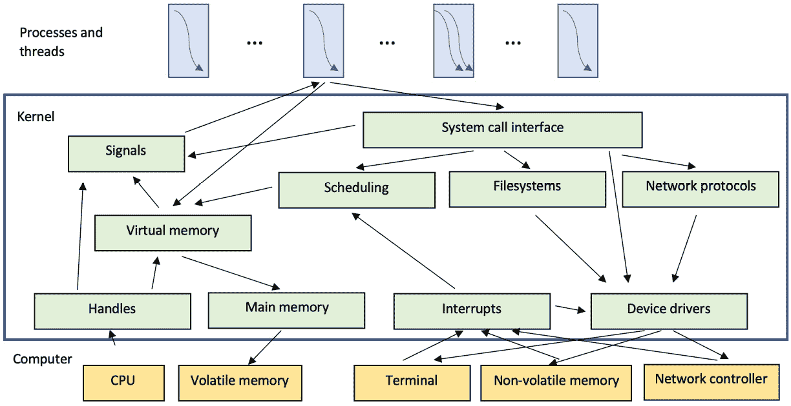
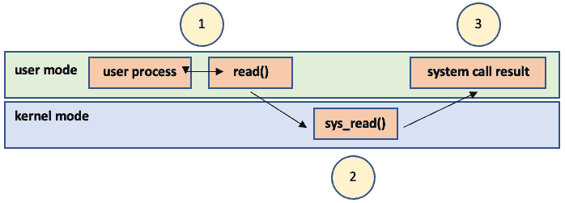
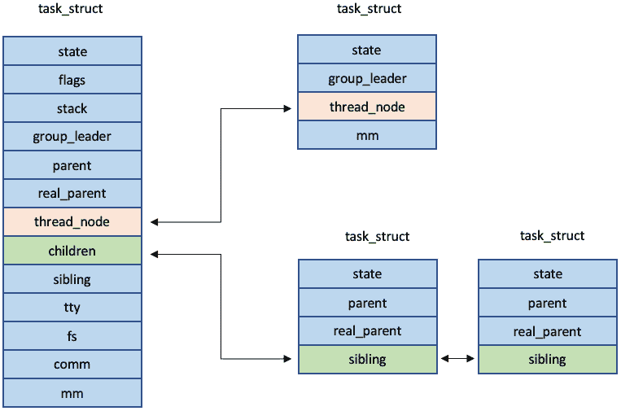
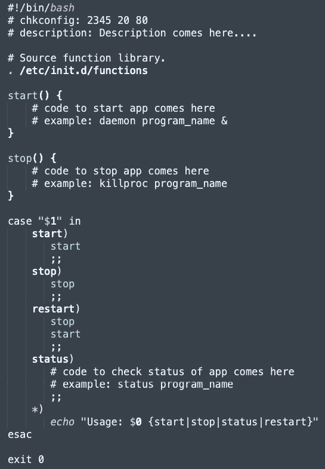

# 第一章：Linux 系统和 POSIX 标准入门

本书是关于 **Linux** 以及我们如何在 **Linux** 环境中使用 **C++** 来管理关键资源。**C++** 语言在不断发展，你将在接下来的章节中了解到这一点。在进入那个话题之前，我们想在本章中花些时间来建立对 **操作系统** （**OSs**）的基本理解。你将了解更多关于某些特定技术的起源，包括 **系统调用接口** 和 **可移植操作系统** **接口** （**POSIX**）。

你选择的操作系统很重要。尽管操作系统最初是为了单一目的而创建的，但如今它们的角色各不相同。人们对它们也有很高的期望。每个操作系统都有其自身的优势和劣势，我们将简要讨论。**Linux** 在多个技术领域得到广泛应用，拥有庞大的全球社区，因此非常适合我们的实际目的。根据我们的经验，在 Linux 或其他基于 *Unix* 的操作系统环境中编程相当普遍。无论你的专长在哪里——从 **物联网** （**IoT**） 设备和嵌入式软件开发到移动设备、超级计算或航天器——你都有很大机会在某个时刻遇到 Linux 发行版。

将本章用作系统编程的入门。即使你对这个主题已经很熟悉，也请花时间回顾一下术语和细节。其中大部分内容都包含在大学课程中，或者被视为常识，但在此处解释一些基本概念仍然很重要，以确保我们在接下来的章节中保持一致。

在本章中，我们将涵盖以下主要内容：

+   熟悉操作系统（OSs）的概念

+   了解 Linux 内核

+   介绍系统调用接口和系统编程

+   在文件、进程和线程中导航

+   使用 `init` 和 `systemd` 运行服务

+   **可移植操作系统** **接口** （**POSIX**）

# 技术要求

为了熟悉编程环境，读者必须准备以下内容：

+   能够编译和执行 C++20 的基于 Linux 的系统（例如，Linux Mint 21）

# 熟悉操作系统（OSs）的概念

那么，什么是操作系统？你可能至少能提供一个答案，但让我们简要讨论一下，因为这很重要，我们需要了解我们的计算机系统真正是什么以及我们如何操作它。尽管你可能熟悉这里提供的大部分信息，但我们使用本章来与你就操作系统及其用途达成一致。有些人可能会说，操作系统是为了使硬件作为一个整体工作而创建的。其他人可能会争论说，它是一系列程序的总和，致力于管理整体系统资源。有效地利用这些资源，如 CPU 和内存，至关重要。还有操作系统作为抽象和硬件扩展的概念。最终，我们可以安全地说，现代操作系统是一个复杂的实体。它还具有其他功能，例如收集统计数据、多媒体处理、系统安全性和安全性、整体稳定性、可靠的错误处理等。

虽然操作系统有义务执行所有这些任务，但程序员仍然需要关注系统的具体要求和细节。从更高的抽象层次工作，例如通过虚拟机，并不意味着可以忽视理解我们的代码如何影响系统行为的需求。而且，更接近操作系统层的程序员需要高效地管理系统的资源。这就是操作系统提供**应用程序编程接口**（APIs）的原因之一。了解如何使用这些 API 以及它们提供的哪些好处是一种宝贵的专业知识。

我们认为，能够与操作系统紧密合作是一种不太常见的技能。了解操作系统和计算机架构的行为属于软件工程的专家级别。我们将讨论一些操作系统类型，只是为了给你一个大致的了解，但本书的重点是专门针对**POSIX 兼容**的操作系统。话虽如此，让我们熟悉一下我们主要的工具集之一。

## 操作系统类型

如果我们在网上进行一些快速研究，我们会发现许多类型的操作系统，类型定义将严格基于搜索的标准。一个例子是操作系统的目的：它是一个通用操作系统，如 macOS 和 Windows，还是更具体，如**嵌入式 Linux**和**FreeRTOS**？另一个例子是针对 PC 的操作系统与针对移动设备的操作系统。同样，许可协议可能将操作系统描述为开源、企业或企业开源。根据同一时间活跃用户数量，Windows 可能被视为**单用户**操作系统，因为它只为当前的**用户会话**构建一个**Win32 API**。另一方面，类 Unix 操作系统被认为是**多用户**的，因为多个用户可以同时在该系统上工作，其中每个**shell**或**终端**实例被视为一个单独的用户会话。

因此，系统的应用及其限制是基本的。因此，需要了解的一个关键区别是系统行为的限制级别。**通用操作系统**（**GPOSs**）最初作为**分时**操作系统开始。从历史上看，还有一种类型的操作系统，与分时操作系统起源于同一时期——**实时操作系统**（**RTOSs**）。预期系统程序员了解**GPOSs**和**RTOSs**的特定内容。在接下来的章节中，我们将讨论诸如任务优先级、计时器值、外围设备速度、中断和信号处理程序、多线程和动态内存分配等属性如何导致系统行为的变化。有时这些变化是不可预测的。这就是为什么我们认识到两种类型的**RTOSs**：硬**RTOSs**和软**RTOSs**。硬**RTOSs**通常与特定的硬件紧密相关。系统开发者熟悉最终设备的要求。任务执行时间可以预先评估和编程，尽管设备的输入仍然被视为异步和不可预测的。因此，本书的重点仍然是**GPOS**编程，附带一些软**RTOS**功能。

让我们这样设定场景：用户以循环方式接收系统资源如此频繁，以至于给人一种用户是唯一依赖这些资源的印象。用户的工作不应被打断，并且操作系统应提供快速响应时间；理论上，程序越小，响应时间越短。我们将在*第二章*中进一步讨论这个问题，因为它并不完全正确。

重要提示

在**GPOS**中，用户是系统功能的主要**驱动器**。操作系统的主要任务是保持与用户和操作的高可用性之间的活跃对话。

在这里，每个任务和对操作系统的每个请求都必须在严格的时间间隔内快速处理。**RTOS**仅在异常情况、错误和不可预测的行为期间期望用户输入。

重要提示

在**RTOS**中，异步工作的设备和额外的外围电子设备是系统功能的主要**驱动器**。操作系统的主要任务仍然是进程管理和任务调度。

正如我们所说的，有两种类型的**RTOS**：*硬 RTOS*和*软 RTOS*。在硬**RTOS**中，实时任务保证能够按时执行。系统的反应截止时间通常预先定义，而*关键任务*数据存储在 ROM 中，因此不能在运行时更新。通常移除虚拟内存等功能。一些现代 CPU 核心提供了所谓的**紧密耦合内存**（**TCM**），在系统启动时，频繁使用的数据和代码行从**非易失性存储器**（**NVM**）加载到其中。系统的行为是*预先脚本化*的。这些操作系统的作用与机器控制相关，其中禁止用户的输入。

一个软**RTOS**（实时操作系统）在任务完成之前为关键任务提供最高优先级，并且不会受到中断。然而，实时任务仍需及时完成，不应无限期地等待。显然，这种类型的操作系统不能用于关键任务：例如工厂机器机器人、车辆等。但它可以用来控制整个系统的行为，因此这种类型的操作系统在多媒体和研究项目中、人工智能、计算机图形学、虚拟现实设备等领域都有应用。由于这些**RTOS**与**GPOS**（通用操作系统）不冲突，它们可以与之集成。它们的功能也可以在某些 Linux 发行版中找到。这种实现的有趣例子是**QNX**。

## 简而言之，Linux

这里有一些误解，让我们简要地澄清一下。Linux 是一个*类 Unix 操作系统*，这意味着它提供了类似于 Unix（有时甚至是相同的）接口——它的功能，尤其是 API，被设计成与 Unix 匹配。但它不是一个*基于 Unix*的操作系统。它们的实现方式并不相同。在 FreeBSD-macOS 关系的理解中存在类似的误解。尽管两者共享大量的代码，但它们的处理方式完全不同，包括它们内核的结构。

在这本书中，我们需要记住这些事实，因为并非所有我们将要使用的功能都存在于所有类 Unix 操作系统上。我们专注于 Linux，并且只要满足每一章的技术要求，我们的示例就能正常工作。

这个决定有几个原因。首先，Linux 是开源的，您可以轻松地检查其内核代码：[`github.com/torvalds/linux`](https://github.com/torvalds/linux)。由于它是用 C 编写的，您应该能够轻松阅读它。尽管 C 不是面向对象的语言，但 Linux 内核遵循了许多**面向对象编程**（**OOP**）范式。操作系统本身由许多独立的设计块组成，称为*模块*。您可以轻松地配置、集成和应用它们，以满足您系统的特定需求。Linux 赋予我们与实时系统（本章后面将描述）一起工作的能力，并执行并行代码执行（在第*第六章*中讨论）。简而言之——Linux 易于适应、扩展和配置；我们可以轻松地利用这一点。但*在哪里*，确切地说？

好吧，我们可以开发接近操作系统的应用程序，甚至可以自己制作一些模块，这些模块可以在运行时加载或卸载。这样的例子包括文件系统或设备驱动程序。我们将在*第二章*中重新探讨这个话题，届时我们将深入探讨*进程*实体。现在，让我们说这些模块基本上看起来像面向对象的设计：它们是可构建和可销毁的；有时，根据内核的需求，通用代码可以概括成一个模块，并且这些模块具有层次依赖性。尽管如此，Linux 内核被认为是*单核*的；例如，它具有复杂的功能，但整个操作系统都在*内核空间*中运行。相比之下，存在*微内核*（如 QNX、MINIX 或 L4），它们构成了运行操作系统的最小必要条件。在这种情况下，额外的功能是通过在内核本身之外工作的模块提供的。这导致了一个略微混乱但总体清晰的 Linux 内核可能性图景。

# 了解 Linux 内核

*图 1.1*展示了 Linux 内核的一个示例。根据您的需求，系统架构可能看起来不同，但您可以看到我们期望在任何给定的 Linux 系统中看到的三个主要层。

这些是*用户空间*（运行中的进程及其线程）、*内核空间*（正在运行的内核本身，通常是一个自己的进程）和*计算机*——这可以是任何类型的计算设备，如 PC、平板电脑、智能手机、超级计算机、物联网设备等等。随着我们在以下章节中逐一解释它们，图中观察到的所有术语都将逐一到位，所以如果你现在不熟悉所有这些术语，请不要担心。



图 1.1 – Linux 内核及其相邻层的概述

在前面的图中，一些相互依赖关系可能已经给您留下了印象。例如，看看*设备驱动程序*、*相应设备*和*中断*是如何相关的。设备驱动程序是*字符设备驱动程序*、*块设备驱动程序*和*网络设备驱动程序*的泛化。注意中断是如何与任务的*调度*相关的。这是一个简单但基本的机制，在驱动程序的实现中被广泛使用。它是操作系统和硬件的初始*通信*和*控制*机制。

只举一个例子：假设您想要从磁盘恢复并读取一个文件（在底层将执行`read()`调用，然后转换为*文件系统*操作。文件系统调用设备驱动程序来查找并检索给定文件描述符背后的内容，该内容与文件系统已知的一个地址相关联。这将在*第三章*中进一步讨论。所需的设备（**NVM**）开始搜索数据块——一个文件。直到操作完成，如果调用进程是一个单线程进程且没有其他事情可做，它将被停止。另一个进程将开始工作，直到设备*找到*并*返回*指向文件地址的指针。然后触发一个中断，这有助于操作系统调用*调度器*。我们的初始进程将使用新加载的数据重新启动，而第二个进程现在将被停止。

这个任务示例展示了您如何仅通过一个微小且微不足道的操作来影响系统的行为——这正是您在第一门编程课程中学到的编程技能。当然，在大多数情况下，不会发生任何坏事。在您的系统生命周期内，许多进程将不断重新安排。这是操作系统的职责，确保这一过程不会出现中断。

但中断是一个重量级的操作，可能会导致不必要的内存访问和无用的应用程序状态转换。我们将在*第二章*中讨论这一点。现在，只需考虑如果系统过载会发生什么——CPU 使用率高达 99%，或者磁盘收到了许多请求但无法及时处理。如果该系统是飞机嵌入式设备的一部分呢？当然，在现实中这种情况非常不可能，因为飞机有严格的技术要求和高质量标准需要满足。但只是为了辩论，考虑一下您如何防止类似情况发生，或者您如何保证在任何用户场景中代码的成功执行。

# 介绍系统调用接口和系统编程

当然，我们刚才看到的例子是简化的，但它给了我们一些关于操作系统需要执行的工作的想法——本质上，它负责管理和提供资源，但同时也保持对其他进程请求的可用性。在现代操作系统中，这是一项繁杂的工作。我们很少能对此有所作为。因此，为了更好地控制和预测系统行为，程序员可能会直接使用操作系统的 API，称为**系统调用接口**。

重要注意事项

NVM 数据请求是一个受益于 `glibc` 的过程，并且不是直接调用的。

换句话说，系统调用定义了程序员通过它来获取所有内核服务的接口。操作系统可以被视为在内核服务和硬件之间的更多中介。除非你喜欢玩硬件引脚和低级平台指令，或者你自己就是模块架构师，否则你应该勇敢地将细节留给操作系统。处理特定的计算机物理接口操作是操作系统的责任。使用正确的系统调用是应用程序的责任。而了解它们对系统整体行为的影响是软件工程师的任务。请记住，使用系统调用是有代价的。

如示例所示，在检索文件时，操作系统会做很多事情。当动态分配内存或单个内存块被多个线程访问时，将做更多的事情。我们将在接下来的章节中进一步讨论这个问题，并将强调尽可能谨慎、有意识地使用系统调用，无论是自愿还是不自愿。简单来说，系统调用不是简单的函数调用，因为它们不在用户空间执行。系统调用不会像你的程序堆栈中的下一个程序一样执行，而是触发一个模式切换，导致跳转到内核内存堆栈中的一个例程。从文件中读取可以可视化如下：



图 1.2 – 从文件中读取的系统调用接口表示

那么我们应该在什么时候使用系统调用呢？简单来说，当我们想要对一些操作系统任务非常精确时，这些任务通常与**设备管理**、**文件管理**、**进程控制**或**通信基础设施**有关。我们将在后面的章节中展示这些角色的许多例子，但简要来说，欢迎您阅读更多内容，并自己熟悉以下内容：

```cpp
syscall()
fork()
exec()
exit()
wait()
kill()
```

重要链接

正确的起点是**Linux man-pages 项目**，链接如下：[`www.kernel.org/doc/man-pages/`](https://www.kernel.org/doc/man-pages/)。

在以下链接中可以找到有用系统调用的一览表：[`man7.org/linux/man-pages/man2/syscalls.2.xhtml`](https://man7.org/linux/man-pages/man2/syscalls.2.xhtml)。

我们强烈建议你对自己的项目中进行更多关于系统调用的研究。有没有，以及它们执行什么任务？在你的实现中有没有替代方案？

你可能已经猜到了，使用**系统调用接口**对系统本身也存在安全风险。如此接近内核和设备控制，为恶意软件渗透你的软件提供了极大的机会。当你的软件影响系统行为时，另一个程序可能会四处嗅探并收集有价值的数据。至少，你应该以这种方式设计你的代码，即使用户界面与关键程序（特别是系统调用）隔离良好。要达到 100%的安全是不可能的，尽管有许多关于安全问题的全面书籍，但确保系统安全本身是一个不断发展的过程。

说到进程，让我们继续下一个主题：Linux 系统的基本实体。

# 在文件、进程和线程之间导航

如果你已经到达这里——做得好！我们将在*第二章*中彻底介绍进程和线程，在*第三章*中介绍文件系统。在此期间，我们将在这里稍作偏离，只是为了通过定义三个重要术语：**文件**、**进程**和**线程**，为你描绘一幅更清晰的画面。你可能已经在前面的内核概述中注意到了其中两个，所以现在我们将简要解释它们，以防你不熟悉它们。

## 文件

简而言之，我们需要文件来表示我们系统上的多种资源。我们编写的程序也是文件。例如，编译后的代码，可执行二进制文件（`.bin`、`.exe`），以及库都是文件（`.o`、`.so`、`.lib`、`.dll`等等）。此外，我们还需要它们用于通信机制和存储管理。你知道 Linux 上可识别哪些类型的文件吗？让我们快速了解一下：

+   **普通或常规文件**：几乎系统上存储数据的所有文件都被视为常规文件：文本、媒体、代码等等。

+   **目录**：用于构建文件系统的层次结构。它们不存储数据，而是存储其他文件的位置。

+   `/dev`目录，代表你所有的硬件设备。

+   **链接**：我们使用这些来允许访问不同位置的另一个文件。实际上，它们是真实文件的替代品，通过它们可以直接访问这些文件。这与 Windows 的快捷方式不同。它们是特定的文件类型，需要应用程序支持它们——首先处理快捷方式元数据，然后指向资源，这样文件就不会一次性被访问。

+   **套接字**：这是进程交换数据的通信端点，包括与其他系统交换数据。

+   **命名管道**：我们使用命名管道在系统上当前运行的两个进程之间交换双向数据。

在*第三章*中，我们将通过一些实际例子来探讨这些内容。你将看到那里每个文件类型的用法，除了套接字，它将在本书后面的部分详细解释。我们现在需要的是一个可以运行的程序。

## 进程和线程

进程是一个*程序的实例*，更确切地说，是一个正在执行的实例。它有自己的地址空间，并且与其他进程保持隔离。这意味着每个进程都有一个范围（通常是虚拟的）地址，操作系统将其分配给它。Linux 将其视为*任务*。它们对普通用户是不可观察的。这正是内核工作的方式。每个任务都通过`task_struct`实体来描述，该实体定义在`include/linux/sched.h`中。系统管理员和系统程序员通过进程表来观察进程，通过每个进程特定的进程标识符——`pid`进行散列。这种方法用于快速查找进程——在终端中使用`ps`命令查看系统上的进程状态，然后输入以下命令以查看单个进程的详细信息：

```cpp
ps -p <required pid>
```

例如，让我们启动一个名为`test`的程序，并让它运行：

```cpp
$ ./test
```

你可以打开一个单独的终端，查看运行进程列表中的`test`，如下所示：

```cpp
$ ps
PID TTY           TIME CMD
...
56693 ttys001    0:00.00 test
```

如果你已经知道了`PID`，那么只需执行以下操作：

```cpp
$ ps –p 56693
56693 ttys001    0:00.00 test
```

通过当前进程属性的副本创建一个新的进程，并将属于一个*进程组*。一个或多个组创建一个*会话*。每个会话都与一个*终端*相关联。组和会话都有*进程领导者*。属性的*克隆*主要用于资源共享。如果两个进程共享相同的虚拟内存空间，它们将被视为单个进程中的两个*线程*来处理和管理，但它们并不像进程那样重量级。那么线程是什么呢？

重要提示

总体来说，我们有四个实体需要关注：首先是可执行文件，因为它是将要执行指令的单位载体。其次是进程——执行这些指令的工作单元。第三——我们需要这些指令作为处理和管理系统资源的工具。第四是线程——由操作系统独立管理的最小指令序列，是进程的一部分。记住，进程和线程的实现对于每个操作系统都是不同的，所以在使用它们之前请做好研究。

从内核的角度来看，进程的主线程是*任务组领导者*，在代码中标识为`group_leader`。所有由组领导者产生的线程都可以通过`thread_node`迭代。实际上，它们存储在一个单链表中，`thread_node`是它的头。产生的线程携带一个指向`group_leader`工具的指针。*进程创建者*的`task_struct`对象就是通过它指向的。你可能已经正确猜到了，它与组领导者的`task_struct`相同。

重要提示

如果一个进程通过`fork()`等创建另一个进程，那么新创建的进程（称为*子进程*）通过`parent`指针了解它们的创建者。它们也通过`sibling`指针了解它们的兄弟姐妹，这是一个指向父进程其他子进程的列表节点。每个父进程通过`children`了解其子进程——这是一个指向列表头部的指针，存储子进程并提供对它们的访问。

如以下图所示，线程不定义任何其他数据结构：



图 1.3 – 通过 task_structs 查看进程和线程的结构

我们已经提到了`fork()`几次，但它是什么？简单地说，它是一个创建进程调用者进程副本的系统函数。它向父进程提供新进程的 ID 并启动子进程的执行。我们将在下一章提供一些代码示例，你可以查看那里以获取更多详细信息。现在，由于我们正在讨论 Linux 环境，我们应该提到一些重要的事情。

在幕后，`fork()`被替换为`clone()`。通过`flags`提供了不同的选项，但如果所有选项都设置为零，`clone()`的行为就像`fork()`。我们建议你在这里了解更多：[`man7.org/linux/man-pages/man2/clone.2.xhtml`](https://man7.org/linux/man-pages/man2/clone.2.xhtml)。

你可能正在问自己为什么这种实现更可取。可以这样想：当内核在进程之间进行切换时，它会检查虚拟内存中当前进程的地址，确切地说是*页目录*。如果它与新执行的进程相同，那么它们共享相同的地址空间。然后，切换只是一个简单的指针跳转指令，通常指向程序的入口点。这意味着可以期待更快的重新调度。小心——进程可能共享相同的地址空间，但不是相同的程序栈。`clone()`负责为每个进程创建不同的栈。

现在进程已经创建，我们必须查看其*运行模式*。请注意，这与*进程状态*不同。

## 基于运行模式的进程类型

一些进程需要用户交互来启动或与之交互。它们被称为*前台进程*。但正如您可能已经发现的，还有一些进程独立于我们的活动或任何其他用户的操作运行。这类进程被称为*后台进程*。除非另有说明，否则默认将终端输入作为程序执行调用或用户命令处理为前台进程。要在一个后台运行进程，只需在您用于启动进程的命令行末尾放置`&`即可。例如，让我们调用已知的`test`，完成后，我们在终端看到以下内容：

```cpp
$ ./test &
[1] 62934
[1]  + done       ./test
```

您可以使用其`pid`轻松地停止它，当调用`kill`命令时：

```cpp
$ ./test &
[1] 63388
$ kill 63388
[1]  + terminated./test
```

正如您所看到的，终止一个进程并让它自行终止是两回事，终止进程可能会导致不可预测的系统行为或无法访问某些资源，例如未关闭的文件或套接字。这个话题将在本书的后面再次讨论。

其他进程是无人照料的。它们被称为*守护进程*，并且始终在后台持续运行。它们预期始终可用。守护进程通常通过系统的启动脚本启动，并在关闭之前运行。它们通常提供系统服务，并且多个用户依赖于它们。因此，启动时的守护进程通常由 ID 为 0 的用户（通常是`root`）启动，并且可能以`root`权限运行。

重要提示

在 Linux 系统中，拥有最高权限的用户被称为 root 用户，或简单地称为 root。这个权限级别允许执行与安全相关的任务。这个角色对系统的完整性有直接影响，因此，直到需要更高的权限级别之前，所有其他用户都必须设置尽可能低的权限级别。

*僵尸进程*是一个已经终止但仍然通过其`pid`被识别的进程。它没有地址空间。僵尸进程会一直存在，直到其父进程运行。这意味着，直到我们退出主进程、关闭系统或重启系统，僵尸进程在`ps`列表中仍然会显示为`<defunct>`：

```cpp
$ ps
  PID TTY           TIME CMD
…
64690 ttys000    0:00.00 <defunct>
```

您也可以通过`top`查看僵尸进程：

```cpp
$ top
t–p - 07:58:26 up 100 days,  2:34, 2 users,  load average: 1.20, 1.12, 1.68
Tasks: 200 total,   1 running, 197 sleeping,   1 stopped,   1 zombie
```

回到后台进程的讨论，还有另一种方法可以执行特定的程序，而无需显式启动后台进程。甚至更好——我们可以管理在系统启动或不同系统事件上运行的此类进程。让我们在下一节中看看这个。

# 使用 init 和 systemd 运行服务

让我们利用这个机会来讨论`init`和`systemd`进程守护进程。还有其他一些，但我们已经决定保持对这两个的关注。第一个是在 Linux 系统上由内核执行的初始进程，其`pid`始终为`1`：

```cpp
$ ps -p 1
PID TTY          TIME CMD
1 ?        04:53:20 systemd
```

它被称为系统上所有进程的父进程，因为它用于初始化、管理和跟踪其他服务和守护进程。Linux 的第一个 `init` 守护进程被称为 `Init`，它定义了六个系统状态。所有系统服务都映射到这些状态。它的脚本用于以预定义的顺序启动进程，这偶尔会被系统程序员使用。使用它的一个可能的原因是减少系统的启动时间。要创建服务或编辑脚本，你可以修改 `/etc/init.d`。由于这是一个目录，我们可以使用 `ls` 命令列出它，并查看所有可以通过 `init` 运行的服务。

这是我们机器上的内容：

```cpp
$ ls /etc/init.d/
acpid
alsa-utils
anacron
...
ufw
unidd
x11-common
```

每个这些脚本都遵循相同的代码模板进行执行和维护：



图 1.4 – init.d 脚本，表示可能的服务操作

你可以自己生成相同的模板，并通过以下命令了解更多关于 `init` 脚本源代码的信息：

```cpp
$ man init-d-script
```

你可以通过以下命令列出可用服务的状态：

```cpp
$ service --status-all
 [ + ]  acpid
 [ - ]  alsa-utils
 [ - ]  anacron
...
 [ + ]  ufw
 [ - ]  uuidd
 [ - ]  x11-common
```

我们可以停止防火墙服务 – `ufw`：

```cpp
$ service ufw stop
```

现在，让我们检查其状态：

```cpp
$ service ufw status
● ufw.service - Uncomplicated firewall
Loaded: loaded (/lib/systemd/system/ufw.service; enabled; vendor preset: enabled)
Active: inactive (dead) since Thu 2023-04-06 14:33:31 EEST; 46s ago
Docs: man:ufw(8)
Process: 404 ExecStart=/lib/ufw/ufw-init start quiet (code=exited, status=0/SUCCESS)
Process: 3679 ExecStop=/lib/ufw/ufw-init stop (code=exited, status=0/SUCCESS)
Main PID: 404 (code=exited, status=0/SUCCESS)
Apr 06 14:33:30 oem-virtual-machine systemd[1]: Stopping Uncomplicated firewall...
Apr 06 14:33:31 oem-virtual-machine ufw-init[3679]: Skip stopping firewall: ufw (not enabled)
Apr 06 14:33:31 oem-virtual-machine systemd[1]: ufw.service: Succeeded.
Apr 06 14:33:31 oem-virtual-machine systemd[1]: Stopped Uncomplicated firewall.
```

现在，让我们再次启动它并再次检查其状态：

```cpp
$ service ufw start
$ service ufw status
● ufw.service - Uncomplicated firewall
Loaded: loaded (/lib/systemd/system/ufw.service; enabled; vendor preset: enabled)
Active: active (exited) since Thu 2023-04-06 14:34:56 EEST; 7s ago
Docs: man:ufw(8)
Process: 3736 ExecStart=/lib/ufw/ufw-init start quiet (code=exited, status=0/SUCCESS)
Main PID: 3736 (code=exited, status=0/SUCCESS)
Apr 06 14:34:56 oem-virtual-machine systemd[1]: Starting Uncomplicated firewall...
Apr 06 14:34:56 oem-virtual-machine systemd[1]: Finished Uncomplicated firewall.
```

以类似的方式，你可以创建自己的服务并使用 `service` 命令来启动它。一个重要的说明是，`init` 在现代的完整规模的 Linux 系统上被认为是一种过时的方法。然而，它可以在每个基于 Unix 的操作系统上找到，与 **systemd** 不同，因此系统程序员会预期它作为服务的一个常见接口。因此，我们更多地将其用作一个简单的示例和解释服务从何而来。如果我们想使用最新的方法，我们必须转向 **systemd**。

`/lib/systemd/system` 或 `/etc/systemd/system` 目录下的 `.service` 文件。在 `/lib` 中找到的服务是系统启动服务的定义，而在 `/etc` 中的是在系统运行期间启动的服务。让我们列出它们：

```cpp
$ ls /lib/systemd/system
accounts-daemon.service
acpid.path
acpid.service
...
sys-kernel-config.mount
sys-kernel-debug.mount
sys-kernel-tracing.mount
syslog.socket
$ ls /etc/systemd/system
bluetooth.target.wants
display-manager.service
…
timers.target.wants
vmtoolsd.service
```

在我们继续示例之前，让我们在这里提出一个免责声明 – `systemd` 的接口比 `init` 复杂得多。我们鼓励你花时间单独检查它，因为我们无法在这里简要总结。但如果你列出你的 `systemd` 目录，你可能会观察到许多类型的文件。在守护进程的上下文中，它们被称为 `units`。每个都提供了不同的接口，因为它们都与 `systemd` 管理的某个实体相关。每个文件中的脚本描述了设置了哪些选项以及给定服务做什么。`units` 的名称是优雅的。`.timer` 用于定时管理，`.service` 用于给定服务的启动方式和依赖关系，`.path` 描述了基于路径的给定服务的激活，等等。

让我们创建一个简单的 `systemd` 服务，其目的是监控一个给定的文件是否被修改。一个例子是监控一些配置：我们不想限制文件更新的权限，但我们仍然想知道是否有人更改了它。

首先，让我们通过一个简单的文本编辑器创建一些虚拟文件。让我们想象它是一个真实的配置。打印出来如下所示：

```cpp
$ cat /etc/test_config/config
test test
```

让我们准备一个脚本，描述当文件更改时需要执行的程序。再次强调，仅为了这个示例，让我们通过一个简单的文本编辑器创建它——它看起来像这样：

```cpp
$ cat ~/sniff_printer.sh
echo "File /etc/test_config/config changed!"
```

当脚本被调用时，将会有一个消息表明文件已更改。当然，你可以在这里放置任何程序。让我们称它为 `sniff_printer`，因为我们通过服务嗅探文件更改，并将打印一些数据。

那么，这是怎么发生的呢？首先，我们通过所需的 `unit` 定义我们的新服务——`myservice_test.service`——实现以下脚本：

```cpp
[Unit]
Description=This service is triggered through a file change
[Service]
Type=oneshot
ExecStart=bash /home/oem/sniff_printer.sh
[Install]
WantedBy=multi-user.target
```

第二，我们描述我们通过另一个名为 `myservice_test.path` 的 `unit` 监控的文件路径，该 `unit` 通过以下代码实现：

```cpp
[Unit]
Description=Path unit for watching for changes in "config"
[Path]
PathModified=/etc/test_config/config
Unit=myservice_test.service
[Install]
WantedBy=multi-user.target
```

将所有这些部分组合在一起，我们得到一个会打印简单消息的服务。它将在提供的文件更新时被触发。让我们看看效果如何。当我们向服务目录添加新文件时，我们必须执行一个重新加载：

```cpp
$ systemctl daemon-reload
```

现在，让我们启用并启动服务：

```cpp
$ systemctl enable myservice_test
$ systemctl start myservice_test
```

我们需要通过一些文本编辑器，如以下内容，更新文件：

```cpp
$ vim /etc/test_config/config
```

为了看到我们触发的影响，我们必须查看服务状态：

```cpp
$ systemctl status myservice_test
● myservice_test.service - This service is for printing the "config".
Loaded: loaded (/etc/systemd/system/myservice_test.service; enabled; vendor preset: enabled)
Active: inactive (dead) since Thu 2023-04-06 15:37:12 EEST; 31s ago
Process: 5340 ExecStart=/bin/bash /home/oem/sniff_printer.sh (code=exited, status=0/SUCCESS)
Main PID: 5340 (code=exited, status=0/SUCCESS)
Apr 06 15:37:12 oem-virtual-machine systemd[1]: Starting This service is for printing the "config"....
Apr 06 15:37:12 oem-virtual-machine bash[5340]: File /etc/test_config/config changed!
Apr 06 15:37:12 oem-virtual-machine systemd[1]: myservice_test.service: Succeeded.
Apr 06 15:37:12 oem-virtual-machine systemd[1]: Finished This service is for printing the "config"..
```

你可以通过我们的消息存在来验证服务已被触发：

```cpp
Apr 06 15:37:12 oem-virtual-machine bash[5340]: File /etc/test_config/config changed!
```

我们还看到了执行过的代码及其成功状态：

```cpp
Process: 5340 ExecStart=/bin/bash /home/oem/sniff_printer.sh (code=exited, status=0/SUCCESS)
Main PID: 5340 (code=exited, status=0/SUCCESS)
```

但由于服务 `unit` 的类型是 `oneshot`，因此进程不再活跃，只有另一个文件更新才能重新触发它。我们相信这个例子提供了一个简单的解释，说明如何在系统运行时创建和启动守护程序。请随意实验，尝试不同的 `unit` 类型或选项。

进程守护程序和启动程序是系统管理、编程、监控和获取执行流程信息的一个大型专业领域。这些主题以及下一节的内容都值得有自己的一本书。

# 可移植操作系统接口 (POSIX)

**POSIX** 标准的主要任务是维护不同操作系统之间的兼容性。因此，POSIX 经常被标准应用程序软件开发者和系统程序员使用。如今，它不仅可以在类 Unix 操作系统上找到，还可以在 Windows 环境中找到——例如，**Cygwin**、**MinGW** 和 **Windows Subsystem for Linux**（**WSL**）。POSIX 定义了系统级和用户级 API，有一点需要注意：使用 POSIX，程序员不需要区分系统调用和库函数。

POSIX API 经常在 C 编程语言中使用。因此，它可以与 C++编译。在系统编程的一些重要领域，为**系统调用接口**提供了额外的功能：**文件操作**、**内存管理**、**进程和线程控制**、**网络和通信**以及**正则表达式**——正如你所见，它几乎涵盖了现有系统调用所做的一切。只是不要混淆，认为这总是这种情况。

与每个标准一样，POSIX 也有多个版本，你必须了解你系统中存在的是哪一个。它也可能是某些环境子系统的一部分，例如 Windows 的**Microsoft POSIX 子系统**。这是一个关键点，因为环境本身可能不会向你完全暴露整个接口。一个可能的原因是系统的安全评估。

随着 POSIX 的发展，代码质量规则已经建立。其中一些与**多线程内存访问**、**同步机制**和**并发执行**、**安全**和**访问限制**以及**类型安全**有关。POSIX 软件要求中的一个著名概念是*一次编写，到处采用*。

该标准定义并针对其应用的四个主要领域，称为卷：

+   **基本定义**：规范的主要定义：语法、概念、术语和服务操作

+   **系统接口**：接口描述和定义的可用性

+   **实用工具**：Shell、命令和实用工具描述

+   **理由**：版本信息和历史数据

如此一来，在这本书中，我们的主要关注点是 POSIX 作为一种不同的系统调用方法。在接下来的章节中，我们将看到使用对象如消息队列、信号量、共享内存或线程的一般模式的益处。一个显著改进是函数调用及其命名约定的简单性。例如，`shm_open()`、`mq_open()`和`sem_open()`分别用于创建和打开共享内存对象、消息队列和信号量。它们的相似性显而易见。POSIX 中的类似思想受到系统程序员的欢迎。API 也是公开的，并且有大量的社区贡献。此外，POSIX 还为诸如互斥锁这样的对象提供了接口，这在 Unix 上并不容易找到和使用。然而，在后面的章节中，我们将建议读者更多地关注 C++20 的特性，这是有充分理由的，所以请耐心等待。

使用 POSIX 允许软件工程师将他们的操作系统相关代码进行泛化，并声明为*非操作系统特定*。这使得软件的重新集成更加容易和快速，从而缩短了上市时间。系统程序员也可以在编写相同类型代码的同时轻松地在不同的系统之间切换。

# 摘要

在本章中，我们介绍了与操作系统相关的基本概念的定义。你学习了 Linux 的主要内核结构和其对软件设计的期望。实时操作系统被简要介绍，我们还涵盖了系统调用、系统调用接口以及 POSIX 的定义。我们还为多进程和多线程奠定了基础。在下一章中，我们将讨论进程作为主要资源的使用者和管理者。我们将从一些 C++20 代码开始。通过这种方式，你将了解 Linux 的进程内存布局、操作系统的进程调度机制以及多进程的运作方式及其带来的挑战。你还将了解一些关于原子操作的有趣事实。
