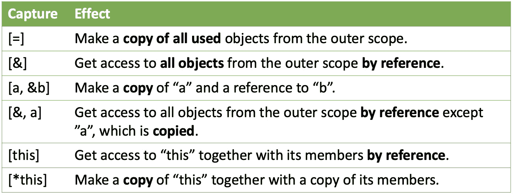

# 第四章：深入探索 C++ 对象

在本章中，我们将特别关注 C++ 语言中的对象。但是什么让 C++ 中的对象如此特别，以至于我们应该如此关注它呢？好吧，考虑到 C++ 支持面向对象编程范式，我们可以假设对象本身在语言结构中占据中心位置。你将看到围绕 C++ 中的对象有很多具体细节。

在本章中，我们将深入研究 C++ 中对象的基本方面。我们将首先检查 C++ 标准如何指定对象的定义。在此基础上，我们将更详细地研究不同类型的对象初始化，例如聚合、直接和复制初始化，以及它们的使用场景。

我们还将探讨对象的存储持续时间概念。此外，我们将查看 C++ 中对象的范围和生存期。我们还将了解引用是什么以及它们如何与对象相关联。

随着我们进一步学习，我们将了解临时对象及其为何需要小心处理的原因，以及 C++ 中函数对象和 lambda 表达式的概念。我们将探讨如何使用 lambda 表达式与 **标准模板库**（**STL**）算法结合的示例，这将帮助我们全面理解如何利用这些强大的功能来创建更高效和优化的代码。

到本章结束时，你将清楚地理解 C++ 中对象的基本概念，并且将熟悉一些你可以用来创建更健壮和高效代码的技术。

在本章中，我们将涵盖以下主题：

+   C++ 对象模型

+   范围、存储持续时间和生存期

+   C++ 中的函数式对象和 lambda 表达式

好的，现在是开始的时候了！

# 技术要求

本章中的所有示例都在以下配置的环境中进行了测试：

+   Linux Mint 21 Cinnamon 版本

+   GCC 12.2 与编译器标志 `-std=c++20`

+   稳定的互联网连接

+   请确保你的环境使用这些版本或更高版本。对于所有示例，你也可以选择使用 [`godbolt.org/`](https://godbolt.org/)。

+   本章中所有的代码示例都可以从 [`github.com/PacktPublishing/C-Programming-for-Linux-Systems/tree/main/Chapter%204`](https://github.com/PacktPublishing/C-Programming-for-Linux-Systems/tree/main/Chapter%204) 下载。

# 理解 C++ 对象模型

C++ 程序涉及创建、操作和销毁各种称为 *对象* 的实体。C++ 中的对象具有多个属性，如 *类型*、*大小*、*存储持续时间*、*生存期*、*对齐要求* 和 *值*。对象的 *名称* 是 *可选的*。

命名对象的生存期受其存储持续时间的限制，如果没有名称，则被视为*临时*对象。然而，C++ 中的并非所有实体都被视为对象。例如，引用就是这样一种非对象。

首先，让我们简要地了解一下术语，因为了解它们很重要，因为这将有助于我们在日常使用 C++ 语言的工作中。

## 声明与定义

在 C++ 中，变量、函数或类的术语*声明*和*定义*经常用来指代变量、函数或类的不同方面。以下是每个术语的含义：

+   **声明**：声明将名称引入程序并指定变量的类型、函数或类，例如以下内容：

    ```cpp
    extern int x;
    void foo(int arg);
    struct Point;
    ```

    在前面的例子中，`x`、`foo` 和 `Point` 都被*声明*但没有定义。变量声明中的 `extern` 关键字表示 `x` 在程序的另一部分被定义。在声明中，不分配内存。

+   **定义**：定义提供了已声明的名称的实际实现。为变量保留内存，为函数分配代码空间，并定义类的布局，例如以下内容：

    ```cpp
    int x;
    void foo(int arg) {
       // function body
    }
    struct Point {
       // struct members and methods
    };
    ```

    在前面的例子中，`x`、`foo` 和 `Point` 都被*定义*。

因此，*声明*引入了一个名称并指定了其类型，而*定义*提供了实际的实现并为对象分配内存。

现在我们已经熟悉了这些术语，让我们深入探讨 C++ 中对象的具体细节。

## 范围、存储持续时间和生存期

C++ 程序中的每个对象或引用都有一个特定的程序区域，在该区域中它是可见和可访问的，有一个特定的生存期，以及它占据的特定类型的内存。让我们更详细地看看它们中的每一个。

### 范围

在 C++ 中，变量、函数或类的作用域指的是程序中实体名称可见并可无限制访问的区域。作用域规则决定了在不同程序部分中哪些标识符是可见和可访问的。标准定义了 C++ 中的几种作用域类型。其中一些如下：

+   **全局**：在函数或类外部声明的变量、函数和类具有全局作用域。它们可以从程序的任何部分访问，例如以下内容：

    ```cpp
    int x = 1; // global variable
    void foo() {
        std::cout << x << std::endl; // access global
          variable
    }
    ```

+   **函数**：在函数内部声明的变量具有函数作用域。它们只能在声明它们的函数内部访问，例如以下内容：

    ```cpp
    void foo() {
        int x = 1; // local variable
        std::cout << x << std::endl; // access local
          variable
    }
    ```

+   `{}`)，具有块作用域。它们只能在声明它们的块内部访问，或者在存在内部块的情况下，例如以下内容：

    ```cpp
    void foo() {
        int x = 2; // local variable with function scope
        {
            int y = 4; // local variable with block scope
        }
    }
    ```

这些是我们使用的 C++ 中的一些作用域。现在，让我们看看在 C++ 中存储持续时间意味着什么。

### 存储持续时间

在 C++ 中，*存储持续时间*指的是对象的生存期，即它在内存中存在的时间。有四种存储持续时间类型：

+   `static` 关键字和函数参数。

+   函数内的 `static` 关键字。

+   使用 `new` 操作符创建，并使用 `delete` 操作符销毁。它们存在于堆上，并且可以被程序的多部分访问。

+   **线程局部**：这些对象在创建线程时创建，在线程终止时销毁。它们类似于具有静态存储期的对象，但它们特定于某个特定的线程。

下面是一个说明不同存储期的类型的例子：

```cpp
#include <iostream>
int global_var = 1; // Static storage duration
void foo() {
    int automatic_var = 2;
    static int static_var = 3;
    int* dynamic_var = new int(4);
    std::cout << "Automatic var: " << automatic_var <<
      '\n';
    std::cout << "Static var: " << static_var << '\n';
    std::cout << "Dynamic var: " << *dynamic_var << '\n';
    delete dynamic_var;
}
int main() {
    foo();
    std::cout << "Global var: " << global_var << '\n';
    return 0;
}
```

在这个例子中，`global_var` 具有静态存储期，因为它是一个全局变量。`automatic_var` 具有自动存储期，因为它是在 `foo` 函数内部声明的。`static_var` 也具有静态存储期，但由于 `static` 关键字的存在，它在 `foo` 函数调用之间保留其值。`dynamic_var` 本身具有自动存储期，但它指向的分配的内存具有动态存储期，因为它是用 `new` 操作符分配的。当 `foo` 返回时，`automatic_var` 会自动销毁，`dynamic_var` 会通过 `delete` 操作符销毁，而 `static_var` 和 `global_var` 则在整个程序的生命周期内持续存在。

### 生命周期

术语 *生命周期* 指的是对象或引用在程序中存在的时间长度。在 C++ 中，每个对象和引用都有一个特定的生命周期。对象的生命周期从为其分配内存并初始化时开始。如果对象的类型具有构造函数，则生命周期从构造函数成功完成时开始。对象的生命周期在调用其析构函数时结束，如果没有析构函数，则在销毁时结束。因此，对象的生命周期等同于或小于其存储的持续时间。同样，引用的生命周期从其初始化完成时开始，最终像标量对象一样结束。

## 对象

每个对象都是由一个定义语句创建的，该语句引入、创建并可选地初始化一个 *变量*。变量是一个 *对象* 或 *引用*，它不是非静态数据成员，并且通过声明引入（对象 - [cppreference.com](http://cppreference.com)）。

让我们定义一个简单的变量并从中创建一个对象：

```cpp
void foo() {
    int x;
}
```

我们定义了一个对象，并且同时从`foo()`函数的栈上实例化了一个整型对象。在 C++中，每个对象在特定的内存区域中占用一定量的内存。由于它位于栈上，这个对象具有自动存储持续时间。在我们的例子中，这意味着对象将在函数开始时创建，并在函数结束时自动销毁。当它被实例化时，它会使用一些内存。这个数量是一个编译时已知的值，可以使用`sizeof`运算符来获取。请注意，某些类型的大小可能会根据程序运行的底层硬件而变化，所以如果您需要确保大小，请始终使用运算符来计算它。这样的例子是基本的`int`类型。标准规定`int`类型的大小不能小于 16 位。对于运行本章示例的 Linux Mint 21 和 GCC 12.2，使用的底层数据模型是 LP64。这意味着`int`是 4 字节，`long`和指针是 8 字节。在下一个示例中，我们将演示前面提到的类型的大小。为了编译和运行此代码，您必须将其传递到一个函数中：

```cpp
int i;
long l;
char* p;
std::cout << "sizeof(int) = " << sizeof(int) << "; sizeof(i) = " << sizeof(i) << '\n';
std::cout << "sizeof(long) = " << sizeof(long) << "; sizeof(l) = " << sizeof(l) << '\n';
std::cout << "sizeof(char*) = " << sizeof(char*) << "; sizeof(p) = " << sizeof(p) << '\n';
```

下面是示例的输出：

```cpp
sizeof(int) = 4; sizeof(i) = 4
sizeof(long) = 8; sizeof(l) = 8
sizeof(char*) = 8; sizeof(p) = 8
```

到目前为止，没有什么令人惊讶的。`int`类型是 4 字节，但指针，无论它指向哪种类型，都是 8 字节。

现在，让我们定义几个结构并检查它们的内存占用：

```cpp
struct Empty {};
struct Padding {
    long test;
    char m;
};
struct Virt {
    virtual char GetChar() const { return ch; }
    char ch;
};
void foo() {
    std::cout << "Empty: " << sizeof(Empty) << '\n';
    std::cout << "Padding: " << sizeof(Padding) << '\n';
    std::cout << "Virt: " << sizeof(Virt) << '\n';
}
```

我们定义了三个结构——`Empty`、`Padding`和`Virt`。正如其名所示，`Empty`结构只是一个没有任何成员的空结构。`Padding`结构包含两个成员——`long`和`char`。正如我们从上一个示例中看到的，在我的测试环境中，`long`是 8 字节，`char`是 1 字节。最后，`Virt`结构只有一个`char`类型的成员和一个虚方法。结构和类方法不是对象本身的一部分。它们位于文本段而不是对象占用的内存中。让我们执行前面的代码并查看结果：

```cpp
Empty: 1
Padding: 16
Virt: 16
```

我们可以看到所有对象都占用内存。即使是空的！这是由标准保证的，因为系统中的任何对象都必须有一个地址，它位于该地址上。如果没有占用任何内存，则无法为其分配地址。因此，程序中的每个对象至少保留 1 字节。

`Padding`结构占用的内存比其成员内存总和还要多。这是因为编译器可以自由地将对象放置在地址上，这样可以减少指令运算，以便更快地访问。因此，如果需要，它们会在类型的大小上添加填充字节。

最后，`Virt` 结构体只包含一个成员，其类型为 `char`。然而，这个结构体占用的内存量与 `Padding` 结构体相同。这是由于 C++ 中实现多态机制的方式所导致的。该结构体包含一个虚拟方法，它通知编译器这个用户定义的类型将被多态地使用。因此，编译器在从该类型实例化的每个对象中注入一个指向表的指针，其中包含类中所有虚拟方法的地址。

由于所有这些示例，我们可以得出结论：一旦对象被实例化，它就会占用内存，而内存的大小可能取决于底层系统和类型的定义。

接下来，我们将熟悉 C++ 中的引用以及它们与语言中的对象有何不同。

## 引用

在上一节中，我们发现我们可以从对象声明一个变量，也可以从引用声明。但就 C++ 而言，*引用* 是什么？根据标准，引用变量是已存在对象或函数的*别名*。这意味着我们可以使用别名来处理对象，而不需要在语法上有差异，而不是处理对象的指针，其语法相当不同。让我们看一下以下示例。为了编译和运行它，你需要从函数中调用它：

```cpp
char c;
char& r_c{c};
char* p_c;
std::cout << "sizeof(char) = " << sizeof(char) << "; sizeof(c) = " << sizeof(c) << '\n';
std::cout << "sizeof(char&) = " << sizeof(char&) << "; sizeof(r_c) = " << sizeof(r_c) << '\n';
std::cout << "sizeof(char*) = " << sizeof(char*) << "; sizeof(p_c) = " << sizeof(p_c) << '\n';
```

在这个例子中，我们声明了三个变量——一个字符、一个字符的引用和一个字符的指针。在处理引用变量时，一个重要的细节是在其声明点，我们必须用它将引用到的对象初始化。从这一刻起，对引用变量的每个操作实际上都是在别名对象上执行的。但别名究竟是什么？它是否像指针一样占用内存？嗯，这是一个灰色地带。标准指出，与对象不同，引用并不总是占用存储。然而，如果需要实现预期的语义，编译器可能会分配存储。因此，你*不能使用* `sizeof` 运算符来获取引用的大小：

```cpp
sizeof(char) = 1; sizeof(c) = 1
sizeof(char&) = 1; sizeof(r_c) = 1
sizeof(char*) = 8; sizeof(p_c) = 8
```

你可以看到，指针的大小与预期相符，而不是引用类型的大小，它与其别名类型的大小相匹配。

## 理解初始化的重要性

*初始化* 是在对象构造期间设置其初始值的过程。在 C++ 中，根据以下内容，存在多种初始化类型：

+   对象所属的存储持续时间

+   对象的定义

了解不同类型的初始化以及它们确切发生的时间，无疑会增强你在编写可预测代码时的信心。

让我们看看 C++ 语言支持的几种不同类型的初始化的例子。这将使初始化发生的时间更加清晰。

### 默认初始化

在下一个例子中，你可以看到一个 *默认初始化*。为了运行和测试这段代码，你必须调用 `foo()` 方法：

```cpp
struct Point {
    double x;
    double y;
};
void foo() {
    long a; // {1}
    Point p1; // {2}
    std::cout << "{1}: " << a << '\n';
    std::cout << "{2}: " << p1.x << ", " << p1.y << '\n';
}
```

在标记 `{1}` 中，我们声明了一个 `long` 类型的栈变量。对象将应用哪种初始化类型主要取决于以下因素：

+   **它占用的存储持续时间**：这意味着不同的初始化策略可能适用，这取决于对象是位于栈上、全局空间中等。

+   `init` 值，我们是如何传递那个 `init` 值的，等等。

在我们的例子中，`long a;` 变量具有自动存储持续时间，这意味着它位于函数的栈上。在其声明中，我们没有指定任何初始化值。对于这样的对象，我们将应用 *默认初始化*。当一个对象被默认初始化时，C++ 编译器将生成调用对象类型默认构造函数的代码（如果存在）。然而，由于 `long` 是一个缺乏默认构造函数的基本 C++ 类型，C++ 运行时 *不会对其进行任何初始化*，结果得到的是一个 *不可预测的值*。这意味着用于初始化的值没有指定，可能是任何值。这也适用于 `Point p1;` 对象，它是一个用户定义的类型，但我们没有为它指定默认构造函数。`Point` 结构是一个所谓的 **原始数据** (**POD**) 类型，因为它与 C 语言的结构的完全兼容。对于这样的类型，编译器将为你生成一个 *平凡的默认构造函数*，当被调用时实际上什么也不做。

早期例子的输出将看起来像这样：

```cpp
{1}: 1
{2}: 4.19164e-318, 4.3211e-320
```

在我的环境中，`a` 和 `p1` 对象都有不确定的值。如果你运行你自己的例子，你可能会得到不同的值。

### 直接初始化

在我们的下一个例子中，我们将学习 C++ 的 *直接初始化*。为了运行和测试这段代码，你必须再次调用 `foo()` 方法。请注意，为了成功编译，这个例子中的 `int c_warn{2.2};` `// {4.2}` 语句应该被注释掉：

```cpp
void foo() {
    int b(1);         // {3.1}
    int b_trunc(1.2); // {3.2}
    int c{2};         // {4.1}
    int c_warn{2.2};  // {4.2}
    std::cout << "{3.1}: " << b << '\n';
    std::cout << "{3.2}: " << b_trunc << '\n';
    std::cout << "{4.1}: " << c << '\n';
}
```

在例子中的第一个语句 `int b(1);`，我们定义了一个 `int` 类型的变量，并且我们显式地用值 `1` 初始化了它。这是我们自 C++ 语言诞生以来所知道的 *直接初始化*。为了调用它，你必须指定括号中的初始化值，并且该值必须与对象的类型的一些转换构造函数相匹配。这些转换构造函数可以是编译器生成的。在我们的例子中，我们使用 `int`，这是一个基本的 C++ 类型，支持使用整数值进行直接初始化。因此，`b` 对象将被初始化为 `1`，到目前为止没有什么新的。

在下一个语句中，我们声明了一个`int b_trunc(1.2);`变量，但这次我们用浮点值`1.2`来初始化它。这个语句运行正常，并声明了一个`int`类型的变量，并用一个值初始化它……`1`！是的，根据 C++标准，它试图尽可能与 C 语言兼容，对于两种语言都存在的特性，值会被*截断*到其尾数部分。在某些情况下，用浮点值初始化整数对象可能是有用的，但在其他情况下，这可能是无意中的错误。在这种情况下，我们期望编译器警告我们我们可能正在做错误的事情。因此，C++11 引入了所谓的*统一初始化*。

在示例中的下一个语句`int c{2};`中，我们再次声明了一个`int`类型的变量，但这次我们用花括号而不是括号来初始化它。这通知编译器调用*直接列表初始化*，这是一种统一初始化。它是一个命名列表初始化，因为它可以用作不同类型值的初始化列表，以初始化复杂对象。

在可能的情况下优先使用统一初始化的一个原因是体现在示例中的下一个语句：

```cpp
int c_warn{2.2};  // {4.2}
```

正如我们刚才看到的，使用直接初始化将一个特定类型的对象用更宽类型的值初始化会导致初始化值被静默截断。在某些情况下，这可能会导致错误。避免这种潜在副作用的一种方法是用统一初始化代替。在我们的例子中，我们定义了一个`int`类型的变量，并且再次用浮点值初始化它。然而，这次编译器不会静默地将`c_warn`初始化为`2`，而是会生成一个类似于下面的错误：

```cpp
error: narrowing conversion of '2.2000000000000002e+0' from 'double' to 'int' [-Wnarrowing]
```

错误产生是因为我们试图在用`double`值初始化`int`变量时执行缩窄转换。因此，使用统一初始化而不是直接初始化更安全，因为它在初始化过程中保护你免受缩窄转换。

### 零和聚合初始化

让我们再看另一个初始化的例子。我们将初始化一个包含`Person`个人数据和几个整数对象的对象：

```cpp
struct Person {
    std::string name;
    int age;
};
void init() {
    int zero1{}; // {1}
    int zero2 = int(); // {2}
    int zero3 = int{}; // {3}
    Person nick{"Nick L.", 42}; // {4}
    Person john{.name{"John M."}, .age{24}}; // {5}
}
```

正如我们之前解释的，具有自动存储持续时间且没有显式初始化的对象会得到随机初始化值。在这个例子中，从标记`{1}`到`{3}`，我们使用*零初始化*来初始化对象，这实际上将它们的值设置为 0。对于非类、内置类型以及没有构造函数的用户定义类型的成员，都会发生零初始化。当你需要将对象零初始化时，最好使用花括号表示法和统一初始化，例如标记`{1}`，而不是复制零初始化，例如标记`{2}`和`{3}`。

语句`{4}`展示了另一种初始化方法，称为*聚合初始化*。它允许我们使用统一初始化符号初始化聚合对象。聚合被认为是指任何数组或没有用户声明的或继承的构造函数的类类型对象；它的所有非静态成员都是公开可见的，并且它没有虚拟基类和虚拟方法。语句`{5}`执行了另一种*聚合初始化*的方式，但使用了*设计符*。设计符明确指定了正在初始化的成员，并且初始化中设计符的顺序应该遵循结构中成员声明的顺序。

### 复制初始化

复制初始化发生在特定类型的对象被同类型的另一个对象初始化时。让我们看看以下触发复制初始化的语法示例。为了运行和测试此代码，你必须调用`foo()`方法：

```cpp
void foo() {
    int c{2};
    int d(c);     // {1}
    int e{d};     // {2}
    int f = e;    // {3}
    int f1 = {d}; // {4}
}
```

此示例中的标记`{1}`和`{3}`展示了即使在 C++11 之前，语言中也存在的知名复制初始化。一个`int`类型的对象被同类型的另一个对象初始化。正如我们之前看到的，这种初始化不会提供任何针对类型缩窄的保护。这意味着我们的`int`对象可以被`double`对象无声地初始化，这会导致缩窄。幸运的是，标记`{2}`和`{4}`的情况并非如此。它们使用统一的复制初始化，这迫使编译器验证初始化对象与被初始化的对象类型相同。

现在，让我们看看用户定义类型的一些复制初始化场景。我们定义了两个类——`Person`和`Employee`。`Person`类有一个用户定义的构造函数，它接收一个指向`std::string`参数的引用，用于初始化人的名字。构造函数被标记为`explicit`。这意味着它只能作为非转换构造函数使用。*转换构造函数*是一种将它的参数类型隐式转换为它的类类型的构造函数。

另一个类`Employee`有两个构造函数，其中一个获取一个`Person`对象的引用，而另一个是复制构造函数。复制构造函数也被标记为`explicit`：

```cpp
class Person {
public:
    explicit Person(const std::string&  the_name) : name{
      the_name} {}
private:
    std::string name;
};
class Employee {
public:
    Employee(const Person& p) : p{p} {}
    explicit Employee(const Employee& e) : p{e.p} {}
private:
    Person p;
};
```

让我们使用这两个类在不同的初始化场景中。为了运行和测试此代码，你必须重新修改并再次调用`foo()`方法：

```cpp
void foo() {
    Person john{"John M."};
    Employee staff1{john};          // {1}
    // Employee staff2{std::string{"George"}};   // {2}
    Employee staff3{staff1};        // {3}
    // Employee staff4 = staff1;    // {4}
    // Employee staff5 = {staff1};  // {5}
}
```

我们首先定义了一个名为`john`的`Person`对象，并在标记 `{1}` 中使用`john`初始化了一个`Employee`对象。这实际上是有效的，因为`Employee`类有一个接受`Person`对象的构造函数。下一个语句，标记 `{2}`，被注释掉了，它接受一个`std::string`类型的对象，但编译器会生成一个错误。这是因为`Employee`类没有接受字符串对象的构造函数。它有一个从`Person`对象转换而来的构造函数。然而，`Person`构造函数被标记为`explicit`，不允许在隐式类型转换中使用，因此编译会失败。

下一个语句，标记 `{3}`，将成功编译，因为`Employee`是通过另一个`Employee`对象复制构造和初始化的，没有进行任何隐式类型转换。

示例中的最后两个语句 – 标记 `{4}` 和 `{5}` – 也被注释掉了，以避免编译错误。编译错误的原因是`Employee`类的复制构造函数也被标记为`explicit`。这意味着不允许使用等号 `"="` 进行复制构造和初始化，对于显式复制构造函数来说，只有直接复制初始化是被允许的。

现在我们已经熟悉了对象的作用域、存储持续时间和生命周期，我们可以看看一些稍微不同类型的对象，它们的行为更像是函数而不是对象 – 函子和 lambda 表达式。

# 函子和 lambda 表达式

本节将深入探讨函数对象 – 它们的定义、有用性和正确使用。我们将从检查一个与 STL 算法一起使用的函数对象示例开始，并讨论潜在问题，如临时对象的创建和悬垂引用。之后，我们将继续探讨 lambda 表达式 – 它是什么，如何使用它们，以及它们在特定情况下可以特别有利的情况。

## 探索函数对象

在*作用域、存储持续时间和生命周期*部分，我们探讨了 C++中各种类型的对象初始化，但我们的重点主要是在表示数据的对象上，例如整数或坐标。在本节中，我们将把注意力转向另一种类型的对象 – 那些被设计为*可调用*的对象，例如函数，但有一个关键的区别：它们可以在不同的函数调用之间保持状态。这些对象被称为*函数对象*或*函子*。我们将首先定义一个函子，然后使用它来计算包含浮点数的向量的平均值：

```cpp
#include <iostream>
#include <vector>
#include <algorithm>
#include <cmath>
#include <source_location>
struct Mean {
    Mean() = default;
    void operator()(const double& val) {
        std::cout <<  std::source_location::current()
          .function_name() << " of " << this << '\n';
        sum += val;
        ++count;
    }
private:
    double sum{};
    int count{};
    friend std::ostream& operator<<(std::ostream& os, const
      Mean& a);
};
std::ostream& operator<<(std::ostream& os, const Mean& a) {
    double mean{std::nan("")};
    if (a.count > 0) {
        mean = a.sum / a.count;
    }
    os << mean;
    return os;
}
int main() {
    Mean calc_mean;
    std::vector v1{1.0, 2.5, 4.0, 5.5};
    std::for_each(v1.begin(), v1.end(), calc_mean);
    std::cout << "The mean value is: " << calc_mean <<
      '\n';
    return 0;
}
```

函子是一个像其他任何对象一样的对象。它有一个类型、存储持续时间和作用域。为了定义一个函子，你必须定义一个用户自定义类型的结构体或类，并且这个类型必须实现了*函数* *调用操作符*：

```cpp
operator()
```

在我们的示例中，我们定义了一个包含两个成员的 `struct Mean`，这两个成员都是零初始化的。第一个成员 `sum` 将用于在函数调用操作符调用期间累积该对象接收到的输入数据，并在不同的调用之间保持它。另一个成员 `count` 将用于计算函数调用操作符的调用次数。

函数调用操作符的定义接受一个 `double` 类型的参数，然后该方法打印其名称并将输入值添加到之前调用中已经累积的值。最后，它增加调用计数器。

函数调用操作符不返回任何类型，并且没有定义为 `const` 方法，因为它会改变 `Mean` 对象的状态。我们还重载了流提取操作符，它将用于将计算出的平均值报告到标准输出。如果没有累积值，则打印 `nan`（“不是一个数字”）：

```cpp
std::ostream& operator<<(std::ostream& os, const Mean& a)
```

请记住，操作符在 `Mean` 结构外部重载，并且它被声明为该结构的 *friend* 方法。这是因为它需要将 `std::ostream` 作为左操作数，将 `Mean` 参数作为右操作数，因此不能实现为成员方法。它被定义为 *friend* 是因为它必须能够访问 `Mean` 结构的 *private* 成员。

为了计算平均值，我们的算法使用 `std::for_each` STL 算法遍历向量中的所有值。`std::for_each` 预期接收一个容器来操作，以及一个函数，该函数将使用容器中的每个元素调用；因此，此函数必须接受一个参数作为输入参数。

在主方法中，我们定义了一个类型为 `Mean calc_mean;` 的对象，该对象将用于计算 `std::vector v1{1.0, 2.5, 4.0, 5.5};` 的平均值。正如您所看到的，我们不需要显式指定 `std::vector` 类的模板参数类型，因为它会根据其初始化列表值的类型自动推导。在我们的例子中，这些是 `double` 类型的值。

重要提示

请注意，自 C++17 以来，基于其初始化的类型，已经支持自动类模板参数推导。

我们期望程序将为向量中的每个元素调用 `Mean` 对象的函数操作符。函数操作符将累积所有值，当结果打印出来时，它将是 `3.25`。让我们看看程序的输出：

```cpp
void Mean::operator()(const double&) of 0x7ffc571a64e0
void Mean::operator()(const double&) of 0x7ffc571a64e0
void Mean::operator()(const double&) of 0x7ffc571a64e0
void Mean::operator()(const double&) of 0x7ffc571a64e0
The mean value is: nan
```

如我们所预期，操作符函数调用为向量中的每个元素调用一次，但令人惊讶的是，没有计算出的平均值。为了更好地理解计算中出了什么问题，我们需要查看 `calc_mean` 对象的情况，该对象已被 `std::for_each` 算法使用。

### 小心临时变量

为了进行调查，在`Mean`结构中，我们需要定义`copy`和`move`构造函数、移动操作符和一个析构函数，它们的唯一目标将是打印它们是否被调用以及它们所属的对象的地址。我们还需要添加计算开始和结束时的时间标记。让我们看看修改后的示例：

```cpp
struct Mean {
    Mean() noexcept {
        std::cout <<  std::source_location::current()
         .function_name() << " of " << this << '\n';
    }
    Mean(Mean&& a) noexcept : sum{a.sum}, count{a.count} {
        std::cout <<  std::source_location::current()
          .function_name() << " from: " << &a << " to: " <<
             this << '\n';
        a.sum = 0;
        a.count = -1;
    }
    Mean& operator=(Mean&& a) noexcept {
        std::cout <<  std::source_location::current()
          .function_name() << " from: " << &a << " to: " <<
            this << '\n';
        sum = a.sum;
        count = a.count;
        return *this;
    }
    Mean(const Mean& a) noexcept : sum{a.sum},
      count{a.count} {
        std::cout <<  std::source_location::current()
          .function_name() << " from: " << &a << " to: " <<
            this << '\n';
    }
    ~Mean() noexcept {
        std::cout <<  std::source_location::current()
          .function_name() << " of " << this << '\n';
    }
    void operator()(const double& val) {
        std::cout <<  std::source_location::current()
          .function_name() << " of " << this << '\n';
        sum += val;
        ++count;
    }
private:
    double sum{};
    int count{};
    friend std::ostream& operator<<(std::ostream& os, const
      Mean& a);
};
```

我们还需要稍微修改`main()`方法的实现：

```cpp
int main() {
    Mean calc_mean;
    std::vector v1{1.0, 2.5, 4.0, 5.5};
    std::cout << "Start calculation\n";
    std::for_each(v1.begin(), v1.end(), calc_mean);
    std::cout << "Finish calculation\n";
    std::cout << "The mean value is: " << calc_mean <<
      '\n';
    return 0;
}
```

当我们重新执行已经修改过的程序时，我们得到以下输出：

```cpp
Mean::Mean() of 0x7ffef7956c50
Start calculation
Mean::Mean(const Mean&) from: 0x7ffef7956c50 to: 0x7ffef7956ca0
void Mean::operator()(const double&) of 0x7ffef7956ca0
void Mean::operator()(const double&) of 0x7ffef7956ca0
void Mean::operator()(const double&) of 0x7ffef7956ca0
void Mean::operator()(const double&) of 0x7ffef7956ca0
Mean::Mean(Mean&&) from: 0x7ffef7956ca0 to: 0x7ffef7956c90
Mean::~Mean() of 0x7ffef7956c90
Mean::~Mean() of 0x7ffef7956ca0
Finish calculation
The mean value is: nan
Mean::~Mean() of 0x7ffef7956c50
```

如我们所预期，程序从创建地址为`0x7ffef7956c50`的对象开始，然后开始计算，我们可以看到调用了复制构造函数。这是因为`std::for_each`，就像标准库中的许多其他算法一样，是一个模板方法，它通过值获取其函数对象。以下是标准关于其原型的说明：

```cpp
template< class InputIt, class UnaryFunction >
constexpr UnaryFunction for_each( InputIt first, InputIt
  last, UnaryFunction f );
```

这意味着无论它执行什么计算，所有累积的值都将存储在复制的对象中，而不是原始对象中。实际上，由这个复制构造函数创建的对象只是一个*临时对象*。临时对象是没有名称的对象，它们由编译器自动创建和销毁。它们经常导致开发者难以识别的副作用。临时对象通常是在参数和函数返回值的隐式转换的结果中创建的。如果它们没有绑定到某个命名引用，它们通常具有有限的生存期，直到它们被创建的语句结束。因此，要小心它们，因为它们可能会影响程序的性能，但更重要的是，它们可能导致意外的行为，就像我们的例子中那样。

从前面的代码中，我们可以看到所有的累积都是在新创建的临时对象中完成的。一旦`std::for_each`方法完成执行，就会调用一个新的临时对象的移动构造函数。这是因为根据`std::for_each`的定义，通过值传递的输入函数对象作为操作的结果返回。因此，如果我们需要将累积的值返回到原始对象，我们需要将`std::for_each`的返回值赋给原始对象`calc_mean`：

```cpp
calc_mean = std::for_each(v1.begin(), v1.end(), calc_mean);
```

最后，结果是我们所预期的，但代价是创建了几个临时对象：

```cpp
Finish calculation
The mean value is: 3.25
```

在我们的例子中，这并不是问题，但对于涉及昂贵且可能缓慢的操作的复杂对象，例如资源获取，这可能会成为问题。

接下来，让我们看看我们如何通过避免不必要的复制操作来改进我们的示例。

### 通过引用传递

改进早期示例的一种方法是将函数对象不是通过值而是通过引用传递。这将避免创建不必要的临时对象：

```cpp
using VecCIter = std::vector<double>::const_iterator;
std::for_each<VecCIter, Mean&>(v1.begin(), v1.end(),
  calc_mean);
```

为了通过引用传递`Mean`对象，你必须显式地告诉编译器`Mean`模板参数是引用类型。否则，自动模板参数推导将推导出你是通过值传递。结果，这迫使你避免使用自动类模板参数推导，使得你的代码更难阅读。幸运的是，标准为此提供了一个解决方案：

```cpp
std::for_each(v1.begin(), v1.end(), std::ref(calc_mean));
```

我们需要使用工厂方法，`std::ref`，来创建`std::reference_wrapper`对象。`std::reference_wrapper`是一个模板类，它将一个引用封装在一个可赋值、可复制的对象中。它通常用于存储标准容器中通常无法容纳的引用。在我们的例子中，`std::ref`的使用消除了显式指定`std::for_each`的函数模板参数是引用类型而不是值的必要性。以下是我们的重构结果：

```cpp
Mean::Mean() of 0x7ffe7415a180
Start calculation
void Mean::operator()(const double&) of 0x7ffe7415a180
void Mean::operator()(const double&) of 0x7ffe7415a180
void Mean::operator()(const double&) of 0x7ffe7415a180
void Mean::operator()(const double&) of 0x7ffe7415a180
Finish calculation
The mean value is: 3.25
Mean::~Mean() of 0x7ffe7415a180
```

如你所见，没有额外的临时对象的创建和销毁，因为算法直接与`calc_mean`对象的引用一起工作。

小心悬垂引用

总是要确保你传递的程序中的引用将指向活动对象，直到它们被使用！

函数对象只是我们可以在例子中使用的一个选项。这里还有另一种方法可以使我们的代码更具表现力。这些是 lambda 表达式。让我们看看它们。

## Lambda 表达式

在 C++中，*lambda 表达式*或简称为*lambda*，是一种简洁的方式来定义一个*匿名函数*或*函数对象*，它可以立即使用或赋值给变量以供以后使用。它允许程序员在不定义命名函数或`functor`类的情况下，即时编写小型、一次性函数。Lambdas 通常与标准库中的算法和容器一起使用，从而允许编写更简洁、更具表现力的代码。

让我们定义一个简单的 lambda，它只是打印到标准输出：

```cpp
auto min_lambda = [](const auto& name) -> void {
    std::cout << name << " lambda.\n";
};
min_lambda("Simple");
```

每个 lambda 表达式都是一个*对象*，这意味着它有一个生命周期并占用内存。每个定义的 lambda 实际上是一个隐式 functor 类定义，因此它有一个*唯一类型*。一个程序中不能有两个或更多具有相同*类型*的 lambda。这个*类型*名称是平台特定的，因此，如果你需要将 lambda 赋值给变量，你必须使用`auto`指定符定义这个变量。

Lambda 的语法由`[ ]`符号组成，其后跟一个可选的捕获列表、一个可选的参数列表、一个可选的返回类型、一个可选的*mutable*指定符和一个函数体。Lambdas 可以通过值或引用从外部作用域捕获变量，并且它们还可以有返回类型推导或显式返回类型，我们将在下面看到。

### 捕获外部作用域

Lambda 可以通过使用 *捕获列表* 来访问它们定义的作用域中的其他对象。如果捕获列表为空，则不会捕获任何对象。全局对象在 lambda 中始终可见，无需显式捕获。在定义捕获列表时，你可以选择通过 *值* 或通过 *引用* 来捕获对象，甚至两者混合使用。

在 lambda 表达式中通过值捕获变量时，变量会在其 *定义时刻* 被复制到 lambda 对象中。在 lambda 定义之后对原始变量所做的任何修改都不会影响其内部的副本。默认情况下，所有捕获的对象都是 *只读的*，要修改它们，你必须显式指定 lambda 为 *可变的*。

另一种捕获变量的方法是通过引用，这会在 lambda 内部创建每个捕获对象的引用。这允许 lambda 与外部作用域进行通信，但确保所有通过引用捕获的对象的生存期都超过 lambda 的生存期，以防止 *悬垂引用*。

现在，让我们重构上一节中的示例，使用 lambda 而不是泛型来计算包含浮点数的向量的平均值。为了运行以下代码，你必须从你的程序中调用 `foo()` 方法：

```cpp
void foo() {
    double mean{};
    std::vector v1{1.0, 2.5, 4.0, 5.5};
    std::string_view text{"calculating ..."};
    std::for_each(v1.begin(), v1.end(),
                  &mean, sum{0.0}, count{0}, text mutable {
        std::cout << text << '\n';
        sum += val;
        ++count;
        mean = sum / count;
    });
    std::cout << mean << '\n';
}
```

与命名函数和泛型相比，lambda 表达式的一个关键优势是它们可以被内联到它们的调用位置。在我们的例子中，我们直接在 `std::for_each` 调用语句中定义了 lambda。这种方法明确指出，这个 lambda 存在的唯一原因就是为前面的情况提供服务。

让我们更仔细地看看 lambda 原型：

```cpp
&mean, sum{0.0}, count{0}, text
  mutable { … }
```

在捕获列表中，我们捕获了四个对象。第一个对象，`mean`，是通过引用捕获的。在变量名前放置 `&` 指定它是通过引用捕获的。我们将使用 `mean` 在 lambda 外部报告计算出的平均值。捕获列表中的下一个两个变量，`sum` 和 `count`，是通过值捕获的。如果 `&` 不在变量名前，则表示它是通过值捕获的。这个规则的唯一例外是在捕获类的 `this` 指针时，它将通过值捕获，但访问类成员将通过引用。正如你所看到的，捕获的 `sum` 和 `count` 并不在外部作用域中定义；它们只在 lambda 的作用域内定义，目的是为了我们的示例。就像函数对象示例一样，它们被用来存储累积的总和和迭代的计数。这是一种将状态显式添加到 lambda 中以供进一步计算使用的便捷方式。当然，你需要通过向捕获传递初始化器来初始化它们，原因有两个——为了允许编译器推断它们的类型，并在计算中获得预期的结果。实现逻辑将在其执行过程中更新 `sum` 和 `count` 的值，但如前所述，这些捕获在 lambda 的上下文中是只读的。因此，我们不能在不明确声明我们的意图的情况下修改它们。这是通过在参数列表之后和 lambda 体之前附加 `mutable` 关键字来完成的。

最后捕获的对象是 `text`。它也是通过值捕获的，但这次它是从 `foo()` 方法的外部作用域中捕获的。

一旦程序执行完毕，我们将得到以下输出：

```cpp
calculating ...
calculating ...
calculating ...
calculating ...
3.25
```

正如我们所预期的，我们的 lambda 被调用了四次，计算出的平均值与上一节中函数对象计算出的值完全相同。

在捕获列表中捕获对象有许多方法。以下列表显示了一些适用的规则：



图 4.1 – 在捕获列表中捕获对象的方法

现在我们已经知道了如何正确捕获外部作用域，让我们熟悉一下 lambda 的参数列表。

### 参数列表

Lambda 的参数列表就像任何其他函数参数列表一样。这是因为 lambda 的参数列表实际上是函数调用操作符在函数对象类中的参数列表。你可以定义你的 lambda 接受任意数量的参数，具体取决于你的用例。

使用 `auto` 指示符作为 lambda 参数列表中一个或多个参数的类型，使其成为一个 *泛型 lambda*。泛型 lambda 行为类似于模板函数调用操作符：

```cpp
auto sum = [](auto a, auto b) {
    return a*b;
}
```

这实际上作用如下：

```cpp
class platform_specific_name {
public:
    template<typename T1, typename T2>
    auto operator()(T1 a, T2 b) const {
        return a*b;
    }
};
```

随着 C++20 的发布，如果你愿意，你可以显式指定 lambda 可以获取的模板参数。前面的例子可以重写如下：

```cpp
auto sum = []<typename T1, typename T2>(T1 a, T2 b) {
    return a*b;
}
```

lambda 的另一个重要特性是返回类型。让我们看看它的具体细节。

### 返回类型

指定 lambda 的返回类型是**可选的**。如果你没有显式指定它，编译器会尝试为你推断它。如果它没有成功，那么将生成一个类型推断的编译器错误。然后，你必须要么更改你的代码以允许自动返回类型推断，要么显式指定 lambda 的返回类型。

这里是一个关于返回类型推断的编译器错误：

```cpp
auto div = [](double x, double y) {
    if (y < 0) { return 0; }
    return x / y;
};
```

这段代码无法编译，因为编译器将无法自动推断 lambda 的返回类型。它的实现逻辑有两个执行分支。第一个分支返回一个整型字面量，`0`，但另一个分支返回除法的结果，即商，它是一个双精度浮点数。

为了修复这个问题，我们需要显式指定 lambda 的返回类型为 `double`。

这里是一个显式指定的返回类型：

```cpp
auto div = [](double x, double y) -> double {
    if (y < 0) { return 0; }
    return x / y;
};
```

现在，对于编译器来说，很清楚返回结果总是被转换为 `double`。

# 摘要

在本章中，我们探讨了 C++ 中对象的各种方面，包括存储持续时间、作用域和生命周期。我们区分了对象和引用，并讨论了初始化对象的不同方式以及这些初始化何时发生。此外，我们还深入了解了函数对象的世界，了解了它们是什么以及如何有效地使用它们。基于这些知识，我们还学习了 lambda 表达式及其相对于函数对象的优点。我们介绍了如何正确使用 lambda 和函数对象与 STL 算法。掌握了这些关于对象特性的知识后，我们接下来可以讨论 C++ 中的错误处理。
