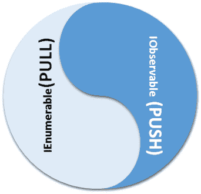

# 第一章：反应式编程模型-概述和历史

X Windows 系统、Microsoft Windows 和 IBM OS/2 Presentation Manager 使得 GUI 编程在 PC 平台上变得流行。这是从字符模式用户界面和批处理式编程模型到他们之前存在的重大转变。对事件的响应成为全球软件开发人员的主要关注点，平台供应商转而创建了基于低级 C 的 API，依赖于函数指针和回调来使程序员能够处理事件。编程模型大多基于合作式多线程模型，并随着更好的微处理器的出现，大多数平台开始支持抢占式多线程。处理事件（和其他异步任务）变得更加复杂，以传统方式响应事件变得不太可扩展。尽管出现了出色的基于 C++的 GUI 工具包，事件处理大多是使用消息 ID、函数指针分发和其他低级技术来完成的。甚至一家知名的编译器供应商尝试添加 C++语言的语言扩展来实现更好的 Windows 编程。处理事件、异步性和相关问题需要重新审视问题。幸运的是，现代 C++标准支持函数式编程、语言级并发（带有内存模型）和更好的内存管理技术，使程序员能够处理异步数据流（将事件视为流）的编程模型称为反应式编程。为了让事情更清晰，本章将概述以下主题：

+   事件驱动编程模型及其在各种平台上的实现。

+   什么是反应式编程？

+   反应式编程的不同模型。

+   一些简单的程序以更好地理解概念。

+   我们书的理念。

# 事件驱动编程模型

事件驱动编程是一种编程模型，其中流程控制由事件决定。事件的例子包括鼠标点击、按键、手势、传感器数据、来自其他程序的消息等等。事件驱动应用程序具有在几乎实时基础上检测事件并通过调用适当的事件处理过程来响应或反应的机制。由于早期的事件处理程序大多使用 C/C++编写，它们采用低级技术，如回调（使用函数指针）来编写这些事件处理程序。后来的系统，如 Visual Basic、Delphi 和其他快速应用程序开发工具确实增加了对事件驱动编程的本地支持。为了更清楚地阐明问题，我们将介绍各种平台的事件处理机制。这将帮助读者理解反应式编程模型解决的问题（从 GUI 编程的角度）。

反应式编程将数据视为流和窗口系统中的事件可以被视为流以便以统一的方式进行处理。反应式编程模型支持从不同来源收集事件作为流，过滤流，转换流，对流执行操作等。编程模型处理异步性，调度细节作为框架的一部分。本章主要基于反应式编程模型的关键数据结构以及我们如何实现基本的反应式程序。在工业强度的反应式程序中，编写的代码将是异步的，而本章的示例是同步的。在讨论乱序执行和调度之前，我们在接下来的章节中提供必要的背景信息和语言构造。这些实现是为了阐明问题，并可以作为学习示例。

# X Windows 上的事件驱动编程

X Windows 编程模型是一个跨平台 API，在 POSIX 系统上得到了广泛支持，甚至已经移植到了 Microsoft Windows。事实上，X 是一个网络窗口协议，需要一个窗口管理器来管理窗口堆栈。屏幕内容由 X 服务器管理，客户端库将内容拉取并在本地机器上显示。在桌面环境中，服务器在同一台机器上本地运行。以下程序将帮助读者了解 XLib 编程模型的要点以及平台上如何处理事件：

```cpp
#include <X11/Xlib.h>
#include <stdio.h>
#include <stdlib.h>
#include <string.h>

int main(void)
{
    Display *display;
    Window window;
    XEvent event;
    char *msg = "Hello, World!";
    int s;
```

前面的代码片段包括了程序员应该包含的正确的头文件，以获取 XLib C 库提供的函数原型。在从头开始编写 XLib 程序时，程序员应该了解一些数据结构。如今，人们使用诸如 Qt、WxWidgets、Gtk+、Fox toolkit 等库来编写商业质量的 X 程序。

```cpp
    /* open connection with the server */
    display = XOpenDisplay(NULL);
    if (display == NULL){
        fprintf(stderr, "Cannot open display\n");
        exit(1);
    }
    s = DefaultScreen(display);
    /* create window */
    window = XCreateSimpleWindow(display,
             RootWindow(display, s), 10, 10, 200, 200, 1,
             BlackPixel(display, s), WhitePixel(display, s));

    /* select kind of events we are interested in */
    XSelectInput(display, window, ExposureMask | KeyPressMask);

    /* map (show) the window */
    XMapWindow(display, window);
```

前面的代码片段初始化了服务器并根据特定规格创建了一个窗口。传统上，大多数 X Windows 程序在管理级窗口下运行。我们通过在显示窗口之前调用`XSelectInput` API 来选择我们感兴趣的消息：

```cpp
    /* event loop */
    for (;;)
    {
        XNextEvent(display, &event);

        /* draw or redraw the window */
        if (event.type == Expose)
        {
            XFillRectangle(display, window,
                DefaultGC(display, s), 20, 20, 10, 10);
            XDrawString(display, window,
                DefaultGC(display, s), 50, 50, msg, strlen(msg));
        }
        /* exit on key press */
        if (event.type == KeyPress)
        break;
    }
```

然后，程序进入一个无限循环，同时轮询任何事件，并使用适当的 Xlib API 在窗口上绘制字符串。在窗口术语中，这被称为**消息**循环。事件的检索将通过`XNextEvent` API 调用来完成：

```cpp
    /* close connection to server */
    XCloseDisplay(display);

    return 0;
    }
```

一旦我们退出无限消息循环，与服务器的连接将被关闭。

# 微软 Windows 上的事件驱动编程

微软公司创建了一个 GUI 编程模型，可以被认为是世界上最成功的窗口系统。Windows 软件的第三版（1990 年）取得了巨大成功，随后微软推出了 Windows NT 和 Windows 95/98/ME 系列。让我们来看看微软 Windows 的事件驱动编程模型（请参阅微软文档，详细了解这个编程模型的工作原理）。以下程序将帮助我们了解使用 C/C++编写 Windows 编程所涉及的要点：

```cpp
#include <windows.h>
//----- Prtotype for the Event Handler Function
LRESULT CALLBACK WndProc(HWND hWnd, UINT message,
                         WPARAM wParam, LPARAM lParam);
//--------------- Entry point for a Idiomatic Windows API function
int WINAPI WinMain(HINSTANCE hInstance,
              HINSTANCE hPrevInstance, LPSTR lpCmdLine, int nCmdShow)
{

MSG msg = {0};
WNDCLASS wc = {0};
wc.lpfnWndProc = WndProc;
wc.hInstance = hInstance;
wc.hbrBackground = (HBRUSH)(COLOR_BACKGROUND);
wc.lpszClassName = "minwindowsapp";
if( !RegisterClass(&wc) )
  return 1;
```

前面的代码片段初始化了一个名为`WNDCLASS`（或现代系统上的`WNDCLASSEX`）的结构，并提供了一个窗口的必要模板。结构中最重要的字段是`lpfnWndProc`，它是响应此窗口实例中事件的函数的地址：

```cpp
if( !CreateWindow(wc.lpszClassName,
                  "Minimal Windows Application",
                  WS_OVERLAPPEDWINDOW|WS_VISIBLE,
                  0,0,640,480,0,0,hInstance,NULL))
    return 2;
```

我们将调用`CreateWindow`（或现代系统上的`CreateWindowEx`）API 调用，根据`WNDCLASS.lpszClassname`参数中提供的类名创建一个窗口：

```cpp
    while( GetMessage( &msg, NULL, 0, 0 ) > 0 )
        DispatchMessage( &msg );
    return 0;
}
```

前面的代码片段进入了一个无限循环，消息将从消息队列中检索，直到我们收到一个`WM_QUIT`消息。`WM_QUIT`消息将使我们退出无限循环。有时在调用`DispatchMessage` API 之前会对消息进行翻译。`DispatchMessage`调用窗口回调过程（`lpfnWndProc`）：

```cpp
LRESULT CALLBACK WndProc(HWND hWnd, UINT message,
                         WPARAM wParam, LPARAM lParam) {
switch(message){
  case WM_CLOSE:
    PostQuitMessage(0);break;
  default:
    return DefWindowProc(hWnd, message, wParam, lParam);
}
return 0;
}
```

前面的代码片段是一个最简化的`callback`函数。您可以查阅微软文档，了解 Windows API 编程以及这些程序中如何处理事件

# Qt 下的事件驱动编程

Qt 框架是一个工业级、跨平台和多平台的 GUI 工具包，可在 Windows、GNU Linux、macOS X 和其他 Mac 系统上运行。该工具包已经编译到嵌入式系统和移动设备中。C++编程模型利用了称为**元对象编译器**（**MOC**）的东西，它将浏览指令的源代码（源代码中嵌入的一堆宏和语言扩展）并生成适当的附加源代码以生成事件处理程序。因此，在 C++编译器获取源代码之前，必须运行 MOC pass 以通过删除那些特定于 Qt 系统的额外语言构造生成合法的 ANSI C++。请参阅 Qt 文档以了解更多信息。以下简单的 Qt 程序将演示 Qt 编程及其事件处理系统的关键方面：

```cpp
#include <qapplication.h>
#include <qdialog.h>
#include <qmessagebox.h>
#include <qobject.h>
#include <qpushbutton.h>

class MyApp : public QDialog {
  Q_OBJECT
public:
    MyApp(QObject* /*parent*/ = 0):
    button(this)
    {
      button.setText("Hello world!"); button.resize(100, 30);

      // When the button is clicked, run button_clicked
      connect(&button,
              &QPushButton::clicked, this, &MyApp::button_clicked);
    }
```

宏`Q_OBJECT`是指示 MOC 生成`事件分发`表的指令。当我们将事件源连接到事件接收器时，将向`事件分发`表中添加一个条目。生成的代码将与 C++代码一起编译以生成可执行文件：

```cpp
public slots:
    void button_clicked() {
      QMessageBox box;
      box.setWindowTitle("Howdy");
      box.setText("You clicked the button");
      box.show();
      box.exec();
    }

protected:
  QPushButton button;
};
```

语言扩展*public slots*将被 MOC 剥离（在完成源代码生成的工作后）以与 ANSI C/C++编译器兼容的形式：

```cpp
int main(int argc, char** argv) {
  QApplication app(argc, argv);
  MyApp myapp;
  myapp.show();
  return app.exec();
}
```

前面的代码片段初始化了 Qt 应用程序对象并显示了主窗口。在实际应用中，Qt 是 C++语言最重要的应用程序开发框架，它还与 Python 编程语言有很好的绑定。

# MFC 下的事件驱动编程

Microsoft Foundation 类库仍然是编写基于 Microsoft Windows 的桌面程序的流行库。如果我们将**ActiveX 模板库**（**ATL**）与之混合使用，它确实对 Web 编程提供了一些支持。作为一个 C++库，MFC 使用一种称为消息映射的机制来处理事件。每个 MFC 程序都有一些给定的宏作为样本事件处理表：

```cpp
BEGIN_MESSAGE_MAP(CClockFrame,CFrameWnd)
    ON_WM_CREATE()
    ON_WM_PAINT()
    ON_WM_TIMER()
END_MESSAGE_MAP()
```

前面的消息映射将响应`OnCreate`、`OnPaint`和`Ontimer`标准 Windows API 消息。深入了解这些消息映射，它们实际上就是数组，我们将使用`消息 ID`作为索引来分派事件。仔细检查后，它与标准的 Windows API 消息模型并没有太大的不同。

这里没有给出代码清单，因为我们全局上使用了 MFC 来实现响应式编程模型的一个关键接口的 GUI。该实现基于 MFC 库，读者可以通过注释清单来理解 MFC 中的非平凡事件处理。

# 其他基于事件驱动的编程模型

诸如 COM+和 CORBA 之类的分布式对象处理框架确实有自己的事件处理框架。COM+事件模型基于连接点的概念（由`IConnectionPointContainer`/`IConnectionPoint`接口建模），而 CORBA 确实有自己的事件服务模型。CORBA 标准提供了基于拉取和推送的事件通知。COM+和 CORBA 超出了本书的范围，读者应该查阅各自的文档。

# 经典事件处理模型的限制

进行事件处理的整个目的是为了正确地看待事物。这些平台中的事件响应逻辑大多与编写代码的平台耦合在一起。随着多核编程的出现，编写低级多线程代码变得困难，而使用 C++编程语言可以使用声明式任务模型。但是，事件源大多在 C++标准之外！C++语言没有标准的 GUI 编程库，也没有访问外部设备的接口标准等。有什么办法？幸运的是，外部数据和事件可以聚合成流（或序列），并且通过使用 Lambda 函数等函数式编程构造可以被高效地处理。额外的好处是，如果我们对变量和流的可变性以及并发性方面进行一些限制，那么并发性和并行性就内置到流处理模型中了。

# 响应式编程模型

简而言之，响应式编程就是使用异步数据流进行编程。通过对流应用各种操作，我们可以实现不同的计算目标。响应式程序的主要任务是将数据转换为流，而不管数据的来源是什么。在编写现代图形用户界面应用程序时，我们处理鼠标移动和点击事件。目前，大多数系统都会得到回调，并在事件发生时处理这些事件。大部分时间，处理程序在调用与事件调用相关的动作方法之前会进行一系列的过滤操作。在这种特定的上下文中，响应式编程帮助我们将鼠标移动和点击事件聚合到一个集合中，并在通知处理程序逻辑之前对它们进行过滤。这样，应用程序/处理程序逻辑就不会被不必要地执行。

流处理模型是众所周知的，并且非常容易由应用程序开发人员编码。几乎任何东西都可以转换成流。这些候选对象包括消息、日志、属性、Twitter 动态、博客文章、RSS 动态等。函数式编程技术非常擅长处理流。像现代 C++这样对面向对象/函数式编程提供了出色支持的语言，是编写响应式程序的自然选择。响应式编程的基本思想是，有一些数据类型代表随时间变化的值。在这种编程范式中，这些数据类型（或者说数据序列）被表示为可观察序列。涉及这些变化（依赖时间）的值的计算本身也会随时间变化，并且需要异步地接收通知（在依赖数据发生变化时）。

# 函数式响应式编程

几乎所有现代编程语言都支持函数式编程构造。函数式编程构造，如转换、应用、过滤、折叠等，非常适合处理流。使用函数式编程构造来编程异步数据流通常被称为函数式响应式编程（在实际目的上）。这里给出的定义是一个操作性的定义。请参考 Conal Elliott 和 Paul Hudak 在 Haskell 社区所做的工作，以了解严格的定义。将响应式编程与函数式编程混合在一起在开发人员中越来越受欢迎。Rx.Net、RxJava、RxJs、RxCpp 等库的出现证明了这一点。

尽管响应式编程是本书的核心主题，但在本章中，我们将坚持面向对象的方法。这是因为我们需要引入一些标准接口（在 C++中使用虚函数模拟）来进行响应式编程。之后，在学习 C++支持的 FP 构造之后，读者可以将 OOP 构造进行一些心智模型映射到 FP 构造。在本章中，我们还将远离并发内容，专注于软件接口。第二章，*现代 C++及其关键习语之旅*，第三章，*C++中的语言级并发和并行性*，以及第四章，*C++中的异步和无锁编程*，将为理解使用 FP 构造进行响应式编程提供必要的背景。

# 响应式程序的关键接口

为了帮助您理解响应式程序内部实际发生的事情，我们将编写一些玩具程序，以便将事情放在适当的背景下。从软件设计的角度来看，如果将并发/并行性放在一边，专注于软件接口，响应式程序应该具有：

+   实现`IObservable<T>`的事件源

+   实现`IObserver<T>`的事件接收器

+   一个向事件源添加订阅者的机制

+   当数据出现在源头时，订阅者将收到通知

在本章中，我们使用了经典的 C++构造编写了代码。这是因为我们还没有介绍现代 C++构造。我们还使用了原始指针，这在编写现代 C++代码时可以大多避免。本章中的代码是一般遵循 ReactiveX 文档编写的。在 C++中，我们不像在 Java 或 C#中那样使用基于继承的技术。

为了开始，让我们定义 Observer、Observable 和`CustomException`类：

```cpp
#pragma once 
//Common2.h 

struct CustomException /*:*public std::exception */ {
   const char * what() const throw () { 
         return "C++ Exception"; 
   } 
}; 
```

`CustomException`类只是一个占位符，以使接口完整。由于我们决定在本章中只使用经典的 C++，我们不会偏离`std::exception`类：

```cpp
template<class T> class IEnumerator {
public:
      virtual bool HasMore() = 0;
      virtual T next() = 0;
      //--------- Omitted Virtual destructor for brevity
};
template <class T> class IEnumerable{
public:
      virtual IEnumerator<T> *GetEnumerator() = 0;
      //---------- Omitted Virtual destructor for brevity
};
```

`Enumerable`接口由数据源使用，我们可以枚举数据，并且客户端将使用`IEnuerator<T>`进行迭代。

定义迭代器接口（`IEnuerable<T>`/`IEnumerator<T>`）的目的是让读者理解它们与`Observer<T>`/`Observable<T>`模式非常密切相关。我们将定义`Observer<T>`/`Observable<T>`如下：

```cpp
template<class T> class IObserver
{
public:
      virtual void OnCompleted() = 0;
      virtual void OnError(CustomException *exception) = 0;
      virtual void OnNext(T value) = 0;
};
template<typename T>
class IObservable
{
public:
      virtual bool Subscribe(IObserver<T>& observer) = 0;
};
```

`IObserver<T>`是数据接收器将用于从数据源接收通知的接口。数据源将实现`IObservable<T>`接口。

我们已经定义了`IObserver<T>`接口，并且它有三种方法。它们是`OnNext`（当项目通知给观察者时），`OnCompleted`（当没有更多数据时），和`OnError`（当遇到异常时）。`Observable<T>`由事件源实现，事件接收器可以插入实现`IObserver<T>`以接收通知的对象。

# 拉取与推送式响应式编程

响应式程序可以被分类为**基于推送**和**基于拉取**。基于拉取的系统等待需求，将数据流推送给请求者（或我们的订阅者）。这是经典情况，其中数据源被主动轮询以获取更多信息。这使用了迭代器模式，而`IEnumerable <T>`/`IEnumerator <T>`接口专门设计用于这种同步性质的场景（应用程序在拉取数据时可能会阻塞）。另一方面，基于推送的系统聚合事件并通过信号网络推送以实现计算。在这种情况下，与基于拉取的系统不同，数据和相关更新是从源头（在这种情况下是 Observable 序列）传递给订阅者。这种异步性质是通过不阻塞订阅者，而是使其对变化做出反应来实现的。正如您所看到的，采用这种推送模式在丰富的 UI 环境中更有益，因为您不希望在等待某些事件时阻塞主 UI 线程。这变得理想，从而使响应式程序具有响应性。

# IEnumerable/IObservable 对偶性

如果您仔细观察，这两种模式之间只有微妙的差异。`IEnumerable<T>`可以被认为是基于拉取的等价于基于推送的`IObservable<T>`。实际上，它们是对偶的。当两个实体交换信息时，一个实体的拉取对应于另一个实体推送信息。这种对偶性在下图中有所说明：



让我们通过查看这个示例代码，一个数字序列生成器，来理解这种对偶性：

我们努力使用经典的 C++构造来编写本章的程序，因为还有关于现代 C++语言特性、语言级并发、无锁编程以及实现现代 C++中的响应式构造的相关主题。

```cpp
#include <iostream>
#include <vector>
#include <iterator>
#include <memory>
#include "../Common2.h"
using namespace std;

class ConcreteEnumberable : public IEnumerable<int>
{
      int *numberlist,_count;
public:
      ConcreteEnumberable(int numbers[], int count):
            numberlist(numbers),_count(count){}
      ~ConcreteEnumberable() {}

      class Enumerator : public IEnumerator<int>
      {
      int *inumbers, icount, index;
      public:
      Enumerator(int *numbers,
            int count):inumbers(numbers),icount(count),index(0) {}
      bool HasMore() { return index < icount; }
      //---------- ideally speaking, the next function should throw
      //---------- an exception...instead it just returns -1 when the 
      //---------- bound has reached
      int next() { return (index < icount) ?
                   inumbers[index++] : -1; }
      ~Enumerator() {}
      };
      IEnumerator<int> *GetEnumerator()
            { return new Enumerator(numberlist, _count); }
};
```

前面的类以整数数组作为参数，并且我们可以枚举元素，因为我们已经实现了`IEnumerable<T>`接口。`Enumeration`逻辑由嵌套类实现，该嵌套类实现了`IEnumerator<T>`接口：

```cpp
int main()
{
      int x[] = { 1,2,3,4,5 };
      //-------- Has used Raw pointers on purpose here as we have
      //------- not introduced unique_ptr,shared_ptr,weak_ptr yet
      //-------- using auto_ptr will be confusting...otherwise
      //-------- need to use boost library here... ( an overkill)
      ConcreteEnumberable *t = new ConcreteEnumberable(x, 5);
      IEnumerator<int> * numbers = t->GetEnumerator();
      while (numbers->HasMore())
            cout << numbers->next() << endl;
      delete numbers;delete t;
      return 0;
}
```

主程序实例化了`ConcreteEnuerable`类的一个实现，并遍历每个元素。

我们将编写一个偶数序列生成器，以演示这些数据类型如何在将基于拉取的程序转换为推送程序时一起工作。鲁棒性方面给予了较低的优先级，以保持清单的简洁性：

```cpp
#include "stdafx.h"
#include <iostream>
#include <vector>
#include <iterator>
#include <memory>
#include "../Common2.h"
using namespace std;

class EvenNumberObservable : IObservable<int>{
      int *_numbers,_count;
public:
      EvenNumberObservable(int numbers[],
            int count):_numbers(numbers),_count(count){}
      bool Subscribe(IObserver<int>& observer){
            for (int i = 0; i < _count; ++i)
                  if (_numbers[i] % 2 == 0)
                        observer.OnNext(_numbers[i]);
            observer.OnCompleted();
            return true;
      }
};
```

前面的程序接受一个整数数组，过滤掉奇数，并在遇到偶数时通知`Observer<T>`。在这种情况下，数据源将数据推送给`observer`。`Observer<T>`的实现如下所示：

```cpp
class SimpleObserver : public IObserver<int>{
public:
      void OnNext(int value) { cout << value << endl; }
      void OnCompleted() { cout << _T("hello completed") << endl; }
      void OnError( CustomException * ex) {}
};
```

`SimpleObserver`类实现了`IObserver<T>`接口，并具有接收通知并对其做出反应的能力：

```cpp
int main()
{
      int x[] = { 1,2,3,4,5 };
      EvenNumberObservable *t = new EvenNumberObservable(x, 5);
      IObserver<int>> *xy = new SimpleObserver();
      t->Subscribe(*xy);
      delete xy; delete t;
      return 0;
}
```

从前面的例子中，您可以看到如何自然地订阅自然数的 Observable 序列中的偶数。当检测到偶数时，系统将自动向观察者（订阅者）“推送”（发布）值。代码为关键接口提供了明确的实现，以便人们可以理解或推测在幕后到底发生了什么。

# 将事件转换为 IObservable<T>

我们现在已经理解了如何将基于`IEnumerable<T>`的拉取程序转换为基于`IObservable<T>`/`IObserver<T>`的推送程序。在现实生活中，事件源并不像我们之前给出的数字流示例中那么简单。让我们看看如何将`MouseMove`事件转换为一个小型 MFC 程序中的流：

我们选择了 MFC 来实现这个特定的实现，因为我们有一章专门讲解基于 Qt 的响应式编程。在那一章中，我们将以成语异步推送流的方式实现响应式程序。在这个 MFC 程序中，我们只是进行了一个过滤操作，以查看鼠标是否在一个边界矩形内移动，如果是，则通知`observer`。我们在这里使用同步分发。这个示例也是同步的：

```cpp
#include "stdafx.h"
#include <afxwin.h>
#include <afxext.h>
#include <math.h>
#include <vector>
#include "../Common2.h"

using namespace std;
class CMouseFrame :public CFrameWnd,IObservable<CPoint>
{
private:
      RECT _rect;
      POINT _curr_pos;
      vector<IObserver<CPoint> *> _event_src;
public:
      CMouseFrame(){
            HBRUSH brush =
                  (HBRUSH)::CreateSolidBrush(RGB(175, 238, 238));
            CString mywindow = AfxRegisterWndClass(
                  CS_HREDRAW | CS_VREDRAW | CS_DBLCLKS,
                  0, brush, 0);
            Create(mywindow, _T("MFC Clock By Praseed Pai"));
      }
```

代码的前面部分定义了一个`Frame`类，它从`MFC`库的`CFrameWnd`类派生，并实现了`IObservable<T>`接口，以强制程序员实现`Subscribe`方法。一个`IObserver<T>`的向量将存储`observers`或`Subscribers`的列表。在本例中，我们只有一个`observer`。代码中没有对`observer`的数量进行限制：

```cpp
      virtual bool Subscribe(IObserver<CPoint>& observer) {
            _event_src.push_back(&observer);
            return true;
      }
```

`Subscribe`方法只是将`observer`的引用存储到一个向量中并返回`true`：当鼠标移动时，我们从`MFC`库中获得通知，如果它在一个矩形区域内，`observer`将会被通知（通知代码如下）：

```cpp
      bool FireEvent(const CPoint& pt) {
            vector<IObserver<CPoint> *>::iterator it =
                  _event_src.begin();
            while (it != _event_src.end()){
                  IObserver<CPoint> *observer = *it;
                  observer->OnNext(pt);
                  //---------- In a Real world Rx programs there is a 
                  //--------- sequence stipulated to call methods...
                  //--------- OnCompleted will be called only when 
                  //--------- all the data is processed...this code
                  //--------- is written to demonstrate the call schema
                  observer->OnCompleted();
                  it++;
            }
            return true;
      }
```

`FireEvent`方法遍历`observer`并调用`observer`的`OnNext`方法。它还调用每个 Observer 的`OnCompleted`方法：Rx 调度机制在调用`observer`方法时遇到一些规则。如果调用了`OnComplete`方法，同一个`observer`将不再调用`OnNext`。同样，如果调用了`OnError`，将不会再向`observer`分发消息。如果我们需要遵循 Rx 模型规定的约定，代码将变得复杂。这里给出的代码目的是以一种概要的方式展示 Rx 编程模型的工作原理。

```cpp
      int OnCreate(LPCREATESTRUCT l){
            return CFrameWnd::OnCreate(l);
      }
      void SetCurrentPoint(CPoint pt) {
            this->_curr_pos = pt;
            Invalidate(0);
      }
```

`SetCurrentPoint`方法由`observer`调用以设置文本绘制的当前点。调用`Invalidate`方法触发`WM_PAINT`消息，`MFC`子系统将其路由到`OnPaint`（因为它在`Message`映射中被连接）：

```cpp
      void OnPaint()
      {
            CPaintDC d(this);
            CBrush b(RGB(100, 149, 237));
            int x1 = -200, y1 = -220, x2 = 210, y2 = 200;
            Transform(&x1, &y1); Transform(&x2, &y2);
            CRect rect(x1, y1, x2, y2);
            d.FillRect(&rect, &b);
            CPen p2(PS_SOLID, 2, RGB(153, 0, 0));
            d.SelectObject(&p2);

            char *str = "Hello Reactive C++";
            CFont f;
            f.CreatePointFont(240, _T("Times New Roman"));
            d.SelectObject(&f);
            d.SetTextColor(RGB(204, 0, 0));
            d.SetBkMode(TRANSPARENT);
            CRgn crgn;
            crgn.CreateRectRgn(rect.left,rect.top,
            rect.right ,rect.bottom);
            d.SelectClipRgn(&crgn);
            d.TextOut(_curr_pos.x, _curr_pos.y,
            CString(str), strlen(str));
      }
```

当调用`Invalidate`时，`OnPaint`方法由`MFC`框架调用。该方法在屏幕上绘制`literal`字符串`Hello Reactive C++`：

```cpp
      void Transform(int *px, int *py) {
            ::GetClientRect(m_hWnd, &_rect);
            int width = (_rect.right - _rect.left) / 2,
            height = (_rect.bottom - _rect.top) / 2;
           *px = *px + width; *py = height - *py;
      }
```

`Transform`方法计算`Frame`的客户区域的边界，并将`Cartesian`坐标转换为设备坐标。这种计算可以通过世界坐标变换更好地完成：

```cpp
      void OnMouseMove(UINT nFlags, CPoint point)
      {
            int x1 = -200,y1= -220, x2 = 210,y2 = 200;
            Transform(&x1, &y1);Transform(&x2, &y2);
            CRect rect(x1, y1, x2, y2);
            POINT pts;
            pts.x = point.x; pts.y = point.y;
            rect.NormalizeRect();
            //--- In a real program, the points will be aggregated
            //---- into a list (stream)
            if (rect.PtInRect(point)) {
                  //--- Ideally speaking this notification has to go
                  //--- through a non blocking call
                  FireEvent(point);
            }
      }
```

`OnMouseMove`方法检查鼠标位置是否在屏幕内的一个矩形区域内，并向`observer`发出通知：

```cpp
      DECLARE_MESSAGE_MAP();
};

BEGIN_MESSAGE_MAP(CMouseFrame, CFrameWnd)
      ON_WM_CREATE()
      ON_WM_PAINT()
      ON_WM_MOUSEMOVE()
END_MESSAGE_MAP()
class WindowHandler : public IObserver<CPoint>
{
private:
      CMouseFrame *window;
public:
      WindowHandler(CMouseFrame *win) : window(win) { }
      virtual ~WindowHandler() { window = 0; }
      virtual void OnCompleted() {}
      virtual void OnError(CustomException *exception) {}
      virtual void OnNext(CPoint value) {
            if (window) window->SetCurrentPoint(value);
      }
};
```

前面的`WindowHandler`类实现了`IObserver<T>`接口，并处理了由`CMouseFrame`通知的事件，后者实现了`IObservable<CPoint>`接口。在这个示例中，我们通过调用`SetCurrentPoint`方法来设置当前点，以便在鼠标位置绘制字符串：

```cpp
class CMouseApp :public CWinApp
{
      WindowHandler *reactive_handler;
public:
      int InitInstance(){
            CMouseFrame *p = new CMouseFrame();
            p->ShowWindow(1);
            reactive_handler = new WindowHandler(p);
            //--- Wire the observer to the Event Source
            //--- which implements IObservable<T>
            p->Subscribe(*reactive_handler);
            m_pMainWnd = p;
            return 1;
      }
      virtual ~CMouseApp() {
            if (reactive_handler) {
                  delete reactive_handler;
                  reactive_handler = 0;
           }
      }
};

CMouseApp a;
```

# 我们的书的哲学

本章的目的是向读者介绍响应式编程模式的关键接口，它们是`IObservable<T>`和`IObserver<T>`。实际上，它们是`IEnumerable<T>`和`IEnumerator<T>`接口的对偶。我们学习了如何在经典 C++中对这些接口进行建模（大部分），并对它们进行了玩具实现。最后，我们实现了一个捕获鼠标移动并通知一系列观察者的 GUI 程序。这些玩具实现是为了让我们初步了解响应式编程模式的思想和理想。我们的实现可以被视为基于面向对象的响应式编程的实现。

要精通 C++响应式编程，程序员必须熟悉以下主题：

+   现代 C++提供的高级语言构造

+   现代 C++提供的函数式编程构造

+   异步编程（RxCpp 为您处理！）模型

+   事件流处理

+   对 RxCpp 等工业级库的了解

+   RxCpp 在 GUI 和 Web 编程中的应用

+   高级响应式编程构造

+   处理错误和异常

本章主要讨论了关键的习语以及为什么我们需要一个强大的模型来处理异步数据。接下来的三章将涵盖现代 C++的语言特性，使用 C++标准构造处理并发/并行性，以及无锁编程（由内存模型保证实现）。前面的主题将为用户提供坚实的基础，以便掌握函数式响应式编程。

在[第五章]《可观察对象简介》中，我们将再次回到可观察对象的主题，并以函数式的方式实现接口，重申一些概念。在[第六章]《使用 C++进行事件流编程简介》中，我们将借助两个工业级库，使用**领域特定嵌入式语言**（DSEL）方法处理高级事件流处理主题。

到目前为止，用户将有机会接触工业级 RxCpp 库及其细微之处，以编写专业质量的现代 C++程序。在第七章《数据流计算和 RxCpp 库简介》和第八章《RxCpp - 关键要素》中，我们将介绍这个出色的库。接下来的章节将涵盖使用 Qt 库进行响应式 GUI 编程以及 RxCpp 中的高级操作符。

最后三章涵盖了响应式设计模式、C++中的微服务以及错误/异常处理的高级主题。在本书结束时，从经典 C++开始的读者将不仅在编写响应式程序方面取得了很大进展，而且在 C++语言本身方面也有了很大进步。由于主题的性质，我们将涵盖 C++ 17 的大部分特性（在撰写时）。

# 总结

在本章中，我们了解了 Rx 编程模型的一些关键数据结构。我们实现了它们的玩具版本，以熟悉支撑它们的概念细微差别。我们从 Windows API、XLib API、MFC 和 Qt 处理 GUI 事件开始。我们还简要介绍了在 COM+/CORBA 中如何处理事件。然后，我们快速概述了响应式编程。在介绍了一些接口后，我们从头开始实现了它们。最后，为了完整起见，我们在 MFC 上实现了这些接口的 GUI 版本。我们还处理了本书的一些关键哲学方面。

在下一章中，我们将快速浏览现代 C++（C++版本 11/14/17）的关键特性，重点介绍移动语义、Lambda、类型推断、基于范围的循环、可管道的操作符、智能指针等。这对于编写响应式编程的基本代码至关重要。
