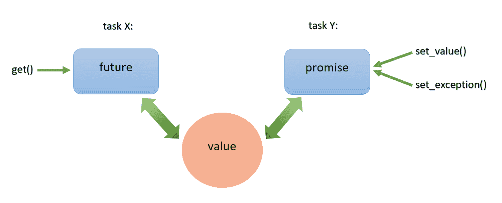
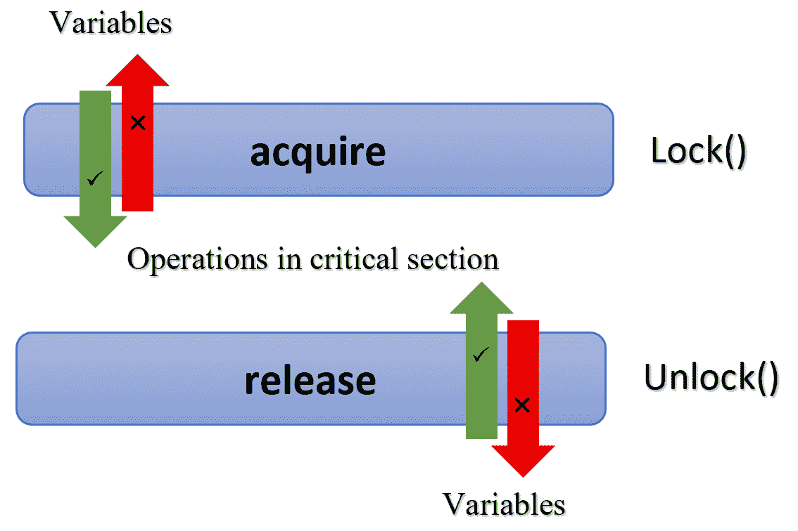

# 第四章：C++中的异步和无锁编程

在上一章中，我们看到了现代 C++引入的线程库以及创建、管理和同步线程的各种方法。使用线程编写代码的方式是相当低级的，并且容易出现与并发代码相关的潜在错误(死锁、活锁等)。尽管许多程序员没有注意到，但现代 C++语言提供了一个标准的内存模型，有助于更好地编写并发代码。作为一种并发编程语言，语言必须向开发人员提供有关内存访问和运行时执行顺序的某些保证。如果我们使用诸如互斥锁、条件变量和 futures 来发出信号事件，就不需要了解内存模型。但是了解内存模型及其保证将有助于我们使用无锁编程技术编写更快的并发代码。锁可以使用称为原子操作的东西来模拟，我们将深入研究这种技术。

正如我们在第二章中讨论的，零成本抽象仍然是 C++编程语言最基本的原则之一。C++始终是系统程序员的语言，标准委员会设法在语言支持的高级抽象机制和访问低级资源以编写系统程序的能力之间取得良好的平衡。C++公开了原子类型和一组相关操作，以对程序的执行进行细粒度控制。标准委员会已经发布了内存模型的详细语义，语言还有一组库，帮助程序员利用它们。

在上一章中，我们学习了如何使用条件变量在单独的线程中同步操作。本章讨论了标准库提供的设施，使用*futures*执行基于任务的并行性。在本章中，我们将涵盖：

+   C++中的基于任务的并行性

+   C++内存模型

+   原子类型和原子操作

+   同步操作和内存排序

+   如何编写无锁数据结构

# C++中的基于任务的并行性

任务是一种计算，可以与其他计算同时执行。线程是任务的系统级表示。在上一章中，我们学习了如何通过构造一个`std::thread`对象并将任务作为其构造函数的参数来并发执行任务，同时还可以启动其他任务。任务可以是任何可调用对象，如函数、Lambda 或仿函数。但是使用`std::thread`并发执行函数的方法称为*基于线程的方法*。并发执行的首选选择是*基于任务的方法*，本章将讨论这一点。基于任务的方法优于基于线程的方法的优势在于在任务的(更高)概念级别上操作，而不是直接在线程和锁的较低级别上操作。通过遵循标准库特性实现了基于任务的并行性：

+   用于从与单独线程相关联的任务返回值的 future 和 promise

+   `packaged_task`用于帮助启动任务并提供返回结果的机制

+   `async()`用于启动类似函数调用的任务

# Future 和 promise

C++任务通常表现得像一种数据通道。发送端通常称为 promise，将数据发送到接收端，通常称为**future**。关于 future 和 promise 的重要概念是它们使两个任务之间的值传输无需显式使用锁。值的传输由系统(运行时)本身处理。**future**和**promise**背后的基本概念很简单；当一个任务想要将一个值传递到另一个任务时，它将该值放入一个**promise**中。

标准库确保与此承诺相关联的未来获得此值。另一个任务可以从这个**future**中读取这个值（下面的图表必须从右向左阅读）：



如果调用线程需要等待特定的*一次性事件*，则 future 非常方便。代表此事件的 future 使自身对调用线程可用，并且一旦 future 准备就绪（当值设置为相应的 promise 时），调用线程就可以访问该值。在执行期间，future 可能具有与之关联的数据，也可能没有。一旦事件发生，future 中将可用数据，并且无法重置。

与基于任务的并行性相关的模板类在库头文件`<future>`中声明。标准库中有两种类型的 future：独占 future（`std::future<>`）和共享 future（`std::shared_future<>`）。您可以将这些与智能指针`std::unique_ptr<>`和`std::shared_ptr<>`*相对应。`std::future`实例指的是与关联事件的唯一实例。相反，多个`std::shared_future`实例可能指向同一事件。在`shared_future`的情况下，与共同事件关联的所有实例将同时准备就绪，并且它们可以访问与事件关联的数据。模板参数是关联数据，如果没有与之关联的数据，则应使用`std::future<void>`和`std::shared_future<void>`模板规范。尽管线程之间的数据通信由 future 在内部管理，但 future 对象本身不提供同步访问。如果多个线程需要访问单个`std::future`对象，则必须使用互斥锁或其他同步机制进行保护。

`std::future`和`std::promise`类成对工作，分别用于任务调用和等待结果。对于`std::future<T>`对象`f`，我们可以使用`std::future`类的`get()`函数访问与之关联的值`T`。类似地，对于`std::promise<T>`，它有两个可用的放置操作函数（`set_value()`和`set_exception()`）与之匹配 future 的`get()`。对于 promise 对象，您可以使用`set_value()`给它一个值，或者使用`set_exception()`传递异常给它。例如，以下伪代码帮助您看到如何在 promise 中设置值（在`func1`中），以及在调用`future<T>:: get()`的函数中如何消耗这些值（`func2`）：

```cpp
// promise associated with the task launched 
void func1(std::promise<T>& pr) 
{ 
    try 
    { 
        T val; 
        process_data(val); 
        pr.set_value(val); // Can be retrieved by future<T>::get() 
    } 
    catch(...) 
    { 
        // Can be retrieved by future<T>::get() 
        // At the future level, when we call get(), the  
        // get will propagate the exception  
        pr.set_exception(std::current_exception()); 
    } 
} 
```

在前面的情况下，处理和获取结果后，类型为`T`的*val*被设置为 promise *pr*。如果执行期间发生任何异常，异常也将被设置为 promise。现在，让我们看看如何访问您设置的值：

```cpp
// future corresponding to task already launched 
void func2(std::future<T>& ft) 
{ 
    try 
    { 
        // An exception will be thrown here, if the corresponding  
        // promise had set an exception ..otherwise, retrieve the  
        // value sets by the promise.  
        T result = ft.get() 
    } 
    catch(...)
    { 
        // Handle exception  
    } 
} 
```

在这里，使用作为参数传递的 future 来访问相应承诺中设置的值。与`std::future()`相关联的`get()`函数在任务执行期间检索存储的值。调用`get()`必须准备捕获通过 future 传递的异常并处理它。在解释完`std::packaged_task`之后，我们将展示一个完整的示例，其中 future 和 promise 共同发挥作用。

# std::packaged_task

现在，让我们讨论如何将与 future 关联的返回值引入到需要结果的代码中。`std::packaged_task`是标准库中提供的一个模板类，用于通过 future 和 promise 实现基于任务的并行处理。通过在线程中设置 future 和 promise，它简化了设置任务而无需为共享结果设置显式锁。`packaged_task`实例提供了一个包装器，用于将返回值或捕获的异常放入 promise 中。`std::packaged_task`中的成员函数`get_future()`将为您提供与相应 promise 关联的 future 实例。让我们看一个示例，该示例使用 packaged task 来找到向量中所有元素的总和（promise 的工作深入到`packaged_task`的实现中）：

```cpp
// Function to calculate the sum of elements in an integer vector 
int calc_sum(std::vector<int> v) 
{ 
    int sum = std::accumulate(v.begin(), v.end(), 0); 
    return sum; 
} 

int main() 
{ 
    // Creating a packaged_task encapsulates a function 
    std::packaged_task<int(std::vector<int>)> task(calc_sum); 

    // Fetch associated future from packaged_task 
    std::future<int> result = task.get_future(); 

    std::vector<int> nums{1,2,3,4,5,6,7,8,9,10}; 

    // Pass packaged_task to thread to run asynchronously 
    std::thread t(std::move(task), std::move(nums)); 

    t.join();
    // Fetch the result of packaged_task, the value returned by calc_sum() 
    int sum = result.get(); 

    std::cout << "Sum = " << sum << std::endl; 
    return 0; 
}
```

`packaged_task`对象以任务类型作为其模板参数，并以函数指针（`calc_sum`）作为构造函数参数。通过调用任务对象的`get_future()`函数获得 future 实例。由于`packaged_task`实例无法复制，因此使用显式的`std::move()`。这是因为它是一个资源句柄，并负责其任务可能拥有的任何资源。然后，调用`get()`函数从任务中获取结果并打印它。

现在，让我们看看`packaged_task`如何与 Lambda 一起使用：

```cpp
    std::packaged_task<int(std::vector<int>)> task([](std::vector<int> 
    v) { 
        return std::accumulate(v.begin(), v.end(), 0); 
    }); 
```

在这里，`packaged_task`的构造函数中传递了一个 Lambda，而不是函数指针。正如您在之前的章节中已经看到的，对于并发运行的小代码块，Lambda 非常方便。future 的主要概念是能够获得结果，而不必担心通信管理的机制。此外，这两个操作在两个不同的线程中运行，因此是并行的。

# `std::async`

现代 C++提供了一种执行任务的机制，就像执行可能或可能不会并行执行的函数一样。在这里，我们指的是`std::async`，它在内部管理线程细节。`std::async`以可调用对象作为其参数，并返回一个`std::future`，该对象将存储已启动任务的结果或异常。让我们重新编写我们之前的示例，使用`std::async`计算向量中所有元素的总和：

```cpp
// Function to calculate the sum of elements in a vector 
int calc_sum(std::vector<int> v) 
{ 
   int sum = std::accumulate(v.begin(), v.end(), 0); 
   return sum; 
} 

int main() 
{ 
   std::vector<int> nums{1,2,3,4,5,6,7,8,9,10}; 

   // task launch using std::async 
   std::future<int> result(std::async(std::launch::async, calc_sum,    std::move(nums))); 

   // Fetch the result of async, the value returned by calc_sum() 
   int sum = result.get(); 

   std::cout << "Sum = " << sum << std::endl; 
   return 0; 
} 
```

主要是，当使用`std::async`进行基于任务的并行处理时，任务的启动和从任务中获取结果遵循直观的语法，并且与任务执行分开。在前面的代码中，`std::async`接受三个参数：

+   `async`标志确定了`async`任务的启动策略，`std::launch::async`表示`async`在新的执行线程上执行任务。`std::launch::deferred`标志不会生成新线程，但会执行*延迟评估*。如果两个标志都设置为`std::launch::async`和`std::launch::deferred`，则由实现决定是执行异步执行还是延迟评估。如果您没有显式地传递任何启动策略到`std::async`中，那么再次由实现选择执行方法。

+   `std::async`的第二个参数是可调用对象，可以是函数指针、函数对象或 Lambda。在这个例子中，`calc_sum`函数是在单独的线程中执行的任务。

+   第三个参数是任务的输入参数。通常，这是一个可变参数，可以传递任务可调用对象所需的参数数量。

现在，让我们看看`async`和 Lambda 如何一起用于相同的示例：

```cpp
// Fetch associated future from async
std::future<int> result( async([](std::vector<int> v) {
return std::accumulate(v.begin(), v.end(), 0); 
}, std::move(nums))); 
```

在这个例子中，可调用对象参数中包含一个 Lambda 函数，该函数返回`std::accumulate()`的结果。与往常一样，Lambda 与简单操作一起美化了代码的整体外观并提高了可读性。

使用`async`，你不必考虑线程和锁。只需考虑异步执行计算的任务，你不知道会使用多少线程，因为这取决于内部实现根据调用时可用的系统资源来决定。它在决定使用多少线程之前会检查可用的空闲核心（处理器）。这指出了`async`的明显局限性，即需要用于共享资源并需要锁的任务。

# C++内存模型

经典的 C++本质上是一种单线程语言。即使人们在 C++中编写多线程程序，他们也是使用各自平台的线程设施来编写它们。现代 C++可以被认为是一种并发编程语言。语言标准提供了一个标准的线程和任务机制（正如我们已经看到的），借助于标准库。由于它是标准库的一部分，语言规范已经定义了在平台上如何精确地行为。在程序运行时实现一致的平台无关行为对于线程、任务等是一个巨大的挑战，标准委员会处理得非常好。委员会设计并指定了一个标准内存模型，以实现一致的行为。内存模型包括两个方面：

+   **结构**方面，涉及数据在内存中的布局。

+   **并发**方面，涉及内存的并发访问

对于 C++程序，所有数据都由*对象*组成。语言将对象定义为*存储区域*，它以其类型和生命周期进行定义。对象可以是基本类型的实例，如 int 或 double，也可以是用户定义类型的实例。一些对象可能有子对象，但其他对象则没有。关键点是每个变量都是一个对象，包括其他对象的成员对象，每个对象都至少占用一些内存位置。现在，让我们看看这与并发有什么关系。

# 内存访问和并发

对于多线程应用程序，一切都取决于那些内存位置。如果多个线程访问不同的内存位置，一切都正常。但如果两个线程访问相同的内存位置，那么你必须非常小心。正如你在第三章中看到的那样，*C++中的语言级并发和并行性*，多个线程尝试从相同的内存位置读取不会引起问题，但只要任何一个线程尝试修改共同的内存位置中的数据，就会出现*竞争条件*的可能性。

问题性的竞争条件只能通过在多个线程之间强制排序访问来避免。如[第三章](https://cdp.packtpub.com/c___reactive_programming/wp-admin/post.php?post=48&action=edit#post_40)中所讨论的，*C++中的语言级并发和并行性*，使用互斥锁进行基于锁的内存访问是一种流行的选择。另一种方法是利用*原子操作*的同步属性，通过在两个线程之间强制排序访问。在本章的后面部分，你将看到使用原子操作来强制排序的示例。

原子操作在并发编程中对系统的其余部分是立即发生的，不会被中断（在原子操作期间不会发生任务切换）。原子性是对中断、信号、并发进程和线程的隔离的保证。关于这个主题可以在维基百科的文章[`en.wikipedia.org/wiki/Linearizability`](https://en.wikipedia.org/wiki/Linearizability)中阅读更多内容。

如果没有强制规定从不同线程对单个内存位置进行多次访问之间的顺序，其中一个或两个访问都不是原子的。如果涉及写操作，那么它可能会导致数据竞争，并可能导致未定义的行为。数据竞争是一个严重的错误，必须尽一切努力避免。原子操作可以避免未定义的行为，但不能防止竞争情况。原子操作确保在操作进行时不会发生线程切换。这是对内存交错访问的保证。原子操作保证了交错内存访问的排除（串行顺序），但不能防止竞争条件（因为有可能覆盖更新）。

# 修改合同

在程序或进程执行时，系统中的所有线程都应同意修改顺序（对于内存）。每个程序都在一个环境中执行，其中包括指令流、内存、寄存器、堆、栈、缓存、虚拟内存等等。这种修改顺序是程序员和系统之间的合同，由内存模型定义。系统由将程序转换为可执行代码的编译器（和链接器）、执行指定流中指定的指令集的处理器、缓存和程序的相关状态组成。合同要求程序员遵守某些规则，这些规则使系统能够生成一个完全优化的程序。程序员在编写访问内存的代码时必须遵守的一组规则（或启发式）是通过标准库中引入的原子类型和原子操作来实现的。

这些操作不仅是原子的，而且会在程序执行中创建同步和顺序约束。与[第三章](https://cdp.packtpub.com/c___reactive_programming/wp-admin/post.php?post=48&action=edit#post_40)中讨论的更高级别的基于锁的同步原语（互斥锁和条件变量）相比，《C++中的语言级并发和并行性》，您可以根据自己的需要定制同步和顺序约束。从 C++内存模型中重要的收获是：尽管语言采用了许多现代编程习惯和语言特性，但作为系统程序员的语言，C++为您的内存资源提供了更低级别的控制，以便根据您的需求优化代码。

# C++中的原子操作和类型

通常，非原子操作可能被其他线程视为半成品。正如在[第三章](https://cdp.packtpub.com/c___reactive_programming/wp-admin/post.php?post=48&action=edit#post_40)中所讨论的那样，《C++中的语言级并发和并行性》，在这种情况下，与共享数据结构相关的不变性将被破坏。当修改共享数据结构需要修改多个值时，就会发生这种情况。最好的例子是二叉树的部分移除节点。如果另一个线程同时尝试从这个数据结构中读取，不变性将被破坏，并可能导致未定义的行为。

使用*原子操作*，您无法从系统中的任何线程观察到半成品的操作，因为原子操作是不可分割的。如果与对象相关联的任何操作（例如读取）是原子的，那么对对象的所有修改也是原子的。C++提供了原子类型，以便您可以根据需要使用原子性。

# 原子类型

标准库定义的所有原子类型都可以在`<atomic>`头文件库中找到。系统保证这些类型的原子性以及与这些类型相关的所有操作。某些操作可能不是原子的，但在这种情况下，系统会产生原子性的幻觉。标准原子类型使用一个成员函数`is_lock_free()`，允许用户确定给定类型的操作是直接使用原子指令进行的（`is_lock_free()`返回`true`），还是使用编译器和库内部锁进行的（`is_lock_free()`返回`false`）。

`std::atomic_flag`在所有原子类型中是不同的。这种类型上的操作需要按照标准是原子的。因此，它不提供`is_lock_free()`成员函数。这是一种非常简单的类型，具有一组允许的最小操作，例如`test_and_set()`（可以查询或设置）或`clear()`（清除值）。

其余的原子类型遵循`std::atomic<>`类模板的规范。与`std::atomic_flag`相比，这些类型更加全面，但并非所有操作都是原子的。操作的原子性也高度取决于平台。在流行的平台上，内置类型的原子变体确实是无锁的，但这并不是在所有地方都能保证的。

不使用`std::atomic<>`模板类，可以使用实现提供的直接类型，如下表所示：

| **原子类型** | **对应的特化** |
| --- | --- |
| `atomic_bool` | `std::atomic<bool>` |
| `atomic_char` | `std::atomic<char>` |
| `atomic_schar` | `std::atomic<signed char>` |
| `atomic_uchar` | `std::atomic<unsigned char>` |
| `atomic_int` | `std::atomic<int>` |
| `atomic_uint` | `std::atomic<unsigned>` |
| `atomic_short` | `std::atomic<short>` |
| `atomic_ushort` | `std::atomic<unsigned short>` |
| `atomic_long` | `std::atomic<long>` |
| `atomic_ulong` | `std::atomic<unsigned long>` |
| `atomic_llong` | `std::atomic<long long>` |
| `atomic_ullong` | `std::atomic<unsigned long long>` |
| `atomic_char16_t` | `std::atomic<char16_t>` |
| `atomic_char32_t` | `std::atomic<char32_t>` |
| `atomic_wchar_t` | `std::atomic<wchar_t>` |

除了所有这些基本的原子类型之外，C++标准库还提供了一组与标准库中的`typedefs`相比的原子类型的`typedefs`。有一个简单的模式来识别`typedefs`的对应原子版本：对于任何标准`typedef T`，使用`atomic_`前缀：`atomic_T`。以下表格列出了标准原子`typedefs`及其对应的内置`typedefs`：

| **原子** `typedef` | **标准库** `typedef` |
| --- | --- |
| `atomic_size_t` | `size_t` |
| `atomic_intptr_t` | `intptr_t` |
| `atomic_uintptr_t` | `uintptr_t` |
| `atomic_ptrdiff_t` | `ptrdiff_t` |
| `atomic_intmax_t` | `intmax_t` |
| `atomic_uintmax_t` | `uintmax_t` |
| `atomic_int_least8_t` | `int_least8_t` |
| `atomic_uint_least8_t` | `uint_least8_t` |
| `atomic_int_least16_t` | `int_least16_t` |
| `atomic_uint_least16_t` | `uint_least16_t` |
| `atomic_int_least32_t` | `int_least32_t` |
| `atomic_uint_least32_t` | `uint_least32_t` |
| `atomic_int_least64_t` | `int_least64_t` |
| `atomic_uint_least64_t` | `uint_least64_t` |
| `atomic_int_fast8_t` | `int_fast8_t` |
| `atomic_uint_fast8_t` | `uint_fast8_t` |
| `atomic_int_fast16_t` | `int_fast16_t` |
| `atomic_uint_fast16_t` | `uint_fast16_t` |
| `atomic_int_fast32_t` | `int_fast32_t` |
| `atomic_uint_fast32_t` | `uint_fast32_t` |
| `atomic_int_fast64_t` | `int_fast64_t` |
| `atomic_uint_fast64_t` | `uint_fast64_t` |

`std::atomic<>`类模板不仅仅是一组特化；它们有一个主模板来扩展用户定义类型的原子变体。作为一个通用模板类，支持的操作仅限于`load()`、`store()`、`exchange()`、`compare_exchange_weak()`和`compare_exchange_strong()`。原子类型的每个操作都有一个可选参数，用于指定所需的内存排序语义。内存排序的概念将在本章的后面部分详细介绍。现在，只需记住所有原子操作可以分为三类：

+   **存储操作：**这些操作可以具有`memory_order_relaxed`、`memory_order_release`或`memory_order_seq_cst`排序

+   **加载操作：**这些可以具有`memory_order_relaxed`、`memory_order_consume`、`memory_order_acquire`或`memory_order_seq_cst`排序

+   **读-修改-写操作：**这些操作可以具有`memory_order_relaxed`、`memory_order_consume`、`memory_order_acquire`、`memory_order_release`、`memory_order_acq_rel`或`memory_order_seq_cst`排序

所有原子操作的默认内存排序都是`memory_order_seq_cst`。

与传统的标准 C++类型相比，标准原子类型不可*复制*或*赋值*。这意味着它们没有复制构造函数或复制赋值运算符。除了直接成员函数外，它们还支持从和到相应的内置类型的隐式转换。原子类型的所有操作都被定义为原子操作，赋值和复制构造涉及两个对象。涉及两个不同对象的操作不能是原子的。在这两个操作中，值必须从一个对象读取并写入另一个对象。因此，这些操作不能被视为原子操作。

现在，让我们看看您可以在每种标准原子类型上执行的操作，从`std::atomic_flag`开始。

# std::atomic_flag

`std::atomic_flag`表示一个布尔标志，它是标准库中所有原子类型中最简单的。这是唯一一个在每个平台上所有操作都需要是*无锁*的类型。这种类型非常基础，因此只用作构建块。

`std::atomic_flag`对象必须始终使用`ATOMIC_FLAG_INIT`进行初始化，以将状态设置为*clear*：

```cpp
std::atomic_flag flg = ATOMIC_FLAG_INIT;
```

这是唯一需要这种初始化的原子类型，无论其声明的范围如何。一旦初始化，只有三种操作可以使用这种类型：销毁它，清除它，或者设置一个查询以获取先前的值。这分别对应于析构函数、`clear()`成员函数和`test_and_set()`成员函数。`clear()`是一个*存储*操作，而`test_and_set()`是一个读-修改-写操作，正如前一节中所讨论的：

```cpp
flg.clear()
bool val = flg.test_and_set(std::memory_order_relaxed);
```

在上述代码片段中，`clear()`函数调用请求使用默认内存顺序清除标志，即`std::memory_order_seq_cst`，而`test_and_set()`的调用使用了松散的语义（更多信息请参阅*松散排序*），这些语义明确用于设置标志和检索旧值。

`std::atomic_flag`的原始实现使其成为自旋锁互斥量的理想选择。让我们看一个自旋锁的例子：

```cpp
class spin_lock
{
    std::atomic_flag flg;
    public:
    spin_lock() : flg(ATOMIC_FLAG_INIT){}
    void lock() {
        // simulates a lock here... and spin
        while (flg.test_and_set(std::memory_order_acquire));
        //----- Do some action here
        //----- Often , the code to be guarded will be sequenced as
        // sp.lock() ...... Action_to_Guard() .....sp.unlock()
    }
    void unlock() {
        //------ End of Section to be guarded
        flg.clear(std::memory_order_release); // release lock
    }
};
```

在上述代码片段中，实例变量`flg`（类型为`std::atomic_flag`）最初被清除。在锁定方法中，它尝试通过测试`flg`来设置标志，以查看值是否被清除。

如果值被清除，值将被设置，我们将退出循环。只有当`unlock()`方法清除标志时，标志中的值才会被重置。换句话说，这种实现通过在`lock()`中进行忙等待来实现互斥排他。

由于其限制，`std::atomic_flag`不能用作布尔原子类型，并且不支持任何*非修改查询*操作。因此，让我们研究`std::atomic<bool>`来弥补原子布尔标志的要求。

# std::atomic<bool>

与`std::atomic_flag`相比，`std::atomic<bool>`是一个功能齐全的原子布尔类型。但是，这种类型既不能进行复制构造，也不能进行赋值。`std::atomic<bool>`对象的值最初可以是`true`或`false`。此类型的对象可以从非原子`bool`构造或赋值：

```cpp
std::atomic<bool> flg(true);
flg = false;
```

关于原子类型的赋值运算符需要注意一点，即该运算符返回非原子类型的值，而不是返回引用，这与传统方案不同。如果返回引用而不是值，那么会出现这样一种情况，即赋值的结果会得到另一个线程的修改结果，即如果它依赖于赋值运算符的结果。通过将赋值运算符的结果作为非原子值返回，可以避免这种额外的加载，并且您可以推断得到的值是实际存储的值。

现在，让我们继续讨论`std::atomic<bool>`支持的操作。首先，`store()`成员函数可用于`std::atomic<bool>`的写操作（`true`或`false`），它取代了`std::atomic_flag`的相应的限制性`clear()`函数。此外，`store()`函数是一个原子存储操作。类似地，`test_and_set()`函数已经被更通用的`exchange()`成员函数有效地取代，它允许您用选择的新值替换存储的值并检索原始值。这是一个原子的*读-修改-写*操作。然后，`std::atomic<bool>`支持通过显式调用`load()`进行简单的非修改查询值的操作，这是一个原子加载操作：

```cpp
std::atomic<bool> flg;
flg.store(true);
bool val = flg.load(std::memory_order_acquire);
val = flg.exchange(false, std::memory_order_acq_rel);
```

除了`exchange()`之外，`std::atomic<bool>`还引入了一个执行流行的原子**比较和交换**（**CAS**）指令的操作来执行*读-修改-写*操作。此操作在当前值等于期望值时存储新值。这称为比较/交换操作。标准库原子类型中有两种实现此操作的方式：`compare_exchange_weak()`和`compare_exchange_strong()`。此操作将原子变量的值与提供的期望值进行比较，并在它们相等时存储提供的值。如果这些值不相等，则更新期望值为原子变量的实际值。比较/交换函数的返回类型是*bool*，如果执行了存储，则为`true`；否则为`false`。

对于`compare_exchange_weak()`，即使期望值和原始值相等，存储也可能不成功。在这种情况下，值的交换不会发生，函数将返回`false`。这在缺乏单个比较和交换指令的平台上最常见，这意味着处理器无法保证操作将被原子执行。在这样的机器上，执行操作的线程可能在执行与操作相关的指令序列的一半时被切换出去，并且操作系统会以更多线程运行而不是可用处理器数量的条件安排另一个线程代替它。这种情况被称为**虚假失败**。

由于`compare_exchange_weak()`可能导致虚假失败，应该在循环中使用：

```cpp
bool expected = false;
atomic<bool> flg;
...
while(!flg.compare_exchange_weak(expected, true));
```

在上述代码中，只要 expected 为`false`，循环就会继续迭代，并且它表示`compare_exchange_weak()`调用发生了虚假失败。相反，如果实际值不等于期望值，`compare_exchange_strong()`保证返回`false`。这可以避免在以前的情况下需要循环来了解变量状态与运行线程的情况。

比较/交换函数可以接受两个内存排序参数，以允许在成功和失败的情况下内存排序语义不同。这些内存排序语义仅对存储操作有效，不能用于失败情况，因为存储操作不会发生：

```cpp
bool expected;
std::atomic<bool> flg;
b.compare_exchange_weak(expected, true, std::memory_order_acq_rel, std::memory_order_acquire);
b.compare_exchange_weak(expected, true, std::memory_order_release);
```

如果您不指定任何内存排序语义，对于成功和失败的情况都将采用默认的`memory_order_seq_cst`。如果您不为失败指定任何排序，那么假定与成功的排序相同，只是省略了排序的释放部分。`memory_order_acq_rel`变为`memory_order_acquire`，`memory_order_release`变为`memory_order_relaxed`。

内存排序的规范和后果将在本章的*内存排序*部分详细讨论。现在，让我们看看原子整数类型作为一组的用法。

# 标准原子整数类型

与`std::atomic<bool>`类似，标准原子整数类型既不能进行复制构造，也不能进行复制赋值。但是，它们可以从相应的非原子标准变体构造和赋值。除了强制的`is_lock_free()`成员函数之外，标准原子整数类型，比如`std::atomic<int>`或`std::atomic<unsigned long long>`，还有`load()`、`store()`、`exchange()`、`compare_exchange_weak()`和`compare_exchange_strong()`成员函数，其语义与`std::atomic<bool>`的类似。

原子类型的整数变体支持数学运算，比如`fetch_add()`、`fetch_sub()`、`fetch_and()`、`fetch_or()`和`fetch_xor()`，复合赋值运算符(`+=`、`-=`、`&=`、`|=`和`^=`)，以及`++`和`--`的前置和后置递增和递减运算符。

命名函数，比如`fetch_add()`和`fetch_sub()`，会原子地执行它们的操作并返回旧值，但复合赋值运算符会返回新值。前置和后置递增/递减按照通常的 C/C++约定工作：后置递增/递减执行操作，但返回旧值，而前置递增/递减运算符执行操作并返回新值。下面的简单示例可以很容易地演示这些操作的规范：

```cpp
int main() 
{ 
std::atomic<int> value; 

std::cout << "Result returned from Operation: " << value.fetch_add(5) << 'n'; 
std::cout << "Result after Operation: " << value << 'n'; 

std::cout << "Result returned from Operation: " << value.fetch_sub(3) << 'n'; 
std::cout << "Result after Operation: " << value << 'n'; 

std::cout << "Result returned from Operation: " << value++ << 'n'; 
std::cout << "Result after Operation: " << value << 'n'; 

std::cout << "Result returned from Operation: " << ++value << 'n'; 
std::cout << "Result after Operation: " << value << 'n'; 

value += 1; 
std::cout << "Result after Operation: " << value << 'n'; 

value -= 1; 
std::cout << "Result after Operation: " << value << 'n'; 
} 
```

此代码的输出应如下所示：

```cpp
Result returned from Operation: 0 
Result after Operation: 5 
Result returned from Operation: 5 
Result after Operation: 2 
Result returned from Operation: 2 
Result after Operation: 3 
Result returned from Operation: 4 
Result after Operation: 4 
Result after Operation: 5 
Result after Operation: 4 
```

除了`std::atomic_flag`和`std::atomic<bool>`之外，第一张表中列出的所有其他原子类型都是原子整数类型。现在，让我们来看一下原子指针特化，`std::atomic<T*>`。

# std::atomic<T*> – 指针算术

除了通常的操作，比如`load()`、`store()`、`exchange()`、`compare_exchange_weak()`和`compare_exchange_strong()`之外，原子指针类型还加载了指针算术操作。成员函数`fetch_add()`和`fetch_sub()`提供了对类型进行原子加法和减法的操作支持，运算符`+=`和`-=`，以及前置和后置递增/递减，使用`++`和`--`运算符。

运算符的工作方式与标准的非原子指针算术运算相同。如果`obj`是`std::atomic<some_class*>`，则对象指向`some_class`对象数组的第一个条目。`obj+=2`将其更改为指向数组中的第三个元素，并返回一个指向数组中第三个元素的`some_class*`的原始指针。如*标准原子整数类型*部分所讨论的，诸如`fetch_add()`和`fetch_sub`之类的命名函数在原子类型上执行操作，但返回数组中第一个元素的指针。

原子操作的函数形式还允许在函数调用的附加参数中指定内存排序语义：

```cpp
obj.fetch_add(3, std::memory_order_release);
```

由于`fetch_add()`和`fetch_sub`都是读取-修改-写操作，它们可以在标准原子库中使用任何内存排序语义。但是，对于操作符形式，无法指定内存排序，因此这些操作符将始终具有`memory_order_seq_cst`语义。

# std::atomic<>主类模板

标准库中的主要类模板允许用户创建**用户定义类型**（**UDT**）的原子变体。要将用户定义类型用作原子类型，您必须在实现类之前遵循一些标准。对于用户定义类 UDT，如果该类型具有平凡的复制赋值运算符，则`std::atomic<UDT>`是可能的。这意味着用户定义类不应包含任何虚函数或虚基类，并且必须使用编译器生成的默认复制赋值运算符。此外，用户定义类的每个基类和非静态数据成员必须具有平凡的复制赋值运算符。这使得编译器可以执行`memcpy()`或等效的操作以进行赋值操作，因为没有用户编写的代码需要执行。

除了赋值运算符的要求之外，用户定义类型必须是*位相等可比*的。这意味着您必须能够使用`memcmp()`比较实例是否相等。这个保证是必需的，以确保比较/交换操作能够正常工作。

对于具有用户定义类型`T`的标准原子类型的实例，即`std::atomic<T>`，接口仅限于`std::atomic<bool>`可用的操作：`load()`，`store()`，`exchange()`，`compare_exchange_weak()`，`compare_exchange_strong()`和对类型`T`的实例的赋值和转换。

# 内存排序

我们已经了解了标准库中可用的原子类型和原子操作。在对原子类型执行操作时，我们需要为某些操作指定内存排序。现在，我们将讨论不同内存排序语义的重要性和用例。原子操作背后的关键思想是在多个线程之间提供数据访问的同步，并通过强制执行执行顺序来实现这一点。例如，如果写入数据发生在读取数据之前，那么一切都会很好。否则，你就麻烦了！标准库提供了六种内存排序选项，可应用于原子类型的操作：`memory_order_relaxed`，`memory_order_consume`，`memory_order_acquire`，`memory_order_release`，`memory_order_acq_rel`和`memory_order_seq_cst`。对于所有原子类型的原子操作，`memory_order_seq_cst`是默认的内存顺序，除非您指定其他内容。

这六个选项可以分为三类：

+   顺序一致排序：`memory_order_seq_cst`

+   **获取-释放排序**：`memory_order_consume`，`memory_order_release`，`memory_order_acquire`和`memory_order_acq_rel`

+   **松散排序**：`memory_order_relaxed`

执行成本因不同的 CPU 和不同的内存排序模型而异。不同的内存排序模型的可用性允许专家利用比阻塞顺序一致排序更精细的排序关系来提高性能，但是要选择适当的内存模型，就应该了解这些选项如何影响程序的行为。让我们首先看看顺序一致性模型。

# 顺序一致性

顺序一致性的概念是由 Leslie Lamport 在 1979 年定义的。顺序一致性在程序执行中提供了两个保证。首先，程序的指令的内存排序按照源代码顺序执行，或者编译器将保证源代码顺序的幻觉。然后，所有线程中所有原子操作的全局顺序。

对于程序员来说，顺序一致性的全局排序行为，即所有线程中的所有操作都在全局时钟中发生，是一个有趣的高地，但也是一个缺点。

关于顺序一致性的有趣之处在于，代码按照我们对多个并发线程的直觉工作，但系统需要做大量的后台工作。以下程序是一个简单的示例，让我们了解顺序一致性：

```cpp
std::string result; 
std::atomic<bool> ready(false); 

void thread1() 
{ 
    while(!ready.load(std::memory_order_seq_cst)); 
    result += "consistency"; 
} 

void thread2() 
{ 
    result = "sequential "; 
    ready=true; 
} 

int main() 
{ 
    std::thread t1(thread1); 
    std::thread t2(thread2); 
    t1.join(); 
    t2.join(); 

    std::cout << "Result : " << result << 'n'; 
} 

```

前面的程序使用顺序一致性来同步线程`thread1`和`thread2`。由于顺序一致性，执行是完全*确定*的，因此该程序的输出始终如下：

```cpp
Result : sequential consistency 
```

在这里，`thread1`在 while 循环中等待，直到原子变量`ready`为`true`。一旦`thread2`中的*ready*变为`true`，`thread1`就会继续执行，因此结果总是以相同的顺序更新字符串。顺序一致性的使用允许两个线程以相同的顺序看到其他线程的操作，因此两个线程都遵循相同的全局时钟。循环语句还有助于保持两个线程的同步的时间时钟。

*获取-释放语义*的细节将在下一节中介绍。

# 获取-释放排序

现在，让我们深入研究 C++标准库提供的内存排序语义。这是程序员对多线程代码中排序的直觉开始消失的地方，因为在原子操作的获取-释放语义中，线程之间没有全局同步。这些语义只允许在同一原子变量上的原子操作之间进行同步。简而言之，一个线程上的原子变量的加载操作可以与另一个线程上同一原子变量的存储操作进行同步。程序员必须提取这个特性，建立原子变量之间的*happen-before*关系，以实现线程之间的同步。这使得使用获取-释放模型有点困难，但同时也更加刺激。获取-释放语义缩短了通向无锁编程的道路，因为你不需要担心线程的同步，但需要思考的是不同线程中相同原子变量的同步。

正如我们之前解释的，获取-释放语义的关键思想是在同一原子变量上的释放操作与获取操作之间的同步，并建立一个*ordering constant*。现在，顾名思义，获取操作涉及获取锁，其中包括用于读取原子变量的操作，如`load()`和`test_and_set()`函数。因此，释放锁是一个释放操作，其中包括`store()`和`clear()`等原子操作。

换句话说，*mutex*的锁是一个获取操作，而解锁是一个释放操作。因此，在*临界区*中，对变量的操作不能在任何方向上进行。但是，变量可以从外部移入临界区，因为变量从一个未受保护的区域移动到了一个受保护的区域。这在下图中表示：



临界区包含单向屏障：获取屏障和释放屏障。相同的推理也可以应用于启动线程和在线程上放置 join 调用，以及标准库中提供的所有其他同步原语相关的操作。

由于同步是在原子变量级别而不是线程级别进行的，让我们重新审视一下使用`std::atomic_flag`实现的自旋锁：

```cpp
class spin_lock 
{ 
    std::atomic_flag flg; 

public: 
    spin_lock() : flg(ATOMIC_FLAG_INIT) 
    {} 

    void lock() 
    { 
        // acquire lock and spin 
        while (flg.test_and_set(std::memory_order_acquire)); 
    } 

    void unlock() 
    { 
        // release lock 
        flg.clear(std::memory_order_release); 
    } 
}; 
```

在这段代码中，`lock()`函数是一个`acquire`操作。现在不再使用前一个示例中使用的默认顺序一致的内存排序，而是现在使用了显式的 acquire 内存排序标志。此外，`unlock()`函数，也是一个释放操作，之前也是使用默认的内存顺序，现在已经被替换为显式的释放语义。因此，两个线程的顺序一致的重量级同步被轻量级和高性能的 acquire-release 语义所取代。

当使用`spin_lock`的线程数量超过两个时，使用`std::memory_order_acquire`的一般获取语义将不足够，因为锁方法变成了一个获取-释放操作。因此，内存模型必须更改为`std::memory_order_acq_rel`。

到目前为止，我们已经看到顺序一致的排序确保了线程之间的同步，而获取-释放排序在多个线程上确立了对同一原子变量的读写操作的顺序。现在，让我们看一下松散内存排序的规范。

# 松散排序

使用标签`std::memory_order_relaxed`进行松散内存排序的原子类型的操作不是同步操作。与标准库中提供的其他排序选项相比，它们不会对并发内存访问施加顺序。松散内存排序语义只保证同一线程内相同原子类型的操作不能被重新排序，这个保证被称为**修改顺序一致性**。事实上，松散排序只保证了原子性和修改顺序一致性。因此，其他线程可以以不同的顺序看到这些操作。

松散内存排序可以有效地用于不需要同步或排序的地方，并且原子性可以成为性能提升的一个优势。一个典型的例子是增加计数器，比如**std::shared_ptr**的引用计数器，它们只需要原子性。但是减少引用计数需要与这个模板类的析构函数进行获取-释放同步。

让我们看一个简单的例子来计算使用松散排序生成的线程数量：

```cpp
std::atomic<int> count = {0}; 

void func() 
{ 
    count.fetch_add(1, std::memory_order_relaxed); 
} 

int main() 
{ 
    std::vector<std::thread> v; 
    for (int n = 0; n < 10; ++n) 
    { 
        v.emplace_back(func); 
    } 
    for (auto& t : v) 
    { 
        t.join(); 
    } 

    std::cout << "Number of spawned threads : " << count << 'n'; 
} 
```

在这段代码中，从`main()`函数生成了十个线程，每个线程都使用线程函数`func()`，在每个线程上，使用原子操作`fetch_add()`将原子整数值增加一。与`std::atomic<int>`提供的复合赋值运算符和后置和前置递增运算符相反，`fetch_add()`函数可以接受内存排序参数，它是`std::memory_order_relaxed`。

程序打印出程序中生成的线程数量如下：

```cpp
Number of spawned threads : 10 
```

程序的输出对于任何其他相关的内存排序标签都是相同的，但是松散的内存排序确保了原子性，从而提高了性能。

到目前为止，我们已经讨论了不同内存模型的级别，以及它们对原子和非原子操作的影响。现在，让我们深入研究使用原子操作实现无锁数据结构。

# 无锁数据结构队列

正如我们已经知道的，实际系统中的数据通常以数据结构的形式表示，当涉及到数据结构的并发操作时，性能是一个大问题。在[第三章](https://cdp.packtpub.com/c___reactive_programming/wp-admin/post.php?post=48&action=edit#post_40)中，*C++中的语言级并发和并行性*，我们学习了如何编写一个线程安全的栈。然而，我们使用了锁和条件变量来实现它。为了解释如何编写一个无锁数据结构，让我们使用生产者/消费者范式来编写一个非常基本的队列系统，而不使用锁或条件变量。这肯定会提高代码的性能。我们不使用标准数据类型的包装器，而是从头开始编写。我们假设在这种情况下有一个生产者和一个消费者：

```cpp
template<typename T> 
class Lock_free_Queue 
{ 
private: 
    struct Node 
    { 
        std::shared_ptr<T> my_data; 
        Node* my_next_node; 
        Node() : my_next_node(nullptr) 
        {} 
    }; 

    std::atomic<Node*> my_head_node; 
    std::atomic<Node*> my_tail_node; 

    Node* pop_head_node() 
    { 
        Node* const old_head_node = my_head_node.load(); 
        if(old_head_node == my_tail_node.load()) 
        { 
            return nullptr; 
        } 
        my_head_node.store(old_head_node->my_next_node); 
        return old_head_node; 
    } 
```

`Lock_free_stack`类包含一个用于表示队列节点的结构（命名为`Node`），其中包含用于表示节点数据（`my_data`）和指向下一个节点的指针的数据成员。然后，该类包含两个原子指针实例，指向用户定义的结构`Node`，该结构已在类内部定义。一个实例存储队列头节点的指针，而另一个指向尾节点。最后，使用`private pop_head_node()`函数通过调用原子*store*操作来检索队列的头节点，但仅当队列包含至少一个元素时。在这里，原子操作遵循默认的顺序一致的内存排序语义：

```cpp
public: 
Lock_free_Queue() : my_head_node(new Node), my_tail_node(my_head_node.load()) 
    {} 
    Lock_free_Queue(const Lock_free_Queue& other) = delete; 
    Lock_free_Queue& operator= (const Lock_free_Queue& other) = delete; 

    ~Lock_free_Queue() 
    { 
        while(Node* const old_head_node = my_head_node.load()) 
        { 
            my_head_node.store(old_head_node->my_next_node); 
            delete old_head_node; 
        } 
    }
```

头节点在队列对象构造时被实例化，并且尾部指向该内存。复制构造函数和复制赋值运算符被标记为删除，以防止它们被使用。在析构函数内，队列中的所有元素都被迭代删除：

```cpp
    std::shared_ptr<T> dequeue() 
    { 
        Node* old_head_node = pop_head_node(); 
        if(!old_head_node) 
        { 
            return std::shared_ptr<T>(); 
        } 
        std::shared_ptr<T> const result(old_head_node->my_data); 
        delete old_head_node; 
        return result; 
    } 

    void enqueue(T new_value) 
    { 
        std::shared_ptr<T> new_data(std::make_shared<T>(new_value)); 
        Node* p = new Node; 
        Node* const old_tail_node = my_tail_node.load(); 
        old_tail_node->my_data.swap(new_data); 
        old_tail_node->my_next_node = p; 
        my_tail_node.store(p); 
    } 
}; 
```

前面的代码片段实现了标准队列操作，即 Enqueue 和 Dequeue。在这里，我们使用了 swap 和 store 原子操作，确保 Enqueue 和 Dequeue 之间存在*happens before*关系。

# 摘要

在本章中，我们讨论了标准库提供的用于编写基于任务的并行性的工具。我们看到了如何使用`std::packaged_task`和`std::async`与 futures 和 promises。我们讨论了现代 C++语言提供的新的多线程感知内存模型。之后，我们讨论了原子类型及其相关操作。我们学到的最重要的事情是语言的各种内存排序语义。简而言之，这一章和前一章将使我们能够推理响应式编程模型的并发方面。

在接下来的章节中，我们将把注意力从语言和并发转移到响应式编程模型的标准接口。我们将介绍 Observables！
