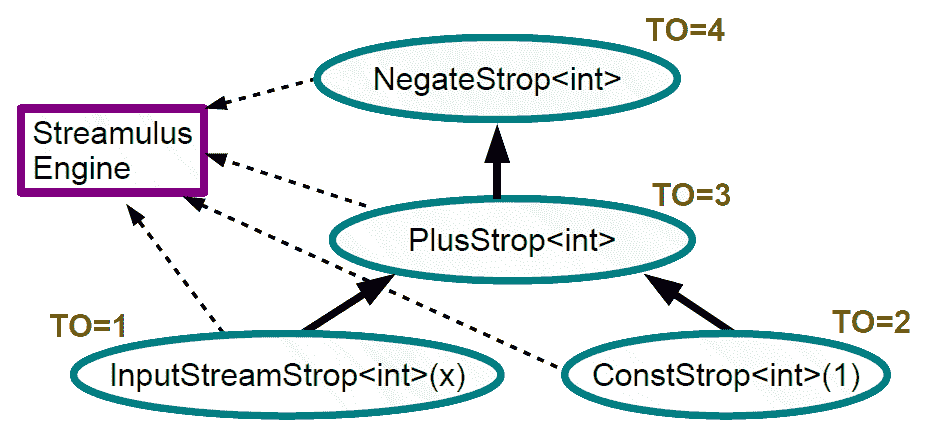

# 使用 C++介绍事件流编程

本章将是使用 C++编程反应性系统所需的先决章节系列的最后一章。我们需要经历许多概念的原因是，反应式编程模型统一了许多计算概念，实现了其强大的编程模型。要开始以反应式方式思考，程序员必须熟悉面向对象编程、函数式编程、语言级并发、无锁编程、异步编程模型、设计模式、调度算法、数据流编程模型、声明式编程风格，甚至一点图论！我们从书中窥探了各种 GUI 系统的事件驱动编程模型以及围绕它们构建代码的方式。我们涵盖了现代 C++的核心要点第二章，*现代 C++及其关键习语之旅*。在第三章中，*C++中的语言级并发和并行性*，以及第四章，*C++中的异步和无锁编程*，我们分别介绍了 C++语言支持的语言级并发和无锁编程。在第五章中，*可观察对象简介*，我们重点介绍了如何将反应式编程模型放入 GOF 模式的背景中处理。剩下的是事件流编程。现在我们将专注于处理事件流或事件流编程。在本章中，我们将讨论以下内容：

+   什么是流编程模型？

+   流编程模型的优势

+   使用 C++和公共领域库进行流编程

+   使用 Streamulus 进行流编程

+   事件流编程

# 什么是流编程模型？

在我们深入讨论流编程模型之前，我们将退一步，看看与 POSIX shell 编程模型的相似之处。在典型的命令行 shell 程序中，每个命令都是一个程序，每个程序都是一个命令。在实现计算目标或任务后，我们可以将一个程序的输出传递给另一个程序。实际上，我们可以链接一系列命令来实现更大的计算任务。我们可以将其视为一系列数据通过一系列过滤器或转换以获取输出。我们也可以称之为*命令组合*。有现实情况下，巨大的程序被少量的 shell 代码使用*命令组合*替代。同样的过程可以在 C++程序中实现，将函数的输入视为流、序列或列表。数据可以从一个函数或函数对象（也称为函数对象）传递到另一个函数，作为标准数据容器。

传奇计算机科学家和斯坦福大学教授唐纳德·克努斯博士被要求编写一个程序：

+   读取文本文件并确定*n*个常用单词

+   打印出一个按单词频率排序的单词列表

Knuth 的解决方案是一个十页的 Pascal 程序！Doug McIlroy 只用以下 shell 脚本就实现了相同的功能：

`tr -cs A-Za-z ' n ' | tr A-Z a-z | sor t | uniq -c | sor t -rn | sed ${1}q`命令组合的威力就是这样了。

# 流编程模型的优势

传统的 OOP 程序很好地模拟了层次结构，处理层次结构大多比处理线性集合更困难。在流编程模型中，我们可以将输入视为放入容器的实体流，将输出视为实体的集合，而不修改输入数据流。使用 C++通用编程技术，我们可以编写与容器无关的代码来处理流。这种模型的一些优势包括：

+   流编程简化了程序逻辑

+   流可以支持惰性评估和函数式转换

+   流更适合并发编程模型（源流是不可变的）

+   我们可以组合函数来创建高阶函数来处理它们

+   流促进了声明式编程模型

+   它们可以从不同的源聚合、过滤和转换数据

+   它们解耦了数据源和处理数据的实体

+   它们提高了代码的可读性（开发人员可以更快地理解代码）

+   它们可以利用数据并行性和任务并行性

+   我们可以利用数百个定义良好的流操作符（算法）来处理数据

# 使用 Streams 库进行应用流编程

在本节中，我们将介绍使用`Streams`库进行流编程的主题，这是由 Jonah Scheinerman 编写的一个公共领域库。该库托管在[`github.com/jscheiny/Streams`](https://github.com/jscheiny/Streams)，API 文档可从[`jscheiny.github.io/Streams/api.html#`](http://jscheiny.github.io/Streams/api.html)获取。以下是一个介绍（摘自库的 GitHub 页面）：

`Streams`是一个 C++库，提供了对数据的惰性评估和函数式转换，以便更轻松地使用 C++标准库的容器和算法。`Streams`支持许多常见的函数操作，如 map、filter 和 reduce，以及其他各种有用的操作，如各种集合操作（并集、交集、差集）、部分和、相邻差分，以及其他许多操作。

我们可以看到，熟悉标准模板库（STL）的程序员将会对这个库感到非常舒适。STL 容器被视为流数据源，STL 算法可以被视为对流数据源的转换。该库使用现代 C++支持的函数式编程习语，并且支持惰性评估。在这里，惰性评估的概念非常重要，因为它是函数式编程模型和 Rx 编程模型的基石。

# 惰性评估

在编程语言中，有两种突出的评估函数参数的方法，它们如下：

+   应用程序顺序评估（AO）

+   正常顺序评估（NO）

在 AO 的情况下，参数在调用上下文中被评估，然后传递给被调用者。大多数传统的编程语言都遵循这种方法。在 NO 的情况下，变量的评估被推迟，直到在被调用者的上下文中需要计算结果。一些函数式编程语言，如 Haskell、F#和 ML，遵循 NO 模型。在函数式编程语言中，大部分函数的评估是引用透明的（函数的调用不会产生副作用）；我们只需要对表达式进行一次评估（对于特定值作为参数），并且结果可以在再次执行相同函数相同参数的评估时共享。这被称为惰性评估。因此，惰性评估可以被认为是 NO 与先前计算结果的共享相结合。C++编程语言默认不支持函数参数的惰性评估，但可以使用不同的技术来模拟，例如可变模板和表达式模板。

# 一个简单的流程序

要开始使用`Streams`库，让我们编写一个小程序来生成一个数字流并计算前十个数字的平方：

```cpp
//--------- Streams_First.cpp 
#include "Stream.h" 
using namespace std; 
using namespace Stream; 
using namespace Stream::op; 
int main(){ 
  //-------- counter(n) - Generate a series of value 
  //-------- Map (Apply a Lambda) 
  //-------- limit(n) -- Take first ten items 
  //-------- Sum -- aggregate 
  int total = MakeStream::counter(1) 
    | map_([] (int x) { return x * x; } // Apply square on each elements 
    | limit(10) //take first ten elements
   | sum();  // sum the Stream contents Streams::op::sum 
   //----------- print the result 
   cout << total << endl; 
} 
```

前面的代码片段生成了一个值列表（使用`MakeStream::counter(1)`），生成的值将使用 map 函数进行转换（在这种情况下，计算平方）。当在流中组装了十个元素（`limit(10)`）时，我们在流上调用 sum 操作符。

# 使用流范式聚合值

现在我们了解了 Stream 库所设想的流编程的基础知识，让我们编写一段代码，计算存储在`std::vector`容器中的数字的平均值：

```cpp
//--------------- Streams_Second.cpp 
// g++ -I./Streams-master/sources Streams_Second.cpp 
// 
#include "Stream.h" 
#include <ioStream> 
#include <vector> 
#include <algorithm> 
#include <functional> 
using namespace std; 
using namespace Stream; 
using namespace Stream::op; 
int main() { 
  std::vector<double> a = { 10,20,30,40,50 }; 
  //------------ Make a Stream and reduce  
  auto val =  MakeStream::from(a)  | reduce(std::plus<void>()); 
  //------ Compute the arithematic average 
  cout << val/a.size() << endl; 
} 
```

前面的代码片段从`std::vector`创建了一个流，并使用`std::plus`函数对象进行了归约处理。这等同于对流中的值进行聚合。最后，我们将聚合值除以`std::vector`中的元素数量。

# STL 和流范式

`Streams`库可以与 STL 容器无缝配合。以下代码片段将在流上映射一个函数，并将结果数据转换为一个向量容器：

```cpp
//--------------- Streams_Third.cpp 
// g++ -I./Streams-master/sources Streams_Third.cpp 
// 
#include "Stream.h" 
#include <ioStream> 
#include <vector> 
#include <algorithm> 
#include <functional> 
#include <cmath> 
using namespace std; 
using namespace Stream; 
using namespace Stream::op; 
double square( double a ) { return a*a; } 
int main() { 
  std::vector<double> values = { 1,2,3,4,5 }; 
  std::vector<double> outputs = MakeStream::from(values) 
               | map_([] (double a ) { return a*a;})  
               | to_vector(); 
  for(auto pn : outputs ) 
  { cout << pn << endl; } 
} 
```

前面的代码片段将`std::vector<double>`转换为一个流，应用平方函数，然后将结果转换回`std:::vector<double>`。之后，对向量进行迭代以打印内容。`Streams`库的文档非常详尽，包含许多代码示例，可以用来编写生产质量的应用程序。请参阅 API 文档，网址为[`jscheiny.github.io/Streams/api.html`](http://jscheiny.github.io/Streams/api.html)。

# 关于 Streams 库

`Streams`库是一个设计良好的软件，具有直观的编程模型。任何曾经使用过函数式编程和流编程的程序员都会在几个小时内真正感到舒适。熟悉 STL 的人也会觉得这个库非常直观。从编程模型的角度来看，API 可以分为：

+   核心方法（流初始化）

+   生成器（流创建者）

+   有状态的中间操作符（函数式不可变转换）

+   无状态的中间操作符

+   终端操作符

前面提到的库文档阐明了这个出色库的各个方面。

# 事件流编程

我们对流编程模型的工作有了一定的了解。当我们将事件作为流处理时，可以将其归类为事件流编程。在编程社区中，事件驱动架构被认为是打造现代程序的更好模型。一个依赖于事件流编程的软件的绝佳例子是版本控制系统。在版本控制系统中，一切都被视为事件。典型的例子包括检出代码、提交、回滚和分支。

# 事件流编程的优势

将事件作为流聚合并在下游系统中处理与传统的事件编程模型相比有许多优势。一些关键优势包括：

+   事件源和事件接收器没有耦合

+   事件接收器可以处理事件而不必理会事件源

+   我们可以应用流处理操作符来处理和过滤流

+   转换和过滤可以在聚合级别进行处理

+   事件可以通过流处理网络传播

+   事件处理可以很容易地并行化（声明式并行）

# Streamulus 库及其编程模型

Streamulus 库，来自 Irit Katiel，是一个库，通过实现**特定领域嵌入式语言**（**DSEL**）的编程模型，使事件流的编程更加容易。为了理解编程模型，让我们检查一个将数据流入聚合接收到的数据的类的程序：

```cpp
#include "Streamulus.h" 
#include <ioStream> 
using namespace std; 
using namespace Streamulus; 
struct print {     
    static double temp; 
    print() { } 
    template<typename T> 
    T operator()(const T& value) const {  
        print::temp += value; 
        std::cout << print::temp << std::endl;  return value; 
     } 
}; 
double print::temp = 0; 
```

前面的函数对象只是将传递的值累积到静态变量中。对于每次由`Streamify`模板（`Streamify<print>(s)`）调用的函数，到目前为止累积的值将被打印到控制台。通过查看以下清单，可以更好地理解这一点：

```cpp
void hello_Stream() { 
    using namespace Streamulus; 
    // Define an input Stream of strings, whose name is "Input Stream" 
    InputStream<double> s = 
             NewInputStream<double>("Input Stream", true /* verbose */); 
    // Construct a Streamulus instance 
    Streamulus Streamulus_engine;   

```

我们使用 `NewInputStream<T>` 模板方法创建一个流。该函数期望一个参数，用于确定是否应将日志打印到控制台。通过将第二个参数设置为 `false`，我们可以关闭详细模式。我们需要创建一个 Streamulus 引擎的实例来协调数据流。Streamulus 引擎对流表达式进行拓扑排序，以确定变化传播顺序：

```cpp
    // For each element of the Stream:  
    //     aggregate the received value into a running sum
    //     print it  
    Streamulus_engine.Subscribe(Streamify<print>( s));    
```

我们使用 `Streamify<f>` strop（流操作符）来序列化刚刚创建的打印函子的调用。我们可以创建自己的流操作符，通常 Streamify 对我们来说就足够了。Streamfiy 创建一个单事件函子和一个 strop：

```cpp
    // Insert data to the input Stream 
    InputStreamPut<double>(s, 10); 
    InputStreamPut<double>(s, 20); 
    InputStreamPut<double>(s, 30);     
} 
int main() {  hello_Stream();  return 0; } 
```

先前的代码片段将一些值发射到流中。我们将能够在控制台上看到累积和打印三次。在主函数中，我们调用 `hello_Stream` 函数来触发所有操作。

现在我们已经学会了 Streamulus 系统如何与简单程序一起工作，让我们编写一个更好地阐明库语义的程序。以下程序通过一系列单参数函子流数据，以演示库的功能。我们还在列表中大量使用流表达式：

```cpp
/////////////////////////// 
//  g++ -I"./Streamulus-master/src"  -I<PathToBoost>s Streamulus_second.cpp 
#include "Streamulus.h" 
#include <ioStream> 
using namespace std; 
using namespace Streamulus; 
//-------  Functors for doubling/negating and halfving values 
struct twice {     
    template<typename T> 
    T operator()(const T& value) const {return value*2;} 
}; 
struct neg {     
    template<typename T> 
    T operator()(const T& value) const{ return -value; } 
}; 
struct half{     
    template<typename T> 
    T operator()(const T& value) const { return 0.5*value;} 
};
```

前面一组函子在性质上是算术的。`twice` 函子将参数加倍，`neg` 函子翻转参数的符号，`half` 函子将值缩放 0.5 以减半参数的值：

```cpp
struct print{     
    template<typename T> 
    T operator()(const T& value) const{  
        std::cout << value << std::endl; 
        return value; 
    } 
}; 
struct as_string  { 
    template<typename T> 
    std::string operator()(const T& value) const {  
        std::stringStream ss; 
        ss << value; 
        return ss.str(); 
    } 
};
```

前面两个函数对象的工作方式是显而易见的——第一个（print）只是将值输出到控制台。`as_string` 使用 `std::stringStream` 类将参数转换为字符串：

```cpp
void DataFlowGraph(){ 
    // Define an input Stream of strings, whose name is "Input Stream" 
    InputStream<double> s = 
          NewInputStream<double>("Input Stream", false /* verbose */); 
    // Construct a Streamulus instance 
    Streamulus Streamulus_engine;             
    // Define a Data Flow Graph for Stream based computation  
    Subscription<double>::type val2 =  Streamulus_engine.Subscribe(Streamify<neg> 
                         (Streamify<neg>(Streamify<half>(2*s)))); 
    Subscription<double>::type val3 = Streamulus_engine.Subscribe( 
                                      Streamify<twice>(val2*0.5)); 
    Streamulus_engine.Subscribe(Streamify<print>(Streamify<as_string>(val3*2))); 
    //------------------ Ingest data into the Stream 
    for (int i=0; i<5; i++) 
        InputStreamPut(s, (double)i); 
}
```

`DataFlowGraph()` 创建了 `InputStream<T>` 来处理双值流。在实例化 `Streamulus` 对象（引擎）之后，我们通过 `Streamify<f>` 流操作符将一系列函子连接起来。该操作可以被视为一种具有单参数函数的函数组合。设置机制后，我们使用 `InputStreamPut` 函数向流中注入数据：

```cpp
int main(){ 
    DataFlowGraph(); //Trigger all action 
    return 0; 
} 
```

# Streamulus 库 - 其内部的一瞥

`Streamulus` 库基本上创建了一个变化传播图，以简化流处理。我们可以将图的节点视为计算，将边视为从一个节点到另一个节点的缓冲区。几乎所有数据流系统都遵循相同的语义。`Streamulus` 库帮助我们构建一个依赖变量的图，这有助于我们将更改传播到子节点。应该更新变量的顺序将通过对图进行拓扑排序来定义。

图是一种数据结构，其中一组依赖实体表示为节点（或顶点），它们之间的关系（作为边）表示为边。在计算机科学中，特别是在调度和分析依赖关系时，有一种特定版本的图，称为有向无环图，因其独特的特性而受到青睐。DAG 是一个没有循环的有向图。我们可以执行称为拓扑排序的操作来确定实体的线性依赖顺序。拓扑排序只能在 DAG 上执行，它们不是唯一的。在下图中，我们可以找到多个拓扑排序：


# Streamulus 库 - 表达式处理的一瞥

我们将看看 `Streamulus` 如何使用简单的流表达式处理表达式：

```cpp
InputStream<int>::type x = NewInputStream<int>("X"); 
Engine.Subscribe( -(x+1)); 
```

`- (x+1)` 流表达式将产生以下图表。术语 strop 代表流操作符，每个节点都组织为一个 strop：


一旦节点被正确标记，将对图进行拓扑排序以确定执行顺序。下图显示了一个拓扑排序（可以有多个拓扑排序）：



Streamulus 引擎遍历图表，找出在数据传播过程中必须应用流操作符的顺序。**TO**标签代表**拓扑顺序**。拓扑排序后，将产生一个按拓扑顺序排名的流操作符的线性列表。执行引擎将按照拓扑顺序执行代码。

Streamulus 引擎使用 boost proto 库执行其魔术。后者管理 Streamulus 库的表达式树。要真正查看库的源代码，您需要熟悉模板元编程，特别是表达式模板。元编程是一种我们编写代码来生成或转换源代码的技术。1994 年，Erwin Unruh 发现 C++模板机制是图灵完备的。

# 电子表格库-变更传播引擎

电子表格经常被吹捧为反应系统的典型示例。在电子表格中，页面被组织为单元格矩阵。当单元格发生变化时，所有依赖单元格将重新计算以反映变化。这对每个单元格都是如此。实际上，如果您有诸如 Streamulus 之类的库，对电子表格进行建模是很容易的。幸运的是，该库的设计者本身编写了另一个依赖于 Streamulus 进行变更传播的库。

电子表格是一个 C++库，可以实现电子表格编程，即设置变量（单元格），其中每个单元格都被分配一个可能包含其他单元格值的表达式。更改将传播到所有依赖单元格，就像在电子表格中一样。电子表格是为了演示 Streamulus 的使用而开发的。电子表格是一个仅包含头文件的库。它使用 boost 和 Streamulus。因此，请将这三个库放在您的包含路径中。该库的详细信息可以在[`github.com/iritkatriel/spreadsheet`](https://github.com/iritkatriel/spreadsheet)上找到。

我们将介绍一个利用“电子表格”库的示例程序，该库包含在项目的 GitHub 存储库（`main.cpp`）中：

```cpp
#include "spreadsheet.hpp" 
#include <ioStream> 
int main (int argc, const char * argv[]) {  
    using namespace spreadsheet; 
    Spreadsheet sheet; 
    Cell<double> a = sheet.NewCell<double>(); 
    Cell<double> b = sheet.NewCell<double>(); 
    Cell<double> c = sheet.NewCell<double>(); 
    Cell<double> d = sheet.NewCell<double>(); 
    Cell<double> e = sheet.NewCell<double>(); 
    Cell<double> f = sheet.NewCell<double>();
```

前面的代码片段创建了一组单元格，作为 IEEE 双精度浮点数的容器。初始化单元格后，我们将开始使用以下一组表达式改变单元格的值：

```cpp
    c.Set(SQRT(a()*a() + b()*b())); 
    a.Set(3.0); 
    b.Set(4.0); 
    d.Set(c()+b()); 
    e.Set(d()+c()); 
```

现在，我们将使用前述表达式改变值。通过`Set`方法进行每次赋值后，将通过单元格触发计算传递。`Streamulus`库管理底层流：

```cpp
    std::cout << " a=" << a.Value()  
              << " b=" << b.Value()  
              << " c=" << c.Value()  
              << " d=" << d.Value()  
              << " e=" << e.Value()  
              << std::endl;
```

前面的代码片段将单元格的值打印到控制台。我们将再次更改单元格的表达式以触发计算流图：

```cpp
    c.Set(2*(a()+b())); 
    c.Set(4*(a()+b())); 
    c.Set(5*(a()+b())); 
    c.Set(6*(a()+b())); 
    c.Set(7*(a()+b())); 
    c.Set(8*(a()+b())); 
    c.Set(a()); 
    std::cout << " a=" << a.Value()  
              << " b=" << b.Value()  
              << " c=" << c.Value()  
              << " d=" << d.Value()  
              << " e=" << e.Value()  
              << std::endl;     
    std::cout << "Goodbye!n"; 
    return 0; 
} 
```

可以查看库的源代码以了解库的内部工作原理。电子表格是 Streamulus 库如何被利用来编写健壮软件的绝佳示例。

# RaftLib-另一个流处理库

RaftLib 是一个值得检查的库，适用于任何对并行编程或基于流的编程感兴趣的人（开发人员）。该库可在[`github.com/RaftLib/RaftLib`](https://github.com/RaftLib/RaftLib)上找到。前述网站提供了以下描述

RaftLib 是一个用于实现流/数据流并行计算的 C++库。使用简单的右移操作符（就像您用于字符串操作的 C++流一样），您可以将并行计算内核链接在一起。使用 RaftLib，我们摆脱了显式使用 pthread、std.thread、OpenMP 或任何其他并行线程库。这些通常被误用，导致非确定性行为。RaftLib 的模型允许无锁 FIFO 样式访问连接每个计算内核的通信通道。整个系统具有许多自动并行化、优化和便利功能，可以相对简单地编写高性能应用程序。

由于空间限制，本书不会详细介绍`RaftLib`。该库的作者 Jonathan Beard 有一次精彩的演讲，可在[`www.youtube.com/watch?v=IiQ787fJgmU`](https://www.youtube.com/watch?v=IiQ787fJgmU)观看。让我们来看一个代码片段，展示了这个库的工作原理：

```cpp
#include <raft> 
#include <raftio> 
#include <cstdlib> 
#include <string> 

class hi : public raft::kernel 
{ 
public: 
    hi() : raft::kernel(){ output.addPort< std::string >( "0" ); } 
    virtual raft::kstatus run(){ 
        output[ "0" ].push( std::string( "Hello Worldn" ) ); 
        return( raft::stop );  
    } 
}; 

int main( int argc, char **argv ) { 
    /** instantiate print kernel **/ 
    raft::print< std::string > p; 
    /** instantiate hello world kernel **/ 
    hi hello; 
    /** make a map object **/ 
    raft::map m; 
    /** add kernels to map, both hello and p are executed concurrently **/ 
    m += hello >> p; 
    /** execute the map **/ 
    m.exe(); 
    return( EXIT_SUCCESS ); 
} 
```

作为程序员，您应该为自定义计算定义一个内核，并使用`>>`运算符来流式传输数据。在前面的代码中，`hi`类就是这样一个内核。请查阅`Raftlib`文档（可在前面的 RaftLib URL 找到）和源代码示例，以了解更多关于这个精彩库的信息。

# 这些东西与 Rx 编程有什么关系？

基本上，响应式编程模型将事件视为通过变化传播图传播的数据流。为了实现这一点，我们需要将事件元素聚合到基于容器的数据结构中，并从中创建一个流。有时，如果数据很多，我们甚至会应用统计技术来对事件进行采样。生成的流可以在源级别使用函数转换进行过滤和转换，然后通知等待通知的观察者。事件源应该采取一种点火并忘记的方式来分发事件流，以避免事件源汇和事件汇之间的耦合。何时分派事件数据将由调度软件确定，该软件以异步方式运行函数转换管道。因此，响应式编程的关键元素是：

+   Observables（其他人感兴趣的数据流）

+   观察者（对 Observable 感兴趣并订阅通知的实体）

+   调度器（确定流何时应该在网络上传播）

+   功能操作符（事件过滤和转换）

简而言之，`调度器`（Rx 引擎的一部分）会异步地对`Observable`进行过滤和转换，然后再通知订阅者，如下所示：


# 摘要

在本章中，我们涵盖了事件流编程的主题。将事件视为流在许多方面优于传统的事件处理模型。我们从`Streams`库开始，了解了它的编程模型。我们还编写了一些程序，以熟悉该库及其语义。`Streams`库有很好的文档，您应该查阅其文档以了解更多信息。在 Streams 库之后，我们看了一下 Streamulus 库，它提供了一种 DSEL 方法来操作事件流。我们编写了一些程序，还学习了一些附带`Streamulus`库的示例程序。我们还提到了`Raftlib`库，这是流处理的另一种选择。通过对事件流编程模型的覆盖，我们现在已经完成了理解响应式编程一般和 RxCpp 库特别的先决条件。在下一章中，我们将开始使用 RxCpp 库，进入响应式系统设计的编程模型。
