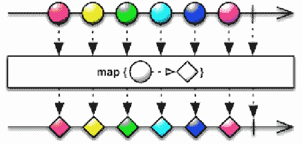
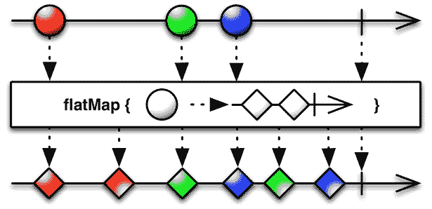
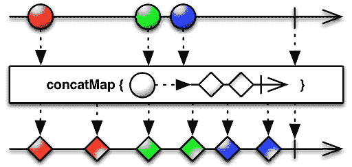
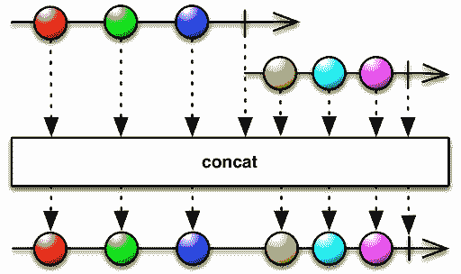
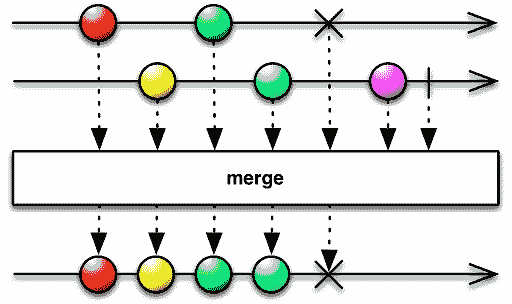

# 数据流计算和 RxCpp 库的介绍

从这一章开始，我们将深入了解响应式编程模型的核心。你可以把之前的章节看作是理解响应式编程模型的先决条件，更具体地说是使用 C++ 编程语言进行响应式编程的先决条件。回顾一下，我们已经涵盖了必要的先决条件，其中包括以下内容：

+   各种 GUI 平台上的事件编程模型

+   现代 C++ 语言的快速介绍（包括函数式编程）

+   C++ 中的语言级并发，以实现更好的并发系统

+   无锁编程模型（作为朝向声明式编程的一步）

+   高级设计模式和 Observables 的概念

+   使用 C++ 进行事件流编程

所有这些主题在**函数式响应式编程**（**FRP**）的情况下以系统化的方式结合在一起。在这里，FRP 缩写被用于使用函数式编程构造来编程响应式系统的宽泛意义上。

简而言之，响应式编程无非就是使用异步数据流进行编程。通过对流应用各种操作，我们可以实现不同的计算目标。在响应式程序中的主要任务是将数据转换为流，无论数据的来源是什么。事件流通常被称为**Observables**，事件流的订阅者被称为**Observers**。在 Observables 和 Observers 之间，有流操作符（过滤器/转换器）。

由于默认假设数据源在数据通过操作符时不会被改变，我们可以在 Observables 和 Observers 之间有多个操作符路径。不可变性为乱序执行提供了选项，并且调度可以委托给一个名为调度器的特殊软件。因此，Observables、Observers、流操作符和调度器构成了响应式编程模型的支柱。

在本章中，我们将涵盖以下主题：

+   关于数据流计算范式的简要讨论

+   介绍 RxCpp 库及其编程模型

+   一些基本的 RxCpp 程序来入门

+   Rx 流操作符

+   弹珠图

+   调度

+   `flatmap`/`concatmap` 的奇特之处

+   附加的 Rx 操作符

# 数据流计算范式

传统上，程序员以控制流的形式编码计算机程序。这意味着我们将程序编码为一系列小语句（顺序、分支、迭代）或函数（包括递归），以及它们关联的状态。我们使用诸如选择（`if`/`else`）、迭代（`while`/`for`）和函数（递归函数也包括在内）等构造来编码我们的计算。处理这些类型的程序的并发和状态管理真的很困难，并且在管理可变的状态信息时会导致微妙的错误。我们需要在共享的可变状态周围放置锁和其他同步原语。在编译器级别，语言编译器将解析源代码以生成**抽象语法树**（**AST**），进行类型分析和代码生成。实际上，AST 是一个信息流图，你可以在其中执行数据流分析（用于数据/寄存器级优化）和控制流分析，以利用处理器级别的代码管道优化。尽管程序员以控制流的形式编码程序，但编译器（至少部分）也试图以数据流的形式看待程序。这里的关键是，每个计算机程序中都存在一个潜在的隐式数据流图。

数据流计算将计算组织为一个显式图，其中节点是计算，边是数据在节点之间流动的路径。如果我们对计算图中的节点上的计算施加一些限制，例如通过在输入数据的副本上工作来保留数据状态（避免原地算法），我们可以利用并行性的机会。调度器将通过对图数据结构进行拓扑排序来找到并行性的机会。我们将使用流（`Path`）和流操作（`Node`）构建图数据结构。这可以以声明方式完成，因为操作符可以被编码为 lambda，对节点进行一些本地计算。有一组原始标准（函数/流）操作符，如`map`、`reduce`、`filter`、`take`等，被函数式编程社区确定，可以在流上工作。在每个数据流计算框架中，都有一种将数据转换为流的方法。用于机器学习的 TensorFlow 库就是一个使用数据流范式的库。尽管图的创建过程不是完全显式的，RxCpp 库也可以被视为一个数据流计算库。由于函数式编程构造支持惰性评估，当我们使用异步数据流和操作构建流水线时，我们实际上正在创建一个计算流图。这些图由调度子系统执行。

# RxCpp 库简介

我们将在本书的其余部分中使用 RxCpp 库来编写我们的响应式程序。RxCpp 库是一个仅包含头文件的 C++库，可以从 GitHub 仓库下载：[`reactive-extensions.github.io/RxCpp/`](http://reactive-extensions.github.io/RxCpp/)。RxCpp 库依赖于现代 C++构造，如语言级并发、lambda 函数/表达式、函数式组合/转换和运算符重载，以实现响应式编程构造。RxCpp 库的结构类似于`Rx.net`和`Rxjava`等库。与任何其他响应式编程框架一样，在编写第一行代码之前，每个人都应该了解一些关键构造。它们是：

+   Observables（Observable Streams）

+   观察者（订阅 Observables 的人）

+   操作符（例如，过滤器、转换和减少）

+   调度器

RxCpp 是一个仅包含头文件的库，大部分计算都基于 Observables 的概念。该库提供了许多原语，用于从各种数据源创建 Observable Streams。数据源可以是数组、C++范围、STL 容器等。我们可以在 Observables 和它们的消费者（被称为 Observers）之间放置 Operators。由于函数式编程支持函数的组合，我们可以将一系列操作符作为一个单一实体放置在 Observables 和订阅流的 Observers 之间。与库相关的调度器将确保当 Observable Streams 中有数据可用时，它将通过一系列 Operators 传递，并向订阅者发出通知。观察者将通过 on_next、on_completed 或 on_error lambda 收到通知，每当管道中发生重要事件时。因此，观察者可以专注于它们主要负责的任务，因为数据将通过通知到达它们。

# RxCpp 库及其编程模型

在这一部分，我们将编写一些程序，帮助读者理解 RxCpp 库的编程模型。这些程序的目的是阐明 Rx 概念，它们大多是微不足道的。代码将足以让程序员在进行轻微调整后将其纳入生产实现。在这一部分，数据生产者及其 Observables 将基于 C++范围、STL 容器等，以使清单足够简单，以便理解这里概述的核心概念。

# 一个简单的 Observable/Observer 交互

让我们编写一个简单的程序，帮助我们理解 RxCpp 库的编程模型。在这个特定的程序中，我们将有一个 Observable Stream 和一个订阅该 Stream 的 Observer。我们将使用一个范围对象从 1 到 12 生成一系列数字。在创建值的范围和一个 Observable 之后，我们将它们连接在一起。当我们执行程序时，它将在控制台上打印一系列数字。最后，一个字面字符串（"Oncompleted"）也将打印在控制台上。

```cpp
////////// 
// First.cpp 
// g++ -I<PathToRxCpplibfoldersrc> First.cpp 
#include "rxcpp/rx.hpp" 
#include <ioStream> 
int main() { 
 //------------- Create an Observable.. a Stream of numbers 
 //------------- Range will produce a sequence from 1 to 12 
 auto observable = rxcpp::observable<>::range(1, 12);
 //------------ Subscribe (only OnNext and OnCompleted Lambda given 
 observable.Subscribe(  
    [](int v){printf("OnNext: %dn", v);}, 
    [](){printf("OnCompleted\n");}); 
} 
```

前面的程序将在控制台上显示数字，并且字面字符串"`OnCompleted`"也将显示在控制台上。这个程序演示了如何创建一个 Observable Stream，并使用 subscribe 方法将 Observer 连接到创建的 Observable Stream。

# 使用 Observables 进行过滤和转换

以下程序将帮助我们理解过滤和`map`操作符的工作原理，以及使用 subscribe 方法将 Observer 连接到 Observable Streams 的通常机制。filter 方法对流的每个项目进行谓词评估，如果评估产生积极断言，该项目将出现在输出流中。`map`操作符对其输入流的每个元素应用一个 lambda 表达式，并在每次产生一个输出值（可以通过管道传播）时帮助产生一个输出值：

```cpp
/////////////////////////////////////// 
// Second.cpp 
#include "rxcpp/rx.hpp" 
#include <ioStream> 
int main() { 
  auto values = rxcpp::observable<>::range(1, 12). 
      filter([](int v){ return v % 2 ==0 ;}). 
      map([](int x) {return x*x;});  
  values.subscribe( 
           [](int v){printf("OnNext: %dn", v);}, 
           [](){printf("OnCompleted\n");}); 
} 
```

前面的程序生成一系列数字（作为 Observable），并通过一个 filter 函数传递流的内容。`filter`函数尝试检测数字是否为偶数。如果谓词为真，则数据将传递给`map`函数，该函数将对其输入进行平方。最终，流的内容将显示在控制台上。

# 从 C++容器中流出值

STL 容器中的数据被视为存在于空间中的数据（已经捕获的数据）。尽管 Rx 流用于处理随时间变化的数据（动态数据），我们可以将 STL 容器转换为 Rx 流。我们需要使用 Iterate 操作符进行转换。这在某些时候可能很方便，并且有助于集成使用 STL 的代码库中的代码。

```cpp
// STLContainerStream.cpp
#include "rxcpp/rx.hpp"
#include <ioStream>
#include <array>
int main() {
    std::array< int, 3 > a={{1, 2, 3}};
    auto values = rxcpp::observable<>::iterate(a);
    values.subscribe([](int v){printf("OnNext: %dn", v);},
    [](){printf("OnCompleted\n");});
}
```

# 从头开始创建 Observables

到目前为止，我们已经编写了代码，从一个范围对象或 STL 容器创建了一个 Observable Stream。让我们看看如何可以从头开始创建一个 Observable Stream。嗯，几乎：

```cpp
// ObserverFromScratch.cpp 
#include "rxcpp/rx.hpp" 
#include "rxcpp/rx-test.hpp" 
int main() { 
      auto ints = rxcpp::observable<>::create<int>( 
                  [](rxcpp::subscriber<int> s){ 
                       s.on_next(1); 
                       s.on_next(4); 
                       s.on_next(9); 
                       s.on_completed(); 
                 }); 
    ints.subscribe( [](int v){printf("OnNext: %dn", v);}, 
                             [](){printf("OnCompletedn");}); 
} 
```

前面的程序调用`on_ext`方法来发出一系列完全平方数。这些数字（1,4,9）将被打印到控制台上。

# 连接 Observable Streams

我们可以连接两个流来形成一个新的流，在某些情况下这可能很方便。让我们通过编写一个简单的程序来看看这是如何工作的：

```cpp
//------------- Concactatenate.cpp 
#include "rxcpp/rx.hpp" 
#include "rxcpp/rx-test.hpp" 
int main() { 
 auto values = rxcpp::observable<>::range(1);  
 auto s1 = values.take(3).map([](int prime) { return 2*prime;);}); 
 auto s2 = values.take(3).map([](int prime) { return prime*prime);}); 
 s1.concat(s2).subscribe(rxcpp::util::apply_to( 
            []( int p) { printf(" %dn", p);})); 
} 
```

concat 操作符通过保持顺序，将组成的 Observable Streams 的内容依次附加在一起。在前面的代码中，在创建一个 Observable（values）之后，我们创建了另外两个 Observables（s1 和 s2），并附加了第二个 Observable Stream（s2）生成的内容，以产生一个组合的 Observable Stream（s1.concat(s2)）。最后，我们订阅了组合的 Observable。

# 取消订阅 Observable Streams

以下程序展示了如何订阅 Observable 并在需要时停止订阅。在某些程序的情况下，这个选项非常有用。请参阅 Rxcpp 文档，了解更多关于订阅以及如何有效使用它们的信息。与此同时，以下程序将演示如何取消订阅 Observable。

```cpp
//---------------- Unsubscribe.cpp 
#include "rxcpp/rx.hpp" 
#include "rxcpp/rx-test.hpp" 
#include <iostream> 
int main() { 
    auto subs = rxcpp::composite_subscription(); 
    auto values = rxcpp::observable<>::range(1, 10); 
    values.subscribe( 
        subs,&subs{ 
            printf("OnNext: %dn", v); 
            if (v == 6) 
                subs.unsubscribe(); //-- Stop recieving events 
        }, 
        [](){printf("OnCompletedn");}); 
}

```

在上面的程序中，当发出的值达到阈值时，我们调用取消订阅（subs.unsubscribe()）方法。

# 关于大理石图表的视觉表示的介绍

很难将 Rx Streams 可视化，因为数据是异步流动的。Rx 系统的设计者创建了一组名为**大理石图表**的可视化线索：让我们编写一个小程序，并将 map 操作符的逻辑描述为大理石图表。

```cpp
//------------------ Map.cpp 
#include "rxcpp/rx.hpp" 
#include "rxcpp/rx-test.hpp" 
#include <ioStream> 
#include <array> 
int main() { 
    auto ints = rxcpp::observable<>::range(1,10). 
                 map( [] ( int n  ) {return n*n; }); 
    ints.subscribe( 
            [](int v){printf("OnNext: %dn", v);}, 
            [](){printf("OnCompletedn");}); 
} 
```

与其描述大理石图表，不如看一个描述 `map` 操作符的大理石图表：



大理石图表的顶部显示了一个时间线，其中显示了一系列值（表示为圆圈）。每个值将通过一个 map 操作符，该操作符以 lambda 作为参数。lambda 将应用于流的每个元素，以产生输出流（在图表的底部部分显示为菱形）。

# RxCpp（流）操作符

流导向处理的主要优势之一是我们可以在其上应用函数式编程原语。在 RxCpp 术语中，处理是使用操作符完成的。它们只是对流的过滤、转换、聚合和减少。我们已经看到了 `map`、`filter` 和 `take` 操作符在之前的示例中是如何工作的。让我们进一步探索它们。

# 平均值操作符

`average` 操作符计算来自 Observable Streams 的值的算术平均值。其他支持的统计操作符包括：

+   Min

+   Max

+   计数

+   Sum

以下程序只是演示了 `average` 操作符。在前面的列表中，其他操作符的模式是相同的：

```cpp
//----------- Average.cpp 
#include "rxcpp/rx.hpp" 
#include "rxcpp/rx-test.hpp" 
#include <ioStream> 
int main() { 
    auto values = rxcpp::observable<>::range(1, 20).average(); 
    values.subscribe( 
            [](double v){printf("average: %lfn", v);}, 
            [](){printf("OnCompletedn");}); 
} 
```

# 扫描操作符

`scan` 操作符对流的每个元素依次应用函数，并将值累积到种子值中。以下程序在值累积时产生一系列数字的平均值：

```cpp
//----------- Scan.cpp 
#include "rxcpp/rx.hpp" 
#include "rxcpp/rx-test.hpp" 
#include <ioStream> 
int main() { 
    int count = 0; 
    auto values = rxcpp::observable<>::range(1, 20). 
        scan( 0,&count{ 
                count++; 
                return seed + v; 
            }); 
    values.subscribe( 
        &{printf("Average through Scan: %fn", (double)v/count);}, 
        [](){printf("OnCompletedn");}); 
} 
```

运行平均值将打印到控制台。在调用 `OnCompleted` 之前，`OnNext functor` 将被调用二十次。

# 通过管道操作符组合操作符

RxCpp 库允许开发者链式或组合操作符以启用操作符组合。该库允许您使用 `pipe` (`|`) 操作符来组合操作符（而不是使用 "." 的通常流畅接口），程序员可以将一个操作符的输出管道传递给另一个，就像在 UNIX shell 的命令行中一样。这有助于理解（代码的作用是什么）。以下程序使用 `|` 操作符来映射一个范围。RxCpp 示例包含许多使用管道函数的示例：

```cpp
//------------------ Map_With_Pipe.cpp 
#include "rxcpp/rx.hpp" 
#include "rxcpp/rx-test.hpp" 
namespace Rx { 
using namespace rxcpp; 
using namespace rxcpp::sources; 
using namespace rxcpp::operators; 
using namespace rxcpp::util; 
} 
using namespace Rx; 
#include <ioStream> 
int main() { 
    //---------- chain map to the range using the pipe operator 
    //----------- avoids the use of . notation. 
    auto ints = rxcpp::observable<>::range(1,10) |  
                 map( [] ( int n  ) {return n*n; }); 
    ints.subscribe( 
            [](int v){printf("OnNext: %dn", v);}, 
            [](){printf("OnCompletedn");}); 
}
```

# 使用调度器

我们已经在上面的部分学习了 Observables、Operators 和 Observers。我们现在知道，在 Observables 和 Observers 之间，我们可以应用标准的 Rx 操作符来过滤和转换流。在函数式编程的情况下，我们编写不可变的函数（没有副作用的函数），不可变性的结果是可能出现无序执行。如果我们可以保证操作符的输入永远不会被修改，那么执行函数/函子的顺序就不重要了。由于 Rx 程序将操作多个 Observables 和 Observers，我们可以将选择执行顺序的任务委托给调度程序模块。默认情况下，Rxcpp 是单线程的。RxCpp 将在我们调用`subscribe`方法的线程中安排操作符的执行。可以使用`observe_on`和`subscribe_on`操作符指定不同的线程。此外，一些 Observable 操作符以调度程序作为参数，执行可以在调度程序管理的线程中进行。

RxCpp 库支持以下两种调度程序类型：

+   `ImmediateScheduler`

+   `EventLoopScheduler`

RxCpp 库默认是单线程的。但是你可以使用特定的操作符来配置它在多个线程中运行：

```cpp
//----------ObserveOn.cpp 
#include "rxcpp/rx.hpp" 
#include "rxcpp/rx-test.hpp" 
#include <ioStream> 
#include <thread> 
int main(){ 
 //---------------- Generate a range of values 
 //---------------- Apply Square function 
 auto values = rxcpp::observable<>::range(1,4). 
               map([](int v){ return v*v;}); 
 //------------- Emit the current thread details 
 std::cout  << "Main Thread id => "  
            << std::this_thread::get_id()  
            << std::endl; 
 //---------- observe_on another thread.... 
 //---------- make it blocking to  
 //--------- Consult the Rxcpp documentation on observe_on and schedulers
 values.observe_on(rxcpp::synchronize_new_thread()).as_blocking(). 
 subscribe( [](int v){  
                   std::cout << "Observable Thread id => "  
                             << std::this_thread::get_id()  
                             << "  " << v << std::endl ;}, 
                  [](){ std::cout << "OnCompleted" << std::endl; }); 
 //------------------ Print the main thread details 
 std::cout << "Main Thread id => "  
           << std::this_thread::get_id()  
           << std::endl;   
} 
```

前面的程序将产生以下输出。我们将使用 STD C++线程 ID 来帮助我们区分在新线程中安排的项目（其中一个与主线程不同）：

```cpp
Main Thread id => 1 
Observable Thread id => 2  1 
Observable Thread id => 2  4 
Observable Thread id => 2  9 
Observable Thread id => 2  16 
OnCompleted 
Main Thread id => 1 
```

以下程序将演示`subscribe_on`方法的用法。在行为上，`observe_on`和`subscribe_on`方法之间存在微妙的差异。以下列表的目的是展示声明式调度的选项：

```cpp
//---------- SubscribeOn.cpp 
#include "rxcpp/rx.hpp" 
#include "rxcpp/rx-test.hpp" 
#include <ioStream> 
#include <thread> 
#include <mutex> 
//------ A global mutex for output synch. 
std::mutex console_mutex; 
//------ Print the Current Thread details 
void CTDetails() { 
   console_mutex.lock(); 
   std::cout << "Current Thread id => "  
           << std::this_thread::get_id()  << std::endl;  
   console_mutex.unlock();  
} 
//---------- a function to Yield control to other threads 
void Yield( bool y ) { 
   if (y) { std::this_thread::yield(); } 

} 
int main(){ 
    auto threads = rxcpp::observe_on_event_loop(); 
    auto values = rxcpp::observable<>::range(1); 
    //------------- Schedule it in another thread 
    auto s1 = values.subscribe_on(threads). 
        map([](int prime) {  
             CTDetails(); Yield(true); return std::make_tuple("1:", prime);}); 
    //-------- Schedule it in Yet another theread 
    auto s2 = values. subscribe_on(threads).  
        map([](int prime) { 
           CTDetails(); Yield(true) ; return std::make_tuple("2:", prime);}); 

    s1.merge(s2). take(6).as_blocking().subscribe(rxcpp::util::apply_to( 
            [](const char* s, int p) { 
                CTDetails(); 
                console_mutex.lock(); 
                printf("%s %dn", s, p); 
                console_mutex.unlock(); 
            })); 
} 
```

# 两个操作符的故事- flatmap 与 concatmap

开发人员经常围绕 flatmap 和`concatmap`操作符产生困惑。它们的区别非常重要，我们将在本节中进行介绍。让我们看一下 flatmap 操作符以及它的工作原理：

```cpp
//----------- Flatmap.cpp 
#include "rxcpp/rx.hpp" 
#include "rxcpp/rx-test.hpp" 
#include <ioStream> 
namespace rxu=rxcpp::util; 
#include <array> 
int main() { 
     std::array< std::string,4 > a={{"Praseed", "Peter", "Sanjay","Raju"}}; 
     //---------- Apply Flatmap on the array of names 
     //---------- Flatmap returns an Observable<T> ( map returns T ) 
     //---------- The First lamda creates a new Observable<T> 
     //---------- The Second Lambda manipulates primary Observable and  
     //---------- Flatmapped Observable 
     auto values = rxcpp::observable<>::iterate(a).flat_map( 
              [] (std::string v ) { 
                   std::array<std::string,3> salutation= 
                       { { "Mr." ,  "Monsieur" , "Sri" }}; 
                   return rxcpp::observable<>::iterate(salutation); 
              }, 
              [] ( std::string f , std::string s ) {return s + " " +f;}); 
     //-------- As usual subscribe  
     //-------- Here the value will be interleaved as flat_map merges the  
     //-------- Two Streams 
     values.subscribe(  
              [] (std::string f) { std::cout << f <<  std::endl; } ,  
              [] () {std::cout << "Hello World.." << std::endl;} ); 
      } 
```

前面的程序产生了不可预测的输出序列。程序的一次运行的输出如下所示。这不一定是再次运行时得到的结果。这种行为的原因与映射操作后的流的后处理有关：flatmap 使用 merge 操作符对流进行后处理。

```cpp
Mr. Praseed 
Monsieur Praseed 
Mr. Peter 
Sri Praseed 
Monsieur Peter 
Mr. Sanjay 
Sri Peter 
Monsieur Sanjay 
Mr. Raju 
Sri Sanjay 
Monsieur Raju 
Sri Raju 
Hello World.. 
```

以下的弹珠图显示了操作的模式。`flat_map`对 Observable Stream 应用 lambda 并产生一个新的 Observable Stream。产生的流被合并在一起以提供输出。在图中，红色的球被转换成一对红色的菱形，而绿色和蓝色的球的输出在新创建的 Observable 中产生交错的菱形：



让我们通过以下列表来看一下`concat_map`操作符。程序列表与之前的程序相同。唯一的变化是用`concat_map`替换了`flat_map`。尽管列表中没有实际区别，但输出行为上有明显的不同。也许`concat_map`产生的输出更适合程序员的同步心理模型：

```cpp
//----------- ConcatMap.cpp 
#include "rxcpp/rx.hpp" 
#include "rxcpp/rx-test.hpp" 
#include <ioStream> 
namespace rxu=rxcpp::util; 

#include <array> 
int main() { 

     std::array< std::string,4 > a={{"Praseed", "Peter", "Sanjay","Raju"}}; 
     //---------- Apply Concat map on the array of names 
     //---------- Concat Map returns an Observable<T> ( oncat returns T ) 
     //---------- The First lamda creates a new Observable<T> 
     //---------- The Second Lambda manipulates primary Observable and  
     //---------- Concatenated Observable 
     auto values = rxcpp::observable<>::iterate(a).flat_map( 
              [] (std::string v ) { 
                   std::array<std::string,3> salutation= 
                       { { "Mr." ,  "Monsieur" , "Sri" }}; 
                   return rxcpp::observable<>::iterate(salutation); 
              }, 
              [] ( std::string f , std::string s ) {return s + " " +f;}); 

     //-------- As usual subscribe  
     //-------- Here the value will be interleaved as concat_map concats the  
     //-------- Two Streams 
     values.subscribe(  
              [] (std::string f) { std::cout << f <<  std::endl; } ,  
              [] () {std::cout << "Hello World.." << std::endl;} ); 
 } 
```

输出将如下所示：

```cpp
Mr. Praseed 
Monsieur Praseed 
Sri Praseed 
Mr. Peter 
Monsieur Peter 
Sri Peter 
Mr. Sanjay 
Monsieur Sanjay 
Sri Sanjay 
Mr. Raju 
Monsieur Raju 
Sri Raju 
Hello World.. 
```

以下的弹珠图显示了`concat_map`的操作。与 Flatmap 弹珠图不同，输出是同步的（红色、绿色和蓝色的球按照输入处理的顺序产生相同颜色的输出）：



在`flat_map`的情况下，我们以交错的方式得到了输出。但在`concat_map`的情况下，我们按照预期的顺序得到了值。这里真正的区别是什么？为了澄清区别，让我们看看两个操作符：`concat`和`merge`。让我们看看流的连接方式。它基本上是将流的内容一个接一个地附加，保持顺序：

```cpp
//---------------- Concat.cpp 
#include "rxcpp/rx.hpp" 
#include "rxcpp/rx-test.hpp" 
#include <ioStream> 
#include <array> 
int main() { 
    auto o1 = rxcpp::observable<>::range(1, 3); 
    auto o3 = rxcpp::observable<>::from(4, 6); 
    auto values = o1.concat(o2); 
    values.subscribe( 
            [](int v){printf("OnNext: %dn", v);},[](){printf("OnCompletedn");}); 
} 
```

以下弹珠图清楚地显示了当`concat`操作符应用于两个流时会发生什么。我们通过将第二个流的内容附加到第一个流的内容来创建一个新流。这保留了顺序：



现在，让我们看看当两个流合并时会发生什么。以下代码显示了如何合并两个流：

```cpp
//------------ Merge.cpp 
#include "rxcpp/rx.hpp" 
#include "rxcpp/rx-test.hpp" 
#include <ioStream> 
#include <array> 
int main() { 
    auto o1 = rxcpp::observable<>::range(1, 3); 
    auto o2 = rxcpp::observable<>::range(4, 6); 
    auto values = o1.merge(o2); 
    values.subscribe( 
            [](int v){printf("OnNext: %dn", v);}, 
             [](){printf("OnCompletedn");}); 
} 
```

以下弹珠图清楚地显示了当我们合并两个 Observable 流时会发生什么。输出流的内容将是两个流的交错组合：



`flat_map`和`concat_map`基本上做相同的操作。区别在于值的组合方式。`flat_map`使用`merge`操作符，而`concact_map`使用`concact`操作符进行结果的后处理。在`merge`的情况下，顺序并不重要。`concat`操作符将 Observable 一个接一个地附加。这就是为什么使用`concat_map`会得到同步的输出，而`flat_map`会产生无序的结果。

# 其他重要操作符

我们现在理解了响应式编程模型的要点，因为我们涵盖了诸如 Observables、Observers、Operators 和 Schedulers 等基本主题。还有一些我们应该了解以更好地编写逻辑的操作符。在本节中，我们将介绍`tap`、`defer`和`buffer`操作符。我们将首先探讨`tap`操作符，它可以帮助查看流的内容：

```cpp
//----------- TapExample.cpp 
#include "rxcpp/rx.hpp" 
#include "rxcpp/rx-test.hpp" 
#include <ioStream> 
int main() { 
    //---- Create a mapped Observable 
     auto ints = rxcpp::observable<>::range(1,3). 
                 map( [] ( int n  ) {return n*n; }); 
     //---- Apply the tap operator...The Operator  
     //---- will act as a filter/debug operator 
     auto values = ints.tap( 
          [](int v)  {printf("Tap -       OnNext: %dn", v);}, 
          [](){printf("Tap -       OnCompletedn"); 
     }); 
     //------- Do some action 
     values.subscribe( 
          [](int v){printf("Subscribe - OnNext: %dn", v);}, 
          [](){printf("Subscribe - OnCompletedn");}); 
 } 
```

现在，让我们看看`defer`操作符。`defer`操作符将 Observable 工厂作为参数，为每个订阅它的客户端创建一个 Observable。在下面的程序中，当有人尝试连接到指定的 Observable 时，我们调用`observable_factory` lambda：

```cpp
//----------- DeferExample.cpp 
#include "rxcpp/rx.hpp" 
#include "rxcpp/rx-test.hpp" 
#include <ioStream> 
int main() { 
    auto observable_factory = [](){ 
         return rxcpp::observable<>::range(1,3). 
                 map( [] ( int n  ) {return n*n; }); 
    }; 
    auto ints = rxcpp::observable<>::defer(observable_factory); 
    ints.subscribe([](int v){printf("OnNext: %dn", v);}, 
            [](){printf("OnCompletedn");}); 
    ints.subscribe( 
            [](int v){printf("2nd OnNext: %dn", v);}, 
            [](){printf("2nd OnCompletedn");}); 
} 
```

`buffer`操作符发出一个 Observable，其中包含 Observable 的非重叠内容，每个 Observable 最多包含由 count 参数指定的项目数。这将帮助我们以适合内容的方式处理项目：

```cpp
//----------- BufferExample.cpp 
#include "rxcpp/rx.hpp" 
#include "rxcpp/rx-test.hpp" 
#include <ioStream> 
int main() { 
   auto values = rxcpp::observable<>::range(1, 10).buffer(2); 
   values.subscribe( [](std::vector<int> v){ 
                printf("OnNext:{"); 
                std::for_each(v.begin(), v.end(), [](int a){ 
                    printf(" %d", a); 
                }); 
                printf("}n"); 
            }, 
            [](){printf("OnCompletedn");}); 
} 
```

`timer`操作符发出一个 Observable，以间隔周期作为参数。有一个选项可以指定`Scheduler`对象作为参数。库中有这个函数的各种版本；我们在下面的代码中展示了其中一个：

```cpp
//----------- TimerExample.cpp 
#include "rxcpp/rx.hpp" 
#include "rxcpp/rx-test.hpp" 
#include <ioStream> 
int main() { 
     auto Scheduler = rxcpp::observe_on_new_thread(); 
     auto period = std::chrono::milliseconds(1); 
     auto values = rxcpp::observable<>::timer(period, Scheduler). 
            finally([](){ 
            printf("The final actionn"); 
        });     
      values.as_blocking().subscribe( 
         [](int v){printf("OnNext: %dn", v);}, 
         [](){printf("OnCompletedn");}); 
} 
```

# 我们尚未涵盖的事物一瞥

Rx 编程模型可以被认为是以下内容的汇合：

+   数据流计算

+   声明式并发

+   函数式编程

+   流处理（事件）

+   设计模式和习语

要全面了解整个学科，您需要广泛地使用编程模型。最初，事情不会有太多意义。在某个时候，您会达到一个*点燃点*，一切都会开始有意义。到目前为止，我们已经涵盖了以下主题：

+   Observables 和 Observers

+   基本和中级操作符

+   基本和中级调度

这只是一个开始，我们需要涵盖更多的主题，以熟悉编程模型。它们是：

+   热和冷 Observables（第八章，*RxCpp - 关键元素*）

+   Rx 组件的详细探索（[第八章](https://cdp.packtpub.com/c___reactive_programming/wp-admin/post.php?post=79&action=edit#post_86)，*RxCpp - 关键元素*）

+   高级调度（[第八章](https://cdp.packtpub.com/c___reactive_programming/wp-admin/post.php?post=79&action=edit#post_86)，*RxCpp - 关键元素*）

+   编程 GUI 系统（[第九章](https://cdp.packtpub.com/c___reactive_programming/wp-admin/post.php?post=79&action=edit#post_86)，*使用 Qt/C++进行响应式 GUI 编程*）

+   高级操作符（[第十章](https://cdp.packtpub.com/c___reactive_programming/wp-admin/post.php?post=79&action=edit#post_86)，在 RxCpp 中创建自定义操作符）

+   响应式设计模式（第十一章，*C++ Rx 编程的设计模式和习语*）

+   编程的健壮性（第十三章，*高级流和错误处理*）

# 总结

在本章中，我们在理解 Rx 编程模型和 RxCpp 库方面涵盖了相当多的内容。我们从数据流计算范式的概念概述开始，迅速转向编写一些基本的 RxCpp 程序。在介绍 Rx 弹珠图后，我们了解了 RxCpp 库支持的一组操作符。我们还介绍了调度器这一重要主题，最后讨论了`flatmap`和`concatmap`操作符之间的区别。在下一章中，我们将涵盖`hot`和`cold`可观察对象，高级调度以及一些本章未涵盖的主题。
