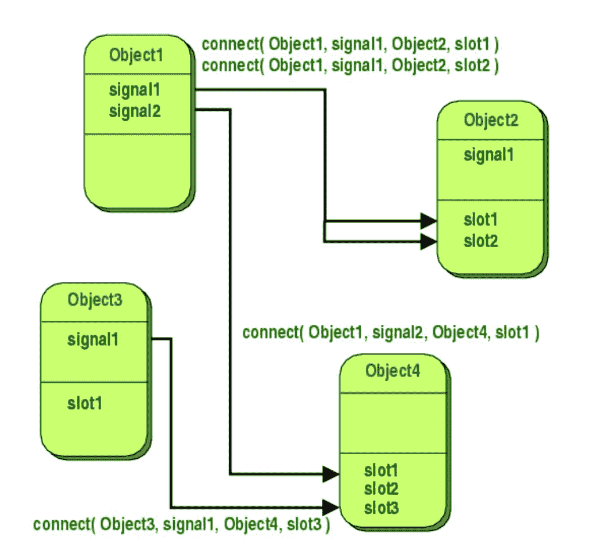
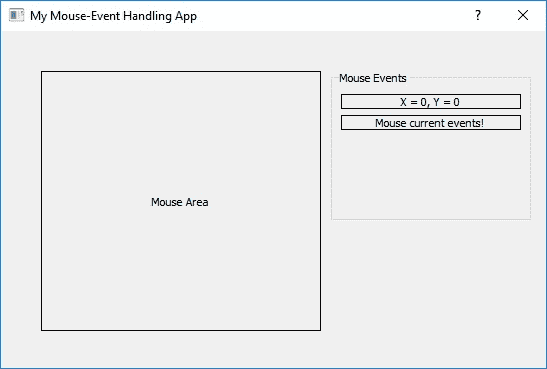

# 第九章：使用 Qt/C++进行响应式 GUI 编程

Qt（发音为可爱）生态系统是一个全面的基于 C++的框架，用于编写跨平台和多平台 GUI 应用程序。如果您使用库的可移植核心编写程序，可以利用该框架支持的“一次编写，到处编译”范式。在某些情况下，人们使用特定于平台的功能，例如支持 ActiveX 编程模型以编写基于 Windows 的应用程序。

我们遇到了一些情况，Qt 在 Windows 上编写应用程序时优于 MFC。这可能是因为编程简单，因为 Qt 仅使用 C++语言特性的一个非常小的子集来构建其库。该框架的最初目标当然是跨平台开发。Qt 在各个平台上的单一源可移植性、功能丰富性、源代码的可用性以及完善的文档使其成为一个非常友好的框架。这些特点使其在 1995 年首次发布以来，已经繁荣了二十多年。

Qt 提供了一个完整的接口环境，支持开发多平台 GUI 应用程序、Webkit API、媒体流、文件系统浏览器、OpenGL API 等。涵盖这个精彩库的全部功能需要一本专门的书。本章的目的是介绍如何通过利用 Qt 和 RxCpp 库来编写响应式 GUI 应用程序。我们已经在第七章“数据流计算和 RxCpp 库介绍”和第八章“RxCpp - 关键元素”中介绍了响应式编程模型的核心。现在是时候将我们在前几章中学到的知识付诸实践了！Qt 框架本身具有强大的事件处理系统，人们需要学习这些库特性，然后才能将 RxCpp 构造整合到其中。

在本章中，我们将探讨：

+   Qt GUI 编程的快速介绍

+   Hello World - Qt 程序

+   Qt 事件模型，使用信号/槽/MOC - 一个例子

+   将 RxCpp 库与 Qt 事件模型集成

+   在 Rxcpp 中创建自定义操作符

# Qt GUI 编程的快速介绍

Qt 是一个跨平台应用程序开发框架，用于编写可以在多个平台上作为本机应用程序运行的软件，而无需更改太多代码，具有本机平台功能和速度。除了 GUI 应用程序，我们还可以使用该框架编写控制台或命令行应用程序，但主要用例是图形用户界面。

尽管使用 Qt 编写的应用程序通常是用 C++编写的，但也存在 QML 绑定到其他语言的情况。Qt 简化了 C++开发的许多方面，使用了全面而强大的 API 和工具。Qt 支持许多编译器工具链，如 GCC C++编译器和 Visual C++编译器。Qt 还提供了 Qt Quick（包括 QML，一种基于 ECMAScript 的声明性脚本语言）来编写逻辑。这有助于快速开发移动平台应用程序，尽管逻辑可以使用本机代码编写以获得最佳性能。ECMAScript/C++组合提供了声明式开发和本机代码速度的最佳结合。

Qt 目前由 The Qt Company 开发和维护，并且该框架可用于开源和专有许可证。刚开始时，Qt 使用自己的绘图引擎和控件来模拟不同平台的外观和感觉（由于自定义绘图引擎，可以在 GNU Linux 下创建 Windows 的外观和感觉）。这有助于开发人员轻松地跨平台移植，因为目标平台依赖性很小。由于模拟不完美，Qt 开始使用平台的本机样式 API，以及自己的本机小部件集。这解决了 Qt 自己的绘图引擎模拟的问题，但代价是在各个平台上不再具有统一的外观和感觉。Qt 库与 Python 编程语言有很好的绑定，被称为 PyQt。

在程序员利用库之前，有一些基本的东西程序员必须了解。在接下来的几节中，我们将快速介绍 Qt 对象模型、信号和槽、事件系统和元对象系统的方面。

# Qt 对象模型

在 GUI 框架中，运行时效率和高级灵活性是关键因素。标准 C++对象模型提供了非常高效的运行时支持，但其静态性在某些问题领域是不灵活的。Qt 框架将 C++的速度与 Qt 对象模型的灵活性结合起来。

Qt 对象模型支持以下功能：

+   **信号和槽**，用于无缝对象通信

+   可查询和可设计的**对象属性**

+   强大的事件和事件过滤器

+   强大的内部驱动定时器，实现在事件驱动的 GUI 中许多任务的平滑、非阻塞工作

+   **国际化**与上下文字符串翻译

+   受保护的指针（**QPointers**），当引用的对象被销毁时自动设置为 0

+   跨库边界工作的**动态转换**

其中许多功能是作为标准 C++类实现的，基于从`QObject`继承。其他功能，如信号和槽以及对象属性系统，需要 Qt 自己的**元对象编译器**（**MOC**）提供的元对象系统。元对象系统是 C++语言的扩展，使其更适合 GUI 编程。MOC 充当预编译器，根据源代码中嵌入的提示生成代码，并删除这些提示，以便 ANSI C++编译器执行其正常的编译任务。

让我们来看看 Qt 对象模型中的一些类：

| **类名** | **描述** |
| --- | --- |
| `QObject` | 所有 Qt 对象的基类（[`doc.qt.io/archives/qt-4.8/qobject.html`](http://doc.qt.io/archives/qt-4.8/qobject.html)） |
| `QPointer` | 为`QObject`提供受保护指针的模板类（[`doc.qt.io/archives/qt-4.8/qpointer.html`](http://doc.qt.io/archives/qt-4.8/qpointer.html)） |
| `QSignalMapper` | 将可识别发送者的信号捆绑在一起（[`doc.qt.io/archives/qt-4.8/qsignalmapper.html`](http://doc.qt.io/archives/qt-4.8/qsignalmapper.html)） |
| `QVariant` | 作为最常见的 Qt 数据类型的联合体（[`doc.qt.io/archives/qt-4.8/qvariant.html`](http://doc.qt.io/archives/qt-4.8/qvariant.html)） |
| `QMetaClassInfo` | 类的附加信息（[`doc.qt.io/archives/qt-4.8/qmetaclassinfo.html`](http://doc.qt.io/archives/qt-4.8/qmetaclassinfo.html)） |
| `QMetaEnum` | 枚举类型的元数据（[`doc.qt.io/archives/qt-4.8/qmetaenum.html`](http://doc.qt.io/archives/qt-4.8/qmetaenum.html)） |
| `QMetaMethod` | 成员函数的元数据（[`doc.qt.io/archives/qt-4.8/qmetamethod.html`](http://doc.qt.io/archives/qt-4.8/qmetamethod.html)） |
| `QMetaObject` | 包含有关 Qt 对象的元信息（[`doc.qt.io/archives/qt-4.8/qmetaobject.html`](http://doc.qt.io/archives/qt-4.8/qmetaobject.html)） |
| `QMetaProperty` | 关于属性的元数据（[`doc.qt.io/archives/qt-4.8/qmetaproperty.html`](http://doc.qt.io/archives/qt-4.8/qmetaproperty.html)） |
| `QMetaType` | 管理元对象系统中的命名类型（[`doc.qt.io/archives/qt-4.8/qmetatype.html`](http://doc.qt.io/archives/qt-4.8/qmetatype.html)） |
| `QObjectCleanupHandler` | 监视多个`QObject`的生命周期（[`doc.qt.io/archives/qt-4.8/qobjectcleanuphandler.html`](http://doc.qt.io/archives/qt-4.8/qobjectcleanuphandler.html)） |

Qt 对象通常被视为标识，而不是值。标识被克隆，而不是复制或分配；克隆标识是比复制或分配值更复杂的操作。因此，`QObject`和所有`QObject`的子类（直接或间接）都禁用了它们的复制构造函数和赋值运算符。

# 信号和槽

信号和槽是 Qt 中用于实现对象间通信的机制。信号和槽机制是 Qt 的一个核心特性，作为 GUI 框架。在 Qt 中，小部件通过这种机制得知其他小部件的变化。一般来说，任何类型的对象都使用这种机制相互通信。例如，当用户点击关闭按钮时，我们可能希望调用窗口的`close()`函数。

信号和槽是 C/C++中回调技术的替代品。当特定事件发生时，会发出信号。Qt 框架中的所有小部件都有预定义的信号，但我们总是可以对小部件进行子类化，以添加我们自己的信号。槽是响应信号调用的函数。与预定义信号类似，Qt 小部件有许多预定义的槽，但我们可以添加自定义槽来处理我们感兴趣的信号。

来自 Qt 官方文档（[`doc.qt.io/archives/qt-4.8/signalsandslots.html`](http://doc.qt.io/archives/qt-4.8/signalsandslots.html)）的以下图表演示了通过信号和槽进行对象间通信的过程：



信号和槽是松散耦合的通信机制；发出信号的类不关心接收信号的槽。信号是忘记即发的完美例子。信号和槽系统确保如果信号连接到槽，槽将在适当的时间以信号的参数被调用。信号和槽都可以接受任意数量和任意类型的参数，并且它们是完全类型安全的。因此，信号和接收槽的签名必须匹配；因此，编译器可以帮助我们检测类型不匹配，作为一个奖励。

所有从`QObject`或其任何子类（如`QWidget`）继承的对象都可以包含信号和槽。当对象改变其状态时，会发出信号，这可能对其他对象很有趣。对象不知道（或不关心）接收端是否有任何对象。一个信号可以连接到尽可能多的槽。同样，我们可以将尽可能多的信号连接到单个槽。甚至可以将一个信号连接到另一个信号；因此，信号链是可能的。

因此，信号和系统一起构成了一个非常灵活和可插拔的组件编程机制。

# 事件系统

在 Qt 中，事件代表应用程序中发生的事情或应用程序需要知道的用户活动。在 Qt 中，事件是从抽象的`QEvent`类派生的对象。任何`QObject`子类的实例都可以接收和处理事件，但它们对小部件特别相关。

每当事件发生时，适当的`QEvent`子类实例被构造，并通过调用其`event()`函数将其所有权交给特定的`QObject`实例（或任何相关的子类）。这个函数本身不处理事件；根据传递的事件类型，它调用特定类型事件的事件处理程序，并根据事件是否被接受或被忽略发送响应。

一些事件，比如`QCloseEvent`和`QMoveEvent`，来自应用程序本身；一些，比如`QMouseEvent`和`QKeyEvent`，来自窗口系统；还有一些，比如`QTimerEvent`，来自其他来源。大多数事件都有从`QEvent`派生的特定子类，并且有时还有特定于事件的函数来满足扩展事件的特定行为。举例来说，`QMouseEvent`类添加了`x()`和`y()`函数，以便小部件发现鼠标光标的位置。

每个事件都有与之关联的类型，在`QEvent::Type`下定义，这是一种方便的运行时类型信息的来源，用于快速识别事件从哪个子类构造而来。

# 事件处理程序

通常，通过调用相关的虚函数来渲染事件。虚函数负责按预期响应。如果自定义虚函数实现不执行所有必要的操作，我们可能需要调用基类的实现。

例如，以下示例处理自定义标签小部件上的鼠标左键单击，同时将所有其他按钮单击传递给基类`QLabel`类：

```cpp
void my_QLabel::mouseMoveEvent(QMouseEvent *evt)
{
    if (event->button() == Qt::LeftButton) {
        // handle left mouse button here
        qDebug() <<" X: " << evt->x() << "t Y: " << evt->y() << "n";
    }
    else {
        // pass on other buttons to base class
        QLabel::mouseMoveEvent(event);
    }
}
```

如果我们想要替换基类功能，我们必须在虚函数覆盖中实现所有内容。如果要求只是简单地扩展基类功能，我们可以实现我们想要的内容，并调用基类函数处理我们不想处理的其他情况。

# 发送事件

许多使用 Qt 框架的应用程序希望发送自己的事件，就像框架提供的事件一样。可以通过使用事件对象构造适当的自定义事件，并使用`QCoreApplication::sendEvent()`和`QCoreApplication::postEvent()`发送它们。

`sendEvent()`是同步执行的；因此，它会立即处理事件。对于许多事件类，有一个名为`isAccepted()`的函数，告诉我们上一个被调用的处理程序是否接受或拒绝了事件。

`postEvent()`是异步执行的；因此，它将事件发布到队列中以供以后调度。下次 Qt 的主事件循环运行时，它会调度所有发布的事件，进行一些优化。例如，如果有多个调整大小事件，它们会被压缩成一个，作为所有调整大小事件的并集，从而避免用户界面的闪烁。

# 元对象系统

Qt 元对象系统实现了信号和槽机制用于对象间通信，动态属性系统和运行时类型信息。

Qt 元对象系统基于三个关键方面：

+   `QObject`类：为 Qt 对象提供元对象系统的优势的基类

+   `Q_OBJECT`宏：在类声明的私有部分提供的宏，用于启用元对象特性，如动态属性、信号和槽

+   MOC：为每个`QObject`子类提供实现元对象特性所需的代码

MOC 在 Qt 源文件的实际编译之前执行。当 MOC 发现包含`Q_OBJECT`宏的类声明时，它会为这些类中的每一个生成另一个带有元对象代码的 C++源文件。生成的源文件要么通过`#include`包含在类的源文件中，要么更常见的是与类的实现一起编译和链接。

# Hello World - Qt 程序

现在，让我们开始使用 Qt/C++进行 GUI 应用程序开发。在进入下面的章节之前，从 Qt 的官方网站([`www.qt.io/download`](https://www.qt.io/download))下载 Qt SDK 和 Qt Creator。我们将在本章讨论的代码完全符合 LGPL，并且将通过编写纯 C++代码手工编码。Qt 框架旨在使编码愉快和直观，以便您可以手工编写整个应用程序，而不使用 Qt Creator IDE。

Qt Creator 是一个跨平台的 C++、JavaScript 和 QML 集成开发环境，是 Qt GUI 应用程序开发框架的一部分。它包括一个可视化调试器和集成的 GUI 布局和表单设计器。编辑器的功能包括语法高亮和自动补全。Qt Creator 在 Linux 和 FreeBSD 上使用 GNU 编译器集合的 C++编译器。在 Windows 上，它可以使用 MinGW 或 MSVC，默认安装时还可以使用 Microsoft 控制台调试器，当从源代码编译时。也支持 Clang。- *维基百科* ([`en.wikipedia.org/wiki/Qt_Creator`](https://en.wikipedia.org/wiki/Qt_Creator))

让我们从一个简单的*Hello World*程序开始，使用一个标签小部件。在这个例子中，我们将创建并显示一个带有文本`Hello World, QT!`的标签小部件：

```cpp
#include <QApplication> 
#include <QLabel> 

int main (int argc, char* argv[]) 
{ 
    QApplication app(argc, argv); 
    QLabel label("Hello World, QT!"); 
    Label.show(); 
    return app.execute(); 
}
```

在这段代码中，我们包含了两个库：`<QApplication>`和`<QLabel>`。`QApplication`对象定义在`QApplication`库中，它管理应用程序中的资源，并且是运行任何 Qt 基于 GUI 的应用程序所必需的。这个对象接受程序的命令行参数，当调用`app.execute()`时，Qt 事件循环就会启动。

**事件循环**是一种程序结构，允许事件被优先级排序、排队和分派给对象。在基于事件的应用程序中，某些函数被实现为被动接口，以响应某些事件的调用。事件循环通常会持续运行，直到发生终止事件（例如用户点击退出按钮）。

`QLabel`是所有 Qt 小部件中最简单的小部件，定义在`<QLabel>`中。在这段代码中，标签被实例化为文本`Hello World, QT`。当调用`label.show()`时，一个带有实例化文本的标签将出现在屏幕上，显示在自己的窗口框架中。

现在，要构建和运行应用程序，我们需要的第一件事是一个项目文件。要创建一个项目文件并编译应用程序，我们需要按照以下步骤进行：

1.  创建一个目录，并将源代码保存在该目录中的 CPP 文件中。

1.  打开一个 shell，并使用`qmake -v`命令验证安装的`qmake`版本。如果找不到`qmake`，则需要将安装路径添加到环境变量中。

1.  现在，在 shell 中切换到 Qt 文件路径，并执行`qmake -project`命令。这将为应用程序创建一个项目文件。

1.  打开项目文件，并在`INCLUDEPATH`之后的`.pro`文件中添加以下行：

```cpp
... 
INCLUDEPATH += . 
QT += widgets 
... 
```

1.  然后，运行`qmake`而不带参数，以创建包含构建应用程序规则的`make`文件。

1.  运行`make`（根据平台的不同可能是`nmake`或`gmake`），它将根据`Makefile`中指定的规则构建应用程序。

1.  如果你运行应用程序，一个带有标签的小窗口将出现，上面写着 Hello World, QT!。

构建任何 Qt GUI 应用程序的步骤都是相同的，只是可能需要在项目文件中进行一些更改。对于我们将在本章讨论的所有未来示例，*构建和运行*意味着遵循这些步骤。

在我们继续下一个示例之前，让我们玩一些。用以下代码替换`QLabel`的实例化：

```cpp
QLabel label("<h2><i>Hello World</i>, <font color=green>QT!</font></h2>"); 
```

现在，重新构建并运行应用程序。正如这段代码所说明的，通过使用一些简单的 HTML 样式格式化，定制 Qt 的用户界面是很容易的。

在下一节中，我们将学习如何处理 Qt 事件以及使用信号和槽来进行对象通信。

# Qt 事件模型与信号/槽/MOC - 一个例子

在这一节中，我们将创建一个应用程序来处理`QLabel`中的鼠标事件。我们将在自定义的`QLabel`中重写鼠标事件，并在放置自定义标签的对话框中处理它们。这个应用程序的方法如下：

1.  创建一个自定义的`my_QLabel`类，继承自框架`QLabel`类，并重写鼠标事件，如鼠标移动、鼠标按下和鼠标离开。

1.  在`my_QLabel`中定义与这些事件对应的信号，并从相应的事件处理程序中发出它们。

1.  创建一个从`QDialog`类继承的对话框类，并手动编写所有小部件的位置和布局，包括用于处理鼠标事件的自定义小部件。

1.  在对话框类中，定义槽来处理从`my_QLabel`对象发出的信号，并在对话框中显示适当的结果。

1.  在`QApplication`对象下实例化这个对话框，并执行。

1.  创建项目文件以构建小部件应用程序并使其运行起来。

# 创建一个自定义小部件

让我们编写头文件`my_qlabel.h`来声明类`my_QLabel`：

```cpp
#include <QLabel> 
#include <QMouseEvent> 

class my_QLabel : public QLabel 
{ 
    Q_OBJECT 
public: 
    explicit my_QLabel(QWidget *parent = nullptr); 

    void mouseMoveEvent(QMouseEvent *evt); 
    void mousePressEvent(QMouseEvent* evt); 
    void leaveEvent(QEvent* evt); 

    int x, y; 

signals: 
    void Mouse_Pressed(); 
    void Mouse_Position(); 
    void Mouse_Left(); 
}; 
```

`QLabel`和`QMouseEvent`在包含的库`<QLabel>`和`<QMouseEvent>`中被定义。该类从`QLabel`派生，以继承其默认行为，并且`QObject`被赋予处理信号机制的属性。

在头文件的私有部分，我们添加了一个`Q_OBJECT`宏，通知 MOC 它必须为这个类生成元对象代码。元对象代码是信号和槽机制、运行时类型信息和动态属性系统所必需的。

在类头部，除了构造函数声明之外，还重写了鼠标事件，如鼠标移动事件、鼠标按下事件和鼠标离开事件。此外，公共整数变量保存了鼠标指针的当前*X*和*Y*坐标。最后，在信号部分声明了从每个鼠标事件发出的信号。

现在，让我们在一个 CPP 文件`my_qlabel.cpp`中定义这些项目：

```cpp
#include "my_qlabel.h" 

my_QLabel::my_QLabel(QWidget *parent) : QLabel(parent), x(0), y(0)  {} 

void my_QLabel::mouseMoveEvent(QMouseEvent *evt) 
{ 
    this->x = evt->x(); 
    this->y = evt->y(); 
    emit Mouse_Position(); 
} 
```

在构造函数中，将父类传递给`QLabel`基类，以继承重写类中未处理的情况，并将坐标变量初始化为零。在`mouse-move`事件处理程序中，更新保存鼠标坐标的成员变量，并发出信号`Mouse_Position()`。使用`my_QLabel`的对话框可以将这个信号连接到父对话框类中相应的`mouse-move`槽，并更新 GUI：

```cpp
void my_QLabel::mousePressEvent(QMouseEvent *evt) 
{ 
    emit Mouse_Pressed(); 
} 

void my_QLabel::leaveEvent(QEvent *evt) 
{ 
   emit Mouse_Left(); 
} 
```

从`mouse-press`事件处理程序中发出信号`Mouse_Pressed()`，从`mouse-leave`事件中发出`Mouse_Left()`信号。这些信号被连接到父窗口（`Dialog`类）中相应的槽，并更新 GUI。因此，我们编写了一个自定义标签类来处理鼠标事件。

# 创建应用程序对话框

由于标签类已经被实现，我们需要实现对话框类来放置所有的小部件，并处理从`my_QLabel`对象发出的所有信号。让我们从`dialog.h`头文件开始：

```cpp
#include <QDialog> 

class my_QLabel; 
class QLabel; 

class Dialog : public QDialog 
{ 
    Q_OBJECT 
public: 
    explicit Dialog(QWidget *parent = 0); 
    ~Dialog(); 

private slots: 
    void Mouse_CurrentPosition(); 
    void Mouse_Pressed(); 
    void Mouse_Left(); 

private: 
    void initializeWidgets(); 
    my_QLabel *label_MouseArea; 
    QLabel *label_Mouse_CurPos; 
    QLabel *label_MouseEvents; 
}; 
```

在这里，我们创建了一个从`QDialog`继承的`Dialog`类，在`<QDialog>`库下定义。在这个类头文件中，`QLabel`和`my_QLabel`类被提前声明，因为实际的库将被包含在类定义文件中。正如我们已经讨论过的，必须包含`Q_OBJECT`宏来生成元对象代码，以启用信号和槽机制、运行时类型信息和动态属性系统。

除了构造函数和析构函数声明之外，还声明了私有槽，用于连接到`my_QLabel`对象发出的信号。这些槽是普通函数，可以正常调用；它们唯一的特殊功能是可以连接到信号。`Mouse_CurrentPosition()`槽将连接到`my_QLabel`对象的`mouseMoveEvent()`发出的信号。类似地，`Mouse_Pressed()`将连接到`mousePressEvent()`，`MouseLeft()`将连接到`my_QLabel`对象的`leaveEvent()`。

最后，声明了所有部件指针和一个名为`initializeWidgets()`的私有函数，用于在对话框中实例化和布局部件。

`Dialog`类的实现属于`dialog.cpp`：

```cpp
#include "dialog.h" 
#include "my_qlabel.h" 
#include <QVBoxLayout> 
#include <QGroupBox> 

Dialog::Dialog(QWidget *parent) : QDialog(parent) 
{ 
    this->setWindowTitle("My Mouse-Event Handling App"); 
    initializeWidgets(); 

    connect(label_MouseArea, SIGNAL(Mouse_Position()), this, SLOT(Mouse_CurrentPosition())); 
    connect(label_MouseArea, SIGNAL(Mouse_Pressed()), this, SLOT(Mouse_Pressed())); 
    connect(label_MouseArea, SIGNAL(Mouse_Left()), this, SLOT(Mouse_Left())); 
} 
```

在构造函数中，应用程序对话框的标题设置为`My Mouse-Event Handling App`。然后调用`initializeWidgets()`函数—该函数将在稍后解释。在创建和设置布局后调用`initializeWidgets()`，从`my_QLabel`对象发出的信号将连接到`Dialog`类中声明的相应槽：

```cpp
void Dialog::Mouse_CurrentPosition() 
{ 
    label_Mouse_CurPos->setText(QString("X = %1, Y = %2") 
                                    .arg(label_MouseArea->x) 
                                    .arg(label_MouseArea->y)); 
    label_MouseEvents->setText("Mouse Moving!"); 
} 
```

`Mouse_CurrentPosition()`函数是与`my_QLabel`对象的鼠标移动事件发出的信号相连接的槽。在这个函数中，标签部件`label_Mouse_CurPos`会被当前鼠标坐标更新，而`label_MouseEvents`会将其文本更新为`Mouse Moving!`：

```cpp
void Dialog::Mouse_Pressed() 
{ 
    label_MouseEvents->setText("Mouse Pressed!"); 
} 
```

`Mouse_Pressed()`函数是与鼠标按下事件发出的信号相连接的槽，每次用户在鼠标区域（`my_QLabel`对象）内单击时都会调用该函数。该函数会将`label_MouseEvents`标签中的文本更新为`"Mouse Pressed!"`：

```cpp
void Dialog::Mouse_Left() 
{ 
    label_MouseEvents->setText("Mouse Left!"); 
} 
```

最后，每当鼠标离开鼠标区域时，`my_QLabel`对象的鼠标离开事件会发出一个信号，连接到`Mouse_Left()`槽函数。然后，它会将`label_MouseEvents`标签中的文本更新为`"Mouse Left!"`。

使用`initializeWidgets()`函数在对话框中实例化和设置布局，如下所示：

```cpp
void Dialog::initializeWidgets() 
{ 
    label_MouseArea = new my_QLabel(this); 
    label_MouseArea->setText("Mouse Area"); 
    label_MouseArea->setMouseTracking(true); 
    label_MouseArea->setAlignment(Qt::AlignCenter|Qt::AlignHCenter); 
    label_MouseArea->setFrameStyle(2); 
```

在这段代码中，使用自定义标签类`my_QLabel`实例化了`label_MouseArea`对象。然后修改了标签属性（例如将标签文本修改为`"Mouse Area"`），在`label_MouseArea`对象内启用了鼠标跟踪，将对齐设置为居中，并将框架样式设置为粗线。

```cpp
label_Mouse_CurPos = new QLabel(this);
label_Mouse_CurPos->setText("X = 0, Y = 0");
label_Mouse_CurPos->setAlignment(Qt::AlignCenter|Qt::AlignHCenter);
label_Mouse_CurPos->setFrameStyle(2);
label_MouseEvents = new QLabel(this);
label_MouseEvents->setText("Mouse current events!");
label_MouseEvents->setAlignment(Qt::AlignCenter|Qt::AlignHCenter);
label_MouseEvents->setFrameStyle(2);
```

`label_Mouse_CurPos`和`label_MouseEvents`标签对象正在更新其属性，例如文本对齐和框架样式，与`label_MouseArea`对象类似。但是，`label_Mouse_CurPos`中的文本最初设置为`"X = 0, Y = 0"`，而`label_MouseEvents`标签设置为`"Mouse current events!"`：

```cpp
    QGroupBox *groupBox = new QGroupBox(tr("Mouse Events"), this); 
    QVBoxLayout *vbox = new QVBoxLayout; 
    vbox->addWidget(label_Mouse_CurPos); 
    vbox->addWidget(label_MouseEvents); 
    vbox->addStretch(0); 
    groupBox->setLayout(vbox); 

    label_MouseArea->move(40, 40); 
    label_MouseArea->resize(280,260); 
    groupBox->move(330,40); 
    groupBox->resize(200,150); 
}
```

最后，创建了一个垂直框布局（`QVBoxLayout`），并将`label_Mouse_CurPos`和`label_MouseEvents`标签部件添加到其中。还创建了一个带有标签`Mouse Events`的分组框，并将分组框的布局设置为垂直框布局，用部件创建。最后，将鼠标区域标签和鼠标事件分组框的位置和大小设置为预定义值。因此，部件的创建和布局设置已完成。

# 执行应用程序

现在我们可以编写`main.cpp`来创建`Dialog`类并显示它：

```cpp
#include "dialog.h" 
#include <QApplication> 

int main(int argc, char *argv[]) 
{ 
    QApplication app(argc, argv); 
    Dialog dialog; 
    dialog.resize(545, 337); 
    dialog.show(); 
    return app.exec(); 
} 
```

这段代码与我们讨论过的 Hello World Qt 应用程序完全相同。我们实例化了我们创建的`Dialog`类，将对话框窗口框架的大小调整为预定义值，然后应用程序准备构建和运行。但是，在构建应用程序之前，让我们手动编写项目文件：

```cpp
QT += widgets 

SOURCES +=  
        main.cpp  
        dialog.cpp  
    my_qlabel.cpp 

HEADERS +=  
        dialog.h  
    my_qlabel.h 
```

现在，构建应用程序并运行。对话框将如下弹出（Windows 平台）：



当我们将鼠标指针悬停在左侧标签（鼠标区域）上时，鼠标的坐标将在右侧的第一个标签中更新，右侧的第二个标签将显示文本“鼠标移动！”。在鼠标区域按下任意鼠标按钮时，第二个标签中的文本将更改为“鼠标按下！”当鼠标指针离开鼠标区域时，文本将更新为“鼠标离开！”

在这一部分，我们学习了如何创建对话框窗口、对话框下的小部件、小部件中的布局等。我们还学习了如何启用自定义小部件（标签小部件），以及如何处理系统事件。然后，我们学习了使用用户定义的信号和槽创建和连接对象。最后，我们使用了所有这些小部件，包括自定义小部件，并创建了一个应用程序来处理窗口中的 Qt 鼠标事件。

现在，让我们实现一个类似的应用程序来处理`QLabel`中的鼠标事件，并在另一个标签中显示鼠标坐标。在这里，事件处理是通过使用`RxCpp`可观察对象和 Qt 事件过滤器进行事件订阅和事件过滤的。

# 将 RxCpp 库与 Qt 事件模型集成

在之前的部分中，我们已经从鸟瞰视角看到了 Qt 框架。我们学习了如何处理 Qt 事件，特别是鼠标事件和信号/槽机制。我们还在前两章中学习了`RxCpp`库及其编程模型。在这个过程中，我们遇到了许多重要的响应式操作符，这些操作符在编写利用响应式方法的程序时很重要。

在这一部分，我们将编写一个应用程序来处理标签小部件中的鼠标事件，这与之前的示例类似。在这个例子中，我们不是像在上一个例子中那样处理鼠标事件来发出信号，而是使用`RxCpp`订阅者订阅 Qt 鼠标事件，并将不同的鼠标事件从结果鼠标事件流中过滤出来。事件（未被过滤掉的）将与订阅者相关联。

# Qt 事件过滤器-一种响应式方法

如前所述，Qt 框架具有强大的事件机制。我们需要在 Qt 和 RxCpp 的事务之间建立桥梁。为了开始使用这个应用程序，我们将编写一个头文件`rx_eventfilter.h`，其中包含所需的 RxCpp 头文件和 Qt 事件过滤器。

```cpp
#include <rxcpp/rx.hpp> 
#include <QEvent> 
namespace rxevt { 
    // Event filter object class 
    class EventEater: public QObject  { 
    Public: 
        EventEater(QObject* parent, QEvent::Type type, rxcpp::subscriber<QEvent*> s): 
        QObject(parent), eventType(type), eventSubscriber(s) {} 
       ~EventEater(){ eventSubscriber.on_completed();}
```

包含`<rxcpp/rx.hpp>`库以获取`RxxCppsubscriber`和`observable`的定义，我们在这个类中使用这些定义，以及`<QEvent>`库以获取`QEvent`的定义。整个头文件都在`rxevt`命名空间下定义。现在，`EventEater`类是一个 Qt 事件过滤器类，用于`filter-in`只有成员`eventType`初始化的 Qt 事件。为了实现这一点，该类有两个成员变量。第一个是`eventSubscriber`，它是`QEvent`类型的`rxcpp::subscriber`，下一个是`eventType`，用于保存`QEvent::Type`。

在构造函数中，将父`QObject`（需要过滤事件的小部件）传递给基类`QObject`。成员变量`eventType`和`eventSubscriber`使用需要过滤的`QEvent::Type`和相应事件类型的`rxcpp::subscriber`进行初始化：

```cpp
        bool eventFilter(QObject* obj, QEvent* event) { 
            if(event->type() == eventType) 
            { eventSubscriber.on_next(event);} 
            return QObject::eventFilter(obj, event); 
        } 
```

我们重写了`eventFilter()`函数，只有在事件类型与初始化的类型相同时才调用`on_next()`。`EventEater`是一个事件过滤器对象，它接收发送到该对象的所有事件。过滤器可以停止事件，也可以将其转发到该对象。`EventEater`对象通过其`eventFilter()`函数接收事件。`eventFilter()`函数（[`doc.qt.io/qt-5/qobject.html#eventFilter`](http://doc.qt.io/qt-5/qobject.html#eventFilter)）必须在事件应该被过滤（换句话说，停止）时返回 true；否则，必须返回`false`：

```cpp
    private: 
        QEvent::Type eventType; 
        rxcpp::subscriber<QEvent*> eventSubscriber; 
    }; 
```

因此，让我们在同一个头文件下编写一个实用函数，使用`EventEater`对象从事件流创建并返回一个`rxcpp::observable`：

```cpp
    // Utility function to retrieve the rxcpp::observable of filtered events 
    rxcpp::observable<QEvent*> from(QObject* qobject, QEvent::Type type) 
    { 
        if(!qobject) return rxcpp::sources::never<QEvent*>(); 
         return rxcpp::observable<>::create<QEvent*>( 
            qobject, type { 
                qobject->installEventFilter(new EventEater(qobject, type, s)); 
            } 
        ); 
    } 
} // rxevt 
```

在这个函数中，我们从事件流中返回`QEvent`的 observable，我们将使用`EventEater`对象进行过滤。在后者对象看到它们之前，可以设置`QObject`实例来监视另一个`QObject`实例的事件。这是 Qt 事件模型的一个非常强大的特性。`installEventFilter()`函数的调用使其成为可能，`EventEater`类具有执行过滤的条件。

# 创建窗口-设置布局和对齐

现在，让我们编写应用程序代码来创建包含两个标签小部件的窗口小部件。一个标签将用作鼠标区域，类似于上一个示例，另一个将用于显示过滤后的鼠标事件和鼠标坐标。

让我们将`main.cpp`中的代码分为两个部分。首先，我们将讨论创建和设置小部件布局的代码：

```cpp
#include "rx_eventfilter.h" 
int main(int argc, char *argv[]) 
{ 
    QApplication app(argc, argv); 
    // Create the application window 
    auto widget = std::unique_ptr<QWidget>(new QWidget()); 
    widget->resize(280,200); 
        // Create and set properties of mouse area label 
    auto label_mouseArea   = new QLabel("Mouse Area"); 
    label_mouseArea->setMouseTracking(true); 
    label_mouseArea->setAlignment(Qt::AlignCenter|Qt::AlignHCenter); 
    label_mouseArea->setFrameStyle(2); 
    // Create and set properties of message display label 
    auto label_coordinates = new QLabel("X = 0, Y = 0"); 
    label_coordinates->setAlignment(Qt::AlignCenter|Qt::AlignHCenter); 
    label_coordinates->setFrameStyle(2);
```

我们已经包含了`rx_eventfilter.h`头文件，以使用`RxCpp`库实现的事件过滤机制。在这个应用程序中，不是在对话框内创建这些小部件，而是创建了一个`QWidget`对象，并将两个`QLabel`小部件添加到`QVBoxLayout`布局中；这被设置为应用程序窗口的布局。应用程序窗口的大小是预定义的，宽度为`200 像素`，高度为`280 像素`。与之前的应用程序类似，为第一个标签启用了鼠标跟踪：

```cpp
    // Adjusting the size policy of widgets to allow stretching 
    // inside the vertical layout 
    label_mouseArea->setSizePolicy(QSizePolicy::Expanding, QSizePolicy::Expanding); 
    label_coordinates->setSizePolicy(QSizePolicy::Expanding, QSizePolicy::Expanding); 
    auto layout = new QVBoxLayout; 
    layout->addWidget(label_mouseArea); 
    layout->addWidget(label_coordinates); 
    layout->setStretch(0, 4); 
    layout->setStretch(1, 1); 
    widget->setLayout(layout); 
```

两个小部件的大小策略都设置为`QSizePolicy::Expanding`，以允许垂直布局框内的小部件拉伸。这使我们可以使鼠标区域标签比状态显示标签更大。`setStretch()`函数设置位置索引处的拉伸系数。

# 特定事件类型的 observables

订阅`rxcpp::observable`的鼠标事件的代码如下：

+   鼠标移动

+   鼠标按钮按下

+   鼠标按钮双击

程序如下：

```cpp
    // Display the mouse move message and the mouse coordinates 
    rxevt::from(label_mouseArea, QEvent::MouseMove) 
            .subscribe(&label_coordinates{ 
        auto me = static_cast<const QMouseEvent*>(e); 
        label_coordinates->setText(QString("Mouse Moving : X = %1, Y = %2") 
                                   .arg(me->x()) 
                                   .arg(me->y())); 
    });
```

`rxevt::from()`函数返回基于我们传递的`QEvent::Type`参数的`label_mouseArea`事件的`rxcpp::observable`。在这段代码中，我们正在订阅`label_mouseArea`中的事件的 Observable，这些事件的类型是`QEvent::MouseMove`。在这里，我们正在使用鼠标指针的当前*X*和*Y*位置更新`label_coordinates`文本：

```cpp
    // Display the mouse signle click message and the mouse coordinates 
    rxevt::from(label_mouseArea, QEvent::MouseButtonPress) 
            .subscribe(&label_coordinates{ 
        auto me = static_cast<const QMouseEvent*>(e); 
        label_coordinates->setText(QString("Mouse Single click at X = %1, Y = %2") 
                                   .arg(me->x()) 
                                   .arg(me->y())); 
    }); 
```

与鼠标移动过滤类似，`rxevt::from()`函数返回`QEvent`的 observable，仅包括类型为`QEvent::MouseButtonPress`的事件。然后，在`label_coordinates`中更新鼠标点击的位置：

```cpp
    // Display the mouse double click message and the mouse coordinates 
    rxevt::from(label_mouseArea, QEvent::MouseButtonDblClick) 
            .subscribe(&label_coordinates{ 
        auto me = static_cast<const QMouseEvent*>(e); 
        label_coordinates->setText(QString("Mouse Double click at X = %1, Y = %2") 
                                   .arg(me->x()) 
                                   .arg(me->y())); 
    }); 
    widget->show(); 
    return app.exec(); 
} // End of main 
```

最后，事件类型`QEvent::MouseButtonDblClick`也类似于单击鼠标，更新了`label_coordinates`中的文本，并显示了双击位置。然后，调用应用程序窗口小部件的`show()`函数，并调用`exec()`函数启动事件循环。

项目文件`Mouse_EventFilter.pro`如下：

```cpp
QT += core widgets 
CONFIG += c++14 

TARGET = Mouse_EventFilter 
INCLUDEPATH += include 

SOURCES +=  
    main.cpp 
HEADERS +=  
    rx_eventfilter.h  
```

由于 RxCpp 库是一个仅包含头文件的库，在项目目录内创建了一个名为`include`的文件夹，并将 RxCpp 库文件夹复制到其中。更新`INCLUDEPATH`将帮助应用程序获取指定目录中存在的任何包含文件。现在，让我们构建并运行应用程序。

# RxQt 简介

`RxQt`库是一个基于`RxCpp`库编写的公共领域库，它使得以一种响应式的方式使用 Qt 事件和信号变得容易。为了理解该库，让我们跳转到一个示例中，这样我们就可以跟踪鼠标事件并使用该库提供的 observable 进行过滤。该库可以从 GitHub 存储库[`github.com/tetsurom/rxqt`](https://github.com/tetsurom/rxqt)下载：

```cpp
#include <QApplication> 
#include <QLabel> 
#include <QMouseEvent> 
#include "rxqt.hpp" 

int main(int argc, char *argv[]) 
{ 
    QApplication app(argc, argv); 

    auto widget = new QWidget(); 
    widget->resize(350,300); 
    widget->setCursor(Qt::OpenHandCursor); 

    auto xDock = new QLabel((QWidget*)widget); 
    xDock->setStyleSheet("QLabel { background-color : red}"); 
    xDock->resize(9,9); 
    xDock->setGeometry(0, 0, 9, 9); 

    auto yDock = new QLabel((QWidget*)widget); 
    yDock->setStyleSheet("QLabel { background-color : blue}"); 
    yDock->resize(9,9); 
    yDock->setGeometry(0, 0, 9, 9); 
```

上述代码创建了一个`QWidget`，它充当另外两个`QLabel`的父类。创建了两个标签小部件，以在父小部件内移动，沿着窗口的顶部和左边缘。沿*X*轴的可停靠标签为红色，*Y*轴的标签为蓝色。

```cpp
    rxqt::from_event(widget, QEvent::MouseButtonPress) 
            .filter([](const QEvent* e) { 
        auto me = static_cast<const QMouseEvent*>(e); 
        return (Qt::LeftButton == me->buttons()); 
    }) 
            .subscribe(& { 
        auto me = static_cast<const QMouseEvent*>(e); 
        widget->setCursor(Qt::ClosedHandCursor); 
        xDock->move(me->x(), 0); 
        yDock->move(0, me->y()); 
    }); 
```

在上述代码中，`rxqt::from_event()`函数过滤了除`QEvent::MouseButtonPress`事件之外的所有小部件类事件，并返回了一个`rxcpp::observable<QEvent*>`实例。这里的`rxcpp::observable`已经根据鼠标事件进行了过滤，如果按钮是左鼠标按钮。然后，在`subscribe()`方法的 Lambda 函数内，我们将光标更改为`Qt::ClosedHandCursor`。我们还将`xDock`的位置设置为鼠标*x*位置值，以及窗口的顶部边缘，将`yDock`的位置设置为鼠标*y*位置值，以及窗口的左边缘：

```cpp
    rxqt::from_event(widget, QEvent::MouseMove) 
            .filter([](const QEvent* e) { 
        auto me = static_cast<const QMouseEvent*>(e); 
        return (Qt::LeftButton == me->buttons()); 
    }) 
            .subscribe(& { 
        auto me = static_cast<const QMouseEvent*>(e); 
        xDock->move(me->x(), 0); 
        yDock->move(0, me->y()); 
    });
```

在这段代码中，我们使用`RxQt`库过滤了窗口小部件的所有鼠标移动事件。这里的 observable 是一个包含鼠标移动和左鼦按键事件的鼠标事件流。在 subscribe 方法内，代码更新了`xDock`和`yDock`的位置，沿着窗口的顶部和左边缘：

```cpp
    rxqt::from_event(widget, QEvent::MouseButtonRelease) 
            .subscribe(&widget { 
        widget->setCursor(Qt::OpenHandCursor); 
    }); 

    widget->show(); 
    return app.exec(); 
} 
```

最后，过滤了鼠标释放事件，并将鼠标光标设置回`Qt::OpenHandCursor`。为了给这个应用程序增添一些乐趣，让我们创建一个与`xDock`和`yDock`类似的小部件；这将是一个重力对象。当按下鼠标时，重力对象将跟随鼠标光标移动：

```cpp
#ifndef GRAVITY_QLABEL_H 
#define GRAVITY_QLABEL_H 

#include <QLabel> 

class Gravity_QLabel : public QLabel 
{ 
   public: 
    explicit Gravity_QLabel(QWidget *parent = nullptr): 
         QLabel(parent), prev_x(0), prev_y(0){} 

    int prev_x, prev_y; 
}; 

#endif // GRAVITY_QLABEL_H 
```

现在，我们必须在应用程序窗口下创建一个`gravity`小部件的实例（从新创建的`Gravity_QLabel`类）：

```cpp
    auto gravityDock = new Gravity_QLabel((QWidget*)widget); 
    gravityDock->setStyleSheet("QLabel { background-color : green}"); 
    gravityDock->resize(9,9); 
    gravityDock->setGeometry(0, 0, 9, 9);
```

与`xDock`和`yDock`的创建和大小设置类似，新的`gravityDock`对象已经创建。此外，每当抛出`press`事件时，必须将此对象的位置设置为鼠标坐标值。因此，在`QEvent::MouseButtonPress`的`subscribe`方法的 Lambda 函数内，我们需要添加以下代码行：

```cpp
    gravityDock->move(me->x(),me->y()); 
```

最后，需要根据鼠标移动更新`gravityDock`的位置。为了实现这一点，在`QEvent::MouseMove`的`subscribe`方法的 Lambda 函数内，我们需要添加以下代码：

```cpp
    gravityDock->prev_x = gravityDock->prev_x * .96 + me->x() * .04; 
    gravityDock->prev_y = gravityDock->prev_y * .96 + me->y() * .04; 
    gravityDock->move(gravityDock->prev_x, gravityDock->prev_y); 
```

在这里，`gravityDock`的位置更新为一个新值，该值是先前值的 96%和新位置的 4%之和。因此，我们使用`RxQt`和 RxCpp 库来过滤 Qt 事件，以创建*X*-*Y*鼠标位置指示器和重力对象。现在，让我们构建并运行应用程序。

# 总结

在本章中，我们讨论了使用 Qt 进行响应式 GUI 编程的主题。我们从快速概述使用 Qt 进行 GUI 应用程序开发开始。我们了解了 Qt 框架中的概念，如 Qt 对象层次结构，元对象系统以及信号和槽。我们使用简单的标签小部件编写了一个基本的“Hello World”应用程序。然后，我们使用自定义标签小部件编写了一个鼠标事件处理应用程序。在该应用程序中，我们更多地了解了 Qt 事件系统的工作原理，以及如何使用信号和槽机制进行对象通信。最后，我们编写了一个应用程序，使用`RxCpp`订阅模型和 Qt 事件过滤器来处理鼠标事件并对其进行过滤。我们介绍了如何在 GUI 框架（如 Qt）中使用 RxCpp 来遵循响应式编程模型。我们还介绍了`RxQt`库，这是一个集成了 RxCpp 和 Qt 库的公共领域。

在进入下一章之前，您需要了解如何为 RxCpp observables 编写*自定义操作符*。这个主题在在线部分有介绍。您可以参考以下链接：[`www.packtpub.com/sites/default/files/downloads/Creating_Custom_Operators_in_RxCpp.pdf`](https://www.packtpub.com/sites/default/files/downloads/Creating_Custom_Operators_in_RxCpp.pdf)。

在您完成阅读上述提到的主题之后，我们可以继续下一章，我们将看一下 C++响应式编程的设计模式和习语。
