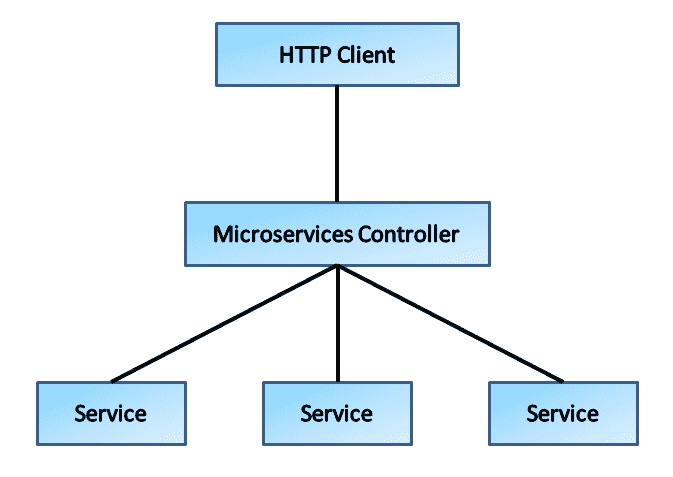

# 使用 C++的响应式微服务

到目前为止，我们已经涵盖了使用 C++进行响应式编程的基本方面。涵盖的一些关键主题包括：

+   响应式编程模型及其认知先决条件

+   RxCpp 库及其编程模型

+   使用 Qt/RxCpp 进行响应式 GUI 编程

+   编写自定义操作符

+   设计模式和响应式编程模型

如果你仔细看，这本书中到目前为止的所有例子都与进程内发生的事情有关。或者，我们基本上关注的是共享内存并发和并行技术。Rx.net、RxJava 和大多数 Rx 实现基本上都涉及共享内存并发和并行编程。像 Akka 这样的系统将响应式编程模型应用于分布式世界。在 Akka 中，我们可以编写跨进程和机器的响应式逻辑。响应式编程模型也适用于暴露基于 REST 的 Web 服务和消费它们。RxJs 库主要用于从浏览器页面消费基于 REST 的服务。RxCpp 库可用于编写用于聚合来自各种服务端点的内容的 Web 客户端。我们可以从控制台和 GUI 应用程序中利用 RxCpp 库。另一个用例是从多个细粒度服务中聚合数据并将其传递给 Web 客户端。

在本章中，我们将使用 C++编写一个基本的 Web 应用程序，利用 Microsoft C++ REST SDK 编写服务器部分，并使用（C++ REST SDK）客户端库来消费这些服务。在这个过程中，我们将解释什么是微服务以及如何消费它们。我们还将解释如何使用 RxCpp 库来访问 REST 端点和 HTML 页面，通过在`libcurl`库的顶部编写包装器。我们计划利用 Kirk Shoop 的 RxCurl 库（作为他的 Twitter 分析应用程序的一部分编写）来演示这种技术。

# C++语言和 Web 编程

如今，大多数面向 Web 的应用程序都是使用 Python、Java、C#、PHP 和其他高级语言开发的。但是，对于这些应用程序，人们会放置反向代理，如 NGINX、Apache Web 服务器或 IIS 重定向器，来管理流量。所有这些反向代理都是用 C++编写的。同样，大多数 Web 浏览器和 HTTP 客户端库，如`libwww`、`libcurl`和`WinInet`，都是使用 C++编写的。

Java、（静态类型的）C#和其他动态语言（如 Python、Ruby 和 PHP）变得流行的一个原因是，这些语言支持反射能力（在静态语言如 C#/Java 的情况下）和鸭子类型（动态语言支持）。这些功能帮助 Web 应用程序服务器动态加载 Web 页面处理程序。通过搜索关键字如*Reflection API*和*Duck Typing*来了解它们。

# REST 编程模型

REST 代表**表现状态转移**，是由 Roy Fielding 作为他的博士论文的一部分推动的一种架构风格。如今，它是最流行的暴露和消费 Web 服务的技术之一。REST 遵循以资源为中心的方法，并很好地映射到 CRUD 模式，这在熟悉编写企业业务应用程序的程序员中很受欢迎。在编写 REST 服务时，我们使用**JavaScript 对象表示法**（也称为**JSON**）作为有效载荷，而不是 XML 格式（这在 SOAP 服务中很流行）。REST 编程模型依赖于 HTTP 动词（GET、POST、PUT、DELETE 等），以指示在接收 REST API 调用时要执行的操作类型。支持的最流行的方法有：

+   `POST`：创建新资源

+   `GET`：检索资源

+   `PUT`：更新现有资源（如果是新资源，则行为类似于`POST`）

+   `DELETE`：删除资源

# C++ REST SDK

C++ REST SDK 是一个 Microsoft 项目，用于使用现代异步 C++ API 设计在本机代码中进行基于云的客户端-服务器通信。这个工具包旨在帮助 C++开发人员连接和与基于 HTTP 的服务进行交互。该 SDK 具有以下功能，可帮助您编写健壮的服务：

+   HTTP 客户端/服务器

+   JSON 支持

+   异步流

+   WebSocket 的客户端

+   oAuth 支持

C++ REST SDK 依赖于并行模式库的任务 API。PPL 任务是一个基于现代 C++特性组合异步操作的强大模型。C++ REST SDK 支持 Windows 桌面、Windows Store（UWP）、Linux、macOS、Unix、iOS 和 Android。

# 使用 C++ REST SDK 进行 HTTP 客户端编程

C++ REST SDK 编程模型本质上是异步的，我们也可以以同步的方式调用 API 调用。以下程序将演示我们如何异步调用 HTTP 客户端 API 调用。该程序演示了 C++ REST SDK 支持的 HTTP 协议的客户端端的工作方式。我们在这里使用了一种称为**任务继续**（一种链接代码块的技术）的技术来从网页中检索数据并将其存储在本地磁盘文件中。C++ REST SDK 遵循异步 I/O 模型，我们将操作链接在一起。最后，我们使用`wait()`方法调用组合：

```cpp
#include <cpprest/http_client.h> 
#include <cpprest/filestream.h> 
//----- Some standard C++ headers emitted for brevity
#include "cpprest/json.h" 
#include "cpprest/http_listener.h" 
#include "cpprest/uri.h" 
#include "cpprest/asyncrt_utils.h" 
//////////////////////////////////////////////// 
// A Simple HTTP Client to Demonstrate  
// REST SDK Client programming model 
// The Toy sample shows how one can read  
// contents of a web page 
// 
using namespace utility;  // Common utilities like string conversions 
using namespace web;      // Common features like URIs. 
using namespace web::http;// Common HTTP functionality 
using namespace web::http::client;// HTTP client features 
using namespace concurrency::streams;// Asynchronous streams 

int main(int argc, char* argv[]) 
{ 
   auto fileStream = std::make_shared<ostream>(); 
   // Open stream to output file. 
   pplx::task<void> requestTask =  
              fstream::open_ostream(U("google_home.html")). 
         then(= 
   { 
         *fileStream = outFile; 
         // Create http_client to send the request. 
         http_client client(U("http://www.google.com")); 
         // Build request URI and start the request. 
          uri_builder builder(U("/")); 
         return client.request(methods::GET, builder.to_string()); 

   }).then(= 
   { 
         printf("Received response status code:%un",  
                                    response.status_code()); 
             return response.body(). 
                           read_to_end(fileStream->streambuf()); 
   }).then(={ 
         return fileStream->close(); 
   }); 

   // We have not started execution, just composed 
   // set of tasks in a Continuation Style 
   // Wait for all the outstanding I/O to complete  
   // and handle any exceptions, If any  
   try { 
         //-- All Taskss will get triggered here 
         requestTask.wait(); 
   } 
   catch (const std::exception &e) { 
         printf("Error exception:%sn", e.what()); 
   } 
   //---------------- pause for a key  
   getchar(); 
   return 0; 
} 
```

上述程序演示了任务继续编程风格的工作方式。大部分代码都是关于组合 lambda 表达式，实际执行是在调用`wait()`方法时开始的。lambda 函数的惰性评估策略帮助我们以上述方式组合代码。我们也可以以同步的方式调用逻辑。请参阅 Microsoft C++ REST SDK 文档以了解更多信息。

# 使用 C++ REST SDK 进行 HTTP 服务器编程

我们已经了解了 C++ REST SDK 支持的 HTTP 客户端编程模型。我们使用了基于异步任务继续的 API 来检索网页内容并将其保存到磁盘文件中。现在，是时候开始集中精力研究 REST SDK 的 HTTP 服务器编程了。C++ REST SDK 具有一个监听器接口，用于处理 HTTP 请求，我们可以为每种 HTTP 动词类型（如`GET`、`PUT`、`POST`等）放置处理程序。

```cpp
///////////////////////////////// 
//  A Simple Web Application with C++ REST SDK 
//  We can use Postman Or Curl to test the Server 
using namespace std; 
using namespace web; 
using namespace utility; 
using namespace http; 
using namespace web::http::experimental::listener; 
///////////////////////////// 
// SimpleServer is a Wrapper over  
// http_listener class available with C++ REST SDK 
class SimpleServer 
{ 
public: 

   SimpleServer(utility::string_t url); 
   ~SimpleServer() {} 
   pplx::task<void> Open() { return m_listener.open(); } 
   pplx::task<void> Close() { return m_listener.close(); } 

private: 
   //--- Handlers for HTTP verbs 
   void HandleGet(http_request message); 
   void HandlePut(http_request message); 
   void HandlePost(http_request message); 
   void HandleDelete(http_request message); 
   //--------------- The  HTTP listener class 
   http_listener m_listener; 
};
```

`SimpleServer` C++类基本上是 C++ REST SDK 支持的`http_listener`类的包装器。该类监听传入的 HTTP 请求，可以为每种请求类型（`GET`、`POST`、`PUT`等）设置请求处理程序。当请求到达时，`http_listener`将根据 HTTP 动词将请求信息分派给关联的处理程序。

```cpp
////////////////////////////////// 
// The Constructor Binds HTTP verbs to instance methods 
// Based on the naming convention, we can infer what is happening 
SimpleServer::SimpleServer(utility::string_t url) : m_listener(url) 
{ 
   m_listener.support(methods::GET, std::bind(&SimpleServer::HandleGet, 
               this, std::placeholders::_1)); 
   m_listener.support(methods::PUT, std::bind(&SimpleServer::HandlePut, 
               this, std::placeholders::_1)); 
   m_listener.support(methods::POST, std::bind(&SimpleServer::HandlePost,  
               this, std::placeholders::_1)); 
   m_listener.support(methods::DEL, std::bind(&SimpleServer::HandleDelete,  
                this, std::placeholders::_1)); 

} 
```

前面的代码片段将请求处理程序绑定到`http_request`对象。我们只关注`GET`、`PUT`、`POST`和`DELETE`动词。这些动词是所有 REST 实现都支持的最流行的命令：

```cpp
///////////////////////////////////// 
// For this implementation, what we do is  
// spit the HTTP request details on the Server Console 
// and return 200 OK and a String which indicates  Success of Operations  
void SimpleServer::HandleGet(http_request message){ 
   ucout << message.to_string() << endl; 
   message.reply(status_codes::OK,L"GET Operation Succeeded"); 
} 
void SimpleServer::HandlePost(http_request message){ 
   ucout << message.to_string() << endl; 
   message.reply(status_codes::OK, L"POST Operation Succeeded"); 
}; 

void SimpleServer::HandleDelete(http_request message){ 
   ucout << message.to_string() << endl; 
   message.reply(status_codes::OK, L"DELETE Operation Succeeded"); 
} 
void SimpleServer::HandlePut(http_request message){ 
   ucout << message.to_string() << endl; 
   message.reply(status_codes::OK, L"PUT Operation Succeeded"); 
}; 
```

上面的代码块遵循一种模式，任何开发人员都可以轻松解读。处理程序的所有操作只是将请求参数打印到服务器的控制台上，并向客户端返回一个字符串，指示请求已成功完成（HTTP 状态码-200）。我们将在下一节中展示如何通过 POSTMAN 和 CURL 工具访问这些服务。

```cpp
//////////////////////////////// 
// A Smart Pointer for Server Instance... 
// 
std::unique_ptr<SimpleServer> g_http; 
////////////////////////////////////////////////// 
// STart the Server with the Given URL 
// 
void StartServer(const string_t& address) 
{ 
   // Build our listener's URI from the address given 
   // We just append DBDEMO/ to the base URL 
   uri_builder uri(address); 
   uri.append_path(U("DBDEMO/")); 
   auto addr = uri.to_uri().to_string(); 
   ///////////////////////////////// 
   // Create an Instance of the Server and Invoke Wait to  
   // start the Server... 
   g_http = std::unique_ptr<SimpleServer>(new SimpleServer(addr)); 
   g_http->Open().wait(); 
   //---- Indicate the start and spit URI to the Console 
   ucout << utility::string_t(U("Listening for requests at: ")) <<  
                addr << std::endl; 

   return; 
} 

//////////////////////////////////////// 
// Simply Closes the Connection... Close returns  
// pplx::task<void> ...we need to Call wait to invoke the  
// operation... 
void ShutDown(){ 
   g_http->Close().wait(); 
   return; 
} 
/////////////////////////////// 
// EntryPoint function 
int wmain(int argc, wchar_t *argv[]) 
{ 
   utility::string_t port = U("34567"); 
   if (argc == 2){ port = argv[1];} 
   //--- Create the Server URI base address 
   utility::string_t address = U("http://localhost:"); 
   address.append(port); 
   StartServer(address); 
   std::cout << "Press ENTER to exit." << std::endl; 
   //--- Wait Indefenintely, Untill some one has  
   // pressed a key....and Shut the Server down 
   std::string line; 
   std::getline(std::cin, line); 
   ShutDown(); 
   return 0; 
} 
```

主函数通过`StartServer`函数实例化`SimpleListener`类的实例。然后，`main`函数在调用`ShutDown`函数之前等待按键。一旦我们启动了应用程序，我们可以使用`CURL`工具或`POSTMAN`来测试程序是否工作。

# 使用 CURL 和 POSTMAN 测试 HTTP 服务器

`CURL`是一个跨 Windows、GNU Linux、MacOS 和其他 POSIX 兼容系统的命令行工具。该工具有助于使用各种基于 TCP/IP 的应用协议传输数据。一些常见的支持的协议包括 HTTP、HTTPS、FTP、FTPS、SCP、SFTP、TFTP、DICT、TELNET 和 LDAP 等。

我们将使用`CURL`工具来测试我们编写的 HTTP 服务器。可以通过给定必要的命令行参数来调用命令行实用程序，以发送带有关联动词的 HTTP 请求。我们给出了调用`GET`和`PUT`请求到我们编写的服务器的命令行参数：

```cpp
    curl -X PUT http://localhost:34567/DBDEMO/ 
          -H "Content-Type: application/json" -d '{"SimpleContent":"Value"}'
    curl -X GET 
          -H "Content-Type: application/json"      http://localhost:34567/DBDEMO/

```

将上一个命令嵌入批处理文件或 shell 脚本中，具体取决于您的平台。控制台上的输出应该如下所示：

```cpp
PUT Operation Succeeded
GET Operation Succeeded
```

同样，通过查阅`CURL`文档，我们也可以测试其他 HTTP 动词。

POSTMAN 是一个强大的 HTTP 客户端，用于测试基于 HTTP 的服务。它最初是由一位名叫 Abhinav Asthana 的印度开发人员作为一个副业项目开始的。它是一个在 Chrome 上广受欢迎的插件。今天，它是一个独立的平台，并且围绕这个应用程序成立了一家公司，Asthana 先生是 CEO。您可以下载 POSTMAN 工具来测试这些服务。由于下载 URL 可能会更改，请查阅您喜欢的搜索引擎以找到当前的下载 URL。（搜索“POSTMAN HTTP 客户端”）

# libcurl 和 HTTP 客户端编程

我们已经了解了 CURL 实用程序，实际上是`libcurl`库的一个包装器。我们将使用 libcurl 库来访问我们在本章中编写的 REST 服务。为了让您熟悉 libcurl 库及其编程模型，我们将使用该库编写一个基本的 HTTP 客户端：该程序将 ping http://example.com。

```cpp
/////////////////////////////////// 
// A Simple Program to demonstrate  
// the usage of libcurl library 
// 
#include <stdio.h> 
#include <curl/curl.h> 
/////////////////////// 
// Entrypoint for the program 
//  
int main(void) 
{ 
  CURL *curl; 
  CURLcode res; 
  /////////////////////////// 
  // Initialize the library 
  // 
  curl = curl_easy_init(); 
  if(curl) { 
    //----------- Set the URL  
    curl_easy_setopt(curl, CURLOPT_URL,  
                     "http://example.com"); 
    ////////////////////////////////////////// 
    // To support URL re-direction, we need to configure 
    // the lib curl library with CURLOPT_FOLLOWLOCATION 
    //  
    curl_easy_setopt(curl,  
               CURLOPT_FOLLOWLOCATION, 1L); 

    /////////////////////////////////////////////////// 
    // Now that, we have setup the options necessary, 
    // invoke the operation to pull data  
    // 
    res = curl_easy_perform(curl); 

    if(res != CURLE_OK) { 
      //----- if error, print the error on console 
      cout << "curl_easy_perform() failed: " 
              << curl_easy_strerror(res) << endl; 
    } 
    curl_easy_cleanup(curl); 
  } 
  return 0; 
} 
```

上面的代码会 ping [`example.com`](http://example.com) URL 以检索其内容，并在控制台上显示它们。编程模型非常简单，库的文档真的很好。它是访问 TCP/IP 应用服务的最受欢迎的库之一。在下一节中，我们将在 libcurl 库的顶部使用一个响应式包装器。

# Kirk Shoop 的 libCURL 包装库

RxCpp 库的主要实现者是 Kirk Shoop，他目前与微软有关。他编写了一个 Twitter 分析示例应用程序（[`github.com/kirkshoop/twitter`](https://github.com/kirkshoop/twitter)），以演示响应式编程的各个方面。作为该倡议的一部分，他做的一件事是编写一个响应式包装器覆盖`libcurl`，以实现 HTTP 的`GET`和`POST`方法。本书的作者已经扩展了他的代码，以支持`PUT`和`DELETE`方法。

查看本书源代码捆绑的`RxCurl`库：（列表太长，无法在此处包含）

```cpp

///////////////////////////////// 
// A Simple program to pull HTTP content  
// using a Rx wrapper on top of the Libcurl 
// 
// 
#include <iostream> 
#include <stdio.h> 
#include <stdlib.h> 
#include <map> 
#include <chrono> 
using namespace std; 
using namespace std::chrono; 
//////////////////////// 
// include Curl Library and  
// Rxcpp library  
// 
#include <curl/curl.h> 
#include <rxcpp/rx.hpp> 
using namespace rxcpp; 
using namespace rxcpp::rxo; 
using namespace rxcpp::rxs; 
////////////////////////// 
// include the modified rxcurl library from  
// Kirk Shoop's Twitter Analysis app 
// 
#include "rxcurl.h" 
using namespace rxcurl; 
int main() { 
     ///////////////////////////////////// 
     // 
     // Create a factory object to create  
     // HTTP request.  The http_request structure 
     // is defined in rxcurl.h 
     string url = "http://example.com"; 
     auto factory = create_rxcurl(); 
     auto request  = factory.create(http_request{url, "GET",{}, {}}) | 
            rxo::map([](http_response r){ 
                return r.body.complete; 
            });
```

我们使用`factory`类创建 HTTP `request`对象来创建一个`observable`。`map`函数只是检索响应对象的主体。整个代码中最重要的结构是`http_request`结构，其定义如下：

```cpp
 struct http_request{ 
       string url; 
       string method; 
       std::map<string, string> headers; 
       string body; 
     }; 
```

从上面的声明中，可以很明显地看出`http_request`结构的目的。成员是

+   url - 目标 URL

+   method - HTTP 动词

+   headers - HTTP 头

+   body - 请求的主体

```cpp

     //////////////////////////////////////// 
     // make a blocking call to the url.. 
     observable<string>   response_message; 
     request.as_blocking().subscribe([&] (observable<string> s) { 
               response_message = s.sum(); 
     } ,[] () {}); 
```

`request` Observable 可以通过订阅`on_next`来使用 lambda 函数，该函数以`observable<string>`为参数，因为`map`函数返回`observable<string>`。在`on_next`函数的主体中，我们使用`observable<string>::sum()`约简器来聚合内容以生成一个字符串：

```cpp
     /////////////////////////////// 
     // retrieve the html content form the site  
     string html; 
     response_message.as_blocking().subscribe( [&html] ( string temp ) {          
                   html = temp; 
     }, [&html] () { } ); 
     //------------ Print to the Console... 
     cout << html << endl; 
} 
```

`response_message` Observable 通过 lambda 进行订阅，该 lambda 以字符串作为参数。在`on_next`函数的主体中，我们简单地将包含 HTML 的字符串分配给`html`变量。最后，我们将内容显示在控制台上。请查看`rxcurl.h`头文件，以了解库的工作原理。

# JSON 和 HTTP 协议

The payload format for invoking web services were once monopolized by the XML format. The SOAP-based services mostly support the XML format. With the advent of REST-based services, developers use **JavaScript Object Notation** (**JSON**) as the payload format. 用于调用 Web 服务的有效载荷格式曾经被 XML 格式垄断。基于 SOAP 的服务大多支持 XML 格式。随着基于 REST 的服务的出现，开发人员使用**JavaScript 对象表示**（**JSON**）作为有效载荷格式。

The following table shows a comparison between XML and corresponding JSON object: 以下表格显示了 XML 和相应的 JSON 对象之间的比较：

| **XML** | **JSON** |
| --- | --- |

| `<person>` `   <firstName>John</firstName>`人

`   <lastName>Smith</lastName>` <姓>史密斯</姓>

`   <age>25</age>` <年龄>25</年龄>

`   <address>` <地址>

`     <streetAddress>21 2nd` <街道地址>21 2nd

`     Street</streetAddress>` 街道</streetAddress>

`     <city>New York</city>` <城市>纽约</城市>

`     <state>NY</state>` <州>纽约</州>

`     <postalCode>10021</postalCode>` <postalCode>10021</postalCode>

`   </address>` </地址>

`   <phoneNumber>` <电话号码>

`     <type>home</type>` <类型>家庭</类型>

`     <number>212 555-1234</number>` <号码>212 555-1234</号码>

`   </phoneNumber>` </电话号码>

`   <phoneNumber>` <电话号码>

`     <type>fax</type>` <类型>传真</类型>

`     <number>646 555-4567</number>` <号码>646 555-4567</号码>

`   </phoneNumber>` </电话号码>

`   <gender>` <性别>

`<type>male</type>`男性

`   </gender>` </性别>

`</person>` | `{` `   "firstName": "John",` </人> | `{` `   "firstName": "John",

`   "lastName": "Smith",` "姓"："史密斯"

`   "age": 25,` "年龄"：25，

`   "address": {` "地址"：{

`     "streetAddress": "21 2nd` "街道地址"："21 2nd

Street",` 街道",

`     "city": "New York",` "城市"："纽约"

`     "state": "NY",` "州"："纽约"

`     "postalCode": "10021"` "邮政编码"："10021"

` },` },

` "phoneNumber": [` "电话号码"：[

`   {` {

`     "type": "home",` "类型"："家庭"

`     "number": "212 555-1234"` "号码"："212 555-1234"

`   },` },

`   {` {

`     "type": "fax",` "类型"："传真"

`     "number": "646 555-4567"` "号码"："646 555-4567"

`   }` }

`   ],` ],

`  "gender": {` "性别"：{

`     "type": "male"` "类型"："男性"

`   }` }

`}` |

The JSON format contains following data types: JSON 格式包含以下数据类型：

+   String

+   Number

+   Object (JSON object) 对象（JSON 对象）

+   Array 数组

+   Boolean

Let us inspect a JSON object, to see how preceding data types are represented in the real world. 让我们检查一个 JSON 对象，看看前面的数据类型是如何在现实世界中表示的。

```cpp
{ 
 { "name":"John" }, 
 { "age":35 }, 
 { 
   "spouse":{ "name":"Joanna",  
              "age":30,  
              "city":"New York" } 
 }, 
 { 
    "siblings":["Bob", "Bill", "Peter" ] 
 }, 
 { "employed":true } 
} 
```

The mappings are: 映射如下：

+   `name`: The value is string type (`"john"`) 名字：值是字符串类型（"john"）

+   `age`: The value is number (`35`) 年龄：值是数字（35）

+   `spouse`: This is a JSON object 配偶：这是一个 JSON 对象

+   `siblings`: This is an array 兄弟姐妹：这是一个数组

+   `employed`: This is a Boolean (`true`) 就业：这是一个布尔值（`true`）

Now that we have a better understanding of JSON and its core aspects, we will write a simple program that demonstrates usage of the JSON API, available as part of the C++ REST SDK: 现在我们对 JSON 及其核心方面有了更好的理解，我们将编写一个简单的程序，演示作为 C++ REST SDK 的一部分可用的 JSON API 的用法：

```cpp
/////////////////////////////////// 
// A Console Application to demonstrate JSON API 
// available as part of the C++ SDK 
using namespace std; 
using namespace web; 
using namespace utility; 
using namespace http; 
using namespace web::http::experimental::listener; 
/////////////////////////////////////// 
// Define a Simple struct to demonstrate the  
// Working of JSON API 
struct EMPLOYEE_INFO{ 
   utility::string_t name; 
   int age; 
   double salary; 
   ///////////////////////////////// 
   // Convert a JSON Object to a C++ Struct 
   // 
   static EMPLOYEE_INFO JSonToObject(const web::json::object & object){ 
         EMPLOYEE_INFO result; 
         result.name = object.at(U("name")).as_string(); 
         result.age = object.at(U("age")).as_integer(); 
         result.salary = object.at(U("salary")).as_double(); 
         return result; 
   }
```

The `JSonToObject` static method converts a JSON object to the `EMPLOYEE_INFO` structure. `json::at` returns a reference to `json::value` based on the string that we used to index it. The resultant `json::value` reference is used to invoke the type-specific conversion methods, such as `as_string`, `as_integer`, and `as_double`: `JSonToObject`静态方法将 JSON 对象转换为`EMPLOYEE_INFO`结构。`json::at`根据我们用于索引的字符串返回对`json::value`的引用。结果`json::value`引用用于调用特定类型的转换方法，例如`as_string`，`as_integer`和`as_double`：

```cpp
   /////////////////////////////////////////// 
   // Convert a C++ struct to a Json Value 
   // 
   web::json::value ObjectToJson() const{ 
         web::json::value result = web::json::value::object(); 
         result[U("name")] = web::json::value::string(name); 
         result[U("age")] = web::json::value::number(age); 
         result[U("salary")] = web::json::value::number(salary); 
         return result; 
   } 
}; 
```

`ObjectToJson` is an instance method of `EMPLOYEE_STRUCT`, which helps to produce JSON output from the instance data. Here, we use conversion methods to transfer instance data to `json::value`. Next, we will focus on how we can create `json::object` from scratch: `ObjectToJson`是`EMPLOYEE_STRUCT`的一个实例方法，它帮助从实例数据生成 JSON 输出。在这里，我们使用转换方法将实例数据转移到`json::value`。接下来，我们将专注于如何从头开始创建`json::object`：

```cpp
///////////////////////////////////////// 
// Create a Json Object group and Embed and  
// Array in it... 
void MakeAndShowJSONObject(){ 
   // Create a JSON object (the group) 
   json::value group; 
   group[L"Title"] = json::value::string(U("Native Developers")); 
   group[L"Subtitle"] =  
              json::value::string(U("C++ devekioers on Windws/GNU LINUX")); 
   group[L"Description"] =  
               json::value::string(U("A Short Description here ")); 
   // Create a JSON object (the item) 
   json::value item; 
   item[L"Name"] = json::value::string(U("Praseed Pai")); 
   item[L"Skill"] = json::value::string(U("C++ / java ")); 
   // Create a JSON object (the item) 
   json::value item2; 
   item2[L"Name"] = json::value::string(U("Peter Abraham")); 
   item2[L"Skill"] = json::value::string(U("C++ / C# ")); 
   // Create the items array 
   json::value items; 
   items[0] = item; 
   items[1] = item2; 
   // Assign the items array as the value for the Resources key 
   group[L"Resources"] = items; 
   // Write the current JSON value to wide char string stream 
   utility::stringstream_t stream; 
   group.serialize(stream); 
   // Display the string stream 
   std::wcout << stream.str(); 
} 

int wmain(int argc, wchar_t *argv[]) 
{ 
   EMPLOYEE_INFO dm; 
   dm.name = L"Sabhir Bhatia"; 
   dm.age = 50; 
   dm.salary = 10000; 
   wcout << dm.ObjectToJson().serialize() << endl; 
```

We create an `EMPLOYEE_INFO` struct and assign some values into the fields. We then invoke `EMPLOYEE_INFO::ObjectToJSon()` to create a `json::value` object. We call the `serialize()` method to generate the JSON textual output: 我们创建一个`EMPLOYEE_INFO`结构并将一些值分配到字段中。然后我们调用`EMPLOYEE_INFO::ObjectToJSon()`来创建一个`json::value`对象。我们调用`serialize()`方法来生成 JSON 文本输出：

```cpp
      utility::string_t port =  
           U("{"Name": "Alex Stepanov","Age": 55,"salary":20000}");; 
      web::json::value json_par; 
      json::value obj = json::value::parse(port); 
      wcout << obj.serialize() << endl; 
```

The previous code snippets demonstrate the use to parse textual strings to produce `json::value` objects. We invoked the `serialize` method to print the JSON string to the console: 前面的代码片段演示了解析文本字符串以生成`json::value`对象的用法。我们调用`serialize`方法将 JSON 字符串打印到控制台：

```cpp
   MakeAndShowJSONObject(); 
   getchar(); 
   return 0; 
} 
```

# The C++ REST SDK-based REST server 基于 C++ REST SDK 的 REST 服务器

In this section, we have leveraged code from Marius Bancila's excellent article about the C++ REST SDK. In fact, the key/value database code is borrowed from his implementation. The authors are thankful to him for the excellent article, available at [`mariusbancila.ro/blog/2017/11/19/revisited-full-fledged-client-server-example-with-c-rest-sdk-2-10/`](https://mariusbancila.ro/blog/2017/11/19/revisited-full-fledged-client-server-example-with-c-rest-sdk-2-10/). 在本节中，我们利用了 Marius Bancila 关于 C++ REST SDK 的优秀文章中的代码。实际上，键/值数据库代码是从他的实现中借用的。作者对他提供的优秀文章表示感谢，该文章可在[`mariusbancila.ro/blog/2017/11/19/revisited-full-fledged-client-server-example-with-c-rest-sdk-2-10/`](https://mariusbancila.ro/blog/2017/11/19/revisited-full-fledged-client-server-example-with-c-rest-sdk-2-10/)上找到。

Let's write a micro-service application that puts everything together we have learned so far in the context of Microsoft C++ REST SDK. We will consume REST services by leveraging the RxCurl library written by Kirk Shoop, as part of his Twitter analysis application. We have added support to the DELETE and PUT verbs, as the original implementation contained only support for GET and POST verbs. The REST service implemented here supports the following verbs: 让我们编写一个微服务应用程序，将我们迄今为止在 Microsoft C++ REST SDK 的上下文中学到的一切整合起来。我们将通过利用 Kirk Shoop 编写的 RxCurl 库来消费 REST 服务，作为他的 Twitter 分析应用程序的一部分。我们已经添加了对 DELETE 和 PUT 动词的支持，因为原始实现只包含对 GET 和 POST 动词的支持。这里实现的 REST 服务支持以下动词：

+   `GET`: Lists all the key/value pairs in the storage. The response will be in the `{ key:value,key:value}` format. 获取：列出存储中的所有键/值对。响应将以`{ key:value,key:value}`格式呈现。

+   `POST`：检索与一组键对应的值。请求应该是`[key1,...,keyn]`格式。响应将以`{key:value,key:value....}`格式返回。

+   `PUT`：将一组键/值对插入存储中。请求应该是`{key:value,key:value}`格式。

+   `DELETE`：从存储中删除一组键及其相应的值。请求应该是`[key,key]`格式。

让我们来看一下代码：

```cpp
// MicroServiceController.cpp : Defines the entry point for the console application. 
#include <cpprest/http_client.h> 
#include <cpprest/filestream.h> 
//------------- Omitted some standard C++ headers for terse code listing
#include "cpprest/json.h" 
#include "cpprest/http_listener.h" 
#include "cpprest/uri.h" 
#include "cpprest/asyncrt_utils.h" 

#ifdef _WIN32 
#ifndef NOMINMAX 
#define NOMINMAX 
#endif 
#include <Windows.h> 
#else 
# include <sys/time.h> 
#endif 

using namespace std; 
using namespace web; 
using namespace utility; 
using namespace http; 
using namespace web::http::experimental::listener; 

////////////////////////////// 
// 
// The following code dumps a json to the Console... 
void  DisplayJSON(json::value const & jvalue){ 
   wcout << jvalue.serialize() << endl; 
} 

/////////////////////////////////////////////// 
// A Workhorse routine to perform an action on the request data type 
// takes a lambda as parameter along with request type 
// The Lambda should contain the action logic...whether it is 
// GET, PUT,POST or DELETE 
// 
void RequeatWorker( http_request& request, 
function<void(json::value const &, json::value &)> handler) { 
   auto result = json::value::object(); 
   request.extract_json().then(&result,
        &handler    {      
        try{ 
            auto const & jvalue = task.get(); 
            if (!jvalue.is_null()) 
                  handler(jvalue, result); // invoke the lambda 
         } 
         catch (http_exception const & e) { 
               //----------- do exception processsing  
               wcout << L"Exception ->" << e.what() << endl; 
         } 
   }).wait(); 
    request.reply(status_codes::OK, result); 
} 
```

`RequestWorker`是一个全局函数，它以`http_request`作为参数，以及一个具有特定签名的 lambda。lambda 接受两个参数：

+   `json::value`类型的输入 JSON 对象（一个常量参数）

+   包含来自 lambda 调用结果的输出 JSON 对象

JSON 有效载荷被提取并传递给`then`继续。一旦数据被检索，处理程序 lambda 被调用。由于结果是通过引用传递的，我们可以使用生成 HTTP 响应的结果 JSON。现在，我们将创建一个简单的键/值数据存储来模拟一个工业强度的键/值数据库：

```cpp
///////////////////////////////////////// 
// A Mock data base Engine which Simulates a key/value DB 
// In Real life, one should use an Industrial strength DB 
// 
class HttpKeyValueDBEngine { 
   ////////////////////////////////// 
   //----------- Map , which we save,retrieve,  update and  
   //----------- delete data  
   map<utility::string_t, utility::string_t> storage; 
public: 
   HttpKeyValueDBEngine() { 
         storage[L"Praseed"]= L"45"; 
         storage[L"Peter"] = L"28"; 
         storage[L"Andrei"] = L"50"; 
   } 
```

为了便于实现，键/值对存储在 STL 映射中。在构造函数中，我们使用一些记录初始化 STL 映射。我们可以使用`PUT`和`POST`来添加额外的记录，使用`DELETE`来删除记录：让我们剖析处理 GET 请求的函数的源代码。

```cpp
   //////////////////////////////////////////////////////// 
   // GET - ?Just Iterates through the Map and Stores 
   // the data in a JSon Object. IT is emitted to the  
   // Response Stream 
   void GET_HANDLER(http_request& request) { 
         auto resp_obj = json::value::object(); 
         for (auto const & p : storage) 
             resp_obj[p.first] = json::value::string(p.second); 
         request.reply(status_codes::OK, resp_obj); 
   } 
```

当 HTTP 监听器遇到请求有效负载的一部分时，`GET_HANLDER`方法将被调用。创建`json::value::object`后，我们将存储映射的内容填充到其中。生成的 JSON 对象将返回给 HTTP 客户端：让我们看一下 POST 处理程序的源代码。

```cpp
   ////////////////////////////////////////////////// 
   // POST - Retrieves a Set of Values from the DB 
   // The PAyload should be in ["Key1" , "Key2"...,"Keyn"] 
   // format 
   void POST_HANDLER(http_request& request) {       
       RequeatWorker(request, &{ 
         //---------- Write to the Console for Diagnostics 
         DisplayJSON(jvalue); 
             for (auto const & e : jvalue.as_array()){ 
               if (e.is_string()){ 
                     auto key = e.as_string(); 
                     auto pos = storage.find(key); 
                    if (pos == storage.end()){ 
                        //--- Indicate to the Client that Key is not found 
                         result[key] = json::value::string(L"notfound"); 
                     } 
                     else { 
                     //------------- store the key value pair in the result 
                     //------------- json. The result will be send back to  
                     //------------- the client 
                     result[pos->first] = json::value::string(pos->second); 
                     } 
               } 
         } 
         });      
   } 
```

`POST_HANDLER`期望在请求主体中有一个 JSON 值数组，并循环遍历每个元素以检索相应键提供的数据。结果对象存储返回的值。如果一些键不在键/值 DB 中，将返回一个字面字符串("notond")来指示未找到该值：

```cpp
   //////////////////////////////////////////////////////// 
   // PUT - Updates Data, If new KEy is found  
   //       Otherwise, Inserts it 
   // REST Payload should be in  
   //      { Key1..Value1,...,Keyn,Valuen}  format 
   // 
   // 
   void PUT_HANDLER(http_request& request) { 
         RequeatWorker( request, 
               &{ 
               DisplayJSON(jvalue); 
               for (auto const & e : jvalue.as_object()){ 
                     if (e.second.is_string()){ 
                           auto key = e.first; 
                           auto value = e.second.as_string(); 
                           if (storage.find(key) == storage.end())
                           { 
                                 //--- Indicate to the client that we have 
                                 //--- created a new record 
                                 result[key] = 
                                   json::value::string(L"<put>"); 
                           } 
                           else { 
                                 //--- Indicate to the client that we have 
                                 //--- updated a new record 
                                 result[key] = 
                                    json::value::string(L"<updated>"); 
                           } 
                           storage[key] = value; 
                     } 
               } 
         });    
   } 
```

`PUT_HANDLER`期望以 JSON 格式的键/值对列表。对键的集合进行迭代以在存储中查找。如果键已经存在于存储中，则更新值，否则将键/值插入存储中。返回一个 JSON 对象（结果）以指示对每个键执行的操作（是插入还是更新）。

```cpp
   /////////////////////////////////////////////////// 
   // DEL - Deletes a Set of Records 
   // REST PayLoad should be in 
   //      [ Key1,....,Keyn] format 
   // 
   void DEL_HANDLER(http_request& request) 
   { 
      RequeatWorker( request,
         & 
         { 
               //--------------- We aggregate all keys into this set 
               //--------------- and delete in one go 
               set<utility::string_t> keys; 
               for (auto const & e : jvalue.as_array()){ 
                     if (e.is_string()){ 
                           auto key = e.as_string(); 
                           auto pos = storage.find(key); 
                           if (pos == storage.end()){ 
                                 result[key] = 
                                    json::value::string(L"<failed>"); 
                           } 
                           else { 
                                 result[key] = 
                                    json::value::string(L"<deleted>"); 
                                 //---------- Insert in to the delete list 
                                 keys.insert(key); 
                           } 
                     } 
               } 
               //---------------Erase all 
               for (auto const & key : keys) 
                     storage.erase(key); 
         }); 
   } 
};
```

`DEL_HANDLER`期望一个键数组作为输入，并循环遍历数组以检索数据。如果键已经存在于存储中，键将被添加到删除列表（-一个 STL 集合）。一个 JSON 对象（结果）将被填充以指示对每个键执行的操作。结果对象将返回给客户端：

```cpp
/////////////////////////////////////////////// 
// 
// Instantiates the Global instance of key/value DB 
HttpKeyValueDBEngine g_dbengine; 
```

现在我们有了一个功能模拟的键/值数据库`engine`，我们将使用数据库的功能作为 REST 服务端点与`GET`、`POST`、`PUT`和`DELETE`命令对外部世界提供服务。HTTP 处理程序只是将调用委托给`HttpValueDBEngine`实例。这段代码与我们为`SimpleServer`类编写的代码非常相似：

```cpp
class RestDbServiceServer{ 
public: 
   RestDbServiceServer(utility::string_t url); 
   pplx::task<void> Open() { return m_listener.open(); } 
   pplx::task<void> Close() { return m_listener.close(); } 
private: 
   void HandleGet(http_request message); 
   void HandlePut(http_request message); 
   void HandlePost(http_request message); 
   void HandleDelete(http_request message); 
   http_listener m_listener; 
}; 
RestDbServiceServer::RestDbServiceServer(utility::string_t url) : m_listener(url) 
{ 
    m_listener.support(methods::GET,  
       std::bind(&RestDbServiceServer::HandleGet, this, std::placeholders::_1)); 
    m_listener.support(methods::PUT,  
       std::bind(&RestDbServiceServer::HandlePut, this, std::placeholders::_1)); 
    m_listener.support(methods::POST,  
       std::bind(&RestDbServiceServer::HandlePost, this, std::placeholders::_1)); 
    m_listener.support(methods::DEL,  
        std::bind(&RestDbServiceServer::HandleDelete, 
        this,std::placeholders::_1)); 
}
```

上面的代码将 HTTP 动词绑定到相应的处理程序。处理程序的主体在性质上是相似的，因为处理程序只是将 HTTP 调用委托给键/值引擎：

```cpp
void RestDbServiceServer::HandleGet(http_request message) 
{g_dbengine.GET_HANDLER(message);}; 
void RestDbServiceServer::HandlePost(http_request message) 
{g_dbengine.POST_HANDLER(message);}; 
void RestDbServiceServer::HandleDelete(http_request message) 
{g_dbengine.DEL_HANDLER(message);} 
void RestDbServiceServer::HandlePut(http_request message) 
{g_dbengine.PUT_HANDLER(message);}; 
//---------------- Create an instance of the Server  
std::unique_ptr<RestDbServiceServer> g_http; 
void StartServer(const string_t& address) 
{ 
   uri_builder uri(address); 
   uri.append_path(U("DBDEMO/")); 
   auto addr = uri.to_uri().to_string(); 
   g_http = std::unique_ptr<RestDbServiceServer>(new RestDbServiceServer(addr)); 
   g_http->Open().wait(); 
   ucout << utility::string_t(U("Listening for requests at: ")) << 
               addr << std::endl; 
   return; 
} 
void ShutDown(){ 
      g_http->Close().wait(); 
      return; 
} 
/////////////////////////////// 
// The EntryPoint function 
int wmain(int argc, wchar_t *argv[]){ 
   utility::string_t port = U("34567"); 
   if (argc == 2){port = argv[1];} 
   utility::string_t address = U("http://localhost:"); 
   address.append(port); 
   StartServer(address); 
   std::cout << "Press ENTER to exit." << std::endl; 
   std::string line; 
   std::getline(std::cin, line); 
   ShutDown(); 
   return 0; 
}
```

HTTP 控制器的代码与我们在本章前面编写的`SimpleServer`没有区别。我们在这里提供列表是为了完整起见。通过这样，我们学会了如何使用 C++ REST SDK 向外部世界公开 REST 服务端点。

我们已经讨论了如何公开 REST 端点以及如何为各种 HTTP 动词编写处理程序。在微服务架构风格中，我们将独立部署许多 REST 端点。将粗粒度服务拆分为微服务的过程是高度依赖于上下文的艺术。微服务有时通过聚合服务向外部世界公开。聚合服务将向多个端点发出请求，并在响应其客户端之前聚合来自不同端点的结果。聚合服务是编写用于访问 REST 微服务的反应式客户端逻辑的候选者。由于网络调用是异步的，反应式编程模型在这里是自然的。

# 使用 RxCurl 库调用 REST 服务

由 Kirk Shoop 编写的`RxCurl`库最初支持`GET`和`POST`动词。Twitter 分析应用程序只支持这两个。本书的作者已经为`PUT`和`DELETE`动词添加了支持。您可以参考`rxcurl.h`的源代码，查看为支持这些额外动词所做的必要更改，在 Github 存储库中：让我们看看如何使用修改后的库来调用上面我们编写的 REST 服务器。

```cpp
#include <iostream> 
#include <stdio.h> 
#include <iostream> 
#include <stdio.h> 
#include <stdlib.h> 
#include <map> 
#include <chrono> 
using namespace std; 
using namespace std::chrono; 
//////////////////////// 
// include Curl Library and  
// Rxcpp library  
// 
#include <curl/curl.h> 
#include <rxcpp/rx.hpp> 
using namespace rxcpp; 
using namespace rxcpp::rxo; 
using namespace rxcpp::rxs; 
////////////////////////// 
// include the modified rxcurl library from  
// Kirk Shoop's Twitter Analysis app 
// 
#include "rxcurl.h" 
using namespace rxcurl; 
rxcurl::rxcurl factory; 
```

使用`factory`对象，我们可以通过调用`create`方法创建请求对象。`create`方法期望：

+   URL 端点

+   HTTP 方法

+   HTTP 头

+   HTTP 请求的主体：

```cpp
string HttpCall( string url ,  
               string method, 
               std::map<string,string> headers, 
               string  body  ) {         

     auto request  = factory.create(http_request{url,method,
                     headers,body}) | 
                     rxo::map([](http_response r){ 
                          return r.body.complete; 
                     });      
```

上述代码通过组合创建 HTTP 请求和从`http_response`映射到 HTTP 主体的函数来创建`request`对象。有一个选项可以返回数据块。我们这里没有使用它，因为我们只期望响应的数据量很小。

```cpp
     //////////////////////////////////////// 
     // make a blocking call to the url.. 
     observable<string>   response_message; 
     request.as_blocking().subscribe([&] (observable<string> s) { 
               response_message = s.sum(); 
     } ,[] () {printf("");});
```

上述代码对我们之前创建的`observable`进行了阻塞调用。`subscribe`方法的主体的`on_next`函数将内容连接起来形成另一个 Observable。在现实生活中，我们也可以以异步方式进行这种调用。这需要更多的编程工作。此外，代码清单不适合可用的页面预算：

```cpp

     /////////////////////////////// 
     // 
     // retrieve the html content form the site  
     string html; 
     response_message.as_blocking().subscribe( [&html] ( string temp ) {          
                   html = temp; 
     }, [] () { printf(""); } ); 
     return html; 
} 
///////////////////////// 
// The EntryPoint... 
// 
int main() { 

     /////////////////////////////////// 
     // set the url and create the rxcurl object 
     string url = "http://localhost:34567/DBDEMO/"; 
     factory = create_rxcurl(); 
     ///////////////////////////////// 
     // default header values 
     std::map<string,string> headers; 
     headers["Content-Type"] = "application/json"; 
     headers["Cache-Control"] = "no-cache"; 

     //------- invoke GET to retrieve the contents 
     string html = HttpCall( url,"GET",headers, "" ); 
     cout << html << endl; 

     //------- Retrieve values for the following  
     string body = string("["Praseed"]rn"); 
     html = HttpCall( url,"POST", headers,body); 
     cout << html << endl; 
     //--------- Add new Values using PUT 
     body = string("rn{"Praveen": "29","Rajesh" :"41"}rn"); 
     html = HttpCall( url,"PUT", headers,body); 
     cout << html << endl; 
     //-------- See whether values has been added 
     html = HttpCall( url,"GET",headers, "" ); 
     cout << "-------------------------current database state" << endl; 
     cout << html << endl; 
     //--------------- DELETE a particular record 
     body = string("["Praseed"]rn"); 
     html = HttpCall( url,"DELETE", headers,body); 
     cout << "Delleted..." << html << endl; 
     html = HttpCall( url,"GET",headers, "" ); 
     cout << "-------------------------current database state" << endl; 
     cout << html << endl; 
} 
```

`main`方法演示了我们如何调用我们创建的`HttpCall`函数。提供了代码，以展示如何利用 RxCurl 库。我们可以使用该库异步发出多个请求，并等待它们的完成。读者可以调整代码以支持这样的功能。

# 关于反应式微服务架构的一点说明

我们已经学会了如何使用 C++ REST SDK 编写微服务控制器。也许我们可以说，我们刚刚实现的服务器可以是一个微服务实例。在现实生活中的微服务架构场景中，将在不同的盒子（Docker 容器或虚拟机）中托管多个服务，并且微服务控制器将访问这些独立部署的服务以满足客户端的需求。微服务控制器将从不同服务中聚合输出，以作为响应发送给客户端。微服务应用程序的基本架构如下图所示：



在上图中，REST（HTTP）客户端向微服务控制器发出 HTTP 调用，该控制器包装了`http_listener`对象。控制器调用三个微服务来检索数据，并将结果数据组装或合并以向 REST 客户端提供响应。端点可以使用 Docker 等技术在容器中或在不同的容器中部署。

根据 Martin Fowler：

“*“微服务架构”这个术语在过去几年中出现，用来描述设计软件应用程序的一种特定方式，即独立部署的服务套件。虽然对这种架构风格没有明确的定义，但围绕业务能力的组织、自动化部署、端点的智能和语言和数据的分散控制等方面有一些共同的特征*。”

微服务架构的主题本身就是一个独立的课题，值得一本专门的书来探讨。我们在这里所涵盖的是如何利用 C++编程语言来以这种风格编写 Web 应用程序。这里给出的描述旨在指引读者找到正确的信息。响应式编程模型适合从不同的服务端点聚合信息并统一呈现给客户端。服务的聚合是关键问题，读者应进一步研究。

当我们谈论微服务架构时，我们需要了解以下主题：

+   细粒度服务

+   多语言持久性

+   独立部署

+   服务编排和服务编舞

+   响应式 Web 服务调用

我们将在以下章节中详细讨论它们。

# 细粒度服务

传统的 SOA 和基于 REST 的服务大多是粗粒度的服务，并且是以减少网络往返为核心关注点而编写的。为了减少网络往返，开发人员经常创建了复合（多个数据元素打包在一起）的有效负载格式。因此，一个端点或 URI 被用于处理多个关注点，并违反了关注点分离的原则。微服务架构期望服务执行单一职责，并且有效负载格式是为此量身定制的。这样，服务变得更加细粒度。

# 多语言持久性

多语言持久性是一个术语，用来表示在持久化数据时使用多种存储技术。这个术语来自于“多语言编程”的术语，其中编程语言的选择取决于上下文。在多语言编程的情况下，我们混合使用不同的编程语言。本书的作者们曾遇到过使用 Java 编写应用服务器代码、Scala 进行流处理、C++处理存储相关问题、C#编写 Web 层，当然还有 TypeScript/JavaScript 用于客户端编程的系统。在多语言持久性的情况下，我们可以选择使用关系型数据库、键值存储、文档数据库、图数据库、列数据库，甚至时间序列数据库。

电子商务门户是多语言持久性可以真正派上用场的经典例子。这样的平台将处理许多类型的数据（例如，购物车、库存和已完成的订单）。我们可以选择使用关系型数据库（记录交易）、键值数据库（缓存和查找）、文档数据库（存储日志）等，而不是试图将所有这些数据存储在一个数据库中。在这里，“为您的关注点和上下文选择正确的持久性模型”是主要的座右铭。

# 独立部署

微服务架构和传统 SOA 之间最大的区别在于部署领域。随着容器技术的发展，我们可以非常容易地独立和隔离地部署服务。DevOps 运动在推广服务和应用程序的独立部署模型方面起到了很大的帮助。我们现在可以自动化虚拟机和相关容器的配置过程，包括 CPU、内存、存储、附加磁盘、虚拟网络、防火墙、负载均衡、自动扩展等，将其附加到 AWS、Azure 或 Google Cloud 等云服务的部署策略中。策略可以帮助您以自动化脚本的方式自动部署微服务。

在使用微服务架构风格开发应用程序时，容器技术的概念会一再出现。一个相关的运动，称为 DevOps，被引入到讨论的范围之内。在独立部署的情况下，涵盖 DevOps 和容器化（以及集群管理）超出了本书的范围。您可以搜索 Docker、Kubernetes 和“基础设施即代码”，以更深入地了解这些技术。

# 服务编排和编舞

让我们从服务编排开始。您可以通过固定逻辑将多个服务组合在一起。这个逻辑在一个地方描述。但我们可能部署多个相同服务的实例，以确保可用性。一个聚合器服务将独立调用这些服务并为下游系统聚合数据。另一方面，在服务编舞中，决策逻辑是分布式的，没有集中的点。对服务的调用将在数据到达下游系统之前触发多次服务之间的调用。服务编舞比实现编排需要更多的工作。您可以通过使用您喜欢的搜索引擎在网络上阅读更多关于服务编排和编舞的信息。

# 响应式网络服务调用

Web 请求的处理很好地映射到了响应式编程模型。在具有响应式 UI 的应用程序中，我们通常只需向服务器发出一次调用。在服务器上运行的聚合器服务将异步生成一系列请求。生成的响应被聚合以向 UI 层提供响应。修改后的 `RxCurl` 可以作为一种机制，用于在使用 C++ 编程语言的项目中调用多个服务。

# 总结

在本章中，我们介绍了如何使用 Rx 编程模型来使用 C++ 编写响应式微服务。作为这个过程的一部分，我们向您介绍了微软的 C++ REST SDK 及其编程模型。C++ REST SDK 遵循一种基于任务继续样式的异步编程模型，用于编写客户端代码。为了编写 REST 客户端，我们利用了 Kirk Shoop 的 `RxCurl` 库，并对其进行了一些修改以支持 `PUT` 和 `DELETE` 动词。最后，我们以一种响应式的方式编写了一个 REST 服务器并对其进行了消费。在下一章中，我们将学习如何使用 RxCpp 库中可用的构造来处理错误和异常。
