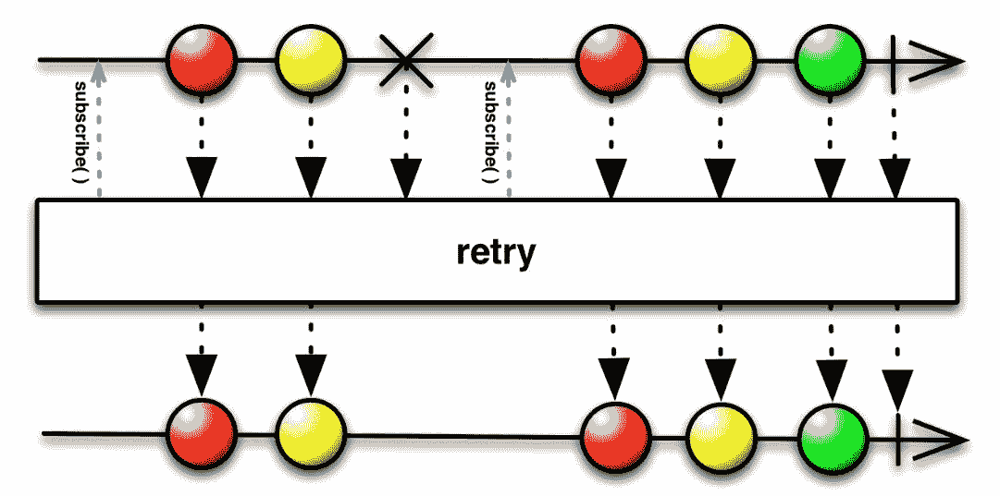

# 高级数据流和错误处理

在本书中，我们已经涵盖了现代 C++技术和`RxCpp`库的许多内容。我们从使用 C++进行反应式编程的先决条件开始。前六章主要是关于先决条件和适应一般函数式反应式编程特征以及`RxCpp`库的特性。我们在宽泛的意义上使用了函数式反应式编程这个术语——我们正在利用函数式编程技术来编写反应式程序。一些纯粹主义者与我们意见不同。他们不认为 Rx 系列库是函数式反应式编程的完整实现。程序员必须经历的最大转变是接受声明式编程范式的心态转变。

传统上，我们设计复杂的数据结构，并在这些数据结构上编写算法来编写我们的程序。这适用于操作存在于空间中的数据的程序。当时间成为一个因素时，异步性是一个自然的结果。在反应式编程中，我们将复杂的数据结构简化为数据流，并在数据流中放置操作符，然后根据通知执行某些操作。我们已经看到了这如何简化了使用 C++编程语言的 GUI 程序、Web 程序和控制台应用程序的编程。

在我们的例子中，我们故意省略了反应式程序中的异常处理（和错误处理）逻辑。这是为了专注于核心反应式元素及其交互。现在我们已经涵盖了所有必要的内容，甚至更多，我们将专注于反应式程序中的异常处理。在讨论错误和异常处理之前，我们将介绍反应式系统的特征。

在本章中，我们将涵盖以下主题：

+   反应式系统特征的简要回顾

+   `RxCpp`—错误处理操作符

+   调度和错误处理

+   基于事件的数据流处理—一些例子

# 反应式系统特征的简要回顾

我们现在生活在一个需要更高可扩展性和快速响应的世界。反应式编程的概念是为了满足高可用性、可扩展性和快速响应的需求而产生的。根据反应式宣言（[`www.reactivemanifesto.org/`](https://www.reactivemanifesto.org/)），反应式系统具有以下特点：

+   **响应式**：系统在规定时间内完成分配的任务的能力。响应性也意味着问题能够被快速检测并有效处理。关键点在于系统的一致行为。一致性有助于用户对系统建立信心。

+   **弹性**：在行为变化的情况下，系统抵御失败的能力就是弹性。它与响应性相关，因为一致性也保证了错误处理。弹性是通过隔离和容错组件来实现的，以保护系统免受故障影响。

+   **弹性**：弹性是系统根据工作负载的变化自动重新分配所需资源的能力。反过来，每个时间点上使用的资源尽可能地匹配需求。反应式系统通过提供相关的实时性能指标来实现弹性。

+   **消息驱动**：通过异步消息传递机制，反应式系统实现了系统的隔离和松耦合。通过使用消息队列，反应式系统可以实现不同模块和命令的相互依赖处理。通过消息驱动架构的非阻塞通信，接收者只在活动时消耗资源：

来自响应式宣言的以下图表展示了响应式系统的所有支柱是如何相互关联的：


通过在其所有构建层次上应用这些原则，响应式系统变得可组合。

本章的重点将是通过解释高级流和错误处理来解释响应式系统的弹性特性。

# RxCpp 错误和异常处理操作符

在现实世界的场景中，没有一个系统是完美的。正如我们在前一节中讨论的那样，弹性是响应式系统的特质之一。系统如何处理错误和异常决定了该系统的未来。早期检测和无缝处理错误使系统一致和响应。与命令式编程方法相比，响应式编程模型帮助用户单独处理错误，当系统检测到错误或抛出异常时。

在本节中，我们将看看如何使用`RxCpp`库处理异常和错误。有各种`RxCpp`操作符可用于对来自 Observables 的`on_error`通知做出反应。例如，我们可能会：

+   通过优雅地退出序列来处理错误

+   忽略错误并切换到备用 Observable 以继续序列

+   忽略错误并发出默认值

+   忽略错误并立即尝试重新启动失败的 Observable

+   忽略错误并在一段退避间隔后尝试重新启动失败的 Observable

异常处理是可能的，因为`observer<>`包含三种方法：

+   `on_next`

+   `on_completed`

+   `on_error`

`on_error`方法用于处理异常发生时，或者由`observable<>`或组合链中的任何操作符抛出异常。到目前为止，示例忽略了系统的错误处理方面。观察者方法的原型如下：

+   `void observer::on_next(T);`

+   `void observer::on_error(std::exception_ptr);`

+   `void observer::on_completed();`

# 在发生错误时执行操作

当发生错误时，我们需要以一种优雅的方式处理它。到目前为止，在本书讨论的`RxCpp`程序中，程序只处理了`subscribe`方法中的`on_next`和`on_completed`情况。`subscribe`函数还有一个方法，它也可以接受一个 Lambda 函数来处理`on_error`情况。让我们看一个简单的例子来理解如何在`subscribe`函数中使用错误处理程序：

```cpp
//------ OnError1 
#include "rxcpp/rx.hpp" 

int main() 
{ 
    //------ Creating Observable with an error appended 
    //------ A canned example to demonstrate error 
    auto values = rxcpp::observable<>::range(1, 3). 
                  concat(rxcpp::observable<>:: 
                  error<int>(std::runtime_error("Error from producer!"))); 

    values. 
        subscribe( 
         //--------------- on_next 
            [](int v) { printf("OnNext: %dn", v); }, 
            //---------------- on_error 
            [](std::exception_ptr ep) { 
                 printf("OnError: %sn", rxcpp::util::what(ep).c_str()); 
            }, 
            //---------------- on_completed 
            []() { printf("OnCompletedn"); }); 
} 
```

通过第二个 Lambda，传递给`subscribe`函数的函数调用在发生错误时调用所需的操作。代码的输出将如下所示：

```cpp
OnNext: 1 
OnNext: 2 
OnNext: 3 
OnError: Error from producer!
```

在上面的代码中，错误被附加到 Observable 流中，以启动订阅者端的异常/错误处理讨论。让我们看看异常如何通过 Observable 流传播到订阅者级别：

```cpp
//------- OnError2.cpp 
#include "rxcpp/rx.hpp" 

int main() { 
    //------- Create a subject instance  
    //------  and retrieve subscriber abd Observable handle  
    rxcpp::rxsub::subject<int> sub; 
    auto subscriber = sub.get_subscriber(); 
    auto observable = sub.get_observable(); 

    //--------------------------- Subscribe! 
    observable.subscribe( 
        [](int v) { printf("OnNext: %dn", v); }, 
        [](std::exception_ptr ep) { 
            printf("OnError: %sn", rxcpp::util::what(ep).c_str()); 
        }, 
        []() { printf("OnCompletedn"); } 
    );
```

上面的代码创建了一个`subject<T>`类的实例，我们在第十章《在 RxCpp 中创建自定义操作符》中介绍过。我们订阅`subject<T>`的 Observable 部分。我们还检索订阅者句柄以将值或异常发射到流中：

```cpp
    for (int i = 1; i <= 10; ++i) { 
        if (i > 5) { 
            try { 
                std::string().at(1); 
            } 
            catch (std::out_of_range& ex) { 
                //------------ Emit exception. 
                subscriber.on_error(std::make_exception_ptr(ex));
                break;
            } 
        } 
        subscriber.on_next(i * 10); 
    } 
    subscriber.on_completed(); 
} 
```

`on_next()`函数向订阅者发出新值，并且该函数将被多次调用。一旦在流上调用了`on_completed()`或`on_error()`，`on_next()`函数将不会被调用。`on_completed()`函数通知订阅者 Observable 已经完成发送**推送式通知**。如果 Observable 已经调用了`on_error()`函数，它将不会调用此函数。最后，`on_error()`函数通知订阅者 Observable 遇到了错误条件，如果 Observable 调用了此函数，它将不会在此后调用`on_next()`或`on_completed()`。

# 当发生错误时恢复

错误发生会打破标准响应式流的序列流程。`RxCpp`库还提供了在发生错误时调用操作的机制。然而，有时用户希望使用默认选项恢复序列；这就是`on_error_resume_next()`的作用：

```cpp
//------- OnError3.cpp 
#include "rxcpp/rx.hpp" 

int main() 
{ 
    //------- Create an Observable with appended error 
    auto values = rxcpp::observable<>::range(1, 3). 
        concat(rxcpp::observable<>:: 
        error<int>(std::runtime_error("Error from producer!    "))). 
        //------- Resuming with another Stream 
        on_error_resume_next([](std::exception_ptr ep) { 
            printf("Resuming after: %sn", rxcpp::util::what(ep).c_str()); 
            return rxcpp::observable<>::range(4,6); 
        }); 

    values. 
        subscribe( 
            [](int v) {printf("OnNext: %dn", v); }, 
            [](std::exception_ptr ep) { 
                printf("OnError: %sn", rxcpp::util::what(ep).c_str()); }, 
            []() {printf("OnCompletedn"); }); 
} 
```

如果流中出现错误，可观察操作符`on_error_resume_next()`将被执行。在这段代码中，从作为参数给定的 Lambda 返回一个新的流，以使用这个新的流恢复序列。这样，可以通过继续有意义的序列来防止错误传播。上一个程序的输出将如下所示：

```cpp
OnNext: 1 
OnNext: 2 
OnNext: 3 
Resuming after: Error from producer! 
OnNext: 4 
OnNext: 5 
OnNext: 6 
OnCompleted 
```

除了使用另一个序列进行恢复，还可以使用默认的单个项目进行恢复。在前面的例子中，用以下行替换对`on_error_resume_next()`操作符的调用：

```cpp
        //------- Resuming with a default single value 
        on_error_resume_next([](std::exception_ptr ep) { 
            printf("Resuming after: %sn", rxcpp::util::what(ep).c_str()); 
            return rxcpp::observable<>::just(-1); 
        });
```

替换代码后，输出将如下所示：

```cpp
OnNext: 1 
OnNext: 2 
OnNext: 3 
Resuming after: Error from source 
OnNext: -1 
OnCompleted
```

让我们看一下描述`on_error_resume_next()`操作符的弹珠图：


简而言之，`on_error_resume_next()`函数在遇到特定可观察对象的错误时返回一个可观察实例。流切换到新的可观察对象并恢复执行。

`on_error_resume_next()`操作符在许多地方非常方便，用户需要继续传播错误。例如，在流的创建和订阅之间，流可能会经历不同的转换和减少。此外，正如第九章中所解释的那样，*使用 Qt/C++进行响应式 GUI 编程*，用户定义的操作符可以通过组合现有的`RxCpp`操作符来构建。在这种情况下，打算在每个聚合和转换阶段使用`on_error_resume_next()`操作符来转换异常/错误直到订阅阶段。与此操作符发出的默认值或序列类似，错误本身也可以被重新传输，以恢复错误的流动直到`subscribe()`操作符的错误处理程序：

```cpp
auto processed_strm = Source_observable. 
map([](const string& s) { 
return do_string_operation(s); 
      }). 
// Translating exception from the source 
on_error_resume_next([](std::exception_ptr){ 
return rxcpp::sources::error<string>(runtime_error(rxcpp::util::what(ep).c_str())); 
      });
```

上面的代码片段解释了如何使用`on_error_resume_next()`操作符来转换错误。

# 发生错误时重试

在许多情况下，正常的顺序可能会因为生产者端的暂时故障而被打破。在这种情况下，值得考虑的是有一个选项，可以等待直到生产者端的异常被修复，以继续正常的执行流程。`RxCpp`为用户提供了一个非常类似的选项，当发生错误时重试。重试选项最适合当您预期序列会遇到可预测的问题时。

重试操作符对来自源 Observable 的`on_error`通知做出响应，通过重新订阅源 Observable，而不是将该调用传递给其观察者。这给了源另一个机会来完成其序列而不出现错误。重试总是将`on_next`通知传递给其观察者，即使是从以错误终止的序列中；这可能会导致重复的发射。下面的弹珠图将进一步解释这一点：



以下是一个使用`retry()`操作符的示例：

```cpp
//------- Retry1.cpp 
#include "rxcpp/rx.hpp" 

int main() 
{ 
    auto values = rxcpp::observable<>::range(1, 3). 
        concat(rxcpp::observable<>:: 
        error<int>(std::runtime_error("Error from producer!"))). 
        retry(). 
        take(5); 

    //----- Subscription 
    values. 
        subscribe( 
            [](int v) {printf("OnNext: %dn", v); }, 
            []() {printf("OnCompletedn"); }); 
} 
```

在这个例子中，由于错误被添加到流中使用`concat()`操作符，我们使用`take()`操作符来避免无限等待。由于在错误情况下重试操作符的无限等待，订阅者可以省略订阅中使用的错误处理程序。

这段代码的输出将是：

```cpp
OnNext: 1 
OnNext: 2 
OnNext: 3 
OnNext: 1 
OnNext: 2 
OnCompleted 
```

大多数情况下，最好对错误情况使用固定数量的重试。这可以通过`retry()`的另一个重载来实现，该重载接受重试次数：

```cpp
//------- Retry2.cpp 
#include "rxcpp/rx.hpp" 

int main() 
{ 
    auto source = rxcpp::observable<>::range(1, 3). 
        concat(rxcpp::observable<>:: 
        error<int>(std::runtime_error("Error from producer!"))). 
        retry(2); 

    source. 
        subscribe( 
            [](int v) {printf("OnNext: %dn", v); }, 
            [](std::exception_ptr ep) { 
                printf("OnError: %sn", rxcpp::util::what(ep).c_str()); }, 
            []() {printf("OnCompletedn"); }); 
}
```

代码的输出将如下所示：

```cpp
OnNext: 1 
OnNext: 2 
OnNext: 3 
OnNext: 1 
OnNext: 2 
OnNext: 3 
OnError: Error from producer!
```

# 使用 finally()操作符进行清理

到目前为止，在本章中，我们已经看到`RxCpp`中的源序列可以在抛出异常后正常终止。当我们使用外部资源时，或者在程序的其他部分分配了一些资源需要释放时，`finally()` Operator 是非常有用的。正如我们所知，在 C++中已经编写了数百万行代码来构建各种系统，很可能我们需要在使用传统外部依赖时处理资源管理。这就是`RxCpp`中`finally()`派上用场的地方：

```cpp
//------- Finally.cpp 
#include "rxcpp/rx.hpp" 

int main() 
{ 
    auto values = rxcpp::observable<>::range(1, 3). 
        concat(rxcpp::observable<>:: 
        error<int>(std::runtime_error("Error from producer!"))). 
        //----- Final action 
        finally([]() { printf("The final actionn"); 
    }); 

    values. 
        subscribe( 
            [](int v) {printf("OnNext: %dn", v); }, 
            [](std::exception_ptr ep) { 
                  printf("OnError: %sn", rxcpp::util::what(ep).c_str()); }, 
            []() {printf("OnCompletedn"); }); 
}
```

`finally()` Operator 在新创建的 Observables 的末尾添加了一个新的动作。前一个程序的输出如下所示：

```cpp
OnNext: 1 
OnNext: 2 
OnNext: 3 
OnError: Error from producer! 
The final action
```

可以看到，在先前的输出中，如果源生成错误，最终动作仍然会被调用。

如果我们从源 Observable 中移除连接的错误，程序的输出将如下所示：

```cpp
OnNext: 1 
OnNext: 2 
OnNext: 3 
OnCompleted 
The final action 
```

# 调度程序和错误处理

我们已经在第八章“RxCpp - 关键元素”中涵盖了调度的主题。`RxCpp`中的调度程序排队并传递排队的值，使用提供的协调。协调可以是当前执行线程、`RxCpp`运行循环、`RxCpp`事件循环或一个新线程。通过使用`RxCpp`的 Operators，如`observe_on()`或`subscribe_on()`，可以实现调度程序操作。这些 Operators 接受所选择的协调作为参数。默认情况下，`RxCpp`库是单线程的，因此它执行调度程序操作。用户必须显式选择执行发生的线程：

```cpp
//----------OnError_ObserveOn1.cpp  
#include "rxcpp/rx.hpp" 
#include <iostream> 
#include <thread> 

int main() { 
    //---------------- Generate a range of values 
    //---------------- Apply Square function 
    auto values = rxcpp::observable<>::range(1, 4). 
        transform([](int v) { return v * v; }). 
        concat(rxcpp::observable<>:: 
        error<int>(std::runtime_error("Error from producer!"))); 

    //------------- Emit the current thread details 
    std::cout << "Main Thread id => " 
        << std::this_thread::get_id() 
        << std::endl;
```

我们使用 range Operator 创建了一个 Observable Stream，并连接了一个错误，以演示在`RxCpp`中如何使用调度程序进行基本错误处理：

```cpp
    //---------- observe_on another thread.... 
    //---------- make it blocking too 
    values.observe_on(rxcpp::synchronize_new_thread()).as_blocking(). 
        subscribe([](int v) { 
             std::cout << "Observable Thread id => " 
            << std::this_thread::get_id() 
            << " " << v << std::endl; }, 
            [](std::exception_ptr ep) { 
            printf("OnError: %sn", rxcpp::util::what(ep).c_str()); }, 
            []() { std::cout << "OnCompleted" << std::endl; }); 

    //------------------ Print the main thread details 
    std::cout << "Main Thread id => " 
        << std::this_thread::get_id() 
        << std::endl; 
} 
```

使用`observe_on()` Operator，Observable Stream 被订阅到一个新线程中作为其协调。与本章讨论的先前例子类似，错误处理程序是通过`subscribe()`函数提供的。代码的输出可能如下所示：

```cpp
Main Thread id => 5776 
Observable Thread id => 12184 1 
Observable Thread id => 12184 4 
Observable Thread id => 12184 9 
Observable Thread id => 12184 16 
OnError: Error from producer! 
Main Thread id => 5776 
```

现在，让我们看另一个例子，从同一源中有两个订阅者。这些订阅者应该在两个不同的线程中被通知：

```cpp
//------- OnError_ObserveOn2.cpp 
#include "rxcpp/rx.hpp" 
#include <mutex> 

std::mutex printMutex; 

int main() { 

    rxcpp::rxsub::subject<int> sub; 
    auto subscriber = sub.get_subscriber(); 
    auto observable1 = sub.get_observable(); 
    auto observable2 = sub.get_observable();
```

创建了一个`subject`实例来向源 Stream 添加数据；从 subject 实例中，创建了一个订阅者和两个 Observables，以在两个不同的线程中进行调度：

```cpp
    auto onNext = [](int v) { 
        std::lock_guard<std::mutex> lock(printMutex); 
        std::cout << "Observable Thread id => " 
            << std::this_thread::get_id() 
            << "t OnNext: " << v << std::endl; 
    }; 

    auto onError = [](std::exception_ptr ep) { 
        std::lock_guard<std::mutex> lock(printMutex); 
        std::cout << "Observable Thread id => " 
            << std::this_thread::get_id() 
            << "t OnError: " 
            << rxcpp::util::what(ep).c_str() << std::endl; 
    }; 
```

为了与`subscribe`方法一起使用，声明了两个 Lambda 函数，并在使用`std::ostream` Operator 时应用了互斥同步，以获得有组织的输出。在`std::ostream`周围放置一个互斥锁将避免在写入 Stream 时发生线程切换导致的交错输出：

```cpp
    //------------- Schedule it in another thread 
    observable1\. 
        observe_on(rxcpp::synchronize_new_thread()). 
        subscribe(onNext, onError, 
            []() {printf("OnCompletedn"); }); 

    //------------- Schedule it in yet another thread 
    observable2\. 
        observe_on(rxcpp::synchronize_event_loop()). 
        subscribe(onNext, onError, 
            []() {printf("OnCompletedn"); });
```

从源 Stream 中检索到了两个 Observables，并安排它们从不同的线程中进行观察。对于`observable1`函数对象，通过在`observe_on()` Operator 中传递`rxcpp::synchronize_new_thread()`作为参数来指定一个单独的 C++线程作为协调者。对于`observable2`对象，通过将`rxcpp::observe_on_event_loop()`传递给`observe_on()`来指定一个事件循环作为协调者：

```cpp
    //------------- Adding new values into the source Stream 
    //------------- Adding error into Stream when exception occurs 
    for (int i = 1; i <= 10; ++i) { 
        if (i > 5) { 
            try { 
                std::string().at(1); 
            } 
            catch (...) { 
                std::exception_ptr eptr = std::current_exception(); 
                subscriber.on_error(eptr);
                break;
            } 
        } 
        subscriber.on_next(i * 10); 
    } 
    subscriber.on_completed(); 

    //----------- Wait for Two Seconds 
    rxcpp::observable<>::timer(std::chrono::milliseconds(2000)). 
        subscribe(& {}); 
}     
```

最后，通过使用一个 subject 实例将值添加到 Observable Stream 中，并显式地向 Stream 传递一个异常，以了解调度程序和错误处理程序的行为。这段代码的输出将如下所示：

```cpp
Observable Thread id => 2644    OnNext: 10 
Observable Thread id => 2304    OnNext: 10 
Observable Thread id => 2644    OnNext: 20 
Observable Thread id => 2304    OnNext: 20 
Observable Thread id => 2644    OnNext: 30 
Observable Thread id => 2304    OnNext: 30 
Observable Thread id => 2644    OnNext: 40 
Observable Thread id => 2304    OnNext: 40 
Observable Thread id => 2304    OnNext: 50 
Observable Thread id => 2304    OnError: invalid string position 
Observable Thread id => 2644    OnNext: 50 
Observable Thread id => 2644    OnError: invalid string position
```

这个例子演示了数据是如何通过两个订阅了共同源的独立 Observables 进行传播的。源中生成的错误被两个 Observables 在相应的`subscribe`函数中接收和处理。现在，让我们看一个例子，演示了如何使用`subscribe_on()` Operator 在调度中进行错误处理：

```cpp
//---------- SubscribeOn.cpp 
#include "rxcpp/rx.hpp" 
#include <thread> 
#include <mutex> 

//------ A global mutex for output sync. 
std::mutex printMutex; 

int main() { 
    //-------- Creating Observable Streams 
    auto values1 = rxcpp::observable<>::range(1, 4). 
        transform([](int v) { return v * v; }); 

    auto values2 = rxcpp::observable<>::range(5, 9). 
                   transform([](int v) { return v * v; }). 
                   concat(rxcpp::observable<>: 
:error<int>(std::runtime_error("Error from source"))); 
```

使用`rxcpp::observable<>::range()`操作符创建了两个随机整数 Observable Streams，并且一个流与一个错误连接，以解释在计划序列中的错误处理：

```cpp
    //-------- Schedule it in another thread 
    auto s1 = values1.subscribe_on(rxcpp::observe_on_event_loop()); 

    //-------- Schedule it in Yet another thread 
    auto s2 = values2.subscribe_on(rxcpp::synchronize_new_thread()); 
```

使用`subscribe_on()`操作符将 Observable Streams 排队到不同的线程中。第一个流使用事件循环作为其协调线程进行调度，第二个流在另一个 C++线程上进行调度：

```cpp
    auto onNext = [](int v) { 
        std::lock_guard<std::mutex> lock(printMutex); 
        std::cout << "Observable Thread id => " 
                  << std::this_thread::get_id() 
                  << "tOnNext: " << v << std::endl; 
    }; 

    auto onError = [](std::exception_ptr ep) { 
        std::lock_guard<std::mutex> lock(printMutex); 
        std::cout << "Observable Thread id => " 
                  << std::this_thread::get_id() 
                  << "tOnError: " 
                  << rxcpp::util::what(ep).c_str() << std::endl; 
    }; 
```

前面的 Lambda 函数被定义为传递给`subscribe`方法的`on_next`和`on_error`函数的参数。这些 Lambda 函数受到互斥锁的保护，以同步对`std::ostream`操作符的调用：

```cpp
    //-------- Subscribing the merged sequence 
    s1.merge(s2).as_blocking().subscribe( 
        onNext, onError, 
        []() { std::cout << "OnCompleted" << std::endl; }); 

    //-------- Print the main thread details 
    std::cout << "Main Thread id => " 
        << std::this_thread::get_id() 
        << std::endl; 
} 
```

代码的输出如下：

```cpp
Observable Thread id => 12380   OnNext: 1 
Observable Thread id => 9076    OnNext: 25 
Observable Thread id => 12380   OnNext: 4 
Observable Thread id => 9076    OnNext: 36 
Observable Thread id => 12380   OnNext: 9 
Observable Thread id => 12380   OnNext: 16 
Observable Thread id => 9076    OnNext: 49 
Observable Thread id => 9076    OnNext: 64 
Observable Thread id => 9076    OnNext: 81 
Observable Thread id => 9076    OnError: Error from producer! 
Main Thread id => 10692
```

# 基于事件的流处理-一些示例

在我们结束本章之前，让我们讨论一些示例，使用`RxCpp`库处理基于事件的系统。在本节中，我们将讨论两个示例，以了解`RxCpp`库在满足现实场景中的有效性。我们将讨论一个示例，演示如何使用`RxCpp`库进行流数据聚合和应用程序事件处理。

# 基于流数据的聚合

在本节中，流项是一个用户定义的类型，用于表示员工，并且代码旨在根据员工的角色和薪水对输入流进行分组：

```cpp
#include "rxcpp/rx.hpp" 

namespace Rx { 
    using namespace rxcpp; 
    using namespace rxcpp::sources; 
    using namespace rxcpp::subjects; 
    using namespace rxcpp::util; 
} 

using namespace std; 

struct Employee { 
    string name; 
    string role; 
    int salary; 
}; 
```

在代码中包含了所需的库和命名空间，并声明了表示`Employee`的数据结构。`Employee`类型是一个简单的结构，具有数据项，如`name`、`role`和`salary`。我们将薪水字段视为整数：

```cpp
int main() 
{ 
    Rx::subject<Employee> employees; 

    // Group Salaries by Role 
    auto role_sal = employees.
    get_observable(). 
        group_by( 
            [](Employee& e) { return e.role; }, 
            [](Employee& e) { return e.salary; }); 
```

在`main()`函数中，使用`Employee`类型创建了一个主题，以创建一个**热 Observable**。基于角色的分组被执行，并且工资属性被提取出来形成结果分组 Observable。`RxCpp`操作符`group_by()`返回一个发出`grouped_observables`的 Observable，每个`grouped_observables`对应于源 Observable 的唯一键/值对：

```cpp
    // Combine min max and average reductions based on salary. 
    auto result = role_sal. 
        map([](Rx::grouped_observable<string, int> group) { 
            return group. 
                count(). 
                zip(= { 
                return make_tuple(group.get_key(), count, min, max, average); 
        }, 
        group.min(), 
        group.max(), 
        group.map([](int salary) -> double { return salary; }).average()); 
    }). 
    merge();
```

在这里，结果 Observable 结合了基于角色的 Observable，并且通过附加最低工资、最高工资和每个角色的平均工资来执行基于工资的减少。`zip()`内部的 Lambda 将在所有参数都有值时被调用。在这种情况下，当特定组完成时，与该组对应的流中的所有值都将被减少为单个元组。因此，Lambda 仅在每个角色中调用一次，每次迭代的最终值。在这里，应用于`group`的 map 返回了类型为`observable<tuple<string, int, int, int, double>>`的 Observable，而`merge()`操作符返回了类型为`tuple<string, int, int, int, double>`的 Observable。合并是为了防止数据丢失，因为分组的 Observable 是热的，如果不立即订阅，数据将丢失：

```cpp
    // Display the aggregated result 
    result. 
        subscribe(Rx::apply_to( 
        [](string role, int count, int min, int max, double avg) { 
          std::cout << role.c_str() << ":tCount = " << count <<  
           ", Salary Range = [" << min  
            << "-" << max << "], Average Salary = " << avg << endl; 
        })); 

    // Supplying input data 
    Rx::observable<>::from( 
        Employee{ "Jon", "Engineer", 60000 }, 
        Employee{ "Tyrion", "Manager", 120000 }, 
        Employee{ "Arya", "Engineer", 92000 }, 
        Employee{ "Sansa", "Manager", 150000 }, 
        Employee{ "Cersei", "Accountant", 76000 }, 
        Employee{ "Jaime", "Engineer", 52000 }). 
        subscribe(employees.get_subscriber()); 

    return 0; 
} 
```

然后订阅了结果 Observable，以显示输入数据的聚合结果。数据项从使用`Employees`类型创建的`employees`主题中提供给订阅者。在前面的代码中，源可以是任何东西，例如从网络或另一个线程检索的数据。由于此处创建的 Observable 是热 Observable，因此基于提供的最新数据执行聚合。

此代码的输出如下：

```cpp
Accountant:    Count = 1, Salary Range = [76000-76000], Average Salary = 76000 
Engineer:      Count = 3, Salary Range = [52000-92000], Average Salary = 68000 
Manager:       Count = 2, Salary Range = [120000-150000], Average Salary = 135000 
```

# 应用程序事件处理示例

以下示例是一个命令行程序，其中的事件表示用户界面应用程序的原始操作。我们将使用`RxCpp`来处理这些事件的流程。这是为了简洁起见在代码清单中完成的：

```cpp
//--------- UI_EventsApp.cpp 
#include <rxcpp/rx.hpp> 
#include <cassert> 
#include <cctype> 
#include <clocale> 

namespace Rx { 
    using namespace rxcpp; 
    using namespace rxcpp::sources; 
    using namespace rxcpp::operators; 
    using namespace rxcpp::util; 
    using namespace rxcpp::subjects; 
} 

using namespace Rx; 
using namespace std::chrono; 

// Application events 
enum class AppEvent { 
    Active, 
    Inactive, 
    Data, 
    Close, 
    Finish, 
    Other 
};
```

程序中将使用的库和命名空间在这里包含（声明）。此外，声明了一个枚举`AppEvent`，用于表示可以从通用系统发出的一些基本事件状态：

```cpp
int main() 
{ 
    //------------------- 
    // A or a - Active 
    // I or i - Inactive 
    // D or d - Data 
    // C or c - Close 
    // F or f - Finish 
    // default - Other 
    auto events = Rx::observable<>::create<AppEvent>( 
        [](Rx::subscriber<AppEvent> dest) { 
        std::cout << "Enter Application Events:\n"; 
        for (;;) { 
            int key = std::cin.get(); 
            AppEvent current_event = AppEvent::Other; 

            switch (std::tolower(key)) { 
            case 'a': current_event = AppEvent::Active; break; 
            case 'i': current_event = AppEvent::Inactive; break; 
            case 'd': current_event = AppEvent::Data; break; 
            case 'c': current_event = AppEvent::Close; break; 
            case 'f': current_event = AppEvent::Finish; break; 
            default:  current_event = AppEvent::Other; 
            } 

            if (current_event == AppEvent::Finish) { 
                dest.on_completed(); 
                break; 
            } 
            else { 
                dest.on_next(current_event); 
            } 
        } 
    }). 
    on_error_resume_next([](std::exception_ptr ep) { 
        return rxcpp::observable<>::just(AppEvent::Finish); 
    }). 
    publish();
```

在前面的代码中，我们通过将一些键盘输入映射到已定义的事件类型，创建了`AppEvent`类型的 Observable 流。`create`函数中 Lambda 内部的无限循环代表 GUI 应用程序中的`event_loop/message_loop`。为了将冷 Observable 转换为热 Observable，并使得与源的连接独立于后续订阅，使用了`publish()`操作符。它还有助于将流中的最新值发送给新的订阅者：

```cpp
    // Observable containing application active events
    auto appActive = events. 
        filter([](AppEvent const& event) { 
        return event == AppEvent::Active; 
    }); 

    // Observable containing application inactive events
    auto appInactive = events. 
        filter([](AppEvent const& event) { 
        return event == AppEvent::Inactive; 
    }); 

    // Observable containing application data events 
    auto appData = events. 
        filter([](AppEvent const& event) { 
        return event == AppEvent::Data; 
    }); 

    // Observable containing application close events
    auto appClose = events. 
        filter([](AppEvent const& event) { 
        return event == AppEvent::Close; 
    });
```

定义了一些经过筛选的 Observables，以处理响应式系统的用例。`appActive`是一个 Observable，其中包含从源 Observable 中筛选出的`AppEvent::Active`事件，每当它在源流中可用时。同样，`appInactive` Observable 包含`AppEvent::Inactive`事件，`appData` Observable 包含`AppEvent::Data`事件，而`appClose` Observable 从源 Observable 中提取`AppEvent::Close`事件：

```cpp
    auto dataFromApp = appActive. 
        map(= { 
        std::cout << "**Application Active**n" << std::flush; 
        return appData. // Return all the data events 
            take_until(appInactive). // Stop recieving data when the application goes inactive 
            finally([]() { 
            std::cout << "**Application Inactive**n"; 
        }); 
    }). 
        switch_on_next(). // only listen to most recent data 
        take_until(appClose). // stop everything when Finish/Close event recieved 
        finally([]() { 
        std::cout << "**Application Close/Finish**n"; 
    }); 

    dataFromApp. 
        subscribe([](AppEvent const& event) { 
        std::cout << "**Application Data**n" << std::flush; 
    }); 

    events.connect(); 

    return 0; 
} 
```

只有在接收到`AppEvent::Active`事件时，程序才会开始接受来自事件 Observable 的数据流。然后，应用程序将接受数据，直到接收到`AppEvent::Inactive`。只有在发出下一个`AppEvent::Active`时，事件流才会恢复。当发出`AppEvent::Close`或`AppEvent::Finish`时，应用程序将以优雅的方式退出，类似于 GUI 应用程序中的**Close**或**Apply**事件/消息。

# 摘要

在本章中，我们讨论了`RxCpp`中的错误处理，以及一些高级构造和操作符，以处理`RxCpp`库中的流。我们讨论了响应式系统的基本原则，并在讨论错误处理机制时更加强调了响应式系统的一个关键支柱，即弹性。我们讨论了错误处理程序（`on_error`）等功能，需要与订阅一起使用。此外，我们还讨论了`RxCpp`操作符，如`on_error_resume_next()`、`retry()`和`finally()`，讨论了在出现错误时如何继续流，如何等待流的生产者纠正错误并继续序列，以及如何执行适用于成功和错误路径的常见操作。最后，我们讨论了两个示例程序，以更多地了解流处理。这些程序说明了`RxCpp`库如何用于处理 UX 事件流（使用控制台程序模拟）和聚合数据流。
