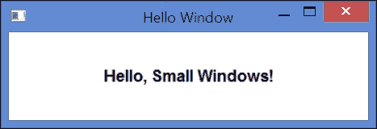
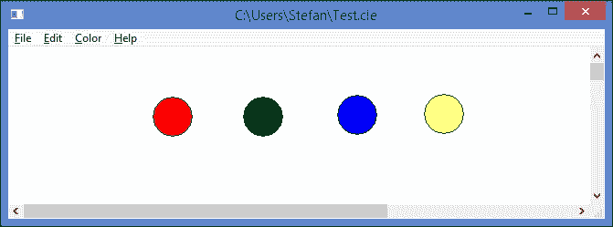
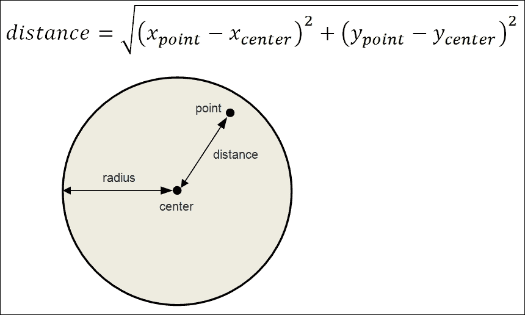

# 第二章。Hello, Small World!

本章通过展示以下两个小型应用程序来介绍 Small Windows：

+   第一个应用程序在窗口中写入 "Hello, Small Windows!"

+   第二个应用程序在文档窗口中处理不同颜色的圆圈

# Hello, Small Windows!

在 Brian Kernighan 和 Dennis Ritchie 的《C 程序设计语言》中，介绍了 hello-world 示例。它是一个小程序，在屏幕上写入 "hello, world"。在本节中，我们将为 Small Windows 编写一个类似的程序。

在常规 C++ 中，应用程序的执行从 `main` 函数开始。然而，在 Small Windows 中，`main` 被框架隐藏，并被 `MainWindow` 替换，其任务是定义应用程序名称并创建主窗口对象。以下 `argumentList` 参数对应于 `main` 中的 `argc` 和 `argv`。`commandShow` 参数将系统对窗口外观的请求传递：

**MainWindow.cpp**

```cpp
#include "..\\SmallWindows\\SmallWindows.h" 
#include "HelloWindow.h" 

void MainWindow(vector<String> /* argumentList */, WindowShow windowShow) { 
  Application::ApplicationName() = TEXT("Hello"); 
  Application::MainWindowPtr() = 
    new HelloWindow(windowShow); 
} 

```

在 C++ 中，有两种字符类型，`char` 和 `wchar_t`，其中 `char` 存储一个 1 字节的常规字符，而 `wchar_t` 存储一个较大尺寸的宽字符，通常为 2 字节。还有一个 `string` 类，它存储 `char` 值的字符串，以及 `wstring` 类，它存储 `wchar_t` 值的字符串。

然而，在 Windows 中，还有一个通用的字符类型 `TCHAR`，它取决于系统设置，可以是 `char` 或 `wchar_t`。还有一个 `String` 类，它存储 `TCHAR` 值的字符串。此外，`TEXT` 是一个宏，它将字符值转换为 `TCHAR`，将文本值转换为 `TCHAR` 值的数组。

总结一下，以下表格显示了字符类型和字符串类：

| **常规字符** | **宽字符** | **通用字符** |
| --- | --- | --- |
| char | wchar_t | TCHAR |
| 字符串 | w 字符串 | 字符串 |

在本书的应用程序中，我们始终使用 `TCHAR` 类型、`String` 类和 `TEXT` 宏。唯一例外是 第十三章 中的剪贴板处理，*注册表、剪贴板、标准对话框和打印预览*。

我们版本的 hello-world 程序在客户区域的中心写入 "Hello, Small Windows!"。窗口的客户区域是窗口中可以绘制图形对象的部分。在以下窗口中，客户区域是白色区域：



`HelloWindow` 类扩展了小型窗口 `Window` 类。它包含一个构造函数和 `Draw` 方法。构造函数使用有关窗口外观的合适信息调用 `Window` 构造函数。每当窗口的客户区域需要重绘时，都会调用 `Draw` 方法：

**HelloWindow.h**

```cpp
class HelloWindow : public Window { 
  public: 
    HelloWindow(WindowShow windowShow); 
    void OnDraw(Graphics& graphics, DrawMode drawMode) const; 
}; 

```

`HelloWindow` 的构造函数使用以下参数调用 `Window` 的构造函数：

+   `HelloWindow`构造函数的第一个参数是坐标系。`LogicalWithScroll`表示每个逻辑单位是一百分之一毫米，无论屏幕的物理分辨率如何。当前滚动条设置将被考虑。

+   `Window`构造函数的第二个参数是窗口的首选大小。它表示应使用默认大小。

+   第三个参数是指向父窗口的指针。由于窗口没有父窗口，因此它是 null。

+   第四和第五个参数设置窗口的样式，在这种情况下是重叠窗口。

+   最后一个参数是`windowShow`，由周围系统提供给`MainWindow`，它决定了窗口的初始外观（最小化、正常或最大化）。

+   最后，构造函数通过调用`Window`类的`SetHeader`方法来设置窗口的标题。

**HelloWindow.cpp**

```cpp
#include "..\\SmallWindows\\SmallWindows.h" 
#include "HelloWindow.h" 

HelloWindow::HelloWindow(WindowShow windowShow) 
 :Window(LogicalWithScroll, ZeroSize, nullptr, 
         OverlappedWindow, NoStyle, windowShow) { 
  SetHeader(TEXT("Hello Window")); 
} 

```

每当窗口的客户区域需要重绘时，都会调用`OnDraw`方法。它获取客户区域的大小，并在白色背景上以黑色文本在其中心绘制文本。`SystemFont`参数将使文本以默认系统字体显示。

小窗口的`Color`类包含常量`Black`和`White`。`Point`类包含一个二维点。`Size`类包含`width`和`height`。`Rect`类包含一个矩形；更具体地说，它包含矩形的四个角：

```cpp
void HelloWindow::OnDraw(Graphics& graphics, 
                         DrawMode /* drawMode */) const { 
  Size clientSize = GetClientSize(); 
  Rect clientRect(Point(0, 0), clientSize);
 graphics.DrawText(clientRect, TEXT("Hello, Small Windows!"),
                    SystemFont, Black, White);
} 

```

# 圆的应用程序

在本节中，我们将探讨一个简单的圆应用。正如其名所示，它允许用户在图形应用程序中处理圆。用户可以通过按下鼠标左键来添加一个新的圆。用户还可以通过拖动来移动现有的圆。此外，用户还可以更改圆的颜色，以及保存和打开文档：



## 主窗口

正如我们将在整本书中看到的那样，`MainWindow`函数始终执行相同的事情：它设置应用程序名称并创建应用程序的主窗口。该名称被**保存**和**打开**标准对话框、**关于**菜单项和注册表使用。

主窗口与其他应用程序窗口之间的区别在于，当用户关闭主窗口时，应用程序退出。此外，当用户选择**退出**菜单项时，主窗口被关闭，并调用其析构函数：

**MainWindow.cpp**

```cpp
#include "..\\SmallWindows\\SmallWindows.h" 
#include "Circle.h" 
#include "CircleDocument.h" 

void MainWindow(vector<String> /* argumentList */, 
                WindowShow windowShow) { 
  Application::ApplicationName() = TEXT("Circle"); 
  Application::MainWindowPtr() = 
    new CircleDocument(windowShow); 
} 

```

## `CircleDocument`类

`CircleDocument`类扩展了 Small Windows 的`StandardDocument`类，而`StandardDocument`类又反过来扩展了`Document`和`Window`类。实际上，`StandardDocument`类构成了一个框架，即一个具有一组虚拟方法的功能基类，我们可以覆盖并进一步指定这些方法。

`OnMouseDown` 和 `OnMouseUp` 方法是从 `Window` 类继承的，当用户按下或释放鼠标按钮时会被调用。`OnMouseMove` 方法在用户移动鼠标时被调用。`OnDraw` 方法也是从 `Window` 类继承的，每次窗口需要重绘时都会被调用。

`ClearDocument`、`ReadDocumentFromStream` 和 `WriteDocumentToStream` 方法是从 `Standard­Document` 类继承的，当用户创建新文件、打开文件或保存文件时会被调用：

**CircleDocument.h**

```cpp
class CircleDocument : public StandardDocument { 
  public: 
    CircleDocument(WindowShow windowShow); 
    ~CircleDocument(); 

    void OnMouseDown(MouseButton mouseButtons, 
                    Point mousePoint, 
                    bool shiftPressed, 
                    bool controlPressed); 
    void OnMouseUp(MouseButton mouseButtons, 
                    Point mousePoint, 
                    bool shiftPressed, 
                    bool controlPressed); 
    void OnMouseMove(MouseButton mouseButtons, 
                    Point mousePoint, 
                    bool shiftPressed, 
                    bool controlPressed); 

    void OnDraw(Graphics& graphics, DrawMode drawMode) const; 

    bool ReadDocumentFromStream(String name, 
                           istream& inStream); 
    bool WriteDocumentToStream(String name, 
                           ostream& outStream) const; 
    void ClearDocument(); 

```

`DEFINE_BOOL_LISTENER` 和 `DEFINE_VOID_LISTENER` 宏定义了**监听器**，这些是没有参数的方法，当用户选择菜单项时会被调用。这两个宏之间的唯一区别是定义的方法的返回类型：`bool` 或 `void`。

在本书的应用中，我们使用常见的标准，即响应用户操作而调用的监听器以 `On` 为前缀，例如，`OnRed`，如下面的代码片段所示。决定菜单项是否应该启用的方法以 `Enable` 为后缀，而决定菜单项是否应该用勾选标记或单选按钮标记的方法以 `Check` 或 `Radio` 为后缀。

在以下应用程序中，我们为红色、绿色和蓝色定义了菜单项。我们还定义了一个颜色标准对话框的菜单项：

```cpp
    DEFINE_VOID_LISTENER(CircleDocument,OnRed); 
    DEFINE_VOID_LISTENER(CircleDocument,OnGreen); 
    DEFINE_VOID_LISTENER(CircleDocument,OnBlue); 
    DEFINE_VOID_LISTENER(CircleDocument,OnColorDialog); 

```

当用户选择了一种颜色，红色、绿色或蓝色时，相应的菜单项会用单选按钮进行勾选。`RedRadio`、`GreenRadio` 和 `BlueRadio` 参数在菜单项变得可见之前被调用，并返回一个布尔值，指示菜单项是否应该用单选按钮标记：

```cpp
    DEFINE_BOOL_LISTENER(CircleDocument, RedRadio); 
    DEFINE_BOOL_LISTENER(CircleDocument, GreenRadio); 
    DEFINE_BOOL_LISTENER(CircleDocument, BlueRadio); 

```

圆的半径始终为 500 单位，相当于 5 毫米：

```cpp
    static const int CircleRadius = 500; 

```

`circleList` 字段存储圆，其中最顶部的圆位于列表的开头。`nextColor` 字段存储用户将要添加的下一个圆的颜色。它被初始化为负一，以表示开始时没有圆在移动。`moveIndex` 和 `movePoint` 字段被 `OnMouseDown` 和 `OnMouseMove` 方法用来跟踪用户正在移动的圆：

```cpp
  private: 
    vector<Circle> circleList; 
    Color nextColor; 
    int moveIndex = -1; 
    Point movePoint; 
}; 

```

在 `StandardDocument` 构造函数调用中，前两个参数是 `LogicalWithScroll` 和 `USLetterPortrait`。它们表示逻辑大小是毫米的百分之一，客户端区域包含一个 US 信封的逻辑大小：*215.9*279.4 毫米（8.5*11 英寸）*。如果窗口被调整大小，使得客户端区域小于一个 US 信封，则会在窗口中添加滚动条。

第三个参数设置了标准保存和打开对话框使用的文件信息；文本描述设置为`Circle Files`，文件后缀设置为`cle`。`nullptr`参数表示窗口没有父窗口。`OverlappedWindow`常量参数表示窗口应与其他窗口重叠，而`windowShow`参数是通过`MainWindow`类从周围系统传递给窗口的初始外观：

**CircleDocument.cpp**

```cpp
#include "..\\SmallWindows\\SmallWindows.h" 
#include "Circle.h" 
#include "CircleDocument.h" 

CircleDocument::CircleDocument(WindowShow windowShow) 
 :StandardDocument(LogicalWithScroll, USLetterPortrait, 
                   TEXT("Circle Files, cle"), nullptr, 
                   OverlappedWindow, windowShow) { 

```

`StandardDocument`类将标准的**文件**、**编辑**和**帮助**菜单添加到窗口菜单栏。**文件**菜单包含**新建**、**打开**、**保存**、**另存为**、**页面设置**、**打印预览**和**退出**项。**页面设置**和**打印预览**是可选的。`StandardDocument`构造函数的第七个参数（默认值为`false`）表示它们的存在。**编辑**菜单包含**剪切**、**复制**、**粘贴**和**删除**项。它们默认是禁用的；我们不会在这个应用程序中使用它们。**帮助**菜单包含**关于**项，`MainWindow`中设置的应用程序名称用于显示包含标准消息**Circle, version 1.0**的消息框。

我们将标准的**文件**和**编辑**菜单添加到菜单栏。然后我们添加了**颜色**菜单，这是该应用程序的应用特定菜单。最后，我们添加了标准的**帮助**菜单并设置了文档的菜单栏。

**颜色**菜单包含用于设置圆颜色的菜单项。当用户选择菜单项时，会调用`OnRed`、`OnGreen`和`OnBlue`方法，而在用户选择**颜色**菜单之前，会调用`RedRadio`、`GreenRadio`和`BlueRadio`方法以决定是否用单选按钮标记项。`OnColorDialog`方法打开一个标准颜色对话框。

在以下代码片段中的`&Red\tCtrl+R`文本中，**和号**（**&**）表示菜单项有一个**快捷键**；即字母 R 将被下划线标记，并且可以在菜单打开后通过按 R 来选择菜单项。**制表符字符**（**\t**）表示文本的第二部分定义了一个**快捷键**；即文本`Ctrl+R`将在菜单项中右对齐，并且可以通过按 Ctrl+R 来选择该项：

```cpp
  Menu menuBar(this);
```

`StandardFileMenu`的`false`参数表示我们不希望包含文件菜单项。

```cpp
  menuBar.AddMenu(StandardFileMenu(false));
```

`Menu`类中的`AddItem`方法还接受两个额外的参数，用于启用菜单项和设置复选框。然而，我们在这个应用程序中不使用它们。因此，我们发送空指针：

```cpp
  Menu colorMenu(this, TEXT("&Color")); 
  colorMenu.AddItem(TEXT("&Red\tCtrl+R"), OnRed, 
                    nullptr, nullptr, RedRadio); 
  colorMenu.AddItem(TEXT("&Green\tCtrl+G"), OnGreen, 
                    nullptr, nullptr, GreenRadio); 
  colorMenu.AddItem(TEXT("&Blue\tCtrl+B"), OnBlue, 
                    nullptr, nullptr, BlueRadio); 
  colorMenu.AddSeparator(); 
  colorMenu.AddItem(TEXT("&Dialog ..."), OnColorDialog); 
  menuBar.AddMenu(colorMenu); 

  menuBar.AddMenu(StandardHelpMenu()); 
  SetMenuBar(menuBar); 

```

最后，我们从注册表中读取当前颜色（即将添加的下一个圆的颜色）；如果没有在注册表中存储颜色，则默认颜色为红色：

```cpp
  nextColor.ReadColorFromRegistry(TEXT("NextColor"), Red); 
} 

```

析构函数将当前颜色保存到注册表中。在这个应用程序中，我们不需要执行析构函数的正常任务，例如释放内存或关闭文件：

```cpp
CircleDocument::~CircleDocument() { 
  nextColor.WriteColorToRegistry(TEXT("NextColor")); 
} 

```

当用户选择**新建**菜单项时，会调用`ClearDocument`方法。在这种情况下，我们只需清除圆列表。其他任何操作，如重绘窗口或更改其标题，都由`StandardDocument`类处理：

```cpp
void CircleDocument::ClearDocument() { 
  circleList.clear(); 
} 

```

当用户通过选择**保存**或**另存为**来保存文件时，`StandardDocument`类会调用`WriteDocumentToStream`方法。它将圆的数量（圆列表的大小）写入输出流，并为每个圆调用`WriteCircle`方法，以便将它们的状态写入流：

```cpp
bool CircleDocument::WriteDocumentToStream(String name, 
                          ostream& outStream) const { 
  int size = circleList.size(); 
  outStream.write((char*) &size, sizeof size); 

  for (Circle circle : circleList) { 
    circle.WriteCircle(outStream); 
  } 

  return ((bool) outStream); 
} 

```

当用户通过选择**打开**菜单项打开文件时，`StandardDocument`方法会调用`ReadDocumentFromStream`方法。它读取圆的数量（圆列表的大小），并为每个圆创建一个新的`Circle`类对象，调用`ReadCircle`方法以读取圆的状态，并将圆对象添加到`circleList`方法：

```cpp
bool CircleDocument::ReadDocumentFromStream(String name, 
                                 istream& inStream) { 
  int size; 
  inStream.read((char*) &size, sizeof size); 

  for (int count = 0; count < size; ++count) { 
    Circle circle; 
    circle.ReadCircle(inStream); 
    circleList.push_back(circle); 
  } 

  return ((bool) inStream); 
} 

```

当用户按下鼠标按钮时，会调用`OnMouseDown`方法。首先我们需要检查他们是否按下了左键。如果按下了，我们就遍历圆列表，并为列表中的每个圆调用`IsClick`方法，以确定他们是否点击了圆。请注意，最上面的圆位于列表的开头；因此，我们从列表的开头开始循环。如果我们找到一个被点击的圆，我们就退出循环。

如果用户点击了一个圆，我们将其索引`moveIndex`和当前鼠标位置存储在`movePoint`中。这两个值都需要在用户移动鼠标时调用的`OnMouseMove`方法中使用：

```cpp
void CircleDocument::OnMouseDown 
           (MouseButton mouseButtons, Point mousePoint, 
            bool shiftPressed /* = false */, 
            bool controlPressed /* = false */) { 
  if (mouseButtons == LeftButton) { 
    moveIndex = -1; 
    int size = circleList.size(); 

    for (int index = 0; index < size; ++index) { 
      if (circleList[index].IsClick(mousePoint)) { 
        moveIndex = index; 
        movePoint = mousePoint; 
        break; 
      } 
    } 

```

然而，如果用户没有点击圆，我们会添加一个新的圆。圆由其中心位置（`mousePoint`）、半径（`CircleRadius`）和颜色（`nextColor`）定义。

无效区域是需要重绘的客户区域的一部分。记住，在 Windows 中，我们通常不会直接绘制图形。相反，我们调用`Invalidate`方法来告诉系统某个区域需要重绘，并通过调用`UpdateWindow`方法强制实际重绘，这最终会导致调用`OnDraw`方法。无效区域始终是矩形。`Invalidate`方法有一个第二个参数（默认值为`true`），表示无效区域应该被清除。

技术上，它被涂在窗口的客户颜色上，在这种情况下是白色。这样，圆的先前位置就会被清除，并在新的位置绘制圆。

`SetDirty`方法告诉框架文档已被修改（文档已变为*脏的*），这会导致**保存**菜单项被启用，并且如果用户尝试在不保存的情况下关闭窗口，会警告用户：

```cpp
    if (moveIndex == -1) { 
      Circle newCircle(mousePoint, CircleRadius, 
                       nextColor); 
      circleList.push_back(newCircle); 
      Invalidate(newCircle.Area()); 
      UpdateWindow(); 
      SetDirty(true); 
    } 
  } 
} 

```

每当用户按下至少一个鼠标按钮移动鼠标时，都会调用`OnMouseMove`方法。我们首先需要检查用户是否按下了左鼠标按钮并且点击了一个圆（即`moveIndex`方法不等于`-1`）。如果是，我们通过使用`mousePoint`方法比较前一个鼠标事件（`OnMouseDown`或`OnMouseMove`）的先前和当前鼠标位置来计算与前一个鼠标事件之间的距离。我们更新圆的位置，使旧的和新的区域无效，并使用`UpdateWindow`方法强制重绘无效区域，并设置脏标志：

```cpp
void CircleDocument::OnMouseMove 
           (MouseButton mouseButtons, Point mousePoint, 
            bool shiftPressed /* = false */, 
            bool controlPressed /* = false */) { 
  if ((mouseButtons == LeftButton)&&(moveIndex != -1)) { 
    Size distanceSize = mousePoint - movePoint; 
    movePoint = mousePoint; 

    Circle& movedCircle = circleList[moveIndex]; 
    Invalidate(movedCircle.Area()); 
    movedCircle.Center() += distanceSize; 
    Invalidate(movedCircle.Area()); 

    UpdateWindow(); 
    SetDirty(true); 
  } 
} 

```

严格来说，`OnMouseUp`方法可以被排除，因为`moveIndex`方法在`OnMouseDown`方法中被设置为负一，而`OnMouseDown`方法总是在`OnMouseMove`方法之前被调用。然而，它已经被包含在内，为了完整性：

```cpp
void CircleDocument::OnMouseUp 
           (MouseButton mouseButtons, Point mousePoint, 
            bool shiftPressed /* = false */, 
            bool controlPressed /* = false */) { 
  moveIndex = -1; 
} 

```

每当窗口需要（部分或全部）重绘时，都会调用`OnDraw`方法。这个调用可以由系统初始化，作为对事件的响应（例如，窗口已调整大小）或者由对`UpdateWindow`方法的早期调用。`Graphics`引用参数是由框架创建的，可以被视为绘制线条、填充区域和写入文本的工具箱。然而，在这个应用程序中，我们不写入文本。

我们遍历圆列表，并对每个圆调用`Draw`方法。请注意，我们并不关心哪些圆需要实际重绘。我们只是重绘所有圆。然而，只有位于之前调用`Invalidate`方法使区域无效的圆才会实际重绘。

`Draw`方法有一个表示绘制模式的第二个参数，可以是`Paint`或`Print`。`Paint`方法表示`OnDraw`方法是由`Window`类中的`OnPaint`方法调用的，并且绘制是在窗口的客户区域中执行的。`Print`方法表示`OnDraw`方法是由`OnPrint`方法调用的，并且绘制被发送到打印机。然而，在这个应用程序中，我们不使用该参数：

```cpp
void CircleDocument::OnDraw(Graphics& graphics, 
                            DrawMode /* drawMode */) const { 
  for (Circle circle : circleList) { 
    circle.Draw(graphics); 
  } 
} 

```

在显示菜单项之前，会调用`RedRadio`、`GreenRadio`和`BlueRadio`方法，如果它们返回`true`，则项目将带有单选按钮。`Red`、`Green`和`Blue`常量在`Color`类中定义：

```cpp
bool CircleDocument::RedRadio() const { 
  return (nextColor == Red); 
} 

bool CircleDocument::GreenRadio() const { 
  return (nextColor == Green); 
} 

bool CircleDocument::BlueRadio() const { 
  return (nextColor == Blue); 
} 

```

当用户选择相应的菜单项时，会调用`OnRed`、`OnGreen`和`OnBlue`方法。它们都将`nextColor`字段设置为一个适当的值：

```cpp
void CircleDocument::OnRed() { 
  nextColor = Red; 
} 

void CircleDocument::OnGreen() { 
  nextColor = Green; 
} 

void CircleDocument::OnBlue() { 
  nextColor = Blue; 
} 

```

当用户选择**颜色**对话框菜单项时，会调用`OnColorDialog`方法，并显示标准颜色对话框。如果用户选择了一种新颜色，`nextcolor`方法将获得所选的颜色值：

```cpp
void CircleDocument::OnColorDialog() { 
  StandardDialog(this, nextColor); 
} 

```

## Circle 类

`Circle`是一个包含单个圆信息的类。当从文件中读取圆时使用默认构造函数。当创建一个新的圆时使用第二个构造函数。`IsClick`方法如果给定的点位于圆内（检查用户是否点击了圆），则返回`true`，`Area`方法返回圆的周围矩形（用于无效化），并且调用`Draw`方法来重新绘制圆：

**Circle.h**

```cpp
class Circle { 
  public: 
    Circle(); 
    Circle(Point center, int radius, Color color); 

    bool WriteCircle(ostream& outStream) const; 
    bool ReadCircle(istream& inStream); 

    bool IsClick(Point point) const; 
    Rect Area() const; 
    void Draw(Graphics& graphics) const; 

    Point Center() const {return center;} 
    Point& Center() {return center;} 
    Color GetColor() {return color;} 

```

如前所述，圆由其中心位置（`center`）、半径（`radius`）和颜色（`color`）定义：

```cpp
  private: 
    Point center; 
    int radius; 
    Color color; 
}; 

```

默认构造函数不需要初始化字段，因为它是在用户打开文件时调用的，值是从文件中读取的。然而，第二个构造函数初始化圆的中心点、半径和颜色：

**Circle.cpp**

```cpp
#include "..\\SmallWindows\\SmallWindows.h" 
#include "Circle.h" 

Circle::Circle() { 
  // Empty. 
} 

Circle::Circle(Point center, int radius, Color color) 
 :color(color), 
  center(center), 
  radius(radius) { 
  // Empty. 
} 

```

`WriteCircle`方法将颜色、中心点和半径写入流。由于`radius`是一个常规整数，我们简单地使用 C 标准函数`write`，而`Color`和`Point`有自己的方法将它们的值写入流。在`ReadCircle`方法中，我们以类似的方式从流中读取颜色、中心点和半径：

```cpp
bool Circle::WriteCircle(ostream& outStream) const { 
  color.WriteColorToStream(outStream); 
  center.WritePointToStream(outStream); 
  outStream.write((char*) &radius, sizeof radius); 
  return ((bool) outStream); 
} 

bool Circle::ReadCircle(istream& inStream) { 
  color.ReadColorFromStream(inStream); 
  center.ReadPointFromStream(inStream); 
  inStream.read((char*) &radius, sizeof radius); 
  return ((bool) inStream); 
} 

```

`IsClick`方法使用毕达哥拉斯定理计算给定点与圆的中心点之间的距离，如果点位于圆内（如果距离小于或等于圆半径），则返回`true`：



```cpp
 Circle::IsClick(Point point) const { 
  int width = point.X() - center.X(), 
      height = point.Y() - center.Y(); 
  int distance = (int) sqrt((width * width) + 
                            (height * height)); 
  return (distance <= radius); 
} 

```

结果矩形的左上角是中心点减去半径，而右下角是中心点加上半径：

```cpp
Rect Circle::Area() const { 
  Point topLeft = center - radius, 
        bottomRight = center + radius; 
  return Rect(topLeft, bottomRight); 
} 

```

我们使用 Small Windows `Graphics`类的`FillEllipse`方法（没有`FillCircle`方法）来绘制圆。圆的边框总是黑色，而其内部颜色由`color`字段给出：

```cpp
void Circle::Draw(Graphics& graphics) const { 
  Point topLeft = center - radius, 
        bottomRight = center + radius; 
  Rect circleRect(topLeft, bottomRight); 
  graphics.FillEllipse(circleRect, Black, color); 
} 

```

# 摘要

在本章中，你探讨了 Small Windows 中的两个应用：一个简单的 hello-world 应用和一个稍微复杂一点的圆应用，该应用介绍了框架。你还了解了菜单、圆的绘制和鼠标处理。

在第三章中，我们将开发一个经典的俄罗斯方块游戏。
