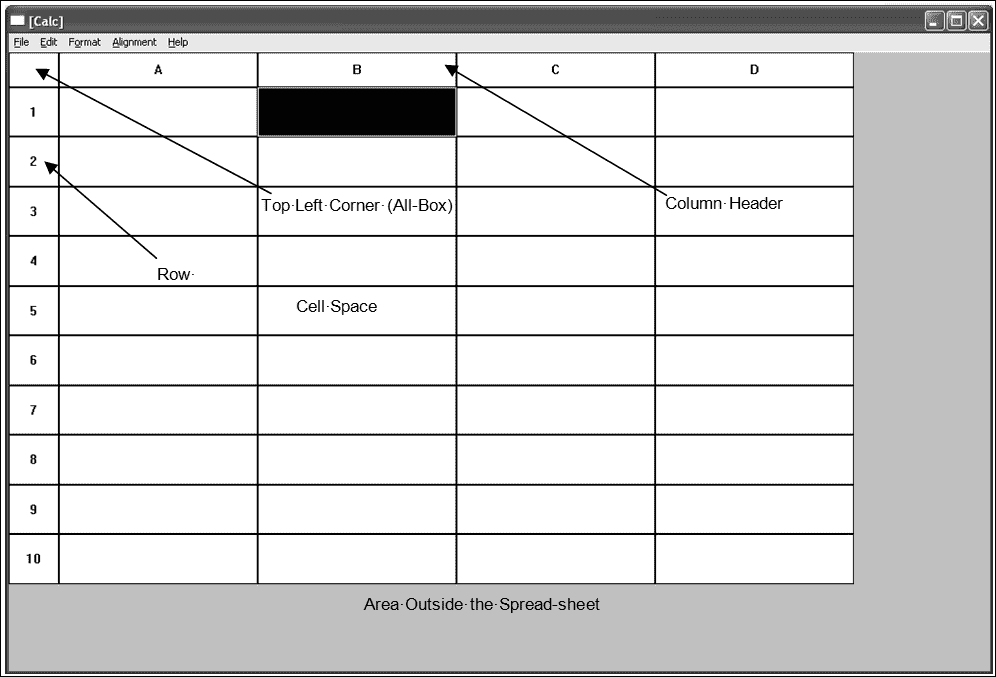
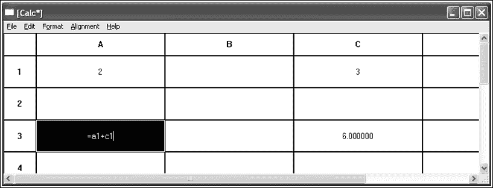
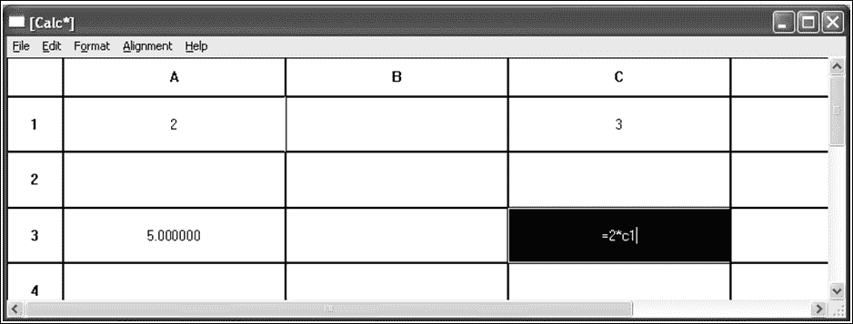
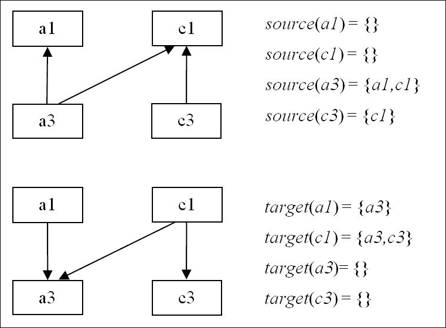

# 第八章。构建电子表格应用程序

在本章中，我们将开始开发本书的最后一个应用程序——一个能够计算数值表达式以及使用相对引用剪切和粘贴单元格的电子表格程序。类似于前几章中的文本处理器，电子表格程序剪切和粘贴 ASCII 和 Unicode 文本以及特定于应用程序的信息。此外，还可以更改单元格及其水平和垂直对齐方式的字体和颜色。

在本章中，我们将探讨以下内容：

+   鼠标和键盘输入

+   绘制电子表格

+   保存和加载电子表格

+   剪切、复制和粘贴单元格块

+   单元格块的字体、颜色和对齐方式

# `MainWindow` 类

本章中 `MainWindow` 的定义与之前的定义非常相似。

**MainWindow.cpp**

```cpp
#include "..\\SmallWindows\\SmallWindows.h" 
#include "Token.h" 
#include "Error.h" 
#include "Scanner.h" 
#include "TreeNode.h" 
#include "Parser.h" 
#include "Cell.h" 
#include "CalcDocument.h" 

void MainWindow(vector<String> /* argumentList */, 
                WindowShow windowShow) { 
  Application::ApplicationName() = TEXT("Calc"); 
  Application::MainWindowPtr() = new CalcDocument(windowShow); 
} 

```

# `CalcDocument` 类

`CalcDocument` 类是应用程序的主要类。它捕获鼠标和键盘事件，处理滚动和绘制，并处理菜单操作。然而，单元格级别的操作由 `Cell` 类处理，我们将在第九章（[ch09.html](https://example.org/ch09.html "第九章。公式解释"）中介绍），*公式解释* 中进行介绍。

用户可以标记一个或多个单元格，在这种情况下，私有字段 `calcMode` 被设置为 `Mark`。用户还可以编辑一个单元格中的文本，在这种情况下，`calcMode` 字段被设置为 `Edit`。类似于前几章中的文本处理器，我们在 **标记模式** 和 **编辑模式** 等表达式中引用 `calcMode` 字段的当前值。

```cpp
class CalcDocument : public StandardDocument { 
  public: 
    CalcDocument(WindowShow windowShow);       

```

`OnMouseDown`、`OnMouseMove` 和 `OnDoubleClick` 方法以与先前应用程序相同的方式捕获鼠标动作。请注意，我们没有重写 `OnMouseUp` 方法。与第七章（[ch07.html](https://example.org/ch07.html "第七章。键盘输入和字符计算"）中提到的“键盘输入和字符计算”的文本处理器相反，此应用程序在用户实际输入字符之前保持 `mark` 模式，即使他们只标记了一个单元格。用户还可以通过拖动鼠标标记多个单元格。

```cpp
    void OnMouseDown(MouseButton mouseButtons, Point mousePoint,
                     bool shiftPressed, bool controlPressed);
    void OnMouseMove(MouseButton mouseButtons, Point mousePoint,
                     bool shiftPressed, bool controlPressed);
    void OnDoubleClick(MouseButton mouseButtons, Point mousePoint,
                     bool shiftPressed, bool controlPressed);
    void OnMouseUp(MouseButton mouseButtons, Point mousePoint,
                     bool shiftPressed, bool controlPressed);

```

当用户更改滚动条时，会调用 `OnHorizontalScroll` 和 `OnVerticalScroll` 方法。在先前的应用程序中，我们没有重写这些函数，但在这个应用程序中，我们希望每次滚动都导致单元格移动一个精确的数量。此外，在 `StandardDocument` 构造函数调用中，我们使用 `LogicalWithoutScroll` 坐标系统，以便能够处理电子表格的行和列标题，这些标题始终位于客户端区域的顶部和左侧，无论滚动条设置如何。这意味着我们必须手动处理滚动条移动。

```cpp
    virtual void OnHorizontalScroll(WORD flags, WORD x); 
    virtual void OnVerticalScroll(WORD flags, WORD y); 

```

用户可以通过点击左上角的**all**框（`ClickAll`）标记所有单元格，通过点击列标题标记一列中的所有单元格（`ClickCol`），通过点击行标题标记一行中的所有单元格（`ClickRow`），或者通过点击单元格来标记单个单元格（`ClickCell`）。

```cpp
    enum ClickArea {ClickAll, ClickRow, ClickColumn, ClickCell}; 

```

`GetMouseLocation`方法分析鼠标点击并返回一个`ClickArea`值。如果用户点击在电子表格的右侧，则选择该行的最右单元格，如果他们点击在电子表格下方，则选择该列的最下单元格。`Reference`类在第十二章 *辅助类*中定义。

```cpp
    ClickArea GetMouseLocation(Point mousePoint, 
                               Reference& cellRef) const; 

```

`MarkBlock`方法根据标记标记点击区域内的块：

```cpp
    void MarkBlock(ClickArea clickArea, Reference newFirstMarkRef,
                   Reference newLastMarkRef);

```

`OnDraw`方法绘制行和列标题以及单元格本身。在`edit`模式下，`UpdateCaret`方法设置正在编辑的单元格中的光标。

```cpp
    void OnDraw(Graphics& graphics, DrawMode drawMode) const; 
    void UpdateCaret(); 

```

当用户使用键盘标记单元格时，最新标记的单元格始终可见。如果可见，`IsCellVisible`方法返回`true`，而`MakeCellVisible`方法通过滚动确保其可见性，如果需要的话。

无参数的`MakeCellVisible`方法调用带有编辑单元格的参数的`MakeCellVisible`方法，或者根据应用是否处于`edit`或`mark`模式，调用最后标记的单元格的`MakeCellVisible`方法。

```cpp
    bool IsCellVisible(Reference cellRef) const; 
    void MakeCellVisible(); 
    void MakeCellVisible(Reference cellRect); 

```

当用户在一个单元格中完成输入文本后，会调用`ToMarkMode`方法，尝试将应用模式从`edit`更改为`mark`。如果输入失败（如果输入了有语法错误的公式），则返回`false`：

```cpp
    bool ToMarkMode(); 

```

当用户标记一个或多个单元格时，会调用`Remark`方法。为了避免混淆，它不会标记已经标记的单元格：

```cpp
    void Remark(Reference newFirstRef, Reference newLastRef); 

```

当用户在`mark`模式下输入字符时，会调用`OnChar`方法；应用模式将变为`edit`模式：

```cpp
    void OnChar(TCHAR tChar); 

```

`OnKeyDown`方法调用一个特定的按键处理方法，在`edit`模式下改变光标位置，在`mark`模式下改变单元格标记：

```cpp
    bool OnKeyDown(WORD key, bool shiftPressed, 
                   bool controlPressed); 
    void OnLeftArrowKey(bool shiftPressed); 
    void OnRightArrowKey(bool shiftPressed); 
    void OnUpArrowKey(bool shiftPressed); 
    void OnDownArrowKey(bool shiftPressed); 
    void OnHomeKey(bool shiftPressed, bool controlPressed); 
    void OnEndKey(bool shiftPressed, bool controlPressed); 

```

`OnReturnKey`和`OnTabulatorKey`方法在`edit`模式下完成输入（除非发生语法错误）并将标记位置向下移动一步（*Return*），向左（*Shift* + *Tab*）或向右（*Tab*）。然而，如果发生错误，将显示错误消息框，并且`edit`模式保持不变。用户完成有语法错误的公式的输入的唯一方法是按下*Esc*键，在这种情况下将调用`OnEscapeKey`方法，并将单元格的值重置为输入开始时的值：

```cpp
    void OnReturnKey(); 
    void OnTabulatorKey(bool shiftPressed); 
    void OnEscapeKey(); 

```

`OnDeleteKey`和`OnBackspaceKey`方法从`edit`模式中删除当前字符，并在`mark`模式下清除标记的单元格：

```cpp
    void OnDeleteKey(); 
    void OnBackspaceKey(); 

```

与前面的应用程序类似，当用户选择 **新建** 菜单项时调用 `ClearDocument` 方法，当用户选择 **打开** 菜单项时调用 `ReadDocumentFromStream` 方法，当用户选择 **保存** 或 **另存为** 菜单项时调用 `WriteDocumentToStream` 方法：

```cpp
    void ClearDocument(); 
    bool ReadDocumentFromStream(String name, istream& inStream); 
    bool WriteDocumentToStream(String name, ostream& outStream) 
                               const; 

```

以等号（**=**) 开头后跟带有单元格引用的数值表达式被视为 **公式**。技术上讲，等号后跟的不是数值表达式的内容也被视为公式。然而，在这种情况下，它是一个存在语法错误的公式。当用户输入公式时，公式中引用的单元格构成了单元格的 **源集**。单元格的 **目标集** 由具有该单元格作为源（集合在本章末尾更精确地定义）的单元格组成。`WriteSetMapToStream` 和 `ReadSetMapFromStream` 方法写入和读取源和目标集映射：

```cpp
    static bool WriteSetMapToStream(const map<Reference, 
                     set<Reference>>& setMap, ostream& outStream); 
    static bool ReadSetMapFromStream(map<Reference,set<Reference>> 
                                     &setMap, istream& inStream); 

```

在此应用程序中，我们重写了 `StandardDocument` 类中的 `IsCopyAsciiReady`、`IsCopyUnicodeReady` 和 `IsCopyGenericReady` 方法。它们是由 `StandardDocument` 类中的 `OnCopy` 方法调用的：

```cpp
    bool CopyEnable() const; 
    bool IsCopyAsciiReady() const {return true;} 
    bool IsCopyUnicodeReady() const {return true;} 
    bool IsCopyGenericReady(int format) const {return true;} 

```

可能看起来很奇怪，`CopyEnable` 方法以及三个更具体的启用方法都被重写了。然而，`CopyEnable` 方法在应用程序准备好复制时返回 `true`（在 `mark` 模式下是这样），而其他方法是由 `StandardDocument` 类中的 `OnCopy` 方法调用来决定应用程序是否准备好以给定格式复制。

它们的默认实现是返回 `false`，但我们需要重写它们，因为在 `mark` 模式下始终可以复制标记的单元格：

```cpp
    void CopyAscii(vector<String>& textList) const; 
    void CopyUnicode(vector<String>& textList) const; 
    void CopyGeneric(int format, InfoList& infoList) const; 

```

我们可以像重写 `CopyEnable` 方法一样重写 `StandardDocument` 类中的 `PasteEnable` 方法。然而，在此应用程序中，我们需要进行一些更精细的测试。因此，我们重写了 `IsPasteAsciiReady`、`IsPasteUnicodeReady` 和 `IsPasteGenericReady` 方法。在前几章的文字处理器中，我们可以始终粘贴文本，无论字符数或段落数。然而，在此应用程序中，我们需要检查要粘贴的块是否适合电子表格：

```cpp
    bool IsPasteAsciiReady(const vector<String>& textList) const; 
    bool IsPasteUnicodeReady(const vector<String>& textList)const; 
    bool IsPasteGenericReady(int format, InfoList& infoList)const; 

```

与文字处理器类似，我们重写了 `PasteAscii`、`PasteUnicode` 和 `PasteGeneric` 方法。记住，这些方法是在 `CalcDocument` 构造函数调用中给出的格式列表的顺序中调用的。当相应的启用方法 `IsPasteAsciiReady`、`IsPasteUnicodeReady` 或 `IsPasteGenericReady` 返回 `true` 时，将调用 `PasteAscii`、`PasteUnicode` 或 `PasteGeneric` 方法。只有第一个粘贴方法会被调用。如果没有任何启用方法返回 `true`，则不会调用任何粘贴方法：

```cpp
    void PasteAscii(const vector<String>& textList); 
    void PasteUnicode(const vector<String>& textList); 
    void PasteGeneric(int format, InfoList& infoList); 

```

`DeleteEnable` 方法在 `mark` 模式下始终返回 `true`，因为总是至少有一个单元格被标记并准备好删除。在 `edit` 模式下，如果光标不在编辑单元格文本的末尾，则返回 `true`。`OnDelete` 方法简单地调用 `OnDeleteKey` 方法，因为**删除**菜单项与用户按下 *Delete* 键具有相同的效果：

```cpp
    bool DeleteEnable() const; 
    void OnDelete(); 

```

当用户选择**字体**或**背景颜色**菜单项时，会调用 `OnFont` 和 `OnBackgroundColor` 方法。它们显示标准的**字体**或**颜色**对话框：

```cpp
    DEFINE_VOID_LISTENER(CalcDocument, OnFont); 
    DEFINE_VOID_LISTENER(CalcDocument, OnBackgroundColor); 

```

水平方向上，单元格的文本可以左对齐、居中对齐、右对齐或两端对齐。垂直方向上，它可以上对齐、居中对齐或底对齐。所有单选方法都调用 `IsHorizontalAlignment` 或 `IsVerticalAlignment` 方法，所有选择方法都调用 `SetHorizontalAlignment` 或 `SetVerticalAlignment` 方法：

```cpp
    DEFINE_BOOL_LISTENER(CalcDocument, HorizontalLeftRadio); 
    DEFINE_BOOL_LISTENER(CalcDocument, HorizontalCenterRadio); 
    DEFINE_BOOL_LISTENER(CalcDocument, HorizontalRightRadio); 
    DEFINE_BOOL_LISTENER(CalcDocument, HorizontalJustifiedRadio); 

    DEFINE_VOID_LISTENER(CalcDocument, OnHorizontalLeft); 
    DEFINE_VOID_LISTENER(CalcDocument, OnHorizontalCenter); 
    DEFINE_VOID_LISTENER(CalcDocument, OnHorizontalRight); 
    DEFINE_VOID_LISTENER(CalcDocument, OnHorizontalJustified); 

    bool IsHorizontalAlignment(Alignment alignment) const; 
    void SetHorizontalAlignment(Alignment alignment); 

    DEFINE_BOOL_LISTENER(CalcDocument, VerticalTopRadio); 
    DEFINE_BOOL_LISTENER(CalcDocument, VerticalCenterRadio); 
    DEFINE_BOOL_LISTENER(CalcDocument, VerticalBottomRadio); 

    DEFINE_VOID_LISTENER(CalcDocument, OnVerticalTop); 
    DEFINE_VOID_LISTENER(CalcDocument, OnVerticalCenter); 
    DEFINE_VOID_LISTENER(CalcDocument, OnVerticalBottom);     

    bool IsVerticalAlignment(Alignment alignment) const; 
    void SetVerticalAlignment(Alignment alignment); 

```

`InterpretEditCell` 方法在用户完成输入后解释单元格，并在公式的情况下创建一个**语法树**（在第九章公式解释中描述，*公式解释*）。如果出现语法错误，则抛出异常。`IsCircular` 方法如果单元格是循环引用的一部分（单元格公式直接或间接地引用自身），则返回 `true`。`RemoveTargetSetMap` 方法删除单元格的目标，而 `AddTargetSetMap` 方法向单元格添加目标。`EvaluateCell` 方法评估单个单元格的值，而 `EvaluateRecursive` 方法递归地评估所有目标单元格的值。最后，`InvalidateCell` 方法使单元格无效，以便稍后可以重新绘制：

```cpp
    bool InterpretEditCell(); 
    bool IsCircular(Reference cellRef, set<Reference>& targetSet); 
    void RemoveTargetSetMap(Reference cellRef); 
    void AddTargetSetMap(Reference cellRef, 
                         set<Reference>& newSourceSet); 
    void InvalidateCell(Reference cellRef); 

    void EvaluateRecursive(Reference cellRef, 
                           set<Reference>& invalidateSet); 
    void EvaluateCell(Reference cellRef); 

```

如本节开头所述，`calcMode` 方法设置为 `Mark` 或 `Edit`，我们将其当前值称为**标记模式**和**编辑模式**：

```cpp
  private: 
    enum CalcMode {Edit, Mark} calcMode = Mark; 

```

`markOk` 字段由 `OnMouseDown` 方法设置，以通知 `OnMouseMove` 方法可以标记单元格：

```cpp
    bool markOk; 

```

在 `mark` 模式下，`firstMarkRef` 和 `lastMarkRef` 字段分别指向电子表格中第一个和最后一个标记的单元格。请注意，它们指的是它们的顺序而不是物理顺序，这意味着第一个标记引用可以大于最后一个标记引用。在必要时，在某些方法中，会计算最小和最大引用：

```cpp
    Reference firstMarkRef, lastMarkRef, editRef; 

```

在 `edit` 模式下，`editRef` 指的是当前编辑的单元格，而 `editIndex` 指的是单元格文本中的下一个输入位置索引（以及光标位置）：

```cpp
    int editIndex; 

```

`cellMatrix` 字段持有应用程序的电子表格。`Rows` 和 `Cols` 是常量值，`Cell` 是包含每个单元格信息的类。`Matrix` 在第九章公式解释中定义。

```cpp
    Matrix<Rows,Cols,Cell> cellMatrix; 

```

当用户在单元格中输入一个公式时，公式中的每个引用都成为一个源。同样，每个源单元格被赋予一个目标单元格。单元格的源和目标集合存储在`sourceSetMap`和`targetSetMap`方法中：

```cpp
    map<Reference,set<Reference>> sourceSetMap, targetSetMap; 

```

在识别剪切、复制和粘贴格式时使用的`CalcFormat`方法的值被任意选择为 1003：

```cpp
    static const unsigned int CalcFormat = 1003; 

```

当用户使用*Esc*键完成单元格的输入时，单元格的先前内容（输入开始之前存储在单元格中的内容）被存储在`prevCell`变量中，并复制回单元格：

```cpp
    Cell prevCell; 
}; 

```

**CalcDocument.cpp**

```cpp
#include "..\\SmallWindows\\SmallWindows.h" 
#include "Token.h" 
#include "Error.h" 
#include "Scanner.h" 
#include "TreeNode.h" 
#include "Parser.h" 
#include "Cell.h" 
#include "CalcDocument.h" 

```

构造函数以与上一章中的文字处理器相同的方式调用`StandardDocument`构造函数。然而，请注意，我们选择了`LogicalWithoutScroll`坐标系（在文字处理器中，我们选择了`LogicalWithScroll`）。这意味着当用户更改滚动条设置时，客户端区域的坐标不会更新。相反，我们必须使用`OnHorizontalScroll`和`OnVerticalScroll`方法来捕获滚动条移动。这是因为行和列标题始终放置在客户端区域的顶部和左侧，无论当前的滚动条设置如何。此外，我们还想使滚动产生精确的行和列移动。我们还把第七个参数设置为`false`，表示在这个应用程序的**文件**菜单中省略**打印**和**打印预览**文件项：

```cpp
CalcDocument::CalcDocument(WindowShow windowShow) 
 :StandardDocument(LogicalWithoutScroll, USLetterPortrait, 
                   TEXT("Calc Files, clc; Text Files, txt"), 
                   nullptr, OverlappedWindow, windowShow, 
                   {CalcFormat, UnicodeFormat, AsciiFormat}, 
                   {CalcFormat, UnicodeFormat, AsciiFormat}) { 

```

在这个应用程序中，我们只将**格式**菜单添加到**文件**、**编辑**和**帮助**标准菜单之外的标准菜单栏中。**格式**菜单包含**字体**和**背景颜色**项目，以及子菜单**水平对齐**和**垂直对齐**。

```cpp
  Menu menuBar(this); 
  menuBar.AddMenu(StandardFileMenu(false)); 
  menuBar.AddMenu(StandardEditMenu()); 

  Menu formatMenu(this, TEXT("F&ormat")); 
  formatMenu.AddItem(TEXT("&Font ...\tCtrl+F"), OnFont); 
  formatMenu.AddItem(TEXT("&Background Color ...\tCtrl+B"), 
                     OnBackgroundColor); 

  Menu horizontalMenu(this, TEXT("&Horizontal Alignment")); 
  horizontalMenu.AddItem(TEXT("&Left"), OnHorizontalLeft, 
                         nullptr, nullptr, HorizontalLeftRadio); 
  horizontalMenu.AddItem(TEXT("&Center"), OnHorizontalCenter, 
                         nullptr, nullptr, HorizontalCenterRadio); 
  horizontalMenu.AddItem(TEXT("&Right"), OnHorizontalRight, 
                         nullptr, nullptr, HorizontalRightRadio); 
  horizontalMenu.AddItem(TEXT("&Justified"),OnHorizontalJustified,                              
                    nullptr, nullptr, HorizontalJustifiedRadio); 
  Menu verticalMenu(this, TEXT("&Vertical Alignment")); 
  verticalMenu.AddItem(TEXT("&Top"), OnVerticalTop, 
                       nullptr, nullptr, VerticalTopRadio); 
  verticalMenu.AddItem(TEXT("&Center"), OnVerticalCenter, 
                       nullptr, nullptr, VerticalCenterRadio); 

  verticalMenu.AddItem(TEXT("&Bottom"), OnVerticalBottom, 
                       nullptr, nullptr, VerticalBottomRadio); 

  formatMenu.AddMenu(horizontalMenu); 
  formatMenu.AddMenu(verticalMenu); 
  menuBar.AddMenu(formatMenu); 

  menuBar.AddMenu(StandardHelpMenu()); 
  SetMenuBar(menuBar); 

```

对于工作表中的每个单元格，都会调用`GenerateCaretList`方法，尽管每个单元格最初都是空的。然而，为了应对用户双击空单元格的情况，我们会在文本右侧的位置生成一个额外的光标矩形。如果用户这样做，我们使用光标列表来找到点击的字符索引（对于空单元格，这个索引自然为零）：

```cpp
  for (int row = 0; row < Rows; ++row) { 
    for (int col = 0; col < Cols; ++col) { 
      cellMatrix[Reference(row, col)].GenerateCaretList(this); 
    } 
  } 

```

## 鼠标输入

`OnMouseDown`和`OnMouseMove`方法查找鼠标位置所在的电子表格部分，并标记适当的单元格集合。如果用户输入了一个语法错误的公式，则无法从`edit`模式切换到`mark`模式，因此会在消息框中显示错误消息，并且`edit`模式保持不变。在这种情况下，`markOk`方法被设置为`false`，表示`OnMouseMove`和`OnDoubleClick`方法将不采取任何操作：

```cpp
void CalcDocument::OnMouseDown(MouseButton mouseButtons, 
                   Point mousePoint, bool shiftPressed /*=false*/, 
                   bool controlPressed /* = false */) { 
  if ((calcMode == Mark) || ToMarkMode()) { 
    markOk = true; 
    Reference newFirstMarkRef; 
    ClickArea clickArea = 
      GetMouseLocation(mousePoint, newFirstMarkRef); 
    MarkBlock(clickArea, newFirstMarkRef, newFirstMarkRef); 
    UpdateCaret(); 
  } 
  else { 
    markOk = false; 
  } 
} 

```

注意，`OnMouseMove`方法仅在`OnMouseDown`方法中将`markOk`方法设置为`true`时才会采取行动。由于`OnMouseDown`方法总是在`OnMouseMove`方法之前被调用，因此`markOk`方法总是被正确设置。`OnMouseDown`和`OnMouseMove`方法之间有一个区别，即`OnMouseDown`方法设置第一个和最后一个标记的单元格引用，而`OnMouseMove`方法只设置最后一个标记的单元格引用：

```cpp
void CalcDocument::OnMouseMove(MouseButton mouseButtons, 
                   Point mousePoint, bool shiftPressed /*=false*/, 
                   bool controlPressed /* = false */) { 
  if ((mouseButtons == LeftButton) && markOk) { 
    Reference newLastMarkRef; 
    ClickArea clickArea = 
      GetMouseLocation(mousePoint, newLastMarkRef); 
    MarkBlock(clickArea, firstMarkRef, newLastMarkRef); 
  } 
} 

```

当用户双击时，输入位置（和光标）将被设置为点击的字符。我们以与`OnMouseDown`和`OnMouseMove`方法相同的方式查找点击区域。然而，只有当用户点击单元格而不是全选框或行或列标题时，双击才生效。我们标记点击的单元格，将应用程序设置为`edit`模式，并通过调用`MouseToIndex`方法从单元格中提取编辑索引：

```cpp
void CalcDocument::OnDoubleClick(MouseButton mouseButtons, 
                   Point mousePoint, bool shiftPressed /*=false*/, 
                   bool controlPressed /* = false */) { 
  if ((mouseButtons == LeftButton) && markOk) { 
    ClickArea clickArea = GetMouseLocation(mousePoint, editRef); 

    if (clickArea == ClickCell) { 
      calcMode = Edit; 
      Cell& editCell = cellMatrix[editRef]; 
      prevCell = editCell; 
      editCell.DisplayFormula(); 
      editIndex = editCell.MouseDown(mousePoint.X() % ColWidth); 
      InvalidateCell(editRef); 
      UpdateWindow(); 
      UpdateCaret(); 
    } 
  } 
} 

```

## 滚动和标记

当用户更改滚动条设置时，会调用`OnHorizontalScroll`和`OnVerticalScroll`方法。我们将位置调整到最近的列或行并设置滚动位置。这些方法（连同`GetMouseLocation`）是我们选择在`CalcDocument`构造函数调用中选择`LogicalWithoutScroll`坐标系的原因：

```cpp
void CalcDocument::OnHorizontalScroll(WORD flags, WORD x) { 
  int col = x / ColWidth; 
  SetHorizontalScrollPosition(col * ColWidth); 
} 

void CalcDocument::OnVerticalScroll(WORD flags, WORD y) { 
  int row = y / RowHeight; 
  SetVerticalScrollPosition(row * RowHeight); 
} 

```

`GetMouseLocation`方法获取鼠标点击的位置，并返回客户端窗口的四个区域之一：左上角的全选框（`ClickAll`）、列标题之一（`ClickCol`）、行标题之一（`ClickRow`）或电子表格中的单元格之一（`ClickCell`）。为了使这些方法正常工作，我们必须在`CalcDocument`构造函数调用中选择`LogicalWithoutScroll`坐标系。我们必须能够在不考虑当前滚动设置的情况下找到鼠标位置。

如果用户点击全选框（其中水平和垂直位置都在标题维度内），我们返回`ClickAll`方法：

```cpp
CalcDocument::ClickArea CalcDocument::GetMouseLocation 
                        (Point mousePoint, Reference& cellRef) const { 
  if ((mousePoint.X() <= HeaderWidth) && 
      (mousePoint.Y() <= HeaderHeight)) { 
    return ClickAll; 
  } 

```

如果鼠标点击不在全选框内但位于标题宽度内，我们返回`ClickRow`方法并将单元格引用设置为点击的行。如果鼠标点击在底部行下方，则选择底部行：

```cpp
  else if (mousePoint.X() <= HeaderWidth) { 
    mousePoint.Y() += GetVerticalScrollPosition() - HeaderHeight; 
    cellRef = Reference(min(Rows-1, mousePoint.Y()/RowHeight), 0); 
    return ClickRow; 
  } 

```

如果鼠标点击不在全选框或行标题内，但位于标题高度内，我们返回`ClickCol`方法并将单元格引用设置为点击的列。如果鼠标点击在最右侧列的右侧，则选择最右侧的列：

```cpp
  else if (mousePoint.Y() <= HeaderHeight) { 
    mousePoint.X() += GetHorizontalScrollPosition() - HeaderWidth; 
    cellRef = Reference(0, min(Cols - 1, 
                               mousePoint.X() / ColWidth)); 
    return ClickColumn; 
  } 

```

如果鼠标点击不在全选框内或在行或列标题上，我们返回`ClickCell`方法并将单元格引用设置为点击的单元格。如果鼠标点击在底部行下方，则选择底部行，并且如果鼠标点击在最右侧列的右侧，则选择最右侧的列：

```cpp
  else { 
    mousePoint.X() += GetHorizontalScrollPosition() - HeaderWidth; 
    mousePoint.Y() += GetVerticalScrollPosition() - HeaderHeight; 
    cellRef = Reference(min(Rows - 1, mousePoint.Y() / RowHeight), 
                        min(Cols - 1, mousePoint.X() / ColWidth)); 
    return ClickCell; 
  } 
} 

```

下面是电子表格不同部分的概述：



`MarkBlock`方法根据`clickArea`参数标记工作表的一部分：

```cpp
void CalcDocument::MarkBlock(ClickArea clickArea, 
         Reference newFirstMarkRef, Reference newLastMarkRef) { 
  switch (clickArea) { 

```

如果用户点击全选框，工作表中的所有单元格都会被标记：

```cpp
    case ClickAll: 
      Remark(ZeroReference, Reference(Rows - 1, Cols - 1)); 
      break; 

```

如果他们点击一行，该行中的所有单元格都会被标记：

```cpp
    case ClickRow: 
      Remark(Reference(newFirstMarkRef.Row(), 0), 
             Reference(newLastMarkRef.Row(), Cols - 1)); 
      break; 

```

如果他们点击一个列，该列中的所有单元格都会被标记：

```cpp
    case ClickColumn: 
      Remark(Reference(0, newFirstMarkRef.Col()), 
             Reference(Rows - 1, newLastMarkRef.Col())); 
      break; 

```

如果他们点击一个单元格，只有该单元格会被标记：

```cpp
    case ClickCell: 
      Remark(newFirstMarkRef, newLastMarkRef); 
      break; 
  } 
} 

```

## 绘制

当窗口客户端区域需要部分或完全重绘时，会调用`OnDraw`方法。客户端区域可以划分为五个部分，如前所述：左上角、行标题、列标题、单元格空间以及工作表外的区域：

```cpp
void CalcDocument::OnDraw(Graphics& graphics,
                          DrawMode /* drawMode */) const {
  int horizontalScroll = GetHorizontalScrollPosition(), 
      verticalScroll = GetVerticalScrollPosition(); 

```

我们使用滚动条设置来找到顶部和最左边的行和列。我们不能简单地绘制所有单元格（除非滚动条设置为零），因为这会覆盖行或列标题：

```cpp
  int startRow = horizontalScroll / RowHeight, 
      startCol = verticalScroll / ColWidth; 

```

全选框只是一个矩形：

```cpp
  graphics.DrawRectangle(Rect(0, 0, HeaderWidth, HeaderHeight), 
                         Black); 

```

当绘制列标题时，我们通过将列索引乘以列宽度来计算单元格左边的水平位置。我们还需要减去当前的水平滚动条设置并加上标题的宽度。第一列的索引为零，将被命名为`A`，因此我们将列索引加到字符`A`上以找到其名称：

```cpp
  for (int col = startCol; col < Cols; ++col) { 
    int x = (col * ColWidth) - horizontalScroll + HeaderWidth; 
    Rect headerRect(x, 0, x + ColWidth, HeaderHeight); 
    graphics.DrawRectangle(Rect(x, 0, x + ColWidth, HeaderHeight), 
                           Black); 
    TCHAR buffer[] = {(TCHAR) (TEXT('A') + col), TEXT('\0')}; 
    graphics.DrawText(headerRect, buffer, 
                      SystemFont, Black, White); 
  } 

```

同样，当绘制行标题时，我们通过将行索引乘以行高度来计算单元格顶部的垂直位置。我们还需要减去当前的垂直滚动条设置并加上标题的高度：

```cpp
  for (int row = startRow; row < Rows; ++row) { 
    int y = (row * RowHeight) - verticalScroll + HeaderHeight; 
    Rect headerRect(0, y, HeaderWidth, y + RowHeight); 
    graphics.DrawRectangle(Rect(0, y, HeaderWidth, y + RowHeight), 
                           Black); 
    String buffer = to_String(row + 1); 
    graphics.DrawText(headerRect, buffer, 
                      SystemFont, Black, White); 
  } 

```

由于标记的单元格将被反转，并且`firstMarkRef`和`lastMarkRef`方法指的是标记的时间顺序，因此我们计算最小和最大的标记：

```cpp
  int minMarkRow = min(firstMarkRef.Row(), lastMarkRef.Row()), 
      minMarkCol = min(firstMarkRef.Col(), lastMarkRef.Col()), 
      maxMarkRow = max(firstMarkRef.Row(), lastMarkRef.Row()), 
      maxMarkCol = max(firstMarkRef.Col(), lastMarkRef.Col()); 

```

最后，我们绘制单元格。对于标记或正在编辑的单元格，第三个`DrawCell`参数是`true`，单元格被反转：

```cpp
  for (int row = startRow; row < Rows; ++row) { 
    for (int col = startCol; col < Cols; ++col) { 
      bool edit = (calcMode == Edit) && 
                  (row == editRef.Row())&&(col == editRef.Col()); 

      bool mark = (calcMode == Mark) && 
                  (row >= minMarkRow) && (row <= maxMarkRow) && 
                  (col >= minMarkCol) && (col <= maxMarkCol); 

      Reference cellRef(row, col); 
      Cell cell = cellMatrix[cellRef]; 
      cell.DrawCell(graphics, cellRef, edit || mark); 
    } 
  } 
} 

```

## 可视性

`IsCellVisible`方法返回`true`，如果单元格在窗口的客户端区域内可见。第一行和最后一行以及第一列和最后一列的索引是从当前的滚动条设置中计算出来的。然后，给定的单元格引用与可见单元格的引用进行比较：

```cpp
bool CalcDocument::IsCellVisible(Reference cellRef) const{ 
  int horizontalScrollPos = GetHorizontalScrollPosition(), 
      horizontalScrollPage = GetHorizontalScrollPageWidth(); 
  int firstVisibleRow = horizontalScrollPos / RowHeight; 
  int lastVisibleRow = firstVisibleRow + 
                       (horizontalScrollPage / RowHeight); 

  int verticalScrollPos = GetVerticalScrollPosition(), 
      verticalScrollPage = GetVerticalScrollPageHeight(); 
  int firstVisibleCol = verticalScrollPos / ColWidth; 
  int lastVisibleCol = firstVisibleCol + 
                       (verticalScrollPage / ColWidth); 

  int row = cellRef.Row(), col = cellRef.Col(); 
  return (row >= firstVisibleRow) && (row <= lastVisibleRow) && 
         (col >= firstVisibleCol) && (col <= lastVisibleCol); 
} 

```

`MakeCellVisible`方法在`edit`模式下使正在编辑的单元格可见，在`mark`模式下使最后标记的单元格可见：

```cpp
void CalcDocument::MakeCellVisible() { 
  switch (calcMode) { 
    case Edit: 
      MakeCellVisible(editRef); 
      break; 

    case Mark: 
      MakeCellVisible(lastMarkRef); 
      break; 
  } 
} 

```

`MakeCellVisible`方法通过将其与当前的滚动条设置进行比较，使单元格可见。如果需要，它会更改滚动条设置：

```cpp
void CalcDocument::MakeCellVisible(Reference cellRef) { 
  Point topLeft(cellRef.Col() * ColWidth, 
                cellRef.Row() * RowHeight); 
  Rect cellRect(topLeft, Size(ColWidth, RowHeight)); 
  Size clientSize = GetClientSize(); 

```

首先，我们检查工作表的宽度是否大于客户端区域的宽度，如果是这样，可能需要更改水平滚动条的设置：

```cpp
  if (clientSize.Width() < (HeaderWidth + Cols * ColWidth)) { 
    int left = GetHorizontalScrollPosition(), 
        xPage = GetHorizontalScrollPageWidth(); 
    int right = left + xPage - 1; 

```

如果单元格的左边界位于客户端区域左边界左侧或单元格的右边界位于客户端区域右边界右侧，我们将更改滚动条设置，如下所示：

```cpp
    if (cellRect.Left() < left) { 
      SetHorizontalScrollPosition(cellRect.Left()); 
      Invalidate(); 
      UpdateWindow(); 
    }  
    if (cellRect.Right() > right) { 
      int distance = cellRect.Right() - right; 
      distance += ColWidth - distance % ColWidth; 
      SetHorizontalScrollPosition(left + distance); 
      Invalidate(); 
      UpdateWindow(); 
    } 
  } 

```

如果工作表的高度超过客户端区域的高度，可能需要更改水平滚动条的设置：

```cpp
  if (clientSize.Height() < (HeaderHeight + Rows * RowHeight)) { 
    int top = GetHorizontalScrollPosition(), 
        yPage = GetHorizontalScrollPageWidth(); 
    int bottom = top + yPage - 1; 

```

如果单元格的顶部边框位于客户端区域顶部边框之上或单元格的底部边框位于客户端区域底部边框之下，我们更改滚动条设置：

```cpp
    if (cellRect.Top() < top) { 
      SetVerticalScrollPosition(cellRect.Top()); 
      Invalidate(); 
      UpdateWindow(); 
    } 

    if (cellRect.Bottom() > bottom) { 
      int distance = cellRect.Bottom() - bottom; 
      distance += RowHeight - distance % RowHeight; 
      SetVerticalScrollPosition(top + distance); 
      Invalidate(); 
      UpdateWindow(); 
    } 
  } 
} 

```

## 标记和更新

`UpdateCaret` 方法在编辑的单元格可见时将光标设置在 `edit` 模式下。否则，它清除光标。我们必须检查单元格是否可见。否则，光标可能会显示在某个标题区域中。在键盘 `insert` 模式下，光标是一个垂直条，而在 `overwrite` 模式下，它是一个与当前字符大小相同的矩形。

```cpp
void CalcDocument::UpdateCaret() { 
  if ((calcMode == Edit) && IsCellVisible(editRef)) { 
    Point topLeft(HeaderWidth + (editRef.Col() * ColWidth) + 
                  CellMargin, HeaderHeight + (editRef.Row() * 
                  RowHeight) + CellMargin); 
    Cell& editCell = cellMatrix[editRef]; 
    Rect caretRect = editCell.CaretList()[editIndex]; 

    if (GetKeyboardMode() == InsertKeyboard) { 
      caretRect.Right() = caretRect.Left() + 1; 
    } 

    SetCaret(topLeft + caretRect); 
  } 
  else { 
    ClearCaret(); 
  } 
} 

```

当用户通过按下 *Return* 或 *Tab* 键或点击鼠标来结束单元格中的文本输入时，会调用 `ToMarkMode` 方法。它的第一个任务是调用 `InterpretEditCell` 方法来检查输入是否有效，如果文本包含语法错误的公式，则返回 `false`。在这种情况下，`edit` 模式保持不变，并返回 `false`。然而，如果单元格解释顺利，应用程序设置为 `mark` 模式，并返回 `true`：

```cpp
bool CalcDocument::ToMarkMode() { 
  if (calcMode == Edit) { 
    if (InterpretEditCell()) { 
      calcMode = Mark; 
      firstMarkRef = editRef; 
      lastMarkRef = editRef; 
      return true; 
    } 

    return false; 
  } 

  return true; 
} 

```

`Remark` 方法取消标记已标记的单元格，并标记由参数给出的新块，而不进行任何不必要的更新。也就是说，已标记的单元格不应被无效化。请注意，第一个和最后一个标记单元格指的是它们的时序顺序，而不是它们在电子表格上的位置。最后一行或列可能不如第一行或列明显。因此，我们引入最小和最大变量来反映它们在电子表格中的实际位置：

```cpp
void CalcDocument::Remark(Reference newFirstRef, 
                          Reference newLastRef) { 
  Reference 
    minOldMarked(min(firstMarkRef.Row(), lastMarkRef.Row()), 
                 min(firstMarkRef.Col(), lastMarkRef.Col())), 
    maxOldMarked(max(firstMarkRef.Row(), lastMarkRef.Row()), 
                 max(firstMarkRef.Col(), lastMarkRef.Col())), 
    minNewMarked(min(newFirstRef.Row(), newLastRef.Row()), 
                 min(newFirstRef.Col(), newLastRef.Col())), 
    maxNewMarked(max(newFirstRef.Row(), newLastRef.Row()), 
                 max(newFirstRef.Col(), newLastRef.Col())); 

```

在上一个标记块中，所有不在新标记块中的单元格都被无效化，以便它们被重新绘制为未标记的单元格。新标记块内的任何旧单元格都不会被无效化：

```cpp
  for (int row = minOldMarked.Row(); 
       row <= maxOldMarked.Row(); ++row) { 
    for (int col = minOldMarked.Col(); 
         col <= maxOldMarked.Col(); ++col) { 
      Reference cellRef(row, col); 
      if (!cellRef.Inside(minNewMarked, maxNewMarked)) { 
        InvalidateCell(cellRef); 
      } 
    } 
  } 

```

在新标记块中，所有不在旧标记块中的单元格都被无效化，以便它们被重新绘制为未标记的单元格。任何已经标记的单元格都不会被无效化：

```cpp
  for (int row = minNewMarked.Row(); 
       row <= maxNewMarked.Row(); ++row) { 
    for (int col = minNewMarked.Col(); 
         col <= maxNewMarked.Col(); ++col) { 
      Reference cellRef(row, col); 
      if (!cellRef.Inside(minOldMarked, maxOldMarked)) { 
        InvalidateCell(Reference(row, col)); 
      } 
    } 
  } 

```

设置第一个和最后一个标记引用，并更新无效化的单元格：

```cpp
  firstMarkRef = newFirstRef; 
  lastMarkRef = newLastRef; 
  UpdateWindow(); 
} 

```

## 键盘输入

每次用户在键盘上按下图形键时都会调用 `OnCharDown` 方法。在 `mark` 模式下，应用程序更改为 `edit` 模式，其中编辑引用设置为第一个标记引用，编辑索引设置为输入开始以来的零，并将 `prevCell` 变量设置为备份，以防用户通过按下 *Esc* 键完成输入：

```cpp
void CalcDocument::OnChar(TCHAR tChar) { 
  if (calcMode == Mark) { 
    calcMode = Edit; 
    editRef = firstMarkRef; 
    Remark(editRef, editRef); 
    editIndex = 0; 
    Cell& editCell = cellMatrix[editRef]; 
    prevCell = *editCell; 
    editCell.Reset(); 
  } 

```

要编辑的单元格被设置为可见，字符被添加到文本中，并且光标矩形被重新生成。最后，由于单元格已被更改并且编辑索引已更新，因此更新光标和窗口：

```cpp
  MakeCellVisible(editRef); 
  Cell& cell = cellMatrix[editRef]; 
  cell.CharDown(editIndex++, tChar, GetKeyboardMode()); 
  cell.GenerateCaretList(this); 
  InvalidateCell(editRef); 
  UpdateCaret(); 
  UpdateWindow(); 
} 

```

每次用户按下键时都会调用 `OnKeyDown` 方法。在箭头键、*Page Up*、*Page Down*、*Home*、*End*、*Return*、*Tab*、*Insert*、*Delete* 或 *Backspace* 的情况下，会调用适当的方法：

```cpp
bool CalcDocument::OnKeyDown(WORD key, bool shiftPressed, 
                             bool controlPressed) { 
  switch (key) { 
    case KeyLeft: 
      OnLeftArrowKey(shiftPressed); 
      break; 

    case KeyRight: 
      OnRightArrowKey(shiftPressed); 
      break; 

    case KeyUp: 
      OnUpArrowKey(shiftPressed); 
      break; 

    case KeyDown: 
      OnDownArrowKey(shiftPressed); 
      break; 

    case KeyHome: 
      OnHomeKey(shiftPressed, controlPressed); 
      break; 

    case KeyEnd: 
      OnEndKey(shiftPressed, controlPressed); 
      break; 

    case KeyReturn: 
      OnReturnKey(); 
      break; 

    case KeyTabulator: 
      OnTabulatorKey(shiftPressed); 
      break; 

    case KeyEscape: 
      OnEscapeKey(); 
      break; 

    case KeyDelete: 
      OnDeleteKey(); 
      break; 

    case KeyBackspace: 
      OnBackspaceKey(); 
      break; 
  } 
  UpdateCaret(); 
  UpdateWindow(); 
  return true; 
} 

```

当用户按下左箭头键时，会调用`OnLeftArrowKey`方法。根据`edit`或`mark`模式以及用户是否按下*Shift*键，我们有三种不同的情况要考虑。在`edit`模式下，我们使编辑单元格可见，如果编辑索引不在最左侧位置，则将其向左移动一个步骤，并更新光标：

```cpp
void CalcDocument::OnLeftArrowKey(bool shiftPressed) { 
  switch (calcMode) { 
    case Edit: { 
        MakeCellVisible(editRef); 
        if (editIndex > 0) { 
          --editIndex; 
        } 
      } 
      break; 

```

在`mark`模式下，我们必须考虑是否按下了*Shift*键。如果没有按下，我们将标记的块（第一个和最后一个标记单元格）相对于最后一个标记单元格向左移动一个步骤，除非它已经在最左侧列：

```cpp
    case Mark: 
      if (lastMarkRef.Col() > 0) { 
        if (!shiftPressed) { 
          Reference newLastMarkRef(lastMarkRef.Row(), 
                                   lastMarkRef.Col() - 1); 
          MakeCellVisible(newLastMarkRef); 
          Remark(newLastMarkRef, newLastMarkRef); 
        } 

```

如果按下了*Shift*键，如果标记单元格不在最左侧位置，我们将最后一个标记单元格向左移动一个步骤，除非它已经在最左侧位置。第一个标记单元格不受影响：

```cpp
        else { 
          Reference newLastRefMark(lastMarkRef.Row(), 
                                   lastMarkRef.Col() - 1); 
          MakeCellVisible(newLastRefMark); 
          Remark(firstMarkRef, newLastRefMark); 
        } 
      } 
      break; 
  } 
} 

```

当用户按下右箭头键时，会调用`OnRightArrowKey`方法。它的工作方式与`OnLeftArrowKey`方法类似。在`edit`模式下，我们使编辑单元格可见，如果编辑索引不在最右侧位置，则将其向右移动一个步骤，并更新光标：

```cpp
void CalcDocument::OnRightArrowKey(bool shiftPressed) { 
  switch (calcMode) { 
    case Edit: { 
        MakeCellVisible(editRef); 

        if (editIndex < 
            ((int) cellMatrix[editRef].GetText().length())) { 
          ++editIndex; 
        } 
      } 
      break; 

```

在`mark`模式下，我们必须考虑是否按下了*Shift*键。如果没有按下，我们将标记的块相对于第一个标记单元格向右移动一个步骤，除非它已经在最右侧列：

```cpp
    case Mark: 
      if (lastMarkRef.Col() < (Cols - 1)) { 
        if (!shiftPressed) { 
          Reference newLastMarkRef(lastMarkRef.Row(), 
                                   lastMarkRef.Col() + 1); 
          MakeCellVisible(newLastMarkRef); 
          Remark(newLastMarkRef, newLastMarkRef); 
        } 

```

如果按下了*Shift*键，如果标记单元格不在最右侧位置，我们将最后一个标记单元格向右移动一个步骤，除非它已经在最右侧位置。第一个标记单元格不受影响：

```cpp
        else { 
          Reference newLastRefMark(lastMarkRef.Row(), 
                                   lastMarkRef.Col() + 1); 
          MakeCellVisible(newLastRefMark); 
          Remark(firstMarkRef, newLastRefMark); 
        } 
      } 
      break; 
  } 
} 

```

当用户按下上箭头键时，会调用`OnUpArrowKey`方法。在`edit`模式下，不执行任何操作：

```cpp
void CalcDocument::OnUpArrowKey(bool shiftPressed) { 
  switch (calcMode) { 
    case Edit: 
      break; 

```

如果在`mark`模式下没有按下*Shift*键，如果标记单元格不在最上行，我们将标记单元格相对于第一个标记单元格向上移动一个步骤。在这种情况下，我们将标记块放在第一个标记单元格中：

```cpp
    case Mark: 
      if (lastMarkRef.Row() > 0) { 
        if (!shiftPressed) { 
          Reference newLastMarkRef(lastMarkRef.Row() - 1, 
                                   lastMarkRef.Col()); 
          MakeCellVisible(newLastMarkRef); 
          Remark(newLastMarkRef, newLastMarkRef); 
        } 

```

如果按下了*Shift*键，如果标记单元格不在最上行，我们将最后一个标记单元格向上移动一个步骤，除非它已经在最上行。第一个标记单元格不受影响：

```cpp
        else { 
          Reference newLastRefMark(lastMarkRef.Row() - 1, 
                                   lastMarkRef.Col()); 
          MakeCellVisible(newLastRefMark); 
          Remark(firstMarkRef, newLastRefMark); 
        } 
      } 
      break; 
  } 
} 

```

当用户按下下箭头键时，会调用`OnDownArrowKey`方法。它的工作方式与`OnUpArrowKey`方法类似。在`edit`模式下，不执行任何操作：

```cpp
void CalcDocument::OnDownArrowKey(bool shiftPressed) { 
  switch (calcMode) { 
    case Edit: 
      break; 

```

如果在`mark`模式下没有按下*Shift*键，我们将标记的块相对于第一个标记单元格向下移动一个步骤，除非它已经在最后一行：

```cpp
    case Mark: 
      if (lastMarkRef.Row() < (Rows - 1)) { 
        if (!shiftPressed) { 
          Reference newMarkRef(lastMarkRef.Row() + 1, 
                               lastMarkRef.Col()); 
          MakeCellVisible(newMarkRef); 
          Remark(newMarkRef, newMarkRef); 
        } 

```

如果按下了*Shift*键，我们将最后一个标记单元格向下移动一个步骤，除非它已经在最后一行。第一个标记单元格不受影响：

```cpp
        else { 
          Reference newLastRefMark(lastMarkRef.Row() + 1, 
                                   lastMarkRef.Col()); 
          MakeCellVisible(newLastRefMark); 
          Remark(firstMarkRef, newLastRefMark); 
        } 
      } 
      break; 
  } 
} 

```

当用户按下*Home*键时，会调用`OnHomeKey`方法。在`edit`模式下，我们使编辑单元格可见，将编辑索引移动到最左侧索引，并更新光标：

```cpp
void CalcDocument::OnHomeKey(bool shiftPressed, 
                             bool controlPressed) { 
  switch (calcMode) { 
    case Edit: { 
        MakeCellVisible(editRef); 
        editIndex = 0; 
        UpdateCaret(); 
      } 
      break; 

```

如果在`mark`模式下没有按下*Shift*或*Ctrl*键，我们将标记块移动到第一个标记行的最左侧列。如果按下了*Shift*键，我们将最后一个标记单元格移动到最后一个标记行的最左侧列。第一个标记单元格不受影响：

```cpp
    case Mark: 
      if (!shiftPressed && !controlPressed) { 
        Remark(Reference(firstMarkRef.Row(), 0), 
               Reference(firstMarkRef.Row(), 0)); 
        MakeCellVisible(firstMarkRef); 
      } 
      else if (shiftPressed && !controlPressed) { 
        Remark(firstMarkRef, Reference(firstMarkRef.Row(), 0)); 
        MakeCellVisible(lastMarkRef); 
      } 

```

如果按下*Ctrl*键但没有按下*Shift*键，我们将标记的块移动到左上角单元格。如果没有按下*Ctrl*键，我们将最后一个标记的单元格移动到该行的最左侧位置：

```cpp
      else if (!shiftPressed && controlPressed) { 
        Remark(ZeroReference, ZeroReference); 
        MakeCellVisible(lastMarkRef); 
      } 
      else if (shiftPressed && controlPressed) { 
        Remark(firstMarkRef, ZeroReference); 
        MakeCellVisible(lastMarkRef); 
      } 
    break; 
    } 
} 

```

当用户按下*End*键时，会调用`OnEndKey`方法，其工作方式与`OnHomeKey`方法类似。在`edit`模式下，我们使编辑单元格可见，将编辑索引移动到最右侧索引，并更新光标：

```cpp
void CalcDocument::OnEndKey(bool shiftPressed, bool controlPressed) { 
  switch (calcMode) { 
    case Edit: { 
        MakeCellVisible(editRef); 
        editIndex = cellMatrix[editRef].GetText().length(); 
        UpdateCaret(); 
      } 
      break; 

```

在`mark`模式下，如果没有按下*Shift*键或*Ctrl*键，我们将标记的块移动到第一个标记行的最右侧列。如果按下*Shift*键，我们将最后一个标记的单元格移动到最后一个标记行的最右侧列。第一个标记的单元格不受影响：

```cpp
    case Mark: 
      if (!shiftPressed && !controlPressed) { 
        Remark(Reference(firstMarkRef.Row(), Cols - 1), 
               Reference(firstMarkRef.Row(), Cols - 1)); 
        MakeCellVisible(firstMarkRef); 
      } 
      else if (shiftPressed && !controlPressed) { 
        Remark(firstMarkRef, 
               Reference(firstMarkRef.Row(), Cols - 1)); 
        MakeCellVisible(lastMarkRef); 
      } 

```

如果按下*Ctrl*键但没有按下*Shift*键，我们将标记的块移动到底部右边的单元格。如果没有按下*Ctrl*键，我们将最后一个标记的单元格移动到该行的最右侧位置：

```cpp
      else if (!shiftPressed && controlPressed) { 
        Remark(Reference(Rows - 1, Cols - 1), 
               Reference(Rows - 1, Cols - 1)); 
        MakeCellVisible(lastMarkRef); 
      } 
      else if (shiftPressed && controlPressed) { 
        Remark(firstMarkRef, Reference(Rows - 1, Cols - 1)); 
        MakeCellVisible(lastMarkRef); 
      } 
      break; 
  } 
} 

```

*Return*键结束编辑会话，除非用户输入了有语法错误的公式，在这种情况下会显示错误信息框。用户也可以通过按下*Tab*键或单击鼠标来结束编辑；在任一情况下，`Remark`方法负责完成编辑过程。当编辑完成后，我们尝试标记单元格：

```cpp
void CalcDocument::OnReturnKey() { 
  if ((calcMode == Mark) || ToMarkMode()) { 
    Reference newMarkedRef(min(firstMarkRef.Row() + 1, Rows - 1), 
                           firstMarkRef.Col()); 
    Remark(newMarkedRef, newMarkedRef); 
    MakeCellVisible(newMarkedRef); 
  } 
} 

```

*Tab*键几乎与*Return*键做同样的事情。唯一的区别是，如果可能的话，下一个标记的单元格是向右或向左的单元格（如果用户按下了*Shift*键）：

```cpp
void CalcDocument::OnTabulatorKey(bool shiftPressed) { 
  if ((calcMode == Mark) || ToMarkMode()) { 
    if (shiftPressed && (lastMarkRef.Col() > 0)) { 
      Reference firstMarkRef(lastMarkRef.Row(), 
                             firstMarkRef.Col() - 1); 
      Remark(firstMarkRef, firstMarkRef); 
      MakeCellVisible(firstMarkRef); 
    } 

    if (!shiftPressed && (lastMarkRef.Col() < (Cols - 1))) { 
      Reference firstMarkRef(firstMarkRef.Row(), 
                             firstMarkRef.Col() + 1); 
      Remark(firstMarkRef, firstMarkRef); 
      MakeCellVisible(firstMarkRef); 
    } 
  } 
} 

```

当用户按下*Esc*键时，会调用`OnEscapeKey`方法，并将单元格重置为`prevCell`变量的值：

```cpp
void CalcDocument::OnEscapeKey() { 
  if (calcMode == Edit) { 
    Cell& editCell = cellMatrix[editRef]; 
    editCell = prevCell; 
    InvalidateCell(editRef); 
    calcMode = Mark; 
    firstMarkRef = lastMarkRef = editRef; 
  } 
} 

```

当用户按下*Delete*键或选择**删除**菜单项来删除`edit`模式下的字符或在`mark`模式下的标记块内容时，会调用`OnDeleteKey`方法。在`edit`模式下，我们删除编辑索引处的字符，除非它位于文本的末尾。在`mark`模式下，我们只需重置标记的单元格。当单元格被重置时，我们需要递归地重新评估它们的目标单元格：

```cpp
void CalcDocument::OnDeleteKey() { 
  switch (calcMode) { 
    case Edit: { 
      Cell& editCell = cellMatrix[editRef]; 
      String& cellText = editCell.GetText(); 

      if (editIndex < ((int) cellText.length())) { 
        String leftPart = cellText.substr(0, editIndex), 
               rightPart = cellText.substr(editIndex + 1); 
        editCell.SetText(leftPart + rightPart); 
        editCell.GenerateCaretList(this); 
        InvalidateCell(editRef); 
        UpdateWindow(); 
        SetDirty(true); 
      } 
    } 
    break; 

  case Mark: { 
      int minMarkRow = min(firstMarkRef.Row(), lastMarkRef.Row()), 
          minMarkCol = min(firstMarkRef.Col(), lastMarkRef.Col()), 
          maxMarkRow = max(firstMarkRef.Row(), lastMarkRef.Row()), 
          maxMarkCol = max(firstMarkRef.Col(), lastMarkRef.Col()); 

      set<Reference> invalidateSet; 
      for (int row = minMarkRow; row <= minMarkRow; ++row) { 
        for (int col = minMarkCol; col <= minMarkCol; ++col) { 
          Reference cellRef = Reference(row, col); 
          cellMatrix[cellRef].Reset(); 
          EvaluateRecursive(editRef, invalidateSet); 
        } 
      }  
      for (Reference cellRef : invalidateSet) { 
        InvalidateCell(cellRef); 
      }  
      UpdateWindow(); 
      SetDirty(true); 
    } 
    break; 
  } 
} 

```

当用户按下*Backspace*键以在`edit`模式下的单元格中删除字符或在`mark`模式下的标记块内容中删除内容时，会调用`OnBackspaceKey`方法。在`edit`模式下，我们通过调用新索引处的`OnDeleteKey`方法来递减编辑索引并删除字符，除非编辑位置已经在文本的开头。在`mark`模式下，我们只需调用`OnDeleteKey`方法：

```cpp
void CalcDocument::OnBackspaceKey() { 
  switch (calcMode) { 
    case Edit: 
      if (editIndex > 0) { 
        --editIndex; 
        OnDeleteKey(); 
      } 
      break; 

    case Mark: 
      OnDeleteKey(); 
      break; 
  } 
} 

```

## 文件管理

与前面的应用类似，当用户选择**新建**菜单项时，`StandardDocument`类会调用`ClearDocument`方法，当用户选择**保存**或**另存为**时，会调用`WriteDocumentToStream`方法，当用户选择**打开**菜单项时，会调用`ReadDocumentFromStream`方法。

在`ClearDocument`方法中，每个单元格及其源集和目标集都会被清除。当单元格被重置时，其文本会被清除。当它被清除时，其字体和颜色也会被清除。最后，应用程序设置为`mark`模式，其中左上角的单元格被标记：

```cpp
void CalcDocument::ClearDocument() { 
  for (int row = 0; row < Rows; ++row) { 
    for (int col = 0; col < Cols; ++col) { 
      cellMatrix[Reference(row, col)].Clear(); 
    } 
  } 

  sourceSetMap.clear(); 
  targetSetMap.clear(); 

  calcMode = Mark; 
  firstMarkRef.Clear(); 
  lastMarkRef.Clear(); 
} 

```

`WriteCellToStream`方法是一个回调函数，它接受一个单元格和一个输出流，并将单元格写入流中。同样，`ReadCellFromStream`方法从输入流中读取单元格：

```cpp
void WriteCellToStream(Cell cell, ostream& outStream) { 
  cell.WriteCellToStream(outStream); 
} 

void ReadCellFromStream(Cell& cell, istream& inStream) { 
  cell.ReadCellFromStream(inStream); 
} 

```

`WriteDocumentToStream`和`ReadDocumentFromStream`方法写入和读取电子表格。更具体地说，它们读取和写入`application`模式、编辑索引和引用、标记引用、源集和目标集以及单元格矩阵中的单元格：

```cpp
bool CalcDocument::WriteDocumentToStream(String name, 
                                         ostream& outStream)const{ 
  if (EndsWith(name, TEXT(".clc"))) { 
    outStream.write((char*) &calcMode, sizeof calcMode); 
    outStream.write((char*) &editIndex, sizeof editIndex); 
    editRef.WriteReferenceToStream(outStream); 
    firstMarkRef.WriteReferenceToStream(outStream); 
    lastMarkRef.WriteReferenceToStream(outStream); 
    prevCell.WriteCellToStream(outStream); 
    WriteSetMapToStream(sourceSetMap, outStream); 
    WriteSetMapToStream(targetSetMap, outStream); 

    for (int row = 0; row < Rows; ++row) { 
      for (int col = 0; col < Cols; ++col) { 
        cellMatrix[row][col].WriteCellToStream(outStream); 
      } 
    } 
  } 
  else if (EndsWith(name, TEXT(".txt"))) { 
    for (int row = 0; row < Rows; ++row) { 
      if (row > 0) { 
        outStream << "\n"; 
      } 

      for (int col = 0; col < Cols; ++col) { 
        if (col > 0) { 
          outStream << "\t"; 
        } 

        const Cell& cell = cellMatrix[row][col]; 
        String text = cell.IsFormula() 
                      ? (TEXT("=") + cell.TreeToString()) 
                      : cell.GetText(); 

        for (TCHAR c : text) { 
          outStream << ((char) c); 
        } 
      } 
    } 
  } 

  return ((bool) outStream); 
} 

```

注意，我们在`ReadDocumentFromStream`方法的末尾调用`MakeCellVisible`方法。其想法是用户应该能够从他们离开的地方继续使用电子表格：

```cpp
bool CalcDocument::ReadDocumentFromStream(String name, 
                                          istream& inStream) { 
  if (EndsWith(name, TEXT(".clc")) && 
      ReadPrintSetupInfoFromStream(inStream)){ 
    inStream.read((char*)&calcMode, sizeof calcMode); 
    inStream.read((char*) &editIndex, sizeof editIndex); 
    editRef.ReadReferenceFromStream(inStream); 
    firstMarkRef.ReadReferenceFromStream(inStream); 
    lastMarkRef.ReadReferenceFromStream(inStream); 
    prevCell.ReadCellFromStream(inStream); 
    ReadSetMapFromStream(sourceSetMap, inStream); 
    ReadSetMapFromStream(targetSetMap, inStream); 
    MakeCellVisible(); 

    for (int row = 0; row < Rows; ++row) { 
      for (int col = 0; col < Cols; ++col) { 
        cellMatrix[Reference(row, col)]. 
            ReadCellFromStream(inStream); 
      } 
    } 
  }   

  else if (EndsWith(name, TEXT(".txt"))) { 
    String text; 
    int row = 0, col = 0; 

    while (inStream) { 
      char c; 
      inStream.read(&c, sizeof c); 

      if (inStream) { 
        switch (c) { 
          case ';': 
            cellMatrix[Reference(row, col++)].SetText(text); 
            text.clear(); 
            break; 

          case '\n': 
            cellMatrix[Reference(row++, col)].SetText(text); 
            text.clear(); 
            col = 0; 
            break; 

          default: 
            text.push_back((TCHAR) c); 
            break; 
        } 
      } 
    } 
  } 

  return ((bool) inStream); 
} 

```

`WriteSetMapToStream`和`ReadSetMapFromStream`方法写入和读取源集和目标集。它们是静态的，因为它们为`sourceSetMap`和`targetSetMap`都调用。对于电子表格中的每个单元格，都会写入和读取集合的大小以及集合的引用：

```cpp
bool CalcDocument::WriteSetMapToStream(const 
                   map<Reference,set<Reference>>& setMap, 
                   ostream& outStream) { 
  int mapSize = setMap.size(); 
  outStream.write((char*) &mapSize, sizeof mapSize); 

  for (pair<Reference,set<Reference>> entry : setMap) { 
    Reference cellRef = entry.first; 
    cellRef.WriteReferenceToStream(outStream); 

    set<Reference> set = entry.second; 
    int setSize = set.size(); 
    outStream.write((char*) &setSize, sizeof setSize); 

    for (Reference ref : set) { 
      ref.WriteReferenceToStream(outStream); 
    } 
  } 

  return ((bool) outStream); 
} 

bool CalcDocument::ReadSetMapFromStream 
                   (map<Reference,set<Reference>>& setMap, 
                    istream& inStream) { 
  int mapSize; 
  inStream.read((char*) &mapSize, sizeof mapSize); 

  for (int mapIndex = 0; mapIndex < mapSize; ++mapIndex) { 
    Reference cellRef; 
    cellRef.ReadReferenceFromStream(inStream); 

    int setSize; 
    inStream.read((char*) &setSize, sizeof setSize); 

    set<Reference> set; 
    for (int setIndex = 0; setIndex < setSize; ++setIndex) { 
      Reference ref; 
      ref.ReadReferenceFromStream(inStream); 
      set.insert(ref); 
    } 

    setMap[cellRef] = set; 
  } 

  return ((bool) inStream); 
} 

```

## 剪切、复制和粘贴

**复制**菜单项在`mark`模式下被启用。请注意，我们没有覆盖`PasteEnable`方法，因为`StandardDocument`类会在剪贴板缓冲区包含应用程序格式之一（即`AsciiFormat`、`UnicodeFormat`或`CalcFormat`格式）时启用**粘贴**菜单项：

```cpp
bool CalcDocument::CopyEnable() const { 
  return (calcMode == Mark); 
} 

```

`CopyAscii`方法简单地调用`CopyUnicode`，而`CopyUnicode`方法则将复制的文本填充到`textList`列表中。`textList`列表中的每个文本都代表一行，列之间由分号（`;`）分隔：

```cpp
void CalcDocument::CopyAscii(vector<String>& textList) const { 
  CopyUnicode(textList); 
} 

void CalcDocument::CopyUnicode(vector<String>& textList) const { 
  int minMarkRow = min(firstMarkRef.Row(), lastMarkRef.Row()), 
      maxMarkRow = max(firstMarkRef.Row(), lastMarkRef.Row()), 
      minMarkCol = min(firstMarkRef.Col(), lastMarkRef.Col()), 
      maxMarkCol = max(firstMarkRef.Col(), lastMarkRef.Col()); 

  for (int row = minMarkRow; row <= maxMarkRow; ++row) { 
    String text; 

    for (int col = minMarkCol; col <= maxMarkCol; ++col) { 
      Reference markRef = Reference(row, col); 
      const Cell& markCell = cellMatrix[markRef]; 
      text.append(((col > 0) ? TEXT(";") : TEXT("")) + 
                  markCell.TreeToString()); 
    } 

    textList.push_back(text); 
  } 
} 

```

`CopyGeneric`方法存储标记块的左上角位置和大小，并为每个标记单元格调用`WriteCellToClipboard`方法：

```cpp
void CalcDocument::CopyGeneric(int /* format */, 
                               InfoList& infoList) const { 
  int minRow = min(firstMarkRef.Row(), lastMarkRef.Row()), 
      minCol = min(firstMarkRef.Col(), lastMarkRef.Col()), 
      copyRows = abs(firstMarkRef.Row() - lastMarkRef.Row()) + 1, 
      copyCols = abs(firstMarkRef.Col() - lastMarkRef.Col()) + 1; 

  infoList.AddValue<int>(copyRows); 
  infoList.AddValue<int>(copyCols); 
  infoList.AddValue<int>(minRow); 
  infoList.AddValue<int>(minCol); 

  for (int row = 0; row < copyRows; ++row) { 
    for (int col = 0; col < copyCols; ++col) { 
      Reference sourceRef(minRow + row, minCol + col); 
      const Cell& cell = cellMatrix[sourceRef]; 
      cell.WriteCellToClipboard(infoList); 
    } 
  } 
} 

```

`IsPasteAsciiReady`方法简单地调用`IsPasteUnicodeReady`方法，如果当前只标记了一个单元格且要粘贴的块适合在电子表格中，或者当前标记的块与要粘贴的块具有相同大小，则返回`true`。请注意，在第一种情况下，如果只标记了一个单元格，要粘贴的块不需要每行有相同数量的列，只要它们适合在电子表格中即可：

```cpp
bool CalcDocument::IsPasteAsciiReady 
                   (const vector<String>& textList) const { 
  return IsPasteUnicodeReady(textList); 
}  
bool CalcDocument::IsPasteUnicodeReady 
                   (const vector<String>& textList) const { 
  int markedRows = abs(firstMarkRef.Row() - lastMarkRef.Row()) +1, 
      markedCols = abs(firstMarkRef.Col() - lastMarkRef.Col()) +1, 
      minMarkedRow = min(firstMarkRef.Row(), lastMarkRef.Row()), 
      minMarkedCol = min(firstMarkRef.Col(), lastMarkRef.Col());  
  if ((markedRows == 1) && (markedCols == 1)) { 
    int copyRows = textList.size(); 
    int maxCopyCols = 0;  
    for (String text : textList) { 
      maxCopyCols = max(maxCopyCols, 
                        ((int) Split(text, ';').size())); 
    }  
    return ((minMarkedRow + copyRows) < Rows) && 
           ((minMarkedCol + maxCopyCols) < Cols); 
  } 
  else { 
    if (textList.size() != markedRows) { 
      return false; 
    }  
    for (String text : textList) { 
      if (((int) Split(text, ';').size()) != markedCols) { 
        return false; 
      } 
    }  
    return true; 
  } 
} 

```

与`IsPasteUnicodeReady`方法类似，`IsPasteGenericReady`方法在当前只标记了一个单元格且要粘贴的块适合在电子表格中，或者当前标记的块和要粘贴的块具有相同大小时返回`true`。然而，与之前看到的 Unicode 情况不同，要粘贴的通用块的每一行都具有相同的大小：

```cpp
bool CalcDocument::IsPasteGenericReady(int /* format */, 
                                     InfoList& infoList) const { 
  int markedRows = abs(firstMarkRef.Row() - lastMarkRef.Row()) +1, 
      markedCols = abs(firstMarkRef.Col() - lastMarkRef.Col()) +1, 
      minMarkedRow = min(firstMarkRef.Row(), lastMarkRef.Row()), 
      minMarkedCol = min(firstMarkRef.Col(), lastMarkRef.Col()), 
      copyRows, copyCols; 

  infoList.PeekValue<int>(copyRows, 0); 
  infoList.PeekValue<int>(copyCols, sizeof(int)); 

  return (((markedRows == copyRows)&&(markedCols == copyCols)) || 
          ((markedRows == 1) && (markedCols == 1))) && 
         ((minMarkedRow + copyRows) <= Rows) && 
         ((minMarkedCol + copyCols) <= Cols); 
} 

```

`PasteAscii`方法简单地调用`PasteUnicode`方法，首先备份单元格矩阵以及源和目标集映射，因为要粘贴的单元格可能包含有语法错误的公式，在这种情况下，粘贴过程将被终止。然后，它遍历要粘贴的文本并将每一行分割成列。每一列的文本被复制到粘贴的单元格中：

```cpp
void CalcDocument::PasteAscii(const vector<String>& textList) { 
  PasteUnicode(textList); 
} 

void CalcDocument::PasteUnicode(const vector<String>& textList) { 
  Matrix<Rows,Cols,Cell> backupMatrix = 
    Matrix<Rows,Cols,Cell>(cellMatrix); 
  map<Reference,set<Reference>> backupSourceSetMap = sourceSetMap, 
                                backupTargetSetMap = targetSetMap; 

  try { 
    set<Reference> invalidateSet; 
    int row = min(firstMarkRef.Row(), lastMarkRef.Row()), 
        minCol = min(firstMarkRef.Col(), lastMarkRef.Col()); 
    Reference diffRef(row, minCol); 

    for (String rowText : textList) { 
      int col = minCol; 
      vector<String> columnList = Split(rowText, ';'); 

```

列的文本被解释，如果它包含有语法错误的公式，将抛出异常，停止迭代并恢复备份矩阵以及源和目标集映射。这实际上就是为什么`EvaluateRecursive`方法填充要无效化的引用集而不是直接无效化的原因。如果粘贴过程由于语法错误的公式而失败，我们不希望任何单元格被无效化和更新：

```cpp
      for (String colText : columnList) { 
        Reference targetRef(row, col++); 
        RemoveTargetSetMap(targetRef); 
        Cell& targetCell = cellMatrix[targetRef]; 
        targetCell.Reset(); 
        targetCell.SetText(colText) 
        set<Reference> sourceSet; 
        targetCell.InterpretCell(sourceSet); 
        targetCell.GenerateCaretList(this); 

```

当文本被解释后，我们需要更新引用，如果它包含公式，通过比较标记块的位置与粘贴块原始位置（它被复制的地方）来确定引用是否相对：

```cpp
        if (!diffRef.IsEmpty()) { 
          sourceSet.clear(); 
          targetCell.UpdateTree(diffRef, sourceSet); 
        } 

```

最后，我们设置单元格的源和目标集，评估其值，并生成其光标矩形列表。评估可能会导致错误（缺失值、引用超出范围、循环引用或除以零），在这种情况下，错误消息将存储在单元格文本中：

```cpp
        AddTargetSetMap(targetRef, sourceSet); 
        sourceSetMap[targetRef] = sourceSet; 
        EvaluateRecursive(targetRef, invalidateSet); 
        targetCell.GenerateCaretList(this); 
      } 

      ++row; 
    } 

```

粘贴的单元格只有在遍历它们并且没有发现包含有语法错误的公式时才被无效化。请注意，可能还有其他需要无效化的单元格，即粘贴块外的其他单元格，它们是粘贴单元格的目标，并且因此需要被评估：

```cpp
    for (Reference cellRef : invalidateSet) { 
      InvalidateCell(cellRef); 
    } 
  } 

```

如果粘贴的单元格中包含有语法错误的公式，我们只需恢复备份并显示一个消息框：

```cpp
  catch (Error error) { 
    cellMatrix = backupMatrix; 
    sourceSetMap = backupSourceSetMap; 
    targetSetMap = backupTargetSetMap; 
    MessageBox(error.ErrorText(), TEXT("Syntax Error"), Ok, Stop); 
  } 
} 

```

`PasteGeneric`方法比`PasteUnicode`方法简单：由于不需要单元格解释（因为单元格是从电子表格中复制的，因此包含有效的公式），因此不需要备份，也不会抛出异常：

```cpp
void CalcDocument::PasteGeneric(int /* format */, 
                                InfoList& infoList) { 
  int minMarkedRow = min(firstMarkRef.Row(), lastMarkRef.Row()), 
      minMarkedCol = min(firstMarkRef.Col(), lastMarkRef.Col()), 
      copyRows, copyCols, minCopyRow, minCopyCol; 

  infoList.GetValue<int>(copyRows); 
  infoList.GetValue<int>(copyCols); 
  infoList.GetValue<int>(minCopyRow); 
  infoList.GetValue<int>(minCopyCol); 

  Reference diffRef(minMarkedRow - minCopyRow, 
                    minMarkedCol - minCopyCol); 
  int maxCopyRow = minCopyRow + copyRows - 1, 
      maxCopyCol = minCopyCol + copyCols - 1; 

```

每个粘贴的单元格都是从缓冲区中读取的，然后将源单元格分配给它。目标集被移除，然后由粘贴的单元格添加：

```cpp
  for (int row = minCopyRow; row <= maxCopyRow; ++row) { 
    for (int col = minCopyCol; col <= maxCopyCol; ++col) { 
      Cell pastedCell; 
      pastedCell.ReadCellFromClipboard(infoList); 

      Reference pastedRef(row, col); 
      Reference targetRef = pastedRef + diffRef; 

      RemoveTargetSetMap(targetRef); 
      Cell& targetCell = cellMatrix[targetRef]; 
      targetCell = pastedCell; 

      set<Reference> sourceSet; 
      if (diffRef.IsEmpty()) { 
        targetCell.GenerateSourceSet(sourceSet); 
      } 
      else { 
        targetCell.UpdateTree(diffRef, sourceSet); 
      } 

      AddTargetSetMap(targetRef, sourceSet); 
      sourceSetMap[targetRef] = sourceSet; 

      set<Reference> invalidateSet; 
      EvaluateRecursive(targetRef, invalidateSet); 

      for (Reference cellRef : invalidateSet) { 
        InvalidateCell(cellRef); 
      } 
    } 
  } 

  UpdateWindow(); 
  SetDirty(true); 
} 

```

在`编辑`模式下，**删除**菜单项被启用，除非编辑索引位于单元格文本的末尾。在`标记`模式下，该选项始终启用，因为总是至少有一个标记的单元格被标记为删除：

```cpp
bool CalcDocument::DeleteEnable() const { 
  if (calcMode == Edit) { 
    const Cell& editCell = cellMatrix[editRef]; 
    return (editIndex < ((int)editCell.GetText().length())); 
  } 
  else { 
    return true; 
  } 
} 

```

`OnDelete`方法（菜单项）只是调用`OnDeleteKey`（按下的键），因为它们执行相同的操作：

```cpp
void CalcDocument::OnDelete() { 
  OnDeleteKey(); 
} 

```

## 字体和颜色

`OnFont` 和 `OnBackgroundColor` 方法以相同的方式工作–当用户在 **格式** 菜单中选择 **字体** 或 **背景颜色** 项时调用它们。它们应用于编辑或标记的单元格，并且更新窗口和（在编辑情况下）光标。如果至少有一个单元格已被修改，则设置脏标志：

```cpp
void CalcDocument::OnFont() { 
  switch (calcMode) { 
    case Edit: { 
        Cell& editCell = cellMatrix[editRef]; 
        Font font = editCell.CellFont(); 
        Font previousFont = font; 

```

在 `edit` 模式下，如果 `FontDialog` 方法返回 `true`（用户已按下 **确定** 按钮）并且选择了不同的字体，则编辑单元格的字体会改变。请注意，`FontDialog` 方法还设置字体的颜色：

```cpp
        if (StandardDialog::FontDialog(this, font) && 
            (font != previousFont)) { 
          editCell.CellFont() = font; 
          editCell.GenerateCaretList(this); 
          InvalidateCell(editRef); 
          SetDirty(true); 
          UpdateCaret(); 
          UpdateWindow(); 
        } 
      } 
      break; 

```

在 `mark` 模式下，如果 `FontDialog` 方法返回 `true`（用户已按下 **确定** 按钮）并且选择了新的字体，则每个标记单元格的字体设置为新的字体。如果至少有一个单元格的字体被设置（我们一开始并不知道），则设置脏标志：

```cpp
    case Mark: { 
        Font font = cellMatrix[lastMarkRef].CellFont(); 

        if (StandardDialog::FontDialog(this, font)) { 
          int minMarkRow = min(firstMarkRef.Row(), 
                               lastMarkRef.Row()), 
              maxMarkRow = max(firstMarkRef.Row(), 
                               lastMarkRef.Row()), 
              minMarkCol = min(firstMarkRef.Col(), 
                               lastMarkRef.Col()), 
              maxMarkCol = max(firstMarkRef.Col(), 
                               lastMarkRef.Col()); 

          for (int row = minMarkRow; row <= maxMarkRow; ++row) { 
            for (int col = minMarkCol; col <= maxMarkCol; ++col) { 
              Reference markRef = Reference(row, col); 
              Cell& markCell = cellMatrix[markRef]; 

              if (markCell.CellFont() != font) { 
                markCell.CellFont() = font; 
                markCell.GenerateCaretList(this); 
                InvalidateCell(markRef); 
                SetDirty(true); 
              } 
            } 
          } 

          UpdateWindow(); 
        } 
      } 
      break; 
  } 
} 

```

`OnBackgroundColor` 方法与 `OnFont` 方法类似。唯一的区别是 `OnBackgroundColor` 方法调用 `ColorDialog` 方法而不是 `FontDialog` 方法，并且对每个单元格调用 `BackgroundColor` 而不是 `Font`：

```cpp
void CalcDocument::OnBackgroundColor() { 
  switch (calcMode) { 
    case Edit: { 
        Cell& editCell = cellMatrix[editRef]; 
        Color color = editCell.BackgroundColor(); 
        Color previousColor = color; 

        if (StandardDialog::ColorDialog(this, color) && 
            (color != previousColor)){ 
          editCell.BackgroundColor() = color; 
          InvalidateCell(editRef); 
          SetDirty(true); 
        } 
      } 
      break; 

    case Mark: { 
        Color color = cellMatrix[lastMarkRef].BackgroundColor(); 

        if (StandardDialog::ColorDialog(this, color)) { 
          int minMarkRow = min(firstMarkRef.Row(), 
                               lastMarkRef.Row()), 
              maxMarkRow = max(firstMarkRef.Row(), 
                               lastMarkRef.Row()), 
              minMarkCol = min(firstMarkRef.Col(), 
                               lastMarkRef.Col()), 
              maxMarkCol = max(firstMarkRef.Col(), 
                               lastMarkRef.Col()); 

          for (int row = minMarkRow; row <= maxMarkRow; ++row) { 
            for (int col = minMarkCol; col <= maxMarkCol; ++col) { 
              Reference markRef = Reference(row, col); 
              Cell& markCell = cellMatrix[markRef]; 

              if (markCell.BackgroundColor() != color) { 
                markCell.BackgroundColor() = color; 
                InvalidateCell(markRef); 
                SetDirty(true); 
              } 
            } 
          } 
        } 
      } 
      break; 
  } 

  UpdateWindow(); 
} 

```

## 对齐

水平和垂直对齐遵循相同的模式。单选方法调用 `IsHorizontalAlignment` 或 `IsVerticalAlignment` 方法，如果编辑的单元格或所有标记的单元格保持所询问的对齐方式，则返回 `true`。选择方法调用 `SetHorizontalAlignment` 或 `SetVerticalAlignment` 方法，这些方法设置编辑单元格或每个标记单元格的对齐方式。如果至少有一个单元格已被修改，则设置脏标志。最后，更新窗口和（在编辑情况下）光标。

`HorizontalLeftRadio`、`HorizontalCenterRadio`、`HorizontalRightRadio` 和 `HorizontalJustifiedRadio` 方法调用 `IsHorizontalAlignment` 方法，正如你接下来会看到的：

```cpp
bool CalcDocument::HorizontalLeftRadio() const { 
  return (IsHorizontalAlignment(Left)); 
} 

bool CalcDocument::HorizontalCenterRadio() const { 
  return (IsHorizontalAlignment(Center)); 
} 

bool CalcDocument::HorizontalRightRadio() const { 
  return (IsHorizontalAlignment(Right)); 
} 

bool CalcDocument::HorizontalJustifiedRadio() const { 
  return (IsHorizontalAlignment(Justified)); 
} 

```

如果编辑单元格或至少一个标记单元格保持所询问的对齐方式，则 `IsHorizontalAlignment` 方法返回 `true`：

```cpp
bool CalcDocument::IsHorizontalAlignment(Alignment alignment) 
                                         const { 
  switch (calcMode) { 
    case Edit: 
      return cellMatrix[editRef].HorizontalAlignment() == 
             alignment; 

    case Mark: { 
        int minMarkRow = min(firstMarkRef.Row(), 
                             lastMarkRef.Row()), 
            maxMarkRow = max(firstMarkRef.Row(), 
                             lastMarkRef.Row()), 
            minMarkCol = min(firstMarkRef.Col(), 
                             lastMarkRef.Col()), 
            maxMarkCol = max(firstMarkRef.Col(), 
                             lastMarkRef.Col()); 

        for (int row = minMarkRow; row <= maxMarkRow; ++row) { 
          for (int col = minMarkCol; col <= maxMarkCol; ++col) { 
            Reference markRef = Reference(row, col); 
            if (cellMatrix[markRef].VerticalAlignment()!= 
                alignment) { 
              return true; 
            } 
          } 
        } 

        return false; 
      } 
  } 

  return true; 
} 

```

`OnHorizontalLeft`、`OnHorizontalCenter`、`OnHorizontalRight` 和 `OnHorizontalJustified` 方法调用 `SetHorizontalAlignment` 方法，如下所示：

```cpp
void CalcDocument::OnHorizontalLeft() { 
  SetHorizontalAlignment(Left); 
} 

void CalcDocument::OnHorizontalCenter() { 
  SetHorizontalAlignment(Center); 
} 

void CalcDocument::OnHorizontalRight() { 
  SetHorizontalAlignment(Right); 
} 

void CalcDocument::OnHorizontalJustified() { 
  SetHorizontalAlignment(Justified); 
} 

```

`SetHorizontalAlignment` 方法设置编辑单元格或所有标记单元格的对齐方式：

```cpp
void CalcDocument::SetHorizontalAlignment(Alignment alignment) { 
  switch (calcMode) { 
    case Edit: { 
        Cell& editCell = cellMatrix[editRef]; 
        editCell.HorizontalAlignment() = alignment; 
        editCell.GenerateCaretList(this); 
        InvalidateCell(editRef); 
        UpdateCaret(); 
      } 
      break; 
    case Mark: { 
        int minMarkRow = min(firstMarkRef.Row(), 
                             lastMarkRef.Row()), 
            maxMarkRow = max(firstMarkRef.Row(), 
                             lastMarkRef.Row()), 
            minMarkCol = min(firstMarkRef.Col(), 
                             lastMarkRef.Col()), 
            maxMarkCol = max(firstMarkRef.Col(), 
                             lastMarkRef.Col()); 

        for (int row = minMarkRow; row <= maxMarkRow; ++row) { 
          for (int col = minMarkCol; col <= maxMarkCol; ++col) { 
            Reference markRef = Reference(row, col); 
            Cell& markCell = cellMatrix[markRef]; 

```

对于每个对齐方式改变的单元格，其光标矩形列表被重新生成，并且单元格变得无效：

```cpp
            if (markCell.HorizontalAlignment() != alignment) { 
              markCell.HorizontalAlignment() = alignment; 
              markCell.GenerateCaretList(this); 
              InvalidateCell(markRef); 
            } 
          } 
        } 
      } 
      break; 
  } 

```

脏标志被设置，因为至少有一个单元格已被修改。否则，对齐菜单项将不会被启用：

```cpp
  UpdateWindow(); 
  SetDirty(true); 
} 

```

垂直对齐方法与水平对齐方法类似，正如我们在这里可以看到的：

```cpp
bool CalcDocument::VerticalTopRadio() const { 
  return (IsVerticalAlignment(Top)); 
} 

bool CalcDocument::VerticalCenterRadio() const { 
  return (IsVerticalAlignment(Center)); 
} 

bool CalcDocument::VerticalBottomRadio() const { 
  return (IsVerticalAlignment(Bottom)); 
} 

bool CalcDocument::IsVerticalAlignment(Alignment alignment) const { 
  switch (calcMode) { 
    case Edit: 
      return cellMatrix[editRef].VerticalAlignment() == alignment; 

    case Mark: { 
        int minMarkRow = min(firstMarkRef.Row(), 
                             lastMarkRef.Row()), 
            maxMarkRow = max(firstMarkRef.Row(), 
                             lastMarkRef.Row()), 
            minMarkCol = min(firstMarkRef.Col(), 
                             lastMarkRef.Col()), 
            maxMarkCol = max(firstMarkRef.Col(), 
                             lastMarkRef.Col()); 

        for (int row = minMarkRow; row <= maxMarkRow; ++row) { 
          for (int col = minMarkCol; col <= maxMarkCol; ++col) { 
            Reference markRef = Reference(row, col); 
            if (cellMatrix[markRef].VerticalAlignment() != 
                alignment){ 
              return true; 
            } 
          } 
        } 

        return false; 
      } 
  } 

  return true; 
} 

void CalcDocument::OnVerticalTop() { 
  SetVerticalAlignment(Top); 
} 

void CalcDocument::OnVerticalCenter() { 
  SetVerticalAlignment(Center); 
} 

void CalcDocument::OnVerticalBottom() { 
  SetVerticalAlignment(Bottom); 
} 

void CalcDocument::SetVerticalAlignment(Alignment alignment) { 
  switch (calcMode) { 
    case Edit: { 
        Cell& editCell = cellMatrix[editRef]; 
        editCell.VerticalAlignment() = alignment; 
        editCell.GenerateCaretList(this); 
        InvalidateCell(editRef); 
        UpdateCaret(); 
      } 
      break; 

    case Mark: { 
        int minMarkRow = min(firstMarkRef.Row(), 
                             lastMarkRef.Row()), 
            maxMarkRow = max(firstMarkRef.Row(), 
                             lastMarkRef.Row()), 
            minMarkCol = min(firstMarkRef.Col(), 
                             lastMarkRef.Col()), 
            maxMarkCol = max(firstMarkRef.Col(), 
                             lastMarkRef.Col()); 

        for (int row = minMarkRow; row <= maxMarkRow; ++row) { 
          for (int col = minMarkCol; col <= maxMarkCol; ++col) { 
            Reference markRef = Reference(row, col); 
            Cell& markCell = cellMatrix[markRef]; 

            if (markCell.VerticalAlignment() != alignment) { 
              markCell.VerticalAlignment() = alignment; 
              markCell.GenerateCaretList(this); 
              InvalidateCell(markRef); 
            } 
          } 
        } 
      } 
      break; 
  } 

  UpdateWindow(); 
  SetDirty(true); 
}  

```

# 源和目标集

电子表格中的每个单元格都包含一个数值、一个公式或一个（可能为空）纯文本。如本章开头所述，公式是以等号（=）开头的文本，后跟一个带有单元格引用的数值表达式。如果单元格包含一个值，它可能会影响其他单元格的值（如果它不包含值，它可能会在目标单元格中引起评估错误）。如果单元格包含一个公式，其值可能取决于其他单元格的值。这意味着每个单元格都需要一个它依赖的单元格集合，即其源集合，以及一个依赖它的单元格集合，即其目标集合。

只有公式才有非空源集合，即该公式的所有引用集合。另一方面，目标集合更为复杂——一个单元格不决定自己的目标集合；它是由将其作为源单元格的公式间接决定的。

用数学术语来说，具有其源和目标集合的单元格构成一个**有向图**。技术上，它们构成两个不同的有向图，一个对应源集合，一个对应目标集合。然而，这两个图互为逆图，所以在所有实际意义上，它们可以被视为同一个图。

例如，在下面的截图之后，`a3`的源集合包含`a1`和`c1`，因为其公式包含`a1`和`c1`。同样，`c3`的源集合包含`c1`，因为其公式包含`c1`。`a1`和`c1`的源集合为空，因为它们不包含公式。

由于`c1`同时包含在`a3`和`c3`的公式中，`c1`的值会影响`a3`和`c3`的值。这意味着`c1`的目标集合包含`a3`和`c3`。同样，由于`a1`包含在`a3`的公式中，`a1`的目标集合包含`a3`。由于`a3`和`c3`的值不影响任何其他单元格的值，它们的目标集合为空。



以下是一个截图，显示了同一电子表格，正在编辑的是`c3`单元格而不是`a3`单元格：



下面的第一个图显示了前面电子表格的源集合的无环图，第二个图显示了目标集合的无环图。如前所述（并由图所示），源集合和目标集合互为逆。技术上，我们可以只用其中一个集合。然而，由于在不同的场合需要使用这两个集合，所以使用两个集合的代码更清晰。



当单元格的值发生变化时，会遍历其目标集合，并更新这些单元格的值。然后遍历这些单元格的目标集合，依此类推。当没有更多单元格需要评估或检测到循环引用时，搜索终止。循环引用是通过深度搜索算法检测的，该算法将在下一节中描述。

# 图搜索

当用户更改单元格的值时，我们需要找到需要重新评估的单元格。再次注意源集和目标集之间的区别。虽然只有公式单元格可以有非空的源集，但所有类型的单元格（包括空单元格）都可以有非空的目标集。这两个集合之间的另一个区别是，目标集是通过其他单元格中的公式间接定义的。如果另一个单元格的公式包含对特定单元格的引用，则将该公式单元格的引用添加到特定单元格的目标集中。同样，当公式被更改或清除时，对该单元格的引用将从所有源单元格的目标集中删除。当单元格被更新时，所有其目标都会递归地被评估–目标单元格被重新评估，然后它们的目标单元格被重新评估，依此类推。评估总是在没有更多目标或遇到循环引用时终止。由于电子表格中的单元格数量是有限的，我们总会耗尽目标或遇到循环引用。

当用户完成单元格输入时，会调用`InterpretEditCell`方法。该方法通过调用`InterpretCell`方法来解释单元格，填充`sourceSet`方法，但在公式存在语法错误的情况下会抛出异常：

```cpp
bool CalcDocument::InterpretEditCell() { 
  try { 
    Cell& editCell = cellMatrix[editRef]; 
    set<Reference> sourceSet; 
    editCell.InterpretCell(sourceSet); 

```

然而，如果解析顺利，则删除之前的源集并添加新的源集：

```cpp
    RemoveTargetSetMap(editRef); 
    AddTargetSetMap(editRef, sourceSet); 
    sourceSetMap[editRef] = sourceSet; 

```

然后递归评估该单元格，并更新其所有直接或间接的目标单元格：

```cpp
    set<Reference> invalidateSet; 
    EvaluateRecursive(editRef, invalidateSet); 
    editCell.GenerateCaretList(this); 

```

最后，所有已评估的单元格都会被使无效，设置脏标志，并返回`true`：

```cpp
    for (Reference cellRef : invalidateSet) { 
      InvalidateCell(cellRef); 
    } 

    SetDirty(true); 
    return true; 
  } 

```

如果检测到语法错误并抛出异常，将显示错误消息并返回`false`。在这种情况下，如果用户已完成输入，则应用程序将保持`edit`模式。如果由于粘贴而调用`InterpretEditCell`方法，则终止粘贴过程：

```cpp
  catch (Error error) { 
    MessageBox(error.ErrorText(), TEXT("Syntax Error"), Ok, Stop); 
    return false; 
  } 
} 

```

`InvalidateCell`方法会使给定引用的单元格占用的区域无效：

```cpp
void CalcDocument::InvalidateCell(Reference cellRef) { 
  Point topLeft(HeaderWidth + (cellRef.Col() * ColWidth), 
                HeaderHeight + (cellRef.Row() * RowHeight)); 
  Size cellSize(ColWidth, RowHeight); 
  Rect cellRect(topLeft, cellSize); 
  Invalidate(cellRect); 
} 

```

源集和目标集可以通过两种方式搜索和评估：**深度优先**和**广度优先**。正如其名称所暗示的，深度优先尝试尽可能深入地搜索。当它达到死胡同时，它会回溯并尝试另一种方法，如果有的话。另一方面，广度优先评估从起始单元格相同距离的所有单元格。只有当距离相同的所有单元格都被评估后，才会检查下一个距离的单元格。

当用户添加或修改公式时，我们检测图中潜在的循环引用是至关重要的。`IsCircular` 方法决定单元格是否是循环引用的一部分，即直接引用其自身单元格或导致其自身单元格的引用链。我们执行深度优先搜索，这比广度优先搜索更容易，因为我们可以利用递归调用。另一方面，广度优先方法在`EvaluateRecursive`方法中评估修改后的单元格的目标时是必要的，如下所示：

```cpp
bool CalcDocument::IsCircular(Reference cellRef, 
                              set<Reference>& targetSet){ 
  for (Reference targetRef : targetSet) { 
    if ((cellRef == targetRef) || 
        IsCircular(cellRef, targetSetMap[targetRef])) { 
      return true; 
    } 
  } 

  return false; 
} 

```

当单元格的值被修改时，必须通知引用该单元格的公式，并重新评估它们的值。`EvaluateRecursive`方法通过跟随目标集进行广度优先搜索。

与我们之前看到的循环引用检查不同，我们不能执行深度优先搜索，因为这会引入单元格评估顺序错误的危险：

```cpp
void CalcDocument::EvaluateCell(Reference cellRef) { 
  Cell& cell = cellMatrix[cellRef]; 

  if (IsCircular(cellRef, targetSetMap[cellRef])) { 
    cell.SetText(Error(CircularReference).ErrorText()); 
  } 
  else { 
    set<Reference> sourceSet = sourceSetMap[cellRef]; 
    map<Reference, double> valueMap; 

    for (Reference sourceRef : sourceSet) {   
      Cell& sourceCell = cellMatrix[sourceRef]; 

      if (sourceCell.HasValue()) { 
        valueMap[sourceRef] = sourceCell.GetValue(); 
      } 
    } 

    cell.Evaluate(valueMap); 
  } 

  cell.GenerateCaretList(this); 
} 

```

当单元格正在被评估时，它需要其源集中的单元格的值；`valueMap`参数持有具有某些值的源单元格的值。每个没有值的源单元格都从映射中省略：

```cpp
void CalcDocument::EvaluateRecursive(Reference cellRef, 
                           set<Reference>& invalidateSet) { 

```

如果此单元格不是循环引用的一部分，我们将引用单元格的值与值添加到`valueMap`参数中。没有值的引用单元格简单地从`valueMap`参数中省略：

```cpp
  set<Reference> targetSet, evaluatedSet; 
  targetSet.insert(cellRef); 

  while (!targetSet.empty()) { 
    Reference targetRef = *targetSet.begin(); 
    targetSet.erase(targetRef); 

    if (evaluatedSet.count(targetRef) == 0) { 
      EvaluateCell(targetRef); 
      evaluatedSet.insert(targetRef); 
      invalidateSet.insert(targetRef); 
      set<Reference> nextTargetSet = targetSetMap[targetRef]; 
      targetSet.insert(nextTargetSet.begin(), 
                       nextTargetSet.end()); 
    } 
  } 
} 

```

无论单元格是否被正确评估或被发现是循环引用的一部分，我们都需要重新生成其光标矩形列表。它要么得到一个适当的值或错误消息，在两种情况下，文本都会改变：

```cpp
  cell.GenerateCaretList(this); 
} 

```

`RemoveTargetSetMap`方法遍历单元格矩阵中单元格的源集，并对每个源单元格，将其作为目标移除。同样，`AddTargetSetMap`方法遍历单元格矩阵中单元格的源集，并对每个源单元格，将其作为目标添加：

```cpp
void CalcDocument::RemoveTargetSetMap(Reference cellRef) { 
  for (Reference sourceRef : sourceSetMap[cellRef]) { 
    int row = sourceRef.Row(), col = sourceRef.Col(); 
    if ((row >= 0) && (row < Rows) && (col >= 0) && (col < Cols)){ 
      targetSetMap[sourceRef].erase(cellRef); 
    } 
  } 
} 

void CalcDocument::AddTargetSetMap(Reference cellRef, 
                                   set<Reference>& sourceSet) { 
  for (Reference sourceRef : sourceSet) { 
    int row = sourceRef.Row(), col = sourceRef.Col(); 
    if ((row >= 0) && (row < Rows) && (col >= 0) && (col < Cols)){ 
      targetSetMap[sourceRef].insert(cellRef); 
    } 
  } 

  sourceSetMap[cellRef] = sourceSet; 
} 

```

# 错误处理

评估错误如下：

+   **缺失值**：当公式中引用的单元格没有值时，会发生此错误

+   **引用超出范围**：当引用超出工作表的作用域时，会发生此错误

+   **循环引用**：当单元格直接或间接地引用自身时，会发生此错误

+   **除以零**：当除法表达式的分母为零时，会发生此错误

用户输入语法不正确的公式时，也会发生语法错误。

**Error.h**

```cpp
enum ErrorId {SyntaxError, CircularReference, ReferenceOutOfRange, 
              DivisionByZero, MissingValue}; 

class Error : public exception { 
  public: 
    Error(ErrorId errorId); 
    String ErrorText() const; 

  private: 
    ErrorId errorId; 
}; 

```

**Error.cpp**

```cpp
#include "..\\SmallWindows\\SmallWindows.h" 
#include "Error.h" 

Error::Error(ErrorId errorId) 
 :errorId(errorId) { 
  // Empty. 
} 

String Error::ErrorText() const{ 
  switch (errorId) { 
    case SyntaxError: 
      return TEXT("Syntax Error."); 

    case CircularReference: 
      return TEXT("#Circular reference#"); 

    case DivisionByZero: 
      return TEXT("#Division by Zero#"); 

    case MissingValue: 
      return TEXT("#Missing Value#"); 

    case ReferenceOutOfRange: 
      return TEXT("#Reference out of Range.#"); 
  } 

  return TEXT(""); 
} 

```

# 摘要

在本章中，我们探讨了电子表格程序是如何实现的：鼠标和键盘输入；剪切、复制和粘贴；文件管理；以及字体、颜色和对齐。第九章，*公式解释*，将介绍单元格处理和公式解释，包括解析、扫描和光标矩形列表生成。
