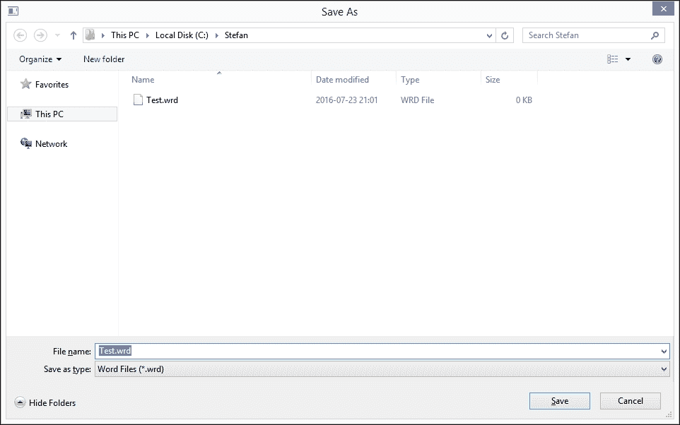
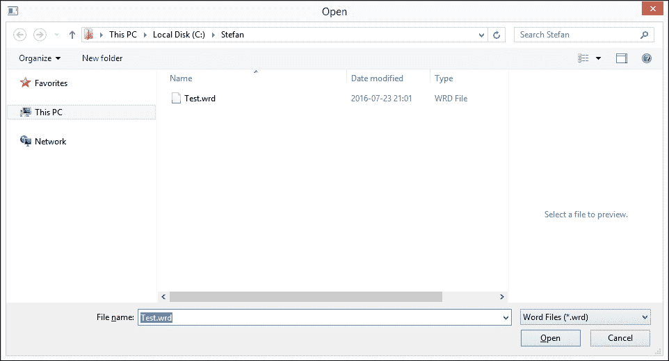
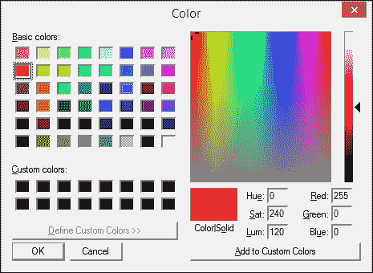
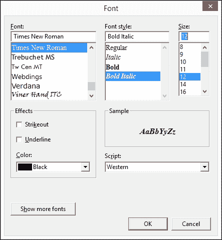
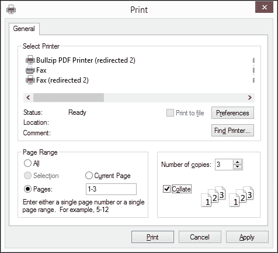

# 第十三章。注册表、剪贴板、标准对话框和打印预览

本章描述了以下内容的实现：

+   **注册表**：一个 Windows 数据库，用于存储应用程序执行之间的信息。

+   **剪贴板**：一个 Windows 数据库，用于存储已剪切、复制和粘贴的信息。

+   **标准对话框**：用于保存和打开文档、颜色和字体以及打印。

+   **打印预览**：在`StandardDocument`类中，可以像打印一样在屏幕上查看文档。

# 注册表

`Registry`类中的静态写入、读取和擦除方法在`Integer`、`Double`、`Boolean`和`String`类型的值以及 Windows 注册表中的内存块上操作。

**Registry.h**：

```cpp
namespace SmallWindows { 
  class Registry { 
    public: 
      static void WriteInteger(String key, const int value); 
      static void WriteDouble(String key, const double value); 
      static void WriteBoolean(String key, const bool value); 
      static void WriteString(String key, const String text); 

      static void WriteBuffer(String key, const void* buffer, 
                              int size); 

      static int ReadInteger(String key, const int defaultValue); 
      static double ReadDouble(String key, 
                               const double defaultValue); 
      static bool ReadBoolean(String key, 
                              const bool defaultValue); 
      static String ReadString(String key, 
                               const String defaultText); 
      static void ReadBuffer(String key, void* buffer, int size, 
                             const void* defaultBuffer); 

      static void Erase(String key); 
  }; 
}; 

```

**Registry.cpp**：

```cpp
#include "SmallWindows.h" 

namespace SmallWindows { 

```

全局常量`RegistryFileName`持有 Small Windows 注册表域的路径：

```cpp
  const String RegistryFileName = TEXT(".\\SmallWindows.ini"); 

```

`WriteInteger`、`WriteDouble`和`WriteBoolean`函数简单地将值转换为字符串并调用`WriteString`：

```cpp
  void Registry::WriteInteger(String key, const int intValue) { 
    WriteBuffer(key, &intValue, sizeof intValue); 
  } 

  void Registry::WriteDouble(String key, 
                             const double doubleValue) { 
    WriteBuffer(key, &doubleValue, sizeof doubleValue); 
  } 

  void Registry::WriteBoolean(String key, const bool boolValue) { 
    WriteBuffer(key, &boolValue, sizeof boolValue); 
  } 

```

`WriteString`函数调用 Win32 API 函数`WritePrivateProfileString`，将字符串写入注册表。所有 C++ `String`对象都需要通过`c_str`转换为以空字符终止的 C 字符串（char 指针）：

```cpp
  void Registry::WriteString(String key, const String text) { 
    ::WritePrivateProfileString 
        (Application::ApplicationName().c_str(), 
         key.c_str(), text.c_str(), RegistryFileName.c_str()); 
  } 

```

`WriteBuffer`函数调用 Win32 API 函数`WritePrivateProfileStruct`，将内存块写入注册表：

```cpp
  void Registry::WriteBuffer(String key, const void* buffer, 
                             int size) { 
    ::WritePrivateProfileStruct 
        (Application::ApplicationName().c_str(), 
         key.c_str(), (void*) buffer, size, 
         RegistryFileName.c_str()); 
  } 

```

`ReadInteger`、`ReadDouble`和`ReadBoolean`函数将默认值转换为字符串并调用`ReadString`。然后，将`ReadString`的返回值转换并返回；`_tstoi`和`_tstof`是标准 C 函数`atoi`和`atof`的通用版本：

```cpp
  int Registry::ReadInteger(String key, const int defaultValue) { 
    int intValue; 
    ReadBuffer(key, &intValue, sizeof intValue, &defaultValue); 
    return intValue; 
  } 

  double Registry::ReadDouble(String key, 
                              const double defaultValue) { 
    double doubleValue; 
    ReadBuffer(key, &doubleValue, sizeof doubleValue, 
               &defaultValue); 
    return doubleValue; 
  } 

  bool Registry::ReadBoolean(String key, const bool defaultValue){ 
    bool boolValue; 
    ReadBuffer(key, &boolValue, sizeof boolValue, &defaultValue); 
    return boolValue; 
  } 

```

`ReadString`函数调用 Win32 API 函数`GetPrivateProfileString`，将字符串值读取到`text`中并返回读取的字符数。如果读取的字符数大于零，则将文本转换为`string`对象并返回；否则，返回默认文本：

```cpp
  String Registry::ReadString(String key, 
                              const String defaultText) { 
    TCHAR text[MAX_PATH]; 
    int count = 
      ::GetPrivateProfileString 
          (Application::ApplicationName().c_str(), key.c_str(), 
           nullptr, text, MAX_PATH, RegistryFileName.c_str()); 
    return (count > 0) ? String(text) : defaultText; 
  } 

```

`ReadBuffer`函数调用 Win32 API 函数`ReadPrivateProfileStruct`，从注册表中读取内存块。如果它返回零，则表示读取失败，并将默认缓冲区复制到缓冲区：

```cpp
  void Registry::ReadBuffer(String key, void* buffer, int size, 
                            const void* defaultBuffer) { 
    int result = 
      ::GetPrivateProfileStruct 
          (Application::ApplicationName().c_str(), key.c_str(), 
           buffer, size, RegistryFileName.c_str()); 

    if (result == 0) { 
      ::memcpy(buffer, defaultBuffer, size); 
    } 
  } 

```

当从注册表中删除值时，我们使用空指针而不是字符串调用`WritePrivateProfileString`，从而删除该值：

```cpp
  void Registry::Erase(String key) { 
    ::WritePrivateProfileString 
        (Application::ApplicationName().c_str(), 
         key.c_str(),nullptr,RegistryFileName.c_str()); 
  } 
}; 

```

# 剪贴板类

`Clipboard`类是对全局 Windows 剪贴板的接口，这使得在不同类型的应用程序之间剪切、复制和粘贴信息成为可能。剪贴板操作有两种形式：ASCII 和 Unicode 文本以及通用（应用程序特定）信息。

**Clipboard.h**：

```cpp
namespace SmallWindows { 

```

ASCII 和 Unicode 行的格式是预定义的。

```cpp
  enum {AsciiFormat = CF_TEXT, UnicodeFormat = CF_UNICODETEXT}; 

```

`Open`和`Close`打开和关闭剪贴板。如果成功，它们返回`true`。`Clear`在剪贴板打开时清除剪贴板。更具体地说，它移除任何潜在的信息，并且如果`Available`返回`true`，则表示剪贴板上存储了具有该格式的信息。

不同格式的信息可能存储在剪贴板上。例如，当用户在应用程序中复制文本时，文本可能以 ASCII 和 Unicode 文本以及更高级的应用程序特定格式存储在剪贴板上。如果剪贴板上有指定格式的信息，则`Available`返回`true`：

```cpp
  class Clipboard { 
    public: 
      static bool Open(const Window* windowPtr); 
      static bool Close(); 
      static bool Clear(); 
      static bool Available(unsigned int format); 

```

`WriteText`和`ReadText`函数写入和读取字符串列表，而`WriteGeneric`和`ReadGeneric`函数写入和读取泛型信息：

```cpp
      template<int Format, class CharType> 
      static bool WriteText(vector<String>& lineList); 
      template<int Format, class CharType> 
      static bool ReadText(vector<String>& lineList); 

      static bool WriteGeneric(unsigned int format, 
                               InfoList& infoList); 
      static bool ReadGeneric(unsigned int format, 
                              InfoList& infoList); 
  }; 

```

**Clipboard.cpp**:

```cpp
#include "SmallWindows.h" 

namespace SmallWindows { 

```

`Open`、`Close`和`Clear`函数调用 Win32 API 函数`OpenClipboard`、`CloseClipboard`和`EmptyClipboard`。它们都返回整数值；非零值表示成功：

```cpp
  bool Clipboard::Open(const Window* windowPtr) { 
    return (::OpenClipboard(windowPtr->WindowHandle()) != 0); 
  } 

  bool Clipboard::Close() { 
    return (::CloseClipboard() != 0); 
  } 

  bool Clipboard::Clear() { 
    return (::EmptyClipboard() != 0); 
  } 

```

`Available`函数通过调用 Win32 API 函数`FormatAvailable`检查剪贴板上是否有指定格式的数据：

```cpp
  bool Clipboard::Available(unsigned int format) { 
    return (::IsClipboardFormatAvailable(format) != 0); 
  } 

```

## ASCII 和 Unicode 行

由于`WriteText`和`ReadText`是模板方法，它们包含在头文件中而不是实现文件中。`WriteText`接受一个泛型字符串列表并将它们以任何格式写入剪贴板；`AsciiFormat`（一个字节/字符）和`UnicodeFormat`（两个字节/字符）是预定义的。

**Clipboard.h**:

```cpp
  template<int Format,class CharType> 
  bool Clipboard::WriteText(vector<String>& lineList) { 

```

首先，我们需要找到缓冲区大小，我们通过计算行中的字符总数来计算它。我们还要为每一行加一，因为每一行也包含一个终止字符。终止字符是每一行的回车字符（`\r`），除了最后一行，它由一个零字符（`\0`）终止：

```cpp
    int bufferSize = 0; 

    for (String line : lineList) { 
      bufferSize += line.size(); 
    }  

    int listSize = lineList.size(); 
    bufferSize += listSize; 

```

当我们计算出缓冲区大小时，我们可以调用 Win32 API 的`GlobalAlloc`函数在全局剪贴板上分配缓冲区。我们稍后将将其连接到格式。我们使用模板字符类型的大小作为缓冲区：

```cpp
    HGLOBAL globalHandle = 
      ::GlobalAlloc(GMEM_MOVEABLE, bufferSize * sizeof(CharType)); 

```

如果分配成功，我们将收到缓冲区的句柄。由于剪贴板及其缓冲区可以同时被多个进程使用，我们需要通过调用 Win32 API 函数`GlobalLock`来锁定缓冲区。只要缓冲区被锁定，其他进程就无法访问它。当我们锁定缓冲区时，我们收到一个指向它的指针，我们可以用它来向缓冲区写入信息：

```cpp
    if (globalHandle != nullptr) { 
      CharType* buffer = (CharType*) ::GlobalLock(globalHandle); 

      if (buffer != nullptr) { 
        int bufferIndex = 0; 

```

我们将行的字符写入缓冲区，除非它是列表中的最后一行，否则我们添加一个`return`字符：

```cpp
        for (int listIndex = 0; listIndex < listSize;++listIndex) { 
          for (TCHAR tChar : lineList[listIndex]) { 
            buffer[bufferIndex++] = (CharType) tChar; 
          } 

          if (listIndex < (listSize - 1)) { 
            buffer[bufferIndex++] = (CharType) '\r'; 
          } 
        } 

```

我们在缓冲区的末尾添加一个零字符来标记其结束：

```cpp
        buffer[bufferIndex] = (CharType) '\0'; 

```

当缓冲区已加载信息后，我们只需解锁缓冲区，以便其他进程可以访问它并将缓冲区与格式关联：

```cpp
        ::GlobalUnlock(globalHandle); 
        ::SetClipboardData(Format, globalHandle); 

```

最后，我们返回`true`以指示操作成功：

```cpp
        return true; 
      } 
    } 

```

如果我们没有能够为写入行列表分配缓冲区，我们通过返回`false`来指示操作未成功：

```cpp
    return false; 
  } 

```

当使用`ReadText`读取行列表时，我们使用`Format`（通常是`AsciiFormat`或`UnicodeFormat`）从剪贴板接收一个句柄，然后我们使用它来锁定缓冲区并接收其指针，这反过来又允许我们从缓冲区中读取：

```cpp
  template<int Format,class CharType> 
  bool Clipboard::ReadText(vector<String>& lineList) { 
    HGLOBAL globalHandle = ::GetClipboardData(Format); 

    if (globalHandle != nullptr) { 
      CharType* buffer = (CharType*) ::GlobalLock(globalHandle); 

      if (buffer != nullptr) { 
        String currentLine; 

```

注意，我们必须将缓冲区大小除以模板字符类型大小（可能大于 1），以找到字符数：

```cpp
        int charCount = 
          ::GlobalSize(globalHandle) / (sizeof(CharType)); 

        for (int count = 0; count < charCount; ++count) { 
          CharType cChar = (*buffer++); 

```

当我们遇到回车字符（`\r`）时，当前行结束；我们将它添加到行列表中，然后清除它以便为下一行做好准备：

```cpp
          switch (cChar) { 
            case ((CharType) '\r') : 
              lineList.push_back(currentLine); 
              currentLine.clear(); 
              break; 

```

当我们遇到回车字符（`'\0'`）时，我们也把当前行添加到行列表中。然而，没有必要清除当前行，因为零字符是缓冲区的最后一个字符：

```cpp
            case ((CharType) '\0') : 
              lineList.push_back(currentLine); 
              break; 

```

如果字符既不是回车也不是零字符，我们就将它添加到当前行。注意，我们读取一个`CharType`类型的字符并将其转换为`TCHAR`类型的通用字符：

```cpp
            default: 
              currentLine += (TCHAR) cChar; 
              break; 
          } 
        } 

```

最后，我们解锁缓冲区并返回`true`以指示操作成功：

```cpp
        ::GlobalUnlock(globalHandle); 
        return true; 
      } 
    } 

```

如果我们没有收到格式的缓冲区，我们返回`false`以指示操作未成功：

```cpp
    return false; 
  } 
}; 

```

## 通用信息

`WriteGeneric`函数实际上比前面的`WriteText`函数简单，因为它不需要考虑行列表。我们只需锁定剪贴板缓冲区，将`infoList`中的每个字节写入缓冲区，解锁缓冲区，并将其与格式关联：

**Clipboard.cpp**:

```cpp
  bool Clipboard::WriteGeneric(unsigned int format, 
                               InfoList& infoList) { 
    int bufferSize = infoList.Size(); 
    HGLOBAL globalHandle = GlobalAlloc(GMEM_MOVEABLE, bufferSize); 

    if (globalHandle != nullptr) { 
      void* buffer = ::GlobalLock(globalHandle); 

```

`InfoList`函数中的`ToBuffer`对象将其字节写入缓冲区：

```cpp
      if (buffer != nullptr) { 
        infoList.ToBuffer(buffer); 
        ::GlobalUnlock(globalHandle); 
        ::SetClipboardData(format, globalHandle); 
        return true; 
      } 
    } 

```

如果我们没有成功分配全局缓冲区，我们返回`false`以指示操作未成功：

```cpp
    return false; 
  } 

```

`ReadGeneric`函数锁定剪贴板缓冲区，将缓冲区中的每个字节写入`infoList`，解锁缓冲区，并返回`true`以指示操作成功：

```cpp
  bool Clipboard::ReadGeneric(unsigned int format, 
                              InfoList& infoList) { 
    HGLOBAL globalHandle = ::GetClipboardData(format); 

    if (globalHandle != nullptr) { 
      void *buffer = ::GlobalLock(globalHandle); 
      int bufferSize = ::GlobalSize(globalHandle); 
      infoList.FromBuffer(buffer, bufferSize); 
      ::GlobalUnlock(globalHandle); 
      return true; 
    } 

```

如果我们没有收到全局句柄，我们返回`false`以指示操作未成功：

```cpp
    return false; 
  } 
}; 

```

# 标准对话框

在 Windows 中，可以定义**对话框**。与窗口不同，对话框的目的是填充控件，如按钮、框和文本字段。一个对话框可能是**模态的**，这意味着在对话框关闭之前，应用程序的其他窗口将变为禁用状态。在下一章中，我们将探讨如何构建我们自己的对话框。

然而，在本节中，我们将探讨 Windows**标准**对话框，用于保存和打开文件、选择字体和颜色以及打印。Small Windows 通过包装 Win32 API 函数支持标准对话框，这些函数为我们提供了对话框。

## 保存对话框

`SaveDialog`函数显示标准**保存**对话框。



`filter` 参数过滤要显示的文件类型。每个文件格式由两部分定义：对话框中显示的文本和默认文件后缀。这两部分由一个零字符分隔，并且过滤器以两个零字符结束。例如，考虑以下：

```cpp
Word Files (*.wrd)\0*.drw\0Text Files(*.txt)\0*.txt\0\0 

```

`fileSuffixList` 参数指定允许的文件后缀，而 `saveFlags` 包含操作的标志。以下有两个标志可用：

+   `PromptBeforeOverwrite`: 这个标志是一个警告信息，如果文件已经存在，则会显示

+   `PathMustExist`: 如果路径不存在，则会显示一个错误信息

**StandardDialog.h**:

```cpp
namespace SmallWindows { 
  class Window; 
  class Graphics; 

  class StandardDialog { 
    public: 
      enum SaveFlags {NoSaveFlag = 0, 
                      PromptBeforeOverwrite = OFN_OVERWRITEPROMPT, 
                      PathMustExist = OFN_PATHMUSTEXIST, 
                      NormalSaveFlags = OFN_OVERWRITEPROMPT | 
                                        OFN_PATHMUSTEXIST}; 

      static bool SaveDialog(Window* windowPtr, String& path, 
                             const TCHAR* filter, 
                             const vector<String> fileSuffixList, 
                             StandardDialog::SaveFlags saveFlags = 
                               NormalSaveFlags);  

```

**StandardDialog.cpp**:

```cpp
#include "SmallWindows.h" 

namespace SmallWindows { 
  bool StandardDialog::SaveDialog(Window* windowPtr, String& path, 
                              const TCHAR* filter, 
                              const vector<String> fileSuffixList,  
                              SaveFlags saveFlags 
                                /* = NormalSaveFlags */) { 

```

Win32 API `OPENFILENAME` 结构的 `saveFileName` 被加载了适当的值：`hwndOwner` 设置为窗口句柄，`hInstance` 设置为应用程序实例句柄，`lpstrFilter` 设置为 `filter` 参数，`lpstrFile` 设置为 `pathBuffer`，它反过来又包含 `path` 参数，并且 `Flags` 设置为 `saveFlags` 参数：

```cpp
    OPENFILENAME saveFileName; 
    memset(&saveFileName, 0, sizeof saveFileName); 

    TCHAR pathBuffer[MAX_PATH]; 
    wcscpy_s(pathBuffer, MAX_PATH, path.c_str()); 

    saveFileName.lStructSize = sizeof saveFileName; 
    saveFileName.hwndOwner = windowPtr->WindowHandle(); 
    saveFileName.hInstance = Application::InstanceHandle(); 
    saveFileName.lpstrFilter = filter; 
    saveFileName.lpstrFile = pathBuffer; 
    saveFileName.nMaxFile = MAX_PATH; 
    saveFileName.Flags = saveFlags; 

    if (!fileSuffixList.empty()) { 
      saveFileName.lpstrDefExt = fileSuffixList.front().c_str(); 
    } 
    else { 
      saveFileName.lpstrDefExt = nullptr; 
    } 

```

当 `saveFileName` 被加载时，我们调用 Win32 API 函数 `GetSaveFileName`，它显示标准的 **保存** 对话框，如果用户通过点击 **保存** 按钮或按 **回车** 键终止对话框，则返回非零值。在这种情况下，我们将 `path` 参数设置为所选路径，检查路径是否以 `fileSuffixList` 中的后缀之一结尾，如果是以，则返回 `true`。如果路径后缀不在列表中，我们显示一个错误信息，并重新开始保存过程。如果用户取消过程，则返回 `false`。实际上，用户完成过程的唯一方法是选择列表中的文件后缀或取消对话框：

```cpp
    while (true) { 
      if (::GetSaveFileName(&saveFileName) != 0) { 
        path = pathBuffer; 

        for (String fileWithSuffix : fileSuffixList) { 
          if (EndsWith(path, TEXT(".") + fileWithSuffix)) { 
            return true; 
          } 
        } 

        windowPtr->MessageBox(TEXT("Undefined file suffix.")); 
      } 
      else { 
        return false; 
      } 
    } 
  } 

```

## 打开对话框

`OpenDialog` 函数显示标准的 **打开** 对话框。



`filter` 和 `fileSuffixList` 参数与前面的 `SaveDialog` 函数中的方式相同。有三个标志可用：

+   `PromptBeforeCreate`: 如果文件已经存在，则此标志会显示一个警告信息

+   `FileMustExist`: 打开的文件必须存在

+   `HideReadOnly`: 此标志表示在对话框中隐藏只读文件

**OpenDialog.h**:

```cpp
      enum OpenFlags {NoOpenFlag = 0, 
                      PromptBeforeCreate = OFN_CREATEPROMPT, 
                      FileMustExist = OFN_FILEMUSTEXIST, 
                      HideReadOnly = OFN_HIDEREADONLY, 
                      NormalOpenFlags = OFN_CREATEPROMPT | 
                                        OFN_FILEMUSTEXIST | 
                                        OFN_HIDEREADONLY}; 

      static bool OpenDialog(Window* windowPtr, String& path, 
                             const TCHAR* filter, 
                             const vector<String> fileSuffixList, 
                             StandardDialog::OpenFlags openFlags = 
                               NormalOpenFlags);  

```

`OpenDialog` 的实现与前面的 `SaveDialog` 函数类似。我们使用相同的 `OPENFILENAME` 结构；唯一的区别是我们调用 `GetOpenFileName` 而不是 `GetSaveFileName`。

**OpenDialog.cpp**:

```cpp
  bool StandardDialog::OpenDialog(Window* windowPtr, String& path, 
                              const TCHAR* filter, 
                              const vector<String> fileSuffixList,  
                              StandardDialog::OpenFlags openFlags 
                                /*=NormalOpenFlags */){ 
    OPENFILENAME openFileName; 
    memset(&openFileName, 0, sizeof openFileName); 

    TCHAR pathBuffer[MAX_PATH]; 
    wcscpy_s(pathBuffer, MAX_PATH, path.c_str()); 

    openFileName.lStructSize = sizeof openFileName; 
    openFileName.hwndOwner = windowPtr->WindowHandle(); 
    openFileName.hInstance = Application::InstanceHandle(); 
    openFileName.lpstrFilter = filter; 
    openFileName.lpstrFile = pathBuffer; 
    openFileName.nMaxFile = MAX_PATH; 
    openFileName.Flags = openFlags; 

    if (!fileSuffixList.empty()) { 
      openFileName.lpstrDefExt = fileSuffixList.front().c_str(); 
    } 
    else { 
      openFileName.lpstrDefExt = nullptr; 
    } 

    while (true) { 
      if (::GetOpenFileName(&openFileName) != 0) { 
        path = pathBuffer; 

        for (String fileWithSuffix : fileSuffixList) { 
          if (EndsWith(path, TEXT(".") + fileWithSuffix)) { 
            return true; 
          } 
        } 

        windowPtr->MessageBox(TEXT("Undefined file suffix.")); 
      } 
      else { 
        return false; 
      } 
    } 
  } 

```

## 颜色对话框

`ColorDialog` 函数显示标准的 **颜色** 对话框。



**StandardDialog.h**:

```cpp
      static COLORREF customColorArray[]; 
      static bool ColorDialog(Window* windowPtr, Color& color); 

```

静态 `COLORREF` 数组 `customColorArray` 被用户在颜色对话框中使用，以存储所选颜色。由于它是静态的，`customColorArray` 数组在对话框显示会话之间被重用。

`ColorDialog` 函数使用 Win32 API `CHOOSECOLOR` 结构初始化对话框。`hwndOwner` 函数设置为窗口句柄，`rgbResult` 设置为颜色的 `COLORREF` 字段，`lpCustColors` 设置为自定义颜色数组。`CC_RGBINIT` 和 `CC_FULLOPEN` 标志使用给定的颜色初始化对话框，使其完全展开。

**StandardDialog.cpp**:

```cpp
  COLORREF StandardDialog::customColorArray[16]; 

  bool StandardDialog::ColorDialog(Window* windowPtr, 
                                   Color& color) { 
    CHOOSECOLOR chooseColor; 
    chooseColor.lStructSize = sizeof chooseColor; 
    chooseColor.hwndOwner = windowPtr->WindowHandle(); 
    chooseColor.hInstance = nullptr; 
    chooseColor.rgbResult = color.ColorRef(); 
    chooseColor.lpCustColors = customColorArray; 
    chooseColor.Flags = CC_RGBINIT | CC_FULLOPEN; 
    chooseColor.lCustData = 0; 
    chooseColor.lpfnHook = nullptr; 
    chooseColor.lpTemplateName = nullptr; 

```

Win32 的 `ChooseColor` 函数显示 **颜色** 对话框，如果用户通过点击 **确定** 按钮结束对话框，则返回非零值。在这种情况下，我们设置所选颜色并返回 `true`：

```cpp
    if (::ChooseColor(&chooseColor) != 0) { 
      color.ColorRef() = chooseColor.rgbResult; 
      return true; 
    } 

```

如果用户取消对话框，我们返回 `false`：

```cpp
    return false; 
  } 

```

## 字体对话框

`FontDialog` 函数显示一个标准的 **字体** 对话框。



**StandardDialog.h**:

```cpp
      static bool FontDialog(Window* windowPtr, Font& font); 

```

**FontDialog.cpp**:

```cpp
  bool StandardDialog::FontDialog(Window* windowPtr, Font& font) { 
    LOGFONT logFont = font.LogFont(); 

```

Win32 API `CHOOSEFONT` 结构 `chooseFont` 被加载了适当的值。`lpLogFont` 对象设置为字体的 `LOGFONT` 字段，`rgbColors` 设置为颜色的 `COLORREF` 字段：

```cpp
    CHOOSEFONT chooseFont; 
    memset(&chooseFont, 0, sizeof chooseFont); 

    chooseFont.lStructSize = sizeof(CHOOSEFONT); 
    chooseFont.hInstance = Application::InstanceHandle(); 
    chooseFont.hwndOwner = windowPtr->WindowHandle(); 
    chooseFont.Flags = CF_INITTOLOGFONTSTRUCT | 
                       CF_SCREENFONTS | CF_EFFECTS; 
    chooseFont.lpLogFont = &logFont; 
    chooseFont.rgbColors = font.FontColor().ColorRef(); 

```

Win32 的 `ChooseFont` 函数显示 **字体** 对话框，如果用户点击 **确定** 按钮则返回非零值。在这种情况下，我们设置所选字体和颜色并返回 `true`：

```cpp
    if (::ChooseFont(&chooseFont) != 0) { 
      font.LogFont() = logFont; 
      font.FontColor() = Color(chooseFont.rgbColors); 
      return true; 
    } 

```

如果用户取消对话框，我们返回 `false`：

```cpp
    return false; 
  } 

```

## 打印对话框

`PrintDialog` 函数显示一个标准的 **打印** 对话框。



如果用户点击 **打印** 按钮，所选的打印设置将保存在 `PrintDialog` 参数中：

**PrintDialog.h**:

```cpp
      static Graphics* PrintDialog(Window* parentPtr, 
                                   int totalPages, 
                                   int& firstPage, int& lastPage, 
                                   int& copies, bool& sorted); 
  }; 
}; 

```

`PrintDialog` 函数使用适当的值加载 Win32 API `PRINTDLG` 结构 `printDialog`，`nFromPage` 和 `nToPage` 设置为要打印的第一页和最后一页（默认值分别为 1 和页数），`nMaxPage` 设置为页数，`nCopies` 设置为 1（默认值）。

**PrintDialog.cpp**:

```cpp
  Graphics* StandardDialog::PrintDialog(Window* parentPtr, 
                            int totalPages, 
                            int& firstPage, int& lastPage, 
                            int& copies, bool& sorted) { 
    PRINTDLG printDialog; 
    memset(&printDialog, 0, sizeof printDialog); 

    printDialog.lStructSize = sizeof printDialog; 
    printDialog.hwndOwner = parentPtr->WindowHandle(); 
    printDialog.hDevMode = nullptr; 
    printDialog.hDevNames = nullptr; 
    printDialog.hDC = nullptr; 
    printDialog.Flags = PD_ALLPAGES | PD_COLLATE | 
                        PD_RETURNDC | PD_NOSELECTION; 
    printDialog.nFromPage = 1; 
    printDialog.nToPage = totalPages; 
    printDialog.nMinPage = 1; 
    printDialog.nMaxPage = totalPages; 
    printDialog.nCopies = 1; 
    printDialog.hInstance = nullptr; 
    printDialog.lCustData = 0L; 
    printDialog.lpfnPrintHook = nullptr; 
    printDialog.lpfnSetupHook = nullptr; 
    printDialog.lpPrintTemplateName = nullptr; 
    printDialog.lpSetupTemplateName = nullptr; 
    printDialog.hPrintTemplate = nullptr; 
    printDialog.hSetupTemplate = nullptr; 

```

Win32 API 函数 `PrintDlg` 显示标准打印对话框，如果用户通过按下 **打印** 按钮结束对话框，则返回非零值。在这种情况下，打印的第一页和最后一页、副本数量以及是否排序存储在参数中，并创建返回用于打印的 `Graphics` 对象的指针。

如果用户选择了页面间隔，我们使用 `nFromPage` 和 `nToPage` 字段；否则，选择所有页面，并使用 `nMinPage` 和 `nMaxPage` 字段设置要打印的第一页和最后一页：

```cpp
    if (::PrintDlg(&printDialog) != 0) { 
      bool pageIntervalSelected = 
        ((printDialog.Flags & PD_SELECTION) != 0); 

      if (pageIntervalSelected) { 
        firstPage = printDialog.nFromPage; 
        lastPage = printDialog.nToPage; 
      } 
      else { 
        firstPage = printDialog.nMinPage; 
        lastPage = printDialog.nMaxPage; 
      } 

```

如果存在 `PD_COLLATE` 标志，则用户选择了排序页面：

```cpp
      copies = printDialog.nCopies; 
      sorted = (printDialog.Flags & PD_COLLATE) != 0; 

```

最后，我们创建并返回一个指向用于打印时绘图的 `Graphics` 对象的指针。

```cpp
      return (new Graphics(parentPtr, printDialog.hDC)); 
    } 

```

如果用户通过按下 **取消** 按钮结束对话框，我们返回 null：

```cpp
    return nullptr; 
  } 
}; 

```

# 打印预览

`PrintPreviewDocument`类显示文档父窗口的页面。`OnKeyDown`方法在用户按下***Esc***键时关闭文档。`OnSize`方法调整页面的物理大小，以确保页面始终适合窗口。`OnVerticalScroll`方法在用户向上或向下滚动时移动页面，而`OnPaint`为每一页调用父文档的`OnPrint`：

**PrintPreviewDocument.h**：

```cpp
namespace SmallWindows { 
  class PrintPreviewDocument : Document { 
    public: 
      PrintPreviewDocument(StandardDocument* parentDocument, 
                  int page = 1, Size pageSize = USLetterPortrait); 
      bool OnKeyDown(WORD key, bool shiftPressed, 
                     bool controlPressed); 

```

仅覆盖`OnSize`函数以在`Document`中中和其功能。在`Document`中，`OnSize`修改滚动条，但我们不希望在类中发生这种情况：

```cpp
      void OnSize(Size clientSize) {/* Empty. */} 
      void OnVerticalScroll(WORD flags, WORD thumbPos = 0); 
      void OnPaint(Graphics& graphics) const; 

```

`page`字段存储当前页码，`totalPages`存储总页数：

```cpp
    private: 
      void SetHeader(); 
      int page, totalPages; 
  }; 
}; 

```

**PrintPreviewDocument.cpp**

```cpp
#include "SmallWindows.h" 

```

构造函数将`page`和`totalPages`字段设置为适当的值。

```cpp
namespace SmallWindows { 
  PrintPreviewDocument::PrintPreviewDocument 
    (StandardDocument* parentDocument, int totalPages /* = 1 */, 
     Size pageSize/* = USLetterPortrait */) 
   :Document(PreviewCoordinate, pageSize, parentDocument), 
    page(1), 
    totalPages(totalPages) { 

```

水平滚动条始终设置为窗口的宽度，这意味着用户无法更改其设置：

```cpp
    SetHorizontalScrollPosition(0); 
    SetHorizontalScrollPageWidth(pageSize.Width()); 
    SetHorizontalScrollTotalWidth(pageSize.Width()); 

```

垂直滚动条设置为与文档的页数相匹配，滚动滑块对应一页：

```cpp
    SetVerticalScrollPosition(0); 
    SetVerticalScrollPageHeight(pageSize.Height()); 
    SetVerticalScrollTotalHeight(totalPages * pageSize.Height()); 

    SetHeader(); 
    ShowWindow(true); 
  } 

```

标题显示当前页数和总页数：

```cpp
  void PrintPreviewDocument::SetHeader() { 
    SetName(TEXT("Print Preview: Page ") + to_String(page) + 
            TEXT(" out of ") + to_String(totalPages)); 
  } 

```

## 键盘输入

当用户按下键时，会调用`OnKeyDown`函数。如果他们按下***Esc***键，预览窗口将被关闭并销毁，输入焦点将返回到应用程序的主窗口。如果他们按下***Home***、***End***、***Page Up***、***Page Down***键或上下箭头键，将调用`OnVerticalScroll`以执行适当的操作：

```cpp
  bool PrintPreviewDocument::OnKeyDown 
         (WORD key, bool shiftPressed, bool controlPressed) { 
    switch (key) { 
      case KeyEscape: { 
          Window* parentWindow = ParentWindowPtr(); 
          ::CloseWindow(WindowHandle()); 
          parentWindow->SetFocus(); 
        } 
        break; 

      case KeyHome: 
        OnVerticalScroll(SB_TOP); 
        break; 

      case KeyEnd: 
        OnVerticalScroll(SB_BOTTOM); 
        break; 

      case KeyUp: 
      case KeyPageUp: 
        OnVerticalScroll(SB_LINEUP); 
        break; 

      case KeyDown: 
      case KeyPageDown: 
        OnVerticalScroll(SB_LINEDOWN); 
        break; 
    } 

```

我们返回`true`以指示已使用键盘输入：

```cpp
    return true; 
  } 

```

## 滚动条

当用户滚动垂直条时，会调用`OnVerticalScroll`函数。如果他们点击滚动条本身，在滚动滑块上方或下方，将显示上一页或下一页。如果他们将滑块拖动到新位置，将计算相应的页面。包括`SB_TOP`和`SB_BOTTOM`情况是为了适应前面`OnKeyDown`函数中的***Home***和***End***键，而不是为了适应任何滚动操作；它们将页面设置为第一页或最后一页：

```cpp
  void PrintPreviewDocument::OnVerticalScroll(WORD flags, 
                                       WORD thumbPos /* = 0 */) { 
    int oldPage = page; 

    switch (flags) { 
      case SB_LINEUP: 
      case SB_PAGEUP: 
        page = max(1, page - 1); 
        break; 

      case SB_LINEDOWN: 
      case SB_PAGEDOWN: 
        page = min(page + 1, totalPages); 
        break; 

      case SB_THUMBTRACK: 
      case SB_THUMBPOSITION: 
        page = (thumbPos / pageSize.Height()) + 1; 
        break; 

      case SB_TOP: 
        page = 1; 
        break; 

      case SB_BOTTOM: 
        page = totalPages; 
        break; 
    } 

```

如果滚动操作导致出现新页面，我们将设置标题和滚动条位置，并使窗口无效并更新：

```cpp
    if (oldPage != page) { 
      SetHeader(); 
      SetVerticalScrollPosition((page - 1) * pageSize.Height()); 
      Invalidate(); 
      UpdateWindow(); 
    } 
  } 

```

`PrintPreviewDocument`中的`OnPaint`函数调用父标准文档窗口中的`OnPaint`以绘制预览窗口的内容：

```cpp
  void PrintPreviewDocument::OnPaint(Graphics& graphics) const { 
    StandardDocument* parentDocument = 
      (StandardDocument*) ParentWindowPtr(); 
    parentDocument->OnPrint(graphics, page, 1, totalPages); 
  } 
}; 

```

# 摘要

在本章中，我们探讨了注册表、剪贴板、标准对话框和打印预览。在第十四章中，我们将探讨自定义对话框、控件、转换器和页面设置。
