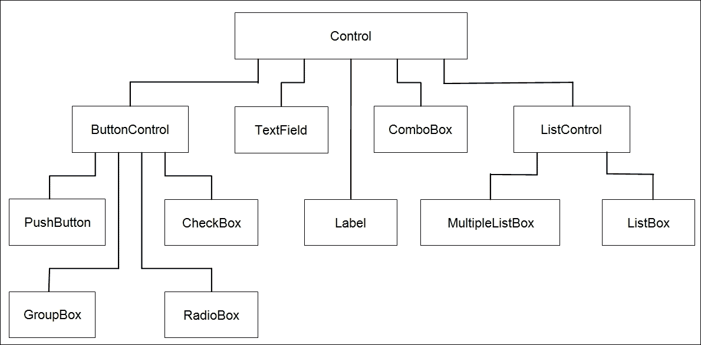
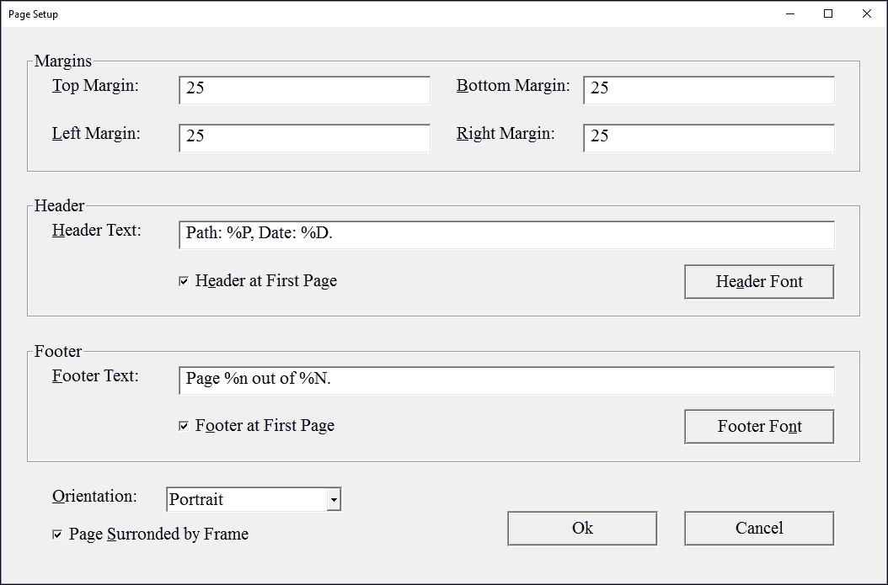

# 第十四章。对话框、控件和页面设置

在本章中，我们将探讨以下内容的实现：

+   **自定义对话框**：`Dialog`类旨在被子类继承并配备控件。

+   **控件**：`Control`类及其子类。有用于编辑字段、复选框、单选按钮、列表框和组合框的控件。

+   **转换器**：在字符串和其他值之间。例如，当用户输入代表数值的文本时，可以添加一个转换器将文本转换为值，或者如果文本不包含有效值，则显示错误消息。

+   **页面设置**：在这里我们扩展`Dialog`类。当设置`StandardDocument`类的文档页面设置时使用对话框。它处理有关页眉、页脚和边距的信息。

# 自定义对话框

`Dialog`类处理一组**控件**，这些控件通过`AddControl`方法添加到对话框中。对于`Dialog`类的子类，请参考本章最后部分的`PageSetupDialog`。`Dialog`类提供了一个模态对话框，这意味着在对话框关闭之前，应用程序中的所有其他窗口都将被禁用。

用户可以使用***Tab***键在控件之间导航，使用箭头键在同一个组中的单选按钮之间导航。他们还可以使用快捷键来访问控件。

**Dialog.h**

```cpp
namespace SmallWindows { 

```

`dialogMap`字段由`DialogProc`用于查找接收消息的对话框：

```cpp
  extern map<HWND,Dialog*> dialogMap; 
  extern Font DialogFont; 

```

尽管`Dialog`类调用了默认的`Window`构造函数，该构造函数不调用 Win32 API 函数`CreateWindowEx`，但`Dialog`类仍然是`Window`的子类。`DoModal`收集有关对话框及其控件的信息，并调用 Win32 API 函数`DialogBoxIndirectParam`：

```cpp
  class Dialog : public Window { 
    public: 
      Dialog(String name, Point topLeft, 
             Window* parentPtr = nullptr, 
             WindowStyle style = OverlappedWindow, 
             WindowStyle extendedStyle = NoStyle, 
             Font font = DialogFont); 

```

如其名所示，`DoModal`在其父窗口可见期间禁用其父窗口。也就是说，直到用户关闭对话框：

```cpp
      bool DoModal(); 

```

析构函数删除所有控件，这意味着`Dialog`的子类应该在对话框中动态分配控件而不删除它们：

```cpp
      ~Dialog(); 

```

`AddControl`方法为控件分配一个身份号码并将其添加到`idMap`。

```cpp
      int AddControl(Control* controlPtr); 

```

每当用户更改对话框的大小时，都会调用`OnSize`函数，它会遍历控件并调整它们的大小，以便它们保持相对于对话框客户端区域的大小。

```cpp
      void OnSize(Size windowSize); 

```

当用户按下***回车***键时，会调用`OnReturn`，而当他们按下***Esc***键时，会调用`OnEscape`。它们的默认行为是关闭对话框并将控制权返回给`DoModal`，返回码为 1 和 0；1 被解释为`true`，0 被解释为`false`。

```cpp
      void OnReturn(); 
      void OnEscape(); 

```

`OnControlInit`方法旨在被子类覆盖，并在对话框初始化时（当它接收`WM_INITDIALOG`消息时）被调用。

```cpp
      virtual void OnDialogInit() {/* Empty. */} 

```

`TryClose`方法旨在被子类覆盖，其默认行为是返回`true`。当用户尝试关闭对话框时，会调用`OnClose`方法，其默认行为是调用`TryClose`，如果返回`true`则关闭对话框，在这种情况下也会调用`OnDestroy`：

```cpp
      virtual bool TryClose() const {return true;} 
      virtual void OnClose(); 
      virtual void OnDestroy() {/* Empty. */} 

```

每个控件在添加到对话框时都会分配一个标识符，该标识符映射到`idMap`中控制器的指针：

```cpp
      map<WORD,Control*> IdMap() const {return idMap;} 
      map<WORD,Control*>& IdMap() {return idMap;} 

    private: 
      map<WORD,Control*> idMap; 

```

对话框有一个标题文本、左上角位置、字体、常规样式和扩展样式，这些由构造函数存储，并在`DialogBoxIndirectParam`调用中由`DoModal`使用。然而，对话框的大小不是构造函数参数；相反，大小基于控件尺寸：

```cpp
      String header; 
      Point topLeft; 
      Font font; 
      WindowStyle style; 
      WindowStyle extendedStyle; 

```

在计算对话框大小时，使用`leftMargin`、`maxWidth`、`topMargin`和`maxHeight`字段。其思路是调整大小，使左右边距以及最接近的控件的上边距和下边距相等：

```cpp
      int leftMargin, maxWidth, topMargin, maxHeight; 

```

第一个控件没有分配 0 的标识符，因为这会导致在处理消息时产生混淆，如果具有标识符 0 的控件是按钮。相反，我们用 1000 初始化`currentId`，并且随着每个新控件的增加而减少其值。减少值是为了使对话框中的***Tab***键能够正确工作：

```cpp
      int currentId = 1000; 

```

当对话框初始化（通过接收`WM_INITDIALOG`消息）时，其大小被存储在`originalClientSize`中，以便在`OnSize`计算控件大小时使用：

```cpp
      Size originalClientSize; 

```

每次对话框收到消息时都会调用`DialogProc`方法。与`WindowProc`不同，如果消息已被处理且不需要进一步处理，它将返回`TRUE`。此外，它不会在末尾调用`DefWindowProc`；相反，如果消息未被处理，它将返回`FALSE`：

```cpp
      friend INT_PTR CALLBACK 
        DialogProc(HWND windowHandle, UINT message, 
                   WPARAM wordParam, LPARAM longParam); 
  }; 
}; 

```

**Dialog.cpp**

```cpp
#include "SmallWindows.h" 

namespace SmallWindows { 
  map<HWND,Dialog*> dialogMap; 

```

默认对话框字体设置为 12 点 Times New Roman。

```cpp
  Font DialogFont(TEXT("Times New Roman"), 12); 

```

构造函数调用`Window`构造函数，它设置父窗口指针并执行其他操作。也就是说，它不会调用 Win32 API 函数`CreateWindowEx`。`header`、`topLeft`、`style`、`extendedStyle`和`font`字段被存储起来，以便在`DoModal`中使用：

```cpp
  Dialog::Dialog(String header, Point topLeft, 
                 Window* parentPtr /*=nullptr*/, 
                 WindowStyle style /* = OverlappedWindow */, 
                 WindowStyle extendedStyle /* = NoStyle */, 
                 Font font /* = DialogFont */) 
   :Window(parentPtr), 
    header(header), 
    topLeft(topLeft), 
    style(style), 
    extendedStyle(extendedStyle), 

    font(font) { 
    // Empty. 
  } 

```

`DoModal`函数使对话框进入模态状态。也就是说，其父窗口在对话框被销毁之前将变为禁用状态。但是，它首先将信息加载到`infoList`中。`AddValue`方法是`InfoList`类的模板方法，并将不同类型的值添加到列表中：

```cpp
  bool Dialog::DoModal() { 
    InfoList infoList; 

```

首先，我们需要添加值`1`，以便设置我们想要工作的对话框模板版本：

```cpp
    infoList.AddValue<WORD>(1); 

```

`0xFFFF`值表示我们想要使用扩展对话框模板：

```cpp
    infoList.AddValue<WORD>(0xFFFF); 

```

下一个单词是为了帮助标识符；然而，我们不使用它，所以我们将其设置为 0：

```cpp
    infoList.AddValue<DWORD>(0); 

```

然后是扩展和常规样式。除了发送给构造函数的样式外，我们还设置对话框具有标题、系统菜单、模态框架和字体。由于`DS_SETFONT`标志，我们将在稍后添加有关对话框字体信息：

```cpp
    infoList.AddValue<DWORD>(extendedStyle); 
    infoList.AddValue<DWORD>(style | WS_CAPTION | WS_SYSMENU | 
                             DS_MODALFRAME | DS_SETFONT); 

```

下一个值是对话框中控件的数量，由`idMap`的大小给出：

```cpp
    infoList.AddValue<WORD>(idMap.size()); 

```

顶部左边的位置由`topLeft`字段给出：

```cpp
    infoList.AddValue<WORD>(topLeft.X()); 
    infoList.AddValue<WORD>(topLeft.Y()); 

```

对话框客户端区域的大小由`maxWidth`、`leftMargin`、`maxHeight`和`topMargin`设置，这些已在`AddControl`中计算。客户端区域的宽度是控件集的最大宽度加上其左边距。这样，我们调整对话框以容纳具有相等左右边距以及上下边距的控件：

```cpp
    infoList.AddValue<WORD>(maxWidth + leftMargin); 
    infoList.AddValue<WORD>(maxHeight + topMargin); 

```

接下来的两个零表示我们不希望使用菜单，并且我们使用默认的对话框`Windows`类：

```cpp
    infoList.AddValue<WORD>(0); 
    infoList.AddValue<WORD>(0); 

```

然后，我们设置对话框的标题。`AddString`方法是一个`InfoList`模板方法，它将带有终止符 0 的字符串添加到信息列表：

```cpp
    infoList.AddString<TCHAR>(header); 

```

最后，我们设置对话框的字体。我们从`Font`类的`LOGFONT`结构中提取其大小（`lfHeight`）、是否加粗（`lfWeight`）或斜体，其字符集（由于我们不使用它，所以为 0）和字体名称：

```cpp
    LOGFONT logFont = font.LogFont(); 
    infoList.AddValue<WORD>((WORD) logFont.lfHeight); 
    infoList.AddValue<WORD>((WORD) logFont.lfWeight); 
    infoList.AddValue<BYTE>(logFont.lfItalic); 
    infoList.AddValue<BYTE>(logFont.lfCharSet); 
    infoList.AddString<TCHAR>(logFont.lfFaceName); 

```

当对话框信息已添加到信息列表中时，我们为每个控件调用`AddControlInfo`，以便将控件信息添加到列表：

```cpp
    for (pair<WORD,Control*> entry : idMap) { 
      Control* controlPtr = entry.second; 
      controlPtr->AddControlInfo(infoList); 
    } 

```

当列表已完全加载时，我们分配一个全局缓冲区并将其加载到列表中。`ToBuffer`方法将列表复制到缓冲区：

```cpp
    HGLOBAL globalHandle = ::GlobalAlloc(0, infoList.Size()); 
    if (globalHandle != nullptr) { 
      char* buffer = (char*) ::GlobalLock(globalHandle); 

      if (buffer != nullptr) { 
        infoList.ToBuffer(buffer); 

```

如果存在，我们需要父窗口的句柄，然后我们通过调用 Win32 API 函数`DialogBoxIndirectParam`创建对话框，该函数将在用户关闭对话框之前不返回。最后一个参数是`Dialog`对象的指针，它将与`WM_INITDIALOG`消息一起发送。存储在`result`中的返回值是`EndDialog`调用的第二个参数：

```cpp
        HWND parentHandle = (parentPtr != nullptr) ? 
                            parentPtr->WindowHandle() : nullptr; 
        INT_PTR result = 
          ::DialogBoxIndirectParam(Application::InstanceHandle(), 
                     (DLGTEMPLATE*) buffer, parentHandle, 
                     DialogProc, (LPARAM) this); 
        ::GlobalUnlock(globalHandle); 

```

如果结果值不等于 0，我们返回`true`：

```cpp
        return (result != 0); 
      } 
    } 

```

如果全局缓冲区分配失败，我们返回`false`：

```cpp
    return false;    
  } 

```

析构函数遍历`idMap`并删除对话框中的每个控件：

```cpp
  Dialog::~Dialog() { 
    for (pair<WORD,Control*> entry : idMap) { 
      Control* controlPtr = entry.second; 
      delete controlPtr; 
    } 
  } 

```

`AddControl`方法将控件添加到对话框。如果是第一个要添加的控件（`idMap`为空），则将`leftMargin`和`topMargin`设置为控件的左上角，并将`maxWidth`和`maxHeight`设置为左上角加上控件的宽度或高度。但是，如果不是，我们需要比较的第一个控件是其左上角和大小，与当前值，以找到控件集的边距和最大大小：

```cpp
  int Dialog::AddControl(Control* controlPtr) { 
    Point topLeft = controlPtr->TopLeft(); 
    Size controlSize = controlPtr->GetSize(); 

    if (idMap.empty()) { 
      leftMargin = topLeft.X(); 
      topMargin = topLeft.X(); 
      maxWidth = topLeft.X() + controlSize.Width(); 
      maxHeight = topLeft.Y() + controlSize.Height(); 
    } 
    else { 
      leftMargin = min(leftMargin, topLeft.X()); 
      topMargin = min(topMargin, topLeft.Y()); 
      maxWidth = max(maxWidth, topLeft.X() + controlSize.Width()); 
      maxHeight = max(maxHeight,topLeft.Y()+controlSize.Height()); 
    } 

```

控件的标识号设置为`currentId`，然后返回并递减：

```cpp
    idMap[currentId] = controlPtr; 
    return currentId--; 
  } 

```

`OnSize`方法比较客户端区域的新大小与其原始大小。它们之间的比率存储在`factorPair`中：

```cpp
  void Dialog::OnSize(Size newClientSize) { 
    pair<double, double> factorPair 
      (((double) newClientSize.Width() / 
       originalClientSize.Width()), 
       ((double) newClientSize.Height() / 
       originalClientSize.Height())); 

```

`idMap`的控件被迭代，每个控件的原始大小乘以`factorPair`，这是新客户端区域大小与原始客户端区域大小的比率。这样，当用户改变对话框大小时，控件将保持它们相对于对话框客户端区域大小的相对大小。

```cpp
    for (pair<WORD,Control*> entry : idMap) { 
      Control* controlPtr = entry.second; 
      Rect originalRect = controlPtr->OriginalRect(); 
      controlPtr->SetWindowDeviceRect(factorPair * originalRect); 
    } 
  } 

```

当用户按下***Return***键时调用`OnReturn`方法，当用户按下***Esc***键时调用`OnEscape`，当用户关闭对话框时调用`OnClose`。默认行为是调用`TryClose`，如果它返回`true`，则调用 Win32 API 函数`EndDialog`，这将导致`DoModal`中的`DialogBoxIndirectParam`调用返回`EndDialog`的第二个参数给出的整数值：

```cpp
  void Dialog::OnReturn() { 
    if (TryClose()) { 
      ::EndDialog(windowHandle, 1); 
    } 
  } 

  void Dialog::OnEscape() { 
    if (TryClose()) { 
      ::EndDialog(windowHandle, 0); 
    } 
  } 

  void Dialog::OnClose() { 
    if (TryClose()) { 
      ::EndDialog(windowHandle, 0); 
    } 
  } 

```

每次对话框收到消息时调用`DialogProc`方法。第一个参数是对话框的句柄，通过`dialogMap`映射到`Dialog`指针：

```cpp
  INT_PTR CALLBACK DialogProc(HWND dialogHandle, UINT message, 
                              WPARAM wordParam, LPARAM longParam){ 
    switch (message) { 

```

当对话框创建时调用`WM_INITDIALOG`情况，但在它变得可见之前。当对话框通过`DialogBoxIndirectParam`方法创建时，最后一个参数是指向封装的`Dialog`对象的指针。该指针在`longParam`参数中给出，它被转换为指向`Dialog`的指针，并添加到`dialogMap`中：

```cpp
      case WM_INITDIALOG: { 
          Dialog* dialogPtr = (Dialog*) longParam; 
          dialogMap[dialogHandle] = dialogPtr; 

```

将对话框的 Win32 API 窗口句柄分配给`dialogHandle`，计算并存储客户端区域的原始大小在`originalClientSize`中，并调用`OnDialogInit`：

```cpp
          dialogPtr->WindowHandle() = dialogHandle; 
          dialogPtr->originalClientSize = 
            dialogPtr->GetClientDeviceSize(); 
          dialogPtr->OnDialogInit(); 

```

对于对话框中的每个控件，通过调用 Win32 API 函数`GetDlgItem`设置其窗口句柄，该函数接受对话框窗口句柄和由`AddControl`设置的控件身份号码。类似于对话框的原始客户端大小，控件的原始大小和位置也被存储。最后，对每个控件调用`OnControlInit`：

```cpp
          for (pair<WORD,Control*> entry : dialogPtr->IdMap()) { 
            WORD controlId = entry.first; 
            Control* controlPtr = entry.second; 
            controlPtr->WindowHandle() = 
              ::GetDlgItem(dialogHandle,controlId); 
            controlPtr->OriginalRect() = 
              controlPtr->GetWindowDeviceRect(); 
            controlPtr->OnControlInit(dialogPtr); 
          } 
        }  

```

消息处理完毕后，返回`TRUE`：

```cpp
        return TRUE; 

```

每次对话框的大小发生变化时，都会向对话框发送`WM_SIZE`情况。宽度和高度存储在`longParam`参数的低位和高位字中。调用`OnSize`方法以处理该消息：

```cpp
      case WM_SIZE: { 
          Dialog* dialogPtr = dialogMap[dialogHandle]; 
          assert(dialogPtr != nullptr); 
          Size clientSize = 
            {LOWORD(longParam), HIWORD(longParam)}; 
          dialogPtr->OnSize(clientSize); 
        } 
        return TRUE; 

```

当用户尝试关闭对话框时调用`WM_CLOSE`情况。调用`OnClose`方法来处理消息，该消息可能会也可能不会关闭对话框：

```cpp
      case WM_CLOSE: { 
          Dialog* dialogPtr = dialogMap[dialogHandle]; 
          assert(dialogPtr != nullptr); 
          dialogPtr->OnClose(); 
        } 
        return TRUE; 

```

当对话框正在被销毁时调用`WM_DESTROY`情况。与`WM_CLOSE`不同，无法阻止对话框被销毁。由于`WM_DESTROY`是发送到对话框的最后一个消息，对话框从`dialogMap`中移除：

```cpp
      case WM_DESTROY: { 
          Dialog* dialogPtr = dialogMap[dialogHandle]; 
          dialogPtr->OnDestroy(); 
          dialogMap.erase(dialogHandle); 
        } 
        return TRUE; 

```

当用户使用其中一个控件执行某些操作时，将发送`WM_COMMAND`消息到对话框。在涉及控件的行动中，其身份号码存储在`wordParam`的低位字中：

```cpp
      case WM_COMMAND: { 
          Dialog* dialogPtr = dialogMap[dialogHandle]; 
          WORD controlId = LOWORD(wordParam); 

```

如果身份号码是`IDOK`或`IDCANCEL`，则用户按下了***Return***或***Esc***键：

```cpp
          switch (controlId) { 
            case IDOK: 
              dialogPtr->OnReturn(); 
              break; 

            case IDCANCEL: 
              dialogPtr->OnEscape(); 
              break; 

```

如果身份号码不是`IDOK`或`IDCANCEL`，我们使用`idMap`和`wordParam`的高位字中的通知代码查找控件。通知代码可能具有与`IDOK`或`IDCANCEL`相同的值，这就是为什么我们使用这种有些繁琐的结构来处理代码的原因：

```cpp
            default: { 
                Control* controlPtr = 
                  dialogPtr->IdMap()[controlId]; 
                WORD notificationCode = HIWORD(wordParam); 

```

当控件获得或失去输入焦点时，调用`OnGainFocus`或`OnLoseFocus`；当它们更改文本字段的输入文本时，调用`OnChange`；当它们更改组合框、列表框或多个列表框的选择时，调用`OnSelect`；当它们点击按钮、复选框或单选按钮时，调用`OnClick`：

```cpp
                switch (notificationCode) { 
                  case EN_SETFOCUS: 
                    controlPtr->OnGainFocus(dialogPtr); 
                    break;  

                  case EN_KILLFOCUS: 
                    controlPtr->OnLoseFocus(dialogPtr); 
                    break;  

                  case EN_CHANGE: 
                    controlPtr->OnChange(dialogPtr); 
                    break;  

                  case CBN_SELCHANGE: 
                    controlPtr->OnSelect(dialogPtr); 
                    break;  

                  case BN_CLICKED: 
                    controlPtr->OnClick(dialogPtr); 
                    break;  
                } 
              } 
          } 
        } 

```

当命令消息已被处理时，无需进一步处理。因此，我们返回`true`：

```cpp
        return TRUE; 
    } 

```

如果消息未被处理，我们返回`false`以便消息可以被 Windows 系统进一步处理：

```cpp
    return FALSE; 
  } 
}; 

```

# 控件

这里是小型窗口控件层次结构：



**Control.h**

```cpp
namespace SmallWindows { 
  class Dialog; 

```

构造函数将父窗口指针发送到`Window`构造函数，并将其他值存储起来，直到通过`AddControlInfo`将其添加到对话框信息列表中：

```cpp
  class Control : public Window { 
    public: 
      Control(Dialog* parentPtr, Point topLeft, Size controlSize, 
              String className, String text, int style); 
      void AddControlInfo(InfoList& infoList) const; 

      Point TopLeft() const {return topLeft;} 
      Size GetSize() const {return controlSize;} 

```

以下方法旨在由子类重写，并且默认为空：

```cpp
      virtual void OnControlInit(Dialog* dialogPtr) {/* Empty. */} 
      virtual void OnGainFocus(Dialog* dialogPtr) {/* Empty. */} 
      virtual void OnLoseFocus(Dialog* dialogPtr) {/* Empty. */} 
      virtual void OnChange(Dialog* dialogPtr) {/* Empty. */} 
      virtual void OnSelect(Dialog* dialogPtr)  {/* Empty. */} 
      virtual void OnClick(Dialog* dialogPtr) {/* Empty. */} 

```

持有原始大小和位置的矩形由`Dialog`在接收到`MW_INITDIALOG`消息时设置：

```cpp
      Rect OriginalRect() const {return originalRect;} 
      Rect& OriginalRect() {return originalRect;} 

    private: 
      Rect originalRect; 

```

每个控件都有一个身份号码，由`Dialog`中的`AddControl`提供。它有一个常规样式；扩展样式始终为 0。样式、左上角和控件大小、类名以及控件文本在`Dialog`中的`DoModal`调用`AddControlInfo`时添加到信息列表中：

```cpp
      int controlId, style; 
      Point topLeft; 
      Size controlSize; 
      String className; 
      String text; 
  }; 
}; 

```

**Control.cpp**

```cpp
#include "..\\SmallWindows.h" 

```

构造函数为其父对话框调用`AddControl`以将控件添加到对话框并接收控件的身份号码：

```cpp
namespace SmallWindows { 
  Control::Control(Dialog* parentPtr, Point topLeft, 
                   Size controlSize, String className, 
                   String text, int style) 
   :Window(parentPtr), 
    topLeft(topLeft), 
    controlSize(controlSize), 
    className(className), 
    text(text), 
    style(style) { 
    controlId = parentPtr->AddControl(this); 
  } 

```

`AddControlInfo`方法，由`Dialog`中的`DoModal`调用，添加控件信息。首先，我们需要将信息列表与双字大小（4 字节）对齐：

```cpp
  void Control::AddControlInfo(InfoList& infoList) const { 
    infoList.Align<DWORD>(); 

```

帮助身份和扩展样式始终为 0：

```cpp
    infoList.AddValue<DWORD>(0); 
    infoList.AddValue<DWORD>(0); 

```

样式通过子窗口和可见标志扩展，表示控件是对话框的子窗口，并且当对话框可见时它变得可见：

```cpp
    infoList.AddValue<DWORD>(WS_CHILD | WS_VISIBLE | style); 

```

控件的上角和大小以**对话框**单位给出，这些单位基于对话框字体，并转换为设备单位：

```cpp
    infoList.AddValue<WORD>(topLeft.X()); 
    infoList.AddValue<WORD>(topLeft.Y()); 
    infoList.AddValue<WORD>(controlSize.Width()); 
    infoList.AddValue<WORD>(controlSize.Height()); 

```

控制身份号码用于在用户执行某些操作时识别控制，例如点击按钮或选择列表项：

```cpp
    infoList.AddValue<DWORD>(controlId); 

```

每个控件都有一个类名，它是按钮、列表、组合、静态（标签）或编辑（文本字段），以及文本，它是文本字段的文本或框或按钮的标签，但对于列表和组合框则忽略：

```cpp
    infoList.AddString<TCHAR>(className); 
    infoList.AddString<TCHAR>(text); 

```

最后，可以与控件一起发送额外数据。然而，我们放弃了这个机会，只发送了 0：

```cpp
    infoList.AddValue<WORD>(0); 
  } 
}; 

```

## 按钮控件

有四种按钮控件：组合框、按钮、复选框和单选按钮。复选框和单选按钮可以被选中；`Check`和`IsChecked`方法在`ButtonControl`中定义。

**ButtonControl.h**

```cpp
namespace SmallWindows { 

  class ButtonControl : public Control { 
    public: 
      ButtonControl(Dialog* parentPtr, Point topLeft, 
                    Size controlSize, String text, int style); 

    protected: 
      void Check(bool check) const; 
      bool IsChecked() const; 
  }; 
}; 

```

**ButtonControl.cpp**

```cpp
#include "..\\SmallWindows.h" 

namespace SmallWindows { 
  ButtonControl::ButtonControl(Dialog* parentPtr, Point topLeft, 
                       Size controlSize, String text, int style) 
   :Control(parentPtr, topLeft, controlSize, 
            TEXT("button"), text, style) { 
    // Empty. 
  } 

```

我们向复选框、复选框或单选按钮发送`BM_SETCHECK`消息，以确定它是否被选中，并通过发送`BM_GETCHECK`消息来查找它是否被选中：

```cpp
  void ButtonControl::Check(bool check) const { 
    ::SendMessage(windowHandle, BM_SETCHECK, check ? 1 : 0, 0); 
  } 

  bool ButtonControl::IsChecked() const { 
    return (::SendMessage(windowHandle, BM_GETCHECK, 0, 0) != 0); 
  } 
}; 

```

组合框非常简单；它封装了一组其他控件，除了其图形外观外没有其他功能。

**GroupBox.h**

```cpp
namespace SmallWindows { 
  class GroupBox : public ButtonControl { 
    public: 
      GroupBox(Dialog* parentPtr, Point topLeft, 
               Size controlSize, String text); 
  }; 
}; 

```

**GroupBox.cpp**

```cpp
#include "..\\SmallWindows.h" 

namespace SmallWindows { 
  GroupBox::GroupBox(Dialog* parentPtr, Point topLeft, 
                     Size controlSize, String text) 
   :ButtonControl(parentPtr, topLeft, controlSize, 
                  text, BS_GROUPBOX) { 
    // Empty. 
  } 
}; 

```

`clickListener`构造函数参数是一个当用户点击按钮时被调用的监听器。`OnClick`方法覆盖了`Control`类。

**PushButton.h**

```cpp
namespace SmallWindows { 
  class PushButton : public ButtonControl { 
    public: 
      PushButton(Dialog* parentPtr, Point topLeft, 
                 Size controlSize, String text, 
                 VoidListener clickListener, 
                 bool default = false); 
      void OnClick(Dialog* dialogPtr); 

    private: 
      VoidListener clickListener; 
  }; 
}; 

```

**PushButton.cpp**

```cpp
#include "..\\SmallWindows.h" 

namespace SmallWindows { 
  PushButton::PushButton(Dialog* parentPtr, Point topLeft, 
                         Size controlSize, String text, 
                         VoidListener clickListener, 
                         bool default /* = false */) 
   :ButtonControl(parentPtr, topLeft, controlSize, text, 
                  WS_BORDER | WS_GROUP| WS_TABSTOP | 
                  (default ? BS_DEFPUSHBUTTON : BS_PUSHBUTTON)), 
    clickListener(clickListener) { 
    // Empty. 
  } 

  void PushButton::OnClick(Dialog* dialogPtr) { 
    clickListener(dialogPtr); 
  } 
}; 

```

复选框独立于其他复选框工作。`checkPtr`参数是一个指向`Boolean`值的指针，该值设置为`true`或`false`，具体取决于复选框是否被选中。

**CheckBox.h**

```cpp
namespace SmallWindows { 
  class CheckBox : public ButtonControl { 
    public: 
      CheckBox(Dialog* parentPtr, Point topLeft, 
               Size controlSize, String text, bool* checkPtr); 

    private: 
      void OnControlInit(Dialog* dialogPtr); 
      void OnClick(Dialog* dialogPtr); 
      bool* checkPtr; 
  }; 
}; 

```

**CheckBox.cpp**

```cpp
#include "..\\SmallWindows.h" 

namespace SmallWindows { 
  CheckBox::CheckBox(Dialog* parentPtr, Point topLeft, 
                 Size controlSize, String text, bool* checkPtr) 

   :ButtonControl(parentPtr, topLeft, controlSize, text, 
                  BS_AUTOCHECKBOX | WS_GROUP | WS_TABSTOP), 
    checkPtr(checkPtr) { 
  } 

```

`OnControlInit`方法覆盖了`Control`类，并根据`checkPtr`指向的值来检查复选框：`OnClick`方法也覆盖了`Control`类，如果复选框被选中，则将值设置为`true`：

```cpp
  void CheckBox::OnControlInit(Dialog* dialogPtr) { 
    Check(*checkPtr); 
  } 

  void CheckBox::OnClick(Dialog* dialogPtr) { 
    *checkPtr = IsChecked(); 
  } 
}; 

```

单选按钮旨在与组中的其他单选按钮一起工作，每次恰好选中一个按钮。当用户在组中选中一个按钮时，它会被选中，而之前选中的按钮会被取消选中。组中的每个单选按钮都有一个基于零的索引；`indexPtr`指向一个整数值，该值对所有组中的单选按钮都是共同的，并将其设置为当前选中的按钮的索引。

**RadioButton.h**

```cpp
namespace SmallWindows { 
  class RadioButton : public ButtonControl { 
    public: 
      RadioButton(Dialog* parentPtr, Point topLeft, Size size, 
                  String text, int* indexPtr, int index); 
      void OnControlInit(Dialog* dialogPtr); 
      void OnClick(Dialog* dialogPtr); 

    private: 
      int *indexPtr, index; 
  }; 
}; 

```

**RadioButton.cpp**

```cpp
#include "..\\SmallWindows.h" 

```

如果索引为 0，则构造函数将组和标签停止样式发送到`Control`构造函数，因为第一个按钮是组中的第一个按钮。组中的所有按钮都不会通过`***Tab***`键访问，而只有第一个按钮。`group`样式表示按钮开始一个组，所有附加的单选按钮都被视为组的成员，直到添加了具有`group`样式的另一个按钮：

```cpp
namespace SmallWindows { 
  RadioButton::RadioButton(Dialog* parentPtr, Point topLeft, 
                           Size size, String text, int* indexPtr, 
                           int index) 
   :ButtonControl(parentPtr, topLeft, size, text, 
                  BS_AUTORADIOBUTTON | 
                  ((index == 0) ? (WS_GROUP | WS_TABSTOP) : 0)), 
    indexPtr(indexPtr), 
    index(index) { 
    // Empty. 
  } 

```

如果单选按钮的索引与`indexPtr`指向的值相同，则该单选按钮被选中，并将值设置为已选按钮的索引：

```cpp
  void RadioButton::OnControlInit(Dialog* dialogPtr) { 
    Check((*indexPtr) == index); 
  } 

  void RadioButton::OnClick(Dialog* dialogPtr) { 
    *indexPtr = index; 
  } 
}; 

```

## 列表控件

列表框有两种类型：单选列表框和复选列表框。单选列表框一次只能选择一个项目，而复选列表框可以同时选择一个或多个（或全部不选）项目。构造函数接受一个字符串列表，该列表通过`LoadList`加载到列表框中。

**ListControl.h**

```cpp
namespace SmallWindows { 
  class ListControl : public Control { 
    public: 
      ListControl(Dialog* parentPtr, Point topLeft, 
                  Size controlSize, int style, 
                  list<String> textList); 

    protected: 
      void LoadList() const; 

    private: 
      list<String> textList; 
  }; 
}; 

```

**ListControl.cpp**

```cpp
#include "..\\SmallWindows.h" 

namespace SmallWindows { 
  ListControl::ListControl(Dialog* parentPtr, Point topLeft, 
                           Size controlSize, int style, 
                           list<String> textList) 
   :Control(parentPtr, topLeft, controlSize, 
            TEXT("listbox"), TEXT(""), style), 
    textList(textList) { 
    // Empty. 
  } 

```

`LoadList`方法通过调用`LB_ADDSTRING`消息将`textList`中的项目文本添加到（单选或复选）列表框中：

```cpp
  void ListControl::LoadList() const { 
    for (String text : textList) { 
      ::SendMessage(windowHandle, LB_ADDSTRING, 
                    0, (LPARAM) text.c_str()); 
    } 
  } 
}; 

```

一个（单个）列表框是一个包含可见项的框，与下拉列表的组合框相对。如果需要，列表可以滚动。一次只能选择一个项，与多列表不同。类似于单选框组，构造函数接受一个指向整数值的`indexPtr`指针，该值表示当前选中项的零基于索引。此外，构造函数还接受一个字符串列表，该列表通过`ListControl`中的`LoadList`加载到列表框中。

**ListBox.h**

```cpp
namespace SmallWindows { 
  class ListBox : public ListControl { 
    public: 
      ListBox(Dialog* parentPtr, Point topLeft, Size controlSize, 
              initializer_list<String> textList, int* indexPtr); 
      void OnControlInit(Dialog* dialogPtr); 
      void OnSelect(Dialog* dialogPtr); 

    private: 
      void SelectList(int index) const; 
      int GetListSelection() const; 
      int* indexPtr; 
  }; 
}; 

```

**ListBox.cpp**

```cpp
#include "..\\SmallWindows.h" 

namespace SmallWindows { 
  ListBox::ListBox(Dialog* parentPtr, Point topLeft, 
             Size controlSize, initializer_list<String>  textList, 
             int* indexPtr) 
   :ListControl(parentPtr, topLeft, controlSize, WS_VSCROLL | 
                WS_BORDER | LBS_NOTIFY | WS_GROUP | WS_TABSTOP, 
                textList), 
    indexPtr(indexPtr) { 
    // Empty. 
  } 

  void ListBox::OnControlInit(Dialog* dialogPtr) { 
    LoadList(); 
    SelectList(*indexPtr); 
  } 

  void ListBox::OnSelect(Dialog* dialogPtr) { 
    *indexPtr = GetListSelection(); 
  } 

```

我们发送`LB_SETCURSEL`消息来选择一个项，并使用`LB_GETCURSEL`来获取当前选中项的索引：

```cpp
  void ListBox::SelectList(int index) const { 
    ::SendMessage(windowHandle, LB_SETCURSEL, index, 0); 
  } 

  int ListBox::GetListSelection() const { 
    return ::SendMessage(windowHandle, LB_GETCURSEL, 0, 0); 
  } 
}; 

```

多列表框是一个用户可以选择多个值或根本不选择值的列表框；因此，`indexSetPtr`参数是指向索引集的指针，而不是指向单个索引的指针。

**MultipleListBox.h**

```cpp
namespace SmallWindows { 
  class MultipleListBox : public ListControl { 
    public: 
      MultipleListBox(Dialog* parentPtr, Point topLeft, 
              Size controlSize, initializer_list<String> textList, 
              set<int>* indexSetPtr); 
      void OnControlInit(Dialog* dialogPtr); 
      void OnSelect(Dialog* dialogPtr); 

    private: 
      void SelectMultiple(set<int>& indexSet) const; 
      set<int> GetSelectionMultiple() const; 
      set<int>* indexSetPtr; 
  }; 
}; 

```

**MultipleListBox.cpp**

```cpp
#include "..\\SmallWindows.h" 

namespace SmallWindows { 
  MultipleListBox::MultipleListBox(Dialog* parentPtr, 
              Point topLeft, Size controlSize, 
              initializer_list<String> textList, 
              set<int>* indexSetPtr) 
   :ListControl(parentPtr, topLeft, controlSize, LBS_MULTIPLESEL | 
                WS_VSCROLL | WS_BORDER | LBS_NOTIFY | WS_GROUP | 
                WS_TABSTOP, textList), 
    indexSetPtr(indexSetPtr) { 
    // Empty. 
  } 

  void MultipleListBox::OnControlInit(Dialog* dialogPtr) { 
    LoadList(); 
    SelectMultiple(*indexSetPtr); 
  } 

  void MultipleListBox::OnSelect(Dialog* dialogPtr) { 
    *indexSetPtr = GetSelectionMultiple(); 
  } 

```

当用户在多列表中选择 0 个或多个值时，我们遍历索引并为每个索引发送带有`Boolean`值的`LB_SETSEL`消息，该值指示其项是否将被设置：

```cpp
  void MultipleListBox::SelectMultiple(set<int>& indexSet) const { 
    int size = ::SendMessage(windowHandle, LB_GETCOUNT, 0, 0); 
    for (int index = 0; index < size; ++index) { 
      BOOL selected = (indexSet.count(index) > 0) ? TRUE : FALSE; 
      ::SendMessage(windowHandle, LB_SETSEL, selected, index); 
    } 
  } 

```

当检查哪些值当前被选中时，我们为每个索引发送`LB_GETSEL`消息，并将选中项的索引添加到集合中，然后返回该集合：

```cpp
  set<int> MultipleListBox::GetSelectionMultiple() const { 
    int size = ::SendMessage(windowHandle, LB_GETCOUNT, 0, 0); 

    set<int> indexSet; 
    for (int index = 0; index < size; ++index) { 
      if (::SendMessage(windowHandle, LB_GETSEL, index, 0) != 0) { 
        indexSet.insert(index); 
      } 
    } 

    return indexSet; 
  } 
}; 

```

## 组合框

组合框是一个下拉列表项，用户可以从中选择一个。组合框的功能与列表框相同，只是它们的图形外观不同。此外，功能也等同于单选按钮组。类似于`ListBox`和`Radiobutton`，构造函数接受一个`indexPtr`参数，它是一个指向整数值的指针，表示当前选中项的零基于索引。

**ComboBox.h**

```cpp
namespace SmallWindows { 
  class ComboBox : public Control { 
    public: 
      ComboBox(Dialog* parentPtr, Point topLeft, Size controlSize, 
               initializer_list<String> textList, int* indexPtr); 
      void OnControlInit(Dialog* dialogPtr); 
      void OnSelect(Dialog* dialogPtr); 

    private: 
      void LoadCombo() const; 
      void SelectCombo(int index) const; 
      int GetComboSelection() const; 
      list<String> textList; 
      int* indexPtr; 
  }; 
}; 

```

**ComboBox.cpp**

```cpp
#include "..\\SmallWindows.h" 

namespace SmallWindows { 
  ComboBox::ComboBox(Dialog* parentPtr, Point topLeft, 
            Size controlSize, initializer_list<String> textList, 
            int* indexPtr) 
   :Control(parentPtr, topLeft, controlSize, TEXT("combobox"), 
            TEXT(""), CBS_DROPDOWN | CBS_HASSTRINGS | LBS_NOTIFY | 
            LBS_COMBOBOX | WS_GROUP | WS_TABSTOP), 
    textList(textList), 
    indexPtr(indexPtr) { 
    // Empty. 
  } 

  void ComboBox::OnControlInit(Dialog* dialogPtr) { 
    LoadCombo(); 
    SelectCombo(*indexPtr); 
  } 

  void ComboBox::OnSelect(Dialog* dialogPtr) { 
    *indexPtr = GetComboSelection(); 
  } 

```

`CB_ADDSTRING`消息将项加载到组合框中，`CB_SETCURSEL`设置选中项，`CB_GETCURSEL`返回选中项的索引：

```cpp
  void ComboBox::LoadCombo() const { 
    for (String text : textList) { 
      ::SendMessage(windowHandle, CB_ADDSTRING, 
                    0, (LPARAM) text.c_str()); 
    } 
  } 

  void ComboBox::SelectCombo(int index) const { 
    ::SendMessage(windowHandle, CB_SETCURSEL, index, 0); 
  } 

  int ComboBox::GetComboSelection() const { 
    return ::SendMessage(windowHandle, CB_GETCURSEL, 0, 0); 
  } 
}; 

```

## 标签

标签是一种显示的文本，通常用作文本框的提示；除了其图形外观外，它没有其他功能。

**Label.h**

```cpp
namespace SmallWindows { 
  class Label : public Control { 
    public: 
      Label(Dialog* parentPtr, Point topLeft, 
            Size controlSize, String text); 
  }; 
}; 

```

**Label.cpp**

```cpp
#include "..\\SmallWindows.h" 

namespace SmallWindows { 
  Label::Label(Dialog* parentPtr, Point topLeft, 
               Size controlSize, String text) 
   :Control(parentPtr, topLeft, controlSize, 
            TEXT("static"), text, 0) { 
  } 
}; 

```

## `TextField`类

`TextField`类是一个文本框的模板；它接受存储在文本框中的值的类型；八进制、十进制或十六进制整数的整数基数（对于非整型类型忽略）；以及下一节中`Converter`类的转换器，它可以在值和文本之间进行转换。构造函数的`valuePtr`参数是指向要编辑的值的指针。

**TextField.h**

```cpp
namespace SmallWindows { 
  enum EditStyle {LeftEdit = ES_LEFT, CenterEdit = ES_CENTER, 
                  RightEdit = ES_RIGHT, DigitsOnly = ES_NUMBER, 
                  ReadOnly = ES_READONLY, Password = ES_PASSWORD, 
                  Uppercase = ES_UPPERCASE,Lowercase=ES_LOWERCASE, 
                  AutoScroll = ES_AUTOHSCROLL}; 

  enum {oct = 8, dec = 10, hex = 16}; 

  template <class Type = String, int Base = dec, 
            class TheConverter = Converter<Type>> 
  class TextField : public Control { 
    public: 
      TextField(Dialog* parentPtr, Point topLeft, 
                Size controlSize, Type* valuePtr, 
                int size = 100, EditStyle style = AutoScroll); 

```

当文本框被创建时，会调用`OnControlInit`方法。它将值转换为文本框中显示的文本。当用户离开文本框时，会调用`OnLoseFocus`方法，如果文本有效，则将其文本转换为模板类型的值。如果文本无效，文本框将设置为从最新有效值转换的文本：

```cpp
      void OnControlInit(Dialog* dialogPtr); 
      void OnLoseFocus(Dialog* dialogPtr); 

    protected: 
      String GetText() const; 
      void SetText(String text); 

    private: 
      Type* valuePtr; 
  }; 

  template <class Type = String, int Base = dec, 
            class TheConverter = Converter<Type>> 
  TextField<Type,Base,TheConverter>::TextField 
    (Dialog* parentPtr, Point topLeft, Size controlSize, 
     Type* valuePtr, int size /* = 100 */, 
     EditStyle style /* = AutoScroll */) 
   :Control(parentPtr, topLeft, controlSize, TEXT("edit"), 
            TEXT(""), style | WS_BORDER | WS_GROUP | WS_TABSTOP), 
    valuePtr(valuePtr) { 
    // Empty. 
  } 

```

Win32 API 函数`GetWindowText`获取文本字段的文本，`SetWindowText`设置其文本。我们需要通过调用`String`构造函数将零终止的字符指针字符串转换为`String`对象，并通过调用`String`类的`c_str`方法将`String`对象转换为零终止的字符指针：

```cpp
  template <class Type = String, int Base = dec, 
            class TheConverter = Converter<Type>> 
  String TextField<Type,Base,TheConverter>::GetText() const { 
    TCHAR buffer[MAX_PATH]; 
    ::GetWindowText(windowHandle, buffer, MAX_PATH); 
    return String(buffer); 
  } 

  template <class Type = String, int Base = dec, 
            class TheConverter = Converter<Type>> 
  void TextField<Type,Base,TheConverter>::SetText(String text) { 
    ::SetWindowText(windowHandle, text.c_str()); 
  } 

```

当文本字段已初始化时，`Converter`类的`ValueToText`方法被调用，以将`valuePtr`指向的值转换为文本字段中显示的文本：

```cpp
  template <class Type = String, int Base = dec, 
            class TheConverter = Converter<Type>> 
  void TextField<Type,Base,TheConverter>::OnControlInit 
                                          (Dialog* dialogPtr) { 
    SetText(TheConverter::ValueToText(*valuePtr, Base)); 
  } 

```

当文本字段失去输入焦点时，文本将通过`Check`方法进行评估，以确定它是否适合转换为值。如果适合，则调用`ValueToText`方法进行实际转换，然后文本被加载到文本字段中：

```cpp
  template <class Type = String, int Base = dec, 
            class TheConverter = Converter<Type>> 
  void TextField<Type,Base,TheConverter>::OnLoseFocus 
                                          (Dialog* dialogPtr) { 
    String text = GetText(); 

    if (TheConverter::Check(text, Base)) { 
      *valuePtr = TheConverter::TextToValue(text, Base); 
    } 

    SetText(TheConverter::ValueToText(*valuePtr, Base)); 
  } 
}; 

```

# 转换器

`Converter`类是一个模板类，旨在通过类型进行特殊化。其任务是转换模板类型和`String`对象之间的值。`Check`变量接受一个字符串，如果它包含一个有效的值则返回`true`，`TextToValue`将文本转换为值，而`ValueToText`将值转换为文本。

**Converter.h**

```cpp
namespace SmallWindows { 
  template <class Type> 
  class Converter { 
    public: 
      static bool Check(String& text, int base); 
      static Type TextToValue(String& text, int base); 
      static String ValueToText(Type& value, int base); 
  }; 

```

## 有符号整数

小窗口自带一组预定义的转换器，这些是`Converter`的特殊化。其中之一处理类型为`int`的有符号整数值。

**Converter.h**

```cpp
  template <> 
  class Converter<int> { 
    public: 
      static bool Check(String& text, int base); 
      static int TextToValue(String& text, int base); 
      static String ValueToText(int& value, int base); 
  }; 

```

**Converter.cpp**

```cpp
#include "SmallWindows.h" 

```

当检查给定的字符串是否包含有效的整数值时，我们创建一个初始化为修剪后的文本（移除了初始和终止的空白字符）的`IStringStream`对象（`istringstream`的泛型版本，使用`TCHAR`代替`char`）。然后，我们使用基数参数将文本读取到整数变量中，并测试流是否已到达文件末尾（`eof`）。如果已到达，则意味着已读取文本的所有字符，这表明文本包含一个有效的整数值，并返回`true`：

```cpp
namespace SmallWindows { 
  bool Converter<int>::Check(String& text, int base) { 
    IStringStream stringStream(Trim(text)); 
    int value; 
    stringStream >> setbase(base) >> value; 
    return stringStream.eof(); 
  } 

```

字符串转换为整数的转换与之前我们提到的`Check`函数类似，区别在于我们返回整数值，假设`Check`已经确认文本包含一个有效的整数值：

```cpp
  int Converter<int>::TextToValue(String& text, int base) { 
    IStringStream stringStream(Trim(text)); 
    int value; 
    stringStream >> setbase(base) >> value; 
    return value; 
  } 

```

当将整数转换为字符串时，我们使用`OStringStream`方法（`ostringstream`的泛型版本），将值写入流，并通过`str`将流转换为字符串返回：

```cpp
  String Converter<int>::ValueToText(int& value, int base) { 
    OStringStream outputStream; 
    outputStream << setbase(base) << value; 
    return outputStream.str(); 
  } 

```

## 无符号整数

无符号整数与有符号整数的工作方式相同，唯一的区别是`int`被替换为`unsigned int`：

**Converter.h**

```cpp
  template <> 
  class Converter<unsigned int> { 
    public: 
      static bool Check(String& text, int base); 
      static unsigned int TextToValue(String& text, int base); 
      static String ValueToText(unsigned int& value, int base); 
  }; 

```

**Converter.cpp**

```cpp
  bool Converter<unsigned int>::Check(String& text, int base) { 
    IStringStream stringStream(Trim(text)); 
    unsigned int value; 
    stringStream >> setbase(base) >> value; 
    return stringStream.eof() && (text.find(TEXT("-")) == -1); 
  } 
  unsigned int Converter<unsigned int>::TextToValue(String& text, 
                                                     int base){ 
    IStringStream stringStream(Trim(text)); 
    unsigned int value; 
    stringStream >> setbase(base) >> value; 
    return value; 
  } 
  String Converter<unsigned int>::ValueToText(unsigned int&value, 
                                               int base){ 
    OStringStream outputStream; 
    outputStream << setbase(base) << value; 
    return outputStream.str(); 
  } 

```

## 双精度值

双精度值忽略基数参数，不使用`setbase`操作符；否则，测试和转换与整数情况相同。

**Converter.h**

```cpp
  template <> 
  class Converter<double> { 
    public: 
      static bool Check(String& text, int /* base */); 
      static double TextToValue(String& text, int /* base */); 
      static String ValueToText(double& value, int /* base */); 
  }; 

```

**Converter.cpp**

```cpp
  bool Converter<double>::Check(String& text, int /* base */) { 
    IStringStream stringStream(Trim(text)); 
    double value; 
    stringStream >> value; 
    return stringStream.eof(); 
  } 

  double Converter<double>::TextToValue(String& text, 
                                         int /* base */) { 
    IStringStream stringStream(Trim(text)); 
    double value; 
    stringStream >> value; 
    return value; 
  } 
  String Converter<double>::ValueToText(double& value, 
                                         int /* base */) { 
    OStringStream outputStream; 
    outputStream << value; 
    return outputStream.str(); 
  } 

```

## 字符串

字符串情况很简单，因为字符串总是可以转换为另一个字符串。

**Converter.h**

```cpp
  template <> 
  class Converter<String> { 
    public: 
      static bool Check(String& text, int /* base */) 
                       {return true;} 
      static String TextToValue(String& text, int /* base */) 
                               {return String(text);} 
      static String ValueToText(String& value, int /* base */) 
                               {return String(value);} 
  }; 

```

## 有理数

一个**有理数**是一个可以表示为两个整数分数的数，其中第二个整数不为零。在我们的应用中，我们实际上并不使用有理数或下一节中的复数。它们仅用于演示转换器，并在书的附录中实现。

**Converter.h**

```cpp
  template <> 
  class Converter<Rational> { 

    public: 
      static bool Check(String& text, int /* base */); 
      static Rational TextToValue(String& text, int /* base */); 
      static String ValueToText(Rational& value, int /* base */); 
  }; 

```

当检查文本是否包含一个有效的有理数时，我们简单地创建一个`Rational`类的对象。如果构造函数接受文本而不抛出`NotaRationalNumber`异常，我们返回`true`。如果它抛出异常，则文本不可接受，我们返回`false`。

**Converter.cpp**

```cpp
  bool Converter<Rational>::Check(String& text, int /* base */) { 
    try { 
      Rational value(text); 
      return true; 
    } 
    catch (NotaRationalNumber) { 
      return false; 
    } 
  } 

```

当将字符串转换为有理数时，我们创建并返回一个`Rational`对象，假设`Check`已经确认该文本包含一个有效的有理数：

```cpp
  Rational Converter<Rational>::TextToValue(String& text, 
                                             int /* base */) { 
    return Rational(text); 
  } 

```

当将有理数转换为字符串时，我们调用`Rational`类的`String`转换操作符。

```cpp
  String Converter<Rational>::ValueToText(Rational& value, 
                                           int /* base */) { 
    return ((String) value); 
  } 

```

## 复数

一个复数是实数*x*和实数*y*乘以**虚数单位***i*的和，*i*是方程*x*² + 1 = 0 的解。`Converter`类关于`Complex`类的特殊化与`Rational`特殊化类似。

**Converter.h**

```cpp
  template <> 
  class Converter<Complex> { 
    public: 
      static bool Check(String& text, int /* base */); 
      static Complex TextToValue(String& text, int /* base */); 
      static String ValueToText(Complex& value, int /* base */); 
  }; 
}; 

```

**Converter.cpp**

```cpp
  bool Converter<Complex>::Check(String& text, int /* base */) { 
    try { 
      Complex value(text); 
      return true; 
    } 
    catch (NotaComplexNumber) { 
      return false; 
    } 
  } 

  Complex Converter<Complex>::TextToValue(String& text, 
                                           int /* base */) { 
    return Complex(text); 
  } 

  String Converter<Complex>::ValueToText(Complex& value, 
                                          int /* base */) { 
    return ((String) value); 
  } 
}; 

```

# 页面设置

最后一个部分描述了页面设置功能，分为处理页面设置信息的`PageSetupInfo`类、用于用户输入页面设置信息的`PageSetupDialog`子类，以及将用户在**页面设置**对话框中输入的代码转换为实际值的`Template`函数。

## 页面设置信息

`PageSetupInfo`类包含有关页面的信息：纵向或横向方向、页边距、页眉和页脚的文本和字体、页眉和页脚是否出现在第一页上，以及页面是否被框架包围。

**PageSetupInfo.h**

```cpp
namespace SmallWindows { 
  enum Orientation {Portrait, Landscape}; 

  class PageSetupInfo { 
    public: 
      PageSetupInfo(); 
      PageSetupInfo(const PageSetupInfo& pageSetupInfo); 
      bool operator==(const PageSetupInfo& pageSetupInfo); 
      bool operator!=(const PageSetupInfo& pageSetupInfo); 

      void ClearPageSetupInfo(); 
      bool WritePageSetupInfoToStream(ostream& outStream) const; 
      bool ReadPageSetupInfoFromStream(istream& inStream); 

      Orientation& GetOrientation() {return orientation;} 
      int& LeftMargin() {return leftMargin;} 
      int& TopMargin() {return topMargin;} 
      int& RightMargin() {return rightMargin;} 
      int& BottomMargin() {return bottomMargin;} 
      String& HeaderText() {return headerText;} 
      String& FooterText() {return footerText;} 
      bool& HeaderFirst() {return headerFirst;} 
      bool& FooterFirst() {return footerFirst;} 
      bool& Frame() {return frame;} 
      Font& HeaderFont() {return headerFont;} 
      Font& FooterFont() {return footerFont;} 

      Orientation GetOrientation() const {return orientation;} 
      int LeftMargin() const {return leftMargin;} 
      int TopMargin() const {return topMargin;} 
      int RightMargin() const {return rightMargin;} 
      int BottomMargin() const {return bottomMargin;} 
      String HeaderText() const {return headerText;} 
      String FooterText() const {return footerText;} 
      bool HeaderFirst() const {return headerFirst;} 
      bool FooterFirst() const {return footerFirst;} 
      bool Frame() const {return frame;} 
      Font HeaderFont() const {return headerFont;} 
      Font FooterFont() const {return footerFont;} 

    private: 
      Orientation orientation; 
      int leftMargin, topMargin, rightMargin, bottomMargin; 
      String headerText, footerText; 
      bool headerFirst, footerFirst, frame; 
      Font headerFont, footerFont; 
 }; 
}; 

```

**PageSetupInfo.cpp**

```cpp
#include "..\\SmallWindows\\SmallWindows.h" 

```

默认构造函数通过调用`PageSetupInfo`初始化默认成员值。

```cpp
namespace SmallWindows { 
  PageSetupInfo::PageSetupInfo() { 
    ClearPageSetupInfo(); 
  } 

```

默认构造函数和赋值操作符复制成员值。

```cpp
  PageSetupInfo::PageSetupInfo(const PageSetupInfo& pageSetupInfo) 
   :orientation(pageSetupInfo.orientation), 
    leftMargin(pageSetupInfo.leftMargin), 
    topMargin(pageSetupInfo.topMargin), 
    rightMargin(pageSetupInfo.rightMargin), 
    bottomMargin(pageSetupInfo.bottomMargin), 
    headerText(pageSetupInfo.headerText), 
    footerText(pageSetupInfo.footerText), 
    headerFirst(pageSetupInfo.headerFirst), 
    footerFirst(pageSetupInfo.footerFirst), 
    frame(pageSetupInfo.frame), 
    headerFont(pageSetupInfo.headerFont), 
    footerFont(pageSetupInfo.footerFont) { 
     // Empty. 
  } 

```

等价操作符比较所有字段：

```cpp
  bool PageSetupInfo::operator== 
         (const PageSetupInfo& pageSetupInfo) { 
    return (orientation == pageSetupInfo.orientation) && 
           (leftMargin == pageSetupInfo.leftMargin) && 
           (topMargin == pageSetupInfo.topMargin) && 
           (rightMargin == pageSetupInfo.rightMargin) && 
           (bottomMargin == pageSetupInfo.bottomMargin) && 
           (headerText == pageSetupInfo.headerText) && 
           (footerText == pageSetupInfo.footerText) && 
           (headerFirst == pageSetupInfo.headerFirst) && 
           (footerFirst == pageSetupInfo.footerFirst) && 
           (frame == pageSetupInfo.frame) && 
           (headerFont == pageSetupInfo.headerFont) && 
           (footerFont == pageSetupInfo.footerFont); 
  } 

  bool PageSetupInfo::operator!= 
         (const PageSetupInfo& pageSetupInfo) { 
    return !(*this == pageSetupInfo); 
  } 
  void PageSetupInfo::ClearPageSetupInfo() { 
    orientation = Portrait; 
    leftMargin = 25; 
    topMargin = 25; 
    rightMargin = 25; 
    bottomMargin = 25; 
    headerText = TEXT(""); 
    footerText = TEXT(""); 
    headerFirst = true; 
    footerFirst = true; 
    frame = true; 
    headerFont = Font(TEXT("Times New Roman"), 12, false, true); 
    footerFont = Font(TEXT("Times New Roman"), 12, false); 
  } 

```

页面设置信息可以写入或从流中读取：

```cpp
  bool PageSetupInfo::WritePageSetupInfoToStream 
                      (ostream& outStream) const { 
    outStream.write((char*) &orientation, sizeof orientation); 
    outStream.write((char*) &leftMargin, sizeof leftMargin); 
    outStream.write((char*) &topMargin, sizeof topMargin); 
    outStream.write((char*) &rightMargin, sizeof rightMargin); 
    outStream.write((char*) &bottomMargin, sizeof bottomMargin); 
    WriteStringToStream(headerText, outStream); 
    WriteStringToStream(footerText, outStream); 
    outStream.write((char*) &headerFirst, sizeof headerFirst); 
    outStream.write((char*) &footerFirst, sizeof footerFirst); 
    outStream.write((char*) &frame, sizeof frame); 
    headerFont.WriteFontToStream(outStream); 
    footerFont.WriteFontToStream(outStream); 
    return ((bool) outStream); 
  } 

  bool PageSetupInfo::ReadPageSetupInfoFromStream 
                      (istream& inStream) { 
    inStream.read((char*) &orientation, sizeof orientation); 
    inStream.read((char*) &leftMargin, sizeof leftMargin); 
    inStream.read((char*) &topMargin, sizeof topMargin); 
    inStream.read((char*) &rightMargin, sizeof rightMargin); 
    inStream.read((char*) &bottomMargin, sizeof bottomMargin); 
    ReadStringFromStream(headerText, inStream); 
    ReadStringFromStream(footerText, inStream); 
    inStream.read((char*) &headerFirst, sizeof headerFirst); 
    inStream.read((char*) &footerFirst, sizeof footerFirst); 
    inStream.read((char*) &frame, sizeof frame); 
    headerFont.ReadFontFromStream(inStream); 
    footerFont.ReadFontFromStream(inStream); 
    return ((bool) inStream); 
  } 
}; 

```

## 页面设置对话框

`PageSetupDialog`类是 Small Windows 的一部分，当用户选择**页面设置**菜单项时，由`StandardDocument`框架显示。本书前面的文字处理程序给出了一个示例。`PageSetupDialog`类是`Dialog`的子类，并允许用户在`PageSetupInfo`中输入信息。请注意，页眉和页脚的文本可以用下一节中解释的代码块进行注释。



**PageSetupDialog.h**

```cpp
namespace SmallWindows { 
  class PageSetupDialog : public Dialog { 
    public: 
      PageSetupDialog(Window* parentPtr, PageSetupInfo* infoPtr); 

```

每个按钮都有一个自己的监听器：

```cpp
      DEFINE_VOID_LISTENER(PageSetupDialog, OnHeaderFont); 
      DEFINE_VOID_LISTENER(PageSetupDialog, OnFooterFont);       
      DEFINE_VOID_LISTENER(PageSetupDialog, OnOk); 
      DEFINE_VOID_LISTENER(PageSetupDialog, OnCancel); 

```

页面设置信息由 `infoPtr` 指向，当用户更改控件的状态时，它将被修改。还有一个 `backupInfo`，以防用户取消对话框：

```cpp
    private: 
      PageSetupInfo *infoPtr, backupInfo; 
  }; 
}; 

```

**PageSetupDialog.cpp**

```cpp
#include "SmallWindows.h" 

```

构造函数将指针 `infoPtr` 设置为指向页面设置信息。该信息也存储在 `backupInfo` 中，如果用户取消对话框，将使用它；请参阅 `OnCancel`：

```cpp
namespace SmallWindows { 
  PageSetupDialog::PageSetupDialog(Window* parentPtr, 
                                   PageSetupInfo* infoPtr) 
   :Dialog(TEXT("Page Setup"), Point(0, 0), parentPtr), 
    infoPtr(infoPtr), 
    backupInfo(*infoPtr) { 

```

每个控件都将 **页面设置** 对话框（`this`）作为其父对话框，这意味着控件将由对话框的析构函数删除。这表明我们确实需要跟踪控件以便手动删除。实际上，我们不会手动删除它们，因为这会导致悬空指针：

```cpp
    new GroupBox(this, Point(10, 10), 
                 Size(330, 50), TEXT("Margins")); 
    new Label(this, Point(20, 20), Size(50, 10), 
              TEXT("&Top Margin:")); 

```

注意，我们提供一个引用作为顶部边距值的指针。当用户更改值时，此值将被修改：

```cpp
    new TextField<int>(this, Point(70, 20), Size(100, 12), 
                       &infoPtr->TopMargin()); 
    new Label(this, Point(180, 20), Size(50, 10), 
              TEXT("&Bottom Margin:")); 
    new TextField<int>(this, Point(230, 20), Size(100, 12), 
                       &infoPtr->BottomMargin()); 
    new Label(this, Point(20, 40), Size(50, 10), 
              TEXT("&Left Margin:")); 
    new TextField<int>(this, Point(70, 40), Size(100, 12), 
                       &infoPtr->LeftMargin()); 
    new Label(this, Point(180, 40), Size(50, 10), 
              TEXT("&Right Margin:")); 
    new TextField<int>(this, Point(230, 40), Size(100, 12), 
                       &infoPtr->RightMargin()); 

    new GroupBox(this, Point(10, 70), 
                 Size(330, 50), TEXT("Header")); 
    new Label(this, Point(20, 80), Size(50, 10), 
              TEXT("&Header Text:")); 
    new TextField<>(this, Point(70, 80), Size(260, 12), 
                    &infoPtr->HeaderText()); 

```

与 `TextField` 的情况类似，我们提供一个指向 `HeaderFirst` 值的引用的指针，这是一个 `Boolean` 值。当用户勾选复选框时，它将被修改：

```cpp
    new CheckBox(this, Point(70, 100), Size(100, 10), 
                 TEXT("H&eader at First Page"), 
                 &infoPtr->HeaderFirst()); 

```

当用户按下按钮时，会调用 `OnHeaderFont` 监听器：

```cpp
    new PushButton(this, Point(270, 98), Size(60, 15), 
                   TEXT("He&ader Font"), OnHeaderFont); 

    new GroupBox(this, Point(10, 130), 
                 Size(330, 50), TEXT("Footer")); 
    new Label(this, Point(20, 140), Size(50, 10), 
              TEXT("&Footer Text:")); 
    new TextField<>(this, Point(70, 140), Size(260, 12), 
                    &infoPtr->FooterText()); 
    new CheckBox(this, Point(70, 160), Size(100, 10), 
                 TEXT("F&ooter at First Page"), 
                 &infoPtr->FooterFirst()); 
    new PushButton(this, Point(270, 158), Size(60, 15), 
                   TEXT("Footer Fo&nt"), OnFooterFont); 

    new Label(this, Point(20, 190), Size(40, 10), 
              TEXT("&Orientation:")); 
    new ComboBox(this, Point(65, 190), Size(70, 30), 
                 {TEXT("Portrait"), TEXT("Landscape")}, 
                 (int*) &infoPtr->GetOrientation()); 
    new CheckBox(this, Point(20, 205), Size(100, 10), 
                 TEXT("Page &Surrounded by Frame"), 
                 &infoPtr->Frame()); 
    new PushButton(this, Point(200, 200), 
                   Size(60, 15), TEXT("Ok"), OnOk); 
    new PushButton(this, Point(270, 200), Size(60, 15), 
                   TEXT("Cancel"), OnCancel); 
  } 

```

`OnHeaderFont` 和 `OnFooterFont` 方法显示字体对话框：

```cpp
  void PageSetupDialog::OnHeaderFont() { 
    StandardDialog::FontDialog(this, infoPtr->HeaderFont()); 
  } 

  void PageSetupDialog::OnFooterFont() { 
    StandardDialog::FontDialog(this, infoPtr->FooterFont()); 
  } 

```

`OnOk` 和 `OnCancel` 方法用于终止对话框。`OnCancel` 方法还会复制构造函数在开始时存储的备份信息，因为当用户取消对话框时，不会返回任何新信息：

```cpp
  void PageSetupDialog::OnOk() { 
    Dialog::OnReturn(); 
  } 

  void PageSetupDialog::OnCancel() { 
    *infoPtr = backupInfo; 
    Dialog::OnEscape(); 
  } 
}; 

```

## 模板函数

当用户在 **页面设置** 对话框中的页眉和页脚字段中输入文本时，他们可以在文本中插入代码，这些代码需要翻译成有效的值。代码如下表所示：

| **代码** | **描述** | **示例** |
| --- | --- | --- |
| %P | 带后缀的路径 | `C:\Test\Test.wrd` |
| %p | 无后缀的路径 | `C:\Test\Test` |
| %F | 带后缀的文件 | `Test.wrd` |
| %f | 无后缀的文件 | Test |
| %N | 总页数 | 7 |
| %n | 当前页 | 5 |
| %c | 当前副本 | 3 |
| %D | 带完整月份的日期 | 2016 年 1 月 1 日 |
| %d | 带缩写月份的日期 | 2016 年 1 月 1 日 |
| %T | 带秒的时间 | 07:08:09 |
| %t | 不带秒的时间 | 07:08 |
| %% | 百分号字符 | % |

`Template` 函数的任务是用有效值替换代码。它接受带有模板代码的 `templateText` 字符串，并返回用有效值替换代码的文本。它还需要当前副本和页码以及总页数。

例如，`页 %n / 总页数 %N` 文本可以翻译为 **页 3 / 5**，而 `文件: %F，日期: %d` 可以翻译为 **文件: Text.txt，日期: 2016 年 12 月 31 日**。

**Template.h**

```cpp
namespace SmallWindows { 
  String Template(const Document* documentPtr, String templateText, 
                  int copy = 0, int page = 0, int totalPages = 0); 
}; 

```

**Template.cpp**

```cpp
#include "SmallWindows.h" 

namespace SmallWindows { 
  String Template(const Document* documentPtr, String templateText, 
                  int copy /* = 0 */, int page /* = 0 */, 
                  int totalPages /* = 0 */) { 

```

我们首先用副本数和当前页以及总页数替换 `c`、`n` 和 `N` 代码。数值通过 `to_String` 转换为字符串：

```cpp
    ReplaceAll(templateText, TEXT("%c"), to_String(copy)); 
    ReplaceAll(templateText, TEXT("%n"), to_String(page)); 
    ReplaceAll(templateText, TEXT("%N"), to_String(totalPages)); 

```

路径的文件是其最后一个反斜杠（**\**）之后的文本，后缀是其最后一个点（**.**）之后的文本。如果没有反斜杠，文件与路径相同；如果没有点，没有后缀的路径和文件与带有后缀的文件和路径相同：

```cpp
    String pathWithSuffix = documentPtr->GetName(); 
    ReplaceAll(templateText, TEXT("%P"), pathWithSuffix); 

    int lastPathDot = pathWithSuffix.find_last_of(TEXT('.')); 
    String pathWithoutSuffix = 
      pathWithSuffix.substr(0, lastPathDot); 
    ReplaceAll(templateText, TEXT("%p"), pathWithoutSuffix); 

    int lastBackslash = pathWithSuffix.find_last_of(TEXT('')); 
    String fileWithSuffix = 
      pathWithSuffix.substr(lastBackslash + 1); 
    ReplaceAll(templateText, TEXT("%F"), fileWithSuffix); 

    int lastFileDot = fileWithSuffix.find_last_of(TEXT('.')); 
    String fileWithoutSuffix = 
      fileWithSuffix.substr(0, lastFileDot); 
    ReplaceAll(templateText, TEXT("%f"), fileWithoutSuffix); 

```

当前日期和时间是通过调用标准 C 函数`time`和`localtime_s`获得的：

```cpp
    time_t t = ::time(nullptr); 
    struct tm time; 
    ::localtime_s(&time, &t); 

```

当前时间（带或不带秒）和当前日期（带完整月份名称和缩写月份名称）被写入字符串输出流。`setw`操纵符确保总是写入两个字符，`setfill`在必要时用零填充，而`ios::right`以右对齐的方式写入值：

```cpp
    { OStringStream timeWithoutSeconds; 
      timeWithoutSeconds << std::setw(2) << setw(2) 
                         << setiosflags(ios::right)  
                         << setfill(TEXT('0')) << time.tm_hour 
                         << TEXT(":") << setiosflags(ios::right) 
                         << setw(2) << setfill(TEXT('0')) 
                         << time.tm_min; 

      ReplaceAll(templateText, TEXT("%t"), 
                 timeWithoutSeconds.str()); 

      OStringStream timeWithSeconds; 
      timeWithSeconds << timeWithoutSeconds.str() << TEXT(":") 
                      << setiosflags(ios::right) << setw(2) 
                      << setfill(TEXT('0')) << time.tm_sec; 
      ReplaceAll(templateText, TEXT("%T"), timeWithSeconds.str()); 
    } 

    { static const String longMonths[] = 
        {TEXT("January"), TEXT("February"), TEXT("March"), 
         TEXT("April"), TEXT("May"), TEXT("June"), TEXT("July"), 
         TEXT("August"), TEXT("September"), TEXT("October"), 
         TEXT("November"), TEXT("December")}; 
      OStringStream dateFullMonth; 
      dateFullMonth << longMonths[time.tm_mon] << TEXT(" ") 
                    << time.tm_mday << TEXT(", ") 
                    << (1900 + time.tm_year); 
      ReplaceAll(templateText, TEXT("%D"), dateFullMonth.str()); 
    } 

    { static const String shortMonths[] = 
        {TEXT("Jan"), TEXT("Feb"), TEXT("Mar"), TEXT("Apr"), 
         TEXT("May"), TEXT("Jun"), TEXT("Jul"), TEXT("Aug"), 
         TEXT("Sep"), TEXT("Oct"), TEXT("Nov"), TEXT("Dec")}; 
      OStringStream dateShortMonth; 
      dateShortMonth << shortMonths[time.tm_mon] << TEXT(" ") 
                     << time.tm_mday << TEXT(", ") 
                     << (1900 + time.tm_year); 
      ReplaceAll(templateText, TEXT("%d"), dateShortMonth.str()); 
    } 

```

最后，我们需要将每个`%%`实例替换为`%`：

```cpp
    ReplaceAll(templateText, TEXT("%%"), TEXT("%")); 
    return templateText; 
  } 
}; 

```

# 摘要

在本章中，我们探讨了自定义对话框、控件、转换器和页面设置对话框。本书剩下的部分是理性类和复数类的实现：
