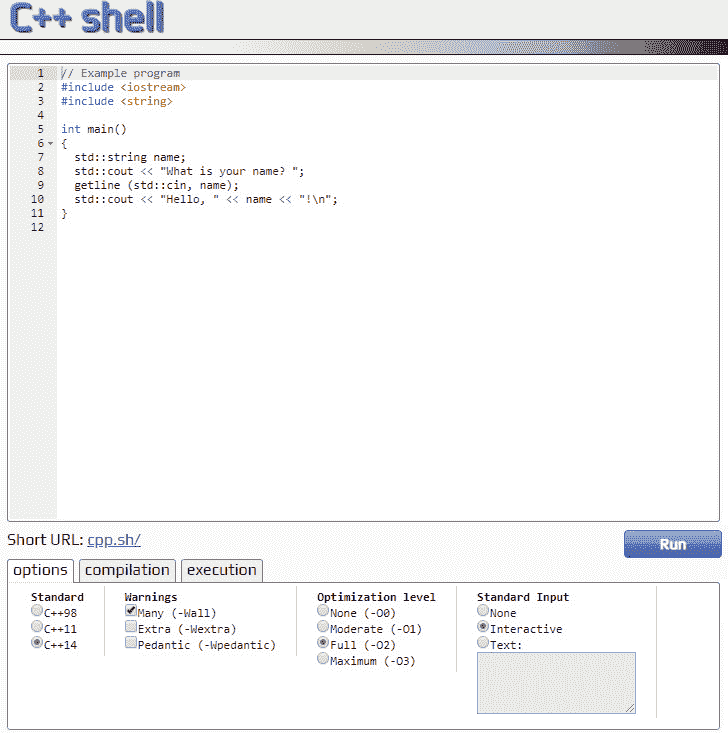
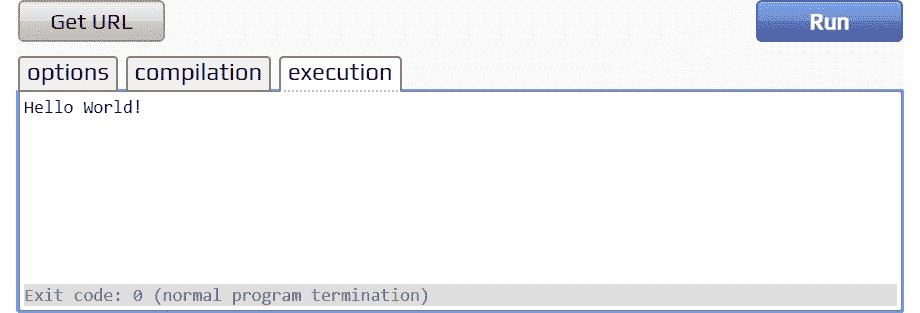
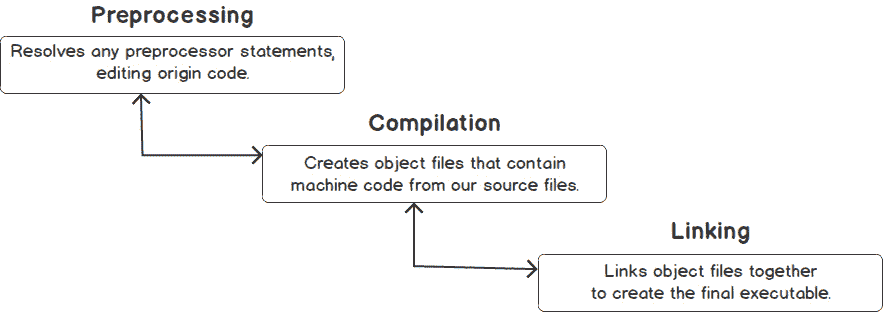
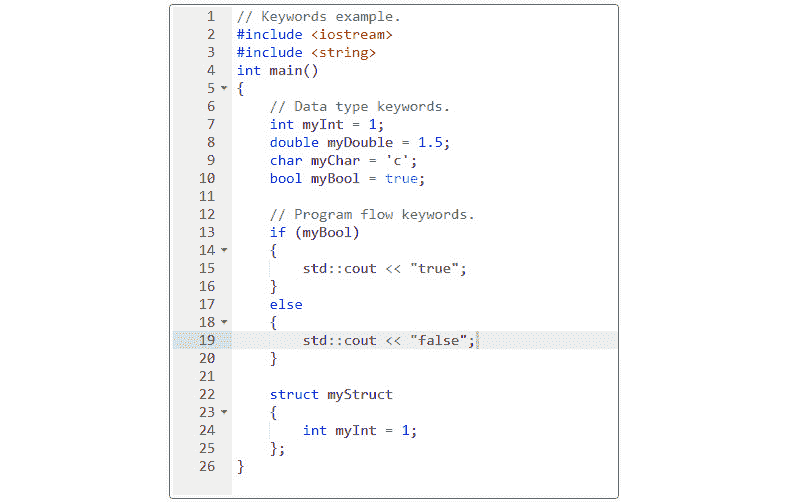
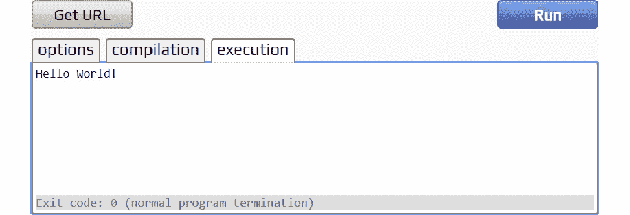
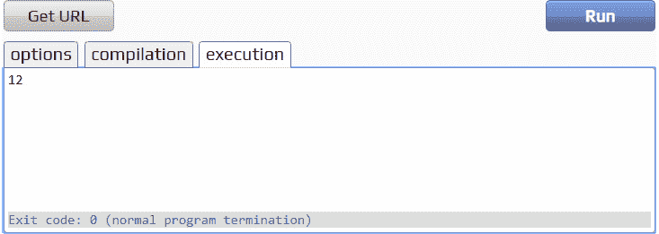

# 第一章：1\. 你好，C#

概述

本章介绍了 C#的基础知识。您将首先学习.NET 命令行界面（CLI）的基础知识以及如何使用 Visual Studio Code（VS Code）作为基本集成开发环境（IDE）。然后，您将了解各种 C#数据类型以及如何为这些类型声明变量，然后转到关于算术和逻辑运算符的部分。在本章结束时，您将知道如何处理异常和错误，并能够用 C#编写简单的程序。

# 介绍

C#是一种由微软团队在 2000 年代初创建的编程语言，由 Anders Hejlsberg 领导，他还是一些其他流行语言的创造者之一，如 Delphi 和 Turbo Pascal，这两种语言在上世纪 90 年代被广泛使用。在过去的 20 年中，C#已经发展和演变，如今它是全球范围内最广泛使用的编程语言之一，根据 Stack Overflow 的 2020 年洞察。

它有其在科技社区中占据如此崇高地位的原因。C#允许您为广泛的市场和设备编写应用程序。从具有高安全标准的银行业到拥有大量交易的电子商务公司，这是一种被需要性能和可靠性的公司信任的语言。此外，C#还可以编写 Web、桌面、移动甚至物联网应用程序，使您能够为几乎每种设备进行开发。

最初，C#只能在 Windows 上运行；然而，在过去几年中，C#团队已经做出了努力，使其跨平台兼容。如今，它可以与所有主要操作系统分发版一起使用，即 Windows、Linux 和 macOS。目标很简单：在任何地方开发、构建和运行 C#，让每个开发人员和团队选择他们最有效或最喜欢的环境。

C#的另一个显著特点是它是一种强类型的编程语言。您将在接下来的部分中更深入地了解这一点，并且您将看到强类型使得在编程时能够更好地保护数据安全。

此外，C#在过去几年已成为开源项目，由微软作为主要维护者。这是非常有利的，因为它允许语言从全球范围内不断获得改进，同时有一个坚实的支持公司来推广和投资。C#也是一种多范式语言，这意味着您可以以美观、简洁和适当的方式使用它来编写多种编程风格的软件。

# 使用.NET CLI 运行和开发 C#

在 C#世界中，您会经常听到一个术语，那就是.NET。它是 C#的基础，是该语言构建在其上的框架。它既有一个允许开发语言的软件开发工具包（SDK），也有一个允许语言运行的运行时。

话虽如此，要开始使用 C#进行开发，您只需要安装.NET SDK。此安装将在开发环境中提供编译器和运行时。在本节中，您将学习准备开发和在本地运行 C#的基本步骤。

注意

有关如何下载.NET 6.0 SDK 并在您的计算机上安装的逐步说明，请参阅本书的*前言*。

一旦完成了.NET 6.0 SDK 的安装，您将拥有一个称为.NET CLI 的东西。这个命令行界面（CLI）允许您使用非常简单的命令创建新项目、编译它们并直接从终端运行它们。

安装后，在您喜欢的终端上运行以下命令：

```cpp
dotnet --list-sdks
```

您应该会看到以下输出：

```cpp
6.0.100 [/usr/local/share/dotnet/sdk]
```

这个输出显示你的电脑上安装了 SDK 的 6.0.100 版本。这意味着你已经准备好开始开发你的应用程序了。如果你输入 `dotnet -–help`，你会注意到几个命令会出现在 CLI 中供你选择运行。在这一部分，你将学习到最基本的命令，用来创建和运行应用程序：`new`，`build`和`run`。

`dotnet new`命令允许你创建一个引导项目来开始开发。CLI 有几个内置模板，它们只是各种类型应用程序的基本引导：web 应用程序，桌面应用程序等。在`dotnet new`命令中，你必须指定两件事：

+   模板名称

+   项目名称

名称作为参数传递，这意味着你应该用`-n`或`–name`标志来指定它。命令如下：

```cpp
dotnet new TYPE -n NAME
```

例如，要创建一个名为`MyConsoleApp`的新控制台应用程序，你可以简单地输入：

```cpp
dotnet new console -n MyConsoleApp
```

这将生成一个新的文件夹，其中包含一个名为`MyConsoleApp.csproj`的文件，这是包含编译器构建项目所需的所有元数据的 C#项目文件，以及一些应用程序构建和运行所需的文件。

接下来，`dotnet build`命令允许你构建一个应用程序并使其准备运行。这个命令应该只放在两个位置：

+   包含一个`.csproj`文件的项目文件夹。

+   包含一个`.sln`文件的文件夹。

解决方案（`.sln`）文件是包含一个或多个项目文件的元数据文件。它们用于将多个项目文件组织成单个构建。

最后，第三个重要的命令是`dotnet run`。这个命令允许你正确地运行一个应用程序。它可以在包含你的.NET 应用程序的`.csproj`文件的文件夹中不带任何参数调用，或者在 CLI 上使用`-–project`标志传递项目文件夹。`run`命令还会在运行之前自动构建应用程序。

## 使用 CLI 和 VS Code 创建程序

在阅读本书时，你将使用 Visual Studio Code (VS Code)作为你的代码编辑器。它适用于所有平台，你可以在 https://code.visualstudio.com/下载适合你操作系统的版本。虽然 VS Code 不是一个完整的集成开发环境（IDE），但它有很多扩展，使它成为一个强大的工具来开发和进行正确的 C#编码，无论使用的是哪个操作系统。

为了正确地开发 C#代码，你主要需要安装 Microsoft C#扩展。它使 VS Code 具备了代码补全和识别错误的能力，并且可以在[`marketplace.visualstudio.com/items?itemName=ms-dotnettools.csharp`](https://marketplace.visualstudio.com/items?itemName=ms-dotnettools.csharp)上找到。

注意

在继续之前，建议你安装 VS Code 和 Microsoft C#扩展。你可以在本书的*前言*中找到安装过程的逐步说明。

## C#程序的基本结构

为了运行，每个 C#程序都需要一个称为入口点的东西。在 C#中，程序的标准入口点是`Main`方法。无论你的程序类型是什么，无论是 web 应用程序、桌面应用程序，甚至是一个简单的控制台应用程序，`Main`方法都将是你的 C#程序的**入口点**。这意味着每次应用程序运行时，运行时都会在你的代码中搜索这个方法，并执行其中的代码块。

这个结构是由 CLI 用`new`命令为你创建的。一个`Program.cs`文件包含一个名为`Program`的类，一个名为`Main`的方法，这个方法又包含一个单一的指令，在程序构建和运行后将被执行。你以后会学到更多关于方法和类的知识，但现在只需要知道，一个类通常包含一组数据，并且可以通过这些**方法**对这些数据执行操作。

关于基本 C#概念的另一件重要的事情是`//`。

## 练习 1.01：创建一个打印“Hello World”的控制台应用程序

在这个练习中，您将看到在上一节学习的 CLI 命令，因为您将构建您的第一个 C#程序。这将是一个简单的控制台应用程序，将在控制台上打印`Hello World`。

执行以下步骤：

1.  打开 VS Code 集成终端，输入以下内容：

```cpp
dotnet new console -n Exercise1_01 
```

这个命令将在`Exercise1_01`文件夹中创建一个新的控制台应用程序。

1.  在命令行中，输入以下内容：

```cpp
dotnet run --project Exercise1_01
```

您应该看到以下输出：



图 1.1：“Hello World”在控制台上的输出

注意

您可以在[`packt.link/HErU6`](https://packt.link/HErU6)找到本练习使用的代码。

在这个练习中，您创建了可能是最基本的 C#程序，一个控制台应用程序，将一些文本打印到提示符上。您还学会了如何使用.NET CLI，这是内置在.NET SDK 中用于创建和管理.NET 项目的机制。

现在继续下一节，了解如何编写顶级语句。

### 顶级语句

您可能已经注意到，在*练习 1.01*中，默认情况下，当您创建一个控制台应用程序时，会有一个包含以下内容的`Program.cs`文件：

+   一个名为`Program`的类。

+   静态 void `Main`关键字。

您将在以后详细了解类和方法，但现在，为了简单起见，您不需要这些资源来创建和执行 C#程序。最新版本(.NET 6)引入了一个功能，使编写简单程序变得更加容易和简洁。例如，考虑以下内容：

```cpp
using System;
namespace Exercise1_01
{
    class Program
    {
        static void Main(string[] args)
        {
            Console.WriteLine("Hello World!");
        }
    }
}
```

您可以用以下两行代码简单地替换这段代码：

```cpp
using System;
Console.WriteLine("Hello World!");
```

通过使用这样的顶级语句，您可以编写简洁的程序。您可以简单地将要执行的语句放在程序的顶部。这对于加快学习 C#的速度也很有用，因为您不需要担心提前学习高级概念。唯一需要注意的是，项目只能有一个包含顶级语句的文件。

这就是为什么在本章中，您会发现所有练习都使用这种格式，以尽可能清晰地表达事物。

## 声明变量

现在，您将迈出创建自己程序的第一步。本节将深入探讨变量的概念——它们是什么以及如何使用它们。

变量是给计算机内存位置的名称，用于保存可能变化的一些数据。要使变量存在，首先必须用类型和名称**声明**它。它也可以有一个赋给它的值。变量的声明可以通过几种不同的方式实现。

关于 C#中变量命名约定的一些基本考虑：

+   名称必须是唯一的，以字母开头，只能包含字母、数字和下划线字符(`_`)。名称也可以以下划线字符开头。

+   名称是区分大小写的；因此，`myVariable`和`MyVariable`是不同的名称。

+   保留关键字，如`int`或`string`，不能作为名称使用(这是编译器的限制)，除非在名称前加上`@`符号，如`@int`或`@string`。

变量可以以显式和隐式两种方式声明。声明的两种风格各有利弊，您将在下一节中探讨。

### 显式声明变量

变量可以通过同时写出其类型和值来显式声明。假设您想创建两个变量，`a`和`b`，都包含整数。显式声明如下所示：

```cpp
int a = 0;
int b = 0;
```

在使用变量之前，必须为变量赋值。否则，C#编译器在构建程序时会报错。以下示例说明了这一点：

```cpp
int a;
int b = a; // The compiler will prompt an error on this line: Use of unassigned local variable
```

在同一行中声明多个变量也是可能的，就像在以下代码片段中一样，您在声明三个变量；两个保存值`100`，一个保存值`10`：

```cpp
int a, b = 100, c = 10;
```

### 隐式声明变量

请记住，C#是一种强类型的编程语言；这意味着变量总是与一个类型相关联。无论类型是隐式声明还是显式声明，都无关紧要。使用`var`关键字，C#编译器将根据分配给它的值推断变量类型。

考虑你想要创建一个变量，使用这种方法来保存一些文本。可以通过以下语句来实现：

```cpp
var name = "Elon Musk";
```

要将文本存储在变量中，你应该用双引号(`"`)开始和结束文本。在上面的例子中，通过查看被赋给`name`的值，C#知道这个变量所持有的类型是字符串，即使在语句中没有提到类型。

### 显式声明与隐式声明

显式声明增强了类型声明的可读性，这是这种技术的主要优势之一。另一方面，它们往往会让代码变得更冗长，特别是在使用一些数据类型（稍后会看到）时，比如`Collections`。

基本上，决定声明的风格取决于程序员的个人偏好，并且在某些情况下可能会受到公司指南的影响。在学习的过程中，建议你选择一种使你的学习路径更加顺畅的方式，因为从纯技术角度来看，几乎没有实质性的差异。

在下一个练习中，你将通过为来自用户与控制台应用程序的交互的输入分配变量来自己完成这个任务，用户将被要求输入他们的名字。要完成这个练习，你将使用 C#提供的以下内置方法，这些方法在你的 C#之旅中经常会用到：

+   `Console.ReadLine()`: 这允许你检索用户在控制台上提示的值。

+   `Console.WriteLine()`: 这将传递作为参数的值作为输出写入到控制台。

## 练习 1.02：将变量分配给用户输入

在这个练习中，你将创建一个交互式的控制台应用程序。该应用程序应该询问你的名字，一旦提供，它应该显示一个带有你的名字的问候语。

要完成这个练习，请执行以下步骤：

1.  打开命令提示符，输入以下内容：

```cpp
dotnet new console -n Exercise1_02
```

这个命令在`Exercise1_02`文件夹中创建一个新的控制台应用程序。

1.  打开`Program.cs`文件。将以下内容粘贴到`Main`方法中：

```cpp
Console.WriteLine("Hi! I'm your first Program. What is your name?");
var name = Console.ReadLine();
Console.WriteLine($"Hi {name}, it is very nice to meet you. We have a really fun journey ahead.");
```

1.  保存文件。在命令行中，输入以下内容：

```cpp
dotnet run --project Exercise1_02
```

这将输出以下内容：

```cpp
Hi! I'm your first Program. What is your name?
```

1.  现在，在控制台中输入你的名字，然后按下键盘上的`Enter`。例如，如果你输入`Mateus`，输出将会是：

```cpp
Hi! I'm your first Program. What is your name?
Mateus
Hi Mateus, it is very nice to meet you. We have a really fun journey ahead.
```

注意

你可以在[`packt.link/1fbVH`](https://packt.link/1fbVH)找到用于这个练习的代码。

你已经更熟悉变量是什么，如何声明它们，以及如何给它们赋值。现在是时候开始讨论这些变量可以存储什么数据，更具体地说，有哪些数据类型。

# 数据类型

在这一部分，你将讨论 C#中的主要数据类型及其功能。

## 字符串

C#使用`string`关键字来标识存储文本的数据，作为字符序列。你可以以几种方式声明字符串，如下面的代码片段所示。然而，当将一些值赋给字符串变量时，你必须将内容放在一对双引号之间，就像在最后两个例子中看到的那样：

```cpp
// Declare without initializing.
string message1;
// Initialize to null.
string message2 = null;
// Initialize as an empty string
string message3 = System.String.Empty;
// Will have the same content as the above one
string message4 = "";
// With implicit declaration
var message4 = "A random message"     ;
```

一种简单但有效的技术（你在前面的*练习 1.02*中使用过）叫做字符串插值。通过这种技术，很容易将纯文本值与变量值混合在一起，使文本在这两者之间组合。你可以通过以下步骤来组合两个或更多个字符串：

1.  在初始引号之前，插入一个`$`符号。

1.  现在，在字符串内部，放置花括号和你想要放入字符串中的变量的名称。在这种情况下，通过在初始字符串中放置`{name}`来实现：

```cpp
$"Hi {name}, it is very nice to meet you. We have a really fun journey ahead.");
```

关于字符串的另一个重要事实是它们是不可变的。这意味着字符串对象在创建后无法更改。这是因为 C#中的字符串是字符数组。数组是一种数据结构，它们收集相同类型的对象并具有固定的长度。您将在接下来的部分详细介绍数组。

在下一个练习中，您将探索字符串的不可变性。

## 练习 1.03：检查字符串的不可变性

在这个练习中，您将使用两个字符串来演示字符串引用始终是不可变的。执行以下步骤：

1.  打开 VS Code 集成终端，并输入以下内容：

```cpp
dotnet new console -n Exercise1_03
```

1.  打开`Program.cs`文件，并创建一个返回类型为`void`的方法，用于替换字符串的一部分，如下所示：

```cpp
static void FormatString(string stringToFormat)
{
stringToFormat.Replace("World", "Mars");
}
```

在上面的代码片段中，使用`Replace`函数将第一个字符串（在本例中为`World`）替换为第二个字符串（`Mars`）。

1.  现在，创建一个方法，执行相同的操作，但返回结果：

```cpp
static string FormatReturningString(string stringToFormat)
{
return stringToFormat.Replace("Earth", "Mars");
}
```

1.  现在在上述方法之后插入以下内容。在这里，您创建两个字符串变量，并在尝试使用先前创建的方法修改它们后观察它们的行为：

```cpp
var greetings = "Hello World!";
FormatString(greetings);
Console.WriteLine(greetings);
var anotherGreetings = "Good morning Earth!";
Console.WriteLine(FormatReturningString(anotherGreetings));
```

1.  最后，从命令行调用`dotnet run --project Exercise1_03`。您应该在控制台上看到以下输出：

```cpp
dotnet run
Hello World!
Good morning Mars!
```

注意

您可以在[`packt.link/ZoNiw`](https://packt.link/ZoNiw)找到此练习使用的代码。

通过这个练习，您看到了字符串不可变性的概念。当您传递一个作为方法参数的引用类型字符串（`Hello World!`）时，它不会被修改。这就是当您使用返回`void`的`FormatString`方法时发生的情况。由于字符串不可变性，将创建一个新字符串，但不会分配给任何变量，原始字符串保持不变。而第二个方法返回一个新字符串，然后将该字符串打印到控制台。

## 比较字符串

尽管字符串是引用值，但当您使用`.Equals()`方法、相等运算符（`==`）和其他运算符（如`!=`）时，实际上是在比较字符串的值，如下例所示：

```cpp
string first = "Hello.";
string second = first;
first = null;
```

现在，您可以比较这些值，并调用`Console.WriteLine()`输出结果，如下所示：

```cpp
Console.WriteLine(first == second);
Console.WriteLine(string.Equals(first, second));
```

运行上述代码将产生以下输出：

```cpp
False
False
```

您会得到这个输出，因为尽管字符串是引用类型，但`==`和`.Equals`比较都是针对字符串值的。还要记住字符串是不可变的。这意味着当您将`second`赋给`first`并将`first`设置为`null`时，将为`first`创建一个新值，因此`second`的引用不会改变。

## 数字类型

C#将其数字类型细分为两大类——整数和浮点类型数字。整数类型数字如下：

+   `sbyte`：保存从-128 到 127 的值

+   `short`：保存从-32,768 到 32,767 的值

+   `int`：保存从-2,147,483,648 到 2,147,483,647 的值

+   `long`：保存从-9,223,372,036,854,775,808 到 9,223,372,036,854,775,807 的值

决定使用哪种整数类型取决于您要存储的值的大小。

所有这些类型都被称为有符号值。这意味着它们可以存储负数和正数。还有另一系列称为无符号类型的类型。无符号类型包括`byte`、`ushort`、`uint`和`ulong`。它们之间的主要区别在于有符号类型可以存储负数，而无符号类型只能存储大于或等于零的数字。您将大部分时间使用有符号类型，所以不用担心一次记住所有这些。

另一类别，即浮点类型，指的是用于存储一个或多个小数点的数字的类型。C#中有三种浮点类型：

+   `float`：占用 4 字节，可以存储从± 1.5 x 10−45 到± 3.4 x 1038 的数字，精度范围为 6 到 9 位。要使用`var`声明一个浮点数，您可以简单地在数字后面添加`f`，如下所示：

```cpp
var myFloat = 10f;
```

+   `double`：占用 8 字节，可以存储从± 5.0 × 10−324 到± 1.7 × 1030 的数字，精度范围为 15 到 17 位。要使用 var 声明一个双精度数，您可以在数字后面添加 d，如下所示：

```cpp
var myDouble = 10d;
```

+   `decimal`：占用 16 字节，可以存储从± 1.0 x 10-28 到± 7.9228 x 1028 的数字，精度范围为 28 到 29 位。要使用 var 声明一个十进制数，您只需在数字后面添加 m，如下所示：

```cpp
var myDecimal = 10m;
```

选择浮点类型主要取决于所需的精度程度。例如，`decimal`主要用于需要非常高精度且不能依赖四舍五入进行精确计算的金融应用。对于 GPS 坐标，如果需要处理通常具有 10 位数字的亚米精度，`double`变量可能是合适的选择。

在选择数字类型时要考虑的另一个相关点是性能。分配给变量的内存空间越大，对这些变量的操作性能就越低。因此，如果不需要高精度，`float`变量的性能将优于`double`，而`double`的性能又将优于`decimal`。

在这里，您了解了变量及其主要类型。现在，您将使用它们执行一些基本的计算，如加法、减法和乘法。这可以通过 C#中可用的算术运算符来实现，如`+`、`-`、`/`和`*`。因此，继续进行下一个练习，您将使用这些运算符创建一个基本的计算器。

## 练习 1.04：使用基本算术运算符

在这个练习中，您将创建一个简单的计算器，接收两个输入，并根据所选的算术运算显示它们之间的结果。

以下步骤将帮助您完成此练习：

1.  打开 VS Code 集成终端，输入以下内容：

```cpp
dotnet new console -n Exercise1_04
```

1.  导航到项目文件夹，打开`Program.cs`文件，在`Main`方法中声明两个变量，读取用户输入，如下所示：

```cpp
Console.WriteLine("Type a value for a: ");
var a = int.Parse(Console.ReadLine());
Console.WriteLine("Now type a value for b: ");
var b = int.Parse(Console.ReadLine());
```

前面的代码片段使用`.ReadLine`方法读取输入。但是，这个方法返回一个`string`，而您需要评估一个数字。因此，在这里使用了`Parse`方法。所有数字类型都有一个名为 Parse 的方法，它接收一个字符串并将其转换为数字。

1.  接下来，您需要将这些基本运算符的输出写入控制台。将以下代码添加到`Main`方法中：

```cpp
Console.WriteLine($"The value for a is { a } and for b is { b }");
Console.WriteLine($"Sum: { a + b}");
Console.WriteLine($"Multiplication: { a * b}");
Console.WriteLine($"Subtraction: { a - b}");
Console.WriteLine($"Division: { a / b}"); 
```

1.  使用`dotnet run`命令运行程序，如果您输入`10`和`20`，您应该会看到以下输出：

```cpp
Type a value for a:
10
Now type a value for b:
20
The value for a is 10 and b is 20
Sum: 30
Multiplication: 200
Subtraction: -10
Division: 0
```

注意

您可以在[`packt.link/ldWVv`](https://packt.link/ldWVv)找到此练习中使用的代码。

因此，您已经使用算术运算符在 C#中构建了一个简单的计算器应用程序。您还了解了解析的概念，用于将字符串转换为数字。在下一节中，您将简要介绍类的主题，这是 C#编程的核心概念之一。

# 类

类是 C#编码的一个重要部分，并将在*第二章*，*构建高质量面向对象的代码*中得到全面覆盖。本节简要介绍了类的基础知识，以便您可以开始在程序中使用它们。

在 C#中，保留的`class`关键字用于定义对象的类型。对象，也可以称为实例，实际上就是分配了存储信息的内存块。根据这个定义，类的作用是作为对象的蓝图，具有一些属性来描述这个对象，并通过方法指定这个对象可以执行的操作。

例如，假设你有一个名为`Person`的类，有两个属性`Name`和`Age`，以及一个检查`Person`是否为孩子的方法。方法是可以放置逻辑以执行某些操作的地方。它们可以返回特定类型的值，也可以有特殊的`void`关键字，表示它们不返回任何东西，只是执行某些操作。你也可以有方法调用其他方法：

```cpp
public class Person
{
	public Person() { }
	public Person(string name, int age)
{
	Name = name;
	Age = age;
}
	public string Name { get; set; }
	public int Age { get; set; }
	public void GetInfo()
{
	Console.WriteLine($"Name: {Name} – IsChild? {IsChild()}");
}
	public bool IsChild()
{
	return Age < 12;
}
}
```

然而，还有一个问题。由于类充当蓝图（或者如果你喜欢的话，是定义），你如何实际分配内存来存储类定义的信息？这是通过一个称为实例化的过程完成的。当你实例化一个对象时，你在内存中为它分配一些空间，在一个称为堆的保留区域中。当你将一个变量分配给一个对象时，你正在设置该变量具有这个内存空间的地址，这样每次你操作这个变量时，它指向并操作分配在这个内存空间的数据。以下是一个实例化的简单示例：

```cpp
var person = new Person();
```

请注意，`Person`有两个魔术关键字`get`和`set`的属性。Getter 定义了可以检索属性值，setter 定义了可以设置属性值。

这里还有一个重要的概念是构造函数。构造函数是一个没有返回类型的方法，通常出现在类的顶层，以提高可读性。它指定了创建对象所需的内容。默认情况下，类将始终具有一个无参数的构造函数。如果定义了带参数的另一个构造函数，类将被限制为只有这一个。在这种情况下，如果你仍然想要一个无参数的构造函数，你必须指定一个。这是非常有用的，因为类可以有多个构造函数。

也就是说，你可以通过以下方式为具有 setter 的对象属性分配值：

+   在创建时，通过它的构造函数：

```cpp
var person = new Person("John", 10);
```

+   在创建时，通过直接变量赋值：

```cpp
var person = new Person() { Name = "John", Age = 10 };
```

+   对象创建后，如下所示：

```cpp
var person = new Person();
person.Name = "John";
person.Age = 10;
```

类还有很多你将在后面看到的内容。现在，主要思想如下：

+   类是对象的蓝图，可以具有描述这些对象的属性和方法。

+   对象需要被实例化，这样你才能对它们进行操作。

+   类默认有一个无参数的构造函数，但可以根据需要有许多自定义的构造函数。

+   对象变量是包含对象在专用内存部分中分配的特殊内存空间的内存地址的引用。

# 日期

在 C#中，可以使用`DateTime`值类型来表示日期。它是一个具有两个静态属性的结构，称为`MinValue`，即公元 0001 年 1 月 1 日 00:00:00，和`MaxValue`，即公元 9999 年 12 月 31 日 23:59:59。正如名称所示，这两个值代表了根据公历日期格式的最小和最大日期。`DateTime`对象的默认值是`MinValue`。

可以以各种方式构造`DateTime`变量。其中一些最常见的方式如下：

+   如下分配当前时间：

```cpp
var now = DateTime.Now;
```

这将变量设置为调用计算机上的当前日期和时间，表示为本地时间。

```cpp
var now = DateTime.UtcNow;
```

这将变量设置为协调世界时（UTC）表示的当前日期和时间。

+   你还可以使用构造函数来传递天、月、年、小时、分钟，甚至秒和毫秒。

+   `DateTime`对象还有一个特殊属性叫做`Ticks`。它是自`DateTime.MinValue`以来经过的 100 纳秒的数量。每次你有这种类型的对象，你都可以调用`Ticks`属性来获得这样的值。

+   日期的另一种特殊类型是`TimeSpan`结构。`TimeSpan`对象表示以天、小时、分钟和秒为单位的时间间隔。在获取日期之间的间隔时很有用。现在你将看到这在实践中是什么样子的。

## 练习 1.05：使用日期算术

在此练习中，您将使用`TimeSpan`方法/结构来计算本地时间和 UTC 时间之间的差异。要完成此练习，请执行以下步骤：

1.  打开 VS Code 集成终端并键入以下内容：

```cpp
dotnet new console -n Exercise1_05
```

1.  打开`Program.cs`文件。

1.  将以下内容粘贴到`Main`方法中并保存文件：

```cpp
Console.WriteLine("Are the local and utc dates equal? {0}", DateTime.Now.Date == DateTime.UtcNow.Date);
Console.WriteLine("\nIf the dates are equal, does it mean that there's no TimeSpan interval between them? {0}",
(DateTime.Now.Date - DateTime.UtcNow.Date) == TimeSpan.Zero);
DateTime localTime = DateTime.Now;
DateTime utcTime = DateTime.UtcNow;
TimeSpan interval = (localTime - utcTime);
Console.WriteLine("\nDifference between the {0} Time and {1} Time: {2}:{3} hours",
    localTime.Kind.ToString(),
    utcTime.Kind.ToString(),
    interval.Hours,
    interval.Minutes);
Console.Write("\nIf we jump two days to the future on {0} we'll be on {1}",
    new DateTime(2020, 12, 31).ToShortDateString(),
    new DateTime(2020, 12, 31).AddDays(2).ToShortDateString());
```

在前面的代码片段中，您首先检查了当前本地日期和 UTC 日期是否相等。然后，您使用`TimeSpan`方法检查它们之间的间隔（如果有的话）。接下来，它打印了本地和 UTC 时间之间的差异，并打印了比当前日期提前两天的日期（在本例中为`31/12/2020`）。

1.  保存文件。在命令行上，键入以下内容：

```cpp
dotnet run --project Exercise1_05
```

您应该看到类似以下的输出：

```cpp
Are the local and utc dates equal? True
If the dates are equal, does it mean there's no TimeSpan interval between them? True
Difference between the Local Time and Utc Time: 0:0 hours
If we jump two days to the future on 31/12/2020 we'll be on 02/01/2021
```

注意

您可以在[`packt.link/WIScZ`](https://packt.link/WIScZ)找到用于此练习的代码。

请注意，根据您所在的时区，您可能会看到不同的输出。

## 格式化日期

还可以将`DateTime`值格式化为本地化字符串。这意味着根据 C#语言中称为文化的特殊概念格式化`DateTime`实例，文化是您本地时间的表示。例如，不同国家的日期表示方式不同。现在看一下以下示例，在这些示例中，日期以法国和美国使用的格式输出：

```cpp
var frenchDate = new DateTime(2008, 3, 1, 7, 0, 0);
Console.WriteLine(frenchDate.ToString(System.Globalization.CultureInfo.
  CreateSpecificCulture("fr-FR")));
// Displays 01/03/2008 07:00:00
var usDate = new DateTime(2008, 3, 1, 7, 0, 0);
Console.WriteLine(frenchDate.ToString(System.Globalization.CultureInfo.CreateSpecificCulture("en-US")));
// For en-US culture, displays 3/1/2008 7:00:00 AM
```

还可以明确定义您希望日期输出的格式，就像以下示例中一样，您传递`yyyyMMddTHH:mm:ss`值以表示您希望日期按年、月、日、小时、以冒号开头的分钟，最后是以冒号开头的秒输出：

```cpp
var date1 = new DateTime(2008, 3, 1, 7, 0, 0);
Console.WriteLine(date1.ToString("yyyyMMddTHH:mm:ss"));
```

将显示以下输出：

```cpp
     20080301T07:00:00
```

# 逻辑运算符和布尔表达式

您已经熟悉这些。回想一下，在前面的练习中，您进行了以下比较：

```cpp
var now = DateTime.Now.Date == DateTime.UtcNow.Date;
```

此输出将在日期相等时将值`true`分配给`now`。但是如您所知，它们可能不一定相同。因此，如果日期不同，将分配一个`false`值。这两个值是这样的布尔表达式的结果，并称为布尔值。这就是为什么`now`变量的类型是`bool`的原因。

布尔表达式是每个程序中每个逻辑比较的基础。基于这些比较，计算机可以在程序中执行某种行为。以下是一些布尔表达式和变量赋值的其他示例：

+   分配检查`a`是否大于`b`的比较结果：

```cpp
var basicComparison = a > b;
```

+   分配检查`b`是否大于或等于`a`的比较结果：

```cpp
bool anotherBasicComparison = b >= a; 
```

+   检查两个字符串是否相等，并将此比较的结果分配给一个变量：

```cpp
var animal1 = "Leopard";
var animal2 = "Lion";
bool areTheseAnimalsSame = animal1 == animal2;
```

显然，先前比较的结果将是`false`，并且此值将分配给`areTheseAnimalsSame`变量。

现在您已经了解了布尔变量和它们的工作原理，是时候看一些逻辑运算符，您可以使用这些运算符来比较布尔变量和表达式了。

+   `&&`（AND）运算符：此运算符将执行相等比较。如果两者相等，则返回`true`，如果它们不相等，则返回`false`。考虑以下示例，在这个示例中，您检查两个字符串的长度是否为`0`：

```cpp
bool areTheseStringsWithZeroLength = "".Length == 0 && " ".Length == 0; 
Console.WriteLine(areTheseStringsWithZeroLength);// will return false
```

+   `||`（OR）运算符：此运算符将检查要比较的值中是否有一个为`true`。例如，在这里，您正在检查至少一个字符串的长度是否为零：

```cpp
bool isOneOfTheseStringsWithZeroLength = "".Length == 0 || " ".Length == 0;
Console.WriteLine(isOneOfTheseStringsWithZeroLength); // will return true
```

+   `！`（NOT）运算符：此运算符获取布尔表达式或值并对其取反；也就是说，它返回相反的值。例如，考虑以下示例，在这个示例中，您对检查一个字符串是否为零长度的比较结果取反：

```cpp
bool isOneOfTheseStringsWithZeroLength = "".Length == 0 || " ".Length == 0; 
bool areYouReallySure = !isOneOfTheseStringsWithZeroLength;
Console.WriteLine(areYouReallySure); // will return false
```

## 使用 if-else 语句

到目前为止，你已经学习了类型、变量和运算符。现在是时候进入帮助你在现实世界问题中使用这些概念的机制了，也就是决策语句。

在 C#中，`if-else`语句是实现代码分支的最受欢迎的选择之一，这意味着告诉代码在满足条件时遵循一条路径，否则遵循另一条路径。它们是逻辑语句，根据布尔表达式的评估结果继续程序的执行。

例如，你可以使用`if-else`语句来检查密码是否满足某些条件（比如至少有六个字符和一个数字）。在下一个练习中，你将在一个简单的控制台应用程序中做到这一点。

## 练习 1.06：使用 if-else 进行分支

在这个练习中，你将使用`if-else`语句编写一个简单的凭据检查程序。应用程序应该要求用户输入他们的用户名；除非这个值至少有六个字符的长度，否则用户无法继续。一旦满足这个条件，用户应该被要求输入一个密码。密码也应该至少有六个字符，包含至少一个数字。只有在满足这两个条件之后，程序才应该显示一个成功消息，比如`User successfully registered`。

以下步骤将帮助你完成这个练习：

1.  在 VS Code 集成终端中，创建一个名为`Exercise1_06`的新控制台项目：

```cpp
dotnet new console -n Exercise1_06
```

1.  在`Main`方法中，添加以下代码来询问用户用户名，并将值赋给一个变量：

```cpp
Console.WriteLine("Please type a username. It must have at least 6 characters: ");
var username = Console.ReadLine();
```

1.  接下来，程序需要检查用户名是否有超过六个字符，如果没有，就在控制台上写一个错误消息：

```cpp
if (username.Length < 6)
{
Console.WriteLine($"The username {username} is not valid.");
}
```

1.  现在，在一个`else`子句中，你将继续验证并要求用户输入一个密码。一旦用户输入了密码，需要检查三个点。第一个条件是检查密码是否至少有六个字符，然后检查是否至少有一个数字。然后，如果这些条件中的任何一个失败，控制台应该显示一个错误消息；否则，它应该显示一个成功消息。添加以下代码来实现这一点：

```cpp
else
{
Console.WriteLine("Now type a 
password. It must have a length of at least 6 characters and also contain a number.");
var password = Console.ReadLine();

if (password.Length < 6)
     {
     		Console.WriteLine("The password must have at least 6 characters.");
}
     else if (!password.Any(c => char.IsDigit©))
     {
     		Console.WriteLine("The password must contain at least one number.");
}
else
     {
             Console.WriteLine("User successfully registered.");
}
}
```

从上面的片段中，你可以看到如果用户输入少于六个字符，就会显示一个错误消息`The password must have at least 6 characters.`。如果密码不包含一个数字但满足前面的条件，就会显示另一个错误消息`The password must contain at least one number.`。

注意这里使用的逻辑条件是`!password.Any(c => char.IsDi©(c))`。你将在*第二章*，*构建高质量面向对象的代码*中学到更多关于`=>`符号的知识，但现在你只需要知道这行代码检查密码中的每个字符，并使用`IsDigit`函数来检查字符是否是数字。这对每个字符都做了，如果没有找到数字，就显示错误消息。如果所有条件都满足，就显示成功消息`User successfully registered.`。

1.  使用`dotnet run`运行程序。你应该会看到如下输出：

```cpp
Please type a username. It must have at least 6 characters:
thekingjames
Now type a password. It must have at least 6 characters and a number.
James123!"#
User successfully registered
```

注意

你可以在[`packt.link/3Q7oK`](https://packt.link/3Q7oK)找到本练习使用的代码。

在这个练习中，你使用了 if-else 分支语句来实现一个简单的用户注册程序。

## 三元运算符

另一个简单易用但有效的决策运算符是三元运算符。它允许你根据布尔比较来设置变量的值。例如，考虑以下例子：

```cpp
var gift = person.IsChild() ? "Toy" : "Clothes";
```

在这里，您使用`?`符号来检查它之前放置的布尔条件是否有效。编译器为`person`对象运行`IsChild`函数。如果该方法返回`true`，则将第一个值（`:`符号之前）分配给`gift`变量。如果该方法返回`false`，则将第二个值（`:`符号之后）分配给`gift`变量。

三元运算符简单明了，可以根据简单的布尔验证进行赋值。在 C#的学习过程中，您会经常使用它。

## 引用类型和值类型

C#中有两种类型的变量，即引用类型和值类型。值类型的变量，如结构体，包含值本身，正如其名称所示。这些值存储在称为堆栈的内存空间中。当声明此类类型的变量时，会分配特定的内存空间来存储该值，如下图所示：



图 1.2：值类型变量的内存分配

在这里，变量的值，即`5`，存储在 RAM 中的位置`0x100`的内存中。C#的内置值类型包括`bool`、`byte`、`char`、`decimal`、`double`、`enum`、`float`、`int`、`long`、`sbyte`、`short`、`struct`、`uint`、`ulong`和`ushort`。

然而，引用类型变量的情况是不同的。在本章中，您需要了解的三种主要引用类型是`string`、数组和`class`。当分配新的引用类型变量时，存储在内存中的不是值本身，而是值被分配的内存地址。例如，考虑以下图表：



图 1.3：引用类型变量的内存分配

在这里，内存中存储的是字符串变量（`Hello`）的地址，而不是其值。为简洁起见，您不会深入探讨这个话题，但重要的是要知道以下几点：

+   当值类型变量作为参数传递或分配为另一个变量的值时，.NET 运行时会将变量的值复制到另一个对象。这意味着原始变量不会受到在新的和后续变量中所做的任何更改的影响，因为这些值实际上是从一个地方复制到另一个地方的。

+   当引用类型变量作为参数传递或分配为另一个变量的值时，.NET 传递的是堆内存地址，而不是值。这意味着在方法内部对该变量进行的每次更改都会在外部反映出来。

例如，考虑以下处理整数的代码。在这里，您声明一个名为`a`的`int`变量，并将值`100`赋给它。稍后，您创建另一个名为`b`的`int`变量，并将`a`的值赋给它。最后，您修改`b`，使其增加`100`：

```cpp
using System;
int a = 100;
Console.WriteLine($"Original value of a: {a}");
int b = a;
Console.WriteLine($"Original value of b: {b}");
b = b + 100;
Console.WriteLine($"Value of a after modifying b: {a}");
Console.WriteLine($"Value of b after modifying b: {b}");
```

`a`和`b`的值将显示在以下输出中：

```cpp
Original value of a: 100
Original value of b: 100
Value of a after modifying b: 100
Value of b after modifying b: 200
```

在这个例子中，从`a`中复制的值被复制到了`b`中。从这一点开始，您对`b`所做的任何其他修改都只会反映在`b`中，而`a`将继续保持其原始值。

那么，如果您将引用类型作为方法参数传递会怎样呢？考虑以下程序。在这里，您有一个名为`Car`的类，具有两个属性—`Name`和`GearType`。程序内部有一个名为`UpgradeGearType`的方法，该方法接收`Car`类型的对象并将其`GearType`更改为`Automatic`：

```cpp
using System;
var car = new Car();
car.Name = "Super Brand New Car";
car.GearType = "Manual";
Console.WriteLine($"This is your current configuration for the car {car.Name}: Gea–Type - {car.GearType}");
UpgradeGearType(car);
Console.WriteLine($"You have upgraded your car {car.Name} for the GearType {car.GearType}");
void UpgradeGearType(Car car)
{
    car.GearType = "Automatic";
}
class Car
{
    public string Name { get; set; }
    public string GearType { get; set; }
}
```

创建`Car` `UpgradeGearType()`方法后，输出将如下所示：

```cpp
This is your current configuration for the car Super Brand New Car: GearType – Manual
You have upgraded your car Super Brand New Car for the GearType Automatic
```

因此，您会发现，如果您将一个`car`（在这种情况下）作为参数传递给一个方法（在本例中为`UpgradeGearType`），则在方法调用之后，内部和外部都会反映出对**对象**所做的任何更改。这是因为引用类型指的是内存中的特定位置。

## 练习 1.07：掌握值和引用相等性

在这个练习中，你将看到值类型和引用类型的相等性比较是不同的。执行以下步骤来完成：

1.  在 VS Code 中，打开集成终端并输入以下内容：

```cpp
dotnet new console -n Exercise1_07
```

1.  打开`Program.cs`文件。在同一个文件中，创建一个名为`GoldenRetriever`的结构，具有一个`Name`属性，如下所示：

```cpp
struct GoldenRetriever
{
    public string Name { get; set; }
}
```

1.  仍然在同一个文件中，创建另一个名为`BorderCollie`的类，具有类似的`Name`属性：

```cpp
class BorderCollie
{
    public string Name { get; set; }
}
```

1.  还必须创建一个名为`Bernese`的类，也具有`Name`属性，但还有一个重写本地`Equals`方法：

```cpp
class Bernese
{
    public string Name { get; set; }
    public override bool Equals(object obj)
    {
        if (obj is Bernese borderCollie && obj != null)
        {
            return this.Name == borderCollie.Name;
        }
        return false;
    }
}
```

在这里，`this`关键字用于引用当前的`borderCollie`类。

1.  最后，在`Program.cs`文件中，你将为这些类型创建一些对象。请注意，由于你使用了**顶级语句**，这些声明应该在类和结构声明之上：

```cpp
        var aGolden = new GoldenRetriever() { Name = "Aspen" };
        var anotherGolden = new GoldenRetriever() { Name = "Aspen" };
        var aBorder = new BorderCollie() { Name = "Aspen" };
        var anotherBorder = new BorderCollie() { Name = "Aspen" };
        var aBernese = new Bernese() { Name = "Aspen" };
        var anotherBernese = new Bernese() { Name = "Aspen" };
```

1.  现在，在之前的声明之后，使用`Equals`方法比较这些值，并将结果分配给一些变量：

```cpp
var goldenComparison = aGolden.Equals(anotherGolden) ? "These Golden Retrievers have the same name." : "These Goldens have different names.";
var borderComparison = aBorder.Equals(anotherBorder) ? "These Border Collies have the same name." : "These Border Collies have different names.";
var berneseComparison = aBernese.Equals(anotherBernese) ? "These Bernese dogs have the same name." : "These Bernese dogs have different names.";
```

1.  最后，使用以下内容将比较结果打印到控制台：

```cpp
          Console.WriteLine(goldenComparison);
          Console.WriteLine(borderComparison);
          Console.WriteLine(berneseComparison);
```

1.  使用`dotnet run`命令行运行程序，你将看到以下输出：

```cpp
These Golden Retrievers have the same name.
These Border Collies have different names.
These Bernese dogs have the same name.
```

注意

你可以在[`packt.link/xcWN9`](https://packt.link/xcWN9)找到用于这个练习的代码。

如前所述，结构体是值类型。因此，当两个相同结构的对象使用`Equals`进行比较时，.NET 内部检查所有结构属性。如果这些属性具有相等的值，那么将返回`true`。例如，对于`Golden Retrievers`，如果你有一个`FamilyName`属性，并且这个属性在两个对象之间是不同的，那么相等性比较的结果将是`false`。

对于类和所有其他引用类型，相等性比较是非常不同的。默认情况下，对象引用在相等性比较上被检查。如果引用不同（而且除非两个变量被分配给相同的对象，它们将是不同的），相等性比较将返回`false`。这解释了你在示例中看到的`Border Collies`的结果，即两个实例的引用是不同的。

然而，有一种方法可以在引用类型中实现，叫做 Equals。给定两个对象，`Equals`方法可以用于比较，遵循方法内部的逻辑。这正是伯恩山犬示例中发生的事情。

### 默认值类型

现在你已经处理了值和引用类型，你将简要探索默认值类型。在 C#中，每种类型都有一个默认值，如下表所示：



图 1.4：默认值类型表

这些默认值可以使用`default`关键字分配给变量。要在变量声明中使用这个词，你必须在变量名之前显式声明变量类型。例如，考虑以下代码片段，其中你将`default`值分配给两个`int`变量：

```cpp
int a = default;
int b = default;
```

在这种情况下，`a`和`b`都将被赋值为`0`。请注意，这种情况下不能使用`var`。这是因为对于隐式声明的变量，编译器需要为变量分配一个值以推断其类型。因此，以下代码片段将导致错误，因为没有设置类型，要么通过显式声明，要么通过变量赋值：

```cpp
var a = default;
var b = default;
```

## 使用 switch 语句增强决策制定

`switch`语句经常被用作 if-else 结构的替代方案，如果要对三个或更多条件进行测试，则可以选择一个要执行的代码部分，例如以下情况：

```cpp
switch (matchingExpression) 
{
  case firstCondition:
    // code section
    break;
  case secondCondition:
    // code section
    break;
  case thirdCondition:
    // code section
    break;
  default:
    // code section
    break;
}
```

匹配表达式应返回以下类型之一的值：`char`、`string`、`bool`、`numbers`、`enum`和`object`。然后，将在匹配的`case`子句中或在默认子句中对该值进行评估，如果它不匹配任何先前的子句。

重要的是要说，`switch`语句中只有一个`switch`部分会被执行。C#不允许从一个`switch`部分继续执行到下一个。但是，`switch`语句本身不知道如何停止。您可以使用`break`关键字，如果只希望执行某些操作而不返回，或者如果是这种情况，返回某些内容。

此外，`switch`语句上的`default`关键字是在没有匹配到其他选项时执行的位置。在下一个练习中，您将使用`switch`语句创建一个餐厅菜单应用程序。

## 练习 1.08：使用 switch 订购食物

在这个练习中，您将创建一个控制台应用程序，让用户从餐厅提供的食物菜单中选择。该应用程序应显示订单的确认收据。您将使用`switch`语句来实现逻辑。

按照以下步骤完成此练习：

1.  创建一个名为`Exercise1_08`的新控制台项目。

1.  现在，创建一个`System.Text.StringBuilder`。这是一个帮助以多种方式构建字符串的类。在这里，您正在逐行构建字符串，以便它们可以在控制台上正确显示：

```cpp
var menuBuilder = new System.Text.StringBuilder();
menuBuilder.AppendLine("Welcome to the Burger Joint. ");
menuBuilder.AppendLine(string.Empty);
menuBuilder.AppendLine("1) Burgers and Fries - 5 USD");
menuBuilder.AppendLine("2) Cheeseburger - 7 USD");
menuBuilder.AppendLine("3) Double-cheeseburger - 9 USD");
menuBuilder.AppendLine("4) Coke - 2 USD");
menuBuilder.AppendLine(string.Empty);
menuBuilder.AppendLine("Note that every burger option comes with fries and ketchup!");
```

1.  在控制台上显示菜单，并要求用户选择其中一个选项：

```cpp
Console.WriteLine(menuBuilder.ToString());
Console.WriteLine("Please type one of the following options to order:");
```

1.  读取用户按下的键，并使用`Console.ReadKey()`方法将其赋值给一个变量。此方法与之前使用的`ReadLine()`类似，不同之处在于它读取调用方法后立即按下的键。添加以下代码：

```cpp
var option = Console.ReadKey();
```

1.  现在是使用`switch`语句的时候了。在这里，将`option.KeyChar.ToString()`用作`switch`子句的匹配表达式。按键`1`、`2`、`3`和`4`应该分别接受`汉堡`、`芝士汉堡`、`双层芝士汉堡`和`可乐`的订单：

```cpp
switch (option.KeyChar.ToString())
{
    case "1":
        {
            Console.WriteLine("\nAlright, some burgers on the go. Please pay the cashier.");
            break;
        }
    case "2":
        {
            Console.WriteLine("\nThank you for ordering cheeseburgers. Please pay the cashier.");
            break;
        }
    case "3":
        {
            Console.WriteLine("\nThank you for ordering double cheeseburgers, hope you enjoy them. Please pay the cashier!");
```

但是，任何其他输入都应被视为无效，并显示一条消息，让您知道您选择了一个无效的选项：

```cpp
            break;
        }
    case "4":
        {
            Console.WriteLine("\nThank you for ordering Coke. Please pay the cashier.");
            break;
        }
    default:
        {
            Console.WriteLine("\nSorry, you chose an invalid option.");
            break;
        }
}
```

1.  最后，使用`dotnet run --project Exercise1_08`运行程序，并与控制台交互以查看可能的输出。例如，如果您输入`1`，您应该看到以下输出：

```cpp
Welcome to the Burger Joint. 
1) Burgers and Fries – 5 USD
2) Cheeseburger – 7 USD
3) Double-cheeseburger – 9 USD
4) Coke – 2 USD
Note that every burger option comes with fries and ketchup!
Please type one of the follow options to order:
1
Alright, some burgers on the go! Please pay on the following cashier!
```

注意

您可以在[`packt.link/x1Mvn`](https://packt.link/x1Mvn)找到此练习中使用的代码。

同样，您还应该获取其他选项的输出。您已经了解了 C#中的分支语句。在使用 C#编程时，还有另一种类型的语句经常使用，称为迭代语句。下一节将详细介绍这个主题。

## 迭代语句

迭代语句，也称为循环，是现实世界中有用的语句类型，因为您经常需要在应用程序中不断重复一些逻辑执行，直到满足某些条件，例如使用必须递增直到达到某个值的数字。C#提供了许多实现这种迭代的方法，在本节中，您将详细研究每种方法。

### while

您将考虑的第一个迭代语句是`while`语句。此语句允许 C#程序在某个布尔表达式被评估为`true`时执行一组指令。它具有最基本的结构之一。考虑以下片段：

```cpp
int i = 0;
while (i < 10)
{
Console.WriteLine(i);
i = i +1;
}
```

前面的片段显示了如何使用`while`语句。请注意，`while`关键字后面跟着一对括号，括号中包含一个逻辑条件；在这种情况下，条件是`i`的值必须小于`10`。在大括号中编写的代码将在此条件为`true`时执行。

因此，前面的代码将打印`i`的值，从`0`开始，直到`10`。这是相当简单的代码；在下一个练习中，你将使用`while`语句进行一些更复杂的操作，比如检查你输入的数字是否是质数。

## 练习 1.09：使用 while 循环检查一个数字是否是质数

在这个练习中，你将使用`while`循环来检查你输入的数字是否是质数。为此，`while`循环将检查计数器是否小于或等于数字除以`2`的整数结果。当满足这个条件时，你检查数字除以计数器的余数是否为`0`。如果不是，你增加计数器并继续，直到循环条件不再满足。如果满足，这意味着数字不是`false`，循环可以停止。

执行以下步骤完成这个练习：

1.  在 VS Code 集成终端中，创建一个名为`Exercise1_09`的新控制台项目。

1.  在`Program.cs`文件中创建以下方法，该方法将执行你在练习开始时介绍的逻辑：

```cpp
static bool IsPrime(int number)
{
if (number ==0 || number ==1) return false;
bool isPrime = true;
int counter = 2;
while (counter <= Math.Sqrt(number))
     {
     		if (number % counter == 0)
           {
           	isPrime = false;
                break;
}
counter++;
}
     return isPrime;
}
```

1.  现在输入一个数字，这样你就可以检查它是否是质数：

```cpp
Console.Write("Enter a number to check whether it is Prime: ");
var input = int.Parse(Console.ReadLine());
```

1.  现在，检查数字是否是质数并打印结果：

```cpp
Console.WriteLine($"{input} is prime? {IsPrime(input)}.");
```

1.  最后，在 VS Code 集成终端中，调用`dotnet run --project Exercise1_09`并与程序交互。例如，尝试输入`29`作为输入：

```cpp
Enter a number to check whether it is Prime:
29
29 is prime? True
```

如预期的那样，`29`的结果是`true`，因为它是一个质数。

注意

你可以在[`packt.link/5oNg5`](https://packt.link/5oNg5)找到这个练习中使用的代码。

前面的练习旨在向你展示一个带有一些更复杂逻辑的`while`循环的简单结构。它检查一个名为`input`的数字，并打印出它是否是一个质数。在这里，你已经看到了再次使用`break`关键字来停止程序执行。现在继续学习跳转语句。

### 跳转语句

在循环中使用的一些其他重要关键字也值得一提。这些关键字称为跳转语句，用于将程序执行转移到另一个部分。例如，你可以将`IsPrime`方法重写如下：

```cpp
static bool IsPrimeWithContinue(int number)
        {
        if (number == 0 || number ==1) return false;
            bool isPrime = true;
            int counter = 2;
            while (counter <= Math.Sqrt(number))
            {
                if (number % counter != 0)
                {
                    counter++;
                    continue;
                }
                isPrime = false;
                break;
            }
            return isPrime;
        }
```

在这里，你已经颠倒了逻辑检查。不再检查余数是否为零然后中断程序执行，而是检查余数是否不为零，如果是，则使用`continue`语句将执行传递到下一个迭代。

现在看看如何使用另一个特殊关键字`goto`重写这个：

```cpp
static bool IsPrimeWithGoTo(int number)
        {
        if (number == 0 || number ==1) return false;
bool isPrime = true;
            int counter = 2;
            while (counter <= Math.Sqrt(number))
            {
                if (number % counter == 0)
                {
                    isPrime = false;
                    goto isNotAPrime; 
                }
                counter++;
            }
            isNotAPrime:
            return isPrime;
        }
```

`goto`关键字可以用来从代码的一个部分跳转到另一个由所谓的标签定义的部分。在这种情况下，标签被命名为`isNotAPrime`。最后，看一下写这个逻辑的最后一种方法：

```cpp
static bool IsPrimeWithReturn(int number)
        {
        if (number == 0 || number ==1) return false;
            int counter = 2;
            while (counter <= Math.Sqrt(number))
            {
                if (number % counter == 0)
                {
                    return false;
                }
                counter ++;
            }
            return true;
        }
```

现在，不再使用`break`或`continue`来停止程序执行，而是简单地使用`return`来中断循环执行，因为已经找到了你要找的结果。

### do-while

`do-while`循环与前一个循环类似，但有一个细微的区别：它至少执行一次逻辑，而简单的`while`语句如果条件在第一次执行时不满足可能永远不会执行。它有以下结构：

```cpp
int t = 0;
do
{
    Console.WriteLine(t);
    t++;
} while (t < 5);
```

在这个例子中，你从`0`开始写入`t`的值，并在它小于`5`时不断递增。在跳转到下一个循环类型之前，学习一个叫做数组的新概念。

### 数组

数组是一种用于存储相同类型的许多对象的数据结构。例如，下面的例子是一个声明为整数数组的变量：

```cpp
int[] numbers = { 1, 2, 3, 4, 5 };
```

关于数组的第一要点是它们有一个固定的容量。这意味着数组的长度在创建时被定义，并且这个长度不能改变。长度可以通过各种方式确定。在前面的例子中，长度是通过计算数组中对象的数量来推断的。然而，创建数组的另一种方式是这样的：

```cpp
var numbers = new int[5];
```

在这里，您正在创建一个具有 5 个整数容量的数组，但您没有为数组元素指定任何值。当创建任何数据类型的数组时，而没有向其添加元素时，将为数组的每个位置设置该值类型的默认值。例如，请考虑以下图：



图 1.5：未分配索引的值类型数组

前面的图表显示，当您创建一个包含五个元素的整数数组时，而没有为任何元素分配值时，数组会自动填充每个位置的默认值。在这种情况下，默认值为 0。现在考虑以下图表：



图 1.6：具有固定大小和仅分配一个索引的引用类型数组

在前面的示例中，您创建了一个包含五个对象的数组，并将`"Hello"`字符串值分配给索引 1 处的元素。数组的其他位置会自动分配对象的默认值，即 null。

最后值得注意的是，所有数组都有索引，它指的是单个数组元素的位置。第一个位置将始终具有索引 0。因此，大小为 n 的数组的位置可以从索引 0 到 n-1 指定。因此，如果调用 numbers[2]，这意味着您正在尝试访问 numbers 数组中位置 2 的元素。

### for 循环

for 循环执行一组指令，同时匹配指定条件的布尔表达式。就像 while 循环一样，跳转语句可以用于停止循环执行。它具有以下结构：

```cpp
for (initializer; condition; iterator)
{
	[statements]
}
```

初始化语句在循环开始之前执行。它用于声明和分配一个只在循环范围内使用的局部变量。

但在更复杂的情况下，它也可以用于组合其他语句表达式。条件指定一个布尔条件，指示循环何时应继续或退出。迭代器通常用于增加或减少初始化部分中创建的变量。考虑以下示例，其中使用 for 循环打印整数数组的元素：

```cpp
int[] array = { 1, 2, 3, 4, 5 };
for (int j = 0; j < array.Length - 1; j++)
{
Console.WriteLine(array[j]);
}
```

在此示例中，创建了一个初始化变量 j，最初分配为 0。当 j 小于数组长度减 1 时（请记住，索引始终从 0 开始），for 循环将继续执行。每次迭代后，j 的值增加 1。通过这种方式，for 循环遍历整个数组并执行给定的操作，即打印当前数组元素的值。

C#还允许使用嵌套循环，即循环内的循环，正如您将在下一个练习中看到的。

## 练习 1.10：使用冒泡排序对数组进行排序

在这个练习中，您将执行最简单的排序算法之一。冒泡排序包括遍历数组中的每一对元素，并在它们无序时交换它们。最终，期望是得到一个按升序排序的数组。您将使用嵌套的 for 循环来实现这个算法。

首先，要对其进行排序的数组应作为参数传递给此方法。对于该数组的每个元素，如果当前元素大于下一个元素，则它们的位置应该被交换。这种交换是通过将下一个元素的值存储在临时变量中，将当前元素的值分配给下一个元素，最后用临时存储的值设置当前元素的值来实现的。一旦第一个元素与所有其他元素进行比较，就会开始对第二个元素进行比较，依此类推，直到最终数组排序完成。

以下步骤将帮助您完成此练习：

1.  使用以下命令创建一个新的控制台项目：

```cpp
dotnet new console -n Exercise1_10
```

1.  在`Program.cs`文件中，创建实现排序算法的方法。添加以下代码：

```cpp
static int[] BubbleSort(int[] array)
{
    int temp;
    // Iterate over the array
    for (int j = 0; j < array.Length - 1; j++)
    {
        // If the last j elements are already ordered, skip them
        for (int i = 0; i < array.Length - j - 1; i++)
        {
            if (array[i] > array[i + 1])
            {
                temp = array[i + 1];
                array[i + 1] = array[i];
                array[i] = temp;
            }
        }
    }
    return array;
}
```

1.  现在创建一个带有一些数字的**数组**，如下所示：

```cpp
int[] randomNumbers = { 123, 22, 53, 91, 787, 0, -23, 5 };
```

1.  调用`BubbleSort`方法，将数组作为参数传递，并将结果分配给一个变量，如下所示：

```cpp
int[] sortedArray = BubbleSort(randomNumbers);
```

1.  最后，您需要打印数组已排序的消息。为此，遍历它，打印数组元素：

```cpp
Console.WriteLine("Sorted:");
for (int i = 0; i < sortedArray.Length; i++)
{
    Console.Write(sortedArray[i] + " ");
}
```

1.  使用`dotnet run --project Exercise1_10`命令运行程序。您应该在屏幕上看到以下输出：

```cpp
Sorted:
-23 0 5 22 53 91 123 787
```

注意

您可以在[`packt.link/cJs8y`](https://packt.link/cJs8y)找到用于此练习的代码。

在这个练习中，您使用了在最后两节中学到的两个概念：数组和 for 循环。您操作了数组，通过索引访问它们的值，并使用 for 循环来移动这些索引。

还有另一种遍历数组或`foreach`语句的方法。您将在下一节中探讨这一点。

### foreach 语句

`foreach`语句为集合的每个元素执行一组指令。就像`for`循环一样，`break`，`continue`，`goto`和`return`关键字也可以与`foreach`语句一起使用。考虑以下示例，在该示例中，您遍历数组的每个元素并将其写入控制台作为输出：

```cpp
var items = new int[] { 1, 2, 3, 4, 5 };
foreach (int element in items)
{
Console.WriteLine(element);
}
```

前面的代码段将数字`1`到`5`打印到控制台。您可以使用`foreach`语句处理的不仅仅是数组；它们还可以与列表，集合和跨度一起使用，这些是稍后将在后面的章节中介绍的其他数据结构。

## 文件处理

到目前为止，您一直在创建大部分与 CPU 和内存交互的程序。本节将重点放在 I/O 操作上，即物理磁盘上的输入和输出操作。这种操作的一个很好的例子是文件处理。

C#有几个类可帮助您执行 I/O 操作。其中一些如下：

+   `File`：此类提供了用于文件操作的方法，即在磁盘上读取，写入，创建，删除，复制和移动文件。

+   `Directory`：与`File`类一样，此类包括用于在磁盘上创建，移动和枚举目录和子目录的方法。

+   `Path`：这提供了处理文件和目录在磁盘上的绝对路径和相对路径的实用程序。相对路径始终与应用程序正在执行的当前目录内的某个路径相关联，而绝对路径是指硬盘内的绝对位置。

+   `DriveInfo`：这提供有关磁盘驱动器的信息，例如`Name`，`DriveType`，`VolumeLabel`和`DriveFormat`。

您已经知道文件大多是位于硬盘某处的一些数据集，可以通过某个程序打开以进行读取或写入。当您在 C#应用程序中打开文件时，您的程序通过通信通道将文件作为字节序列读取。这个通信通道称为流。流可以是两种类型：

+   输入流用于读取操作。

+   输出流用于写操作。

`Stream`类是 C#中的一个抽象类，它使得关于这个字节流的常见操作成为可能。对于硬盘上的文件处理，您将使用`FileStream`类，专门设计用于此目的。这个类的两个重要属性是`FileAccess`和`FileMode`。

### FileAccess

这是一个`enum`，为您提供了在打开指定文件时选择访问级别的选项：

+   `Read`：这以只读模式打开文件。

+   `ReadWrite`：这以读写模式打开文件。

+   `Write`：这以只写模式打开文件。这很少使用，因为通常您会在写入时进行一些读取。

### FileMode

这是一个`enum`，指定可以在文件上执行的操作。它应该与访问模式一起使用，因为某些模式只适用于某些访问级别。看一下选项，如下所示：

+   `Append`：当你想在文件末尾添加内容时使用。如果文件不存在，将创建一个新文件。对于这个操作，文件必须具有写入权限；否则，任何读取尝试都会失败并抛出`NotSupportedException`异常。异常是一个重要的概念，将在本章后面介绍。

+   `Create`：用于创建新文件或覆盖现有文件。对于这个选项，也需要写入权限。在 Windows 中，如果文件存在但被隐藏，将抛出`UnauthorizedAccessException`异常。

+   `CreateNew`：这类似于`Create`，但用于创建新文件，也需要写入权限。但是，如果文件已经存在，将抛出`IOException`异常。

+   `Open`：顾名思义，这种模式用于打开一个文件。文件必须具有读取或读取和写入权限。如果文件不存在，将抛出`FileNotFoundException`异常。

+   `OpenOrCreate`：这类似于`Open`，除非文件不存在，否则会创建一个新文件。

## 练习 1.11：从文本文件中读取内容

在这个练习中，你将从逗号分隔值（CSV）文件中读取文本。CSV 文件简单地包含由字符串表示并由冒号或分号分隔的数据。

完成这个练习，执行以下步骤：

1.  打开命令提示符并输入以下内容：

```cpp
dotnet new console -n Exercise1_11
```

1.  在您计算机上的`Exercise1_11`项目文件夹位置，创建一个名为`products.csv`的文件，并将以下内容粘贴到其中：

```cpp
Model;Memory;Storage;USB Ports;Screen;Condition;Price USD
Macbook Pro Mid 2012;8GB;500GB HDD;USB 2.0x2;13" screen;Refurbished;400
Macbook Pro Mid 2014;8GB;512GB SSD;USB 3.0x3;15" screen;Refurbished;750
Macbook Pro Late 2019;16GB;512GB SSD;USB 3.0x3;15" screen;Refurbished;1250
```

1.  打开`Program.cs`文件，并用以下内容替换它的内容：

```cpp
using System;
using System.IO;
using System.Threading.Tasks;
namespace Exercise1_11
{
    public class Program
    {
        public static async Task Main()
        {
        using (var fileStream = new FileStream("products.csv", FileMode.Open, FileAccess.Read))
        {
            using (var reader = new StreamReader(fileStream))
            {
                var content = await reader.ReadToEndAsync();
                var lines = content.Split(Environment.NewLine);
                foreach (var line in lines)
                {
                    Console.WriteLine(line);
                }
            }
        }
        }
    }
}
```

1.  在命令提示符中调用`dotnet run`，你将得到一个与你创建的 CSV 文件内容相同的输出。

注意

你可以在[`packt.link/5flid`](https://packt.link/5flid)找到这个练习所使用的代码。

这个练习有一些非常有趣的结果，你将逐步学习。首先，你使用`FileStream`类打开了一个文件。这允许你从文件中流出字节，具有两个特殊属性，即`FileMode`和`FileAccess`。它将返回一个`StreamReader`类。这个类使你能够将这些字节读取为文本字符。

还要注意，你的`Main`方法从`void`变成了`async` Task。此外，使用了`await`关键字，用于异步操作。你将在接下来的章节中学到更多关于这些主题的知识。现在，你只需要知道异步操作是指不阻塞程序执行的操作。这意味着你可以在它们被读取时输出行；也就是说，你不必等待它们全部被读取。

在下一节中，学习处理文件、数据库和网络连接的特殊关键字。

### 可释放对象

前面练习的另一个特殊之处是`using`关键字。它是一个用于清理内存中未管理资源的关键字。这些资源是处理一些操作系统资源的特殊对象，如文件、数据库和网络连接。它们被称为**特殊**，因为它们执行所谓的 I/O 操作；也就是说，它们与机器的真实资源进行交互，如网络和硬盘驱动器，而不仅仅是内存空间。

C#中对象使用的内存由一个叫做垃圾收集器的东西处理。默认情况下，C#处理堆栈和堆中的内存空间。唯一不执行此清理的对象类型被称为未管理对象。

清理这些对象从内存中意味着资源将被释放，以便被计算机中的另一个进程使用。这意味着一个文件可以被另一个文件处理，数据库连接可以再次被连接池使用，依此类推。这些类型的资源被称为可处置资源。每当你处理一个可处置资源时，你可以在创建对象时使用`using`关键字。然后，编译器知道当`using`语句关闭时，它可以自动释放这些资源。

## 练习 1.12：写入文本文件

在这个练习中，你将再次使用`FileStream`类将一些文本写入 CSV 文件中。

按照以下步骤完成这个练习：

1.  打开 VS Code 集成终端，输入以下内容：

```cpp
dotnet new console -n Exercise1_12
```

1.  在你电脑上的一个首选位置，从上一个练习中复制`products.csv`文件，并将其粘贴到这个练习的文件夹中。

1.  在`Program.cs`中，创建一个名为`ReadFile`的方法，该方法将接收一个`FileStream`文件，并迭代文件行以将结果输出到控制台：

```cpp
static async Task ReadFile(FileStream fileStream)
    {
        using (var reader = new StreamReader(fileStream))
        {
            var content = await reader.ReadToEndAsync();
            var lines = content.Split(Environment.NewLine);
            foreach (var line in lines)
            {
                Console.WriteLine(line);
            }
        }
    }
```

1.  现在，在你的程序中，用`StreamWriter`打开`products.csv`文件，并添加一些更多的信息，如下所示：

```cpp
        using (var file = new StreamWriter("products.csv", append: true))
        {
            file.Write("\nOne more macbook without details.");
        }
```

1.  最后，修改文件后读取文件的内容：

```cpp
using (var fileStream = new FileStream("products.csv", FileMode.Open,
            FileAccess.Read))
        {
            await ReadFile(fileStream);
        }
```

1.  在 VS Code 集成终端中调用`dotnet run --project Exercise1_12`，你将能够看到你刚刚创建的 CSV 文件的内容，以及你刚刚追加的行：

```cpp
Model;Memory;Storage;USB Ports;Screen;Condition;Price USD
Macbook Pro Mid 2012;8GB;500GB HDD;USB 2.0x2;13" screen;Refurbished;400
Macbook Pro Mid 2014;8GB;512GB SSD;USB 3.0x3;15" screen;Refurbished;750
Macbook Pro Late 2019;16GB;512GB SSD;USB 3.0x3;15" screen;Refurbished;1250
One more macbook without details.
```

注意，每次运行，程序都会追加一行新的内容，所以你会看到添加了更多的行。

注意

你可以在[`packt.link/dUk2z`](https://packt.link/dUk2z)找到这个练习使用的代码。

有时你的程序会在某个时候执行失败，并且可能不提供输出。这种情况被称为异常错误。下一节详细介绍了这种错误。

## 异常

异常表示程序在某个时刻由于某种原因无法执行，并且可以由代码本身或.NET 运行时引发。通常，异常是严重的失败，甚至可能终止程序的执行。幸运的是，C#提供了一种特殊的处理异常的方式，即`try/catch`块：

```cpp
try
{
// some logic that might throw an exception
}
catch
{
// error handling
}
```

在`try`子句中，调用可能引发异常的代码，在`catch`子句中，你可以处理引发的异常。例如，考虑以下例子：

```cpp
double Divide(int a, int b) => a/b;
```

这个方法接受两个整数，并返回它们之间的除法结果。然而，如果`b`是`0`会发生什么呢？在这种情况下，运行时会抛出`System.DivideByZeroException`，表示不可能执行除法。你如何在真实世界的程序中处理这个异常？你将在下一个练习中探讨这个问题。

## 练习 1.13：使用 try/catch 处理无效的用户输入

在这个练习中，你将创建一个控制台应用程序，从你那里获取两个输入，将第一个数字除以第二个数字，并输出结果。如果你输入了一个无效的字符，应用程序应该抛出一个异常，并且所有这些都应该在程序逻辑内部处理。

执行以下步骤完成这个练习：

1.  在 VS Code 集成终端中，创建一个名为`Exercise1_13`的新控制台应用程序。

1.  在`Program.cs`文件中创建以下方法：

```cpp
static double Divide(int a, int b)
{
    return a / b;
}
```

1.  现在，创建一个布尔变量来指示除法是否被正确执行。将`false`赋给它作为初始值：

```cpp
bool divisionExecuted = false;
```

1.  编写一个`while`循环，检查除法是否成功进行。如果成功，程序应该终止。如果没有，程序应该提示你输入有效数据，并再次执行除法。添加以下代码来实现这一点：

```cpp
while (!divisionExecuted)
{
    try
    {
        Console.WriteLine("Please input a number");
        var a = int.Parse(Console.ReadLine());
        Console.WriteLine("Please input another number");
        var b = int.Parse(Console.ReadLine());
        var result = Divide(a, b);
        Console.WriteLine($"Result: {result}");
        divisionExecuted = true;
    }
    catch (System.FormatException)
    {
        Console.WriteLine("You did not input a number. Let's start again ... \n");
        continue;
    }
    catch (System.DivideByZeroException)
    {
        Console.WriteLine("Tried to divide by zero. Let's start again ... \n");
        continue;
    }
}
```

1.  最后，使用`dotnet run`命令执行程序并与控制台交互。尝试插入字符串而不是数字，看看你得到什么输出。看下面的输出作为一个例子：

```cpp
Please input a number
5
Please input another number
0
Tried to divide by zero. Let's start again …
Please input a number
5
Please input another number
s
You did not input a number. Let's start again …
Please input a number
5
Please input another number
1
Result: 5
```

注意

你可以在[`packt.link/EVsrJ`](https://packt.link/EVsrJ)找到这个练习使用的代码。

在这个练习中，你处理了两种异常，分别是：

+   `int.Parse(string str)`方法在无法将`string`变量转换为整数时抛出`System.FormatException`。

+   `double Divide(int a, int b)`方法在 b 为 0 时抛出`System.DivideByZeroException`。

现在你已经看到了异常是如何处理的，重要的是要注意一个经验法则，这将帮助你在 C#的旅程中，那就是*你应该只捕获你能够或者需要处理的异常*。只有在少数情况下真正需要异常处理，如下所示：

+   当你想要**掩盖**一个异常，也就是捕获它并假装什么都没发生。这被称为异常抑制。当抛出的异常不影响程序流程时，就应该发生这种情况。

+   当你想要控制程序的执行流程以执行一些替代操作时，就像你在前面的练习中所做的那样。

+   当你想要捕获一种异常并将其作为另一种类型抛出时。例如，当与你的 Web API 通信时，你可能会看到一个`HttpException`类型的异常，表示目标不可达。你可以在这里使用自定义异常，比如`IntegrationException`，以更清楚地指示它发生在你的应用程序的某个部分，该部分与外部 API 进行一些集成。

`throw`关键字也可以用于有意地在某些情况下停止程序的执行流程。例如，假设你正在创建一个`Person`对象，并且`Name`属性在创建时不应为`null`。你可以在这个类上强制使用`System.ArgumentException`或`System.ArgumentNullException`，就像下面的代码片段中使用`ArgumentNullException`一样：

```cpp
class Person
{
Person(string name)
     {
if (string.IsNullOrWhiteSpace(name)) throw new ArgumentNullException(nameof(name));
Name = name;
     }
    String Name { get ; set; }
}
```

在这里，如果`name`参数的值为`null`或者只输入空格字符，就会抛出`ArgumentNullException`，程序无法成功执行。空值/空格条件是通过`IsNullOrWhiteSpace`函数来检查的，该函数可以用于字符串变量。

现在是时候通过一个活动来练习你在之前章节学到的所有知识了。

## 活动 1.01：创建一个猜数字游戏

要完成这个活动，你需要使用你在本章中学到和练习过的概念来创建一个猜数字游戏。在这个游戏中，首先必须生成一个从 1 到 10 的随机数，不需要输出到控制台。然后控制台应提示用户输入一个数字，然后猜测生成的随机数是多少，用户最多有五次机会。

在每次输入错误时，应显示一个警告消息，让用户知道他们还剩下多少次机会，如果所有五次机会都用于错误猜测，程序将终止。然而，一旦用户猜对了，程序将在终止之前显示一个成功消息。

以下步骤将帮助你完成这个活动：

1.  创建一个名为`numberToBeGuessed`的变量，它被赋予 C#中的一个随机数。你可以使用以下代码片段来实现：

```cpp
new Random().Next(0, 10)
```

这会为你生成一个在`0`和`10`之间的随机数。如果你想让游戏变得更难一些，你可以用一个更大的数字来替换`10`，或者用一个更小的数字来让它变得更容易，但是在这个活动中，你将使用`10`作为最大值。

1.  创建一个名为`remainingChances`的变量，用于存储用户剩余的机会数。

1.  创建一个名为`numberFound`的变量，并将其赋值为`false`。

1.  现在，创建一个`while`循环，当还有一些机会剩余时执行。在这个循环中，添加代码来输出剩余的机会次数，直到猜对为止。然后，创建一个名为`number`的变量，用于接收正确的猜测，并在`numberFound`变量中赋值`true`。如果没有猜对，剩余机会次数应减少 1。

1.  最后，添加代码来告知用户他们是否猜对了数字。如果他们猜对了，可以输出类似于`恭喜！你用{remainingChanges}次机会猜对了数字！`的内容。如果他们用完了机会，输出`你没有机会了。数字是{numberToBeGuessed}。`。

注意

这个活动的解决方案可以在[`packt.link/qclbF`](https://packt.link/qclbF)找到。

# 总结

本章概述了 C#的基础知识，以及使用它编写程序的样子。你探索了从变量声明、数据类型和基本算术和逻辑运算符到文件和异常处理的一切。你还探索了 C#在处理值类型和引用类型时如何分配内存。

在本章的练习和活动中，你能够解决一些现实世界的问题，并想出可以用这种语言及其资源实现的解决方案。你学会了如何在控制台应用程序中提示用户输入，如何在系统中处理文件，最后，如何通过异常处理处理意外输入。

下一章将涵盖面向对象编程的基本知识，深入探讨类和对象的概念。你还将了解编写清晰、简洁、易于维护的代码的重要性，以及编写此类代码的原则。
