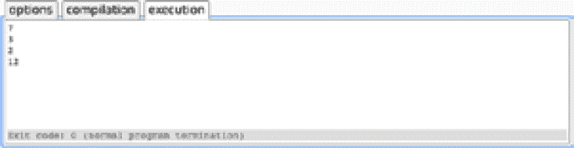
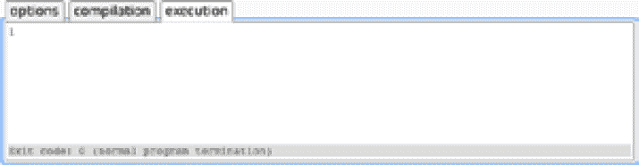
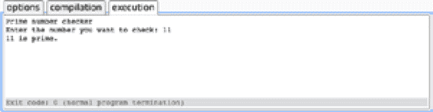
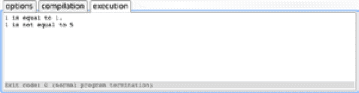
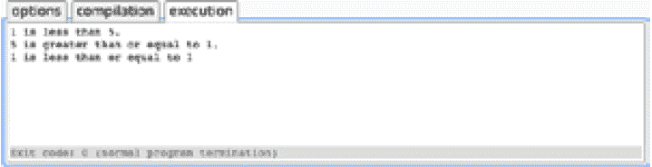
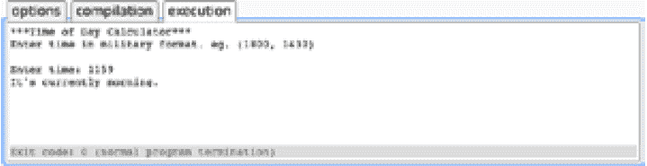

# 4\. 数据结构和 LINQ

概述

在本章中，您将了解 C# 中主要集合及其主要用法。然后，您将看到如何使用语言集成查询（LINQ）来查询内存中的集合，使用高效且简洁的代码。通过本章结束时，您将熟练掌握使用 LINQ 进行排序、过滤和聚合数据等操作。

# 介绍

在前几章中，您已经使用了引用单个值的变量，例如 `string` 和 `double` 系统类型，系统 `class` 实例以及您自己的类实例。.NET 有各种数据结构，可以用来存储多个值。这些结构通常被称为集合。本章将在此概念的基础上介绍来自 `System.Collections.Generic` 命名空间的集合类型。

您可以使用集合类型创建可以存储多个对象引用的变量。这些集合包括根据元素数量调整大小的列表和使用唯一键作为标识符访问元素的字典。例如，您可能需要存储一组国际电话区号，并使用区号作为唯一标识符。在这种情况下，您需要确保不会将相同的电话区号添加到集合中两次。

这些集合与其他类一样实例化，并且在大多数应用程序中被广泛使用。选择正确类型的集合主要取决于您打算如何添加项目以及一旦项目在集合中后您希望如何访问这些项目。常用的集合类型包括 `List`、`Set` 和 `HashSet`，您将很快详细介绍它们。

LINQ 是一种技术，它提供了一种用于查询对象的表达性和简洁的语法。使用类似 SQL 的语言或者一组可以链接在一起产生可以轻松枚举的集合的扩展方法，可以消除大部分围绕过滤、排序和分组对象的复杂性。

# 数据结构

.NET 提供了各种内置数据结构类型，例如 `Array`、`List` 和 `Dictionary` 类型。所有数据结构的核心都是 `IEnumerable` 和 `ICollection` 接口。实现这些接口的类提供了枚举各个元素和操作它们的方法。很少需要创建直接从这些接口派生的自定义类，因为内置的集合类型已经涵盖了所有所需的功能，但了解关键属性是值得的，因为它们在整个 .NET 中被广泛使用。

每种集合类型的泛型版本都需要一个类型参数，该参数定义了可以添加到集合中的元素类型，使用泛型类型的标准 `<T>` 语法。

`IEnumerable` 接口具有一个属性，即 `IEnumerator<T> GetEnumerator()`。此属性返回一个类型，该类型提供允许调用者遍历集合中元素的方法。您不需要直接调用 `GetEnumerator()` 方法，因为编译器会在您使用 `foreach` 语句时调用它，例如 `foreach(var book in books)`。您将在接下来的章节中了解更多关于如何使用它的内容。

`ICollection` 接口具有以下属性：

+   `int Count { get; }`: 返回集合中的项数。

+   `bool IsReadOnly { get; }`: 指示集合是否为只读。某些集合可以标记为只读，以防止调用者向集合中添加、删除或移动元素。C# 不会阻止您修改只读集合中各个项的属性。

+   `void Add(T item)`: 向集合中添加类型 `<T>` 的项。

+   `void Clear()`: 从集合中移除所有项。

+   `bool Contains(T item)`: 如果集合包含特定值，则返回`true`。根据集合中项目的类型，这可以是值相等，其中对象基于其成员相似，或引用相等，其中对象指向相同的内存位置。

+   `void CopyTo(T[] array, int arrayIndex)`: 将集合中的每个元素复制到目标数组中，从指定索引位置的第一个元素开始。如果您需要跳过集合开头的特定数量的元素，这可能很有用。

+   `bool Remove(T item)`: 从集合中移除指定的项目。如果实例有多个出现，则只移除第一个实例。如果成功移除项目，则返回`true`。

`IEnumerable`和`ICollection`是所有集合实现的接口：



图 4.1：ICollection 和 IEnumerable 类图

有进一步的接口，一些集合实现，取决于如何在集合中访问元素。

`IList`接口用于可以根据索引位置访问的集合，从零开始。因此，对于包含两个项目`Red`和`Blue`的列表，索引零处的元素是`Red`，索引一处的元素是`Blue`。



图 4.2：IList 类图

`IList`接口具有以下属性：

+   `T this[int index] { get; set; }`: 获取或设置指定索引位置的元素。

+   `int Add(T item)`: 添加指定的项目并返回该项目在列表中的索引位置。

+   `void Clear()`: 从列表中移除所有项目。

+   `bool Contains(T item)`: 如果列表包含指定的项目，则返回`true`。

+   `int IndexOf(T item)`: 返回项目的索引位置，如果未找到则返回`-1`。

+   `void Insert(int index, T item)`: 在指定的索引位置插入项目。

+   `void Remove(T item)`: 如果存在于列表中，则移除项目。

+   `void RemoveAt(int index)`: 移除指定索引位置的项目。

现在您已经看到了集合常见的主要接口。所以，现在您将看一下可用的主要集合类型以及它们的使用方式。

## 列表

`List<T>`类型是 C#中最广泛使用的集合之一。它用于具有项目集合并希望使用它们的索引位置控制项目顺序的情况。它实现了`IList`接口，允许使用索引位置插入、访问或移除项目：



图 4.3：List 类图

列表具有以下行为：

+   项目可以在集合中的任何位置插入。任何尾随项目的索引位置将被递增。

+   项目可以通过索引或值来移除。这也会导致尾随项目的索引位置更新。

+   可以使用它们的索引值设置项目。

+   项目可以添加到集合的末尾。

+   项目可以在集合中复制。

+   可以使用各种`Sort`方法对项目的位置进行排序。

列表的一个例子可能是 Web 浏览器应用程序中的选项卡。通常，用户可能希望在其他选项卡之间拖动浏览器选项卡，在末尾打开新选项卡，或在选项卡列表中的任何位置关闭选项卡。可以使用`List`来实现控制这些操作的代码。

在内部，`List`维护一个数组来存储其对象。当添加项目到末尾时，这可能是有效的，但在插入项目时可能是低效的，特别是在列表开头附近，因为项目的索引位置将需要重新计算。

以下示例显示了如何使用通用的`List`类。代码使用了`List<string>`类型参数，允许将`string`类型添加到列表中。尝试添加任何其他类型将导致编译器错误。这将展示`List`类的各种常用方法。

1.  在源代码文件夹中创建一个名为`Chapter04`的新文件夹。

1.  切换到`Chapter04`文件夹并使用以下.NET 命令创建一个新的控制台应用程序，名为`Chapter04`：

```cpp
    source\Chapter04>dotnet new console -o Chapter04
    The template "Console Application" was created successfully.
    ```

1.  删除`Class1.cs`文件。

1.  添加一个名为`Examples`的新文件夹。

1.  添加一个名为`ListExamples.cs`的新类文件。

1.  添加`System.Collections.Generic`命名空间以访问`List<T>`类，并声明一个名为`colors`的新变量：

```cpp
    using System;
    using System.Collections.Generic;
    namespace Chapter04.Examples
    {
        class ListExamples
        {     
            public static void Main()
            {
                var colors = new List<string> {"red", "green"};
                colors.Add("orange");
    ```

代码声明了新的`colors`变量，可以将多个颜色名称存储为`strings`。在这里，使用集合初始化语法，以便在变量的初始化中添加`red`和`green`。调用`Add`方法，将`orange`添加到列表中。

1.  同样，`AddRange`将`yellow`和`pink`添加到列表的末尾：

```cpp
                colors.AddRange(new [] {"yellow", "pink"});
    ```

1.  此时，列表中有五种颜色，`red`位于索引位置`0`，`green`位于位置`1`。您可以使用以下代码验证这一点：

```cpp
                Console.WriteLine($"Colors has {colors.Count} items");
                Console.WriteLine($"Item at index 1 is {colors[1]}");
    ```

运行代码会产生以下输出：

```cpp
Colors has 5 items
Item at index 1 is green
```

1.  使用`Insert`，可以将`blue`插入到列表的开头，即索引`0`处，如下面的代码所示。请注意，这将`red`从索引`0`移动到`1`，并且所有其他颜色的索引都将增加一个：

```cpp
                Console.WriteLine("Inserting blue at 0");
                colors.Insert(0, "blue");
                Console.WriteLine($"Item at index 1 is now {colors[1]}");
    ```

运行此代码时，您应该看到以下输出：

```cpp
Inserting blue at 0
Item at index 1 is now red
```

1.  使用`foreach`，您可以遍历列表中的字符串，将每个字符串写入控制台，如下所示：

```cpp
                Console.WriteLine("foreach");
                foreach (var color in colors)
                    Console.Write($"{color}|");
                Console.WriteLine();
    ```

您应该得到以下输出：

```cpp
foreach
blue|red|green|orange|yellow|pink|
```

1.  现在，添加以下代码来反转数组。在这里，每个`color`字符串都使用`ToCharArray`转换为`char`类型的数组：

```cpp
                Console.WriteLine("ForEach Action:");
                colors.ForEach(color =>
                {
                    var characters = color.ToCharArray();
                    Array.Reverse(characters);
                    var reversed = new string(characters);
                    Console.Write($"{reversed}|");
                });
                Console.WriteLine();
    ```

这不会影响`colors`列表中的任何值，因为`characters`指的是一个不同的对象。请注意，`foreach`会遍历每个字符串，而`ForEach`则定义了一个 Action 委托，用于使用每个字符串进行调用（回想一下，在*第三章*，*委托、事件和 Lambda*中，您看到了如何使用 lambda 语句来创建`Action`委托）。

1.  运行代码会产生这个输出：

```cpp
    ForEach Action:
    eulb|der|neerg|egnaro|wolley|knip|
    ```

1.  在下一个片段中，`List`构造函数接受一个源集合。这将创建一个新列表，其中包含`colors`字符串的副本，在这种情况下，使用默认的`Sort`实现进行排序：

```cpp
                var backupColors = new List<string>(colors);
                backupColors.Sort();
    ```

字符串类型使用值类型语义，这意味着`backupColors`列表中填充了每个源字符串值的**副本**。更新一个列表中的字符串**不会**影响另一个列表。相反，类被定义为引用类型，因此将类实例列表传递给构造函数仍将创建一个新列表，具有独立的元素索引，但每个元素将指向内存中相同的共享引用，而不是独立的副本。

1.  在删除所有颜色之前（使用`colors.Clear`），在以下片段中将每个值写入控制台（列表将很快重新填充）：

```cpp
                Console.WriteLine("Foreach before clearing:");
                foreach (var color in colors)
                    Console.Write($"{color}|");
                Console.WriteLine();
                colors.Clear();
                Console.WriteLine($"Colors has {colors.Count} items");
    ```

运行代码会产生这个输出：

```cpp
Foreach before clearing:
blue|red|green|orange|yellow|pink|
Colors has 0 items
```

1.  然后，再次使用`AddRange`，将颜色的完整列表添加回`colors`列表，使用排序后的`backupColors`项目作为源：

```cpp
                colors.AddRange(backupColors);
                Console.WriteLine("foreach after addrange (sorted items):");
                foreach (var color in colors)
                    Console.Write($"{color}|");
                Console.WriteLine();
    ```

您应该看到以下输出：

```cpp
foreach after addrange (sorted items):
blue|green|orange|pink|red|yellow|
```

1.  `ConvertAll`方法传递了一个委托，该委托可用于返回任何类型的新列表：

```cpp
                var indexes = colors.ConvertAll(color =>                      $"{color} is at index {colors.IndexOf(color)}");
                Console.WriteLine("ConvertAll:");
                Console.WriteLine(string.Join(Environment.NewLine, indexes));
    ```

在这里，返回一个新的`List<string>`，其中每个项目都使用其值和列表中的索引进行格式化。预期地，运行代码会产生这个输出：

```cpp
ConvertAll:
blue is at index 0
green is at index 1
orange is at index 2
pink is at index 3
red is at index 4
yellow is at index 5
```

1.  在下一个片段中，使用两个`Contains()`方法来展示字符串值相等的情况：

```cpp
                Console.WriteLine($"Contains RED: {colors.Contains("RED")}");
                Console.WriteLine($"Contains red: {colors.Contains("red")}");
    ```

请注意，大写的`RED`是`red`。运行代码会产生这个输出：

```cpp
Contains RED: False
Contains red: True
```

1.  现在，添加以下片段：

```cpp
                var existsInk = colors.Exists(color => color.EndsWith("ink"));
                Console.WriteLine($"Exists *ink: {existsInk}");
    ```

在这里，`Exists`方法传递了一个 Predicate 委托，如果测试条件满足，则返回`True`或`False`。Predicate 是一个内置的委托，它返回一个布尔值。在这种情况下，如果存在任何以字母`ink`结尾的字符串值（例如`pink`），则将返回`True`。

您应该看到以下输出：

```cpp
Exists *ink: True
```

1.  您知道已经有一个`red`颜色，但如果您再次在列表的开头插入`red`两次，会很有趣看看会发生什么：

```cpp
                Console.WriteLine("Inserting reds");
                colors.InsertRange(0, new [] {"red", "red"});
                foreach (var color in colors)
                    Console.Write($"{color}|");
                Console.WriteLine();
    ```

您将获得以下输出：

```cpp
Inserting reds
red|red|blue|green|orange|pink|red|yellow|
```

这表明可以将相同的项目多次插入到列表中。

1.  下一个片段向您展示了如何使用`FindAll`方法。`FindAll`类似于`Exists`方法，因为它传递了一个`Predicate`条件。所有符合该规则的项目都将被返回。添加以下代码：

```cpp
                var allReds = colors.FindAll(color => color == "red");
                Console.WriteLine($"Found {allReds.Count} red");
    ```

您应该得到以下输出。预期地，返回了三个`red`项：

```cpp
Found 3 red
```

1.  完成示例后，使用`Remove`方法从列表中删除第一个`red`。仍然有两个`FindLastIndex`来获取最后一个`red`项的索引：

```cpp
                colors.Remove("red");
                var lastRedIndex = colors.FindLastIndex(color => color == "red");
                Console.WriteLine($"Last red found at index {lastRedIndex}");
                Console.ReadLine();
            }
        }
    }
    ```

运行代码会产生以下输出：

```cpp
Last red found at index 5
```

注意

您可以在[`packt.link/dLbK6`](https://packt.link/dLbK6)找到此示例使用的代码。

通过了解泛型`List`类的使用方式，现在是时候开始练习了。

## 练习 4.01：在列表中保持顺序

在本章的开头，Web 浏览器选项卡被描述为列表的理想示例。在这个练习中，您将把这个想法付诸实践，并创建一个控制选项卡导航的类，该类模拟了 Web 浏览器的应用程序。

为此，您将创建一个`Tab`类和一个`TabController`应用程序，允许打开新选项卡并关闭或移动现有选项卡。以下步骤将帮助您完成此练习：

1.  在 VSCode 中，选择您的`Chapter04`项目。

1.  添加一个名为`Exercises`的新文件夹。

1.  在`Exercises`文件夹中，添加一个名为`Exercise01`的文件夹，并添加一个名为`Exercise01.cs`的文件。

1.  打开`Exercise01.cs`，并定义一个带有字符串 URL 构造函数参数的`Tab`类，如下所示：

```cpp
    using System;
    using System.Collections;
    using System.Collections.Generic;
    namespace Chapter04.Exercises.Exercise01
    {
        public class Tab 
        {
            public Tab()
            {}
            public Tab(string url) => (Url) = (url);
            public string Url { get; set; }
            public override string ToString() => Url;
        }   
    ```

在这里，`ToString`方法已被重写以返回当前的 URL，以帮助在控制台中记录详细信息。

1.  创建`TabController`类如下：

```cpp
        public class TabController : IEnumerable<Tab>
        {
            private readonly List<Tab> _tabs = new();
    ```

`TabController`类包含一个选项卡列表。请注意类如何从`IEnumerable`接口继承。此接口用于使类提供一种通过`foreach`语句迭代其项目的方法。您将提供打开、移动和关闭选项卡的方法，这些方法将直接控制`_tabs`列表中项目的顺序，在接下来的步骤中。请注意，您可以直接向调用者公开`_tabs`列表的，但最好通过自己的方法限制对选项卡的访问。因此，它被定义为`readonly`列表。

1.  接下来，定义`OpenNew`方法，将新选项卡添加到列表的末尾：

```cpp
            public Tab OpenNew(string url)
            {
                var tab = new Tab(url);
                _tabs.Add(tab);
                Console.WriteLine($"OpenNew {tab}");
                return tab;
            }
    ```

1.  定义另一个方法`Close`，如果存在，则从列表中删除选项卡。添加以下代码：

```cpp
            public void Close(Tab tab)
            {
                if (_tabs.Remove(tab))
                {
                    Console.WriteLine($"Removed {tab}");
                }
            }
    ```

1.  要将选项卡移动到列表的开头，请添加以下代码：

```cpp
            public void MoveToStart(Tab tab)
            {
                if (_tabs.Remove(tab))
                {
                    _tabs.Insert(0, tab);
                    Console.WriteLine($"Moved {tab} to start");
                }
    ```

在这里，`MoveToStart`将尝试删除选项卡，然后将其插入到索引`0`。

1.  同样，添加以下代码将选项卡移动到末尾：

```cpp
            public void MoveToEnd(Tab tab)
            {
                if (_tabs.Remove(tab))
                {
                    _tabs.Add(tab);
                    Console.WriteLine($"Moved {tab} to end. Index={_tabs.IndexOf(tab)}");
                }
            }
    ```

在这里，调用`MoveToEnd`首先删除选项卡，然后将其添加到末尾，并将新的索引位置记录到控制台。

最后，`IEnumerable`接口要求您实现两种方法，`IEnumerator<Tab> GetEnumerator()`和`IEnumerable.GetEnumerator()`。这允许调用者使用`Tab`类型的泛型或使用第二种方法通过基于对象的类型进行迭代。第二种方法是对 C#早期版本的回溯，但是需要兼容性。

1.  对于这两种方法的实际结果，可以使用`_tab`列表的`GetEnumerator`方法，因为它包含列表形式的选项卡。添加以下代码来执行此操作：

```cpp
            public IEnumerator<Tab> GetEnumerator() => _tabs.GetEnumerator();
            IEnumerator IEnumerable.GetEnumerator() => _tabs.GetEnumerator();
        }
    ```

1.  您现在可以创建一个控制台应用程序来测试控制器的行为。首先打开三个新选项卡，并通过`LogTabs`记录选项卡的详细信息（稍后将定义）：

```cpp
        static class Program
        {
            public static void Main()
            {
                var controller = new TabController();
                Console.WriteLine("Opening tabs...");
                var packt = controller.OpenNew("packtpub.com");
                var msoft = controller.OpenNew("microsoft.com");
                var amazon = controller.OpenNew("amazon.com");
                controller.LogTabs();
    ```

1.  现在，将`amazon`移到开头，将`packt`移到末尾，并记录选项卡的详细信息：

```cpp
                Console.WriteLine("Moving...");
                controller.MoveToStart(amazon);
                controller.MoveToEnd(packt);
                controller.LogTabs();
    ```

1.  关闭`msoft`选项卡并再次记录详细信息：

```cpp
                Console.WriteLine("Closing tab...");
                controller.Close(msoft);
                controller.LogTabs();
                Console.ReadLine();
            }
    ```

1.  最后，添加一个扩展方法，帮助记录`TabController`中每个选项卡的 URL。将其定义为`IEnumerable<Tab>`的扩展方法，而不是`TabController`，因为您只需要一个迭代器来使用`foreach`循环遍历选项卡。

1.  使用`PadRight`将每个 URL 左对齐，如下所示：

```cpp
            private static void LogTabs(this IEnumerable<Tab> tabs)
            {
                Console.Write("TABS: |");
                foreach(var tab in tabs)
                    Console.Write($"{tab.Url.PadRight(15)}|");
                Console.WriteLine();
            }    
       } 
    }
    ```

1.  运行代码会产生以下输出：

```cpp
    Opening tabs...
    OpenNew packtpub.com
    OpenNew microsoft.com
    OpenNew amazon.com
    TABS: |packtpub.com   |microsoft.com  |amazon.com     |
    Moving...
    Moved amazon.com to start
    Moved packtpub.com to end. Index=2
    TABS: |amazon.com     |microsoft.com  |packtpub.com   |
    Closing tab...
    Removed microsoft.com
    TABS: |amazon.com     |packtpub.com   |
    ```

注意

有时 Visual Studio 在第一次执行程序时可能会报告非空属性错误。这是一个有用的提醒，说明您正在尝试在运行时使用可能具有空值的字符串值。

打开了三个选项卡。然后将`amazon.com`和`packtpub.com`移动到`microsoft.com`之前，最后关闭并从选项卡列表中移除`microsoft.com`。

注意

您可以在[`packt.link/iUcIs`](https://packt.link/iUcIs)找到此练习使用的代码。

在这个练习中，您已经看到了如何使用列表来存储相同类型的多个项目，并保持项目的顺序。下一节将介绍`Queue`和`Stack`类，这些类允许按照预定义的顺序添加和移除项目。

## 队列

队列类提供了先进先出的机制。项目使用`Enqueue`方法添加到队列的末尾，并使用`Dequeue`方法从队列的前面移除。队列中的项目不能通过索引元素访问。

通常在需要确保项目按照添加到队列中的顺序进行处理的工作流程中使用队列。一个典型的例子可能是一个繁忙的在线售票系统，向顾客出售有限数量的音乐会门票。为了确保公平，顾客在登录后立即被添加到排队系统中。然后系统将出队每个顾客并处理每个订单，直到所有门票售完或顾客队列为空为止。

以下示例创建一个包含五个`CustomerOrder`记录的队列。当需要处理订单时，每个订单都将使用`TryDequeue`方法出队，直到所有订单都被处理。顾客订单按照添加的顺序进行处理。如果请求的门票数量大于或等于剩余的门票数量，则向顾客显示成功消息。如果剩余的门票数量少于请求的数量，则显示道歉消息。



图 4.4：队列的 Enqueue()和 Dequeue()工作流

执行以下步骤完成此示例：

1.  在`Chapter04`源文件夹的`Examples`文件夹中，添加一个名为`QueueExamples.cs`的新类，并编辑如下：

```cpp
    using System;
    using System.Collections.Generic;
    namespace Chapter04.Examples
    {
        class QueueExamples
        {      
            record CustomerOrder (string Name, int TicketsRequested)
            {}
            public static void Main()
            {
                var ticketsAvailable = 10;
                var customers = new Queue<CustomerOrder>();
    ```

1.  使用`Enqueue`方法将五个订单添加到队列中，如下所示：

```cpp
                customers.Enqueue(new CustomerOrder("Dave", 2));
                customers.Enqueue(new CustomerOrder("Siva", 4));
                customers.Enqueue(new CustomerOrder("Julien", 3));
                customers.Enqueue(new CustomerOrder("Kane", 2));
                customers.Enqueue(new CustomerOrder("Ann", 1));
    ```

1.  现在，使用`while`循环，直到`TryDequeue`返回`false`，表示所有当前订单都已处理：

```cpp
                // Start processing orders...
                while(customers.TryDequeue(out CustomerOrder nextOrder))
                {
                    if (nextOrder.TicketsRequested <= ticketsAvailable)
                    {
                        ticketsAvailable -= nextOrder.TicketsRequested;   
                        Console.WriteLine($"Congratulations {nextOrder.Name}, you've purchased {nextOrder.TicketsRequested} ticket(s)");
                    }
                    else
                    {
                        Console.WriteLine($"Sorry {nextOrder.Name}, cannot fulfil {nextOrder.TicketsRequested} ticket(s)");
                    }
                }
                Console.WriteLine($"Finished. Available={ticketsAvailable}");
                Console.ReadLine();
            }
        }
    }
    ```

1.  运行示例代码会产生以下输出：

```cpp
    Congratulations Dave, you've purchased 2 ticket(s)
    Congratulations Siva, you've purchased 4 ticket(s)
    Congratulations Julien, you've purchased 3 ticket(s)
    Sorry Kane, cannot fulfil 2 ticket(s)
    Congratulations Ann, you've purchased 1 ticket(s)
    Finished. Available=0
    ```

注意

第一次运行此程序时，Visual Studio 可能会显示非空类型错误。这个错误是一个提醒，说明您正在使用一个可能是空值的变量。

输出显示`Dave`请求了两张门票。由于有两张或更多的门票可用，他成功了。`Siva`和`Julien`也成功了，但当`Kane`下订单两张门票时，只剩下一张票了，所以他看到了道歉消息。最后，`Ann`请求了一张门票，并成功了。

注意

您可以在[`packt.link/Zb524`](https://packt.link/Zb524)找到此示例使用的代码。

## 堆栈

`Stack` 类提供了与 `Queue` 类相反的机制；项目按后进先出的顺序进行处理。与 `Queue` 类一样，你不能通过它们的索引位置访问元素。使用 `Push` 方法将项目添加到堆栈中，并使用 `Pop` 方法将其移除。

应用程序的 `Undo` 菜单可以使用堆栈来实现。例如，在文字处理器中，当用户编辑文档时，会创建一个 `Action` 委托，每当用户按下 `Ctrl` + `Z` 时，可以撤消最近的更改。最近的操作会从堆栈中弹出，然后更改会被撤消。这允许多个步骤被撤消。



图 4.5：堆栈的 Push()和 Pop()工作流

以下示例展示了这一点。

首先，创建一个支持多次撤消操作的 `UndoStack` 类。调用者决定每次调用 `Undo` 请求时应运行什么操作。

典型的可撤消操作是在用户添加单词之前存储文本的副本。另一个可撤消操作是在应用新字体之前存储当前字体的副本。你可以从以下代码开始，其中你正在创建 `UndoStack` 类并定义了一个名为 `_undoStack` 的 `readonly Stack of Action` 委托：

1.  在你的 `Chapter04\Examples` 文件夹中，添加一个名为 `StackExamples.cs` 的新类，并编辑如下：

```cpp
    using System;
    using System.Collections.Generic;
    namespace Chapter04.Examples
    {
        class UndoStack
        {
            private readonly Stack<Action> _undoStack = new Stack<Action>();
    ```

1.  当用户完成某些操作时，可以撤消相同的操作。因此，将一个 `Action` 推送到 `_undoStack` 的前面：

```cpp
            public void Do(Action action)
            {
                _undoStack.Push(action);
            }
    ```

1.  `Undo` 方法检查是否有任何要撤消的项目，然后调用 `Pop` 来移除最近的 `Action` 并调用它，从而撤消刚刚应用的更改。可以将此代码添加如下：

```cpp
            public void Undo()
            {
                if (_undoStack.Count > 0)
                {
                    var undo = _undoStack.Pop();
                    undo?.Invoke();
                }
            }
        }
    ```

1.  现在，你可以创建一个 `TextEditor` 类，允许编辑添加到 `UndoStack`。这个构造函数传递了 `UndoStack`，因为可能有多个编辑器需要将各种 `Action` 委托添加到堆栈中：

```cpp
        class TextEditor
        {
            private readonly UndoStack _undoStack;
            public TextEditor(UndoStack undoStack)
            {
                _undoStack = undoStack;
            }
            public string Text {get; private set; }
    ```

1.  接下来，添加 `EditText` 命令，它获取 `previousText` 值的副本，并创建一个 `Action` 委托，如果调用，可以将文本恢复到其先前的值：

```cpp
            public void EditText(string newText)
            {
                var previousText = Text;
                _undoStack.Do( () =>
                {
                    Text = previousText;
                    Console.Write($"Undo:'{newText}'".PadRight(40));
                    Console.WriteLine($"Text='{Text}'");
                });
    ```

1.  现在，应该使用 `+=` 运算符将 `newText` 值附加到 `Text` 属性。使用 `PadRight` 将此详细信息记录到控制台，以改善格式：

```cpp
                Text += newText;
                Console.Write($"Edit:'{newText}'".PadRight(40));
                Console.WriteLine($"Text='{Text}'");
            }
        }
    ```

1.  最后，是时候创建一个测试 `TextEditor` 和 `UndoStack` 的控制台应用程序。首先进行四次编辑，然后进行两次**撤消操作**，最后进行两次文本编辑：

```cpp
        class StackExamples
        {

            public static void Main()
            {
                var undoStack = new UndoStack();
                var editor = new TextEditor(undoStack);
                editor.EditText("One day, ");
                editor.EditText("in a ");
                editor.EditText("city ");
                editor.EditText("near by ");
                undoStack.Undo(); // remove 'near by'
                undoStack.Undo(); // remove 'city'
                editor.EditText("land ");
                editor.EditText("far far away ");
                Console.ReadLine();
            }
        }    
    }
    ```

1.  运行控制台应用程序会产生以下输出：

```cpp
    Edit:'One day, '                        Text='One day, '
    Edit:'in a '                            Text='One day, in a '
    Edit:'city '                            Text='One day, in a city '
    Edit:'near by '                         Text='One day, in a city near by '
    Undo:'near by '                         Text='One day, in a city '
    Undo:'city '                            Text='One day, in a '
    Edit:'land '                            Text='One day, in a land '
    Edit:'far far away '                    Text='One day, in a land far far away '
    ```

注意

第一次执行代码时，Visual Studio 可能会显示非空属性错误。这是因为 Visual Studio 注意到 `Text` 属性在运行时可能是一个空值，因此提供了改进代码的建议。

左侧输出显示了文本编辑和撤消操作的应用，右侧显示了结果的 `Text` 值。两次 `Undo` 调用导致 `Text` 值中的 `near by` 和 `city` 被移除，最后将 `land` 和 `far far away` 添加到 `Text` 值中。

注意

你可以在[`packt.link/tLVyf`](https://packt.link/tLVyf)找到此示例使用的代码。

## 哈希集

`HashSet` 类以高效和高性能的方式提供了对象集合的数学集合操作。`HashSet` 不允许重复元素，并且项目不以任何特定顺序存储。使用 `HashSet` 类非常适合高性能操作，例如需要快速找到两个对象集合重叠的位置。

通常，`HashSet` 与以下操作一起使用：

+   `public void UnionWith(IEnumerable<T> other)`: 生成一个集合并。这会修改 `HashSet`，以包括当前 `HashSet` 实例中存在的项目、其他集合中的项目，或两者都包括。

+   `public void IntersectWith(IEnumerable<T> other)`: 生成一个集合交集。这将修改`HashSet`以包含当前`HashSet`实例和其他集合中存在的项。

+   `public void ExceptWith(IEnumerable<T> other)`: 生成一个集合减法。这将从当前`HashSet`实例和其他集合中删除`HashSet`中存在的项。

当您需要从**集合**中包含或排除某些元素时，`HashSet`是很有用的。例如，考虑一个代理管理各种名人并被要求找到三组明星的情况：

+   那些可以扮演**或者**唱歌的人。

+   那些既可以扮演**又**可以唱歌的人。

+   那些只能扮演**而不能**唱歌的人。

在下面的片段中，创建了一个演员和歌手姓名的列表：

1.  在您的`Chapter04\Examples`文件夹中，添加一个名为`HashSetExamples.cs`的新类，并编辑如下：

```cpp
    using System;
    using System.Collections.Generic;
    namespace Chapter04.Examples
    {
        class HashSetExamples
        {
            public static void Main()
            {
                var actors = new List<string> {"Harrison Ford", "Will Smith", 
                                               "Sigourney Weaver"};
                var singers = new List<string> {"Will Smith", "Adele"};
    ```

1.  现在，创建一个最初只包含歌手的新`HashSet`实例，然后使用`UnionWith`修改集合以包含那些可以扮演**或者**唱歌的不同集合：

```cpp
                var actingOrSinging = new HashSet<string>(singers);
                actingOrSinging.UnionWith(actors);
                Console.WriteLine($"Acting or Singing: {string.Join(", ", 
                                  actingOrSinging)}");
    ```

1.  对于那些可以扮演`singers`的`HashSet`实例，并使用`IntersectWith`修改`HashSet`实例以包含两个集合中都存在的不同列表：

```cpp
                var actingAndSinging = new HashSet<string>(singers);
                actingAndSinging.IntersectWith(actors);
                Console.WriteLine($"Acting and Singing: {string.Join(", ", 
                                  actingAndSinging)}");
    ```

1.  最后，对于那些可以使用`ExceptWith`从`HashSet`实例中移除那些也可以唱歌的人：

```cpp
                var actingOnly = new HashSet<string>(actors);
                actingOnly.ExceptWith(singers);
                Console.WriteLine($"Acting Only: {string.Join(", ", actingOnly)}");
                Console.ReadLine();
            }
        }
    }
    ```

1.  运行控制台应用程序会产生以下输出：

```cpp
    Acting or Singing: Will Smith, Adele, Harrison Ford, Sigourney Weaver
    Acting and Singing: Will Smith
    Acting Only: Harrison Ford, Sigourney Weaver
    ```

从输出中，您可以看到在给定的演员和歌手名单中，只有`Will Smith`既可以扮演又可以唱歌。

注意

您可以在[`packt.link/ZdNbS`](https://packt.link/ZdNbS)找到此示例使用的代码。

## 字典

另一个常用的集合类型是通用的`Dictionary<TK, TV>`。这允许添加多个项，但需要一个唯一的**键**来标识一个项实例。

字典通常用于使用已知键查找值。键和值类型参数可以是任何类型。一个值可以在`Dictionary`中存在多次，只要它的键是**唯一**的。尝试添加已经存在的键将导致运行时异常被抛出。

`Dictionary`的一个常见示例可能是由其 ISO 国家代码作为键的已知国家的注册表。客户服务应用程序可以从数据库加载客户详细信息，然后使用 ISO 代码从国家列表中查找客户的国家，而不是为每个客户创建一个新的国家实例，从而产生额外的开销。

注意

您可以在[`www.iso.org/iso-3166-country-codes.html`](https://www.iso.org/iso-3166-country-codes.html)找到有关标准 ISO 国家代码的更多信息。

`Dictionary`类中使用的主要方法如下：

+   `public TValue this[TKey key] {get; set;}`: 获取或设置与键关联的值。如果键不存在，则会抛出异常。

+   `Dictionary<TKey, TValue>.KeyCollection Keys { get; }`: 返回一个包含所有键的`KeyCollection`字典实例。

+   `Dictionary<TKey, TValue>.ValueCollection Values { get; }`: 返回一个包含所有值的`ValueCollection`字典实例。

+   `public int Count { get; }`: 返回`Dictionary`中的元素数量。

+   `void Add(TKey key, TValue value)`: 添加键和相关值。如果键已经存在，则会抛出异常。

+   `void Clear()`: 从`Dictionary`中清除所有键和值。

+   `bool ContainsKey(TKey key)`: 如果指定的键存在，则返回`true`。

+   `bool ContainsValue(TValue value)`: 如果指定的值存在，则返回`true`。

+   `bool Remove(TKey key)`: 移除与关联键的值。

+   `bool TryAdd(TKey key, TValue value)`: 尝试添加键和值。如果键已经存在，则不会抛出异常。如果添加了值，则返回`true`。

+   `bool TryGetValue(TKey key, out TValue value)`: 获取与键关联的值（如果可用）。如果找到了值，则返回`true`。

以下代码显示了如何使用`Dictionary`添加和导航`Country`记录：

1.  在您的`Chapter04\Examples`文件夹中，添加一个名为`DictionaryExamples.cs`的新类。

1.  首先定义一个`Country`记录，该记录传入一个`Name`参数：

```cpp
    using System;
    using System.Collections.Generic;
    namespace Chapter04.Examples
    {
        public record Country(string Name)
        {}
        class DictionaryExamples
        {
            public static void Main()
            {
    ```

1.  使用`Dictionary`初始化语法创建一个包含五个国家的`Dictionary`，如下所示：

```cpp
                var countries = new Dictionary<string, Country>
                {
                    {"AFG", new Country("Afghanistan")},
                    {"ALB", new Country("Albania")},
                    {"DZA", new Country("Algeria")},
                    {"ASM", new Country("American Samoa")},
                    {"AND", new Country("Andorra")}
                };
    ```

1.  在下一个代码片段中，`Dictionary`实现了`IEnumerable`接口，这允许您检索表示`Dictionary`中的键和值项的键值对：

```cpp
                Console.WriteLine("Enumerate foreach KeyValuePair");
                foreach (var kvp in countries)
                {
                    Console.WriteLine($"\t{kvp.Key} = {kvp.Value.Name}");
                }
    ```

1.  运行示例代码会产生以下输出。通过迭代`countries`中的每个项目，您可以看到五个国家代码及其名称：

```cpp
    Enumerate foreach KeyValuePair
            AFG = Afghanistan
            ALB = Albania
            DZA = Algeria
            ASM = American Samoa
            AND = Andorra
    ```

1.  有一个带有`AFG`键的条目，因此使用`set 索引器`传入`AFG`作为键允许设置一个新的`Country`记录，该记录将替换具有`AGF`键的先前项目。您可以添加以下代码来实现这一点：

```cpp
                Console.WriteLine("set indexor AFG to new value");
                countries["AFG"] = new Country("AFGHANISTAN");
                Console.WriteLine($"get indexor AFG: {countries["AFG"].Name}");
    ```

1.  当您运行代码时，添加一个`AFG`键可以让您使用该键获取一个值：

```cpp
    set indexor AFG to new value
    get indexor AFG: AFGHANISTAN
    ContainsKey AGO: False
    ContainsKey and: False
    ```

1.  字符串键的键比较是区分大小写的，所以`AGO`是存在的，但`and`不是，因为相应的国家（`Andorra`）是用大写的`AND`键定义的。您可以添加以下代码来检查这一点：

```cpp
                Console.WriteLine($"ContainsKey {"AGO"}:                          {countries.ContainsKey("AGO")}");
                Console.WriteLine($"ContainsKey {"and"}:                          {countries.ContainsKey("and")}"); // Case sensitive
    ```

1.  使用`Add`添加新条目时，如果键已经存在，将会抛出异常。可以通过添加以下代码来看到这一点：

```cpp
                var anguilla = new Country("Anguilla");
                Console.WriteLine($"Add {anguilla}...");
                countries.Add("AIA", anguilla);
                try
                {
                    var anguillaCopy = new Country("Anguilla");
                    Console.WriteLine($"Adding {anguillaCopy}...");
                    countries.Add("AIA", anguillaCopy);
                }
                catch (Exception e)
                {
                    Console.WriteLine($"Caught {e.Message}");
                }
    ```

1.  相反，`TryAdd`执行`AIA`键，因此使用`TryAdd`只会返回一个`false`值，而不是抛出异常：

```cpp
                var addedAIA = countries.TryAdd("AIA", new Country("Anguilla"));
                Console.WriteLine($"TryAdd AIA: {addedAIA}");
    ```

1.  如下输出所示，使用`AIA`键一次添加`Anguilla`是有效的，但尝试再次使用`AIA`键添加会导致捕获异常：

```cpp
    Add Country { Name = Anguilla }...
    Adding Country { Name = Anguilla }...
    Caught An item with the same key has already been added. Key: AIA
    TryAdd AIA: False
    ```

1.  `TryGetValue`允许您尝试通过键获取值。您传入一个可能在`Dictionary`中缺失的键。请求一个其键在`Dictionary`中缺失的对象将确保不会抛出异常。如果您不确定是否已为指定的键添加了值，则这很有用：

```cpp
                var tryGet = countries.TryGetValue("ALB", out Country albania1);
                Console.WriteLine($"TryGetValue for ALB: {albania1}                              Result={tryGet}");
                countries.TryGetValue("alb", out Country albania2);
                Console.WriteLine($"TryGetValue for ALB: {albania2}");
            }
        }
    }
    ```

1.  运行此代码后，您应该看到以下输出：

```cpp
    TryGetValue for ALB: Country { Name = Albania } Result=True
    TryGetValue for ALB:
    ```

注意

Visual Studio 可能会报告以下警告：`Warning CS8600: Converting null literal or possible null value to non-nullable type`。这是 Visual Studio 提醒您，在运行时变量可能具有空值的提醒。

您已经看到了`Dictionary`类是如何用来确保只有唯一的标识与值相关联的。即使您在运行时不知道`Dictionary`中有哪些键，也可以使用`TryGetValue`和`TryAdd`方法来防止运行时异常。

注意

您可以在[`packt.link/vzHUb`](https://packt.link/vzHUb)找到此示例的代码。

在此示例中，`Dictionary`使用了字符串键。但是，任何类型都可以用作键。当源数据从关系数据库中检索时，通常会发现整数值被用作键，因为整数在内存中通常比字符串更有效。现在是时候通过一个练习来使用这个特性了。

## 练习 4.02：使用字典来计算句子中的单词

您被要求创建一个控制台应用程序，要求用户输入一个句子。然后控制台应将输入拆分为单个单词（使用空格字符作为单词分隔符），并计算每个单词出现的次数。如果可能，输出中应删除简单形式的标点符号，并且您应忽略大写单词，以便例如`Apple`和`apple`都出现为一个单词。

这是`Dictionary`的一个理想用法。`Dictionary`将使用字符串作为键（每个单词的唯一条目）并使用`int`值来计算单词的数量。您将使用`string.Split()`将句子拆分为单词，并使用`char.IsPunctuation`来删除任何尾随标点符号。

执行以下步骤来完成这些操作：

1.  在您的`Chapter04\Exercises`文件夹中，创建一个名为`Exercise02`的新文件夹。

1.  在`Exercise02`文件夹中，添加一个名为`Program.cs`的新类。

1.  首先定义一个名为`WordCounter`的新类。这可以标记为`static`，以便无需创建实例即可使用：

```cpp
    using System;
    using System.Collections.Generic;
    namespace Chapter04.Exercises.Exercise02
    {
        static class WordCounter 
        {
    ```

1.  定义一个名为`Process`的`static`方法：

```cpp
            public static IEnumerable<KeyValuePair<string, int>> Process(            string phrase)
            {
                var wordCounts = new Dictionary<string, int>();
    ```

这是传递一个短语并返回`IEnumerable<KeyValuePair>`的方法，允许调用者枚举结果的`Dictionary`。在此定义之后，使用`string`（找到的每个单词）和`int`（单词出现的次数）对`wordCounts`的`Dictionary`进行键控。

1.  在使用`string.Split`方法拆分短语之前，您需要忽略具有大写字母的单词的大小写，因此将字符串转换为其小写等效形式。

1.  然后，您可以使用`RemoveEmptyEntries`选项来删除任何空字符串值。添加以下代码：

```cpp
                 var words = phrase.ToLower().Split(' ',                        StringSplitOptions.RemoveEmptyEntries);
    ```

1.  使用简单的`foreach`循环来遍历短语中找到的单词：

```cpp
                foreach(var word in words)
                {
                    var key = word;
                    if (char.IsPunctuation(key[key.Length-1]))
                    {
                        key = key.Remove(key.Length-1);
                    }
    ```

使用`char.IsPunctuation`方法从单词的末尾删除标点符号。

1.  使用`TryGetValue`方法检查当前单词是否有`Dictionary`条目。如果有，将`count`更新为 1：

```cpp
                    if (wordCounts.TryGetValue(key, out var count))
                    {
                        wordCounts[key] = count + 1;
                    }
                    else
                    {
                        wordCounts.Add(key, 1);
                    }
                }
    ```

如果单词不存在，则添加一个新的单词键，其起始值为`1`。

1.  一旦短语中的所有单词都被处理，返回`wordCounts Dictionary`：

```cpp
                return wordCounts;
            }
        }
    ```

1.  现在，编写控制台应用程序，允许用户输入短语：

```cpp
        class Program
        {
            public static void Main()
            {
                string input;
                do
                {
                    Console.Write("Enter a phrase:");
                    input = Console.ReadLine();
    ```

一旦用户输入空字符串，`do`循环将结束；您将在即将到来的步骤中添加此代码。

1.  调用`WordCounter.Process`方法返回一个可以枚举的键值对。

1.  对于每个`key`和`value`，写入单词及其计数，将每个单词向右填充：

```cpp
                    if (!string.IsNullOrEmpty(input))
                    {
                        var countsByWord = WordCounter.Process(input);
                        var i = 0;
                        foreach (var (key, value) in countsByWord)
                        {
                            Console.Write($"{key.PadLeft(20)}={value}\t");
                            i++;
                            if (i % 3 == 0)
                            {
                                Console.WriteLine();
                            }
                        }
                        Console.WriteLine();
    ```

在每第三个单词之后（使用`i % 3 = 0`）开始新的一行，以改善输出格式。

1.  完成`do-while`循环：

```cpp
                        }
                } while (input != string.Empty);
            }
        }
    }
    ```

1.  使用 1863 年《葛底斯堡演说》的开场文本运行控制台会产生以下输出：

```cpp
    Enter a phrase: Four score and seven years ago our fathers brought forth, upon this continent, a new nation, conceived in liberty, and dedicated to the proposition that all men are created equal. Now we are engaged in a great civil war, testing whether that nation, or any nation so conceived, and so dedicated, can long endure.
                    four=1                 score=1                 and=3
                   seven=1                 years=1                 ago=1
                     our=1               fathers=1             brought=1
                   forth=1                  upon=1                this=1
               continent=1                     a=2                 new=1
                  nation=3             conceived=2                  in=2
                 liberty=1             dedicated=2                  to=1
                     the=1           proposition=1                that=2
                     all=1                   men=1                 are=2
                 created=1                 equal=1                 now=1
                      we=1               engaged=1               great=1
                   civil=1                   war=1             testing=1
                 whether=1                    or=1                 any=1
                      so=2                   can=1                 long=1
                  endure=1
    ```

注意

您可以在网上搜索葛底斯堡演说或访问[`rmc.library.cornell.edu/gettysburg/good_cause/transcript.htm`](https://rmc.library.cornell.edu/gettysburg/good_cause/transcript.htm)。

从结果中，您可以看到每个单词只显示一次，并且某些单词，例如`and`和`that`，在演讲中出现了多次。单词按其在文本中出现的顺序列出，但这在`Dictionary`类中并不总是如此。应该假定顺序**不会**始终保持不变；应使用键访问字典的值。

注意

您可以在[`packt.link/Dnw4a`](https://packt.link/Dnw4a)找到此练习中使用的代码。

到目前为止，您已经了解了.NET 中常用的主要集合。现在是时候看看 LINQ 了，它广泛使用基于`IEnumerable`接口的集合。

# LINQ

LINQ（发音为**link**）是语言集成查询的缩写。LINQ 是一种通用语言，可通过类似于结构化查询语言（SQL）的语法来查询内存中的对象，即用于查询数据库。它是 C#语言的增强，使得使用类似 SQL 的查询表达式或查询运算符（通过一系列扩展方法实现）更容易与内存中的对象交互。

微软最初的想法是使用 LINQ 提供程序来弥合.NET 代码和数据源（如关系数据库和 XML）之间的差距。LINQ 提供程序形成了一组构建块，可以用于查询各种数据源，使用类似的查询运算符，而不需要调用者了解每个数据源的复杂性。以下是提供程序的列表以及它们的使用方式：

+   LINQ 到对象：应用于内存中的对象的查询，例如列表中定义的对象。

+   LINQ 到 SQL：应用于关系数据库，如 SQL Server、Sybase 或 Oracle。

+   LINQ 到 XML：应用于 XML 文档的查询。

本章将介绍 LINQ 到对象。这是 LINQ 提供程序最常见的用法，它提供了一种灵活的方式来查询内存中的集合。事实上，当谈论 LINQ 时，大多数人指的是 LINQ 到对象，主要是因为它在 C#应用程序中的普遍使用。

LINQ 的核心是使用简洁且易于使用的语法将集合转换、过滤和聚合成新形式。LINQ 可以以两种可互换的风格使用：

+   查询运算符

+   查询表达式

每种风格都提供了不同的语法来实现相同的结果，你通常会根据个人偏好来选择使用哪种。每种风格都可以轻松地编织在代码中。

## 查询运算符

这些规则基于一系列核心扩展方法。一个方法的结果可以链接成一种编程风格，这种风格通常比基于表达式的风格更容易理解。

扩展方法通常接受`IEnumerable<T>`或`IQueryable<T>`输入源，例如列表，并允许将`Func<T>`谓词应用于该源。源是基于泛型的，因此查询运算符适用于所有类型。例如，与`List<Customer>`一样，与`List<string>`一样容易。

在下面的代码片段中，`.Where`、`.OrderBy`和`.Select`是被调用的扩展方法：

```cpp
books.Where(book => book.Price > 10)
     .OrderBy(book => book.Price)
     .Select(book => book.Name)
```

在这里，您正在使用`.Where`扩展方法的结果来查找所有单位价格大于`10`的书籍，然后使用`.OrderBy`扩展方法对其进行排序。最后，使用`.Select`方法提取每本书的名称。这些方法可以声明为单行代码，但以这种方式链接提供了更直观的语法。这将在即将到来的章节中详细介绍。

## 查询表达式

查询表达式是 C#语言的增强，类似于 SQL 语法。C#编译器将查询表达式编译成一系列查询运算符扩展方法调用。请注意，并非所有查询运算符都有等效的查询表达式实现。

查询表达式有以下规则：

+   它们以`from`子句开始。

+   它们可以包含至少一个或多个可选的`where`、`orderby`、`join`、`let`和额外的`from`子句。

+   它们以`select`或`group`子句结束。

以下代码片段在功能上等同于前一节中定义的查询运算符风格：

```cpp
from book in books where book.Price > 10 orderby book.Price select book.Name
```

不久之后，您将更深入地了解这两种风格。

## 延迟执行

无论您选择使用查询运算符、查询表达式还是两者的混合，重要的是要记住，对于许多运算符，您定义的查询在定义时不会执行，而只有在枚举时才会执行。这意味着直到调用`foreach`语句或`ToList`、`ToArray`、`ToDictionary`、`ToLookup`或`ToHashSet`方法时，实际的查询才会执行。

这允许在代码的其他地方构建查询，并包含额外的条件，然后使用甚至重新使用不同的数据集。回想一下，在*第三章*，*委托、Lambda 和事件*中，您看到了委托的类似行为。委托不是在定义它们的地方执行，而是在调用它们时执行。

在下面的简短查询运算符示例中，输出将是`abz`，即使在定义查询之后但在枚举之前添加了`z`。这表明 LINQ 查询是按需评估的，而不是在声明它们的地方。

```cpp
var letters = new List<string> { "a", "b"}
var query = letters.Select(w => w.ToUpper());
letters.Add("z");
foreach(var l in query) 
  Console.Write(l);
```

## 标准查询运算符

LINQ 由一组核心扩展方法驱动，称为标准查询运算符。这些运算符根据其功能分为操作组。有许多标准查询运算符可用，因此在本介绍中，您将探索您可能经常使用的所有主要运算符。

### 投影操作

投影操作允许您仅使用您需要的属性将对象转换为新结构。您可以创建一个新类型，应用数学运算，或返回原始对象：

+   `Select`：将源中的每个项目投影到新形式中。

+   `SelectMany`：对源中的所有项目进行投影，展平结果，并可选择将它们投影到新形式。对于`SelectMany`，没有查询表达式的等价物。

### Select

考虑以下片段，它遍历包含值`Mon`、`Tues`和`Wednes`的`List<string>`，并输出每个值附加了单词 day。

在您的`Chapter04\Examples`文件夹中，添加一个名为`LinqSelectExamples.cs`的新文件，并编辑如下：

```cpp
using System;
using System.Collections.Generic;
using System.Linq;
namespace Chapter04.Examples
{
    class LinqSelectExamples
    {
        public static void Main()
        {
            var days = new List<string> { "Mon", "Tues", "Wednes" };
            var query1 = days.Select(d => d + "day");
            foreach(var day in query1)
                Console.WriteLine($"Query1: {day}");         
```

首先看一下查询运算符语法，您会看到`query1`使用`Select`扩展方法并定义了一个像这样的`Func<T>`：

```cpp
d => d + "day"
```

执行时，变量`d`被传递给 lambda 语句，该语句将单词`day`附加到`days`列表中的每个字符串："Mon"，"Tues"，"Wednes"。这将返回一个新的`IEnumerable<string>`实例，源变量`days`中的原始值保持不变。

现在，您可以使用`foreach`枚举新的`IEnumerable`实例，如下所示：

```cpp
            var query2 = days.Select((d, i) => $"{i} : {d}day");
            foreach (var day in query2)
                Console.WriteLine($"Query2: {day}");
```

请注意，`Select`方法还有另一个重载，允许访问源中的索引位置和值，而不仅仅是值本身。在这里，使用`(d，i)=>`语法传递了`d`（字符串值）和`i`（其索引），并将它们连接成一个新的字符串。输出将显示为`0：Monday`，`1：Tuesday`，依此类推。

### 匿名类型

在继续查看`Select`投影之前，值得注意的是，C#不仅限于仅从现有字符串创建新字符串。您可以投影到任何类型。

您还可以创建匿名类型，这些类型是编译器根据您指定的属性创建的类型。例如，考虑以下示例，该示例会创建一个新类型，该类型表示`Select`方法的结果：

```cpp
            var query3 = days.Select((d, i) => new
            {
                Index = i, 
                UpperCaseName = $"{d.ToUpper()}DAY"
            });
            foreach (var day in query3)
                Console.WriteLine($"Query3: Index={day.Index},                                             UpperCaseDay={day.UpperCaseName}");
```

在这里，`query3`会产生一个具有`Index`和`UpperCaseName`属性的新类型；这些值是使用`Index = i`和`UpperCaseName = $"{d.ToUpper()}DAY"`分配的。

这些类型的作用域仅限于在您的本地方法中可用，然后可以在任何本地语句中使用，例如在先前的`foreach`块中。这样可以避免您必须创建类来临时存储`Select`方法的值。

运行代码会以此格式产生输出：

```cpp
Index=0, UpperCaseDay=MONDAY
```

作为替代方案，请考虑等效的查询表达式。在以下示例中，您从`days`表达式开始。这将为`days`列表中的字符串值分配名称`day`。然后，您使用`select`将其投影到一个新字符串，每个字符串后附加`"day"`。

这在功能上等同于`query1`中的示例。唯一的区别是代码的可读性：

```cpp
            var query4 = from day in days
                         select day + "day";
            foreach (var day in query4)
                Console.WriteLine($"Query4: {day}");
```

以下示例片段混合了查询运算符和查询表达式。`select`查询表达式无法用于选择值和索引，因此使用`Select`扩展方法创建一个具有`Name`和`Index`属性的匿名类型：

```cpp
                       var query5 = from dayIndex in 
                         days.Select( (d, i) => new {Name = d, Index = i})
                         select dayIndex;
            foreach (var day in query5)
                Console.WriteLine($"Query5: Index={day.Index} : {day.Name}");
            Console.ReadLine();
        }
    }
}
```

运行完整示例会产生此输出：

```cpp
Query1: Monday
Query1: Tuesday
Query1: Wednesday
Query2: 0 : Monday
Query2: 1 : Tuesday
Query2: 2 : Wednesday
Query3: Index=0, UpperCaseDay=MONDAY
Query3: Index=1, UpperCaseDay=TUESDAY
Query3: Index=2, UpperCaseDay=WEDNESDAY
Query4: Monday
Query4: Tuesday
Query4: Wednesday
Query5: Index=0 : Mon
Query5: Index=1 : Tues
Query5: Index=2 : Wednes
```

再次强调，大部分取决于个人选择。随着查询变得更长，一种形式可能需要比另一种形式更少的代码。

注意

您可以在[`packt.link/wKye0`](https://packt.link/wKye0)找到此示例的代码。

### SelectMany

您已经看到了如何使用`Select`从源集合中的每个项目中投影值。对于具有可枚举属性的源，`SelectMany`扩展方法可以将多个项目提取到单个列表中，然后可以选择将其投影到新形式。

以下示例创建了两个`City`记录，每个记录都有多个`Station`名称，并使用`SelectMany`从两个城市中提取所有车站：

1.  在您的`Chapter04\Examples`文件夹中，添加一个名为`LinqSelectManyExamples.cs`的新文件，并编辑如下：

```cpp
    using System;
    using System.Collections.Generic;
    using System.Linq;
    namespace Chapter04.Examples
    {
        record City (string Name, IEnumerable<string> Stations);
        class LinqSelectManyExamples
        {
            public static void Main()
            {
                var cities = new List<City>
                {
                    new City("London", new[] {"Kings Cross KGX",                                           "Liverpool Street LVS",                                           "Euston EUS"}),
                    new City("Birmingham", new[] {"New Street NST"})
                };
                Console.WriteLine("All Stations: ");
                foreach (var station in cities.SelectMany(city => city.Stations))
                {
                    Console.WriteLine(station);
                }
    ```

传递给`SelectMany`的`Func`参数需要您指定一个可枚举的属性，即`City`类的`Stations`属性，其中包含一个字符串名称列表（请参阅突出显示的代码）。

请注意这里使用了一种快捷方式，通过直接将查询集成到`foreach`语句中。您没有更改或重用查询变量，因此与之前的做法相比，单独定义它没有好处。

`SelectMany`从`List<City>`变量中的所有项目中提取所有站点名称。从元素`0`开始，即`City`类的`London`，它将提取三个站点名称`("Kings Cross KGX"`、`"Liverpool Street LVS"`和`"Euston EUS"`)。然后，它将移动到第二个名为`Birmingham`的`City`元素，并提取名为`"New Street NST"`的单个站点。

1.  运行示例会产生以下输出：

```cpp
    All Stations:
    Kings Cross KGX
    Liverpool Street LVS
    Euston EUS
    New Street NST
    ```

1.  作为替代方案，请考虑以下代码片段。在这里，您可以重新使用查询变量`stations`，以使代码更易于理解：

```cpp
                Console.Write("All Station Codes: ");
                var stations = cities
                    .SelectMany(city => city.Stations.Select(s => s[³..]));
                foreach (var station in stations)
                {
                    Console.Write($"{station} ");
                }
                Console.WriteLine();
                Console.ReadLine();
            }
        }
    }
    ```

与其只返回每个`Station`字符串，此示例使用了嵌套的`Select`方法和`Range`运算符，使用`s[³..]`从站点名称中提取最后三个字符，其中`s`是每个站点名称的字符串，`³`表示`Range`运算符应该提取从字符串中的最后三个字符开始的字符串。

1.  运行示例会产生以下输出：

```cpp
    All Station Codes: KGX LVS EUS NST
    ```

您可以看到每个站点名称的最后三个字符显示在输出中。

注意

你可以在[`packt.link/g8dXZ`](https://packt.link/g8dXZ)找到本示例使用的代码。

在下一节中，您将了解过滤操作，该操作根据条件过滤结果。

## 过滤操作

过滤操作允许您过滤结果，仅返回符合条件的项目。例如，考虑以下代码片段，其中包含一系列订单：

1.  在您的`Chapter04\Examples`文件夹中，添加一个名为`LinqWhereExample.cs`的新文件，并编辑如下：

```cpp
    LinqWhereExamples.cs
    using System;
    using System.Collections.Generic;
    using System.Linq;
    namespace Chapter04.Examples
    {
        record Order (string Product, int Quantity, double Price);
        class LinqWhereExamples
        {
            public static void Main()
            {
                var orders = new List<Order>
                {
                    new Order("Pen", 2, 1.99),
                    new Order("Pencil", 5, 1.50),
                    new Order("Note Pad", 1, 2.99),
    ```

```cpp
You can find the complete code here: https://packt.link/ZJpb5.
```

这里为各种文具产品定义了一些订单项目。假设您想要输出所有数量大于五的订单（这应该输出源中的`Ruler`和`USB Memory Stick`订单）。

1.  为此，您可以添加以下代码：

```cpp
                Console.WriteLine("Orders with quantity over 5:");
                foreach (var order in orders.Where(o => o.Quantity > 5))
                {
                    Console.WriteLine(order);
                }
    ```

1.  现在，假设您扩展条件以查找产品为`Pen`或`Pencil`的所有产品。您可以将该结果链接到`Select`方法中，该方法将返回每个订单的总价值；请记住，`Select`可以从源返回任何东西，甚至是像这样的简单额外计算：

```cpp
                Console.WriteLine("Pens or Pencils:");
                foreach (var orderValue in orders
                    .Where(o => o.Product == "Pen"  || o.Product == "Pencil")
                    .Select( o => o.Quantity * o.Price))
                {
                    Console.WriteLine(orderValue);
                }
    ```

1.  接下来，以下代码片段中的查询表达式使用`where`子句来查找价格小于或等于`3.99`的订单。它将它们投影到一个具有`Name`和`Value`属性的匿名类型中，然后您可以使用`foreach`语句对其进行枚举：

```cpp
                var query = from order in orders
                   where order.Price <= 3.99
                   select new {Name=order.Product, Value=order.Quantity*order.Price};
                Console.WriteLine("Cheapest Orders:");
                foreach(var order in query)
                {
                    Console.WriteLine($"{order.Name}: {order.Value}");
                }
            }
        }
    }
    ```

1.  运行完整示例会产生以下结果：

```cpp
    Orders with quantity over 5:
    Order { Product = Ruler, Quantity = 10, Price = 0.5 }
    Order { Product = USB Memory Stick, Quantity = 6, Price = 20 }
    Pens or Pencils:
    3.98
    7.5
    Cheapest Orders:
    Pen: 3.98
    Pencil: 7.5
    Note Pad: 2.99
    Stapler: 3.99
    Ruler: 5
    ```

现在您已经看到查询运算符的作用，值得回顾延迟执行，看看这如何影响多次枚举的查询。

在下一个示例中，您有一个由车辆进行的旅程集合，这些旅程是通过`TravelLog`记录填充的。`TravelLog`类包含一个`AverageSpeed`方法，每次执行时都会记录控制台消息，并且根据名称返回车辆在该旅程期间的平均速度：

1.  在您的`Chapter04\Examples`文件夹中，添加一个名为`LinqMultipleEnumerationExample.cs`的新文件，并编辑如下：

```cpp
    using System;
    using System.Collections.Generic;
    using System.Linq;
    namespace Chapter04.Examples
    {
        record TravelLog (string Name, int Distance, int Duration)
        {
            public double AverageSpeed()
            {
                Console.WriteLine($"AverageSpeed() called for '{Name}'");
                return Distance / Duration;
            }
        }
        class LinqMultipleEnumerationExample
        {
    ```

1.  接下来，定义控制台应用程序的`Main`方法，该方法使用四个`TravelLog`记录填充了一个`travelLogs`列表。您将为此添加以下代码：

```cpp
            public static void Main()
            {
                var travelLogs = new List<TravelLog>
                {
                    new TravelLog("London to Brighton", 50, 4),
                    new TravelLog("Newcastle to London", 300, 24),
                    new TravelLog("New York to Florida", 1146, 19),
                    new TravelLog("Paris to Berlin", 546, 10)
                };
    ```

1.  现在，您将创建一个`fastestJourneys`查询变量，其中包括一个`Where`子句。当枚举时，此`Where`子句将调用每个旅程的`AverageSpeed`方法。

1.  然后，使用`foreach`循环，枚举`fastestJourneys`中的项目，并将名称和距离写入控制台（注意，在`foreach`循环中执行`AverageSpeed`方法）：

```cpp
                var fastestJourneys = travelLogs.Where(tl => tl.AverageSpeed() > 50);
                Console.WriteLine("Fastest Distances:");
                foreach (var item in fastestJourneys)
                {
                    Console.WriteLine($"{item.Name}: {item.Distance} miles");
                }
                Console.WriteLine();
    ```

1.  运行代码块将产生以下输出，每次旅程的`Name`和`Distance`：

```cpp
    Fastest Distances:
    AverageSpeed() called for 'London to Brighton'
    AverageSpeed() called for 'Newcastle to London'
    AverageSpeed() called for 'New York to Florida'
    New York to Florida: 1146 miles
    AverageSpeed() called for 'Paris to Berlin'
    Paris to Berlin: 546 miles
    ```

1.  您可以看到`AverageSpeed`被称为`Where`条件。到目前为止，这是预期的，但现在，您可以重用相同的查询来输出`Name`和/或`Duration`：

```cpp
                Console.WriteLine("Fastest Duration:");
                foreach (var item in fastestJourneys)
                {
                    Console.WriteLine($"{item.Name}: {item.Duration} hours");
                }
                Console.WriteLine();
    ```

1.  运行此块将产生相同的`AverageSpeed`方法：

```cpp
    Fastest Duration:
    AverageSpeed() called for 'London to Brighton'
    AverageSpeed() called for 'Newcastle to London'
    AverageSpeed() called for 'New York to Florida'
    New York to Florida: 19 hours
    AverageSpeed() called for 'Paris to Berlin'
    Paris to Berlin: 10 hours
    ```

这表明每当查询被枚举时，完整的查询都是`AverageSpeed`，但是如果一个方法需要访问数据库来提取一些数据呢？这将导致多次数据库调用，可能会导致应用程序运行非常缓慢。

1.  您可以使用`ToList`、`ToArray`、`ToDictionary`、`ToLookup`或`ToHashSet`等方法，以确保可以多次枚举的查询是`Where`子句，但包括额外的`ToList`调用以立即执行查询并确保它不会被重新评估：

```cpp
                Console.WriteLine("Fastest Duration Multiple loops:");
                var fastestJourneysList = travelLogs
                      .Where(tl => tl.AverageSpeed() > 50)
                      .ToList();
                for (var i = 0; i < 2; i++)
                {
                    Console.WriteLine($"Fastest Duration Multiple loop iteration {i+1}:");
                    foreach (var item in fastestJourneysList)
                    {
                        Console.WriteLine($"{item.Name}: {item.Distance} in {item.Duration} hours");
                    }
                }
            }
        }
    }
    ```

1.  运行该块将产生以下输出。请注意`AverageSpeed`被称为`Fastest Duration Multiple loop iteration`消息：

```cpp
    Fastest Duration Multiple loops:
    AverageSpeed() called for 'London to Brighton'
    AverageSpeed() called for 'Newcastle to London'
    AverageSpeed() called for 'New York to Florida'
    AverageSpeed() called for 'Paris to Berlin'
    Fastest Duration Multiple loop iteration 1:
    New York to Florida: 1146 in 19 hours
    Paris to Berlin: 546 in 10 hours
    Fastest Duration Multiple loop iteration 2:
    New York to Florida: 1146 in 19 hours
    Paris to Berlin: 546 in 10 hours
    ```

请注意，从车辆进行的旅程集合中，代码返回了车辆在旅程中的平均速度。

注意

您可以在[`packt.link/CIZJE`](https://packt.link/CIZJE)找到此示例使用的代码。

## 排序操作

有五种操作可以对源中的项目进行排序。项目首先进行排序，然后可以进行可选的次要排序，该排序将对其主要组内的项目进行排序。例如，您可以使用主要排序首先按`City`属性对人员名单进行排序，然后使用次要排序进一步按`Surname`属性对其进行排序：

+   `OrderBy`：将值按升序排序。

+   `OrderByDescending`：将值按降序排序。

+   `ThenBy`：将首先排序的值按次要升序排序。

+   `ThenByDescending`：将首先排序的值按次要降序排序。

+   `Reverse`：简单地返回源中元素的顺序被颠倒的集合。没有表达式等价物。

### OrderBy 和 OrderByDescending

在此示例中，您将使用`System.IO`命名空间来查询主机机器的`temp`文件夹中的文件，而不是从列表中创建小对象。

静态`Directory`类提供了可以查询文件系统的方法。`FileInfo`检索有关特定文件的详细信息，例如其大小或创建日期。`Path.GetTempPath`方法返回系统的`temp`文件夹。为了说明这一点，在 Windows 操作系统中，这通常可以在`C:\Users\username\AppData\Local\Temp`找到，其中`username`是特定的 Windows 登录名。对于其他用户和其他系统，情况将有所不同：

1.  在您的`Chapter04\Examples`文件夹中，添加一个名为`LinqOrderByExamples.cs`的新文件，并编辑如下：

```cpp
    using System;
    using System.IO;
    using System.Linq;
    namespace Chapter04.Examples
    {
        class LinqOrderByExamples
        {
            public static void Main()
            {
    ```

1.  使用`Directory.EnumerateFiles`方法在`temp`文件夹中查找所有带有`.tmp`扩展名的文件名：

```cpp
                var fileInfos = Directory.EnumerateFiles(Path.GetTempPath(), "*.tmp")
                    .Select(filename => new FileInfo(filename))
                    .ToList();
    ```

在这里，每个文件名都被投影到一个`FileInfo`实例中，并使用`ToList`链接到一个填充的集合中，这允许您进一步查询生成的`fileInfos`的详细信息。

1.  接下来，使用`OrderBy`方法来通过比较文件的`CreationTime`属性对最早的文件进行排序：

```cpp
                Console.WriteLine("Earliest Files");
                foreach (var fileInfo in fileInfos.OrderBy(fi => fi.CreationTime))
                {
                    Console.WriteLine($"{fileInfo.CreationTime:dd MMM yy}: {fileInfo.Name}");
                }
    ```

1.  要查找最大的文件，请重新查询`fileInfos`并使用`OrderByDescending`按其`Length`属性对每个文件进行排序：

```cpp
                Console.WriteLine("Largest Files");
                foreach (var fileInfo in fileInfos                                        .OrderByDescending(fi => fi.Length))
                {
                    Console.WriteLine($"{fileInfo.Length:N0} bytes: \t{fileInfo.Name}");
                }
    ```

1.  最后，使用`where`和`orderby`降序表达式来查找长度小于`1,000`字节的最大文件：

```cpp
                Console.WriteLine("Largest smaller files");
                foreach (var fileInfo in
                    from fi in fileInfos
                    where fi.Length < 1000
                    orderby fi.Length descending
                    select fi)
                {
                    Console.WriteLine($"{fileInfo.Length:N0} bytes: \t{fileInfo.Name}");
                }
                Console.ReadLine();
            }
        }
    }
    ```

1.  根据您的`temp`文件夹中的文件，您应该看到类似于这样的输出：

```cpp
    Earliest Files
    05 Jan 21: wct63C3.tmp
    05 Jan 21: wctD308.tmp
    05 Jan 21: wctFE7.tmp
    04 Feb 21: wctE092.tmp
    Largest Files
    38,997,896 bytes:       wctE092.tmp
    4,824,572 bytes:        cb6dfb76-4dc9-494d-9683-ce31eab43612.tmp
    4,014,036 bytes:        492f224c-c811-41d6-8c5d-371359d520db.tmp
    Largest smaller files
    726 bytes:      wct38BC.tmp
    726 bytes:      wctE239.tmp
    512 bytes:      ~DF8CE3ED20D298A9EC.TMP
    416 bytes:      TFR14D8.tmp
    ```

使用这个例子，你已经查询了主机机器的`temp`文件夹中的文件，而不是从列表中创建小对象。

注意

您可以在[`packt.link/mWeVC`](https://packt.link/mWeVC)找到此示例使用的代码。

### ThenBy 和 ThenByDescending

以下示例根据每个引语中的单词数对流行引语进行了排序。

在您的`Chapter04\Examples`文件夹中，添加一个名为`LinqThenByExamples.cs`的新文件，并编辑如下：

```cpp
using System;
using System.IO;
using System.Linq;
namespace Chapter04.Examples
{
    class LinqThenByExamples
    {
        public static void Main()
        {
```

首先声明一个引号的字符串数组，如下所示：

```cpp
            var quotes = new[]
            {
                "Love for all hatred for none",
                "Change the world by being yourself",
                "Every moment is a fresh beginning",
                "Never regret anything that made you smile",
                "Die with memories not dreams",
                "Aspire to inspire before we expire"
            };
```

在下面的代码片段中，每个字符串引号都被投影到一个新的匿名类型中，该类型基于引号中的单词数（使用`String.Split()`找到）。首先按降序排序项目，以显示具有最多单词的项目，然后按字母顺序排序：

```cpp
            foreach (var item in quotes
                .Select(q => new {Quote = q, Words = q.Split(" ").Length})
                .OrderByDescending(q => q.Words)
                .ThenBy(q => q.Quote))
            {
                Console.WriteLine($"{item.Words}: {item.Quote}");
            }
            Console.ReadLine();
        }
    }
}
```

运行代码按单词计数顺序列出引语如下：

```cpp
7: Never regret anything that made you smile
6: Aspire to inspire before we expire
6: Change the world by being yourself
6: Every moment is a fresh beginning
6: Love for all hatred for none
5: Die with memories not dreams
```

注意六个单词的引号是按字母顺序显示的。

以下（突出显示的代码）是等效的查询表达式，其中包括`orderby quote.Words descending`，然后是`quote.Words`升序子句：

```cpp
var query = from quote in 
            (quotes.Select(q => new {Quote = q, Words = q.Split(" ").Length}))
orderby quote.Words descending, quote.Words ascending 
            select quote;
foreach(var item in query)        
            {
                Console.WriteLine($"{item.Words}: {item.Quote}");
            }
            Console.ReadLine();
        }
    }
}
```

注意

您可以在[`packt.link/YWJRz`](https://packt.link/YWJRz)找到此示例中使用的代码。

现在，您已经根据每个引号中的单词数对流行引语进行了排序。现在是时候应用在下一个练习中学到的技能了。

## 练习 4.03：按大陆过滤国家列表并按面积排序

在前面的示例中，您已经看到了可以选择、过滤和排序集合源的代码。现在，您将把这些组合到一个练习中，该练习将为两个大陆（南美洲和非洲）过滤一个小的国家列表，并按地理大小对结果进行排序。

执行以下步骤：

1.  在您的`Chapter04\Exercises`文件夹中，创建一个新的`Exercise03`文件夹。

1.  在`Exercise03`文件夹中添加一个名为`Program.cs`的新类。

1.  首先添加一个`Country`记录，该记录将传递国家的`Name`，它所属的`Continent`，以及它的`Area`（以平方英里计）：

```cpp
    using System;
    using System.Linq;
    namespace Chapter04.Exercises.Exercise03
    {
        class Program
        {
            record Country (string Name, string Continent, int Area);
            public static void Main()
            {
    ```

1.  现在创建一个由数组定义的国家数据的小子集，如下所示：

```cpp
                var countries = new[]
                {
                    new Country("Seychelles", "Africa", 176),
                    new Country("India", "Asia", 1_269_219),
                    new Country("Brazil", "South America",3_287_956),
                    new Country("Argentina", "South America", 1_073_500),
                    new Country("Mexico", "South America",750_561),
                    new Country("Peru", "South America",494_209),
                    new Country("Algeria", "Africa", 919_595),
                    new Country("Sudan", "Africa", 668_602)
                };
    ```

数组包含一个国家的名称，它所属的大陆，以及它的地理面积（以平方英里计）。

1.  您的搜索条件必须包括`南美洲`或`非洲`。因此，将它们定义为一个数组，而不是在`where`子句中硬编码两个特定的字符串：

```cpp
                var requiredContinents = new[] {"South America", "Africa"};
    ```

这样做可以提供额外的代码灵活性，以便在需要时进行更改。

1.  通过过滤和按大陆排序，按面积排序，并使用`.Select`扩展方法来构建查询，该方法返回`Index`和`item`值：

```cpp
                var filteredCountries = countries
                    .Where(c => requiredContinents.Contains(c.Continent))
                    .OrderBy(c => c.Continent)
                    .ThenByDescending(c => c.Area)
                    .Select( (cty, i) => new {Index = i, Country = cty});

                foreach(var item in filteredCountries)
                    Console.WriteLine($"{item.Index+1}: {item.Country.Continent}, {item.Country.Name} = {item.Country.Area:N0} sq mi");
            }
        }
    }
    ```

最后，将每个项目投影到一个新的匿名类型中，以便写入控制台。

1.  运行代码块会产生以下结果：

```cpp
    1: Africa, Algeria = 919,595 sq mi
    2: Africa, Sudan = 668,602 sq mi
    3: Africa, Seychelles = 176 sq mi
    4: South America, Brazil = 3,287,956 sq mi
    5: South America, Argentina = 1,073,500 sq mi
    6: South America, Mexico = 750,561 sq mi
    7: South America, Peru = 494,209 sq mi
    ```

注意`阿尔及利亚`在`非洲`拥有最大的面积，`巴西`在`南美洲`拥有最大的面积（基于这个小数据子集）。注意如何为可读性向每个`Index`添加`1`（因为从零开始不够用户友好）。

注意

您可以在[`packt.link/Djddw`](https://packt.link/Djddw)找到此练习中使用的代码。

您已经看到了 LINQ 扩展方法如何用于访问数据源中的项目。现在，您将学习关于分区数据的知识，这可以用于提取项目的子集。

## 分区操作

到目前为止，您已经看到了过滤数据源中与定义条件匹配的项目的代码。分区用于在需要将数据源分成两个不同部分并返回其中一个部分进行后续处理时使用。

例如，假设您有一个按价值排序的车辆列表，并且想要使用某种方法处理五辆最便宜的车辆。如果列表按升序排序，那么您可以使用`Take(5)`方法（在下面的段落中定义），该方法将提取前五个项目并丢弃其余的项目。

有六个分区操作，用于将源拆分为两个部分中的一个部分。没有分区查询表达式：

+   `Skip`：返回一个集合，该集合跳过源序列中指定数值位置的项目。当您需要跳过源集合中的前 N 个项目时使用。

+   `SkipLast`：返回一个跳过源序列中最后 N 个项的集合。

+   `SkipWhile`：返回一个跳过源序列中与指定条件匹配的项的集合。

+   `Take`：返回一个包含序列中前 N 个项的集合。

+   `TakeLast`：返回一个包含序列中最后 N 个项的集合。

+   `TakeWhile`：返回一个仅包含与指定条件匹配的项的集合。

以下示例演示了对未排序的考试成绩列表进行各种`Skip`和`Take`操作。在这里，您使用`Skip(1)`来忽略排序列表中的最高成绩。

1.  在您的`Chapter04\Examples`文件夹中，添加一个名为`LinqSkipTakeExamples.cs`的新文件，并编辑如下：

```cpp
    using System;
    using System.Linq;
    namespace Chapter04.Examples
    {
        class LinqSkipTakeExamples
        {
            public static void Main()
            {
                var grades = new[] {25, 95, 75, 40, 54, 9, 99};
                Console.Write("Skip: Highest Grades (skipping first):");
                foreach (var grade in grades
                    .OrderByDescending(g => g)
                    .Skip(1))
                {
                    Console.Write($"{grade} ");
                }
                Console.WriteLine();
    ```

1.  接下来，关系`is`运算符用于排除小于`25`或大于`75`的值：

```cpp
                Console.Write("SkipWhile@ Middle Grades (excluding 25 or 75):");
                foreach (var grade in grades
                    .OrderByDescending(g => g)
                    .SkipWhile(g => g is <= 25 or >=75))
                {
                    Console.Write($"{grade} ");
                }
                Console.WriteLine();
    ```

1.  通过使用`SkipLast`，您可以显示结果的后一半。添加以下代码：

```cpp
                Console.Write("SkipLast: Bottom Half Grades:");
                foreach (var grade in grades
                    .OrderBy(g => g)
                    .SkipLast(grades.Length / 2))
                {
                    Console.Write($"{grade} ");
                }
                Console.WriteLine();
    ```

1.  最后，这里使用`Take(2)`来显示最高的两个成绩：

```cpp
                Console.Write("Take: Two Highest Grades:");
                foreach (var grade in grades
                    .OrderByDescending(g => g)
                    .Take(2))
                {
                    Console.Write($"{grade} ");
                }
            }
        }
    }
    ```

1.  运行示例会产生预期的输出：

```cpp
    Skip: Highest Grades (skipping first):95 75 54 40 25 9
    SkipWhile Middle Grades (excluding 25 or 75):54 40 25 9
    SkipLast: Bottom Half Grades:9 25 40 54
    Take: Two Highest Grades:99 95
    ```

此示例演示了对未排序的考试成绩列表进行各种`Skip`和`Take`操作。

注意

您可以在[`packt.link/TsDFk`](https://packt.link/TsDFk)找到此示例使用的代码。

## 分组操作

`GroupBy`将共享相同属性的元素分组。它通常用于对数据进行分组或提供按共同属性分组的项目计数。结果是一个可枚举的`IGrouping<K, V>`类型集合，其中`K`是键类型，`V`是指定的值类型。`IGrouping`本身是可枚举的，因为它包含所有与指定键匹配的项。

例如，考虑下一个代码片段，它通过名称对客户订单的`List`进行分组。在您的`Chapter04\Examples`文件夹中，添加一个名为`LinqGroupByExamples.cs`的新文件，并编辑如下：

```cpp
LinqGroupByExamples.cs
using System;
using System.Collections.Generic;
using System.Linq;
namespace Chapter04.Examples
{
    record CustomerOrder(string Name, string Product, int Quantity);
    class LinqGroupByExamples
    {
        public static void Main()
        {
            var orders = new List<CustomerOrder>
            {
                new CustomerOrder("Mr Green", "LED TV", 4),
                new CustomerOrder("Mr Smith", "iPhone", 2),
                new CustomerOrder("Mrs Jones", "Printer", 1),
You can find the complete code here: https://packt.link/GbwF2.
```

在此示例中，您有一个`CustomerOrder`对象列表，并希望按`Name`属性对其进行分组。为此，`GroupBy`方法传递了一个`Func`委托，该委托从每个`CustomerOrder`实例中选择`Name`属性。

`GroupBy`结果中的每个项都包含一个`Key`（在本例中是客户的`Name`）。然后，您可以对分组项进行排序，以显示按`Quantity`排序的`CustomerOrders`项，如下所示：

```cpp
                foreach (var item in grouping.OrderByDescending(i => i.Quantity))
                {
                    Console.WriteLine($"\t{item.Product} * {item.Quantity}");
                }
            }
            Console.ReadLine();
        }
    }
}
```

运行代码会产生以下输出：

```cpp
Customer Mr Green:
        LED TV * 4
        MP3 Player * 1
        Microwave Oven * 1
Customer Mr Smith:
        PC * 5
        iPhone * 2
        Printer * 2
Customer Mrs Jones:
        Printer * 1
```

您可以看到数据首先按客户“名称”分组，然后在每个客户分组内按订单“数量”排序。等效的查询表达式写成这样：

```cpp
            var query = from order in orders
                        group order by order.Name;
            foreach (var grouping in query)
            {
                Console.WriteLine($"Customer {grouping.Key}:");
                foreach (var item in from item in grouping 
                                     orderby item.Quantity descending 
                                     select item)
                {
                    Console.WriteLine($"\t{item.Product} * {item.Quantity}");
                }
            }
```

您现在已经看到了一些常用的 LINQ 操作符。现在，您将在一个练习中将它们结合起来。

## 练习 4.04：查找书中最常用的单词

在*第三章*，*委托、事件和 Lambda*中，您使用了`WebClient`类从网站下载数据。在这个练习中，您将使用从*Project Gutenberg*下载的数据。

注意

Project Gutenberg 是一个拥有 6 万本免费电子书的图书馆。您可以在线搜索 Project Gutenberg 或访问[`www.gutenberg.org/`](https://www.gutenberg.org/)。

您将创建一个控制台应用程序，允许用户输入 URL。然后，您将从 Project Gutenberg URL 下载书籍文本，并使用各种 LINQ 语句查找书籍文本中最常见的单词。

此外，您希望排除一些常见的停用词；这些词如`and`、`or`和`the`在英语中经常出现，但对句子的意义贡献不大。您将使用`Regex.Split`方法来帮助更准确地分割单词，而不是简单的空格分隔符。执行以下步骤来实现：

注意

您可以在[`packt.link/v4hGN`](https://packt.link/v4hGN)找到有关 Regex 的更多信息。

1.  在您的`Chapter04\Exercises`文件夹中，创建一个新的`Exercise04`文件夹。

1.  在`Exercise04`文件夹中添加一个名为`Program.cs`的新类。

1.  首先，定义`TextCounter`类。这将传递文件路径，稍后将添加文件。这应该包含常见的英语停用词：

```cpp
    using System;
    using System.Collections.Generic;
    using System.IO;
    using System.Linq;
    using System.Net;
    using System.Text;
    using System.Text.RegularExpressions;
    namespace Chapter04.Exercises.Exercise04
    {
        class TextCounter
        {
            private readonly HashSet<string> _stopWords;
            public TextCounter(string stopWordPath)
            {
                Console.WriteLine($"Reading stop word file: {stopWordPath}");
    ```

1.  使用`File.ReadAllLines`，将每个单词添加到`_stopWords`的`HashSet`中。

```cpp
              _stopWords = new HashSet<string>(File.ReadAllLines(stopWordPath));
            }
    ```

您使用了`HashSet`，因为每个停用词都是唯一的。

1.  接下来，`Process`方法会传入一个包含书籍文本和要显示的最大单词数的字符串。

1.  将结果作为`Tuple<string, int>`集合返回，这样您就不必创建一个类或记录来保存结果：

```cpp
            public IEnumerable<Tuple<string, int>> Process(string text,                                                        int maximumWords)
            {
    ```

1.  现在执行查询部分。使用模式`@"\s+"`和`Regex.Split`来拆分所有单词。

在其最简单的形式中，此模式将字符串拆分为单词列表，通常使用空格或标点符号来识别单词边界。例如，字符串`Hello Goodbye`将被拆分为包含两个元素`Hello`和`Goodbye`的数组。返回的字符串项通过`where`进行过滤，以确保所有停用词都被`Contains`方法忽略。然后，通过值进行分组，`GroupBy(t=>t)`，使用单词作为`Key`，使用`grp.Count`来投影到一个`Tuple`中，表示它出现的次数。

1.  最后，按`Item2`排序，对于这个`Tuple`来说，它是单词计数，然后只取所需数量的单词：

```cpp
                var words = Regex.Split(text.ToLower(), @"\s+")
                    .Where(t => !_stopWords.Contains(t))
                    .GroupBy(t => t)
                    .Select(grp => Tuple.Create(grp.Key, grp.Count()))
                    .OrderByDescending(tup => tup.Item2) //int
                    .Take(maximumWords);
                return words;
            }
        }
    ```

1.  现在开始创建主控制台应用程序：

```cpp
        class Program
        {
            public static void Main()
            {
    ```

1.  在`Chapter04`源文件夹中包含一个名为`StopWords.txt`的文本文件：

```cpp
                const string StopWordFile = "StopWords.txt";
                var counter = new TextCounter(StopWordFile);
    ```

注意

您可以在 GitHub 上找到`StopWords.txt`，网址为[`packt.link/Vi8JH`](https://packt.link/Vi8JH)，或者您可以下载任何标准的停用词文件，比如 NLTK 的[`packt.link/ZF1Tf`](https://packt.link/ZF1Tf)。该文件应保存在`Chapter04\Exercises`文件夹中。

1.  一旦创建了`TextCounter`，就提示用户输入 URL：

```cpp
                string address;
                do
                {
                    //https://www.gutenberg.org/files/64333/64333-0.txt
                    Console.Write("Enter a Gutenberg book URL: ");
                    address = Console.ReadLine();
                    if (string.IsNullOrEmpty(address)) 
                        continue;
    ```

1.  输入有效地址并创建一个新的`WebClient`实例，将数据文件下载到临时文件中。

1.  在将其内容传递给`TextCounter`之前，对文本文件进行额外处理：

```cpp
                    using var client = new WebClient();
                    var tempFile = Path.GetTempFileName();
                    Console.WriteLine("Downloading...");
                    client.DownloadFile(address, tempFile);
    ```

古腾堡文本文件包含额外的细节，比如作者和标题。这些可以通过读取文件中的每一行来读取。直到找到以`*** START OF THE PROJECT GUTENBERG EBOOK`开头的行为止，书籍的实际文本才开始，因此您需要读取每一行以寻找这个开始消息：

```cpp
                Console.WriteLine($"Processing file {tempFile}");
                const string StartIndicator = "*** START OF THE PROJECT GUTENBERG EBOOK";
                //Title: The Little Review, October 1914(Vol. 1, No. 7)
                //Author: Various
                var title = string.Empty;
                var author = string.Empty;
```

1.  接下来，将每一行读取到一个`StringBuilder`实例中，这对于这样的字符串操作非常高效：

```cpp
                    var bookText = new StringBuilder();
                    var isReadingBookText = false;
                    var bookTextLineCount = 0;
    ```

1.  在`tempFile`中解析每一行，寻找`Author`、`Title`或`StartIndicator`：

```cpp
                    foreach (var line in File.ReadAllLines(tempFile))
                    {
                        if (line.StartsWith("Title"))
                        {
                            title = line;
                        }
                        else if (line.StartsWith("Author"))
                        {
                            author = line;
                        }
                        else if (line.StartsWith(StartIndicator))
                        {
                            isReadingBookText = true;
                        }
                        else if (isReadingBookText)
                        {
                            bookText.Append(line);
                            bookTextLineCount++;
                        }
                    }
    ```

1.  如果找到书籍文本，提供在调用`counter.Process`方法之前读取的行数和字符数的摘要。在这里，您需要前 50 个单词：

```cpp
                    if (bookTextLineCount > 0)
                    {
                        Console.WriteLine($"Processing {bookTextLineCount:N0} lines ({bookText.Length:N0} characters)..");
                      var wordCounts = counter.Process(bookText.ToString(), 50);
                      Console.WriteLine(title);
                      Console.WriteLine(author);
    ```

1.  获得结果后，使用`foreach`循环输出单词计数的详细信息，在每三个单词后添加一个空行：

```cpp
                        var i = 0;
                        //deconstruction
                        foreach (var (word, count) in wordCounts)
                        {
                            Console.Write($"'{word}'={count}\t\t");
                            i++;
                            if (i % 3 == 0)
                            {
                                Console.WriteLine();
                            }
                        }
                        Console.WriteLine();
                    }
                    else
                    {
    ```

1.  运行控制台应用程序，使用`https://www.gutenberg.org/files/64333/64333-0.txt`作为示例 URL，会产生以下输出：

```cpp
    Reading stop word file: StopWords.txt
    Enter a Gutenberg book URL: https://www.gutenberg.org/files/64333/64333-0.txt
    Downloading...
    Processing file C:\Temp\tmpB0A3.tmp
    Processing 4,063 lines (201,216 characters)..
    Title: The Little Review, October 1914 (Vol. 1, No. 7)
    Author: Various
    'one'=108               'new'=95                'project'=62
    'man'=56                'little'=54             'life'=52
    'would'=51              'work'=50               'book'=42
    'must'=42               'people'=39             'great'=37
    'love'=37               'like'=36               'gutenberg-tm'=36
    'may'=35                'men'=35                'us'=32
    'could'=30              'every'=30              'first'=29
    'full'=29               'world'=28              'mr.'=28
    'old'=27                'never'=26              'without'=26
    'make'=26               'young'=24              'among'=24
    'modern'=23             'good'=23               'it.'=23
    'even'=22               'war'=22                'might'=22
    'long'=22               'cannot'=22             '_the'=22
    'many'=21               'works'=21              'electronic'=21
    'always'=20             'way'=20                'thing'=20
    'day'=20                'upon'=20               'art'=20
    'terms'=20              'made'=19
    ```

注意

当首次运行代码时，Visual Studio 可能会显示以下内容：`warning SYSLIB0014: 'WebClient.WebClient()' is obsolete: 'WebRequest, HttpWebRequest, ServicePoint, and WebClient are obsolete. Use HttpClient instead.'`

这是一个建议，使用新的`HttpClient`类代替`WebClient`类。但两者在功能上是等效的。

输出显示了在下载的 4063 行文本中找到的单词列表。计数器显示`one`、`new`和`project`是最常见的单词。请注意`mr.`、`gutenberg-tm`、`it.`和`_the`等单词的出现。这表明使用的正则表达式在拆分单词时并不完全准确。

注意

您可以在[`packt.link/Q7Pf8`](https://packt.link/Q7Pf8)找到此练习中使用的代码。

对这个练习的一个有趣的增强是按计数对单词进行排序，包括找到的停用词的计数，或者找到平均单词长度。

## 聚合操作

聚合操作用于从数据源中的值集合计算单个值。例如，可以从一个月的数据中计算最大、最小和平均降雨量：

+   `Average`：计算集合中的平均值。

+   `Count`：计算与谓词匹配的项目数。

+   `Max`：计算最大值。

+   `Min`：计算最小值。

+   `Sum`：计算值的总和。

以下示例使用`System.Diagnostics`命名空间中的`Process.GetProcess`方法来检索当前在系统上运行的进程列表：

在您的`Chapter04\Examples`文件夹中，添加一个名为`LinqAggregationExamples.cs`的新文件，并编辑如下：

```cpp
using System;
using System.Diagnostics;
using System.Linq;
namespace Chapter04.Examples
{
    class LinqAggregationExamples
    {
        public static void Main()
        {
```

首先调用`Process.GetProcesses().ToList()`来检索系统上正在运行的活动进程列表：

```cpp
            var processes = Process.GetProcesses().ToList();
```

然后，`Count`扩展方法获取返回的项目数。Count 还有一个额外的重载，它接受一个`Func`委托，用于过滤要计数的每个项目。`Process`类有一个`PrivateMemorySize64`属性，它返回进程当前消耗的内存字节数，因此您可以使用它来计算`1,000,000`字节的内存：

```cpp
            var allProcesses = processes.Count;
            var smallProcesses = processes.Count(proc =>                                        proc.PrivateMemorySize64 < 1_000_000);
```

接下来，`Average`扩展方法返回`processes`列表中所有项目特定值的总体平均值。在这种情况下，您可以使用它来计算平均内存消耗，再次使用`PrivateMemorySize64`属性：

```cpp
            var average = processes.Average(p => p.PrivateMemorySize64);
```

`PrivateMemorySize64`属性还用于计算所有进程使用的最大和最小内存，以及总内存，如下所示：

```cpp
            var max = processes.Max(p => p.PrivateMemorySize64);
            var min = processes.Min(p => p.PrivateMemorySize64);
            var sum = processes.Sum(p => p.PrivateMemorySize64);
```

计算完统计数据后，每个值都写入控制台：

```cpp
            Console.WriteLine("Process Memory Details");
            Console.WriteLine($"  All Count: {allProcesses}");
            Console.WriteLine($"Small Count: {smallProcesses}");
            Console.WriteLine($"    Average: {FormatBytes(average)}");
            Console.WriteLine($"    Maximum: {FormatBytes(max)}");
            Console.WriteLine($"    Minimum: {FormatBytes(min)}");
            Console.WriteLine($"      Total: {FormatBytes(sum)}");
        }
```

在上面的片段中，`Count`方法返回所有进程的数量，并使用`Predicate`重载，您可以计算出内存小于 1,000,000 字节的进程数（通过检查`process.PrivateMemorySize64`属性）。您还可以看到`Average`、`Max`、`Min`和`Sum`被用来计算系统上进程内存使用的统计数据。

注意

如果尝试使用包含零个元素的源集合进行计算，聚合运算符将抛出`InvalidOperationException`错误，错误为`Sequence contains no elements`。在调用任何聚合运算符之前，应该检查`Count`或`Any`方法。

最后，`FormatBytes`将内存量格式化为它们的兆字节等效值：

```cpp
        private static string FormatBytes(double bytes)
        {
            return $"{bytes / Math.Pow(1024, 2):N2} MB";
        }
    }
}
```

运行示例会产生类似于这样的结果：

```cpp
Process Memory Details
  All Count: 305
Small Count: 5
    Average: 38.10 MB
    Maximum: 1,320.16 MB
    Minimum: 0.06 MB
      Total: 11,620.03 MB
```

从输出中，您将观察到程序如何检索当前在系统上运行的进程列表。

注意

您可以在[`packt.link/HI2eV`](https://packt.link/HI2eV)找到此示例使用的代码。

## 量词操作

量词操作返回一个指示`Predicate`条件是否的`bool`值。这通常用于验证集合中的任何元素是否符合某些标准，而不是依赖于`Count`，后者枚举集合中的**所有**项目，即使您只需要一个结果。

量词操作使用以下扩展方法访问：

+   `All`：如果源序列中**所有**元素都匹配条件，则返回`true`。

+   `Any`：如果源序列中**任何**元素匹配条件，则返回`true`。

+   `Contains`：如果源序列包含指定的项目，则返回`true`。

以下发牌示例随机选择三张牌，并返回这些选定牌的摘要。摘要使用`All`和`Any`扩展方法来确定任何一张牌是否为梅花或红色，以及所有牌是否为方块或偶数：

1.  在您的`Chapter04\Examples`文件夹中，添加一个名为`LinqAllAnyExamples.cs`的新文件。

1.  首先，声明一个`enum`，代表一副扑克牌中的四种花色，以及定义一张扑克牌的`record`类：

```cpp
    using System;
    using System.Collections.Generic;
    using System.Linq;
    namespace Chapter04.Examples
    {
        enum PlayingCardSuit
        {
            Hearts,
            Clubs,
            Spades,
            Diamonds
        }
        record PlayingCard (int Number, PlayingCardSuit Suit)
        {
    ```

1.  重写`ToString`方法以提供一种用户友好的方式来描述对象在运行时的状态是一种常见做法。在这里，卡的号码和花色以字符串形式返回：

```cpp
            public override string ToString()
            {
                return $"{Number} of {Suit}";
            }
        }
    ```

1.  现在创建一个代表一副牌的类（为了方便，只创建编号为 1 到 10 的牌）。该牌的构造函数将使用`10`张牌填充`_cards`集合，每种花色都有`10`张牌：

```cpp
        class Deck
        {
            private readonly List<PlayingCard> _cards = new();
            private readonly Random _random = new();
            public Deck()
            {
                for (var i = 1; i <= 10; i++)
                {
                    _cards.Add(new PlayingCard(i, PlayingCardSuit.Hearts));
                    _cards.Add(new PlayingCard(i, PlayingCardSuit.Clubs));
                    _cards.Add(new PlayingCard(i, PlayingCardSuit.Spades));
                    _cards.Add(new PlayingCard(i, PlayingCardSuit.Diamonds));
                }
            }
    ```

1.  接下来，`Draw`方法从`_cards`列表中随机选择一张卡，并在返回给调用者之前将其移除：

```cpp
            public PlayingCard Draw()
            {
                var index = _random.Next(_cards.Count);
                var drawnCard = _cards.ElementAt(index);
                _cards.Remove(drawnCard);
                return drawnCard;
            }
        }
    ```

1.  控制台应用程序使用牌组的`Draw`方法选择三张牌。将代码添加如下：

```cpp
        class LinqAllAnyExamples
        {
            public static void Main()
            {
                var deck = new Deck();
                var hand = new List<PlayingCard>();

                for (var i = 0; i < 3; i++)
                {
                    hand.Add(deck.Draw());
                }
    ```

1.  要显示摘要，使用`OrderByDescending`和`Select`操作提取每个`PlayingCard`的用户友好的`ToString`描述。然后将其连接成一个单个的分隔字符串，如下所示：

```cpp
                var summary = string.Join(" | ", 
                    hand.OrderByDescending(c => c.Number)
                        .Select(c => c.ToString()));
                Console.WriteLine($"Hand: {summary}");
    ```

1.  使用`All`或`Any`，您可以使用卡片号码的`Sum`来提供卡片及其得分的概述。通过使用`Any`，您可以确定是否`PlayingCardSuit.Clubs`：

```cpp
                Console.WriteLine($"Any Clubs: {hand.Any(card => card.Suit == PlayingCardSuit.Clubs)}");
    ```

1.  同样，`Any`用于查看`Hearts`或`Diamonds`花色，因此是`Red`：

```cpp
                Console.WriteLine($"Any Red: {hand.Any(card => card.Suit == PlayingCardSuit.Hearts || card.Suit == PlayingCardSuit.Diamonds)}");
    ```

1.  在下一个片段中，`All`扩展查看集合中的每个项目，并在这种情况下返回`true`，如果是`Diamonds`：

```cpp
                Console.WriteLine($"All Diamonds: {hand.All(card => card.Suit == PlayingCardSuit.Diamonds)}");
    ```

1.  再次使用`All`来查看所有卡片号码是否可以被 2 整除，即它们是否是偶数：

```cpp
                Console.WriteLine($"All Even: {hand.All(card => card.Number % 2 == 0)}");
    ```

1.  最后，使用`Sum`聚合方法来计算手中卡片的价值：

```cpp
                Console.WriteLine($"Score :{hand.Sum(card => card.Number)}");
            }
        }
    }
    ```

1.  运行控制台应用程序会产生如下输出：

```cpp
    Hand: 8 of Spades | 7 of Diamonds | 6 of Diamonds
    Any Clubs: False
    Any Red: True
    All Diamonds: False
    All Even: False
    Score :21
    ```

卡片是随机选择的，因此每次运行程序时都会有不同的手牌。在这个例子中，得分是`21`，这在纸牌游戏中通常是一手赢牌。

注意

您可以在[`packt.link/xPuTc`](https://packt.link/xPuTc)找到此示例使用的代码。

## 连接操作

连接操作用于基于一个数据源中的对象与第二个数据源中具有共同属性的对象的关联来连接两个源。如果您熟悉数据库设计，可以将其视为表之间的主键和外键关系。

一个常见的连接示例是单向关系，例如`Orders`，它具有`Products`类型的属性，但`Products`类没有表示向后关系到`Orders`集合的属性。通过使用`Join`运算符，您可以创建一个向后关系来显示`Products`的`Orders`。

两个连接扩展方法如下：

+   `Join`：使用键选择器连接两个序列以提取值对。

+   `GroupJoin`：使用键选择器连接两个序列，并对结果项进行分组。

以下示例包含三个`Manufacturer`记录，每个记录都有一个唯一的`ManufacturerId`。这些数字 ID 用于定义各种`Car`记录，但为了节省内存，您将不会直接从`Manufacturer`返回到`Car`的内存引用。您将使用`Join`方法来创建`Manufacturer`和`Car`实例之间的关联：

1.  在您的`Chapter04\Examples`文件夹中，添加一个名为`LinqJoinExamples.cs`的新文件。

1.  首先，声明`Manufacturer`和`Car`记录如下：

```cpp
    using System;
    using System.Collections.Generic;
    using System.Linq;
    namespace Chapter04.Examples
    {
        record Manufacturer(int ManufacturerId, string Name);
        record Car (string Name, int ManufacturerId);
    ```

1.  在`Main`入口点内，创建两个列表，一个用于制造商，另一个用于代表`cars`：

```cpp
    LinqJoinExamples.cs
        class LinqJoinExamples
        {
            public static void Main()
            {
                var manufacturers = new List<Manufacturer>
                {
                    new(1, "Ford"),
                    new(2, "BMW"),
                    new(3, "VW")
                };
                var cars = new List<Car>
                {
                    new("Focus", 1),
                    new("Galaxy", 1),
                    new("GT40", 1),
    ```

```cpp
You can find the complete code here: https://packt.link/Ue7Fj.
```

1.  此时，没有直接的引用，但是您可以使用`ManufacturerId`来使用`int`ID 将两者连接起来。您可以为此添加以下代码：

```cpp
                var joinedQuery = manufacturers.Join(
                    cars,
                    manufacturer => manufacturer.ManufacturerId,
                    car => car.ManufacturerId,
                    (manufacturer, car) => new                        {ManufacturerName = manufacturer.Name,                         CarName = car.Name});
                foreach (var item in joinedQuery)
                {
                    Console.WriteLine($"{item}");
                }
            }
        }
    }
    ```

在上面的片段中，`Join`操作有各种参数。您传入`cars`列表，并定义`manufacturer`和`car`类中应该用于创建连接的属性。在这种情况下，`manufacturer.ManufacturerId = car.ManufacturerId`确定了正确的连接。

最后，`manufacturer`和`car`参数返回一个包含`manufacturer.Name`和`car.Name`属性的新匿名类型。

1.  运行控制台应用程序会产生以下输出：

```cpp
    { ManufacturerName = Ford, CarName = Focus }
    { ManufacturerName = Ford, CarName = Galaxy }
    { ManufacturerName = Ford, CarName = GT40 }
    { ManufacturerName = BMW, CarName = 1 Series }
    { ManufacturerName = BMW, CarName = 2 Series }
    { ManufacturerName = VW, CarName = Golf }
    { ManufacturerName = VW, CarName = Polo }
    ```

正如你所看到的，每个`Car`和`Manufacturer`实例都已经使用`ManufacturerId`正确连接。

1.  等效的查询表达式如下（请注意，在这种情况下，它比查询运算符语法更简洁）：

```cpp
    var query = from manufacturer in manufacturers
                join car in cars
                  on manufacturer.ManufacturerId equals car.ManufacturerId
                  select new
                  {
                    ManufacturerName = manufacturer.Name, CarName = car.Name
                  };
    foreach (var item in query)
    {
      Console.WriteLine($"{item}");
    }
    ```

注意

您可以在[`packt.link/Wh8jK`](http://packt.link/Wh8jK)找到此示例使用的代码。

在你完成探索 LINQ 之前，还有一个与 LINQ 查询表达式相关的领域——`let`子句。

## 在查询表达式中使用 let 子句

在早期的查询表达式中，您经常需要在各种子句中重复类似的代码。使用`let`子句，您可以在表达式查询中引入新变量，并在查询的其余部分重复使用变量的值。例如，考虑以下查询：

```cpp
var stations = new List<string>
{
    "Kings Cross KGX", 
    "Liverpool Street LVS", 
    "Euston EUS", 
    "New Street NST"
};
var query1 = from station in stations
             where station[³..] == "LVS" || station[³..] == "EUS" || 
                   station[0..³].Trim().ToUpper().EndsWith("CROSS")
             select new { code= station[³..],                           name= station[0..³].Trim().ToUpper()};
```

在这里，您正在搜索具有`LVS`或`EUS`代码或以`CROSS`结尾的名称的车站。为此，您必须使用一个范围，`station[³..]`来提取最后三个字符，但您在两个`where`子句和最终的投影中重复了这个操作。

车站代码和车站名称都可以使用`let`子句转换为本地变量：

```cpp
var query2 = from station in stations
             let code = station[³..]
             let name = station[0..³].Trim().ToUpper()
             where code == "LVS" || code == "EUS" || 
                   name.EndsWith("CROSS") 
             select new {code, name};
```

在这里，您使用`let`子句定义了`code`和`name`，并在整个查询中重复使用它们。这段代码看起来更整洁，也更容易理解和维护。

运行代码会产生以下输出：

```cpp
Station Codes: 
KGX : KINGS CROSS
LVS : LIVERPOOL STREET
EUS : EUSTON
Station Codes (2):
KGX : KINGS CROSS
LVS : LIVERPOOL STREET
EUS : EUSTON
```

注意

您可以在[`packt.link/b2KiG`](https://packt.link/b2KiG)找到此示例使用的代码。

到目前为止，您已经看到了 LINQ 的主要部分。现在，您将把这些部分结合起来，进行一项活动，根据用户的标准对一组航班记录进行筛选，并对找到的航班子集提供各种统计信息。

## 活动 4.01：财政部航班数据分析

您被要求创建一个控制台应用程序，允许用户下载公开可用的航班数据文件，并对文件应用统计分析。这些分析应用于计算找到的总记录数，以及该子集中的平均、最低和最高票价。

用户应能够输入多个命令，每个命令应基于航班的类别、起点或目的地属性添加特定的筛选条件。一旦用户输入所需的条件，必须输入`go`命令，控制台应运行查询并输出结果。

您将用于此活动的数据文件包含了英国财政部在 2011 年 1 月 1 日至 12 月 31 日之间进行的航班的详细信息（共有 714 条记录）。您需要使用`WebClient.DownloadFile`从以下 URL 下载数据：[`www.gov.uk/government/uploads/system/uploads/attachment_data/file/245855/HMT_-_2011_Air_Data.csv`](https://www.gov.uk/government/uploads/system/uploads/attachment_data/file/245855/HMT_-_2011_Air_Data.csv)

注意

该网站在 Internet Explorer 或 Google Chrome 中可能会以不同方式打开。这取决于您的计算机上如何配置 IE 或 Chrome。使用`WebClient.DownloadFile`，您可以按照建议下载数据。

理想情况下，程序应该下载数据一次，然后在每次启动时从本地文件系统中重新读取数据。



图 4.6：Excel 中英国财政部交通数据的预览

下载后，数据应被读入适当的记录结构，然后添加到一个允许应用各种查询的集合中。输出应显示符合用户标准的所有行的以下聚合值：

+   记录计数

+   平均票价

+   最低票价

+   最高票价

用户应能够输入以下控制台命令：

+   `Class c`：添加一个类别筛选条件，其中`c`是要搜索的航班类别，如`经济舱`或`商务舱`。

+   `Origin o`：添加一个`起点`筛选条件，其中 o 是航班起点，如`都柏林`、`伦敦`或`巴塞尔`。

+   `Destination d`：添加一个目的地筛选条件，其中`d`是航班目的地，如`德里`。

+   `Clear`：清除所有筛选条件。

+   `go`：应用当前筛选条件。

如果用户输入多个相同类型的筛选条件，则应将其视为`OR`筛选条件。

可以使用`enum`来标识输入的筛选条件类型，如下代码所示：

```cpp
enum FilterCriteriaType {Class, Origin, Destination}
```

类似地，可以使用记录来存储每种过滤类型和比较操作数，如下所示：

```cpp
record FilterCriteria(FilterCriteriaType Filter, string Operand)
```

应将指定的每个过滤器添加到一个`List<FilterCriteria>`实例中。例如，如果用户输入了两个起始点过滤器，一个是`dublin`，另一个是`london`，那么列表应该包含两个对象，每个对象代表一个起始点类型的过滤器。

当用户输入`go`命令时，应构建一个查询，执行以下步骤：

+   将所有`class`过滤值提取到字符串列表（`List<string>`）中。

+   将所有`origin`过滤值提取到`List<string>`中。

+   将所有`destination`过滤值提取到`List<string>`中。

+   使用`where`扩展方法来过滤使用`List<string>`指定的每个条件类型的战斗记录。它包含一个执行不区分大小写搜索的方法。

以下步骤将帮助您完成此活动：

1.  在`Chapter04`文件夹中创建一个名为`Activities`的新文件夹。

1.  在该新文件夹中添加一个名为`Activity01`的文件夹。

1.  添加一个名为`Flight.cs`的新类文件。这将是一个与航班数据中的字段匹配的`Record`类。应该使用`Record`类，因为它提供了一个简单的类型，纯粹用于保存数据，而不是任何形式的行为。

1.  添加一个名为`FlightLoader.cs`的新类文件。这个类将用于下载或导入数据。`FlightLoader`应该包括一个字段索引位置的列表，用于在读取每行数据并将内容拆分为字符串数组时使用，例如：

```cpp
    public const int Agency = 0;
    public const int PaidFare = 1; 
    ```

1.  现在对于`FlightLoader`的实现，使用一个`static`类来定义数据文件中已知字段位置的索引。这将使处理数据布局的任何未来更改变得更容易。

1.  接下来，应该传递一个 URL 和目标文件给`Download`方法。使用`WebClient.DownloadFile`下载数据文件，然后推迟到`Import`来处理下载的文件。

1.  应添加一个`Import`方法。这个方法将传递要导入的本地文件的名称（使用`Import`方法下载），并将返回一个`Flight`记录的列表。

1.  添加一个名为`FilterCriteria.cs`的类文件。这应该包含一个`FilterCriteriaType`的`enum`定义。您将基于航班的类、起始点和目的地属性提供过滤器，因此`FilterCriteriaType`应该代表这三者中的每一个。

1.  现在，对于主过滤类，添加一个名为`FlightQuery.cs`的新类文件。构造函数将传递一个`FlightLoader`实例。在其中，创建一个名为`_flights`的列表，用于包含通过`FlightLoader`导入的数据。创建一个名为`_filters`的`List<FilterCriteria>`实例，表示每次用户指定新的过滤条件时添加的每个条件项。

1.  控制台在启动时应调用`FlightLoader`的`Import`和`Download`方法，允许通过`_loader`实例处理先前下载的数据。

1.  创建一个返回已导入的航班记录数量的`Count`变量。

1.  当用户指定要添加的过滤器时，控制台将调用`AddFilter`，传递一个`enum`来定义条件类型和被过滤的字符串值。

1.  `RunQuery`是返回与用户条件匹配的航班的主要方法。您需要使用内置的`StringComparer.InvariantCultureIgnoreCase`比较器来确保字符串比较忽略任何大小写差异。您定义一个调用`Select`的查询变量，目前这将导致一个经过过滤的结果集。

1.  每种可用的过滤类型都是基于字符串的，因此您需要提取所有字符串项。如果有任何要过滤的项，您需要为每种类型（`Class`、`Destination`或`Origin`）的查询添加额外的`Where`调用。每个`Where`子句都使用`Contains`谓词，检查关联的属性。

1.  接下来，添加两个由 `RunQuery` 使用的辅助方法。`GetFiltersByType` 被传入表示已知类型的条件类型的每个 `FilterCriteriaType` 枚举，并使用 `.Where` 方法在过滤器列表中找到任何这些枚举。例如，如果用户添加了两个 `Destination` 条件，如印度和德国，这将导致返回两个字符串 `India` 和 `Germany`。

1.  `FormatFilters` 只是将 `filterValues` 字符串列表连接成一个用户友好的字符串，每个项目之间用 `OR` 连接，例如 `London OR Dublin`。

1.  现在创建主控制台应用程序。添加一个名为 `Program.cs` 的新类，允许用户输入请求并处理其命令。

1.  硬编码下载 URL 和目标文件名。

1.  创建主 `FlightQuery` 类，传入一个 `FlightLoader` 实例。如果应用程序之前已运行，您可以导入本地航班数据，或者如果没有，则使用 `Download`。

1.  显示导入的记录摘要和可用命令。

1.  当用户输入命令时，可能还会有参数，例如 `destination united kingdom`，其中 `destination` 是命令，`united kingdom` 是参数。要确定这一点，使用 `IndexOf` 方法找到输入中第一个空格字符的位置（如果有）。

1.  对于 `go` 命令，调用 `RunQuery` 并在返回的结果上使用各种聚合运算符。

1.  对于剩余的命令，根据请求清除或添加过滤器。如果指定了 `Clear` 命令，则调用查询的 `ClearFilters` 方法，该方法将清除条件项列表。

1.  如果指定了 `class` 过滤器命令，请调用 `AddFilter`，指定 `FilterCriteriaType.Class enum` 和字符串 `Argument`。

1.  `Origin` 和 `Destination` 命令应使用相同的模式。调用 `AddFilter`，传入所需的 `enum` 值和参数。

控制台输出应类似于以下内容，列出了用户可用的命令：

```cpp
Commands: go | clear | class value | origin value | destination value
```

1.  用户应能够添加两个类过滤器，用于 `economy` 或 `商务舱`（所有字符串比较应不区分大小写），如下段代码所示：

```cpp
    Enter a command:class economy
    Added filter: Class=economy
    Enter a command:class Business Class
    Added filter: Class=business class
    ```

1.  类似地，用户应能够添加原始过滤器，如下所示（此示例是为 `london`）：

```cpp
    Enter a command:origin london
    Added filter: Origin=london
    ```

1.  添加目的地过滤器应如下所示（此示例是为 `zurich`）：

```cpp
    Enter a command:destination zurich
    Added filter: Destination=zurich
    ```

1.  输入 `go` 应显示指定的所有过滤器摘要，然后显示与过滤器匹配的航班结果：

```cpp
    Enter a command:go
    Classes: economy OR business class
    Destinations: zurich
    Origins: london
    Results: Count=16, Avg=266.92, Min=-74.71, Max=443.49
    ```

注意

此活动的解决方案可在 [`packt.link/qclbF`](https://packt.link/qclbF) 找到。

# 摘要

在本章中，您了解了 `IEnumerable` 和 `ICollection` 接口如何构成 .NET 数据结构的基础，以及它们如何用于存储多个项。您根据每个集合的用途创建了不同类型的集合。您了解到 `List` 集合最广泛用于存储项的集合，特别是如果元素数量在编译时未知。您看到 `Stack` 和 `Queue` 类型允许以受控方式处理项目的顺序，以及 `HashSet` 提供基于集合的处理，而 `Dictionary` 使用键标识符存储唯一值。

然后，通过使用 LINQ 查询表达式和查询运算符来进一步探索数据结构，应用查询到数据，展示了如何根据过滤要求在运行时修改查询。您对数据进行了排序和分区，并了解了如何使用查询运算符和查询表达式实现类似的操作，每种方法都根据上下文提供了偏好和灵活性。

在下一章中，您将看到如何使用并行和异步代码来同时运行复杂或长时间运行的操作。
