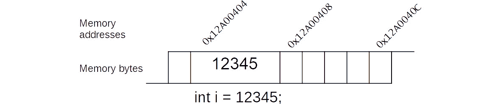
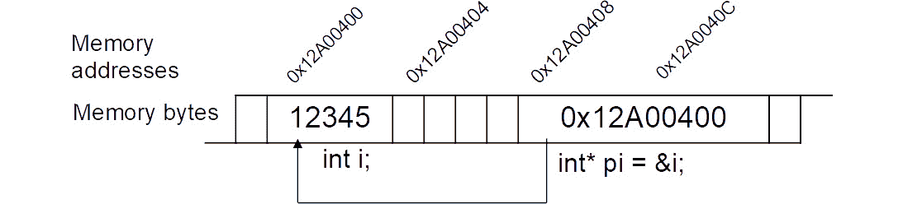
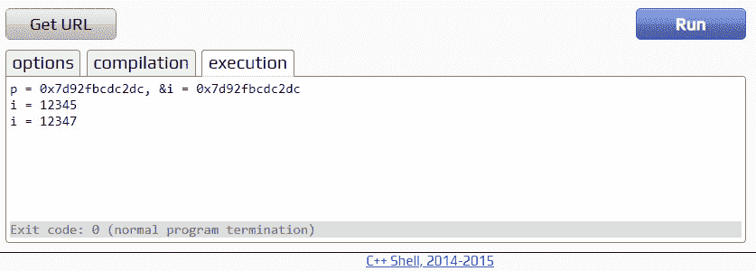

# 5.并发：多线程并行和异步代码

概述

C#和.NET 提供了一种高效的并发代码运行方式，使得执行复杂且通常耗时的操作变得简单。在本章中，您将探索各种可用的模式，从使用`Task`工厂方法创建任务到使用连续性将任务链接在一起，然后转向`async`/`await`关键字，这些关键字极大地简化了这样的代码。通过本章的学习，您将了解到 C#如何执行并发代码，并且通常比单线程应用程序产生结果更快。

# 介绍

并发是一个泛化的术语，用来描述软件同时执行多项任务的能力。通过利用并发的能力，您可以通过将 CPU 密集型活动从主 UI 线程中卸载，提供更加响应的用户界面。在服务器端，通过利用多处理器和多核架构的现代处理能力，可以通过并行处理操作来实现可伸缩性。

多线程是一种并发的形式，其中多个线程用于执行操作。通常通过创建许多`Thread`实例并在它们之间协调操作来实现。它被视为一种传统的实现方式，大部分已经被并行和异步编程所取代；您可能会在旧项目中找到它的使用。

并行编程是一种多线程的类别，其中类似的操作是独立运行的。通常，相同的操作会使用多个循环重复进行，其中操作的参数或目标本身会随着迭代而变化。.NET 提供了库，可以屏蔽开发人员对线程创建的低级复杂性。短语“尴尬并行”通常用来描述一个活动，该活动需要很少的额外工作才能被分解成一组可以并行运行的任务，通常在子任务之间几乎没有交互。并行编程的一个例子可能是计算文件夹中每个文本文件中找到的单词数量。打开文件并扫描单词的工作可以被分解成并行任务。每个任务执行相同的代码行，但给定不同的文本文件来处理。

异步编程是一种更近期的并发形式，其中一项操作一旦开始，将在将来的某个时刻完成，调用代码可以继续执行其他操作。这种完成通常被称为`Task<>`等效。在 C#和.NET 中，异步编程已成为实现并发操作的首选方式。

异步编程的常见应用是在需要初始化和调度多个运行缓慢或昂贵的依赖项之前，调用最终步骤的情况下。这些依赖项在准备好被使用之前，应该只在所有或部分依赖项准备就绪时才被调用。例如，移动徒步应用程序可能需要等待可靠的 GPS 卫星信号、计划的导航路线和心率监测服务准备就绪，然后用户才能安全地开始徒步旅行。每个不同的步骤都将使用专用任务进行初始化。

异步编程的另一个非常常见的用例发生在 UI 应用程序中，例如，将客户的订单保存到数据库可能需要 5-10 秒才能完成。这可能涉及验证订单，打开到远程服务器或数据库的连接，打包并以可以通过网络传输的格式发送订单，然后等待确认客户的订单已成功存储在数据库中。在单线程应用程序中，这将需要更长的时间，用户很快就会注意到这种延迟。应用程序会变得无响应，直到操作完成。在这种情况下，用户可能会认为应用程序已崩溃，并尝试关闭它。这不是一个理想的用户体验。

通过使用异步代码执行任何慢速操作的方式可以缓解这些问题，每个慢速操作都使用专用任务。这些任务可以选择在进展时提供反馈，UI 的主线程可以用来通知用户。总的来说，操作应该更快地完成，从而使用户可以继续与应用程序进行交互。在现代应用程序中，用户已经习惯了这种操作方法。事实上，许多 UI 指南建议，如果一个操作可能需要超过几秒钟才能完成，那么应该使用异步代码来执行。

请注意，当代码执行时，无论是同步还是异步代码，它都是在`Thread`实例的上下文中运行的。在异步代码的情况下，这个`Thread`实例是由.NET 调度程序从可用线程池中选择的。

`Thread`类有各种属性，但其中最有用的之一是`ManagedThreadId`，这将在本章中广泛使用。这个整数值用于唯一标识进程中的线程。通过检查`Thread.ManagedThreadId`，您可以确定正在使用多个线程实例。这可以通过在代码中访问`Thread`实例，使用静态的`Thread.CurrentThread`方法来完成。

例如，如果您启动了五个长时间运行的任务，并检查了每个`Thread.ManagedThreadId`，您会观察到五个唯一的 ID，可能编号为 2、3、4、5 和 6。在大多数情况下，ID 号为 1 的线程是进程的主线程，在进程首次启动时创建。

跟踪线程 ID 可能非常有用，特别是当您需要执行耗时操作时。正如您所见，使用并发编程，多个操作可以同时执行，而不是使用传统的单线程方法，其中一个操作必须在后续操作开始之前完成。

在物理世界中，考虑建造一条穿过山的火车隧道的情况。如果两个团队从山的两侧开始挖隧道，朝着彼此挖掘，那么整个过程会快得多。这两个团队可以独立工作；一个团队在一侧遇到的任何问题不应该对另一侧的团队产生不利影响。一旦两侧都完成了挖隧道的工作，就应该有一个单一的隧道，然后可以继续进行下一个任务，比如铺设火车线路。

下一节将介绍使用 C# `Task`类，它允许您同时执行代码块，并且彼此独立。再次考虑 UI 应用程序的例子，客户的订单需要保存到数据库。对此，您有两个选项：

选项 1 是创建一个 C# `Task`，按顺序执行每个步骤：

+   验证订单。

+   连接到服务器。

+   发送请求。

+   等待响应。

选项 2 是为每个步骤创建一个 C# `Task`，在可能的情况下并行执行每个步骤。

这两种选项都可以实现相同的最终结果，即释放 UI 的主线程以响应用户交互。选项一可能会慢一些完成，但好处是这将需要更简单的代码。然而，选项二将是首选，因为您正在卸载多个步骤，所以它应该更快完成。尽管如此，这可能涉及额外的复杂性，因为您可能需要在每个单独的任务完成时进行协调。

在接下来的几节中，您将首先看一下如何处理选项一，即使用单个`Task`来运行代码块，然后再转向选项二的复杂性，其中使用和协调多个任务。

# 使用任务运行异步代码

`Task`类用于异步执行代码块。它的使用在某种程度上已被新的`async`和`await`关键字所取代，但本节将介绍创建任务的基础知识，因为它们在较大或成熟的 C#应用程序中往往是无处不在的，并且构成了`async`/`await`关键字的基础。

在 C#中，有三种使用`Task`类及其泛型等效`Task<T>`来安排异步代码运行的方法。

## 创建一个新的任务

您将从最简单的形式开始，执行一个操作但不将结果返回给调用方。您可以通过调用任何`Task`构造函数并传递基于`Action`的委托来声明一个`Task`实例。这个委托包含将来某个时间执行的实际代码。许多构造函数重载允许取消令牌和`Task`运行。

一些常用的构造函数如下：

+   `public Task(Action action)`: `Action`委托表示要运行的代码主体。

+   `public Task(Action action, CancellationToken cancellationToken)`: `CancellationToken`参数可用作中断正在运行的代码的方法。通常情况下，这是在调用方已提供了一种请求停止操作的方式时使用的，例如添加一个用户可以按下的`Cancel`按钮。

+   `public Task(Action action, TaskCreationOptions creationOptions)`: `TaskCreationOptions`提供了一种控制`Task`运行方式的方法，允许您向调度程序提供关于某个`Task`可能需要额外时间完成的提示。这在运行相关任务时会有所帮助。

以下是最常用的`Task`属性：

+   `public bool IsCompleted { get; }`: 如果`Task`已完成（完成并不表示成功），则返回`true`。

+   `public bool IsCompletedSuccessfully { get; }`: 如果`Task`成功完成，则返回`true`。

+   `public bool IsCanceled { get; }`: 如果`Task`在完成之前被取消，则返回`true`。

+   `public bool IsFaulted { get; }`: 如果`Task`在完成之前抛出了未处理的异常，则返回`true`。

+   `public TaskStatus Status { get; }`: 返回任务当前状态的指示器，例如`Canceled`、`Running`或`WaitingToRun`。

+   `public AggregateException Exception { get; }`: 返回引起`Task`过早结束的异常（如果有的话）。

请注意，`Action`委托中的代码直到调用`Start()`方法之后的某个时间才会执行。这可能是在几毫秒之后，并由.NET 调度程序确定。

从这里开始，通过创建一个新的 VS Code 控制台应用程序，添加一个名为`Logger`的实用类，您将在以后的练习和示例中使用它。它将用于将消息记录到控制台，以及当前时间和当前线程的`ManagedThreadId`。

此操作的步骤如下：

1.  切换到您的源文件夹。

1.  创建一个名为`Chapter05`的新控制台应用程序项目，通过运行以下命令来完成：

```cpp
    source>dotnet new console -o Chapter05
    ```

1.  将`Class1.cs`文件重命名为`Logger.cs`并删除所有模板代码。

1.  确保包含`System`和`System.Threading`命名空间。`System.Threading`包含基于`Threading`的类：

```cpp
    using System;
    using System.Threading;
    namespace Chapter05
    {
    ```

1.  将`Logger`类标记为静态，以便无需创建实例即可使用：

```cpp
        public static class Logger
        {
    ```

注意

如果您使用`Chapter05`命名空间，那么`Logger`类将可供示例和活动中的代码访问，前提是它们也使用`Chapter05`命名空间。如果您更喜欢为每个示例和练习创建一个文件夹，那么您应该将`Logger.cs`文件复制到您创建的每个文件夹中。

1.  现在声明一个名为`Log`的`static`方法，它接受一个`string message`参数：

```cpp
            public static void Log(string message)
            {
                Console.WriteLine($"{DateTime.Now:T} [{Thread.CurrentThread.ManagedThreadId:00}] {message}");
            }
        }
    }
    ```

当调用时，这将使用`WriteLine`方法向控制台窗口记录消息。在前面的片段中，C#中的字符串插值功能使用`$`符号定义字符串；这里，`:T`将当前时间(`DateTime.Now`)格式化为时间格式的字符串，`：00`用于包含带有前导 0 的`Thread.ManagedThreadId`。

因此，您已经创建了将在本章的其余部分中使用的静态 Logger 类。

注意

您可以在[`packt.link/cg6c5`](https://packt.link/cg6c5)找到此示例使用的代码。

在下一个示例中，您将使用`Logger`类在线程即将启动和完成时记录详细信息。

1.  首先添加一个名为`TaskExamples.cs`的新类文件：

```cpp
    using System;
    using System.Threading;
    using System.Threading.Tasks;
    namespace Chapter05.Examples
    {
        class TaskExamples
        {
    ```

1.  `Main`入口点将记录`taskA`正在被创建：

```cpp
            public static void Main()
            {
                Logger.Log("Creating taskA");
    ```

1.  接下来，添加以下代码：

```cpp
                var taskA = new Task(() =>
                {
                    Logger.Log("Inside taskA");
                    Thread.Sleep(TimeSpan.FromSeconds(5D));
                    Logger.Log("Leaving taskA");
                });
    ```

在这里，最简单的`Task`构造函数传递了一个`Action` lambda 语句，这是您要执行的实际目标代码。目标代码将消息`Inside taskA`写入控制台。它使用`Thread.Sleep`暂停五秒钟来阻塞当前线程，从而模拟长时间运行的活动，最后将`Leaving taskA`写入控制台。

1.  现在您已经创建了`taskA`，请确认它只会在调用`Start()`方法时调用其目标代码。您将通过在方法调用之前和之后立即记录消息来实现这一点：

```cpp
                Logger.Log($"Starting taskA. Status={taskA.Status}");
                taskA.Start();
                Logger.Log($"Started taskA. Status={taskA.Status}");
                Console.ReadLine();
            }
        }
    } 
    ```

1.  将`Logger.cs`文件的内容复制到与`TaskExamples.cs`示例相同的文件夹中。

1.  接下来运行控制台应用程序以产生以下输出：

```cpp
    10:47:34 [01] Creating taskA
    10:47:34 [01] Starting taskA. Status=Created
    10:47:34 [01] Started taskA. Status=WaitingToRun
    10:47:34 [03] Inside taskA
    10:47:39 [03] Leaving taskA
    ```

请注意，即使您调用了`Start`，任务的状态仍为`WaitingToRun`。这是因为您要求.NET 调度程序安排代码运行 - 也就是说，将其添加到待处理操作队列中。根据您的应用程序与其他任务的繁忙程度，它可能不会在您调用`Start`后立即运行。

注意

您可以在[`packt.link/DHxt3`](https://packt.link/DHxt3)找到此示例使用的代码。

在 C#的早期版本中，这是直接创建和启动`Task`对象的主要方法。现在不再推荐使用，仅在此包含，因为您可能会发现它在旧代码中使用。它的使用已被`Task.Run`或`Task.Factory.StartNew`静态工厂方法取代，这些方法为最常见的使用场景提供了更简单的接口。

### 使用 Task.Factory.StartNew

静态方法`Task.Factory.StartNew`包含各种重载，使创建和配置`Task`更容易。请注意方法的命名为`StartNew`。它创建一个`Task`并自动为您启动方法。.NET 团队认识到，在首次创建后不立即启动`Task`几乎没有价值。通常，您希望`Task`立即开始执行其操作。

第一个参数是熟悉的`Action`委托，用于执行，后跟可选的取消令牌、创建选项和`TaskScheduler`实例。

以下是一些常见的重载：

+   `Task.Factory.StartNew(Action action)`: `Action`委托包含要执行的代码，正如您之前所见。

+   `Task.Factory.StartNew(Action action, CancellationToken cancellationToken)`: 这里，`CancellationToken`协调任务的取消。

+   `Task.Factory.StartNew(Action<object> action, object state, CancellationToken cancellationToken, TaskCreationOptions creationOptions, TaskScheduler scheduler)`: `TaskScheduler`参数允许您指定负责排队任务的低级调度程序类型。这个选项很少使用。

考虑以下代码，它使用了第一个和最简单的重载：

```cpp
var taskB = Task.Factory.StartNew((() =>
{
  Logger.Log("Inside taskB");
  Thread.Sleep(TimeSpan.FromSeconds(3D));
  Logger.Log("Leaving taskB");
}));
Logger.Log($"Started taskB. Status={taskB.Status}");
Console.ReadLine();
```

运行此代码将产生以下输出：

```cpp
21:37:42 [01] Started taskB. Status=WaitingToRun
21:37:42 [03] Inside taskB
21:37:45 [03] Leaving taskB
```

从输出中可以看出，这段代码实现了与创建`Task`相同的结果，但更加简洁。需要考虑的主要问题是，`Task.Factory.StartNew`是为了让创建任务更容易而添加到 C#中的。最好使用`StartNew`而不是直接创建任务。

注意

术语**工厂**经常在软件开发中用来表示帮助创建对象的方法。

`Task.Factory.StartNew`提供了一种高度可配置的启动任务的方式，但实际上，很少使用许多重载，并且需要传递许多额外的参数。因此，`Task.Factory.StartNew`本身也已经在新的`Task.Run`静态方法的支持下变得有些过时。不过，由于您可能会在传统的 C#应用程序中看到它的使用，因此还是简要介绍了`Task.Factory.StartNew`。

### 使用`Task.Run`

备用和首选的`static`工厂方法`Task.Run`有各种重载，并且后来添加到.NET 中，以简化和快捷处理最常见的任务场景。对于较新的代码来说，最好使用`Task.Run`来创建已启动的任务，因为需要更少的参数来实现常见的线程操作。

一些常见的重载如下：

+   `public static Task Run(Action action)`: 包含要执行的`Action`委托代码。

+   `public static Task Run(Action action, CancellationToken cancellationToken)`: 还包含用于协调任务取消的取消令牌。

例如，考虑以下代码：

```cpp
var taskC = Task.Run(() =>
{
  Logger.Log("Inside taskC");
  Thread.Sleep(TimeSpan.FromSeconds(1D));
  Logger.Log("Leaving taskC");
  });
Logger.Log($"Started taskC. Status={taskC.Status}");
Console.ReadLine();
```

运行此代码将产生以下输出：

```cpp
21:40:27 [03] Inside taskC
21:40:27 [01] Started taskC. Status=WaitingToRun
21:40:28 [03] Leaving taskC
```

如您所见，输出与前两个代码片段的输出非常相似。每个都等待比前一个更短的时间，然后相关的`Action`委托完成。

主要区别在于直接创建`Task`实例是一种过时的做法，但允许您在显式调用`Start`方法之前添加额外的日志调用。这是直接创建`Task`的唯一好处，这并不是一个特别有说服力的理由。

运行所有三个示例将产生以下结果：

```cpp
21:45:52 [01] Creating taskA
21:45:52 [01] Starting taskA. Status=Created
21:45:52 [01] Started taskA. Status=WaitingToRun
21:45:52 [01] Started taskB. Status=WaitingToRun
21:45:52 [01] Started taskC. Status=WaitingToRun
21:45:52 [04] Inside taskB
21:45:52 [03] Inside taskA
21:45:52 [05] Inside taskC
21:45:53 [05] Leaving taskC
21:45:55 [04] Leaving taskB
21:45:57 [03] Leaving taskA
```

您可以看到记录了各种`ManagedThreadIds`，并且`taskC`在`taskB`之前完成，`taskB`在`taskA`之前完成，这是由于在每种情况下`Thread.Sleep`调用中指定的秒数递减。

最好优先考虑这两种静态方法中的一种，但在安排新任务时应该使用哪一个呢？`Task.Run`应该用于`Task.Run`向下延迟到`Task.Factory.StartNew`。

`Task.Factory.StartNew`应该用于具有更高级要求的情况，例如通过使用接受`TaskScheduler`实例的任何重载来定义任务排队的位置，但实际上，这种情况很少发生。

注意

您可以在以下网址找到有关`Task.Run`和`Task.Factory.StartNew`的更多信息：[`devblogs.microsoft.com/pfxteam/task-run-vs-task-factory-startnew/`](https://devblogs.microsoft.com/pfxteam/task-run-vs-task-factory-startnew/) 和 [`blog.stephencleary.com/2013/08/startnew-is-dangerous.html`](https://blog.stephencleary.com/2013/08/startnew-is-dangerous.html)。

到目前为止，您已经看到了如何启动小任务，每个任务在完成之前都有一段短暂的延迟。这些延迟可以模拟代码访问慢速网络连接或运行复杂计算所造成的效果。在接下来的练习中，您将通过启动多个任务来扩展您对`Task.Run`的了解，这些任务将运行越来越长的数字计算。

这是一个例子，展示了如何启动潜在复杂的任务并允许它们独立完成。请注意，在传统的同步实现中，这样的计算吞吐量会受到严重限制，因为需要等待一个操作完成后才能开始下一个操作。现在是时候通过练习来实践你所学到的知识了。

## 练习 5.01：使用任务执行多个运行缓慢的计算

在这个练习中，你将创建一个递归函数`Fibonacci`，它调用自身两次来计算累积值。这是一个潜在的运行缓慢的代码的例子，而不是使用`Thread.Sleep`来模拟一个缓慢的调用。你将创建一个控制台应用程序，重复提示输入一个数字。这个数字越大，每个任务计算和输出结果所花费的时间就越长。以下步骤将帮助你完成这个练习：

1.  在`Chapter05`文件夹中，添加一个名为`Exercises`的新文件夹。在该文件夹内，添加一个名为`Exercise01`的新文件夹。你应该有如下的文件夹结构：`Chapter05\Exercises\Exercise01`。

1.  创建一个名为`Program.cs`的新文件。

1.  添加递归的`Fibonacci`函数如下。如果请求的迭代次数小于或等于`2`，可以通过返回`1`来节省一些处理时间：

```cpp
    using System;
    using System.Globalization;
    using System.Threading;
    using System.Threading.Tasks;
    namespace Chapter05.Exercises.Exercise01
    {
      class Program
      {
            private static long Fibonacci(int n)
            {
                if (n <= 2L)
                    return 1L;
                return Fibonacci(n - 1) + Fibonacci(n - 2);
            }
    ```

1.  在控制台应用程序中添加`static Main`入口点，并使用`do`循环提示输入一个数字。

1.  如果用户输入一个字符串，使用`int.TryParse`将其转换为整数：

```cpp
            public static void Main()
            {
                string input;
                do
                {
                    Console.WriteLine("Enter number:");
                    input = Console.ReadLine();
                    if (!string.IsNullOrEmpty(input) &&                     int.TryParse(input, NumberStyles.Any, CultureInfo.CurrentCulture, out var number))
    ```

1.  定义一个 lambda 语句，使用`DateTime.Now`捕获当前时间，调用运行缓慢的`Fibonacci`函数，并记录运行所花费的时间：

```cpp
                     {
                        Task.Run(() =>
                        {
                            var now = DateTime.Now;
                            var fib = Fibonacci(number);
                            var duration = DateTime.Now.Subtract(now);
                            Logger.Log($"Fibonacci {number:N0} = {fib:N0} (elapsed time: {duration.TotalSeconds:N0} secs)");
                        });
                    } 
    ```

Lambda 被传递给`Task.Run`，并将很快由`Task.Run`启动，从而释放`do-while`循环以提示输入另一个数字。

1.  当输入空值时，程序将退出循环：

```cpp
                 } while (input != string.Empty);
            }
        }
    }
    ```

1.  运行控制台应用程序时，先输入数字`1`，然后输入`2`。由于这些是非常快速的计算，它们都在一秒内返回。

```cpp
    Enter number:1
    Enter number:2
    11:25:11 [04] Fibonacci 1 = 1 (elapsed time: 0 secs)
    Enter number:45
    11:25:12 [04] Fibonacci 2 = 1 (elapsed time: 0 secs)
    Enter number:44
    Enter number:43
    Enter number:42
    Enter number:41
    Enter number:40
    Enter number:10
    11:25:35 [08] Fibonacci 41 = 165,580,141 (elapsed time: 4 secs)
    11:25:35 [09] Fibonacci 40 = 102,334,155 (elapsed time: 2 secs)
    11:25:36 [07] Fibonacci 42 = 267,914,296 (elapsed time: 6 secs)
    Enter number: 39
    11:25:36 [09] Fibonacci 10 = 55 (elapsed time: 0 secs)
    11:25:37 [05] Fibonacci 43 = 433,494,437 (elapsed time: 9 secs)
    11:25:38 [06] Fibonacci 44 = 701,408,733 (elapsed time: 16 secs)
    Enter number:38
    11:25:44 [06] Fibonacci 38 = 39,088,169 (elapsed time: 1 secs)
    11:25:44 [05] Fibonacci 39 = 63,245,986 (elapsed time: 2 secs)
    11:25:48 [04] Fibonacci 45 = 1,134,903,170 (elapsed time: 27 secs)
    ```

注意`ThreadId`对于`1`和`2`都是`[04]`。这表明`Task.Run`使用相同的线程进行了两次迭代。当输入`2`时，之前的计算已经完成。因此.NET 决定再次重用线程`04`。对于值`45`也是一样的，尽管它是第三次请求，但完成所花费的时间是`27`秒。

你可以看到，输入大于`40`的值会导致经过的时间急剧增加（每增加一个，所花费的时间几乎翻倍）。从较高的数字开始向下降，你会发现`41`、`40`和`42`的计算都在`44`和`43`之前完成，尽管它们在类似的时间开始。在一些情况下，相同的线程会出现两次。同样，这是.NET 重新使用空闲线程来运行任务的动作。

注意

你可以在[`packt.link/YLYd4`](https://packt.link/YLYd4)找到本练习使用的代码。

## 协调任务

在之前的*练习 5.01*中，你看到了如何启动多个任务并让它们在没有任何交互的情况下完成。这样的一个场景是一个需要搜索文件夹查找图像文件并给每个找到的图像文件添加版权水印的过程。该过程可以使用多个任务，每个任务处理一个不同的文件。不需要协调每个任务及其生成的图像。

相反，通常会启动各种长时间运行的任务，只有在一些或所有任务完成时才继续；也许你有一系列需要启动的复杂计算，只有在其他计算完成后才能执行最终计算。

在*介绍*部分提到，一个徒步应用程序在安全使用前需要 GPS 卫星信号、导航路线和心率监测器。每个这些依赖关系都可以使用`Task`来创建，只有当它们都发出信号表明已准备好使用时，应用程序才应允许用户开始他们的路线。

在接下来的部分，您将了解 C#提供的协调任务的各种方式。例如，您可能需要启动许多独立的任务运行，每个任务运行一个复杂的计算，并且需要在所有先前的任务完成后计算出最终值。您可能还想要从多个网站开始下载数据，但希望取消那些下载时间太长的下载。下一节将涵盖这种情况。

### 等待任务完成

`Task.Wait`可以用来等待单个任务完成。如果您正在处理多个任务，那么静态的`Task.WaitAll`方法将等待所有任务完成。`WaitAll`重载允许传入取消和超时选项，大多数都返回一个布尔值来指示成功或失败，如下列表所示：

+   `public static bool WaitAll(Task[] tasks, TimeSpan timeout)`: 这里传入一个`Task`数组来等待。如果`TimeSpan`允许特定单位（如小时、分钟和秒）来表示，则返回`true`。

+   `public static void WaitAll(Task[] tasks, CancellationToken cancellationToken)`: 这里传入一个`Task`数组来等待，并且一个可用于协调任务取消的取消标记。

+   `public static bool WaitAll(Task[] tasks, int millisecondsTimeout, CancellationToken cancellationToken)`: 这里传入一个`Task`数组来等待，并且一个可用于协调任务取消的取消标记。`millisecondsTimeout`指定等待所有任务完成的毫秒数。

+   `public static void WaitAll(params Task[] tasks)`: 这允许等待一个`Task`数组。

如果您需要等待任务列表中的任何任务完成，那么您可以使用`Task.WaitAny`。所有的`WaitAny`重载都会返回第一个完成的任务的索引号，如果发生超时（等待的最长时间），则返回`-1`。

例如，如果您传入一个包含五个 Task 项目的数组，并且该数组中的最后一个 Task 完成，那么将返回值四（数组索引始终从零开始计数）。

+   `public static int WaitAny(Task[] tasks, int millisecondsTimeout, CancellationToken cancellationToken)`: 这里传入一个`Task`数组来等待，等待任何`Task`完成的毫秒数，以及一个可用于协调任务取消的取消标记。

+   `public static int WaitAny(params Task[] tasks)`: 这里传入一个`Task`数组来等待任何`Task`完成。

+   `public static int WaitAny(Task[] tasks, int millisecondsTimeout)`: 在这里，您传入等待任何任务完成的毫秒数。

+   `public static int WaitAny(Task[] tasks, CancellationToken cancellationToken) CancellationToken`: 这里传入一个可用于协调任务取消的取消标记。

+   `public static int WaitAny(Task[] tasks, TimeSpan timeout)`: 这里传入最大等待时间段。

调用`Wait`、`WaitAll`或`WaitAny`将阻塞当前线程，这可能会抵消使用任务的好处。因此，最好从可等待的任务中调用这些方法，例如通过`Task.Run`，如下例所示。

代码使用 lambda 语句创建了`outerTask`，它本身创建了两个内部任务`inner1`和`inner2`。使用`WaitAny`来获取`inner2`将首先完成的索引，因为它暂停的时间较短，所以结果索引值将是`1`：

```cpp
TaskWaitAnyExample.cs
1    var outerTask = Task.Run( () =>
2    {
3        Logger.Log("Inside outerTask");
4        var inner1 = Task.Run(() =>
5        {
6            Logger.Log("Inside inner1");
7            Thread.Sleep(TimeSpan.FromSeconds(3D));
8        });
9        var inner2 = Task.Run(() =>
10        {
11            Logger.Log("Inside inner2");
12            Thread.Sleep(TimeSpan.FromSeconds(2D));
13        });
14
15        Logger.Log("Calling WaitAny on outerTask");
You can find the complete code here: http://packt.link/CicWk.
```

当代码运行时，会产生以下输出：

```cpp
15:47:43 [04] Inside outerTask
15:47:43 [01] Press ENTER
15:47:44 [04] Calling WaitAny on outerTask
15:47:44 [05] Inside inner1
15:47:44 [06] Inside inner2
15:47:46 [04] Waitany index=1
```

应用程序保持响应，因为你在一个`Task`内部调用了`WaitAny`。你没有阻塞应用程序的主线程。正如你所看到的，线程 ID`01`已经记录了这条消息：`15:47:43 [01] Press ENTER`。

这种模式可以用在需要启动并忘记任务的情况下。例如，你可能想要将信息消息记录到数据库或日志文件中，但如果任一任务未能完成，程序的流程并不会改变，这并不是必要的。

从启动并忘记任务的常见进展是那些需要在一定时间限制内等待多个任务完成的情况。下一个练习将涵盖这种情况。

## 练习 5.02：在一定时间内等待多个任务完成

在这个练习中，你将启动三个长时间运行的任务，并在一定随机选择的时间段内决定下一步的行动。

在这里，你将看到使用泛型`Task<T>`类。`Task<T>`类包括一个`Value`属性，可以用来访问`Task`的结果（在本练习中，它是基于字符串的泛型，所以`Value`将是字符串类型）。在这里，你不会使用`Value`属性，因为这个练习的目的是展示 void 和泛型任务可以一起等待。执行以下步骤完成这个练习：

1.  向控制台应用程序添加主入口点：

```cpp
    using System;
    using System.Threading;
    using System.Threading.Tasks;
    namespace Chapter05.Exercises.Exercise02
    {
        class Program
        {
            public static void Main()
            {
                Logger.Log("Starting");
    ```

1.  声明一个名为`taskA`的变量，传递给`Task.Run`一个暂停当前线程`5`秒的 lambda：

```cpp
                var taskA = Task.Run( () =>
                {
                    Logger.Log("Inside TaskA");
                    Thread.Sleep(TimeSpan.FromSeconds(5));
                    Logger.Log("Leaving TaskA");
                    return "All done A";
                });
    ```

1.  使用方法组语法创建另外两个任务：

```cpp
                var taskB = Task.Run(TaskBActivity);
                var taskC = Task.Run(TaskCActivity);
    ```

正如你可能记得的，如果编译器可以确定零个或单个参数方法所需的参数类型，那么可以使用这种更短的语法。

1.  现在随机选择一个最大超时时间（以秒为单位）。这意味着两个任务中的任何一个在超时期限到期之前都可能**不**完成：

```cpp
                var timeout = TimeSpan.FromSeconds(new Random().Next(1, 10));
                Logger.Log($"Waiting max {timeout.TotalSeconds} seconds...");
    ```

请注意，每个任务仍将完成运行，因为你没有添加一个机制来停止执行`Task.Run` `Action` lambda 体内的代码。

1.  调用`WaitAll`，传入三个任务和`timeout`时间：

```cpp
                var allDone = Task.WaitAll(new[] {taskA, taskB, taskC}, timeout);
                Logger.Log($"AllDone={allDone}: TaskA={taskA.Status}, TaskB={taskB.Status}, TaskC={taskC.Status}");
                Console.WriteLine("Press ENTER to quit");
                Console.ReadLine();
            }
    ```

如果所有任务都及时完成，这将返回`true`。然后，你将记录所有任务的状态，并等待按下`Enter`键退出应用程序。

1.  最后，通过添加两个运行缓慢的`Action`方法来完成：

```cpp
            private static string TaskBActivity()
            {
                Logger.Log($"Inside {nameof(TaskBActivity)}");
                Thread.Sleep(TimeSpan.FromSeconds(2));
                Logger.Log($"Leaving {nameof(TaskBActivity)}");
                return "";
            }
            private static void TaskCActivity()
            {
                Logger.Log($"Inside {nameof(TaskCActivity)}");
                Thread.Sleep(TimeSpan.FromSeconds(1));
                Logger.Log($"Leaving {nameof(TaskCActivity)}");
            }
        }
    }
    ```

每个任务在开始和离开任务后都会记录一条消息，几秒钟后。有用的`nameof`语句用于包含方法的名称，以提供额外的日志信息。通常，检查日志文件以查看已访问方法的名称是有用的，而不是将其名称硬编码为字面字符串。

1.  运行代码后，你将看到以下输出：

```cpp
    14:46:28 [01] Starting
    14:46:28 [04] Inside TaskBActivity
    14:46:28 [05] Inside TaskCActivity
    14:46:28 [06] Inside TaskA
    14:46:28 [01] Waiting max 7 seconds...
    14:46:29 [05] Leaving TaskCActivity
    14:46:30 [04] Leaving TaskBActivity
    14:46:33 [06] Leaving TaskA
    14:46:33 [01] AllDone=True: TaskA=RanToCompletion, TaskB=RanToCompletion, TaskC=RanToCompletion
    Press ENTER to quit
    ```

在运行代码时，运行时随机选择了七秒的超时时间。这使得所有任务都及时完成，因此`WaitAll`返回`true`，此时所有任务都处于`RanToCompletion`状态。请注意，方括号中的线程 ID 对于所有三个任务都是不同的。

1.  再次运行代码：

```cpp
    14:48:20 [01] Starting
    14:48:20 [01] Waiting max 2 seconds...
    14:48:20 [05] Inside TaskCActivity
    14:48:20 [06] Inside TaskA
    14:48:20 [04] Inside TaskBActivity
    14:48:21 [05] Leaving TaskCActivity
    14:48:22 [04] Leaving TaskBActivity
    14:48:22 [01] AllDone=False: TaskA=Running, TaskB=Running, TaskC=RanToCompletion
    Press ENTER to quit
    14:48:25 [06] Leaving TaskA
    ```

这次运行时选择了两秒的最大等待时间，因此`WaitAll`调用超时，返回`false`。

你可能已经注意到，输出中有时会出现`Inside TaskBActivity`在`Inside TaskCActivity`之前。这展示了.NET 调度程序的排队机制。当你调用`Task.Run`时，你要求调度程序将其添加到其队列中。在你调用`Task.Run`和它调用你的 lambda 之间可能只有几毫秒的时间，但这取决于你最近添加到队列中的任务数量；待处理任务的数量可能会增加这段时间。

有趣的是，输出显示`Leaving TaskBActivity`，但`taskB`的状态在`WaitAll`完成等待后仍然是`Running`。这表明在超时任务的状态发生变化时，有时可能会有非常轻微的延迟。

按下`Enter`键后的三秒钟，将记录`Leaving TaskA`。这表明任何超时任务中的`Action`将继续运行，.NET 不会为您停止它。

注意

您可以在[`packt.link/5lH0o`](https://packt.link/5lH0o)找到此练习使用的代码。

## 继续任务

到目前为止，您已经创建了彼此独立的任务，但如果您需要使用前一个任务的结果继续任务怎么办？而不是通过调用`Wait`或访问`Result`属性来阻塞当前线程，可以使用`Task`的`ContinueWith`方法来实现这一点。

这些方法返回一个新的任务，称为**继续**任务，或更简单地说，一个继续任务，它可以消耗前一个任务或前置任务的结果。

与标准任务一样，它们不会阻塞调用者线程。有多个可用的`ContinueWith`重载，允许进行广泛的自定义。以下是一些常用的重载：

+   `public Task ContinueWith(Action<Task<TResult>> continuationAction)`: 这定义了一个基于泛型`Action<T>`的任务，在前一个任务完成时运行。

+   `public Task ContinueWith(Action<Task<TResult>> continuationAction, CancellationToken cancellationToken)`: 这有一个要运行的任务和一个可用于协调任务取消的取消标记。

+   `public Task ContinueWith(Action<Task<TResult>> continuationAction, TaskScheduler scheduler)`: 这也有一个要运行的任务和一个低级的`TaskScheduler`，可以用来排队任务。

+   `public Task ContinueWith(Action<Task<TResult>> continuationAction, TaskContinuationOptions continuationOptions)`: 要运行的任务，任务的行为由`TaskContinuationOptions`指定。例如，指定`NotOnCanceled`表示如果前一个任务被取消，则**不**希望调用继续任务。

继续任务具有初始的`WaitingForActivation`状态。.NET Framework 将在前置任务完成后执行此任务。重要的是要注意，您不需要启动一个继续任务，尝试这样做将导致异常。

以下示例模拟调用长时间运行的函数`GetStockPrice`（这可能是某种需要几秒钟才能返回的网络服务或数据库调用）：

```cpp
ContinuationExamples.cs
1    class ContinuationExamples
2    {
3        public static void Main()
4        {
5            Logger.Log("Start...");
6            Task.Run(GetStockPrice)
7                .ContinueWith(prev =>
8                {
9                    Logger.Log($"GetPrice returned {prev.Result:N2}, status={prev.Status}");
10                });
11
12           Console.ReadLine();
13        }
14
You can find the complete code here: http://packt.link/rpNcx.
```

对`GetStockPrice`的调用返回一个`double`，这导致将通用的`Task<double>`作为继续任务传递（见突出显示的部分）。`prev`参数是一个泛型的`Action`类型`Task<double>`，允许您访问前置任务及其`Result`以检索从`GetStockPrice`返回的值。

如果将鼠标悬停在`ContinueWith`方法上，将看到其 IntelliSense 描述如下：



图 5.1：ContinueWith 方法签名

注意

`ContinueWith`方法有各种选项，可用于微调行为，您可以从[`docs.microsoft.com/en-us/dotnet/api/system.threading.tasks.taskcontinuationoptions`](https://docs.microsoft.com/en-us/dotnet/api/system.threading.tasks.taskcontinuationoptions)获取更多详细信息。

运行示例会产生类似以下的输出：

```cpp
09:30:45 [01] Start...
09:30:45 [03] Inside GetStockPrice
09:30:50 [04] GetPrice returned 76.44, status=RanToCompletion
```

在输出中，线程`[01]`代表控制台的主线程。调用`GetStockPrice`的任务由线程 ID`[03]`执行，但继续任务是使用不同的线程，线程(`[04]`)执行的。

注意

您可以在[`packt.link/rpNcx`](https://packt.link/rpNcx)找到此示例使用的代码。

在不同的线程上运行可能不是问题，但如果您正在处理 UWP、WPF 或 WinForms UI 应用程序，那么这肯定会成为一个问题，因为在这些应用程序中，使用主 UI 线程更新 UI 元素是至关重要的（除非您使用绑定语义）。

值得注意的是，`TaskContinuationOptions.OnlyOnRanToCompletion`选项可用于确保只有在前置任务首先完成时才运行连续任务。例如，您可以创建一个从数据库中获取客户订单的`Task`，然后使用连续任务来计算平均订单价值。如果前一个任务失败或被用户取消，则没有必要浪费处理能力来计算平均值，如果用户不再关心结果。

注意

`ContinueWith`方法有各种选项，可用于微调行为，您可以查看[`docs.microsoft.com/en-us/dotnet/api/system.threading.tasks.taskcontinuationoptions`](https://docs.microsoft.com/en-us/dotnet/api/system.threading.tasks.taskcontinuationoptions)获取更多详细信息。

如果访问`AggregateException`上的`Task<T> Result`属性被抛出。稍后将更详细地介绍这一点。

### 使用 Task.WhenAll 和 Task.WhenAny 处理多个任务

您已经看到了如何使用单个任务来创建一个连续任务，但如果您有多个任务并且需要在任何或所有先前的任务完成时继续进行最终操作呢？

早些时候，使用`Task.WaitAny`和`Task.WaitAll`方法等待任务完成，但这些方法会阻塞当前线程。这就是`Task.WhenAny`和`Task.WhenAll`可以使用的地方。它们返回一个新的`Task`，其`Action`委托在前面的任务中的任何一个或全部完成时调用。

有四个`WhenAll`重载，两个返回`Task`，两个返回通用的`Task<T>`，允许访问任务的结果：

1.  `public static Task WhenAll(IEnumerable<Task> tasks)`: 当任务集合完成时继续。

1.  `public static Task WhenAll(params Task[] tasks)`: 当任务数组完成时继续。

1.  `public static Task<TResult[]> WhenAll<TResult>(params Task<TResult>[] tasks)`: 当通用的`Task<T>`项目数组完成时继续。

1.  `public static Task<TResult[]> WhenAll<TResult>(IEnumerable<Task<TResult>> tasks)`: 当通用的`Task<T>`项目集合完成时继续。

`WhenAny`有一组类似的重载，但实际上返回`WhenAll`和`WhenAny`的`Task`或`Task<T>`。

## 练习 5.03：等待所有任务完成

假设您被一家汽车经销商要求创建一个控制台应用程序，用于计算不同地区销售的汽车的平均销售价值。经销商是一个繁忙的地方，但他们知道获取和计算平均值可能需要一段时间。因此，他们希望输入一个最长等待平均计算的秒数。如果超过这个时间，他们将离开应用程序并忽略结果。

经销商有 10 个区域销售中心。要计算平均值，您需要首先调用一个名为`FetchSales`的方法，该方法返回每个区域的`CarSale`项目列表。

每次调用`FetchSales`可能是对潜在的运行缓慢的服务（您将实现随机暂停以模拟这种延迟），因此您需要为每个调用使用一个`Task`，因为您无法确定每个调用需要多长时间才能完成。您也不希望运行缓慢的任务影响其他任务，但为了计算有效的平均值，重要的是在继续之前**所有**结果都返回。

创建一个实现`IEnumerable<CarSale> FetchSales()`的`SalesLoader`类来返回汽车销售详情。然后，应该传递一个`SalesLoader`列表给`SalesAggregator`类（在本练习中，将有 10 个加载器实例，每个地区一个）。聚合器将使用`Task.WhenAll`等待所有加载器完成，然后继续执行一个任务，计算所有地区的平均值。

执行以下步骤来完成：

1.  首先，创建一个`CarSale`记录。构造函数接受两个值，汽车的名称和销售价格（`name`和`salePrice`）：

```cpp
    using System;
    using System.Collections.Generic;
    using System.Globalization;
    using System.Linq;
    using System.Threading;
    using System.Threading.Tasks;
    namespace Chapter05.Exercises.Exercise03
    {
        public record CarSale
        {
            public CarSale(string name, double salePrice)
                => (Name, SalePrice) = (name, salePrice);
            public string Name { get; }
            public double SalePrice { get; }
        }
    ```

1.  现在创建一个表示销售数据加载服务的接口`ISalesLoader`：

```cpp
        public interface ISalesLoader
        {
            public IEnumerable<CarSale> FetchSales();
        }
    ```

它只有一个调用，`FetchSales`，返回类型为`CarSale`的可枚举。现在，重要的是知道加载器的工作原理；只是在调用时返回汽车销售列表。在这里使用接口允许根据需要使用各种类型的加载器。

1.  使用聚合器类调用`ISalesLoader`实现：

```cpp
        public static class SalesAggregator
        {
           public static Task<double> Average(IEnumerable<ISalesLoader> loaders)
           {
    ```

它声明为`static`，因为在调用之间没有状态。定义一个`Average`函数，该函数接受`ISalesLoader`项目的可枚举，并返回最终平均值计算的通用`Task<Double>`。

1.  对于加载器参数的每个，使用 LINQ 投影将`loader.FetchSales`方法传递给`Task.Run`：

```cpp
             var loaderTasks = loaders.Select(ldr => Task.Run(ldr.FetchSales));
             return Task
                    .WhenAll(loaderTasks)
                    .ContinueWith(tasks =>
    ```

其中每个都将返回一个`Task<IEnumerable<CarSale>>`实例。使用`WhenAll`创建一个单一任务，该任务在`ContinueWith`调用时继续。

1.  使用 LINQ 的`SelectMany`从每个加载器调用结果中抓取所有的`CarSale`项目，然后在每个`CarSale`项目的`SalePrice`字段上调用 Linq 的`Average`：

```cpp
                    {
                        var average = tasks.Result
                            .SelectMany(t => t)
                            .Average(car => car.SalePrice);
                        return average;
                    });
            }
        }
    }
    ```

1.  从名为`SalesLoader`的类实现`ISalesLoader`接口：

```cpp
        public class SalesLoader : ISalesLoader
        {
            private readonly Random _random;
            private readonly string _name;
            public SalesLoader(int id, Random rand)
            {
                _name = $"Loader#{id}";
                _random = rand;
            }
    ```

构造函数将传递一个用于记录的`int`变量和一个`Random`实例，以帮助创建随机数量的`CarSale`项目。

1.  您的`ISalesLoader`实现需要一个`FetchSales`函数。包括一个介于`1`和`3`秒之间的随机延迟，以模拟不太可靠的服务：

```cpp
            public IEnumerable<CarSale> FetchSales()
            {
                var delay = _random.Next(1, 3);
                Logger.Log($"FetchSales {_name} sleeping for {delay} seconds ...");
                Thread.Sleep(TimeSpan.FromSeconds(delay));
    ```

您正在尝试测试应用程序在各种时间延迟下的行为。因此，使用随机类。

1.  使用`Enumerable.Range`和`random.Next`来从一到五中选择一个随机数：

```cpp
                var sales = Enumerable
                    .Range(1, _random.Next(1, 5))
                    .Select(n => GetRandomCar())
                    .ToList();
                foreach (var car in sales)
                    Logger.Log($"FetchSales {_name} found: {car.Name} @ {car.SalePrice:N0}");
                return sales;
            }
    ```

这是使用您的`GetRandomCar`函数返回的`CarSale`项目的总数。

1.  使用`GetRandomCar`从硬编码列表中生成具有随机制造商名称的`CarSale`项目。

1.  使用`carNames.length`属性来选择介于零和四之间的随机索引号作为汽车的名称：

```cpp
            private readonly string[] _carNames = { "Ford", "BMW", "Fiat", "Mercedes", "Porsche" };
            private CarSale GetRandomCar()
            {
                var nameIndex = _random.Next(_carNames.Length);
                return new CarSale(
                    _carNames[nameIndex], _random.NextDouble() * 1000);
            }
        }
    ```

1.  现在，创建您的控制台应用程序来测试这一点：

```cpp
        public class Program
        {
            public static void Main()
            {
                var random = new Random();
                const int MaxSalesHubs = 10;
                string input;
                do
                {
                    Console.WriteLine("Max wait time (in seconds):");
                    input = Console.ReadLine();
                    if (string.IsNullOrEmpty(input))
                        continue;
    ```

您的应用程序将重复要求用户准备等待数据下载的最长时间。一旦所有数据都已下载，应用程序将使用此数据来计算平均价格。仅按下`Enter`将导致程序循环结束。`MaxSalesHubs`是要请求数据的最大销售中心数。

1.  将输入的值转换为`int`类型，然后再次使用`Enumerable.Range`创建新的`SalesLoader`实例的随机数量（最多有 10 个不同的销售中心）：

```cpp
                    if (int.TryParse(input, NumberStyles.Any, CultureInfo.CurrentCulture, out var maxDelay))
                    {
                           var loaders = Enumerable.Range(1,                                           random.Next(1, MaxSalesHubs))
                            .Select(n => new SalesLoader(n, random))
                            .ToList();
    ```

1.  将加载器传递给静态的`SalesAggregator.Average`方法以接收一个`Task<Double>`。

1.  调用`Wait`，传入最大等待时间：

```cpp
                        var averageTask = SalesAggregator.Average(loaders);
                        var hasCompleted = averageTask.Wait(                              TimeSpan.FromSeconds(maxDelay));
                        var average = averageTask.Result;
    ```

如果`Wait`调用及时返回，则将看到`has completed`的`true`值。

1.  最后通过检查`hasCompleted`并相应地记录一条消息来完成：

```cpp
                        if (hasCompleted)
                        {
                            Logger.Log($"Average={average:N0}");
                        }
                        else
                        {
                            Logger.Log("Timeout!");
                        }
                    }
                } while (input != string.Empty);
            }
        }
    }
    ```

1.  运行控制台应用程序并输入`1`秒的短暂最长等待时间时，您会看到随机创建了三个加载器实例：

```cpp
    Max wait time (in seconds):1
    10:52:49 [04] FetchSales Loader#1 sleeping for 1 seconds ...
    10:52:49 [06] FetchSales Loader#3 sleeping for 1 seconds ...
    10:52:49 [05] FetchSales Loader#2 sleeping for 1 seconds ...
    10:52:50 [04] FetchSales Loader#1 found: Mercedes @ 362
    10:52:50 [04] FetchSales Loader#1 found: Ford @ 993
    10:52:50 [06] FetchSales Loader#3 found: Fiat @ 645
    10:52:50 [05] FetchSales Loader#2 found: Mercedes @ 922
    10:52:50 [06] FetchSales Loader#3 found: Ford @ 9
    10:52:50 [05] FetchSales Loader#2 found: Porsche @ 859
    10:52:50 [05] FetchSales Loader#2 found: Mercedes @ 612
    10:52:50 [01] Timeout!
    ```

每个加载器在返回随机的`CarSale`记录之前都会休眠`1`秒（您可以看到记录了各种线程 ID）。您很快就会达到最大超时值，因此显示了消息`Timeout!`，没有显示平均值。

1.  输入`10`秒的较长超时期：

```cpp
    Max wait time (in seconds):10
    20:08:41 [05] FetchSales Loader#1 sleeping for 2 seconds ...
    20:08:41 [12] FetchSales Loader#4 sleeping for 1 seconds ...
    20:08:41 [08] FetchSales Loader#2 sleeping for 1 seconds ...
    20:08:41 [11] FetchSales Loader#3 sleeping for 1 seconds ...
    20:08:41 [15] FetchSales Loader#5 sleeping for 2 seconds ...
    20:08:41 [13] FetchSales Loader#6 sleeping for 2 seconds ...
    20:08:41 [14] FetchSales Loader#7 sleeping for 1 seconds ...
    20:08:42 [08] FetchSales Loader#2 found: Porsche @ 735
    20:08:42 [08] FetchSales Loader#2 found: Fiat @ 930
    20:08:42 [11] FetchSales Loader#3 found: Porsche @ 735
    20:08:42 [12] FetchSales Loader#4 found: Porsche @ 735
    20:08:42 [08] FetchSales Loader#2 found: Porsche @ 777
    20:08:42 [11] FetchSales Loader#3 found: Ford @ 500
    20:08:42 [12] FetchSales Loader#4 found: Ford @ 500
    20:08:42 [12] FetchSales Loader#4 found: Porsche @ 710
    20:08:42 [14] FetchSales Loader#7 found: Ford @ 144
    20:08:43 [05] FetchSales Loader#1 found: Fiat @ 649
    20:08:43 [15] FetchSales Loader#5 found: Ford @ 779
    20:08:43 [13] FetchSales Loader#6 found: Porsche @ 763
    20:08:43 [15] FetchSales Loader#5 found: Fiat @ 137
    20:08:43 [13] FetchSales Loader#6 found: BMW @ 415
    20:08:43 [15] FetchSales Loader#5 found: Fiat @ 853
    20:08:43 [15] FetchSales Loader#5 found: Porsche @ 857
    20:08:43 [01] Average=639
    ```

输入一个值为`10`秒，允许`7`个随机加载器及时完成，并最终创建平均值为`639`。

注意

您可以在[`packt.link/kbToQ`](https://packt.link/kbToQ)找到用于此练习的代码。

到目前为止，本章已经考虑了可以创建个体任务的各种方式，以及如何使用静态`Task`方法来创建为我们启动的任务。您看到了如何使用`Task.Factory.StartNew`来创建配置的任务，尽管配置参数更长。最近添加到 C#中的`Task.Run`方法，通过使用更简洁的签名，更适合大多数常规场景。

使用连续性，单个和多个任务可以独立运行，只有在所有或任何前面的任务都已完成时才继续进行最终任务。

现在是时候看一下`async`和`await`关键字来运行异步代码了。这些关键字是 C#语言的一个相对较新的添加。`Task.Factory.StartNew`和`Task.Run`方法可以在较旧的 C#应用程序中找到，但希望您会发现`async`/`await`提供了更清晰的语法。

# 异步编程

到目前为止，您已经创建了任务，并使用静态`Task`工厂方法来运行和协调这些任务。在较早的 C#版本中，这些是创建任务的唯一方式。

C#语言现在提供了`async`和`await`关键字，以`async`/`await`风格的结果代码更少，创建的代码通常更容易理解，因此更容易维护。

注意

您可能经常发现，最初使用`Task.Factory.StartNew`方法创建的遗留并发应用程序随后更新为使用等效的`Task.Run`方法，或直接更新为`async`/`await`风格。

`async`关键字表示该方法将在完成其操作之前返回给调用者，因此调用者应该在某个时间点等待它完成。

向方法添加`async`关键字指示编译器可能需要生成额外的代码来创建状态机。实质上，状态机将原始方法中的逻辑提取为一系列委托和本地变量，允许代码在`await`表达式之后继续执行下一个语句。编译器生成的委托可以在完成后跳回方法中的相同位置。

注意

通常情况下，您看不到这些额外的编译代码，但如果您对在 C#中学习更多关于状态机感兴趣，请访问[`devblogs.microsoft.com/premier-developer/dissecting-the-async-methods-in-c`](https://devblogs.microsoft.com/premier-developer/dissecting-the-async-methods-in-c)。

添加`async`关键字并不意味着`async`方法被执行，它开始以同步方式运行，直到到达具有`await`关键字的代码部分。此时，将检查可等待的代码块（在以下示例中，由于前面的`async`关键字，`BuildGreetings`调用是可等待的），以查看它是否已经完成。如果是，则继续以同步方式执行。如果没有，则异步方法暂停并向调用者返回一个不完整的`Task`。一旦`async`代码完成，这将完成。

在下面的控制台应用程序中，入口点`static Main`已标记为`async`，并添加了`Task`返回类型。您不能将返回`int`或`void`的`Main`入口点标记为`async`，因为运行时必须能够在控制台应用程序关闭时向调用环境返回`Task`结果。

```cpp
AsyncExamples.cs
1    using System;
2    using System.Threading;
3    using System.Threading.Tasks;
4    
5    namespace Chapter05.Examples
6    {
7        public class AsyncExamples
8        {
9            public static async Task Main()
10            {
11                Logger.Log("Starting");
12                await BuildGreetings();
13
14                Logger.Log("Press Enter");
15                Console.ReadLine();
You can find the complete code here: http://packt.link/CsCek.
```

运行示例会产生如下输出：

```cpp
18:20:31 [01] Starting
18:20:31 [01] Morning
18:20:41 [04] Morning...Afternoon
18:20:42 [04] Morning...Afternoon...Evening
18:20:42 [04] Press Enter
```

一旦`Main`运行，它就会记录`Starting`。请注意`ThreadId`是`[01]`。正如您之前看到的，控制台应用程序的主线程编号为`1`（因为`Logger.Log`方法使用`00`格式字符串，它会在零到九范围内的数字前添加一个前导`0`）。

然后调用异步方法`BuildGreetings`。它将字符串`message`变量设置为`"Morning"`并记录消息。`ThreadId`仍然是`[01]`；这是当前同步运行的。

到目前为止，您一直在使用`Thread.Sleep`来阻塞调用线程，以模拟长时间运行的操作，但是`async`/`await`使得使用静态的`Task.Delay`方法更容易模拟缓慢的操作，并等待该调用。`Task.Delay`返回一个任务，因此它也可以用于连续任务。

使用`Task.Delay`，您将进行两个不同的可等待调用（一个等待 10 秒，另一个等待两秒），然后继续并附加到本地的`message`字符串。这两个`Task.Delay`调用可以是代码中返回`Task`的任何方法。

这里的伟大之处在于，无论在代码中声明的顺序如何，每个等待的部分都会按照其正确的状态进行，不管之前等待了 10（或两）秒。线程 ID 已经从`[01]`更改为`[04]`。这告诉您不同的线程正在运行这些语句。甚至最后的`Press Enter`消息也与原始线程不同。

`Async/await`使得可以更容易地运行一系列基于任务的代码，可以交替使用熟悉的`WhenAll`、`WhenAny`和`ContinueWith`方法。

以下示例显示了如何在程序的各个阶段使用多个`async`/`await`调用，使用各种可等待调用的混合。这模拟了一个应用程序，该应用程序调用数据库（`FetchPendingAccounts`）获取用户账户列表。待处理账户列表中的每个用户都会被分配一个唯一的 ID（使用每个用户的任务）。

根据用户的地区，然后在`Task.WhenAll`调用中创建一个账户，表示一切都已完成。

```cpp
using System;
using System.Collections.Generic;
using System.Linq;
using System.Threading.Tasks;
namespace Chapter05.Examples
{
```

使用`enum`定义`RegionName`：

```cpp
    public enum RegionName { North, East, South, West };
```

`User`记录构造函数接受`userName`和用户的`region`：

```cpp
    public record User
    {
        public User(string userName, RegionName region)
            => (UserName, Region) = (userName, region);
        public string UserName { get; }
        public RegionName Region { get; }
        public string ID { get; set; }
    }
```

`AccountGenerator`是主要的控制类。它包含一个`async`的`CreateAccounts`方法，可以被控制台应用程序等待（这是在示例的最后实现的）：

```cpp
    public class AccountGenerator
    {
        public async Task CreateAccounts()
        {
```

使用`await`关键字，您定义了一个可等待调用`FetchPendingAccounts`：

```cpp
            var users = await FetchPendingAccounts();
```

对于`FetchPendingAccounts`返回的每个用户，您都会调用`GenerateId`进行等待。这表明循环可以包含多个可等待调用。运行时将为正确的用户实例设置用户 ID：

```cpp
            foreach (var user in users)
            {
                var id = await GenerateId();
                user.ID = id;
            }
```

使用 Linq 的`Select`函数，您可以创建一个任务列表。对于每个用户，根据用户的地区创建一个北部或其他账户（每个调用都是每个用户的`Task`）：

```cpp
            var accountCreationTasks = users.Select(
                user => user.Region == RegionName.North
                    ? Task.Run(() => CreateNorthernAccount(user))
                    : Task.Run(() => CreateOtherAccount(user)))
                .ToList();
```

使用`static`的`WhenAll`调用等待账户创建任务列表。一旦完成，将调用`UpdatePendindAccounts`，并传入更新后的用户列表。这表明您可以在`async`语句之间传递任务列表：

```cpp
            Logger.Log($"Creating {accountCreationTasks.Count} accounts");
            await Task.WhenAll(accountCreationTasks);
            var updatedAccountTask = UpdatePendingAccounts(users);
            await updatedAccountTask;
            Logger.Log($"Updated {updatedAccountTask.Result} pending accounts");
        }
```

`FetchPendingAccounts`方法返回一个包含用户列表的`Task`（这里使用`Task.Delay`模拟了`3`秒的延迟）：

```cpp
        private async Task<List<User>> FetchPendingAccounts()
        {
            Logger.Log("Fetching pending accounts...");
            await Task.Delay(TimeSpan.FromSeconds(3D));
            var users = new List<User>
            {
                new User("AnnH", RegionName.North),
                new User("EmmaJ", RegionName.North),
                new User("SophieA", RegionName.South),
                new User("LucyG", RegionName.West),
            };
            Logger.Log($"Found {users.Count} pending accounts");
            return users;
        }
```

`GenerateId`使用`Task.FromResult`使用`Guid`类生成全局唯一 ID。当您想要返回结果但不需要像使用`Task.Run`那样创建运行任务时，可以使用`Task.FromResult`。

```cpp
        private static Task<string> GenerateId()
        {
            return Task.FromResult(Guid.NewGuid().ToString());
        }
```

两个`bool`任务方法分别创建北部账户或其他账户。在这里，您返回`true`以指示每个账户创建调用都成功了，而不管：

```cpp
        private static async Task<bool> CreateNorthernAccount(User user)
        {
            await Task.Delay(TimeSpan.FromSeconds(2D));
            Logger.Log($"Created northern account for {user.UserName}");
            return true;
        }
        private static async Task<bool> CreateOtherAccount(User user)
        {
            await Task.Delay(TimeSpan.FromSeconds(1D));
            Logger.Log($"Created other account for {user.UserName}");
            return true;
        }
```

接下来，`UpdatePendingAccounts`接收一个用户列表。对于每个用户，您都会创建一个模拟缓慢运行的调用的任务，以更新每个用户，并返回随后更新的用户数量：

```cpp
        private static async Task<int> UpdatePendingAccounts(IEnumerable<User> users)
        {
            var updateAccountTasks = users.Select(usr => Task.Run(
                async () =>
                {
                    await Task.Delay(TimeSpan.FromSeconds(2D));
                    return true;
                }))
                .ToList();
            await Task.WhenAll(updateAccountTasks);
            return updateAccountTasks.Count(t => t.Result);
        }
    }
```

最后，控制台应用程序创建一个`AccountGenerator`实例，并在写入`All done`消息之前等待`CreateAccounts`完成：

```cpp
    public static class AsyncUsersExampleProgram
    {
        public static async Task Main()
        {
            Logger.Log("Starting");
            await new AccountGenerator().CreateAccounts();
            Logger.Log("All done");
            Console.ReadLine();
        }
    }

}
```

运行控制台应用程序会产生以下输出：

```cpp
20:12:38 [01] Starting
20:12:38 [01] Fetching pending accounts...
20:12:41 [04] Found 4 pending accounts
20:12:41 [04] Creating 4 accounts
20:12:42 [04] Created other account for SophieA
20:12:42 [07] Created other account for LucyG
20:12:43 [04] Created northern account for EmmaJ
20:12:43 [05] Created northern account for AnnH
20:12:45 [05] Updated 4 pending accounts
20:12:45 [05] All done
```

在这里，您可以看到线程`[01]`写入`Starting`消息。这是应用程序的主线程。还要注意，主线程还从`FetchPendingAccounts`方法中写入`Fetching pending accounts...`。这仍然是同步运行的，因为可等待的块（`Task.Delay`）尚未到达。

线程`[4]`，`[5]`和`[7]`分别创建了四个用户帐户。您使用`Task.Run`来调用`CreateNorthernAccount`或`CreateOtherAccount`方法。线程`[5]`运行`CreateAccounts: Updated 4 pending accounts`中的最后一个语句。线程号可能因您的系统而异，因为.NET 使用一个基于每个线程的繁忙程度而变化的内部线程池。

注意

您可以在[`packt.link/ZIK8k`](https://packt.link/ZIK8k)找到此示例的代码。

## 异步 Lambda 表达式

*第三章*，*委托，事件和 Lambda*，介绍了 lambda 表达式以及它们如何用于创建简洁的代码。您还可以在 lambda 表达式中使用`async`关键字来创建包含各种`async`代码的事件处理程序代码。

以下示例使用`WebClient`类展示了从网站下载数据的两种不同方式（这将在*第八章*，*创建和使用 Web API 客户端*和*第九章*，*创建 API 服务*中详细介绍）。

```cpp
using System;
using System.Net;
using System.Net.Http
using System.Threading.Tasks;
namespace Chapter05.Examples
{
    public class AsyncLambdaExamples
    {
        public static async Task Main()
        {
            const string Url = "https://www.packtpub.com/";
            using var client = new WebClient();
```

在这里，您可以使用`async`关键字将自己的事件处理程序添加到`WebClient`类的`DownloadDataCompleted`事件中，使用带有`async`关键字的 lambda 语句。编译器将允许您在 lambda 的主体内添加可等待的调用。

此事件将在调用`DownloadData`并且我们请求的数据已经为我们下载完成后触发。该代码使用可等待的块`Task.Delay`来模拟在不同线程上进行一些额外处理：

```cpp
            client.DownloadDataCompleted += async (sender, args) =>
            {
                Logger.Log("Inside DownloadDataCompleted...looking busy");
                await Task.Delay(500);
                Logger.Log("Inside DownloadDataCompleted..all done now");
            };
```

您调用`DownloadData`方法，传入您的 URL，然后记录接收到的 Web 数据的长度。这个特定的调用本身将阻塞主线程，直到数据被下载。`WebClient`提供了`DownloadData`方法的基于任务的异步版本，称为`DownloadDataTaskAsync`。因此建议使用更现代的`DownloadDataTaskAsync`方法如下：

```cpp
            Logger.Log($"DownloadData: {Url}");
            var data = client.DownloadData(Url);
            Logger.Log($"DownloadData: Length={data.Length:N0}");
```

再次，您请求相同的 URL，但可以简单地使用`await`语句，一旦数据下载完成就会运行。正如您所看到的，这需要更少的代码并且具有更清晰的语法：

```cpp
            Logger.Log($"DownloadDataTaskAsync: {Url}");
            var downloadTask = client.DownloadDataTaskAsync(Url);
            var downloadBytes =  await downloadTask;
            Logger.Log($"DownloadDataTaskAsync: Length={downloadBytes.Length:N0}");
            Console.ReadLine();
        }
    }
}
```

运行代码会产生以下输出：

```cpp
19:22:44 [01] DownloadData: https://www.packtpub.com/
19:22:45 [01] DownloadData: Length=278,047
19:22:45 [01] DownloadDataTaskAsync: https://www.packtpub.com/
19:22:45 [06] Inside DownloadDataCompleted...looking busy
19:22:45 [06] DownloadDataTaskAsync: Length=278,046
19:22:46 [04] Inside DownloadDataCompleted..all done now
```

注意

运行程序时，您可能会看到以下警告：“'WebClient.WebClient()'已过时：'WebRequest，HttpWebRequest，ServicePoint 和 WebClient 已过时。请改用 HttpClient。'”。在这里，Visual Studio 建议使用`HttpClient`类，因为`WebClient`已被标记为过时。

`DownloadData`由线程`[01]`，即主线程，记录，该线程在下载完成前被阻塞了大约一秒钟。然后使用`downloadBytes.Length`属性记录下载文件的大小。

`DownloadDataTaskAsync`请求由线程`06`处理。最后，`DownloadDataCompleted`事件处理程序中的延迟代码通过线程`04`完成。

注意

您可以在[`packt.link/IJEaU`](https://packt.link/IJEaU)找到此示例的代码。

## 取消任务

任务取消是一个两步方法：

+   您需要添加一种请求取消的方法。

+   任何可取消的代码都需要支持这一点。

如果没有这两种机制，您无法提供取消。

通常，您将启动一个支持取消的长时间运行的任务，并通过在 UI 上按下按钮来提供用户取消操作的能力。有许多现实世界的例子需要这样的取消，例如图像处理，其中需要修改多个图像，允许用户在时间用尽时取消任务的其余部分。另一个常见的场景是向不同的 Web 服务器发送多个数据请求，并允许取消运行缓慢或挂起的请求，一旦收到第一个响应就可以取消。

在 C#中，`CancellationTokenSource`充当顶级对象，使用其`Token`属性`CancellationToken`传递给并发/运行缓慢的代码，该代码可以定期检查并根据取消状态采取行动。理想情况下，您不希望低级方法随意取消高级操作，因此源和令牌之间有区分。

有各种`CancellationTokenSource`构造函数，包括一个在指定时间后发起取消请求的构造函数。以下是一些`CancellationTokenSource`方法，提供了各种发起取消请求的方式：

+   `public bool IsCancellationRequested { get; }`: 如果已经为此令牌源请求了取消（调用者已调用`Cancel`方法），则返回`true`。这可以在目标代码中间隔地进行检查。

+   `public CancellationToken Token { get; }`: 与此源对象关联的`CancellationToken`通常传递给`Task.Run`重载，允许.NET 检查挂起任务的状态，或者让您自己的代码在运行时检查。

+   `public void Cancel()`: 启动取消请求。

+   `public void Cancel(bool throwOnFirstException)`: 启动取消请求，并确定是否应处理进一步的操作，如果发生异常。

+   `public void CancelAfter(int millisecondsDelay)`: 在指定的毫秒数后安排取消请求。

`CancellationTokenSource`有一个`Token`属性。`CancellationToken`包含各种方法和属性，可用于代码检测取消请求：

+   `public bool IsCancellationRequested { get; }`: 如果已经为此令牌请求了取消，则返回`true`。

+   `public CancellationTokenRegistration Register(Action callback)`: 允许代码注册一个委托，如果此令牌被取消，系统将执行该委托。

+   `public void ThrowIfCancellationRequested()`: 如果已经请求了取消，调用此方法将导致抛出`OperationCanceledException`。这通常用于跳出循环。

在前面的示例中，您可能已经注意到`CancellationToken`可以传递给许多静态`Task`方法。例如，`Task.Run`，`Task.Factory.StartNew`和`Task.ContinueWith`都包含接受`CancellationToken`的重载。

.NET 不会尝试中断或停止任何正在运行的代码，无论您在`CancellationToken`上调用`Cancel`多少次。基本上，您将这些令牌传递到目标代码中，但由该代码定期检查取消状态，每当可能时，例如在循环内，然后决定如何对其进行操作。这是合乎逻辑的；.NET 如何知道在何时安全地中断一个方法，也许是一个有数百行代码的方法？

将`CancellationToken`传递给`Task.Run`只是向队列调度程序提供一个提示，表明它可能不需要启动任务的操作，但一旦启动，.NET 将不会为您停止正在运行的代码。运行的代码本身随后必须观察取消状态。

这类似于行人在等待通过一组交通灯穿过马路。机动车可以被认为是在其他地方启动的任务。当行人到达十字路口并按下按钮（调用`Cancel`在`CancellationTokenSource`上），交通灯应该最终变成红色，以便移动车辆被要求停止。每个驾驶员都要观察到红灯已经改变（`IsCancellationRequested`），然后决定停止他们的车辆。交通灯不会强制停止每辆车（.NET 运行时）。如果驾驶员注意到后面的车太近，立即停车可能会导致碰撞，他们可能决定不立即停车。根本没有注意交通灯状态的驾驶员可能会未能停车。

接下来的部分将继续进行显示`async`/`await`在操作中的练习，一些常用的取消任务选项，您需要控制是否允许挂起任务运行到完成或中断，以及何时应该捕获异常。

## 练习 5.04：取消长时间运行的任务

您将分两部分创建此练习：

+   使用返回双精度结果的`Task`的一个。

+   第二个提供了通过检查`Token.IsCancellationRequested`属性来进行细粒度控制的方法。

执行以下步骤完成此练习：

1.  创建一个名为`SlowRunningService`的类。顾名思义，服务内部的方法被设计为完成速度较慢：

```cpp
    using System;
    using System.Globalization;
    using System.Threading;
    using System.Threading.Tasks;
    namespace Chapter05.Exercises.Exercise04
    {
        public class SlowRunningService
        {
    ```

1.  添加第一个耗时操作`Fetch`，它传递了一个延迟时间（使用简单的`Thread.Sleep`调用实现），以及取消令牌，您将其传递给`Task.Run`：

```cpp
            public Task<double> Fetch(TimeSpan delay, CancellationToken token)
            {
                return Task.Run(() =>
                    {
                        var now = DateTime.Now;
                        Logger.Log("Fetch: Sleeping");
                        Thread.Sleep(delay);
                        Logger.Log("Fetch: Awake");
                        return DateTime.Now.Subtract(now).TotalSeconds;
                    },
                    token);
            }
    ```

当调用`Fetch`时，线程休眠之前可能会取消令牌。

1.  为了测试`Fetch`是否会停止运行或返回一个数字，添加一个控制台应用程序来测试这一点。在这里，使用默认延迟（`DelayTime`）为`3`秒：

```cpp
        public class Program
        {
            private static readonly TimeSpan DelayTime=TimeSpan.FromSeconds(3);
    ```

1.  添加一个辅助函数来提示您准备等待的最大秒数。如果输入了有效数字，则将输入的值转换为`TimeSpan`：

```cpp
            private static TimeSpan? ReadConsoleMaxTime(string message)
            {
                Console.Write($"{message} Max Waiting Time (seconds):");
                var input = Console.ReadLine();
                if (int.TryParse(input, NumberStyles.Any, CultureInfo.CurrentCulture, out var intResult))
                {
                    return TimeSpan.FromSeconds(intResult);
                }
                return null;
            }
    ```

1.  为控制台应用程序添加一个标准的`Main`入口点。这是异步标记的，并返回一个`Task`：

```cpp
    public static async Task Main()
            {
    ```

1.  创建服务的实例。您将在不久的将来在循环中使用相同的实例：

```cpp
                var service = new SlowRunningService();
    ```

1.  现在添加一个`do`循环，重复询问最大延迟时间：

```cpp
              Console.WriteLine($"ETA: {DelayTime.TotalSeconds:N} seconds");  

              TimeSpan? maxWaitingTime;
                while (true)
                {
                    maxWaitingTime = ReadConsoleMaxTime("Fetch");
                    if (maxWaitingTime == null)
                        break;
    ```

这使您可以尝试各种值，以查看它对取消令牌和您收到的结果的影响。在`null`值的情况下，您将从`do`循环中`break`出来。

1.  创建`CancellationTokenSource`，传入最大等待时间：

```cpp
                    using var tokenSource = new CancellationTokenSource( maxWaitingTime.Value);
                    var token = tokenSource.Token;
    ```

这将触发取消，而无需自己调用`Cancel`方法。

1.  使用`CancellationToken.Register`方法，传递一个在令牌被取消时调用的`Action`委托。在这里，当发生这种情况时，简单地记录一条消息：

```cpp
                    token.Register(() => Logger.Log($"Fetch: Cancelled token={token.GetHashCode()}"));
    ```

1.  现在是主要活动，调用服务的`Fetch`方法，传入默认的`DelayTime`和令牌：

```cpp
                    var resultTask = service.Fetch(DelayTime, token);
    ```

1.  在等待`resultTask`之前，添加一个`try-catch`块来捕获任何`TaskCanceledException`：

```cpp
                    try
                    {
                        await resultTask;
                        if (resultTask.IsCompletedSuccessfully)
                            Logger.Log($"Fetch: Result={resultTask.Result:N0}");
                        else
                            Logger.Log($"Fetch: Status={resultTask.Status}");
                    }
                    catch (TaskCanceledException ex)
                    {
                        Logger.Log($"Fetch: TaskCanceledException {ex.Message}");
                    }
                }
            }
        }
    }
    ```

在使用可取消任务时，有可能会抛出`TaskCanceledException`。在这种情况下，这是可以接受的，因为你确实希望发生这种情况。请注意，只有在任务标记为`IsCompletedSuccessfully`时才访问`resultTask.Result`。如果尝试访问故障任务的`Result`属性，则会抛出`AggregateException`实例。在一些较旧的项目中，您可能会看到捕获`AggregateException`的非异步/等待代码。

1.  运行应用程序，并输入大于三秒的预计到达时间的等待时间，`5`在这种情况下：

```cpp
    ETA: 3.00 seconds
    Fetch Max Waiting Time (seconds):5
    16:48:11 [04] Fetch: Sleeping
    16:48:14 [04] Fetch: Awake
    16:48:14 [04] Fetch: Result=3
    ```

正如预期的那样，令牌在完成之前未被取消，因此您会看到`Result=3`（以秒为单位的经过时间）。

1.  再试一次。为了触发和检测取消，输入`2`作为秒数：

```cpp
    Fetch Max Waiting Time (seconds):2
    16:49:51 [04] Fetch: Sleeping
    16:49:53 [08] Fetch: Cancelled token=28589617
    16:49:54 [04] Fetch: Awake
    16:49:54 [04] Fetch: Result=3 
    ```

请注意，被记录的`Cancelled token`消息是`Fetch`醒来，但您最终仍然收到了一个`3`秒的结果，没有`TaskCanceledException`消息。这强调了将取消令牌传递给`Start.Run`并不会阻止任务的动作启动，更重要的是，它也没有中断它。

1.  最后，使用`0`作为最大等待时间，这将有效地立即触发取消：

```cpp
    Fetch Max Waiting Time (seconds):
    0
    16:53:32 [04] Fetch: Cancelled token=48717705
    16:53:32 [04] Fetch: TaskCanceledException A task was canceled. 
    ```

您将看到取消令牌消息和被捕获的`TaskCanceledException`，但根本没有记录`Sleeping`或`Awake`消息。这表明传递给`Start.Run`的`Action`实际上并没有被运行。当您将`CancelationToken`传递给`Start.Run`时，任务的`Action`被排队，但是如果`TaskScheduler`在启动之前注意到令牌已被取消，它就会抛出`TaskCanceledException`，而不会运行动作。

现在，对于另一种运行缓慢的方法，一种允许您通过轮询取消状态的循环来支持可取消操作的方法。

1.  在`SlowRunningService`类中，添加一个`FetchLoop`函数：

```cpp
            public Task<double?> FetchLoop(TimeSpan delay, CancellationToken token)
            {
                return Task.Run(() =>
                {
                    const int TimeSlice = 500;
                    var iterations = (int)(delay.TotalMilliseconds / TimeSlice);
                    Logger.Log($"FetchLoop: Iterations={iterations} token={token.GetHashCode()}");
                    var now = DateTime.Now;
    ```

这产生了与之前的`Fetch`函数类似的结果，但其目的是展示如何将函数分解为一个重复循环，该循环提供了检查`CancellationToken`的能力，每次循环迭代都会运行。

1.  定义一个`for...next`循环的主体，该循环在每次迭代时检查`IsCancellationRequested`属性是否为`true`，并在检测到取消请求时返回一个可空的双精度数：

```cpp
                    for (var i = 0; i < iterations; i++)
                    {
                        if (token.IsCancellationRequested)
                        {
                            Logger.Log($"FetchLoop: Iteration {i + 1} detected cancellation token={token.GetHashCode()}");
                            return (double?)null;
                        }
                        Logger.Log($"FetchLoop: Iteration {i + 1} Sleeping");
                        Thread.Sleep(TimeSlice);
                        Logger.Log($"FetchLoop: Iteration {i + 1} Awake");
                    }
                    Logger.Log("FetchLoop: done");
                    return DateTime.Now.Subtract(now).TotalSeconds;
                }, token);
            }
    ```

这是一种相当坚定的退出循环的方式，但就这段代码而言，不需要做其他事情。

注意

您也可以使用`continue`语句并在返回之前清理。另一个选择是调用`token.ThrowIfCancellationRequested()`而不是检查`token.IsCancellationRequested`，这将强制您退出`for`循环。

1.  在`Main`控制台应用程序中，这次添加一个类似的`while`循环，调用`FetchLoop`方法。代码与之前的循环代码类似：

```cpp
            while (true)
                {
                    maxWaitingTime = ReadConsoleMaxTime("FetchLoop");
                    if (maxWaitingTime == null)
                        break;
                    using var tokenSource = new CancellationTokenSource(maxWaitingTime.Value);
                    var token = tokenSource.Token;
                    token.Register(() => Logger.Log($"FetchLoop: Cancelled token={token.GetHashCode()}"));
    ```

1.  现在调用`FetchLoop`并等待结果：

```cpp
                    var resultTask = service.FetchLoop(DelayTime, token);
                    try
                    {
                        await resultTask;
                        if (resultTask.IsCompletedSuccessfully)
                            Logger.Log($"FetchLoop: Result={resultTask.Result:N0}");
                        else
                            Logger.Log($"FetchLoop: Status={resultTask.Status}");
                    }
                    catch (TaskCanceledException ex)
                    {
                        Logger.Log($"FetchLoop: TaskCanceledException {ex.Message}");
                    }
                } 
    ```

1.  运行控制台应用程序并使用`5`秒的最大值允许所有迭代运行，没有一个检测到取消请求。结果是`3`，正如预期的那样：

```cpp
    FetchLoop Max Waiting Time (seconds):5
    17:33:38 [04] FetchLoop: Iterations=6 token=6044116
    17:33:38 [04] FetchLoop: Iteration 1 Sleeping
    17:33:38 [04] FetchLoop: Iteration 1 Awake
    17:33:38 [04] FetchLoop: Iteration 2 Sleeping
    17:33:39 [04] FetchLoop: Iteration 2 Awake
    17:33:39 [04] FetchLoop: Iteration 3 Sleeping
    17:33:39 [04] FetchLoop: Iteration 3 Awake
    17:33:39 [04] FetchLoop: Iteration 4 Sleeping
    17:33:40 [04] FetchLoop: Iteration 4 Awake
    17:33:40 [04] FetchLoop: Iteration 5 Sleeping
    17:33:40 [04] FetchLoop: Iteration 5 Awake
    17:33:40 [04] FetchLoop: Iteration 6 Sleeping
    17:33:41 [04] FetchLoop: Iteration 6 Awake
    17:33:41 [04] FetchLoop: done
    17:33:41 [04] FetchLoop: Result=3
    ```

1.  使用`2`作为最大值。这次令牌在迭代`4`期间自动触发，并在迭代`5`中被发现，因此您将得到一个空结果：

```cpp
    FetchLoop Max Waiting Time (seconds):
    2
    17:48:47 [04] FetchLoop: Iterations=6 token=59817589
    17:48:47 [04] FetchLoop: Iteration 1 Sleeping
    17:48:48 [04] FetchLoop: Iteration 1 Awake
    17:48:48 [04] FetchLoop: Iteration 2 Sleeping
    17:48:48 [04] FetchLoop: Iteration 2 Awake
    17:48:48 [04] FetchLoop: Iteration 3 Sleeping
    17:48:49 [04] FetchLoop: Iteration 3 Awake
    17:48:49 [04] FetchLoop: Iteration 4 Sleeping
    17:48:49 [06] FetchLoop: Cancelled token=59817589
    17:48:49 [04] FetchLoop: Iteration 4 Awake
    17:48:49 [04] FetchLoop: Iteration 5 detected cancellation token=59817589
    17:48:49 [04] FetchLoop: Result=
    ```

1.  通过使用`0`，您将看到与之前的`Fetch`示例相同的输出：

```cpp
    FetchLoop Max Waiting Time (seconds):
    0
    17:53:29 [04] FetchLoop: Cancelled token=48209832
    17:53:29 [08] FetchLoop: TaskCanceledException A task was canceled.
    ```

该操作没有机会运行。您可以看到一个`Cancelled token`消息和被记录的`TaskCanceledException`。

通过运行这个练习，您已经看到了长时间运行的任务如果在指定的时间内没有完成，可以被.NET 运行时自动标记为取消。通过使用`for`循环，一个任务被分解成小的迭代步骤，这提供了频繁的机会来检测是否请求了取消。

注意

您可以在[`packt.link/xa1Yf`](https://packt.link/xa1Yf)找到此练习使用的代码。

## 异步/等待代码中的异常处理

您已经看到取消任务可能导致抛出`TaskCanceledException`。异步代码的异常处理可以以与标准同步代码相同的方式实现，但有一些需要注意的事项。

当`async`方法中的代码导致异常被抛出时，任务的状态被设置为**Faulted**。但是，直到等待的表达式被重新安排之前，异常才不会被重新抛出。这意味着如果您不等待调用，那么可能会在代码中抛出异常并完全不被观察到。

除非您绝对不能帮助它，否则不应创建`async void`方法。这样做会使调用者难以等待您的代码。这意味着他们无法捕获引发的任何异常，默认情况下，这将终止程序。如果调用者没有给予`Task`引用以等待，则他们无法知道被调用的方法是否已完成。

对此指南的一般例外是在本章开头提到的 fire-and-forget 方法的情况下。异步记录应用程序使用情况的方法可能并不那么重要，因此您可能不在乎这样的调用是否成功。

可以检测和处理未观察到的任务异常。如果将事件委托附加到静态`TaskScheduler.UnobservedTaskException`事件，则可以收到任务异常未被观察到的通知。您可以按照以下方式将委托附加到此事件：

```cpp
TaskScheduler.UnobservedTaskException += (sender, args) =>
{
  Logger.Log($"Caught UnobservedTaskException\n{args.Exception}");
};
```

运行时一旦任务对象被最终化，就会将任务异常视为**未观察到**。

注意

您可以在[`packt.link/OkH7r`](https://packt.link/OkH7r)找到此示例使用的代码。

继续进行更多的异常处理示例，看看如何像处理同步代码一样捕获特定类型的异常。

在以下示例中，`CustomerOperations`类提供`AverageDiscount`函数，返回`Task<int>`。但是，它有可能引发`DivideByZeroException`，因此您需要捕获它；否则，程序将崩溃。

```cpp
using System;
using System.Threading.Tasks;
namespace Chapter05.Examples
{
    class ErrorExamplesProgram
    {
        public static async Task Main()
        {
            try
            {
```

创建一个`CustomerOperations`实例，并等待`AverageDiscount`方法返回一个值：

```cpp
                var operations = new CustomerOperations();
                var discount = await operations.AverageDiscount();
                Logger.Log($"Discount: {discount}");
            }
            catch (DivideByZeroException)
            {
                Console.WriteLine("Caught a divide by zero");
            }
            Console.ReadLine();
        }
        class CustomerOperations
        {
            public async Task<int> AverageDiscount()
            {
                Logger.Log("Loading orders...");
                await Task.Delay(TimeSpan.FromSeconds(1));
```

选择`ordercount`在`0`和`2`之间的随机值。尝试除以零将导致.NET 运行时引发异常：

```cpp
                var orderCount = new Random().Next(0, 2);
                var orderValue = 1200;
                return orderValue / orderCount;
            }
        }
    }
}
```

结果显示，当`orderCount`为零时，您确实捕获了`DivideByZeroException`：

```cpp
15:47:21 [01] Loading orders...
Caught a divide by zero
```

第二次运行时，没有捕获到错误：

```cpp
17:55:54 [01] Loading orders...
17:55:55 [04] Discount: 1200
```

在您的系统上，您可能会发现需要多次运行程序，才会引发`DivideByZeroException`。这是由于使用随机实例为`orderCount`分配值。

注意

您可以在[`packt.link/18kOK`](https://packt.link/18kOK)找到此示例使用的代码。

到目前为止，您已经创建了可能引发异常的单个任务。以下练习将查看更复杂的变体。

## 练习 5.05：处理异步异常

想象您有一个`CustomerOperations`类，可以通过`Task`获取客户列表。对于每个客户，您需要运行额外的`async`任务，该任务会去服务计算该客户订单的总价值。

一旦您有了客户列表，就需要按销售额降序对客户进行排序，但由于一些安全限制，如果他们的地区名称是`West`，则不允许读取客户的`TotalOrders`属性。在此练习中，您将创建一个`RegionName`枚举的副本，该枚举在早期示例中使用。

执行以下步骤以完成此练习：

1.  首先添加`Customer`类：

```cpp
    1    using System;
    2    using System.Collections.Generic;
    3    using System.Linq;
    4    using System.Threading.Tasks;
    5
    6    namespace Chapter05.Exercises.Exercise05
    7    {
    8        public enum RegionName { North, East, South, West };
    9
    10        public class Customer
    11        {
    12            private readonly RegionName _protectedRegion;
    13
    14            public Customer(string name, RegionName region, RegionName protectedRegion)
    15            {
    ```

构造函数传递了客户的“名称”和他们的“地区”，以及一个标识`protectedRegion`名称的第二个地区。如果客户的“地区”与此`protectedRegion`相同，则在尝试读取`TotalOrders`属性时引发访问违例异常。

1.  然后添加一个`CustomerOperations`类：

```cpp
    public class CustomerOperations
    {
       public const RegionName ProtectedRegion = RegionName.West;
    ```

这知道如何加载客户的名称并填充其总订单价值。这里的要求是，来自`West`地区的客户需要有一个硬编码的限制，因此添加一个名为`ProtectedRegion`的常量，其值为`RegionName.West`。

1.  添加一个`FetchTopCustomers`函数：

```cpp
            public async Task<IEnumerable<Customer>> FetchTopCustomers()
            {
                await Task.Delay(TimeSpan.FromSeconds(2));
                Logger.Log("Loading customers...");
                var customers = new List<Customer>
                {
                new Customer("Rick Deckard", RegionName.North, ProtectedRegion),
                new Customer("Taffey Lewis", RegionName.North, ProtectedRegion),
                new Customer("Rachael", RegionName.North, ProtectedRegion),
                new Customer("Roy Batty", RegionName.West, ProtectedRegion),
                new Customer("Eldon Tyrell", RegionName.East, ProtectedRegion)
                };
    ```

这返回一个`Customer`的`Task`枚举，并标记为`async`，因为你将进一步进行`async`调用来填充每个客户的订单细节。使用`Task.Delay`来模拟一个运行缓慢的操作。在这里，一个客户的样本列表是硬编码的。创建每个`Customer`实例，传递他们的名字，实际区域和受保护的区域常量`ProtectedRegion`。

1.  在`FetchOrders`（很快会声明）中添加一个`await`调用：

```cpp
                await FetchOrders(customers);
    ```

1.  现在，遍历客户列表，但一定要用一个`try-catch`块包装对`TotalOrders`的每个调用，明确检查访问违规异常，如果你尝试查看受保护的客户，它将被抛出：

```cpp
                var filteredCustomers = new List<Customer>();
                foreach (var customer in customers)
                {
                    try
                    {
                        if (customer.TotalOrders > 0)
                            filteredCustomers.Add(customer);
                    }
                    catch (AccessViolationException e)
                    {
                        Logger.Log($"Error {e.Message}");
                    }
                }
    ```

1.  现在`filteredCustomers`列表已经填充了一个经过筛选的客户列表，使用 Linq 的`OrderByDescending`扩展方法按每个客户的`TotalOrders`值排序返回项目：

```cpp
                return filteredCustomers.OrderByDescending(c => c.TotalOrders);
            } 
    ```

1.  用`FetchOrders`实现`CustomerOperations`的结束。

1.  对于列表中的每个客户，使用一个`async` lambda，在分配随机值给`TotalOrders`之前暂停`500`毫秒：

```cpp
            private async Task FetchOrders(IEnumerable<Customer> customers)
            {
                var rand = new Random();
                Logger.Log("Loading orders...");
                var orderUpdateTasks = customers.Select(
                  cust => Task.Run(async () =>
                  {
                        await Task.Delay(500);
                        cust.TotalOrders = rand.Next(1, 100);
                   }))
                  .ToList();
    ```

延迟可能代表另一个运行缓慢的服务。

1.  使用`Task.WhenAll`等待`orderUpdateTasks`完成：

```cpp
                await Task.WhenAll(orderUpdateTasks);
            }
        }
    ```

1.  现在创建一个控制台应用程序来运行这个操作：

```cpp
        public class Program
        {
            public static async Task Main()
            {
                var ops = new CustomerOperations();
                var resultTask = ops.FetchTopCustomers();
                var customers = await resultTask;
                foreach (var customer in customers)
                {
                    Logger.Log($"{customer.Name} ({customer.Region}): {customer.TotalOrders:N0}");
                }
                Console.ReadLine();
            }
        }
    }
    ```

1.  在运行控制台时，没有错误，因为来自`West`地区的`Roy Batty`被安全地跳过了：

```cpp
    20:00:15 [05] Loading customers...
    20:00:16 [05] Loading orders...
    20:00:16 [04] Error Cannot access orders for Roy Batty
    20:00:16 [04] Rachael (North): 56
    20:00:16 [04] Taffey Lewis (North): 19
    20:00:16 [04] Rick Deckard (North): 10
    20:00:16 [04] Eldon Tyrell (East): 6
    ```

在这个练习中，你看到了异常如何在异步代码中得到优雅处理。你在需要的位置放置了一个`try-catch`块，而不是过于复杂和添加太多不必要的嵌套`try-catch`块。当运行代码时，捕获了一个不会使应用程序崩溃的异常。

注意

你可以在[`packt.link/4ozac`](https://packt.link/4ozac)找到这个练习中使用的代码。

## AggregateException 类

在本章的开头，你看到`Task`类有一个`AggregateException`类型的`Exception`属性。这个类包含了在异步调用过程中发生的一个或多个错误的详细信息。

`AggregateException`有各种属性，但主要的是：

+   `public ReadOnlyCollection<Exception> InnerExceptions { get; }`: 导致当前异常的异常集合。一个单独的异步调用可能会导致多个异常被引发和收集在这里。

+   `public AggregateException Flatten()`: 将`InnerExeceptions`属性中的所有`AggregateException`实例展平为一个新实例。这样可以避免迭代异常列表中嵌套的`AggregateException`。

+   `public void Handle(Func<Exception, bool> predicate)`: 在这个聚合异常中对每个异常调用指定的 Func 处理程序。这允许处理程序返回`true`或`false`来指示每个异常是否被处理。任何剩余的未处理异常将被抛出，供调用者根据需要捕获。

当出现问题并且这个异常被调用者捕获时，`InnerExceptions`包含导致当前异常的异常列表。这些可能来自多个任务，所以每个单独的异常都被添加到结果任务的`InnerExceptions`集合中。

你经常会发现`async`代码中有一个`try-catch`块，它捕获`AggregateException`并记录每个`InnerExceptions`的细节。在这个例子中，`BadTask`返回一个基于任务的`int`，但在运行时可能会引发异常。执行以下步骤来完成这个例子：

```cpp
using System;
using System.Collections.Generic;
using System.Linq;
using System.Threading.Tasks;
namespace Chapter05.Examples
{
    class WhenAllErrorExamples
    {+
```

它在抛出`InvalidOperationException`之前睡眠`1,000`毫秒，以防传入的数字是偶数（使用%运算符来查看数字是否可以被`2`整除而没有余数）：

```cpp
        private static async Task<int> BadTask(string info, int n)
        {
            await Task.Delay(1000);
            Logger.Log($"{info} number {n} awake");
            if (n % 2 == 0)
            {
                Logger.Log($"About to throw one {info} number {n}"…");
                throw new InvalidOperationException"($"Oh dear from {info} number "n}");
            }
            return n;
        }
```

添加一个辅助函数`CreateBadTasks`，它创建一个包含五个坏任务的集合。当启动时，每个任务最终都会抛出一个`InvalidOperationException`类型的异常：

```cpp
        private static IEnumerable<Task<int>> CreateBadTasks(string info)
        {
            return Enumerable.Range(0, 5)
                .Select(i => BadTask(info, i))
                .ToList();
        }
```

现在，创建控制台应用程序的`Main`入口点。您将`CreateBadTasks`的结果传递给`WhenAll`，并传递字符串`[WhenAll]`以便更容易地查看输出中发生的情况：

```cpp
        public static async Task Main()
        {
            var whenAllCompletedTask = Task.WhenAll(CreateBadTasks("[WhenAll]"));
```

在尝试等待`whenAllCompletedTask`任务之前，您需要将其包装在`try-catch`中，该`try-catch`捕获基本的`Exception`类型（或者如果您期望的话，可以捕获更具体的类型）。

您无法在此处捕获`AggregateException`，因为它是您收到的`Task`内的第一个异常，但是您仍然可以使用`whenAllCompletedTask`的`Exception`属性来获取`AggregateException`本身：

```cpp
            try
            {
                await whenAllCompletedTask;
            }
            catch (Exception ex)
            {
```

您捕获了一个异常，因此记录其类型（这将是您抛出的`InvalidOperationException`实例）和消息：

```cpp
                Console.WriteLine($"WhenAll Caught {ex.GetType().Name}, Message={ex.Message}");
```

现在，您可以检查`whenAllCompletedTask`，遍历此任务的`AggregateException`以查看其`InnerExceptions`列表：

```cpp
                Console.WriteLine($"WhenAll Task.Status={whenAllCompletedTask.Status}");
               foreach (var ie in whenAllCompletedTask.Exception.InnerExceptions)
               {
                   Console.WriteLine($"WhenAll Caught Inner Exception: {ie.Message}");
               }
            }
            Console.ReadLine();
        }      
    }
}
```

运行代码，您将看到五个休眠的任务，最终，数字`0`、`2`和`4`分别抛出`InvalidOperationException`，您将捕获到：

```cpp
17:30:36 [05] [WhenAll] number 3 awake
17:30:36 [09] [WhenAll] number 1 awake
17:30:36 [07] [WhenAll] number 0 awake
17:30:36 [06] [WhenAll] number 2 awake
17:30:36 [04] [WhenAll] number 4 awake
17:30:36 [06] About to throw one [WhenAll] number 2...
17:30:36 [04] About to throw one [WhenAll] number 4...
17:30:36 [07] About to throw one [WhenAll] number 0...
WhenAll Caught InvalidOperationException, Message=Oh dear from [WhenAll] number 0
WhenAll Task.Status=Faulted
WhenAll Caught Inner Exception: Oh dear from [WhenAll] number 0
WhenAll Caught Inner Exception: Oh dear from [WhenAll] number 2
WhenAll Caught Inner Exception: Oh dear from [WhenAll] number 4
```

请注意，`number 0`似乎是唯一捕获的错误(`(Message=Oh` dear from `[WhenAll] number 0`)。然而，通过记录`InnerExceptions`列表中的每个条目，您会再次看到所有`number 0`。

您可以尝试相同的代码，但这次使用`WhenAny`。请记住，`WhenAny`将在列表中的第一个任务完成时完成，因此请注意在这种情况下完全缺少**错误处理**：

```cpp
            var whenAnyCompletedTask = Task.WhenAny(CreateBadTasks("[WhenAny]"));
            var result = await whenAnyCompletedTask;
            Logger.Log($"WhenAny result: {result.Result}");
```

除非您等待所有任务完成，否则在使用`WhenAny`时可能会错过任务引发的异常。运行此代码将导致未捕获任何错误，并且应用程序执行`3`，因为它首先完成：

```cpp
18:08:46 [08] [WhenAny] number 2 awake
18:08:46 [10] [WhenAny] number 0 awake
18:08:46 [10] About to throw one [WhenAny] number 0...
18:08:46 [07] [WhenAny] number 3 awake
18:08:46 [09] [WhenAny] number 1 awake
18:08:46 [07] WhenAny result: 3
18:08:46 [08] About to throw one [WhenAny] number 2...
18:08:46 [06] [WhenAny] number 4 awake
18:08:46 [06] About to throw one [WhenAny] number 4...
```

通过查看 C#中处理`async`结果流的一些新选项，您将完成对`async`/`await`代码的探讨。这提供了一种有效地遍历集合项的方法，而不需要调用代码等待整个集合被填充和返回，然后才能开始处理列表中的项目。

注意

您可以在[`packt.link/SuCXK`](https://packt.link/SuCXK)找到此示例中使用的代码。

## IAsyncEnumerable Streams

如果您的应用程序目标是.NET 5、.NET6、.NET Core 3.0、.NET Standard 2.1 或任何以后的版本，那么您可以使用`IAsyncEnumerable`流来创建可等待的代码，将`yield`关键字结合到枚举器中，以异步方式遍历对象集合。

注意

Microsoft 的文档提供了`yield`关键字的定义：当在迭代器方法中达到`yield`返回语句时，将返回表达式，并保留代码中的当前位置。下次调用迭代器函数时，将从该位置重新启动执行。

使用`yield`语句，您可以创建返回项目枚举的方法。此外，调用方无需等待**整个列表**的项目返回，就可以开始遍历列表中的每个项目。相反，调用方可以在每个项目变为可用时访问每个项目。

在此示例中，您将创建一个控制台应用程序，复制一个保险报价系统。您将发出五个保险报价请求，再次使用`Task.Delay`来模拟接收每个延迟需要 1 秒的延迟。

对于基于列表的方法，只有在所有五个结果都返回到`Main`方法后，您才能记录每个报价。使用`IAsyncEnumerable`和`yield`关键字，报价之间仍然存在一秒的延迟，但是一旦收到每个报价，`yield`语句允许调用的`Main`方法接收并处理报价的值。如果您希望立即开始处理项目或者可能不希望在需要单独处理项目的时间比需要处理它们的时间长的情况下，这是理想的选择：

```cpp
using System;
using System.Collections.Generic;
using System.Threading.Tasks;
namespace Chapter05.Examples
{
    class AsyncEnumerableExamplesProgram
    {
        public static async Task Main()
        {
```

首先通过`GetInsuranceQuotesAsTask`返回一个字符串列表并遍历每个字符串，记录每个报价的详细信息。此代码将等待所有报价接收完毕后再记录每个项目：

```cpp
            Logger.Log("Fetching Task quotes...");
            var taskQuotes = await GetInsuranceQuotesAsTask();
            foreach(var quote in taskQuotes)
            {
                Logger.Log($"Received Task: {quote}");
            }
```

现在是`async`流版本。如果您将以下代码与前面的代码块进行比较，您会发现需要更少的代码行来遍历返回的项目。此代码不等待所有报价项目接收完毕，而是在从`GetInsuranceQuotesAsync`接收到每个报价时立即写出每个报价：

```cpp
            Logger.Log("Fetching Stream quotes...");
            await foreach (var quote in GetInsuranceQuotesAsync())
            {
                Logger.Log($"Received Stream: {quote}");
            }
            Logger.Log("All done...");
            Console.ReadLine();
        }
```

`GetInsuranceQuotesAsTask`方法返回一个字符串的`Task`。在五个报价之间，您等待一秒钟来模拟延迟，然后将结果添加到列表中，最后将整个列表返回给调用者：

```cpp
        private static async Task<IEnumerable<string>> GetInsuranceQuotesAsTask()
        {
            var rand = new Random();
            var quotes = new List<string>();
            for (var i = 0; i < 5; i++)
            {
                await Task.Delay(1000);
                quotes.Add($"Provider{i}'s quote is {rand.Next(5, 10)}");
            }
            return quotes;
        } 
```

`GetInsuranceQuotesAsync`方法在每个报价之间包含相同的延迟，但是不是填充一个列表返回给调用者，而是使用`yield`语句允许`Main`方法立即处理每个报价项：

```cpp
        private static async IAsyncEnumerable<string> GetInsuranceQuotesAsync()
        {
            var rand = new Random();
            for (var i = 0; i < 5; i++)
            {
                await Task.Delay(1000);
                yield return $"Provider{i}'s quote is {rand.Next(5, 10)}";
            }
        }
    }
}
```

运行控制台应用程序会产生以下输出：

```cpp
09:17:57 [01] Fetching Task quotes...
09:18:02 [04] Received Task: Provider0's quote is 7
09:18:02 [04] Received Task: Provider1's quote is 9
09:18:02 [04] Received Task: Provider2's quote is 9
09:18:02 [04] Received Task: Provider3's quote is 8
09:18:02 [04] Received Task: Provider4's quote is 8
09:18:02 [04] Fetching Stream quotes...
09:18:03 [04] Received Stream: Provider0's quote is 7
09:18:04 [04] Received Stream: Provider1's quote is 8
09:18:05 [05] Received Stream: Provider2's quote is 9
09:18:06 [05] Received Stream: Provider3's quote is 8
09:18:07 [04] Received Stream: Provider4's quote is 7
09:18:07 [04] All done...
```

线程`[04]`在应用程序启动后 5 秒钟记录了所有五个基于任务的报价详情。在这里，它等待所有报价返回后再记录每个报价。但是，请注意，每个基于流的报价在线程`4`和`5`产生后立即记录，它们之间间隔 1 秒。

两次调用的总时间相同（总共 5 秒），但是当您希望在准备好时立即开始处理每个结果时，`yield`是更可取的。这在 UI 应用程序中经常很有用，可以为用户提供早期结果。

注意

您可以在[`packt.link/KarKW`](https://packt.link/KarKW)找到此示例使用的代码。

## 并行编程

到目前为止，本章已经涵盖了使用`Task`类和`async`/`await`关键字进行异步编程。您已经看到了如何定义任务和`async`代码块，以及如何精细控制程序的流程。

并行框架（PFX）提供了更多利用多核处理器有效运行并发操作的方法。短语 TPL（任务并行库）通常用于指代 C#中的`Parallel`类。

使用并行框架，您不需要担心创建和重用线程或协调多个任务的复杂性。框架会为您管理这一切，甚至调整使用的线程数量，以最大化吞吐量。

为了使并行编程有效，每个任务执行的顺序必须是无关紧要的，并且所有任务都应该彼此独立，因为您无法确定一个任务何时完成并且下一个任务开始。协调会抵消任何好处。并行编程可以分解为两个不同的概念：

+   数据并行性

+   任务并行性

### 数据并行性

当您有多个数据值，并且要对每个值同时应用相同的操作时，使用数据并行性。在这种情况下，对每个值的处理被分配到不同的线程上。

一个典型的例子可能是计算从 1 到 1,000,000 的质数。对于范围内的每个数字，需要应用相同的函数来确定该值是否为质数。与其逐个迭代每个数字，不如采用异步方法将数字分配到多个线程上。

### 任务并行性

相反，任务并行性用于一组线程执行不同的操作，例如同时调用不同的函数或代码段。一个这样的例子是分析一本书中发现的单词，通过下载书的文本并定义单独的任务来执行以下操作：

+   计算单词的数量。

+   找到最长的单词。

+   计算平均单词长度。

+   计算噪声词的数量（例如 the，and，of，for）。

这些任务可以并行运行，彼此之间不依赖。

对于`Parallel`类，并行框架提供了各种层次的并行性，包括并行语言集成查询（PLINQ）。PLINQ 是一组扩展方法，将并行编程的能力添加到 LINQ 语法中。这里不会详细介绍 PLINQ，但会更详细地介绍`Parallel`类。

注意

如果您想了解更多关于 PLINQ 的信息，可以参考在线文档[`docs.microsoft.com/en-us/dotnet/standard/parallel-programming/introduction-to-plinq`](https://docs.microsoft.com/en-us/dotnet/standard/parallel-programming/introduction-to-plinq)。

### 并行类

`Parallel`类包含了三个`static`方法，但有许多重载，提供了控制和影响操作执行方式的选项。`Parallel`类的每个方法通常从可等待的块中调用，比如`Task.Run`。

值得记住的是，运行时只有在认为有必要的情况下才会并行运行所需的操作。在个别步骤完成得比其他步骤更快的情况下，运行时可能会决定不值得并行运行剩余的操作的开销。

一些常用的`Parallel`方法重载如下：

+   `public static ParallelLoopResult For(int from, int to, Action<int> body)`: 这个数据并行调用通过在从和到的数字范围内调用`Action`委托来执行循环。它返回`ParallelLoopResult`，其中包含循环完成后的详细信息。

+   `public static ParallelLoopResult For(int from, int to, ParallelOptions options, Action<int, ParallelLoopState> body)`: 一个数据并行调用，执行数字范围内的循环。`ParallelOptions`允许配置循环选项，`ParallelLoopState`用于监视或操作循环的状态。它返回`ParallelLoopResult`。

+   `public static ParallelLoopResult ForEach<TSource>(IEnumerable<TSource> source, Action<TSource, ParallelLoopState> body)`: 在`IEnumerable`源中的每个项目上调用`Action`体的数据并行调用。它返回`ParallelLoopResult`。

+   `public static ParallelLoopResult ForEach<TSource>(Partitioner<TSource> source, Action<TSource> body)`: 一个高级的数据并行调用，调用`Action`主体，并允许您指定`Partitioner`以提供针对特定数据结构进行优化的分区策略，以提高性能。它返回`ParallelLoopResult`。

+   `public static void Invoke(params Action[] actions)`: 一个任务并行调用，执行传递的每个动作。

+   `public static void Invoke(ParallelOptions parallelOptions, params Action[] actions)`: 一个任务并行调用，执行每个动作，并允许指定`ParallelOptions`来配置方法调用。

`ParallelOptions`类可用于配置`Parallel`方法的操作方式：

+   `public CancellationToken CancellationToken { get; set; }`: 可以用于在循环中检测调用者是否已请求取消的熟悉取消令牌。

+   `public int MaxDegreeOfParallelism { get; set; }`: 一个高级设置，确定可以同时启用的最大并发任务数。

+   `public TaskScheduler? TaskScheduler { get; set; }`: 允许设置某种类型的任务队列调度器的高级设置。

`ParallelLoopState`可以传递到`Action`的主体中，以便该动作确定或监视循环中的流程。最常用的属性如下：

+   `public bool IsExceptional { get; }`: 如果迭代抛出未处理的异常，则返回`true`。

+   `public bool IsStopped { get; }`: 如果迭代通过调用`Stop`方法停止了循环，则返回`true`。

+   `public void Break()`: `Action`循环可以调用此方法来指示执行应在当前迭代之后停止。

+   `public void Stop()`: 请求循环在当前迭代中停止执行。

+   `ParallelLoopResult`，由`For`和`ForEach`方法返回，包含了`Parallel`循环的完成状态。

+   `public bool IsCompleted { get; }`: 表示循环已经完成，并且在完成之前没有收到结束请求。

+   `public long? LowestBreakIteration { get; }`: 如果在循环运行时调用了`Break`。这将返回循环到达的最低迭代的索引。

使用`Parallel`类并不意味着特定的批量操作会更快完成。在调度任务方面存在开销，因此在运行太短或太长的任务时应该小心。遗憾的是，没有一个简单的度量标准来确定这里的最佳数字。通常情况下，需要进行分析以查看是否使用`Parallel`类确实可以更快地完成操作。

注意

您可以在[`docs.microsoft.com/en-us/dotnet/standard/parallel-programming/potential-pitfalls-in-data-and-task-parallelism`](https://docs.microsoft.com/en-us/dotnet/standard/parallel-programming/potential-pitfalls-in-data-and-task-parallelism)找到有关数据和任务并行性的更多信息。

### Parallel.For 和 Parallel.ForEach

这两种方法提供了数据并行性。相同的操作应用于一组数据对象或数字。要从中受益，每个操作都应该是 CPU 绑定的，也就是说，它应该需要 CPU 周期来执行，而不是 IO 绑定的（例如访问文件）。

使用这两种方法，您可以定义要应用的`Action`，该`Action`将传递一个对象实例或数字进行处理。在`Parallel.ForEach`的情况下，`Action`将传递一个对象引用参数。一个数字参数将传递给`Parallel.For`。

正如您在*第三章*中看到的，*委托、事件和 Lambda*，`Action`委托代码可以是您需要的简单或复杂：

```cpp
using System;
using System.Threading.Tasks;
using System.Globalization;
using System.Threading;
namespace Chapter05.Examples
{
    class ParallelForExamples
    {
        public static async Task Main()
        {
```

在这个例子中，调用`Parallel.For`，您传递了一个包含的`int`值以从`99`开始（`99`）和一个不包含的结束值（`105`）。第三个参数是一个 lambda 语句，`Action`，您希望在每次迭代中调用。这个重载使用`Action<int>`，通过`i`参数传递一个整数：

```cpp
            var loopResult = Parallel.For(99, 105, i =>
            {
                Logger.Log($"Sleep iteration {i}");
                Thread.Sleep(i * 10);
                Logger.Log($"Awake iteration {i}");
            });
```

检查`ParallelLoopResult`的`IsCompleted`属性：

```cpp
            Console.WriteLine($"Completed: {loopResult.IsCompleted}");
            Console.ReadLine();
        }
    }
}
```

运行代码，您会看到它在`104`处停止。每次迭代都由一组不同的线程执行，顺序似乎有些随机，某些迭代在其他迭代之前醒来。您使用了相对较短的延迟（使用`Thread.Sleep`），因此并行任务调度程序可能需要额外几毫秒来激活每次迭代。这就是为什么迭代的执行顺序应该是相互独立的原因：

```cpp
18:39:37 [10] Sleep iteration 104
18:39:37 [03] Sleep iteration 100
18:39:37 [06] Sleep iteration 102
18:39:37 [04] Sleep iteration 101
18:39:37 [01] Sleep iteration 99
18:39:37 [07] Sleep iteration 103
18:39:38 [03] Awake iteration 100
18:39:38 [01] Awake iteration 99
18:39:38 [06] Awake iteration 102
18:39:38 [04] Awake iteration 101
18:39:38 [07] Awake iteration 103
18:39:38 [10] Awake iteration 104
Completed: True
```

使用`ParallelLoopState`覆盖，您可以在`Action`代码中控制迭代。在下面的例子中，代码检查是否在第`15`次迭代：

```cpp
            var loopResult1 = Parallel.For(10, 20,               (i, loopState) =>
              {
                Logger.Log($"Inside iteration {i}");
                if (i == 15)
                {
                    Logger.Log($"At {i}…break when you're ready");
```

在`loopState`上调用`Break`表示`Parallel`循环应尽快停止进一步的迭代：

```cpp
                    loopState.Break();
                }
              });
            Console.WriteLine($"Completed: {loopResult1.IsCompleted}, LowestBreakIteration={loopResult1.LowestBreakIteration}");
            Console.ReadLine();
```

从结果中，您可以看到在实际停止之前，您已经到达了第`17`项，尽管要求在第`15`次迭代时中断，如下面的片段所示：

```cpp
19:04:48 [03] Inside iteration 11
19:04:48 [03] Inside iteration 13
19:04:48 [03] Inside iteration 15
19:04:48 [03] At 15...break when you're ready
19:04:48 [01] Inside iteration 10
19:04:48 [05] Inside iteration 14
19:04:48 [07] Inside iteration 17
19:04:48 [06] Inside iteration 16
19:04:48 [04] Inside iteration 12
Completed: False, LowestBreakIteration=15
```

使用`ParallelLoopState.Break`的代码；这表明循环在请求在第`15`次迭代时停止后，仍然进行了第`17`次迭代。这通常发生在运行时已经开始了后续迭代，然后在此之后检测到`Break`请求。这些都是停止的请求；运行时可能会在停止之前运行额外的迭代。

或者，可以使用`ParallelLoopState.Stop`方法进行更突然的停止。另一个`Parallel.For`重载允许将状态传递到每个循环中，并返回单个聚合值。

为了更好地了解这些重载，您将在下一个示例中计算`pi`的值。这是`Parallel.For`的理想任务，因为它意味着重复计算一个值，然后将其聚合，然后传递给下一个迭代。迭代次数越多，最终数字越准确。

注意

您可以在[`www.mathscareers.org.uk/article/calculating-pi/`](https://www.mathscareers.org.uk/article/calculating-pi/)找到有关该公式的更多信息。

您使用循环提示用户输入要显示的系列数（要显示的小数位数的百万的倍数）以节省输入许多零：

```cpp
            double series;
            do
            {
                Console.Write("Pi Series (in millions):");
                var input = Console.ReadLine();
```

尝试解析输入：

```cpp
                if (!double.TryParse(input, NumberStyles.Any, CultureInfo.CurrentCulture, out series))
                {
                    break;
                }
```

将输入的值乘以一百万，并传递给可等待的`CalcPi`函数（稍后将定义）：

```cpp
                var actualSeries = series * 1000000;
                Console.WriteLine($"Calculating PI {actualSeries:N0}");
                var pi = await CalcPi((int)(actualSeries));
```

最终您会收到`pi`的值，因此使用字符串插值功能，使用`:N18`数字格式样式将`pi`写入`18`位小数：

```cpp
                Console.WriteLine($"PI={pi:N18}");
            }
```

重复循环，直到输入`0`为止：

```cpp
            while (series != 0D);
            Console.ReadLine();
```

现在是`CalcPi`函数。您知道`Parallel`方法都会阻塞调用线程，因此您需要使用`Task.Run`，它最终会返回最终计算出的值。

将简要介绍线程同步的概念。当使用多个线程和共享变量时，存在一个危险，即一个线程可能从内存中读取一个值，并尝试同时写入一个新值，而另一个线程正在尝试执行相同的操作，使用自己的值和它认为是正确的当前值，当它可能已经读取了一个已经过时的共享值。

为了防止这种情况，可以使用互斥锁，以便给定线程可以在持有锁时执行其语句，然后在完成时释放该锁。所有其他线程都被阻止获取锁，并被迫等待，直到锁被释放。

这可以通过使用`lock`语句来实现。当使用`lock`语句来实现线程同步时，运行时会处理所有复杂性。`lock`语句的形式如下：

```cpp
lock (obj){ //your thread safe code here }.
```

从概念上讲，您可以将`lock`语句视为一个狭窄的门，它有足够的空间只允许一个人一次通过。无论一个人花多长时间通过大门以及他们在那里做什么，其他人都必须等待，直到拥有钥匙的人离开（释放锁）。

回到`CalcPi`函数：

```cpp
        private static Task<double> CalcPi(int steps)
        {
            return Task.Run(() =>
            {
                const int StartIndex = 0;
                var sum = 0.0D;
                var step = 1.0D / (double)steps;
```

`gate`变量的类型为`object`，并且在 lambda 内部使用`lock`语句来保护`sum`变量免受不安全的访问：

```cpp
                var gate = new object();
```

这是事情变得更加复杂的地方，因为您使用了`Parallel.For`的重载，它还允许您传递额外的参数和委托：

+   `fromInclusive`：起始索引（在本例中为`0`）。

+   `toExclusive`：结束索引（步骤）。

+   `localInit`：返回每次迭代本地数据的**初始状态**的`Func`委托。

+   `body`：实际的`Func`委托，用于计算 Pi 的值。

+   `localFinal`：对每次迭代的本地状态执行最终操作的`Func`委托。

```cpp
                Parallel.For(
                    StartIndex, 
                    steps,
                    () => 0.0D,                 // localInit 
                    (i, state, localFinal) =>   // body
                    {
                        var x = (i + 0.5D) * step;
                        return localFinal + 4.0D / (1.0D + x * x);
                    },
                    localFinal =>               //localFinally
                    { 
```

在这里，您现在使用`lock`语句来确保只有一个线程可以递增`sum`的值，并且使用自己的正确值：

```cpp
                        lock (gate)
                            sum += localFinal; 
                    });
                return step * sum;
            });
        }
```

通过使用`lock(obj)`语句，您提供了最低级别的线程安全性，并且运行程序会产生以下输出：

```cpp
Pi Series (in millions):1
Calculating PI 1,000,000
PI=3.141592653589890000
Pi Series (in millions):20
Calculating PI 20,000,000
PI=3.141592653589810000
Pi Series (in millions):30
Calculating PI 30,000,000
PI=3.141592653589750000
```

`Parallel.ForEach`遵循类似的语义；而不是将一系列数字传递给`Action`委托，而是将一组对象传递给它们进行处理。

注意

您可以在[`packt.link/1yZu2`](https://packt.link/1yZu2)找到本示例使用的代码。

以下示例显示使用`ParallelOptions`和取消令牌的`Parallel.ForEach`。在这个例子中，您有一个创建 10 个客户的控制台应用程序。每个客户都有一个包含所有下订单价值的列表。您想模拟一个慢速运行的服务，根据需要获取客户的订单。无论何时访问`Customer.Orders`属性，列表只被填充一次。在这里，您将为每个客户实例使用另一个`lock`语句来确保列表安全填充。

一个`Aggregator`类将遍历客户列表，并使用`Parallel.ForEach`调用计算总订单成本和平均订单成本。允许用户输入他们准备等待所有聚合完成的最长时间段，然后显示前五名客户。

首先创建一个`Customer`类，其构造函数接受一个`name`参数：

```cpp
using System;
using System.Collections.Generic;
using System.Globalization;
using System.Linq;
using System.Threading;
using System.Threading.Tasks;
namespace Chapter05.Examples
{
    public class Customer
    {
        public Customer(string name)
        {
            Name = name;
            Logger.Log($"Created {Name}");
        }
        public string Name { get; }
```

您想根据需要填充`Orders`列表，并且每个客户只填充一次，因此使用另一个`lock`示例来确保订单列表安全填充。您只需使用`Orders`的`get`访问器来检查`_orders`变量上的空引用，然后使用`Enumerable.Range` LINQ 方法创建一系列数字来创建随机数量的订单值。

注意，您还通过向访问此客户订单的线程添加`Thread.Sleep`来模拟慢请求（因为您使用`Parallel`类，这将是一个后台线程而不是主线程）：

```cpp
ParallelForEachExample.cs
1            private readonly object _orderGate = new object();
2            private IList<double> _orders;
3            public IList<double> Orders
4            {
5                get
6                {
7                    lock (_orderGate)
8                    {
9                        if (_orders != null)
10                            return _orders;
11
12                        var random = new Random();
13                        var orderCount = random.Next(1000, 10000);
14
You can find the complete code here: https://packt.link/Nmx3X.
```

您的`Aggregator`类将计算的`Total`和`Average`属性如下：

```cpp
        public double? Total { get; set; }
        public double? Average { get; set; }
    }
```

查看`Aggregator`类，注意其`Aggregate`方法被传递一个要处理的客户列表和`CancellationToken`，它将根据控制台用户的首选时间段自动发出取消请求。该方法返回一个基于布尔值的`Task`。结果将指示操作是否在处理客户的过程中被取消：

```cpp
    public static class Aggregator
    {
        public static Task<bool> Aggregate(IEnumerable<Customer> customers, CancellationToken token)
        {
            var wasCancelled = false;
```

主`Parallel.ForEach`方法通过创建`ParallelOptions`类进行配置，传入取消令牌。当由`Parallel`类调用时，`Action`委托将传递一个`Customer`实例（`customer =>`），它只是对订单值求和并计算平均值，然后将其分配给客户的属性。

注意`Parallel.ForEach`调用被包裹在一个`try-catch`块中，捕获任何`OperationCanceledException`类型的异常。如果超过最长时间段，则运行时将抛出异常以停止处理。您必须捕获这个异常；否则，应用程序将崩溃并显示未处理的异常错误：

```cpp
ParallelForEachExample.cs
1                return Task.Run(() =>
2                {
3                    var options = new ParallelOptions { CancellationToken = token };
4    
5                    try
6                    {
7                        Parallel.ForEach(customers, options,
8                            customer =>
9                            {
10                                customer.Total = customer.Orders.Sum();
11                                customer.Average = customer.Total / 12                                                   customer.Orders.Count;
13                                Logger.Log($"Processed {customer.Name}");
14                            });
15                    }
You can find the complete code here: https://packt.link/FfVNA.
```

主控制台应用程序提示最长等待时间，`maxWait`：

```cpp
    class ParallelForEachExampleProgram
    {
        public static async Task Main()
        {
            Console.Write("Max waiting time (seconds):");
            var input = Console.ReadLine();
            var maxWait = TimeSpan.FromSeconds(int.TryParse(input, NumberStyles.Any, CultureInfo.CurrentCulture, out var inputSeconds)
                ? inputSeconds
                : 5);
```

创建`100`个客户，可以传递给聚合器：

```cpp
            var customers = Enumerable.Range(1, 10)
                .Select(n => new Customer($"Customer#{n}"))
                .ToList();
```

创建`CancellationTokenSource`实例，传入最长等待时间。正如您之前看到的，任何使用此令牌的代码在超过时间限制时将被中断，并引发取消异常：

```cpp
            var tokenSource = new CancellationTokenSource(maxWait);
            var aggregated = await Task.Run(() => Aggregator.Aggregate(customers,                                   tokenSource.Token));            
```

任务完成后，您只需取前五名客户按总数排序。使用`PadRight`方法来对齐输出中客户的名称：

```cpp
            var topCustomers = customers
                .OrderByDescending(c => c.Total)
                .Take(5);
            Console.WriteLine($"Cancelled: {aggregated }");
            Console.WriteLine("Customer      \tTotal         \tAverage  \tOrders");

            foreach (var c in topCustomers)
            {
                Console.WriteLine($"{c.Name.PadRight(10)}\t{c.Total:N0}\t{c.Average:N0}\t\t{c.Orders.Count:N0}");
            }
            Console.ReadLine();
        }
    }
}
```

运行控制台应用程序，持续时间为`1`秒，产生以下输出：

```cpp
Max waiting time (seconds):1
21:35:56 [01] Created Customer#1
21:35:56 [01] Created Customer#2
21:35:56 [01] Created Customer#3
21:35:56 [01] Created Customer#4
21:35:56 [01] Created Customer#5
21:35:56 [01] Created Customer#6
21:35:56 [01] Created Customer#7
21:35:56 [01] Created Customer#8
21:35:56 [01] Created Customer#9
21:35:56 [01] Created Customer#10
21:35:59 [07] Processed Customer#5
21:35:59 [04] Processed Customer#3
21:35:59 [10] Processed Customer#7
21:35:59 [06] Processed Customer#2
21:35:59 [05] Processed Customer#1
21:35:59 [11] Processed Customer#8
21:35:59 [08] Processed Customer#6
21:35:59 [09] Processed Customer#4
21:35:59 [05] Caught The operation was canceled.
Cancelled: True
Customer        Total           Average         Orders
Customer#1      23,097,348      2,395           9,645
Customer#4      19,029,182      2,179           8,733
Customer#8      15,322,674      1,958           7,827
Customer#6      9,763,247       1,568           6,226
Customer#2      6,189,978       1,250           4,952
```

创建`10`个客户的操作使用线程`01`运行，因为这是有意的同步。

注意

第一次运行程序时，Visual Studio 可能会显示以下警告：`Non-nullable field '_orders' must contain a non-null value when exiting constructor. Consider declaring the field as nullable.` 这是一个建议，检查代码是否可能为空引用。

然后`Aggregator`开始处理每个客户。请注意不同的线程是如何使用的，并且处理也不是从第一个客户开始的。这是任务调度程序决定下一个任务在队列中的顺序。在令牌引发取消异常之前，您只能处理八个客户。

注意

您可以在[`packt.link/1LDxI`](https://packt.link/1LDxI)找到此示例使用的代码。

您已经查看了`Parallel`类中可用的一些功能。您可以看到它提供了一种简单而有效的方法，可以在多个任务或数据片段之间运行代码。

`Parallel`类是其示例，并且可以是一个很好的实用工具。

下一节将把这些并发概念带入一个使用多个任务生成图像序列的活动中。由于每个图像可能需要几秒钟来创建，因此您需要为用户提供一种取消任何剩余任务的方法，如果用户选择的话。

## 活动 5.01：从斐波那契序列创建图像

在*Exercise 5.01*中，您查看了一个递归函数来创建一个称为斐波那契数的值。这些数字可以连接成所谓的斐波那契序列，并用于创建有趣的螺旋形图像。

对于此活动，您需要创建一个控制台应用程序，允许将各种输入传递给序列计算器。一旦用户输入了他们的参数，应用程序将开始耗时的任务，创建 1,000 个图像。

序列中的每个图像可能需要几秒钟来计算和创建，因此您需要提供一种使用`TaskCancellationSource`取消操作的方法。如果用户取消任务，则他们仍应能够访问取消请求之前创建的图像。基本上，您允许用户尝试不同的参数，以查看这如何影响输出图像。



图 5.2：斐波那契序列图像文件

这是`Parallel`类或`async`/`await`任务的理想示例。用户将需要以下输入：

+   输入`phi`的值（`1.0`和`6.0`之间的值提供理想的图像）。

+   输入要创建的图像数量（建议每个周期为`1,000`）。

+   输入每个图像的可选点数（建议默认为`3,000`）。

+   输入可选的图像大小（默认为`800`像素）。

+   输入可选的点大小（默认为`5`）。

+   接下来输入可选的文件格式（默认为`.png`格式）。

+   控制台应用程序应使用循环提示前述参数，并允许用户在为先前的标准创建图像时输入新的标准。

+   如果用户在先前的图像集仍在创建时按下`Enter`，则该任务应该被取消。

+   按下`x`应该关闭应用程序。

由于此活动旨在测试您的异步技能，而不是数学或图像处理，因此您可以使用以下类来帮助进行计算和图像创建：

+   此处定义的`Fibonacci`类计算连续序列项的`X`和`Y`坐标。对于每个图像循环，返回一个`Fibonacci`类的列表。

+   通过调用`CreateSeed`创建第一个元素。列表的其余部分应使用`CreateNext`，传入前一个项目：

```cpp
    FibonacciSequence.cs
    1    public class Fibonacci
    2    {
    3        public static Fibonacci CreateSeed()
    4        {
    5            return new Fibonacci(1, 0D, 1D);
    6        }
    7    
    8        public static Fibonacci CreateNext(Fibonacci previous, double angle)
    9        {
    10            return new Fibonacci(previous, angle);
    11        }
    12    
    13        private Fibonacci(int index, double theta, double x)
    14        {
    15            Index = index;
    ```

```cpp
You can find the complete code here: http://packt.link/I7C6A.
```

+   使用以下`FibonacciSequence`.`Calculate`方法创建斐波那契项的列表。这将传递要绘制的点数和`phi`的值（均由用户指定）：

```cpp
    FibonacciSequence.cs
    1    public static class FibonacciSequence
    2    {
    3        public static IList<Fibonacci> Calculate(int indices, double phi)
    4        {
    5            var angle = phi.GoldenAngle();
    6    
    7            var items = new List<Fibonacci>(indices)
    8            {
    9                Fibonacci.CreateSeed()
    10            };
    11            
    12            for (var i = 1; i < indices; i++)
    13            {
    14                var previous = items.ElementAt(i - 1);
    15                var next = Fibonacci.CreateNext(previous, angle);
    ```

```cpp
You can find the complete code here: https://packt.link/gYK4N.
```

+   使用`dotnet add package`命令将生成的数据导出为`.png`格式的图像文件，以添加对`System.Drawing.Common`命名空间的引用。在项目的源文件夹中，运行以下命令：

```cpp
    source\Chapter05>dotnet add package System.Drawing.Common
    ```

+   此图像创建类`ImageGenerator`可用于创建每个最终图像文件：

```cpp
    ImageGenerator.cs
    1    using System.Collections.Generic;
    2    using System.Drawing;
    3    using System.Drawing.Drawing2D;
    4    using System.Drawing.Imaging;
    5    using System.IO;
    6    
    7    namespace Chapter05.Activities.Activity01
    8    {
    9        public static class ImageGenerator
    10        {
    11            public static void ExportSequence(IList<Fibonacci> sequence, 
    12                string path, ImageFormat format, 13                int width, int height, double pointSize)
    14            {
    15                double minX = 0; 
    ```

```cpp
You can find the complete code here: http://packt.link/a8Bu7.
```

要完成此活动，请执行以下步骤：

1.  创建一个新的控制台应用程序项目。

1.  生成的图像应该保存在系统的`Temp`文件夹中的一个文件夹中，因此使用`Path.GetTempPath()`来获取`Temp`路径，并使用`Directory.CreateDirectory`创建一个名为`Fibonacci`的子文件夹。

1.  声明一个`do`循环，重复以下*步骤 4*至*步骤 7*。

1.  提示用户输入`phi`的值（通常范围为`1.0`至`6.00`）。您需要将用户的输入读取为字符串，并使用`double.TryParse`尝试将其转换为有效的双精度变量。

1.  接下来，提示用户输入要创建的图像文件数量的值（`1,000`是一个可接受的示例值）。将解析后的输入存储在名为`imageCount`的`int`变量中。

1.  如果输入的值为空，则表示用户仅按下了`Enter`键，因此跳出`do`循环。理想情况下，还可以定义并使用`CancellationTokenSource`来取消任何待定的计算。

1.  `phi`和`imageCount`的值应传递给一个名为`GenerateImageSequences`的新方法，该方法返回一个`Task`。

1.  `GenerateImageSequences`方法需要使用循环，对于请求的每个图像计数进行迭代。每次迭代应该在等待`Task.Run`调用之前递增`phi`和一个常量值（建议为`0.015`）。该调用`FibonacciSequence.Calculate`，传入`phi`和一个常量作为点数（`3,000`提供了一个可接受的示例值）。这将返回一个斐波那契项列表。

1.  然后，`GenerateImageSequences`应将生成的斐波那契列表传递给图像创建者`ImageGenerator.ExportSequence`，使用`Task.Run`调用等待。建议调用`ExportSequence`时使用图像大小为`800`和点大小为`5`的常量。

1.  运行控制台应用程序应该产生以下控制台输出：

```cpp
    Using temp folder: C:Temp\Fibonacci\
    Phi (eg 1.0 to 6.0) (x=quit, enter=cancel):1
    Image Count (eg 1000):1000
    Creating 1000 images...
    20:36:19 [04] Saved Fibonacci_3000_1.015.png
    20:36:19 [06] Saved Fibonacci_3000_1.030.png
    20:36:20 [06] Saved Fibonacci_3000_1.090.png
    ```

您会发现各种图像文件已经在系统的`Temp`文件夹中的 Fibonacci 文件夹中生成：



图 5.3：Windows 10 资源管理器图像文件夹内容（生成的图像的子集）

通过完成此活动，您已经看到了如何启动多个长时间运行的操作，然后协调产生单个结果，每个步骤都在隔离中运行，允许其他操作根据需要继续进行。

注意

此活动的解决方案可以在[`packt.link/qclbF`](https://packt.link/qclbF)找到。

# 摘要

在本章中，您考虑了并发提供的一些功能和灵活性。您首先将目标操作传递给创建的任务，然后查看了静态`Task`工厂辅助方法。通过使用继续任务，您可以看到单个任务和任务集合可以协调执行聚合操作。

接下来，您将学习`async`/`await`关键字，这些关键字可以帮助您编写更简洁、更简洁的代码，希望更容易维护。

本章介绍了 C#如何相对容易地提供并发模式，使得利用多核处理器的能力成为可能。这对于卸载耗时的计算非常有用，但也是有代价的。您看到了`lock`语句如何用于安全地防止多个线程同时读取或写入值。

在下一章中，您将了解如何使用 Entity Framework 和 SQL Server 与 C#应用程序中的关系数据进行交互。本章是关于与数据库一起工作。如果您不熟悉数据库结构，或者想要复习一下 PostgreSQL 的基础知识，请参考本书的 GitHub 存储库中提供的额外章节。
