# 6. 使用 SQL Server 的实体框架

概述

本章将向您介绍使用 SQL 和 C#进行数据库设计、存储和处理的基础知识。您将了解 Entity Framework（EF）和对象关系映射器（ORM），并使用它们将数据库结果转换为 C#对象。然后，您将了解 SQL 和 EF 的主要性能陷阱以及如何找到并修复它们。

最后，您将通过查看存储库和命令查询责任分离（CQRS）模式以及设置本地数据库进行开发和测试，深入了解与数据库一起工作的企业实践。在本章结束时，您将能够使用 PostgreSQL Server 创建和设计自己的数据库，并使用 EF 将 C#后端连接到它。

# 介绍

有多种类型的数据库，但最常见的是关系型数据库，管理关系型数据库的语言是 SQL。SQL 被优化用于数据持久性。然而，在其中执行业务规则是低效的。因此，在使用之前，数据通常会在应用程序内存中获取并转换为对象。这种转换称为对象关系映射。

将数据库记录映射到对象中存在很多复杂性。但是，对象关系映射器（ORM）可以减轻这种复杂性。一些 ORM 只进行映射（称为微型 ORM），但许多流行的 ORM 还可以抽象数据库语言，并允许您使用相同的语言执行业务规则和处理数据：

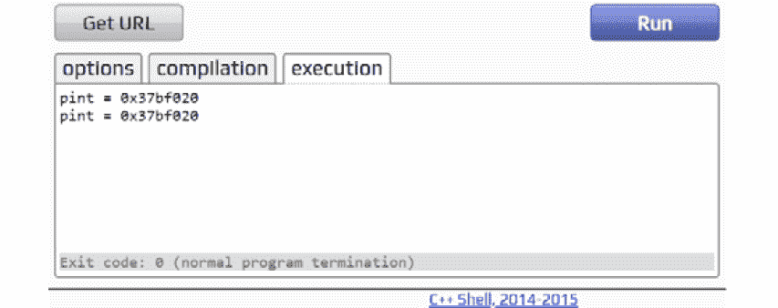

图 6.1：ORM 如何在 C#和 SQL 之间进行翻译和转换

本章的重点将放在 Entity Framework（EF）上——这是.NET 中最流行的 ORM。在本章的实践部分中，您将使用它快速原型化关系数据库，然后对其进行查询。值得一提的是，在内部，每当涉及到数据库时，您都在与.NET 的 ADO.NET 部分交互。

然而，在继续之前，建议您安装最新版本的 PostgreSQL，并在此处找到 PostgreSQL Server：[`www.enterprisedb.com/downloads/postgres-postgresql-downloads`](https://www.enterprisedb.com/downloads/postgres-postgresql-downloads)。您可以在*前言*中找到有关此的安装说明。

本章将使用`AdventureWorks`数据库，这是微软经常使用的一个常见示例数据库的改编；它将在以下部分详细定义。

注意

对于那些有兴趣学习数据库基础知识以及如何使用 PostgreSQL 的人，本书的 GitHub 存储库中已经包含了一个参考章节。您可以在[`packt.link/sezEm`](https://packt.link/sezEm)上访问它。

# 在开始之前创建演示数据库

您将使用`Adventureworks`作为示例，因为它是微软经常使用的常见数据库，并且具有足够的复杂性来学习数据库主题。

执行以下步骤：

1.  打开命令行并创建一个目录，您将在其中调用`AdventureWorks`数据库，并移动到该目录：

```cpp
C:\<change-with-your-download-path-to-The-C-Sharp-Workshop>\Chapter06\AdventureWorks\>
```

注意

将`<change-with-your-download-path-to-The-C-Sharp-Workshop>`替换为您下载 The-C-Sharp-Workshop 存储库的目录。

1.  通过在控制台中运行以下命令创建一个空的`Adventureworks`数据库：

```cpp
psql -U postgres -c "CREATE DATABASE \"Adventureworks\";"
```

1.  使用安装脚本创建表并填充数据。

注意

安装脚本位于[`packt.link/0SHd5`](https://packt.link/0SHd5)。

1.  运行以下命令，指向安装脚本：

```cpp
psql -d Adventureworks -f install.sql -U postgres
```

## 使用 EF 建模数据库

从任何其他语言连接到数据库都会带来一个有趣的问题，那就是，你如何将表行转换为 C#对象？在 C#中，与数据库通信需要一个数据库连接和 SQL 语句。执行这些语句将带来一个结果读取器，它非常类似于一个表。使用结果读取器字典，你可以浏览结果并将它们映射到一个新的对象中。

这个代码看起来像下面这样：

```cpp
using var connection = new NpgsqlConnection(Program.GlobalFactoryConnectionString);
connection.Open(); 
NpgsqlCommand command = new NpgsqlCommand("SELECT * FROM factory.product", connection);
var reader = command.ExecuteReader();
var products = new List<Product>();
while (reader.Read())
{
    products.Add(new Product
    {
        Id = (int)reader["id"],
        //ManufacturerId = (int)reader["ManufacturerId"],
        Name = (string)reader["name"],
        Price = (decimal)reader["price"]
    });
}
return products;
```

现在不要担心这段代码的细节；它很快就会被分解。现在，知道前面的片段返回`factory.product`表中的所有行，并将结果映射到一个名为`products`的列表就足够了。当处理单个表时，使用这种方法可能还可以，但是当涉及到连接时，情况就变得棘手了。像这里所做的那样，从一种类型映射到另一种类型是非常细粒度的，可能会变得乏味。要运行这个示例，转到[`packt.link/2oxXn`](https://packt.link/2oxXn)，并在`static void Main(string[] args)`主体中注释掉所有行，除了`Examples.TalkingWithDb.Raw.Demo.Run();`。

注意

你可以在[`packt.link/7uIJq`](https://packt.link/7uIJq)找到用于这个示例的代码。

另一个需要考虑的因素是，当你在客户端处理 SQL 时，你应该小心。你不应该假设用户会按照预期使用你的程序。因此，你应该在客户端和服务器端都添加验证。例如，如果一个文本框需要输入用户 ID，客户端可以输入`105`并获取该 ID 的用户的详细信息。这个查询如下所示：

```cpp
SELECT * FROM Users WHERE UserId = 105
```

用户也可以输入`105 or 1 = 1`，这总是为真，因此这个查询返回所有用户：

```cpp
SELECT * FROM Users WHERE UserId = 105 or 1 = 1
```

最好的情况是，这会破坏你的应用程序。最坏的情况是，它会泄漏所有数据。这种利用被称为 SQL 注入。

解决接受任何类型用户输入问题的一个简单而有效的方法是使用 ORM，因为它允许你将数据库表转换为 C#对象，反之亦然。在.NET 生态系统中，最常用的三个 ORM 是 EF、Dapper 和 NHibernate。当需要最佳性能时，Dapper 是有效的，因为使用它需要执行原始的 SQL 语句。这样的 ORM 被称为微 ORM，因为它们只做映射，没有其他功能。

NHibernate 起源于 Java 生态系统，并且是.NET 中最早的 ORM 之一。NHibernate 和 EF 一样，通过尝试抽象 SQL 和与数据库相关的低级细节来解决比微 ORM 更大的问题。使用完整的 ORM，比如 EF 或 Nhibernate，通常意味着你不需要编写 SQL 来与数据库通信。事实上，这两个 ORM 允许你根据你拥有的对象生成复杂的数据库。相反的也是可能的（即，你可以根据你已经拥有的数据库生成对象）。

在接下来的章节中，重点将放在 EF 上。为什么不是 Dapper？因为 Dapper 需要对 SQL 有所了解，而你想要使用简化的语法。为什么不是 NHibernate？因为 NHibernate 太老了，它有太多的配置选项，没有一个对于开始使用 ORM 是有用的。

在深入研究 EF 之前，你首先需要连接到一个数据库。因此，继续学习连接字符串和安全性。

### 连接字符串和安全性

无论你使用什么语言，连接到数据库总是需要使用连接字符串。它包含三个重要部分：

+   IP 或服务器名称。

+   你想要连接的数据库的名称。

+   某种安全凭证（或者没有，如果只使用受信任的连接用于同一网络上的数据库）。

要连接到之前在*使用 EF 建模数据库*部分中工作的本地数据库（`new NpgsqlConnection(ConnectionString)`），你可以使用以下连接字符串（出于安全原因，密码已被隐藏）：

```cpp
"Host=localhost;Username=postgres;Password=*****;Database=globalfactory2021"
```

当您在操作系统中添加环境变量时，将使用连接字符串。这将在后面详细说明。不同的数据库使用不同的连接。例如，以下数据库使用这些连接：

+   SQL Server：`SqlConnection`

+   PostgreSQL：`NpgsqlConnection`

+   MySql：`MySqlConnection`

+   SQLite：`SqliteConnection`

连接对象是.NET 和 SQL 数据库之间的接触点，因为只有通过它才能与数据库通信。

硬编码**连接字符串**存在一些问题：

+   要更改连接字符串，必须重新编译程序。

+   这不安全。连接字符串可以被知道如何反编译代码的每个人查看（或更糟糕的是，如果它是一个开源项目，它可能是公开可见的）。

因此，连接字符串通常存储在配置文件中。这并不能解决存储连接字符串敏感部分的问题。为了解决这个问题，通常在应用程序部署期间，整个字符串或其中的一部分会被替换。有三种主要方法可以安全地存储和检索应用程序机密信息：

+   环境变量：这些是系统特有的变量，可以被同一台机器上的任何应用程序访问。这是最简单的安全方法，但在生产环境中可能不安全。

+   秘密管理器工具（在.NET 和.NET Core 应用程序中都可用）：类似于环境变量，但更具体于.NET，它也会将所有秘密存储在名为`secrets.json`的文件中。这个选项在生产环境中也可能不安全。

+   密钥保管库：这是最安全的方法，因为与其他两种方法不同，它不与特定环境耦合。密钥保管库将秘密存储在一个集中的地方；通常是远程的。这种方法最常用于企业应用程序。在 Azure 的上下文中，Azure 密钥保管库是最佳选择，非常适合生产环境。

在以下示例中，您将尝试安全地存储先前创建的连接字符串。您将使用最简单的安全方法，适用于开发环境，即环境变量。这种方法最适合本地开发，因为其他两种方法需要第三方工具来设置，并且需要更长的时间。

注意

在继续之前，请确保阅读*参考章节*中的*练习 1*。它包含创建具有所需表的新数据库所需的步骤。

在您的操作系统中添加环境变量只是执行一些简单步骤的问题。在 Windows 中执行以下步骤来设置环境变量：

1.  转到“控制面板”。

1.  单击“系统和安全”，然后选择“系统”。

1.  在搜索框中键入“环境变量”。

1.  然后从显示的列表中选择“编辑您的帐户的环境变量”。

1.  在“环境变量”窗口中，单击“系统变量”窗口下的“新建”。

1.  在“新建系统变量”窗口中，在“变量名称”旁边键入`GlobalFactory`。

1.  在“变量值”旁边，粘贴以下内容：

```cpp
Host=localhost;Username=postgres;Password=*****;Database=globalfactory2021
```

1.  然后在所有窗口上单击“确定”以设置您的环境变量。

注意

这里的密码将携带您在创建`globalfactory2021`数据库时输入的数据库超级用户密码。

+   Mac：从命令行中找到`bash-profile: ~/.bash-profile f`。使用任何文本编辑器打开它，然后在文件末尾添加`export GlobalFactory='Host=localhost;Username=postgres;Password=*****;Database=globalfactory2021'`。最后，运行`source ~/.bash-profile`，这将更新环境变量。

+   Linux：从命令行运行：`export GlobalFactory='Host=localhost;Username=postgres;Password=*****;Database=globalfactory2021'`。

现在，可以通过在`Program.cs`中的类顶部放置一个属性来获取环境变量，如下所示：

```cpp
public static string ConnectionString { get; } = Environment.GetEnvironmentVariable("GlobalFactory", EnvironmentVariableTarget.User);
```

此行返回为本地用户配置的`GlobalFactory`环境变量的值。在前面的代码片段中，您已将此行添加到`Program.cs`并将其设置为静态，因为这样可以在整个应用程序中轻松访问。在大型应用程序中，这不是您想要选择的做法；然而，在这里，这是可以的。

在掌握模型——程序的中心——之前，您需要了解 EF 的主要版本。

### 选择哪一个——EF 还是 EF Core？

EF 有两个主要版本——EF 和 EF Core。两者都被广泛使用，但在选择最适合项目要求的选择之前，您应该了解一些因素。EF 首次发布于 2008 年。那时还没有.NET Core，C#仅适用于**Windows**，严格要求.NET Framework。目前，EF 的最新主要版本是 6，很可能不会有其他主要版本，因为 2016 年，随着.NET Core 1.0 的推出，EF Core 1（对 EF 6 的重新设计）也随之而来。

EF Core 最初被命名为 EF 7。然而，它是 EF 6 的完全重写，因此很快被重新命名为 EF Core 1.0。EF 仅适用于.NET，仅适用于 Windows，而.NET Core 仅适用于.NET Core，并且是多平台的。

在功能上，这两个框架都很相似，并且仍在不断发展。然而，如今的重点是 EF Core，因为 C#的未来与.NET 6 相关联，这是一个多平台框架。在撰写本书时，EF 6 具有更丰富的功能。然而，EF Core 正在迅速赶上，并很可能很快就会领先。如果您的项目规格不要求使用.NET Framework，最好坚持使用 EF Core。

注意

有关两者之间的最新差异列表，请参阅 Microsoft 的比较：[`docs.microsoft.com/en-us/ef/efcore-and-ef6/`](https://docs.microsoft.com/en-us/ef/efcore-and-ef6/)。

在继续之前，安装 EF Core NuGet 包，以便访问 EF Core API。在 Visual Studio Code（VS Code）中打开项目后，在终端中运行以下命令：

```cpp
dotnet add package Microsoft.EntityFrameworkCore
```

单独使用`EntityFrameworkCore`只是一个抽象数据库结构的工具。要将其与特定的数据库提供程序连接，您将需要另一个包。在这里，您正在使用 PostgreSQL。因此，您将安装的包是`Npgsql.EntityFrameworkCore.PostgreSQL`。为了安装它，请从 VS Code 控制台运行以下命令：

```cpp
dotnet add package Npgsql.EntityFrameworkCore.PostgreSQL
```

您现在已经了解了 EF 的两个版本以及它们如何与.NET Framework 和.NET 一起使用。下一节将深入探讨模型，这是程序的核心。

### 模型

用于表示业务对象的类称为模型。它始终具有由属性或方法管理的数据。模型是程序的中心。它们不依赖于任何东西；程序的其他部分指向它们。

ORM 映射数据表的对象称为实体。在简单的应用程序中，实体和模型是相同的类。在复杂的应用程序中，对数据库的更改是常见的事情。这意味着实体经常发生变化，如果没有一个单独的类用于模型，您的模型也会受到影响。业务逻辑应该与数据库更改隔离，因此建议有两个类——一个用于实体，一个用于模型。

在继续下一节之前，快速查看`factory.product`和`factory.manufacturer`表。一个制造商生产多种产品。下面的实体关系（ER）图在*图 6.2*中说明了这种关系。

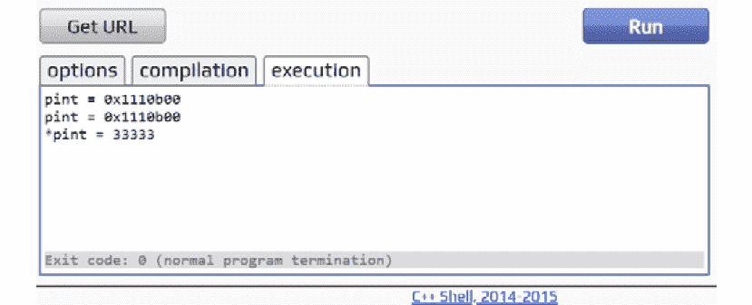

图 6.2：产品和制造商的 ER 图

理想情况下，一个实体应该反映表列。您可以通过属性来反映列。例如，`factory.product`表具有`id`、`name`、`price`和`manufacturerId`。映射到该表的对象将如下所示：

```cpp
public class Product
{
    public int id { get; set; }
    public string name { get; set; }
    public decimal price { get; set; }
    public int manufacturerId { get; set; }
}
```

你知道产品的唯一变化是价格；其余的属性不会变。然而，在前面的代码片段中，为每个属性仍然编写了一个 setter。这是因为通过 ORM 创建的实体始终需要具有所有属性的 setter，否则它可能不会设置值。

一个实体应该被设计成匹配表结构，但并不总是必须这样。例如，如果`Id`属性被重命名为`PrimaryKey`，你仍然可以通过使用特殊的数据注释`[Key]`来以相同的方式使用 EF：

```cpp
public class Product
{
    [Key]
    public int PrimaryKey { get; set; }
    public string name { get; set; }
    public decimal price { get; set; }
    public int manufacturerId { get; set; }
}
```

数据注释是为属性添加元数据的属性。你可以使用它来提供不同的名称，将约束列作为键，为字段添加最小和最大长度，添加精度，声明字段为必填项等。单独使用数据注释不会做任何事情。它们不会向模型添加逻辑。一些其他组件将消耗带注释的对象，这将涉及读取它们的属性并根据此执行操作。

你的模型（从*图 6.2*中说明的 ER 图）几乎完成了，但还有一些问题需要解决：

+   首先，表-模型映射缺少模式（在这种情况下是`factory`），因此你需要使用`Table`属性明确指定它。

+   其次，默认情况下，如果你想检索`manufacturer`，你需要另一个查询。你可以通过添加一个指向制造商的导航属性来解决这个问题。但为什么要使用导航属性？如果只有一个 ID，你需要一个单独的查询来获取相关的实体。然而，使用导航属性，你可以使用急切加载并一次获取两个或更多实体。

以下代码片段将向你展示如何为`Manufacturer`类创建一个类，并为这两个模型解决这些问题：

```cpp
[Table("manufacturer", Schema = "factory")]
public class Manufacturer
{
    public int id { get; set; }
    public string name { get; set; }
    public string country { get; set; }
    public virtual ICollection<Product> Products { get; set; } = new List<Product>();
}
```

注意新的`List<Product>();`部分。这是必需的，以便如果表尚未有产品，当您尝试添加新产品时，代码仍然可以正常运行，而不会抛出`NullReferenceException`。

在下面的代码片段中，为产品表创建了一个模型：

```cpp
[Table("product", Schema = "factory")]
public class Product
{
    public int id { get; set; }
    public string name { get; set; }
    public decimal price { get; set; }
    public int manufacturerId { get; set; }
    public virtual Manufacturer Manufacturer { get; set; }
}
```

这两个模型都已经完整地映射到了你的数据库中的表。你没有用导航属性替换 ID 属性；两者都存在。如果你没有这样做，那么在你对产品进行任何操作之前，都需要先获取父实体（`Manufacturer`）。通过这种方法，你可以独立于制造商使用产品。你只需要一个 ID 链接。

除了上述修复之外，你还将你的导航属性（`Manufacturer`和`Products`）设为虚拟的。这是为了启用 EF 的延迟加载。延迟加载意味着在引用该属性之前，该属性中没有加载任何数据。

最后，值得一提的是，对于制造商产品，你使用了`ICollection`而不是`IEnumerable`或其他集合。这是有道理的，因为 EF 需要在检索和映射项目时填充集合。`List`甚至`Set`都可以工作，但在设计面向对象的代码时，你应该专注于你可以依赖的最高抽象，这种情况下就是`ICollection`。

注意

你可以在[`packt.link/gfgB1`](https://packt.link/gfgB1)找到此示例使用的代码。

要运行此示例，请转到[`packt.link/2oxXn`](https://packt.link/2oxXn)，并在`static void` `Main(string[] args)`主体中注释掉所有行，除了`Examples.TalkingWithDb.Orm.Demo.Run();`。

现在你已经清楚了实体、模型、实体关系、数据注释、急切加载和延迟加载。下一节将向你展示如何将所有内容结合起来，并通过 EF Core 与数据库通信。

## DbContext 和 DbSet

`DbContext`是 EF 用作数据库抽象的东西。新的数据库抽象必须从`DbContext`类派生，并提供连接到数据库的方法。就像数据库包含一个或多个表一样，`DbContext`包含一个或多个`DbSet`实体。例如，考虑以下代码：

```cpp
public class FactoryDbContext : DbContext
{
    public DbSet<Product> Products { get; set; }
    public DbSet<Manufacturer> Manufacturers { get; set; }

    protected override void OnConfiguring(DbContextOptionsBuilder optionsBuilder)
    {
        if (!optionsBuilder.IsConfigured)
        {
            optionsBuilder.UseNpgsql(Program.GlobalFactoryConnectionString);
        }
    }
}
```

在这里，`FactoryDbContext`是您之前创建的数据库的抽象，其中包含两个表：`Products`和`Manufacturers`。`OnConfiguring`方法使用`DbContextOptionsBuilder`，它允许您指定要连接到的数据库以及连接的方式。在这种情况下，您使用 PostgreSQL Server 并指定要连接的数据库。请注意，如果已经配置了数据库提供程序，那么您将不会在`if`语句中使用`Npgsql`，即`if (!optionsBuilder.IsConfigured)`语句。

重要的是要注意，出于两个原因，您不应完全依赖于特定的数据库提供程序：

+   首先，更改数据库提供程序很容易；只需在构建器上使用不同的扩展方法即可。

+   其次，EF 具有内存数据库提供程序，用于测试非常有效。或者，您也可以使用 SQLite，这是一个轻量级的数据库，专门用于测试。

当前，您的数据库抽象需要改进，因为它只允许您与 SQL Server 数据库通信。您将注入而不是硬编码选项。注入允许您以不同的方式配置现有类，而无需修改它。您无需更改模型即可选择要连接的数据库。您可以通过通过`FactoryDbContext`构造函数传递`options`对象来指定要连接的数据库：

```cpp
 public FactoryDbContext(DbContextOptions<FactoryDbContext> options)
    : base(options)
{
}
```

默认构造函数是为默认提供程序而设计的，当没有提供选项时将使用该提供程序。在这种情况下，上下文被设计为使用 PostgreSQL；因此，您将添加以下代码：

```cpp
public FactoryDbContext()
    : base(UsePostgreSqlServerOptions())
{
}
```

`DbContext`可以使用`DbContextOptions`进行配置。在此示例中，您需要配置数据库提供程序（PostgreSQL）和连接字符串。使用`DbContextOptionsBuilder`选择提供程序。`UseNpgsql`是将 PostgreSQL 提供程序与数据库上下文连接的方法，如下所示：

```cpp
protected static DbContextOptions UsePostgreSqlServerOptions()
{
    return new DbContextOptionsBuilder()
        .UseNpgsql(Program.ConnectionString)
        .Options;
}
```

完整的`DbContext`现在如下所示：

```cpp
FactoryDbContext.cs
public class FactoryDbContext : DbContext
{
    public DbSet<Product> Products { get; set; }
    public DbSet<Manufacturer> Manufacturers { get; set; }

    public FactoryDbContext(DbContextOptions<FactoryDbContext> options)
        : base(options)
    {
    }

    public FactoryDbContext()
        : base(UsePostgreSqlServerOptions())
    {
    }
The complete code can be found here: https://packt.link/0uVPP.
```

要运行此示例，请转到[`packt.link/2oxXn`](https://packt.link/2oxXn)，并在`static void` `Main(string[] args)`主体中注释所有行，除了`Examples.TalkingWithDb.Orm.Demo.Run();`。

要从您创建的数据库中获取产品，您首先通过初始化`DbContext`的实例来连接到数据库。然后，您从该上下文调用所需的`DbSet`，并通过调用`ToList()`向数据库发送调用：

```cpp
using var context = new FactoryDbContext();
var products = context.Products.ToList();
```

在这种情况下，您创建了一个`FactoryDbContext`（它创建了与`GlobalFactory`数据库的连接），`context.Products.ToList()`相当于`SELECT * FROM Products`的 SQL 语句。

注意

提到的两行不包括在 GitHub 中。它们是微不足道的，仅用于举例说明。

当您初始化`DbContext`时，几乎总是创建与数据库的连接，如果不加以管理，最终可能会耗尽连接池中的连接（可用连接的集合）。`DbContext`是一个未经管理的资源；它实现了`IDisposable`接口，因此需要显式清理。在这里，您应用了 C#特性——内联使用——它在离开其所在范围后处理对象：

```cpp
using var context = new FactoryDbContext()
```

当您有一个`DbContext`时，从中获取数据是微不足道的：

+   访问`DbSet`。

+   将其转换为列表。

但是，为什么需要进行任何转换呢？那是因为`DbSet`与`IEnumerable`一样，是惰性加载的。它封装了执行所需的 SQL。因此，除非您明确要求（例如，通过调用`ToList`），否则不会查询任何数据。调用`ToList`会实际调用数据库并检索所有产品。

您现在已经了解了关于数据库的所有内容。下一节将涉及`AdventureWorks`数据库，这是一个常用的用于教授 SQL 给初学者的数据库。

### AdventureWorks 数据库

`AdventureWorks`是一个用于学习目的的数据库。它包含数十个表，每个表中都有数百条记录。这些表侧重于批发，这在企业应用程序中是一个常见的场景。换句话说，`AdventureWorks`数据库提供了与真实世界问题紧密相关的学习示例。

注意

您必须首先在 PostgreSQL 中创建`AdventureWorks`数据库。您可以在放置在 GitHub 上的参考章节中找到创建此数据库的步骤。

前面的部分涵盖了实体、模型以及如何将所有内容组合起来并与数据库通信。您还学习了`DbContext`和`DbSet`。这结束了本节的理论部分。在接下来的部分，您将通过练习将其付诸实践。

## 练习 6.01：从 AdventureWorks 数据库中读取库存位置

EF 的最简单用例是将数据表读入 C#对象。这个练习将教你如何创建一个数据实体类并为其添加正确的属性。为此，你将在示例`AdventureWorks`数据库中创建一个库存`location`表。执行以下步骤：

1.  创建一个`Location`实体。它应该具有`LocationId`、`Name`、`Costrate`、`Availability`和`ModifiedDate`属性，如下所示：

```cpp
[Table("location", Schema = "production")]
public class Location
{
    [Column("locationid")]
    public int LocationId { get; set; }
    [Column("name")]
    public string Name { get; set; }
    [Column("costrate")]
    public double Costrate { get; set; }
    [Column("availability")]
    public double Availability { get; set; }
    [Column("modifieddate")]
    public DateTime ModifiedDate { get; set; }
}
```

因为您需要指定模式以及正确大写的表名，所以已经应用了`[Table]`属性。除此之外，每个列名都需要使用`[Column]`属性显式指定，因为大小写不匹配。

1.  创建一个名为`AdventureWorksContext`的类，它继承自`DbContext`，如下所示：

```cpp
public class AdventureWorksContext : DbContext
{
    public DbSet<Location> Locations { get; set; }

    public AdventureWorksContext()
        : base(UsePostgreSqlServerOptions())
    {
    }

    protected static DbContextOptions UsePostgreSqlServerOptions()
    {
        return new DbContextOptionsBuilder()
            .UseNpgsql(Program.AdventureWorksConnectionString)
            .Options;
    }
```

如果您想要重用数据库抽象的基本功能，比如连接到数据库，那么继承`DbContext`是必要的。基本功能的使用在两个基本构造函数中是可见的。在带参数的构造函数中，您使用 PostgreSQL；在非参数化的构造函数中，您可以选择任何数据库提供程序。

1.  现在使用`Program.AdventureWorksConnectionString`连接字符串，如下所示：

```cpp
Host=localhost;Username=postgres;Password=****;Database=Adventureworks. DbSet<Location>Locations
```

这代表了所需的`location`表。

注意

请保管好您的 PostgreSQL 密码。不要将它们以明文形式写入代码中，而是使用环境变量或密钥。

1.  连接到数据库：

```cpp
var db = new AdventureWorksContext();
```

这就像创建一个新的`DbContext`一样简单。

1.  通过添加以下代码获取所有产品：

```cpp
var locations = db.Locations.ToList();
```

1.  现在您已经查询了位置，并且不再需要保持连接打开，最好断开与数据库的连接。为了断开与数据库的连接，请调用`Dispose`方法，如下所示：

```cpp
db.Dispose();
```

1.  通过添加以下代码打印结果：

```cpp
foreach (var location in locations)
{
    Console.WriteLine($"{location.LocationId} {location.Name} {location.Costrate} {location.Availability} {location.ModifiedDate}");
}
```

代码本身是从[`packt.link/2oxXn`](https://packt.link/2oxXn)运行的。请确保在`static void` `Main(string[] args)`主体中注释掉所有行，除了`Exercises.Exercise03.Demo.Run()`。运行代码时，将显示以下输出：

```cpp
1 Tool Crib 0 0 2008-04-30 00:00:00
2 Sheet Metal Racks 0 0 2008-04-30 00:00:00
3 Paint Shop 0 0 2008-04-30 00:00:00
4 Paint Storage 0 0 2008-04-30 00:00:00
5 Metal Storage 0 0 2008-04-30 00:00:00
6 Miscellaneous Storage 0 0 2008-04-30 00:00:00
7 Finished Goods Storage 0 0 2008-04-30 00:00:00
10 Frame Forming 22,5 96 2008-04-30 00:00:00
20 Frame Welding 25 108 2008-04-30 00:00:00
30 Debur and Polish 14,5 120 2008-04-30 00:00:00
40 Paint 15,75 120 2008-04-30 00:00:00
45 Specialized Paint 18 80 2008-04-30 00:00:00
50 Subassembly 12,25 120 2008-04-30 00:00:00
60 Final Assembly 12,25 120 2008-04-30 00:00:00
```

使用 EF 很简单。正如您从这个练习中看到的那样，它是直观的，并且感觉像是 C#的自然扩展。

注意

您可以在[`packt.link/9Weup`](https://packt.link/9Weup)找到此练习中使用的代码。

# 查询数据库—LINQ to SQL

EF 的一个更有趣的特性是运行 SQL 语句非常类似于使用集合。例如，假设您想通过名称检索产品。您可以通过名称获取产品，就像使用 LINQ 一样：

```cpp
public Product GetByName(string name)
{
    var product = db.Products.FirstOrDefault(p => p.Name == name);
    return product;
}
```

在这里，`FirstOrDefault`通过名称返回第一个匹配的产品。如果不存在该名称的产品，则返回`null`。

那么通过 ID 查找唯一元素呢？在这种情况下，您将使用一个特殊的方法（`Find`），它可以从数据库中获取一个实体，或者如果最近已经检索到具有相同 ID 的实体，则从内存中返回它：

```cpp
public Product GetById(int id)
{
    var product = db.Products.Find(id);
    return product;
}
```

在使用主键时，最好使用`Find`而不是`Where`，因为在 EF 的上下文中，它的含义略有不同。`Find`不会尝试创建并执行 SQL 查询，而是会检查该项是否已被访问，并将其从缓存中检索出来，而不是通过数据库。这可以使操作更加高效。

那么如何通过相关制造商 ID 找到所有产品呢？您可以创建一个返回`IEnumerable<Product>`的方法，名为`GetByManufacturer`，如下所示：

```cpp
public IEnumerable<Product> GetByManufacturer(int manufacturerId)
{    var products = db
        .Products
        .Where(p => p.Manufacturer.Id == manufacturerId)
        .ToList();

    return products;
}
```

您可能想知道为什么在这里选择使用`Where`而不是`Find`。那是因为您通过它们的外键`manufacturerId`获取了许多产品。要小心不要混淆外键和主键；`Find`仅用于主键。

要运行此示例，请转到[`packt.link/2oxXn`](https://packt.link/2oxXn)，并注释掉`static void Main(string[] args)`主体中的所有行，除了`Examples.Crud.Demo.Run();`。

注意

您可以在[`packt.link/pwcwx`](https://packt.link/pwcwx)找到此示例使用的代码。

那么，如何检索相关实体呢？如果您简单地调用`db.Manufacturers.ToList()`，您将得到空产品。这是因为除非明确指定，否则不会自动检索产品。如果您没有调用`ToList()`，您可以利用延迟加载（即按需加载所需的实体），但这将导致非常不理想的解决方案，因为您将始终为每个父实体查询子实体。

一个正确的解决方案是调用`Include(parent => parent.ChildToInclude)`：

```cpp
db.Manufacturers
.Include(m => m.Products)
.ToList();
```

这种方法称为急切加载。使用此方法，您可以指定应立即检索哪些子实体。在某些情况下，子实体将具有它们的子实体；在这种情况下，您可以调用`ThenInclude`。要运行此示例，请在`Program.cs`中注释掉`static void Main(string[] args)`主体中的所有行，除了`Examples.Crud.Demo.Run();`。

注意

您可以在[`packt.link/c82nA`](https://packt.link/c82nA)找到此示例使用的代码。

还记得之前确定在大多数情况下尝试从表中获取所有内容都不是正确的做法吗？急切加载也有同样的问题。那么，如果您只想要一些属性，该怎么办呢？现在是时候了解 LINQ 的另一面了。

## 查询语法

查询语法是 LINQ lambda 的一种替代语法。它非常类似于 SQL。查询语法相对于 lambda 的主要优势在于，当您进行复杂的连接并且只想返回一些数据时，编写查询时会感觉更自然。想象一下，您想要获取所有产品制造商名称对。您不能简单地获取制造商并包括产品；您只想要两个产品。如果尝试使用 LINQ，代码将如下所示：

```cpp
db.Products
.Join(db.Manufacturers,
    p => p.ManufacturerId, m => m.Id,
    (p, m) => new {Product = p.Name, Manufacturer = m.Name})
.ToList();
```

使用查询语法进行相同的操作如下：

```cpp
(from p in db.Products
join m in db.Manufacturers
    on p.ManufacturerId equals m.Id
select new {Product = p.Name, Manufacturer = m.Name}
).ToList();
```

分解代码：

```cpp
from p in db.Products
```

现在选择所有产品及其列：

```cpp
join m in db.Manufacturers
```

对于每个产品，添加制造商列如下：

```cpp
on p.ManufacturerId equals m.Id
```

只为`ManufacturerId`等于制造商的`Id`的产品添加制造商列（`INNER JOIN`）。

注意

为什么不能使用`==`而不是`equals`？那是因为在 LINQ 查询语法中，`equals`完成了一个连接；它不仅仅是两个值的比较。

`select`部分在 lambda 和查询语法中是相同的；但是，值得一提的是您选择了什么。`select new {...}`表示您创建了一个新的匿名对象，其中包含您想要选择的所有内容。想法是稍后使用它来返回您需要的强类型对象。因此，在`ToList`方法之后，您可能会执行另一个`select`操作，以将结果映射到最终返回的结果。您不能立即进行映射，因为在执行`ToList`之前，您仍在处理一个尚未转换为 SQL 的表达式。只有在调用`ToList`之后，您才能确信您正在使用 C#对象。

最后，您可能想知道为什么在调用`ToList`之前，连接被括在括号中。那是因为您仍然处于查询语法模式中，唯一的方法是用括号括起来逃离它并返回到正常的 LINQ。

如果您难以记住 LINQ 查询语法，可以记住`foreach`循环：

```cpp
foreach(var product in db.Products)
```

`from`的查询语法如下：

```cpp
from product in db.Products
```

在上述代码片段中，突出显示的部分是两者都重叠的语法部分。这也适用于 join。这两者充分利用了查询语法。

由于最终查询语法将被编译成 lambda 等效形式，因此 lambda 和查询语法具有相同的性能指标。在进行复杂的连接时，可能更有意义使用查询语法，因为它看起来更接近 SQL，因此可能更容易理解。

现在运行代码。为了运行此示例，请在`static void Main(string[] args)`主体中注释掉所有行，除了`Program.cs`中的`Examples.Crud.Demo.Run();`：

注意

您可以在[`packt.link/c82nA`](https://packt.link/c82nA)找到此示例使用的代码。

现在您知道查询语法是 LINQ lambda 的另一种语法。但是如何使用查询语法执行剩余的行操作，即创建、更新和删除？下一节详细介绍了如何完成这些操作。

## CRUD 的其余部分

使用查询语法添加、更新和删除数据也类似于基本的 LINQ。然而，类似于通过调用`ToList`执行查询，它涉及一个额外的步骤，即提交更改。考虑以下代码，您正在创建一个新产品：

```cpp
var product = new Product
{
    Name = "Teddy Bear",
    Price = 10,
    ManufacturerId = 1
};
db.Products.Add(product);
db.SaveChanges();
```

这段代码应该看起来几乎完全熟悉，除了最后一行。`SaveChanges`方法用于运行实际的 SQL。如果不调用它，什么也不会发生，并且在与数据库断开连接后更改将消失。此外，当添加子实体（`product`）时，您不必获取父实体（`manufacturer`）。您所需要做的就是通过外键（`ManufacturerId`）在两者之间提供一个链接。

为什么需要额外的方法来应用您的更改？调用`Add`并立即创建一个新的产品行不是更简单吗？实际上，情况并不那么简单。如果需要执行不同实体的多个`Add`方法，如果其中一个失败会发生什么？您是否应该允许其中一些成功，而其他失败？您能做的最糟糕的事情就是让您的数据库处于无效状态，或者换句话说，破坏数据完整性。您需要一种机制，要么完全完成，要么失败而不影响任何事情。

在 SQL 上下文中，一起运行的这些命令称为事务。您可以通过事务做两件事——提交或回滚。在 EF 中，除了查询之外的每个操作都会导致一个事务。`SaveChanges`完成事务，而命令失败会回滚事务。

如果您在 C#中调用纯 SQL 命令，您需要创建一个参数化的 SQL 命令，分别提供每个参数，并连接多个查询更新的 SQL。对于一个小的实体来说可能很容易；然而，随着大小的增长，复杂性也会增加。使用 EF，您不需要关心低级细节，比如将参数传递给命令。例如，使用 EF，添加带有几个产品的`manufacturer`就像向`Manufacturers`列表添加`manufacturer`一样简单：

```cpp
var manufacturer = new Manufacturer
{
    Country = "Lithuania",
    Name = "Toy Lasers",
    Products = new List<Product>
    {
        new()
        {
            Name = "Laser S",
            Price = 4.01m
        },
        new()
        {
            Name = "Laser M",
            Price = 7.99m
        }
    }
};
db.Manufacturers.Add(manufacturer);
db.SaveChanges();
```

正如您所看到的，创建制造商几乎与向列表添加元素相同。主要区别在于需要使用`db.SaveChanges()`方法完成更改。

那么更新现有产品呢？将产品的价格设置为`45.99`：

```cpp
var productUpdate = new Product
{
    Id = existingProduct.Id,
    Price = 45.99m,
    ManufacturerId = existingProduct.ManufacturerId,
    Name = existingProduct.Name
};
db.Products.Update(productUpdate);
 db.SaveChanges();
```

如果您仔细查看此代码，您不仅提供了更新后的`Price`和现有项目`Id`，还提供了所有其他字段。这是因为 EF 无法知道您是要将现有值设置为 null 还是仅设置新值。但不用担心；从逻辑上讲，很少有情况是您从无处更新某些内容。您应该在某个地方加载一组项目。因此，更新现有对象只是简单地设置该对象的属性的新值的问题。

当然，有时您只想更新一件事。在这种情况下，您可以有一个专用的方法并完全控制。在以下代码片段中，您将更新产品值，但仅当它们不为 null 时：

```cpp
var productToUpdate = db.Products.Find(productUpdate.Id);
var anyProductToUpdate = productToUpdate != null;
if (anyProductToUpdate)
{
    productToUpdate.Name = productUpdate.Name ?? productToUpdate.Name;

    productToUpdate.ManufacturerId = (productUpdate.ManufacturerId != default)
        ? productUpdate.ManufacturerId
        : productToUpdate.ManufacturerId;

    productToUpdate.Price = (productUpdate.Price != default)
        ? productUpdate.Price
        : productToUpdate.Price;

    db.SaveChanges();
}
```

在这里，只有在值不是默认值时才会更新值。理想情况下，在这种情况下工作时（您只想更新某些字段），您应该为更新后的字段创建一个专用模型，发送这些字段，并使用 AutoMapper 等库进行映射。

注意

要了解有关 AutoMapper 的更多信息，请参阅官方文档[`docs.automapper.org/en/stable/Getting-started.html`](https://docs.automapper.org/en/stable/Getting-started.html)。

如何从数据库中删除现有行？这首先涉及获取要删除的对象，然后再将其删除。例如，假设您要删除具有特定 ID 的产品：

```cpp
var productToDelete = db.Products.Find(productId);
if (productToDelete != null)
{
    db.Products.Remove(productToDelete);
    db.SaveChanges();
} 
```

再次，从数据库中删除某些内容几乎与从列表中删除元素相同，只是有一个小差异，即使用`db.SaveChanges()`来确认更改。为了运行此示例，请在`Program.cs`中的`static void Main(string[] args)`主体中注释掉除`Examples.Crud.Demo.Run();`之外的所有行。

注意

您可以在[`packt.link/bH5c4`](https://packt.link/bH5c4)找到此示例使用的代码。

您已经掌握了 CRUD 的基本概念是四个功能的组合——创建、读取、更新和删除。现在是时候在以下练习中将其付诸实践了。

## 练习 6.02：更新产品和制造商表

您已经创建了一个带有`Products`和`Manufacturers`表的`GlobalFactory`数据库，现在您有足够的组件来对数据库执行完整的创建、读取、更新和删除（CRUD）。在此练习中，您将使用`FactoryDbContext`在名为`GlobalFactoryService`的新类中创建方法，该方法可以完成以下任务：

+   向美国制造商列表中添加制造商。

+   向美国所有制造商添加产品列表。

+   使用给定的折扣价格更新美国的任何一个产品。

+   从美国地区删除任何一个产品。

+   获取来自美国的所有制造商及其产品。

执行以下步骤以完成此练习：

1.  首先，创建一个`GlobalFactoryService`类。

1.  在构造函数内创建`FactoryDbContext`并注入上下文。注入上下文意味着您可以选择以任何您想要的方式设置它（例如，使用不同的提供程序）。

1.  创建一个接受`FactoryDbContext`作为参数的构造函数，如下所示：

```cpp
public class GlobalFactoryService : IDisposable
{
    private readonly FactoryDbContext _context;

    public GlobalFactoryService(FactoryDbContext context)
    {
        _context = context;
    }
```

1.  创建一个`public void CreateManufacturersInUsa(IEnumerable<string> names)`方法，如下所示：

```cpp
public void CreateManufacturersInUsa(IEnumerable<string> names)
{
    var manufacturers = names
        .Select(name => new Manufacturer()
        {
            Name = name,
            Country = "USA"
        });

    _context.Manufacturers.AddRange(manufacturers);
    _context.SaveChanges();
}
```

制造商只有两个自定义字段——`Name`和`Country`。在这种情况下，`Country`的值已知为`"USA"`。您只需传递一个制造商名称列表，并通过将`Country`的值与其名称组合来构建`Manufacturers`。

1.  要创建产品，请创建一个`public void CreateUsaProducts(IEnumerable<Product> products)`方法。

1.  然后获取美国所有制造商。

1.  最后，迭代每个制造商并将所有产品添加到每个制造商：

```cpp
public void CreateUsaProducts(IEnumerable<Product> products)
{
    var manufacturersInUsa = _context
        .Manufacturers
        .Where(m => m.Country == "USA")
        .ToList();

    foreach (var product in products)
    {
        manufacturersInUsa.ForEach(m => m.Products.Add(
            new Product {Name = product.Name, Price = product.Price}
            ));
    }

    _context.SaveChanges();
}
```

请注意，在此示例中，每次将相同的产品添加到制造商时，您都重新创建了一个新产品。这是因为即使产品具有相同的属性，它也属于不同的制造商。为了设置该区别，您需要传递不同的对象。如果不这样做，产品将被分配给相同的（最后引用的）制造商。

1.  创建一个`public void SetAnyUsaProductOnDiscount(decimal discountedPrice)`方法。

1.  要对任何美国产品打折，请首先获取来自美国地区的所有产品，然后选择它们中的第一个（顺序无关紧要）。

1.  然后为该产品设置一个新的`Price`，并调用`SaveChanges()`来确认它：

```cpp
public void SetAnyUsaProductOnDiscount(decimal discountedPrice)
{
    var anyProductInUsa = _context
        .Products
        .FirstOrDefault(p => p.Manufacturer.Country == "USA");

    anyProductInUsa.Price = discountedPrice;

    _context.SaveChanges();
}
```

1.  创建一个`public void RemoveAnyProductInUsa()`方法。

1.  要删除一个项目，只需选择`"USA"`组中的第一个产品并将其删除：

```cpp
public void RemoveAnyProductInUsa()
{
    var anyProductInUsa = _context
        .Products
        .FirstOrDefault(p => p.Manufacturer.Country == "USA");

    _context.Remove(anyProductInUsa);
    _context.SaveChanges();
}
```

注意

请注意，在每一步之后都调用了`SaveChanges`。

1.  为了从美国获取制造商，请创建一个`public IEnumerable<Manufacturer> GetManufacturersInUsa()`方法。

1.  在查询的末尾调用`ToList()`，以便执行 SQL：

```cpp
  public IEnumerable<Manufacturer> GetManufacturersInUsa()
  {
      var manufacturersFromUsa = _context
          .Manufacturers
          .Include(m => m.Products)
          .Where(m => m.Country == "USA")
          .ToList();

      return manufacturersFromUsa;
  }
}
```

1.  创建一个`Demo`类，在其中调用所有函数：

```cpp
Demo.cs
public static class Demo
{
    public static void Run()
    {
        var service = new GlobalFactoryService(new FactoryDbContext());
        service.CreateManufacturersInUsa(new []{"Best Buy", "Iron Retail"});
        service.CreateUsaProducts(new []
        {
            new Product
            {
                Name = "Toy computer",
                Price = 20.99m
            },
            new Product
            {
```

```cpp
The complete code can be found here: https://packt.link/qMYbi.
```

为了运行此练习，请在`Program.cs`中的`static void Main(string[] args)`主体中注释掉所有行，除了`Exercises.Exercise02.Demo.Run();`。上述代码的输出如下：

```cpp
Best Buy:
Loli microphone 5
Iron Retail:
Toy computer 20,99
Loli microphone 7,51
```

此输出完全符合您的预期。您创建了两个制造商：`Best Buy`和`Iron Retail`。每个制造商都有两种产品，但是从第一个制造商`Best Buy`中删除了一个。因此，在其下只显示一个产品，而不是在`Iron Retail`下显示两个产品。

注意

您可以在[`packt.link/uq97N`](https://packt.link/uq97N)找到用于此练习的代码。

到目前为止，您已经知道如何与现有数据库交互。但是，到目前为止，您所做的是手动编写模型以适应您创建的`GlobalFactory`数据库。使用 EF，您只需要一边-要么是数据库，要么是`DbContext`模式。在接下来的几节中，您将学习如何使用任一种方法。

## 数据库优先

在某些情况下，您不必自己设计数据库。通常，架构师会为您做这项工作，然后数据库管理员将处理进一步的更改。在其他情况下，您可能会与一些非常古老的项目和传统数据库一起工作。这两种情况都非常适合数据库优先方法，因为您可以使用现有数据库生成具有所有所需模型的`DbContext`模式。

所选的项目必须是可执行项目。例如，`WebApi`和`ConsoleApp`都可以；但是，类库不行（您不能运行类库；您只能从其他应用程序引用它）。因此，请通过在控制台中运行以下命令来安装 EF 工具：

```cpp
dotnet add package Microsoft.EntityFrameworkCore.tools
```

最后，运行以下命令：

```cpp
dotnet ef dbcontext scaffold "Host=localhost;Username=postgres;Password=****;Database=Adventureworks" Npgsql.EntityFrameworkCore.PostgreSQL -o your/models/path --schema "production"
```

此命令读取数据库架构（您指定从所有架构而不仅仅是一个生产架构生成数据库）并从中生成模型。您使用了`AdventureWorks`数据库。使用`-o`标志，您选择输出目录，并使用`–schema`标志，您指定要从中生成数据库的架构。

注意

可以在[`packt.link/8KIOK`](https://packt.link/8KIOK)找到从现有数据库生成的模型。

生成的模型非常有趣。它们揭示了两件尚未讨论的事情。当您创建`Manufacturer`类（请阅读*使用 EF 建模数据库*部分）时，您没有从构造函数初始化产品集合。这不是一个大问题，但是您不返回数据，而是得到一个空引用异常，这可能不是您想要的。无论模型有多简单或复杂，都没有属性。

您几乎已经完成了数据库优先方法。下一节将重新审视`DbContext`并检查 EF 是如何做的，以便您可以在代码优先方法中应用所学到的知识。

### 重温 DbContext

通过逻辑上理解以下片段`AdventureWorksContext`，您会注意到默认配置与在*DbContext 和 DbSet*部分中创建的配置略有不同。生成的上下文使用`OnConfiguring`方法来直接使用 SQL Server 的连接字符串，以双重检查给定的上下文选项，如果它们未配置，则设置一个。这是一个更清晰的方法，因为您不必手动初始化生成器自己并防止未配置的选项：

```cpp
public globalfactory2021Context()
        {
        }
        public globalfactory2021Context(DbContextOptions<globalfactory2021Context> options)
            : base(options)
        {
        } 
        protected override void OnConfiguring(DbContextOptionsBuilder optionsBuilder)
        {
            if (!optionsBuilder.IsConfigured)
            {
                optionsBuilder.UseNpgsql(Program.GlobalFactoryConnectionString);
            }
        }
```

接下来，有一个名为`OnModelCreating`的方法。这是一个接受`ModelBuilder`的方法，用于动态构建数据库的模型。`ModelBuilder`直接取代了基于属性的方法，因为它允许您保持模型无属性，并在初始化上下文时添加任何约束或映射所需的内容。它包括列名、约束、键和索引。

`ModelBuilder`允许您使用 Fluent API（即方法链接），从而允许您向模型添加额外的配置。考虑以下单个、完全配置的模型：

```cpp
globalfactory2021Context.cs
protected override void OnModelCreating(ModelBuilder modelBuilder)
{
modelBuilder.Entity<Manufacturer>(entity =>
{
              entity.ToTable("manufacturer", "factory");

              entity.Property(e => e.Id)
                      .HasColumnName("id")
                      .UseIdentityAlwaysColumn();

              entity.Property(e => e.Country)
                      .IsRequired()
                      .HasMaxLength(50)
                      .HasColumnName("country");
The complete code can be found here: https://packt.link/S5s6d.
```

查看`ModelBuilder`的这部分将让您完整地了解模型如何映射到表及其列、键、索引和关系。生成的代码已经为您分解了。要开始配置一个实体，您需要调用以下内容：

```cpp
modelBuilder.Entity< Manufacturer >(entity =>
```

映射到表和模式看起来像这样：

```cpp
entity.ToTable("manufacturer", "factory");
```

您还可以添加约束（例如，确保字段不为空）并设置属性映射到的列的字符限制和名称。在下面的代码中，您正在为`Name`这样做：

```cpp
entity.Property(e => e.Name)
        .IsRequired()
        .HasMaxLength(50)
   .HasColumnName("name");
```

最后，一些实体与它们相关联的多个导航属性。当涉及多个导航属性时，EF 可能无法清楚地解释关系应该是什么。在这些情况下，您需要手动配置它，如下面的代码所示：

```cpp
                entity.HasOne(d => d.Manufacturer)
                    .WithMany(p => p.Products)
                    .HasForeignKey(d => d.Manufacturerid)
                    .HasConstraintName("product_manufacturerid_id");
```

前面的代码将`Manufacturer`实体映射到`Product`，并设置了 1：n 的关系，并将外键列设置为`product_manufacturerid_id`。发现这些情况可能有些棘手；因此，只有在错误提示您存在这种模棱两可的情况时，才应添加手动配置：

```cpp
Unable to determine the relationship represented by navigation property Entity.NavProperty' of type 'AnotherEntity'. Either manually configure the relationship, or ignore this property from the model.
```

注意

这里没有可运行的代码；这只是一个数据库的脚手架。

现在您知道了生成的`DbContext`是什么样子，以及如何自定义模型。而不是触及模型类，而是使用`ModelBuidler`，现在是时候熟悉相反的操作，即从上下文生成数据库。

### 从现有数据库生成 DbContext

在后续的示例中，您将使用`GlobalFactory2021`数据库。只是为了确保您所做的与数据库包含的内容相同，您将再次执行数据库脚手架。脚手架是一个操作，它接受一个数据库模式（或在这种情况下是`DbContext`）并生成一个物理数据库。

打开控制台并运行以下命令：

```cpp
dotnet ef dbcontext scaffold "Host=localhost;Username=postgres;Password=****;Database=globalfactory2021" Npgsql.EntityFrameworkCore.PostgreSQL -o Examples/GlobalFactory2021.
```

出于安全考虑，请不要忘记将`DbContext`中的硬编码连接字符串替换为环境变量中的连接字符串。生成的`DbContext`应该如下所示：

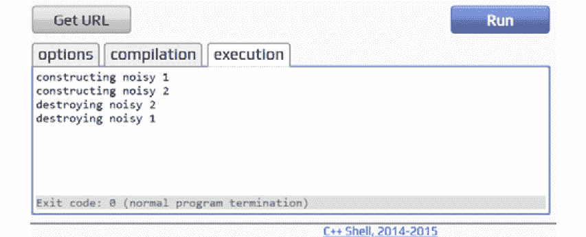

图 6.3：应用脚手架命令后生成的 DbContext

EF 的主要优势之一是您可以快速定义实体，然后从中创建数据库。但首先，您需要先学习代码优先的方法。

### Code First 和 Migrations

通常，当您需要创建一个概念验证时，您将创建一个带有模型的`DbContext`模式，然后从中生成一个数据库。这种方法称为代码优先。

在这个例子中，您将使用从`GlobalFactory2021`数据库生成的上下文，然后生成一个新的数据库。这种方法需要一个名为`Design`的额外包，所以请确保通过运行以下命令来安装它：

```cpp
dotnet add package Microsoft.EntityFrameworkCore.Design
```

EF 能够生成数据库并对其进行不同的版本控制。实际上，它可以从一个数据库版本移动到另一个数据库版本。在任何给定时间，单个数据库版本称为迁移。迁移是必需的，以确保您不仅仅是一直重新创建数据库（毕竟，您不想丢失现有数据），而是以一种安全和可信赖的方式将它们整齐地应用。要添加第一个迁移，从 VS Code 终端运行以下命令：

```cpp
dotnet ef migrations add MyFirstMigration -c globalfactory2021Context
```

这将生成一个迁移文件：

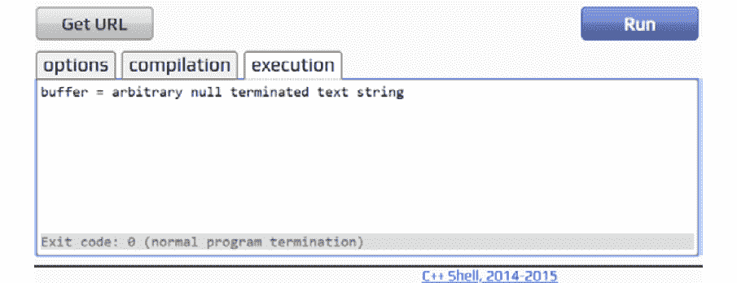

图 6.4：将默认值放置在项目根目录中的项目迁移文件夹下

迁移为 EF 提供了关于下一个数据库模式版本的信息，因此可以用于从迁移生成数据库（或将新更改应用于现有数据库）。请注意，由于您有多个`DbContext`模式，EF 无法告诉您要使用哪个上下文，因此您必须显式提供一个。还值得一提的是，运行此命令需要选择一个默认项目，其中包括所需的上下文，并将迁移放置在该项目的目录中。

为什么不能立即生成一个数据库？在处理数据时，随时捕获变化并能够返回到以前的版本非常重要。尽管直接生成数据库听起来可能很容易，但这不是一种可行的方法，因为变化一直在发生。您希望能够控制并选择在不同版本之间切换的权利。迁移方法还与代码版本控制系统（如 Git）一起使用，因为您可以通过迁移文件查看对数据库所做的更改。您将在*第十一章*《生产就绪的 C#：从开发到部署》中了解更多关于版本控制的内容。

在创建数据库之前，请确保更改连接字符串中的数据库名称，以便可以创建新数据库而不是覆盖现有数据库。通过运行以下命令可以从迁移中创建一个新数据库：

```cpp
dotnet ef database update -c globalfactory2021context
```

如果您打开`pgAdmin`，您将看到一个非常熟悉的视图，其中包括`manufacturer`和`product`。但是，还有一个新的表用于迁移历史记录：

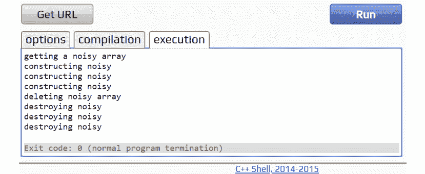

图 6.5：在 pgAdmin 浏览器中生成的数据库（简化视图以节省篇幅）

`__EFMigrationsHistory`表列出了执行的所有迁移，以及它们执行的时间和 EF 版本。在下面的截图中，您可以看到第一个迁移被创建为`MyfirstMigration`：

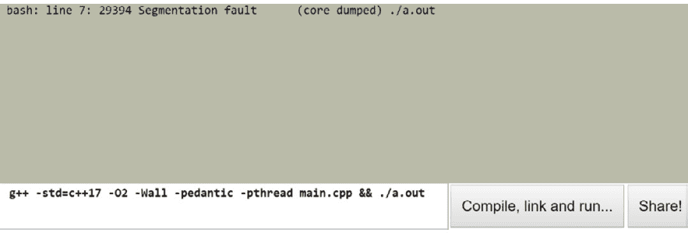

图 6.6：EFMigrationsHistory 表行

您可能会觉得奇怪，迁移表只有两列。但是，这两列包含了所有所需的信息，例如何时、什么和如何。在`MigrationId`下，下划线前的数字是迁移运行的日期和时间。然后是迁移名称。`ProductVersion`指的是执行该命令的 EF Core 版本。

如果您想要更改数据模型，该怎么办？如果您希望`manufacturer`表也有一个成立日期？您需要经过相同的流程——添加一个迁移并更新数据库。

因此，首先，您将在`Manufacturer`类中添加一个新属性：

```cpp
public DateTime FoundedAt { get; set; }
```

在这里，`FoundedAt`是一个日期。它不需要与之关联的时间，因此您应该指定一个适当的 SQL Server 类型，将其映射到它。您可以在`GlobalFactory2021Context`中的`OnModelCreating`方法中执行此操作：

```cpp
entity.Property(e => e.FoundedAt)
    .HasColumnType("date")
```

现在您可以将其添加到新的迁移中：

```cpp
dotnet ef migrations add AddManufacturerFoundedDate -c globalfactory2021Context
```

将新迁移应用到数据库：

```cpp
dotnet ef database update -c globalfactory2021context
```

这将向迁移历史记录添加一个新条目：

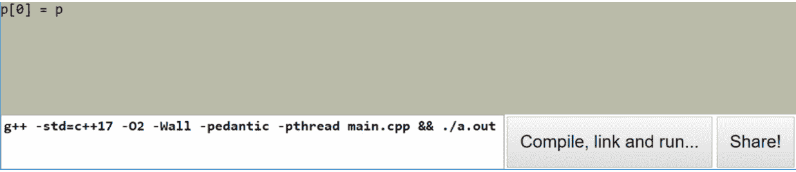

图 6.7：迁移 2 作为迁移表中创建的新迁移

你应该在`manufacturer`表中看到新的列如下：

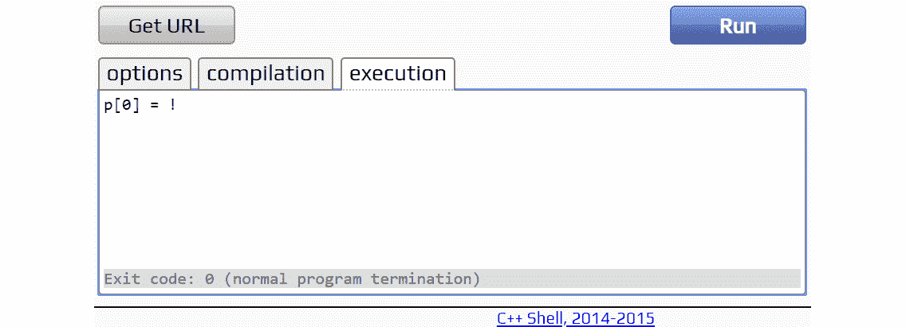

图 6.8：带有新列名称为 foundedat 的制造商表

现在你知道如何应用你的模型，改变它们，并且从模型中生成数据库。到目前为止，你已经做出了以下更改：

+   添加了`FoundedAt`属性和模型构建器的更改。

+   创建了一个迁移文件。

+   使用该迁移文件更新了数据库。

撤销这些更改将涉及按照以下顺序进行相反的操作：

+   回滚数据库更改（将数据库更新到最后一个成功的迁移）。

+   移除迁移文件。

+   移除模型构建器的更改。

EF 迁移允许你选择性地应用任何你想要的迁移。在这里，你将应用之前的迁移：

```cpp
dotnet ef database update MyFirstMigration -c globalfactory2021context
```

你将使用以下命令删除迁移文件：

```cpp
dotnet ef migrations remove -c globalfactory2021Context
```

在处理大型和复杂的数据库时，特别是当它们已经在生产中时，使用 EF 工具执行迁移可能会变得太复杂。毕竟，你无法完全控制 EF 为迁移生成的确切脚本。如果你需要自定义迁移脚本，EF 将不再适合你。然而，你总是可以将 EF 会做的事情转换成 SQL。你可以通过运行以下命令来做到这一点：

```cpp
dotnet ef migrations script -c globalfactory2021context
```

这个命令产生的是一个 SQL 脚本，而不是一个 C#迁移类。在生产环境中，执行 SQL 脚本（通常是修改后的）是执行迁移的首选方式。

这些只是一些基本但常见的情景，当你处理数据库时会遇到。变化几乎总是会发生；因此，你应该期待并做好准备，正如你将在接下来的练习中看到的。

## 练习 6.03：管理产品价格变动

你的经理再次对你的成果印象深刻。这一次，他们要求你跟踪产品价格的变化。他们想要一个新的表，`ProductPriceHistory`，记录产品价格的变化记录。

以下步骤将帮助你完成这个练习：

1.  为了跟踪价格变动，添加一个新的模型，`ProductPriceHistory`，包括以下字段：

+   `Id`

+   `Price`

+   `DateOfPrrice`

+   `ProductId`

+   `Product`

新模型的代码将如下所示：

```cpp
public class ProductPriceHistory
{
    public int Id { get; set; }
    public decimal Price { get; set; }
    public DateTime DateOfPrice { get; set; }
    public int ProductId { get; set; }

    public Product Product { get; set; }
}
```

1.  接下来，更新`Product`模型，以便包括历史价格变动。因此，添加一个新的集合属性，`ProductPriceHistory`：

```cpp
public ICollection<ProductPriceHistory> PriceHistory { get; set; }
```

1.  更改`Price`列。`Price`现在应该是一个获取产品最新价格的方法，整个模型现在看起来像这样：

```cpp
public partial class Product
{
    public int Id { get; set; }
    public string Name { get; set; }
    public int ManufacturerId { get; set; }

    public decimal GetPrice() => PriceHistory
        .Where(p => p.ProductId == Id)
        .OrderByDescending(p => p.DateOfPrice)
        .First().Price;

    public Manufacturer Manufacturer { get; set; }
    public ICollection<ProductPriceHistory> PriceHistory { get; set; }
}
```

1.  更新`DbContext`以包括一个新的`DbSet`，并将`ProductPriceHistory`配置添加到`OnModelCreating`方法中，如下所示：

```cpp
modelBuilder.Entity<ProductPriceHistory>(entity =>
{
    entity.ToTable("ProductPriceHistory", "Factory");

    entity.Property(e => e.Price)
        .HasColumnType("money");

    entity.Property(e => e.DateOfPrice)
        .HasColumnType("date");
```

上述代码提供了对表和列属性类型的映射。一个`Product`有许多历史价格变动，因此它与`PriceHistory`形成了 1:n 的关系。

1.  在上述代码之后，创建`Product`和`PriceHistory`之间的 1:n 关系：

```cpp
 RelationalForeignKeyBuilderExtensions.HasConstraintName((ReferenceCollectionBuilder)
        entity.HasOne(d => d.Product)
            .WithMany(p => p.PriceHistory)
            .HasForeignKey(d => d.ProductId), "FK_ProductPriceHistory_Product");
});
```

1.  为了捕获数据库更改（以便你可以从代码到数据库应用更改或回滚），添加以下`migration`：

```cpp
dotnet ef migrations add AddProductPriceHistory -c globalfactory2021Contextv3 -o Exercises/Exercise03/Migrations
```

将会生成以下内容：

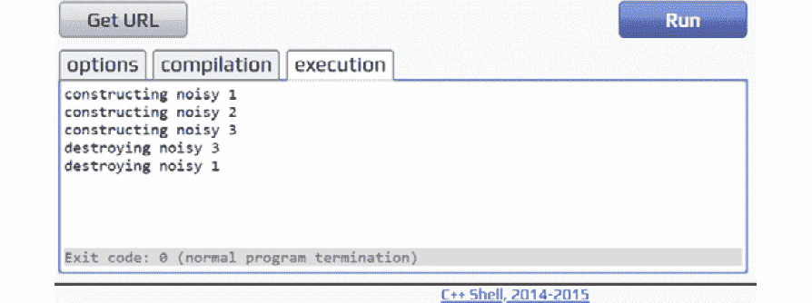

图 6.9：生成的数据库迁移和额外文件

1.  为了应用迁移，运行以下命令：

```cpp
dotnet ef database update -c globalfactory2021contextv3
```

1.  通过添加一些虚拟数据创建一个`Demo`：

```cpp
Demo.cs
public static class Demo
{
    public static void Run()
    {
        var db = new globalfactory2021Contextv3();
        var manufacturer = new Manufacturer
        {
            Country = "Canada",
            FoundedAt = DateTime.UtcNow,
            Name = "Fake Toys"
        };

        var product = new Product
        {
            Name = "Rubber Sweater",
```

```cpp
The complete code can be found here: https://packt.link/4FMz4.
```

在这里，你首先创建了一个`manufacturer`和它的`product`，然后添加了一些价格变动。一旦更改保存了，你就断开了与数据库的连接（这样你就不会使用缓存的实体）。为了测试它是否有效，你查询了所有带有产品和价格历史的`"Fake Toys"`制造商。

注意

在处理日期时，特别是在数据库或可能在本地之外共享的环境中，最好通过调用`DateTime.UtcNow`来使用不带有本地语言环境的日期。

1.  为了运行这个练习，在`static void Main(string[] args)`体中注释掉所有行，除了`Program.cs`中的`Exercises.Exercise03.Demo.Run();`。你会看到以下输出：

```cpp
Fake Toys Rubber Sweater 15.5000
```

在`Demo`中，你创建了一个`manufacturer`，有一个产品是一个玩具（`Rubber Sweater`）。这个玩具有两个价格：`15.11`和`15.50`（最新的）。然后你将这个玩具保存到数据库中，断开连接，重新连接到数据库（确保玩具没有被缓存，而是被获取），并执行了基于急切加载的连接。

注意

你可以在[`packt.link/viVZW`](https://packt.link/viVZW)找到用于这个练习的代码。

EF 对于快速数据库开发非常有效，但出于同样的原因，它也非常危险。经验不足的开发人员经常依赖于幕后发生的魔法，因此忘记了 EF 不能神奇地优化数据模型以适应您的特定情况，或者猜测预期的查询应该执行得更好。接下来的章节将回顾在使用 EF 时人们常犯的主要错误。

# EF 的陷阱

EF 从你那里抽象出了很多细节，极大地简化了你的工作。然而，它也引入了不知道实际发生了什么的风险。有时，你可能会实现你想要的东西，但可能有机会你并没有最优地实现你的目标。以下是 EF 中常见的一些错误。

## 示例设置

对于以下的例子，假设你在开始时已经初始化了这一行：

```cpp
var db = new GlobalFactory2021Context();
```

还要假设每个例子都会以这个结束：

```cpp
db.Dispose();
```

此外，数据本身将使用以下代码进行种子化（预生成）：

```cpp
DataSeeding.cs
public static class DataSeeding
{
    public const string ManufacturerName = "Test Factory";
    public const string TestProduct1Name = "Product1     ";
    /// <summary>
    /// Padding should be 13 spaces to the right as per our test data, db and filtering requirements
    /// </summary>
    public const string TestProduct2NameNotPadded = "Product2";
    public const decimal MaxPrice = 1000;

    public static void SeedDataNotSeededBefore()
    {
        var db = new globalfactory2021Context();
        var isDataAlreadySeeded = db.Manufacturers.Any(m => m.Name == ManufacturerName);
        if (isDataAlreadySeeded) return;
The complete code can be found here: https://packt.link/58JTd.
```

上述代码创建了一个`manufacturer`，有`10,000`个产品，但只有在`manufacturer`不存在时才会创建。`ManufacturerName`将恰好是 13 个字符长，它们的价格将是随机的，但不会超过最高价格。所有这些信息都会在您断开连接之前保存到数据库中。

注意

这不是可运行的代码，将在所有性能比较示例中使用。

所有的例子都将比较两个实现相同输出的函数。通过执行这个演示代码来总结所有的比较：

```cpp
Demo.cs
public static class Demo
{
    public static void Run()
    {
        // For benchmarks to be more accurate, make sure you run the seeding before anything
        // And then restart the application
        // Lazy loading is a prime example of being impacted by this inverting the intended results.
        DataSeeding.SeedDataNotSeededBefore();
        // Slow-Faster example pairs
        // The title does not illustrate which you should pick
        // It rather illustrates when it becomes a problem.

    CompareExecTimes(EnumerableVsQueryable.Slow, EnumerableVsQueryable.Fast, "IEnumerable over IQueryable");
    CompareExecTimes(MethodChoice.Slow, MethodChoice.Fast, "equals over ==");
    CompareExecTimes(Loading.Lazy, Loading.Eager, "Lazy over Eager loading");
The complete code can be found here: https://packt.link/xE0Df.
```

在这里，你将比较内存和 SQL 过滤，惰性和急切加载，被跟踪和未被跟踪的实体，以及逐个添加实体与批量添加实体。在接下来的段落中，你将找到被比较的函数，但每个比较都会显示以下内容：

+   一个场景的名称

+   做同样事情的慢速和快速版本

你将使用秒表来测量执行时间，并在每次运行后打印格式化的比较。为了运行这个例子，在`static void Main(string[] args)`体中注释掉所有行，除了`Program.cs`中的`Examples.PerformanceTraps.Demo.Run();`。你可以参考*结果摘要*部分查看输出。

这些例子的背后思想是比较使用 EF 的高效方式和直接等效的低效方式。慢速场景是低效的方式，快速（即高效的方式）是应该做的方式。下一节将详细介绍使用 EF 的高效方式。

## 多次添加

有时，没有意识到当时，你会发现在编写程序时倾向于使用最直接的路线。例如，要添加 100 个项目，您可能会使用 100 个单独的添加操作。然而，这并不总是最佳的方法，特别是在使用 EF 时效率低下。与其一次查询 100 个，不如运行 100 次单个插入。例如，看下面的代码：

```cpp
for (int i = 0; i < 1000; i++)
{
    var product = new Product
    {
        Name = productName,
        Price = 11,
        ManufacturerId = 2
    };
    db.Products.Add(product);
}
```

这段代码创建了`1,000`个产品并将它们附加到`DbContext`。发生的情况是，`DbContext`模式中的这`1,000`个实体被跟踪。你不是将它们全部作为一个批次进行跟踪，而是单独跟踪每一个。

不过，你想要做的是使用范围操作：

+   `AddRange`或者

+   `UpdateRange`，或者

+   `RemoveRange`

一个更好的版本，旨在以最佳方式与批处理一起工作的前面的代码如下：

```cpp
var toAdd = new List<Product>();
for (int i = 0; i < 1000; i++)
{
    var product = new Product
    {
        Name = productName,
        Price = 11,
        Manufacturerid = 2
    };
    toAdd.Add(product);
}
db.Products.AddRange(toAdd);
```

当创建多个项目并打算将它们添加到数据库时，你应该首先将它们添加到一个列表中。在列表完成后，你可以将项目作为一个批次添加到`DbSet<Product>`。你仍然面临多次添加的问题，但与直接调用`DbSet<Product>`添加相比，它的好处在于你不再在每次添加时都触发更改跟踪器。为了运行这个示例，在`static void Main(string[] args)`体中的所有行都要注释掉，除了`Program.cs`中的`Examples.PerformanceTraps.Demo.Run();`。

注意

你可以在[`packt.link/wPLyB`](https://packt.link/wPLyB)找到此示例的代码。

下一节将介绍另一个陷阱——如何基于属性的相等性进行正确的查询。

## 等于号而不是==

魔鬼就在细节中。C#开发人员通常不会犯这个错误，但是如果你在不同语言之间切换（尤其是从 Java 切换），在过滤时可能会犯这个错误：

```cpp
var filtered = db.Products
    .Where(p => p.Name.Equals(DataSeeding.TestProduct1Name))
    .ToList();
```

对于 LINQ 来说，这是无害的。然而，在使用 EF 时，这种方法是不推荐的。问题在于 EF 只能将一些表达式转换为 SQL。通常，像 equals 这样的复杂方法无法转换，因为它来自一个基本对象类，该类可以有多个实现。相反，使用简单的等号运算符：

```cpp
var filtered = db.Products
    .Where(p => p.Name == DataSeeding.TestProduct1Name)
    .ToList();
```

第一次尝试的问题在于它首先获取所有产品（即在 SQL 中执行`get`语句），然后才应用过滤（在 C#中的内存中）。再次强调，这是有问题的，因为在数据库本地语言中应用过滤是最佳的，但在 SQL 中获取产品，然后在 C#中进行过滤是次优的。第二次尝试通过用等号`==`替换`Equals`解决了这个问题。为了运行这个示例，在`static void Main(string[] args)`体中的所有行都要注释掉，除了`Program.cs`中的`Examples.PerformanceTraps.Demo.Run();`。

注意

你可以在[`packt.link/js2es`](https://packt.link/js2es)找到此示例的代码。

## 使用 IEnumerable 而不是 IQueryable

另一个例子涉及对`IEnumerable<Product>`概念的误解：

```cpp
IEnumerable<Product> products = db.Products;
var filtered = products
    .Where(p => p.Name == DataSeeding.TestProduct1Name)
    .ToList();
```

在这里，你正在通过特定的产品名称获取产品。但是当你将`DbSet<Product>`对象分配给`Ienumerable<Product>`时，会执行`SELECT *`语句。因此，你不会得到你需要的过滤产品，而是首先得到所有的产品，然后手动进行过滤。

你可能会想为什么不能立即进行过滤。在某些情况下，构建查询并将其传递给方法是有意义的。但是在这样做时，你不应该在完全构建之前执行它们。因此，你应该使用`Iqueryable<Product>`，而不是`Ienumerable<Product>`，它是被查询实体的抽象——一个在调用`ToList<Product>`或类似方法后将被转换为 SQL 的表达式。前面代码的高效版本如下：

```cpp
IQueryable<Product> products = db.Products;
var filtered = products
    .Where(p => p.Name == DataSeeding.TestProduct1Name)
    .ToList();
```

后者的工作速度更快，因为你在 SQL 中应用了一个过滤器，而不是在内存中。为了运行这个示例，在`static void Main(string[] args)`体中的所有行都要注释掉，除了`Program.cs`中的`Examples.PerformanceTraps.Demo.Run();`。

注意

你可以在[`packt.link/ehq6C`](https://packt.link/ehq6C)找到此示例的代码。

急切加载和延迟加载已经提到了，但还有另一个足够重要并且应该被覆盖的复杂性。下一节详细介绍了它们。

## 延迟加载优于急切加载

在 EF 中，您会遇到一个有趣的 n+1 查询问题。例如，如果您获取了一个项目列表，然后获取它们各自的制造商列表，那么将会执行一个 SQL 查询；这将是延迟加载。幸运的是，从 EF 2.1 开始，默认情况下不再发生这种情况，需要显式启用。假设在以下示例中，您已经启用了它。

以下是一个查询，用于获取任何第一个项目及其制造商：

```cpp
var product = db.Products.First();
// Lazy loaded
var manufacturer = product.Manufacturer;
```

最初，看这段代码时，您可能会认为没有问题，但这小块代码执行了两个 SQL 查询：

+   首先，它选择顶级产品。

+   然后选择相关的制造商，以及制造商 ID。

为了使代码更有效，您需要明确指定要包含制造商的产品。代码的更好、更有效的版本如下：

```cpp
var manufacturer = db.Products
    // Eager loaded
    .Include(p => p.Manufacturer)
    .First()
    .Manufacturer;
```

后者转换为一个查询，其中两个表之间进行了连接，并从其中一个表中返回第一个项目。为了运行此示例，请在`Program.cs`中的`static void Main(string[] args)`主体中注释掉除`Examples.PerformanceTraps.Demo.Run();`之外的所有行。

注意

您可以在[`packt.link/osrEM`](https://packt.link/osrEM)找到此示例使用的代码。

### 只读查询

在运行查询时，EF 会假设很多东西。在大多数情况下，它做得很对，但也有很多情况下，您应该明确指示它不要假设。例如，您可以这样获取所有产品：

```cpp
var products = db.Products
    .ToList();
```

默认情况下，EF 将跟踪所有检索和更改的实体。在某些情况下这很有用，但并非总是如此。当您有只读查询时，只需获取而不修改实体，您需要明确告诉 EF 不要跟踪它们中的任何一个。获取产品的最佳方式如下：

```cpp
var products = db.Products
    .AsNoTracking()
    .ToList();
```

此代码的全部功能就是针对数据库运行查询并映射结果。EF 保持上下文清晰。为了运行此示例，请在`Program.cs`中的`static void Main(string[] args)`主体中注释掉除`Examples.PerformanceTraps.Demo.Run();`之外的所有行。

注意

您可以在[`packt.link/rSW1k`](https://packt.link/rSW1k)找到此示例使用的代码。

## 结果摘要

以下片段以表格形式显示了前几节的所有结果：

```cpp
IENUMERABLE OVER IQUERYABLE          Scenario1: 75ms,   Scenario2: 31ms
EQUALS OVER ==                       Scenario1: 33ms,   Scenario2: 24ms
LAZY OVER EAGER LOADING              Scenario1: 3ms,    Scenario2: 29ms
READ-ONLY QUERIES                    Scenario1: 40ms,   Scenario2: 10ms
MULTIPLE ADDS                        Scenario1: 8ms,    Scenario2: 8ms
```

请注意，输出取决于您运行数据库的计算机、数据等。这种比较的目的不是给出应该选择什么的硬性规则，而是展示不同方法可能节省大量的计算时间。

EF 是一个强大的工具，可以快速处理数据库；但是，您在使用它时需要小心。不用担心，即使您认为不确定查询在内部是如何工作的，仍然有办法查看发生了什么。

## 帮助您及早发现问题的工具

EF 本身就是一个工具箱；它允许您轻松地连接到它并跟踪发生的一切，而无需任何外部工具。您可以通过将以下内容添加到`OnConfiguring`方法来启用记录所有 EF 操作：

```cpp
optionsBuilder.LogTo((s) => Debug.WriteLine(s));
```

如果您运行示例代码中的任何一个，将在`output`窗口中记录跟踪，如下所示：

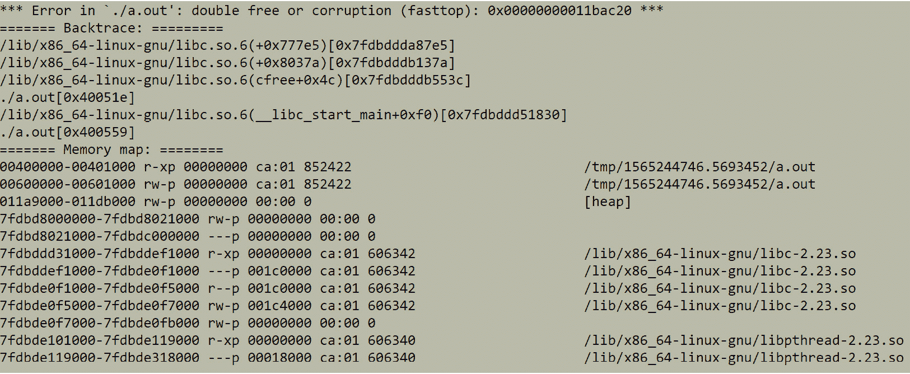

图 6.10：运行性能陷阱演示后的调试输出

图像显示了 EF 执行代码时生成的 SQL，具体选择了所有产品。

当您想要完全调试应用程序并了解 EF 的每一步时，这种方法非常有用。它对于发现您期望作为 SQL 执行但在内存中执行的查询非常有效。

在下一节中，您将了解有助于组织数据库通信代码的模式。

# 在企业中使用数据库

谈到数据库时，通常会想到 SQL 或其他语言来与它们交流。除此之外，另一种语言（在这种情况下是 C#）通常用于连接数据库以执行 SQL 查询。如果不加以控制，C#会与 SQL 混合在一起，导致代码混乱。多年来，已经有一些模式被完善，以清晰地实现与数据库的通信。其中两种模式，即 Repository 和 CQRS，如今仍然常用。

## 存储库模式

存储库是一个针对模型的模式，定义了所有（如果需要）可能的 CRUD 操作。例如，如果您拿一个`Product`模型，您可以有一个具有这个接口的存储库：

```cpp
public interface IProductRepository
{
    int Create(Product product);
    void Delete(int id);
    void Update(Product product);
    Product Get(int id);
    IEnumerable<Product> Get();
}
```

这是一个经典的存储库模式，其中每个数据库操作都被抽象化了。这使您可以在数据库中做几乎任何想做的事情，而不必担心底层数据库甚至与数据库通信的技术。

请注意，在这种情况下，`Create`方法返回一个整数。通常在编写代码时，会将改变状态的方法与查询某些内容的方法分开。换句话说，不要试图同时获取某些内容和更改某些内容。然而，在这种情况下，很难实现，因为实体的 ID 将由数据库生成。因此，如果您想对实体进行操作，您将需要获取该 ID。您可以返回整个实体，但这就像得到一栋房子，而您只需要一个地址。

假设您想执行相同的四个操作（创建、删除、更新和获取），模式将如下所示：

```cpp
public interface IManufacturerRepository
{
    int Create(Manufacturer product);
    void Delete(int id);
    void Update(Manufacturer product);
    Manufacturer Get(int id);
    IEnumerable<Manufacturer> Get();
}
```

它看起来几乎一样；唯一的区别是目标实体。鉴于您有一个非常简单的应用程序，只是以非常简单的方式进行数据处理，将这些存储库变成通用的是有意义的：

```cpp
public interface IRepository<TEntity>: IDisposable where TEntity : class
{
    int Create(TEntity productentity);
    void Delete(long id)(int id);
    void Update(TEntity entityproduct);
    TEntity Get(long id)(int id);
    IEnumerable<TEntity> Get();
    void Dispose();
}
```

在这里，接口不再是`Product`或`Manufacturer`，而是采用了一个必须是类的通用`TEntity`。您还继承了一个`IDisposable`接口，以清理存储库使用的所有资源。这个存储库仍然有缺陷。那么，您是否能够持久化任何类？在这种情况下，标记可以持久化的类将是不错的。

是的，您可以这样做。谈到存储库时，您应该意识到，即使某些内容应该保存在数据库中，这并不意味着它们将被单独保存。例如，联系信息将始终与人一起保存。一个人可以存在而没有联系信息，但联系信息不能没有人存在。人和联系信息都是实体。然而，人也是一个聚合（即在向数据库添加数据时将要定位的实体），它可以独立存在。这意味着如果存储它会违反数据完整性，那么为联系信息创建存储库是没有意义的。因此，您应该根据聚合而不是实体创建存储库。

数据库中的每一行应该有什么？它应该有一个 ID。实体是一个可以持久化的模型（即具有 ID）；因此，您可以为其定义一个接口：

```cpp
public interface IEntity
{
    int Id { get; }
}
```

请注意，这里使用的是一个只读属性，因为在所有情况下设置 ID 都是没有意义的。然而，能够通过获取 ID 来识别对象是至关重要的。还要注意，在这种情况下，ID 是一个整数，因为这只是一个简单的例子，数据量不会很大；但在实际应用中，通常是整数或 GUID。有时，ID 甚至可以是两者兼而有之。在这些情况下，可以考虑使实体接口成为通用的（即采用通用的`TId`）。

聚合怎么样？聚合是一个实体；因此，您将编写以下内容：

```cpp
public interface IAggregate : IEntity
{
}
```

在这种情况下，您只需编写`Person: IAggregate, ContactInfo: IEntity`。如果您将相同的原则应用于您拥有的两个表，您将得到`Product: IAggregate, Manufacturer: IAggregate`，因为这两个可以分别保存。

注意

这里没有可运行的代码；但是，您将在即将进行的练习中使用它。您可以在[`packt.link/JDLAo`](https://packt.link/JDLAo)找到此示例使用的代码。

为每个聚合编写存储库可能会变得乏味，特别是如果没有特殊逻辑来完成持久化。在即将进行的练习中，您将学习如何泛化和重用存储库。

## 练习 6.04：创建通用存储库

与 ORM 耦合可能会使您的业务逻辑更难以测试。此外，由于持久性根植于大多数应用程序的核心，更改 ORM 可能会很麻烦。出于这些原因，您可能希望在业务逻辑和数据库之间放置一个抽象层。如果您使用`DbContext`，则将自己与`EntityFramework`耦合。

在此练习中，您将学习如何创建一个数据库操作抽象——通用存储库，它将适用于任何实体并支持创建、删除、更新和获取操作。逐一实现这些方法：

1.  首先，创建一个通用存储库类，该类在构造函数中接受`DbContext`：

```cpp
public class Repository<TAggregate>: IRepository<TAggregate> where TAggregate: class
{
    private readonly DbSet<TAggregate> _dbSet;
    private readonly DbContext _context;

    public Repository(DbContext context)
    {
        _dbSet = context.Set<TAggregate>();
        _context = context;
    }
```

`context.Set<TEntity>()`允许获取表模型绑定，然后在整个存储库中使用它。另一个有趣的地方是，您不必提供具体的`DbContext`，因为它使用通用实体，通用存储库适用于每种类型的上下文。

1.  要实现`Create`操作，请添加一个插入单个聚合的方法：

```cpp
public int Create(TAggregate aggregate)
{
    var added = _dbSet.Add(aggregate);
    _context.SaveChanges();

    return added.Entity.Id;
}
```

1.  要实现`Delete`操作，请添加一个按 ID 删除聚合的方法：

```cpp
    public void Delete(int id)
    {
        var toRemove = _dbSet.Find(id);
        if (toRemove != null)
        {
            _dbSet.Remove(toRemove);
        }

        _context.SaveChanges();
    }
```

1.  要实现`Update`操作，请添加一个通过使用新实体的值覆盖旧值来更新实体的方法：

```cpp
    public void Update(TAggregate aggregate)
    {
        _dbSet.Update(aggregate);
        _context.SaveChanges();
    }
```

1.  要实现`Read`操作，请添加一个按 ID 获取单个实体的方法：

```cpp
    public TAggregate Get(int id)
    {
        return _dbSet.Find(id);
    }
```

1.  `Read`操作还应支持获取所有实体。因此，请添加一个获取所有实体的方法：

```cpp
    public IEnumerable<TAggregate> Get()
    {
        return _dbSet.ToList();
    }
```

1.  将`DbContext`传递给构造函数将打开数据库连接。一旦您使用完数据库，就应该断开连接。为了支持常规断开连接，实现一个`IDisposable`模式：

```cpp
    public void Dispose()
    {
        _context?.Dispose();
    }
}
```

1.  要测试通用存储库是否有效，请创建一个新的`Run()`方法：

```cpp
public static void Run()
{
```

1.  在`Run()`方法内，为`Manufacturer`实体初始化一个新的存储库：

```cpp
     var db = new FactoryDbContext();
     var manufacturersRepository = new Repository<Manufacturer>(db);
```

1.  通过插入新的`manufacturer`来测试`Create`操作是否有效，如下所示：

```cpp
    var manufacturer = new Manufacturer { Country = "Lithuania", Name = "Tomo Baldai" };
     var id = manufacturersRepository.Create(manufacturer);
```

1.  通过更新制造商的名称来测试`Update`操作是否有效，如下所示：

```cpp
     manufacturer.Name = "New Name";
     manufacturersRepository.Update(manufacturer);
```

1.  通过从数据库中检索新制造商并打印它来测试`Read`操作是否有效：

```cpp
     var manufacturerAfterChanges = manufacturersRepository.Get(id);
     Console.WriteLine($"Id: {manufacturerAfterChanges.Id}, " +
                  $"Name: {manufacturerAfterChanges.Name}");
```

您应该看到以下输出：

```cpp
Id: 25, Name: New Name
```

1.  通过使用以下代码获取所有制造商的计数，测试`Read`操作是否有效：

```cpp
    var countBeforeDelete = manufacturersRepository.Get().Count();
```

1.  您可以通过删除新制造商来测试`Delete`操作是否有效，如下所示：

```cpp
    manufacturersRepository.Delete(id);
```

1.  为了查看删除的影响（预期减少一个制造商），请按以下方式比较计数：

```cpp
    var countAfter = manufacturersRepository.Get().Count();
    Console.WriteLine($"Before: {countBeforeDelete}, after: {countAfter}");
}
```

1.  为了运行此练习，请在`Program.cs`中的`static void Main(string[] args)`主体中注释掉除`Exercises.Exercise04.Demo.Run();`之外的所有行。运行`dotnet run`命令后，您应该看到以下输出：

```cpp
Before: 3, after: 2
```

以前，使用存储库是实现与数据库交互的一种方式（也许是 10-20 年前），因为这是一种很好的抽象方式来调用数据库。与数据库的抽象将使人们能够根据需要更改底层数据库提供程序。如果数据库更改，只有实现接口的类会更改，但使用接口的任何内容都不会受到影响。

回顾`DbContext`和`DbSet`，您可能会问为什么不能直接使用它们。答案是您可以，并且它的作用与存储库相似。这就是为什么只有在您的查询足够复杂（意味着它有几行长）时，才应该使用存储库模式。

注意

您可以在[`packt.link/jDR0C`](https://packt.link/jDR0C)找到此练习使用的代码。

接下来的部分将探索 EF 的另一个好处，即本地数据库测试。

## 本地测试数据持久性逻辑

在开发软件时，您应该始终牢记质量和可测试性。数据库可测试性的问题在于，它通常需要一个物理机器来托管数据库。然而，您并不总是能够访问这样的设置，特别是在项目开始阶段。

幸运的是，EF 非常灵活，并提供了一些包来帮助。使用 EF 进行测试有三种主要方式——`InMemory`，使用 SQLite，以及调用实际数据库。您已经看到了很多调用物理数据库的演示。接下来，您将探索另外两种：In-Memory 和 SQLite。

### 内存数据库提供程序

内存数据库提供程序只是一堆内部可用的内存列表，根本不会对数据库进行任何查询。通常，即使垃圾回收也会消除其状态。在继续之前，就像所有其他数据库提供程序一样，您需要将其添加到项目中。

运行以下命令：

```cpp
dotnet add package Microsoft.EntityFrameworkCore.InMemory
```

当在以下片段中向`DbContextOptionsBuilder`提供`UseInMemoryDatabase`选项时，此命令使您能够使用内存数据库：

```cpp
var builder = new DbContextOptionsBuilder<FactoryDbContext>();
builder.UseInMemoryDatabase(Guid.NewGuid().ToString());
var options = builder.Options;
_db = new FactoryDbContext(options);
```

在这个片段中，您使用了一个选项构建器并创建了一个新的、隔离的内存数据库。这里最重要的部分是`builder.UseInMemoryDatabase();`方法，它指定应创建一个内存数据库。还要注意`Guid.NewGuid().ToString()`参数。这个参数是用于数据库名称的。在这种情况下，这意味着每次调用该行时，您将生成一个唯一的数据库名称，从而确保新测试数据库之间的隔离。如果不使用这个参数，您可能会影响测试状态下的上下文。在测试方案中，从一个新的状态开始是正确的方法。

为了运行这个例子，在`Program.cs`中的`static void Main(string[] args)`体内注释掉除`Examples.TestingDb.Demo.Run();`之外的所有行。

注意

您可以在[`packt.link/mOodJ`](https://packt.link/mOodJ)找到此示例使用的代码。

要测试制造商的通用存储库是否有效（假设前面的代码将被重用），首先创建一个新的存储库：

```cpp
var productsRepository = new Repository<Product>(db);
```

这种模式的强大之处在于，一个新的实体存储库只需指定为不同的泛型参数即可。如果您想测试制造商，您不需要为其设计一个存储库类。您只需要使用`Manufacturer`作为泛型参数初始化存储库，例如`new Repository<Manfacturer>(db)`。

现在，创建一个测试`product`并保存它：

```cpp
var product = new Product {Name = "Test PP", ManufacturerId = 1, Price = 9.99m};
var id = productsRepository.Create(product);
```

要测试价格更新方法，请更新`product.Price`并调用`Update`方法：

```cpp
product.Price = 19m;
productsRepository.Update(product);
```

为了检查产品是否成功创建，请调用`Get`方法并传递新产品的`id`：

```cpp
var productAfterChanges = productsRepository.Get(id);
```

输入以下内容以将产品打印到控制台：

```cpp
Console.WriteLine($"Id: {productAfterChanges.Id}, " +
                  $"Name: {productAfterChanges.Name}, " +
                  $"Price: {productAfterChanges.Price}");
```

输出将显示如下：

```cpp
Id: 1, Name: Test PP, Price: 19
```

现在您需要检查删除是否有效。因此，创建一个新产品：

```cpp
var productToDelete = new Product { Name = "Test PP 2", ManufacturerId = 1, Price = 9.99m };
var idToDelete = productsRepository.Create(productToDelete);
```

检查存储库中产品的当前数量：

```cpp
var countBeforeDelete = productsRepository.Get().Count();
```

现在删除产品：

```cpp
productsRepository.Delete(idToDelete);
```

再次检查数量，与之前的数量进行比较：

```cpp
var countAfter = productsRepository.Get().Count();
Console.WriteLine($"Before: {countBeforeDelete}, after: {countAfter}");
```

为了运行这个例子，在`Program.cs`中的`static void Main(string[] args)`体内注释掉除`Examples.TestingDb.Demo.Run();`之外的所有行。将显示以下输出：

```cpp
Before: 2, after: 1
```

注意

您可以在[`packt.link/DGjf2`](https://packt.link/DGjf2)找到此示例使用的代码。

使用内存提供程序有其局限性。接下来，您将学习另一种依赖于`DbContext`的测试代码的替代方案，它具有更少的限制。

### SQLite 数据库提供程序

内存提供程序的问题在于您无法在其上运行任何 SQL 语句。如果这样做，代码将失败。此外，内存提供程序完全是关于内存数据结构，与 SQL 无关。SQLite 数据库提供程序没有这些问题。它唯一的问题是 SQLite 是 SQL 的一个方言，因此其他提供程序的一些原始 SQL 查询可能无法工作。

要尝试 SQLite，请在 VS Code 终端中运行以下命令：

```cpp
dotnet add package Microsoft.EntityFrameworkCore.Sqlite
```

安装的 NuGet 允许您在创建`DbContext`模式时使用 SQLite 提供程序，就像这样：

```cpp
var connection = new SqliteConnection("Filename=:memory:");
connection.Open();
var builder = new DbContextOptionsBuilder<FactoryDbContext>();
builder.UseSqlite(connection);
var options = builder.Options;
var db = new FactoryDbContext(options);
db.Database.EnsureCreated();
```

在上面的片段中，您已经创建了一个 SQL 连接，指定将使用内存中的 SQLite 数据库。`Db.Database.EnsureCreated()`是必需的，因为使用该连接字符串不会始终创建数据库。为了运行此示例，在`Program.cs`中的`static void Main(string[] args)`主体中除了`Examples.TestingDb.Demo.Run();`之外，注释掉所有行。

注意

您可以在[`packt.link/rW3JS`](https://packt.link/rW3JS)找到此示例中使用的代码。

如果您要创建`ProductsRepository`并从`InMemory`数据库示例运行相同的代码，您将收到错误消息：`SQLite Error 19: 'FOREIGN KEY constraint failed'`。这是由于缺少 ID 为 1 的制造商，您正在尝试将新的测试产品链接到该制造商。这是 EF 内存提供程序不太可靠的一个典型例子。

为了解决这个问题，在创建测试产品之前添加以下内容：

```cpp
var manufacturer = new Manufacturer() { Id = 1 };
db.Manufacturers.Add(manufacturer);
db.SaveChanges();
```

唯一需要记住的是清理。在使用使用 SQL 连接创建的数据库上下文后，不要忘记以这种方式处理该连接：

```cpp
connection.Dispose();
```

此时，您已经知道如何以多种不同的方式使用`DbContext`与数据库进行通信。但是，如果所有内容都依赖于特定的 ORM，那么对第三方库（EF Core）和单元测试的依赖可能会有些棘手。在下一段中，您将学习如何摆脱这种依赖。

## 关于存储库的几句话

存储库模式适用于简单的 CRUD 应用程序，因为它可以进一步简化数据库交互。但是，如果您使用 EF，与数据库交互已经足够简单，不一定需要另一层抽象。毕竟，存储库模式引起如此多关注的一个关键原因是它允许您摆脱数据库交互。但是，EF 内存提供程序也允许这样做，因此使用存储库的理由甚至更少。

通用存储库模式是一个有用的抽象。它将数据库交互抽象为一个简单的接口。但是，对于非平凡的场景，您可能需要自定义 CRUD 操作，然后您将创建一个非通用存储库。实际上，非通用存储库是推荐的方法（如果您想要实现该模式），因为您很少希望为所有实体使用所有 CRUD 方法。最终，您可能只会在存储库上拥有一个方法。如果您使用通用存储库，您仍然可以使所有方法虚拟并重写它们，但是您最终会一直重写或拥有您不使用的方法。这不是理想的。

下一节将探讨另一种旨在实现每个数据库操作的简单、最佳交互的模式——CQRS。

### 查询和命令处理程序模式

命令查询责任分离（CQRS）是一种旨在将读操作与写操作分离的模式。您将拥有一个类来处理所有 CRUD 操作，而是每个 CRUD 方法都有一个类。除此之外，您将拥有专门用于特定场景的请求和查询对象模型，而不是一个适用于所有情况的实体。在 CQRS 中，所有数据库操作可以分为两类：

+   命令：改变状态的操作（创建、更新、删除）。

+   查询：获取某些内容而不影响状态的操作。

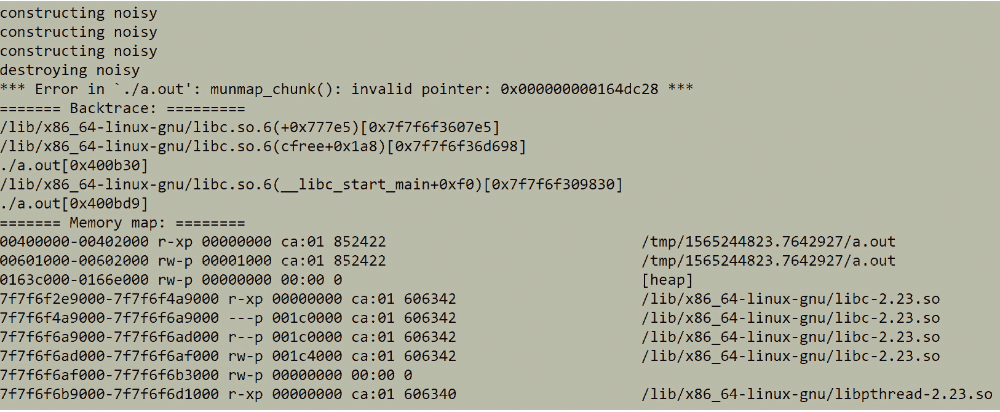

图 6.11：Martin Fowler 使用的 CQRS 模式

注意

这个图表的原始来源可以在[`www.martinfowler.com/bliki/CQRS.html`](https://www.martinfowler.com/bliki/CQRS.html)找到。

为了实现创建产品的命令处理程序，你将首先定义命令。产品需要什么？它需要一个名称和一个价格，以及一个制造商。不需要创建命令的 ID（因为数据库会生成它），制造商属性也可以被移除，因为你不会使用导航属性。CQRS 操作的名称由三部分组成——操作名称、实体名称和`command`或`query`后缀。你正在创建一个产品，因此模型将被称为`CreateProductCommand`：

```cpp
public class CreateProductCommand
{
    public string Name { get; set; }
    public decimal Price { get; set; }
    public int ManufacturerId { get; set; }
}
```

接下来，你将创建一个处理这个命令的处理程序。在构造函数中，传递数据库上下文。在`Handle`方法中，传递`CreateProductCommand`：

```cpp
CreateProductQueryHandler.cs
public class CreateProductCommandHandler
{
    private readonly FactoryDbContext _context;

    public CreateProductCommandHandler(FactoryDbContext context)
    {
        _context = context;
    }

    public int Handle(CreateProductCommand command)
    {
        var product = new Product
        {
            ManufacturerId = command.ManufacturerId,
            Name = command.Name,
The complete code can be found here: https://packt.link/xhAVS.
```

处理程序是简单的、单方法的对象，它实现了处理命令或查询所需的一切。为了测试事情，你还将创建一个`GetProductQueryHandler`类：

```cpp
public class GetProductQueryHandler
{
    private readonly FactoryDbContext _context;

    public GetProductQueryHandler(FactoryDbContext context)
    {
        _context = context;
    }

    public Product Handle(int id)
    {
        return _context.Products.Find(id);
    }
}
```

这个想法几乎是一样的，只是在这种情况下，查询是如此简单，以至于它的最佳模型是一个简单的整数。在某些情景中，如果你能预测复杂性增长和查询变得更加复杂，那么甚至这样一个整数也可以成为一个模型（以避免查询格式完全改变的破坏性变化——从原始整数到对象）。

为了查看命令和查询是否有效，你将再次使用内存数据库上下文。因此，创建一个命令来创建一个新产品，一个处理程序来处理它，执行它，并打印结果如下：

```cpp
var command = new CreateProductCommand { Name = "Test PP", Manufacturerid = 1, Price = 9.99m };
var commandHandler = new CreateProductCommandHandler(db);
var newProductId = commandHandler.Handle(command);
```

创建一个查询来获取创建的产品和一个处理程序来执行查询：

```cpp
var query = newProductId;
var queryHandler = new GetProductQueryHandler(db);
var product = queryHandler.Handle(query);
Console.WriteLine($"Id: {product.Id}, " +
                  $"Name: {product.Name}, " +
                  $"Price: {product.Price}");
```

为了运行这个示例，在`static void Main(string[] args)`主体中注释掉除`Examples.Cqrs.Demo.Test();`之外的所有行。输出将显示如下：

```cpp
Id: 1, Name: Test PP, Price: 9,99
```

注意

你可以在[`packt.link/Ij6J8`](https://packt.link/Ij6J8)找到本示例使用的代码。

也许你会想为什么在这么多演示之后，`ProductId`仍然是`1`。那是因为这是一个内存数据库——每次都为新测试创建一个新的。由于每次都是从空数据库开始，向数据库添加新实体的第一个结果是一个 ID 为 1 的新项目。

你可能会想知道如果你对数据库进行了一些更改或添加了一个列，它会如何影响代码库和业务逻辑的其余部分。下一节将详细介绍这些情景。

### 将数据库模型与业务逻辑（域）模型分离

数据库经常发生变化。然而，这是否应该影响代码库的其余部分？列类型的更改或其他列的添加是否应该影响业务逻辑？这并没有直接的答案。这一切取决于项目范围、资源和团队的成熟度。然而，如果你正在进行一个中等或大型项目，你应该考虑完全隔离数据库和域。这不仅意味着不同的逻辑应该放在不同的项目中，而且还意味着这些项目应该彼此解耦。

数据库层可以消耗领域层，但领域层不可以这样做。如果你想在两者之间实现完全分离，你将不得不引入一个反腐层。这个概念是说不要消耗外部模型，而是在它们到达该层的公共组件时立即映射它们。这个想法是所有接口都应该是领域特定的（即与领域模型一起工作）。然而，对于数据库通信实现，内部上，你将使用数据库实体而不是领域模型。这需要将一个映射到另一个（在输入或返回输出时）。

在数据库实体完全改变的情况下，领域特定接口将保持不变。只有映射会改变，这将防止数据库影响其他任何东西。这对于初学者来说并不容易理解和实现。建议你现在忽略它；你个人项目的范围不值得这样做，你可能看不到任何好处。

这结束了本节的理论部分。在接下来的部分中，您将通过一个活动将其付诸实践。

## 活动 6.01：已派遣卡车的跟踪系统

一家物流公司已经雇佣了你来跟踪已派遣的卡车。一个单独的派遣包括卡车的当前位置、卡车的 ID 和司机的 ID。在这个活动中，您将为已派遣的卡车创建一个数据库，用一些派遣进行种子播种，并通过从中获取所有可能的数据来证明它的工作。

您将创建两个类（`Truck`和`Person`），其中包括以下对象：

+   `Truck`：`Id`，`Brand`，`Model`，`YearOfMaking`

+   `Person`：`Id`，`Name`，`DoB`

所有表都存储在`TruckLogistics`数据库中，位于`TruckLogistics`模式中。

执行以下步骤完成此活动：

1.  创建一个`Person`类。

1.  创建一个`Truck`类。

1.  创建一个`TruckDispatch`类。

1.  创建一个`TruckDispatchDbContext`模式，其中包括三个表。

1.  创建一个连接字符串（最好来自环境变量）。

1.  添加数据库迁移。

1.  从迁移生成数据库。

1.  连接到数据库。

1.  使用初始数据对数据库进行种子播种。

1.  从数据库获取所有数据。

1.  打印结果。

1.  处理`TruckDispatchesDbContext`模式（即断开连接）。

正确完成这些步骤后，您应该看到以下输出：

```cpp
Dispatch: 1 1,1,1 2021-11-02 21:45:42
Driver: Stephen King 2021-07-25 21:45:42
Truck: Scania R 500 LA6x2HHA 2009
```

注意

为了运行这个活动，在`static void Main(string[] args)`主体中注释掉所有行，除了`Program.cs`中的`Activities.Activity01.Demo.Run()`。

数据库应该是这样的：

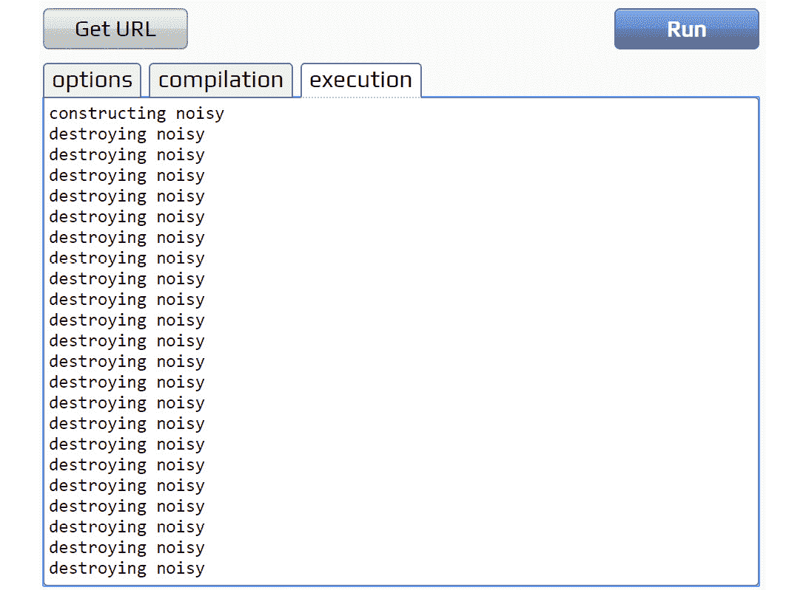

图 6.12：生成的 TruckLogistics 数据库（为简洁起见简化）

并且将创建以下迁移文件（类似但不完全相同）：

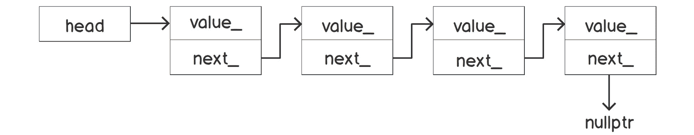

图 6.13：为解决方案创建的迁移文件

注意

可以在[`packt.link/qclbF`](https://packt.link/qclbF)找到此活动的解决方案。

通过成功执行此活动，您现在应该对如何使用 EF 快速开发与数据库集成的解决方案有扎实的了解。

# 摘要

在本章中，您了解了 ORM 的好处以及如何使用 EF Core 6 从 C#与数据库交互。EF 允许您使用`DbContext`来抽象数据库，并包括对表、`DbSet`的抽象。

您体验了使用 EF 消耗数据库的简单性，这几乎与编写 LINQ 查询相同。唯一的区别是使用数据库上下文进行连接的初始设置。您学到了客户端输入不应该被信任，但 ORM 允许您放心地消耗查询，因为它们考虑了安全性并保护您免受 SQL 注入。然而，连接到数据库的方式（即连接字符串）必须得到保护，因此，您必须像任何其他秘密一样存储它，而不是硬编码它。您还学习了在使用 EF 时最常见的陷阱以及可以帮助避免这些陷阱的工具。本章为您提供了足够的技能来使用 EF 创建和消耗数据库。

在下一章中，您将更多地关注 Web 应用程序——它们是什么，以及如何构建它们。
