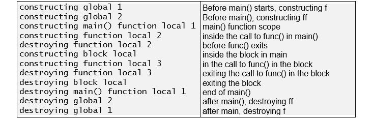
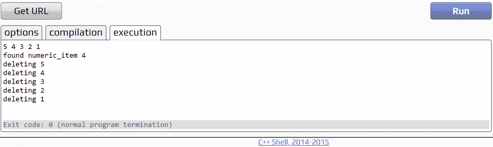
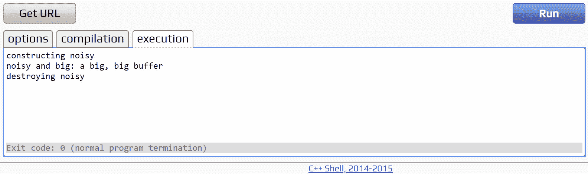
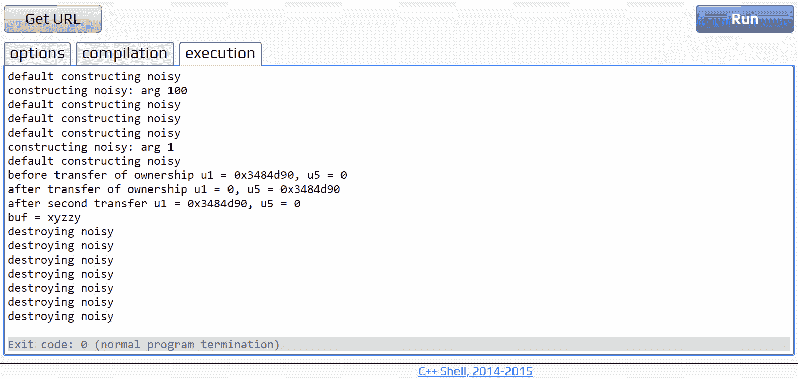
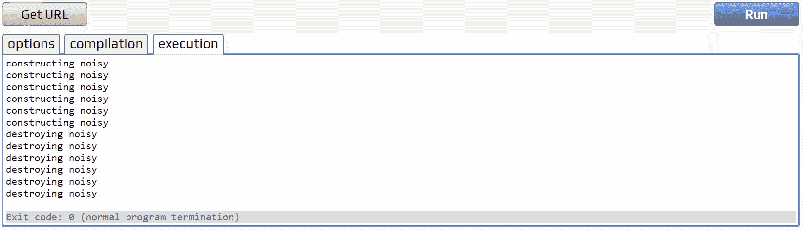
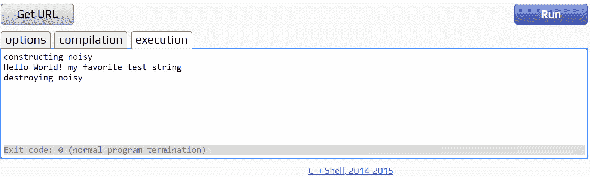
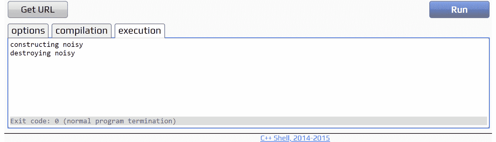
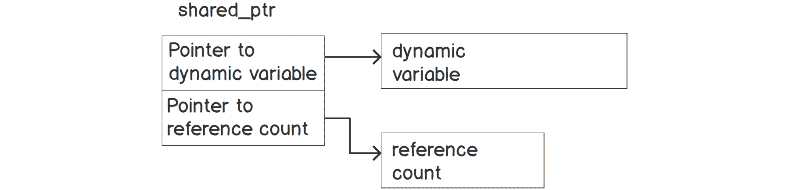
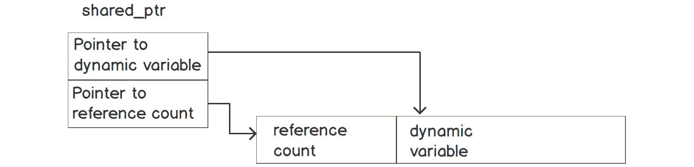

# 第七章：7\. 使用 ASP.NET 创建现代 Web 应用

概述

现在有许多类型的应用程序在使用，Web 应用程序位居最常用的应用程序之列。在本章中，您将了解到 ASP.NET，这是一个使用 C#和.NET 运行时构建的 Web 框架，旨在轻松创建 Web 应用程序。您还将了解基本 ASP.NET 应用程序的解剖学，服务器端渲染和单页应用程序等 Web 应用程序开发方法，以及 C#如何帮助实现这些方法来构建安全、高性能和可扩展的应用程序。

# 介绍

在*第一章*，*你好 C#*中，您了解到.NET 是如何使 C#生动起来的，因为它包含了用于构建代码的软件开发工具包（SDK）和执行代码的运行时。在本章中，您将了解 ASP.NET，它是嵌入在.NET 运行时中的开源跨平台框架。它用于构建 Web、移动和物联网设备的前端和后端应用程序。

它是这类开发的完整工具箱，因为它提供了几个内置功能，如轻量级和可定制的 HTTP 管道、依赖注入以及对现代托管技术的支持，如容器、Web UI 页面、路由和 API。一个著名的例子是 Stack Overflow；它的架构完全建立在 ASP.NET 之上。

本章的重点是让您熟悉 ASP.NET 的基础知识，并为您提供关于使用 Razor Pages 构建 Web 应用程序的介绍和全面概述，Razor Pages 是 ASP.NET 中包含的内置工具箱。

# ASP.NET Web 应用程序的解剖学

您将通过使用 ASP.NET 创建一个新的 Razor Pages 应用程序来开始本章。这只是 ASP.NET 可以创建的各种类型应用程序之一，但作为起点是非常有效的，因为它与框架可以构建的其他 Web 应用程序类型共享并展示了许多共同点。

1.  要创建一个新的 Razor Pages 应用程序，在 CLI 中输入以下命令：

```cpp
dotnet new razor -n ToDoListApp dotnet new sln -n ToDoList dotnet sln add ./ToDoListApp
```

在这里，您将使用 Razor Pages 创建一个待办事项列表应用程序。一旦执行了前面的命令，您将看到一个具有以下结构的文件夹：

```cpp
/ToDoListApp |-- /bin |-- /obj |-- /Pages
|-- /Properties |-- /wwwroot |-- appsettings.json |-- appsettings.Development.json |-- Program.cs
|-- ToDoListApp.csproj
|ToDoList.sln
```

1.  在 Visual Studio Code 中打开根文件夹。

这些文件夹中有一些文件将在接下来的部分中介绍。现在，考虑这个结构：

+   `bin`是应用程序构建后最终二进制文件所在的文件夹。

+   `obj`是编译器在构建过程中放置中间输出的文件夹。

+   `Pages`是应用程序 Razor Pages 将被放置的文件夹。

+   `Properties`是一个包含`launchSettings.json`文件的文件夹，该文件用于放置运行配置。在此文件中，您可以定义一些本地运行的配置，例如环境变量和应用程序端口。

+   `wwwroot`是应用程序的所有静态文件所在的文件夹。

+   `appsettings.json`是一个配置文件。

+   `appsettings.Development.json`是用于开发环境的配置文件。

+   `Program.cs`是您自*第一章*，*你好 C#*以来看到的程序类。它是应用程序的入口点。

现在你知道在.NET 6.0 中，是`Program.cs`文件，在文件夹的根目录创建，给`WebApplication`带来了生命，你可以在下一节深入探索`Program.cs`。

## Program.cs 和 WebApplication

如前所述，`Program.cs`是任何 C#应用程序的入口点。在本节中，您将看到一个典型的 ASP.NET 应用程序的`Program`类是如何构建的。考虑下面描述一个非常简单的 ASP.NET 应用程序的`Program.cs`的示例：

```cpp
Program.cs
var builder = WebApplication.CreateBuilder(args);
// Add services to the container.
builder.Services.AddRazorPages();
var app = builder.Build();
// Configure the HTTP request pipeline.
if (!app.Environment.IsDevelopment())
{
app.UseExceptionHandler("/Error");
// The default HSTS value is 30 days. You may want to change this for production scenarios, see https://aka.ms/aspnetcore-hsts.
The complete code can be found here: https://packt.link/tX9iK.
```

这里做的第一件事是创建一个`WebApplicationBuilder`对象。这个对象包含了在 ASP.NET 中引导基本 Web 应用程序所需的一切——配置、日志、DI 和服务注册、中间件和其他主机配置。这个主机负责 Web 应用程序的生命周期管理；它们设置了一个 Web 服务器和一个基本的 HTTP 管道来处理 HTTP 请求。

正如您所看到的，用几行代码就可以完成许多事情，使您能够运行一个结构良好的 Web 应用程序。ASP.NET 完成了所有这些工作，以便您可以专注于通过您将构建的功能提供价值。

注意

Bootstrap 是用于美化 Web 内容的 CSS 库。您可以在官方网站上了解更多信息。

## 中间件

将中间件视为连接在一起形成处理 HTTP 请求和响应的管道的小型应用程序片段。每个片段都是一个组件，可以在另一个组件在管道上执行之前或之后执行一些工作。它们也通过`next()`调用连接在一起，如*图 7.1*所示：



图 7.1：HTTP 管道的中间件

中间件本身就是一个完整的宇宙。以下列表定义了构建 Web 应用程序的显著特点：

+   中间件的放置顺序很重要。因为它们一个接一个地链接在一起，每个组件的放置方式都会影响管道的处理方式。

+   `before`逻辑，如*图 7.1*所示，直到最终到达终点。一旦到达终点，管道将继续使用`after`逻辑处理响应。

+   `next()`是一个方法调用，将执行管道中的下一个中间件，然后执行当前中间件的`after`逻辑。

在 ASP.NET 应用程序中，中间件可以在`Program.cs`文件中定义，之后`WebApplicationBuilder`调用`Build`方法并使用`WebApplication?`对象作为此操作的结果。

在*Program.cs 和 WebApplication*部分创建的应用程序已经包含了一组中间件，用于新的样板 Razor Pages 应用程序，当**HTTP 请求**到达时将按顺序调用。

这很容易配置，因为`WebApplication`对象包含一个通用的`UseMiddleware<T>`方法。这个方法允许您创建中间件，嵌入到 HTTP 管道中处理请求和响应。当在`Configure`方法中使用时，每次应用程序接收到传入请求时，该请求将按照在`Configure`方法中放置请求的顺序经过所有中间件。默认情况下，ASP.NET 提供基本的错误处理、自动重定向到 HTTPS，并提供静态文件，以及一些基本的路由和授权。

但是，您可能会注意到在您的`Program.cs`文件中，*Program.cs 和 WebApplication*部分中没有`UseMiddleware<>`调用。这是因为您可以编写扩展方法，为代码提供更简洁的名称和可读性，ASP.NET 框架已经默认为一些内置中间件提供了这样的方法。例如，考虑以下示例：

```cpp
using Microsoft.AspNetCore.HttpsPolicy;
public static class HttpsPolicyBuilderExtensions
{
public static IApplicationBuilder UseHttpsRedirection(this WebApplication app)
      { 
           app.UseMiddleware<HttpsRedirectionMiddleware>();
           return app;
}
}
```

在这里，使用了内置的`UseHttpsRedirection`扩展方法的示例，用于启用重定向中间件。

## 日志

日志可能被理解为将应用程序执行的所有操作写入输出的简单过程。这个输出可以是控制台应用程序、文件，甚至是第三方日志监视应用程序，比如 ELK Stack 或 Grafana。日志在吸收应用程序行为方面有重要地位，特别是在错误跟踪方面。这使得它成为一个重要的概念需要学习。

使 ASP.NET 成为企业应用程序的有效平台之一的因素之一是其模块化。由于它是建立在抽象之上的，任何新的实现都可以很容易地完成，而不会对框架造成太大的负担。**日志**抽象就是其中之一。

默认情况下，在`Program.cs`中创建的`WebApplication`对象会在这些日志抽象之上添加一些日志提供程序，包括`Console`、`Debug`、`EventSource`和`EventLog`。后者——`EventLog`——是仅适用于 Windows 操作系统的高级功能。这里的重点将是`Console`日志提供程序。顾名思义，这个提供程序将把所有记录的信息输出到您的应用程序控制台。您将在本节的后面学到更多关于它的知识。

由于日志基本上记录了应用程序的所有操作，您可能会想知道这些日志是否会变得非常庞大，特别是对于大型应用程序。它们可能会，但在编写应用程序日志时一个重要的事情是要理解日志的**严重性**。可能有一些需要记录的关键信息，比如意外异常。也可能有一些信息，您只想在开发环境中记录，以更好地了解一些行为。也就是说，在.NET 中，日志有七个可能的级别，它们是：

+   `跟踪` = 0

+   `调试` = 1

+   `信息` = 2

+   `警告` = 3

+   `错误` = 4

+   `关键` = 5

+   `无` = 6

输出到提供程序的级别是通过设置环境变量或通过`appSettings.json`文件中的`Logging:LogLevel`部分来定义的，如下例所示：

```cpp
{
  "Logging": {
    "LogLevel": {
      "Default": "Information",
      "ToDoListApp": "Warning",
      "ToDoListApp.Pages": "Information"
    }
  }
}
```

在这个文件中，有日志类别，它们要么是`默认`类别，要么是想要设置日志的类型的命名空间的一部分。这正是这些命名空间存在的原因。例如，您可以为命名空间内的文件设置两个不同级别的日志记录。

在前面的示例配置中，整个`ToDoListApp`是一个设置命名空间，只有`LogLevel`等于或高于`Warning`时才会写日志。您还指定了对于`ToDoListApp.Pages`类别/命名空间，应用程序将写入所有级别等于或高于`Information`的日志。这意味着更具体的命名空间上的更改会覆盖在更高级别设置的设置。

本节向您展示了如何为应用程序配置日志级别。有了这个知识，您现在可以理解下一节中讨论的 DI 的概念。

## 依赖注入

依赖注入（DI）是 ASP.NET 框架本身支持的一种技术。它是实现面向对象编程中著名概念控制反转（IoC）的一种形式。

对象需要的任何组件都可以称为依赖关系。对于类来说，这可能指的是需要构造的参数。对于方法来说，可能是执行所需的方法。使用 IoC 与依赖关系意味着将创建类的责任委托给框架，而不是手动完成所有操作。

在*第二章*，*构建高质量的面向对象的代码*中，您学习了关于接口的知识。接口基本上是一种建立合同的常见形式。它们允许您专注于调用的结果，而不是它是如何执行的。当您使用 IoC 时，您的依赖关系现在可以是接口，而不是具体的类。这使得您的类或方法可以专注于这些接口建立的合同，而不是实现细节。这带来了以下优势：

+   您可以轻松地替换实现，而不会影响任何依赖于合同的类。

+   它解耦了应用程序的边界和模块，因为合同通常不需要任何硬性依赖。

+   这使得测试变得更容易，允许您创建这些显式依赖关系作为模拟，或者伪造，并专注于行为而不是真正的实现细节。

现在想象一下，要创建应用程序的中间件，您需要构造它们的每个依赖项，并且您在构造函数上有很多中间件链接在一起。显然，这将是一个繁琐的过程。此外，测试任何这些中间件都将是一个繁琐的过程，因为您需要依赖于每个具体的实现来创建一个对象。

通过注入依赖项，您告诉编译器如何构造一个在构造函数上声明了其依赖项的类。DI 机制在运行时执行此操作。这相当于告诉编译器，每当它找到某种类型的依赖项时，它应该使用适当的类实例来解析它。

ASP.NET 提供了一个本地的 DI 容器，它存储有关如何解析类型的信息。接下来，您将学习如何将此信息存储在容器中。

在`Program.cs`文件中，您将看到调用`builder.Services.AddRazorPages()`。`Services`属性是`IServiceCollection`类型，并且它保存了整套依赖项（也称为服务），这些依赖项被注入到容器中。用于 ASP.NET 应用程序运行的许多所需依赖项已经在`Program.cs`文件顶部调用的`WebApplication.CreateBuilder(args)`方法中注入。例如，对于一些本地日志记录依赖项，您将在下一个练习中看到这一点。

## 练习 7.01：创建自定义日志记录中间件

在这个练习中，您将创建自定义的日志记录中间件，以便将 HTTP 请求的详细信息和持续时间输出到控制台。创建完成后，将其放置在 HTTP 管道中，以便它被应用程序接收到的每个请求调用。目的是让您对中间件、日志记录和 DI 的概念有一个初步的实际介绍。

以下步骤将帮助您完成此练习：

1.  创建一个名为`Middlewares`的新文件夹。

1.  在此文件夹中，创建一个名为`RequestLoggingMiddleware`的新类。

1.  创建一个名为`RequestDelegate`的新私有只读字段，并在构造函数中初始化该字段：

```cpp
private readonly RequestDelegate _next;
public RequestLoggingMiddleware(RequestDelegate next)
{
    _next = next; 
}
```

这是 ASP.NET 收集的作为 HTTP 管道上要执行的下一个中间件的引用。通过初始化此字段，您可以调用下一个注册的中间件。

1.  添加一个`using`语句到`System.Diagnostics`命名空间，以便可以添加一个名为`Stopwatch`的特殊类，它将用于测量请求的时间长度：

```cpp
using System.Diagnostics;
```

1.  创建一个私有的`readonly ILogger`字段。`ILogger`接口是.NET 提供的手动记录信息的默认接口。

1.  之后，在构造函数中为`ILoggerFactory`类型添加第二个参数。这个接口是.NET 提供的另一个接口，允许您创建`ILogger`对象。

1.  使用此工厂的`CreateLogger<T>`方法创建一个记录器对象：

```cpp
private readonly ILogger _logger;
private readonly RequestDelegate _next;
public RequestLoggingMiddleware(RequestDelegate next, ILoggerFactory loggerFactory)
{
    _next = next; 
    _logger = loggerFactory.CreateLogger<RequestLoggingMiddleware>();
}
```

在这里，`T`是一个泛型参数，指的是日志类别，如*Logging*部分所示。在这种情况下，类别将是进行日志记录的类的类型，即`RequestLoggingMiddleware`类。

1.  字段初始化完成后，创建一个具有以下签名的新方法：

```cpp
public async Task InvokeAsync(HttpContext context) { }
```

1.  在此方法中，声明一个名为`Stopwatch`的变量，并将`Stopwatch.StartNew()`的值赋给它：

```cpp
var stopwatch = Stopwatch.StartNew();
```

`Stopwatch`类是一个辅助类，用于测量从调用`.StartNew()`方法开始的执行时间。

1.  在此变量之后，编写一个带有代码的`try-catch`块，用于调用下一个请求，以及调用`stopwatch`的`.Stop()`方法来测量`_next()`调用所花费的时间：

```cpp
using System.Diagnostics;
namespace ToDoListApp.Middlewares;
public class RequestLoggingMiddleware
{
    private readonly ILogger _logger;
    private readonly RequestDelegate _next;
    public RequestLoggingMiddleware(RequestDelegate next, ILoggerFactory loggerFactory)
    {
        _next = next;
        _logger = loggerFactory.CreateLogger<RequestLoggingMiddleware>();
    }
```

您还可以在这里处理可能的异常。因此，最好将这两个调用包装在`try-catch`方法中。

1.  在`Program.cs`文件中，通过以下方式放置声明来调用自定义中间件：

```cpp
var app = builder.Build();
// Configure the HTTP request pipeline.app.UseMiddleware<RequestLoggingMiddleware>();
```

将其写在分配`app`变量的下一行。

1.  最后，在`Program.cs`文件中，添加一个`using`语句到`ToDoListApp.Middlewares`：

```cpp
Program.cs
using ToDoListApp.Middlewares;
var builder = WebApplication.CreateBuilder(args);
// Add services to the container.
builder.Services.AddRazorPages();
var app = builder.Build();
// Configure the HTTP request pipeline.
app.UseMiddleware<RequestLoggingMiddleware>();
if (!app.Environment.IsDevelopment())
{
    app.UseExceptionHandler("/Error");
```

```cpp
The complete code can be found here: https://packt.link/tX9iK.
```

1.  要在 Web 浏览器上看到应用程序运行和在 Visual Studio Code 中看到其输出，可以在地址栏中输入以下命令：

```cpp
localhost:####
```

在这里`####`代表端口号。这对于不同的系统来说是不同的。

1.  按下回车后，会显示以下屏幕：



图 7.2：应用程序在浏览器上运行

1.  在 VS Code 中执行练习/活动后，每次执行*步骤 13*。

1.  在执行另一个练习/活动之前，在 VS Code 终端内按下`Control+C`来中断任务。

1.  在浏览器中执行应用程序后，您将在 Visual Studio Code 终端中看到类似的输出：

```cpp
info: ToDoListApp.Middlewares.RequestLoggingMiddleware[0]
      HTTP GET request for path / with status 200 executed in 301 ms
info: ToDoListApp.Middlewares.RequestLoggingMiddleware[0]
      HTTP GET request for path /lib/bootstrap/dist/css/bootstrap.min.css with status 200 executed in 18 ms
info: ToDoListApp.Middlewares.RequestLoggingMiddleware[0]
      HTTP GET request for path /css/site.css with status 200 executed in 1 ms
info: ToDoListApp.Middlewares.RequestLoggingMiddleware[0]
      HTTP GET request for path /favicon.ico with status 200 executed in 1 ms
```

您会注意到控制台上的输出记录了中间件管道中 HTTP 请求的经过时间。由于您已经在方法中声明了它，它应该考虑所有管道链的执行时间。

在这个练习中，您创建了您的第一个中间件——`RequestLoggingMiddleware`。这个中间件测量了 HTTP 请求在您的 HTTP 管道中的执行时间。通过将它放在所有其他中间件之前，您将能够测量通过整个中间件管道的请求的整个执行时间。

注意

您可以在[`packt.link/i04Iq`](https://packt.link/i04Iq)找到此练习使用的代码。

现在想象一下，您有 10 到 20 个中间件用于 HTTP 管道，每个中间件都有自己的依赖项，您必须手动实例化每个中间件。在这种情况下，IoC 非常方便，通过委托给 ASP.NET 来实例化这些类，并注入它们的依赖项。您已经看到了如何创建使用本机 ASP.NET 日志机制和 DI 的自定义中间件。

在 ASP.NET 中，日志记录和 DI 是强大的机制，允许您为应用程序创建非常详细的日志。正如您所见，通过构造函数注入`logger`实现了这一点。对于这些记录器，您可以通过两种方式创建一个日志类别的对象：

+   如练习所示，一种方式是注入`ILoggerFactory`。您可以调用`CreateLogger(categoryName)`方法，该方法接收一个字符串作为参数。您还可以调用`CreateLogger<CategoryType>()`方法，该方法接收一个泛型类型。这种方法更可取，因为它将`logger`的类别设置为类型的完整名称（包括命名空间）。

+   另一种方式是通过注入`ILogger<CategoryType>`。在这种情况下，类别类型通常是您注入记录器的类的类型，就像在上一个练习中看到的那样。在上一个练习中，您可以用`ILogger<RequestLoggingMiddleware>`替换`ILoggerFactory`的注入，并将这个新注入的依赖直接分配给`ILogger`私有字段，如下所示：

```cpp
private readonly ILogger _logger;
private readonly RequestDelegate _next;
public RequestLoggingMiddleware(RequestDelegate next, ILogger< RequestLoggingMiddleware> logger)
{
    _next = next; 
    _logger = logger;
}
```

您现在知道日志记录和 DI 是强大的机制，允许您为应用程序创建非常详细的日志。在转向 Razor 页面之前，了解应用程序中对象的生命周期是很重要的。这被称为依赖生命周期。

## 依赖生命周期

在转向本章的下一个主题之前，重要的是要谈论依赖生命周期。在上一个练习中使用的所有依赖项都是通过构造函数注入的。但是这些依赖项的解析之所以可能，是因为 ASP.NET 事先注册了这些依赖项，就像在`Program.cs`部分中提到的那样。在下面的代码中，您可以看到内置于 ASP.NET 中处理日志依赖注册的示例，通过向服务容器添加`ILoggerFactory`依赖项：

```cpp
LoggingServiceCollectionExtensions.cs
public static IServiceCollection AddLogging(this IServiceCollection services, Action<ILoggingBuilder> configure)
{T
if (services == null)
     {
     throw new ArgumentNullException(nameof(services));
     }
     services.AddOptions();
     services.TryAdd(ServiceDescriptor.Singleton<ILoggerFactory, LoggerFactory>());

services.TryAdd(ServiceDescriptor.Singleton(typeof(ILogger<>), typeof(Logger<>)));
services.TryAddEnumerable(ServiceDescriptor.Singleton<IConfigureOptions<LoggerFilterOptions>>(new DefaultLoggerLevelConfigureOptions(LogLevel.Information)));
configure(new LoggingBuilder(services));
return services;
}
The complete code can be found here: https://packt.link/g4JPp.
```

注意

上述代码是一个标准库和内置于 ASP.NET 中处理日志依赖注册的示例。

这里有很多事情要做，但需要考虑的两个重要事项如下：

+   这里的方法是`TryAdd`，它在 DI 容器中注册依赖项。

+   `ServiceDescriptor.Singleton`方法定义了依赖项的生命周期。这是本章*依赖注入*部分的最后一个重要概念。

依赖项生命周期描述了应用程序中对象的生命周期。ASP.NET 有三种默认生命周期可用于注册依赖项：

+   瞬态：具有这种生命周期的对象在每次被请求时都会被创建，并在使用后被处理。这对于无状态依赖项非常有效，这些依赖项在被调用时不需要保持状态。例如，如果需要连接到 HTTP API 请求一些信息，可以使用这种生命周期注册依赖项，因为 HTTP 请求是无状态的。

+   Scoped：具有作用域生命周期的对象是为每个客户端连接创建一次。例如，在 HTTP 请求中，作用域依赖项将在整个请求期间具有相同的实例，无论调用多少次。这种依赖项在一定时间内携带一些状态。在连接结束时，依赖项被处理。

+   Singleton：具有单例生命周期的对象是在整个应用程序生命周期中创建一次。一旦它们被请求，它们的实例将在应用程序运行时被携带。这种生命周期应该仔细考虑，因为它可能消耗大量内存。

如前所述，这些依赖项的手动注册可以在`Startup`类中的`ConfigureServices`方法中完成。任何未由 ASP.NET 提供和自动注册的新依赖项都应在那里手动注册，了解这些生命周期很重要，因为它们允许应用程序以不同的方式管理依赖项。

你已经学到了这些依赖项的解析只有因为 ASP.NET 注册了三种默认的生命周期，可以用来注册依赖项。现在你将继续学习 Razor 页面，它可以构建基于页面的应用程序，并且具有由 ASP.NET 提供和支持的所有功能。

## Razor 页面

现在你已经涵盖了与 ASP.NET 应用程序相关的主要方面，你将继续构建在本章开头开始的应用程序。这里的目标是构建一个待办事项列表应用程序，在这个 Kanban 风格的面板上，你可以轻松地创建和管理任务列表。

之前的部分提到了 Razor 页面，但它到底是什么？Razor 页面是一个框架，可以构建基于页面的应用程序，并具有由 ASP.NET 提供和支持的所有功能。它被创建用于构建具有明确关注点分离的动态数据驱动应用程序，即每个方法和类具有单独但互补的责任。

### 基本的 Razor 语法

Razor 页面使用 Razor 语法，这是由 Microsoft 提供的一种语法，可以让页面具有静态 HTML/CSS/JS、C#代码和自定义标签助手，这些是可重用的组件，可以在页面中渲染 HTML 片段。

如果你查看你在第一个练习中运行的`dotnet new`命令生成的`.cshtml`文件，你会注意到大量的 HTML 代码，以及在这些代码中带有`@`前缀的一些方法和变量。在 Razor 中，一旦你写下这个符号，编译器就会检测到将写入一些 C#代码。你已经知道 HTML 是一种用于构建网页的标记语言。Razor 与 C#一起使用，创建强大的标记与服务器渲染的代码结合。

如果要放置一块代码，可以用括号括起来，如：

```cpp
@{ … }
```

在此块中，您可以做基本上可以使用 C#语法做的任何事情，从局部变量声明到循环等等。如果要放置一个`static @`，您必须通过放置两个`@`符号来转义它，以便在 HTML 中呈现。例如，在电子邮件 ID 中会发生这种情况，例如`james@@bond.com`。

### 文件结构

Razor 页面以`.cshtml`扩展名结尾，可能还有另一个文件，通常称为`.cshtml.cs`扩展名。如果您转到应用程序的根文件夹并导航到`Pages`文件夹，您将看到在创建页面时生成的以下结构：

```cpp
|-- /Pages
|---- /Shared |------ _Layout.cshtml |------ _ValidationScriptsPartial.cshtml |---- _ViewImports.cshtml
|---- _ViewStart.cshtml
|---- Error.cshtml
|---- Error.cshtml.cs
|---- Index.cshtml
|---- Index.cshtml.cs
|---- Privacy.cshtml
|---- Privacy.cshtml.cs
```

`Index`，`Privacy`和`Error`页面在项目创建后会自动生成。简要查看这里的其他文件。

`/Shared`文件夹包含一个默认在应用程序中使用的共享`Layout`页面。该页面包含一些共享部分，例如导航栏、标题、页脚和元数据，几乎在每个应用程序页面中都重复出现：

```cpp
_Layout.cshtml
<!DOCTYPE html>
<html lang="en">
<head>
    <meta charset="utf-8" />
    <meta name="viewport" content="width=device-width, initial-scale=1.0" />
    <title>@ViewData["Title"] - ToDoListApp</title>    <link rel="stylesheet" href="~/lib/bootstrap/dist/css/bootstrap.min.css" />
    <link rel="stylesheet" href="~/css/site.css" asp-append-version="true" />
    <link rel="stylesheet" href="~/ToDoListApp.styles.css" asp-append-version="true" />
</head>
<body>
    <header>
        <nav class="navbar navbar-expand-sm navbar-toggleable-sm navbar-light bg-white border-bottom box-shadow mb-3">
            <div class="container">
                <a class="navbar-brand" asp-area="" asp-page="/Index">ToDoListApp</a>
The complete code can be found here: https://packt.link/2Hb8r.
```

将这些共享部分放在单个文件中使得可重用性和可维护性更容易。如果您查看在您的样板中生成的`Layout`页面，有一些值得注意的地方：

+   默认情况下，Razor 页面应用程序使用 Twitter Bootstrap 进行设计 - 用于编写美观、简单和响应式网站的库 - 和 jQuery 进行基本脚本编写。这可以根据每个应用程序进行自定义，因为这些只是静态文件。

+   有一个特殊的`RenderBody()`方法，指示应用程序页面的生成 HTML 将放置在哪里。

+   另一个名为`RenderSection()`的方法，用于在每个页面上呈现预定义的部分。例如，当某些静态文件，例如图像、脚本或样式表，仅在某些页面上需要时，这是有用的。通过这种方式，您可以将这些文件放置在仅在需要它们的页面中的特定部分，并在您希望它们呈现的 HTML 级别调用`RenderSection`方法。这是在`_Layout.cshtml`页面上完成的。

`_ViewImports.cshtml`文件是另一个重要文件；它使应用程序页面可以共享常见指令，并通过在每个页面上放置这些指令来减少工作量。其中定义了所有全局使用的命名空间、标签助手和全局`Pages`命名空间。该文件支持的一些指令如下：

+   `@namespace`：用于为`Pages`设置基本命名空间。

+   `@inject`：用于在页面中放置依赖注入。

+   `@model`：包括`PageModel`，一个将确定页面将处理的信息的类。

+   `@using`：类似于`.cs`文件，此指令允许您在 Razor 页面的顶层完全限定命名空间，以避免在整个代码中重复这些命名空间。

`_ViewStart.cshtml`文件用于放置将在每个页面调用开始时执行的代码。在此页面上，您定义`Layout`属性同时设置`Layout`页面。

现在您已经熟悉了 Razor 页面的基础知识，是时候开始在您的应用程序上工作并深入一些更有趣的主题了。您将首先创建待办事项列表应用程序的基本结构。

## 练习 7.02：使用 Razor 创建看板

本练习的目标是开始创建待办事项应用程序的第一个组件 - 看板。该看板用于控制工作流程，人们可以将他们的工作分成卡片，并在不同状态之间移动这些卡片，例如待办、进行中和已完成。一个使用这种方法的流行应用是 Trello。在*练习 7.01*中创建的相同`ToDoListApp`项目将在本章中用于学习新概念并逐步发展应用程序，包括本练习。执行以下步骤：

1.  转到应用程序的根文件夹并创建一个名为`Models`的文件夹。

1.  在`Models`文件夹中，创建一个名为`ETaskStatus`的新枚举，其中包括`ToDo`，`Doing`和`Done`选项：

```cpp
public enum ETaskStatus {
ToDo,
Doing,
Done
}
```

1.  再次，在 `Models` 文件夹中创建一个名为 `ToDoTask` 的新类，该类将用于为您的待办事项列表创建一个新任务，具有以下属性：

```cpp
namespace ToDoListApp.Models;
public class ToDoTask
{
    public Guid Id { get; set; }
    public DateTime CreatedAt { get; set; }
    public DateTime? DueTo { get; set; }
    public string Title { get; set; }
    public string? Description { get; set; }
    public ETaskStatus Status { get; set; }
}
```

1.  按照以下方式为 `ToDoTask` 类创建两个构造函数：

```cpp
ToDoTask.cs
namespace ToDoListApp.Models;
public class ToDoTask
{
    public ToDoTask()
    {
        CreatedAt = DateTime.UtcNow;
        Id = Guid.NewGuid();
    }
    public ToDoTask(string title, ETaskStatus status) : this()
    {
        Title = title;
        Status = status;
    }
```

```cpp
The complete code can be found here: https://packt.link/nFk00.
```

创建一个没有参数的构造函数，为 `Id` 和 `CreatedAt` 属性设置默认值，另一个使用小写命名参数的构造函数，用于初始化 `Title` 和 `Status` 属性。

`Pages`/ `Index.cshtml` 是在您的应用程序样板中自动生成的。这个页面将是您的应用程序的入口点。

1.  现在，通过编辑 `Pages`/ `Index.cshtml.cs` 文件并用以下代码替换样板代码来自定义它：

```cpp
Index.cshtml.cs
using System.Collections.Generic;
using Microsoft.AspNetCore.Mvc.RazorPages;
using ToDoListApp.Models;
namespace ToDoListApp.Pages;
public class IndexModel : PageModel
{
    public IList<ToDoTask> Tasks { get; set; } = new List<ToDoTask>();
    public IndexModel()
    {
    }
```

```cpp
The complete code can be found here: https://packt.link/h8mni.
```

基本上，这段代码填充了您的模型。在这里，`PageModel` 的 `OnGet` 方法用于告诉应用程序，当页面加载时，它应该用分配给 `Task` 的属性填充模型。

1.  用以下代码替换`Pages`/ `Index.cshtml`中的代码，以创建您的看板并添加任务卡：

```cpp
Index.cshtml
@page
@using ToDoListApp.Models
@model IndexModel
@{
    ViewData["Title"] = "My To Do List";
}
<div class="text-center">
    <h1 class="display-4">@ViewData["Title"]</h1>
    <div class="row">
        <div class="col-4">
            <div class="card bg-light">
                <div class="card-body">
                    <h6 class="card-title text-uppercase text-truncate py-2">To Do</h6>
                    <div class="border border-light">
```

```cpp
The complete code can be found here: https://packt.link/IhELU.
```

这个页面是您的视图。它与 `Pages`/ `Index.cshtml.cs` 类（也称为代码后台类）共享属性。当您在代码后台类中为 `Tasks` 属性分配一个值时，它将对视图可见。通过这个属性，您可以填充页面的 HTML。

1.  现在，使用 `dotnet run` 命令运行您的应用程序。当应用程序在浏览器上加载时，您将在 `Index` 页面上看到以下内容：



图 7.3：显示您的第一个应用程序，看板

请注意，目前应用程序不包含任何逻辑。您在这里构建的只是一个由 `PageModel` 数据驱动的用户界面。

注意

您可以在[`packt.link/1PRdq`](https://packt.link/1PRdq)找到此练习中使用的代码。

如您在*练习 7.02*中所见，对于每个创建的页面，都有两种主要类型的文件，即 `.cshtml` 和 `.cshtml.cs` 文件。这些文件构成了每个 Razor 页面的基础。下一节将详细介绍文件名后缀的区别以及这两个文件如何相互补充。

## PageModel

在您在*练习 7.02*中创建的 `Index.cshtml.cs` 文件中，您可能已经注意到其中的类继承自 `PageModel` 类。拥有这个代码后台类提供了一些优势——比如客户端和服务器之间的关注点清晰分离——这使得维护和开发更容易。它还使您能够为放置在服务器上的逻辑创建单元测试和集成测试。您将在*第十章* *自动化测试*中了解更多关于测试的内容。

`PageModel` 可能包含一些绑定到视图的属性。在*练习 7.02*中，`IndexModel` 页面有一个 `List<ToDoTask>` 类型的属性。当页面在 `OnGet()` 方法上加载时，这个属性就会被填充。那么填充是如何发生的呢？下一节将讨论填充属性的生命周期以及在 `PageModel` 中使用它们。

### 带有页面处理程序的生命周期

处理程序方法是 Razor 页面的一个核心特性。当服务器接收到页面的请求时，这些方法会自动执行。例如，在*练习 7.02*中，`OnGet` 方法将在每次页面接收到 `GET` 请求时执行。

按照约定，处理程序方法将根据请求的 HTTP 动词进行响应。例如，如果您希望在 `POST` 请求之后执行某些操作，您应该有一个 `OnPost` 方法。同样，在 `PUT` 请求之后，您应该有一个 `OnPut` 方法。每个方法都有一个异步等效方法，它改变了方法的签名；方法名称后面添加了 `Async` 后缀，并且返回一个 `Task` 属性而不是 `void`。这也使得 `await` 功能对该方法可用。

然而，有一种棘手的情况，您可能希望一个表单执行相同的 HTTP 动词进行多个操作。在这种情况下，您可能需要在后端执行一些混乱的逻辑来处理不同的输入。然而，Razor Pages 为您提供了一个名为`asp-page-handler`的功能，允许您指定在服务器上调用的处理程序的名称。标签助手将在下一节中讨论，但现在，请将以下代码视为示例。该代码包含一个 HTML 表单，其中包含两个提交按钮，用于执行两个不同的操作——一个用于创建订单，另一个用于取消订单。

```cpp
<form method="post">
    <button asp-page-handler="PlaceOrder">Place Order</button>
    <button asp-page-handler="CancelOrder">Cancel Order</button>
</form>
```

在服务器端，您只需要有两个处理程序，一个用于每个操作，如下面的代码所示：

```cpp
public async Task<IActionResult> OnPostPlaceOrderAsync()
{
    // …
}
public async Task<IActionResult> OnPostCancelOrderAsync()
{
    // …
}
```

在这里，页面的代码与`.cshtml`文件上的`form`方法和`asp-page-handler`标签的值匹配到代码后台文件上的方法名称。这样，您可以在同一个表单中为相同的 HTTP 动词拥有多个操作。

关于这个主题的最后一点是，在这种情况下，服务器上的方法名称应该写成：

```cpp
On + {VERB} + {HANDLER}
```

这是带有或不带有`Async`后缀的。在前面的示例中，`OnPostPlaceOrderAsync`方法是`PlaceOrder`按钮的`PlaceOrder`处理程序，`OnPostCancelOrderAsync`是`CancelOrder`按钮的处理程序。

### 使用标签助手渲染可重用的静态代码

您可能已经注意到以前编写的 HTML 很长。您创建了看板卡、列表和一个包装所有内容的看板。如果您仔细查看代码，会发现整个代码都是重复的相同模式。这带来了一个主要问题，即维护。很难想象要处理、维护和演变所有这些纯文本。

幸运的是，标签助手在这方面可以极大地帮助。它们基本上是渲染静态 HTML 代码的组件。ASP.NET 具有一组内置的标签助手，具有自定义服务器端属性，如锚点、表单和图像。标签助手是一个核心功能，有助于处理高级概念，如模型绑定，稍后将进一步讨论。

除了它们为内置 HTML 标签添加了渲染功能之外，它们还是实现静态和重复代码可重用的一种令人印象深刻的方式。在下一个练习中，您将学习如何创建自定义标签助手。

## 练习 7.03：使用标签助手创建可重用组件

在这个练习中，您将改进之前的工作。这里的改进将是通过将可重用的部分移动到自定义标签助手来简化 HTML 代码。

为此，请执行以下步骤：

1.  打开您的应用程序创建的`_ViewImports.cshtml`文件。

1.  在末尾添加以下行来定义自定义标签助手的内容`@addTagHelper`指令：

```cpp
@addTagHelper *, Microsoft.AspNetCore.Mvc.TagHelpers
@addTagHelper *, ToDoListApp 
```

在上述代码中，您使用星号（`*`）添加了此命名空间中存在的所有自定义标签助手。

1.  现在，在项目的根目录（`ToDoApp`）下创建一个名为`TagHelpers`的新文件夹。

1.  在此文件夹内创建一个名为`KanbanListTagHelper.cs`的新类。

1.  使这个类继承自`TagHelper`类：

```cpp
namespace ToDoListApp.TagHelpers;
```

1.  这种继承是 ASP.NET 识别内置和自定义标签助手的关键。

1.  现在为`Microsoft.AspNetCore.Razor.TagHelpers`命名空间添加一个`using`语句：

```cpp
using Microsoft.AspNetCore.Razor.TagHelpers;
namespace ToDoListApp.TagHelpers;
public class KanbanListTagHelper : TagHelper
{
}
```

1.  对于`KanbanListTagHelper`类，创建两个名为`Name`和`Size`的字符串属性，带有 getter 和 setter：

```cpp
using Microsoft.AspNetCore.Razor.TagHelpers;
namespace ToDoListApp.TagHelpers;
public class KanbanListTagHelper : TagHelper
{
    public string? Name { get; set; }
    public string? Size { get; set; }
}
```

1.  用以下代码覆盖基本的异步`ProcessAsync（TagHelperContext context`，`TagHelperOutput）`输出方法：

```cpp
KanbanListTagHelper.cs
public override async Task ProcessAsync(TagHelperContext context, TagHelperOutput output)
{
     output.TagName = "div";
     output.Attributes.SetAttribute("class", $"col-{Size}");
     output.PreContent.SetHtmlContent(
     $"<div class=\"card bg-light\">"
          + "<div class=\"card-body\">"
          + $"<h6 class=\"card-title text-uppercase text-truncate py-     2\">{Name}</h6>"
          + "<div class \"border border-light\">");
     var childContent = await output.GetChildContentAsync();
     output.Content.SetHtmlContent(childContent.GetContent());
```

```cpp
The complete code can be found here: https://packt.link/bjFIk.
```

每个标签助手都有一个标准的 HTML 标签作为输出。这就是为什么在你的方法开始时，从`TagHelperOutput`对象中调用`TagName`属性来指定将用作输出的 HTML 标签。此外，您可以通过从`TagHelperOutput`对象调用`Attributes`属性和其`SetAttribute`方法来设置此 HTML 标签的属性。这就是在指定 HTML 输出标签之后你所做的。

1.  现在，创建另一个名为`KanbanCardTagHelper.cs`的类，使用相同的继承和命名空间，使用类似于之前的语句：

```cpp
namespace ToDoListApp.TagHelpers;
using Microsoft.AspNetCore.Razor.TagHelpers;
public class KanbanCardTagHelper: TagHelper
{
    public string? Task { get; set; }
}
```

对于这个类，创建一个具有公共 getter 和 setter 的`string`属性，名为`Task`。

1.  在这个新类中，重写基本的同步`Process(TagHelperContext context, TagHelperOutput output)`方法。在这个方法中，编写以下代码：

```cpp
public override void Process(TagHelperContext context, TagHelperOutput output)
{
     output.TagName = "div";
     output.Attributes.SetAttribute("class", "card");
     output.PreContent.SetHtmlContent(
     "<div class=\"card-body p-2\">"
          + "<div class=\"card-title\">");
     output.Content.SetContent(Task);
     output.PostContent.SetHtmlContent(
     "</div>"
          + "<button class=\"btn btn-primary btn-sm\">View</button>"
          + "</div>");
output.TagMode = TagMode.StartTagAndEndTag;
}
```

一个重要的概念是要知道 HTML 内容如何放置在标签助手中。正如你所看到的，代码使用了`TagHelperOutput`对象的三个不同属性来放置内容：

+   `PreContent`

+   `Content`

+   `PostContent`

预和后属性对于设置生成的内容之前和之后非常有用。它们的一个用例是当您想要设置固定内容作为`div`容器、标题和页脚时。

您在这里做的另一件事是设置标签助手将通过`Mode`属性呈现的方式。您使用了`TagMode.StartTagAndEndTag`作为值，因为您使用`div`容器作为标签助手的输出标签，并且`div`元素在 HTML 中既有开始标签又有结束标签。如果输出标签是其他 HTML 元素，例如 email，它是自闭合的，那么您将使用`TagMode.SelfClosing`。

1.  最后，转到 Pages 文件夹下的`Index.cshtml`文件，并用标签助手替换*练习 7.02*中创建的 HTML，使您的代码更加简洁：

```cpp
Index.cshtml 
@page
@using ToDoListApp.Models
@model IndexModel
@{
    ViewData["Title"] = "My To Do List";
}
<div class="text-center">
    <h1 class="display-4">@ViewData["Title"]</h1>
    <div class="row">
        <kanban-list name="To Do" size="4">
            @foreach (var task in Model.Tasks.Where(t => t.Status == ETaskStatus.ToDo))
            {
                <kanban-card task="@task.Description">
                </kanban-card>
```

```cpp
The complete code can be found here: https://packt.link/YIgdp.
```

1.  现在使用以下命令运行应用程序：

```cpp
dotnet run
```

1.  在浏览器中，导航到 Visual Studio 控制台输出提供的 localhost:####地址，就像您在上一个练习中所做的那样：



图 7.4：浏览器中显示的前端

您将在前端看到与之前相同的结果，如*图 7.3*所示。改进之处在于，即使输出相同，您现在有一个更模块化和简洁的代码来维护和发展。

注意

您可以在[`packt.link/YEdiU`](https://packt.link/YEdiU)找到此练习中使用的代码。

在这个练习中，您使用标签助手创建了可重用的组件，生成静态 HTML 代码。现在您可以看到 HTML 代码更加清晰和简洁。下一节将详细介绍通过将 Code Behind 上的内容与 HTML 视图链接起来，使用模型绑定的概念来创建交互式页面。

## 模型绑定

到目前为止，您已经涵盖了帮助创建待办事项应用程序的基础概念。简要回顾一下，主要要点如下：

+   `PageModel`用于向页面添加数据。

+   标签助手为服务器生成的 HTML 添加了自定义静态呈现。

+   处理程序方法定义了页面与 HTTP 请求交互的方式。

构建 Razor Pages 应用程序的一个最终的概念是模型绑定。在处理程序方法中使用的数据以及通过页面模型传递的数据都是通过这种机制呈现的。它包括从 HTTP 请求中提取数据的键/值对，并将它们放置在客户端 HTML 或服务器端代码中，具体取决于绑定的方向，即数据是从客户端到服务器还是从服务器到客户端。

这些数据可能放置在路由、表单或查询字符串中，并绑定到.NET 类型，可以是原始的或复杂的。*练习 7.04*将帮助澄清模型绑定是如何从客户端到服务器的工作的。

## 练习 7.04：创建一个新页面来提交任务

这个练习的目标是创建一个新页面。它将用于创建新的任务，这些任务将显示在看板上。执行以下步骤来完成这个练习：

1.  在项目根文件夹中，运行以下命令：

```cpp
dotnet add package Microsoft.EntityFrameworkCore
dotnet add package Microsoft.EntityFrameworkCore.Sqlite
dotnet add package Microsoft.EntityFrameworkCore.Design
```

1.  在项目的根目录下，创建一个名为`Data`的新文件夹，并在其中放置一个`ToDoDbContext`类。这个类将继承自 Entity Framework 的`DbContext`，并将用于访问数据库。

1.  现在在其中添加以下代码：

```cpp
using Microsoft.EntityFrameworkCore;
using ToDoListApp.Models;
namespace ToDoListApp.Data;
public class ToDoDbContext : DbContext
{
    public ToDoDbContext(DbContextOptions<ToDoDbContext> options) : base(options)
    {
    }
    public DbSet<ToDoTask> Tasks { get; set; } 
}
```

1.  更新您的`Program.cs`文件以匹配以下内容：

```cpp
Program.cs
using Microsoft.EntityFrameworkCore;
using ToDoListApp.Data;
using ToDoListApp.Middlewares;
var builder = WebApplication.CreateBuilder(args);
// Add services to the container.builder.Services.AddRazorPages();
builder.Services.AddDbContext<ToDoDbContext>(opt => opt.UseSqlite("Data Source=Data/ToDoList.db")); 
var app = builder.Build();
// Configure the HTTP request pipeline.app.UseMiddleware<RequestLoggingMiddleware>();
```

```cpp
The complete code can be found here: https://packt.link/D4M8o.
```

此更改将在 DI 容器中注册`DbContext`依赖项，并设置数据库访问。

1.  在终端上运行以下命令以安装`dotnet ef`工具。这是一个 CLI 工具，将帮助您与数据库助手进行迭代，例如模式创建和更新：

```cpp
dotnet tool install --global dotnet-ef
```

1.  现在，构建应用程序并在终端上运行以下命令：

```cpp
dotnet ef migrations add 'FirstMigration'
dotnet ef database update
```

这些命令将创建一个新的迁移，该迁移将从您的数据库创建模式，并将此迁移应用到您的数据库。

1.  迁移运行并且数据库更新后，在`Pages`文件夹内创建一个名为`Tasks`的新文件夹。

1.  将 Index 页面文件`index.cshtml`和`index.cshtml.cs`移动到`Tasks`文件夹中。

1.  接下来，在`Program.cs`中用以下调用替换`AddRazorPages`调用：

```cpp
builder.Services.AddRazorPages(opt =>{    opt.Conventions.AddPageRoute("/Tasks/Index", ""); });
```

这将添加一个页面路由的约定。

1.  替换`_Layout.cshtml`文件（在`Pages/Shared/`下）中的标题标签，以创建应用程序的共享`navbar`：

```cpp
<header>
        <nav class="navbar navbar-expand-sm navbar-toggleable-sm navbar-light bg-white border-bottom box-shadow mb-3">
            <div class="container">
                <a class="navbar-brand" asp-area="" asp-page="/Index">MyToDos</a>
                <button class="navbar-toggler" type="button" data-toggle="collapse" data-target=".navbar-collapse" aria-controls="navbarSupportedContent"
                        aria-expanded="false" aria-label="Toggle navigation">
                    <span class="navbar-toggler-icon"></span>
                </button>
                <div class="navbar-collapse collapse d-sm-inline-flex flex-sm-row-reverse">
                    <ul class="navbar-nav flex-grow-1">
                        <li class="nav-item">
                            <a class="nav-link text-dark" asp-area="" asp-page="/tasks/create">Create Task</a>
                        </li>
                    </ul>
                </div>
            </div>
        </nav>
    </header>
```

这个`navbar`将允许您访问新创建的页面。

1.  创建`Create.cshtml`页面（在`Pages/Tasks/`下）并添加以下代码：

```cpp
Create.cshtml
@page "/tasks/create"
@model CreateModel
@{
    ViewData["Title"] = "Task";
}
<h2>Create</h2>
<div>
    <h4>@ViewData["Title"]</h4>
    <hr />
    <dl class="row">
        <form method="post" class="col-6">
            <div class="form-group">
                <label asp-for="Task.Title"></label>
                <input asp-for="Task.Title" class="form-control" />
```

```cpp
The complete code can be found here: https://packt.link/2NjdN.
```

这应该包含一个表单，将使用`PageModel`类来创建新的任务。对于每个表单输入字段，在`input`标签助手内部使用`asp-for`属性。该属性负责在`name`属性中填充 HTML 输入的正确值。

由于您正在绑定到页面模型内的复杂属性`Task`，因此名称值是使用以下语法生成的：

```cpp
{PREFIX}_{PROPERTYNAME} pattern
```

这里`PREFIX`是`PageModel`上的复杂对象名称。因此，对于任务的 ID，客户端会生成一个带有`name="Task_Id"`的输入，并且该输入会使用`value`属性填充，该属性具有来自服务器的`Task.Id`属性值。在页面的情况下，由于您正在创建一个新任务，该字段不会预先填充。这是因为在`OnGet`方法中，您为`PageModel`类的`Task`属性分配了一个新对象。

1.  现在，创建名为`CreateModel.cshtml.cs`的代码后台页面（放在`Pages/Tasks/`中）：

```cpp
Create.cshtml.cs
using Microsoft.AspNetCore.Mvc;
using Microsoft.AspNetCore.Mvc.RazorPages;
using ToDoListApp.Data;
using ToDoListApp.Models;
namespace ToDoListApp.Pages.Tasks;
public class CreateModel : PageModel {
    private readonly ToDoDbContext _context;
    public CreateModel(ToDoDbContext context)
    {
        _context = context;
    }
```

```cpp
The complete code can be found here: https://packt.link/06ciR.
```

提交表单时，表单中的所有值都放在传入的`HttpRequest`中。对`TryUpdateModelAsync`的调用尝试使用这些值填充对象，该对象是请求从客户端带来的。由于表单是使用输入元素中的`name`属性创建的，该方法知道如何提取这些值并将它们绑定到对象。简而言之，这就是模型绑定背后的魔力。

1.  现在，用以下代码替换`Index.cshtml`（在`Pages/Tasks/`下）的代码：

```cpp
Index.cshtml
@page
@using ToDoListApp.Models
@model IndexModel
@{
    ViewData["Title"] = "My To Do List";
}
<div class="text-center">
    @if (TempData["SuccessMessage"] != null)
    {
        <div class="alert alert-success" role="alert">
            @TempData["SuccessMessage"]
        </div>
    }
    <h1 class="display-4">@ViewData["Title"]</h1>
```

```cpp
The complete code can be found here: https://packt.link/hNOTx.
```

此代码添加了一个部分，如果`TempData`字典中存在`SuccessMessage`键的条目，则会显示一个警报。

1.  最后，通过数据注释为`Models/ToDoTask.cs`类的属性添加一些显示和验证规则：

```cpp
ToDoTask.cs
using System.ComponentModel;
using System.ComponentModel.DataAnnotations;
namespace ToDoListApp.Models;
public class ToDoTask
{
    public ToDoTask()
    {
        CreatedAt = DateTime.UtcNow;
        Id = Guid.NewGuid();
    }
    public ToDoTask(string title, ETaskStatus status) : this()
    {
```

```cpp
The complete code can be found here: https://packt.link/yau4p.
```

这里对属性使用`Required`数据注释是为了确保该属性设置为有效值。在这个练习中，您使用 Entity Framework Core 和 SQLite 添加了持久性，并创建了一个为待办应用程序创建任务的新页面，最终将其保存到数据库中。

1.  现在在 VS Code 中运行代码。

1.  要在 Web 浏览器中查看输出，请在地址栏中键入以下命令：

```cpp
Localhost:####
```

这里`####`代表端口号。这对不同的系统来说是不同的。

按下回车键后，将显示以下屏幕：



图 7.5：导航栏中带有创建任务按钮的主页

1.  单击`创建任务`按钮，您将看到刚刚创建的页面，可以在其中向您的看板添加新卡片：



图 7.6：创建任务页面

注意

您可以在[`packt.link/3FPaG`](https://packt.link/3FPaG)找到此练习中使用的代码。

现在，您将深入了解模型绑定如何将所有内容整合在一起，使您能够在客户端和服务器之间传输数据。您还将在下一节中了解更多关于验证的内容。

## 验证

验证数据是您在开发应用程序时经常需要执行的操作。验证字段可能意味着它是一个必填字段，或者它应该遵循特定格式。您可能已经注意到在上一个练习的最后部分中，您在最后一步中的某些模型属性顶部放置了一些`[Required]`属性。这些属性称为数据注释，用于创建服务器端验证。此外，您可以结合此技术添加一些客户端验证。

请注意，在*练习 7.04*的*步骤 10*中，前端具有一些 span 标签助手，其中`asp-validation-for`属性指向模型属性。有一件事将所有这些联系在一起——包含`_ValidationScriptsPartial.cshtml`部分页面。部分页面是下一节讨论的主题，但目前只需知道它们是可以在其他页面内重用的页面。刚才提到的页面包含页面的默认验证。

将这三个元素放在一起（即必需注释、`asp-validation-for`标签助手和`ValidationScriptsPartial`页面），就在客户端创建了验证逻辑，防止使用无效值提交表单。如果要在服务器上执行验证，可以使用内置的`TryValidateModel`方法，将要验证的模型传递给它。

## 动态行为与部分页面

到目前为止，您已经构建了一个显示任务和创建和编辑任务的看板。但是，对于待办事项应用程序来说，还有一个重要功能需要添加——一种在看板上移动任务的方法。您可以从简单的一种方式开始——从待办到进行中，从进行中到已完成。

到目前为止，您的任务卡是使用标签助手构建的。但是，标签助手被呈现为`静态`组件，并且在呈现过程中不允许添加任何动态行为。您可以直接将标签助手添加到页面，但是您必须为每个看板列表重复此操作。这正是 Razor Pages 的一个重要功能发挥作用的地方，即部分页面。它们允许您以较小的片段创建可重用的页面代码片段。这样，您可以共享基本页面动态实用程序，同时避免在应用程序中重复代码。

这结束了本节的理论部分。在下一节中，您将通过练习将其付诸实践。

## 练习 7.05：将标签助手重构为具有自定义逻辑的部分页面

在本练习中，您将创建一个部分页面来替换`KanbanCardTagHelper`，并为您的任务卡添加一些动态行为，例如根据自定义逻辑更改内容。您将看到部分页面如何帮助减少重复代码并使其更容易重用。执行以下步骤以完成此练习：

1.  在`Pages/Tasks`文件夹中，创建一个名为`_TaskItem.cshtml`的新文件，内容如下：

```cpp
_TaskItem.cshtml
@model ToDoListApp.Models.ToDoTask
<form method="post">
    <div class="card">
        <div class="card-body p-2">
            <div class="card-title">
                @Model.Title
            </div>
            <a class="btn btn-primary btn-sm" href="/tasks/@Model.Id">View</a>
            @if (Model.Status == Models.ETaskStatus.ToDo)
            {
                <button type="submit" class="btn btn-warning btn-sm" href="@Model.Id" asp-page-handler="StartTask" asp-route-id="@Model.Id">
                    Start 
                </button>
```

```cpp
The complete code can be found here: https://packt.link/aUOcj.
```

`_TaskItem.cshtml`基本上是一个包含看板卡片的`.cshtml`代码的部分页面。

1.  现在，使用以下代码替换`Index.cshtml.cs`文件中的代码，该代码可以从数据库中读取保存的任务，并将您在部分页面上创建的操作放置在其中：

```cpp
Index.cshtml.cs
using System;
using System.Collections.Generic;
using System.Linq;
using Microsoft.AspNetCore.Mvc;
using Microsoft.AspNetCore.Mvc.RazorPages;
using ToDoListApp.Data;
using ToDoListApp.Models;
namespace ToDoListApp.Pages
{
    public class IndexModel : PageModel
    {
        private readonly ToDoDbContext _context;
        public IndexModel(ToDoDbContext context)
```

```cpp
The complete code can be found here: https://packt.link/Tqgup.
```

此代码创建了三个 HTTP 请求的处理程序方法——一个 GET 请求和两个 POST 请求。它还放置了要在这些处理程序上执行的逻辑。您将从数据库中读取值并用 POST 将其保存回去。

1.  最后，使用以下代码更新`Index.cshtml`页面，以替换标记助手的使用，使用您的看板卡的部分 Razor 页面：

```cpp
Index.cshtml
@page
@using ToDoListApp.Models
@model IndexModel
@{
    ViewData["Title"] = "MyToDos";
}
<div class="text-center">

    @if(TempData["SuccessMessage"] != null)
    {
        <div class="alert alert-success" role="alert">
            @TempData["SuccessMessage"]
        </div>
```

```cpp
The complete code can be found here: https://packt.link/9SRsY.
```

这样做，您将注意到有多少重复代码被消除了。

1.  现在使用以下命令运行应用程序：

```cpp
dotnet run
```

1.  接下来点击“创建任务”按钮并填写表单。创建任务后，您将看到确认消息，如*图 7.7*所示。



图 7.7：创建任务后的主屏幕

注意

如果您在上一个屏幕上创建了一些任务，则您的系统上的屏幕显示可能会有所不同。

在这个练习中，您创建了一个几乎完全功能的待办事项应用程序，您可以在其中创建任务并将其保存到数据库中，甚至记录您的请求以查看它们花费了多长时间。

注意

您可以在[`packt.link/VVT4M`](https://packt.link/VVT4M)找到此练习使用的代码。

现在，是时候通过一个活动来增强功能了。

## 活动 7.01：创建页面以编辑现有任务

现在是时候通过一个新的基本功能来增强之前的练习，即在看板上移动任务。您必须使用本章涵盖的概念构建此应用程序，例如模型绑定、标记助手、部分页面和 DI。

要完成此活动，您需要添加一个页面来编辑任务。以下步骤将帮助您完成此活动：

1.  创建一个名为`Edit.cshtml`的新文件，其表单与`Create.cshtml`相同。

1.  将页面指令中的路由更改为接收`"/tasks/{id}"`。

1.  创建代码后端文件，通过`DbContext`模式的`OnGet ID`加载任务。如果 ID 没有返回任务，则将其重定向到`Create`页面。

1.  在 Post 表单上，从数据库中恢复任务，更新其值，发送成功消息，然后重定向到 Index 视图。

页面的输出如下所示：



图 7.8：作为活动输出的编辑任务页面

注意

此活动的解决方案可在[`packt.link/qclbF`](https://packt.link/qclbF)找到。

通过迄今为止的示例和活动，您现在知道如何使用 Razor 开发页面。在下一节中，您将学习如何使用一个具有更小范围的隔离和可重用逻辑的工具，即视图组件。

# 视图组件

到目前为止，您已经看到了两种创建可重用组件的方法，以提供更好的维护并减少代码量，即标记助手和部分页面。虽然标记助手主要生成静态 HTML 代码（因为它将自定义标记转换为带有一些内容的现有 HTML 标记），但`部分页面`是另一个 Razor 页面，它共享页面数据绑定机制，并且可以执行一些操作，例如表单提交。`部分页面`唯一的缺点是其动态行为依赖于包含它的页面。

本节介绍了另一种工具，允许您创建可重用组件，即视图组件。视图组件与部分页面有些相似，因为它们也允许您提供动态功能并在后端具有逻辑。但是，它们更加强大，因为它们是自包含的。这种自包含性使它们能够独立于页面开发，并且可以完全在其自身上进行测试。

创建视图组件有几个要求，如下所示：

+   自定义组件类必须继承自`Microsoft.AspNetCore.Mvc.ViewComponent`。

+   它必须在类名中具有`ViewComponent`后缀，或者用`[ViewComponent]`属性进行修饰。

+   这个类必须实现一个`IViewComponentResult Invoke()`同步方法或一个`Task<IViewComponentResult> InvokeAsync()`异步方法（当您需要从中调用异步方法时）。

+   前两种方法的结果通常是`View(model)`方法，其中视图组件模型作为参数。在前端，默认视图文件名应按照惯例称为`Default.cshtml`。

+   为了渲染视图，它必须位于`Pages/Components/{MY_COMPONENT_NAME}/Default.cshtml`或`/Views/Shared/Components/{MY_COMPONENT_NAME}/Default.cshtml`中。

+   如果不位于前述路径中的任何位置，则必须在`Invoke`或`InvokeAsync`方法中返回的`View`方法的参数中显式传递视图的位置。

这结束了本节的理论部分。在接下来的部分中，您将通过一个练习将这些理论付诸实践。

## 练习 7.06：创建一个视图组件来显示任务统计

在这个练习中，您将创建一个视图组件，允许您在应用程序的导航栏上显示有关延迟任务的一些统计信息。通过完成这个练习，您将学习视图组件的基本语法以及如何将它们放置在 Razor 页面中。执行以下步骤来完成：

1.  在`ToDoListApp`项目的根目录下，创建一个名为`ViewComponents`的新文件夹。

1.  在这个文件夹内，创建一个名为`StatsViewComponent`的新类：

```cpp
namespace ToDoListApp.ViewComponents;
public class StatsViewComponent
{
}
```

1.  再次，在`ViewComponents`文件夹内，创建一个名为`StatsViewModel`的新类，具有两个名为`Delayed`和`DueToday`的公共`int`属性。

```cpp
namespace ToDoListApp.ViewComponents;
public class StatsViewModel
{
    public int Delayed { get; set; }
    public int DueToday { get; set; }
}
```

1.  编辑`StatsViewComponent`类，使其继承自`Microsoft.AspNetCore.Mvc`命名空间中包含的`ViewComponent`类：

```cpp
using Microsoft.AspNetCore.Mvc;
public class StatsViewComponent : ViewComponent
{
}
```

1.  通过构造函数注入`ToDoDbContext`，初始化一个`private readonly`字段：

```cpp
public class StatsViewComponent : ViewComponent
{
    private readonly ToDoDbContext _context;
    public StatsViewComponent(ToDoDbContext context) => _context = context;
}
```

放置正确的`using`命名空间。

1.  创建一个名为`InvokeAsync`的方法，具有以下签名和内容：

```cpp
StatsViewComponent.cs
using ToDoListApp.Data;
using Microsoft.AspNetCore.Mvc;
using Microsoft.EntityFrameworkCore;
using System.Linq;
namespace ToDoListApp.ViewComponents;
public class StatsViewComponent : ViewComponent
{
    private readonly ToDoDbContext _context;
    public StatsViewComponent(ToDoDbContext context) => _context = context;
    public async Task<IViewComponentResult> InvokeAsync()
    {
        var delayedTasks = await _context.Tasks.Where(t =>
```

```cpp
The complete code can be found here: https://packt.link/jl2Ue.
```

这个方法将使用`ToDoDbContext`来查询数据库并检索延迟的任务，以及当天到期的任务。

1.  现在，在`Pages`文件夹下，创建一个名为`Components`的新文件夹。

1.  在其下创建一个名为`Stats`的文件夹。

1.  然后，在`Stats`文件夹内，创建一个名为`default.cshtml`的新文件，内容如下：

```cpp
@model ToDoListApp.ViewComponents.StatsViewModel
<form class="form-inline my-2 my-lg-0">
    @{
         var delayedEmoji = Model.Delayed > 0 ? "" : "";
         var delayedClass = Model.Delayed > 0 ? "btn-warning" : "btn-success";
         var dueClass = Model.DueToday > 0 ? "btn-warning" : "btn-success";
     }
    <button type="button" class="btn @delayedClass my-2 my-sm-0">
        <span class="badge badge-light">@Model.Delayed</span> Delayed Tasks @delayedEmoji
    </button>
    &nbsp;
    <button type="button" class="btn @dueClass my-2 my-sm-0">
        <span class="badge badge-light">@Model.DueToday</span> Tasks Due Today 
    </button>
</form>
```

`default.cshtml`将包含视图组件类的视图部分。在这里，您基本上是根据指定的模型创建了一个`.cshtml`文件。

1.  最后，在`_Layout.cshtml`（在`Pages/Shared/`下），通过在导航栏内添加`<vc:stats></vc:stats>`标签来调用`ViewComponent`。用以下代码替换页面代码：

```cpp
_Layout.cshtml
<!DOCTYPE html>
<html lang="en">
<head>
    <meta charset="utf-8" />
    <meta name="viewport" content="width=device-width, initial-scale=1.0" />
    <title>@ViewData["Title"] - ToDoListApp</title>
    <link rel="stylesheet" href="~/lib/bootstrap/dist/css/bootstrap.min.css" />
    <link rel="stylesheet" href="~/css/site.css" asp-append-version="true" />
    <link rel="stylesheet" href="~/ToDoListApp.styles.css" asp-append-version="true" />
</head>
<body>
    <header>
        <nav class="navbar navbar-expand-sm navbar-toggleable-sm navbar-light bg-white border-bottom box-shadow mb-3">
```

```cpp
The complete code can be found here: https://packt.link/DNUBC.
```

1.  运行应用程序，查看您的导航栏，如*图 7.8*所示：

图 7.9：任务统计视图组件


图 7.9：任务统计视图组件

在这个练习中，您创建了您的第一个视图组件，它是一个显示在导航栏上的任务统计。正如您可能已经注意到的那样，关于视图组件的一个高效的事情是，它们与显示在上面的页面是独立的。您可以在组件内部构建前端和后端，而不依赖于页面上的外部依赖。

注意

您可以在[`packt.link/j9eLW`](https://packt.link/j9eLW)找到此练习中使用的代码。

本练习涵盖了视图组件，它允许您在应用程序的导航栏上显示有关延迟任务的一些统计信息。有了这些知识，您现在将完成一个活动，在其中您将在一个视图组件中工作以显示日志历史记录。

## 活动 7.02：编写一个视图组件来显示任务日志

作为本章的最后一步，这个活动将基于现实世界应用中的常见任务——记录用户活动日志。在这种情况下，您将把用户对字段所做的每一次更改写入数据库，并在视图中显示出来。为此，您需要使用一个视图组件。

以下步骤将帮助您完成此活动：

1.  在`Models`文件夹下创建一个名为`ActivityLog`的新类。该类应具有以下属性：`Guid Id`、`String EntityId`、`DateTime` `Timestamp`、`String Property`、`String OldValue`和`String NewValue`。

1.  为此模型在`ToDoDbContext`下创建一个新的`DbSet<ActivityLog>`属性。

1.  在您的`DbContext`下，创建一个方法，为 Entity Framework 的`ChangeTracker`下的`Entries`的修改属性生成活动日志。

1.  在`DbContext`中覆盖`SaveChangesAsync()`，在调用`base`方法之前将生成的日志添加到`DbSet`中。

1.  创建一个新的 Entity Framework Core 迁移，并更新数据库以支持此迁移。

1.  创建`ViewComponent`类，应在调用时加载给定`taskId`的所有日志，并将它们返回给`ViewComponent`。

1.  创建`ViewComponent`视图，应以`ActivityLog`的集合作为模型，并在 Bootstrap 表中显示它们（如果存在）。如果没有记录日志，则显示一个警报，说明没有可用的日志。

1.  将视图组件添加到“编辑”页面，传递`taskId`属性。

1.  运行应用程序并通过打开任务的详细信息来检查最终输出。您将在右侧看到一个框，其中包含您的活动日志，或者如果尚未记录该任务的任何活动日志，则显示一个没有日志的消息。



图 7.10：显示没有日志的活动日志

在这个活动中，您能够创建一个独立的视图组件，具有全新的功能，与页面解耦，使其能够一次处理一个功能。

注意

可以在[`packt.link/qclbF`](https://packt.link/qclbF)找到此活动的解决方案。

# 总结

在本章中，您学习了使用 C#和 Razor Pages 构建现代 Web 应用程序的基础知识。您在本章的开头专注于重要概念，如中间件、日志记录、DI 和配置。接下来，您使用 Razor Pages 创建了 CRUD 模型，还使用了一些更高级的功能，如自定义标签助手、部分页面和视图组件，这些功能使您能够创建更易于维护的应用程序功能。

最后，您了解了 ASP.NET 模型绑定的工作原理，以便在客户端和服务器之间实现双向数据绑定。到目前为止，您应该已经具备了使用 ASP.NET 和 Razor Pages 构建现代 Web 应用程序的有效基础。

在接下来的两章中，您将学习有关构建和与 API 进行通信的内容。
